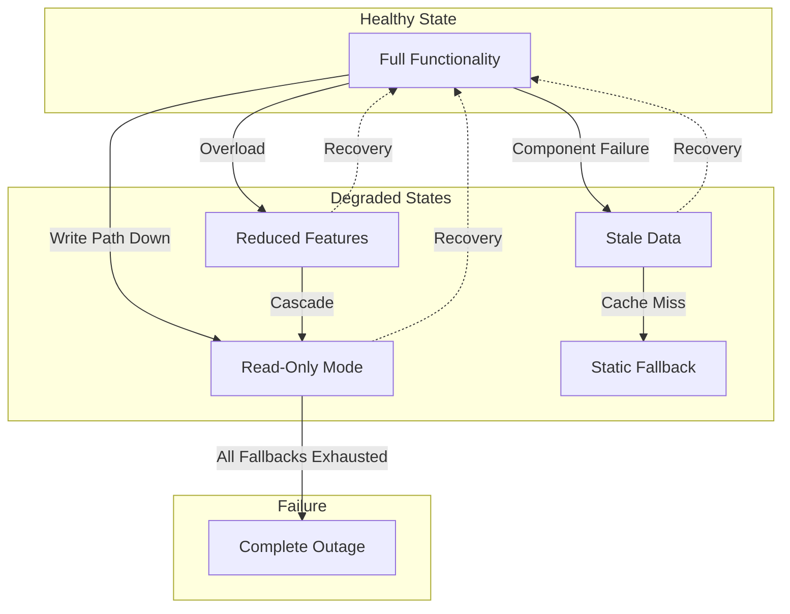
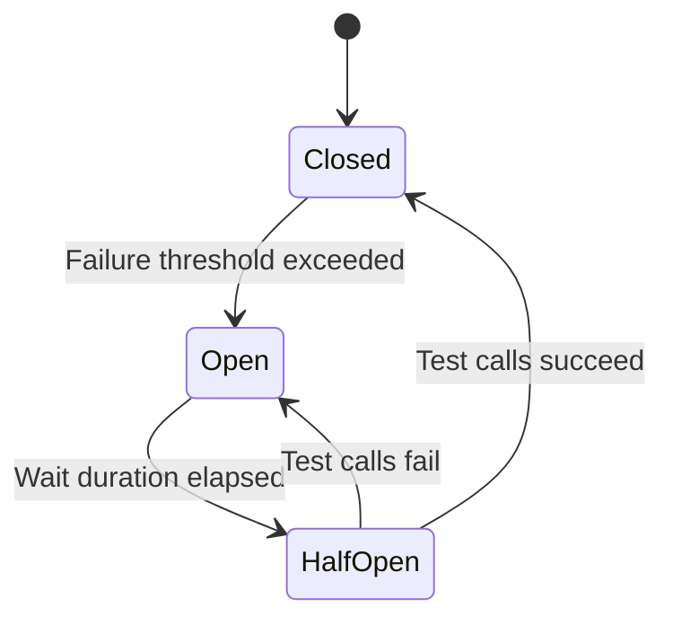
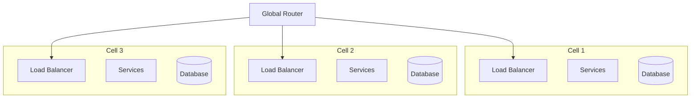
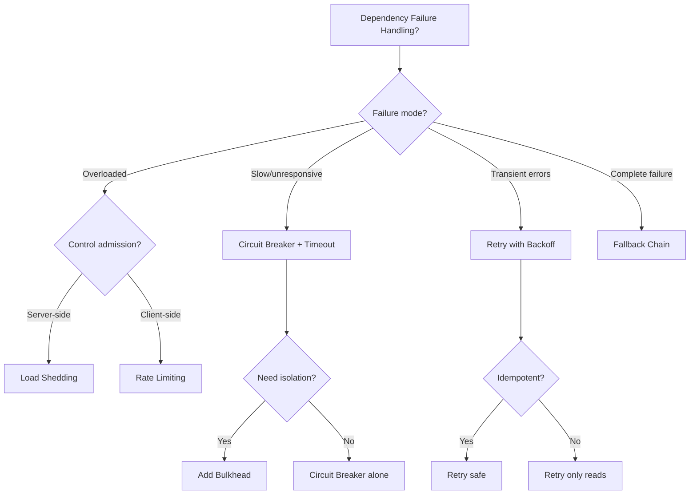
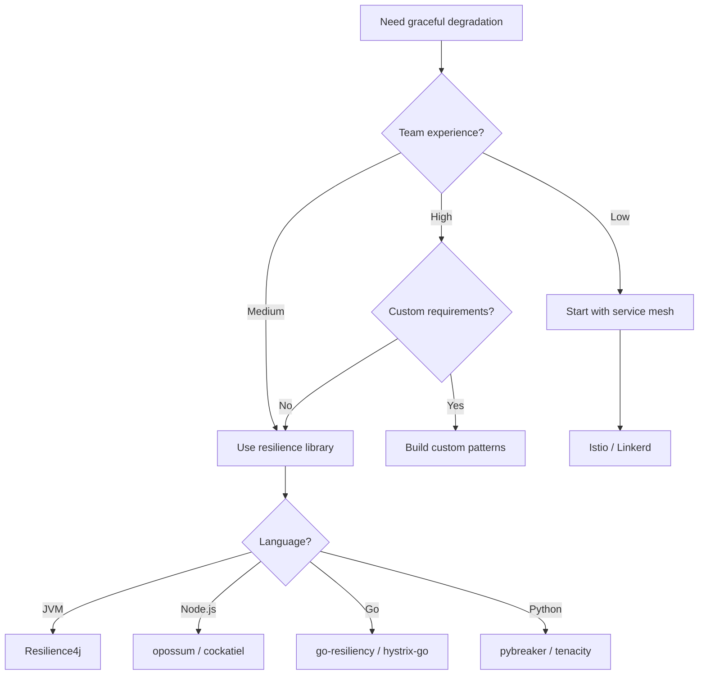

# Graceful Degradation

Graceful degradation is the discipline of designing distributed systems that maintain partial functionality when components fail, rather than collapsing entirely. The core insight: a system serving degraded responses to all users is preferable to one returning errors to most users. This article covers the pattern variants, implementation trade-offs, and production strategies that separate resilient systems from fragile ones.

<figure>



<figcaption>Graceful degradation creates multiple intermediate states between full health and complete failure, with recovery paths back to normal operation.</figcaption>
</figure>

## Abstract

Graceful degradation transforms hard dependencies into soft dependencies through a hierarchy of fallback behaviors. The mental model:

1. **Degradation Hierarchy**: Systems define ordered fallback states—from full functionality through progressively simpler modes down to static responses—each trading capability for availability
2. **Failure Isolation**: Patterns like circuit breakers, bulkheads, and timeouts contain failures to prevent cascade propagation across service boundaries
3. **Load Management**: Admission control and load shedding protect system capacity by rejecting excess work early, keeping latency acceptable for admitted requests
4. **Recovery Coordination**: Backoff with jitter prevents thundering herd on recovery; retry budgets cap amplification during degraded states

The key design tension: aggressive fallbacks improve availability but may serve stale or incomplete data. Conservative fallbacks preserve correctness but risk cascade failures. Production systems typically err toward availability, with explicit SLOs defining acceptable staleness.

## The Problem

### Why Naive Approaches Fail

**Approach 1: Fail-Fast Everything**

Returning errors immediately when any dependency is unavailable seems honest, but propagates failures upstream. A single slow database query can cascade through dozens of dependent services, each timing out and returning errors to their callers.

**Approach 2: Infinite Retries**

Retrying failed requests until they succeed appears resilient, but creates retry storms. If a service handles 10,000 requests per second and fails for 10 seconds, naive retries generate 100,000+ additional requests, overwhelming any recovery attempt.

**Approach 3: Long Timeouts**

Setting generous timeouts (30+ seconds) to "wait for things to recover" exhausts connection pools and threads. A service with 100 threads and 30-second timeouts can only handle 3.3 requests/second during a slowdown—a 1000x capacity reduction.

### The Core Challenge

Distributed systems face a fundamental tension: **availability versus correctness**. When a dependency fails, you must choose between:

- Returning an error (correct but unavailable)
- Returning stale/incomplete data (available but potentially incorrect)
- Blocking until recovery (neither available nor responsive)

Graceful degradation provides a framework for making this choice deliberately, with explicit trade-offs documented in SLOs.

## Pattern Overview

### Core Mechanism

Graceful degradation works by defining a **degradation hierarchy**—an ordered list of fallback behaviors activated as failures accumulate:

| Level | State       | Behavior                      | Trade-off                      |
| ----- | ----------- | ----------------------------- | ------------------------------ |
| 0     | Healthy     | Full functionality            | None                           |
| 1     | Degraded    | Serve cached/stale data       | Staleness vs availability      |
| 2     | Limited     | Disable non-critical features | Functionality vs stability     |
| 3     | Minimal     | Read-only mode                | Writes lost vs reads preserved |
| 4     | Static      | Return default responses      | Personalization vs uptime      |
| 5     | Unavailable | Return error                  | Complete failure               |

Each level represents an explicit trade-off. The system progresses through levels only when lower levels become untenable.

### Key Invariants

1. **Monotonic Degradation**: Systems move through degradation levels in order; skipping from healthy to unavailable without intermediate states indicates missing fallbacks
2. **Bounded Impact**: Any single component failure affects only the features depending on that component; unrelated functionality continues normally
3. **Explicit Recovery**: Systems don't automatically return to healthy state—circuit breakers test recovery, and operators may gate full restoration

### Failure Modes

| Failure           | Impact                                            | Mitigation                                    |
| ----------------- | ------------------------------------------------- | --------------------------------------------- |
| Cascade failure   | One service failure propagates to all dependents  | Circuit breakers, timeouts, bulkheads         |
| Retry storm       | Failed requests amplified by retries              | Exponential backoff, jitter, retry budgets    |
| Thundering herd   | Simultaneous recovery overwhelms system           | Staggered recovery, jitter on first request   |
| Stale data served | Users see outdated information                    | TTL limits, staleness indicators in UI        |
| Split brain       | Different servers in different degradation states | Centralized health checks, consensus on state |

## Design Paths

### Path 1: Circuit Breaker Pattern

**When to choose this path:**

- Dependencies have distinct failure modes (timeout, error, slow)
- You need automatic recovery detection
- Service mesh or library support available

**Key characteristics:**

The circuit breaker monitors call success rates and "trips" when failures exceed a threshold, preventing further calls to a failing service. This gives the dependency time to recover without continued load.

**Three states:**



- **Closed**: Normal operation, requests pass through, failures tracked
- **Open**: Requests fail immediately without calling dependency
- **Half-Open**: Limited test requests probe for recovery

**Implementation approach:**

```typescript title="circuit-breaker.ts" collapse={1-5, 35-50}
import { EventEmitter } from "events"

type CircuitState = "closed" | "open" | "half-open"

interface CircuitBreakerConfig {
  failureThreshold: number // Failures before opening (e.g., 5)
  successThreshold: number // Successes to close (e.g., 2)
  timeout: number // Time in open state (e.g., 30000ms)
  monitorWindow: number // Sliding window size (e.g., 10)
}

class CircuitBreaker {
  private state: CircuitState = "closed"
  private failures = 0
  private successes = 0
  private lastFailureTime = 0

  async execute<T>(fn: () => Promise<T>): Promise<T> {
    if (this.state === "open") {
      if (Date.now() - this.lastFailureTime > this.config.timeout) {
        this.state = "half-open"
        this.successes = 0
      } else {
        throw new CircuitOpenError("Circuit is open")
      }
    }

    try {
      const result = await fn()
      this.onSuccess()
      return result
    } catch (error) {
      this.onFailure()
      throw error
    }
  }

  private onSuccess(): void {
    this.failures = 0
    if (this.state === "half-open") {
      this.successes++
      if (this.successes >= this.config.successThreshold) {
        this.state = "closed"
      }
    }
  }

  private onFailure(): void {
    this.failures++
    this.lastFailureTime = Date.now()
    if (this.failures >= this.config.failureThreshold) {
      this.state = "open"
    }
  }
}
```

**Production configuration (Resilience4j):**

| Parameter                               | Typical Value | Rationale                                   |
| --------------------------------------- | ------------- | ------------------------------------------- |
| `failureRateThreshold`                  | 50%           | Opens when half of recorded calls fail      |
| `slidingWindowSize`                     | 10-20 calls   | Enough samples for statistical significance |
| `minimumNumberOfCalls`                  | 5             | Don't trip on first few failures            |
| `waitDurationInOpenState`               | 10-30s        | Time for dependency to recover              |
| `permittedNumberOfCallsInHalfOpenState` | 2-3           | Enough probes to confirm recovery           |

**Real-world example: Netflix Hystrix**

Netflix pioneered circuit breakers at scale, processing tens of billions of thread-isolated calls daily. Their key insight: the circuit breaker's fallback must be simpler than the primary path.

> "The fallback is for giving users a reasonable response when the circuit is open. It shouldn't try to be clever—a simple cached value or default is better than complex retry logic." — Netflix Tech Blog

Hystrix is now in maintenance mode; Netflix recommends Resilience4j for new projects, which uses a functional composition model:

```java title="Resilience4jExample.java" collapse={1-8, 18-25}
import io.github.resilience4j.circuitbreaker.CircuitBreaker;
import io.github.resilience4j.circuitbreaker.CircuitBreakerConfig;
import io.vavr.control.Try;

import java.time.Duration;
import java.util.function.Supplier;

// Configuration
CircuitBreakerConfig config = CircuitBreakerConfig.custom()
    .failureRateThreshold(50)
    .waitDurationInOpenState(Duration.ofSeconds(10))
    .slidingWindowSize(10)
    .minimumNumberOfCalls(5)
    .permittedNumberOfCallsInHalfOpenState(3)
    .build();

CircuitBreaker circuitBreaker = CircuitBreaker.of("userService", config);

// Usage - functional composition
Supplier<User> decoratedSupplier = CircuitBreaker
    .decorateSupplier(circuitBreaker, () -> userService.getUser(userId));

Try<User> result = Try.ofSupplier(decoratedSupplier)
    .recover(throwable -> getCachedUser(userId));  // Fallback
```

**Trade-offs vs other paths:**

| Aspect             | Circuit Breaker               | Timeout Only      | Retry Only           |
| ------------------ | ----------------------------- | ----------------- | -------------------- |
| Failure detection  | Automatic (threshold)         | Per-request       | None                 |
| Recovery detection | Automatic (half-open)         | Manual            | None                 |
| Overhead           | State tracking per dependency | Minimal           | Minimal              |
| Configuration      | Multiple parameters           | Single timeout    | Retry count, backoff |
| Best for           | Unstable dependencies         | Slow dependencies | Transient failures   |

### Path 2: Load Shedding

**When to choose this path:**

- System receives traffic spikes beyond capacity
- Some requests are more important than others
- You control the server-side admission logic

**Key characteristics:**

Load shedding rejects excess requests _before_ they consume resources, keeping latency acceptable for admitted requests. The key insight from AWS:

> "The goal is to keep serving good latencies to the requests you do accept, rather than serving bad latencies to all requests." — AWS Builders' Library

**Implementation approaches:**

**Server-side admission control:**

```typescript title="load-shedder.ts" collapse={1-3, 30-45}
import { Request, Response, NextFunction } from "express"

interface LoadShedderConfig {
  maxConcurrent: number // Max concurrent requests
  maxQueueSize: number // Max waiting requests
  priorityHeader: string // Header indicating request priority
}

class LoadShedder {
  private currentRequests = 0
  private queueSize = 0

  middleware = (req: Request, res: Response, next: NextFunction) => {
    const priority = this.getPriority(req)
    const capacity = this.getAvailableCapacity()

    // High priority: always admit if any capacity
    // Low priority: only admit if significant capacity
    const threshold = priority === "high" ? 0 : 0.3

    if (capacity < threshold) {
      res.status(503).header("Retry-After", "5").send("Service overloaded")
      return
    }

    this.currentRequests++
    res.on("finish", () => this.currentRequests--)
    next()
  }

  private getPriority(req: Request): "high" | "low" {
    // Payment endpoints are always high priority
    if (req.path.includes("/checkout") || req.path.includes("/payment")) {
      return "high"
    }
    return (req.headers[this.config.priorityHeader] as "high" | "low") ?? "low"
  }

  private getAvailableCapacity(): number {
    return 1 - this.currentRequests / this.config.maxConcurrent
  }
}
```

**Priority-based shedding:**

| Priority | Shed When Capacity Below | Examples                           |
| -------- | ------------------------ | ---------------------------------- |
| Critical | 0% (never shed)          | Health checks, payment processing  |
| High     | 20%                      | User-facing reads, search          |
| Medium   | 40%                      | Background syncs, analytics events |
| Low      | 60%                      | Batch jobs, reports, prefetching   |

**Real-world example: Shopify**

Shopify handles 100x traffic spikes during flash sales by shedding non-essential features:

- **Always preserved**: Checkout, payment processing, order confirmation
- **Shed early**: Product recommendations, recently viewed, wish lists
- **Shed under load**: Search suggestions, inventory counts, shipping estimates

> "Our pod model means each merchant's traffic is isolated. But within a pod, we have explicit rules: checkout never degrades. Everything else can pause." — Shopify Engineering

**Real-world example: Google GFE**

Google's Global Front End (GFE) implements multi-tier admission control:

1. **Connection limits**: Cap TCP connections per client IP
2. **Request rate limits**: Per-user and per-API quotas
3. **Priority queues**: Critical traffic bypasses congestion
4. **Adaptive shedding**: Increase rejection rate as CPU approaches saturation

Google SRE recommends:

- **Per-request retry cap**: Maximum 3 attempts
- **Per-client retry budget**: Keep retries under 10% of normal traffic

**Trade-offs:**

| Aspect                | Load Shedding            | No Shedding              |
| --------------------- | ------------------------ | ------------------------ |
| Latency under load    | Stable for admitted      | Degrades for all         |
| Throughput under load | Maintained               | Collapses                |
| User experience       | Some see errors          | All see slow             |
| Implementation        | Requires priority scheme | Simpler                  |
| Capacity planning     | Can overprovision less   | Need headroom for spikes |

### Path 3: Bulkhead Pattern

**When to choose this path:**

- Multiple independent workloads share resources
- One workload's failure shouldn't affect others
- You need blast radius containment

**Key characteristics:**

Named after ship compartments that prevent a hull breach from sinking the entire vessel, bulkheads isolate failures to affected components.

**Implementation levels:**

| Level            | Isolation Unit                    | Use Case                   |
| ---------------- | --------------------------------- | -------------------------- |
| Thread pools     | Per-dependency thread pool        | Different latency profiles |
| Connection pools | Per-service connection limits     | Database isolation         |
| Process          | Separate processes/containers     | Complete memory isolation  |
| Cell             | Independent infrastructure stacks | Regional blast radius      |

**Thread pool isolation:**

```typescript title="bulkhead.ts" collapse={1-4, 30-40}
import { Worker } from "worker_threads"
import { Queue } from "./queue"

interface BulkheadConfig {
  maxConcurrent: number // Max parallel executions
  maxWait: number // Max queue time (ms)
  name: string // For metrics/logging
}

class Bulkhead {
  private executing = 0
  private queue: Queue<() => void> = new Queue()

  async execute<T>(fn: () => Promise<T>): Promise<T> {
    if (this.executing >= this.config.maxConcurrent) {
      if (this.queue.size >= this.config.maxConcurrent) {
        throw new BulkheadFullError(`${this.config.name} bulkhead full`)
      }
      await this.waitForCapacity()
    }

    this.executing++
    try {
      return await fn()
    } finally {
      this.executing--
      this.queue.dequeue()?.()
    }
  }

  private waitForCapacity(): Promise<void> {
    return new Promise((resolve, reject) => {
      const timeout = setTimeout(() => {
        reject(new BulkheadTimeoutError(`${this.config.name} wait timeout`))
      }, this.config.maxWait)

      this.queue.enqueue(() => {
        clearTimeout(timeout)
        resolve()
      })
    })
  }
}
```

**Real-world example: AWS Cell-Based Architecture**

AWS uses cell-based architecture for blast radius containment:



Each cell:

- Handles a subset of customers (often by customer ID hash)
- Has independent database, cache, and service instances
- Shares no state with other cells
- Can fail without affecting other cells

**Real-world example: Shopify Pod Model**

Shopify isolates each merchant into a "pod"—a fully independent slice with its own:

- MySQL primary and replicas
- Redis cluster
- Memcached nodes
- Background job workers

A pod failure affects only merchants in that pod, not the entire platform.

**Trade-offs:**

| Aspect                 | Bulkhead               | Shared Resources |
| ---------------------- | ---------------------- | ---------------- |
| Resource efficiency    | Lower (duplication)    | Higher           |
| Blast radius           | Contained              | System-wide      |
| Operational complexity | Higher (more units)    | Lower            |
| Cost                   | Higher                 | Lower            |
| Recovery time          | Faster (smaller scope) | Slower           |

### Path 4: Timeout and Retry Strategy

**When to choose this path:**

- Failures are transient (network blips, temporary overload)
- Idempotent operations (safe to retry)
- Acceptable latency budget for retries

**Key characteristics:**

Timeouts prevent resource exhaustion from slow dependencies. Retries handle transient failures. Combined poorly, they create retry storms. Combined well, they provide resilience without amplification.

**Timeout configuration:**

Start with P99.9 latency plus 20-30% buffer:

| Metric        | Value | Timeout            |
| ------------- | ----- | ------------------ |
| P50 latency   | 20ms  | —                  |
| P90 latency   | 80ms  | —                  |
| P99 latency   | 300ms | —                  |
| P99.9 latency | 800ms | 1000ms (800 + 25%) |

**Retry with exponential backoff and jitter:**

```typescript title="retry.ts" collapse={1-2, 25-35}
interface RetryConfig {
  maxAttempts: number // Total attempts (including first)
  baseDelay: number // Initial delay (ms)
  maxDelay: number // Cap on delay (ms)
  jitterFactor: number // 0-1, randomness factor
}

async function retryWithBackoff<T>(fn: () => Promise<T>, config: RetryConfig): Promise<T> {
  let lastError: Error

  for (let attempt = 0; attempt < config.maxAttempts; attempt++) {
    try {
      return await fn()
    } catch (error) {
      lastError = error
      if (attempt < config.maxAttempts - 1) {
        const delay = calculateDelay(attempt, config)
        await sleep(delay)
      }
    }
  }

  throw lastError
}

function calculateDelay(attempt: number, config: RetryConfig): number {
  // Exponential: baseDelay * 2^attempt
  const exponential = config.baseDelay * Math.pow(2, attempt)
  // Cap at maxDelay
  const capped = Math.min(exponential, config.maxDelay)
  // Add jitter: multiply by random factor between (1 - jitter) and (1 + jitter)
  const jitter = 1 + (Math.random() * 2 - 1) * config.jitterFactor
  return Math.floor(capped * jitter)
}
```

**Why jitter matters:**

Without jitter, all clients retry at the same intervals, creating synchronized spikes:

```
Time:     0s    1s    2s    4s    8s
Client A: X     R     R     R     R
Client B: X     R     R     R     R
Client C: X     R     R     R     R
          ↓     ↓     ↓     ↓     ↓
Load:     3     3     3     3     3  (spikes)
```

With jitter, retries spread across time:

```
Time:     0s    1s    2s    3s    4s    5s
Client A: X     R           R
Client B: X           R              R
Client C: X        R              R
          ↓     ↓  ↓  ↓     ↓     ↓  ↓
Load:     3     1  1  1     1     1  1  (distributed)
```

**Jitter the first request too:**

Sophie Bits (Cloudflare) notes that even the first request needs jitter when many clients start simultaneously (deployment, recovery):

```typescript
// Before making the first request
await sleep(Math.random() * initialJitterWindow)
```

**Retry budgets (Google SRE approach):**

Instead of per-request retry limits, track retries as a percentage of traffic:

```typescript title="retry-budget.ts" collapse={1-3}
class RetryBudget {
  private requestCount = 0
  private retryCount = 0
  private readonly budgetPercent = 0.1 // 10% of traffic

  canRetry(): boolean {
    // Allow retry only if retries are under budget
    return this.retryCount < this.requestCount * this.budgetPercent
  }

  recordRequest(): void {
    this.requestCount++
  }

  recordRetry(): void {
    this.retryCount++
  }

  // Reset counters periodically (e.g., every minute)
  reset(): void {
    this.requestCount = 0
    this.retryCount = 0
  }
}
```

**Production configuration:**

| Parameter     | Value  | Rationale                    |
| ------------- | ------ | ---------------------------- |
| Max attempts  | 3      | Diminishing returns beyond 3 |
| Base delay    | 100ms  | Fast enough for user-facing  |
| Max delay     | 30-60s | Prevent indefinite waits     |
| Jitter factor | 0.5    | 50% randomness spreads load  |
| Retry budget  | 10%    | Caps amplification           |

**Trade-offs:**

| Aspect                     | Aggressive Retries | Conservative Retries |
| -------------------------- | ------------------ | -------------------- |
| Transient failure recovery | Better             | Worse                |
| Amplification risk         | Higher             | Lower                |
| User-perceived latency     | Variable           | Predictable          |
| Resource consumption       | Higher             | Lower                |

### Path 5: Fallback Strategies

**When to choose this path:**

- Some response is better than no response
- Acceptable to serve stale or simplified data
- Clear degradation hierarchy defined

**Key characteristics:**

Fallbacks define what to return when the primary path fails. The hierarchy typically follows: fresh data → cached data → default data → error.

**Fallback hierarchy:**

```typescript title="fallback-chain.ts" collapse={1-4, 35-50}
interface FallbackChain<T> {
  primary: () => Promise<T>
  fallbacks: Array<{
    name: string
    fn: () => Promise<T>
    condition?: (error: Error) => boolean
  }>
  default: T
}

async function executeWithFallbacks<T>(chain: FallbackChain<T>): Promise<{
  result: T
  source: string
  degraded: boolean
}> {
  // Try primary
  try {
    return { result: await chain.primary(), source: "primary", degraded: false }
  } catch (primaryError) {
    // Try fallbacks in order
    for (const fallback of chain.fallbacks) {
      if (fallback.condition && !fallback.condition(primaryError)) {
        continue
      }
      try {
        const result = await fallback.fn()
        return { result, source: fallback.name, degraded: true }
      } catch {
        // Continue to next fallback
      }
    }
    // All fallbacks failed, return default
    return { result: chain.default, source: "default", degraded: true }
  }
}

// Usage example
const productChain: FallbackChain<Product> = {
  primary: () => productService.getProduct(id),
  fallbacks: [
    { name: "cache", fn: () => cache.get(`product:${id}`) },
    { name: "cdn", fn: () => cdnCache.getProduct(id) },
  ],
  default: { id, name: "Product Unavailable", price: null },
}
```

**Common fallback patterns:**

| Pattern             | Use Case                     | Trade-off               |
| ------------------- | ---------------------------- | ----------------------- |
| Cached data         | Read-heavy workloads         | Staleness               |
| Default values      | Configuration, feature flags | Loss of personalization |
| Simplified response | Complex aggregations         | Incomplete data         |
| Read-only mode      | Write path failures          | No updates              |
| Static content      | Complete backend failure     | No dynamic data         |

**Real-world example: Netflix Recommendations**

When Netflix's recommendation service is slow or unavailable:

1. **Primary**: Personalized recommendations from ML pipeline
2. **Fallback 1**: Cached recommendations (updated hourly)
3. **Fallback 2**: Popular content in user's region
4. **Fallback 3**: Globally popular content
5. **Default**: Static "Trending Now" list

The UI doesn't change—users see recommendations regardless of which tier served them.

**Real-world example: Feature Flag Fallbacks**

PostHog improved feature flag resilience by implementing local evaluation:

- **Primary**: Real-time flag evaluation via API (500ms latency)
- **Fallback**: Local evaluation with cached definitions (10-20ms)
- **Default**: Hard-coded default values

Result: Flags work even if PostHog's servers are unreachable.

**Trade-offs:**

| Aspect                    | Rich Fallbacks      | Simple Fallbacks  |
| ------------------------- | ------------------- | ----------------- |
| User experience           | Better degraded UX  | Worse degraded UX |
| Implementation complexity | Higher              | Lower             |
| Testing burden            | Higher (more paths) | Lower             |
| Cache infrastructure      | Required            | Optional          |
| Staleness risk            | Higher              | Lower             |

### Decision Framework



## Production Implementations

### Netflix: Resilience Library Evolution

**Context:** Netflix serves 200M+ subscribers with hundreds of microservices. A single page load touches dozens of services.

**Implementation evolution:**

1. **2011-2012**: Hystrix developed internally
2. **2012**: Hystrix open-sourced, became industry standard
3. **2018**: Hystrix enters maintenance mode
4. **2019+**: Resilience4j recommended for new projects

**Why the transition?**

Hystrix was designed for Java 6/7 with thread pool isolation as the primary mechanism. Resilience4j uses:

- Java 8 functional composition
- Lighter weight (only Vavr dependency)
- Composable decorators (stack circuit breaker + rate limiter + retry)
- Better metrics integration

**Key learnings from Netflix:**

> "Invest more in making your primary code reliable than in building elaborate fallbacks. A fallback you've never tested in production is a fallback that doesn't work."

**Specific metrics:**

- Hystrix processed tens of billions of thread-isolated calls daily
- Hundreds of billions of semaphore-isolated calls daily
- Circuit breaker trip rate: target < 0.1% during normal operation

### AWS: Cell-Based Architecture

**Context:** AWS services must maintain regional isolation—a failure in us-east-1 shouldn't affect eu-west-1.

**Implementation:**

- Each cell is an independent stack (compute, storage, networking)
- Cells share no state; each has own database
- Shuffle sharding maps customers to multiple cells, minimizing correlated failures
- Global routing layer directs traffic to healthy cells

**Configuration:**

- Cell size: 1-5% of total capacity per cell
- Minimum cells: 3 per region for redundancy
- Health check interval: 5-10 seconds
- Failover time: < 60 seconds

**Results:**

- Blast radius limited to cell size (1-5% of customers)
- Regional failures don't cascade globally
- Recovery is cell-by-cell, not all-or-nothing

### Slack: CI/CD Circuit Breakers

**Context:** Slack's CI/CD pipeline had cascading failures between systems, causing developer frustration.

**Implementation:**

Slack's Checkpoint system implements orchestration-level circuit breakers:

1. **Metrics collection**: Error rates, latency percentiles, queue depths
2. **Awareness phase**: Alert teams when error rates rise (before tripping)
3. **Trip decision**: Automated trip when thresholds exceeded
4. **Recovery**: Gradual traffic increase after manual verification

**Results (since 2020):**

- No cascading failures between CI/CD systems
- Increased service availability
- Fewer flaky developer experiences

> "The key insight was sharing visibility _before_ opening the circuit. Teams get a heads-up that their system is approaching the threshold, often fixing issues before the breaker trips."

### Shopify: Pod-Based Isolation

**Context:** Shopify handles 30TB+ data per minute during peak sales, with 100x traffic spikes.

**Implementation:**

- **Pod model**: Each merchant assigned to a pod
- **Pod contents**: Dedicated MySQL, Redis, Memcached, workers
- **Graceful degradation rules**:
  - Checkout: Never degrades
  - Cart: Degrades last
  - Recommendations: First to shed
  - Inventory counts: Can show stale data

**Tools:**

- **Toxiproxy**: Simulates network failures before production
- **Packwerk**: Enforces module boundaries in monolith

**Results:**

- Flash sales handled without checkout degradation
- Merchant isolation prevents noisy neighbor problems
- Predictable performance under load

### Discord: Backpressure and Coalescing

**Context:** Discord handles 1M+ push requests per minute with extreme traffic spikes during gaming events.

**Implementation:**

- **GenStage (Elixir)**: Built-in backpressure for message processing
- **Request coalescing**: Deduplicate identical requests in Rust services
- **Consistent hash routing**: Same requests route to same servers, improving deduplication

**Results:**

- Eliminated hot partitions
- Stable latencies during 100x spikes
- Fewer on-call emergencies

## Implementation Guide

### Starting Point Decision



### Library Options

| Library       | Language     | Patterns                         | Maturity   | Notes                        |
| ------------- | ------------ | -------------------------------- | ---------- | ---------------------------- |
| Resilience4j  | Java/Kotlin  | CB, Retry, Bulkhead, RateLimiter | Production | Netflix recommended          |
| Polly         | .NET         | CB, Retry, Timeout, Bulkhead     | Production | Extensive policy composition |
| opossum       | Node.js      | Circuit Breaker                  | Production | Simple, well-tested          |
| cockatiel     | Node.js      | CB, Retry, Timeout, Bulkhead     | Production | TypeScript-first             |
| go-resiliency | Go           | CB, Retry, Semaphore             | Production | Simple, idiomatic Go         |
| Istio         | Service Mesh | CB, Retry, Timeout               | Production | No code changes, YAML config |

### Service Mesh Configuration (Istio)

```yaml title="istio-destination-rule.yaml"
apiVersion: networking.istio.io/v1beta1
kind: DestinationRule
metadata:
  name: user-service
spec:
  host: user-service
  trafficPolicy:
    connectionPool:
      tcp:
        maxConnections: 100
      http:
        h2UpgradePolicy: UPGRADE
        http1MaxPendingRequests: 100
        http2MaxRequests: 1000
    outlierDetection:
      consecutive5xxErrors: 5
      interval: 30s
      baseEjectionTime: 30s
      maxEjectionPercent: 50
```

```yaml title="istio-virtual-service.yaml" collapse={1-8}
apiVersion: networking.istio.io/v1beta1
kind: VirtualService
metadata:
  name: user-service
spec:
  hosts:
    - user-service
  http:
    - route:
        - destination:
            host: user-service
      timeout: 5s
      retries:
        attempts: 3
        perTryTimeout: 2s
        retryOn: 5xx,reset,connect-failure
```

### Implementation Checklist

- [ ] **Define degradation hierarchy**: Document each level and its trade-offs
- [ ] **Identify critical paths**: Which features must never degrade?
- [ ] **Set timeout SLOs**: Based on P99.9 + buffer, not arbitrary values
- [ ] **Configure circuit breakers**: Tune thresholds for your traffic patterns
- [ ] **Implement fallbacks**: Test that they actually work under failure
- [ ] **Add retry budgets**: Prevent amplification (< 10% of traffic)
- [ ] **Instrument everything**: Metrics for each degradation level
- [ ] **Test failure modes**: Chaos engineering before production incidents
- [ ] **Document recovery procedures**: How to verify system is healthy

## Common Pitfalls

### 1. Untested Fallbacks

**The mistake:** Building fallback paths that are never exercised in production.

**Example:** A team builds an elaborate cache fallback for their user service. In production, the cache is always warm, so the fallback code path is never executed. When the cache fails during an incident, the fallback has a bug that causes a null pointer exception.

**Solutions:**

- Chaos engineering: Regularly fail dependencies in production
- Fallback testing: Exercise fallback paths in staging/canary
- Synthetic monitoring: Periodically call fallback paths directly

### 2. Synchronous Retry Storms

**The mistake:** Retrying immediately without backoff or jitter.

**Example:** A service has 10,000 clients. The database has a 1-second outage. Without jitter, all 10,000 clients retry at exactly 1 second, then 2 seconds, then 4 seconds—creating synchronized spikes that prevent recovery.

**Solutions:**

- Always use exponential backoff with jitter
- Implement retry budgets (< 10% of traffic)
- Jitter the first request after deployment/restart

### 3. Circuit Breaker Thrashing

**The mistake:** Circuit breaker opens and closes rapidly, worse than no breaker.

**Example:** A circuit breaker with `failureThreshold=2` and `successThreshold=1` trips after two failures, closes after one success, trips again immediately. The constant state changes create overhead without providing stability.

**Solutions:**

- Increase `minimumNumberOfCalls` (at least 5-10)
- Use sliding window for failure rate, not raw counts
- Extend `waitDurationInOpenState` to allow real recovery
- Require multiple successes in half-open state

### 4. Stale Data Without Indication

**The mistake:** Serving cached data without indicating staleness to users.

**Example:** A stock trading app falls back to cached prices during an outage. Users see prices from 30 minutes ago but think they're current, making trades based on stale data.

**Solutions:**

- Show "as of" timestamps prominently
- Visual indicators for degraded state (yellow banner, icon)
- Disable actions that require fresh data (trading, purchasing)
- Set TTL limits on how stale data can be served

### 5. Missing Bulkheads

**The mistake:** Sharing thread pools/connection pools across all dependencies.

**Example:** Service A has 100 threads. Dependency B becomes slow (10s response time). All 100 threads block on B. Dependency C (healthy) becomes unreachable because no threads are available—a slow dependency causes total failure.

**Solutions:**

- Separate thread pools per dependency
- Connection pool limits per downstream service
- Semaphore isolation for fast dependencies
- Thread pool isolation for slow/risky dependencies

### 6. Load Shedding Without Priority

**The mistake:** Shedding requests randomly instead of by priority.

**Example:** Under load, a checkout service sheds 50% of requests randomly. Half of payment confirmations are lost, causing customer support incidents. Meanwhile, prefetch requests for thumbnails continue consuming capacity.

**Solutions:**

- Define priority tiers (critical, high, medium, low)
- Shed lowest priority first
- Never shed critical paths (payments, health checks)
- Tag requests with priority at entry point

## Conclusion

Graceful degradation is not a single pattern but a discipline: designing systems with explicit failure modes, testing those modes regularly, and accepting that partial functionality serves users better than complete outages.

The most resilient systems share these characteristics:

- **Degradation hierarchy is documented**: Teams know exactly what fails first and what never fails
- **Fallbacks are tested**: Chaos engineering proves fallbacks work before incidents
- **Amplification is controlled**: Retry budgets and jitter prevent self-inflicted outages
- **Blast radius is contained**: Bulkheads ensure one failure doesn't become total failure

Start simple—timeouts and circuit breakers cover most cases. Add complexity (load shedding, cell architecture) only when scale demands it.

## Appendix

### Prerequisites

- Distributed systems fundamentals (network partitions, CAP theorem)
- Service-oriented architecture concepts
- Basic understanding of observability (metrics, traces, logs)

### Terminology

- **Blast Radius**: The scope of impact when a component fails—smaller is better
- **Bulkhead**: Isolation boundary preventing failures from spreading
- **Circuit Breaker**: Pattern that stops calling a failing dependency after threshold exceeded
- **Degradation Hierarchy**: Ordered list of fallback behaviors from full to minimal functionality
- **Jitter**: Random variation added to timing to prevent synchronized behavior
- **Load Shedding**: Rejecting excess requests to maintain latency for admitted requests
- **Retry Budget**: Cap on retries as percentage of normal traffic (typically 10%)
- **Thundering Herd**: Many clients simultaneously retrying or reconnecting after an outage

### Summary

- Graceful degradation defines explicit intermediate states between healthy and failed, with documented trade-offs at each level
- Circuit breakers prevent cascade failures by stopping calls to failing dependencies; tune thresholds based on traffic patterns, not defaults
- Load shedding protects capacity by rejecting low-priority work early; define priority tiers and never shed critical paths
- Bulkheads contain blast radius through isolation (thread pools, cells, pods); the trade-off is resource duplication
- Retries need exponential backoff with jitter plus retry budgets (< 10%) to prevent amplification
- Fallbacks must be tested regularly through chaos engineering—untested fallbacks don't work when needed

### References

**Foundational Resources:**

- [AWS Well-Architected Framework: Reliability Pillar](https://docs.aws.amazon.com/wellarchitected/latest/reliability-pillar/welcome.html) - Graceful degradation best practices
- [Google SRE Book: Handling Overload](https://sre.google/sre-book/handling-overload/) - Load shedding and admission control
- [Release It! Second Edition](https://pragprog.com/titles/mnee2/release-it-second-edition/) by Michael Nygard - Stability patterns including circuit breakers and bulkheads

**Pattern Implementations:**

- [Netflix Tech Blog: Introducing Hystrix](http://techblog.netflix.com/2012/11/hystrix.html) - Original circuit breaker at scale
- [Resilience4j Documentation](https://resilience4j.readme.io/docs/circuitbreaker) - Modern resilience library
- [AWS Builders' Library: Using Load Shedding](https://aws.amazon.com/builders-library/using-load-shedding-to-avoid-overload/) - Server-side admission control
- [AWS Builders' Library: Timeouts, Retries, and Backoff with Jitter](https://aws.amazon.com/builders-library/timeouts-retries-and-backoff-with-jitter/) - Retry strategy design

**Production Case Studies:**

- [Slack Engineering: Circuit Breakers for CI/CD](https://slack.engineering/circuit-breakers/) - Orchestration-level resilience
- [Discord: How Discord Stores Trillions of Messages](https://discord.com/blog/how-discord-stores-trillions-of-messages) - Backpressure and coalescing
- [AWS: Cell-Based Architecture](https://docs.aws.amazon.com/wellarchitected/latest/reducing-scope-of-impact-with-cell-based-architecture/what-is-a-cell-based-architecture.html) - Blast radius containment

**Failure Analysis:**

- [Microsoft Azure: Retry Storm Antipattern](https://learn.microsoft.com/en-us/azure/architecture/antipatterns/retry-storm/) - Retry amplification
- [Encore: Thundering Herd Problem](https://encore.dev/blog/thundering-herd-problem) - Recovery coordination
- [InfoQ: Anatomy of a Cascading Failure](https://www.infoq.com/articles/anatomy-cascading-failure/) - Failure propagation mechanisms
