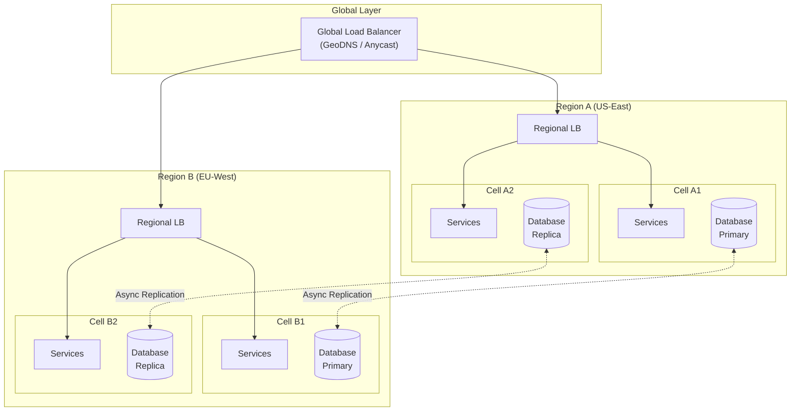
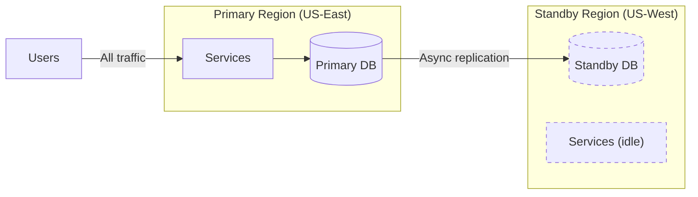
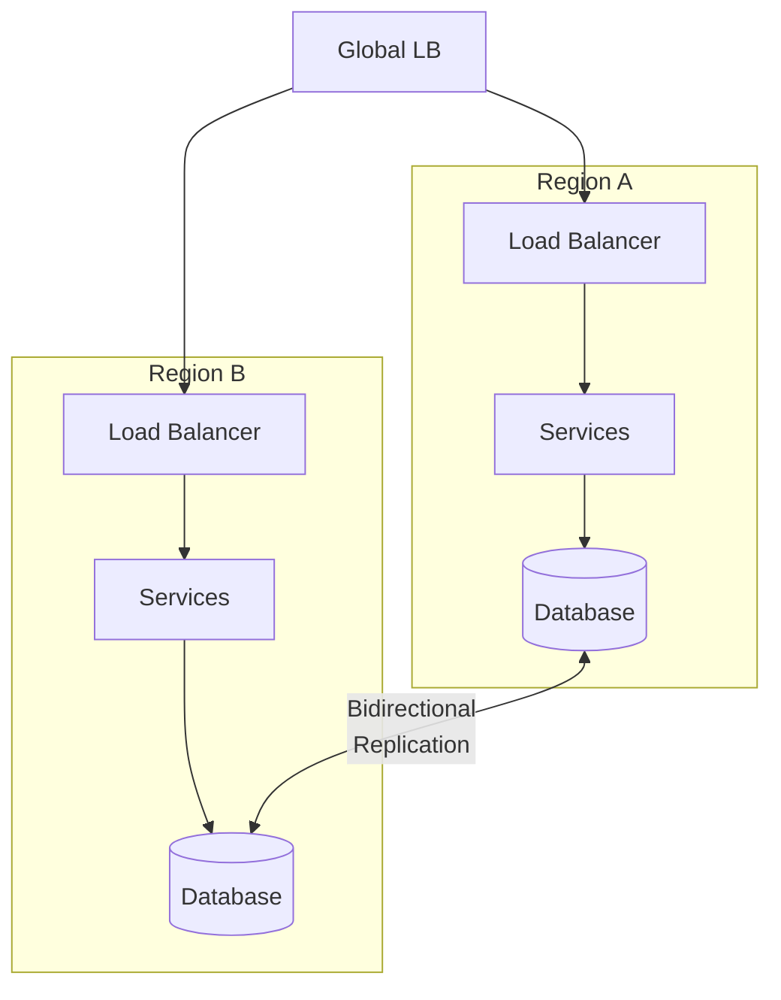
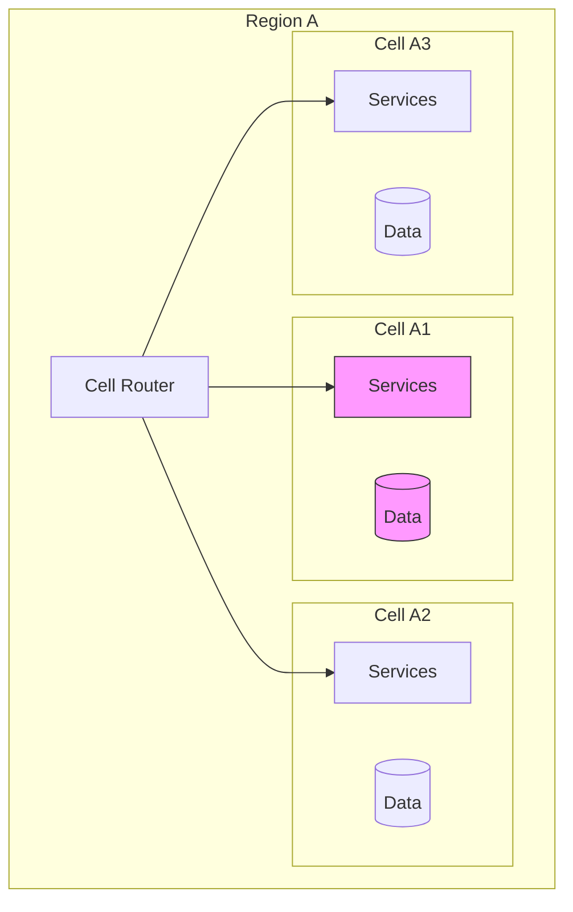
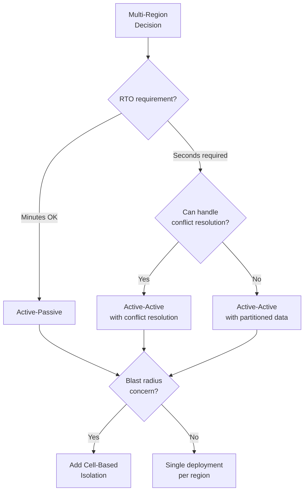
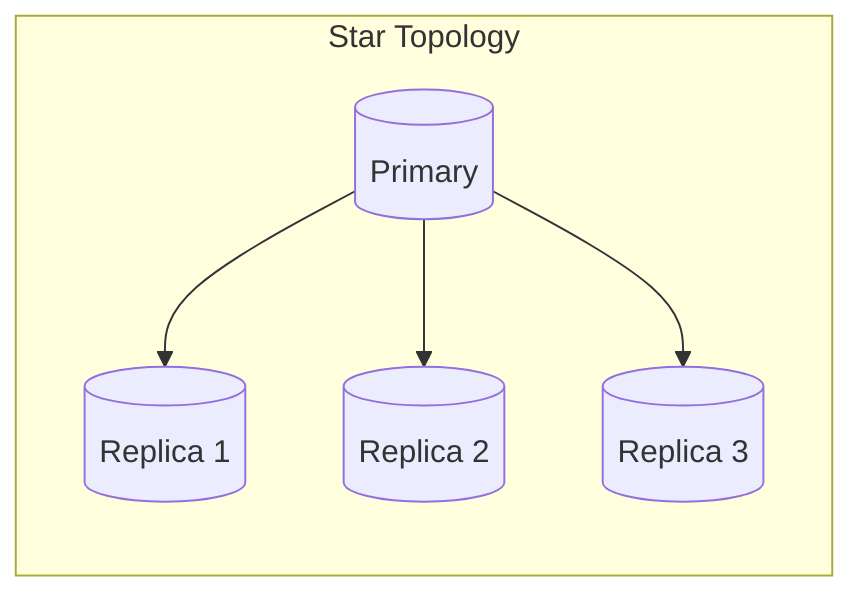
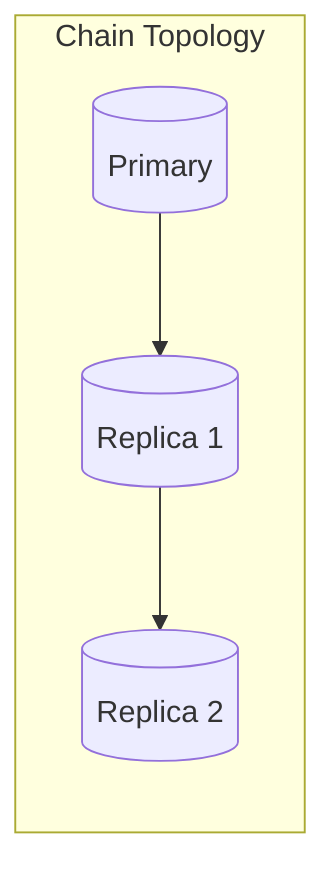
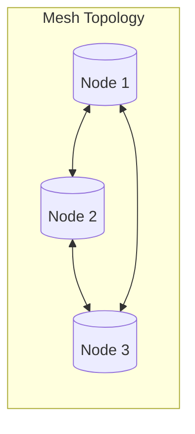

# Multi-Region Architecture

Building systems that span multiple geographic regions to achieve lower latency, higher availability, and regulatory compliance. This article covers the design paths—active-passive, active-active, and cell-based architectures—along with production implementations from Netflix, Slack, and Uber, data replication strategies, conflict resolution approaches, and the operational complexity trade-offs that determine which pattern fits your constraints.

<figure>



<figcaption>Multi-region architecture with cell-based isolation: traffic routes to nearest region, cells provide fault isolation within regions, and data replicates asynchronously across regions.</figcaption>
</figure>

## Abstract

Multi-region architecture navigates a fundamental tension: **global reach requires geographic distribution, but distribution introduces latency for coordination**. The core design decision is where to place the consistency boundary:

- **Active-passive**: Single writer, simple consistency, higher RTO during failover
- **Active-active**: Multiple writers, lower RTO, requires conflict resolution
- **Cell-based**: Regional isolation limits blast radius regardless of active/passive choice

The CAP theorem forces the choice: partition tolerance is mandatory across regions (WAN failures happen), so you trade consistency for availability or vice versa. Most production systems choose eventual consistency with idempotent operations and reconciliation—accepting that replicas may temporarily diverge but will converge.

**Key numbers to remember:**

| Metric                                | Typical Value      |
| ------------------------------------- | ------------------ |
| Cross-region RTT (US-East to EU-West) | 80-120ms           |
| Sync replication latency penalty      | 2× RTT per write   |
| Async replication lag (normal)        | 10ms - 1s          |
| Async replication lag (degraded)      | Minutes to hours   |
| Active-active failover                | Seconds            |
| Active-passive failover               | Minutes (scale-up) |
| Cell-based failover (Slack)           | < 5 minutes        |

## The Problem

### Why Single-Region Fails

**Latency ceiling**: A user in Tokyo accessing servers in US-East experiences 150-200ms RTT before any processing. For interactive applications, this degrades UX—humans perceive delays > 100ms.

**Availability ceiling**: A single region, even with multiple availability zones, shares failure domains: regional network issues, power grid problems, or cloud provider outages. AWS US-East-1 has experienced multiple region-wide incidents affecting all AZs.

**Compliance barriers**: GDPR, data residency laws, and data sovereignty requirements mandate that certain data stays within geographic boundaries. A single-region architecture cannot satisfy conflicting jurisdiction requirements.

### Why Naive Multi-Region Fails

**Approach 1: Synchronous replication everywhere**

Write latency becomes `2 × RTT + processing`. For US-to-EU replication, every write takes 200-300ms minimum. Users experience this as application sluggishness. Under high load, write queues back up and cascade into failures.

**Approach 2: Read replicas only, single primary**

Reads are fast (local), but writes route to a single region. Users far from the primary experience write latency. During primary region failure, writes are unavailable until manual failover—RTO measured in minutes to hours.

**Approach 3: Multi-primary without conflict resolution**

Concurrent writes to the same data in different regions corrupt state. Last-write-wins by wall clock fails because clock skew between regions can be seconds. The system appears to work until edge cases surface in production.

### The Core Challenge

The fundamental tension: **coordination across regions requires communication, communication requires time, and time is latency**. Strong consistency demands coordination. Lower latency demands less coordination. You cannot have both.

Multi-region architecture exists to navigate this tension by:

1. Defining clear consistency boundaries (what must be consistent, what can be eventual)
2. Choosing replication strategies that match latency requirements
3. Designing conflict resolution for inevitable concurrent writes
4. Building isolation boundaries to limit failure propagation

## Design Paths

### Path 1: Active-Passive

<figure>



<figcaption>Active-passive: all traffic goes to primary region; standby receives replicated data but serves no traffic until failover.</figcaption>
</figure>

**How it works:**

- One region (primary) handles all read and write traffic
- Standby region receives asynchronously replicated data
- Standby services may be scaled down or off to reduce cost
- Failover promotes standby to primary (manual or automated)

**When to choose:**

- Write latency is critical (single-writer means no cross-region coordination)
- Operational simplicity is prioritized
- Cost is a concern (standby can run minimal infrastructure)
- RTO of minutes is acceptable

**Key characteristics:**

- **RPO**: Depends on replication lag (typically seconds to minutes)
- **RTO**: Minutes to tens of minutes (standby scale-up, DNS propagation)
- **Consistency**: Strong within primary region
- **Cost**: Lower (standby runs minimal or no compute)

**Failover process:**

1. Detect primary failure (health checks, synthetic monitoring)
2. Stop replication to prevent stale writes
3. Promote standby database to primary
4. Scale up standby compute
5. Update DNS/routing to point to new primary
6. Verify application health

**Trade-offs vs active-active:**

| Aspect                 | Active-Passive         | Active-Active                    |
| ---------------------- | ---------------------- | -------------------------------- |
| Write latency          | Lowest (single region) | Higher if sync, same if async    |
| RTO                    | Minutes                | Seconds                          |
| Operational complexity | Lower                  | Higher                           |
| Cost                   | Lower                  | Higher                           |
| Consistency model      | Strong                 | Eventually consistent or complex |

**Real-world consideration:** AWS Elastic Disaster Recovery achieves RTO in minutes and RPO in seconds for active-passive setups. Azure Site Recovery provides 5-minute crash-consistent recovery points. These tools automate the failover process but still require standby scale-up time.

### Path 2: Active-Active

<figure>



<figcaption>Active-active: both regions serve traffic simultaneously with bidirectional data replication.</figcaption>
</figure>

**How it works:**

- All regions actively serve production traffic
- Each region has full read/write capability
- Data replicates bidirectionally between regions
- Conflict resolution handles concurrent writes to same data

**When to choose:**

- Near-zero RTO is required (no failover delay)
- Users are globally distributed (each region serves local users)
- Write availability cannot be sacrificed during region failures
- Team can handle conflict resolution complexity

**Key characteristics:**

- **RPO**: Zero (no data loss if replication is synchronous) or near-zero (async)
- **RTO**: Seconds (traffic reroutes automatically)
- **Consistency**: Eventually consistent (async) or linearizable (sync with latency cost)
- **Cost**: Higher (full capacity in all regions)

**Conflict resolution strategies:**

| Strategy                | How It Works                          | Trade-offs                                  |
| ----------------------- | ------------------------------------- | ------------------------------------------- |
| Last-Write-Wins (LWW)   | Timestamp-based; later write wins     | Simple but loses earlier concurrent writes  |
| Application-level merge | Custom logic per data type            | Flexible but complex to implement correctly |
| CRDTs                   | Mathematically guaranteed convergence | Limited data structures, can grow unbounded |
| Quorum writes           | Majority must agree                   | Higher latency, reduced availability        |

**Real-world example (Netflix):**

Netflix runs active-active across US-East and US-West:

- Strict region autonomy: no synchronous cross-region calls
- Services discover only local instances
- Writes go local, replicate asynchronously
- Embraced eventual consistency with idempotent operations
- Business logic redesigned to handle temporary divergence
- User profiles may temporarily differ but converge through replicated event journals

Result: Invisible failover to users; routine Chaos Kong tests drop entire regions.

**Trade-offs vs active-passive:**

| Aspect                 | Active-Active               | Active-Passive       |
| ---------------------- | --------------------------- | -------------------- |
| RTO                    | Seconds                     | Minutes              |
| Conflict handling      | Required                    | None (single writer) |
| Data consistency       | Eventual (typically)        | Strong               |
| Resource utilization   | Higher (all regions active) | Lower                |
| Operational complexity | Higher                      | Lower                |

### Path 3: Cell-Based Architecture

<figure>



<figcaption>Cell-based architecture: each cell is an isolated, complete deployment serving a subset of users; failure in Cell A1 (highlighted) doesn't affect A2 or A3.</figcaption>
</figure>

**How it works:**

- Workload is partitioned into isolated cells
- Each cell is a complete, independent deployment
- Cells don't share state with other cells
- Users are routed to a specific cell (by user ID, tenant, geography)
- Cell failure affects only users assigned to that cell

**When to choose:**

- Blast radius limitation is critical
- Multi-tenant systems where tenant isolation is required
- Gradual rollout of changes (per-cell deployment)
- High availability requirements where zone/region failures are unacceptable

**Key characteristics:**

- **Blast radius**: Limited to cell size (e.g., 1/N of users)
- **Independence**: Cells don't communicate with each other
- **Scaling**: Add more cells rather than scaling cell size
- **Complexity**: Cell routing, cross-cell operations (rare)

**Cell sizing considerations:**

| Cell Size             | Blast Radius | Cost Efficiency | Operational Overhead |
| --------------------- | ------------ | --------------- | -------------------- |
| Small (1% of users)   | Minimal      | Lower           | Higher (more cells)  |
| Medium (10% of users) | Moderate     | Balanced        | Moderate             |
| Large (25% of users)  | Higher       | Higher          | Lower                |

**Real-world example (Slack):**

Slack migrated to cell-based architecture after availability zone outages:

- Each AZ contains a completely siloed backend deployment
- Services only communicate within their AZ
- Failure in one AZ is contained to that AZ
- Can drain affected AZ within 5 minutes
- Traffic shifted gradually (1% granularity)
- Edge load balancers (Envoy) distributed across regions

Result: AZ failures no longer cascade; graceful degradation affects subset of users.

**Combining with active-active:**

Cell-based architecture is orthogonal to active-passive/active-active:

- **Active-passive cells**: Each cell has a primary and standby
- **Active-active cells**: Cells in different regions serve same user partition
- **Region-scoped cells**: Cells within a region, replicated to other regions

### Decision Framework

<figure>



<figcaption>Decision tree for multi-region architecture patterns based on RTO requirements, conflict handling capability, and blast radius concerns.</figcaption>
</figure>

**Quick decision matrix:**

| If you need...                      | Choose...                            |
| ----------------------------------- | ------------------------------------ |
| Simplest operations, minutes RTO OK | Active-Passive                       |
| Seconds RTO, can handle conflicts   | Active-Active                        |
| Seconds RTO, no conflicts           | Active-Active with data partitioning |
| Limit blast radius                  | Add Cell-Based to any pattern        |

## Data Replication Strategies

### Synchronous Replication

**How it works:**

Write is not acknowledged until all (or quorum of) replicas confirm receipt.

```
Client → Primary → [Replicas confirm] → Ack to Client
```

**Latency impact:**

Write latency = `2 × RTT to farthest replica + processing`

For US-East to EU-West (80ms RTT one-way):

- Minimum write latency: 160ms + processing
- P99 can exceed 300ms under load

**When to use:**

- Zero RPO is mandatory (financial transactions, audit logs)
- Data loss is worse than latency
- Write volume is low enough to absorb latency

**Implementations:**

- **Google Spanner**: Synchronous Paxos-based replication; external consistency
- **CockroachDB**: Consensus-based; write committed when majority acknowledges

### Asynchronous Replication

**How it works:**

Primary acknowledges write immediately, replicates in background.

```
Client → Primary → Ack to Client
         ↓ (async)
       Replicas
```

**Latency impact:**

Write latency = local processing only (microseconds to milliseconds)

**Replication lag:**

| Condition          | Typical Lag            |
| ------------------ | ---------------------- |
| Normal operation   | 10ms - 1s              |
| Network congestion | Seconds to minutes     |
| Region degradation | Minutes to hours       |
| Uber HiveSync P99  | ~20 minutes (batch)    |
| AWS Aurora Global  | Sub-second (streaming) |

**When to use:**

- Write throughput is critical
- Temporary inconsistency is acceptable
- RPO of seconds-to-minutes is tolerable

**Risk:**

Primary failure before replication completes = data loss. Committed writes may not have propagated.

### Semi-Synchronous Replication

**How it works:**

Synchronously replicate to N replicas; asynchronously to others.

```
Client → Primary → [N replicas confirm] → Ack
         ↓ (async)
       Remaining replicas
```

**Trade-off:**

- Better durability than fully async (data exists in N+1 locations)
- Better latency than fully sync (only N replicas in critical path)
- Common pattern: sync to one replica in same region, async to others

**Implementations:**

- MySQL semi-sync replication
- PostgreSQL synchronous standby with async secondaries

### Replication Topology Patterns

<figure>







<figcaption>Replication topologies: Star (primary to all replicas), Chain (reduces primary load), Mesh (multi-primary active-active).</figcaption>
</figure>

| Topology | Use Case                        | Trade-off                   |
| -------- | ------------------------------- | --------------------------- |
| Star     | Active-passive, read replicas   | Primary is bottleneck       |
| Chain    | Reduce primary replication load | Higher lag to end of chain  |
| Mesh     | Active-active multi-primary     | Complex conflict resolution |

## Conflict Resolution

### The Conflict Problem

In active-active systems, concurrent writes to the same data in different regions create conflicts:

```
Region A: SET user.name = "Alice" @ T1
Region B: SET user.name = "Bob" @ T1
```

Both writes succeed locally. When replication happens, which value wins?

### Last-Write-Wins (LWW)

**Mechanism:** Attach timestamp to each write; higher timestamp wins.

```typescript
type LWWValue<T> = {
  value: T
  timestamp: number // Hybrid logical clock recommended
}

function merge<T>(local: LWWValue<T>, remote: LWWValue<T>): LWWValue<T> {
  return local.timestamp >= remote.timestamp ? local : remote
}
```

**Clock considerations:**

- Wall clock: Skew between regions can be seconds; NTP helps but doesn't eliminate
- Logical clocks: Monotonic per node; need hybrid for cross-node ordering
- Hybrid Logical Clocks (HLC): Combine wall time with logical counter; used by CockroachDB

**Trade-offs:**

- **Pro:** Simple to implement
- **Con:** Earlier concurrent write is silently lost
- **Use when:** Losing concurrent writes is acceptable (e.g., last-update-wins is the business rule)

### Application-Level Merge

**Mechanism:** Custom merge function per data type.

```typescript
function mergeShoppingCart(local: Cart, remote: Cart): Cart {
  // Union of items; for duplicates, sum quantities
  const merged = new Map<ItemId, CartItem>()

  for (const item of [...local.items, ...remote.items]) {
    const existing = merged.get(item.id)
    if (existing) {
      existing.quantity += item.quantity
    } else {
      merged.set(item.id, { ...item })
    }
  }

  return { items: Array.from(merged.values()) }
}
```

**Trade-offs:**

- **Pro:** Full control over merge semantics
- **Con:** Must implement and test for each data type
- **Use when:** Business logic dictates specific merge behavior

### CRDTs (Conflict-Free Replicated Data Types)

**Mechanism:** Data structures mathematically guaranteed to converge without conflicts.

**Core CRDT types:**

| CRDT                     | Use Case               | Behavior                                           |
| ------------------------ | ---------------------- | -------------------------------------------------- |
| G-Counter                | Increment-only counter | Each node tracks own count; merge = max per node   |
| PN-Counter               | Counter with decrement | Two G-Counters (positive, negative); value = P - N |
| G-Set                    | Add-only set           | Union on merge                                     |
| OR-Set (Observed-Remove) | Set with remove        | Tracks add/remove per element with unique tags     |
| LWW-Register             | Single value           | Last-write-wins with timestamp                     |
| MV-Register              | Multi-value register   | Keeps all concurrent values                        |

**G-Counter example:**

```typescript
type GCounter = Map<NodeId, number>

function increment(counter: GCounter, nodeId: NodeId): GCounter {
  const newCounter = new Map(counter)
  newCounter.set(nodeId, (counter.get(nodeId) ?? 0) + 1)
  return newCounter
}

function merge(a: GCounter, b: GCounter): GCounter {
  const merged = new Map<NodeId, number>()
  for (const nodeId of new Set([...a.keys(), ...b.keys()])) {
    merged.set(nodeId, Math.max(a.get(nodeId) ?? 0, b.get(nodeId) ?? 0))
  }
  return merged
}

function value(counter: GCounter): number {
  return Array.from(counter.values()).reduce((sum, n) => sum + n, 0)
}
```

**Trade-offs:**

- **Pro:** Automatic convergence; no custom merge logic
- **Con:** Limited data structures; can grow unbounded (tombstones)
- **Use when:** Data model fits CRDT primitives

**Production usage:**

- **Riak:** State-based CRDTs with delta-state optimization
- **Redis CRDB:** CRDTs for active-active geo-distribution
- **Figma:** Operation-based CRDTs for collaborative editing

See [CRDTs for Collaborative Systems](../crdt-for-collaborative-systems/README.md) for deep-dive.

### Choosing a Conflict Resolution Strategy

| Scenario                | Recommended Strategy                     |
| ----------------------- | ---------------------------------------- |
| User profile updates    | LWW (last update wins is expected)       |
| Shopping cart           | Application merge (union of items)       |
| Counters (likes, views) | G-Counter CRDT                           |
| Collaborative documents | Operation-based CRDTs or OT              |
| Financial balances      | Avoid conflict (single writer or quorum) |

## Global Load Balancing

### GeoDNS

**Mechanism:** DNS resolver returns different IP addresses based on client's geographic location.

```
Client (Tokyo) → DNS query → GeoDNS → Returns IP of Asia-Pacific region
Client (NYC) → DNS query → GeoDNS → Returns IP of US-East region
```

**Limitations:**

- IP geolocation is imprecise (VPNs, corporate proxies, mobile networks)
- DNS caching delays failover (TTL typically minutes)
- No real-time health awareness

**When to use:**

- Coarse-grained geographic routing
- Latency optimization (not failover)
- Cost is a concern (simpler than anycast)

### Anycast

**Mechanism:** Multiple servers share the same IP address; BGP routing directs to "closest" server.

```
Same IP announced from:
  - US-East data center
  - EU-West data center
  - Asia-Pacific data center

BGP routes to topologically closest (not geographically closest)
```

**Advantages:**

- Instant failover (BGP reconverges in seconds)
- Works regardless of DNS caching
- True network proximity (based on routing, not geography)

**Limitations:**

- Requires own AS number and upstream relationships
- Complex to operate
- Stateful connections can break during route changes

**Production usage:**

Cloudflare announces service IPs from every data center worldwide. Traffic always routes to closest data center. Regional Services feature passes traffic to region-specific processing after edge inspection.

### Latency-Based Routing

**Mechanism:** Route based on measured latency, not assumed geography.

AWS Route 53 latency-based routing:

1. AWS measures latency from DNS resolver networks to each region
2. Returns IP of region with lowest latency for that resolver
3. Periodic re-measurement adapts to network changes

**Advantages:**

- Actual performance, not assumed
- Adapts to network conditions

**Limitations:**

- Measures resolver-to-region, not end-user-to-region
- Still subject to DNS caching

### Global Server Load Balancing (GSLB)

**Mechanism:** Combines geographic awareness, health checks, and load balancing.

```
GSLB considers:
  - Geographic proximity
  - Server health (active health checks)
  - Current load per region
  - Latency measurements
```

**Typical decision flow:**

1. Client request arrives
2. GSLB checks health of all regions
3. Filters to healthy regions
4. Selects based on latency/load/geography
5. Returns appropriate endpoint

**Trade-off vs simpler approaches:**

| Approach | Failover Speed  | Health Awareness  | Complexity |
| -------- | --------------- | ----------------- | ---------- |
| GeoDNS   | Minutes (TTL)   | None              | Low        |
| Anycast  | Seconds (BGP)   | Route-level       | High       |
| GSLB     | Seconds-Minutes | Application-level | Medium     |

## Production Implementations

### Netflix: Active-Active Multi-Region

**Context:** Streaming service with 200M+ subscribers; downtime directly impacts revenue.

**Architecture:**

- Full stack deployed in US-East and US-West
- All regions active, serving production traffic
- No synchronous cross-region calls (strict region autonomy)

**Key design decisions:**

| Decision                   | Rationale                                      |
| -------------------------- | ---------------------------------------------- |
| Async replication          | Write latency critical for UX                  |
| Regional service discovery | Eliminates cross-region call latency           |
| Idempotent operations      | Safe to retry; handles duplicate processing    |
| Eventual consistency       | Accepted temporary divergence for availability |

**Data handling:**

- Writes occur locally, replicate asynchronously
- User profiles and playback states may temporarily differ
- Convergence through replicated event journals
- Deterministic A/B test bucketing (same user, same bucket regardless of region)

**Routing and failover:**

- Enhanced Zuul proxy handles active-active routing
- Detects and handles mis-routed requests
- Global routing layer shifts traffic transparently during issues
- Failover is invisible to users

**Durability:**

- Every data element replicated across 3 AZs per region
- Routine S3 snapshots to another region and non-AWS cloud
- Can survive complete region loss

**Testing:**

- Chaos Kong: Drops entire AWS region in production
- Chaos Gorilla: Drops entire availability zone
- Regular failover exercises

**Outcome:** Near-zero RTO, invisible failovers, routine region-drop tests.

### Slack: Cellular Architecture

**Context:** Enterprise messaging; AZ outages triggered architecture redesign.

**Motivation:**

Previous monolithic deployment meant AZ failure affected all users. Migration to cell-based architecture to limit blast radius.

**Architecture:**

- Each AZ contains siloed backend deployment
- Components constrained to single AZ
- Services only communicate within their AZ
- Edge load balancers (Envoy) distributed across regions

**Cell isolation:**

```
Cell A1 (AZ-1): Services A, B, C → Database A1
Cell A2 (AZ-2): Services A, B, C → Database A2
Cell A3 (AZ-3): Services A, B, C → Database A3

No cross-cell communication
```

**Failover capabilities:**

| Metric                        | Value               |
| ----------------------------- | ------------------- |
| Drain affected AZ             | < 5 minutes         |
| Traffic shift granularity     | 1%                  |
| Request handling during drain | Graceful completion |

**Implementation details:**

- Heavy investment in Envoy/xDS migration from HAProxy
- In-house xDS control plane (Rotor)
- Edge load balancers in different regions
- Control plane replicated regionally, resilient to single AZ failure

**Outcome:** AZ failures contained; graceful degradation affects subset of users.

### Uber: Multi-Region Data Consistency

**Context:** Ride-sharing and delivery; 5M daily Hive events, 8PB of data replication.

**HiveSync System:**

Cross-region batch replication for data lake:

- Event-driven jobs capture Hive Metastore changes
- MySQL logs replication events asynchronously
- Converts to replication jobs as finite-state machines
- DAG-based orchestration with dynamic sharding

**Performance:**

| Metric                | Target  | Actual      |
| --------------------- | ------- | ----------- |
| Replication SLA       | 4 hours | Met         |
| P99 lag               | -       | ~20 minutes |
| Cross-region accuracy | -       | 99.99%      |

**Data Reparo Service:**

- Scans regions for anomalies
- Fixes mismatches for consistency
- Catches replication failures and drift

**Multi-region Kafka (uReplicator):**

- Open-source solution for Kafka replication
- Extends MirrorMaker with reliability guarantees
- Zero-data-loss guarantee
- Supports active/active and active/passive consumption

**Failover handling:**

- Tracks consumption offset in primary region
- Replicates offset to other regions
- On primary failure: consumers resume from replicated offset

### CockroachDB: Multi-Active Availability

**Context:** Distributed SQL database designed for multi-region from the start.

**Approach:**

Multi-Active Availability: all replicas handle reads AND writes.

**Replication mechanism:**

- Consensus-based (Raft variant)
- Write committed when majority acknowledges
- At least 3 replicas required

**Key features:**

| Feature              | Description                                                         |
| -------------------- | ------------------------------------------------------------------- |
| Transparent failover | Region failure handled without application changes                  |
| Zero RPO             | Majority-commit means no data loss                                  |
| Near-zero RTO        | Automatic leader election                                           |
| Non-voting replicas  | Follow Raft log without quorum participation; reduces write latency |

**Multi-region topology patterns:**

1. **Regional tables:** Data pinned to specific region for compliance
2. **Global tables:** Replicated everywhere for low-latency reads
3. **Survival goals:** Configure whether to survive region or zone failure

**Availability:**

- Multi-region instances: 99.999% availability target
- Regional instances: 99.99% availability target

### Google Spanner: Multi-Region with External Consistency

**Context:** Google's globally distributed, strongly consistent database.

**Consistency guarantee:**

External consistency—stronger than linearizability. Transaction order observed by clients matches actual commit order. Achieved through TrueTime (GPS + atomic clocks).

**Replication:**

- Synchronous, Paxos-based
- Write quorum from replicas across regions
- Witness replicas provide fault tolerance without full data

**Architecture (typical):**

```
Default: 2 read-write regions (2 replicas each) + 1 witness region

Write path:
1. Leader replica receives write
2. Replicates to quorum (majority)
3. Commits when quorum acknowledges
4. Async replicates to remaining replicas
```

**Availability:**

- Multi-region: 99.999% SLA
- Regional: 99.99% SLA

**Trade-off:**

Higher write latency (cross-region Paxos) in exchange for strongest consistency guarantees.

### Implementation Comparison

| Aspect      | Netflix       | Slack      | Uber             | CockroachDB  | Spanner      |
| ----------- | ------------- | ---------- | ---------------- | ------------ | ------------ |
| Pattern     | Active-Active | Cell-Based | Hybrid           | Multi-Active | Multi-Active |
| Consistency | Eventual      | Eventual   | Eventual (batch) | Strong       | External     |
| RTO         | Seconds       | < 5 min    | Varies           | Near-zero    | Near-zero    |
| RPO         | Near-zero     | Near-zero  | Minutes (batch)  | Zero         | Zero         |
| Complexity  | High          | High       | High             | Medium       | High         |

## Common Pitfalls

### 1. Assuming Cross-Region Calls Are Fast

**The mistake:** Designing services that make synchronous cross-region calls, assuming network is reliable.

**Example:** Authentication service in US-East calls authorization service in EU-West for every request. Under load, 100ms+ RTT cascades into timeouts.

**Why it happens:** Works fine in development (same region) and low traffic (no queue buildup).

**Solutions:**

- Enforce region autonomy: services only call local instances
- Replicate data needed for authorization to each region
- Design for async where possible

### 2. Underestimating Replication Lag

**The mistake:** Building features that assume immediate replication.

**Example:** User updates profile in Region A, immediately checks from Region B, sees stale data. Files support ticket about "lost" update.

**Why it happens:** Normal lag is sub-second; pathological cases (network issues, load) can be minutes.

**Solutions:**

- Read-your-own-writes: Route user to same region for reads after write
- Version tokens: Client includes version; server ensures that version is visible
- UI feedback: Show "saving..." until confirmation propagates

### 3. Clock Skew in LWW

**The mistake:** Using wall clock time for last-write-wins without accounting for skew.

**Example:** Region A's clock is 5 seconds ahead. All its writes "win" against Region B, even if Region B's writes were actually later.

**Why it happens:** NTP reduces skew but doesn't eliminate it. Cloud providers have millisecond-level skew between regions under good conditions; seconds under bad.

**Solutions:**

- Hybrid Logical Clocks: Combine wall time with logical counter
- Centralized timestamp service: Single source of truth (but adds latency)
- Application-level versioning: Client-provided version numbers

### 4. Unbounded Growth in CRDTs

**The mistake:** Using CRDTs without planning for garbage collection.

**Example:** OR-Set tracks tombstones for deleted elements. After a year, set has 100K tombstones, 1K actual elements. Memory explodes.

**Why it happens:** CRDTs guarantee convergence by keeping metadata. Without cleanup, metadata grows forever.

**Solutions:**

- Tombstone expiry: Remove tombstones after grace period (risk: resurrection if old replica reconnects)
- Periodic compaction: Checkpoint state, truncate history
- Bounded metadata: Cap actor IDs, merge old entries

### 5. Testing Only Happy Path

**The mistake:** Testing failover manually once; not testing regularly or under load.

**Example:** Failover works in staging. In production, DNS cache TTL is higher, standby takes longer to scale, dependent services timeout during transition.

**Why it happens:** Failover testing is expensive and scary. Teams avoid it.

**Solutions:**

- Chaos engineering: Regular production failure injection (Chaos Monkey, Chaos Kong)
- Game days: Scheduled failover exercises
- Automated failover testing: CI/CD pipeline includes failover scenarios

### 6. Split-Brain Without Quorum

**The mistake:** Active-active with 2 regions; network partition leads to both accepting writes independently.

**Example:** US-East and EU-West can't communicate. Both continue serving traffic, writing conflicting data. When partition heals, data is corrupted beyond automatic merge.

**Why it happens:** 2-region active-active has no quorum; neither can determine if it's the "real" primary.

**Solutions:**

- 3+ regions: Quorum requires majority (2 of 3)
- Witness region: Doesn't serve traffic but participates in quorum
- Partition detection: One region goes read-only during partition

## Conclusion

Multi-region architecture is a spectrum of trade-offs, not a single pattern to apply. The decision tree starts with RTO requirements:

- **Minutes acceptable:** Active-passive with async replication—simpler operations, lower cost
- **Seconds required:** Active-active with conflict resolution—higher complexity, near-zero RTO
- **Blast radius concern:** Add cell-based isolation—limits failure impact regardless of active/passive choice

Data replication strategy follows from RPO:

- **Zero data loss:** Synchronous replication—pay the latency cost
- **Seconds-to-minutes acceptable:** Asynchronous replication—better performance, accept lag

Conflict resolution depends on data model:

- **Overwrite is OK:** Last-write-wins
- **Custom semantics needed:** Application-level merge
- **Countable/set-like data:** CRDTs

Production systems like Netflix, Slack, and Uber demonstrate that eventual consistency with idempotent operations and reconciliation handles most use cases. Strong consistency (Spanner, CockroachDB) is achievable but at latency cost.

The meta-lesson: **design for failure from the start**. Assume regions will fail, replication will lag, and conflicts will occur. Build idempotency, reconciliation, and graceful degradation into the foundation rather than retrofitting later.

## Appendix

### Prerequisites

- Understanding of distributed systems fundamentals (CAP theorem, consensus)
- Familiarity with database replication concepts
- Knowledge of DNS and network routing basics

### Terminology

| Term                               | Definition                                                                          |
| ---------------------------------- | ----------------------------------------------------------------------------------- |
| **RTO (Recovery Time Objective)**  | Maximum acceptable time system can be down during failure                           |
| **RPO (Recovery Point Objective)** | Maximum acceptable data loss measured in time                                       |
| **Active-Passive**                 | Architecture where one region serves traffic; others are standby                    |
| **Active-Active**                  | Architecture where all regions serve traffic simultaneously                         |
| **Cell-Based Architecture**        | Isolated deployments (cells) each serving subset of users                           |
| **CRDT**                           | Conflict-free Replicated Data Type; data structure that merges automatically        |
| **Anycast**                        | Routing technique where multiple locations share same IP; network routes to closest |
| **GeoDNS**                         | DNS that returns different IPs based on client's geographic location                |
| **Split-Brain**                    | Failure mode where partitioned nodes operate independently, causing divergence      |
| **Quorum**                         | Majority of nodes that must agree for operation to succeed                          |

### Summary

- Multi-region navigates the tension between global reach and coordination latency
- Active-passive: simple, minutes RTO, single writer
- Active-active: complex, seconds RTO, requires conflict resolution
- Cell-based: limits blast radius, orthogonal to active/passive choice
- Data replication: sync (zero RPO, high latency) vs async (low latency, potential data loss)
- Conflict resolution: LWW (simple, loses data), CRDTs (automatic, limited types), app merge (flexible, complex)
- Production systems embrace eventual consistency with idempotent operations

### References

**Architecture Patterns:**

- [AWS Well-Architected: Multi-Region Active-Active](https://aws.amazon.com/blogs/architecture/disaster-recovery-dr-architecture-on-aws-part-iv-multi-site-active-active/) - AWS multi-region DR patterns
- [AWS Well-Architected: Cell-Based Architecture](https://docs.aws.amazon.com/wellarchitected/latest/reducing-scope-of-impact-with-cell-based-architecture/what-is-a-cell-based-architecture.html) - Cell-based architecture guidance
- [Azure Multi-Region Design](https://learn.microsoft.com/en-us/azure/well-architected/reliability/highly-available-multi-region-design) - Azure multi-region strategies

**Production Case Studies:**

- [Netflix Active-Active for Multi-Regional Resiliency](https://netflixtechblog.com/active-active-for-multi-regional-resiliency-c47719f6685b) - Netflix's active-active architecture
- [Slack's Migration to Cellular Architecture](https://slack.engineering/slacks-migration-to-a-cellular-architecture/) - Slack's cell-based transformation
- [Uber's HiveSync for Cross-Region Data](https://www.uber.com/blog/building-ubers-data-lake-batch-data-replication-using-hivesync/) - Uber's data replication system
- [Uber's Kafka Disaster Recovery](https://www.uber.com/blog/kafka/) - uReplicator for multi-region Kafka

**Database Multi-Region:**

- [CockroachDB Multi-Active Availability](https://www.cockroachlabs.com/docs/stable/multi-active-availability) - CockroachDB's approach
- [Google Spanner Multi-Region](https://cloud.google.com/blog/topics/developers-practitioners/demystifying-cloud-spanner-multi-region-configurations) - Spanner replication and consistency
- [AWS Aurora Global Database](https://aws.amazon.com/blogs/database/monitor-amazon-aurora-global-database-replication-at-scale-using-amazon-cloudwatch-metrics-insights/) - Aurora replication monitoring

**Distributed Systems Theory:**

- [CAP Theorem](https://en.wikipedia.org/wiki/CAP_theorem) - Brewer's theorem and practical implications
- [CRDTs](https://crdt.tech/) - Conflict-free Replicated Data Types resources
- [Raft Consensus](https://raft.github.io/) - Raft algorithm specification

**Global Load Balancing:**

- [Cloudflare Anycast Primer](https://blog.cloudflare.com/a-brief-anycast-primer/) - How anycast works
- [AWS Route 53 Latency Routing](https://docs.aws.amazon.com/Route53/latest/DeveloperGuide/routing-policy-latency.html) - Latency-based routing
