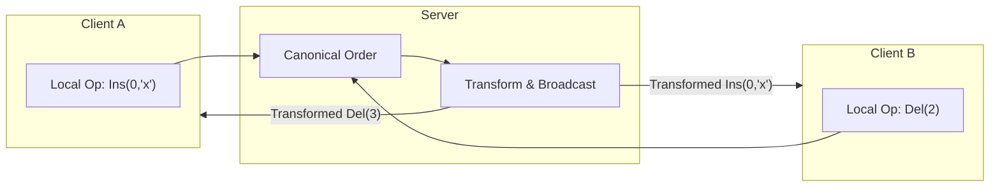
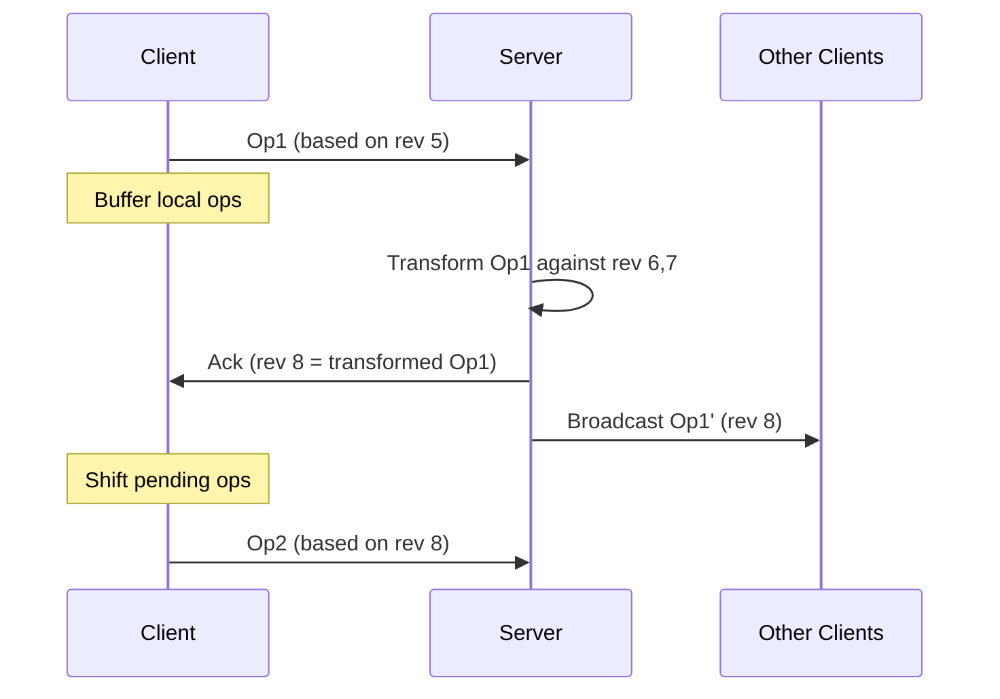
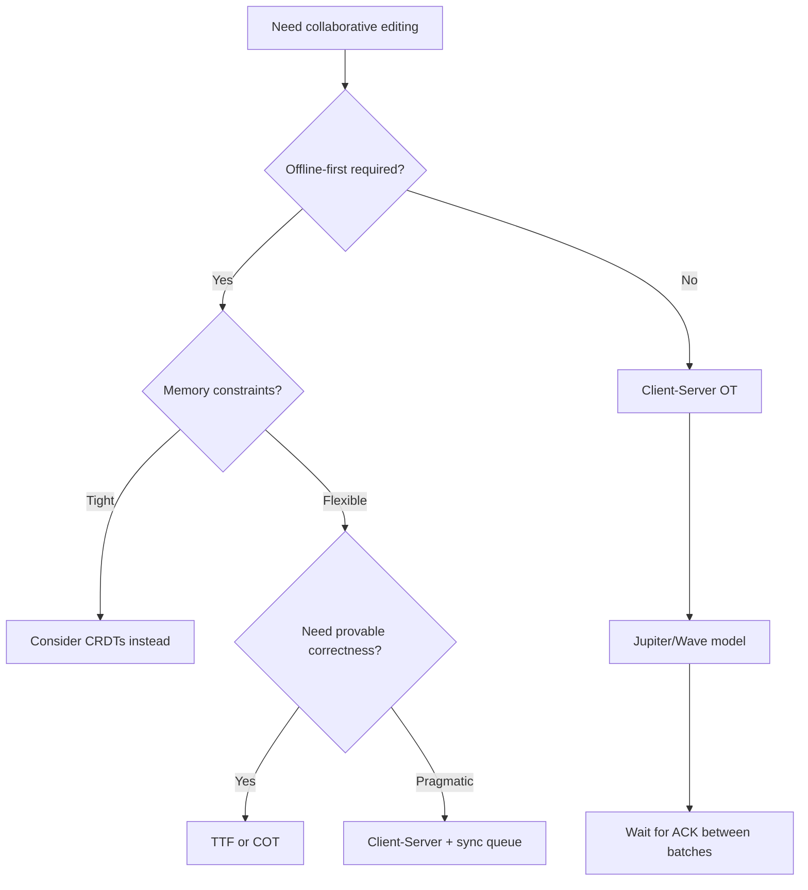
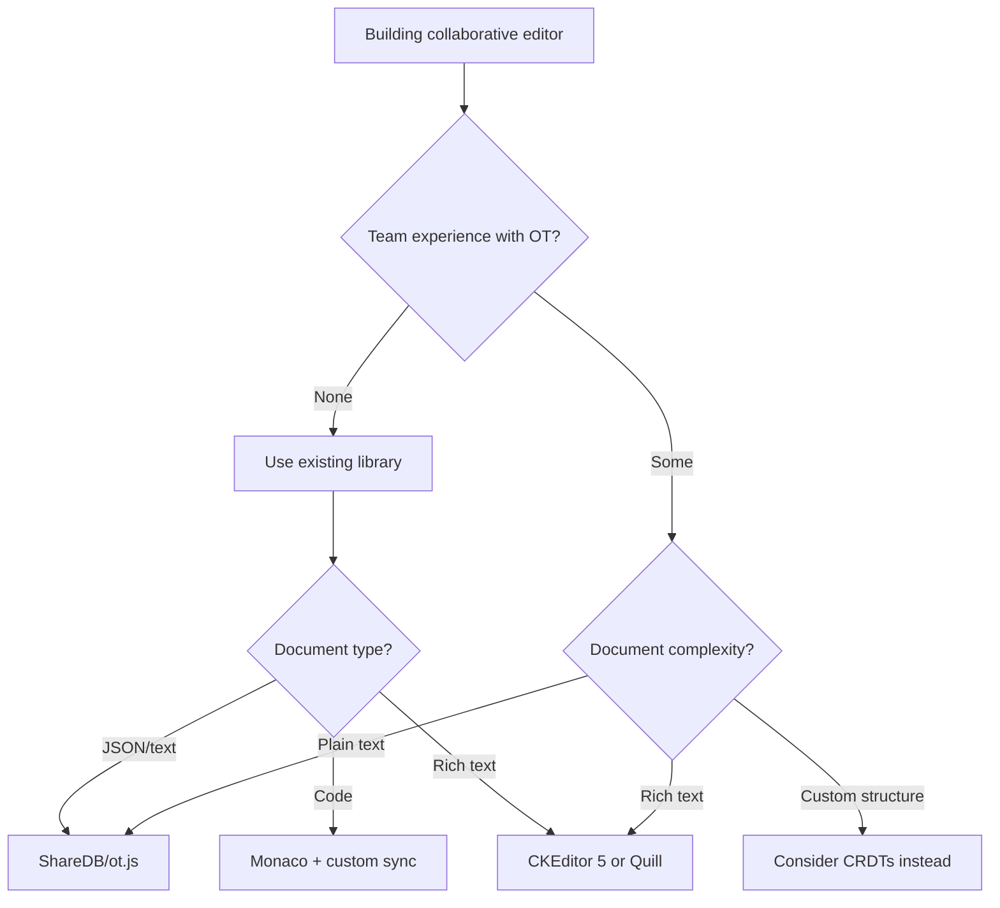

# Operational Transformation

Deep-dive into Operational Transformation (OT): the algorithm powering Google Docs, with its design variants, correctness properties, and production trade-offs.

OT enables real-time collaborative editing by transforming concurrent operations so that all clients converge to the same document state. Despite being the foundation of nearly every production collaborative editor since 1995, OT has a troubled academic history—most published algorithms were later proven incorrect. This article covers why OT is hard, which approaches actually work, and how production systems sidestep the theoretical pitfalls.

<figure>



<figcaption>OT core flow: concurrent operations are transformed against each other to preserve intent while achieving convergence.</figcaption>
</figure>

## Abstract

OT solves the problem of concurrent edits in collaborative systems through a deceptively simple idea: when operations conflict, transform them so they can both apply correctly. The core mental model:

- **Operations** (insert, delete) carry position information that becomes stale when concurrent edits occur
- **Transformation functions** adjust an operation's position based on another operation that happened concurrently
- **TP1** (convergence): applying O1 then T(O2,O1) must equal applying O2 then T(O1,O2)—both paths reach the same state
- **TP2** (commutativity): transforming O3 against different orderings of O1,O2 must yield the same result—this property is notoriously hard to satisfy and most published algorithms fail it
- **Production systems avoid TP2** by using a central server to impose a canonical operation order, making the math tractable at the cost of requiring server round-trips

The key insight: practical OT is not distributed. Google Docs, Google Wave, and nearly all production systems use client-server architecture where the server decides operation order, eliminating the need for TP2 satisfaction.

## The Problem

### Why Naive Solutions Fail

**Approach 1: Last-write-wins**

Two users edit "hello" concurrently:
- User A inserts "x" at position 0 → "xhello"
- User B deletes character at position 4 → "hell"

With last-write-wins, one edit is lost. Collaborative editors cannot discard user intent.

**Approach 2: Locking**

Lock the document (or region) during edits. Users see "Document locked by User A" and must wait.

Fails because: latency makes locking unusable. With 100ms round-trip, a user typing 5 characters/second would spend most of their time waiting for locks. Google Docs reports 40+ concurrent editors on popular documents—locking would serialize all edits.

**Approach 3: Apply operations as-received**

User A and B both start with "abc":
- A: Insert 'x' at position 0 → sends Ins(0,'x')
- B: Delete at position 2 → sends Del(2)

If B receives A's insert first, B's document becomes "xabc". Then B's own Del(2) executes, deleting 'a' instead of 'c'. Result: "xbc" for B, "xab" for A. **Divergence.**

### The Core Challenge

The fundamental tension: **preserving user intent while achieving convergence across all replicas**.

Each operation encodes intent relative to a specific document state. When operations are concurrent (neither causally depends on the other), their positions become meaningless without transformation. OT exists to adjust operations so they execute their intended effect regardless of the order they're applied.

## Pattern Overview

### Core Mechanism

OT works by defining **transformation functions** that take two concurrent operations and produce adjusted versions:

```
T(O1, O2) → O1'  // O1 transformed against O2
T(O2, O1) → O2'  // O2 transformed against O1
```

The transformed operations are designed so that:
- Starting from state S
- Applying O1 then O2' yields the same state as
- Applying O2 then O1'

For string operations, transformation typically adjusts positions:

```typescript
// Transform insert against insert
function transformInsertInsert(
  op1: { pos: number; char: string },
  op2: { pos: number; char: string }
): { pos: number; char: string } {
  if (op1.pos < op2.pos) {
    return op1; // No adjustment needed
  } else if (op1.pos > op2.pos) {
    return { ...op1, pos: op1.pos + 1 }; // Shift right
  } else {
    // Tie-breaking: use site ID or timestamp
    // Both insert at same position
    return { ...op1, pos: op1.pos + 1 }; // Arbitrary but consistent
  }
}

// Transform delete against insert
function transformDeleteInsert(
  del: { pos: number },
  ins: { pos: number; char: string }
): { pos: number } {
  if (del.pos < ins.pos) {
    return del;
  } else {
    return { pos: del.pos + 1 };
  }
}
```

### Key Invariants

1. **Convergence (TP1)**: All sites reach the same document state after applying all operations, regardless of arrival order
2. **Causality preservation**: Operations are applied respecting their causal dependencies (Lamport's happened-before)
3. **Intention preservation**: The effect of an operation matches what the user intended, even after transformation

### Failure Modes

| Failure | Impact | Mitigation |
|---------|--------|------------|
| TP1 violation | Documents diverge permanently | Formal verification of transformation functions |
| TP2 violation | Divergence with 3+ concurrent operations | Use server-ordered architecture (avoid TP2 requirement) |
| Causality violation | Operations apply out of order | Vector clocks or server-assigned sequence numbers |
| Transformation bugs | Silent corruption, divergence | Checksums, periodic reconciliation |

## Design Paths

### Path 1: Client-Server OT (Jupiter/Wave Model)

**When to choose this path:**
- Network connectivity is reliable
- Latency tolerance allows server round-trips
- Simplicity is prioritized over offline capability
- Team wants proven, production-tested approach

**How it works:**

The server maintains a single canonical operation history. Clients send operations to the server, which:
1. Transforms incoming operations against any operations the client hasn't seen
2. Assigns a sequence number
3. Broadcasts the transformed operation to all clients

Clients maintain three states:
- **Server state**: Last acknowledged server revision
- **Pending operations**: Sent to server, awaiting acknowledgment
- **Local operations**: Not yet sent (buffered during server round-trip)

<figure>



<figcaption>Client-server OT: server assigns canonical ordering, clients transform against operations they haven't seen.</figcaption>
</figure>

**Critical design choice**: Clients must wait for acknowledgment before sending the next operation batch. Google Wave enforced this strictly—during the wait, clients buffer local operations and send them in bulk after ACK.

**Why this avoids TP2:**

TP2 is required when operations can be transformed along different paths (different orderings of concurrent operations). With a central server:
- The server decides the canonical order
- All transformations follow a single path
- TP2 never comes into play

**Trade-offs vs other paths:**

| Aspect | Client-Server | Peer-to-Peer |
|--------|---------------|--------------|
| TP2 requirement | Not needed | Required |
| Correctness proofs | Straightforward | Notoriously difficult |
| Server dependency | Single point of failure | No central dependency |
| Latency | Round-trip per operation batch | Direct client-to-client |
| Offline support | Limited (buffer operations) | Native |
| Implementation complexity | Moderate | Very high |

**Real-world example:**

Google Docs uses client-server OT derived from the Jupiter/Wave codebase. According to Google's engineering blog, every character change is saved as an event in a revision log. The document is rendered by replaying the log from the start.

Joseph Gentle (ShareJS author, ex-Google Wave): "Whatever the bugs are, I don't think they were ever fixed in the opensource [Wave] version. It's all just too complicated... You're right about OT—it gets crazy complicated if you implement it in a distributed fashion. But implementing it in a centralized fashion is actually not so bad."

### Path 2: Peer-to-Peer OT (adOPTed, GOTO)

**When to choose this path:**
- Offline-first requirement is critical
- No server infrastructure available
- Academic research context
- Willing to accept significant complexity

**How it works:**

Each site maintains its own operation history and transforms incoming operations against local history. Without a central server, sites can receive operations in different orders, requiring TP2 satisfaction.

The adOPTed algorithm (Ressel et al. 1996) introduced an N-dimensional interaction graph to track all valid transformation paths. Each operation is placed in this graph based on state vectors, and transformations follow edges to find equivalent operations.

**The TP2 problem:**

For three concurrent operations O1, O2, O3, TP2 requires:
```
T(O3, O1 ∘ T(O2, O1)) ≡ T(O3, O2 ∘ T(O1, O2))
```

Meaning: transforming O3 past O1-then-O2' must equal transforming O3 past O2-then-O1'.

**Why it fails in practice:**

Randolph et al. (2013) proved formally: "There is no IT function, based on classical parameters of delete and insert operations, which satisfies both TP1 and TP2."

Using controller synthesis techniques, they showed that position and character parameters are necessary but not sufficient. Every published TP2-claiming algorithm was subsequently shown to have counterexamples:

| Algorithm | Year | TP2 Claim | Status |
|-----------|------|-----------|--------|
| dOPT | 1989 | Implied | Disproven |
| adOPTed | 1996 | Asserted | Disproven |
| SOCT2 | 1998 | "Proven" | Disproven |
| SDT | 2002 | Claimed | Disproven |
| IMOR | 2003 | Machine-verified | Invalid assumptions |

Raph Levien: "For a decade or so, TP2 was something of a philosopher's stone, with several alchemists of OT claiming that they had found a set of transforms satisfying TP2, only for counterexamples to emerge later."

**Trade-offs:**

- ✅ No server dependency
- ✅ Offline operation is native
- ✅ Lower latency (direct peer communication)
- ❌ No production-proven correct implementation exists
- ❌ Extreme implementation complexity
- ❌ Debugging distributed state divergence is brutal

**Real-world example:**

Google Wave attempted federated (peer-to-peer between servers) OT. From Joseph Gentle: "We got it working, kinda, but it was complex and buggy. We ended up with a scheme where every wave would arrange a tree of wave servers... But it never really worked."

Wave was eventually shut down; its federation protocol remains unproven in production.

### Path 3: Tombstone Transformation Functions (TTF)

**When to choose this path:**
- Need provably correct transformation functions
- Can tolerate memory overhead
- Building a new implementation from scratch

**How it works:**

TTF (Oster et al. 2006) sidesteps the TP2 impossibility by changing the data model. Instead of a string, the document is a sequence of (character, visible) pairs. Deletes set visible=false but retain the character as a tombstone.

```typescript
interface TombstoneChar {
  char: string;
  visible: boolean;
  id: UniqueId; // For ordering
}

type Document = TombstoneChar[];

function deleteAt(doc: Document, pos: number): Document {
  let visibleCount = 0;
  for (let i = 0; i < doc.length; i++) {
    if (doc[i].visible) {
      if (visibleCount === pos) {
        doc[i].visible = false;
        return doc;
      }
      visibleCount++;
    }
  }
  return doc;
}
```

**Why this satisfies TP2:**

With tombstones, positions are stable. A deleted character still occupies its logical position, so concurrent operations don't shift each other's targets unpredictably. The paper includes a theorem prover verification that TTF satisfies both TP1 and TP2.

**Trade-offs:**

- ✅ Provably correct (machine-verified)
- ✅ Simpler transformation logic
- ❌ Unbounded memory growth (tombstones accumulate)
- ❌ Need garbage collection strategy
- ❌ Operations may reference expired tombstones

**Garbage collection challenge:**

Tombstones can be removed only when all sites have seen all operations that reference them. This requires distributed garbage collection—itself a hard problem. Production systems typically use periodic snapshots with tombstone truncation, accepting that very late operations may fail.

### Path 4: Context-Based OT (COT)

**When to choose this path:**
- Need undo/redo support
- Want to avoid TP2 at the function level
- Building a distributed system with known operation context

**How it works:**

COT (Sun & Sun 2009) replaces history buffers with **context vectors** that capture the exact document state where an operation was created. Instead of transforming operations pairwise, COT transforms based on context differences.

The key insight: TP2 is required because operations can be transformed along different paths. If you track the exact context (which operations have been applied), you can always reconstruct the correct transformation path.

**Advantages:**

- Supports undo/redo of any operation at any time
- Does NOT require TP2 at the transformation function level
- Transformation functions only need TP1
- Proven correct for specific operation sets

**Real-world implementations:**

COT powers several academic and commercial systems: CoMaya (3D modeling), CoWord (Microsoft Word), CodoxWord, and IBM OpenCoWeb.

**Trade-offs:**

- ✅ Avoids TP2 requirement through context tracking
- ✅ Native undo/redo support
- ✅ Formally verified for specific operations
- ❌ Context vectors grow with operation count
- ❌ More complex than client-server approach
- ❌ Less production exposure than Jupiter-derived systems

### Decision Framework

<figure>



<figcaption>Decision tree for OT variant selection. Client-server dominates production use.</figcaption>
</figure>

## Production Implementations

### Google Docs

**Context:** World's most widely used collaborative editor, 40+ concurrent editors on popular documents.

**Implementation choices:**
- Architecture: Client-server (Jupiter-derived)
- Transport: WebSocket with operation batching
- Persistence: Event-sourced revision log

**Architecture:**

Each document stores a revision log of operations. The visible document is the result of replaying all operations from the initial state. This enables:
- Revision history ("See previous versions")
- Conflict-free persistence (append-only log)
- Recovery from any point in time

**Specific details:**
- Operations use a streaming format: Retain(n), Insert(chars), Delete(n)
- Attributes (bold, font) are separate operations on ranges
- Checkpoints created periodically to avoid replaying full history

**What worked:**
- Simplicity of client-server model enabled rapid iteration
- Operation batching amortizes round-trip cost
- Event sourcing simplified persistence and history

**What was hard:**
- Rich text requires tree-structured operations (paragraphs, lists, tables)
- Cursor/selection state must be transformed alongside content
- Presence indicators (who's editing where) add additional sync complexity

**Source:** Google Drive Blog (2010), Google Wave Whitepapers

### Apache Wave (Open Source)

**Context:** Open-sourced Google Wave codebase, reference implementation for Wave protocol.

**Implementation choices:**
- Architecture: Client-server with federation attempt
- Protocol: Wave Federation Protocol (XMPP-based)
- Operation types: Document mutations, wavelet operations

**Architecture:**

Wave operations are hierarchical:
- **Wavelet**: Container for participants and documents
- **Document**: Rich text with elements and annotations
- **Operations**: Retain, InsertCharacters, DeleteCharacters, InsertElement, etc.

**Specific details from whitepaper:**
- Every character, start tag, or end tag is an "item"
- Gaps between items are "positions"
- Operations compose: B∙A satisfies (B∙A)(d) = B(A(d))
- Clients must wait for ACK before sending next batch

**What worked:**
- Document model handles rich text well
- Composition of operations simplifies some transformations
- Open protocol enabled third-party clients

**What was hard:**
- Federation never achieved production stability
- Complexity overwhelmed both users and developers
- Performance issues with large documents

**Source:** Apache Wave Whitepapers, Joseph Gentle retrospectives

### CKEditor 5

**Context:** Commercial rich-text editor with real-time collaboration, 4+ years R&D.

**Implementation choices:**
- Architecture: Client-server
- Key innovation: OT for tree-structured documents
- Transport: WebSocket

**The tree challenge:**

Rich text isn't a string—it's a tree (paragraphs containing spans containing text). Operations like "split paragraph" or "merge cells" don't map to simple insert/delete. CKEditor claims to be the first production system to solve OT for trees.

**Specific details:**
- Operations can "break" during transformation (one op becomes multiple)
- Selective undo: users only undo their own changes
- Custom transformation functions for 50+ operation types

**What worked:**
- Tree model handles complex formatting (tables, lists, images)
- Selective undo improves UX in multi-user scenarios
- Years of investment produced stable implementation

**What was hard:**
- Operation breaking adds significant complexity
- Testing all transformation combinations is combinatorial
- Performance optimization for large documents

**Source:** CKEditor Blog (2020), "Lessons Learned from Creating a Rich-Text Editor with Real-Time Collaboration"

### Implementation Comparison

| Aspect | Google Docs | Apache Wave | CKEditor 5 |
|--------|-------------|-------------|------------|
| Architecture | Client-server | Client-server + federation | Client-server |
| Document model | Streaming ops | Hierarchical wavelets | Tree-structured |
| Offline | Limited buffer | Limited buffer | Planned sync queue |
| Rich text | Yes (ops on ranges) | Yes (elements + annotations) | Yes (native tree ops) |
| Undo model | Global history | Global history | Selective (user's ops only) |
| Scale | Proven at massive scale | Abandoned | Production-proven |

## Implementation Guide

### Starting Point Decision

<figure>



<figcaption>Implementation decision tree. Building OT from scratch is rarely justified.</figcaption>
</figure>

### Library Options

| Library | Language | Architecture | Maturity | Best For |
|---------|----------|--------------|----------|----------|
| ShareDB | Node.js | Client-server | Production | JSON documents |
| ot.js | JavaScript | Client-server | Production | Plain text |
| Yjs | JavaScript | P2P (CRDT) | Production | Offline-first |
| CKEditor 5 | JavaScript | Client-server | Production | Rich text |
| Quill + y-quill | JavaScript | P2P (CRDT) | Production | Rich text + offline |

### Building Custom (Rare)

**When to build custom:**
- Document model doesn't fit existing libraries
- Need specific consistency guarantees
- Performance requirements exceed library capabilities
- Regulatory requirements prevent third-party code

**Implementation checklist:**

- [ ] Choose architecture: client-server strongly recommended
- [ ] Define operation types (keep minimal)
- [ ] Implement TP1-satisfying transformation functions
- [ ] Add server sequencing to avoid TP2
- [ ] Implement client state machine (pending, sent, acknowledged)
- [ ] Add conflict detection with checksums
- [ ] Build reconciliation for detected divergence
- [ ] Test with artificial latency and packet loss
- [ ] Fuzz test transformation functions exhaustively

Joseph Gentle's estimate: "Wave took 2 years to write and if we rewrote it today, it would take almost as long."

## Common Pitfalls

### 1. Attempting Peer-to-Peer OT

**The mistake:** Implementing distributed OT because it seems "cleaner" than server dependency.

**Why it fails:** Every published P2P OT algorithm has been proven incorrect. The TP2 property that P2P requires is likely impossible to satisfy with standard string operations.

**Example:** A startup builds P2P OT for "serverless collaboration." After 6 months, users report documents diverging. Debugging reveals the transformation functions fail with 3+ concurrent editors—a case the test suite never covered.

**Solution:** Use client-server architecture. The server round-trip cost is far lower than the correctness risk of P2P.

### 2. Ignoring Operation Composition

**The mistake:** Treating operations as independent units instead of composable.

**Why it matters:** Client sends Op1, then Op2 before receiving Op1's ACK. Server receives both, but Op2 was created assuming Op1 applied. If server processes them as independent, transformation fails.

**Solution:** Wave protocol requires clients to wait for ACK, OR clients must track pending operations and transform new operations against pending ones before sending.

```typescript
// Client state machine
interface ClientState {
  serverRevision: number;
  pending: Operation | null;  // Sent, awaiting ACK
  buffer: Operation[];        // Not yet sent
}

function onLocalEdit(state: ClientState, op: Operation): ClientState {
  if (state.pending) {
    // Transform against pending before buffering
    const transformed = transform(op, state.pending);
    return { ...state, buffer: [...state.buffer, transformed] };
  } else {
    // Send immediately
    send(op);
    return { ...state, pending: op };
  }
}
```

### 3. Unbounded History Growth

**The mistake:** Storing all operations forever for "history" feature.

**Why it fails:** Document with 1 year of active editing accumulates millions of operations. Loading requires replaying all of them.

**Example:** Notion-like app stores every keystroke. After 6 months, loading a busy document takes 30 seconds as the client replays 500K operations.

**Solutions:**
- Periodic snapshots: Store document state at intervals, only replay recent operations
- Checkpoint compaction: Combine operations into single state updates
- Lazy loading: Load recent ops, fetch history on demand

### 4. Testing Only Happy Path

**The mistake:** Testing with low latency, no packet loss, and 2 concurrent users.

**Why it fails:** OT bugs emerge with high concurrency, reordered packets, and edge-case timing. The "dOPT puzzle" only manifests with specific 3-user concurrent patterns.

**Solution:**
- Fuzz testing: Random operation sequences with random timing
- Chaos engineering: Inject latency, reordering, duplication
- Invariant checking: Assert convergence after every operation sequence
- Property-based testing: Generate operation sequences, verify TP1 holds

```typescript
// Property-based test for TP1
test('TP1: transformation paths converge', () => {
  fc.assert(
    fc.property(
      arbitraryOperation(),
      arbitraryOperation(),
      arbitraryDocument(),
      (op1, op2, doc) => {
        const path1 = apply(apply(doc, op1), transform(op2, op1));
        const path2 = apply(apply(doc, op2), transform(op1, op2));
        expect(path1).toEqual(path2);
      }
    )
  );
});
```

### 5. Assuming Transform Functions Are Symmetric

**The mistake:** Assuming T(op1, op2) and T(op2, op1) are computed the same way.

**Why it fails:** Transformation depends on which operation is being adjusted. Insert-vs-insert with same position needs tie-breaking; the "winner" doesn't transform, the "loser" shifts.

**Example:** Two users insert at position 5. Without consistent tie-breaking, one client computes T(A,B)=A (A wins), other computes T(A,B)=shift(A) (B wins). Divergence.

**Solution:** Always use consistent tie-breaking: site IDs, timestamps, or operation IDs. The rule must be deterministic and known to all clients.

## Conclusion

OT solves collaborative editing through operation transformation, but its apparent simplicity hides decades of failed correctness proofs. The practical takeaway: **use client-server architecture**. It sidesteps TP2, enables straightforward implementation, and is the only approach proven at scale.

For new projects, prefer existing libraries (ShareDB, CKEditor, or CRDT-based alternatives like Yjs) over custom implementations. If building custom, invest heavily in property-based testing and invariant checking—the bugs that matter only emerge with specific concurrent operation sequences that manual testing will miss.

OT remains the foundation of Google Docs and most production collaborative editors, but its dominance is being challenged by CRDTs for offline-first applications. The choice depends on your consistency requirements, offline needs, and tolerance for implementation complexity.

## Appendix

### Prerequisites

- Understanding of distributed systems consistency models
- Familiarity with event sourcing concepts
- Basic knowledge of Lamport timestamps and causal ordering
- For CRDTs comparison: see Martin Kleppmann's ["CRDTs: The Hard Parts"](https://martin.kleppmann.com/2020/07/06/crdt-hard-parts-hydra.html)

### Terminology

- **OT (Operational Transformation)**: Algorithm that transforms concurrent operations to achieve convergence
- **TP1 (Transformation Property 1)**: Convergence property—different transformation paths yield same result
- **TP2 (Transformation Property 2)**: Commutativity property—transformation is independent of operation ordering
- **Convergence**: All replicas reach identical state after applying all operations
- **Intent preservation**: Transformed operation achieves user's original goal
- **Tombstone**: Marker for deleted content, retained for transformation stability
- **COT (Context-based OT)**: Variant tracking operation context for transformation
- **TTF (Tombstone Transformation Functions)**: Provably correct transformation using tombstones

### Summary

- OT transforms concurrent operations by adjusting positions based on what other operations have done
- **TP1 is mandatory**: transformation paths must converge to the same state
- **TP2 is impractical**: no standard string operations satisfy it; use client-server to avoid requiring it
- Production systems (Google Docs, CKEditor) all use client-server architecture for this reason
- Libraries (ShareDB, ot.js) are strongly preferred over custom implementations
- Testing must include fuzz testing and property-based tests—manual testing misses the bugs that matter

### References

- Ellis, C.A., Gibbs, S.J. (1989). ["Concurrency Control in Groupware Systems"](https://dl.acm.org/doi/10.1145/67544.66963) - ACM SIGMOD'89. Original dOPT algorithm.
- Nichols, D.A. et al. (1995). ["High-latency, low-bandwidth windowing in the Jupiter collaboration system"](https://dl.acm.org/doi/10.1145/215585.215706) - ACM UIST. Foundation for all practical OT.
- Ressel, M. et al. (1996). ["An Integrating, Transformation-Oriented Approach to Concurrency Control and Undo"](https://dl.acm.org/doi/10.1145/240080.240305) - ACM CSCW'96. Defined TP1/TP2.
- Sun, C., Ellis, C. (1998). ["Operational transformation in real-time group editors"](https://dl.acm.org/doi/10.1145/289444.289469) - ACM CSCW'98. GOT/GOTO algorithms.
- Oster, G. et al. (2006). ["Tombstone Transformation Functions for Ensuring Consistency"](https://hal.science/inria-00109039) - CollaborateCom. First provably correct OT.
- Sun, D., Sun, C. (2009). ["Context-Based Operational Transformation"](https://ieeexplore.ieee.org/document/4668339/) - IEEE TPDS. COT algorithm.
- Randolph, A. et al. (2013). ["On Consistency of Operational Transformation Approach"](https://arxiv.org/abs/1302.3292) - arXiv. Impossibility proof for TP2.
- Levien, R. (2016). ["Towards a unified theory of Operational Transformation and CRDT"](https://medium.com/@raphlinus/towards-a-unified-theory-of-operational-transformation-and-crdt-70485876f72f) - Medium. Excellent synthesis.
- [Apache Wave OT Whitepaper](https://svn.apache.org/repos/asf/incubator/wave/whitepapers/operational-transform/operational-transform.html) - Detailed protocol specification.
- [Google Drive Blog](https://drive.googleblog.com/2010/09/whats-different-about-new-google-docs.html) - Google Docs architecture overview.
- [CKEditor Blog](https://ckeditor.com/blog/lessons-learned-from-creating-a-rich-text-editor-with-real-time-collaboration/) - Production lessons for rich text OT.
- [ShareDB GitHub](https://github.com/share/sharedb) - Production-ready OT library.
- [OT FAQ](https://www3.ntu.edu.sg/scse/staff/czsun/projects/otfaq/) - Comprehensive academic resource by Chengzheng Sun.
