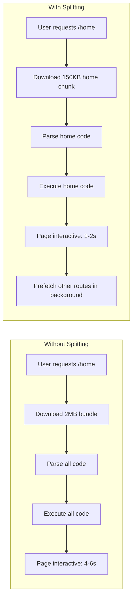
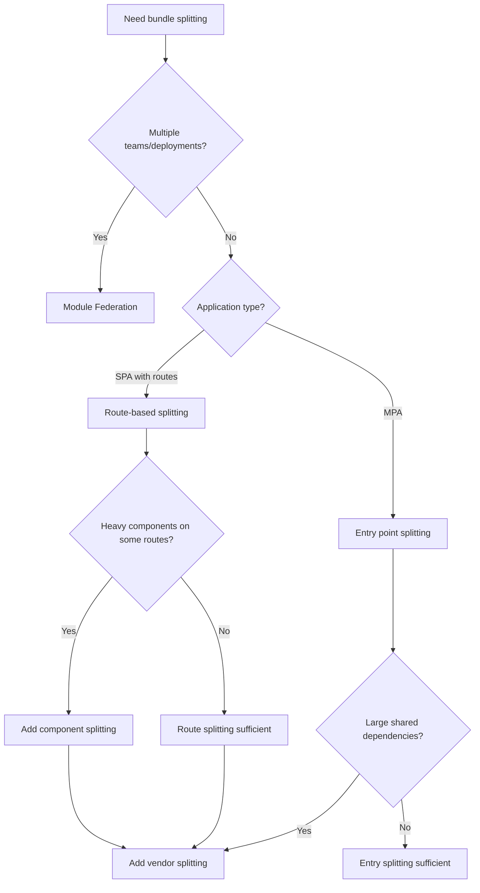

# Bundle Splitting Strategies

Modern JavaScript applications ship megabytes of code by default. Without bundle splitting, users download, parse, and execute the entire application before seeing anything interactive—regardless of which features they'll actually use. Bundle splitting transforms monolithic builds into targeted delivery: load the code for the current route immediately, defer everything else until needed. The payoff is substantial—30-60% reduction in initial bundle size translates directly to faster Time to Interactive (TTI) and improved Core Web Vitals.

<figure>



<figcaption>Bundle splitting reduces initial payload by loading only what's needed for the current route, deferring the rest.</figcaption>
</figure>

## Abstract

Bundle splitting is a **build-time optimization** that divides application code into separate chunks loaded on demand. The core insight: users access one route at a time, so they should only pay the download cost for that route's code.

Three fundamental strategies exist, each addressing different optimization goals:

1. **Entry splitting**: Create separate bundles per entry point (multi-page apps, micro-frontends). Each entry gets independent dependency resolution.
2. **Route/component splitting**: Use dynamic `import()` to load code when users navigate or interact. The dominant pattern for SPAs.
3. **Vendor splitting**: Isolate `node_modules` into stable chunks. Dependencies change less frequently than application code—separate chunks improve cache hit rates across deployments.

Critical constraints shape implementation:

- **Static analysis requirement**: Bundlers must determine chunk boundaries at build time. Fully dynamic import paths (e.g., `import(userInput)`) cannot be split.
- **HTTP/2 sweet spot**: 10-30 chunks balance caching benefits against connection overhead. Too few chunks = poor cache utilization; too many = HTTP/2 stream saturation.
- **Compression effectiveness**: Smaller chunks compress less efficiently than larger ones. A 10KB chunk may only compress 50%; a 100KB chunk may compress 70%.
- **Prefetch/preload timing**: Splitting without intelligent loading creates waterfalls. Prefetching predicted routes and preloading critical resources recovers the latency cost.

Build tools handle these trade-offs differently: Webpack's SplitChunksPlugin offers granular control with complex configuration; Vite/Rollup favor convention over configuration with sensible defaults; esbuild prioritizes speed with simpler splitting semantics.

## The Challenge

### Browser Constraints

JavaScript execution blocks the main thread. Large bundles create measurable user experience degradation:

**Parse time**: V8 parses JavaScript at roughly 1MB/second on mobile devices (benchmarked on mid-range Android). A 2MB bundle = 2 seconds of parse time before any code executes.

**Execution time**: Module initialization (top-level code, class definitions, side effects) runs synchronously. Heavy initialization chains delay interactivity.

**Memory pressure**: Each loaded module consumes memory for its AST, compiled bytecode, and runtime objects. On memory-constrained mobile devices, loading unused code competes with application state for limited heap.

### Performance Targets

| Metric                          | Target  | Bundle Impact                                          |
| ------------------------------- | ------- | ------------------------------------------------------ |
| LCP (Largest Contentful Paint)  | < 2.5s  | Initial JS blocks render; smaller bundles = faster LCP |
| INP (Interaction to Next Paint) | < 200ms | Large bundles increase main thread blocking time       |
| TTI (Time to Interactive)       | < 3.8s  | Direct correlation with JavaScript payload size        |

**Rule of thumb**: Keep initial JavaScript under 100KB gzipped for mobile-first applications. Each additional 100KB adds roughly 1 second to TTI on 3G connections.

### Scale Factors

| Application Type | Without Splitting | With Splitting | Reduction |
| ---------------- | ----------------- | -------------- | --------- |
| Marketing site   | 50-100KB          | 20-40KB        | 40-60%    |
| Dashboard SPA    | 500KB-1MB         | 100-200KB      | 60-80%    |
| E-commerce       | 1-2MB             | 200-400KB      | 70-80%    |
| Complex SaaS     | 2-5MB             | 300-600KB      | 80-90%    |

## Design Paths

### Path 1: Route-Based Code Splitting

**How it works:**

Each route in the application becomes a separate chunk. When users navigate, the router triggers a dynamic import that loads the route's code on demand.

```typescript title="route-based-splitting.tsx" collapse={1-4,35-45}
import { lazy, Suspense } from 'react';
import { createBrowserRouter, RouterProvider } from 'react-router-dom';

// Dynamic imports create separate chunks at build time
// Webpack names chunks based on the file path or magic comments
const Home = lazy(() => import('./pages/Home'));
const Dashboard = lazy(() => import('./pages/Dashboard'));
const Settings = lazy(() => import('./pages/Settings'));
const Analytics = lazy(() =>
  import(/* webpackChunkName: "analytics" */ './pages/Analytics')
);

const router = createBrowserRouter([
  {
    path: '/',
    element: (
      <Suspense fallback={<PageSkeleton />}>
        <Home />
      </Suspense>
    ),
  },
  {
    path: '/dashboard',
    element: (
      <Suspense fallback={<PageSkeleton />}>
        <Dashboard />
      </Suspense>
    ),
  },
  // Additional routes...
]);

function App() {
  return <RouterProvider router={router} />;
}
```

**Why this works:**

- `import()` returns a Promise that resolves to the module
- Bundlers perform static analysis to identify import boundaries
- Each `import()` call becomes a separate chunk in the build output
- React's `lazy()` integrates Promises with Suspense boundaries

**Framework implementations:**

| Framework    | Mechanism                      | Configuration                              |
| ------------ | ------------------------------ | ------------------------------------------ |
| Next.js      | Automatic per-page splitting   | Zero config; each `pages/*.tsx` is a chunk |
| React Router | `lazy()` + `Suspense`          | Manual setup per route                     |
| Vue Router   | `() => import('./Page.vue')`   | Built into router config                   |
| Angular      | `loadChildren` in route config | Built into router module                   |
| SvelteKit    | `+page.svelte` convention      | Automatic per-route                        |

**Performance characteristics:**

| Metric             | Value                        |
| ------------------ | ---------------------------- |
| Typical reduction  | 30-60% of initial bundle     |
| Chunk count        | 1 per route + shared chunks  |
| Navigation latency | 50-200ms for chunk fetch     |
| Caching            | Unchanged routes stay cached |

**Best for:**

- SPAs with distinct route boundaries
- Applications where users typically access a subset of features
- Progressive disclosure patterns (landing → dashboard → settings)

**Trade-offs:**

- Navigation delay for first visit to each route
- Requires Suspense boundaries for loading states
- Shared dependencies across routes need vendor splitting

**Real-world example:**

Airbnb's web application uses route-based splitting extensively. Their listing search page, booking flow, and host dashboard are separate chunks. Engineers measured a 67% reduction in initial JavaScript and 20% improvement in TTI after implementing route splitting with prefetching.

### Path 2: Component-Level Code Splitting

**How it works:**

Heavy components within a route are split and loaded on demand—triggered by user interaction or visibility rather than navigation.

```typescript title="component-splitting.tsx" collapse={1-3,28-35}
import { lazy, Suspense, useState } from 'react';

// Heavy visualization library only loads when chart is rendered
const AnalyticsChart = lazy(() =>
  import(/* webpackChunkName: "chart" */ './AnalyticsChart')
);

// Rich text editor loads when user clicks "Edit"
const RichTextEditor = lazy(() =>
  import(/* webpackChunkName: "editor" */ './RichTextEditor')
);

function Dashboard() {
  const [showChart, setShowChart] = useState(false);
  const [editing, setEditing] = useState(false);

  return (
    <div>
      <button onClick={() => setShowChart(true)}>Show Analytics</button>

      {showChart && (
        <Suspense fallback={<ChartSkeleton />}>
          <AnalyticsChart data={analyticsData} />
        </Suspense>
      )}

      <button onClick={() => setEditing(true)}>Edit Content</button>

      {editing && (
        <Suspense fallback={<EditorSkeleton />}>
          <RichTextEditor content={content} />
        </Suspense>
      )}
    </div>
  );
}
```

**Typical candidates for component splitting:**

| Component Type    | Example Libraries      | Typical Size |
| ----------------- | ---------------------- | ------------ |
| Rich text editors | Slate, TipTap, Quill   | 100-300KB    |
| Charting          | D3, Chart.js, Recharts | 50-200KB     |
| Code editors      | Monaco, CodeMirror     | 500KB-2MB    |
| PDF viewers       | pdf.js                 | 400-600KB    |
| Maps              | Mapbox, Google Maps    | 100-500KB    |
| Markdown          | marked + highlight.js  | 50-150KB     |

**Trigger strategies:**

1. **User interaction**: Load when user clicks a button or tab
2. **Intersection Observer**: Load when component scrolls into viewport
3. **Hover intent**: Prefetch on hover, load on click
4. **Idle callback**: Load during browser idle time

```typescript title="intersection-observer-loading.tsx" collapse={1-5,25-30}
import { lazy, Suspense, useEffect, useRef, useState } from 'react';

const HeavyComponent = lazy(() => import('./HeavyComponent'));

function LazyOnVisible({ children }: { children: React.ReactNode }) {
  const ref = useRef<HTMLDivElement>(null);
  const [isVisible, setIsVisible] = useState(false);

  useEffect(() => {
    const observer = new IntersectionObserver(
      ([entry]) => {
        if (entry.isIntersecting) {
          setIsVisible(true);
          observer.disconnect();
        }
      },
      { rootMargin: '200px' } // Start loading 200px before visible
    );

    if (ref.current) observer.observe(ref.current);
    return () => observer.disconnect();
  }, []);

  return (
    <div ref={ref}>
      {isVisible ? children : <Placeholder />}
    </div>
  );
}
```

**Trade-offs:**

- Additional network requests on user interaction
- Requires careful loading state design
- Can feel slow without prefetching

### Path 3: Vendor Splitting

**How it works:**

Third-party dependencies (`node_modules`) are extracted into separate chunks. Application code changes frequently; dependencies don't. Separate chunks maximize cache efficiency.

```javascript title="webpack.config.js - vendor splitting" collapse={1-8,30-40}
// webpack.config.js
module.exports = {
  optimization: {
    splitChunks: {
      chunks: "all",
      cacheGroups: {
        // Framework chunks (React, Vue, etc.) - very stable
        framework: {
          test: /[\\/]node_modules[\\/](react|react-dom|scheduler)[\\/]/,
          name: "framework",
          priority: 40,
          enforce: true,
        },
        // Large libraries get their own chunks
        vendors: {
          test: /[\\/]node_modules[\\/]/,
          name(module) {
            // Get library name for chunk naming
            const match = module.context.match(/[\\/]node_modules[\\/](.*?)([\\/]|$)/)
            const packageName = match ? match[1] : "vendors"
            return `vendor-${packageName.replace("@", "")}`
          },
          priority: 20,
          minSize: 50000, // Only split if > 50KB
        },
        // Shared application code
        commons: {
          name: "commons",
          minChunks: 2, // Used by at least 2 chunks
          priority: 10,
        },
      },
    },
  },
}
```

**Webpack SplitChunksPlugin defaults (v5):**

| Option               | Default   | Effect                                                    |
| -------------------- | --------- | --------------------------------------------------------- |
| `chunks`             | `'async'` | Only split async imports (change to `'all'` for sync too) |
| `minSize`            | 20000     | Only create chunks > 20KB                                 |
| `maxSize`            | 0         | No upper limit (set to enable chunk splitting)            |
| `minChunks`          | 1         | Module must be shared by N chunks to split                |
| `maxAsyncRequests`   | 30        | Max parallel requests for on-demand loads                 |
| `maxInitialRequests` | 30        | Max parallel requests for entry points                    |

**Vite/Rollup approach:**

```javascript title="vite.config.js - manual chunks"
// vite.config.js
export default {
  build: {
    rollupOptions: {
      output: {
        manualChunks: {
          // Group related dependencies
          "vendor-react": ["react", "react-dom", "react-router-dom"],
          "vendor-ui": ["@radix-ui/react-dialog", "@radix-ui/react-dropdown-menu"],
          "vendor-utils": ["lodash-es", "date-fns"],
        },
      },
    },
  },
}
```

**Cache efficiency math:**

Assume weekly deployments with application code changes each time:

| Strategy        | Cache Hit Rate                    | Bandwidth Saved |
| --------------- | --------------------------------- | --------------- |
| Single bundle   | 0% (any change invalidates)       | 0%              |
| App + vendors   | ~70% (vendors rarely change)      | 40-60%          |
| Granular chunks | ~85% (only changed chunks reload) | 60-80%          |

**Trade-offs:**

- More HTTP requests (mitigated by HTTP/2)
- Configuration complexity
- Chunk naming affects cache keys

### Path 4: Dynamic Entry Points (Module Federation)

**How it works:**

Multiple applications share code at runtime. Each application builds independently but can consume modules from other builds dynamically.

```javascript title="webpack.config.js - module federation" collapse={1-5,25-35}
// Host application webpack.config.js
const { ModuleFederationPlugin } = require("webpack").container

module.exports = {
  plugins: [
    new ModuleFederationPlugin({
      name: "host",
      remotes: {
        // Load dashboard app's exposed modules at runtime
        dashboard: "dashboard@https://dashboard.example.com/remoteEntry.js",
        analytics: "analytics@https://analytics.example.com/remoteEntry.js",
      },
      shared: {
        react: { singleton: true, requiredVersion: "^18.0.0" },
        "react-dom": { singleton: true, requiredVersion: "^18.0.0" },
      },
    }),
  ],
}

// Remote application webpack.config.js
module.exports = {
  plugins: [
    new ModuleFederationPlugin({
      name: "dashboard",
      filename: "remoteEntry.js",
      exposes: {
        "./DashboardWidget": "./src/DashboardWidget",
      },
      shared: {
        react: { singleton: true },
        "react-dom": { singleton: true },
      },
    }),
  ],
}
```

**Use cases:**

- Micro-frontends with independent deployment
- Platform teams providing shared components
- A/B testing different component versions
- White-label applications with customizable modules

**Trade-offs:**

- Runtime dependency resolution adds latency
- Version conflicts require careful management
- Build configuration complexity
- Debugging across federated boundaries is harder

**Real-world example:**

Spotify's web player uses a micro-frontend architecture where different squads own different features (playlists, search, player controls). Module Federation enables independent deployments while sharing React and design system components.

### Decision Matrix

| Factor               | Route Splitting | Component Splitting | Vendor Splitting | Module Federation |
| -------------------- | --------------- | ------------------- | ---------------- | ----------------- |
| Setup complexity     | Low             | Low                 | Medium           | High              |
| Build config changes | Minimal         | Minimal             | Moderate         | Significant       |
| Runtime overhead     | Low             | Low                 | None             | Medium            |
| Cache benefits       | Medium          | Medium              | High             | High              |
| Team scalability     | Good            | Good                | Good             | Excellent         |
| Best for             | SPAs            | Heavy components    | All apps         | Micro-frontends   |

### Decision Framework



## Resource Hints: Prefetch and Preload

Splitting code creates smaller initial bundles but introduces latency when loading subsequent chunks. Resource hints recover this latency by loading chunks before they're needed.

### Prefetch vs Preload vs Modulepreload

| Hint            | Priority | Timing                  | Use Case                          |
| --------------- | -------- | ----------------------- | --------------------------------- |
| `prefetch`      | Lowest   | Browser idle time       | Next navigation, predicted routes |
| `preload`       | High     | Immediate, parallel     | Current page critical resources   |
| `modulepreload` | High     | Immediate, with parsing | ES modules needed soon            |

```html title="resource-hints.html"
<!-- Prefetch: Load during idle for predicted next navigation -->
<link rel="prefetch" href="/chunks/dashboard-abc123.js" />

<!-- Preload: Critical for current page, load immediately -->
<link rel="preload" href="/chunks/hero-image.js" as="script" />

<!-- Modulepreload: ES module with dependency resolution -->
<link rel="modulepreload" href="/chunks/analytics-module.js" />
```

**Key difference**: `modulepreload` also parses and compiles the module, making execution instant when needed. `preload` only fetches.

### Webpack Magic Comments

Webpack uses special comments to control chunk behavior:

```typescript title="webpack-magic-comments.ts"
// Named chunk for better cache keys and debugging
import(/* webpackChunkName: "dashboard" */ "./Dashboard")

// Prefetch: load during idle (for predicted navigation)
import(/* webpackPrefetch: true */ "./Settings")

// Preload: load in parallel with current chunk (rare)
import(/* webpackPreload: true */ "./CriticalModal")

// Combined
import(
  /* webpackChunkName: "analytics" */
  /* webpackPrefetch: true */
  "./Analytics"
)

// Specify loading mode
import(/* webpackMode: "lazy" */ "./LazyModule") // Default
import(/* webpackMode: "eager" */ "./EagerModule") // No separate chunk
```

**Prefetch behavior**: Webpack injects `<link rel="prefetch">` tags after the parent chunk loads. The browser fetches during idle time with lowest priority.

**Preload behavior**: Webpack injects `<link rel="preload">` tags alongside the parent chunk request. Use sparingly—preloading non-critical resources competes with critical ones.

### Framework-Specific Prefetching

**Next.js** (automatic):

```typescript title="next-prefetch.tsx"
import Link from 'next/link';

// Prefetch is automatic on viewport intersection (production only)
<Link href="/dashboard">Dashboard</Link>

// Disable prefetch for rarely-used links
<Link href="/admin" prefetch={false}>Admin</Link>

// Programmatic prefetch
import { useRouter } from 'next/navigation';
const router = useRouter();
router.prefetch('/dashboard');
```

**React Router** (manual):

```typescript title="react-router-prefetch.tsx" collapse={1-5,25-35}
import { useEffect } from 'react';
import { Link, useLocation } from 'react-router-dom';

// Prefetch on hover
function PrefetchLink({ to, children }: { to: string; children: React.ReactNode }) {
  const prefetch = () => {
    // Trigger the dynamic import without rendering
    if (to === '/dashboard') {
      import('./pages/Dashboard');
    } else if (to === '/settings') {
      import('./pages/Settings');
    }
  };

  return (
    <Link to={to} onMouseEnter={prefetch} onFocus={prefetch}>
      {children}
    </Link>
  );
}

// Prefetch likely next routes based on current route
function usePrefetchPredicted() {
  const location = useLocation();

  useEffect(() => {
    if (location.pathname === '/') {
      // Users on home often go to dashboard
      import('./pages/Dashboard');
    } else if (location.pathname === '/dashboard') {
      // Dashboard users often check settings
      import('./pages/Settings');
    }
  }, [location.pathname]);
}
```

### Intersection Observer Prefetching

Prefetch chunks when their trigger elements become visible:

```typescript title="intersection-prefetch.ts" collapse={1-3}
function prefetchOnVisible(selector: string, importFn: () => Promise<unknown>) {
  const elements = document.querySelectorAll(selector)

  const observer = new IntersectionObserver(
    (entries) => {
      entries.forEach((entry) => {
        if (entry.isIntersecting) {
          importFn().catch(() => {}) // Prefetch, ignore errors
          observer.unobserve(entry.target)
        }
      })
    },
    { rootMargin: "200px" },
  )

  elements.forEach((el) => observer.observe(el))
  return () => observer.disconnect()
}

// Usage: prefetch analytics chunk when link is visible
prefetchOnVisible('[href="/analytics"]', () => import("./pages/Analytics"))
```

### Prefetch Strategy Comparison

| Strategy            | Latency Improvement | Bandwidth Cost            | Implementation       |
| ------------------- | ------------------- | ------------------------- | -------------------- |
| No prefetch         | 0ms                 | 0                         | -                    |
| Hover prefetch      | 100-300ms           | Low (on interaction)      | Manual               |
| Viewport prefetch   | 200-500ms           | Medium (visible links)    | IntersectionObserver |
| Predictive prefetch | 300-1000ms          | Higher (predicted routes) | Analytics-driven     |
| Aggressive prefetch | Full (no latency)   | Highest (all routes)      | Simple but wasteful  |

## Bundle Analysis

### Identifying Optimization Opportunities

Before optimizing, measure. Bundle analyzers visualize chunk contents, revealing:

- Unexpectedly large dependencies
- Duplicate modules across chunks
- Unused exports (tree-shaking failures)
- Missing code splitting opportunities

### webpack-bundle-analyzer

```javascript title="webpack.config.js - bundle analyzer" collapse={1-3}
const BundleAnalyzerPlugin = require("webpack-bundle-analyzer").BundleAnalyzerPlugin

module.exports = {
  plugins: [
    new BundleAnalyzerPlugin({
      analyzerMode: "static", // Generate HTML file
      reportFilename: "bundle-report.html",
      openAnalyzer: false,
      generateStatsFile: true,
      statsFilename: "bundle-stats.json",
    }),
  ],
}
```

**What to look for:**

| Pattern           | Problem                   | Solution                           |
| ----------------- | ------------------------- | ---------------------------------- |
| Single huge chunk | No splitting              | Add route/component splitting      |
| Moment.js (500KB) | Full library with locales | Replace with date-fns or dayjs     |
| Lodash (70KB)     | Full library              | Use lodash-es with tree shaking    |
| Duplicated React  | Multiple versions         | Resolve alias in config            |
| Large polyfills   | Targeting old browsers    | Adjust browserslist, use core-js 3 |

### Vite/Rollup Analysis

```javascript title="vite.config.js - bundle visualization"
import { visualizer } from "rollup-plugin-visualizer"

export default {
  plugins: [
    visualizer({
      filename: "bundle-analysis.html",
      gzipSize: true,
      brotliSize: true,
    }),
  ],
}
```

### Chrome DevTools Coverage

**How to use:**

1. Open DevTools → More Tools → Coverage
2. Click reload button to start instrumenting
3. Interact with the page
4. Review unused JavaScript percentage

**Interpreting results:**

- Red = unused code (candidate for splitting or removal)
- Green = executed code

**Caveat**: Coverage shows runtime usage for one session. Code that handles edge cases or error states may appear "unused" but is still necessary.

### Budget Enforcement

Set bundle size budgets that fail builds when exceeded:

```javascript title="webpack.config.js - performance budgets"
module.exports = {
  performance: {
    maxAssetSize: 250000, // 250KB per chunk
    maxEntrypointSize: 400000, // 400KB for entry points
    hints: "error", // Fail build on violation
  },
}
```

**Recommended budgets:**

| Application Type | Entry Point | Per Chunk  |
| ---------------- | ----------- | ---------- |
| Marketing site   | 100KB gzip  | 50KB gzip  |
| SPA              | 150KB gzip  | 75KB gzip  |
| Complex app      | 250KB gzip  | 100KB gzip |

## Build Tool Configuration

### Webpack 5

```javascript title="webpack.config.js - complete splitting setup" collapse={1-10,55-65}
const path = require("path")

module.exports = {
  mode: "production",
  entry: {
    main: "./src/index.tsx",
  },
  output: {
    filename: "[name].[contenthash].js",
    chunkFilename: "[name].[contenthash].chunk.js",
    path: path.resolve(__dirname, "dist"),
    clean: true,
  },
  optimization: {
    splitChunks: {
      chunks: "all",
      maxInitialRequests: 25,
      minSize: 20000,
      cacheGroups: {
        // React ecosystem - very stable
        framework: {
          test: /[\\/]node_modules[\\/](react|react-dom|react-router|react-router-dom|scheduler)[\\/]/,
          name: "framework",
          chunks: "all",
          priority: 40,
        },
        // UI libraries
        ui: {
          test: /[\\/]node_modules[\\/](@radix-ui|@headlessui|framer-motion)[\\/]/,
          name: "vendor-ui",
          chunks: "all",
          priority: 30,
        },
        // Remaining node_modules
        vendors: {
          test: /[\\/]node_modules[\\/]/,
          name: "vendors",
          chunks: "all",
          priority: 20,
        },
        // Shared app code
        common: {
          name: "common",
          minChunks: 2,
          priority: 10,
          reuseExistingChunk: true,
        },
      },
    },
    // Extract webpack runtime for better caching
    runtimeChunk: "single",
  },
}
```

### Vite 5/6

```typescript title="vite.config.ts - complete splitting setup" collapse={1-5,35-45}
import { defineConfig } from "vite"
import react from "@vitejs/plugin-react"

export default defineConfig({
  plugins: [react()],
  build: {
    target: "es2020",
    rollupOptions: {
      output: {
        manualChunks: (id) => {
          // Framework chunk
          if (id.includes("node_modules/react")) {
            return "framework"
          }
          // UI library chunk
          if (id.includes("node_modules/@radix-ui") || id.includes("node_modules/@headlessui")) {
            return "vendor-ui"
          }
          // Utility libraries
          if (id.includes("node_modules/lodash") || id.includes("node_modules/date-fns")) {
            return "vendor-utils"
          }
          // Let Rollup handle remaining splitting
        },
        // Consistent chunk naming
        chunkFileNames: "assets/[name]-[hash].js",
        entryFileNames: "assets/[name]-[hash].js",
      },
    },
    // Enable CSS code splitting
    cssCodeSplit: true,
  },
})
```

### esbuild

```typescript title="esbuild.config.ts" collapse={1-5,20-25}
import * as esbuild from "esbuild"

await esbuild.build({
  entryPoints: ["src/index.tsx"],
  bundle: true,
  // Required for code splitting
  splitting: true,
  format: "esm", // Required when splitting is enabled
  outdir: "dist",
  // Chunk naming
  chunkNames: "chunks/[name]-[hash]",
  entryNames: "[name]-[hash]",
  // Minimize output
  minify: true,
  // Target modern browsers
  target: ["es2020", "chrome90", "firefox90", "safari14"],
})
```

**esbuild limitations:**

- No equivalent to Webpack's `splitChunks` cacheGroups
- Manual chunks require separate entry points
- Less granular control over chunk boundaries

### Turbopack (Next.js 15+)

Turbopack handles splitting automatically in Next.js:

```typescript title="next.config.ts"
import type { NextConfig } from "next"

const nextConfig: NextConfig = {
  // Turbopack is default in Next.js 15+
  // No explicit code splitting config needed
  experimental: {
    // Fine-tune package imports for tree shaking
    optimizePackageImports: ["lodash-es", "@icons-pack/react-simple-icons"],
  },
}

export default nextConfig
```

**Automatic optimizations:**

- Page-level code splitting (each route = separate chunk)
- Shared chunks for common dependencies
- Automatic prefetching for `<Link>` components
- React Server Components reduce client bundle size

## Edge Cases and Gotchas

### Dynamic Import Static Analysis

Bundlers analyze import paths at build time. Fully dynamic paths prevent splitting:

```typescript title="dynamic-import-analysis.ts"
// WORKS: Bundler creates chunk for each page
const pages = {
  home: () => import("./pages/Home"),
  about: () => import("./pages/About"),
  contact: () => import("./pages/Contact"),
}

// WORKS: Template literal with static prefix
// Creates chunks for all files matching the pattern
const loadPage = (name: string) => import(`./pages/${name}.tsx`)

// DOES NOT WORK: Fully dynamic path
const userPath = getUserInput()
import(userPath) // Bundler cannot analyze at build time
```

**Webpack behavior with template literals:**

When using `import(\`./pages/${name}.tsx\`)`, Webpack creates a chunk for every file matching `./pages/\*.tsx`. This is called a "context module."

### Circular Dependencies

Circular dependencies can prevent proper chunk splitting:

```typescript title="circular-dependency-problem.ts"
// moduleA.ts
import { helperB } from "./moduleB"
export const helperA = () => helperB()

// moduleB.ts
import { helperA } from "./moduleA"
export const helperB = () => helperA()

// Bundler may merge these into single chunk to resolve cycle
```

**Detection**: Use `madge` or `dpdm` to identify circular dependencies:

```bash
npx madge --circular src/
```

### Tree Shaking Interaction

Code splitting and tree shaking work together, but order matters:

1. Tree shaking removes unused exports
2. Code splitting divides remaining code into chunks

**Gotcha**: Side effects can prevent tree shaking:

```typescript title="side-effects-problem.ts"
// This module has side effects (modifies global state on import)
import "./analytics-init" // Always included even if unused

// Mark as side-effect-free in package.json
// "sideEffects": false
// Or list specific files with side effects
// "sideEffects": ["./src/analytics-init.ts"]
```

### CSS-in-JS and Code Splitting

CSS-in-JS libraries (styled-components, Emotion) may extract CSS that doesn't split with the component:

```typescript title="css-in-js-splitting.tsx" collapse={1-3}
import styled from "styled-components"

// These styles may not code-split with the component
const StyledButton = styled.button`
  background: blue;
  color: white;
`

// Lazy load the component - but CSS may be in main bundle
const LazyComponent = lazy(() => import("./StyledComponent"))
```

**Solution**: Configure SSR extraction or use CSS Modules for components that need reliable code splitting.

### SSR Hydration Mismatches

Server-rendered HTML must match client-rendered output. Code-split components that render different content based on browser APIs cause mismatches:

```typescript title="ssr-mismatch.tsx" collapse={1-3}
import { lazy, Suspense } from 'react';

// Problem: window is undefined on server
const ClientOnlyChart = lazy(() => import('./Chart'));

function Dashboard() {
  // This causes hydration mismatch
  return (
    <Suspense fallback={<div>Loading...</div>}>
      {typeof window !== 'undefined' && <ClientOnlyChart />}
    </Suspense>
  );
}

// Solution: Use useEffect for client-only rendering
function SafeDashboard() {
  const [mounted, setMounted] = useState(false);

  useEffect(() => {
    setMounted(true);
  }, []);

  return (
    <Suspense fallback={<div>Loading...</div>}>
      {mounted && <ClientOnlyChart />}
    </Suspense>
  );
}
```

### HTTP/2 and Chunk Count

HTTP/2 multiplexes requests over a single connection, but has limits:

| Browser | Max Concurrent Streams |
| ------- | ---------------------- |
| Chrome  | 100                    |
| Firefox | 100                    |
| Safari  | 100                    |

**Recommendation**: Keep chunk count under 50 for initial load. The sweet spot is 10-30 chunks that balance:

- Cache granularity (more chunks = better cache utilization)
- Connection overhead (fewer chunks = less overhead)
- Compression efficiency (larger chunks = better compression)

### Content Hash Stability

Chunk content hashes should only change when content changes. Common pitfalls:

```javascript title="hash-stability.js"
// Problem: Import order affects hash
import { a } from "./a" // Hash changes if this moves
import { b } from "./b"

// Problem: Absolute paths in source
__dirname // Different on different machines

// Solution: Use deterministic module IDs
module.exports = {
  optimization: {
    moduleIds: "deterministic",
    chunkIds: "deterministic",
  },
}
```

## Real-World Implementations

### Vercel/Next.js: Zero-Config Splitting

**Challenge**: Make code splitting accessible without configuration.

**Architecture**:

- Each file in `pages/` or `app/` becomes a route chunk automatically
- Shared dependencies extracted to `_app` chunk
- Framework code (React, Next.js runtime) in separate chunks
- Automatic prefetching via `<Link>` component

**Key decisions**:

- Convention over configuration: file system = routes = chunks
- Aggressive prefetching by default (can disable per-link)
- Server Components reduce client bundle by rendering on server

**Outcome**: Applications using Next.js automatic splitting see 30-50% smaller initial bundles compared to manual Webpack configuration.

### Shopify Hydrogen: Commerce-Optimized Splitting

**Challenge**: E-commerce pages have unique splitting needs—product data, cart, checkout.

**Architecture**:

- Route-based splitting for pages
- Component splitting for cart drawer, product variants
- Aggressive prefetching for product navigation
- Streaming SSR with Suspense boundaries

**Key insight**: Cart functionality is loaded on interaction, not initial page load. Most users browse products before adding to cart—deferring cart code saves 50KB on initial load.

### Google: Differential Loading

**Challenge**: Support old browsers without penalizing modern ones.

**Architecture**:

- Two builds: ES2020 for modern browsers, ES5 for legacy
- `<script type="module">` loads modern bundle
- `<script nomodule>` loads legacy bundle
- Modern bundle is 20-40% smaller (no polyfills, better compression)

```html title="differential-loading.html"
<!-- Modern browsers load this (smaller) -->
<script type="module" src="/main-modern.js"></script>

<!-- Only IE11 and old browsers load this -->
<script nomodule src="/main-legacy.js"></script>
```

**Trade-off**: Doubles build time and artifact storage, but modern users (95%+) get smaller bundles.

### Airbnb: Predictive Prefetching

**Challenge**: Users navigate unpredictably; guessing wrong wastes bandwidth.

**Architecture**:

- Collect navigation patterns via analytics
- Build ML model predicting next route from current route
- Prefetch predicted routes during idle time
- Confidence threshold prevents over-prefetching

**Key insight**: 80% of navigations follow predictable patterns. Prefetching the top 3 predicted routes covers most users while limiting bandwidth waste.

**Outcome**: 20% reduction in perceived navigation latency without significant bandwidth increase.

## Compression Considerations

### Compression vs Chunk Size Trade-off

Smaller chunks compress less efficiently:

| Chunk Size | Gzip Reduction | Brotli Reduction |
| ---------- | -------------- | ---------------- |
| 5KB        | 30-40%         | 35-45%           |
| 20KB       | 50-60%         | 55-65%           |
| 100KB      | 65-70%         | 70-75%           |
| 500KB      | 70-75%         | 75-80%           |

**Implication**: Don't over-split. A 5KB chunk that could be 2KB gzipped might not be worth the additional HTTP request.

### Brotli vs Gzip

| Aspect            | Gzip          | Brotli          |
| ----------------- | ------------- | --------------- |
| Compression ratio | Good (65-70%) | Better (70-75%) |
| Compression speed | Fast          | Slower (3-10x)  |
| Browser support   | 99%+          | 96%+            |
| Recommendation    | Fallback      | Primary         |

**Best practice**: Pre-compress assets at build time with Brotli (level 11). Serve Brotli to supporting browsers, gzip to others via content negotiation.

```javascript title="compression-plugin.js"
// webpack-compression-plugin or vite-plugin-compression
{
  algorithm: 'brotliCompress',
  compressionOptions: { level: 11 },
  filename: '[path][base].br',
}
```

## Conclusion

Bundle splitting transforms application delivery from "all or nothing" to "what you need, when you need it." The strategies layer: start with route-based splitting for the largest wins, add vendor splitting for cache efficiency, then apply component splitting for heavy UI elements.

Key principles:

1. **Measure first**: Use bundle analyzers to identify actual opportunities, not perceived ones
2. **Route splitting is table stakes**: Every SPA should split by route
3. **Vendor chunks maximize caching**: Dependencies change less than application code
4. **Prefetching recovers latency**: Splitting without prefetching creates navigation delays
5. **HTTP/2 changes the math**: More chunks are viable, but don't over-split (10-30 is optimal)
6. **Compression efficiency decreases with chunk size**: Balance splitting benefits against compression loss

The configuration complexity varies by tool—Next.js and Vite provide sensible defaults; Webpack offers granular control at the cost of configuration burden. Choose based on your team's needs and application constraints.

## Appendix

### Prerequisites

- JavaScript module systems (ESM, CommonJS)
- Build tool fundamentals (bundling, minification)
- Browser network fundamentals (HTTP/2, caching)

### Terminology

| Term           | Definition                                              |
| -------------- | ------------------------------------------------------- |
| Chunk          | A bundle file produced by the build process             |
| Entry point    | Initial file that starts application execution          |
| Dynamic import | `import()` syntax that loads modules on demand          |
| Code splitting | Dividing code into chunks loaded separately             |
| Tree shaking   | Removing unused exports from bundles                    |
| Vendor chunk   | Chunk containing third-party dependencies               |
| Magic comment  | Build-tool-specific comment affecting bundling behavior |
| Prefetch       | Low-priority fetch for predicted future needs           |
| Preload        | High-priority fetch for current page needs              |

### Summary

- Bundle splitting reduces initial JavaScript by loading code on demand
- Route-based splitting provides 30-60% reduction with minimal configuration
- Vendor splitting maximizes cache hit rates across deployments
- Prefetch/preload hints recover navigation latency from splitting
- Bundle analyzers identify optimization opportunities before and after changes
- HTTP/2 enables more chunks, but 10-30 is the practical sweet spot
- Compression efficiency decreases with chunk size—don't over-split

### References

- [Webpack Code Splitting Guide](https://webpack.js.org/guides/code-splitting/) - Official Webpack documentation
- [Webpack SplitChunksPlugin](https://webpack.js.org/plugins/split-chunks-plugin/) - Detailed configuration options
- [Vite Build Options](https://vite.dev/config/build-options.html) - Rollup-based splitting configuration
- [Rollup Output Options](https://rollupjs.org/configuration-options/#output-manualchunks) - Manual chunk configuration
- [esbuild Code Splitting](https://esbuild.github.io/api/#splitting) - esbuild splitting behavior
- [React.lazy Documentation](https://react.dev/reference/react/lazy) - Official React code splitting API
- [Next.js Automatic Code Splitting](https://nextjs.org/docs/app/building-your-application/routing/loading-ui-and-streaming) - Next.js built-in splitting
- [MDN: Preload](https://developer.mozilla.org/en-US/docs/Web/HTML/Attributes/rel/preload) - Preload link specification
- [MDN: Prefetch](https://developer.mozilla.org/en-US/docs/Web/HTML/Attributes/rel/prefetch) - Prefetch link specification
- [MDN: modulepreload](https://developer.mozilla.org/en-US/docs/Web/HTML/Attributes/rel/modulepreload) - ES module preloading
- [web.dev: Reduce JavaScript Payloads with Code Splitting](https://web.dev/articles/reduce-javascript-payloads-with-code-splitting) - Chrome DevRel best practices
- [Webpack Module Federation](https://webpack.js.org/concepts/module-federation/) - Micro-frontend architecture
- [webpack-bundle-analyzer](https://github.com/webpack-contrib/webpack-bundle-analyzer) - Bundle visualization tool
- [rollup-plugin-visualizer](https://github.com/btd/rollup-plugin-visualizer) - Vite/Rollup analysis
