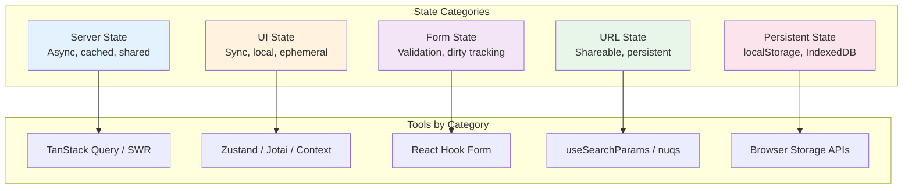

# Client State Management

Choosing the right state management approach requires understanding that "state" is not monolithic—different categories have fundamentally different requirements. Server state needs caching, deduplication, and background sync. UI state needs fast updates and component isolation. Form state needs validation and dirty tracking. Conflating these categories is the root cause of most state management complexity.

<figure>



<figcaption>State categories map to specialized tools—using the wrong tool for a category creates unnecessary complexity.</figcaption>
</figure>

## Abstract

Client state management reduces to one principle: **match the tool to the state category**.

- **Server state** (API data) → Use TanStack Query or SWR. These handle caching, deduplication, background refetch, and optimistic updates. Trying to manage server state with Redux or Context creates cache invalidation nightmares.
- **UI state** → Start with `useState`. Escalate to Context for cross-component sharing, Zustand for module-level state, or Jotai for fine-grained reactivity. Global state libraries are overkill for most UI state.
- **Form state** → Use React Hook Form for performance-critical forms (uncontrolled inputs, minimal re-renders). Built-in browser validation covers most cases.
- **URL state** → Store filters, pagination, and view modes in query parameters. Makes state shareable and survives refresh.
- **Derived state** → Compute, don't store. Use selectors with memoization to avoid stale data and reduce state surface area.

The 2025 consensus: push server state to specialized libraries, keep global state minimal, and let URLs carry shareable state.

## State Categories

Not all state is equal. Each category has distinct characteristics that dictate the right management approach.

### Server State

Data fetched from APIs. Characteristics:

| Property       | Implication                        |
| -------------- | ---------------------------------- |
| Asynchronous   | Needs loading/error states         |
| Shared         | Multiple components read same data |
| Cacheable      | Avoid redundant fetches            |
| Stale          | Data can become outdated           |
| Owned remotely | Server is source of truth          |

**Why specialized tools exist:** Managing server state with `useState` or Redux requires manually handling caching, deduplication, background refetch, cache invalidation, and optimistic updates. TanStack Query and SWR solve these problems out of the box.

### UI State

Local, synchronous state for user interactions:

- Modal open/closed
- Dropdown selections
- Accordion expansion
- Animation states
- Component-specific flags

**Design principle:** UI state should live as close to where it's used as possible. Lifting state to global stores creates unnecessary coupling and re-renders.

### Form State

Specialized category with unique requirements:

| Requirement      | Why It Matters               |
| ---------------- | ---------------------------- |
| Dirty tracking   | Show unsaved changes warning |
| Validation       | Field-level and form-level   |
| Submission state | Disable button, show loading |
| Error mapping    | Associate errors with fields |
| Array fields     | Dynamic add/remove rows      |

**Why form libraries exist:** Native form handling with `useState` creates excessive re-renders (every keystroke triggers render). Libraries like React Hook Form use uncontrolled inputs to batch updates.

### URL State

Query parameters and path segments that represent application state:

```
/products?category=electronics&sort=price&page=2
```

**Why URL state matters:**

1. **Shareable** — Users can share filtered views
2. **Bookmarkable** — Browser back/forward works correctly
3. **Server-renderable** — Initial state from URL, no hydration mismatch
4. **Debuggable** — State visible in address bar

### Persistent State

State that survives page refresh or browser close:

| Storage        | Capacity     | Persistence  | Use Case                |
| -------------- | ------------ | ------------ | ----------------------- |
| localStorage   | 5MB          | Permanent    | Preferences, tokens     |
| sessionStorage | 5MB          | Tab lifetime | Temporary wizard state  |
| IndexedDB      | ~50% of disk | Permanent    | Large datasets, offline |
| Cookies        | 4KB          | Configurable | Auth tokens (httpOnly)  |

## Server State Management

### The Stale-While-Revalidate Pattern

SWR (the library) is named after RFC 5861's `stale-while-revalidate` cache directive. The pattern:

1. Return cached (potentially stale) data immediately
2. Revalidate in the background
3. Update UI when fresh data arrives

**Why this design:** Users see instant responses while data freshness is maintained. The alternative—waiting for network—creates perceived slowness even on fast connections.

### TanStack Query Deep Dive

As of TanStack Query v5, the core caching model uses two time-based controls:

| Setting     | Default | Purpose                               |
| ----------- | ------- | ------------------------------------- |
| `staleTime` | 0       | How long data is considered fresh     |
| `gcTime`    | 5 min   | How long inactive data stays in cache |

**Critical relationship:** `gcTime` must be ≥ `staleTime`. If cache is garbage collected before data goes stale, you lose the cached data before you'd naturally refetch it.

```ts title="query-config.ts" collapse={1-2,12-20}
import { QueryClient } from "@tanstack/react-query"

// Aggressive refetching (default): always revalidate
const defaultConfig = {
  staleTime: 0, // Data immediately stale
  gcTime: 5 * 60_000, // Keep in cache 5 minutes
}

// Conservative refetching: stable data
const stableDataConfig = {
  staleTime: 15 * 60_000, // Fresh for 15 minutes
  gcTime: 30 * 60_000, // Cache for 30 minutes
}

const queryClient = new QueryClient({
  defaultOptions: {
    queries: defaultConfig,
  },
})
```

**When staleTime > 0 makes sense:**

- User profile data (changes infrequently)
- Configuration/feature flags
- Reference data (countries, currencies)
- Data with explicit invalidation triggers

**Design rationale behind staleTime: 0 default:** TanStack Query chose safety over efficiency. Stale data causes bugs that are hard to trace; extra network requests are visible and debuggable.

### Automatic Refetch Triggers

TanStack Query refetches stale queries on:

| Trigger                | Default | Rationale                            |
| ---------------------- | ------- | ------------------------------------ |
| `refetchOnMount`       | true    | Component might show stale data      |
| `refetchOnWindowFocus` | true    | User returned, data may have changed |
| `refetchOnReconnect`   | true    | Network was down, data may be stale  |

**Production consideration:** Disable `refetchOnWindowFocus` for data that rarely changes or where refetch is expensive:

```ts collapse={1-3}
import { useQuery } from "@tanstack/react-query"

useQuery({
  queryKey: ["analytics", "dashboard"],
  queryFn: fetchDashboard,
  refetchOnWindowFocus: false, // Heavy query, explicit refresh only
  staleTime: 5 * 60_000,
})
```

### Request Deduplication

TanStack Query automatically deduplicates in-flight requests:

```ts collapse={1-4}
// Both components mount simultaneously
// Only ONE network request is made

// Component A
const { data } = useQuery({ queryKey: ["user", 1], queryFn: fetchUser })

// Component B (mounts at same time)
const { data } = useQuery({ queryKey: ["user", 1], queryFn: fetchUser })
// ↑ Shares the in-flight request from Component A
```

**How it works:** Query keys are serialized and compared. If a request for that key is already pending, subsequent calls wait for the same Promise.

### Cache Invalidation Strategies

Invalidation marks queries as stale, triggering refetch if they're currently rendered.

```ts title="invalidation-patterns.ts" collapse={1-3,25-30}
import { useQueryClient } from "@tanstack/react-query"

const queryClient = useQueryClient()

// Invalidate all queries starting with 'todos'
queryClient.invalidateQueries({ queryKey: ["todos"] })

// Invalidate exact key only
queryClient.invalidateQueries({
  queryKey: ["todos", "list"],
  exact: true,
})

// Predicate-based invalidation
queryClient.invalidateQueries({
  predicate: (query) => query.queryKey[0] === "todos" && query.state.data?.some((todo) => todo.assignee === userId),
})

// Invalidate and refetch immediately (don't wait for render)
queryClient.invalidateQueries({
  queryKey: ["todos"],
  refetchType: "all", // Also refetch inactive queries
})
```

**Design decision:** Invalidation is separate from refetching. `invalidateQueries` only marks as stale—actual refetch happens when the query is rendered. Use `refetchQueries` for immediate network call regardless of render state.

### Optimistic Updates

Update the UI immediately, roll back on error:

```ts title="optimistic-update.ts" collapse={1-5,35-45}
import { useMutation, useQueryClient } from "@tanstack/react-query"

interface Todo {
  id: string
  title: string
  completed: boolean
}

const queryClient = useQueryClient()

const mutation = useMutation({
  mutationFn: updateTodo,
  onMutate: async (newTodo) => {
    // Cancel outgoing refetches (they'd overwrite optimistic update)
    await queryClient.cancelQueries({ queryKey: ["todos"] })

    // Snapshot previous value
    const previous = queryClient.getQueryData<Todo[]>(["todos"])

    // Optimistically update
    queryClient.setQueryData<Todo[]>(["todos"], (old) => old?.map((t) => (t.id === newTodo.id ? newTodo : t)))

    // Return snapshot for rollback
    return { previous }
  },
  onError: (err, newTodo, context) => {
    // Roll back on error
    queryClient.setQueryData(["todos"], context?.previous)
  },
  onSettled: () => {
    // Refetch to ensure server state
    queryClient.invalidateQueries({ queryKey: ["todos"] })
  },
})
```

**Why `onSettled` invalidation:** Even on success, the server might have modified the data (timestamps, computed fields). Invalidation ensures the cache matches server state.

### SWR Comparison

SWR takes a more minimal approach:

| Feature               | TanStack Query     | SWR                   |
| --------------------- | ------------------ | --------------------- |
| Devtools              | Built-in           | Community             |
| Mutations             | `useMutation` hook | Manual with `mutate`  |
| Infinite queries      | `useInfiniteQuery` | `useSWRInfinite`      |
| Optimistic updates    | Via `onMutate`     | Via `optimisticData`  |
| Request deduplication | Automatic          | Configurable interval |
| Bundle size           | ~13KB              | ~4KB                  |

**When to choose SWR:** Simpler apps, smaller bundle priority, preference for minimal API. SWR's `mutate` function handles most cases without dedicated mutation hooks.

## Global UI State

### When Global State Is Necessary

Global state is appropriate when:

1. **Multiple unrelated components** need the same data
2. **No common ancestor** can reasonably hold the state
3. **State persists** across route changes

Common legitimate cases:

- Authentication state
- Theme/appearance settings
- Feature flags
- Toast/notification queue
- Modal registry

### When to Avoid Global State

**Server state doesn't belong in global stores.** This was the primary mistake of early Redux applications. Patterns like "fetch in action creator, store in Redux" create:

- Manual cache invalidation logic
- No request deduplication
- No background refetch
- Complex loading state management

> "With the hooks provided by React, you can share these pieces of application state with the rest of the application. No need for a library to do it for you."
> — Kent C. Dodds, "Application State Management with React"

### React Context Limitations

Context is not optimized for frequent updates:

```ts title="context-problem.tsx" collapse={1-3}
import { createContext, useContext, useState } from 'react'

interface AppState {
  user: User
  theme: 'light' | 'dark'
  notifications: Notification[]
}

const AppContext = createContext<AppState | null>(null)

function App() {
  const [state, setState] = useState<AppState>(/* ... */)

  return (
    <AppContext.Provider value={state}>
      <Header />      {/* Re-renders when notifications change */}
      <Sidebar />     {/* Re-renders when theme changes */}
      <NotificationBell />  {/* The only component that needs notifications */}
    </AppContext.Provider>
  )
}
```

**Problem:** Every context consumer re-renders when _any_ part of the context value changes, even if that consumer only uses a subset.

**Solutions:**

1. **Split contexts** — One context per concern (theme, auth, notifications)
2. **Memoize values** — `useMemo` to prevent new object references
3. **External stores** — Zustand/Jotai with selective subscriptions

### Zustand: Module-First State

Zustand (12KB gzipped) provides a minimal API with selective subscriptions:

```ts title="store.ts" collapse={1-2}
import { create } from 'zustand'

interface BearStore {
  bears: number
  fish: number
  increasePopulation: () => void
  eatFish: () => void
}

const useBearStore = create<BearStore>((set) => ({
  bears: 0,
  fish: 10,
  increasePopulation: () => set((state) => ({ bears: state.bears + 1 })),
  eatFish: () => set((state) => ({ fish: state.fish - 1 })),
}))

// Selective subscription — only re-renders when bears changes
function BearCounter() {
  const bears = useBearStore((state) => state.bears)
  return <h1>{bears} bears</h1>
}

// Different subscription — only re-renders when fish changes
function FishCounter() {
  const fish = useBearStore((state) => state.fish)
  return <h1>{fish} fish</h1>
}
```

**Design rationale:** Zustand uses `useSyncExternalStore` internally. Selectors enable components to subscribe to specific slices, avoiding the Context re-render problem.

### Jotai: Atomic State

Jotai (bottom-up) vs Zustand (top-down):

```ts title="atoms.ts" collapse={1-2}
import { atom, useAtom, useAtomValue, useSetAtom } from 'jotai'

// Primitive atoms
const countAtom = atom(0)
const doubledAtom = atom((get) => get(countAtom) * 2)  // Derived

// Component only subscribes to what it reads
function Counter() {
  const [count, setCount] = useAtom(countAtom)
  return <button onClick={() => setCount(c => c + 1)}>{count}</button>
}

// Read-only subscription (no setter in bundle)
function Display() {
  const doubled = useAtomValue(doubledAtom)
  return <span>{doubled}</span>
}

// Write-only (no subscription, no re-render on change)
function ResetButton() {
  const setCount = useSetAtom(countAtom)
  return <button onClick={() => setCount(0)}>Reset</button>
}
```

**When Jotai over Zustand:**

- Fine-grained reactivity needed (many independent pieces)
- Derived state with complex dependency graphs
- Preference for bottom-up composition

### Redux Toolkit: When Scale Demands It

Redux remains appropriate for:

- Large teams needing strict patterns
- Complex middleware requirements (sagas, thunks)
- Time-travel debugging critical
- Existing Redux investment

**Modern Redux ≠ boilerplate Redux.** RTK (Redux Toolkit) eliminates most ceremony:

```ts title="slice.ts" collapse={1-3}
import { createSlice, PayloadAction } from "@reduxjs/toolkit"

interface CounterState {
  value: number
}

const counterSlice = createSlice({
  name: "counter",
  initialState: { value: 0 } as CounterState,
  reducers: {
    increment: (state) => {
      state.value += 1
    }, // Immer handles immutability
    incrementByAmount: (state, action: PayloadAction<number>) => {
      state.value += action.payload
    },
  },
})

export const { increment, incrementByAmount } = counterSlice.actions
export default counterSlice.reducer
```

### Decision Matrix

| Scenario                    | Recommended Tool        |
| --------------------------- | ----------------------- |
| Server data                 | TanStack Query / SWR    |
| Theme, auth                 | Context (low frequency) |
| Module state (single store) | Zustand                 |
| Fine-grained atoms          | Jotai                   |
| Large team, middleware      | Redux Toolkit           |
| Complex workflows           | XState                  |

## Form State Management

### Why Form Libraries Exist

Native controlled inputs re-render on every keystroke:

```ts collapse={1-2}
// Every character typed re-renders the entire component
function NaiveForm() {
  const [values, setValues] = useState({ email: '', password: '' })

  return (
    <form>
      <input
        value={values.email}
        onChange={(e) => setValues(v => ({ ...v, email: e.target.value }))}
      />
      {/* Form re-renders on every keystroke */}
    </form>
  )
}
```

With 10+ fields and validation, this creates noticeable lag on lower-end devices.

### React Hook Form

React Hook Form (12KB) uses uncontrolled inputs with refs:

```ts title="form.tsx" collapse={1-4,30-35}
import { useForm } from 'react-hook-form'
import { zodResolver } from '@hookform/resolvers/zod'
import { z } from 'zod'

const schema = z.object({
  email: z.string().email(),
  password: z.string().min(8),
})

type FormData = z.infer<typeof schema>

function LoginForm() {
  const {
    register,
    handleSubmit,
    formState: { errors, isSubmitting }
  } = useForm<FormData>({
    resolver: zodResolver(schema),
  })

  const onSubmit = async (data: FormData) => {
    await login(data)
  }

  return (
    <form onSubmit={handleSubmit(onSubmit)}>
      <input {...register('email')} />
      {errors.email && <span>{errors.email.message}</span>}

      <input type="password" {...register('password')} />
      {errors.password && <span>{errors.password.message}</span>}

      <button disabled={isSubmitting}>Submit</button>
    </form>
  )
}
```

**Performance model:** Inputs are uncontrolled (DOM holds value). Re-renders only happen when:

- `formState` properties you're subscribed to change
- Explicit `watch()` calls
- Validation errors change

### When to Use Native Forms

React Hook Form is overkill for:

- Login forms (2-3 fields)
- Search inputs
- Simple settings toggles

Native HTML validation covers basic cases:

```html
<input type="email" required minlength="3" pattern="[a-z]+" />
```

## Derived State and Selectors

### Compute, Don't Store

Storing derived data creates synchronization bugs:

```ts
// ❌ Storing derived state
interface State {
  items: Item[]
  completedItems: Item[] // Derived from items
  completedCount: number // Derived from completedItems
}

// ✅ Computing derived state
interface State {
  items: Item[]
}

const completedItems = items.filter((i) => i.completed)
const completedCount = completedItems.length
```

**Why computation is better:**

1. Single source of truth (no sync bugs)
2. Less state to manage
3. Automatic consistency

### Memoized Selectors

For expensive computations, memoize with Reselect or `useMemo`:

```ts title="selectors.ts" collapse={1-3}
import { createSelector } from "reselect"

const selectItems = (state: State) => state.items

const selectCompletedItems = createSelector([selectItems], (items) => items.filter((i) => i.completed))

const selectCompletedCount = createSelector([selectCompletedItems], (completed) => completed.length)

// Reselect memoizes by reference equality
// If items hasn't changed, cached result is returned
```

**How Reselect works:** Input selectors are called first. If their results are referentially equal to the previous call, the output selector is skipped and cached result returned.

### Zustand Selectors

```ts collapse={1-2}
import { useStore } from "./store"

// Component re-renders only when filtered result changes
function CompletedList() {
  const completed = useStore((state) => state.items.filter((i) => i.completed))
  // ⚠️ Creates new array every time — need memoization
}

// Better: external memoized selector
import { createSelector } from "reselect"

const selectCompleted = createSelector(
  (state: State) => state.items,
  (items) => items.filter((i) => i.completed),
)

function CompletedList() {
  const completed = useStore(selectCompleted) // Stable reference
}
```

## State Machines with XState

### When State Machines Are Necessary

State machines excel when:

1. **States have impossible combinations** — `isLoading && hasError && hasData` shouldn't all be true
2. **Transitions matter** — Can only go from `idle` → `loading`, not `idle` → `success`
3. **Complex sequences** — Multi-step wizards, checkout flows
4. **Parallel states** — Audio playing while video loading

### XState v5 Example

```ts title="fetch-machine.ts" collapse={1-3}
import { setup, assign, fromPromise } from "xstate"

interface Context {
  data: User | null
  error: Error | null
}

const fetchMachine = setup({
  types: {} as {
    context: Context
    events: { type: "FETCH"; id: string } | { type: "RETRY" }
  },
  actors: {
    fetchUser: fromPromise(async ({ input }: { input: { id: string } }) => {
      const response = await fetch(`/api/users/${input.id}`)
      if (!response.ok) throw new Error("Failed")
      return response.json()
    }),
  },
}).createMachine({
  id: "fetch",
  initial: "idle",
  context: { data: null, error: null },
  states: {
    idle: {
      on: { FETCH: "loading" },
    },
    loading: {
      invoke: {
        src: "fetchUser",
        input: ({ event }) => ({ id: event.id }),
        onDone: {
          target: "success",
          actions: assign({ data: ({ event }) => event.output }),
        },
        onError: {
          target: "failure",
          actions: assign({ error: ({ event }) => event.error }),
        },
      },
    },
    success: {
      on: { FETCH: "loading" },
    },
    failure: {
      on: { RETRY: "loading" },
    },
  },
})
```

**What XState provides:**

- **Type-safe transitions** — TypeScript enforces valid state/event combinations
- **Visualization** — Export to state diagram
- **Testing** — Model-based testing against the machine
- **Impossible states eliminated** — Can't be loading and failed simultaneously

### When State Machines Are Overkill

- Simple toggles (open/closed)
- Linear forms without complex validation
- CRUD operations (TanStack Query handles state)

**Rule of thumb:** If you can express it clearly with `useState` + a few conditionals, don't add XState's complexity.

## Real-World Implementations

### Figma: WebGL + Custom State

**Challenge:** Millions of objects on infinite canvas

**Approach:**

- WebGL rendering (bypasses DOM entirely)
- R-tree spatial indexing for viewport queries
- Level-of-detail: simplify distant objects
- Custom state synchronization (no off-the-shelf library)

**Key insight:** At Figma's scale, no existing state library worked. They built custom solutions optimized for their specific access patterns.

### Notion: Block-Based State

**Challenge:** Documents with 10K+ blocks, real-time collaboration

**Approach:**

- Block-based data model (each block has type, content, children)
- Redux for client state
- Transactions for grouping changes
- Kafka + Spark for server-side propagation

**Local update pattern:**

1. User edits block
2. Change grouped into transaction
3. Optimistic update to Redux
4. Transaction sent to server
5. Server broadcasts to collaborators

### Linear: MobX + WebSockets

**Challenge:** Real-time project management across teams

**Approach:**

- MobX for reactive state
- Bootstrap full state on load
- WebSocket stream of changesets
- Merge local and remote changes continuously

**Why MobX:** Linear chose observable-based reactivity for automatic UI updates when any referenced data changes.

### Discord: Event Sourcing for Messages

**Challenge:** Millions of messages per second

**Architecture evolution:**

1. MongoDB (couldn't scale)
2. Cassandra (scales but complex)
3. Event sourcing for message history

**State requirements:**

- Stateful processes tracking user → socket mapping
- Separate processes holding actual WebSocket connections
- Event log as source of truth for message state

## Performance Optimization

### Re-render Prevention

| Technique                   | When to Use                    | Effort |
| --------------------------- | ------------------------------ | ------ |
| Selector functions          | Always with Zustand/Redux      | Low    |
| `useAtomValue`/`useSetAtom` | Jotai read/write separation    | Low    |
| `React.memo`                | Expensive child components     | Medium |
| Context splitting           | Multiple independent concerns  | Medium |
| State collocation           | State used by single component | Low    |

### State Normalization

For relational data, normalize to avoid duplication:

```ts
// ❌ Denormalized (data duplication)
interface State {
  posts: Array<{
    id: string
    author: { id: string; name: string } // Duplicated across posts
    content: string
  }>
}

// ✅ Normalized (single source of truth)
interface State {
  users: Record<string, User>
  posts: Record<string, { id: string; authorId: string; content: string }>
}
```

**Benefits:**

- O(1) lookup by ID
- Single place to update user name
- Smaller state size (no duplication)

### Mobile Considerations

Mobile devices have tighter constraints:

| Constraint | Desktop    | Mobile             | Mitigation                |
| ---------- | ---------- | ------------------ | ------------------------- |
| Memory     | 500MB–1GB  | 50–200MB           | Aggressive cache eviction |
| CPU        | Multi-core | Thermal throttling | Reduce computation        |
| Network    | Stable     | Intermittent       | Offline-first patterns    |
| Battery    | N/A        | Critical           | Reduce background sync    |

**Offline-first pattern:**

1. Store critical data in IndexedDB
2. Queue mutations when offline
3. Sync when connection restored
4. Resolve conflicts (last-write-wins or merge)

## Browser Constraints

### Storage Quotas

| Storage      | Chrome       | Safari | Firefox      |
| ------------ | ------------ | ------ | ------------ |
| localStorage | 5MB          | 5MB    | 5MB          |
| IndexedDB    | ~50% of disk | 1GB    | ~50% of disk |
| Cache API    | ~50% of disk | 50MB   | ~50% of disk |

**Safari limitation:** Safari's 1GB IndexedDB cap and 50MB Cache API limit make it the constraint for offline-heavy apps.

### Main Thread Budget

60fps = 16ms per frame. State updates compete with:

- Layout calculation
- Paint
- JavaScript execution
- Garbage collection

**Mitigation strategies:**

1. **Web Workers** — Heavy computation off main thread
2. **`requestIdleCallback`** — Non-critical state updates
3. **Chunked updates** — Split large state changes across frames

## Conclusion

State management in 2025 is solved—the challenge is selecting the right solution for each category:

1. **Server state → TanStack Query/SWR.** Stop managing caches manually.
2. **UI state → Keep it local.** `useState` handles most cases.
3. **Shared UI state → Zustand or Jotai.** Not Redux unless you need its ecosystem.
4. **Form state → React Hook Form.** Performance matters at scale.
5. **Shareable state → URL params.** Users can bookmark and share.
6. **Complex workflows → XState.** When state transitions are the problem.

The pattern across successful products: minimize global state, specialize tools by category, and push server data to purpose-built libraries.

## Appendix

### Prerequisites

- React hooks (`useState`, `useReducer`, `useContext`, `useMemo`)
- Async JavaScript (Promises, async/await)
- REST API patterns
- Basic understanding of caching concepts

### Terminology

| Term                   | Definition                                                       |
| ---------------------- | ---------------------------------------------------------------- |
| **Stale data**         | Cached data that may no longer match the server                  |
| **Cache invalidation** | Marking cached data as stale, triggering refetch                 |
| **Optimistic update**  | Updating UI before server confirms, rolling back on error        |
| **Derived state**      | State computed from other state, not stored independently        |
| **Normalized state**   | Flat structure with entities keyed by ID, references by ID       |
| **Selector**           | Function that extracts/computes a slice of state                 |
| **Atom**               | Minimal unit of state in atomic state management (Jotai, Recoil) |

### Summary

- **Match tool to category:** Server state needs TanStack Query/SWR, not Redux
- **Server state libraries handle:** Caching, deduplication, background refetch, optimistic updates
- **Context re-renders all consumers:** Split contexts or use external stores for frequent updates
- **Zustand for modules, Jotai for atoms:** Choose based on state granularity needs
- **Compute derived state:** Don't store what you can calculate
- **URL state is shareable state:** Filters, pagination, view modes belong in query params

### References

- [TanStack Query Documentation](https://tanstack.com/query/latest) — Caching, invalidation, mutations
- [SWR Documentation](https://swr.vercel.app/) — Stale-while-revalidate implementation
- [RFC 5861: HTTP Cache-Control Extensions](https://datatracker.ietf.org/doc/html/rfc5861) — Origin of stale-while-revalidate
- [Zustand Documentation](https://zustand.docs.pmnd.rs/) — Module-first state management
- [Jotai Documentation](https://jotai.org/) — Atomic state management
- [XState Documentation](https://xstate.js.org/docs/) — State machines and actors
- [React Hook Form Documentation](https://react-hook-form.com/) — Performant form handling
- [Kent C. Dodds: Application State Management with React](https://kentcdodds.com/blog/application-state-management-with-react) — When to use which approach
- [Redux: Normalizing State Shape](https://redux.js.org/usage/structuring-reducers/normalizing-state-shape) — Entity normalization patterns
- [Figma Engineering Blog](https://www.figma.com/blog/section/engineering/) — Custom state at scale
- [Notion: The data model behind Notion](https://www.notion.so/blog/data-model-behind-notion) — Block-based architecture
- [Linear Engineering](https://linear.app/blog) — Real-time state sync patterns
