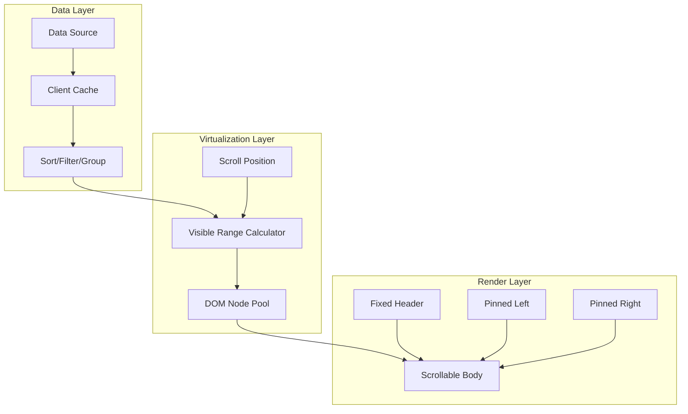
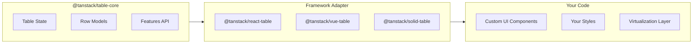
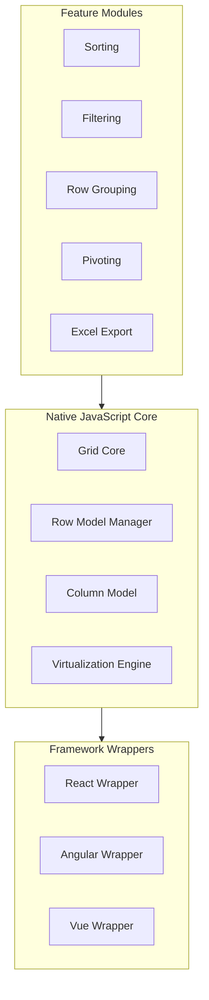
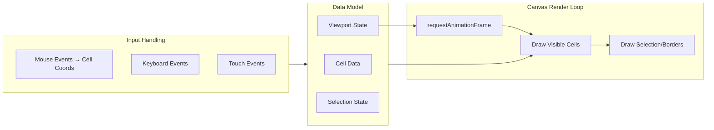
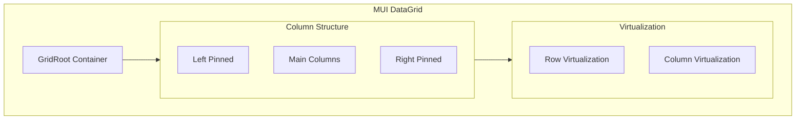
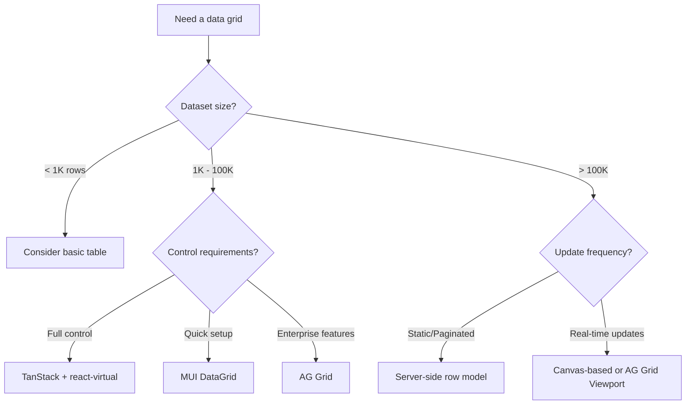
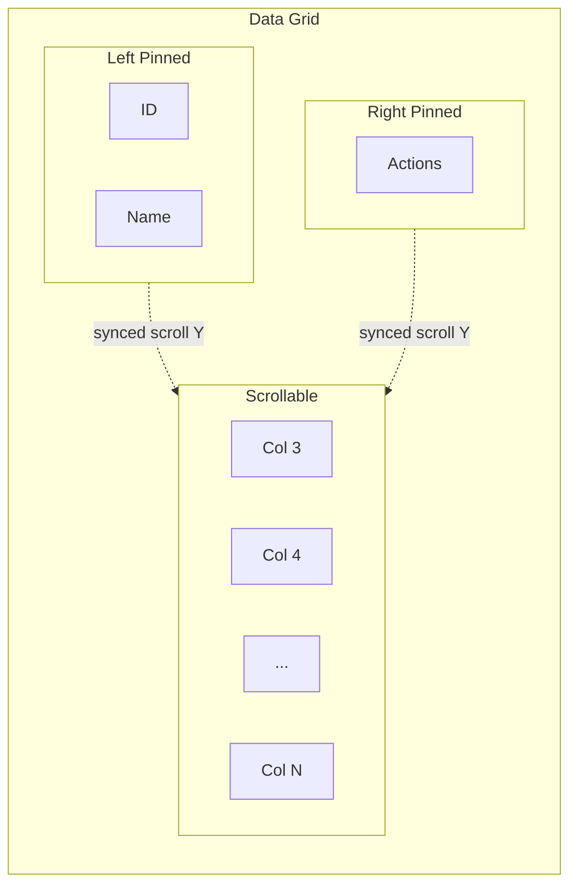

# Design a Data Grid

High-performance data grids render thousands to millions of rows while maintaining 60fps scrolling and sub-second interactions. This article explores the architectural patterns, virtualization strategies, and implementation trade-offs that separate production-grade grids from naive table implementations.

The core challenge: browsers struggle with more than a few thousand DOM nodes. A grid with 100,000 rows and 20 columns would create 2 million cells—rendering all of them guarantees a frozen UI. Every major grid library solves this through virtualization, but their approaches differ significantly in complexity, flexibility, and performance characteristics.

<figure>



<figcaption>Data grid architecture: data flows through transformation and virtualization layers before reaching the render layer, which splits into fixed headers and pinned columns.</figcaption>
</figure>

## Abstract

Data grids are constrained optimization problems balancing DOM size, memory usage, rendering latency, and feature richness:

- **Virtualization is non-negotiable** for grids beyond ~100 rows. Fixed-height virtualization uses O(1) position calculation; variable-height requires height caching and estimation.
- **Four architectural approaches** exist: headless libraries (TanStack Table—you own rendering), full-featured frameworks (AG Grid—batteries included), canvas-based (Google Sheets—bypasses DOM entirely), and hybrid (MUI DataGrid—React integration with virtualization).
- **Row models determine scalability**: client-side works for <100K rows in memory; server-side/infinite models handle millions by fetching data on demand.
- **Column pinning splits the grid** into three synchronized scroll regions, creating coordination complexity for selection and keyboard navigation.
- **Accessibility requires explicit implementation**: ARIA grid roles, two-dimensional keyboard navigation, and screen reader announcements don't come free with virtualization.

The right choice depends on dataset size, feature requirements, and whether you need control over rendering (headless) or prefer comprehensive defaults (full-featured).

## The Challenge

### Browser Constraints

Data grids stress browsers in ways most UIs don't:

| Constraint    | Limit               | Impact on Grids                              |
| ------------- | ------------------- | -------------------------------------------- |
| DOM nodes     | ~10,000 before jank | 100 rows × 20 columns = 2,000 cells minimum  |
| Main thread   | 16ms per frame      | Sort of 100K rows blocks UI for seconds      |
| Layout recalc | O(n) affected nodes | Column resize triggers full row recalc       |
| Memory        | 50-300MB practical  | Each row object + DOM node + event listeners |
| Scroll events | 60+ per second      | Handler must complete in <10ms               |

The 16ms frame budget disappears quickly. A scroll event handler that calculates visible rows, updates DOM, and triggers layout easily exceeds this on mid-range devices.

### Scale Factors

| Factor           | Small Scale | Large Scale  | Architectural Impact            |
| ---------------- | ----------- | ------------ | ------------------------------- |
| Row count        | <1,000      | >100,000     | Client-side vs server-side data |
| Column count     | <10         | >50          | Column virtualization required  |
| Cell complexity  | Text only   | Rich editors | Render cost per cell            |
| Update frequency | Static      | Real-time    | Batch updates, dirty checking   |
| Selection scope  | Single row  | Multi-range  | Selection state management      |

### User Experience Requirements

- **Perceived latency**: Scrolling must feel instant. Users notice >100ms delays.
- **Sort/filter responsiveness**: <500ms for in-memory operations, progressive feedback for server calls.
- **Edit feedback**: Cell changes must reflect immediately, even if server sync is async.
- **Keyboard navigation**: Power users expect Excel-like navigation without reaching for the mouse.

## Design Paths

### Path 1: Headless Library (TanStack Table)

**Architecture:**

TanStack Table (formerly React Table v8) provides table logic without rendering opinions. You get state management, sorting, filtering, grouping, and pagination—but zero UI.



**How it works:**

The library exposes hooks (`useReactTable`) that return table instance objects. You destructure methods like `getHeaderGroups()`, `getRowModel()`, and `getVisibleCells()` to build your own markup. Sorting, filtering, and pagination are opt-in row models you import and configure.

```ts title="TanStack Table setup" collapse={1-5, 25-35}
import {
  useReactTable,
  getCoreRowModel,
  getSortedRowModel,
  flexRender,
} from "@tanstack/react-table"

const table = useReactTable({
  data,
  columns,
  getCoreRowModel: getCoreRowModel(),
  getSortedRowModel: getSortedRowModel(),
  state: { sorting },
  onSortingChange: setSorting,
})

// You render everything yourself
return (
  <table>
    <tbody>
      {table.getRowModel().rows.map((row) => (
        <tr key={row.id}>
          {row.getVisibleCells().map((cell) => (
            <td key={cell.id}>{flexRender(cell.column.columnDef.cell, cell.getContext())}</td>
          ))}
        </tr>
      ))}
    </tbody>
  </table>
)
```

**Best for:**

- Teams wanting full control over markup and styling
- Design systems requiring specific HTML structure
- Applications where bundle size is critical (core is ~15KB)
- Projects already using a virtualization library (react-window, react-virtual)

**Device/network profile:**

- Works well on: All devices (rendering is your responsibility)
- Struggles on: None inherently—performance depends on your implementation

**Implementation complexity:**

| Aspect             | Effort                            |
| ------------------ | --------------------------------- |
| Initial setup      | Medium—must build UI from scratch |
| Feature additions  | Low—APIs are composable           |
| Performance tuning | High—virtualization is DIY        |
| Testing            | Medium—test your rendering logic  |

**Real-world example:**

TanStack Table powers countless production applications where teams need precise control. The library author (Tanner Linsley) specifically designed v8 as a rewrite to be fully headless after v7's plugin system proved too opinionated. Bundle size dropped from ~40KB to ~15KB.

**Trade-offs vs other paths:**

- ✅ Complete rendering control
- ✅ Smallest bundle for core logic
- ✅ Framework-agnostic core
- ❌ No built-in virtualization
- ❌ More code to write
- ❌ Accessibility is your responsibility

---

### Path 2: Full-Featured Framework (AG Grid)

**Architecture:**

AG Grid provides everything: virtualization, sorting, filtering, grouping, pivoting, Excel export, and enterprise features. The core is vanilla JavaScript with framework-specific wrappers.



**How it works:**

AG Grid implements four distinct row models for different scale requirements:

1. **Client-Side Row Model** (default): Loads all data into memory. Supports full sorting, filtering, grouping, and aggregation in the browser. Efficient up to ~100K rows due to DOM virtualization.

2. **Infinite Row Model**: Lazy-loads data blocks as users scroll. Best for large flat datasets where full client-side loading is impractical.

3. **Server-Side Row Model** (Enterprise): Extends infinite scrolling with server-side grouping and aggregation. Handles millions of rows by fetching grouped data on demand.

4. **Viewport Row Model** (Enterprise): Server controls exactly what's visible. Useful for rapidly changing data where the server needs to know the user's viewport.

```ts title="AG Grid with server-side model" collapse={1-3, 20-30}
import { AgGridReact } from "ag-grid-react"
import "ag-grid-enterprise"
import "ag-grid-community/styles/ag-grid.css"

const gridOptions = {
  rowModelType: "serverSide",
  serverSideDatasource: {
    getRows: (params) => {
      // Server handles sorting, filtering, grouping
      fetch("/api/rows", {
        method: "POST",
        body: JSON.stringify({
          startRow: params.request.startRow,
          endRow: params.request.endRow,
          sortModel: params.request.sortModel,
          filterModel: params.request.filterModel,
          groupKeys: params.request.groupKeys,
        }),
      })
        .then((res) => res.json())
        .then((data) => params.success({ rowData: data.rows, rowCount: data.total }))
    },
  },
}
```

**Best for:**

- Enterprise applications with complex requirements (pivoting, Excel export)
- Teams preferring configuration over code
- Applications requiring server-side data operations
- Financial and analytics dashboards

**Device/network profile:**

- Works well on: Desktop browsers, tablets with sufficient memory
- Struggles on: Low-end mobile devices with large datasets (memory pressure)

**Implementation complexity:**

| Aspect             | Effort                             |
| ------------------ | ---------------------------------- |
| Initial setup      | Low—works out of the box           |
| Feature additions  | Low—most features are config flags |
| Performance tuning | Medium—tune row model and caching  |
| Testing            | Low—well-documented behavior       |

**Real-world example:**

Financial institutions use AG Grid for trading desks where grids display real-time market data with 50+ columns and thousands of rows updating per second. The viewport row model ensures only visible cells receive updates, while server-side grouping handles position aggregation without client-side computation.

**Trade-offs vs other paths:**

- ✅ Comprehensive feature set
- ✅ Excellent documentation
- ✅ Battle-tested at scale
- ❌ Large bundle (~300KB+ for enterprise)
- ❌ Styling requires understanding their architecture
- ❌ Enterprise license cost for advanced features

---

### Path 3: Canvas-Based Rendering (Custom/Specialized)

**Architecture:**

Canvas-based grids bypass the DOM entirely, drawing cells directly to a 2D canvas context. This eliminates DOM overhead but requires implementing everything: text rendering, selection highlights, scrollbars.



**How it works:**

The rendering loop runs on `requestAnimationFrame`. On each frame:

1. Calculate which rows/columns are visible based on scroll position
2. Clear the canvas (or just the dirty regions)
3. Draw cell backgrounds, then text, then borders
4. Draw selection overlays
5. Schedule next frame if scrolling

Text input requires overlay `<input>` elements positioned over the canvas. Selection requires hit-testing mouse coordinates against cell boundaries.

**Best for:**

- Spreadsheet applications requiring 100K+ cells visible simultaneously
- Applications where DOM performance is the proven bottleneck
- Teams with graphics programming experience
- Custom visualization needs (sparklines, heatmaps in cells)

**Device/network profile:**

- Works well on: Devices with GPU acceleration, desktop browsers
- Struggles on: High-DPI displays without careful scaling, accessibility tools

**Implementation complexity:**

| Aspect             | Effort                               |
| ------------------ | ------------------------------------ |
| Initial setup      | Very high—build everything           |
| Feature additions  | High—no abstractions to lean on      |
| Performance tuning | Medium—canvas is inherently fast     |
| Testing            | High—visual testing, coordinate math |

**Real-world example:**

Google Sheets uses canvas rendering for the main cell area. Their architecture allows rendering hundreds of thousands of cells with smooth scrolling because paint operations are batched into single canvas draws rather than individual DOM mutations. The trade-off: Find-in-page (Ctrl+F) uses a custom dialog because native browser search doesn't work on canvas content.

**Trade-offs vs other paths:**

- ✅ Best raw rendering performance
- ✅ Full control over visual appearance
- ✅ No DOM node limits
- ❌ Accessibility is extremely difficult
- ❌ Browser features (find, copy, translate) require reimplementation
- ❌ Significant engineering investment

---

### Path 4: React-Integrated with Built-in Virtualization (MUI DataGrid)

**Architecture:**

MUI X DataGrid combines React integration with built-in virtualization. It renders real DOM elements but only for visible cells, bridging the gap between canvas performance and DOM accessibility.



**How it works:**

Row virtualization renders only rows in the viewport plus an overscan buffer (default: 3 rows). Column virtualization renders columns within 150px of the visible region. The grid maintains scroll position through a combination of:

- Absolute positioning of visible rows
- Spacer elements for total scrollable height
- Transform translations for smooth scroll updates

```ts title="MUI DataGrid configuration" collapse={1-4, 18-25}
import { DataGrid } from "@mui/x-data-grid"

// Virtualization is automatic
// Configure overscan for smoother scrolling
const dataGridProps = {
  rows,
  columns,
  // Row virtualization enabled by default
  // Disable with: disableVirtualization
  rowBuffer: 3, // Overscan rows above/below
  columnBuffer: 3, // Overscan columns left/right
  // Column virtualization renders cols within 150px
  columnThreshold: 3, // Min columns to trigger virtualization
}

// Note: Row virtualization capped at 100 rows in free tier
// No limit in Pro/Premium
```

**Best for:**

- React applications using Material UI
- Teams wanting virtualization without DIY implementation
- Medium-scale grids (thousands to tens of thousands of rows)
- Applications requiring standard grid features with good defaults

**Device/network profile:**

- Works well on: Modern browsers, mid-range and up devices
- Struggles on: Very large datasets (>500K rows) without server-side pagination

**Implementation complexity:**

| Aspect             | Effort                             |
| ------------------ | ---------------------------------- |
| Initial setup      | Low—npm install and configure      |
| Feature additions  | Low-medium—props for most features |
| Performance tuning | Low—virtualization is built-in     |
| Testing            | Low—documented component API       |

**Real-world example:**

Internal admin dashboards commonly use MUI DataGrid because it integrates cleanly with Material UI's design system while handling the virtualization complexity. Teams get sorting, filtering, and column operations without building UI components.

**Trade-offs vs other paths:**

- ✅ Good balance of features and bundle size
- ✅ Virtualization included
- ✅ React-idiomatic API
- ❌ Tied to MUI ecosystem
- ❌ Free tier has feature limits
- ❌ Less customizable than headless approach

---

### Decision Matrix

| Factor            | Headless (TanStack)       | Full-Featured (AG Grid) | Canvas-Based   | React-Integrated (MUI) |
| ----------------- | ------------------------- | ----------------------- | -------------- | ---------------------- |
| Bundle size       | ~15KB                     | ~300KB+                 | Custom         | ~100KB                 |
| Max rows (client) | Depends on virtualization | 100K+                   | 1M+            | 100K                   |
| Rendering control | Full                      | Limited                 | Full           | Limited                |
| Virtualization    | DIY                       | Built-in                | Native         | Built-in               |
| Accessibility     | DIY                       | Good                    | Very difficult | Good                   |
| Learning curve    | Medium                    | Low                     | Very high      | Low                    |
| Styling freedom   | Full                      | Moderate                | Full           | Material-themed        |



## Virtualization Deep Dive

Virtualization is the foundation of grid performance. Understanding its variants helps you choose the right approach.

### Fixed-Height Virtualization

When all rows have identical height, position calculation is trivial:

```ts title="Fixed-height position calculation"
// O(1) calculation - no measurement needed
const itemHeight = 35 // pixels
const scrollTop = 1500
const containerHeight = 500

const startIndex = Math.floor(scrollTop / itemHeight) // 42
const endIndex = Math.min(startIndex + Math.ceil(containerHeight / itemHeight) + 1, totalRows) // 57

const visibleRows = rows.slice(startIndex, endIndex)
const offsetY = startIndex * itemHeight // 1470px
```

Scroll performance is optimal because:

- No DOM measurement during scroll
- Binary search unnecessary—direct index calculation
- Consistent total height calculation

**Use when:** Log viewers, data tables with uniform content, lists of records.

### Variable-Height Virtualization

Real content varies. Social feeds, rich text editors, and expandable rows require dynamic height handling:

```ts title="Variable-height with measurement caching"
// Height cache: Map<rowIndex, measuredHeight>
const heightCache = new Map<number, number>()
const estimatedHeight = 50 // Fallback for unmeasured items

function getRowOffset(index: number): number {
  let offset = 0
  for (let i = 0; i < index; i++) {
    offset += heightCache.get(i) ?? estimatedHeight
  }
  return offset
}

function findStartIndex(scrollTop: number): number {
  // Binary search through cached heights
  let low = 0,
    high = totalRows - 1
  while (low < high) {
    const mid = Math.floor((low + high) / 2)
    if (getRowOffset(mid) < scrollTop) {
      low = mid + 1
    } else {
      high = mid
    }
  }
  return low
}
```

The challenges:

1. **Scroll jump**: When estimates are wrong, the total scrollable height changes as items render, causing visible jumps.
2. **Measurement timing**: You can't measure until you render, but you need heights to know what to render.
3. **Memory overhead**: Height cache grows with dataset size.

**Mitigation strategies:**

- Overscan: Render extra rows above/below viewport to provide measurement buffer
- Estimate refinement: Update estimated height as you measure more items
- Anchor preservation: When total height changes, adjust scroll position to keep visible content stable

### Column Virtualization

Wide grids need horizontal virtualization. MUI DataGrid renders columns within a configurable pixel buffer (default 150px) of the visible region:

```ts title="Column visibility calculation"
const scrollLeft = container.scrollLeft
const containerWidth = container.clientWidth

// Visible region with buffer
const visibleStart = scrollLeft - columnBuffer
const visibleEnd = scrollLeft + containerWidth + columnBuffer

const visibleColumns = columns.filter((col, index) => {
  const colStart = getColumnOffset(index)
  const colEnd = colStart + col.width
  return colEnd >= visibleStart && colStart <= visibleEnd
})
```

Column virtualization interacts with pinned columns—pinned columns are always rendered regardless of scroll position.

### Overscan Strategy

Overscan renders items beyond the visible region to prevent blank flashes during fast scrolling:

| Overscan Amount | Trade-off                                    |
| --------------- | -------------------------------------------- |
| 0               | Minimal DOM, visible flashing on fast scroll |
| 1-3             | Good balance for most use cases              |
| 5-10            | Smooth scroll, increased initial render      |
| 20+             | Defeats virtualization benefits              |

react-window exposes `overscanCount` prop. MUI DataGrid uses `rowBuffer` and `columnBuffer`.

## Column and Row Features

### Sorting Implementation

Client-side sorting is straightforward but blocks the main thread:

```ts title="Sort blocking the main thread" {3-5}
// Naive: Blocks UI during sort
function sortRows(rows: Row[], sortKey: string, direction: "asc" | "desc") {
  return [...rows].sort((a, b) => {
    // 100K comparisons block for 50-200ms
    const comparison = a[sortKey] > b[sortKey] ? 1 : -1
    return direction === "asc" ? comparison : -comparison
  })
}
```

For large datasets, offload to a Web Worker:

```ts title="Web Worker sort" collapse={1-8, 22-30}
// worker.ts
self.onmessage = (e) => {
  const { rows, sortKey, direction } = e.data
  const sorted = [...rows].sort((a, b) => {
    const comparison = a[sortKey] > b[sortKey] ? 1 : -1
    return direction === "asc" ? comparison : -comparison
  })
  self.postMessage(sorted)
}

// main.ts
const worker = new Worker("worker.ts")

function sortAsync(rows: Row[], sortKey: string, direction: SortDirection): Promise<Row[]> {
  return new Promise((resolve) => {
    worker.onmessage = (e) => resolve(e.data)
    worker.postMessage({ rows, sortKey, direction })
  })
}

// UI remains responsive during sort
sortAsync(largeDataset, "name", "asc").then(setSortedRows)
```

**Server-side sorting** is required when data doesn't fit in memory. The grid sends sort parameters; the server returns sorted pages.

### Column Pinning/Freezing

Pinning creates three synchronized scroll regions:



Implementation requirements:

1. **Vertical scroll sync**: All three regions scroll vertically together
2. **Horizontal scroll isolation**: Only center region scrolls horizontally
3. **Shadow indicators**: Visual cues showing content beneath pinned columns
4. **Selection continuity**: Selection spans all regions correctly

Best practices:

- Limit left-pinned width to 200-300px (identity columns)
- Limit right-pinned to 100-150px (action buttons)
- Unpin responsively if pinned columns exceed 60% of grid width

### Row Grouping and Tree Structures

Row grouping transforms flat data into hierarchical views:

```ts title="Row grouping data structure"
interface GroupedRow {
  type: "group"
  groupKey: string
  groupValue: unknown
  children: (GroupedRow | DataRow)[]
  aggregates: Record<string, number>
  isExpanded: boolean
}

interface DataRow {
  type: "data"
  data: Record<string, unknown>
}

// Grouped structure for display
const grouped: GroupedRow = {
  type: "group",
  groupKey: "department",
  groupValue: "Engineering",
  isExpanded: true,
  aggregates: { salary: 2500000, headcount: 50 },
  children: [
    { type: "data", data: { name: "Alice", salary: 150000 } },
    { type: "data", data: { name: "Bob", salary: 140000 } },
    // ...
  ],
}
```

Client-side grouping works for moderate datasets. Server-side row models (AG Grid Enterprise) fetch grouped data on demand—expanding a group triggers a server request for children.

### Cell Editing

Cell editing modes:

| Mode           | UX                          | Implementation                     |
| -------------- | --------------------------- | ---------------------------------- |
| Click-to-edit  | Click cell → editor appears | Replace cell renderer with input   |
| Double-click   | Double-click → editor       | Same, different trigger            |
| Always-editing | Cells are always inputs     | Higher memory, keyboard challenges |
| Modal editing  | Click → popup form          | Separate form state management     |

```ts title="Inline cell editing state" collapse={1-5, 18-25}
interface CellEditState {
  rowId: string
  columnId: string
  originalValue: unknown
  currentValue: unknown
  isValid: boolean
}

function handleCellEdit(rowId: string, colId: string) {
  setEditState({
    rowId,
    columnId: colId,
    originalValue: getCellValue(rowId, colId),
    currentValue: getCellValue(rowId, colId),
    isValid: true,
  })
}

function commitEdit() {
  if (editState.isValid) {
    updateCell(editState.rowId, editState.columnId, editState.currentValue)
  }
  setEditState(null)
}

function cancelEdit() {
  setEditState(null)
}
```

Keyboard conventions:

- `Enter`: Commit and move to cell below
- `Tab`: Commit and move to next cell
- `Escape`: Cancel edit, restore original value
- `F2`: Enter edit mode on focused cell

## Accessibility

### ARIA Grid Pattern

The WAI-ARIA 1.2 specification defines the grid pattern for accessible two-dimensional navigation. Required roles:

```html title="ARIA grid structure"
<div role="grid" aria-label="Employee data" aria-rowcount="1000" aria-colcount="10">
  <div role="rowgroup">
    <div role="row" aria-rowindex="1">
      <div role="columnheader" aria-colindex="1" aria-sort="ascending">Name</div>
      <div role="columnheader" aria-colindex="2">Department</div>
    </div>
  </div>
  <div role="rowgroup">
    <div role="row" aria-rowindex="2">
      <div role="gridcell" aria-colindex="1">Alice</div>
      <div role="gridcell" aria-colindex="2">Engineering</div>
    </div>
  </div>
</div>
```

Critical attributes:

- `aria-rowcount`/`aria-colcount`: Total count (including virtualized)
- `aria-rowindex`/`aria-colindex`: Current position (1-indexed)
- `aria-sort`: Indicates sorted column (`ascending`, `descending`, `none`)
- `aria-selected`: For selectable cells/rows

### Keyboard Navigation

The spec mandates comprehensive keyboard support:

| Key           | Action                            |
| ------------- | --------------------------------- |
| Arrow keys    | Move focus one cell in direction  |
| Home/End      | First/last cell in row            |
| Ctrl+Home/End | First/last cell in grid           |
| Page Up/Down  | Move focus by visible page height |
| Ctrl+Space    | Select column                     |
| Shift+Space   | Select row                        |
| F2            | Enter edit mode                   |
| Escape        | Exit edit mode                    |

```ts title="Keyboard navigation handler" collapse={1-3, 25-35}
function handleKeyDown(e: KeyboardEvent, currentRow: number, currentCol: number) {
  switch (e.key) {
    case "ArrowRight":
      e.preventDefault()
      focusCell(currentRow, Math.min(currentCol + 1, colCount - 1))
      break
    case "ArrowLeft":
      e.preventDefault()
      focusCell(currentRow, Math.max(currentCol - 1, 0))
      break
    case "ArrowDown":
      e.preventDefault()
      focusCell(Math.min(currentRow + 1, rowCount - 1), currentCol)
      break
    case "ArrowUp":
      e.preventDefault()
      focusCell(Math.max(currentRow - 1, 0), currentCol)
      break
    case "Home":
      e.preventDefault()
      if (e.ctrlKey) {
        focusCell(0, 0)
      } else {
        focusCell(currentRow, 0)
      }
      break
    // ... additional cases
  }
}
```

### Screen Reader Considerations

Virtualization creates challenges:

1. **Dynamic content**: Screen readers may not announce cells that render during scroll
2. **Focus management**: Focus must move to newly rendered cells correctly
3. **Live regions**: Use `aria-live` for sort/filter status announcements

```html title="Status announcements"
<div aria-live="polite" aria-atomic="true" class="sr-only">
  Sorted by Name, ascending. Showing 1 to 50 of 1,000 rows.
</div>
```

Canvas-based grids face the steepest accessibility challenges—they require parallel DOM structures or ARIA virtual buffers that most implementations don't include.

## Performance Optimization

### Memoization Strategy

React grids benefit heavily from memoization:

```ts title="Memoizing row components" collapse={1-5, 18-25}
// Without memoization: every row re-renders on any state change
const Row = ({ data, columns }) => (
  <tr>
    {columns.map((col) => (
      <td key={col.id}>{data[col.field]}</td>
    ))}
  </tr>
)

// With memoization: rows only re-render when their data changes
const Row = React.memo(
  ({ data, columns }) => (
    <tr>
      {columns.map((col) => (
        <td key={col.id}>{data[col.field]}</td>
      ))}
    </tr>
  ),
  (prevProps, nextProps) => prevProps.data === nextProps.data && prevProps.columns === nextProps.columns
)
```

Common memoization mistakes:

- Creating new objects in render props: `style={{ margin: 10 }}` creates new reference every render
- Inline callbacks: `onClick={() => handleClick(id)}` defeats memoization
- Unstable column definitions: Define columns outside component or memoize

### Batch Updates

Multiple rapid updates should batch into single renders:

```ts title="Batching cell updates"
// Without batching: N updates = N renders
updates.forEach((update) => {
  setData((prev) => updateCell(prev, update))
})

// With batching: N updates = 1 render
setData((prev) => {
  let next = prev
  updates.forEach((update) => {
    next = updateCell(next, update)
  })
  return next
})
```

For real-time data (WebSocket feeds), buffer updates and flush on `requestAnimationFrame`:

```ts title="RAF-batched updates" collapse={1-5, 18-25}
const updateBuffer: Update[] = []
let rafScheduled = false

function queueUpdate(update: Update) {
  updateBuffer.push(update)
  if (!rafScheduled) {
    rafScheduled = true
    requestAnimationFrame(flushUpdates)
  }
}

function flushUpdates() {
  rafScheduled = false
  if (updateBuffer.length > 0) {
    setData((prev) => applyUpdates(prev, updateBuffer.splice(0)))
  }
}
```

### Memory Management

Large grids consume memory in multiple ways:

| Source          | Mitigation                           |
| --------------- | ------------------------------------ |
| Row data        | Paginate or virtualize data fetching |
| Height cache    | Use WeakMap, limit cache size        |
| Event listeners | Share handlers via delegation        |
| Undo history    | Limit history depth, compress states |

For grids with 100K+ rows, consider:

- Server-side filtering/sorting (don't load all rows)
- Virtualized data fetching (fetch rows as they come into view)
- Incremental data loading with cursors

## Real-World Implementations

### Google Sheets: Canvas-First Architecture

Google Sheets renders the main cell grid to a `<canvas>` element. This enables:

- Rendering 100,000+ visible cells at 60fps
- Complex cell formatting (borders, backgrounds, conditional formatting) without DOM overhead
- Custom selection rendering (blue highlight, drag handles)

The trade-off: Find-in-page (Ctrl+F) opens a custom dialog because native browser search doesn't see canvas content. Copy/paste works by intercepting clipboard events and reading from their data model.

**Key insight:** They maintain a parallel DOM structure for accessibility, announced via ARIA live regions as users navigate.

### Notion: Block-Based Virtualization

Notion's database views use their block-based architecture. Each database row is a page block containing property blocks:

- A 20,000-row database may contain hundreds of thousands of blocks
- Real-time collaboration synchronizes block changes via WebSocket
- Client-side RecordCache (IndexedDB) stores accessed blocks locally

Performance challenges:

- Complex formulas and rollups recalculate on every view
- More visible properties = larger data payload per row
- Inline databases on busy pages compound loading

Notion addresses this through progressive loading—visible rows load first, off-screen rows load as users scroll.

### AG Grid in Financial Applications

Trading desks use AG Grid for real-time market data:

- Viewport row model: Server knows exactly what's visible
- Cell renderers: Conditional formatting for price changes (red/green)
- Batch updates: Hundreds of price updates per second batched to frames

The architecture handles 50+ columns and continuous updates because:

- Only visible cells receive DOM updates
- Server-side aggregation for position summaries
- Enterprise clustering for multi-user scenarios

## Conclusion

Data grid architecture choices cascade through your entire implementation. The decision between headless (TanStack), full-featured (AG Grid), canvas-based, or framework-integrated (MUI) determines your bundle size, feature velocity, and performance ceiling.

Key takeaways:

1. **Virtualization is table stakes** for any grid beyond ~100 rows. Choose fixed-height when possible; accept variable-height complexity only when content demands it.

2. **Match your row model to scale**: Client-side handles 100K rows well. Beyond that, server-side or infinite models become necessary.

3. **Accessibility requires explicit work**. Virtualization breaks default behaviors. Budget time for ARIA roles, keyboard navigation, and screen reader testing.

4. **Performance optimization is continuous**. Memoization, batching, and worker threads each address different bottlenecks. Profile before optimizing.

5. **Canvas is a last resort**. The performance gains are real, but the accessibility and browser feature costs are steep. Reserve it for specialized applications like spreadsheets.

The best data grid is the one that solves your users' problems without becoming a maintenance burden. Start with the simplest approach that meets requirements, and optimize when measurement proves it necessary.

## Appendix

### Prerequisites

- DOM and browser rendering fundamentals
- React hooks and component lifecycle (for React-based examples)
- Basic understanding of time complexity (O(n), O(log n))
- Familiarity with accessibility concepts (ARIA, keyboard navigation)

### Terminology

- **Virtualization/Windowing**: Rendering only visible items plus a buffer, recycling DOM nodes as users scroll
- **Overscan**: Extra items rendered beyond the visible region to prevent flashing during fast scroll
- **Row model**: Data loading strategy—client-side loads all data, server-side/infinite loads on demand
- **Pinning/Freezing**: Keeping columns or rows visible regardless of scroll position
- **Headless UI**: Library providing logic without rendering opinions—you supply the markup

### Summary

- Data grids must virtualize beyond ~100 rows to maintain performance; browsers struggle with thousands of DOM nodes
- Four architectural approaches: headless (TanStack—control), full-featured (AG Grid—batteries included), canvas-based (Sheets—performance), framework-integrated (MUI—balance)
- Row models range from client-side (all data in memory) to server-side (fetch on demand)—choose based on dataset size
- Column pinning creates three synchronized scroll regions requiring careful coordination
- Accessibility requires explicit ARIA roles, keyboard navigation handlers, and screen reader announcements
- Profile before optimizing: memoization, batching, and workers address different bottlenecks

### References

- [WAI-ARIA 1.2 Grid Pattern](https://www.w3.org/WAI/ARIA/apg/patterns/grid/) - Definitive accessibility specification for data grids
- [WICG Virtual Scroller Specification](https://wicg.github.io/virtual-scroller/) - Proposed native virtualization standard (in development)
- [TanStack Table Documentation](https://tanstack.com/table/latest/docs/introduction) - Headless table library architecture and API
- [AG Grid Row Models](https://www.ag-grid.com/react-data-grid/row-models/) - Client-side, server-side, infinite, and viewport row model documentation
- [MUI X DataGrid](https://mui.com/x/react-data-grid/) - React-integrated grid with built-in virtualization
- [react-window](https://github.com/bvaughn/react-window) - Lightweight virtualization library by Brian Vaughn
- [web.dev: Virtualize Long Lists](https://web.dev/articles/virtualize-long-lists-react-window/) - Google's guide to windowing with react-window
- [Notion Data Model](https://www.notion.com/blog/data-model-behind-notion) - Block-based architecture powering Notion's database views
- [MDN: ARIA Grid Role](https://developer.mozilla.org/en-US/docs/Web/Accessibility/ARIA/Reference/Roles) - ARIA role reference documentation
