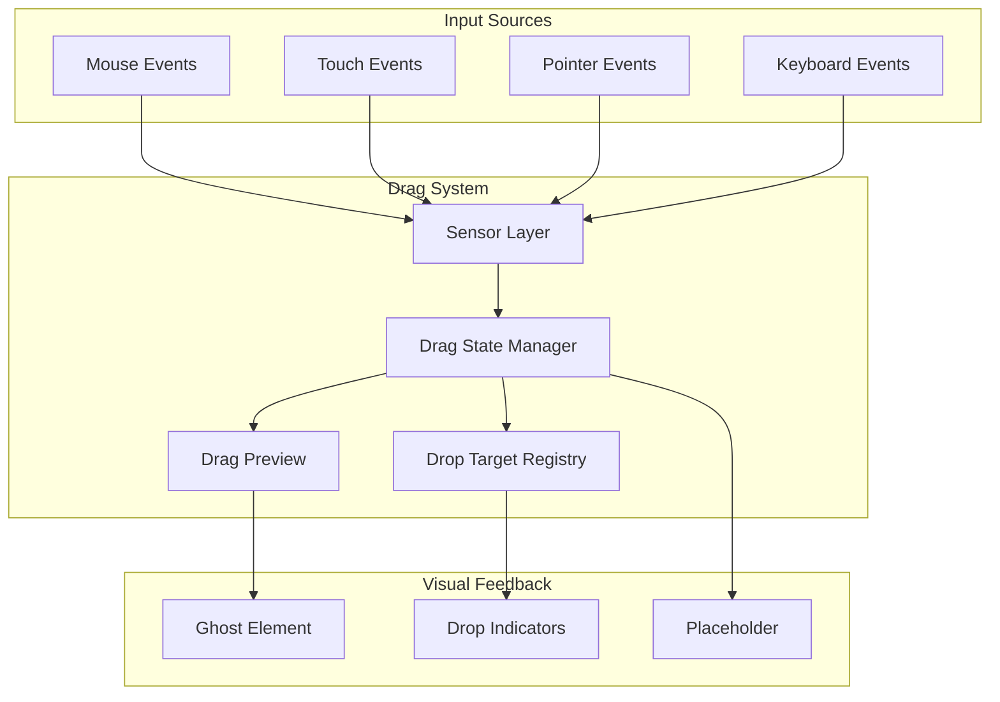
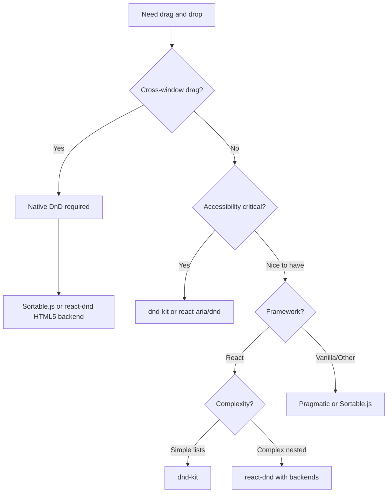

# Design a Drag and Drop System

Building drag and drop interactions that work across input devices, handle complex reordering scenarios, and maintain accessibility—the browser APIs, architectural patterns, and trade-offs that power production implementations in Trello, Notion, and Figma.

Drag and drop appears simple: grab an element, move it, release it. In practice, it requires handling three incompatible input APIs (mouse, touch, pointer), working around significant browser inconsistencies in the HTML5 Drag and Drop API, providing keyboard alternatives for accessibility, and managing visual feedback during the operation. This article covers the underlying browser APIs, the design decisions that differentiate library approaches, and how production applications solve these problems at scale.

<figure>



<figcaption>Drag and drop system architecture: multiple input sources feed into a unified sensor layer, which manages drag state, tracks drop targets, and coordinates visual feedback.</figcaption>
</figure>

## Abstract

Drag and drop systems must unify three input models while providing accessible alternatives. The core mental model:

- **Native HTML5 DnD has critical limitations**: The API works for mouse input but doesn't fire drag events for touch screens. DataTransfer timing varies by browser. Cross-browser inconsistencies make raw API usage impractical for production.

- **Pointer Events unify input devices**: The W3C Pointer Events API provides hardware-agnostic input handling for mouse, touch, and pen. Modern libraries (dnd-kit, Pragmatic) build on Pointer Events rather than native DnD.

- **Accessibility requires keyboard alternatives**: WCAG 2.5.7 mandates that all drag functionality must be achievable without dragging. This means Enter to grab, Tab to navigate targets, Enter to drop—not optional progressive enhancement.

- **Two architectural approaches dominate**: Native API wrappers (react-dnd, Sortable.js) abstract browser quirks. Custom implementations (dnd-kit, Pragmatic) ignore native DnD entirely, building from Pointer Events for consistent behavior.

| Approach | Browser API | Touch Support | Accessibility | Bundle Size |
|----------|-------------|---------------|---------------|-------------|
| Native DnD wrapper | HTML5 DnD + Touch backend | Requires second backend | Manual | Small core |
| Custom Pointer Events | Pointer Events | Built-in | Built-in | Larger |
| Hybrid | HTML5 DnD desktop, Pointer mobile | Yes | Manual | Medium |

## The Challenge

### Browser API Fragmentation

The web has three overlapping APIs for pointer input, each with different capabilities and browser support.

**HTML5 Drag and Drop API** (WHATWG spec): Designed for mouse-based desktop interaction. Events: `dragstart`, `drag`, `dragenter`, `dragover`, `dragleave`, `drop`, `dragend`. The `DataTransfer` object carries data between drag source and drop target.

**Touch Events API** (W3C spec, now considered legacy): Designed for touchscreens. Events: `touchstart`, `touchmove`, `touchend`, `touchcancel`. Provides multi-touch support via `TouchList` collections.

**Pointer Events API** (W3C spec): Unified model for all pointing devices. Events mirror mouse events with `pointer` prefix. The `pointerType` property indicates device: `"mouse"`, `"touch"`, or `"pen"`.

**The fundamental problem**: HTML5 Drag and Drop events never fire for touch input. Chrome, Firefox, and Safari all require a mouse to initiate native drag operations. Touch users get nothing without additional implementation.

### HTML5 DnD API Quirks

The native API has behavior differences that break cross-browser implementations:

**DataTransfer timing restrictions**:
- `setData()` only works in `dragstart`. Calling it in any other event silently fails.
- `getData()` returns empty string during `dragover` in Chrome/Safari—only readable on `drop`.
- Firefox allows reading data during drag, but relying on this breaks other browsers.

**Event sequencing differs**:
- Chrome/Safari: fire `dragend` then `drop`
- Firefox: fire `drop` then `dragend`

**Drag image requirements**:
- Firefox accepts any DOM element for `setDragImage()`
- Chrome requires the element to be in the DOM and visible (even if off-screen)
- Safari requires specific CSS to prevent default image generation

```typescript collapse={1-3, 20-25}
// Setting up native drag with workarounds
interface DragSourceOptions {
  element: HTMLElement;
  data: Record<string, string>;
  dragImage?: HTMLElement;
}

function setupNativeDrag({ element, data, dragImage }: DragSourceOptions): void {
  element.draggable = true;

  element.addEventListener('dragstart', (e) => {
    // Must set data in dragstart - only chance
    Object.entries(data).forEach(([type, value]) => {
      e.dataTransfer?.setData(type, value);
    });

    // Chrome requires element in DOM for custom drag image
    if (dragImage) {
      document.body.appendChild(dragImage);
      dragImage.style.position = 'absolute';
      dragImage.style.left = '-9999px';
      e.dataTransfer?.setDragImage(dragImage, 0, 0);
      // Clean up after browser captures image
      requestAnimationFrame(() => dragImage.remove());
    }
  });
}
```

**Drop target acceptance**: Drop targets must call `preventDefault()` in both `dragenter` and `dragover` to signal they accept drops. Missing either causes the browser to reject the drop.

### Touch Challenges

Touch interaction differs fundamentally from mouse:

**No hover state**: Touch has no equivalent to `mouseover`. Drag preview must follow the finger, not appear on hover.

**Scroll conflicts**: Touch movement is overloaded—it scrolls by default. Drag operations must prevent scrolling while allowing intentional scrolls.

**Gesture disambiguation**: Is this touch a tap, a scroll, or a drag? Activation delays or distance thresholds help distinguish intent.

**Multi-touch complexity**: What happens when a second finger touches during a drag? Most implementations ignore additional touches; some support multi-select.

### Accessibility Requirements

WCAG 2.5.7 (Dragging Movements) requires non-dragging alternatives:

> "All functionality that uses a dragging movement for operation can be achieved by a single pointer without dragging, unless dragging is essential, or the functionality is determined by the user agent and not modified by the author."

**Why dragging is problematic**:
- Users with motor impairments may not be able to hold and move simultaneously
- Head pointers, eye-gaze systems, and trackballs make dragging difficult or impossible
- Screen reader users cannot perceive spatial relationships

**Acceptable alternatives**:
- Keyboard: Enter to grab, Tab between targets, Enter to drop
- Click-based: Click item, click destination
- Menu-based: Right-click/long-press for move menu
- Button-based: Up/down arrows for list reordering

### Scale Factors

The right drag-drop approach depends on use case complexity:

| Factor | Simple | Complex |
|--------|--------|---------|
| Items | < 20 sortable | 1000+ virtualized |
| Containers | Single list | Multiple connected lists |
| Drop zones | Item positions | Nested hierarchies |
| Constraints | Any position | Rules-based acceptance |
| Feedback | Basic indicator | Rich preview, animations |

## Browser APIs Deep Dive

### HTML5 Drag and Drop

The native API provides drag operations with OS-level integration—dragging files from desktop, cross-tab dragging, and native drag previews.

**Event sequence for successful drop**:

```
dragstart (source) → drag (source, repeating) →
dragenter (target) → dragover (target, repeating) →
drop (target) → dragend (source)
```

**DataTransfer security model**: The spec protects sensitive data during drag. During `dragover`, scripts can see data types (`dataTransfer.types`) but not values. This prevents malicious pages from reading clipboard data during drag-over.

```typescript collapse={1-5, 35-45}
// Complete native drag implementation
function createDragSource(element: HTMLElement, itemId: string): void {
  element.draggable = true;

  element.addEventListener('dragstart', (e) => {
    e.dataTransfer!.effectAllowed = 'move';
    e.dataTransfer!.setData('application/x-item-id', itemId);
    e.dataTransfer!.setData('text/plain', itemId); // Fallback for external drops

    element.classList.add('dragging');
  });

  element.addEventListener('dragend', () => {
    element.classList.remove('dragging');
  });
}

function createDropTarget(
  element: HTMLElement,
  onDrop: (itemId: string, position: 'before' | 'after') => void
): void {
  element.addEventListener('dragenter', (e) => {
    e.preventDefault(); // Required to allow drop
    element.classList.add('drop-target');
  });

  element.addEventListener('dragover', (e) => {
    e.preventDefault(); // Required for every dragover
    e.dataTransfer!.dropEffect = 'move';
  });

  element.addEventListener('dragleave', () => {
    element.classList.remove('drop-target');
  });

  element.addEventListener('drop', (e) => {
    e.preventDefault();
    const itemId = e.dataTransfer!.getData('application/x-item-id');
    const rect = element.getBoundingClientRect();
    const position = e.clientY < rect.top + rect.height / 2 ? 'before' : 'after';
    onDrop(itemId, position);
    element.classList.remove('drop-target');
  });
}
```

**Effect feedback**: `effectAllowed` (source) and `dropEffect` (target) communicate what operations are valid:

| effectAllowed | dropEffect | Result |
|---------------|------------|--------|
| `move` | `move` | Move icon cursor |
| `copy` | `copy` | Plus icon cursor |
| `link` | `link` | Link icon cursor |
| `all` | any | Target chooses |
| `none` | - | No drop allowed |

### Pointer Events

Pointer Events (W3C Recommendation) provide a unified input model. A pointer is "any point of contact on the screen made by a mouse cursor, pen, touch, or other pointing input device."

**Key properties beyond mouse events**:

| Property | Type | Description |
|----------|------|-------------|
| `pointerId` | number | Unique ID for multi-pointer tracking |
| `pointerType` | string | `"mouse"`, `"pen"`, `"touch"`, or empty |
| `isPrimary` | boolean | Is this the primary pointer of its type? |
| `pressure` | number | 0-1, normalized pressure |
| `width`, `height` | number | Contact geometry in CSS pixels |
| `tiltX`, `tiltY` | number | Pen angle, -90 to 90 degrees |

**Pointer capture**: Redirect all pointer events to a specific element, even when pointer moves outside. Critical for drag operations.

```typescript collapse={1-5, 40-50}
// Pointer Events drag implementation
interface PointerDragState {
  pointerId: number;
  startX: number;
  startY: number;
  currentX: number;
  currentY: number;
  element: HTMLElement;
}

let dragState: PointerDragState | null = null;

function setupPointerDrag(element: HTMLElement): void {
  element.addEventListener('pointerdown', (e) => {
    // Only handle primary pointer
    if (!e.isPrimary) return;

    // Capture pointer to receive events even outside element
    element.setPointerCapture(e.pointerId);

    dragState = {
      pointerId: e.pointerId,
      startX: e.clientX,
      startY: e.clientY,
      currentX: e.clientX,
      currentY: e.clientY,
      element
    };

    element.classList.add('dragging');
  });

  element.addEventListener('pointermove', (e) => {
    if (!dragState || e.pointerId !== dragState.pointerId) return;

    dragState.currentX = e.clientX;
    dragState.currentY = e.clientY;

    // Update visual position
    const deltaX = dragState.currentX - dragState.startX;
    const deltaY = dragState.currentY - dragState.startY;
    element.style.transform = `translate(${deltaX}px, ${deltaY}px)`;
  });

  element.addEventListener('pointerup', (e) => {
    if (!dragState || e.pointerId !== dragState.pointerId) return;

    element.releasePointerCapture(e.pointerId);
    element.classList.remove('dragging');
    element.style.transform = '';

    // Determine drop target at final position
    const dropTarget = document.elementFromPoint(e.clientX, e.clientY);
    // Handle drop logic...

    dragState = null;
  });

  // Cancel on pointer lost (e.g., touch cancelled by palm rejection)
  element.addEventListener('pointercancel', (e) => {
    if (!dragState || e.pointerId !== dragState.pointerId) return;

    element.releasePointerCapture(e.pointerId);
    element.classList.remove('dragging');
    element.style.transform = '';
    dragState = null;
  });
}
```

**Touch-action CSS**: Control which touch gestures the browser handles vs. your code.

```css
.draggable {
  /* Disable browser touch handling - we'll manage it */
  touch-action: none;
}

.scrollable-container {
  /* Allow vertical scroll, we handle horizontal drag */
  touch-action: pan-y;
}
```

### Touch Events (Legacy)

Touch Events remain relevant for multi-touch scenarios and older browser support, though Pointer Events are preferred for new implementations.

**TouchList collections**:
- `touches`: All current touch points on screen
- `targetTouches`: Touch points on the event target element
- `changedTouches`: Touch points that changed in this event

```typescript collapse={1-3, 30-40}
// Touch-based drag with scroll prevention
function setupTouchDrag(element: HTMLElement): void {
  let startTouch: Touch | null = null;

  element.addEventListener('touchstart', (e) => {
    // Use first touch only
    if (e.touches.length !== 1) return;
    startTouch = e.touches[0];

    element.classList.add('dragging');
  }, { passive: false });

  element.addEventListener('touchmove', (e) => {
    if (!startTouch) return;

    // Prevent scrolling during drag
    e.preventDefault();

    const touch = e.touches[0];
    const deltaX = touch.clientX - startTouch.clientX;
    const deltaY = touch.clientY - startTouch.clientY;

    element.style.transform = `translate(${deltaX}px, ${deltaY}px)`;
  }, { passive: false }); // Must be non-passive to preventDefault

  element.addEventListener('touchend', (e) => {
    if (!startTouch) return;

    const touch = e.changedTouches[0];
    element.classList.remove('dragging');
    element.style.transform = '';

    // Find drop target
    const dropTarget = document.elementFromPoint(touch.clientX, touch.clientY);
    // Handle drop...

    startTouch = null;
  });

  element.addEventListener('touchcancel', () => {
    element.classList.remove('dragging');
    element.style.transform = '';
    startTouch = null;
  });
}
```

**Passive event listener caveat**: Touch event listeners are passive by default in modern browsers for scroll performance. To `preventDefault()` (required to prevent scrolling during drag), explicitly set `{ passive: false }`.

## Design Paths

### Path 1: Native HTML5 DnD with Touch Backend

**Architecture**: Use HTML5 Drag and Drop API for desktop, add separate touch event handling for mobile.

```
Desktop: element → dragstart/dragover/drop → DataTransfer → drop handler
Mobile:  element → touchstart/touchmove/touchend → custom state → drop handler
```

**How it works**:
1. Set `draggable="true"` on elements
2. Handle native drag events for mouse interaction
3. Detect touch devices and add touch event listeners
4. Maintain unified drop target registry for both paths

**Best for**:
- Cross-tab or cross-window dragging (only native DnD supports this)
- File drops from desktop
- Simple list reordering with existing touch library

**Implementation complexity**:

| Aspect | Effort |
|--------|--------|
| Initial setup | Medium |
| Touch support | High (separate code path) |
| Keyboard accessibility | High (manual) |
| Cross-browser testing | High |

**Device/network profile**:
- Works well on: Desktop browsers, modern mobile with touch backend
- Struggles on: Complex nested drag targets, virtualized lists

**Trade-offs**:
- Pro: Native OS integration (cross-window drag, file drops)
- Pro: Browser-managed drag preview
- Con: Two code paths to maintain
- Con: DataTransfer quirks across browsers
- Con: No touch support without additional library

**Real-world example**: **Sortable.js** uses this approach. Provides reorderable lists with native DnD, includes touch support via adapter. ~7KB gzipped, no framework dependency.

### Path 2: Custom Pointer Events Implementation

**Architecture**: Bypass native DnD entirely. Build drag system on Pointer Events for consistent cross-device behavior.

```
pointerdown → capture → pointermove (throttled) → hit test drop targets → pointerup → commit
```

**How it works**:
1. Listen for `pointerdown` on draggable elements
2. Capture pointer to receive events outside element bounds
3. Track position via `pointermove`, update preview position
4. Hit-test drop targets using `document.elementFromPoint()`
5. Commit changes on `pointerup`

**Best for**:
- Consistent behavior across all input types
- Complex drag interactions (nested lists, kanban boards)
- Applications requiring fine-grained control

**Implementation complexity**:

| Aspect | Effort |
|--------|--------|
| Initial setup | High |
| Touch support | Built-in (same code path) |
| Keyboard accessibility | Medium (framework typically provides) |
| Cross-browser testing | Low (consistent API) |

**Trade-offs**:
- Pro: Single code path for all devices
- Pro: Full control over drag preview and feedback
- Pro: No DataTransfer timing issues
- Con: No cross-window drag support
- Con: Must implement file drop separately
- Con: More code to write/maintain

**Real-world example**: **dnd-kit** uses this architecture. Sensors abstract input types—Pointer, Mouse, Touch, Keyboard. Built-in accessibility with keyboard navigation and screen reader announcements. ~15KB gzipped.

### Path 3: Hybrid with Library Abstraction

**Architecture**: Use library that abstracts backend differences. Declarative API, implementation details hidden.

```
<Draggable> → Library internals → Backend (HTML5/Touch/Keyboard) → <Droppable>
```

**How it works**:
1. Wrap draggable elements with library component/hook
2. Register drop targets with acceptance criteria
3. Library handles input detection and routes to appropriate backend
4. Render functions receive drag state for visual feedback

**Best for**:
- Teams wanting production-ready solution quickly
- Applications needing all features (keyboard, touch, mouse)
- Complex interactions without low-level concerns

**Implementation complexity**:

| Aspect | Effort |
|--------|--------|
| Initial setup | Low |
| Touch support | Built-in |
| Keyboard accessibility | Built-in or configurable |
| Cross-browser testing | Low (library handles) |

**Trade-offs**:
- Pro: Fastest time to production
- Pro: Maintained by community/company
- Pro: Accessibility often built-in
- Con: Bundle size overhead
- Con: Less control over edge cases
- Con: Learning library-specific patterns

**Library comparison**:

| Library | Approach | Size (gzipped) | Accessibility | Framework |
|---------|----------|----------------|---------------|-----------|
| react-dnd | Backend abstraction | ~12KB | Manual | React |
| dnd-kit | Sensor abstraction | ~15KB | Built-in | React |
| Sortable.js | Native DnD + touch | ~7KB | Manual | Vanilla |
| @atlassian/pragmatic-drag-and-drop | Native primitives | ~5KB core | Separate packages | Vanilla |
| @react-aria/dnd | Pointer + accessibility | ~20KB | Built-in | React |

### Decision Framework



## Implementing Core Patterns

### List Reordering

The most common drag-drop pattern: reorder items within a single list.

**State management**: Track source index, current hover index, and compute final order on drop.

```typescript collapse={1-8, 45-55}
interface SortableListState<T> {
  items: T[];
  dragIndex: number | null;
  hoverIndex: number | null;
}

function useSortableList<T extends { id: string }>(
  initialItems: T[]
): {
  items: T[];
  dragHandlers: (index: number) => DragHandlers;
  dropHandlers: (index: number) => DropHandlers;
} {
  const [state, setState] = useState<SortableListState<T>>({
    items: initialItems,
    dragIndex: null,
    hoverIndex: null
  });

  const dragHandlers = (index: number) => ({
    onDragStart: () => {
      setState((s) => ({ ...s, dragIndex: index }));
    },
    onDragEnd: () => {
      setState((s) => {
        if (s.dragIndex === null || s.hoverIndex === null) {
          return { ...s, dragIndex: null, hoverIndex: null };
        }

        // Reorder items
        const newItems = [...s.items];
        const [removed] = newItems.splice(s.dragIndex, 1);
        newItems.splice(s.hoverIndex, 0, removed);

        return { items: newItems, dragIndex: null, hoverIndex: null };
      });
    }
  });

  const dropHandlers = (index: number) => ({
    onDragEnter: () => {
      setState((s) => ({ ...s, hoverIndex: index }));
    }
  });

  return { items: state.items, dragHandlers, dropHandlers };
}
```

**Visual indicator placement**: Show drop indicator between items, not on items.

```typescript
function getDropIndicatorPosition(
  e: PointerEvent,
  element: HTMLElement
): 'before' | 'after' {
  const rect = element.getBoundingClientRect();
  const midpoint = rect.top + rect.height / 2;
  return e.clientY < midpoint ? 'before' : 'after';
}
```

### Cross-Container Dragging

Moving items between multiple lists (Kanban boards, multi-column layouts).

**Key challenge**: Tracking which container an item is over, handling container-level acceptance rules.

```typescript collapse={1-15, 50-60}
interface Container {
  id: string;
  accepts: (item: DragItem) => boolean;
}

interface DragItem {
  id: string;
  type: string;
  sourceContainerId: string;
}

interface CrossContainerState {
  containers: Map<string, Container>;
  activeItem: DragItem | null;
  overContainerId: string | null;
  overIndex: number | null;
}

function handleCrossContainerDrop(
  state: CrossContainerState,
  sourceItems: Map<string, unknown[]>,
  setItems: (containerId: string, items: unknown[]) => void
): void {
  const { activeItem, overContainerId, overIndex } = state;
  if (!activeItem || !overContainerId || overIndex === null) return;

  const targetContainer = state.containers.get(overContainerId);
  if (!targetContainer?.accepts(activeItem)) return;

  // Remove from source
  const sourceList = [...(sourceItems.get(activeItem.sourceContainerId) ?? [])];
  const sourceIndex = sourceList.findIndex((item: any) => item.id === activeItem.id);
  const [removed] = sourceList.splice(sourceIndex, 1);
  setItems(activeItem.sourceContainerId, sourceList);

  // Add to target
  const targetList = [...(sourceItems.get(overContainerId) ?? [])];
  targetList.splice(overIndex, 0, removed);
  setItems(overContainerId, targetList);
}
```

**Acceptance rules**: Containers can restrict what items they accept.

```typescript
const containers: Container[] = [
  {
    id: 'todo',
    accepts: (item) => item.type === 'task'
  },
  {
    id: 'done',
    accepts: (item) => item.type === 'task' && item.status !== 'blocked'
  },
  {
    id: 'archive',
    accepts: () => true // Accepts anything
  }
];
```

### Tree Reordering

Hierarchical structures with nesting (file trees, nested lists).

**Complexity factors**:
- Drop zones: before sibling, after sibling, as child
- Depth detection from pointer position
- Preventing invalid drops (item into its own descendants)

```typescript collapse={1-10, 55-65}
interface TreeNode {
  id: string;
  children: TreeNode[];
  parentId: string | null;
}

type TreeDropPosition =
  | { type: 'before'; targetId: string }
  | { type: 'after'; targetId: string }
  | { type: 'child'; parentId: string };

function getTreeDropPosition(
  e: PointerEvent,
  element: HTMLElement,
  depthIndicatorWidth: number
): TreeDropPosition {
  const rect = element.getBoundingClientRect();
  const relativeY = e.clientY - rect.top;
  const relativeX = e.clientX - rect.left;

  const nodeId = element.dataset.nodeId!;
  const currentDepth = parseInt(element.dataset.depth ?? '0');

  // Top quarter: drop before
  if (relativeY < rect.height * 0.25) {
    return { type: 'before', targetId: nodeId };
  }

  // Bottom quarter: drop after
  if (relativeY > rect.height * 0.75) {
    return { type: 'after', targetId: nodeId };
  }

  // Middle: check horizontal position for nesting
  const hoverDepth = Math.floor(relativeX / depthIndicatorWidth);
  if (hoverDepth > currentDepth) {
    return { type: 'child', parentId: nodeId };
  }

  return { type: 'after', targetId: nodeId };
}

function isDescendant(tree: TreeNode[], nodeId: string, potentialAncestorId: string): boolean {
  const findNode = (nodes: TreeNode[], id: string): TreeNode | null => {
    for (const node of nodes) {
      if (node.id === id) return node;
      const found = findNode(node.children, id);
      if (found) return found;
    }
    return null;
  };

  const ancestor = findNode(tree, potentialAncestorId);
  if (!ancestor) return false;

  return findNode(ancestor.children, nodeId) !== null;
}
```

### Virtualized List Dragging

Large lists with windowing present unique challenges: elements outside viewport don't exist in DOM.

**Problem**: Standard hit-testing fails when potential drop targets aren't rendered.

**Solutions**:
1. **Overscan**: Render extra items beyond viewport. Simple but memory overhead.
2. **Position-based hit testing**: Calculate target from scroll position, not DOM.
3. **Scroll-on-drag**: Auto-scroll when dragging near edges.

```typescript collapse={1-10, 45-55}
interface VirtualListDragConfig {
  itemHeight: number;
  totalItems: number;
  viewportHeight: number;
  scrollTop: number;
  scrollContainerRef: React.RefObject<HTMLElement>;
}

function getVirtualDropIndex(
  clientY: number,
  config: VirtualListDragConfig
): number {
  const { itemHeight, totalItems, scrollTop, scrollContainerRef } = config;
  const container = scrollContainerRef.current;
  if (!container) return 0;

  const containerRect = container.getBoundingClientRect();
  const relativeY = clientY - containerRect.top + scrollTop;
  const index = Math.floor(relativeY / itemHeight);

  return Math.max(0, Math.min(totalItems - 1, index));
}

function handleAutoScroll(
  clientY: number,
  config: VirtualListDragConfig
): void {
  const container = config.scrollContainerRef.current;
  if (!container) return;

  const rect = container.getBoundingClientRect();
  const edgeThreshold = 50; // pixels
  const scrollSpeed = 10;

  if (clientY < rect.top + edgeThreshold) {
    // Near top edge - scroll up
    container.scrollTop -= scrollSpeed;
  } else if (clientY > rect.bottom - edgeThreshold) {
    // Near bottom edge - scroll down
    container.scrollTop += scrollSpeed;
  }
}
```

## Drag Preview and Visual Feedback

### Native vs Custom Drag Images

**Native drag image** (HTML5 DnD): Browser captures element snapshot at `dragstart`. Limited customization.

```typescript
// Basic custom drag image
element.addEventListener('dragstart', (e) => {
  const preview = createCustomPreview();
  document.body.appendChild(preview);
  preview.style.position = 'absolute';
  preview.style.left = '-9999px';

  // Offset positions the cursor relative to the image
  e.dataTransfer?.setDragImage(preview, 20, 20);

  requestAnimationFrame(() => preview.remove());
});
```

**Custom drag layer** (Pointer Events approach): Render preview element that follows pointer.

```typescript collapse={1-8, 35-45}
interface DragPreviewState {
  isDragging: boolean;
  item: unknown;
  x: number;
  y: number;
}

function DragPreview({ state }: { state: DragPreviewState }) {
  if (!state.isDragging) return null;

  return (
    <div
      style={{
        position: 'fixed',
        left: state.x,
        top: state.y,
        pointerEvents: 'none', // Don't block hit testing
        transform: 'translate(-50%, -50%) rotate(3deg)', // Slight rotation
        opacity: 0.9,
        zIndex: 9999
      }}
    >
      <ItemCard item={state.item} />
    </div>
  );
}
```

**Performance consideration**: Moving a DOM element every `pointermove` (60+ times/second) can cause jank. Use `transform` instead of `left/top`—it's GPU-accelerated and doesn't trigger layout.

### Drop Indicators

Visual feedback showing where the item will land.

**Line indicator**: Horizontal line between items.

```css
.drop-indicator {
  position: absolute;
  left: 0;
  right: 0;
  height: 2px;
  background: var(--color-accent);
  pointer-events: none;
}

.drop-indicator--before {
  top: -1px;
}

.drop-indicator--after {
  bottom: -1px;
}
```

**Placeholder gap**: Reserve space where item will drop.

```typescript
function renderItems(items: Item[], dragIndex: number | null, hoverIndex: number | null) {
  return items.map((item, index) => {
    const isDragging = index === dragIndex;
    const showGapBefore = hoverIndex === index && dragIndex !== null && dragIndex > index;
    const showGapAfter = hoverIndex === index && dragIndex !== null && dragIndex < index;

    return (
      <>
        {showGapBefore && <div className="drop-gap" />}
        <ItemCard
          key={item.id}
          item={item}
          style={{ opacity: isDragging ? 0.5 : 1 }}
        />
        {showGapAfter && <div className="drop-gap" />}
      </>
    );
  });
}
```

### Animation Patterns

**Layout shift animation**: Animate other items moving out of the way.

```css
.sortable-item {
  transition: transform 200ms ease;
}

.sortable-item--shifted-down {
  transform: translateY(var(--item-height));
}

.sortable-item--shifted-up {
  transform: translateY(calc(-1 * var(--item-height)));
}
```

**Drop animation**: Animate item settling into final position.

```typescript
async function animateDrop(
  element: HTMLElement,
  from: { x: number; y: number },
  to: { x: number; y: number }
): Promise<void> {
  const deltaX = to.x - from.x;
  const deltaY = to.y - from.y;

  // Start at drag position
  element.style.transform = `translate(${-deltaX}px, ${-deltaY}px)`;
  element.style.transition = 'none';

  // Force reflow
  element.offsetHeight;

  // Animate to final position
  element.style.transition = 'transform 200ms ease-out';
  element.style.transform = '';

  return new Promise((resolve) => {
    element.addEventListener('transitionend', () => resolve(), { once: true });
  });
}
```

## Accessibility Implementation

### Keyboard Navigation

WCAG-compliant drag-drop requires full keyboard support.

**Interaction pattern**:
1. Focus item with Tab
2. Press Enter/Space to "pick up" item
3. Arrow keys or Tab to move between positions
4. Enter/Space to "drop" or Escape to cancel

```typescript collapse={1-15, 60-75}
interface KeyboardDragState {
  isActive: boolean;
  activeItemId: string | null;
  targetIndex: number | null;
}

function useKeyboardDrag(
  items: Item[],
  onReorder: (fromIndex: number, toIndex: number) => void
) {
  const [state, setState] = useState<KeyboardDragState>({
    isActive: false,
    activeItemId: null,
    targetIndex: null
  });

  const handleKeyDown = (e: KeyboardEvent, itemId: string, currentIndex: number) => {
    if (!state.isActive) {
      // Not dragging - Enter starts drag
      if (e.key === 'Enter' || e.key === ' ') {
        e.preventDefault();
        setState({
          isActive: true,
          activeItemId: itemId,
          targetIndex: currentIndex
        });
        announceToScreenReader(`Grabbed ${items[currentIndex].name}. Use arrow keys to move.`);
      }
      return;
    }

    // Currently dragging
    switch (e.key) {
      case 'ArrowUp':
      case 'ArrowLeft':
        e.preventDefault();
        if (state.targetIndex! > 0) {
          const newIndex = state.targetIndex! - 1;
          setState((s) => ({ ...s, targetIndex: newIndex }));
          announceToScreenReader(`Position ${newIndex + 1} of ${items.length}`);
        }
        break;

      case 'ArrowDown':
      case 'ArrowRight':
        e.preventDefault();
        if (state.targetIndex! < items.length - 1) {
          const newIndex = state.targetIndex! + 1;
          setState((s) => ({ ...s, targetIndex: newIndex }));
          announceToScreenReader(`Position ${newIndex + 1} of ${items.length}`);
        }
        break;

      case 'Enter':
      case ' ':
        e.preventDefault();
        const fromIndex = items.findIndex((i) => i.id === state.activeItemId);
        onReorder(fromIndex, state.targetIndex!);
        setState({ isActive: false, activeItemId: null, targetIndex: null });
        announceToScreenReader(`Dropped at position ${state.targetIndex! + 1}`);
        break;

      case 'Escape':
        e.preventDefault();
        setState({ isActive: false, activeItemId: null, targetIndex: null });
        announceToScreenReader('Drag cancelled');
        break;
    }
  };

  return { state, handleKeyDown };
}
```

### Screen Reader Announcements

Use ARIA live regions to announce drag state changes.

```typescript
function announceToScreenReader(message: string): void {
  let announcer = document.getElementById('drag-announcer');

  if (!announcer) {
    announcer = document.createElement('div');
    announcer.id = 'drag-announcer';
    announcer.setAttribute('aria-live', 'assertive');
    announcer.setAttribute('aria-atomic', 'true');
    announcer.style.cssText = `
      position: absolute;
      width: 1px;
      height: 1px;
      padding: 0;
      margin: -1px;
      overflow: hidden;
      clip: rect(0, 0, 0, 0);
      white-space: nowrap;
      border: 0;
    `;
    document.body.appendChild(announcer);
  }

  // Clear and set to ensure announcement
  announcer.textContent = '';
  requestAnimationFrame(() => {
    announcer!.textContent = message;
  });
}
```

**Announcement timing**:

| Event | Announcement |
|-------|--------------|
| Drag start | "Grabbed [item name]. Use arrow keys to move, Enter to drop, Escape to cancel." |
| Position change | "Position [n] of [total]" or "[item name] moved before [other item]" |
| Drop | "Dropped [item name] at position [n]" |
| Cancel | "Drag cancelled. [item name] returned to position [n]" |
| Invalid drop | "[target] does not accept [item type]" |

### ARIA Attributes

```html
<!-- Draggable item -->
<div
  role="listitem"
  tabindex="0"
  aria-grabbed="false"
  aria-describedby="drag-instructions"
>
  Item content
</div>

<!-- When being dragged -->
<div
  role="listitem"
  tabindex="0"
  aria-grabbed="true"
  aria-describedby="drag-instructions"
>
  Item content
</div>

<!-- Drop target -->
<div
  role="list"
  aria-dropeffect="move"
>
  <!-- items -->
</div>

<!-- Instructions (hidden visually) -->
<div id="drag-instructions" class="sr-only">
  Press Enter to grab. Use arrow keys to move. Press Enter to drop or Escape to cancel.
</div>
```

**Note**: `aria-grabbed` and `aria-dropeffect` are deprecated in ARIA 1.1 but still supported. Modern implementations rely more on live region announcements.

## Real-World Implementations

### Trello: Kanban Board

**Challenge**: Drag cards between multiple lists with smooth animations and real-time sync.

**Approach**:
- Native HTML5 DnD for desktop with custom touch handling
- Drop zones on each card and at list bottom
- Visual feedback: Card rotates slightly during drag ("jaunty angle")
- Optimistic updates with server reconciliation

**Technical details**:
- `isDragging` state flag prevents style changes during drag (CSS transitions can interfere)
- Lists are drop zones; cards calculate before/after position from pointer Y
- AJAX PATCH to `/cards/{id}` with new `pos` value (floating-point for ordering)
- Real-time updates via WebSocket push to other clients

**Key insight**: Trello uses position values with gaps (1.0, 2.0, 3.0) allowing inserts without reindexing all cards. When gaps exhaust, background job rebalances.

### Notion: Block Reordering

**Challenge**: Every piece of content is a draggable, nestable block. Blocks can be text, images, databases, or embedded content.

**Approach**:
- Custom Pointer Events implementation
- Drag handle (six dots) appears on hover
- Multi-block selection with Shift+click
- Alt/Option + drag creates duplicate
- Horizontal drag position determines nesting depth

**Technical details**:
- Block IDs use UUIDs for conflict-free collaborative editing
- Drag preview shows block outline, not full content
- Drop indicator changes style based on nesting level
- Tree operations use CRDT for real-time collaboration

**Key insight**: Notion separates "block" (content unit) from "view" (how it renders). Dragging operates on block identity, not DOM elements.

### Figma: Canvas Objects

**Challenge**: Drag objects on infinite canvas with zoom, precision positioning, and multi-select.

**Approach**:
- WebGL rendering (not DOM) for canvas
- Pointer Events for input handling
- Separate layers: rendering, interaction, UI
- DndKit for UI elements (layer list, component browser)

**Technical details**:
- Canvas uses custom hit-testing against scene graph, not `elementFromPoint`
- Drag threshold prevents accidental moves (3px)
- Snap-to-grid and smart guides during drag
- Undo stack captures drag as single operation

**Key insight**: Figma's architecture separates concerns: WebGL handles rendering, D3-style zoom handles viewport, Pointer Events handle input. No single "drag library" covers all needs.

### VSCode: File Tree and Tabs

**Challenge**: Drag files between explorer, editors, and terminals. Support external file drops.

**Approach**:
- Custom implementation with `LocalSelectionTransfer` for same-window drags
- Native DnD for external file drops
- Drag identifiers: `DraggedEditorIdentifier` (single file), `DraggedEditorGroupIdentifier` (tab group)

**Technical details**:
- `LocalSelectionTransfer` singleton manages in-app drag state
- `EditorDropTarget` components register as drop zones
- File tree supports dragging into and out of folders
- Tab dragging supports reordering and moving between groups

**Key insight**: VSCode uses different drag mechanisms for internal vs. external drops. Internal uses custom state management; external uses native DataTransfer for file access.

## Browser Constraints

### Main Thread Budget

Drag operations run on main thread. Heavy operations cause jank.

**Budget**: 16ms per frame for 60fps. Drag handlers should complete in <8ms to leave room for rendering.

**Optimization strategies**:
1. **Throttle pointermove**: Don't process every event
2. **Debounce drop target calculations**: Especially for complex hit-testing
3. **RAF for visual updates**: Batch position updates to animation frame
4. **Avoid layout thrashing**: Read dimensions before starting drag, cache them

```typescript
// Throttled drag handler
let lastMoveTime = 0;
const THROTTLE_MS = 16; // One frame

function handlePointerMove(e: PointerEvent): void {
  const now = performance.now();
  if (now - lastMoveTime < THROTTLE_MS) return;
  lastMoveTime = now;

  // Actual move handling
  updateDragPosition(e.clientX, e.clientY);
}
```

### Touch Delay and Gesture Conflicts

Mobile browsers have 300ms tap delay (mostly eliminated in modern browsers with proper viewport meta). Touch gestures conflict with drag.

**Activation constraints prevent accidental drags**:

```typescript
interface ActivationConstraint {
  delay?: number;       // ms to hold before drag starts
  distance?: number;    // px to move before drag starts
  tolerance?: number;   // px of movement allowed during delay
}

// dnd-kit sensor configuration
const pointerSensor = useSensor(PointerSensor, {
  activationConstraint: {
    delay: 250,        // Hold 250ms before drag activates
    tolerance: 5       // Allow 5px movement during delay
  }
});
```

### Memory Considerations

Long drag operations with many drop targets can accumulate state.

**Cleanup patterns**:
- Clear highlight states on `pointercancel`
- Remove event listeners when drag ends
- Reset animations to avoid stale transforms
- Clear cached dimensions if window resizes during drag

```typescript
function cleanupDragState(): void {
  // Reset all visual states
  document.querySelectorAll('.drop-target-active').forEach((el) => {
    el.classList.remove('drop-target-active');
  });

  // Clear cached data
  dropTargetRects.clear();

  // Remove global listeners
  document.removeEventListener('pointermove', handleGlobalMove);
  document.removeEventListener('pointerup', handleGlobalUp);
}
```

## Common Pitfalls

### 1. Missing preventDefault in dragover

**The mistake**: Only calling `preventDefault()` in `drop` handler.

```typescript
// Broken - drop never fires
element.addEventListener('drop', (e) => {
  e.preventDefault();
  handleDrop(e);
});
```

**Why it fails**: Browser requires `preventDefault()` in `dragenter` AND `dragover` to mark element as valid drop target. Without it, `drop` event never fires.

**The fix**:
```typescript
element.addEventListener('dragenter', (e) => e.preventDefault());
element.addEventListener('dragover', (e) => e.preventDefault());
element.addEventListener('drop', (e) => {
  e.preventDefault();
  handleDrop(e);
});
```

### 2. Drag Image Not Visible

**The mistake**: Creating drag image dynamically without adding to DOM.

```typescript
// Broken in Chrome
element.addEventListener('dragstart', (e) => {
  const img = document.createElement('div');
  img.textContent = 'Dragging';
  e.dataTransfer?.setDragImage(img, 0, 0); // Invisible
});
```

**Why it fails**: Chrome requires the drag image element to be in the DOM and have layout. Firefox doesn't.

**The fix**:
```typescript
element.addEventListener('dragstart', (e) => {
  const img = document.createElement('div');
  img.textContent = 'Dragging';
  img.style.position = 'absolute';
  img.style.left = '-9999px';
  document.body.appendChild(img);

  e.dataTransfer?.setDragImage(img, 0, 0);

  requestAnimationFrame(() => img.remove());
});
```

### 3. Touch Events Not Firing

**The mistake**: Assuming HTML5 DnD works on touch devices.

```typescript
// Only works with mouse
element.draggable = true;
element.addEventListener('dragstart', handleDragStart);
// Touch users see nothing
```

**Why it fails**: HTML5 Drag and Drop API is mouse-only. Touch events don't trigger drag events.

**The fix**: Use Pointer Events or add explicit touch handling:
```typescript
element.addEventListener('pointerdown', handlePointerDown);
// OR
element.addEventListener('touchstart', handleTouchStart, { passive: false });
```

### 4. Passive Event Listener Blocking preventDefault

**The mistake**: Touch events added without `{ passive: false }`.

```typescript
// preventDefault has no effect
element.addEventListener('touchmove', (e) => {
  e.preventDefault(); // Ignored! Scrolls anyway
  handleDrag(e);
});
```

**Why it fails**: Modern browsers make touch listeners passive by default for scroll performance. Passive listeners cannot `preventDefault()`.

**The fix**:
```typescript
element.addEventListener('touchmove', (e) => {
  e.preventDefault();
  handleDrag(e);
}, { passive: false });
```

### 5. State Desync with Optimistic Updates

**The mistake**: Updating UI before server confirms, then not handling failures.

```typescript
// Optimistic update without rollback
function handleDrop(fromIndex: number, toIndex: number): void {
  setItems(reorder(items, fromIndex, toIndex));
  api.updateOrder(items.map(i => i.id)); // Fire and forget
}
```

**Why it fails**: Server rejection leaves UI in wrong state. Network failure loses the change.

**The fix**:
```typescript
function handleDrop(fromIndex: number, toIndex: number): void {
  const previousItems = items;
  const newItems = reorder(items, fromIndex, toIndex);

  setItems(newItems); // Optimistic

  api.updateOrder(newItems.map(i => i.id))
    .catch(() => {
      setItems(previousItems); // Rollback
      showError('Failed to save order');
    });
}
```

## Conclusion

Drag and drop systems require unifying disparate browser APIs while maintaining accessibility. The fundamental tension: native HTML5 DnD provides OS integration but lacks touch support and has cross-browser quirks. Custom Pointer Events implementations provide consistency but lose native features like cross-window drag.

**Architectural decisions**:

**API layer**: Native DnD for file drops and cross-window scenarios. Pointer Events for consistent in-app interactions. Most applications need both.

**Library vs custom**: Libraries (dnd-kit, react-dnd) provide tested solutions for common patterns. Custom implementation when you need precise control or have unusual requirements (canvas-based, non-DOM rendering).

**Accessibility**: Not optional. WCAG 2.5.7 requires keyboard alternatives. Build it in from the start—retrofitting is harder.

**Visual feedback**: Users need constant feedback during drag. Drag preview follows cursor, drop indicators show destination, animations smooth transitions. Without feedback, drag operations feel broken.

The technology is mature. dnd-kit and Pragmatic Drag and Drop represent the current best practices—Pointer Events foundation, sensor abstraction, built-in accessibility. Choose based on your framework constraints and whether you need native DnD features.

## Appendix

### Prerequisites

- **DOM events**: Event propagation, delegation, preventDefault
- **CSS transforms**: translate, transform-origin, GPU acceleration
- **Browser input APIs**: Basic familiarity with mouse, touch, or pointer events
- **React hooks** (if using React-based libraries)

### Terminology

- **DataTransfer**: HTML5 DnD object carrying data between drag source and drop target
- **Drag handle**: UI element that initiates drag (often a grip icon)
- **Drop indicator**: Visual marker showing where dragged item will land
- **Hit testing**: Determining which element is under the pointer
- **Pointer capture**: API to receive all pointer events for a specific pointer ID
- **Sensor**: dnd-kit abstraction for input type (pointer, touch, keyboard)

### Summary

- **HTML5 DnD limitations**: Mouse-only, DataTransfer timing quirks, no touch support without separate implementation
- **Pointer Events advantage**: Single API for mouse/touch/pen, pointer capture for reliable drag tracking
- **Accessibility requirement**: WCAG 2.5.7 mandates keyboard alternatives—Enter to grab, Tab/arrows to move, Enter to drop
- **Library approaches**: Native wrappers (Sortable.js, react-dnd) vs custom implementations (dnd-kit, Pragmatic)
- **Visual feedback**: Drag preview, drop indicators, and animations are essential for usable drag-drop
- **Real-world patterns**: Trello uses position gaps, Notion operates on block IDs, Figma separates rendering from input

### References

- [WHATWG HTML Standard - Drag and Drop](https://html.spec.whatwg.org/multipage/dnd.html) - Normative specification for HTML5 DnD
- [W3C Pointer Events](https://www.w3.org/TR/pointerevents/) - Unified pointer input specification
- [W3C Touch Events Level 2](https://w3c.github.io/touch-events/) - Touch Events specification (legacy)
- [WCAG 2.5.7: Dragging Movements](https://www.w3.org/WAI/WCAG22/Understanding/dragging-movements.html) - Accessibility requirements
- [MDN: HTML Drag and Drop API](https://developer.mozilla.org/en-US/docs/Web/API/HTML_Drag_and_Drop_API) - API reference and examples
- [MDN: Pointer Events](https://developer.mozilla.org/en-US/docs/Web/API/Pointer_events) - Pointer Events guide
- [dnd-kit Documentation](https://docs.dndkit.com/) - Modern drag-drop library
- [React DnD Documentation](https://react-dnd.github.io/react-dnd/docs/overview) - Backend abstraction approach
- [Pragmatic Drag and Drop - Atlassian](https://atlassian.design/components/pragmatic-drag-and-drop) - Low-level primitives approach
- [React Aria: Accessible Drag and Drop](https://react-spectrum.adobe.com/react-aria/dnd.html) - Adobe's accessibility-first implementation
- [Drag and Drop Browser Inconsistencies](https://github.com/nicknisi/talks/blob/main/drag-and-drop/notes.md) - Cross-browser quirks reference
