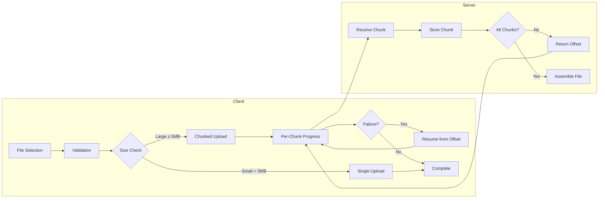
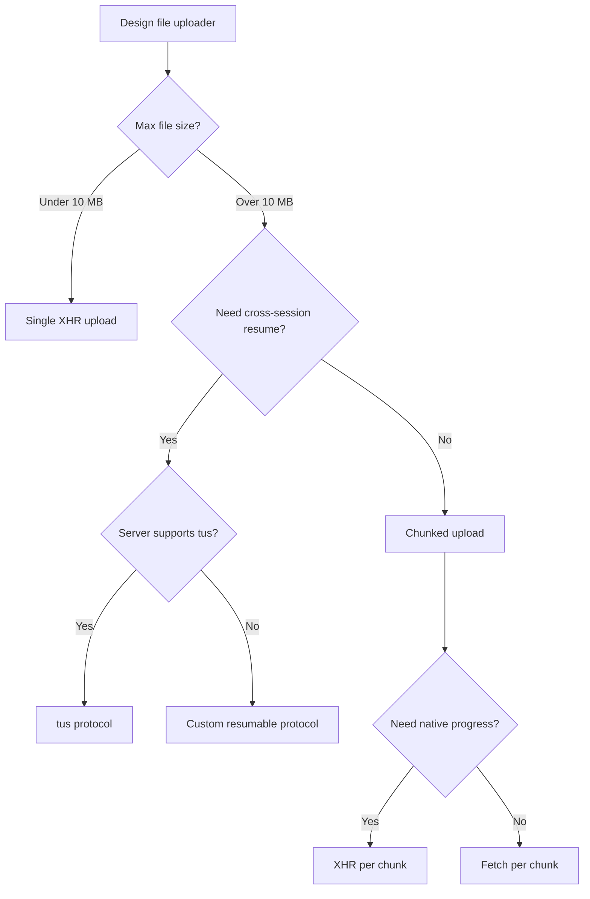

# Design a File Uploader

Building robust file upload requires handling browser constraints, network failures, and user experience across a wide spectrum of file sizes and device capabilities. A naive approach—form submission or single XHR (XMLHttpRequest)—fails at scale: large files exhaust memory, network interruptions lose progress, and users see no feedback. Production uploaders solve this through chunked uploads, resumable protocols, and careful memory management.

<figure>



<figcaption>Chunked uploads enable resumability and progress tracking while keeping memory usage constant regardless of file size.</figcaption>
</figure>

## Abstract

File upload design centers on three architectural decisions:

1. **Upload method**: Single request (FormData/XHR) vs chunked (Blob.slice + sequential requests). Single is simpler; chunked enables resumability and progress.

2. **Resumability protocol**: tus (open standard), proprietary (Google/AWS), or none. Resumability adds server-side state but eliminates re-upload on failure.

3. **Memory strategy**: Load entire file (simple, fails at ~1-2GB) vs stream chunks (constant memory, handles any size).

Key browser constraints shape the design:

- **No Fetch upload progress**: XHR's `upload.progress` event is the only native progress mechanism
- **Blob.slice is O(1)**: Slicing creates a view, not a copy—safe for huge files
- **URL.createObjectURL leaks memory**: Must call `revokeObjectURL()` explicitly
- **File type detection is unreliable**: `file.type` comes from extension, not content

Production implementations (Dropbox, Google Drive, Slack) all use chunked uploads with resumability for files above a threshold (typically 5-20MB), with chunk sizes between 5-256MB depending on network assumptions.

## The Challenge

### Browser Constraints

The File API provides the foundation for file handling in browsers. Per the W3C File API specification, a `File` extends `Blob` with `name` and `lastModified` properties. The critical constraint: accessing file data requires either loading it entirely into memory (FileReader) or streaming it chunk-by-chunk (Blob.stream() or Blob.slice()).

**Memory limits**: FileReader's `readAsArrayBuffer()` or `readAsDataURL()` loads the entire file into memory. On mobile devices with 50-100MB practical limits, files over a few hundred MB can crash the tab. Desktop browsers handle more but still fail at 1-2GB for single reads.

**Main thread budget**: Image processing (thumbnail generation, dimension validation) can block the main thread. A 20MP JPEG decode takes 100-200ms on mid-range mobile devices—enough to cause noticeable jank.

**Blob URL lifecycle**: `URL.createObjectURL()` creates a reference that persists until document unload or explicit `revokeObjectURL()`. In long-running SPAs (Single Page Applications) with frequent file selection, leaked URLs accumulate memory.

### Upload Method Constraints

| Method           | Progress Events   | Streaming | Memory Usage          | Browser Support  |
| ---------------- | ----------------- | --------- | --------------------- | ---------------- |
| Form submission  | None              | N/A       | Low                   | Universal        |
| XMLHttpRequest   | `upload.progress` | No        | Entire body in memory | Universal        |
| Fetch + FormData | None              | No        | Entire body in memory | Universal        |
| Fetch + Stream   | None (unreliable) | Yes       | O(chunk)              | Chrome 105+ only |

The critical gap: Fetch API has no upload progress events. As Jake Archibald documented, using Streams to measure Fetch upload progress gives inaccurate results due to browser buffering—bytes enqueued don't equal bytes sent. XHR remains the only reliable progress mechanism.

### Scale Factors

| Factor              | Simple Uploader        | Production Uploader    |
| ------------------- | ---------------------- | ---------------------- |
| File size           | < 10 MB                | Any size               |
| Network reliability | Stable connection      | Intermittent, mobile   |
| Concurrent uploads  | Single file            | Multiple, queued       |
| Failure recovery    | Restart from beginning | Resume from last chunk |
| Memory usage        | O(file size)           | O(chunk size)          |

## Design Paths

### Path 1: Single-Request Upload (XHR + FormData)

**How it works:**

The entire file is sent in one HTTP request using FormData. XHR provides progress events.

```typescript title="single-upload.ts" collapse={1-3,30-40}
interface UploadOptions {
  file: File
  url: string
  onProgress?: (loaded: number, total: number) => void
  onComplete?: (response: unknown) => void
  onError?: (error: Error) => void
}

function uploadFile({ file, url, onProgress, onComplete, onError }: UploadOptions): () => void {
  const xhr = new XMLHttpRequest()

  xhr.upload.addEventListener("progress", (e) => {
    if (e.lengthComputable) {
      onProgress?.(e.loaded, e.total)
    }
  })

  xhr.addEventListener("load", () => {
    if (xhr.status >= 200 && xhr.status < 300) {
      onComplete?.(JSON.parse(xhr.responseText))
    } else {
      onError?.(new Error(`Upload failed: ${xhr.status}`))
    }
  })

  xhr.addEventListener("error", () => onError?.(new Error("Network error")))

  const formData = new FormData()
  formData.append("file", file)

  xhr.open("POST", url)
  xhr.send(formData)

  // Return abort function
  return () => xhr.abort()
}
```

**Why FormData over raw Blob:**

FormData automatically sets the correct `Content-Type: multipart/form-data` with boundary. Setting this header manually is error-prone—the boundary must match the body encoding exactly.

**Performance characteristics:**

| Metric                    | Value        |
| ------------------------- | ------------ |
| Memory usage              | O(file size) |
| Progress granularity      | ~50ms events |
| Resume capability         | None         |
| Implementation complexity | Low          |

**Best for:**

- Files under 5-10 MB
- Stable network connections
- Simple use cases without resume requirements

**Trade-offs:**

- ✅ Simple implementation, minimal code
- ✅ Native progress events from XHR
- ✅ Works in all browsers
- ❌ No resume on failure—restart from beginning
- ❌ Memory usage scales with file size
- ❌ Large files may timeout

### Path 2: Chunked Upload with Resume

**How it works:**

The file is sliced into chunks using `Blob.slice()`. Each chunk uploads sequentially, with the server tracking received bytes. On failure, upload resumes from the last successful chunk.

```typescript title="chunked-upload.ts" collapse={1-5,65-85}
interface ChunkedUploadOptions {
  file: File
  uploadUrl: string
  chunkSize?: number // Default 5MB
  onProgress?: (uploaded: number, total: number) => void
  onComplete?: () => void
  onError?: (error: Error) => void
}

async function chunkedUpload({
  file,
  uploadUrl,
  chunkSize = 5 * 1024 * 1024,
  onProgress,
  onComplete,
  onError,
}: ChunkedUploadOptions): Promise<void> {
  let offset = 0

  // Query server for existing offset (resume support)
  try {
    const headResponse = await fetch(uploadUrl, { method: "HEAD" })
    const serverOffset = headResponse.headers.get("Upload-Offset")
    if (serverOffset) {
      offset = parseInt(serverOffset, 10)
    }
  } catch {
    // No existing upload, start from 0
  }

  while (offset < file.size) {
    const chunk = file.slice(offset, offset + chunkSize)

    // Use XHR for per-chunk progress
    await new Promise<void>((resolve, reject) => {
      const xhr = new XMLHttpRequest()

      xhr.upload.addEventListener("progress", (e) => {
        if (e.lengthComputable) {
          onProgress?.(offset + e.loaded, file.size)
        }
      })

      xhr.addEventListener("load", () => {
        if (xhr.status >= 200 && xhr.status < 300) {
          resolve()
        } else {
          reject(new Error(`Chunk upload failed: ${xhr.status}`))
        }
      })

      xhr.addEventListener("error", () => reject(new Error("Network error")))

      xhr.open("PATCH", uploadUrl)
      xhr.setRequestHeader("Content-Type", "application/offset+octet-stream")
      xhr.setRequestHeader("Upload-Offset", String(offset))
      xhr.send(chunk)
    })

    offset += chunk.size
  }

  onComplete?.()
}
```

**Why `Blob.slice()` doesn't copy data:**

Per the W3C File API specification, `slice()` returns a new Blob that references the same underlying data with different start/end positions. This is O(1) regardless of file size—critical for multi-gigabyte files.

**Chunk size selection:**

| Network             | Recommended Chunk Size | Rationale                             |
| ------------------- | ---------------------- | ------------------------------------- |
| Fiber/broadband     | 50-100 MB              | Maximize throughput, reduce overhead  |
| Mobile 4G/5G        | 5-10 MB                | Balance between progress and recovery |
| Unstable connection | 1-5 MB                 | Minimize data loss per failure        |

AWS S3 requires minimum 5 MB chunks (except final). Google Drive requires 256 KB minimum. tus protocol has no minimum but recommends 5 MB.

**Performance characteristics:**

| Metric                    | Value                   |
| ------------------------- | ----------------------- |
| Memory usage              | O(chunk size)           |
| Progress granularity      | Per-chunk + intra-chunk |
| Resume capability         | Full (from last chunk)  |
| Implementation complexity | Medium                  |

**Best for:**

- Files over 10 MB
- Unreliable networks (mobile, international)
- Applications requiring resume capability

**Trade-offs:**

- ✅ Constant memory regardless of file size
- ✅ Resume from last successful chunk
- ✅ Fine-grained progress
- ❌ More HTTP requests (overhead)
- ❌ Server must track upload state
- ❌ More complex client and server implementation

### Path 3: tus Protocol Implementation

**How it works:**

The tus protocol (resumable uploads) is an open standard with three phases: creation, upload, and completion. The server returns a unique upload URL that persists across sessions.

```typescript title="tus-client.ts" collapse={1-8,90-110}
interface TusUploadOptions {
  file: File
  endpoint: string // Server endpoint for creating uploads
  chunkSize?: number
  metadata?: Record<string, string>
  onProgress?: (uploaded: number, total: number) => void
  onComplete?: (uploadUrl: string) => void
  onError?: (error: Error) => void
}

class TusUpload {
  private uploadUrl: string | null = null
  private offset = 0
  private aborted = false

  constructor(private options: TusUploadOptions) {}

  async start(): Promise<void> {
    const { file, endpoint, metadata, chunkSize = 5 * 1024 * 1024 } = this.options

    // Phase 1: Create upload resource
    if (!this.uploadUrl) {
      const encodedMetadata = metadata
        ? Object.entries(metadata)
            .map(([k, v]) => `${k} ${btoa(v)}`)
            .join(",")
        : undefined

      const createResponse = await fetch(endpoint, {
        method: "POST",
        headers: {
          "Tus-Resumable": "1.0.0",
          "Upload-Length": String(file.size),
          ...(encodedMetadata && { "Upload-Metadata": encodedMetadata }),
        },
      })

      if (createResponse.status !== 201) {
        throw new Error(`Failed to create upload: ${createResponse.status}`)
      }

      this.uploadUrl = createResponse.headers.get("Location")
      if (!this.uploadUrl) {
        throw new Error("Server did not return upload URL")
      }
    }

    // Phase 2: Query current offset (for resume)
    const headResponse = await fetch(this.uploadUrl, {
      method: "HEAD",
      headers: { "Tus-Resumable": "1.0.0" },
    })

    const serverOffset = headResponse.headers.get("Upload-Offset")
    this.offset = serverOffset ? parseInt(serverOffset, 10) : 0

    // Phase 3: Upload chunks
    while (this.offset < file.size && !this.aborted) {
      const chunk = file.slice(this.offset, this.offset + chunkSize)

      const patchResponse = await fetch(this.uploadUrl, {
        method: "PATCH",
        headers: {
          "Tus-Resumable": "1.0.0",
          "Upload-Offset": String(this.offset),
          "Content-Type": "application/offset+octet-stream",
        },
        body: chunk,
      })

      if (patchResponse.status !== 204) {
        throw new Error(`Chunk upload failed: ${patchResponse.status}`)
      }

      const newOffset = patchResponse.headers.get("Upload-Offset")
      this.offset = newOffset ? parseInt(newOffset, 10) : this.offset + chunk.size

      this.options.onProgress?.(this.offset, file.size)
    }

    if (!this.aborted) {
      this.options.onComplete?.(this.uploadUrl)
    }
  }

  abort(): void {
    this.aborted = true
  }

  getUploadUrl(): string | null {
    return this.uploadUrl
  }
}
```

**tus protocol headers:**

| Header            | Purpose                          | Required                    |
| ----------------- | -------------------------------- | --------------------------- |
| `Tus-Resumable`   | Protocol version (1.0.0)         | All requests except OPTIONS |
| `Upload-Length`   | Total file size                  | POST (creation)             |
| `Upload-Offset`   | Current byte position            | PATCH, HEAD response        |
| `Upload-Metadata` | Key-value pairs (base64 encoded) | Optional                    |
| `Upload-Expires`  | RFC 9110 datetime                | Server response             |

**tus status codes:**

| Code                    | Meaning                       |
| ----------------------- | ----------------------------- |
| 201 Created             | Upload resource created       |
| 204 No Content          | Chunk accepted                |
| 409 Conflict            | Offset mismatch               |
| 412 Precondition Failed | Unsupported protocol version  |
| 460                     | Checksum mismatch (extension) |

**Adopters:** Cloudflare, Vimeo, Supabase, Transloadit

**Trade-offs:**

- ✅ Standardized protocol with multiple server implementations
- ✅ Cross-session resume (upload URL persists)
- ✅ Optional checksum verification (extension)
- ❌ No native progress events (Fetch-based)
- ❌ Server must implement tus protocol
- ❌ More HTTP round-trips than proprietary protocols

### Decision Matrix

| Factor                | Single Request    | Chunked      | tus Protocol               |
| --------------------- | ----------------- | ------------ | -------------------------- |
| File size limit       | ~100 MB practical | Unlimited    | Unlimited                  |
| Resume capability     | None              | Same session | Cross-session              |
| Progress tracking     | Native XHR        | Per-chunk    | Per-chunk (no intra-chunk) |
| Server complexity     | Minimal           | Medium       | tus implementation         |
| Standardization       | N/A               | Custom       | Open standard              |
| Implementation effort | Low               | Medium       | Low (use library)          |

### Decision Framework



## File Selection and Validation

### File Input Approaches

**Standard file input:**

```html
<input type="file" accept="image/*,.pdf" multiple />
```

The `accept` attribute filters the file picker but is advisory—users can still select any file. Always validate server-side.

**Directory selection (non-standard but widely supported):**

```html
<input type="file" webkitdirectory />
```

This selects entire directories. Each File object includes `webkitRelativePath` with the path relative to the selected directory. Supported in Chrome 6+, Firefox 50+, Safari 11.1+.

### Drag and Drop

```typescript title="drop-zone.ts" collapse={1-3,40-55}
function createDropZone(element: HTMLElement, onFiles: (files: File[]) => void): () => void {
  const handleDragOver = (e: DragEvent) => {
    e.preventDefault()
    e.dataTransfer!.dropEffect = "copy"
    element.classList.add("drag-over")
  }

  const handleDragLeave = () => {
    element.classList.remove("drag-over")
  }

  const handleDrop = (e: DragEvent) => {
    e.preventDefault()
    element.classList.remove("drag-over")

    const files: File[] = []

    // DataTransferItemList for directory support
    if (e.dataTransfer?.items) {
      for (const item of e.dataTransfer.items) {
        if (item.kind === "file") {
          const file = item.getAsFile()
          if (file) files.push(file)
        }
      }
    } else if (e.dataTransfer?.files) {
      // Fallback for older browsers
      files.push(...Array.from(e.dataTransfer.files))
    }

    onFiles(files)
  }

  element.addEventListener("dragover", handleDragOver)
  element.addEventListener("dragleave", handleDragLeave)
  element.addEventListener("drop", handleDrop)

  return () => {
    element.removeEventListener("dragover", handleDragOver)
    element.removeEventListener("dragleave", handleDragLeave)
    element.removeEventListener("drop", handleDrop)
  }
}
```

**DataTransfer security:**

Per the WHATWG specification, drag data is not available to scripts until the drop event completes. During dragover, `dataTransfer.files` is empty—you can only check `dataTransfer.types` to see if files are present.

### Client-Side Validation

**File type validation (magic bytes):**

The `file.type` property comes from file extension mapping, not actual content. A `.jpg` renamed to `.png` reports `image/png`. For security-sensitive applications, read the file header:

```typescript title="magic-bytes-validation.ts" collapse={1-2,35-50}
const MAGIC_SIGNATURES: Record<string, number[]> = {
  "image/jpeg": [0xff, 0xd8, 0xff],
  "image/png": [0x89, 0x50, 0x4e, 0x47, 0x0d, 0x0a, 0x1a, 0x0a],
  "image/gif": [0x47, 0x49, 0x46, 0x38], // "GIF8"
  "image/webp": [0x52, 0x49, 0x46, 0x46], // "RIFF" (check offset 8 for "WEBP")
  "application/pdf": [0x25, 0x50, 0x44, 0x46], // "%PDF"
}

async function detectFileType(file: File): Promise<string | null> {
  const slice = file.slice(0, 12) // Read first 12 bytes
  const buffer = await slice.arrayBuffer()
  const bytes = new Uint8Array(buffer)

  for (const [mimeType, signature] of Object.entries(MAGIC_SIGNATURES)) {
    if (signature.every((byte, i) => bytes[i] === byte)) {
      // Special case: WebP requires additional check at offset 8
      if (mimeType === "image/webp") {
        const webpMarker = new TextDecoder().decode(bytes.slice(8, 12))
        if (webpMarker !== "WEBP") continue
      }
      return mimeType
    }
  }

  // Fallback to extension-based type
  return file.type || null
}
```

**Image dimension validation:**

```typescript title="dimension-validation.ts"
async function validateImageDimensions(
  file: File,
  maxWidth: number,
  maxHeight: number,
): Promise<{ width: number; height: number }> {
  const url = URL.createObjectURL(file)

  try {
    const img = await new Promise<HTMLImageElement>((resolve, reject) => {
      const image = new Image()
      image.onload = () => resolve(image)
      image.onerror = () => reject(new Error("Failed to load image"))
      image.src = url
    })

    if (img.width > maxWidth || img.height > maxHeight) {
      throw new Error(`Image ${img.width}x${img.height} exceeds max ${maxWidth}x${maxHeight}`)
    }

    return { width: img.width, height: img.height }
  } finally {
    URL.revokeObjectURL(url) // Always clean up
  }
}
```

### Security Considerations

Per OWASP File Upload Cheat Sheet:

**SVG files can execute JavaScript:**

```xml
<!-- Malicious SVG -->
<svg xmlns="http://www.w3.org/2000/svg">
  <script>alert('XSS')</script>
</svg>
```

SVGs can contain `<script>` tags, event handlers (`onload`, `onclick`), `<foreignObject>` with HTML, and `xlink:href` with javascript URLs. Mitigation: sanitize SVGs server-side or convert to raster formats.

**Filename attacks:**

- Double extensions: `malware.php.jpg`
- Null bytes: `file.php%00.jpg`
- Path traversal: `../../../etc/passwd`

Always sanitize filenames server-side—generate UUIDs rather than preserving user-provided names.

**Content-Type mismatch:**

A file can have `.jpg` extension, `image/jpeg` Content-Type header, but actually be a PHP script. Validate content on the server by checking magic bytes, not just headers.

## Preview Generation

### URL.createObjectURL vs FileReader

| Aspect      | createObjectURL            | readAsDataURL          |
| ----------- | -------------------------- | ---------------------- |
| Speed       | Synchronous, instant       | Asynchronous, slower   |
| Memory      | URL reference only         | Full base64 in memory  |
| Output      | `blob:origin/uuid`         | `data:mime;base64,...` |
| Cleanup     | Manual `revokeObjectURL()` | Automatic (GC)         |
| Large files | Better                     | Memory intensive       |

**Recommendation:** Use `createObjectURL` for previews, always clean up.

```typescript title="image-preview.ts"
function createImagePreview(file: File, imgElement: HTMLImageElement): () => void {
  const url = URL.createObjectURL(file)
  imgElement.src = url

  // Return cleanup function
  return () => URL.revokeObjectURL(url)
}

// Usage with cleanup
const cleanup = createImagePreview(file, previewImg)
// Later, when preview no longer needed:
cleanup()
```

### Thumbnail Generation with OffscreenCanvas

For large images, generate thumbnails in a Web Worker to avoid blocking the main thread:

```typescript title="thumbnail-worker.ts" collapse={1-2,30-40}
// thumbnail-worker.ts
self.addEventListener("message", async (e: MessageEvent<File>) => {
  const file = e.data
  const maxSize = 200

  // createImageBitmap doesn't block and works in workers
  const bitmap = await createImageBitmap(file)

  // Calculate scaled dimensions
  let { width, height } = bitmap
  if (width > height) {
    if (width > maxSize) {
      height = (height * maxSize) / width
      width = maxSize
    }
  } else {
    if (height > maxSize) {
      width = (width * maxSize) / height
      height = maxSize
    }
  }

  // OffscreenCanvas enables canvas operations in workers
  const canvas = new OffscreenCanvas(width, height)
  const ctx = canvas.getContext("2d")!
  ctx.drawImage(bitmap, 0, 0, width, height)

  const blob = await canvas.convertToBlob({ type: "image/jpeg", quality: 0.8 })

  self.postMessage(blob)
})
```

```typescript title="main-thread.ts"
// main-thread.ts
const worker = new Worker("thumbnail-worker.ts", { type: "module" })

function generateThumbnail(file: File): Promise<Blob> {
  return new Promise((resolve) => {
    worker.onmessage = (e) => resolve(e.data)
    worker.postMessage(file)
  })
}
```

**Performance impact:**

Main thread canvas decode for 20MP JPEG: ~100-200ms (causes jank)
Web Worker with OffscreenCanvas: Same time but non-blocking

### Non-Image File Icons

For non-image files, use file type icons based on MIME type or extension:

```typescript title="file-icon.ts"
const FILE_ICONS: Record<string, string> = {
  "application/pdf": "pdf-icon.svg",
  "application/zip": "archive-icon.svg",
  "application/x-zip-compressed": "archive-icon.svg",
  "text/plain": "text-icon.svg",
  "video/": "video-icon.svg",
  "audio/": "audio-icon.svg",
}

function getFileIcon(file: File): string {
  // Check exact MIME type
  if (FILE_ICONS[file.type]) {
    return FILE_ICONS[file.type]
  }

  // Check MIME type prefix (video/, audio/)
  for (const [prefix, icon] of Object.entries(FILE_ICONS)) {
    if (prefix.endsWith("/") && file.type.startsWith(prefix)) {
      return icon
    }
  }

  return "generic-file-icon.svg"
}
```

## Progress Tracking and UX

### Progress Calculation for Chunked Uploads

```typescript title="progress-tracking.ts" collapse={1-5,45-55}
interface UploadProgress {
  file: File
  loaded: number
  total: number
  percent: number
  speed: number // bytes/second
  remaining: number // seconds
}

class ProgressTracker {
  private startTime = Date.now()
  private samples: Array<{ time: number; loaded: number }> = []

  constructor(private total: number) {}

  update(loaded: number): UploadProgress {
    const now = Date.now()
    this.samples.push({ time: now, loaded })

    // Keep last 5 seconds of samples for speed calculation
    const cutoff = now - 5000
    this.samples = this.samples.filter((s) => s.time > cutoff)

    // Calculate speed from samples
    let speed = 0
    if (this.samples.length >= 2) {
      const oldest = this.samples[0]
      const elapsed = (now - oldest.time) / 1000
      const bytesTransferred = loaded - oldest.loaded
      speed = elapsed > 0 ? bytesTransferred / elapsed : 0
    }

    const remaining = speed > 0 ? (this.total - loaded) / speed : Infinity

    return {
      loaded,
      total: this.total,
      percent: (loaded / this.total) * 100,
      speed,
      remaining,
    }
  }
}
```

### Multi-File Upload Queue

```typescript title="upload-queue.ts" collapse={1-8,70-90}
type UploadStatus = "pending" | "uploading" | "completed" | "failed"

interface QueuedUpload {
  id: string
  file: File
  status: UploadStatus
  progress: number
  error?: Error
}

class UploadQueue {
  private queue: QueuedUpload[] = []
  private concurrency: number
  private activeCount = 0
  private onUpdate?: (queue: QueuedUpload[]) => void

  constructor(options: { concurrency?: number; onUpdate?: (queue: QueuedUpload[]) => void }) {
    this.concurrency = options.concurrency ?? 3
    this.onUpdate = options.onUpdate
  }

  add(files: File[]): void {
    const newItems = files.map((file) => ({
      id: crypto.randomUUID(),
      file,
      status: "pending" as UploadStatus,
      progress: 0,
    }))

    this.queue.push(...newItems)
    this.notify()
    this.processNext()
  }

  private async processNext(): Promise<void> {
    if (this.activeCount >= this.concurrency) return

    const next = this.queue.find((item) => item.status === "pending")
    if (!next) return

    this.activeCount++
    next.status = "uploading"
    this.notify()

    try {
      await this.uploadFile(next)
      next.status = "completed"
      next.progress = 100
    } catch (error) {
      next.status = "failed"
      next.error = error as Error
    }

    this.activeCount--
    this.notify()
    this.processNext()
  }

  private async uploadFile(item: QueuedUpload): Promise<void> {
    // Implementation calls actual upload function
    // Updates item.progress during upload
  }

  private notify(): void {
    this.onUpdate?.(this.queue)
  }

  cancel(id: string): void {
    const item = this.queue.find((q) => q.id === id)
    if (item && item.status === "pending") {
      this.queue = this.queue.filter((q) => q.id !== id)
      this.notify()
    }
  }

  retry(id: string): void {
    const item = this.queue.find((q) => q.id === id)
    if (item && item.status === "failed") {
      item.status = "pending"
      item.progress = 0
      item.error = undefined
      this.notify()
      this.processNext()
    }
  }
}
```

### Error Handling and Retry

**Retry with exponential backoff:**

```typescript title="retry-logic.ts" collapse={1-3}
async function uploadWithRetry<T>(
  uploadFn: () => Promise<T>,
  options: { maxRetries?: number; baseDelay?: number } = {},
): Promise<T> {
  const { maxRetries = 3, baseDelay = 1000 } = options
  let lastError: Error

  for (let attempt = 0; attempt <= maxRetries; attempt++) {
    try {
      return await uploadFn()
    } catch (error) {
      lastError = error as Error

      // Don't retry on client errors (4xx)
      if (error instanceof Response && error.status >= 400 && error.status < 500) {
        throw error
      }

      if (attempt < maxRetries) {
        const delay = baseDelay * Math.pow(2, attempt)
        const jitter = delay * 0.2 * Math.random()
        await new Promise((r) => setTimeout(r, delay + jitter))
      }
    }
  }

  throw lastError!
}
```

**Error categorization:**

| Error Type                   | Retry? | User Message                   |
| ---------------------------- | ------ | ------------------------------ |
| Network error                | Yes    | "Connection lost. Retrying..." |
| 408, 429, 500, 502, 503, 504 | Yes    | "Server busy. Retrying..."     |
| 400 Bad Request              | No     | "Invalid file"                 |
| 401, 403                     | No     | "Permission denied"            |
| 413 Payload Too Large        | No     | "File too large"               |
| 415 Unsupported Media Type   | No     | "File type not allowed"        |

## Browser Constraints Deep Dive

### Storage for Resume State

For cross-session resume, store upload state in IndexedDB:

```typescript title="upload-state-store.ts" collapse={1-5,50-70}
interface StoredUploadState {
  id: string
  fileName: string
  fileSize: number
  uploadUrl: string
  offset: number
  createdAt: number
  // Store file reference if same session
  file?: File
}

class UploadStateStore {
  private db: IDBDatabase | null = null

  async init(): Promise<void> {
    return new Promise((resolve, reject) => {
      const request = indexedDB.open("upload-state", 1)

      request.onupgradeneeded = (e) => {
        const db = (e.target as IDBOpenDBRequest).result
        db.createObjectStore("uploads", { keyPath: "id" })
      }

      request.onsuccess = (e) => {
        this.db = (e.target as IDBOpenDBRequest).result
        resolve()
      }

      request.onerror = () => reject(request.error)
    })
  }

  async save(state: StoredUploadState): Promise<void> {
    if (!this.db) throw new Error("DB not initialized")

    return new Promise((resolve, reject) => {
      const tx = this.db!.transaction("uploads", "readwrite")
      const store = tx.objectStore("uploads")
      const request = store.put(state)
      request.onsuccess = () => resolve()
      request.onerror = () => reject(request.error)
    })
  }

  async getAll(): Promise<StoredUploadState[]> {
    if (!this.db) throw new Error("DB not initialized")

    return new Promise((resolve, reject) => {
      const tx = this.db!.transaction("uploads", "readonly")
      const store = tx.objectStore("uploads")
      const request = store.getAll()
      request.onsuccess = () => resolve(request.result)
      request.onerror = () => reject(request.error)
    })
  }

  async delete(id: string): Promise<void> {
    if (!this.db) throw new Error("DB not initialized")

    return new Promise((resolve, reject) => {
      const tx = this.db!.transaction("uploads", "readwrite")
      const store = tx.objectStore("uploads")
      const request = store.delete(id)
      request.onsuccess = () => resolve()
      request.onerror = () => reject(request.error)
    })
  }
}
```

**Storage limits:**

| Browser | IndexedDB Limit                        |
| ------- | -------------------------------------- |
| Chrome  | 60% of disk space                      |
| Firefox | 10% of disk or 10 GiB                  |
| Safari  | ~60% of disk (browser), ~15% (WebView) |

### Memory Management

**Avoid:**

```typescript
// ❌ Loads entire file into memory
const data = await file.arrayBuffer()
upload(data)
```

**Prefer:**

```typescript
// ✅ Constant memory with chunking
for (let offset = 0; offset < file.size; offset += chunkSize) {
  const chunk = file.slice(offset, offset + chunkSize)
  await uploadChunk(chunk)
}
```

**Blob URL cleanup pattern:**

```typescript
// Track all created URLs
const activeUrls = new Set<string>()

function createTrackedUrl(blob: Blob): string {
  const url = URL.createObjectURL(blob)
  activeUrls.add(url)
  return url
}

function revokeUrl(url: string): void {
  URL.revokeObjectURL(url)
  activeUrls.delete(url)
}

// Cleanup all on component unmount
function revokeAll(): void {
  activeUrls.forEach((url) => URL.revokeObjectURL(url))
  activeUrls.clear()
}
```

## Real-World Implementations

### Dropbox: Block-Based Deduplication

**Challenge:** Billions of files, many partially identical (document versions, moved files).

**Approach:**

- Files split into 4 MB blocks
- Each block hashed client-side
- Server checks which blocks already exist
- Only upload missing blocks
- Server assembles file from block references

**Key insight:** A 100 MB file with one changed paragraph uploads only ~4 MB.

**Stack:**

- Client: Content-addressable chunking
- Backend: Block storage with reference counting
- Protocol: Custom HTTP API with block-level operations

### Google Drive: Session-Based Resumable

**Approach:**

- Small files (<5 MB): Single request
- Large files: Resumable upload session

**Protocol details:**

- Session URI valid for 1 week
- 256 KB minimum chunk size
- `Content-Range` header specifies byte range
- 308 Resume Incomplete status for continuation

**Error recovery:**

1. On failure, query session with empty PUT
2. Server responds with `Range` header showing received bytes
3. Client resumes from that offset

### Slack: Two-Phase Upload

**Approach:**

- Phase 1: `files.getUploadURLExternal` - Get temporary upload URL
- Phase 2: Upload to URL, then `files.completeUploadExternal`

**Why two phases:**

- Upload URL keeps API tokens server-side
- Client uploads directly to storage, bypassing app servers
- Reduces load on API servers

**Limits:** 1 GB max (1 MB for code snippets)

### Discord: Attachment Processing

**Approach:**

- Files upload to CDN
- Images/videos processed server-side (thumbnails, transcoding)
- Proxied through CDN with size variants

**Client-side:**

- Progress tracking per file
- Concurrent upload limit (typically 3)
- Retry with exponential backoff

## Accessibility

### Keyboard Navigation

```typescript title="accessible-dropzone.ts"
function AccessibleDropzone({ onFiles }: { onFiles: (files: File[]) => void }) {
  const inputRef = useRef<HTMLInputElement>(null);

  const handleKeyDown = (e: KeyboardEvent) => {
    if (e.key === 'Enter' || e.key === ' ') {
      e.preventDefault();
      inputRef.current?.click();
    }
  };

  return (
    <div
      role="button"
      tabIndex={0}
      onKeyDown={handleKeyDown}
      aria-label="Upload files. Press Enter or Space to open file picker, or drag and drop files here."
    >
      <input
        ref={inputRef}
        type="file"
        multiple
        className="visually-hidden"
        onChange={(e) => onFiles(Array.from(e.target.files || []))}
      />
      <span aria-hidden="true">Drag files here or click to upload</span>
    </div>
  );
}
```

### Screen Reader Announcements

```typescript title="progress-announcements.ts"
function useProgressAnnouncement() {
  const [announcement, setAnnouncement] = useState('');

  const announce = useCallback((progress: number, fileName: string) => {
    // Announce at key milestones to avoid noise
    if (progress === 0) {
      setAnnouncement(`Starting upload of ${fileName}`);
    } else if (progress === 100) {
      setAnnouncement(`${fileName} upload complete`);
    } else if (progress % 25 === 0) {
      setAnnouncement(`${fileName}: ${progress}% uploaded`);
    }
  }, []);

  return {
    announce,
    AriaLive: () => (
      <div aria-live="polite" aria-atomic="true" className="visually-hidden">
        {announcement}
      </div>
    )
  };
}
```

### Error State Communication

```typescript title="error-state.ts"
function UploadError({ error, onRetry }: { error: Error; onRetry: () => void }) {
  return (
    <div role="alert" aria-live="assertive">
      <span>Upload failed: {error.message}</span>
      <button onClick={onRetry} aria-label="Retry failed upload">
        Retry
      </button>
    </div>
  );
}
```

## Conclusion

File upload design requires choosing between simplicity and robustness based on file size expectations and network reliability:

- **Under 5-10 MB**: Single XHR request with FormData provides native progress events with minimal complexity.
- **Over 10 MB**: Chunked uploads with `Blob.slice()` keep memory constant and enable resume.
- **Unreliable networks**: tus protocol or similar resumable protocol enables cross-session resume.

The key constraints driving these decisions:

- Fetch has no upload progress events—XHR remains necessary for progress tracking
- `Blob.slice()` is O(1) and safe for any file size
- `URL.createObjectURL()` leaks memory without explicit cleanup
- Client-side `file.type` is unreliable—validate with magic bytes for security

Production implementations (Dropbox, Google Drive, Slack) universally use chunked uploads for large files, with chunk sizes between 5-256 MB depending on their network assumptions.

## Appendix

### Prerequisites

- Browser File API (File, Blob, FileReader)
- XMLHttpRequest or Fetch API
- Basic understanding of HTTP multipart encoding

### Terminology

| Term        | Definition                                        |
| ----------- | ------------------------------------------------- |
| Chunk       | A slice of the file uploaded independently        |
| Offset      | Current byte position in the file                 |
| Resume      | Continuing upload from last successful offset     |
| tus         | Open protocol for resumable uploads (tus.io)      |
| Magic bytes | File signature bytes that identify true file type |
| Blob URL    | Browser-internal URL referencing in-memory data   |

### Summary

- Single-request XHR upload works for files under 5-10 MB with native progress events
- Chunked uploads with `Blob.slice()` enable constant memory usage and resume capability
- tus protocol provides standardized cross-session resume with multiple server implementations
- Always validate file types server-side—client-side `file.type` is based on extension only
- Clean up `URL.createObjectURL()` references to prevent memory leaks
- Use OffscreenCanvas in Web Workers for thumbnail generation to avoid main thread blocking
- Implement exponential backoff with jitter for retry logic

### References

- [W3C File API Specification](https://www.w3.org/TR/FileAPI/) - Authoritative File, Blob, and FileReader API specification
- [WHATWG XMLHttpRequest Standard](https://xhr.spec.whatwg.org/) - FormData and upload progress events
- [tus.io Protocol Specification](https://tus.io/protocols/resumable-upload) - Open resumable upload protocol (v1.0.0)
- [MDN: File API](https://developer.mozilla.org/en-US/docs/Web/API/File_API) - Implementation guide and browser support
- [MDN: Drag and Drop API](https://developer.mozilla.org/en-US/docs/Web/API/HTML_Drag_and_Drop_API) - DataTransfer and drop events
- [WHATWG Drag and Drop Specification](https://html.spec.whatwg.org/multipage/dnd.html) - Authoritative drag/drop behavior
- [OWASP File Upload Cheat Sheet](https://cheatsheetseries.owasp.org/cheatsheets/File_Upload_Cheat_Sheet.html) - Security best practices
- [Chrome: Fetch Streaming Requests](https://developer.chrome.com/docs/capabilities/web-apis/fetch-streaming-requests) - Streaming upload limitations
- [Jake Archibald: Fetch streams aren't for progress](https://jakearchibald.com/2025/fetch-streams-not-for-progress/) - Why Fetch progress tracking is unreliable
- [AWS S3 Multipart Upload](https://docs.aws.amazon.com/AmazonS3/latest/userguide/mpuoverview.html) - AWS chunked upload protocol
- [Google Drive Upload API](https://developers.google.com/workspace/drive/api/guides/manage-uploads) - Resumable upload implementation
- [MDN: Storage Quotas](https://developer.mozilla.org/en-US/docs/Web/API/Storage_API/Storage_quotas_and_eviction_criteria) - IndexedDB storage limits
- [MDN: OffscreenCanvas](https://developer.mozilla.org/en-US/docs/Web/API/OffscreenCanvas) - Background image processing
