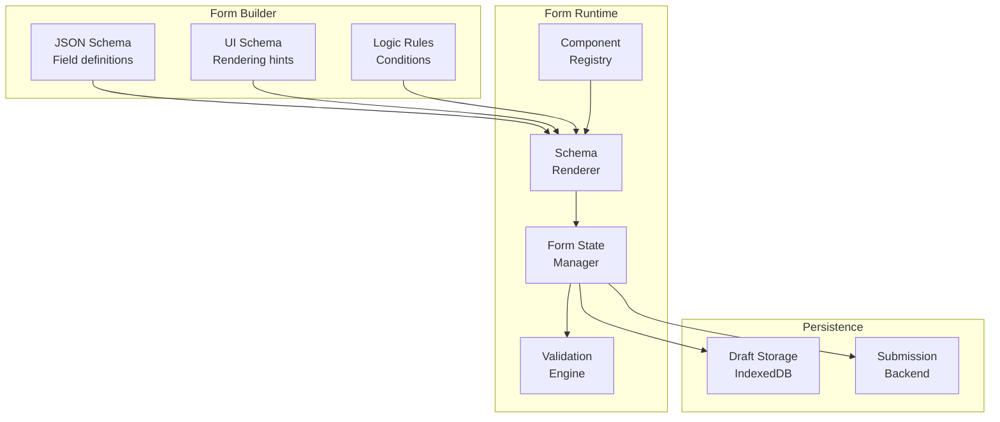
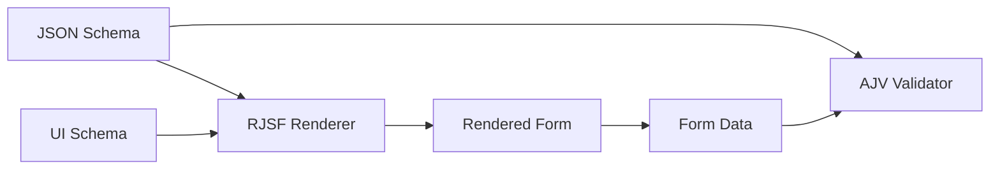
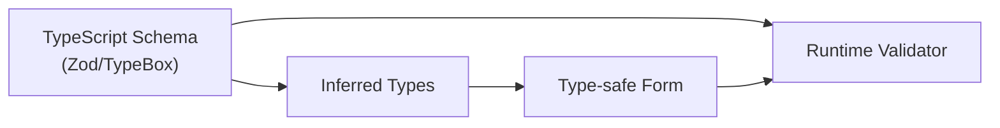
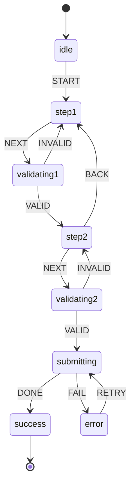

# Design a Form Builder

Schema-driven form generation systems that render dynamic UIs from declarative definitions. This article covers form schema architectures, validation strategies, state management patterns, and the trade-offs that shape production form builders like Typeform, Google Forms, and enterprise low-code platforms.

<figure>



<figcaption>Form builder architecture: schemas define structure, runtime renders and validates, persistence handles drafts and submissions.</figcaption>
</figure>

## Abstract

A form builder separates **what** (schema) from **how** (rendering) through three layers:

1. **Schema Layer** — JSON Schema or custom DSL defines field types, validation rules, and relationships. TypeScript inference provides compile-time safety.

2. **Runtime Layer** — Component registry maps field types to UI components. State manager tracks values, errors, dirty state. Validation engine supports sync, async, and cross-field rules.

3. **Persistence Layer** — Autosave to IndexedDB for draft recovery. Debounced saves prevent data loss without server overhead.

Key architectural decisions:

| Decision          | Options                        | Trade-off                       |
| ----------------- | ------------------------------ | ------------------------------- |
| State approach    | Controlled vs Uncontrolled     | Re-renders vs Direct DOM access |
| Validation timing | onChange vs onBlur vs onSubmit | Responsiveness vs Performance   |
| Schema format     | JSON Schema vs Custom DSL      | Interoperability vs Flexibility |
| Field rendering   | Eager vs Virtualized           | Simplicity vs Scale             |

## The Challenge

### Why Forms Are Hard

Forms appear simple but encode complex state machines: field visibility depends on other fields, validation rules cross boundaries, and user expectations around autosave and error recovery are high.

### Browser Constraints

| Constraint                          | Impact                    | Mitigation                         |
| ----------------------------------- | ------------------------- | ---------------------------------- |
| Main thread (16ms budget)           | Validation blocking input | Debounce, Web Workers              |
| Memory (mobile: 50-100MB practical) | Large form state trees    | Virtualization, state pruning      |
| localStorage (5MB)                  | Draft storage limits      | IndexedDB (50% of disk)            |
| Re-render cost                      | Sluggish typing feedback  | Uncontrolled inputs, subscriptions |

### Scale Factors

| Factor            | Small       | Medium     | Large           |
| ----------------- | ----------- | ---------- | --------------- |
| Fields            | < 50        | 50-200     | > 200           |
| Nested depth      | 1-2 levels  | 3-4 levels | 5+ levels       |
| Conditional rules | < 10        | 10-50      | > 50            |
| Update frequency  | Submit only | Blur       | Every keystroke |

Large-scale forms (tax software, insurance applications, enterprise workflows) require virtualization and careful state management to remain responsive.

## Design Paths

### Path 1: JSON Schema + UI Schema

**Architecture:**



**How it works:**

JSON Schema defines data structure and validation constraints. A separate UI Schema specifies rendering hints (widgets, field order, layout). The renderer traverses both schemas to generate the form.

```typescript title="schema-example.ts" collapse={1-2}
// JSON Schema defines data shape and validation
import type { JSONSchema7 } from "json-schema"

const schema: JSONSchema7 = {
  type: "object",
  required: ["email", "role"],
  properties: {
    email: {
      type: "string",
      format: "email",
      title: "Email Address",
    },
    role: {
      type: "string",
      enum: ["admin", "user", "guest"],
      title: "Role",
    },
    permissions: {
      type: "array",
      items: { type: "string" },
      title: "Permissions",
    },
  },
}

// UI Schema controls rendering
const uiSchema = {
  email: { "ui:autofocus": true },
  role: { "ui:widget": "radio" },
  permissions: { "ui:widget": "checkboxes" },
}
```

**Best for:**

- Standards-compliant form definitions shared across systems
- Backend-generated forms (server defines schema, client renders)
- API documentation integration (OpenAPI to form generation)

**Device/network profile:**

- Works well on: Desktop, stable networks (schema fetching)
- Struggles on: Low-end mobile with complex nested schemas (parsing overhead)

**Implementation complexity:**

| Aspect               | Effort                             |
| -------------------- | ---------------------------------- |
| Initial setup        | Low (libraries handle rendering)   |
| Custom widgets       | Medium (widget registry)           |
| Complex conditionals | High (JSON Schema `if/then/else`)  |
| Type safety          | Medium (inference libraries exist) |

**Real-world example:**

React JSON Schema Form (RJSF) powers forms at Mozilla, Postman, and numerous enterprise tools. The schema-first approach enables form definitions stored in databases and shared between frontend and backend validation.

**Trade-offs:**

- ✅ Schema reusable across platforms (web, mobile, validation)
- ✅ AJV validation is battle-tested and fast
- ❌ UI Schema adds second layer of complexity
- ❌ Complex conditional logic is verbose in JSON Schema

### Path 2: TypeScript-First Schema (Zod/TypeBox)

**Architecture:**



**How it works:**

Define schemas in TypeScript with libraries like Zod or TypeBox. Types are inferred automatically—write once, get both compile-time checking and runtime validation.

```typescript title="zod-schema.ts" collapse={1-3}
// TypeScript-first schema with Zod
import { z } from "zod"

const userSchema = z
  .object({
    email: z.string().email("Invalid email format"),
    age: z.number().min(18, "Must be 18 or older"),
    role: z.enum(["admin", "user", "guest"]),
    // Cross-field validation
  })
  .refine((data) => data.role !== "admin" || data.age >= 21, { message: "Admins must be 21+", path: ["age"] })

// Type is automatically inferred
type User = z.infer<typeof userSchema>
// { email: string; age: number; role: "admin" | "user" | "guest" }

// Async validation example
const uniqueEmailSchema = z
  .string()
  .email()
  .refine(
    async (email) => {
      const exists = await checkEmailExists(email)
      return !exists
    },
    { message: "Email already registered" },
  )
```

**Best for:**

- TypeScript-heavy codebases wanting type inference
- Complex validation logic (easier in code than JSON)
- React Hook Form or similar library integration

**Device/network profile:**

- Works well on: All devices (validation runs locally)
- Struggles on: Async validation on slow networks (needs debouncing)

**Implementation complexity:**

| Aspect               | Effort                     |
| -------------------- | -------------------------- |
| Initial setup        | Low (npm install + schema) |
| Type inference       | Automatic                  |
| Custom validation    | Low (just write functions) |
| Schema serialization | Medium (not JSON-native)   |

**Real-world example:**

tRPC, Remix, and Next.js applications commonly use Zod for end-to-end type safety. The schema validates both client forms and server API handlers.

**Trade-offs:**

- ✅ Full TypeScript inference without code generation
- ✅ Complex validation logic is natural in code
- ✅ Excellent React Hook Form integration via resolvers
- ❌ Not portable to non-JS backends (unlike JSON Schema)
- ❌ Schema not easily stored in database

### Path 3: Form State Machine (XState)

**Architecture:**



**How it works:**

Model the form as a finite state machine. Each step is a state, transitions are guarded by validation, and context holds accumulated form data. XState handles complex flows like multi-step wizards, conditional branching, and async operations.

```typescript title="form-machine.ts" collapse={1-5, 45-60}
// XState form wizard machine
import { createMachine, assign } from "xstate"

type FormContext = {
  step1Data: { name: string } | null
  step2Data: { email: string } | null
  errors: Record<string, string>
}

const formMachine = createMachine({
  id: "formWizard",
  initial: "step1",
  context: {
    step1Data: null,
    step2Data: null,
    errors: {},
  } as FormContext,
  states: {
    step1: {
      on: {
        NEXT: {
          target: "step2",
          guard: "isStep1Valid",
          actions: assign({
            step1Data: (_, event) => event.data,
          }),
        },
      },
    },
    step2: {
      on: {
        NEXT: { target: "submitting", guard: "isStep2Valid" },
        BACK: "step1",
      },
    },
    submitting: {
      invoke: {
        src: "submitForm",
        onDone: "success",
        onError: { target: "error", actions: "setError" },
      },
    },
    success: { type: "final" },
    error: { on: { RETRY: "submitting" } },
  },
})
```

**Best for:**

- Multi-step wizards with complex branching
- Forms with strict workflow requirements (can't skip steps)
- Audit trails (state machine history is explicit)

**Device/network profile:**

- Works well on: All devices (state logic is lightweight)
- Struggles on: None specific (XState is efficient)

**Implementation complexity:**

| Aspect        | Effort                             |
| ------------- | ---------------------------------- |
| Initial setup | Medium (XState learning curve)     |
| Simple forms  | Overkill                           |
| Complex flows | Low (states make flows explicit)   |
| Debugging     | Low (XState Viz, state inspection) |

**Real-world example:**

Insurance quote flows, loan applications, and checkout processes use state machines. The explicit states prevent impossible transitions (e.g., submitting without completing required steps).

**Trade-offs:**

- ✅ Complex flows are explicit and visualizable
- ✅ Guards prevent invalid transitions
- ✅ Built-in async handling for submissions
- ❌ Overhead for simple single-page forms
- ❌ Two systems to maintain (state machine + form library)

### Decision Matrix

| Factor             | JSON Schema                  | Zod/TypeBox   | XState       |
| ------------------ | ---------------------------- | ------------- | ------------ |
| Type safety        | Medium (with inference libs) | High (native) | Medium       |
| Portability        | High (cross-platform)        | Low (JS only) | Low          |
| Complex validation | Verbose                      | Natural       | Via guards   |
| Multi-step flows   | Manual                       | Manual        | Built-in     |
| Learning curve     | Low                          | Low           | Medium       |
| Best for           | API-driven forms             | TS apps       | Wizard flows |

## State Management

### Controlled vs Uncontrolled

The fundamental form state decision affects every re-render:

**Controlled (Formik, Redux Form):**

```typescript title="controlled.tsx"
// Every keystroke updates React state → re-render
const [value, setValue] = useState("");
<input value={value} onChange={(e) => setValue(e.target.value)} />;
```

- ✅ React controls the source of truth
- ✅ Easy to derive computed values
- ❌ Re-renders on every keystroke (performance cost)

**Uncontrolled (React Hook Form):**

```typescript title="uncontrolled.tsx" collapse={1-2}
// DOM is source of truth, React reads on demand
import { useForm } from "react-hook-form";

const { register, handleSubmit } = useForm();
<input {...register("email")} />;
// Only re-renders when explicitly subscribed
```

- ✅ Minimal re-renders (DOM handles input)
- ✅ Better performance for large forms
- ❌ Less control over intermediate states
- ❌ Need `Controller` for custom components

**Performance comparison (100 fields, keystroke in one field):**

| Approach               | Re-renders     | Time  |
| ---------------------- | -------------- | ----- |
| Controlled (naive)     | 100 components | ~50ms |
| Controlled (optimized) | 1 component    | ~5ms  |
| Uncontrolled           | 0 components   | ~1ms  |

### Subscription-Based Updates

React Final Form and React Hook Form use subscriptions to limit re-renders:

```typescript title="subscriptions.tsx" collapse={1-3}
// Only subscribe to what you need
import { useFormState, useWatch } from "react-hook-form"

// Component only re-renders when these specific values change
const { isDirty, isValid } = useFormState({
  control,
  subscription: { isDirty: true, isValid: true },
})

// Watch specific field, not entire form
const email = useWatch({ control, name: "email" })
```

**Design rationale:** Subscriptions let components opt-in to state changes, similar to GraphQL selecting only needed fields. This prevents the cascading re-renders that plague naive form implementations.

### Field-Level vs Form-Level State

| Approach    | State Location       | Re-render Scope | Use Case        |
| ----------- | -------------------- | --------------- | --------------- |
| Form-level  | Single store         | Entire form     | Simple forms    |
| Field-level | Per-field            | Single field    | Large forms     |
| Hybrid      | Form + subscriptions | Subscribed only | Production apps |

**Recommendation:** Start with form-level state (simpler). Move to subscriptions when profiling shows re-render bottlenecks (typically > 50 fields or complex computed values).

## Validation Architecture

### Validation Timing

| Timing             | UX                         | Performance                 | Use Case         |
| ------------------ | -------------------------- | --------------------------- | ---------------- |
| onChange           | Immediate feedback         | High cost (every keystroke) | Critical fields  |
| onBlur             | Feedback after interaction | Low cost                    | Default choice   |
| onSubmit           | Batch validation           | Lowest cost                 | Simple forms     |
| Debounced onChange | Balanced                   | Medium cost                 | Async validation |

**Debounced async validation pattern:**

```typescript title="debounced-validation.ts" collapse={1-5}
// Debounce async validation to avoid API spam
import { z } from "zod"
import debounce from "lodash.debounce"

const checkUsername = debounce(async (username: string) => {
  const response = await fetch(`/api/check-username?q=${username}`)
  return response.json()
}, 300)

const usernameSchema = z
  .string()
  .min(3, "Username too short")
  .refine(
    async (username) => {
      const { available } = await checkUsername(username)
      return available
    },
    { message: "Username taken" },
  )
```

### Cross-Field Validation

Fields that depend on each other require schema-level validation:

```typescript title="cross-field.ts" collapse={1-2}
// Password confirmation with superRefine for control
import { z } from "zod"

const passwordSchema = z
  .object({
    password: z.string().min(8),
    confirmPassword: z.string(),
  })
  .superRefine((data, ctx) => {
    if (data.password !== data.confirmPassword) {
      ctx.addIssue({
        code: z.ZodIssueCode.custom,
        message: "Passwords don't match",
        path: ["confirmPassword"], // Error shows on confirm field
      })
    }
  })

// Conditional required field
const eventSchema = z
  .object({
    eventType: z.enum(["online", "in-person"]),
    venue: z.string().optional(),
    meetingUrl: z.string().url().optional(),
  })
  .superRefine((data, ctx) => {
    if (data.eventType === "in-person" && !data.venue) {
      ctx.addIssue({
        code: z.ZodIssueCode.custom,
        message: "Venue required for in-person events",
        path: ["venue"],
      })
    }
    if (data.eventType === "online" && !data.meetingUrl) {
      ctx.addIssue({
        code: z.ZodIssueCode.custom,
        message: "Meeting URL required for online events",
        path: ["meetingUrl"],
      })
    }
  })
```

**Why `superRefine` over `refine`:** The `refine` method only creates a single error with custom error code. `superRefine` gives full control: multiple errors, specific error codes, precise path targeting.

### Validation Execution Order

Zod and similar libraries execute validation in order:

1. Type coercion/parsing
2. Built-in validators (min, max, email, etc.)
3. Refinements (in declaration order)

**Critical limitation:** Refinements on an object only run if all fields pass their individual validations first. A missing required field prevents cross-field refinements from executing.

```typescript title="execution-order.ts"
// Refinement won't run if email is invalid
z.object({
  email: z.string().email(),
  confirmEmail: z.string(),
}).refine((data) => data.email === data.confirmEmail, { message: "Emails must match" })
// If email fails .email() check, refine never executes
```

## Dynamic Rendering

### Component Registry Pattern

Map field types to UI components for schema-driven rendering:

```typescript title="registry.ts" collapse={1-8}
// Component registry for dynamic field rendering
import type { ComponentType } from "react";

interface FieldProps {
  name: string;
  label: string;
  error?: string;
  // ... other common props
}

type FieldRegistry = Record<string, ComponentType<FieldProps>>;

const fieldRegistry: FieldRegistry = {
  text: TextInput,
  email: EmailInput,
  select: SelectField,
  checkbox: CheckboxField,
  date: DatePicker,
  file: FileUpload,
  // Custom fields
  address: AddressAutocomplete,
  phone: PhoneInput
};

// Renderer uses registry to instantiate components
function renderField(field: SchemaField) {
  const Component = fieldRegistry[field.type];
  if (!Component) {
    console.warn(`Unknown field type: ${field.type}`);
    return null;
  }
  return <Component key={field.name} {...field} />;
}
```

**Why a registry:** Decouples schema from implementation. The schema says "render a date field"—the registry decides whether that's a native `<input type="date">`, a third-party date picker, or a custom component.

### Conditional Field Rendering

Fields that show/hide based on other values:

```typescript title="conditional-fields.tsx" collapse={1-10}
// Conditional rendering based on field values
import { useWatch } from "react-hook-form";

interface ConditionalFieldProps {
  watchField: string;
  condition: (value: unknown) => boolean;
  children: React.ReactNode;
}

function ConditionalField({
  watchField,
  condition,
  children
}: ConditionalFieldProps) {
  const value = useWatch({ name: watchField });

  if (!condition(value)) {
    return null;
  }

  return <>{children}</>;
}

// Usage in form
<SelectField name="employmentType" options={["employed", "self-employed", "unemployed"]} />

<ConditionalField
  watchField="employmentType"
  condition={(v) => v === "employed"}
>
  <TextInput name="employerName" label="Employer Name" />
  <TextInput name="jobTitle" label="Job Title" />
</ConditionalField>

<ConditionalField
  watchField="employmentType"
  condition={(v) => v === "self-employed"}
>
  <TextInput name="businessName" label="Business Name" />
</ConditionalField>
```

### Cascading Dependencies

Dropdowns that depend on previous selections:

```typescript title="cascading.tsx" collapse={1-15}
// Cascading dropdowns with dependent options
import { useWatch, useFormContext } from "react-hook-form";
import { useQuery } from "@tanstack/react-query";

function CitySelect() {
  const { setValue } = useFormContext();
  const country = useWatch({ name: "country" });
  const state = useWatch({ name: "state" });

  // Reset downstream fields when parent changes
  useEffect(() => {
    setValue("city", "");
  }, [state, setValue]);

  const { data: cities, isLoading } = useQuery({
    queryKey: ["cities", country, state],
    queryFn: () => fetchCities(country, state),
    enabled: Boolean(country && state)
  });

  if (!state) return null;

  return (
    <SelectField
      name="city"
      options={cities ?? []}
      disabled={isLoading}
      placeholder={isLoading ? "Loading cities..." : "Select city"}
    />
  );
}
```

**Design consideration:** Reset dependent fields when parent changes. Stale values (city that doesn't exist in newly selected state) cause validation errors and data integrity issues.

## Nested and Array Fields

### Array Field Operations

Repeatable sections (e.g., multiple phone numbers, addresses):

```typescript title="array-fields.tsx" collapse={1-6}
// useFieldArray for repeatable sections
import { useFieldArray, useFormContext } from "react-hook-form";

interface PhoneEntry {
  type: "home" | "work" | "mobile";
  number: string;
}

function PhoneNumbers() {
  const { control } = useFormContext();
  const { fields, append, remove, move } = useFieldArray({
    control,
    name: "phones"
  });

  return (
    <div>
      {fields.map((field, index) => (
        <div key={field.id}> {/* Use field.id, not index */}
          <SelectField
            name={`phones.${index}.type`}
            options={["home", "work", "mobile"]}
          />
          <TextInput name={`phones.${index}.number`} />
          <button type="button" onClick={() => remove(index)}>
            Remove
          </button>
        </div>
      ))}
      <button
        type="button"
        onClick={() => append({ type: "mobile", number: "" })}
      >
        Add Phone
      </button>
    </div>
  );
}
```

**Why `field.id` not `index`:** React Hook Form generates stable IDs. Using array index as key causes incorrect field associations when items are reordered or removed.

### Nested Validation

Deep validation for complex nested structures:

```typescript title="nested-validation.ts" collapse={1-2}
// Nested array validation with Zod
import { z } from "zod"

const orderSchema = z
  .object({
    customer: z.object({
      name: z.string().min(1),
      email: z.string().email(),
    }),
    items: z
      .array(
        z.object({
          productId: z.string(),
          quantity: z.number().min(1),
          options: z
            .array(
              z.object({
                name: z.string(),
                value: z.string(),
              }),
            )
            .optional(),
        }),
      )
      .min(1, "Order must have at least one item"),
    // Cross-field: total validation
  })
  .refine((order) => order.items.reduce((sum, item) => sum + item.quantity, 0) <= 100, {
    message: "Maximum 100 items per order",
    path: ["items"],
  })
```

### Performance with Large Arrays

Arrays with 100+ items require optimization:

| Technique        | Description                                | Impact |
| ---------------- | ------------------------------------------ | ------ |
| Virtualization   | Render only visible rows                   | High   |
| Memoization      | `React.memo` on row component              | Medium |
| Batch operations | `replace()` instead of multiple `append()` | Medium |
| Isolated state   | Per-row components with own state          | High   |

```typescript title="optimized-array.tsx" collapse={1-10}
// Memoized array item for performance
import { memo } from "react";
import { useFormContext } from "react-hook-form";

interface ItemRowProps {
  index: number;
  onRemove: () => void;
}

const ItemRow = memo(function ItemRow({ index, onRemove }: ItemRowProps) {
  const { register } = useFormContext();

  return (
    <div>
      <input {...register(`items.${index}.name`)} />
      <input {...register(`items.${index}.quantity`)} type="number" />
      <button type="button" onClick={onRemove}>Remove</button>
    </div>
  );
});

// Parent: use field.id as key, not index
{fields.map((field, index) => (
  <ItemRow
    key={field.id}
    index={index}
    onRemove={() => remove(index)}
  />
))}
```

## Persistence and Draft Recovery

### Autosave Strategy

Prevent data loss without overwhelming storage:

```typescript title="autosave.ts" collapse={1-8}
// Debounced autosave to IndexedDB
import { useEffect, useCallback } from "react"
import { useWatch } from "react-hook-form"
import debounce from "lodash.debounce"
import { openDB } from "idb"

const DRAFT_DB = "form-drafts"
const DRAFT_STORE = "drafts"

async function saveDraft(formId: string, data: unknown) {
  const db = await openDB(DRAFT_DB, 1, {
    upgrade(db) {
      db.createObjectStore(DRAFT_STORE)
    },
  })
  await db.put(
    DRAFT_STORE,
    {
      data,
      savedAt: Date.now(),
    },
    formId,
  )
}

function useAutosave(formId: string, control: Control) {
  const formData = useWatch({ control })

  // Debounce saves to every 2 seconds of inactivity
  const debouncedSave = useCallback(
    debounce((data: unknown) => {
      saveDraft(formId, data)
    }, 2000),
    [formId],
  )

  useEffect(() => {
    debouncedSave(formData)
    return () => debouncedSave.cancel()
  }, [formData, debouncedSave])
}
```

**Why IndexedDB over localStorage:**

| Feature       | localStorage         | IndexedDB                  |
| ------------- | -------------------- | -------------------------- |
| Storage limit | 5MB                  | 50% of disk                |
| API           | Synchronous (blocks) | Async                      |
| Data types    | Strings only         | Any (including blobs)      |
| Structure     | Key-value            | Object stores with indexes |

For forms with file uploads or large datasets, IndexedDB is the only viable option.

### Draft Recovery

Restore drafts on page load with user confirmation:

```typescript title="draft-recovery.ts" collapse={1-10}
// Draft recovery with staleness check
import { useEffect, useState } from "react"
import { openDB } from "idb"

interface DraftData {
  data: unknown
  savedAt: number
}

const STALE_THRESHOLD = 24 * 60 * 60 * 1000 // 24 hours

async function loadDraft(formId: string): Promise<DraftData | null> {
  const db = await openDB(DRAFT_DB, 1)
  const draft = await db.get(DRAFT_STORE, formId)

  if (!draft) return null

  // Check if draft is stale
  const age = Date.now() - draft.savedAt
  if (age > STALE_THRESHOLD) {
    await db.delete(DRAFT_STORE, formId)
    return null
  }

  return draft
}

function useDraftRecovery(formId: string, reset: UseFormReset) {
  const [hasDraft, setHasDraft] = useState(false)
  const [draftAge, setDraftAge] = useState<string>("")

  useEffect(() => {
    loadDraft(formId).then((draft) => {
      if (draft) {
        setHasDraft(true)
        setDraftAge(formatRelativeTime(draft.savedAt))
      }
    })
  }, [formId])

  const restoreDraft = async () => {
    const draft = await loadDraft(formId)
    if (draft) {
      reset(draft.data)
      setHasDraft(false)
    }
  }

  const discardDraft = async () => {
    const db = await openDB(DRAFT_DB, 1)
    await db.delete(DRAFT_STORE, formId)
    setHasDraft(false)
  }

  return { hasDraft, draftAge, restoreDraft, discardDraft }
}
```

### Clear Draft on Successful Submit

```typescript title="clear-on-submit.ts"
async function onSubmit(data: FormData) {
  await submitToServer(data)

  // Clear draft only after successful submission
  const db = await openDB(DRAFT_DB, 1)
  await db.delete(DRAFT_STORE, formId)
}
```

## Performance Optimization

### Large Form Strategies

For forms with 100+ fields:

**1. Virtualization:**

```typescript title="virtualized-form.tsx" collapse={1-5}
// Virtualized form fields with react-window
import { FixedSizeList } from "react-window";

interface VirtualFieldListProps {
  fields: SchemaField[];
}

function VirtualFieldList({ fields }: VirtualFieldListProps) {
  const Row = ({ index, style }: { index: number; style: React.CSSProperties }) => (
    <div style={style}>
      {renderField(fields[index])}
    </div>
  );

  return (
    <FixedSizeList
      height={600}
      itemCount={fields.length}
      itemSize={80}
      width="100%"
    >
      {Row}
    </FixedSizeList>
  );
}
```

**2. Section-Based Loading:**

```typescript title="lazy-sections.tsx" collapse={1-8}
// Lazy load form sections
import { lazy, Suspense } from "react";

const PersonalInfoSection = lazy(() => import("./sections/PersonalInfo"));
const EmploymentSection = lazy(() => import("./sections/Employment"));
const FinancialSection = lazy(() => import("./sections/Financial"));

function MultiSectionForm() {
  const [activeSection, setActiveSection] = useState(0);

  const sections = [
    { Component: PersonalInfoSection, title: "Personal" },
    { Component: EmploymentSection, title: "Employment" },
    { Component: FinancialSection, title: "Financial" }
  ];

  const { Component } = sections[activeSection];

  return (
    <Suspense fallback={<SectionSkeleton />}>
      <Component />
    </Suspense>
  );
}
```

**3. Validation Optimization:**

```typescript title="optimized-validation.ts"
// Validate only changed fields, not entire form
const { trigger } = useFormContext();

// On blur, validate only this field
<input
  {...register("email")}
  onBlur={() => trigger("email")}
/>;

// On submit, validate all
const onSubmit = handleSubmit(async (data) => {
  const isValid = await trigger(); // All fields
  if (isValid) {
    await submit(data);
  }
});
```

### Profiling Form Performance

```typescript title="performance-profiling.ts" collapse={1-4}
// Performance monitoring for forms
const observer = new PerformanceObserver((list) => {
  for (const entry of list.getEntries()) {
    if (entry.entryType === "longtask" && entry.duration > 50) {
      console.warn("Long task during form interaction:", {
        duration: entry.duration,
        attribution: entry.attribution,
      })
    }
  }
})

observer.observe({ entryTypes: ["longtask"] })
```

**Performance targets:**

| Metric                | Target           | Degraded |
| --------------------- | ---------------- | -------- |
| Keystroke response    | < 16ms           | > 50ms   |
| Field blur validation | < 50ms           | > 200ms  |
| Form submission       | < 100ms (client) | > 500ms  |

## Accessibility

### Error Announcements

Use ARIA live regions to announce validation errors to screen readers:

```typescript title="accessible-errors.tsx" collapse={1-5}
// Accessible error announcements
interface ErrorMessageProps {
  fieldId: string;
  error?: string;
}

function ErrorMessage({ fieldId, error }: ErrorMessageProps) {
  // Pre-register live region in DOM (empty)
  // VoiceOver on iOS requires aria-atomic
  return (
    <div
      id={`${fieldId}-error`}
      role="alert"
      aria-live="polite"
      aria-atomic="true"
    >
      {error && <span className="error-text">{error}</span>}
    </div>
  );
}

// Field links to error via aria-describedby
function TextField({ name, label, error }: TextFieldProps) {
  return (
    <div>
      <label htmlFor={name}>{label}</label>
      <input
        id={name}
        aria-describedby={error ? `${name}-error` : undefined}
        aria-invalid={Boolean(error)}
      />
      <ErrorMessage fieldId={name} error={error} />
    </div>
  );
}
```

**Why `aria-live="polite"` over `"assertive"`:** Assertive interrupts screen readers immediately—use only for critical errors. Polite waits for a pause in reading, which is less disruptive for typical validation feedback.

**Common mistake:** Adding `role="alert"` AND `aria-live="assertive"` causes double announcements in some screen readers. `role="alert"` implies `aria-live="assertive"`.

### Focus Management

Move focus to first error on failed submission:

```typescript title="focus-management.ts" collapse={1-3}
// Focus first error field on submit
import { useForm } from "react-hook-form"

const {
  handleSubmit,
  setFocus,
  formState: { errors },
} = useForm()

const onSubmit = handleSubmit(
  (data) => submitToServer(data),
  (errors) => {
    // Focus first field with error
    const firstErrorField = Object.keys(errors)[0]
    if (firstErrorField) {
      setFocus(firstErrorField)
    }
  },
)
```

### Dynamic Field Visibility

When fields appear/disappear, manage focus appropriately:

```typescript title="conditional-focus.tsx" collapse={1-8}
// Focus management for conditional fields
import { useEffect, useRef } from "react";

function ConditionalField({ visible, children }: ConditionalFieldProps) {
  const containerRef = useRef<HTMLDivElement>(null);
  const wasVisible = useRef(visible);

  useEffect(() => {
    // Field just appeared
    if (visible && !wasVisible.current) {
      const firstInput = containerRef.current?.querySelector("input, select, textarea");
      if (firstInput instanceof HTMLElement) {
        // Delay focus to ensure DOM is ready
        requestAnimationFrame(() => firstInput.focus());
      }
    }
    wasVisible.current = visible;
  }, [visible]);

  if (!visible) return null;

  return <div ref={containerRef}>{children}</div>;
}
```

### Keyboard Navigation

Support expected keyboard patterns:

| Key        | Action                           |
| ---------- | -------------------------------- |
| Tab        | Move to next field               |
| Shift+Tab  | Move to previous field           |
| Enter      | Submit form (if not in textarea) |
| Escape     | Close dropdowns/modals           |
| Arrow keys | Navigate options in select/radio |

```typescript title="keyboard-submit.tsx"
// Prevent accidental submit in multi-field forms
<form
  onKeyDown={(e) => {
    if (
      e.key === "Enter" &&
      e.target instanceof HTMLInputElement &&
      e.target.type !== "submit"
    ) {
      e.preventDefault();
    }
  }}
>
```

## Real-World Implementations

### Typeform: Conversational Forms

**Architecture:**

- One question at a time (reduces cognitive load)
- Logic jumps based on previous answers
- Microservices: Create, Collect, Connect, Conclude colonies

**Key insight:** Typeform separates form building from response collection. The Create API enables programmatic form generation—schemas are stored centrally and rendered by lightweight clients.

**Trade-off accepted:** Limited field visibility (only current question) prevents users from reviewing all questions upfront.

### Google Forms: Simplicity at Scale

**Architecture:**

- 12 question types covering 95% of use cases
- Real-time response aggregation with charts
- Tight Google Sheets integration for analysis

**Key insight:** Intentional simplicity. No conditional logic initially (added later). Focus on collaboration and response visualization rather than form complexity.

**Trade-off accepted:** Limited customization—no CSS control, minimal branding.

### Form.io: Enterprise Self-Hosted

**Architecture:**

- Drag-and-drop builder generates JSON Schema
- Schema and API generated simultaneously
- Multiple renderers (React, Angular, Vue, vanilla)

**Key insight:** The schema IS the form. Store JSON in your database, render anywhere. Backend validation uses the same schema.

**Trade-off accepted:** Complexity of self-hosting. Enterprise pricing for advanced features.

### React Hook Form + Zod: Modern Stack

**Why this combination dominates:**

1. **Uncontrolled by default** — Minimal re-renders
2. **Type inference** — Schema defines types
3. **Resolver pattern** — Pluggable validation
4. **Small bundle** — ~9kb combined

```typescript title="rhf-zod-integration.ts" collapse={1-4}
// The modern form stack
import { useForm } from "react-hook-form";
import { zodResolver } from "@hookform/resolvers/zod";
import { z } from "zod";

const schema = z.object({
  email: z.string().email(),
  password: z.string().min(8)
});

type FormData = z.infer<typeof schema>;

function LoginForm() {
  const {
    register,
    handleSubmit,
    formState: { errors }
  } = useForm<FormData>({
    resolver: zodResolver(schema)
  });

  return (
    <form onSubmit={handleSubmit((data) => login(data))}>
      <input {...register("email")} />
      {errors.email && <span>{errors.email.message}</span>}
      {/* ... */}
    </form>
  );
}
```

## Conclusion

Form builder architecture centers on three decisions:

1. **Schema format** — JSON Schema for portability, Zod/TypeBox for TypeScript-first, XState for complex flows
2. **State approach** — Uncontrolled with subscriptions for performance (React Hook Form), controlled for simpler mental model (Formik)
3. **Validation timing** — onBlur as default, debounced onChange for async checks, onSubmit for simple forms

For production form builders:

- **< 50 fields:** Any approach works. Optimize for developer experience.
- **50-200 fields:** Subscription-based state, section lazy loading, consider virtualization.
- **> 200 fields:** Mandatory virtualization, isolated field components, aggressive memoization.

The schema-driven approach (JSON Schema or Zod) enables the holy grail: define once, validate everywhere, render anywhere.

## Appendix

### Prerequisites

- React or equivalent component model
- TypeScript (for type-safe schema approaches)
- Familiarity with controlled/uncontrolled component patterns

### Summary

- Form builders separate schema (what) from rendering (how) through component registries
- Uncontrolled inputs with subscriptions minimize re-renders for large forms
- Zod's `superRefine` enables complex cross-field validation with precise error paths
- IndexedDB provides robust draft storage; localStorage has 5MB limit
- Virtualization is mandatory for forms exceeding 100-200 fields
- ARIA live regions (`aria-live="polite"`) announce errors without disrupting screen reader flow
- Focus management on error and conditional field appearance improves accessibility

### References

- [JSON Schema Specification](https://json-schema.org/specification) — Data structure and validation constraints
- [React JSON Schema Form](https://github.com/rjsf-team/react-jsonschema-form) — JSON Schema to React forms
- [JSON Forms](https://jsonforms.io/) — Framework-agnostic JSON Schema rendering
- [React Hook Form](https://react-hook-form.com/) — Performant form library with uncontrolled inputs
- [React Hook Form Advanced Usage](https://react-hook-form.com/advanced-usage) — Performance optimization patterns
- [Zod Documentation](https://zod.dev/api) — TypeScript-first schema validation
- [TypeBox](https://github.com/sinclairzx81/typebox) — JSON Schema with TypeScript inference
- [XState](https://xstate.js.org/) — State machines for complex form flows
- [Formik](https://formik.org/) — Controlled form library for React
- [React Final Form Subscriptions](https://final-form.org/docs/react-final-form/examples/subscriptions) — Subscription-based state management
- [ARIA Live Regions (MDN)](https://developer.mozilla.org/en-US/docs/Web/Accessibility/ARIA/Guides/Live_regions) — Dynamic content announcements
- [Exposing Field Errors (Adrian Roselli)](https://adrianroselli.com/2023/04/exposing-field-errors.html) — Accessible error patterns
- [A Guide to Accessible Form Validation (Smashing)](https://www.smashingmagazine.com/2023/02/guide-accessible-form-validation/) — WCAG-compliant validation
- [IndexedDB API (MDN)](https://developer.mozilla.org/en-US/docs/Web/API/IndexedDB_API) — Client-side storage for drafts
- [localForage](https://localforage.github.io/localForage/) — Simplified IndexedDB interface
- [react-window](https://github.com/bvaughn/react-window) — List virtualization for large forms
- [Typeform Developer Platform](https://www.typeform.com/developers/) — Conversational form architecture
- [Form.io Open Source](https://form.io/open-source/) — Enterprise form builder architecture
