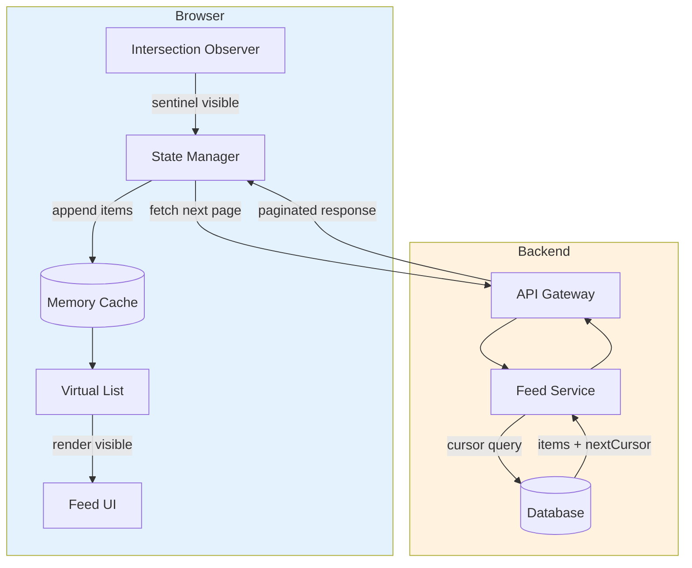

# Design an Infinite Feed

Building infinite scrolling feed interfaces that scale from hundreds to millions of items while maintaining 60fps scroll performance. This article covers pagination strategies, scroll detection, virtualization, state management, and accessibility patterns that power feeds at Twitter, Instagram, and LinkedIn.

<figure>



<figcaption>Infinite feed architecture: Intersection Observer triggers pagination when sentinel enters viewport; cursor-based queries return stable pages; virtualization renders only visible items from memory cache.</figcaption>
</figure>

## Abstract

Infinite feeds combine three distinct challenges: stable pagination over dynamic data, efficient scroll detection, and rendering performance at scale.

**The core mental model:**

1. **Pagination layer**: Cursor-based pagination provides stable traversal. Each page returns a next cursor encoding the position in the dataset—immune to insertions/deletions unlike offset pagination.

2. **Detection layer**: Intersection Observer watches sentinel elements near viewport edges. When a sentinel becomes visible, trigger the next fetch. No scroll event handlers, no forced reflows.

3. **Rendering layer**: Virtualization limits DOM nodes to visible items plus overscan buffer. A 10,000-item feed renders ~30 DOM nodes regardless of total size.

**Key design decisions:**

- **Cursor encoding**: Opaque vs transparent affects debugging and security. Compound cursors (timestamp + ID) handle ties.
- **Loading threshold**: Fixed distance (200px) vs adaptive (2x fetch time × scroll velocity) affects perceived performance.
- **Virtualization strategy**: Fixed-height (simple, predictable) vs variable-height (measures on render, potential scroll jumps).
- **New item handling**: Prepend and scroll (disorienting) vs "X new items" banner (user-controlled).

At scale (millions of items), memory management becomes critical. Limit cached pages, tombstone off-screen content, or offload to IndexedDB.

## The Challenge

### Why Offset Pagination Fails

The naive approach—`OFFSET` and `LIMIT`—breaks for dynamic feeds:

```sql
SELECT * FROM posts ORDER BY created_at DESC LIMIT 20 OFFSET 40;
```

**Race condition**: User fetches page 3 at offset 40. A new post is inserted. User fetches page 4 at offset 60. The item that was at position 60 is now at 61—user sees duplicate or misses content entirely.

**Performance degradation**: The database scans and discards `OFFSET` rows before returning results. At offset 1,000,000, the query reads 1M+ rows.

| Dataset Size | Offset Query | Cursor Query |
| ------------ | ------------ | ------------ |
| 1M items     | ~500ms       | <10ms        |
| 10M items    | ~10 seconds  | <10ms        |
| 50M items    | ~35 seconds  | <10ms        |

Offset pagination works for admin interfaces with stable data and direct page access. It fails for real-time feeds where content changes between requests.

### Browser Constraints

**Main thread budget**: 60fps requires completing all work in 16.67ms per frame. Scroll handlers that force layout recalculation steal from this budget.

**DOM node limits**: Browsers struggle above 10,000 nodes. Each node consumes ~1KB memory. A naive 50,000-item feed uses 50MB+ just for DOM overhead, causing garbage collection pauses and scroll jank.

**Memory pressure**: Mobile Safari caps tabs at ~1GB. Chrome on Android varies by device. Large feeds must actively manage memory or face tab crashes.

### User Experience Requirements

| Requirement        | Constraint                              |
| ------------------ | --------------------------------------- |
| Scroll smoothness  | 60fps, no jank during fetch             |
| Load latency       | <200ms perceived wait                   |
| Position stability | No jumps when new content loads         |
| Back navigation    | Return to previous scroll position      |
| New content        | Discoverable without disrupting reading |

## Design Paths

### Path 1: Intersection Observer + Cursor Pagination

**Architecture:**

```
┌─────────────────────────────────────┐
│         Scrollable Container         │
├─────────────────────────────────────┤
│  [Top Sentinel - for bidirectional] │
│  ┌─────────────────────────────────┐│
│  │         Item 1                  ││
│  ├─────────────────────────────────┤│
│  │         Item 2                  ││
│  ├─────────────────────────────────┤│
│  │         ...                     ││
│  ├─────────────────────────────────┤│
│  │         Item N                  ││
│  └─────────────────────────────────┘│
│  [Bottom Sentinel - triggers load]  │
└─────────────────────────────────────┘
```

**How it works:**

Intersection Observer monitors a sentinel element positioned below visible content. When the sentinel enters the viewport (or approaches via `rootMargin`), callback fires to fetch the next page using the stored cursor.

```typescript collapse={1-2}
type FeedItem = { id: string; content: string; createdAt: string }
type PageResponse = { items: FeedItem[]; nextCursor: string | null }

function createFeedObserver(onLoadMore: () => void, options: { rootMargin?: string; threshold?: number } = {}) {
  const { rootMargin = "0px 0px 200px 0px", threshold = 0 } = options

  return new IntersectionObserver(
    (entries) => {
      const [entry] = entries
      if (entry.isIntersecting) {
        onLoadMore()
      }
    },
    { rootMargin, threshold },
  )
}

// Usage
const sentinel = document.getElementById("load-more-sentinel")
const observer = createFeedObserver(() => fetchNextPage(currentCursor))
observer.observe(sentinel)
```

**Best for:**

- Social media feeds (Twitter, Instagram, LinkedIn)
- Comment threads with unknown depth
- Search results with many pages
- Any feed where content changes frequently

**Device/network profile:**

| Condition      | Behavior                                  |
| -------------- | ----------------------------------------- |
| Fast network   | Seamless loading, buffer always full      |
| Slow 3G        | Visible loading states, may show spinners |
| Offline        | Shows cached content, queues refetch      |
| Low-end mobile | Works well (no scroll handlers)           |

**Implementation complexity:**

| Aspect                | Effort |
| --------------------- | ------ |
| Initial setup         | Low    |
| Bidirectional loading | Medium |
| Error recovery        | Medium |
| Scroll restoration    | High   |

**Trade-offs:**

- ✅ No main thread blocking
- ✅ Battery efficient
- ✅ Works with virtualization
- ❌ No direct page jumping
- ❌ Total count often unknown

### Path 2: Virtualized Infinite List

**Architecture:**

```
┌──────────────────────────────────────┐
│    Scroll Container (fixed height)    │
│  ┌────────────────────────────────┐  │
│  │   Spacer: items 0-14           │  │  ← height = 14 × itemHeight
│  ├────────────────────────────────┤  │
│  │   Rendered: items 15-25        │  │  ← actual DOM nodes
│  ├────────────────────────────────┤  │
│  │   Spacer: items 26-999         │  │  ← height = remaining × itemHeight
│  └────────────────────────────────┘  │
│  [Sentinel: triggers load at item 990]│
└──────────────────────────────────────┘
```

**How it works:**

Virtualization renders only visible items plus an overscan buffer. As user scrolls, items are added/removed from DOM while spacer elements maintain correct scroll height. Combined with cursor pagination, this handles infinite datasets with bounded memory.

```typescript collapse={1-8, 28-45}
import { useVirtualizer } from '@tanstack/react-virtual';
import { useInfiniteQuery } from '@tanstack/react-query';
import { useRef, useEffect } from 'react';

type FeedItem = { id: string; content: string };
type PageResponse = { items: FeedItem[]; nextCursor: string | null };

const ITEMS_PER_PAGE = 20;

function VirtualizedFeed() {
  const parentRef = useRef<HTMLDivElement>(null);

  const { data, fetchNextPage, hasNextPage, isFetchingNextPage } =
    useInfiniteQuery({
      queryKey: ['feed'],
      queryFn: ({ pageParam }) => fetchFeedPage(pageParam),
      getNextPageParam: (lastPage) => lastPage.nextCursor,
      initialPageParam: null as string | null,
    });

  const allItems = data?.pages.flatMap((page) => page.items) ?? [];

  const virtualizer = useVirtualizer({
    count: hasNextPage ? allItems.length + 1 : allItems.length,
    getScrollElement: () => parentRef.current,
    estimateSize: () => 100, // Estimated item height
    overscan: 5,
  });

  // Trigger load when approaching end
  useEffect(() => {
    const lastItem = virtualizer.getVirtualItems().at(-1);
    if (!lastItem) return;

    if (
      lastItem.index >= allItems.length - 1 &&
      hasNextPage &&
      !isFetchingNextPage
    ) {
      fetchNextPage();
    }
  }, [virtualizer.getVirtualItems(), hasNextPage, isFetchingNextPage]);

  return (
    <div ref={parentRef} style={{ height: '100vh', overflow: 'auto' }}>
      <div style={{ height: virtualizer.getTotalSize(), position: 'relative' }}>
        {virtualizer.getVirtualItems().map((virtualItem) => (
          <div
            key={virtualItem.key}
            style={{
              position: 'absolute',
              top: 0,
              left: 0,
              width: '100%',
              transform: `translateY(${virtualItem.start}px)`,
            }}
          >
            {virtualItem.index < allItems.length ? (
              <FeedItemComponent item={allItems[virtualItem.index]} />
            ) : (
              <LoadingPlaceholder />
            )}
          </div>
        ))}
      </div>
    </div>
  );
}
```

**Best for:**

- Feeds with 1,000+ items
- Long-lived sessions (email clients, social apps)
- Memory-constrained mobile devices
- Consistent scroll performance requirements

**Performance characteristics:**

| Metric         | Value              |
| -------------- | ------------------ |
| DOM nodes      | O(viewport) ~20-50 |
| Memory         | O(pages in cache)  |
| Scroll FPS     | 60fps              |
| Initial render | <50ms              |

**Trade-offs:**

- ✅ Handles 100K+ items
- ✅ Bounded memory growth
- ✅ Consistent scroll performance
- ❌ Complex scroll restoration
- ❌ Variable heights add complexity
- ❌ Find-in-page browser feature breaks

### Path 3: Hybrid with Load More Button

**Architecture:**

Infinite scroll for the common case with an explicit "Load more" button as fallback. Useful for accessibility compliance and user preference.

```typescript collapse={1-5}
import { useState } from 'react';

type LoadMode = 'auto' | 'manual';
type FeedItem = { id: string; content: string };

function HybridFeed({ userPreference }: { userPreference: LoadMode }) {
  const [mode, setMode] = useState(userPreference);
  const { data, fetchNextPage, hasNextPage, isFetching } = useInfiniteQuery({
    /* ... */
  });

  return (
    <div>
      <ModeToggle mode={mode} onChange={setMode} />

      <FeedList items={data?.pages.flatMap((p) => p.items) ?? []} />

      {hasNextPage && mode === 'manual' && (
        <button onClick={() => fetchNextPage()} disabled={isFetching}>
          Load more
        </button>
      )}

      {hasNextPage && mode === 'auto' && (
        <IntersectionSentinel onVisible={() => fetchNextPage()} />
      )}
    </div>
  );
}
```

**Best for:**

- Accessibility-focused applications
- Users with motor disabilities
- Sites requiring footer access
- When user preference varies

**Trade-offs:**

- ✅ User control over loading
- ✅ Footer always accessible
- ✅ Reduces cognitive load
- ❌ Extra click per page
- ❌ More UI complexity

### Decision Matrix

| Factor             | IO + Cursor  | Virtualized | Hybrid |
| ------------------ | ------------ | ----------- | ------ |
| Items < 100        | ✓ (overkill) | ✗           | ✓      |
| Items 100-1K       | ✓            | Optional    | ✓      |
| Items > 1K         | ✓            | Required    | ✓      |
| Variable heights   | Easy         | Complex     | Easy   |
| Scroll restoration | Medium       | Hard        | Medium |
| Accessibility      | Good         | Harder      | Best   |
| Implementation     | Low          | High        | Medium |

## Cursor-Based Pagination

### Cursor Encoding Strategies

**Opaque Base64 (recommended):**

```typescript
function encodeCursor(createdAt: Date, id: string): string {
  return Buffer.from(JSON.stringify({ createdAt: createdAt.toISOString(), id })).toString("base64")
}

function decodeCursor(cursor: string): { createdAt: Date; id: string } {
  const { createdAt, id } = JSON.parse(Buffer.from(cursor, "base64").toString())
  return { createdAt: new Date(createdAt), id }
}
```

**Why compound cursors:**

Single-field cursors (timestamp only) break when multiple items share the same timestamp. Compound cursors include a unique tiebreaker (usually ID):

```sql
-- Keyset pagination with compound cursor
SELECT id, created_at, content FROM posts
WHERE (created_at, id) < ('2024-01-15T12:00:00Z', 'abc123')
ORDER BY created_at DESC, id DESC
LIMIT 20;
```

The tuple comparison `(created_at, id) < (cursor_timestamp, cursor_id)` provides deterministic ordering even with identical timestamps.

**Signed cursors** prevent tampering:

```typescript collapse={1-3}
import crypto from "crypto"

const SECRET = process.env.CURSOR_SECRET!

function signCursor(payload: object): string {
  const data = JSON.stringify(payload)
  const signature = crypto.createHmac("sha256", SECRET).update(data).digest("hex")
  return Buffer.from(`${data}|${signature}`).toString("base64")
}

function verifyCursor(cursor: string): object | null {
  const decoded = Buffer.from(cursor, "base64").toString()
  const [data, signature] = decoded.split("|")
  const expected = crypto.createHmac("sha256", SECRET).update(data).digest("hex")

  if (!crypto.timingSafeEqual(Buffer.from(signature), Buffer.from(expected))) {
    return null // Tampered
  }
  return JSON.parse(data)
}
```

### API Response Shape

```typescript
interface PaginatedResponse<T> {
  items: T[]
  nextCursor: string | null // null indicates end
  prevCursor?: string | null // For bidirectional
  hasMore: boolean // Explicit flag
  totalCount?: number // Optional, expensive to compute
}
```

**Design decision**: `nextCursor: null` vs `hasMore: false`

Both work. `hasMore` is more explicit but redundant. `nextCursor === null` is sufficient and reduces payload size.

### Bidirectional Pagination

Required for:

- Chat apps (scroll up for history)
- Feeds with "new items above"
- Deep-linked content in middle of feed

```typescript
const { data, fetchNextPage, fetchPreviousPage, hasNextPage, hasPreviousPage } = useInfiniteQuery({
  queryKey: ["feed"],
  queryFn: ({ pageParam }) => fetchPage(pageParam),
  getNextPageParam: (lastPage) => lastPage.nextCursor,
  getPreviousPageParam: (firstPage) => firstPage.prevCursor,
  initialPageParam: { cursor: startCursor, direction: "forward" },
})
```

## Scroll Detection

### Intersection Observer Configuration

```typescript
const observer = new IntersectionObserver(callback, {
  root: null, // null = viewport
  rootMargin: "0px 0px 200px 0px", // Trigger 200px before visible
  threshold: 0, // Fire as soon as any part intersects
})
```

**rootMargin** creates an invisible boundary. `'0px 0px 200px 0px'` extends the bottom edge 200px, triggering the callback before the sentinel is actually visible.

**threshold** values:

- `0`: Any intersection (pixel enters)
- `1.0`: Fully visible
- `[0, 0.5, 1.0]`: Fire at 0%, 50%, 100%

**Multiple sentinels** for bidirectional loading:

```typescript collapse={1-2}
type Direction = "forward" | "backward"
type LoadHandler = (direction: Direction) => void

function createBidirectionalObserver(onLoad: LoadHandler) {
  return new IntersectionObserver(
    (entries) => {
      entries.forEach((entry) => {
        if (!entry.isIntersecting) return

        const direction = entry.target.id === "top-sentinel" ? "backward" : "forward"
        onLoad(direction)
      })
    },
    { rootMargin: "200px" },
  )
}
```

### Adaptive Loading Threshold

Fixed 200px threshold works for average conditions. Adaptive threshold adjusts based on:

1. **Scroll velocity**: Fast scrollers need more prefetch buffer
2. **Network latency**: Slow connections need earlier trigger
3. **Device performance**: Low-end devices need more breathing room

```typescript collapse={1-4}
type AdaptiveConfig = {
  avgFetchTime: number
  scrollVelocity: number
}

function calculateRootMargin({ avgFetchTime, scrollVelocity }: AdaptiveConfig): string {
  // Load when user will reach end in ~2x fetch time
  const pixelsNeeded = scrollVelocity * (avgFetchTime / 1000) * 2
  const minMargin = 200
  const maxMargin = 800

  const margin = Math.max(minMargin, Math.min(maxMargin, pixelsNeeded))
  return `0px 0px ${margin}px 0px`
}
```

### Preventing Duplicate Requests

Rapid scrolling can trigger multiple Intersection Observer callbacks before the first request completes.

**Request deduplication:**

```typescript collapse={1-3}
let currentController: AbortController | null = null
let isLoading = false

async function fetchNextPageSafe(cursor: string) {
  if (isLoading) return // Already fetching

  // Cancel any stale request
  currentController?.abort()
  currentController = new AbortController()
  isLoading = true

  try {
    const response = await fetch(`/api/feed?cursor=${cursor}`, {
      signal: currentController.signal,
    })
    return await response.json()
  } catch (error) {
    if (error instanceof Error && error.name === "AbortError") {
      return null // Cancelled, ignore
    }
    throw error
  } finally {
    isLoading = false
  }
}
```

Libraries like TanStack Query handle this automatically via query keys and automatic request deduplication.

## Virtualization Strategies

### Fixed-Height Virtualization

When all items have identical height, position calculation is O(1):

```typescript
const startIndex = Math.floor(scrollTop / itemHeight)
const endIndex = Math.min(startIndex + Math.ceil(viewportHeight / itemHeight) + overscan, totalItems)
const offsetY = startIndex * itemHeight
```

**react-window FixedSizeList:**

```typescript collapse={1-4}
import { FixedSizeList } from 'react-window';

type ItemData = { items: Array<{ id: string; content: string }> };

function FeedList({ items }: { items: ItemData['items'] }) {
  return (
    <FixedSizeList
      height={600}
      itemCount={items.length}
      itemSize={80}
      width="100%"
      itemData={{ items }}
    >
      {({ index, style, data }) => (
        <div style={style}>
          <FeedItem item={data.items[index]} />
        </div>
      )}
    </FixedSizeList>
  );
}
```

**Best for**: Log viewers, simple message lists, any uniform content.

### Variable-Height Virtualization

Real-world feeds have variable content: images, different text lengths, embeds. This requires measurement.

**Challenges:**

1. Heights unknown until render
2. Scroll position jumps when estimates are corrected
3. Bidirectional scrolling destabilizes layout

**react-virtuoso** handles this automatically:

```typescript collapse={1-3}
import { Virtuoso } from 'react-virtuoso';

type FeedItem = { id: string; content: string; hasImage: boolean };

function VariableFeed({ items }: { items: FeedItem[] }) {
  return (
    <Virtuoso
      data={items}
      itemContent={(index, item) => <FeedItem item={item} />}
      endReached={() => fetchNextPage()}
      overscan={200} // Pixels, not items
      increaseViewportBy={{ top: 200, bottom: 200 }}
    />
  );
}
```

**Mitigating scroll jumps:**

1. Increase overscan buffer above viewport
2. Use `defaultItemHeight` based on most common content type
3. Maintain anchor item during layout shifts

### Library Comparison

| Library              | Bundle | Variable Heights | Infinite Scroll | Framework |
| -------------------- | ------ | ---------------- | --------------- | --------- |
| react-window         | 6KB    | Manual           | Addon needed    | React     |
| react-virtuoso       | 15KB   | Automatic        | Built-in        | React     |
| @tanstack/virtual    | 5KB    | Manual           | Examples        | Any       |
| vue-virtual-scroller | 12KB   | Automatic        | Built-in        | Vue       |

**react-window**: Smallest bundle, best for fixed heights. Requires `react-window-infinite-loader` for pagination.

**react-virtuoso**: Handles variable heights automatically, built-in infinite scroll, better scroll-to accuracy. Worth the 15KB for complex feeds.

**@tanstack/virtual**: Headless, framework-agnostic. Most flexible but requires more setup code.

## State Management

### Normalized vs Denormalized Storage

**Denormalized** (simple, nested):

```typescript
{
  pages: [
    { items: [{ id: "1", author: { id: "a", name: "Alice" } }] },
    { items: [{ id: "2", author: { id: "a", name: "Alice" } }] },
  ]
}
```

**Normalized** (database-style):

```typescript
{
  items: {
    byId: { '1': { id: '1', authorId: 'a' }, '2': { id: '2', authorId: 'a' } },
    allIds: ['1', '2']
  },
  authors: {
    byId: { 'a': { id: 'a', name: 'Alice' } }
  },
  feed: { itemIds: ['1', '2'], nextCursor: 'xyz' }
}
```

**Why normalize:**

1. No duplicate data (author stored once)
2. O(1) lookup by ID
3. Single update point (change author name in one place)
4. Shallow equality checks work for memoization

**When to normalize**: Always consider it when entities have relationships or appear multiple times (authors, tags, referenced posts).

### Memory Management

Large feeds accumulate memory. Strategies:

**Page limiting** (TanStack Query):

```typescript
useInfiniteQuery({
  queryKey: ["feed"],
  queryFn: fetchPage,
  maxPages: 5, // Keep only 5 pages
  getNextPageParam: (last) => last.nextCursor,
  getPreviousPageParam: (first) => first.prevCursor,
})
```

When user scrolls beyond 5 pages, oldest page is evicted. Scrolling back triggers refetch.

**Tombstoning**: Replace off-screen item data with placeholders:

```typescript
function maybeEvictItem(item: FeedItem, isVisible: boolean): FeedItem | Tombstone {
  if (!isVisible && item.mediaUrls?.length) {
    return { id: item.id, tombstoned: true }
  }
  return item
}
```

**IndexedDB offloading**: For extremely long sessions, persist old pages to browser storage and reload on demand.

## Feed Refresh Patterns

### New Item Indicators

Never auto-scroll users. Show a banner and let them choose:

```typescript collapse={1-5}
import { useState, useCallback } from 'react';

type FeedItem = { id: string };
type NewItemsBannerProps = { count: number; onShow: () => void };

function Feed() {
  const [newItemIds, setNewItemIds] = useState<string[]>([]);

  // Poll or WebSocket for new items
  useEffect(() => {
    const interval = setInterval(async () => {
      const latestId = items[0]?.id;
      const newItems = await checkForNewItems(latestId);
      if (newItems.length) {
        setNewItemIds((prev) => [...newItems.map((i) => i.id), ...prev]);
      }
    }, 30000);
    return () => clearInterval(interval);
  }, [items]);

  const showNewItems = useCallback(() => {
    prependItems(newItemIds);
    scrollToTop();
    setNewItemIds([]);
  }, [newItemIds]);

  return (
    <>
      {newItemIds.length > 0 && (
        <button className="new-items-banner" onClick={showNewItems}>
          {newItemIds.length} new posts
        </button>
      )}
      <FeedList items={items} />
    </>
  );
}
```

### Pull-to-Refresh

Web has no native pull-to-refresh. Implementation requires:

1. Detecting touch start at scroll position 0
2. Tracking pull distance
3. Preventing browser's native overscroll

```typescript collapse={1-4}
import { useRef, useState, TouchEvent } from "react"

type PullState = "idle" | "pulling" | "refreshing"

function usePullToRefresh(onRefresh: () => Promise<void>) {
  const [state, setState] = useState<PullState>("idle")
  const [pullDistance, setPullDistance] = useState(0)
  const startY = useRef(0)

  const handleTouchStart = (e: TouchEvent) => {
    if (window.scrollY === 0) {
      startY.current = e.touches[0].pageY
      setState("pulling")
    }
  }

  const handleTouchMove = (e: TouchEvent) => {
    if (state !== "pulling") return
    const distance = e.touches[0].pageY - startY.current
    setPullDistance(Math.max(0, Math.min(distance, 150)))
  }

  const handleTouchEnd = async () => {
    if (pullDistance > 100) {
      setState("refreshing")
      await onRefresh()
    }
    setState("idle")
    setPullDistance(0)
  }

  return { state, pullDistance, handleTouchStart, handleTouchMove, handleTouchEnd }
}
```

**CSS to prevent browser refresh:**

```css
body {
  overscroll-behavior-y: contain;
}
```

### Gap Detection

Scenario: User paused at page 5. New items arrived at page 1. Pages 2-4 now have "gaps" in the timeline.

**Detection:**

```typescript
function detectGap(pages: Page[]): { gapAfterPage: number; cursor: string } | null {
  for (let i = 1; i < pages.length; i++) {
    const prevEnd = pages[i - 1].endCursor
    const currStart = pages[i].startCursor
    if (prevEnd !== currStart) {
      return { gapAfterPage: i - 1, cursor: prevEnd }
    }
  }
  return null
}
```

**Strategies:**

- **Lazy fill**: Fetch gap when user scrolls to it
- **Background fill**: Silently fetch during idle
- **Invalidate**: Reset to fresh state (simplest)

## Error Handling

### Retry with Exponential Backoff

```typescript
function calculateDelay(attempt: number): number {
  const baseDelay = 100
  const maxDelay = 30000
  const exponential = baseDelay * Math.pow(2, attempt)
  const jitter = Math.random() * 1000
  return Math.min(exponential + jitter, maxDelay)
}

// Delays: ~100ms, ~200ms, ~400ms, ~800ms... up to 30s
```

**Jitter** prevents thundering herd when many clients retry simultaneously.

**Which errors to retry:**

- ✅ 408 Request Timeout
- ✅ 429 Too Many Requests
- ✅ 500, 502, 503, 504 Server Errors
- ✅ Network failures
- ❌ 400 Bad Request
- ❌ 401, 403 Auth errors
- ❌ 404 Not Found

### Inline Error Recovery

```typescript collapse={1-5}
type FeedState =
  | { status: 'loading' }
  | { status: 'error'; error: Error; retryCount: number }
  | { status: 'success' };

function FeedWithErrorBoundary() {
  const { data, error, refetch, isError, failureCount } = useInfiniteQuery({
    queryKey: ['feed'],
    queryFn: fetchPage,
    retry: 3,
    retryDelay: (attempt) => calculateDelay(attempt),
  });

  if (isError) {
    return (
      <div role="alert">
        <p>Failed to load feed: {error.message}</p>
        <button onClick={() => refetch()}>
          Retry ({failureCount}/3 attempts)
        </button>
      </div>
    );
  }

  return <FeedList pages={data?.pages ?? []} />;
}
```

### Stale-While-Revalidate

Show cached content immediately, fetch fresh in background:

```typescript
const { data, isStale, isFetching } = useInfiniteQuery({
  queryKey: ['feed'],
  queryFn: fetchPage,
  staleTime: 60 * 1000,        // Fresh for 1 minute
  gcTime: 5 * 60 * 1000,       // Keep in cache for 5 minutes
  refetchOnWindowFocus: true,
  refetchOnReconnect: true,
});

return (
  <>
    {isStale && isFetching && <RefreshingIndicator />}
    <FeedList pages={data?.pages ?? []} />
  </>
);
```

## Scroll Position Restoration

### Browser History Challenges

Single Page Applications (SPAs) break browser's native scroll restoration:

```typescript
// Disable browser's automatic (often wrong) restoration
if ("scrollRestoration" in history) {
  history.scrollRestoration = "manual"
}
```

**Browser inconsistencies:**

- Chrome: `popstate` fires before scroll restoration
- Firefox: Scroll event fires before `popstate`

### Session Storage Strategy

For infinite scroll, store enough information to reconstruct view:

```typescript collapse={1-5}
type ScrollState = {
  pageCount: number
  scrollY: number
  anchorItemId: string
  timestamp: number
}

function saveScrollState(key: string, state: ScrollState) {
  sessionStorage.setItem(key, JSON.stringify(state))
}

function restoreScrollState(key: string): ScrollState | null {
  const saved = sessionStorage.getItem(key)
  if (!saved) return null

  const state: ScrollState = JSON.parse(saved)

  // Expire after 5 minutes
  if (Date.now() - state.timestamp > 300000) {
    sessionStorage.removeItem(key)
    return null
  }

  return state
}

function useScrollRestoration(feedKey: string, setSize: (size: number) => void) {
  useEffect(() => {
    const state = restoreScrollState(feedKey)
    if (!state) return

    // Restore page count first
    setSize(state.pageCount)

    // Then scroll after render
    requestAnimationFrame(() => {
      window.scrollTo(0, state.scrollY)
      sessionStorage.removeItem(feedKey)
    })
  }, [feedKey, setSize])
}
```

### Virtualization Complications

Virtualized lists don't maintain DOM elements, breaking pixel-based restoration. Solutions:

1. **Index-based**: Store visible item index, use `scrollToIndex`
2. **Anchor-based**: Store anchor item ID, calculate offset after render
3. **Time-limited**: Only restore for recent navigations (<30 seconds)

```typescript
// TanStack Virtual scroll restoration
const virtualizer = useVirtualizer({
  count: items.length,
  getScrollElement: () => parentRef.current,
  estimateSize: () => 100,
})

useEffect(() => {
  const savedIndex = sessionStorage.getItem("lastVisibleIndex")
  if (savedIndex) {
    virtualizer.scrollToIndex(parseInt(savedIndex, 10), {
      align: "start",
      behavior: "auto",
    })
  }
}, [])
```

## Accessibility

### ARIA Feed Role

```html
<div role="feed" aria-busy="false" aria-label="News feed">
  <article role="article" aria-labelledby="post-1-title" aria-posinset="1" aria-setsize="-1" tabindex="0">
    <h2 id="post-1-title">Post Title</h2>
    <p>Post content...</p>
  </article>
  <!-- More articles -->
</div>
```

**Required attributes:**

- `aria-busy="true"` during loading
- `aria-setsize="-1"` when total unknown
- `aria-posinset` for position (1-indexed)
- `tabindex="0"` on each article for keyboard navigation

### Keyboard Navigation

```typescript
function handleFeedKeyDown(event: KeyboardEvent) {
  const current = document.activeElement?.closest('[role="article"]')
  if (!current) return

  switch (event.key) {
    case "ArrowDown":
    case "j":
      focusNextArticle(current)
      event.preventDefault()
      break
    case "ArrowUp":
    case "k":
      focusPreviousArticle(current)
      event.preventDefault()
      break
    case "Home":
      focusFirstArticle()
      event.preventDefault()
      break
    case "End":
      focusLastArticle()
      event.preventDefault()
      break
  }
}
```

### Accessibility Limitations

Infinite scroll is problematic for:

- **Keyboard users**: Cannot reach footer without tabbing through all items
- **Screen reader users**: Dynamic content loading is disorienting
- **Motor disability users**: Endless scrolling causes fatigue

**Mitigations:**

- Skip link to footer: `<a href="#footer" class="skip-link">Skip to footer</a>`
- "Load more" button alternative
- User preference toggle for infinite vs paginated
- Clear loading announcements via live regions

```html
<div role="status" aria-live="polite" class="visually-hidden">Loading more posts...</div>
```

## Browser Constraints

### Main Thread Budget

Scroll handlers that force synchronous layout steal from the 16.67ms frame budget:

```typescript
// Bad: Forces layout recalculation
element.style.width = "100px"
const height = element.offsetHeight // Forced reflow

// Good: Batch reads, then writes
const height = element.offsetHeight
element.style.width = "100px"
```

**Passive event listeners** allow browser to scroll without waiting for JavaScript:

```typescript
element.addEventListener("scroll", handler, { passive: true })
```

### requestIdleCallback for Non-Critical Work

```typescript
function processInBackground(items: Item[]) {
  let index = 0

  function processChunk(deadline: IdleDeadline) {
    while (deadline.timeRemaining() > 0 && index < items.length) {
      processItem(items[index])
      index++
    }

    if (index < items.length) {
      requestIdleCallback(processChunk)
    }
  }

  requestIdleCallback(processChunk, { timeout: 2000 })
}
```

**Safari fallback** (no native support):

```typescript
const requestIdleCallback =
  window.requestIdleCallback ||
  ((cb: IdleRequestCallback) => setTimeout(() => cb({ timeRemaining: () => 0 } as IdleDeadline), 1))
```

### Memory Monitoring

```typescript
function checkMemoryPressure(): boolean {
  if (!performance.memory) return false

  const { usedJSHeapSize, jsHeapSizeLimit } = performance.memory
  const usage = usedJSHeapSize / jsHeapSizeLimit

  if (usage > 0.8) {
    console.warn("High memory usage:", (usage * 100).toFixed(1) + "%")
    return true
  }
  return false
}

// Trigger cleanup when memory is high
if (checkMemoryPressure()) {
  trimOldPages()
}
```

## Real-World Implementations

### Twitter/X

**Pagination**: Cursor-based with opaque tokens. Cursors encode timeline position.

**Virtualization**: Custom implementation. Pre-renders ~12 items, maintains ~140 DOM nodes regardless of scroll depth.

**New tweets**: "Show X new posts" banner. Never auto-prepends.

**Gap handling**: Detects gaps when returning from background. Shows "Show N posts" inline to fill.

### Instagram

**Multi-tier caching**:

- Memory: LRU cache for current item + 3 next + 2 previous
- SQLite/IndexedDB: Post metadata for offline scrolling
- Network: Fetch on cache miss

**Prefetching**: Loads 3 items ahead based on scroll velocity.

**DOM management**: Items outside viewport are unmounted (not just hidden), keeping DOM under 150 nodes.

### LinkedIn

**Architecture**: FollowFeed system with two-pass ranking (FPR generates candidates, SPR scores for final order).

**Storage**: Timeline database optimized for recent activity. Kafka for event streaming, RocksDB for local state.

**Performance**: Caffeine cache for hot data, Galene for personalization.

## Conclusion

Effective infinite feed design requires coordinating three layers:

1. **Backend**: Cursor-based pagination with compound cursors for stable traversal
2. **Detection**: Intersection Observer with adaptive rootMargin based on conditions
3. **Rendering**: Virtualization when items exceed 100, with careful memory management

The key decisions are:

- **Pagination**: Cursor-based with opaque, signed tokens
- **Detection**: Intersection Observer over scroll events
- **Virtualization**: Required beyond ~100 items; react-virtuoso for variable heights
- **New content**: Banner pattern, never auto-scroll
- **Accessibility**: Provide "Load more" alternative and keyboard navigation

For most feeds, TanStack Query's `useInfiniteQuery` with react-virtuoso handles the complexity. Start there before building custom solutions.

## Appendix

### Prerequisites

- Browser APIs: Intersection Observer, AbortController, requestIdleCallback
- React hooks or equivalent framework patterns
- HTTP caching concepts (stale-while-revalidate)
- Basic accessibility knowledge (ARIA roles)

### Terminology

- **Cursor**: Opaque token encoding position in a paginated dataset
- **Keyset pagination**: Cursor implementation using row value comparisons
- **Virtualization**: Rendering only visible items while maintaining scroll illusion
- **Overscan**: Extra items rendered above/below viewport for smooth scrolling
- **Tombstone**: Placeholder replacing evicted content to preserve layout
- **Sentinel**: Invisible element observed to trigger pagination
- **SWR**: Stale-While-Revalidate caching pattern

### Summary

- Cursor-based pagination provides stable traversal immune to insertions/deletions
- Intersection Observer detects scroll position without blocking main thread
- Virtualization bounds DOM nodes to O(viewport) regardless of total items
- Memory management (page limits, tombstoning) prevents crashes in long sessions
- New content via banner respects user attention; never auto-scroll
- Scroll restoration requires storing page count and anchor item, not just scroll position
- `role="feed"` with keyboard navigation and "Load more" fallback for accessibility

### References

- [MDN: Intersection Observer API](https://developer.mozilla.org/en-US/docs/Web/API/Intersection_Observer_API) - Browser API documentation
- [TanStack Query: Infinite Queries](https://tanstack.com/query/latest/docs/framework/react/guides/infinite-queries) - React implementation patterns
- [Cursor Pagination Deep Dive](https://www.milanjovanovic.tech/blog/understanding-cursor-pagination-and-why-its-so-fast-deep-dive) - Why cursor beats offset
- [W3C: ARIA Feed Pattern](https://www.w3.org/WAI/ARIA/apg/patterns/feed/) - Accessibility requirements
- [Deque: Infinite Scroll Accessibility Issues](https://www.deque.com/blog/infinite-scrolling-rolefeed-accessibility-issues/) - Screen reader challenges
- [web.dev: Stale-While-Revalidate](https://web.dev/articles/stale-while-revalidate) - Caching pattern explanation
- [Chrome: requestIdleCallback](https://developer.chrome.com/blog/using-requestidlecallback) - Background processing API
- [LinkedIn Engineering: Feed Infrastructure](https://engineering.linkedin.com/teams/data/data-infrastructure/feed-infrastructure) - Production architecture
- [Redux: Normalizing State Shape](https://redux.js.org/usage/structuring-reducers/normalizing-state-shape) - State management patterns
