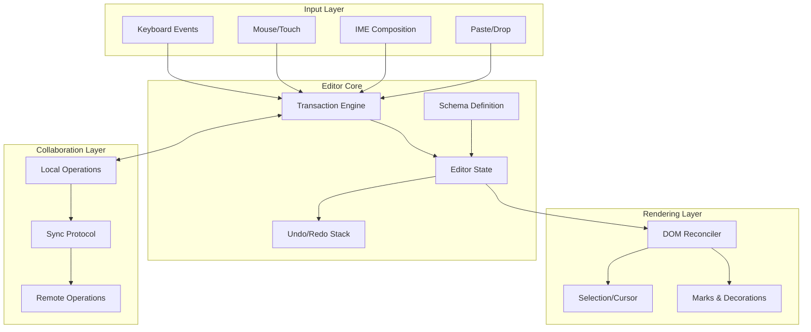

# Design a Rich Text Editor

Building a rich text editor for web applications requires choosing between fundamentally different document models, input handling strategies, and collaboration architectures. This article covers contentEditable vs custom rendering trade-offs, the document models behind ProseMirror, Slate, Lexical, and Quill, transaction-based state management, browser input handling (Input Events Level 2, IME), collaboration patterns (OT vs CRDT), virtualization for large documents, and accessibility requirements.

<figure>



<figcaption>Rich text editor architecture: input events flow through the transaction engine, updating immutable state that the DOM reconciler renders. Collaboration layers intercept transactions for sync.</figcaption>
</figure>

## Abstract

Rich text editors reduce to three core design decisions:

1. **Document model**: Linear operations (Quill Delta) vs hierarchical node trees (ProseMirror, Slate). Linear models are simpler but limit nesting; hierarchical models enable complex structures but require careful normalization.

2. **Rendering strategy**: `contentEditable` delegates to browser but inherits inconsistencies; custom rendering (Lexical, modern Slate) gives precise control at the cost of reimplementing selection, IME, and accessibility.

3. **Collaboration architecture**: Operational Transform (OT) requires a central server for ordering but is proven at Google Docs scale; CRDTs (Conflict-free Replicated Data Types) enable peer-to-peer sync and offline-first but carry metadata overhead.

The decision matrix:

| Factor                                 | Linear + contentEditable | Hierarchical + Custom                |
| -------------------------------------- | ------------------------ | ------------------------------------ |
| Implementation complexity              | Low                      | High                                 |
| Browser consistency                    | Poor                     | Excellent                            |
| Complex nesting (tables, nested lists) | Limited                  | Full support                         |
| Collaboration integration              | OT-friendly              | OT or CRDT                           |
| Bundle size                            | ~15KB (Quill)            | ~22KB (Lexical), ~40KB (ProseMirror) |

## The Challenge

### Why Rich Text Is Hard

Browser text editing was designed for simple forms, not document authoring. The challenges:

- **`contentEditable` inconsistency**: Different browsers handle identical operations differently. Pressing Backspace at a link boundary deletes the link in IE but only the character in Firefox.
- **IME complexity**: Input Method Editors for CJK (Chinese, Japanese, Korean) languages compose characters before committing—editors must handle composition events without corrupting state.
- **Selection edge cases**: Cursor positioning at block boundaries, triple-click behavior, and drag-selection across nested structures vary across browsers.
- **Undo/redo semantics**: What constitutes a single "action" for undo? A keystroke? A word? A formatting change?

### Browser Constraints

| Constraint                          | Impact                                              | Mitigation                                  |
| ----------------------------------- | --------------------------------------------------- | ------------------------------------------- |
| Main thread budget (16ms for 60fps) | Heavy DOM operations block typing                   | Transaction batching, incremental rendering |
| DOM mutation overhead               | Frequent updates cause layout thrashing             | Virtual DOM or custom reconciler            |
| Selection API limitations           | Can't programmatically set selection in some states | Shadow selection tracking                   |
| `execCommand` deprecation           | No standard API for formatting                      | Custom command implementations              |

### Scale Factors

| Factor             | Small Scale   | Large Scale                          |
| ------------------ | ------------- | ------------------------------------ |
| Document size      | < 1,000 words | > 100,000 words                      |
| Concurrent editors | 1-2           | 50+                                  |
| Nesting depth      | 2-3 levels    | Unlimited (outliners, nested tables) |
| Update frequency   | < 1/sec       | > 10/sec per user                    |

Large-scale documents require virtualization (rendering only visible blocks) and efficient position mapping. High concurrency demands robust conflict resolution.

## Design Paths

### Path 1: contentEditable with Thin Abstraction

**Architecture:**

```
[Browser contentEditable] → [Mutation Observer] → [Document Sync] → [State]
```

**How it works:**

Leverage browser's native editing. Observe mutations, extract operations, update internal state. Quill exemplifies this approach.

```typescript title="quill-delta-example.ts" collapse={1-2}
// Quill Delta: linear sequence of operations
import Quill from "quill"

const delta = {
  ops: [{ insert: "Hello " }, { insert: "World", attributes: { bold: true } }, { insert: "\n" }],
}

// Apply formatting: retain 6, apply bold to next 5 chars
const formatBold = {
  ops: [{ retain: 6 }, { retain: 5, attributes: { bold: true } }],
}
```

**Best for:**

- Blog post editors, comment systems
- Teams without deep frontend expertise
- Projects prioritizing time-to-market

**Device/network profile:**

- Works well on: All devices (native browser behavior)
- Struggles on: Complex documents with nested structures

**Implementation complexity:**

| Aspect           | Effort                          |
| ---------------- | ------------------------------- |
| Initial setup    | Low                             |
| Basic formatting | Low                             |
| Complex nesting  | High (fighting contentEditable) |
| Collaboration    | Medium (Delta is OT-friendly)   |

**Real-world example:**

Quill powers Slack's message composer. Linear Delta format suits chat where messages are primarily inline text with occasional formatting.

**Trade-offs:**

- ✅ Native typing feel, spell check, IME support
- ✅ Small bundle (~15KB)
- ✅ Fast initial render
- ❌ Browser inconsistencies leak through
- ❌ Complex structures (tables, nested lists) require workarounds
- ❌ Limited control over selection behavior

### Path 2: Hierarchical Model with Controlled contentEditable

**Architecture:**

```
[Schema] → [Immutable State] → [Transaction] → [New State] → [DOM Sync]
                                    ↑
                              [contentEditable events]
```

**How it works:**

Define a schema specifying valid document structures. All changes flow through transactions that produce new immutable state. A reconciler syncs state to DOM. ProseMirror and Tiptap use this approach.

```typescript title="prosemirror-schema.ts" collapse={1-4, 25-30}
import { Schema, NodeSpec, MarkSpec } from "prosemirror-model"

// Schema defines valid document structure
const nodes: Record<string, NodeSpec> = {
  doc: { content: "block+" },
  paragraph: {
    content: "inline*",
    group: "block",
    parseDOM: [{ tag: "p" }],
    toDOM: () => ["p", 0],
  },
  heading: {
    attrs: { level: { default: 1 } },
    content: "inline*",
    group: "block",
    parseDOM: [1, 2, 3, 4, 5, 6].map((level) => ({
      tag: `h${level}`,
      attrs: { level },
    })),
    toDOM: (node) => [`h${node.attrs.level}`, 0],
  },
  text: { group: "inline" },
}

const marks: Record<string, MarkSpec> = {
  bold: {
    parseDOM: [{ tag: "strong" }, { tag: "b" }],
    toDOM: () => ["strong", 0],
  },
  link: {
    attrs: { href: {} },
    parseDOM: [{ tag: "a[href]", getAttrs: (dom) => ({ href: (dom as HTMLElement).getAttribute("href") }) }],
    toDOM: (node) => ["a", { href: node.attrs.href }, 0],
  },
}

const schema = new Schema({ nodes, marks })
```

**Transaction-based state management:**

```typescript title="prosemirror-transaction.ts" collapse={1-3}
import { EditorState, Transaction } from "prosemirror-state"
import { toggleMark } from "prosemirror-commands"

// Every change creates a transaction
function applyBold(state: EditorState): Transaction {
  const { from, to } = state.selection
  const tr = state.tr.addMark(from, to, schema.marks.bold.create())
  return tr
}

// State is immutable—applying transaction creates new state
const newState = state.apply(transaction)
```

**Best for:**

- CMS content editors, documentation tools
- Applications requiring custom block types
- Collaborative editing with complex structures

**Device/network profile:**

- Works well on: Desktop, modern mobile browsers
- Struggles on: Low-memory devices with very large documents (>50K words)

**Implementation complexity:**

| Aspect                                 | Effort         |
| -------------------------------------- | -------------- |
| Initial setup                          | Medium         |
| Schema definition                      | Medium         |
| Custom node types                      | Medium         |
| Collaboration (via prosemirror-collab) | Medium         |
| Undo/redo                              | Low (built-in) |

**Real-world example:**

The New York Times uses ProseMirror (via Tiptap wrapper) for article authoring. The schema enforces editorial structure while allowing rich embedded content.

**Trade-offs:**

- ✅ Consistent behavior across browsers
- ✅ Schema enforces valid structures
- ✅ Transaction history enables time-travel debugging
- ✅ Mature collaboration support (prosemirror-collab)
- ❌ Larger bundle (~40KB core)
- ❌ Steeper learning curve
- ❌ Still relies on contentEditable for text input

### Path 3: Fully Custom Rendering

**Architecture:**

```
[Hidden Input] → [Editor State] → [Custom DOM Reconciler] → [Rendered View]
                      ↑
              [Virtual Selection]
```

**How it works:**

Abandon contentEditable entirely. Capture input via hidden textarea or synthetic event handling. Maintain virtual selection state. Render document with complete control. Lexical (Meta) and modern Slate versions use this approach.

```typescript title="lexical-state.ts" collapse={1-4}
import { $getRoot, $createParagraphNode, $createTextNode } from "lexical"
import { LexicalEditor } from "lexical"

// Lexical: All mutations happen in update callbacks
editor.update(() => {
  const root = $getRoot()
  const paragraph = $createParagraphNode()
  const text = $createTextNode("Hello World")

  paragraph.append(text)
  root.append(paragraph)
})

// Read state in read callbacks
editor.getEditorState().read(() => {
  const root = $getRoot()
  const textContent = root.getTextContent()
  console.log(textContent) // "Hello World"
})
```

**The `$` convention:**

Lexical uses `$`-prefixed functions (like `$getRoot()`, `$getSelection()`) that only work inside `editor.update()` or `editor.read()` callbacks. This is similar to React Hooks—calling them outside the proper context throws an error.

**Best for:**

- Applications requiring pixel-perfect rendering
- Complex interactive features (mentions, embeds)
- Performance-critical large documents

**Device/network profile:**

- Works well on: All devices with proper optimization
- Requires: Careful IME handling, custom accessibility implementation

**Implementation complexity:**

| Aspect                   | Effort                                    |
| ------------------------ | ----------------------------------------- |
| Initial setup            | High                                      |
| IME support              | High                                      |
| Accessibility            | High (must implement ARIA manually)       |
| Performance optimization | Medium (framework handles reconciliation) |
| Collaboration            | Medium (integrates with Yjs)              |

**Real-world example:**

Meta uses Lexical for Facebook and Instagram post composers. Custom rendering enables consistent behavior across their massive user base with varying browser versions.

**Trade-offs:**

- ✅ Complete control over rendering
- ✅ Consistent cross-browser behavior
- ✅ Smaller bundle than ProseMirror (~22KB)
- ✅ Excellent performance characteristics
- ❌ Must handle IME composition manually
- ❌ Accessibility requires explicit implementation
- ❌ Native spell check integration is complex

### Decision Matrix

| Factor              | Quill (contentEditable) | ProseMirror (Controlled) | Lexical (Custom) |
| ------------------- | ----------------------- | ------------------------ | ---------------- |
| Bundle size         | 15KB                    | 40KB                     | 22KB             |
| Browser consistency | Poor                    | Good                     | Excellent        |
| Complex structures  | Limited                 | Full                     | Full             |
| IME handling        | Native                  | Native                   | Manual           |
| Accessibility       | Native                  | Native + ARIA            | Manual           |
| Learning curve      | Low                     | Medium                   | Medium-High      |
| Collaboration       | OT (Delta)              | OT (prosemirror-collab)  | CRDT (Yjs)       |
| Extensibility       | Plugins                 | Schema + Plugins         | Nodes + Commands |

## Document Models Deep Dive

### ProseMirror: Schema-Driven Node Trees

ProseMirror's document model is a tree of nodes, where the schema strictly defines what structures are valid.

**Key concepts:**

1. **Nodes**: Block-level (paragraph, heading) or inline (text). Block nodes contain other nodes; inline nodes contain marks.
2. **Marks**: Annotations on inline content (bold, italic, link). Unlike nested DOM elements, marks are flat—text can have multiple marks without creating nested spans.
3. **Positions**: Dual indexing system. Tree navigation for structure, flat token sequences for efficient position mapping.

```typescript title="prosemirror-position-mapping.ts"
// Position mapping: critical for collaboration
// Document: <p>Hello</p><p>World</p>
// Positions: 0=before doc, 1=before "Hello", 6=after "Hello", 7=between paragraphs...

// When inserting at position 3, all positions ≥3 shift
import { Mapping, StepMap } from "prosemirror-transform"

const map = new StepMap([3, 0, 5]) // At pos 3, delete 0, insert 5
const newPos = map.map(10) // Position 10 becomes 15
```

**Why flat marks instead of nested elements?**

Consider bold and italic text: `**_text_**`. DOM would nest `<strong><em>text</em></strong>`. ProseMirror stores `text` with marks `[bold, italic]`. This simplifies:

- Toggling formats (no tree restructuring)
- Overlapping ranges (partial bold + partial italic)
- Serialization (marks are metadata, not structure)

### Slate.js: Schema-Less Flexibility

Slate takes the opposite approach—no schema by default. The document is a recursive tree, and you enforce structure through normalization.

**Core principles:**

```typescript title="slate-normalizer.ts" collapse={1-3}
import { Editor, Transforms, Element, Node } from "slate"

// Custom normalizer: ensure paragraphs contain only text/inline elements
const withParagraphsNormalized = (editor: Editor): Editor => {
  const { normalizeNode } = editor

  editor.normalizeNode = ([node, path]) => {
    if (Element.isElement(node) && node.type === "paragraph") {
      for (const [child, childPath] of Node.children(editor, path)) {
        // If paragraph contains a block element, unwrap it
        if (Element.isElement(child) && !editor.isInline(child)) {
          Transforms.unwrapNodes(editor, { at: childPath })
          return // Normalization is recursive—return after one fix
        }
      }
    }
    normalizeNode([node, path])
  }

  return editor
}
```

**Why return after one fix?**

Slate's normalization is iterative. After fixing one issue, the node is "dirty" again and will be re-normalized. This prevents infinite loops and ensures each fix is atomic.

### Quill Delta: Linear Simplicity

Delta represents documents as a sequence of operations applied to an empty document.

```typescript title="quill-delta-operations.ts"
// Document: "Hello World" with "World" bold
const doc = {
  ops: [{ insert: "Hello " }, { insert: "World", attributes: { bold: true } }, { insert: "\n" }],
}

// Edit: Insert "Beautiful " before "World"
const edit = {
  ops: [
    { retain: 6 }, // Keep "Hello "
    { insert: "Beautiful " }, // Insert new text
  ],
}

// Composed result: "Hello Beautiful World\n"
```

**Operational Transform compatibility:**

Delta's linear structure makes OT transformation straightforward. When two users edit concurrently:

```
User A: retain 6, insert "X"       → "Hello XWorld"
User B: retain 6, insert "Y"       → "Hello YWorld"

Transform A against B: retain 7, insert "X"  → "Hello YXWorld"
Transform B against A: retain 6, insert "Y"  → "Hello XYWorld" (wrong!)
```

Delta includes tie-breaking rules (typically: earlier operation wins position, later operation follows).

### Lexical: Commands and Nodes

Lexical separates concerns into:

1. **Nodes**: Define structure (ParagraphNode, TextNode, custom nodes)
2. **Commands**: Define operations (FORMAT_TEXT_COMMAND, INSERT_PARAGRAPH_COMMAND)
3. **Listeners**: React to state changes

```typescript title="lexical-custom-node.ts" collapse={1-5, 35-50}
import {
  DecoratorNode,
  LexicalNode,
  NodeKey,
  SerializedLexicalNode,
  Spread
} from 'lexical';

type SerializedMentionNode = Spread<
  { userId: string; displayName: string },
  SerializedLexicalNode
>;

export class MentionNode extends DecoratorNode<JSX.Element> {
  __userId: string;
  __displayName: string;

  static getType(): string {
    return 'mention';
  }

  static clone(node: MentionNode): MentionNode {
    return new MentionNode(node.__userId, node.__displayName, node.__key);
  }

  constructor(userId: string, displayName: string, key?: NodeKey) {
    super(key);
    this.__userId = userId;
    this.__displayName = displayName;
  }

  createDOM(): HTMLElement {
    const span = document.createElement('span');
    span.className = 'mention';
    return span;
  }

  decorate(): JSX.Element {
    return <MentionComponent userId={this.__userId} name={this.__displayName} />;
  }

  static importJSON(serialized: SerializedMentionNode): MentionNode {
    return new MentionNode(serialized.userId, serialized.displayName);
  }

  exportJSON(): SerializedMentionNode {
    return {
      type: 'mention',
      version: 1,
      userId: this.__userId,
      displayName: this.__displayName
    };
  }
}
```

## Input Handling

### Input Events Level 2

The `beforeinput` event (W3C Input Events Level 2) fires before the browser modifies the DOM. This is the interception point for custom editors.

```typescript title="beforeinput-handling.ts"
element.addEventListener("beforeinput", (e: InputEvent) => {
  // inputType describes the editing action
  switch (e.inputType) {
    case "insertText":
      e.preventDefault()
      insertText(e.data!) // e.data contains the text
      break

    case "insertParagraph":
      e.preventDefault()
      insertParagraph()
      break

    case "deleteContentBackward": // Backspace
      e.preventDefault()
      deleteBackward()
      break

    case "insertFromPaste":
      e.preventDefault()
      const html = e.dataTransfer?.getData("text/html")
      const text = e.dataTransfer?.getData("text/plain")
      handlePaste(html || text)
      break

    case "insertCompositionText":
      // IME composition—cannot preventDefault during composition
      // Handle in compositionend instead
      break
  }
})
```

**Key `inputType` values:**

| inputType               | Trigger     | Cancelable              |
| ----------------------- | ----------- | ----------------------- |
| `insertText`            | Typing      | Yes                     |
| `insertParagraph`       | Enter       | Yes                     |
| `insertLineBreak`       | Shift+Enter | Yes                     |
| `deleteContentBackward` | Backspace   | Yes                     |
| `deleteContentForward`  | Delete      | Yes                     |
| `insertFromPaste`       | Ctrl+V      | Yes                     |
| `insertCompositionText` | IME         | No (during composition) |
| `historyUndo`           | Ctrl+Z      | Yes                     |
| `historyRedo`           | Ctrl+Y      | Yes                     |

### IME Composition Handling

Input Method Editors (IME) for CJK languages compose characters before committing. During composition, the text is provisional.

```typescript title="ime-handling.ts"
let isComposing = false

element.addEventListener("compositionstart", () => {
  isComposing = true
  // Store current selection for restoration if composition is cancelled
})

element.addEventListener("compositionupdate", (e: CompositionEvent) => {
  // e.data contains the current composition string
  // Update preview but don't commit to document state
  showCompositionPreview(e.data)
})

element.addEventListener("compositionend", (e: CompositionEvent) => {
  isComposing = false
  // e.data contains the final committed text
  commitText(e.data)
  clearCompositionPreview()
})

// In beforeinput handler:
element.addEventListener("beforeinput", (e: InputEvent) => {
  if (e.inputType === "insertCompositionText") {
    // Cannot preventDefault during IME composition
    // Let the browser handle it, sync state in compositionend
    return
  }
  // Handle other input types...
})
```

**Why can't we preventDefault IME input?**

The IME is a system component outside browser control. Preventing default would break the composition UI. Instead, editors must:

1. Allow composition to proceed
2. Track composition state
3. Sync internal state only when composition ends

### Selection and Range APIs

```typescript title="selection-management.ts"
// Get current selection
const selection = window.getSelection()
if (!selection || selection.rangeCount === 0) return

const range = selection.getRangeAt(0)

// Range boundaries
const { startContainer, startOffset, endContainer, endOffset } = range

// Check if selection is collapsed (cursor, no selection)
const isCollapsed = range.collapsed

// Get bounding rect for positioning UI (e.g., formatting toolbar)
const rect = range.getBoundingClientRect()
positionToolbar(rect.left, rect.top - 40)

// Programmatically set selection
const newRange = document.createRange()
newRange.setStart(textNode, 5)
newRange.setEnd(textNode, 10)
selection.removeAllRanges()
selection.addRange(newRange)
```

**Edge case: Selection across block boundaries**

When selection spans multiple blocks (e.g., from paragraph 1 to paragraph 3), `range.commonAncestorContainer` is their common parent. Iterating selected content requires walking the tree.

## Collaboration Architectures

### Operational Transform (OT)

OT transforms concurrent operations to maintain consistency. A central server determines operation order.

```
Timeline:
  Server: [v0] -----> [v1] -----> [v2]
                ↑           ↑
  Client A: op_a ----→      transform(op_a, op_b)
  Client B:      op_b ----→ transform(op_b, op_a)
```

**Transform function example:**

```typescript title="ot-transform.ts"
type Op = { type: "insert"; pos: number; text: string } | { type: "delete"; pos: number; len: number }

function transform(op1: Op, op2: Op): Op {
  // Transform op1 assuming op2 has already been applied
  if (op1.type === "insert" && op2.type === "insert") {
    if (op1.pos <= op2.pos) {
      return op1 // op1 is before op2, no change
    }
    return { ...op1, pos: op1.pos + op2.text.length }
  }

  if (op1.type === "insert" && op2.type === "delete") {
    if (op1.pos <= op2.pos) {
      return op1
    }
    if (op1.pos >= op2.pos + op2.len) {
      return { ...op1, pos: op1.pos - op2.len }
    }
    // Insert is within deleted range—complex case
    return { ...op1, pos: op2.pos }
  }

  // ... handle all operation type combinations
  return op1
}
```

**ProseMirror's simplification:**

Instead of transforming operations against operations, ProseMirror transforms positions through position maps:

```typescript title="prosemirror-collab.ts" collapse={1-2}
import { collab, sendableSteps, receiveTransaction } from "prosemirror-collab"

// Server sends: { version: 5, steps: [...], clientIDs: [...] }

// Apply remote steps
const tr = receiveTransaction(state, steps, clientIDs)
const newState = state.apply(tr)

// Send local steps
const sendable = sendableSteps(state)
if (sendable) {
  socket.send({
    version: sendable.version,
    steps: sendable.steps.map((s) => s.toJSON()),
    clientID: sendable.clientID,
  })
}
```

**OT trade-offs:**

- ✅ Proven at massive scale (Google Docs: hundreds of millions of users)
- ✅ Predictable ordering (server is authority)
- ✅ Efficient for real-time collaboration
- ❌ Central server is required and is a bottleneck
- ❌ Transform functions are complex and error-prone
- ❌ Offline editing requires careful conflict resolution on reconnect

### CRDTs (Conflict-free Replicated Data Types)

CRDTs embed metadata in the data structure itself, enabling automatic conflict-free merging without coordination.

```typescript title="yjs-integration.ts" collapse={1-4}
import * as Y from "yjs"
import { yXmlFragment } from "y-prosemirror"
import { WebsocketProvider } from "y-websocket"

// Create shared document
const ydoc = new Y.Doc()

// Create WebSocket provider for sync
const provider = new WebsocketProvider("wss://your-server.com", "document-room", ydoc)

// Get shared XML fragment for ProseMirror
const yXmlFragment = ydoc.getXmlFragment("prosemirror")

// Use in ProseMirror
import { ySyncPlugin, yCursorPlugin, yUndoPlugin } from "y-prosemirror"

const plugins = [ySyncPlugin(yXmlFragment), yCursorPlugin(provider.awareness), yUndoPlugin()]
```

**How Yjs handles text:**

Yjs uses YATA (Yet Another Transformation Approach), which assigns unique IDs to each character:

```
"Hello" → [(id1, 'H'), (id2, 'e'), (id3, 'l'), (id4, 'l'), (id5, 'o')]

User A inserts 'X' after 'l' (id3):
  → New item: (id6, 'X', parent: id3)

User B deletes 'l' (id4):
  → Mark id4 as deleted (tombstone)

Merge: Both operations apply. 'X' appears after first 'l', second 'l' is deleted.
Result: "HelXo"
```

**CRDT trade-offs:**

- ✅ No central server required (peer-to-peer possible)
- ✅ Native offline support—operations merge automatically
- ✅ Simpler mental model (no transform functions)
- ✅ Scales theoretically unlimited (no coordination needed)
- ❌ Metadata overhead (unique IDs for every character)
- ❌ Tombstones accumulate (deleted items leave markers)
- ❌ Some conflict resolutions are arbitrary (concurrent inserts at same position)

### Real-World Collaboration Implementations

| Product     | Approach                | Reason                                          |
| ----------- | ----------------------- | ----------------------------------------------- |
| Google Docs | OT                      | Proven at scale, team expertise                 |
| Figma       | CRDT (migrated from OT) | OT was "overkill" for design objects            |
| Notion      | OT-like (proprietary)   | Block-based operations are simpler than text OT |
| Linear      | Yjs (CRDT)              | Offline-first architecture                      |

Figma's CTO wrote: "For text, we still use OT because character-by-character sync benefits from its precision. For design objects, CRDT's simpler model is sufficient."

## Performance Optimization

### Virtualization for Large Documents

Documents with 100K+ words need virtualization—render only visible blocks.

```typescript title="virtual-document.ts" collapse={1-5}
import { useEffect, useState, useRef } from "react"

interface Block {
  id: string
  type: string
  content: string
}

function useVirtualBlocks(blocks: Block[], containerRef: React.RefObject<HTMLElement>) {
  const [visibleRange, setVisibleRange] = useState({ start: 0, end: 20 })

  useEffect(() => {
    const container = containerRef.current
    if (!container) return

    const observer = new IntersectionObserver(
      (entries) => {
        // Update visible range based on intersecting blocks
        const visible = entries.filter((e) => e.isIntersecting).map((e) => parseInt(e.target.dataset.index!, 10))

        if (visible.length > 0) {
          setVisibleRange({
            start: Math.max(0, Math.min(...visible) - 5),
            end: Math.min(blocks.length, Math.max(...visible) + 5),
          })
        }
      },
      { root: container, threshold: 0 },
    )

    // Observe sentinel elements at block positions
    return () => observer.disconnect()
  }, [blocks.length])

  return blocks.slice(visibleRange.start, visibleRange.end)
}
```

**Notion's approach:**

Notion renders blocks in visible viewport plus buffer. Each block type has an estimated height. On render, actual height is measured and cached. Trade-off accepted: small scroll position jumps when estimates are wrong.

### Slate.js Chunking

Slate can split large node children into memoized "chunks" for 10x rendering speedup:

```typescript title="slate-chunking.ts" collapse={1-4}
import { Editor, Element, Node } from "slate"

// Enable chunking for large lists
const withChunking = (editor: Editor): Editor => {
  editor.getChunkSize = (node: Node) => {
    if (Element.isElement(node) && node.children.length > 100) {
      return 50 // Chunk into groups of 50
    }
    return 0 // No chunking for small nodes
  }
  return editor
}
```

Combine with CSS `content-visibility: auto` to skip painting off-screen chunks.

### Memory Management

For very large documents:

| Technique         | Use Case             | Trade-off              |
| ----------------- | -------------------- | ---------------------- |
| Piece tables      | Text-heavy documents | Complexity for queries |
| Lazy node loading | Outline views        | Latency on expand      |
| WeakMap caches    | Computed values      | GC unpredictability    |
| LRU eviction      | Undo history         | Lost undo steps        |

## Accessibility

### ARIA Requirements

Rich text editors must announce their role and state to assistive technologies:

```html title="aria-editor.html"
<div role="textbox" aria-multiline="true" aria-label="Document editor" contenteditable="true">
  <!-- Content -->
</div>
```

For custom rendering (non-contentEditable):

```html title="aria-custom-editor.html"
<!-- Hidden textarea for screen reader announcements -->
<textarea aria-label="Document editor" class="sr-only" readonly></textarea>

<!-- Visual rendering -->
<div role="application" aria-label="Rich text editor">
  <div role="document">
    <!-- Rendered blocks with aria-* attributes -->
  </div>
</div>
```

### Keyboard Navigation

Required keyboard support:

| Key              | Action                                  |
| ---------------- | --------------------------------------- |
| Arrow keys       | Move cursor                             |
| Shift + Arrow    | Extend selection                        |
| Ctrl/Cmd + A     | Select all                              |
| Ctrl/Cmd + Z/Y   | Undo/redo                               |
| Ctrl/Cmd + B/I/U | Bold/italic/underline                   |
| Tab              | Indent (in lists) or focus next element |
| Escape           | Exit formatting mode or nested block    |

### Screen Reader Testing

Test with actual screen readers:

| Screen Reader | Browser         | Platform   |
| ------------- | --------------- | ---------- |
| NVDA          | Firefox, Chrome | Windows    |
| JAWS          | Chrome, Edge    | Windows    |
| VoiceOver     | Safari          | macOS, iOS |
| TalkBack      | Chrome          | Android    |

Known issue: JAWS 17 with Firefox doesn't recognize some contentEditable structures as editable. Always test combinations.

## Common Pitfalls

### 1. Fighting contentEditable

**Problem**: Trying to enforce structure in contentEditable that browsers don't support.

**Symptom**: Pressing Enter in a heading creates `<div>` instead of `<p>`. Backspace at start of list item behaves inconsistently.

**Solution**: Use a framework that abstracts contentEditable (ProseMirror, Tiptap) or abandon it entirely (Lexical).

### 2. Ignoring IME

**Problem**: Editor works perfectly with English but corrupts Chinese/Japanese/Korean input.

**Symptom**: Characters appear doubled, composition UI flickers, or text disappears.

**Solution**: Handle `compositionstart`/`compositionend` events. Don't `preventDefault` on `insertCompositionText`.

### 3. Undo Granularity

**Problem**: Each character is a separate undo step, making undo tedious.

**Solution**: Debounce undo checkpoints. Group consecutive typing into single undo entries. Separate formatting changes from content changes.

```typescript title="undo-debounce.ts"
let undoTimeout: number | null = null

function onInput() {
  if (undoTimeout) clearTimeout(undoTimeout)

  // Don't create undo entry yet
  applyChangeWithoutUndoEntry()

  // Create undo entry after 500ms of no input
  undoTimeout = window.setTimeout(() => {
    createUndoEntry()
    undoTimeout = null
  }, 500)
}
```

### 4. Memory Leaks in Collaboration

**Problem**: Real-time sync accumulates state without cleanup.

**Symptom**: Memory usage grows over long editing sessions.

**Solution**:

- Garbage collect CRDT tombstones periodically
- Limit undo history depth
- Disconnect inactive presence cursors

### 5. Selection Restoration After Async Operations

**Problem**: Async operations (paste processing, mention lookup) lose cursor position.

**Solution**: Capture selection before async operation, restore after:

```typescript title="selection-restoration.ts"
async function handlePaste(html: string) {
  // Capture current selection
  const savedSelection = editor.selection

  // Async processing
  const processed = await processHtml(html)

  // Restore selection before applying
  editor.withoutNormalizing(() => {
    if (savedSelection) {
      Transforms.select(editor, savedSelection)
    }
    Transforms.insertFragment(editor, processed)
  })
}
```

## Real-World Examples

### Notion: Block-Based Editor

**Challenge**: Pages with 10K+ blocks, each potentially different height.

**Architecture**:

- Everything is a block (text, images, databases, embeds)
- UUID v4 for unique IDs
- Parent pointers enable permission inheritance
- Content arrays enable nesting

**Performance strategy**:

- Render visible viewport + buffer
- Estimate heights by block type
- Measure and cache on render

**Outcome**: < 100ms Time to Interactive (TTI) for most pages.

### Linear: Offline-First Issue Tracker

**Challenge**: Real-time sync with offline support.

**Architecture**:

- Yjs CRDT for all content
- Local-first: changes apply immediately to local state
- Sync happens opportunistically when online

**Stack**: Yjs + IndexedDB (local) + WebSocket (sync)

**Trade-off accepted**: Occasional merge conflicts in descriptions—acceptable for issue tracking where conflicts are rare.

### Google Docs: OT at Scale

**Challenge**: Hundreds of millions of concurrent users.

**Architecture**:

- Operational Transform with central server
- Optimistic local application (user sees changes instantly)
- Server transforms and broadcasts to other clients

**Why not CRDT?**: OT was mature when Docs was built. The team had deep OT expertise. At their scale, metadata overhead of CRDTs would be significant.

## Conclusion

Rich text editor design comes down to matching constraints to trade-offs:

1. **For simple content with fast time-to-market**: Use Quill. Accept browser inconsistencies.

2. **For complex structures with collaboration**: Use ProseMirror/Tiptap. The schema enforces validity; prosemirror-collab handles sync.

3. **For pixel-perfect control and performance**: Use Lexical. Accept the cost of implementing IME and accessibility manually.

4. **For offline-first applications**: Use Yjs with any editor. CRDT handles merge automatically.

No editor framework solves all problems. The best choice depends on your document complexity, collaboration requirements, and team expertise.

## Appendix

### Prerequisites

- DOM APIs (Selection, Range, MutationObserver)
- Event handling (beforeinput, composition events)
- React or framework fundamentals (for ProseMirror/Lexical/Slate)
- Basic understanding of distributed systems (for collaboration)

### Terminology

| Term                 | Definition                                                                                      |
| -------------------- | ----------------------------------------------------------------------------------------------- |
| **contentEditable**  | Browser attribute enabling native text editing in any element                                   |
| **IME**              | Input Method Editor—system component for composing characters in CJK and other languages        |
| **OT**               | Operational Transform—algorithm for transforming concurrent operations to maintain consistency  |
| **CRDT**             | Conflict-free Replicated Data Type—data structure enabling automatic merge without coordination |
| **Transaction**      | Atomic unit of change in ProseMirror/Lexical; contains operations and metadata                  |
| **Schema**           | Definition of valid document structure (nodes, marks, constraints)                              |
| **Mark**             | Inline annotation (bold, italic, link) applied to text without changing structure               |
| **Node**             | Structural element in document tree (paragraph, heading, list item)                             |
| **Position mapping** | Translating document positions across changes (critical for collaboration)                      |
| **Tombstone**        | Marker for deleted items in CRDTs (enables merge but accumulates memory)                        |

### Summary

- **Document models**: Linear (Quill Delta) is OT-friendly but limits nesting; hierarchical (ProseMirror, Slate, Lexical) enables complex structures.
- **Rendering**: contentEditable provides native behavior but inconsistently; custom rendering gives control but requires reimplementing selection and IME.
- **Collaboration**: OT is proven at scale with central server; CRDT enables peer-to-peer and offline-first but has metadata overhead.
- **Performance**: Virtualization is essential for large documents; chunking and memoization reduce React/DOM overhead.
- **Accessibility**: ARIA attributes are required; screen reader testing must cover NVDA, JAWS, and VoiceOver.

### References

- [W3C Input Events Level 2 Specification](https://w3c.github.io/input-events/) - Authoritative reference for beforeinput event
- [W3C contentEditable Specification](https://w3c.github.io/contentEditable/) - Current state and known issues
- [ProseMirror Guide](https://prosemirror.net/docs/guide/) - Marijn Haverbeke's comprehensive documentation
- [ProseMirror Collaborative Editing](https://prosemirror.net/docs/guide/#collab) - Position mapping approach to collaboration
- [Collaborative Editing in ProseMirror](https://marijnhaverbeke.nl/blog/collaborative-editing.html) - Marijn Haverbeke's design rationale
- [Lexical Documentation](https://lexical.dev/docs/intro) - Meta's editor framework
- [Slate.js Documentation](https://docs.slatejs.org/) - Plugin-first architecture
- [Quill Delta Format](https://quilljs.com/docs/delta/) - Linear operation format
- [Yjs Documentation](https://docs.yjs.dev/) - High-performance CRDT library
- [Notion's Data Model](https://www.notion.com/blog/data-model-behind-notion) - Block-based architecture
- [CKEditor: Lessons from Real-Time Collaboration](https://ckeditor.com/blog/lessons-learned-from-creating-a-rich-text-editor-with-real-time-collaboration/) - Production implementation insights
- [Why contentEditable Is Terrible](https://medium.engineering/why-contenteditable-is-terrible-122d8a40e480) - Medium engineering's experience
- [MDN: Selection API](https://developer.mozilla.org/en-US/docs/Web/API/Selection) - Browser selection handling
- [MDN: beforeinput Event](https://developer.mozilla.org/en-US/docs/Web/API/Element/beforeinput_event) - Input event reference
