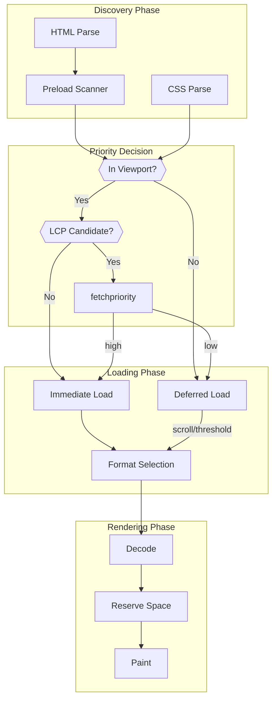

# Image Loading Optimization

Client-side strategies for optimizing image delivery: lazy loading, responsive images, modern formats, and Cumulative Layout Shift (CLS) prevention. Covers browser mechanics, priority hints, and real-world implementation patterns.

<figure>



<figcaption>Image loading pipeline: from discovery through rendering. Priority decisions determine load timing; format selection happens at request time; space reservation prevents layout shift.</figcaption>
</figure>

## Abstract

Image loading optimization balances three competing goals: **fast LCP** (load critical images early), **bandwidth efficiency** (defer non-critical images, serve optimal formats), and **layout stability** (prevent CLS by reserving space).

The browser's resource scheduler prioritizes images based on viewport position and explicit hints (`fetchpriority`, `loading`). Native lazy loading defers off-screen images using browser-determined thresholds that vary by vendor and connection type—Chrome uses 1250-2500px, Firefox 600-800px, Safari ~100px. You cannot customize these thresholds.

Modern format delivery (`<picture>` with AVIF/WebP sources, or Accept-header content negotiation) reduces payload by 30-60% over JPEG. CLS prevention requires either explicit `width`/`height` attributes (browser calculates aspect ratio) or CSS `aspect-ratio`—both reserve space before image data arrives.

The highest-impact optimization: preload LCP images with `fetchpriority="high"`, serve modern formats via CDN, and always specify dimensions.

## The Challenge

### Browser Constraints

Images compete for limited resources during page load:

| Resource            | Budget                   | Image Impact                                |
| ------------------- | ------------------------ | ------------------------------------------- |
| Network connections | 6 per origin (HTTP/1.1)  | Large images block other requests           |
| Main thread         | 16ms per frame           | Decode can block rendering                  |
| Memory              | 50-500MB practical limit | Uncompressed bitmaps consume ~4 bytes/pixel |
| Bandwidth           | Variable                 | Dominant payload on most pages              |

**Main thread blocking**: Image decoding historically ran on the main thread. A 4K image (3840×2160) requires ~33MB uncompressed, blocking the thread for 50-200ms during decode. Modern browsers decode asynchronously by default, but `decoding="sync"` forces blocking behavior.

### Competing Goals

| Goal              | Strategy                  | Trade-off                   |
| ----------------- | ------------------------- | --------------------------- |
| Fast LCP          | Preload, high priority    | Delays other resources      |
| Bandwidth savings | Lazy load, modern formats | Slower off-screen discovery |
| Layout stability  | Reserve space             | Requires known dimensions   |
| Device adaptation | Responsive images         | Increased markup complexity |

### Scale Factors

| Metric            | Small Scale | Large Scale     |
| ----------------- | ----------- | --------------- |
| Images per page   | < 10        | > 100           |
| Total payload     | < 500KB     | > 5MB           |
| Viewport coverage | Hero only   | Infinite scroll |
| Format variants   | 1           | 3-5 per image   |

## Design Paths

### Path 1: Native Lazy Loading

**How it works:**

The `loading="lazy"` attribute defers image loading until the element approaches the viewport. The browser tracks scroll position and begins fetching when the image crosses a distance threshold.

```html

```

**Browser thresholds (distance from viewport):**

| Browser     | Fast connection (4G+) | Slow connection (3G) |
| ----------- | --------------------- | -------------------- |
| Chrome/Edge | 1250px                | 2500px               |
| Firefox     | 600-800px             | 600-800px            |
| Safari      | ~100px                | ~100px               |

These thresholds are hardcoded—you cannot customize them via JavaScript or CSS. Chrome adjusts based on the reported connection type; Firefox and Safari use fixed values.

**Critical requirement**: Always include `width` and `height` attributes. Without dimensions:

1. Browser cannot reserve space → CLS occurs
2. Browser may assume image fits in viewport → loads immediately regardless of `loading="lazy"`

**Edge cases:**

- **Print stylesheets**: Lazy images may not load when printing; consider `@media print { img { loading: eager; } }` workaround (requires JavaScript to toggle)
- **Search engines**: Googlebot executes JavaScript and triggers lazy loading, but some crawlers don't wait—test with Google Search Console
- **`display: none` images**: Browsers may still load them; `loading="lazy"` behavior is inconsistent here
- **Dynamic insertion**: Images added via JavaScript after DOMContentLoaded are evaluated against current scroll position

**Browser support**: Chrome 77+ (2019), Firefox 75+ (2020), Safari 15.4+ (2022). ~95%+ global coverage. Unsupported browsers ignore the attribute and load immediately.

**Best for:**

- Below-the-fold images
- Long-form content with many images
- Infinite scroll implementations

**Not for:**

- LCP candidates (hero images, above-the-fold content)
- Images that must be visible immediately

### Path 2: Intersection Observer (Custom Lazy Loading)

**How it works:**

JavaScript-based lazy loading using Intersection Observer API for fine-grained control over loading thresholds and behavior.

```typescript collapse={1-3}
// Track which images have been loaded
const loadedImages = new WeakSet<HTMLImageElement>()

function lazyLoadImages(options: IntersectionObserverInit = {}) {
  const observer = new IntersectionObserver(
    (entries) => {
      entries.forEach((entry) => {
        if (entry.isIntersecting) {
          const img = entry.target as HTMLImageElement
          const src = img.dataset.src
          if (src && !loadedImages.has(img)) {
            img.src = src
            loadedImages.add(img)
            observer.unobserve(img)
          }
        }
      })
    },
    {
      rootMargin: "200px 0px", // Start loading 200px before viewport
      threshold: 0.01, // Trigger when 1% visible
      ...options,
    },
  )

  document.querySelectorAll("img[data-src]").forEach((img) => {
    observer.observe(img)
  })

  return observer
}
```

**Customizable parameters:**

| Parameter            | Native             | Intersection Observer    |
| -------------------- | ------------------ | ------------------------ |
| Distance threshold   | Fixed per browser  | `rootMargin` (any value) |
| Visibility trigger   | Browser-determined | `threshold` (0-1)        |
| Root element         | Viewport only      | Any scrollable container |
| Connection awareness | Chrome only        | Manual implementation    |

**When to use over native:**

- Need consistent cross-browser threshold
- Lazy loading within a scrollable container (not viewport)
- Complex loading sequences (e.g., prioritize images in current scroll direction)
- Fallback for browsers without native support (increasingly rare)

**Trade-offs:**

- ✅ Full control over loading behavior
- ✅ Consistent thresholds across browsers
- ✅ Works with any scrollable container
- ❌ Requires JavaScript
- ❌ More code to maintain
- ❌ Slightly higher initial payload

### Path 3: Responsive Images with srcset/sizes

**How it works:**

Browser selects optimal image variant based on viewport width and device pixel ratio. Two approaches: resolution switching and art direction.

**Resolution switching (same image, different sizes):**

```html

```

**How `sizes` works:**

The `sizes` attribute tells the browser the rendered width at each breakpoint:

1. Browser reads `sizes` before layout completes
2. Matches current viewport against media conditions
3. Calculates effective pixel width (e.g., `50vw` on 1200px viewport = 600px)
4. Multiplies by device pixel ratio (e.g., 600px × 2 = 1200px for 2x display)
5. Selects smallest `srcset` candidate ≥ calculated width

**Why `sizes` is required with width descriptors**: Without `sizes`, the browser doesn't know the rendered width and defaults to `100vw`, often selecting larger-than-necessary images.

**Art direction (different images for different contexts):**

```html
<picture>
  <source media="(min-width: 1200px)" srcset="hero-landscape.jpg" />
  <source media="(min-width: 600px)" srcset="hero-square.jpg" />
  
</picture>
```

Use `<picture>` with `media` queries when you need different compositions—cropped versions, different aspect ratios, or entirely different images for mobile vs desktop.

**Decision matrix:**

| Scenario                              | Use                                 |
| ------------------------------------- | ----------------------------------- |
| Same image, different resolutions     | `srcset` with width descriptors     |
| Same image, different pixel densities | `srcset` with `1x`/`2x` descriptors |
| Different compositions per breakpoint | `<picture>` with `media`            |
| Different formats (WebP, AVIF)        | `<picture>` with `type`             |

### Path 4: Modern Format Delivery

**Format characteristics:**

| Format  | Compression vs JPEG | Browser Support                       | Best For               |
| ------- | ------------------- | ------------------------------------- | ---------------------- |
| AVIF    | 50-60% smaller      | Chrome 85+, Firefox 93+, Safari 16.4+ | Photos, complex images |
| WebP    | 25-35% smaller      | Chrome 23+, Firefox 65+, Safari 14.1+ | Broad compatibility    |
| JPEG XL | 30-60% smaller      | Safari 17+, Chrome behind flag        | Future consideration   |
| JPEG    | Baseline            | Universal                             | Fallback               |

**Approach 1: `<picture>` with type attribute (recommended)**

```html
<picture>
  <source srcset="photo.avif" type="image/avif" />
  <source srcset="photo.webp" type="image/webp" />
  
</picture>
```

Browser evaluates sources top-to-bottom, selecting first supported type. Order matters—put smallest format first.

**Approach 2: Content negotiation via Accept header**

Server inspects `Accept` header and serves appropriate format:

```
# Chrome sends:
Accept: image/avif,image/webp,image/apng,image/*,*/*;q=0.8

# Server responds with Content-Type based on Accept
```

**Critical**: Set `Vary: Accept` header so CDNs cache format-specific responses correctly.

| Approach           | Control     | Complexity        | CDN Compatibility    |
| ------------------ | ----------- | ----------------- | -------------------- |
| `<picture>`        | Client-side | Markup per image  | Universal            |
| Accept negotiation | Server-side | Server/CDN config | Requires Vary header |

**Why `<picture>` is preferred:**

1. No server configuration required
2. Works with static hosting
3. Explicit control over format priority
4. CDN caches each URL separately (no Vary complexity)

### Path 5: Priority Hints

**How it works:**

The `fetchpriority` attribute influences the browser's resource scheduler. Combined with `loading`, it controls both timing and priority.

```html
<!-- LCP image: load immediately with high priority -->


<!-- Decorative: defer and deprioritize -->

```

**Priority matrix:**

| `loading`       | `fetchpriority` | Behavior                                         |
| --------------- | --------------- | ------------------------------------------------ |
| eager (default) | high            | Immediate, high priority                         |
| eager           | low             | Immediate, low priority                          |
| lazy            | high            | Deferred until near viewport, then high priority |
| lazy            | low             | Deferred, low priority                           |

**Preload for LCP images:**

```html
<head>
  <link rel="preload" as="image" href="hero.jpg" fetchpriority="high" />
</head>
```

Preload hints start the request before the browser discovers the `` element. Critical for images referenced in CSS or discovered late in HTML parsing.

**Preload with responsive images:**

```html
<link
  rel="preload"
  as="image"
  href="hero.jpg"
  imagesrcset="hero-400.jpg 400w, hero-800.jpg 800w, hero-1200.jpg 1200w"
  imagesizes="(max-width: 600px) 100vw, 50vw"
/>
```

**When to use `fetchpriority="high"`:**

- LCP candidate images
- Above-the-fold hero images
- Critical product images

**When to use `fetchpriority="low"`:**

- Footer images
- Decorative backgrounds
- Below-the-fold thumbnails

## CLS Prevention

Layout shift occurs when content moves after initial paint. Images without dimensions are the primary cause of image-related CLS.

### Mechanism

When the browser encounters an image:

1. **Without dimensions**: Renders placeholder (0×0 or replaced element default), then reflows when image loads
2. **With dimensions**: Calculates aspect ratio from `width`/`height`, reserves space immediately

### Solution 1: width and height Attributes

```html

```

Browser calculates intrinsic aspect ratio: 800÷600 = 1.33. With CSS `width: 100%`, the height scales proportionally.

**How modern browsers handle this:**

Since 2019, browsers use `width` and `height` to compute a default aspect ratio in the UA stylesheet:

```css
/* Browser's internal stylesheet */
img {
  aspect-ratio: attr(width) / attr(height);
}
```

This means `width="800" height="600"` automatically reserves space even with responsive CSS.

### Solution 2: CSS aspect-ratio

```css
.responsive-image {
  width: 100%;
  height: auto;
  aspect-ratio: 16 / 9;
}
```

Use when:

- Image dimensions aren't known at markup time
- Dynamic images from APIs without dimension metadata
- Consistent aspect ratio across a gallery

**Browser support**: Chrome 88+, Firefox 89+, Safari 15+.

### Solution 3: Padding-bottom Hack (Legacy)

```html
<div style="position: relative; padding-bottom: 56.25%; height: 0;">
  
</div>
```

The padding percentage is relative to container width, creating a fixed aspect ratio (56.25% = 9÷16 = 16:9).

**Avoid this approach** unless supporting browsers without `aspect-ratio` support.

### CLS Measurement

```javascript
new PerformanceObserver((list) => {
  for (const entry of list.getEntries()) {
    if (!entry.hadRecentInput) {
      console.log("CLS contribution:", entry.value, entry.sources)
    }
  }
}).observe({ type: "layout-shift", buffered: true })
```

Target: CLS < 0.1 for "good" Core Web Vitals score.

## Placeholder Strategies

Placeholders improve perceived performance by providing visual feedback while images load.

### Dominant Color

Extract the dominant color and display as background:

```html

```

**Implementation:**

- Server-side: Extract during upload with ImageMagick, Sharp, or similar
- Build-time: Generate with image processing plugins
- Runtime: Embed in API response

**Trade-offs:**

- ✅ Minimal overhead (6-7 bytes for hex color)
- ✅ No JavaScript required
- ❌ No visual detail

### LQIP (Low Quality Image Placeholder)

Inline a tiny blurred version:

```html

```

**Sizing guidelines:**

- 20-40 pixels wide, heavily compressed
- ~200-500 bytes base64 encoded
- Apply CSS blur to smooth pixelation

### BlurHash

Compact representation (~20-30 bytes) that decodes to a gradient:

```typescript collapse={1-5, 15-20}
import { decode } from "blurhash"

// Server provides hash during SSR or in API response
const hash = "LEHV6nWB2yk8pyo0adR*.7kCMdnj"

// Decode to pixels
const pixels = decode(hash, 32, 32)

// Render to canvas or use as CSS background
const canvas = document.createElement("canvas")
canvas.width = 32
canvas.height = 32
const ctx = canvas.getContext("2d")
const imageData = ctx.createImageData(32, 32)
imageData.data.set(pixels)
ctx.putImageData(imageData, 0, 0)

// Apply as background
img.style.backgroundImage = `url(${canvas.toDataURL()})`
img.style.backgroundSize = "cover"
```

**Trade-offs:**

- ✅ Excellent compression (~20-30 bytes)
- ✅ Pleasing gradient approximation
- ❌ Requires JavaScript to decode
- ❌ Computation cost (~1-2ms per decode)

### Skeleton Placeholder

CSS-only placeholder matching expected dimensions:

```css
.image-skeleton {
  background: linear-gradient(90deg, var(--skeleton-base) 25%, var(--skeleton-highlight) 50%, var(--skeleton-base) 75%);
  background-size: 200% 100%;
  animation: shimmer 1.5s infinite;
}

@keyframes shimmer {
  0% {
    background-position: 200% 0;
  }
  100% {
    background-position: -200% 0;
  }
}
```

**Best for:**

- Consistent layouts (cards, grids)
- When dominant color/LQIP unavailable
- Framework integration (many UI libraries provide skeleton components)

### Comparison

| Strategy       | Payload       | JavaScript Required | Visual Fidelity   |
| -------------- | ------------- | ------------------- | ----------------- |
| Dominant color | 6-7 bytes     | No                  | Low               |
| LQIP           | 200-500 bytes | No                  | Medium            |
| BlurHash       | 20-30 bytes   | Yes                 | Medium            |
| Skeleton       | 0 (CSS)       | No                  | None (structural) |

## Image CDN Integration

Image CDNs optimize and deliver images on-the-fly, eliminating the need to pre-generate variants.

### Core Capabilities

| Feature              | Benefit                            |
| -------------------- | ---------------------------------- |
| On-demand resizing   | Generate any dimension from source |
| Format conversion    | Serve WebP/AVIF automatically      |
| Quality optimization | Compress based on content type     |
| Global caching       | Low latency delivery               |
| URL-based transforms | No build step required             |

### URL Pattern Example

```
https://cdn.example.com/images/photo.jpg?w=800&h=600&f=webp&q=75
```

| Parameter | Purpose                   |
| --------- | ------------------------- |
| `w`       | Width                     |
| `h`       | Height                    |
| `f`       | Format (webp, avif, auto) |
| `q`       | Quality (1-100)           |

### Integration with Responsive Images

```html

```

**Auto-format negotiation**: Many CDNs support `f=auto`, inspecting the `Accept` header to serve optimal format:

```html
<!-- CDN serves AVIF, WebP, or JPEG based on Accept header -->

```

### Cache Strategy

| Header          | Recommended Value                | Purpose                           |
| --------------- | -------------------------------- | --------------------------------- |
| `Cache-Control` | `public, max-age=31536000`       | Long cache (images rarely change) |
| `Vary`          | `Accept` (if format negotiation) | Cache per format                  |
| `ETag`          | Hash of source + transforms      | Cache invalidation                |

**Cache invalidation approaches:**

- Content hash in filename: `photo-a1b2c3.jpg`
- Version query param: `photo.jpg?v=2`
- Purge API (CDN-specific)

### Major CDN Providers

| Provider               | Strengths                                      |
| ---------------------- | ---------------------------------------------- |
| Cloudinary             | Rich transformation API, ML-based optimization |
| Imgix                  | Performance focus, responsive images           |
| Cloudflare Images      | Integrated with Cloudflare CDN                 |
| Fastly Image Optimizer | Edge compute, custom logic                     |
| Vercel/Next.js Image   | Framework integration                          |

## Real-World Implementations

### Instagram: Aggressive Compression

**Challenge**: Billions of images, mobile-first users on varying connections.

**Approach:**

- Compress all uploads regardless of source quality
- Multiple size variants: 150×150 (thumbnail), 320×320, 480×480, 640×640, 1080×1080
- Progressive JPEG for gradual loading
- Dominant color placeholders

**Key insight**: Instagram accepts quality loss for smaller payloads. Users tolerate compression artifacts on mobile; the speed gain outweighs visual fidelity.

**Result**: Sub-second image loads on 3G connections.

### Pinterest: Vertical Scroll Optimization

**Challenge**: Infinite scroll masonry grid with variable-height images.

**Approach:**

- Preferred 2:3 aspect ratio (vertical orientation suits scroll direction)
- Height estimation for unseen images (prevents scroll position jumps)
- Aggressive lazy loading with large threshold
- BlurHash placeholders for visual continuity

**Key insight**: Consistent aspect ratio simplifies layout calculations and reduces CLS in masonry grids.

### Unsplash: High-Resolution Source, Multiple Delivery Sizes

**Challenge**: Photographers upload 20-50MB originals; pages need optimized delivery.

**Approach:**

- Store original at full resolution
- On-demand CDN transformation for any requested size
- Prominent download options (small/medium/large/original)
- LQIP with blur for preview

**Integration pattern for third-party use:**

```html

```

### Figma: Canvas Rendering (Non-DOM)

**Challenge**: Design files with 100K+ objects, real-time collaboration.

**Approach:**

- WebGL rendering (bypasses DOM entirely)
- Spatial indexing (R-tree) for visible object query
- Level-of-detail: simplify distant objects
- Incremental rendering prioritizing viewport center

**Key insight**: At extreme scale, DOM-based image handling becomes the bottleneck. WebGL provides full control over what renders.

## Performance Optimization

### LCP Optimization Checklist

1. **Identify LCP element**: Use DevTools Performance panel or web-vitals library
2. **Preload if image**: `<link rel="preload" as="image" href="..." fetchpriority="high">`
3. **Remove lazy loading**: Never `loading="lazy"` on LCP candidates
4. **Optimize format/size**: Serve smallest sufficient variant
5. **Minimize request chain**: Avoid CSS background-image (discovered late)

### Monitoring

```typescript collapse={1-2, 12-15}
import { onLCP, onCLS, onINP } from "web-vitals"

onLCP((metric) => {
  const entry = metric.entries[metric.entries.length - 1]
  if (entry.element?.tagName === "IMG") {
    console.log("LCP image:", entry.element.src)
    console.log("LCP time:", metric.value)
    // Report to analytics
  }
})

onCLS((metric) => {
  console.log("CLS:", metric.value)
})
```

### Image Size Budget

| Viewport         | Target Total Images | Per-Image Target (LCP) |
| ---------------- | ------------------- | ---------------------- |
| Mobile (360px)   | < 500KB             | < 100KB                |
| Tablet (768px)   | < 1MB               | < 200KB                |
| Desktop (1920px) | < 2MB               | < 400KB                |

These are guidelines—actual budgets depend on page type and user expectations.

## Browser Constraints

### Decoding Attribute

Controls synchronous vs asynchronous image decoding:

```html

```

| Value   | Behavior            | Use Case                |
| ------- | ------------------- | ----------------------- |
| `async` | Non-blocking decode | Default for most images |
| `sync`  | Blocking decode     | Rarely needed           |
| `auto`  | Browser decides     | Default behavior        |

Modern browsers default to async decoding for off-main-thread performance. Explicit `decoding="async"` ensures this behavior.

### Memory Considerations

| Image Dimensions | Uncompressed Memory | Impact           |
| ---------------- | ------------------- | ---------------- |
| 640×480 (VGA)    | ~1.2MB              | Negligible       |
| 1920×1080 (FHD)  | ~8MB                | Moderate         |
| 3840×2160 (4K)   | ~33MB               | Significant      |
| 8192×8192        | ~268MB              | Can crash mobile |

**Mitigation:**

- Serve appropriately-sized images (never 4K to mobile)
- Lazy load to avoid simultaneous decode
- Release references to allow garbage collection

### Connection-Aware Loading

```typescript
const connection = navigator.connection

function getImageQuality(): "high" | "medium" | "low" {
  if (!connection) return "medium"

  if (connection.saveData) return "low"
  if (connection.effectiveType === "4g") return "high"
  if (connection.effectiveType === "3g") return "medium"
  return "low"
}
```

**Caveats:**

- `navigator.connection` is not available in Safari
- `effectiveType` can be inaccurate
- Consider this a hint, not a guarantee

## Accessibility

### Alt Text Requirements

```html
<!-- Informative image: describe content -->


<!-- Decorative image: empty alt -->


<!-- Complex image: detailed description -->

<p id="arch-details">The system consists of three layers...</p>
```

### Reduced Motion

```css
@media (prefers-reduced-motion: reduce) {
  .image-transition {
    transition: none;
  }

  .skeleton-loader {
    animation: none;
    background: var(--skeleton-base);
  }
}
```

### High Contrast Mode

Ensure placeholder backgrounds don't disappear:

```css
@media (forced-colors: active) {
  .image-placeholder {
    forced-color-adjust: none;
    background-color: Canvas;
    border: 1px solid CanvasText;
  }
}
```

## Conclusion

Image optimization is the highest-impact intervention for Core Web Vitals. The browser provides powerful primitives—native lazy loading, priority hints, responsive images, and format negotiation—but requires correct usage.

**Priorities by impact:**

1. **Always specify dimensions**: `width`/`height` or CSS `aspect-ratio` eliminate CLS
2. **Preload LCP images**: `<link rel="preload">` with `fetchpriority="high"`
3. **Serve modern formats**: AVIF/WebP via `<picture>` or CDN
4. **Lazy load below-fold**: Native `loading="lazy"` for simplicity
5. **Right-size images**: Responsive `srcset`/`sizes` for device-appropriate delivery

## Appendix

### Prerequisites

- HTML image element semantics
- CSS layout fundamentals
- HTTP caching basics
- Core Web Vitals metrics (LCP, CLS, INP)

### Summary

- Native lazy loading (`loading="lazy"`) defers off-screen images with browser-determined thresholds; always include `width`/`height`
- Responsive images (`srcset`/`sizes`) let browsers select optimal variants; use `<picture>` for art direction or format switching
- Modern formats (AVIF, WebP) reduce payload 30-60% over JPEG; serve via `<picture>` type attribute or CDN auto-negotiation
- CLS prevention requires explicit dimensions or CSS `aspect-ratio`—browsers calculate intrinsic ratio from `width`/`height` attributes
- Priority hints (`fetchpriority`, preload) control resource scheduling; use `high` for LCP images, `low` for decorative
- Image CDNs provide on-demand transformation, eliminating pre-generation of size/format variants

### References

- [WHATWG HTML Living Standard - Images](https://html.spec.whatwg.org/multipage/images.html) - Authoritative spec for `loading`, `decoding`, `srcset`, `sizes`
- [WHATWG HTML Living Standard - fetchpriority](https://html.spec.whatwg.org/multipage/urls-and-fetching.html#fetch-priority-attribute) - Priority hints specification
- [CSS Images Module Level 4](https://drafts.csswg.org/css-images-4/) - `aspect-ratio` and image-set specifications
- [MDN - Responsive Images](https://developer.mozilla.org/en-US/docs/Learn/HTML/Multimedia_and_embedding/Responsive_images) - Comprehensive guide
- [web.dev - Browser-Level Image Lazy Loading](https://web.dev/articles/browser-level-image-lazy-loading) - Chrome team implementation details
- [web.dev - Optimize LCP](https://web.dev/articles/optimize-lcp) - LCP optimization strategies
- [web.dev - Optimize CLS](https://web.dev/articles/optimize-cls) - CLS prevention techniques
- [Addy Osmani - Native Image Lazy Loading](https://addyosmani.com/blog/lazy-loading/) - In-depth analysis from Chrome team
- [BlurHash](https://blurha.sh/) - Placeholder algorithm specification
- [Cloudinary - LQIP Explained](https://cloudinary.com/blog/low_quality_image_placeholders_lqip_explained) - Placeholder implementation guide
