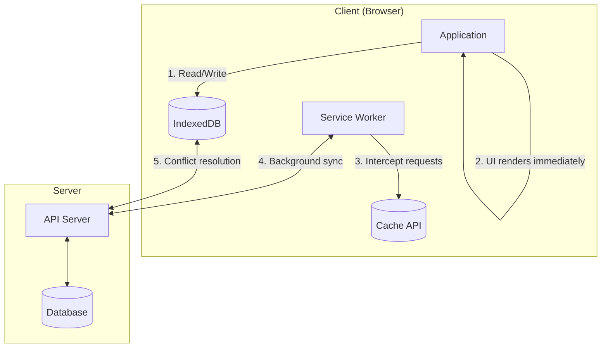
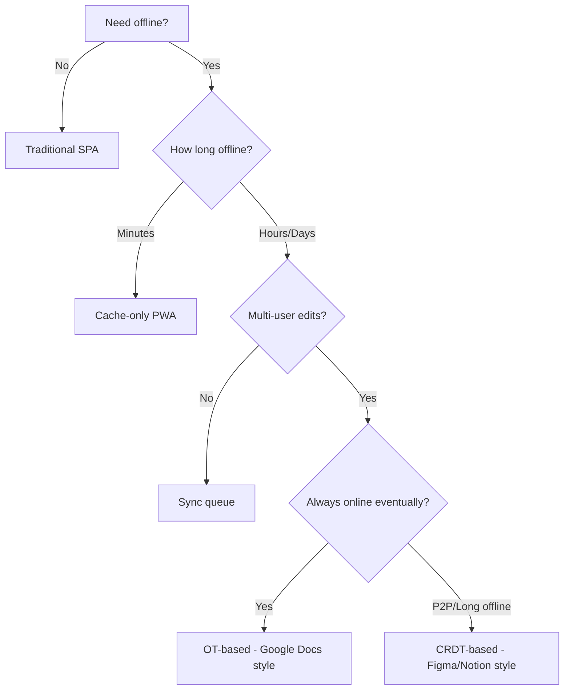

# Offline-First Architecture

Building applications that prioritize local data and functionality, treating network connectivity as an enhancement rather than a requirement—the storage APIs, sync strategies, and conflict resolution patterns that power modern collaborative and offline-capable applications.

Offline-first inverts the traditional web model: instead of fetching data from servers and caching it locally, data lives locally first and syncs to servers when possible. This article explores the browser APIs that enable this pattern, the sync strategies that keep data consistent, and how production applications like Figma, Notion, and Linear solve these problems at scale.

<figure>



<figcaption>Offline-first architecture: application reads/writes to local storage first, service worker manages caching, and sync happens in the background when connectivity allows.</figcaption>
</figure>

## Abstract

Offline-first architecture treats local storage as the primary data source and network as a sync mechanism. The core mental model:

- **Local-first data**: Application reads from and writes to local storage (IndexedDB, OPFS) immediately. Network operations are asynchronous background tasks, not blocking user interactions.

- **Service Workers as network proxy**: Service Workers intercept all network requests, enabling caching strategies (cache-first, network-first, stale-while-revalidate) and background sync when connectivity returns.

- **Conflict resolution is the hard problem**: When multiple clients modify the same data offline, syncing creates conflicts. Three approaches: Last-Write-Wins (simple but loses data), Operational Transform (requires central server), and CRDTs (mathematically guaranteed convergence but complex).

- **Storage is constrained and unreliable**: Browser storage quotas vary wildly (Safari: 1GB, Chrome: 60% of disk). Storage can be evicted without warning unless persistent storage is requested and granted.

| Pattern    | Complexity | Data Loss Risk     | Offline Duration | Best For          |
| ---------- | ---------- | ------------------ | ---------------- | ----------------- |
| Cache-only | Low        | High (stale data)  | Minutes          | Static assets     |
| Sync queue | Medium     | Medium (conflicts) | Hours            | Form submissions  |
| OT-based   | High       | Low                | Days             | Real-time collab  |
| CRDT-based | Very High  | None               | Indefinite       | P2P, long offline |

## The Challenge

### Browser Constraints

Building offline-first applications means working within browser limitations that don't exist in native apps.

**Main thread contention**: IndexedDB operations are asynchronous but still affect the main thread. Large reads/writes can cause jank. Service Workers run on a separate thread but share CPU with the page.

**Storage quotas**: Browsers limit how much data an origin can store, and quotas vary dramatically:

| Browser | Best-Effort Mode       | Persistent Mode       | Eviction Behavior               |
| ------- | ---------------------- | --------------------- | ------------------------------- |
| Chrome  | 60% of disk            | 60% of disk           | LRU when >80% full              |
| Firefox | 10% of disk (max 10GB) | 50% of disk (max 8TB) | LRU by origin                   |
| Safari  | ~1GB total             | Not supported         | 7 days without user interaction |

**Safari's aggressive eviction**: Safari deletes all website data (IndexedDB, Cache API, localStorage) after 7 days without user interaction when Intelligent Tracking Prevention (ITP) is enabled. This fundamentally breaks long-term offline storage for Safari users.

> "After 7 days of Safari use without user interaction on your site, all the website's script-writable storage forms are deleted." — WebKit Blog, 2020

**Storage API fragmentation**: Different storage mechanisms have different characteristics:

| Storage Type   | Max Size     | Persistence        | Indexed | Transaction Support |
| -------------- | ------------ | ------------------ | ------- | ------------------- |
| localStorage   | 5MB          | Session/persistent | No      | No                  |
| sessionStorage | 5MB          | Tab session        | No      | No                  |
| IndexedDB      | Origin quota | Persistent         | Yes     | Yes                 |
| Cache API      | Origin quota | Persistent         | No      | No                  |
| OPFS           | Origin quota | Persistent         | No      | No                  |

### Network Realities

**`navigator.onLine` is unreliable**: This API only indicates whether the browser has a network interface—not whether it can reach the internet. A LAN connection without internet access reports `online: true`.

```typescript
// Don't rely on this for actual connectivity
navigator.onLine // true even without internet access

// Instead, detect actual connectivity
async function checkConnectivity(): Promise<boolean> {
  try {
    const response = await fetch("/api/health", {
      method: "HEAD",
      cache: "no-store",
    })
    return response.ok
  } catch {
    return false
  }
}
```

**Network transitions are complex**: Users move between WiFi, cellular, and offline. Requests can fail mid-flight. Servers can be reachable but slow. Offline-first apps must handle all these states gracefully.

### Scale Factors

The right offline strategy depends on data characteristics:

| Factor              | Simple Offline        | Full Offline-First      |
| ------------------- | --------------------- | ----------------------- |
| Data size           | < 10MB                | 100MB+                  |
| Update frequency    | < 1/hour              | Real-time               |
| Concurrent editors  | Single user           | Multiple users          |
| Offline duration    | Minutes               | Days/weeks              |
| Conflict complexity | Overwrites acceptable | Must preserve all edits |

## Storage Layer

### IndexedDB: The Foundation

IndexedDB is the primary storage mechanism for offline-first apps. It's a transactional, indexed object store that can handle large amounts of structured data.

**Transaction model**: IndexedDB uses transactions with three modes:

- `readonly`: Multiple concurrent reads allowed
- `readwrite`: Serialized writes, blocks other readwrite transactions on same object stores
- `versionchange`: Schema changes, exclusive access to entire database

```typescript collapse={1-3, 22-30}
// Database initialization with versioning
const DB_NAME = "offline-app"
const DB_VERSION = 2

function openDatabase(): Promise<IDBDatabase> {
  return new Promise((resolve, reject) => {
    const request = indexedDB.open(DB_NAME, DB_VERSION)

    request.onupgradeneeded = (event) => {
      const db = request.result
      const oldVersion = event.oldVersion

      // Version 1: Initial schema
      if (oldVersion < 1) {
        const store = db.createObjectStore("documents", { keyPath: "id" })
        store.createIndex("by_updated", "updatedAt")
      }
      // Version 2: Add sync metadata
      if (oldVersion < 2) {
        const store = request.transaction!.objectStore("documents")
        store.createIndex("by_sync_status", "syncStatus")
      }
    }

    request.onsuccess = () => resolve(request.result)
    request.onerror = () => reject(request.error)
  })
}
```

**Versioning is critical**: IndexedDB schema changes require version increments. Opening a database with a lower version than exists fails. The `onupgradeneeded` handler must handle all version migrations sequentially.

**Cursor operations for large datasets**: For datasets too large to load entirely, use cursors:

```typescript collapse={1-2, 20-25}
async function* iterateDocuments(db: IDBDatabase): AsyncGenerator<Document> {
  const tx = db.transaction("documents", "readonly")
  const store = tx.objectStore("documents")
  const request = store.openCursor()

  while (true) {
    const cursor = await new Promise<IDBCursorWithValue | null>((resolve) => {
      request.onsuccess = () => resolve(request.result)
    })
    if (!cursor) break
    yield cursor.value
    cursor.continue()
  }
}
```

### Origin Private File System (OPFS)

OPFS provides file system access within the browser sandbox—faster than IndexedDB for binary data and large files.

**When to use OPFS over IndexedDB**:

- Binary files (images, videos, documents)
- Large blobs (>10MB)
- Sequential read/write patterns
- Web Workers with synchronous access needed

```typescript collapse={1-2, 18-22}
// OPFS access
async function saveFile(name: string, data: ArrayBuffer): Promise<void> {
  const root = await navigator.storage.getDirectory()
  const fileHandle = await root.getFileHandle(name, { create: true })

  // Async API (main thread or worker)
  const writable = await fileHandle.createWritable()
  await writable.write(data)
  await writable.close()
}

// Synchronous API (workers only) - much faster
function saveFileSync(name: string, data: ArrayBuffer): void {
  const root = navigator.storage.getDirectory()
  const fileHandle = root.getFileHandleSync(name, { create: true })
  const accessHandle = fileHandle.createSyncAccessHandle()
  accessHandle.write(data)
  accessHandle.close()
}
```

**OPFS limitations**:

- No indexing (unlike IndexedDB)—you manage your own file organization
- Synchronous API only in Web Workers
- No cross-origin access
- Same quota as IndexedDB (shared origin quota)

### Storage Manager API

The Storage Manager API provides quota information and persistence requests:

```typescript
async function checkStorageStatus(): Promise<{
  quota: number
  usage: number
  persistent: boolean
}> {
  const estimate = await navigator.storage.estimate()
  const persistent = await navigator.storage.persisted()

  return {
    quota: estimate.quota ?? 0,
    usage: estimate.usage ?? 0,
    persistent,
  }
}

async function requestPersistence(): Promise<boolean> {
  // Chrome auto-grants for "important" sites (bookmarked, installed PWA)
  // Firefox prompts the user
  // Safari doesn't support persistent storage
  if (navigator.storage.persist) {
    return await navigator.storage.persist()
  }
  return false
}
```

**Persistence reality**: Without persistent storage, browsers can evict your data at any time when storage pressure occurs. Chrome uses LRU eviction by origin. Safari's 7-day limit applies regardless of persistence requests.

**Design implication**: Never assume local data will survive. Always design for re-sync from server. Treat local storage as a cache that improves UX, not as the source of truth.

## Service Workers

Service Workers are JavaScript workers that intercept network requests, enabling offline functionality and background sync.

### Lifecycle

Service Workers have a distinct lifecycle that affects how updates propagate:

```
Install → Waiting → Activate → Running → Idle → Terminated
                ↑                              ↓
                └──────── Fetch event ─────────┘
```

**Installation**: Service Worker is downloaded and parsed. `install` event fires—use this to pre-cache critical assets.

**Waiting**: New Service Worker waits until all tabs using the old version close. This prevents breaking in-flight requests.

**Activation**: Old Service Worker is replaced. `activate` event fires—use this to clean up old caches.

```typescript collapse={1-5, 30-40}
// service-worker.ts
const CACHE_VERSION = "v2"
const STATIC_CACHE = `static-${CACHE_VERSION}`
const DYNAMIC_CACHE = `dynamic-${CACHE_VERSION}`

self.addEventListener("install", (event: ExtendableEvent) => {
  event.waitUntil(
    caches.open(STATIC_CACHE).then((cache) => {
      return cache.addAll(["/", "/app.js", "/styles.css", "/offline.html"])
    }),
  )
  // Skip waiting to activate immediately (use carefully)
  // self.skipWaiting();
})

self.addEventListener("activate", (event: ExtendableEvent) => {
  event.waitUntil(
    caches.keys().then((keys) => {
      return Promise.all(keys.filter((key) => !key.includes(CACHE_VERSION)).map((key) => caches.delete(key)))
    }),
  )
  // Take control of all pages immediately
  // self.clients.claim();
})
```

**skipWaiting pitfall**: Calling `skipWaiting()` activates the new Service Worker immediately, but existing pages still have old JavaScript. This can cause version mismatches between page code and Service Worker. Only use if your update is backward-compatible.

### Caching Strategies

Jake Archibald's "Offline Cookbook" defines canonical caching strategies. Each has distinct trade-offs:

**Cache-First**: Serve from cache, fall back to network. Best for static assets that rarely change.

```typescript
async function cacheFirst(request: Request): Promise<Response> {
  const cached = await caches.match(request)
  if (cached) return cached

  const response = await fetch(request)
  if (response.ok) {
    const cache = await caches.open(STATIC_CACHE)
    cache.put(request, response.clone())
  }
  return response
}
```

**Network-First**: Try network, fall back to cache. Best for frequently-updated content where freshness matters.

```typescript collapse={1-2, 18-22}
async function networkFirst(request: Request, timeout = 3000): Promise<Response> {
  try {
    const controller = new AbortController()
    const timeoutId = setTimeout(() => controller.abort(), timeout)

    const response = await fetch(request, { signal: controller.signal })
    clearTimeout(timeoutId)

    if (response.ok) {
      const cache = await caches.open(DYNAMIC_CACHE)
      cache.put(request, response.clone())
    }
    return response
  } catch {
    const cached = await caches.match(request)
    if (cached) return cached
    throw new Error("Network failed and no cache available")
  }
}
```

**Stale-While-Revalidate**: Serve from cache immediately, update cache in background. Best for content where slight staleness is acceptable.

```typescript
async function staleWhileRevalidate(request: Request): Promise<Response> {
  const cache = await caches.open(DYNAMIC_CACHE)
  const cached = await cache.match(request)

  const fetchPromise = fetch(request).then((response) => {
    if (response.ok) {
      cache.put(request, response.clone())
    }
    return response
  })

  return cached ?? fetchPromise
}
```

**Strategy selection by resource type**:

| Resource Type             | Strategy                 | Rationale               |
| ------------------------- | ------------------------ | ----------------------- |
| App shell (HTML, JS, CSS) | Cache-first with version | Immutable builds        |
| API responses             | Network-first            | Freshness critical      |
| User-generated content    | Stale-while-revalidate   | UX + eventual freshness |
| Images/media              | Cache-first              | Rarely change           |
| Authentication endpoints  | Network-only             | Must be fresh           |

### Background Sync

Background Sync API allows deferring actions until connectivity is available:

```typescript collapse={1-5, 25-35}
// In your application code
async function queueSync(data: SyncData): Promise<void> {
  // Store the data in IndexedDB
  await saveToSyncQueue(data)

  // Register for background sync
  const registration = await navigator.serviceWorker.ready
  await registration.sync.register("sync-pending-changes")
}

// In service worker
self.addEventListener("sync", (event: SyncEvent) => {
  if (event.tag === "sync-pending-changes") {
    event.waitUntil(processSyncQueue())
  }
})

async function processSyncQueue(): Promise<void> {
  const pending = await getPendingSyncItems()

  for (const item of pending) {
    try {
      await fetch("/api/sync", {
        method: "POST",
        body: JSON.stringify(item),
      })
      await markSynced(item.id)
    } catch {
      // Will retry on next sync event
      throw new Error("Sync failed")
    }
  }
}
```

**Background Sync limitations**:

- Chrome-only (as of 2024)
- No guarantee of timing—browser decides when to fire sync event
- Limited to ~3 minutes of execution time
- Requires Service Worker to be registered

**Periodic Background Sync**: Allows periodic sync even when app is closed. Requires explicit permission and Chrome only:

```typescript
// Check support and register
if ("periodicSync" in navigator.serviceWorker) {
  const registration = await navigator.serviceWorker.ready
  const status = await navigator.permissions.query({
    name: "periodic-background-sync" as PermissionName,
  })

  if (status.state === "granted") {
    await registration.periodicSync.register("sync-content", {
      minInterval: 24 * 60 * 60 * 1000, // 24 hours minimum
    })
  }
}
```

### Workbox

Workbox (Google) encapsulates Service Worker patterns in a production-ready library. It's used by ~54% of mobile sites with Service Workers.

```typescript collapse={1-8, 25-35}
import { precacheAndRoute } from "workbox-precaching"
import { registerRoute } from "workbox-routing"
import { CacheFirst, NetworkFirst, StaleWhileRevalidate } from "workbox-strategies"
import { BackgroundSyncPlugin } from "workbox-background-sync"

// Precache app shell (injected at build time)
precacheAndRoute(self.__WB_MANIFEST)

// API calls: network-first with background sync fallback
registerRoute(
  ({ url }) => url.pathname.startsWith("/api/"),
  new NetworkFirst({
    cacheName: "api-cache",
    plugins: [
      new BackgroundSyncPlugin("api-queue", {
        maxRetentionTime: 24 * 60, // 24 hours
      }),
    ],
  }),
)

// Images: cache-first
registerRoute(
  ({ request }) => request.destination === "image",
  new CacheFirst({
    cacheName: "images",
    plugins: [
      new ExpirationPlugin({
        maxEntries: 100,
        maxAgeSeconds: 30 * 24 * 60 * 60, // 30 days
      }),
    ],
  }),
)
```

**Why use Workbox**:

- Handles cache versioning and cleanup automatically
- Precaching with revision hashing
- Built-in plugins for expiration, broadcast updates, background sync
- Webpack/Vite integration for build-time manifest generation

## Sync Strategies

When clients make changes offline, syncing those changes creates the hardest problems in offline-first architecture.

### Last-Write-Wins (LWW)

The simplest conflict resolution: most recent timestamp wins.

```typescript
interface Document {
  id: string
  content: string
  updatedAt: number // Unix timestamp
}

function resolveConflict(local: Document, remote: Document): Document {
  return local.updatedAt > remote.updatedAt ? local : remote
}
```

**When LWW works**:

- Single-user applications
- Data where loss is acceptable (analytics, logs)
- Coarse-grained updates (entire document, not fields)

**When LWW fails**:

- Multi-user editing (Alice's changes overwrite Bob's)
- Fine-grained updates (field-level changes lost)
- Clock skew between clients causes wrong "winner"

**Clock skew problem**: Client clocks can drift. A device with clock set to the future always wins. Solutions:

- Use server timestamps (but requires connectivity)
- Hybrid logical clocks (Lamport timestamp + physical time)
- Vector clocks (discussed below)

### Vector Clocks

Vector clocks track causality—which events "happened before" others—without synchronized physical clocks.

```typescript
type VectorClock = Map<string, number>

function increment(clock: VectorClock, nodeId: string): VectorClock {
  const newClock = new Map(clock)
  newClock.set(nodeId, (newClock.get(nodeId) ?? 0) + 1)
  return newClock
}

function merge(a: VectorClock, b: VectorClock): VectorClock {
  const result = new Map(a)
  for (const [nodeId, count] of b) {
    result.set(nodeId, Math.max(result.get(nodeId) ?? 0, count))
  }
  return result
}

function compare(a: VectorClock, b: VectorClock): "before" | "after" | "concurrent" {
  let aBefore = false
  let bBefore = false

  const allNodes = new Set([...a.keys(), ...b.keys()])
  for (const nodeId of allNodes) {
    const aCount = a.get(nodeId) ?? 0
    const bCount = b.get(nodeId) ?? 0
    if (aCount < bCount) aBefore = true
    if (bCount < aCount) bBefore = true
  }

  if (aBefore && !bBefore) return "before"
  if (bBefore && !aBefore) return "after"
  return "concurrent" // True conflict
}
```

**Vector clocks detect conflicts but don't resolve them**: When `compare` returns `'concurrent'`, you have a true conflict that needs application-specific resolution.

**Space overhead**: Vector clocks grow with number of writers. For N clients, each entry is O(N). Dynamo-style systems use "version vectors" with pruning.

### Operational Transform (OT)

Operational Transform models changes as operations that can be transformed when concurrent.

**How OT works**:

1. Client captures operations: `insert('Hello', position: 0)`
2. Client applies operation locally (optimistic update)
3. Client sends operation to server
4. Server transforms operation against concurrent operations
5. Server broadcasts transformed operation to other clients

```typescript
interface TextOperation {
  type: "insert" | "delete"
  position: number
  text?: string // for insert
  length?: number // for delete
}

// Transform op1 given op2 was applied first
function transform(op1: TextOperation, op2: TextOperation): TextOperation {
  if (op2.type === "insert") {
    if (op1.position >= op2.position) {
      return { ...op1, position: op1.position + op2.text!.length }
    }
  } else if (op2.type === "delete") {
    if (op1.position >= op2.position + op2.length!) {
      return { ...op1, position: op1.position - op2.length! }
    }
    // More complex cases: overlapping deletes, etc.
  }
  return op1
}
```

**OT requires central coordination**: The server maintains operation history and performs transforms. This means OT doesn't work for true peer-to-peer or extended offline scenarios.

**OT complexity**: Transformation functions are notoriously difficult to get right. Google Docs has had OT-related bugs despite years of engineering. The transformation must satisfy mathematical properties (convergence, intention preservation) that are hard to verify.

**Where OT excels**: Real-time collaborative editing with always-on connectivity. Low latency because changes apply immediately with optimistic updates.

### CRDTs (Conflict-free Replicated Data Types)

CRDTs are data structures mathematically designed to merge without conflicts. Any order of applying changes converges to the same result.

**Two types of CRDTs**:

**State-based (CvRDT)**: Replicate entire state, merge using mathematical join.

```typescript
// G-Counter: Grow-only counter
type GCounter = Map<string, number>

function increment(counter: GCounter, nodeId: string): GCounter {
  const newCounter = new Map(counter)
  newCounter.set(nodeId, (newCounter.get(nodeId) ?? 0) + 1)
  return newCounter
}

function merge(a: GCounter, b: GCounter): GCounter {
  const result = new Map(a)
  for (const [nodeId, count] of b) {
    result.set(nodeId, Math.max(result.get(nodeId) ?? 0, count))
  }
  return result
}

function value(counter: GCounter): number {
  return Array.from(counter.values()).reduce((sum, n) => sum + n, 0)
}
```

**Operation-based (CmRDT)**: Replicate operations, apply in any order. Requires reliable delivery (all operations eventually arrive).

**Common CRDT types**:

| CRDT                            | Use Case        | Trade-off                     |
| ------------------------------- | --------------- | ----------------------------- |
| G-Counter                       | Likes, views    | Grow-only                     |
| PN-Counter                      | Votes (up/down) | Two G-Counters                |
| G-Set                           | Tags, followers | Grow-only set                 |
| OR-Set (Observed-Remove)        | General sets    | Handles concurrent add/remove |
| LWW-Register                    | Single values   | Last-write-wins               |
| RGA (Replicated Growable Array) | Text editing    | Complex, high overhead        |

**Text CRDTs**: For collaborative text editing, specialized CRDTs like RGA, WOOT, or Yjs's implementation track character positions with unique IDs that survive concurrent edits.

```typescript
// Simplified RGA node structure
interface RGANode {
  id: { clientId: string; seq: number }
  char: string
  tombstone: boolean // Deleted but kept for ordering
  after: RGANode["id"] | null // Insert position
}
```

**CRDT trade-offs**:

- **Pros**: Mathematically guaranteed convergence, works fully offline, no central server required
- **Cons**: High memory overhead (tombstones, metadata), complex implementation, eventual consistency only

> "CRDTs are the only data structures that can guarantee consistency in a fully decentralized system, but many published algorithms have subtle bugs. It's easy to implement CRDTs badly." — Martin Kleppmann

**Interleaving anomaly**: When two users type "foo" and "bar" at the same position, naive CRDTs may produce "fboaor" instead of "foobar" or "barfoo". Production CRDTs (Yjs, Automerge) handle this with sophisticated tie-breaking.

### Sync Strategy Comparison

| Factor                    | LWW               | Vector Clocks         | OT                   | CRDT                 |
| ------------------------- | ----------------- | --------------------- | -------------------- | -------------------- |
| Conflict resolution       | Automatic (lossy) | Detect only           | Server-based         | Automatic (lossless) |
| Offline duration          | Any               | Any                   | Short (needs server) | Any                  |
| Implementation complexity | Low               | Medium                | High                 | Very High            |
| Memory overhead           | Low               | Medium                | Low                  | High                 |
| P2P support               | Yes               | Partial               | No                   | Yes                  |
| Data loss risk            | High              | Application-dependent | Low                  | None                 |

## Design Paths

### Path 1: Cache-Only PWA

**Architecture**: Service Worker caches static assets and API responses. No local database. Changes require network.

```
Browser → Service Worker → Cache API → (Network when available)
```

**Best for**:

- Read-heavy applications (news, documentation)
- Short offline periods (subway, airplane mode)
- Content that doesn't change offline

**Implementation complexity**:
| Aspect | Effort |
|--------|--------|
| Initial setup | Low |
| Feature additions | Low |
| Sync logic | None |
| Testing | Low |

**Device/network profile**:

- Works well on: All devices, any network
- Struggles on: Extended offline, collaborative editing

**Trade-offs**:

- Simplest implementation
- No sync conflicts
- Limited offline functionality
- Stale data possible

### Path 2: Sync Queue Pattern

**Architecture**: Changes stored in IndexedDB queue, processed when online. Server is source of truth.

```
App → IndexedDB (queue) → Background Sync → Server → IndexedDB (confirmed)
```

**Best for**:

- Form submissions (surveys, orders)
- Single-user data (personal notes, todos)
- Tolerance for occasional conflicts

**Implementation complexity**:
| Aspect | Effort |
|--------|--------|
| Initial setup | Medium |
| Feature additions | Medium |
| Sync logic | Medium (queue management) |
| Testing | Medium |

**Key implementation concerns**:

- Idempotency: Server must handle duplicate submissions
- Ordering: Queue processes FIFO, but network latency can reorder
- Failure handling: Permanent failures need user notification

```typescript collapse={1-8, 30-40}
interface SyncQueueItem {
  id: string
  operation: "create" | "update" | "delete"
  entity: string
  data: unknown
  timestamp: number
  retries: number
}

async function processQueue(): Promise<void> {
  const queue = await getSyncQueue()

  for (const item of queue) {
    try {
      await sendToServer(item)
      await removeFromQueue(item.id)
    } catch (error) {
      if (isPermanentError(error)) {
        await markAsFailed(item.id)
        notifyUser(`Failed to sync: ${item.entity}`)
      } else {
        await incrementRetry(item.id)
        if (item.retries >= MAX_RETRIES) {
          await markAsFailed(item.id)
        }
      }
    }
  }
}
```

**Trade-offs**:

- Handles common offline scenarios
- Server-side conflict resolution
- May lose changes on permanent failures
- Doesn't support real-time collaboration

### Path 3: CRDT-Based Local-First

**Architecture**: Local CRDT state is authoritative. Peers sync directly or through relay server. No central source of truth.

```
App → CRDT State (IndexedDB) ↔ Peer/Server ↔ Other Clients' CRDT State
```

**Best for**:

- Collaborative editing (documents, whiteboards)
- P2P applications
- Extended offline with multiple editors

**Implementation complexity**:
| Aspect | Effort |
|--------|--------|
| Initial setup | High |
| Feature additions | High |
| Sync logic | Very High (CRDT implementation) |
| Testing | Very High |

**Library options**:
| Library | Focus | Bundle Size | Mature |
|---------|-------|-------------|--------|
| Yjs | Text/structured data | ~15KB | Yes |
| Automerge | JSON documents | ~100KB | Yes |
| Liveblocks | Real-time + CRDT | SaaS | Yes |
| ElectricSQL | Postgres sync | ~50KB | Emerging |

```typescript collapse={1-5, 25-35}
import * as Y from "yjs"
import { IndexeddbPersistence } from "y-indexeddb"
import { WebsocketProvider } from "y-websocket"

// Create CRDT document
const doc = new Y.Doc()

// Persist to IndexedDB
const persistence = new IndexeddbPersistence("my-doc", doc)

// Sync with server/peers when online
const provider = new WebsocketProvider("wss://sync.example.com", "my-doc", doc)

// Get shared types
const text = doc.getText("content")
const todos = doc.getArray("todos")

// Changes automatically sync
text.insert(0, "Hello")
```

**Trade-offs**:

- True offline-first with guaranteed convergence
- Supports P2P architecture
- Complex implementation
- High memory overhead
- Eventual consistency only (no transactions)

### Decision Framework



## Real-World Implementations

### Figma: Canvas-Level Offline

**Challenge**: Complex vector graphics with potentially millions of objects, multiple concurrent editors.

**Approach**:

- CRDT-based multiplayer engine
- 30-day offline window (7 days on Safari due to ITP)
- Changes stored in IndexedDB with timestamp metadata
- On reconnect, changes merge via CRDT semantics

**Technical details**:

- WebAssembly for CRDT operations (performance critical)
- Custom CRDT for vector graphics (not text-focused)
- Selective sync—only download what's viewed, not entire project
- Background prefetch of likely-needed files

**Limitation**: Can't download entire project for offline. Must have previously opened a file within the offline window.

**Key insight**: "The hardest part isn't the CRDT—it's making the UX feel instant while syncing in the background." — Evan Wallace, Figma CTO

### Notion: Block-Based CRDT

**Challenge**: Rich text documents with blocks (paragraphs, code, embeds), tables, and databases.

**Approach**:

- Custom CRDT system (inspired by Martin Kleppmann's research)
- Per-page sync with `lastDownloadedTimestamp` tracking
- Selective sync—only fetch pages with newer `lastUpdatedTime` on server

**Technical details**:

- Peritext integration for rich text formatting CRDTs (handles formatting spans)
- Database views sync separately from underlying data
- 50-row database limit in initial offline version (increased over time)

**Limitation**: Non-text properties (select fields, relations) harder to merge. Some conflict resolution requires user intervention for complex database changes.

**Source**: Notion engineering blog, 2024

### Linear: Delta Sync

**Challenge**: Project management with issues, projects, and workflows. Must feel instant.

**Approach**:

- Bootstrap process downloads initial state
- WebSocket for incremental delta packets
- IndexedDB for local cache, not full offline editing
- Server maintains authoritative sync ID (incremental integer)

**Technical details**:

- Sync ID increments with each server-side transaction
- Client tracks last seen sync ID, requests deltas since that ID
- Optimistic updates with rollback on server rejection
- Not true offline-first—designed as connectivity failsafe

**Trade-off accepted**: Offline is "best effort"—can view cached data, but edits require eventual connectivity. Simpler than full CRDT but limits offline duration.

### Excalidraw: P2P with localStorage

**Challenge**: Collaborative whiteboard with no backend requirement.

**Approach**:

- Pseudo-P2P: Central server relays end-to-end encrypted messages
- State stored in localStorage (keys: `excalidraw` for objects, `excalidraw-state` for UI)
- Union merge for conflict resolution—all elements from all clients combine
- End-to-end encryption—server never sees content

**Technical details**:

- WebSockets via Socket.IO for message relay
- No server-side storage—all state is client-side
- Room-based collaboration with shareable links
- Works fully offline for local edits

**Limitation**: Union merge means no true delete—"deleted" elements can reappear if another client hadn't seen the delete. Trade-off for simplicity.

## Browser Constraints Deep Dive

### Storage Quota Management

```typescript
async function manageStorageQuota(): Promise<void> {
  const { quota, usage } = await navigator.storage.estimate()
  const usagePercent = (usage! / quota!) * 100

  if (usagePercent > 80) {
    // Proactive cleanup before hitting quota
    await evictOldCache()
  }

  if (usagePercent > 95) {
    // Critical: may start failing writes
    await aggressiveCleanup()
    notifyUser("Storage nearly full")
  }
}

async function evictOldCache(): Promise<void> {
  const cache = await caches.open("dynamic-cache")
  const requests = await cache.keys()

  // Sort by access time (stored in custom header or IndexedDB metadata)
  const sorted = await sortByLastAccess(requests)

  // Evict oldest 20%
  const toEvict = sorted.slice(0, Math.floor(sorted.length * 0.2))
  await Promise.all(toEvict.map((req) => cache.delete(req)))
}
```

**Quota exceeded handling**: When quota is exceeded, `IndexedDB` and `Cache API` throw `QuotaExceededError`. Always wrap storage operations:

```typescript
async function safeWrite(key: string, value: unknown): Promise<boolean> {
  try {
    await writeToIndexedDB(key, value)
    return true
  } catch (error) {
    if (error.name === "QuotaExceededError") {
      await evictOldCache()
      try {
        await writeToIndexedDB(key, value)
        return true
      } catch {
        notifyUser("Storage full. Some data may not be saved offline.")
        return false
      }
    }
    throw error
  }
}
```

### Safari's 7-Day Eviction

Safari's ITP deletes all script-writable storage after 7 days without user interaction. Mitigation strategies:

1. **Prompt for PWA installation**: Installed PWAs are exempt from 7-day limit
2. **Request persistent storage**: Not supported in Safari, but doesn't hurt
3. **Design for re-sync**: Assume local data may disappear
4. **Track last interaction**: Warn users approaching 7-day cliff

```typescript
const SAFARI_EVICTION_DAYS = 7

function checkEvictionRisk(): { daysRemaining: number; atRisk: boolean } {
  const lastInteraction = localStorage.getItem("lastInteraction")
  if (!lastInteraction) {
    localStorage.setItem("lastInteraction", Date.now().toString())
    return { daysRemaining: SAFARI_EVICTION_DAYS, atRisk: false }
  }

  const daysSince = (Date.now() - parseInt(lastInteraction)) / (1000 * 60 * 60 * 24)
  const daysRemaining = SAFARI_EVICTION_DAYS - daysSince

  // Update interaction timestamp
  localStorage.setItem("lastInteraction", Date.now().toString())

  return {
    daysRemaining: Math.max(0, daysRemaining),
    atRisk: daysRemaining < 2,
  }
}
```

### Cross-Browser Testing

Offline-first behavior varies significantly across browsers. Test matrix:

| Scenario                      | Chrome              | Firefox            | Safari              |
| ----------------------------- | ------------------- | ------------------ | ------------------- |
| Quota exceeded                | QuotaExceededError  | QuotaExceededError | QuotaExceededError  |
| Persistent storage            | Auto-grant for PWAs | User prompt        | Not supported       |
| Background sync               | Supported           | Not supported      | Not supported       |
| Service Worker + private mode | Works               | Works              | Limited             |
| IndexedDB in iframe           | Works               | Works              | Blocked (3rd party) |

## Common Pitfalls

### 1. Trusting navigator.onLine

**The mistake**: Using `navigator.onLine` to determine if sync should happen.

```typescript
// Don't do this
if (navigator.onLine) {
  await syncData()
}
```

**Why it fails**: `navigator.onLine` only checks for network interface, not internet connectivity. LAN without internet, captive portals, and firewalls all report `online: true`.

**The fix**: Use actual fetch with timeout as connectivity check:

```typescript
async function canReachServer(): Promise<boolean> {
  try {
    const controller = new AbortController()
    const timeoutId = setTimeout(() => controller.abort(), 5000)

    const response = await fetch("/api/health", {
      method: "HEAD",
      signal: controller.signal,
      cache: "no-store",
    })

    clearTimeout(timeoutId)
    return response.ok
  } catch {
    return false
  }
}
```

### 2. Ignoring IndexedDB Versioning

**The mistake**: Not handling schema upgrades properly.

```typescript
// Dangerous: no version handling
const request = indexedDB.open("mydb")
request.onsuccess = () => {
  const db = request.result
  const tx = db.transaction("users", "readwrite") // May not exist!
}
```

**Why it fails**: If schema changes, existing users have old schema. Without proper `onupgradeneeded`, code accessing new object stores crashes.

**The fix**: Always increment version and handle migrations:

```typescript
const DB_VERSION = 3 // Increment with each schema change

request.onupgradeneeded = (event) => {
  const db = request.result
  const oldVersion = event.oldVersion

  // Migrate through each version
  if (oldVersion < 1) {
    db.createObjectStore("users", { keyPath: "id" })
  }
  if (oldVersion < 2) {
    db.createObjectStore("settings", { keyPath: "key" })
  }
  if (oldVersion < 3) {
    const users = request.transaction!.objectStore("users")
    users.createIndex("by_email", "email", { unique: true })
  }
}
```

### 3. Service Worker Update Races

**The mistake**: Using `skipWaiting()` without considering page code compatibility.

**Why it fails**: Old page JavaScript + new Service Worker can have API mismatches. Cached responses may not match expected format.

**The fix**: Either reload the page after Service Worker update, or ensure backward compatibility:

```typescript
// In Service Worker
self.addEventListener("message", (event) => {
  if (event.data === "skipWaiting") {
    self.skipWaiting()
  }
})

// In page
navigator.serviceWorker.addEventListener("controllerchange", () => {
  // New SW took over, reload to ensure consistency
  window.location.reload()
})
```

### 4. Unbounded Storage Growth

**The mistake**: Caching without eviction policy.

```typescript
// Grows forever
const cache = await caches.open("api-responses")
cache.put(request, response) // Never cleaned up
```

**Why it fails**: Eventually hits quota, causing write failures. User experience degrades suddenly rather than gracefully.

**The fix**: Implement LRU or time-based eviction:

```typescript
const MAX_CACHE_ENTRIES = 100
const MAX_CACHE_AGE_MS = 7 * 24 * 60 * 60 * 1000 // 7 days

async function cacheWithEviction(request: Request, response: Response): Promise<void> {
  const cache = await caches.open("api-responses")
  const keys = await cache.keys()

  // Evict if over limit
  if (keys.length >= MAX_CACHE_ENTRIES) {
    await cache.delete(keys[0]) // FIFO, or implement LRU
  }

  // Store with timestamp
  const headers = new Headers(response.headers)
  headers.set("x-cached-at", Date.now().toString())
  const newResponse = new Response(response.body, {
    status: response.status,
    headers,
  })

  await cache.put(request, newResponse)
}
```

### 5. Sync Conflict Denial

**The mistake**: Assuming conflicts won't happen because "users don't edit the same thing."

**Why it fails**: Conflicts happen when the same user edits on multiple devices, when sync is delayed, or when retries duplicate operations.

**The fix**: Design for conflicts from the start:

- Use idempotent operations with unique IDs
- Implement conflict detection and resolution UI
- Log conflicts for debugging
- Test with simulated network partitions

## Conclusion

Offline-first architecture inverts the traditional web assumption: data lives locally, sync is background, and network is optional. This enables responsive UX regardless of connectivity but introduces complexity in storage management, sync strategies, and conflict resolution.

Key architectural decisions:

**Storage choice**: IndexedDB for structured data with indexing needs, OPFS for binary files and performance-critical access, Cache API for HTTP responses. All share origin quota—monitor and manage proactively.

**Sync strategy**: LWW for simple, loss-tolerant cases. Sync queues for form-style interactions. OT for real-time collaboration with reliable connectivity. CRDTs for true offline-first with guaranteed convergence.

**Browser reality**: Safari's 7-day eviction breaks long-term offline. Persistent storage is unreliable. `navigator.onLine` is useless. Design for data loss and re-sync.

The technology is mature—Yjs, Automerge, and Workbox provide production-ready foundations. The complexity is in choosing the right trade-offs for your use case and handling the edge cases that browser APIs don't abstract away.

## Appendix

### Prerequisites

- **Browser storage APIs**: localStorage, IndexedDB concepts
- **Service Workers**: Basic lifecycle and fetch interception
- **Distributed systems basics**: Consistency models, network partitions
- **Promises/async**: Modern JavaScript async patterns

### Terminology

- **CmRDT**: Commutative/operation-based CRDT—replicate operations, apply in any order
- **CvRDT**: Convergent/state-based CRDT—replicate state, merge with join function
- **ITP**: Intelligent Tracking Prevention—Safari's privacy feature that limits storage
- **LWW**: Last-Write-Wins—conflict resolution where latest timestamp wins
- **OPFS**: Origin Private File System—browser file system API
- **OT**: Operational Transform—sync strategy that transforms concurrent operations
- **PWA**: Progressive Web App—web app with offline capability via Service Worker
- **Tombstone**: Marker for deleted item in CRDT—kept for ordering, never truly removed

### Summary

- **Local-first data model**: Application reads/writes to IndexedDB or OPFS immediately; network sync is asynchronous
- **Service Workers**: Intercept requests, implement caching strategies (cache-first, network-first, stale-while-revalidate), enable background sync
- **Storage constraints**: Quotas vary (Safari ~1GB, Chrome 60% disk); Safari evicts after 7 days without interaction; persistent storage helps but isn't guaranteed
- **Conflict resolution**: LWW loses data; OT requires server; CRDTs guarantee convergence but are complex; choose based on offline duration and collaboration needs
- **Production patterns**: Figma uses CRDTs with 30-day window; Notion uses CRDTs with selective sync; Linear uses delta sync (not true offline-first); Excalidraw uses union merge with localStorage

### References

- [Service Workers Spec - W3C](https://www.w3.org/TR/service-workers/) - Normative specification
- [The Offline Cookbook - Jake Archibald](https://jakearchibald.com/2014/offline-cookbook/) - Canonical caching patterns
- [IndexedDB API - W3C](https://www.w3.org/TR/IndexedDB/) - Storage specification
- [CRDTs: The Hard Parts - Martin Kleppmann](https://martin.kleppmann.com/2020/07/06/crdt-hard-parts-hydra.html) - CRDT design challenges
- [Workbox Documentation - Google](https://developer.chrome.com/docs/workbox/) - Service Worker library
- [Storage Quotas and Eviction - MDN](https://developer.mozilla.org/en-US/docs/Web/API/Storage_API/Storage_quotas_and_eviction_criteria) - Browser storage limits
- [Origin Private File System - web.dev](https://web.dev/articles/origin-private-file-system) - OPFS guide
- [Full Third-Party Cookie Blocking - WebKit](https://webkit.org/blog/10218/full-third-party-cookie-blocking-and-more/) - Safari's 7-day storage limit
- [Figma's Multiplayer Technology - Evan Wallace](https://www.figma.com/blog/how-figmas-multiplayer-technology-works/) - Production CRDT implementation
- [How We Made Notion Available Offline - Notion Engineering](https://www.notion.com/blog/how-we-made-notion-available-offline) - Block-based CRDT sync
- [Linear's Sync Engine - Reverse Engineering](https://marknotfound.com/posts/reverse-engineering-linears-sync-magic/) - Delta sync approach
- [Excalidraw P2P Collaboration](https://plus.excalidraw.com/blog/building-excalidraw-p2p-collaboration-feature) - Union merge pattern
- [CRDT Papers Collection](https://crdt.tech/papers.html) - Academic CRDT research
- [Yjs Documentation](https://docs.yjs.dev/) - Production CRDT library
- [Automerge](https://automerge.org/) - JSON CRDT library
