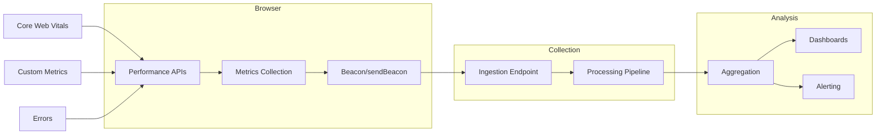

# Client Performance Monitoring

Measuring frontend performance in production requires capturing real user experience data—not just synthetic benchmarks. Lab tools like Lighthouse measure performance under controlled conditions, but users experience your application on varied devices, networks, and contexts. Real User Monitoring (RUM) bridges this gap by collecting performance metrics from actual browser sessions, enabling data-driven optimization where it matters most: in the field.

<figure>



<figcaption>RUM architecture: browser APIs capture metrics, beacons transmit reliably on page unload, backend pipelines aggregate and surface insights.</figcaption>
</figure>

## Abstract

Client performance monitoring centers on three measurement categories:

1. **Core Web Vitals**: Google's standardized metrics—LCP (Largest Contentful Paint), INP (Interaction to Next Paint, replaced FID in March 2024), and CLS (Cumulative Layout Shift). These measure loading, interactivity, and visual stability respectively, evaluated at the 75th percentile.

2. **Performance APIs**: Browser-native interfaces (PerformanceObserver, Navigation Timing, Resource Timing, Event Timing) that expose timing data with sub-millisecond precision. The `web-vitals` library abstracts edge cases these raw APIs miss.

3. **Data transmission**: `navigator.sendBeacon()` and `fetch` with `keepalive` enable reliable transmission during page unload—critical because metrics like CLS and INP finalize only when the user leaves.

Key architectural decisions:

- **Sampling strategy**: 100% capture for errors, 1-10% for performance metrics to control costs
- **Attribution data**: Include element selectors and interaction targets to make metrics actionable
- **Session windowing**: CLS uses session windows (max 5s, 1s gap); INP reports the worst interaction minus outliers

The distinction between lab and field data is fundamental: lab tools provide reproducible debugging; field data reveals what users actually experience.

## Core Web Vitals

### LCP (Largest Contentful Paint)

LCP measures perceived load speed by tracking when the largest visible content element renders. Per the web.dev specification, qualifying elements include:

- `` elements (first frame for animated images)
- `<image>` elements within `<svg>`
- `<video>` elements (poster image or first displayed frame)
- Elements with CSS `background-image` via `url()`
- Block-level elements containing text nodes

**Size calculation rules:**

- Only the visible portion within the viewport counts
- For resized images, the smaller of visible size or intrinsic size is used
- Margins, padding, and borders are excluded
- Low-entropy placeholders and fully transparent elements are filtered out

**When LCP stops reporting:**

The browser stops dispatching LCP entries when the user interacts (tap, scroll, keypress) because interaction typically changes the visible content. This means LCP captures the initial loading experience, not ongoing rendering.

```typescript title="lcp-measurement.ts" collapse={1-3,20-30}
// Using the raw Performance API
new PerformanceObserver((entryList) => {
  const entries = entryList.getEntries()
  // The last entry is the current LCP candidate
  const lastEntry = entries[entries.length - 1] as LargestContentfulPaint

  console.log("LCP:", lastEntry.startTime)
  console.log("Element:", lastEntry.element)
  console.log("Size:", lastEntry.size)
  console.log("URL:", lastEntry.url) // For images
}).observe({ type: "largest-contentful-paint", buffered: true })
```

**Thresholds:**

| Rating            | Value     |
| ----------------- | --------- |
| Good              | ≤ 2.5s    |
| Needs Improvement | 2.5s – 4s |
| Poor              | > 4s      |

### INP (Interaction to Next Paint)

INP replaced FID (First Input Delay) as a Core Web Vital in March 2024. The key difference: FID measured only the first interaction's input delay; INP measures the worst interaction latency across the entire page lifecycle.

**Why INP is more comprehensive:**

Chrome usage data shows 90% of user time on a page occurs after initial load. FID captured only first impressions; INP captures the full responsiveness experience.

**Three phases of interaction latency:**

```
User Input → [Input Delay] → [Processing Time] → [Presentation Delay] → Next Frame

1. Input Delay: Time before event handlers execute (main thread blocked)
2. Processing Time: Time spent executing all event handlers
3. Presentation Delay: Time from handler completion to next frame paint
```

**Tracked interactions:**

- Mouse clicks
- Touchscreen taps
- Keyboard presses (physical and on-screen)

**Excluded:** Scrolling, hovering, zooming (these don't trigger event handlers in the same way).

**Final value calculation:**

INP reports the worst interaction latency, with one outlier ignored per 50 interactions. This prevents a single anomalous interaction from skewing the metric while still capturing genuinely slow interactions.

```typescript title="inp-measurement.ts" collapse={1-3}
// Using web-vitals library (recommended)
import { onINP } from "web-vitals/attribution"

onINP((metric) => {
  console.log("INP:", metric.value)
  console.log("Rating:", metric.rating)

  // Attribution data for debugging
  const { eventTarget, eventType, loadState } = metric.attribution
  console.log("Element:", eventTarget)
  console.log("Event:", eventType)
  console.log("Load state:", loadState) // 'loading', 'dom-interactive', 'dom-content-loaded', 'complete'
})
```

**Thresholds:**

| Rating            | Value         |
| ----------------- | ------------- |
| Good              | ≤ 200ms       |
| Needs Improvement | 200ms – 500ms |
| Poor              | > 500ms       |

### CLS (Cumulative Layout Shift)

CLS measures visual stability—how much visible content unexpectedly shifts during the page lifecycle. Unexpected shifts frustrate users, cause misclicks, and degrade perceived quality.

**Layout shift score formula:**

```
Layout Shift Score = Impact Fraction × Distance Fraction
```

- **Impact Fraction**: Combined visible area of shifted elements (before and after positions) as a fraction of viewport area
- **Distance Fraction**: Greatest distance any element moved, divided by viewport's largest dimension

**Session windowing:**

CLS doesn't sum all shifts. It groups shifts into "session windows" with these constraints:

- Maximum 1 second gap between shifts within a window
- Maximum 5 second window duration

CLS reports the highest-scoring session window, not the total. This prevents long-lived SPAs (Single Page Applications) from accumulating artificially high scores.

**Expected vs. unexpected shifts:**

Shifts within 500ms of user interaction (click, tap, keypress) are considered expected and excluded via the `hadRecentInput` flag. Animations using `transform: translate()` or `transform: scale()` don't trigger layout shifts because they don't affect element geometry.

```typescript title="cls-measurement.ts" collapse={1-3,25-35}
// Raw API approach (simplified)
let clsValue = 0
let clsEntries: LayoutShift[] = []

new PerformanceObserver((entryList) => {
  for (const entry of entryList.getEntries() as LayoutShift[]) {
    // Only count unexpected shifts
    if (!entry.hadRecentInput) {
      clsValue += entry.value
      clsEntries.push(entry)
    }
  }
}).observe({ type: "layout-shift", buffered: true })

// Note: This simplified version doesn't implement session windowing
// Use web-vitals library for correct CLS calculation
```

**Common causes:**

- Images without dimensions (`width`/`height` attributes)
- Ads, embeds, iframes that resize
- Dynamically injected content
- Web fonts causing FOIT/FOUT (Flash of Invisible/Unstyled Text)

**Thresholds:**

| Rating            | Value      |
| ----------------- | ---------- |
| Good              | ≤ 0.1      |
| Needs Improvement | 0.1 – 0.25 |
| Poor              | > 0.25     |

### The 75th Percentile Standard

All Core Web Vitals are evaluated at the 75th percentile of page loads. A page passes if 75% or more of visits meet the "Good" threshold. This approach:

- Accounts for real-world variance in devices and networks
- Balances between median (too lenient) and 95th percentile (too sensitive to outliers)
- Provides a consistent benchmark across sites

## Performance APIs

### PerformanceObserver

PerformanceObserver is the modern interface for accessing performance timeline entries. Unlike `performance.getEntries()`, it provides asynchronous notification as entries are recorded.

```typescript title="performance-observer-pattern.ts" collapse={1-5}
interface PerformanceMetricCallback {
  (entries: PerformanceEntryList): void
}

function observePerformance(
  entryType: string,
  callback: PerformanceMetricCallback,
  options: { buffered?: boolean } = {},
): () => void {
  // Check if entry type is supported
  if (!PerformanceObserver.supportedEntryTypes.includes(entryType)) {
    console.warn(`Entry type "${entryType}" not supported`)
    return () => {}
  }

  const observer = new PerformanceObserver((list) => {
    callback(list.getEntries())
  })

  observer.observe({
    type: entryType,
    buffered: options.buffered ?? true,
  })

  return () => observer.disconnect()
}

// Usage
const disconnect = observePerformance("largest-contentful-paint", (entries) => {
  const lcp = entries[entries.length - 1]
  console.log("LCP:", lcp.startTime)
})
```

**The `buffered` flag:**

When `buffered: true`, the observer receives entries recorded before `observe()` was called. This is critical for metrics like LCP and FCP that often fire before your monitoring code loads. Each entry type has buffer limits—when full, new entries aren't buffered.

**Supported entry types (2024):**

| Entry Type                 | Interface                           | Purpose                  |
| -------------------------- | ----------------------------------- | ------------------------ |
| `navigation`               | PerformanceNavigationTiming         | Page load timing         |
| `resource`                 | PerformanceResourceTiming           | Resource fetch timing    |
| `paint`                    | PerformancePaintTiming              | FP, FCP                  |
| `largest-contentful-paint` | LargestContentfulPaint              | LCP                      |
| `layout-shift`             | LayoutShift                         | CLS                      |
| `event`                    | PerformanceEventTiming              | Interaction timing (INP) |
| `first-input`              | PerformanceEventTiming              | First input delay        |
| `longtask`                 | PerformanceLongTaskTiming           | Tasks > 50ms             |
| `long-animation-frame`     | PerformanceLongAnimationFrameTiming | LoAF (replaces longtask) |
| `mark`                     | PerformanceMark                     | Custom marks             |
| `measure`                  | PerformanceMeasure                  | Custom measures          |
| `element`                  | PerformanceElementTiming            | Specific element timing  |

### Navigation Timing

Navigation Timing provides detailed timing for the document load process.

```typescript title="navigation-timing.ts" collapse={1-3,30-45}
function getNavigationMetrics(): Record<string, number> {
  const [nav] = performance.getEntriesByType("navigation") as PerformanceNavigationTiming[]

  if (!nav) return {}

  return {
    // DNS
    dnsLookup: nav.domainLookupEnd - nav.domainLookupStart,

    // TCP connection
    tcpConnect: nav.connectEnd - nav.connectStart,

    // TLS handshake (if HTTPS)
    tlsHandshake: nav.secureConnectionStart > 0 ? nav.connectEnd - nav.secureConnectionStart : 0,

    // Time to First Byte
    ttfb: nav.responseStart - nav.requestStart,

    // Download time
    downloadTime: nav.responseEnd - nav.responseStart,

    // DOM processing
    domProcessing: nav.domContentLoadedEventEnd - nav.responseEnd,

    // Total page load
    pageLoad: nav.loadEventEnd - nav.startTime,

    // Transfer size
    transferSize: nav.transferSize,
    encodedBodySize: nav.encodedBodySize,
    decodedBodySize: nav.decodedBodySize,
  }
}
```

**Key timing points:**

```
navigationStart
    → redirectStart/End
    → fetchStart
    → domainLookupStart/End (DNS)
    → connectStart/End (TCP)
    → secureConnectionStart (TLS)
    → requestStart
    → responseStart (TTFB)
    → responseEnd
    → domInteractive
    → domContentLoadedEventStart/End
    → domComplete
    → loadEventStart/End
```

### Resource Timing

Resource Timing exposes network timing for fetched resources (scripts, stylesheets, images, XHR/fetch requests).

```typescript title="resource-timing.ts" collapse={1-5,35-50}
interface ResourceMetrics {
  name: string
  initiatorType: string
  duration: number
  transferSize: number
  cached: boolean
}

function getSlowResources(threshold = 1000): ResourceMetrics[] {
  const resources = performance.getEntriesByType("resource") as PerformanceResourceTiming[]

  return resources
    .filter((r) => r.duration > threshold)
    .map((r) => ({
      name: r.name,
      initiatorType: r.initiatorType,
      duration: r.duration,
      transferSize: r.transferSize,
      cached: r.transferSize === 0 && r.decodedBodySize > 0,
    }))
    .sort((a, b) => b.duration - a.duration)
}

// Monitor resources as they load
new PerformanceObserver((list) => {
  for (const entry of list.getEntries() as PerformanceResourceTiming[]) {
    if (entry.duration > 2000) {
      console.warn("Slow resource:", entry.name, entry.duration)
    }
  }
}).observe({ type: "resource", buffered: true })
```

**Cross-origin timing:**

By default, cross-origin resources expose only `startTime`, `duration`, and `responseEnd` with other timing values zeroed for privacy. The `Timing-Allow-Origin` header enables full timing:

```http
Timing-Allow-Origin: *
Timing-Allow-Origin: https://example.com
```

### Long Animation Frames (LoAF)

Long Animation Frames API replaces Long Tasks API with better attribution. A "long animation frame" is one where rendering work exceeds 50ms, blocking smooth 60fps rendering.

```typescript title="loaf-monitoring.ts" collapse={1-3}
// Detect long animation frames with attribution
new PerformanceObserver((list) => {
  for (const entry of list.getEntries() as PerformanceLongAnimationFrameTiming[]) {
    console.log("Long frame:", entry.duration, "ms")

    // Scripts that contributed to the long frame
    for (const script of entry.scripts) {
      console.log("  Script:", script.sourceURL)
      console.log("  Function:", script.sourceFunctionName)
      console.log("  Duration:", script.duration, "ms")
      console.log("  Invoker:", script.invoker) // 'user-callback', 'event-listener', etc.
    }
  }
}).observe({ type: "long-animation-frame", buffered: true })
```

**Why LoAF over Long Tasks:**

Long Tasks only reported that a task exceeded 50ms. LoAF provides:

- Which scripts contributed and their individual durations
- Source URLs and function names
- Invoker type (event listener, user callback, etc.)
- Better correlation with INP issues

### User Timing (Custom Metrics)

User Timing API enables custom performance marks and measures for application-specific metrics.

```typescript title="user-timing.ts" collapse={1-3,35-45}
// Mark a point in time
performance.mark("feature-start")

// ... feature code executes ...

performance.mark("feature-end")

// Measure between marks
performance.measure("feature-duration", "feature-start", "feature-end")

// Measure from navigation start
performance.measure("time-to-feature", {
  start: 0, // navigationStart
  end: "feature-start",
})

// Retrieve measures
const measures = performance.getEntriesByType("measure")
for (const measure of measures) {
  console.log(`${measure.name}: ${measure.duration}ms`)
}

// Include custom data (Performance API Level 3)
performance.mark("api-call-complete", {
  detail: {
    endpoint: "/api/users",
    status: 200,
    cached: false,
  },
})
```

**Real-world custom metrics:**

| Metric                      | What It Measures                         |
| --------------------------- | ---------------------------------------- |
| Time to Interactive Feature | When a specific feature becomes usable   |
| Search Results Render       | Time from query to results display       |
| Checkout Flow Duration      | Time through purchase funnel             |
| API Response Time           | Backend latency as experienced by client |

## Data Collection Architecture

### Beacon Transmission

`navigator.sendBeacon()` is designed for reliable analytics transmission during page unload. Unlike XHR/fetch, it's queued by the browser and sent even after the page closes.

```typescript title="beacon-transmission.ts" collapse={1-5,45-60}
interface PerformancePayload {
  url: string
  sessionId: string
  timestamp: number
  metrics: Record<string, number>
  attribution?: Record<string, unknown>
}

class MetricsCollector {
  private buffer: PerformancePayload[] = []
  private endpoint: string
  private maxBufferSize = 10

  constructor(endpoint: string) {
    this.endpoint = endpoint
    this.setupUnloadHandler()
  }

  record(metrics: Record<string, number>, attribution?: Record<string, unknown>): void {
    this.buffer.push({
      url: location.href,
      sessionId: this.getSessionId(),
      timestamp: Date.now(),
      metrics,
      attribution,
    })

    // Flush if buffer is full
    if (this.buffer.length >= this.maxBufferSize) {
      this.flush()
    }
  }

  private flush(): void {
    if (this.buffer.length === 0) return

    const payload = JSON.stringify(this.buffer)
    this.buffer = []

    // Try sendBeacon first
    const sent = navigator.sendBeacon(this.endpoint, payload)

    // Fallback to fetch with keepalive
    if (!sent) {
      fetch(this.endpoint, {
        method: "POST",
        body: payload,
        keepalive: true,
        headers: { "Content-Type": "application/json" },
      }).catch(() => {
        // Silently fail - analytics shouldn't break the page
      })
    }
  }

  private setupUnloadHandler(): void {
    // visibilitychange is more reliable than unload/beforeunload
    document.addEventListener("visibilitychange", () => {
      if (document.visibilityState === "hidden") {
        this.flush()
      }
    })

    // Fallback for browsers that don't fire visibilitychange
    window.addEventListener("pagehide", () => this.flush())
  }

  private getSessionId(): string {
    let id = sessionStorage.getItem("perf_session_id")
    if (!id) {
      id = crypto.randomUUID()
      sessionStorage.setItem("perf_session_id", id)
    }
    return id
  }
}
```

**Why `visibilitychange` over `unload`:**

- `unload` doesn't fire reliably on mobile when switching apps
- `unload` and `beforeunload` prevent bfcache (back/forward cache) in many browsers
- `visibilitychange` fires when the page is hidden, backgrounded, or navigated away

**Payload size limits:**

`sendBeacon()` typically has a 64KB limit. For large payloads, batch and compress, or use `fetch` with `keepalive` which has similar guarantees but more flexibility.

### Sampling Strategies

RUM generates substantial data volume. Sampling reduces costs while maintaining statistical validity.

```typescript title="sampling-strategy.ts" collapse={1-5,40-55}
type SamplingDecision = "always" | "sampled" | "never"

interface SamplingConfig {
  performanceRate: number // 0-1, e.g., 0.1 = 10%
  errorRate: number // Usually 1.0 (100%)
  sessionBased: boolean // Decide once per session
}

class Sampler {
  private config: SamplingConfig
  private sessionDecision: boolean | null = null

  constructor(config: SamplingConfig) {
    this.config = config

    if (config.sessionBased) {
      this.sessionDecision = this.makeDecision(config.performanceRate)
    }
  }

  shouldSample(type: "performance" | "error"): boolean {
    // Always capture errors
    if (type === "error") {
      return this.makeDecision(this.config.errorRate)
    }

    // Use session decision if configured
    if (this.config.sessionBased && this.sessionDecision !== null) {
      return this.sessionDecision
    }

    return this.makeDecision(this.config.performanceRate)
  }

  private makeDecision(rate: number): boolean {
    return Math.random() < rate
  }
}

// Usage
const sampler = new Sampler({
  performanceRate: 0.1, // 10% of sessions
  errorRate: 1.0, // 100% of errors
  sessionBased: true, // Consistent within session
})

if (sampler.shouldSample("performance")) {
  collector.record(metrics)
}
```

**Sampling considerations:**

| Approach                   | Pros                                        | Cons                                 |
| -------------------------- | ------------------------------------------- | ------------------------------------ |
| Head-based (session start) | Consistent within session, simpler analysis | May miss rare interactions           |
| Tail-based (after event)   | Can prioritize errors/slow requests         | More complex, higher initial capture |
| Rate-based (percentage)    | Simple, predictable volume                  | May split sessions                   |
| Adaptive (dynamic rate)    | Handles traffic spikes                      | Complex to implement correctly       |

**Typical rates:**

- Errors: 100% (always capture)
- Performance metrics: 1-10% depending on traffic
- Session replay: 0.1-1% (high data volume)

### Attribution for Debugging

Raw metric values (LCP = 3.2s) are insufficient for debugging. Attribution data identifies what caused the value.

```typescript title="attribution-collection.ts" collapse={1-5}
import { onLCP, onINP, onCLS } from "web-vitals/attribution"

function collectWithAttribution(): void {
  onLCP((metric) => {
    const { element, url, timeToFirstByte, resourceLoadDelay, resourceLoadDuration, elementRenderDelay } =
      metric.attribution

    sendMetric({
      name: "LCP",
      value: metric.value,
      attribution: {
        element: element?.tagName,
        elementId: element?.id,
        url,
        ttfb: timeToFirstByte,
        resourceLoadDelay,
        resourceLoadDuration,
        elementRenderDelay,
      },
    })
  })

  onINP((metric) => {
    const { eventTarget, eventType, loadState, interactionTargetElement, longAnimationFrameEntries } =
      metric.attribution

    sendMetric({
      name: "INP",
      value: metric.value,
      attribution: {
        eventTarget,
        eventType,
        loadState,
        element: interactionTargetElement?.tagName,
        longFrames: longAnimationFrameEntries?.length,
      },
    })
  })

  onCLS((metric) => {
    const { largestShiftTarget, largestShiftTime, largestShiftValue, loadState } = metric.attribution

    sendMetric({
      name: "CLS",
      value: metric.value,
      attribution: {
        shiftTarget: largestShiftTarget?.tagName,
        shiftTime: largestShiftTime,
        shiftValue: largestShiftValue,
        loadState,
      },
    })
  })
}
```

**Attribution bundle size trade-off:**

The standard `web-vitals` build is ~2KB (brotli). The attribution build is ~3.5KB. The extra 1.5KB provides debugging data that makes metrics actionable—worth it for production monitoring.

## Error Tracking

### Capturing JavaScript Errors

Comprehensive error tracking requires multiple handlers for different error types.

```typescript title="error-tracking.ts" collapse={1-8,70-90}
interface ErrorReport {
  type: "runtime" | "resource" | "promise" | "network"
  message: string
  stack?: string
  source?: string
  line?: number
  column?: number
  timestamp: number
  url: string
  userAgent: string
}

class ErrorTracker {
  private endpoint: string
  private buffer: ErrorReport[] = []

  constructor(endpoint: string) {
    this.endpoint = endpoint
    this.setupHandlers()
  }

  private setupHandlers(): void {
    // Runtime errors (synchronous)
    window.onerror = (message, source, line, column, error) => {
      this.report({
        type: "runtime",
        message: String(message),
        stack: error?.stack,
        source,
        line: line ?? undefined,
        column: column ?? undefined,
      })
      return false // Don't suppress default handling
    }

    // Unhandled promise rejections
    window.addEventListener("unhandledrejection", (event) => {
      this.report({
        type: "promise",
        message: event.reason?.message || String(event.reason),
        stack: event.reason?.stack,
      })
    })

    // Resource loading errors (images, scripts, stylesheets)
    window.addEventListener(
      "error",
      (event) => {
        // Only handle resource errors, not runtime errors
        if (event.target !== window && event.target instanceof HTMLElement) {
          const target = event.target as HTMLImageElement | HTMLScriptElement | HTMLLinkElement
          this.report({
            type: "resource",
            message: `Failed to load ${target.tagName.toLowerCase()}`,
            source: (target as HTMLImageElement).src || (target as HTMLLinkElement).href,
          })
        }
      },
      true,
    ) // Capture phase to catch resource errors
  }

  private report(error: Omit<ErrorReport, "timestamp" | "url" | "userAgent">): void {
    const fullError: ErrorReport = {
      ...error,
      timestamp: Date.now(),
      url: location.href,
      userAgent: navigator.userAgent,
    }

    this.buffer.push(fullError)

    // Send immediately for errors (don't batch)
    this.flush()
  }

  private flush(): void {
    if (this.buffer.length === 0) return

    const payload = JSON.stringify(this.buffer)
    this.buffer = []

    navigator.sendBeacon(this.endpoint, payload)
  }
}
```

### Stack Trace Parsing

Production JavaScript is minified, making raw stack traces unreadable. Source maps restore original file/line information.

```typescript title="stack-parsing.ts" collapse={1-5,45-60}
interface ParsedFrame {
  function: string
  file: string
  line: number
  column: number
}

function parseStackTrace(stack: string): ParsedFrame[] {
  if (!stack) return []

  const lines = stack.split("\n")
  const frames: ParsedFrame[] = []

  // Common stack trace formats
  const chromeRegex = /at\s+(.+?)\s+\((.+?):(\d+):(\d+)\)/
  const firefoxRegex = /(.*)@(.+?):(\d+):(\d+)/

  for (const line of lines) {
    let match = chromeRegex.exec(line) || firefoxRegex.exec(line)

    if (match) {
      frames.push({
        function: match[1] || "<anonymous>",
        file: match[2],
        line: parseInt(match[3], 10),
        column: parseInt(match[4], 10),
      })
    }
  }

  return frames
}

// Server-side: Use source-map library to resolve original locations
// Libraries like Sentry, Datadog do this automatically
```

### Error Grouping

Without grouping, each error instance creates a separate alert. Grouping consolidates identical errors.

```typescript title="error-grouping.ts" collapse={1-3}
function generateErrorFingerprint(error: ErrorReport): string {
  // Group by: type + message pattern + top stack frame
  const parts = [error.type, normalizeMessage(error.message), error.stack ? getTopFrame(error.stack) : "no-stack"]

  return hashString(parts.join("|"))
}

function normalizeMessage(message: string): string {
  // Remove dynamic values that would create unique fingerprints
  return message
    .replace(/\d+/g, "<N>") // Numbers
    .replace(/'[^']+'/g, "'<S>'") // Single-quoted strings
    .replace(/"[^"]+"/g, '"<S>"') // Double-quoted strings
    .replace(/\b[a-f0-9]{8,}\b/gi, "<ID>") // Hex IDs
}

function getTopFrame(stack: string): string {
  const frames = parseStackTrace(stack)
  if (frames.length === 0) return "unknown"

  const top = frames[0]
  // Use file and line, not column (column varies with minification)
  return `${top.file}:${top.line}`
}

function hashString(str: string): string {
  // Simple hash for fingerprinting
  let hash = 0
  for (let i = 0; i < str.length; i++) {
    hash = (hash << 5) - hash + str.charCodeAt(i)
    hash |= 0
  }
  return hash.toString(16)
}
```

## Lab vs. Field Data

### Fundamental Differences

| Aspect          | Lab (Synthetic)                       | Field (RUM)                     |
| --------------- | ------------------------------------- | ------------------------------- |
| Environment     | Controlled (specific device, network) | Variable (real user conditions) |
| Reproducibility | High                                  | Low                             |
| Metrics         | All measurable                        | User-experienced only           |
| Use case        | Development, CI/CD gates              | Production monitoring           |
| Data volume     | One measurement                       | Aggregated from many            |
| Attribution     | Full stack traces                     | Limited (privacy, performance)  |

### When to Use Each

**Lab data (Lighthouse, WebPageTest):**

- Pre-deployment validation
- Regression testing in CI
- Debugging specific issues
- Comparing configurations

**Field data (RUM):**

- Understanding real user experience
- Identifying issues lab doesn't catch
- Monitoring production performance
- Correlating performance with business metrics

### The Gap Between Them

Lab measurements often differ from field measurements because:

1. **Device diversity**: Lab uses consistent hardware; users have varied devices
2. **Network conditions**: Lab uses throttled but stable connections; real networks are unpredictable
3. **User behavior**: Lab follows scripted paths; users interact unpredictably
4. **Third-party content**: Ads, widgets, and embeds behave differently in production
5. **Cache state**: Lab often tests cold cache; users may have warm caches

As web.dev states: "lab measurement is not a substitute for field measurement."

## The web-vitals Library

Google's `web-vitals` library is the recommended approach for measuring Core Web Vitals. It handles edge cases that raw Performance APIs miss.

### Why Use It Over Raw APIs

The library handles:

- Background tab detection (metrics shouldn't include time page was hidden)
- bfcache (back/forward cache) restoration (resets metrics appropriately)
- Iframe considerations
- Prerendered page handling
- Mobile-specific timing issues

### Basic Usage

```typescript title="web-vitals-setup.ts" collapse={1-5}
import { onCLS, onINP, onLCP, onFCP, onTTFB } from "web-vitals"

function sendToAnalytics(metric: { name: string; value: number; delta: number; id: string; rating: string }): void {
  const body = JSON.stringify({
    name: metric.name,
    value: metric.value,
    delta: metric.delta,
    id: metric.id,
    rating: metric.rating,
    page: location.pathname,
  })

  // Use sendBeacon for reliable delivery
  navigator.sendBeacon("/api/analytics", body)
}

// Register handlers - call each only once per page
onCLS(sendToAnalytics)
onINP(sendToAnalytics)
onLCP(sendToAnalytics)
onFCP(sendToAnalytics)
onTTFB(sendToAnalytics)
```

### Attribution Build

```typescript title="web-vitals-attribution.ts" collapse={1-3}
import { onLCP, onINP, onCLS } from "web-vitals/attribution"

// LCP attribution
onLCP((metric) => {
  console.log("LCP value:", metric.value)
  console.log("LCP element:", metric.attribution.element)
  console.log("Resource URL:", metric.attribution.url)
  console.log("TTFB:", metric.attribution.timeToFirstByte)
  console.log("Resource load delay:", metric.attribution.resourceLoadDelay)
  console.log("Element render delay:", metric.attribution.elementRenderDelay)
})

// INP attribution
onINP((metric) => {
  console.log("INP value:", metric.value)
  console.log("Event type:", metric.attribution.eventType)
  console.log("Event target:", metric.attribution.eventTarget)
  console.log("Load state:", metric.attribution.loadState)
  console.log("Long frames:", metric.attribution.longAnimationFrameEntries)
})

// CLS attribution
onCLS((metric) => {
  console.log("CLS value:", metric.value)
  console.log("Largest shift target:", metric.attribution.largestShiftTarget)
  console.log("Largest shift value:", metric.attribution.largestShiftValue)
  console.log("Largest shift time:", metric.attribution.largestShiftTime)
})
```

### Key API Details

**The `delta` property:**

Metrics like CLS can update multiple times as new layout shifts occur. The `delta` property contains only the change since the last report. For analytics platforms that don't support metric updates, sum the deltas.

**The `id` property:**

A unique identifier for the metric instance. Use this to aggregate multiple reports for the same page view (e.g., when CLS updates).

**Single call rule:**

Call each metric function only once per page load. Multiple calls create multiple PerformanceObserver instances, wasting memory and causing duplicate reports.

## Real-World Implementations

### Sentry Performance

**Architecture:**

- JavaScript SDK instruments fetch/XHR, framework components
- Traces capture transaction spans from browser to backend
- Web Vitals automatically captured via `web-vitals` library integration

**Key features:**

- Automatic performance instrumentation for React, Vue, Angular
- Distributed tracing connecting frontend spans to backend
- Release tracking for performance regression detection

### Datadog RUM

**Architecture:**

- Lightweight SDK (~30KB) loaded asynchronously
- Session-based collection with configurable sampling
- Automatic Core Web Vitals, resource timing, long tasks

**Key features:**

- Replay integration for debugging sessions
- Synthetic monitoring comparison
- Custom actions and timing

### Vercel Speed Insights

**Architecture:**

- Minimal script injection in Next.js builds
- Real user data collected to Vercel's analytics backend
- Core Web Vitals with Next.js-specific attribution

**Key features:**

- Route-level performance breakdown
- Comparison across deployments
- Integration with Vercel's deployment workflow

### Open-Source: SpeedCurve, Calibre

**Self-hosted considerations:**

- Data storage for high-cardinality metrics (ClickHouse, TimescaleDB)
- Aggregation pipelines for percentile calculation
- Visualization (Grafana dashboards)

## Conclusion

Client performance monitoring requires three interconnected systems:

1. **Metrics collection**: Core Web Vitals (LCP, INP, CLS) via the `web-vitals` library, supplemented by Navigation Timing, Resource Timing, and custom User Timing marks.

2. **Reliable transmission**: `navigator.sendBeacon()` on `visibilitychange` ensures data reaches your servers even during page unload. Batch secondary metrics; send errors immediately.

3. **Actionable analysis**: Raw numbers (LCP = 3.2s) aren't useful without attribution (LCP element = hero image, resource load delay = 1.8s). Capture debugging data to make metrics actionable.

The gap between lab and field data is fundamental. Lighthouse tells you what's possible; RUM tells you what users actually experience. Both are necessary for comprehensive performance management.

## Appendix

### Prerequisites

- Browser Performance APIs (PerformanceObserver, timing interfaces)
- HTTP basics (request/response timing, headers)
- JavaScript event handling

### Terminology

| Term | Definition                                                                      |
| ---- | ------------------------------------------------------------------------------- |
| RUM  | Real User Monitoring—collecting performance data from actual user sessions      |
| CrUX | Chrome User Experience Report—Google's public dataset of field performance data |
| TTFB | Time to First Byte—time until first byte of response received                   |
| FCP  | First Contentful Paint—time until first content renders                         |
| LCP  | Largest Contentful Paint—time until largest visible content renders             |
| INP  | Interaction to Next Paint—worst interaction latency (replaced FID)              |
| CLS  | Cumulative Layout Shift—measure of visual stability                             |
| LoAF | Long Animation Frame—frame taking >50ms, blocking smooth rendering              |

### Summary

- Core Web Vitals (LCP, INP, CLS) are evaluated at the 75th percentile with "Good" thresholds of 2.5s, 200ms, and 0.1 respectively
- INP replaced FID in March 2024, measuring all interactions rather than just the first
- PerformanceObserver with `buffered: true` captures metrics recorded before your code loads
- `navigator.sendBeacon()` on `visibilitychange` is the most reliable transmission pattern
- The `web-vitals` library handles edge cases (background tabs, bfcache) that raw APIs miss
- Attribution data transforms numbers into actionable debugging information
- Lab data (Lighthouse) and field data (RUM) serve different purposes—both are necessary

### References

- [web.dev - Web Vitals](https://web.dev/articles/vitals) - Core Web Vitals overview and guidance
- [web.dev - LCP](https://web.dev/articles/lcp) - Largest Contentful Paint specification
- [web.dev - INP](https://web.dev/articles/inp) - Interaction to Next Paint specification
- [web.dev - CLS](https://web.dev/articles/cls) - Cumulative Layout Shift specification
- [W3C Performance Timeline](https://www.w3.org/TR/performance-timeline/) - PerformanceObserver specification
- [W3C Navigation Timing Level 2](https://www.w3.org/TR/navigation-timing-2/) - Navigation timing specification
- [W3C Resource Timing](https://www.w3.org/TR/resource-timing-2/) - Resource timing specification
- [MDN - PerformanceObserver](https://developer.mozilla.org/en-US/docs/Web/API/PerformanceObserver) - API documentation
- [MDN - navigator.sendBeacon](https://developer.mozilla.org/en-US/docs/Web/API/Navigator/sendBeacon) - Beacon API documentation
- [GoogleChrome/web-vitals](https://github.com/GoogleChrome/web-vitals) - Official web-vitals library
- [web.dev - Custom Metrics](https://web.dev/articles/custom-metrics) - User Timing and custom measurement
- [web.dev - Long Animation Frames](https://web.dev/articles/long-animation-frames) - LoAF API documentation
