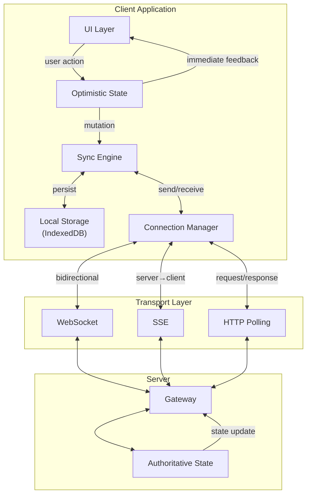
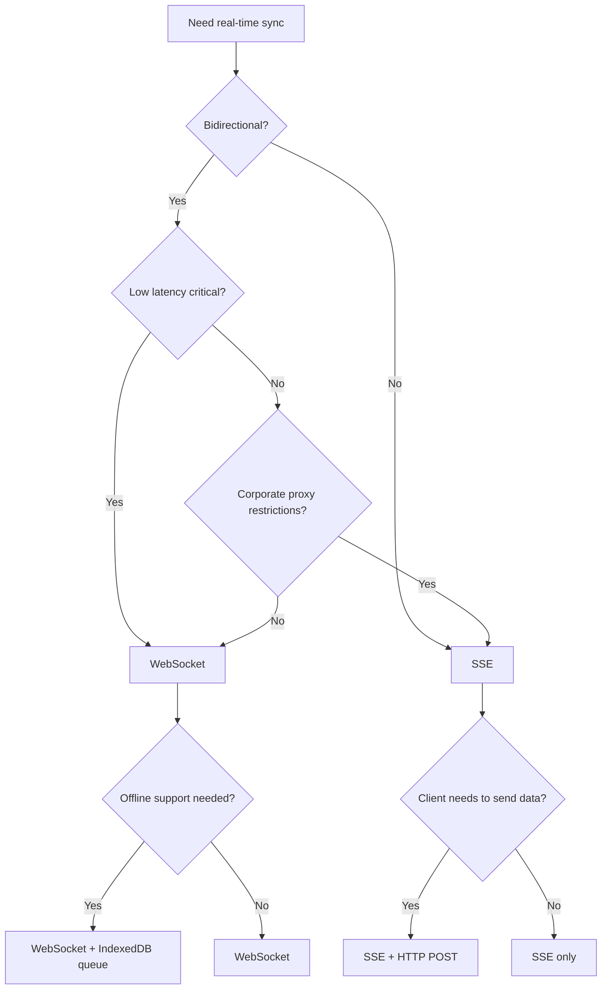

# Real-Time Sync Client

Client-side architecture for real-time data synchronization: transport protocols, connection management, conflict resolution, and state reconciliation patterns used by Figma, Notion, Discord, and Linear.

<figure>



<figcaption>Real-time sync client architecture: optimistic local state, sync engine with persistence, and transport abstraction connecting to authoritative server state.</figcaption>
</figure>

## Abstract

Real-time sync is bidirectional state convergence between client and server under network uncertainty. The core tension: users expect instant feedback, but the server is the source of truth.

**Mental model:**

1. **Optimistic local state** — Apply mutations immediately; rollback on server rejection
2. **Transport selection** — WebSocket for bidirectional low-latency; SSE for server-push simplicity; polling as fallback
3. **Connection resilience** — Exponential backoff with jitter; heartbeats detect stale connections; reconnect without data loss
4. **Conflict resolution** — Last-write-wins at property level (Figma), Operational Transform for text (Google Docs), CRDTs for offline-first (Notion, Linear)
5. **State reconciliation** — Server acknowledgments; re-apply pending local mutations on top of authoritative state
6. **Presence** — Ephemeral metadata (cursors, typing indicators) via heartbeat or CRDT broadcast

The approach depends on data shape, offline requirements, and acceptable consistency latency.

## The Challenge

### Why Real-Time Sync Is Hard

Real-time sync violates the request-response model that HTTP assumes. Three constraints create tension:

1. **Latency vs. Consistency** — Users expect instant feedback, but network round-trips are unavoidable
2. **Offline vs. Conflicts** — Offline edits require local storage, which creates divergent state that must merge
3. **Scale vs. Complexity** — Millions of connections require infrastructure that single-server models cannot provide

### Browser Constraints

| Resource                         | Limit                | Impact                                                |
| -------------------------------- | -------------------- | ----------------------------------------------------- |
| WebSocket connections per domain | 6–30                 | Multiple tabs share quota; exhaustion causes failures |
| SSE connections (HTTP/1.1)       | 6 per domain         | Shared across all tabs; HTTP/2 raises to ~100         |
| Main thread budget               | 16ms/frame           | Long sync operations cause UI jank                    |
| IndexedDB quota                  | 50% of disk (Chrome) | Large local caches can hit quota errors               |

WebSocket connections prevent the browser's back/forward cache (bfcache) from storing the page. Close connections on `pagehide` to preserve navigation performance.

### Device and Network Profiles

| Scenario        | Latency   | Constraints                                       |
| --------------- | --------- | ------------------------------------------------- |
| Desktop + fiber | 10–50ms   | Full WebSocket, generous caching                  |
| Mobile + LTE    | 50–200ms  | Battery drain from radio wake; bundle updates     |
| Mobile + 3G     | 200–500ms | Aggressive local caching; defer non-critical sync |
| Offline         | N/A       | Queue mutations locally; replay on reconnect      |

Cellular radio "tail time" keeps the antenna active for seconds after each transmission. Batch messages to minimize battery impact.

## Transport Protocols

### WebSocket (RFC 6455)

WebSocket provides full-duplex communication over a single TCP connection. After an HTTP handshake, frames flow bidirectionally with minimal overhead.

**Protocol characteristics:**

| Property       | Value                          |
| -------------- | ------------------------------ |
| Direction      | Bidirectional                  |
| Frame overhead | 2–14 bytes (after handshake)   |
| Data types     | Text (UTF-8), binary           |
| Auto-reconnect | No (must implement)            |
| Compression    | Per-message DEFLATE (RFC 7692) |

**Handshake:**

```http
GET /chat HTTP/1.1
Host: server.example.com
Upgrade: websocket
Connection: Upgrade
Sec-WebSocket-Key: dGhlIHNhbXBsZSBub25jZQ==
Sec-WebSocket-Version: 13
```

The server responds with `101 Switching Protocols`, and the connection upgrades to WebSocket framing.

**Design reasoning:** RFC 6455 chose HTTP-compatible handshake so WebSocket traffic traverses proxies and firewalls that allow HTTP. The `Sec-WebSocket-Key` prevents cross-protocol attacks by requiring the server to prove it understands WebSocket.

**Limitations:**

- **No backpressure** — If the server sends faster than the client processes, messages buffer in memory until the browser crashes or discards data. Experimental WebSocketStream (Chrome 124+) adds backpressure support.
- **No multiplexing** — Each logical channel requires a separate connection or application-level multiplexing.
- **Connection limits** — Browsers cap WebSocket connections per domain (typically 6–30). Multiple tabs compete for this quota.

**When to use:** Chat, collaborative editing, gaming, financial tickers—any scenario requiring low-latency bidirectional communication.

### Server-Sent Events (SSE)

SSE is server-to-client push over HTTP. The server holds an open connection and streams events as `text/event-stream`.

**Event format:**

```
event: message
data: {"user":"alice","text":"hello"}
id: 12345
retry: 3000

: keep-alive comment
```

| Field   | Purpose                                    |
| ------- | ------------------------------------------ |
| `event` | Event type name (triggers named listeners) |
| `data`  | Payload (UTF-8 only)                       |
| `id`    | Resume token for reconnection              |
| `retry` | Reconnection delay in milliseconds         |

**Design reasoning:** SSE uses HTTP, so it works through any proxy or firewall that allows HTTP. The `id` field enables resumption: on reconnect, the browser sends `Last-Event-ID`, and the server can replay missed events.

**Advantages over WebSocket:**

- Built-in reconnection with configurable delay
- Works through restrictive corporate proxies
- Simpler server implementation (any HTTP server)

**Limitations:**

- Server-to-client only (client uses HTTP POST for uplink)
- UTF-8 text only (no binary)
- HTTP/1.1 limits to 6 connections per domain across all tabs

**When to use:** Live feeds, notifications, dashboards—scenarios where the server pushes and the client occasionally posts.

### Long Polling

Long polling simulates push by having the client hold an open HTTP request until the server has data or timeout.

**Flow:**

1. Client sends `GET /events?since=12345`
2. Server holds connection until new data exists or 30s timeout
3. Server responds with data (or empty on timeout)
4. Client immediately sends next request

**Design reasoning:** Long polling works everywhere HTTP works. Before WebSocket existed, this was the only reliable cross-browser push mechanism. It remains useful for restrictive networks or legacy browser support.

**Trade-offs:**

| Aspect                    | Long Polling                   | WebSocket         | SSE            |
| ------------------------- | ------------------------------ | ----------------- | -------------- |
| Latency                   | Medium (one RTT per message)   | Low               | Low            |
| Overhead                  | Full HTTP headers per response | 2 bytes/frame     | ~5 bytes/event |
| Firewall compatibility    | Excellent                      | Sometimes blocked | Excellent      |
| Implementation complexity | Low                            | Medium            | Low            |

**When to use:** Fallback when WebSocket and SSE fail; infrequent updates where latency is acceptable.

### Decision Framework



## Connection Management

### Reconnection with Exponential Backoff

Network disconnections are inevitable. Naive immediate retry causes thundering herd problems when servers recover. Exponential backoff with jitter spreads reconnection attempts.

```typescript title="reconnection-manager.ts" collapse={1-2, 35-45}
// Types and constants
type ReconnectionOptions = {
  initialDelay?: number
  maxDelay?: number
  multiplier?: number
  jitter?: number
  maxAttempts?: number
}

class ReconnectionManager {
  private currentDelay: number
  private attempts = 0

  constructor(private options: Required<ReconnectionOptions>) {
    this.currentDelay = options.initialDelay
  }

  // Core logic: calculate next delay with jitter
  getNextDelay(): number | null {
    if (this.attempts >= this.options.maxAttempts) {
      return null // Give up
    }

    const jitterRange = this.currentDelay * this.options.jitter
    const jitter = Math.random() * jitterRange * 2 - jitterRange
    const delay = Math.min(this.currentDelay + jitter, this.options.maxDelay)

    this.currentDelay = Math.min(this.currentDelay * this.options.multiplier, this.options.maxDelay)
    this.attempts++

    return delay
  }

  reset(): void {
    this.currentDelay = this.options.initialDelay
    this.attempts = 0
  }
}

// Usage
const manager = new ReconnectionManager({
  initialDelay: 1000,
  maxDelay: 30000,
  multiplier: 2,
  jitter: 0.1,
  maxAttempts: 10,
})
```

**Design reasoning:**

- **Exponential growth** caps at a maximum (30s typical) to prevent infinite waits
- **Jitter** (±10%) desynchronizes clients that disconnected at the same time
- **Attempt limit** prevents infinite loops against a permanently down service

**Production considerations:**

| Error Type       | Retry Strategy                |
| ---------------- | ----------------------------- |
| Network timeout  | Full backoff                  |
| 5xx server error | Full backoff                  |
| 401 Unauthorized | Do not retry; re-authenticate |
| 429 Rate Limited | Honor `Retry-After` header    |
| DNS failure      | Backoff with longer max delay |

### Heartbeat and Connection Health

TCP keep-alives are insufficient for application-level connection health. A dead connection may not trigger a TCP reset for minutes. Application heartbeats detect stale connections faster.

```typescript title="heartbeat.ts" collapse={1-4, 30-40}
// WebSocket wrapper with heartbeat
type HeartbeatOptions = {
  interval: number // How often to send ping
  timeout: number // How long to wait for pong
}

class HeartbeatConnection {
  private pingTimer: number | null = null
  private pongTimer: number | null = null
  private ws: WebSocket

  constructor(
    url: string,
    private options: HeartbeatOptions,
  ) {
    this.ws = new WebSocket(url)
    this.ws.onopen = () => this.startHeartbeat()
    this.ws.onmessage = (e) => this.handleMessage(e)
    this.ws.onclose = () => this.stopHeartbeat()
  }

  // Core heartbeat logic
  private startHeartbeat(): void {
    this.pingTimer = window.setInterval(() => {
      this.ws.send(JSON.stringify({ type: "ping", ts: Date.now() }))

      this.pongTimer = window.setTimeout(() => {
        // No pong received - connection is dead
        this.ws.close(4000, "Heartbeat timeout")
      }, this.options.timeout)
    }, this.options.interval)
  }

  private handleMessage(event: MessageEvent): void {
    const data = JSON.parse(event.data)
    if (data.type === "pong") {
      if (this.pongTimer) clearTimeout(this.pongTimer)
      return
    }
    // Handle application messages...
  }

  private stopHeartbeat(): void {
    if (this.pingTimer) clearInterval(this.pingTimer)
    if (this.pongTimer) clearTimeout(this.pongTimer)
  }
}
```

**Typical values:**

| Setting                        | Value  | Reasoning                                        |
| ------------------------------ | ------ | ------------------------------------------------ |
| Ping interval                  | 15–30s | Balance between detection speed and bandwidth    |
| Pong timeout                   | 5–10s  | Allow for network jitter                         |
| Missed pings before disconnect | 2–3    | Avoid false positives from single dropped packet |

### State Recovery on Reconnect

Reconnection without state recovery loses messages sent during disconnection. Two patterns handle this:

**1. Sequence-based recovery:**

```typescript title="sequence-recovery.ts" collapse={1-5, 25-35}
// Track last acknowledged sequence
interface Message {
  seq: number
  payload: unknown
}

class SequenceRecovery {
  private lastAckedSeq = 0
  private pendingMessages: Message[] = []

  send(payload: unknown): void {
    const msg: Message = {
      seq: this.pendingMessages.length + this.lastAckedSeq + 1,
      payload,
    }
    this.pendingMessages.push(msg)
    this.ws.send(JSON.stringify(msg))
  }

  // On reconnect, request replay from last ack
  onReconnect(): void {
    this.ws.send(
      JSON.stringify({
        type: "resume",
        lastSeq: this.lastAckedSeq,
      }),
    )
  }

  onAck(seq: number): void {
    this.lastAckedSeq = seq
    this.pendingMessages = this.pendingMessages.filter((m) => m.seq > seq)
  }

  onServerReplay(messages: Message[]): void {
    // Server sends missed messages since lastSeq
    for (const msg of messages) {
      this.handleMessage(msg)
    }
  }
}
```

**2. Event sourcing recovery (SSE):**

SSE's `Last-Event-ID` header automatically requests replay:

```typescript title="sse-recovery.ts"
const eventSource = new EventSource("/events")

eventSource.onmessage = (event) => {
  // event.lastEventId contains the id from the server
  // On reconnect, browser automatically sends Last-Event-ID header
  processEvent(JSON.parse(event.data))
}
```

**Design reasoning:** Sequence numbers are simpler but require server-side storage of recent messages. Event sourcing naturally fits event logs but requires the server to support replay from arbitrary points.

## Message Handling

### Ordering Guarantees

Out-of-order delivery happens when:

- Multiple WebSocket connections exist (load balancing)
- Server processes messages in parallel
- Network path changes mid-stream

**Strategies:**

| Strategy                    | Complexity | Guarantee            |
| --------------------------- | ---------- | -------------------- |
| Single connection, FIFO     | Low        | Total order          |
| Sequence numbers per sender | Medium     | Per-sender order     |
| Vector clocks               | High       | Causal order         |
| Accept disorder             | None       | Eventual consistency |

For most applications, per-sender ordering suffices:

```typescript title="ordered-delivery.ts" collapse={1-4}
// Per-sender message ordering
type SenderId = string

class OrderedMessageHandler {
  private lastSeq = new Map<SenderId, number>()
  private pending = new Map<SenderId, Map<number, unknown>>()

  handle(senderId: SenderId, seq: number, payload: unknown): void {
    const expected = (this.lastSeq.get(senderId) ?? 0) + 1

    if (seq === expected) {
      // In order - process and check pending
      this.process(payload)
      this.lastSeq.set(senderId, seq)
      this.processPending(senderId)
    } else if (seq > expected) {
      // Out of order - buffer
      const senderPending = this.pending.get(senderId) ?? new Map()
      senderPending.set(seq, payload)
      this.pending.set(senderId, senderPending)
    }
    // seq < expected means duplicate - ignore
  }

  private processPending(senderId: SenderId): void {
    const senderPending = this.pending.get(senderId)
    if (!senderPending) return

    let next = (this.lastSeq.get(senderId) ?? 0) + 1
    while (senderPending.has(next)) {
      this.process(senderPending.get(next))
      senderPending.delete(next)
      this.lastSeq.set(senderId, next)
      next++
    }
  }

  private process(payload: unknown): void {
    // Application-specific processing
  }
}
```

### Deduplication

Retries and reconnection can deliver the same message multiple times. Idempotency keys prevent duplicate processing:

```typescript title="deduplication.ts" collapse={1-3, 25-35}
// Time-bounded deduplication
const DEDUP_WINDOW_MS = 5 * 60 * 1000 // 5 minutes

class Deduplicator {
  private processed = new Map<string, number>() // id -> timestamp

  isDuplicate(messageId: string): boolean {
    this.cleanup()

    if (this.processed.has(messageId)) {
      return true
    }

    this.processed.set(messageId, Date.now())
    return false
  }

  private cleanup(): void {
    const cutoff = Date.now() - DEDUP_WINDOW_MS
    for (const [id, ts] of this.processed) {
      if (ts < cutoff) {
        this.processed.delete(id)
      }
    }
  }
}

// Usage
const dedup = new Deduplicator()

function handleMessage(msg: { id: string; payload: unknown }): void {
  if (dedup.isDuplicate(msg.id)) {
    return // Already processed
  }
  processPayload(msg.payload)
}
```

**Trade-offs:**

| Window Size | Memory | Risk                        |
| ----------- | ------ | --------------------------- |
| 1 minute    | Low    | May miss slow retries       |
| 5 minutes   | Medium | Covers most retry scenarios |
| 1 hour      | High   | Handles extended outages    |

## Optimistic Updates

Optimistic updates show changes immediately while the server processes asynchronously. If the server rejects, rollback to previous state.

### Pattern Implementation

```typescript title="optimistic-update.ts" collapse={1-8, 45-60}
// Optimistic update with rollback
type Todo = { id: string; text: string; completed: boolean }
type TodoStore = {
  todos: Todo[]
  pendingUpdates: Map<string, { previous: Todo; current: Todo }>
}

const store: TodoStore = { todos: [], pendingUpdates: new Map() }

async function toggleTodo(id: string): Promise<void> {
  const todo = store.todos.find((t) => t.id === id)
  if (!todo) return

  // 1. Save previous state
  const previous = { ...todo }

  // 2. Apply optimistic update
  const updated = { ...todo, completed: !todo.completed }
  store.todos = store.todos.map((t) => (t.id === id ? updated : t))
  store.pendingUpdates.set(id, { previous, current: updated })

  // 3. Notify UI (immediate feedback)
  renderTodos()

  try {
    // 4. Send to server
    await fetch(`/api/todos/${id}`, {
      method: "PATCH",
      body: JSON.stringify({ completed: updated.completed }),
      headers: { "Idempotency-Key": `toggle-${id}-${Date.now()}` },
    })

    // 5. Success - remove from pending
    store.pendingUpdates.delete(id)
  } catch (error) {
    // 6. Failure - rollback
    store.todos = store.todos.map((t) => (t.id === id ? store.pendingUpdates.get(id)!.previous : t))
    store.pendingUpdates.delete(id)
    renderTodos()
    showError("Failed to update todo")
  }
}

// TanStack Query equivalent
const mutation = useMutation({
  mutationFn: (todo: Todo) => updateTodo(todo),
  onMutate: async (newTodo) => {
    await queryClient.cancelQueries({ queryKey: ["todos"] })
    const previous = queryClient.getQueryData(["todos"])
    queryClient.setQueryData(["todos"], (old: Todo[]) => old.map((t) => (t.id === newTodo.id ? newTodo : t)))
    return { previous }
  },
  onError: (err, newTodo, context) => {
    queryClient.setQueryData(["todos"], context?.previous)
  },
  onSettled: () => {
    queryClient.invalidateQueries({ queryKey: ["todos"] })
  },
})
```

### When Optimistic Updates Break

| Scenario           | Problem                      | Mitigation                                     |
| ------------------ | ---------------------------- | ---------------------------------------------- |
| Concurrent edits   | Two users edit same item     | Server conflict resolution; merge or reject    |
| Validation failure | Server rejects invalid data  | Client-side validation before optimistic apply |
| Network partition  | User thinks action succeeded | Queue mutations; replay on reconnect           |
| Race conditions    | Stale read before write      | Version vectors; conditional updates           |

**React 19 useOptimistic:**

```typescript title="use-optimistic.tsx" collapse={1-4, 20-25}
// React 19 built-in optimistic updates
import { useOptimistic } from 'react';

function TodoItem({ todo }: { todo: Todo }) {
  const [optimisticTodo, setOptimisticTodo] = useOptimistic(
    todo,
    (current, completed: boolean) => ({ ...current, completed })
  );

  async function toggle() {
    setOptimisticTodo(!optimisticTodo.completed);
    await updateTodo({ ...todo, completed: !todo.completed });
  }

  return (
    <li style={{ opacity: optimisticTodo.completed !== todo.completed ? 0.5 : 1 }}>
      <input type="checkbox" checked={optimisticTodo.completed} onChange={toggle} />
      {todo.text}
    </li>
  );
}
```

## Conflict Resolution

When multiple clients edit the same data, conflicts arise. The resolution strategy depends on data shape and acceptable complexity.

### Last-Write-Wins (LWW)

Each write carries a timestamp; the latest timestamp wins. Simple but loses data from concurrent edits.

**Used by:** Cassandra, DynamoDB, Figma (at property level)

```typescript title="lww-register.ts"
type LWWRegister<T> = {
  value: T
  timestamp: number
  clientId: string
}

function merge<T>(local: LWWRegister<T>, remote: LWWRegister<T>): LWWRegister<T> {
  if (remote.timestamp > local.timestamp) {
    return remote
  }
  if (remote.timestamp === local.timestamp) {
    // Tiebreaker: lexicographic client ID comparison
    return remote.clientId > local.clientId ? remote : local
  }
  return local
}
```

**Figma's approach:** LWW at property level, not object level. Two users editing different properties of the same shape (e.g., color vs. position) both succeed. Only same-property edits conflict.

**Design reasoning:** Figma rejected Operational Transform as "overkill"—their data model is a tree of objects with properties, not a linear text document. Property-level LWW is simpler and sufficient for design files.

**Clock skew problem:** LWW assumes synchronized clocks. NTP skew of 0.5+ seconds can cause "earlier" writes to win. Mitigations:

- Use server timestamps (single source of truth)
- Hybrid logical clocks (HLC) combining physical time with logical counters
- Version vectors for causal ordering

### Operational Transformation (OT)

OT transforms operations based on concurrent operations to preserve user intent. Designed for linear sequences (text documents).

**Used by:** Google Docs, Microsoft Office Online

**Example:**

```
Initial: "abc"
User A: Insert "X" at position 2 → "abXc"
User B: Delete position 1 → "ac" (concurrent with A)

Without transformation:
  Apply A's insert to B's result: "aXc" (wrong - X at wrong position)

With transformation:
  Transform A's operation: Insert at 2 becomes Insert at 1 (because B deleted before position 2)
  Result: "aXc" becomes correct
```

```typescript title="ot-text.ts" collapse={1-10, 40-55}
// Simplified OT for text
type Insert = { type: "insert"; pos: number; char: string }
type Delete = { type: "delete"; pos: number }
type Op = Insert | Delete

function transform(op1: Op, op2: Op): Op {
  // Transform op1 assuming op2 has been applied
  if (op1.type === "insert" && op2.type === "insert") {
    if (op1.pos <= op2.pos) {
      return op1 // op1 is before op2, no change
    }
    return { ...op1, pos: op1.pos + 1 } // Shift right
  }

  if (op1.type === "insert" && op2.type === "delete") {
    if (op1.pos <= op2.pos) {
      return op1
    }
    return { ...op1, pos: op1.pos - 1 } // Shift left
  }

  if (op1.type === "delete" && op2.type === "insert") {
    if (op1.pos < op2.pos) {
      return op1
    }
    return { ...op1, pos: op1.pos + 1 }
  }

  if (op1.type === "delete" && op2.type === "delete") {
    if (op1.pos < op2.pos) {
      return op1
    }
    if (op1.pos > op2.pos) {
      return { ...op1, pos: op1.pos - 1 }
    }
    // Same position - op1 is a no-op (already deleted)
    return { type: "insert", pos: -1, char: "" } // No-op sentinel
  }

  return op1
}

// OT requires central server for operation ordering
class OTClient {
  private pending: Op[] = []
  private serverVersion = 0

  applyLocal(op: Op): void {
    this.pending.push(op)
    this.sendToServer(op, this.serverVersion)
  }

  onServerAck(ackVersion: number): void {
    this.serverVersion = ackVersion
    this.pending.shift() // Remove acknowledged operation
  }

  onServerOp(op: Op): void {
    // Transform all pending operations against server operation
    for (let i = 0; i < this.pending.length; i++) {
      this.pending[i] = transform(this.pending[i], op)
    }
    this.applyToDocument(op)
    this.serverVersion++
  }
}
```

**Trade-offs:**

| Aspect      | Advantage                   | Disadvantage                                  |
| ----------- | --------------------------- | --------------------------------------------- |
| Consistency | Strong (immediate)          | Requires central server                       |
| Complexity  | Intent-preserving           | O(n²) worst case; hard to implement correctly |
| Latency     | Low (operations, not state) | Server bottleneck under load                  |

### CRDTs (Conflict-Free Replicated Data Types)

CRDTs are data structures mathematically guaranteed to converge. Operations commute—order doesn't matter.

**Used by:** Notion (offline pages), Linear (issue metadata), Figma (for specific features), Automerge, Yjs

**Common CRDT types:**

| Type         | Use Case            | Example                 |
| ------------ | ------------------- | ----------------------- |
| G-Counter    | Grow-only counter   | Page view counts        |
| PN-Counter   | Increment/decrement | Inventory stock         |
| LWW-Register | Single value        | User status             |
| OR-Set       | Add/remove set      | Tags, members           |
| RGA/LSEQ     | Ordered text        | Collaborative documents |

```typescript title="g-counter.ts" collapse={1-3}
// G-Counter CRDT
type NodeId = string

class GCounter {
  private counts = new Map<NodeId, number>()

  constructor(private nodeId: NodeId) {}

  increment(): void {
    const current = this.counts.get(this.nodeId) ?? 0
    this.counts.set(this.nodeId, current + 1)
  }

  value(): number {
    let sum = 0
    for (const count of this.counts.values()) {
      sum += count
    }
    return sum
  }

  // Merge is commutative, associative, idempotent
  merge(other: GCounter): void {
    for (const [nodeId, count] of other.counts) {
      const current = this.counts.get(nodeId) ?? 0
      this.counts.set(nodeId, Math.max(current, count))
    }
  }

  serialize(): Record<NodeId, number> {
    return Object.fromEntries(this.counts)
  }
}
```

**Tombstone problem:** Deleted items leave tombstones (metadata indicating deletion) that accumulate forever. Mitigation:

- Garbage collection with consensus (complex in peer-to-peer)
- Time-based tombstone expiry (risks resurrection of deleted items)
- Periodic state snapshots that exclude tombstones

**Design reasoning:** CRDTs trade memory for simplicity. No conflict resolution logic needed—the math guarantees convergence. This makes them ideal for offline-first apps where merge timing is unpredictable.

### Decision Matrix

| Factor                  | LWW                   | OT             | CRDT               |
| ----------------------- | --------------------- | -------------- | ------------------ |
| Complexity              | Low                   | High           | Medium             |
| Offline support         | Poor                  | None           | Excellent          |
| Memory overhead         | Low                   | Low            | High (tombstones)  |
| Central server required | No                    | Yes            | No                 |
| Best for                | Key-value, properties | Text documents | Offline-first, P2P |

## State Reconciliation

When client and server state diverge, reconciliation brings them back in sync without losing pending local changes.

### Client-Side Prediction with Server Reconciliation

Originally from game development, this pattern applies local changes immediately but treats server state as authoritative.

```typescript title="state-reconciliation.ts" collapse={1-10, 50-65}
// State reconciliation with pending input replay
type Input = { id: string; action: string; params: unknown }
type State = {
  /* application state */
}

class ReconciliationEngine {
  private pendingInputs: Input[] = []
  private localState: State
  private lastAckedInputId: string | null = null

  applyInput(input: Input): void {
    // 1. Apply locally for immediate feedback
    this.localState = this.applyToState(this.localState, input)

    // 2. Track as pending
    this.pendingInputs.push(input)

    // 3. Send to server
    this.sendToServer(input)
  }

  onServerUpdate(serverState: State, lastAckedId: string): void {
    // 1. Remove acknowledged inputs
    const ackIndex = this.pendingInputs.findIndex((i) => i.id === lastAckedId)
    if (ackIndex !== -1) {
      this.pendingInputs = this.pendingInputs.slice(ackIndex + 1)
    }

    // 2. Start from authoritative server state
    let reconciledState = serverState

    // 3. Re-apply pending (unacknowledged) inputs
    for (const input of this.pendingInputs) {
      reconciledState = this.applyToState(reconciledState, input)
    }

    // 4. Update local state
    this.localState = reconciledState

    // 5. Re-render
    this.render()
  }

  private applyToState(state: State, input: Input): State {
    // Application-specific state transition
    return state
  }

  private sendToServer(input: Input): void {
    // WebSocket send
  }

  private render(): void {
    // Update UI
  }
}
```

**Why this works:** The server is always right. Local state is a prediction that will be corrected. By re-applying pending inputs on top of server state, we maintain responsiveness while converging to truth.

**Smooth vs. snap reconciliation:**

- **Snap:** Immediately apply server correction (can cause visual jitter)
- **Smooth:** Interpolate toward server state over multiple frames (better UX for games/animations, more complex)

### Full State Sync

For simpler applications, fetch full state on reconnect and discard local state:

```typescript title="full-sync.ts" collapse={1-4, 20-30}
// Simple full state sync on reconnect
async function reconnect(): Promise<void> {
  const state = await fetch("/api/state").then((r) => r.json())
  store.setState(state)
  render()
}

// With local mutation queue
async function reconnectWithQueue(): Promise<void> {
  // 1. Fetch server state
  const serverState = await fetch("/api/state").then((r) => r.json())

  // 2. Replay queued mutations
  for (const mutation of localQueue) {
    try {
      await fetch("/api/mutate", {
        method: "POST",
        body: JSON.stringify(mutation),
      })
    } catch {
      // Handle permanent failure
    }
  }

  // 3. Fetch final state (includes replayed mutations)
  const finalState = await fetch("/api/state").then((r) => r.json())
  store.setState(finalState)
  localQueue.clear()
  render()
}
```

## Presence

Presence tracks ephemeral user state: who's online, cursor positions, typing indicators.

### Design Considerations

| Aspect           | Consideration                                                  |
| ---------------- | -------------------------------------------------------------- |
| Persistence      | Not needed—presence is ephemeral                               |
| Update frequency | Cursors: 20–60 Hz; typing: on change; online: 15–30s heartbeat |
| Bandwidth        | Throttle cursor updates; batch presence changes                |
| Cleanup          | Automatic on disconnect; timeout for crashed clients           |

### Implementation Patterns

**Heartbeat-based online status:**

```typescript title="presence-heartbeat.ts" collapse={1-5, 30-40}
// Heartbeat presence
const HEARTBEAT_INTERVAL = 15000 // 15 seconds
const TIMEOUT_THRESHOLD = 45000 // 3 missed heartbeats

class PresenceManager {
  private users = new Map<string, { lastSeen: number; metadata: unknown }>()
  private heartbeatTimer: number | null = null

  start(userId: string, metadata: unknown): void {
    this.heartbeatTimer = window.setInterval(() => {
      this.ws.send(
        JSON.stringify({
          type: "presence",
          userId,
          metadata,
          timestamp: Date.now(),
        }),
      )
    }, HEARTBEAT_INTERVAL)
  }

  onPresenceUpdate(userId: string, metadata: unknown): void {
    this.users.set(userId, { lastSeen: Date.now(), metadata })
    this.pruneStale()
    this.render()
  }

  private pruneStale(): void {
    const now = Date.now()
    for (const [userId, data] of this.users) {
      if (now - data.lastSeen > TIMEOUT_THRESHOLD) {
        this.users.delete(userId)
      }
    }
  }

  stop(): void {
    if (this.heartbeatTimer) clearInterval(this.heartbeatTimer)
  }

  getOnlineUsers(): string[] {
    return Array.from(this.users.keys())
  }
}
```

**Cursor sharing:**

```typescript title="cursor-presence.ts" collapse={1-8, 35-50}
// Throttled cursor sharing
type CursorPosition = { x: number; y: number; userId: string }

class CursorPresence {
  private cursors = new Map<string, CursorPosition>()
  private throttledSend: (pos: CursorPosition) => void

  constructor(
    private ws: WebSocket,
    private userId: string,
  ) {
    // Throttle to 30 updates per second max
    this.throttledSend = throttle((pos: CursorPosition) => {
      ws.send(JSON.stringify({ type: "cursor", ...pos }))
    }, 33)
  }

  onLocalMove(x: number, y: number): void {
    this.throttledSend({ x, y, userId: this.userId })
  }

  onRemoteCursor(cursor: CursorPosition): void {
    this.cursors.set(cursor.userId, cursor)
    this.renderCursors()
  }

  onUserLeave(userId: string): void {
    this.cursors.delete(userId)
    this.renderCursors()
  }

  private renderCursors(): void {
    // Render remote cursors with user labels
  }
}

function throttle<T extends (...args: unknown[]) => void>(fn: T, ms: number): T {
  let lastCall = 0
  return ((...args: Parameters<T>) => {
    const now = Date.now()
    if (now - lastCall >= ms) {
      lastCall = now
      fn(...args)
    }
  }) as T
}
```

### Phoenix Presence (CRDT-based)

Phoenix Channels uses a CRDT-based presence system that automatically syncs across cluster nodes:

- Each presence update is a CRDT merge operation
- No single point of failure
- Automatic cleanup when connections close
- Built-in conflict resolution for presence metadata

**Design reasoning:** Presence is inherently distributed (users connect to different servers). CRDT semantics guarantee all nodes converge to the same view without coordination.

## Real-World Implementations

### Figma: Multiplayer Design

**Scale:** Millions of concurrent editors

**Architecture:**

- Client/server with WebSocket
- Multiplayer service is authoritative
- File state held in-memory for speed
- Checkpointing to DynamoDB every 30–60 seconds
- Write-ahead log prevents data loss between checkpoints

**Conflict resolution:** Property-level LWW. Two simultaneous changes to different properties of the same object both succeed. Only same-property conflicts use timestamp comparison.

**Why not OT?** Figma's data model is a tree of objects with properties, not linear text. OT is optimized for character-level text operations. Property-level LWW is simpler and sufficient.

**Fractional indexing for ordered sequences:** Instead of integer indices, objects have arbitrary-precision fractional positions. Insert between A (0.3) and B (0.4) by assigning 0.35. No reindexing required.

**Source:** [Figma Engineering Blog](https://www.figma.com/blog/how-figmas-multiplayer-technology-works/)

### Notion: Offline-First

**Challenge:** Block-based architecture where pages reference blocks that reference other blocks. Opening a page requires all referenced blocks.

**Architecture:**

- SQLite for local caching (pre-existed for performance)
- CRDTs for conflict resolution on offline-marked pages
- Each client tracks `lastDownloadedTimestamp` per offline page
- On reconnect: compare with server's `lastUpdatedTime`, fetch only newer pages

**Design decision:** If a page might be missing data, Notion refuses to show it at all rather than showing partial content. Missing data is worse UX than "unavailable offline."

**Source:** [Notion Engineering Blog](https://www.notion.com/blog/how-we-made-notion-available-offline)

### Linear: Local-First Sync

**Architecture:**

- Loads all issues into memory/IndexedDB on startup
- Search is instant (0ms)—just filtering a JavaScript array
- Hybrid: OT for issue descriptions (text), CRDTs for metadata (status, assignee)

**Why it works:** Issue trackers have bounded data per workspace (unlike documents). Full client-side data enables instant interactions.

**Competitive advantage:** "Snappiness" is Linear's primary differentiator from Jira. Local-first makes every interaction feel instant.

**Source:** [Linear Engineering Blog](https://linear.app/now/scaling-the-linear-sync-engine)

### Discord: Message Delivery at Scale

**Scale:** Trillions of messages, millions of concurrent connections

**Architecture:**

- Gateway infrastructure in Elixir (BEAM VM for concurrency)
- Single Elixir process per guild (server) as central routing point
- Separate process for each connected user's client
- Storage evolution: MongoDB → Cassandra (2017) → ScyllaDB (2022)

**Message fanout:**

1. User sends message
2. Guild process receives it
3. Guild process tracks all member sessions
4. Fans out to all connected user client processes
5. Client processes forward over WebSocket to devices

**Source:** [Discord Engineering Blog](https://discord.com/blog/how-discord-stores-trillions-of-messages)

### Slack: Real-Time at Enterprise Scale

**Scale:** Tens of millions of channels per host, 500ms message delivery worldwide

**Architecture:**

- **Channel Servers (CS):** Stateful, in-memory servers holding channel history (~16M channels per host)
- **Gateway Servers (GS):** Maintain WebSocket connections, deployed across regions
- **CHARMs:** Consistent hash ring managers ensuring CS replacement within 20 seconds

**Reliability guarantees:**

- Messages have strong guarantees around arrival
- Ordered and delivered exactly once
- All messages are persisted
- Idempotency keys prevent duplicates
- Kafka for durable queuing + Redis for fast in-flight job data

**Source:** [Slack Engineering Blog](https://slack.engineering/real-time-messaging/)

## Browser Constraints Deep Dive

### Main Thread Budget

The main thread has 16ms per frame for 60fps. Real-time sync operations compete with rendering:

| Operation              | Typical Cost | Mitigation                        |
| ---------------------- | ------------ | --------------------------------- |
| JSON.parse (1KB)       | 0.1–0.5ms    | Stream parsing for large payloads |
| JSON.parse (100KB)     | 5–50ms       | Web Worker                        |
| IndexedDB write        | 1–10ms       | Batch writes; requestIdleCallback |
| DOM update (100 items) | 5–20ms       | Virtual lists; batched updates    |

**Offload to Web Workers:**

```typescript title="worker-parse.ts"
// Main thread
const worker = new Worker("sync-worker.js")

worker.postMessage({ type: "parse", data: rawJson })

worker.onmessage = (e) => {
  // Parsed data ready
  updateState(e.data)
}

// sync-worker.js
self.onmessage = (e) => {
  if (e.data.type === "parse") {
    const parsed = JSON.parse(e.data.data)
    self.postMessage(parsed)
  }
}
```

### Memory Management

| Browser | WebSocket buffer limit | IndexedDB quota |
| ------- | ---------------------- | --------------- |
| Chrome  | ~1GB before crash      | 50% of disk     |
| Firefox | ~500MB                 | 50% of disk     |
| Safari  | ~256MB                 | 1GB             |

**WebSocket backpressure (experimental):**

```typescript title="websocket-stream.ts"
// Chrome 124+ WebSocketStream with backpressure
const ws = new WebSocketStream("wss://example.com")
const { readable, writable } = await ws.opened

const reader = readable.getReader()
while (true) {
  const { value, done } = await reader.read()
  if (done) break

  // Backpressure: read() naturally pauses when we can't keep up
  await processMessage(value)
}
```

### Storage Quotas

```typescript title="quota-handling.ts" collapse={1-5}
// Handle quota exceeded gracefully
async function cacheData(key: string, value: unknown): Promise<void> {
  const db = await openDB("cache", 1)

  try {
    await db.put("data", { key, value, timestamp: Date.now() })
  } catch (e) {
    if (e.name === "QuotaExceededError") {
      // Evict oldest entries
      const all = await db.getAll("data")
      all.sort((a, b) => a.timestamp - b.timestamp)

      // Delete oldest 20%
      const toDelete = all.slice(0, Math.ceil(all.length * 0.2))
      for (const item of toDelete) {
        await db.delete("data", item.key)
      }

      // Retry
      await db.put("data", { key, value, timestamp: Date.now() })
    } else {
      throw e
    }
  }
}
```

## Mobile and Offline Considerations

### Battery Optimization

| Strategy           | Impact | Implementation                        |
| ------------------ | ------ | ------------------------------------- |
| Batch updates      | High   | Buffer messages for 1–5s before send  |
| Adaptive polling   | Medium | Increase interval on cellular         |
| Binary protocols   | Medium | MessagePack, Protocol Buffers         |
| Sync on Wi-Fi only | High   | Defer large sync until Wi-Fi detected |

```typescript title="network-aware-sync.ts" collapse={1-10, 35-45}
// Network-aware sync strategy
type ConnectionType = "wifi" | "cellular" | "none"

function getConnectionType(): ConnectionType {
  const connection = (navigator as unknown as { connection?: { type: string } }).connection
  if (!connection) return "wifi" // Assume best
  return connection.type === "wifi" ? "wifi" : "cellular"
}

class NetworkAwareSync {
  private batchBuffer: unknown[] = []
  private flushTimer: number | null = null

  send(message: unknown): void {
    this.batchBuffer.push(message)

    const delay = getConnectionType() === "cellular" ? 2000 : 100

    if (!this.flushTimer) {
      this.flushTimer = window.setTimeout(() => {
        this.flush()
      }, delay)
    }
  }

  private flush(): void {
    if (this.batchBuffer.length === 0) return

    this.ws.send(
      JSON.stringify({
        type: "batch",
        messages: this.batchBuffer,
      }),
    )

    this.batchBuffer = []
    this.flushTimer = null
  }
}

// Detect network type changes
navigator.connection?.addEventListener("change", () => {
  adjustSyncStrategy(getConnectionType())
})
```

### Offline Queue

```typescript title="offline-queue.ts" collapse={1-8, 45-60}
// Persistent offline mutation queue
import { openDB, IDBPDatabase } from "idb"

type Mutation = {
  id: string
  action: string
  payload: unknown
  timestamp: number
}

class OfflineQueue {
  private db: IDBPDatabase | null = null

  async init(): Promise<void> {
    this.db = await openDB("offline-queue", 1, {
      upgrade(db) {
        db.createObjectStore("mutations", { keyPath: "id" })
      },
    })
  }

  async enqueue(mutation: Omit<Mutation, "id" | "timestamp">): Promise<void> {
    const item: Mutation = {
      ...mutation,
      id: crypto.randomUUID(),
      timestamp: Date.now(),
    }
    await this.db!.add("mutations", item)
  }

  async flush(): Promise<void> {
    const mutations = await this.db!.getAll("mutations")
    mutations.sort((a, b) => a.timestamp - b.timestamp)

    for (const mutation of mutations) {
      try {
        await this.sendToServer(mutation)
        await this.db!.delete("mutations", mutation.id)
      } catch (e) {
        // Stop on first failure; retry later
        break
      }
    }
  }

  private async sendToServer(mutation: Mutation): Promise<void> {
    const response = await fetch("/api/mutate", {
      method: "POST",
      headers: {
        "Content-Type": "application/json",
        "Idempotency-Key": mutation.id,
      },
      body: JSON.stringify(mutation),
    })

    if (!response.ok) {
      throw new Error(`Server error: ${response.status}`)
    }
  }

  async getPendingCount(): Promise<number> {
    return (await this.db!.getAll("mutations")).length
  }
}

// Usage with online/offline detection
const queue = new OfflineQueue()
await queue.init()

window.addEventListener("online", () => queue.flush())
```

### Background Sync (Service Worker)

```typescript title="background-sync.ts" collapse={1-5}
// Service Worker background sync
self.addEventListener("sync", (event: SyncEvent) => {
  if (event.tag === "sync-mutations") {
    event.waitUntil(syncMutations())
  }
})

async function syncMutations(): Promise<void> {
  const db = await openDB("offline-queue", 1)
  const mutations = await db.getAll("mutations")

  for (const mutation of mutations) {
    try {
      await fetch("/api/mutate", {
        method: "POST",
        headers: {
          "Content-Type": "application/json",
          "Idempotency-Key": mutation.id,
        },
        body: JSON.stringify(mutation),
      })
      await db.delete("mutations", mutation.id)
    } catch {
      // Will retry on next sync event
      return
    }
  }
}

// Register from main thread
navigator.serviceWorker.ready.then((registration) => {
  return registration.sync.register("sync-mutations")
})
```

## Failure Modes and Edge Cases

### Common Failure Scenarios

| Scenario           | Symptom                     | Detection              | Recovery                           |
| ------------------ | --------------------------- | ---------------------- | ---------------------------------- |
| Network partition  | Messages queued, no acks    | Heartbeat timeout      | Reconnect with sequence recovery   |
| Server restart     | WebSocket close event       | `close` event handler  | Exponential backoff reconnect      |
| Message loss       | Missing sequence numbers    | Gap detection          | Request replay from server         |
| Duplicate delivery | Same message twice          | Idempotency key check  | Skip processing                    |
| Clock skew         | LWW picks wrong winner      | N/A (hard to detect)   | Use server timestamps or HLC       |
| Thundering herd    | Server overload on recovery | Server-side monitoring | Jittered backoff                   |
| Split brain        | Divergent state             | Consensus protocol     | CRDT convergence or manual resolve |

### Testing Checklist

- [ ] Rapid connect/disconnect cycles (10x in 1 second)
- [ ] Slow network simulation (3G, 500ms latency)
- [ ] Large payloads (10MB+ messages)
- [ ] Many concurrent tabs (hit connection limits)
- [ ] Device sleep/wake cycles
- [ ] Offline for extended periods (1+ hours)
- [ ] Server restart during active session
- [ ] Network type change (Wi-Fi to cellular)
- [ ] Clock adjustment during session

## Conclusion

Real-time sync client architecture balances three tensions: latency vs. consistency, offline support vs. conflict complexity, and simplicity vs. reliability. The right approach depends on your data model and user expectations:

- **Property-level LWW** (Figma) for structured objects where concurrent edits to different properties should both succeed
- **OT** (Google Docs) for text documents requiring strong consistency and intent preservation
- **CRDTs** (Notion, Linear) for offline-first scenarios where eventual convergence is acceptable
- **Full state sync** for simpler applications where complexity isn't justified

Connection management is non-negotiable: exponential backoff with jitter, heartbeats for health detection, and sequence-based recovery for message continuity. Optimistic updates with rollback provide the instant feedback users expect while maintaining server authority.

The production systems that get this right—Figma, Linear, Discord, Slack—invest heavily in the sync layer because it defines the core user experience. A 100ms delay feels instant; a 500ms delay feels sluggish; anything over 1s feels broken.

## Appendix

### Prerequisites

- WebSocket API fundamentals
- Async JavaScript (Promises, async/await)
- State management patterns
- Basic distributed systems concepts (consensus, eventual consistency)

### Terminology

| Term                  | Definition                                                                                    |
| --------------------- | --------------------------------------------------------------------------------------------- |
| **CRDT**              | Conflict-Free Replicated Data Type—data structures that merge without coordination            |
| **OT**                | Operational Transformation—algorithm that transforms concurrent operations to preserve intent |
| **LWW**               | Last-Write-Wins—conflict resolution using timestamps                                          |
| **Optimistic update** | Applying changes locally before server confirmation                                           |
| **Reconciliation**    | Process of merging divergent client and server state                                          |
| **Presence**          | Ephemeral user state (online status, cursor position)                                         |
| **Heartbeat**         | Periodic signal to detect connection health                                                   |
| **Tombstone**         | Marker indicating deleted item (in CRDTs)                                                     |
| **Vector clock**      | Logical timestamp tracking causal ordering across nodes                                       |
| **Idempotency**       | Property where repeated operations have same effect as single execution                       |

### Summary

- **Transport selection:** WebSocket for bidirectional low-latency; SSE for server-push simplicity; polling as fallback
- **Connection resilience:** Exponential backoff with jitter prevents thundering herd; heartbeats detect stale connections
- **Message handling:** Sequence numbers for ordering; idempotency keys for deduplication
- **Optimistic updates:** Apply locally, rollback on server rejection—users expect instant feedback
- **Conflict resolution:** LWW for simple cases; OT for text; CRDTs for offline-first
- **State reconciliation:** Server is authoritative; re-apply pending local mutations on top of server state
- **Presence:** Ephemeral, doesn't need persistence; throttle high-frequency updates (cursors)

### References

**Specifications:**

- [RFC 6455: The WebSocket Protocol](https://www.rfc-editor.org/rfc/rfc6455.html) - Authoritative WebSocket specification
- [RFC 7692: Compression Extensions for WebSocket](https://www.rfc-editor.org/rfc/rfc7692.html) - Per-message DEFLATE compression
- [RFC 8441: Bootstrapping WebSockets with HTTP/2](https://www.rfc-editor.org/rfc/rfc8441.html) - WebSocket multiplexing over HTTP/2
- [WHATWG HTML Living Standard: Server-sent events](https://html.spec.whatwg.org/multipage/server-sent-events.html) - SSE specification

**Official Documentation:**

- [MDN: WebSocket API](https://developer.mozilla.org/en-US/docs/Web/API/WebSockets_API) - Browser WebSocket implementation
- [MDN: Server-Sent Events](https://developer.mozilla.org/en-US/docs/Web/API/Server-sent_events/Using_server-sent_events) - SSE usage guide
- [MDN: IndexedDB](https://developer.mozilla.org/en-US/docs/Web/API/IndexedDB_API) - Client-side storage for offline support

**Production Engineering Blogs:**

- [Figma: How multiplayer technology works](https://www.figma.com/blog/how-figmas-multiplayer-technology-works/) - Property-level LWW, fractional indexing
- [Figma: Making multiplayer more reliable](https://www.figma.com/blog/making-multiplayer-more-reliable/) - Checkpointing, write-ahead log
- [Notion: How we made Notion available offline](https://www.notion.com/blog/how-we-made-notion-available-offline) - CRDT-based offline sync
- [Linear: Scaling the sync engine](https://linear.app/now/scaling-the-linear-sync-engine) - Local-first architecture
- [Discord: How Discord stores trillions of messages](https://discord.com/blog/how-discord-stores-trillions-of-messages) - Gateway architecture, storage evolution
- [Slack: Real-time messaging](https://slack.engineering/real-time-messaging/) - Channel servers, consistency guarantees

**Research and Theory:**

- [CRDT.tech](https://crdt.tech/) - Comprehensive CRDT resources
- [Martin Kleppmann: CRDTs and the Quest for Distributed Consistency](https://www.youtube.com/watch?v=B5NULPSiOGw) - CRDT fundamentals
- [Gabriel Gambetta: Client-Side Prediction and Server Reconciliation](https://www.gabrielgambetta.com/client-side-prediction-server-reconciliation.html) - Game networking patterns applicable to real-time apps
