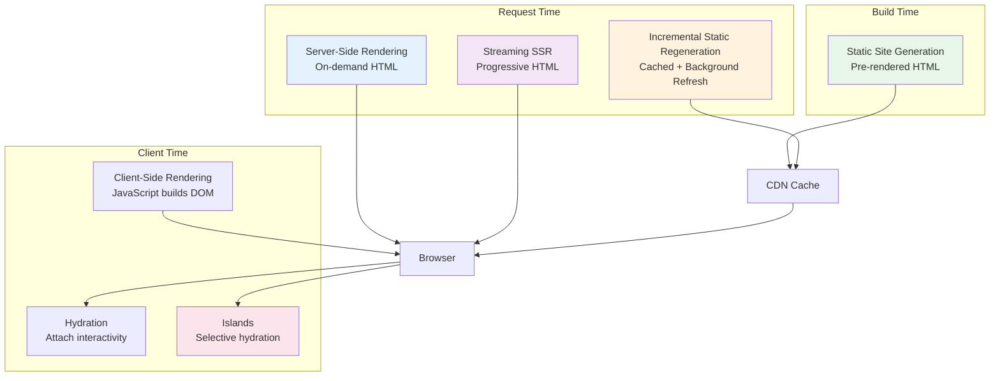

# Rendering Strategies

Choosing between CSR, SSR, SSG, and hybrid rendering is not a binary decision—it's about matching rendering strategy to content characteristics. Static content benefits from build-time rendering; dynamic, personalized content needs request-time rendering; interactive components need client-side JavaScript. Modern frameworks like Next.js 15, Astro 5, and Nuxt 3 enable mixing strategies within a single application, rendering each route—or even each component—with the optimal approach.

<figure>



<figcaption>Rendering strategies span build-time, request-time, and client-time—modern applications mix these based on content characteristics.</figcaption>
</figure>

## Abstract

Rendering strategy selection reduces to three questions:

1. **When is content known?** Build-time (SSG) vs request-time (SSR) vs client-time (CSR)
2. **How fresh must it be?** Static (cache forever) vs stale-while-revalidate (ISR) vs always-fresh (SSR)
3. **How interactive is it?** None (static HTML) vs partial (islands) vs full (SPA hydration)

The 2025 consensus:

- **Server-first rendering** dominates—React Server Components, Astro, and streaming SSR prioritize HTML delivery over JavaScript execution
- **Islands architecture** wins for content sites—ship zero JavaScript by default, hydrate only interactive components
- **Streaming SSR** replaces blocking SSR—send HTML progressively as data resolves, improving perceived performance
- **Bundle size determines INP**—Interaction to Next Paint (the new Core Web Vital) correlates directly with JavaScript shipped

The framework landscape has converged: Next.js 15 defaults to Server Components, Astro 5 ships zero JavaScript, and Nuxt 3 enables per-route rendering modes. The choice is no longer "which framework" but "which rendering mode for this content."

## The Rendering Spectrum

### Client-Side Rendering (CSR)

CSR (Client-Side Rendering) ships a minimal HTML shell and builds the DOM entirely in the browser via JavaScript. The classic SPA (Single-Page Application) approach.

**How it works:**

1. Server sends near-empty HTML with `<script>` tags
2. Browser downloads, parses, and executes JavaScript bundle
3. JavaScript fetches data and constructs DOM
4. User sees content only after JavaScript completes

```html title="index.html" collapse={1-4,8-12}
<!DOCTYPE html>
<html>
  <head>
    <title>App</title>
  </head>
  <body>
    <div id="root"></div>
    <!-- User sees blank page until this executes -->
    <script src="/bundle.js"></script>
  </body>
</html>
```

**Core Web Vitals impact:**

| Metric | Impact   | Why                             |
| ------ | -------- | ------------------------------- |
| FCP    | Poor     | No content until JS executes    |
| LCP    | Poor     | Largest element delayed by JS   |
| INP    | Poor     | Large bundles block main thread |
| CLS    | Variable | Depends on implementation       |

**Design rationale:** CSR simplifies deployment (static files only) and enables rich interactivity without server infrastructure. The trade-off is initial load performance—users wait for JavaScript before seeing content.

**When CSR makes sense:**

- Internal dashboards where SEO is irrelevant
- Highly interactive tools (Figma, Notion, Slack)
- Behind authentication (crawlers can't access anyway)
- Apps where subsequent navigation speed matters more than initial load

**When CSR is wrong:**

- Marketing sites, blogs, e-commerce (SEO-critical)
- Content-heavy pages (slow LCP hurts engagement)
- Mobile users on slow networks (large bundles timeout)

### Server-Side Rendering (SSR)

SSR (Server-Side Rendering) executes rendering logic on the server per-request, returning complete HTML. The browser displays content immediately, then hydrates for interactivity.

**How it works:**

1. Browser requests page
2. Server executes component code, fetches data, renders HTML
3. Server sends complete HTML response
4. Browser paints content immediately (FCP)
5. Browser downloads JavaScript and hydrates

```ts title="next-page.tsx" collapse={1-3,15-20}
// Next.js 15 App Router - Server Component by default
import { db } from '@/lib/db'

interface Product { id: string; name: string; price: number }

// This runs on the server every request
export default async function ProductPage({ params }: { params: { id: string } }) {
  const product = await db.products.findUnique({ where: { id: params.id } })

  return (
    <main>
      <h1>{product.name}</h1>
      <p>${product.price}</p>
    </main>
  )
}
```

**Core Web Vitals impact:**

| Metric | Impact   | Why                            |
| ------ | -------- | ------------------------------ |
| FCP    | Good     | HTML arrives ready to paint    |
| LCP    | Good     | Content visible before JS      |
| INP    | Good     | Smaller bundles (RSC)          |
| TTFB   | Variable | Depends on server/data latency |

**Design rationale:** SSR prioritizes content visibility. Users see meaningful content while JavaScript loads in the background. The trade-off is server load—every request requires compute.

**TTFB considerations:**

SSR's TTFB depends on the slowest data fetch. If a page needs data from three APIs, TTFB = max(api1, api2, api3) + render time. Streaming SSR addresses this by sending HTML progressively.

**When SSR makes sense:**

- SEO-critical dynamic content (search results, product pages)
- Personalized content that can't be pre-rendered
- Pages with fast data sources
- When server infrastructure is available

### Static Site Generation (SSG)

SSG (Static Site Generation) renders pages at build time, producing static HTML files served from CDN. No server compute at request time.

**How it works:**

1. Build process fetches all data
2. Framework renders every page to HTML
3. HTML files deployed to CDN edge
4. Users receive pre-built HTML instantly
5. Optional: hydration for interactivity

```ts title="astro-page.astro" collapse={1-2,16-20}
---
// Astro - runs at build time only
const posts = await fetch('https://api.example.com/posts').then(r => r.json())
---

<html>
  <body>
    <h1>Blog Posts</h1>
    <ul>
      {posts.map(post => (
        <li><a href={`/posts/${post.slug}`}>{post.title}</a></li>
      ))}
    </ul>
  </body>
</html>
```

**Core Web Vitals impact:**

| Metric | Impact    | Why                       |
| ------ | --------- | ------------------------- |
| FCP    | Excellent | CDN serves pre-built HTML |
| LCP    | Excellent | No server processing      |
| INP    | Excellent | Minimal/no JavaScript     |
| TTFB   | Excellent | Edge-cached responses     |

**Design rationale:** SSG maximizes performance by eliminating request-time compute. Content is determined at build time and cached globally. The trade-off is staleness—updates require rebuilds.

**Astro's approach:**

Astro exemplifies modern SSG. It renders pages at build time and ships zero JavaScript by default. Interactive components ("islands") opt-in to client-side JavaScript.

> "Astro is designed to be fast. Astro websites load 40% faster and use 90% less JavaScript than sites built with other popular web frameworks."
> — Astro Documentation

**When SSG makes sense:**

- Documentation sites
- Marketing pages
- Blogs with infrequent updates
- E-commerce product catalogs (with ISR for freshness)

**When SSG is wrong:**

- Highly personalized content
- Real-time data (stock prices, live scores)
- Sites with thousands of pages and frequent updates

### Incremental Static Regeneration (ISR)

ISR combines static performance with dynamic freshness. Pages are pre-rendered but regenerate in the background after a configurable interval.

**How it works (Next.js 15):**

1. First request: serve pre-built static page
2. After `revalidate` period expires: serve stale, trigger background regeneration
3. Next request: serve freshly regenerated page
4. Repeat

```ts title="next-isr.tsx" collapse={1-3,18-25}
// Next.js 15 App Router - Time-based revalidation
import { db } from '@/lib/db'

// Regenerate this page every 60 seconds
export const revalidate = 60

export default async function ProductPage({ params }: { params: { id: string } }) {
  const product = await db.products.findUnique({ where: { id: params.id } })

  return (
    <main>
      <h1>{product.name}</h1>
      <p>${product.price}</p>
      <p>Last updated: {new Date().toISOString()}</p>
    </main>
  )
}
```

**On-demand revalidation:**

For immediate updates (CMS publish, inventory change), trigger revalidation explicitly:

```ts title="revalidate-action.ts" collapse={1-2}
"use server"
import { revalidatePath, revalidateTag } from "next/cache"

// Revalidate specific path
export async function publishPost(slug: string) {
  await db.posts.publish(slug)
  revalidatePath(`/posts/${slug}`)
}

// Revalidate by cache tag
export async function updateInventory(productId: string) {
  await db.inventory.update(productId)
  revalidateTag("products")
}
```

**Design rationale:** ISR solves the staleness problem of SSG without SSR's per-request compute. Most requests hit cache; regeneration happens asynchronously. The trade-off is complexity—cache invalidation requires explicit management.

**When ISR makes sense:**

- E-commerce with frequent price/inventory changes
- News sites with editorial workflow
- Content sites with thousands of pages
- Any SSG use case that needs freshness

## Streaming and Progressive Rendering

### Streaming SSR

Traditional SSR blocks until all data is ready, then sends the complete HTML. Streaming SSR sends HTML progressively as data resolves.

**How `renderToPipeableStream` works (React 18+):**

```ts title="server.ts" collapse={1-4,20-30}
import { renderToPipeableStream } from 'react-dom/server'
import { createServer } from 'http'

createServer((req, res) => {
  const { pipe } = renderToPipeableStream(<App />, {
    bootstrapScripts: ['/main.js'],
    onShellReady() {
      // Shell (layout, navigation) ready - start streaming
      res.setHeader('Content-Type', 'text/html')
      pipe(res)
    },
    onShellError(error) {
      // Error before any HTML sent - can redirect/show error page
      res.statusCode = 500
      res.end('Error')
    },
    onAllReady() {
      // All Suspense boundaries resolved - useful for crawlers
    },
  })
}).listen(3000)
```

**Progressive rendering with Suspense:**

```tsx title="page.tsx" collapse={1-5,25-35}
import { Suspense } from "react"

async function SlowComponent() {
  const data = await fetch("https://slow-api.example.com/data")
  return <div>{data.json().content}</div>
}

export default function Page() {
  return (
    <html>
      <body>
        {/* Shell streams immediately */}
        <header>Site Header</header>
        <nav>Navigation</nav>

        {/* Content streams as ready */}
        <Suspense fallback={<p>Loading...</p>}>
          <SlowComponent />
        </Suspense>

        <footer>Site Footer</footer>
      </body>
    </html>
  )
}
```

**What the user sees:**

1. **Instant:** Header, navigation, footer, "Loading..." placeholder
2. **When data ready:** Placeholder replaced with actual content (no page refresh)

**Design rationale:** Streaming decouples TTFB from slowest data fetch. Users see the page structure immediately; content fills in progressively. The browser can start parsing and rendering before the response completes.

**Shopify Hydrogen results:**

Shopify's Hydrogen framework (React Server Components + Streaming) achieves:

- Sub-50ms TTFB on Oxygen CDN (V8 Isolates)
- Progressive hydration reduces TTI
- No client round-trips—data embedded in streaming HTML

### Out-of-Order Streaming

Suspense boundaries can resolve in any order. The browser receives placeholder slots and fills them as data arrives:

```html
<!-- Initial stream -->
<html>
  <body>
    <header>Header</header>
    <!--$?--><template id="B:0"></template>
    <p>Loading...</p>
    <!--/$-->
    <footer>Footer</footer>
  </body>
</html>

<!-- Later stream (injected at end of document) -->
<script>
  // React replaces placeholder with resolved content
  $RC("B:0", "<div>Actual content from slow API</div>")
</script>
```

**Design rationale:** Out-of-order streaming maximizes parallelism. Fast data sources render immediately; slow sources don't block the page. The technique uses inline scripts to swap placeholders after they stream.

## Hydration Deep Dive

### Full Hydration Process

Hydration attaches React's event handlers and state management to server-rendered HTML. The browser receives static HTML, then React "hydrates" it to make it interactive.

**The hydration sequence:**

1. **Server renders HTML** → complete DOM structure
2. **Browser receives HTML** → displays immediately (FCP)
3. **Browser downloads JavaScript** → React bundle loads
4. **`hydrateRoot` called** → React attaches to existing DOM
5. **Event handlers attached** → page becomes interactive

```ts title="client.tsx" collapse={1-2,8-15}
import { hydrateRoot } from 'react-dom/client'
import App from './App'

// React expects DOM to match what it would render
const root = document.getElementById('root')
hydrateRoot(root, <App />)
```

**Critical constraint:** Server and client must produce identical HTML. React compares the server-rendered DOM against what it would render; mismatches cause errors and visual glitches.

### Hydration Mismatches

Mismatches occur when server and client render different content. Common causes:

**1. Browser-only APIs:**

```tsx
// ❌ Mismatch: window doesn't exist on server
function Component() {
  return <div>{window.innerWidth}px</div>
}

// ✅ Fixed: defer to client
function Component() {
  const [width, setWidth] = useState<number | null>(null)

  useEffect(() => {
    setWidth(window.innerWidth)
  }, [])

  return <div>{width ?? "Loading..."}px</div>
}
```

**2. Date/time rendering:**

```tsx
// ❌ Mismatch: server and client have different times
function Component() {
  return <span>{new Date().toLocaleString()}</span>
}

// ✅ Fixed: render on client only
function Component() {
  const [time, setTime] = useState<string | null>(null)

  useEffect(() => {
    setTime(new Date().toLocaleString())
  }, [])

  return <span suppressHydrationWarning>{time ?? ""}</span>
}
```

**3. Conditional rendering:**

```tsx
// ❌ Mismatch: typeof window differs
function Component() {
  if (typeof window !== "undefined") {
    return <ClientOnlyFeature />
  }
  return null
}

// ✅ Fixed: state-based detection
function Component() {
  const [mounted, setMounted] = useState(false)

  useEffect(() => {
    setMounted(true)
  }, [])

  if (!mounted) return null
  return <ClientOnlyFeature />
}
```

**Debugging mismatches:**

1. Check browser console for hydration warnings (React 18+ provides detailed messages)
2. Compare server HTML (`view-source:`) with client render
3. Search for `typeof window`, `navigator`, `document` in render paths
4. Check timezone-dependent formatting

### React 18 Selective Hydration

React 18 enables selective hydration—components wrapped in Suspense can hydrate independently:

```tsx title="selective-hydration.tsx" collapse={1-3,20-25}
import { Suspense } from "react"

function Page() {
  return (
    <div>
      <header>Always hydrates first</header>

      <Suspense fallback={<p>Loading sidebar...</p>}>
        <Sidebar /> {/* Hydrates when ready */}
      </Suspense>

      <Suspense fallback={<p>Loading content...</p>}>
        <MainContent /> {/* Hydrates independently */}
      </Suspense>
    </div>
  )
}
```

**How it works:**

- React prioritizes hydrating components the user interacts with
- Clicking a not-yet-hydrated component triggers priority hydration
- Other Suspense boundaries continue hydrating in background

**Design rationale:** Selective hydration improves perceived interactivity. The header becomes interactive immediately; heavy components hydrate progressively without blocking the page.

## Islands Architecture

### The Islands Model

Islands architecture renders most of the page as static HTML and hydrates only interactive "islands." Each island is independent—different frameworks can coexist.

**Core concept:**

```
┌─────────────────────────────────────────────┐
│  Static HTML (no JavaScript)                │
│  ┌─────────┐     ┌──────────────┐           │
│  │ Island  │     │   Island     │           │
│  │ (React) │     │   (Vue)      │           │
│  │ 3KB JS  │     │   5KB JS     │           │
│  └─────────┘     └──────────────┘           │
│                                             │
│  More static content...                     │
│                                             │
│  ┌────────────────────────────┐             │
│  │       Island (Svelte)      │             │
│  │          8KB JS            │             │
│  └────────────────────────────┘             │
└─────────────────────────────────────────────┘

Total JS: 16KB (vs 200KB+ for full hydration)
```

### Astro Islands

Astro implements islands with the `client:*` directives:

```astro title="page.astro" collapse={1-5}
---
import Header from "./Header.astro" // Static, no JS
import Search from "./Search.tsx" // Interactive island
import Footer from "./Footer.astro" // Static, no JS
---

<html>
  <body>
    <Header />

    <!-- Hydrates on page load -->
    <Search client:load />

    <!-- Hydrates when visible in viewport -->
    <Newsletter client:visible />

    <!-- Hydrates on first interaction -->
    <Comments client:idle />

    <!-- Never hydrates (server-only) -->
    <Analytics />

    <Footer />
  </body>
</html>
```

**Hydration directives:**

| Directive        | When Hydrates        | Use Case                 |
| ---------------- | -------------------- | ------------------------ |
| `client:load`    | Immediately          | Above-fold interactivity |
| `client:idle`    | Browser idle         | Below-fold, non-critical |
| `client:visible` | In viewport          | Lazy components          |
| `client:media`   | Media query matches  | Responsive features      |
| `client:only`    | Client-only (no SSR) | Browser-only components  |

**Design rationale:** Islands invert the default. Instead of "hydrate everything, optimize later," islands are "hydrate nothing, add JavaScript where needed." This produces dramatically smaller bundles.

### Fresh (Deno)

Fresh implements islands without a build step:

```tsx title="routes/index.tsx" collapse={1-2,18-25}
// Route - server-rendered
import Counter from "../islands/Counter.tsx"

export default function Home() {
  return (
    <div>
      <h1>Welcome</h1>
      <p>This is static HTML</p>

      {/* Island - hydrates on client */}
      <Counter start={3} />
    </div>
  )
}

// islands/Counter.tsx - client-side JavaScript
import { useState } from "preact/hooks"

export default function Counter({ start }: { start: number }) {
  const [count, setCount] = useState(start)
  return <button onClick={() => setCount((c) => c + 1)}>{count}</button>
}
```

**Design decisions:**

- No build step—TypeScript compiled on-demand via Deno
- Islands in `islands/` directory automatically hydrated
- Uses Preact (3KB) instead of React (40KB)
- Zero JavaScript by default

### Partial Hydration vs Islands

**Partial hydration:** Framework hydrates a subset of components, but all components come from the same framework. React's selective hydration is partial hydration.

**Islands:** Each island is independent. Different frameworks can coexist. No shared runtime overhead between islands.

The distinction matters for bundle size. Partial hydration still loads React for the entire page; islands load only what each component needs.

## React Server Components

### RSC vs SSR

React Server Components (RSC) and Server-Side Rendering (SSR) are complementary, not alternatives.

| Aspect        | SSR                          | RSC                                      |
| ------------- | ---------------------------- | ---------------------------------------- |
| Runs on       | Server (per-request)         | Server (can be cached)                   |
| Output        | HTML string                  | React element tree (serialized)          |
| Client bundle | Full app code                | Only Client Components                   |
| Hooks allowed | All                          | None (`useState`, `useEffect` forbidden) |
| Data fetching | `getServerSideProps` / fetch | Direct `async` functions                 |
| Interactivity | After hydration              | Client Components only                   |

**How RSC works:**

1. Server renders Server Components into serialized React tree
2. Tree includes references to Client Components (not their code)
3. Client receives serialized tree + Client Component bundles
4. Client renders tree, loading Client Components as needed

```tsx title="rsc-example.tsx" collapse={1-4,22-30}
// Server Component - NOT shipped to client
import { db } from "@/lib/db"
import { formatMarkdown } from "@/lib/markdown" // 50KB library stays on server
import LikeButton from "./LikeButton" // Client Component

async function BlogPost({ id }: { id: string }) {
  const post = await db.posts.findUnique({ where: { id } })
  const html = formatMarkdown(post.content) // Heavy library, zero client cost

  return (
    <article>
      <h1>{post.title}</h1>
      <div dangerouslySetInnerHTML={{ __html: html }} />

      {/* Client Component - this code ships to client */}
      <LikeButton postId={id} />
    </article>
  )
}

// Client Component - marked explicitly
;("use client")
import { useState } from "react"

export default function LikeButton({ postId }: { postId: string }) {
  const [liked, setLiked] = useState(false)
  return <button onClick={() => setLiked(!liked)}>{liked ? "❤️" : "🤍"}</button>
}
```

**Bundle size impact:**

Traditional React: `marked` (50KB), `sanitize-html` (25KB), and every component ship to client.

RSC: Only `LikeButton` (and its dependencies) ship to client. Markdown processing happens on server.

### Server Actions

RSC enables Server Actions—functions that execute on the server, called from the client:

```tsx title="server-actions.tsx" collapse={1-2,20-30}
"use server"
import { db } from "@/lib/db"

export async function addComment(postId: string, content: string) {
  await db.comments.create({
    data: { postId, content, createdAt: new Date() },
  })
  // Revalidate the post page
  revalidatePath(`/posts/${postId}`)
}

// Client Component using Server Action
;("use client")
import { addComment } from "./actions"

function CommentForm({ postId }: { postId: string }) {
  return (
    <form action={addComment.bind(null, postId)}>
      <input name="content" />
      <button type="submit">Post</button>
    </form>
  )
}
```

**Design rationale:** Server Actions eliminate the need for API routes in many cases. Form submissions call server functions directly, with automatic serialization and error handling.

### RSC Constraints

Server Components cannot:

- Use `useState`, `useReducer`, `useEffect`, or other client hooks
- Access browser APIs (`window`, `document`)
- Use event handlers (`onClick`, `onChange`)
- Be rendered conditionally based on client state

These constraints enable the zero-bundle benefit. If a component needs interactivity, mark it `'use client'`.

## Resumability: Beyond Hydration

### Qwik's Approach

Qwik eliminates hydration entirely through "resumability." Instead of replaying component logic on the client, Qwik serializes execution state and resumes exactly where the server left off.

**Hydration vs Resumability:**

| Aspect              | Hydration                 | Resumability                    |
| ------------------- | ------------------------- | ------------------------------- |
| Client startup      | Re-execute all components | Resume from serialized state    |
| JavaScript loaded   | Entire app (or chunks)    | Only for triggered interactions |
| Time to Interactive | After hydration completes | Near-instant                    |
| Memory at load      | Full React tree           | Minimal                         |

**How Qwik works:**

1. Server renders HTML with serialized state in attributes
2. Client loads minimal Qwik runtime (~1KB)
3. On interaction, Qwik lazy-loads only the relevant event handler
4. Component state resumes from serialized data

```tsx title="qwik-example.tsx" collapse={1-2,15-20}
import { component$, useSignal } from "@builder.io/qwik"

export const Counter = component$(() => {
  const count = useSignal(0)

  return <button onClick$={() => count.value++}>Count: {count.value}</button>
})

// Rendered HTML includes serialized state:
// <button on:click="q-abc123">Count: 0</button>
// On click, Qwik fetches only the click handler code
```

**Design rationale:** Hydration assumes the client must understand the component tree before interactivity. Resumability questions this assumption—why re-execute code that already ran on the server? By serializing execution state, Qwik achieves near-instant interactivity.

**Trade-offs:**

- ✅ Sub-second TTI on mobile
- ✅ Minimal initial JavaScript
- ❌ Different mental model from React/Vue
- ❌ Smaller ecosystem
- ❌ Serialization overhead for complex state

## Framework Comparison

### Next.js 15

**Default behavior:** Server Components (RSC) in App Router

**Rendering modes:**

| Mode      | Config                                   | Use Case                       |
| --------- | ---------------------------------------- | ------------------------------ |
| Static    | `export const dynamic = 'force-static'`  | Build-time rendering           |
| Dynamic   | `export const dynamic = 'force-dynamic'` | Per-request rendering          |
| ISR       | `export const revalidate = 60`           | Cached with background refresh |
| Streaming | Suspense boundaries                      | Progressive rendering          |

**Partial Prerendering (PPR):**

Next.js 15 introduces PPR—combining static shells with dynamic content:

```tsx title="ppr-page.tsx" collapse={1-3,20-25}
import { Suspense } from "react"

// next.config.ts: cacheComponents: true
export default function ProductPage({ params }) {
  return (
    <main>
      {/* Static shell - prerendered at build */}
      <Header />
      <ProductInfo id={params.id} />

      {/* Dynamic content - streams at request time */}
      <Suspense fallback={<PriceSkeleton />}>
        <LivePrice id={params.id} />
      </Suspense>

      <Footer />
    </main>
  )
}
```

### Astro 5

**Default behavior:** Zero JavaScript, static output

**Rendering modes:**

```ts title="astro.config.mjs"
export default defineConfig({
  output: "static", // Full SSG (default)
  // output: 'server',   // Full SSR
  // output: 'hybrid',   // Per-page control
})
```

**Hybrid rendering:**

```astro
---
// Force server rendering for this page
export const prerender = false
---

<html>
  <body>
    <UserDashboard />
  </body>
</html>
```

**Strengths:**

- Fastest static sites (40% faster than React equivalents)
- Framework-agnostic islands (React, Vue, Svelte, Solid)
- Content-first architecture

### Nuxt 3

**Default behavior:** Universal rendering (SSR + hydration)

**Rendering modes per route:**

```ts title="nuxt.config.ts"
export default defineNuxtConfig({
  routeRules: {
    "/": { prerender: true }, // Static
    "/blog/**": { isr: 60 }, // ISR
    "/admin/**": { ssr: false }, // Client-only
    "/api/**": { cors: true }, // API routes
  },
})
```

**Strengths:**

- Vue 3 Composition API
- Nitro server engine (edge-deployable)
- Mature hybrid rendering

### Decision Matrix

| Factor            | Next.js 15    | Astro 5      | Nuxt 3         | Qwik             |
| ----------------- | ------------- | ------------ | -------------- | ---------------- |
| Default JS        | RSC (minimal) | Zero         | Full hydration | Zero (resumable) |
| Framework lock-in | React         | None         | Vue            | Qwik             |
| SSG               | ✅            | ✅ (primary) | ✅             | ✅               |
| SSR               | ✅            | ✅           | ✅             | ✅               |
| Streaming         | ✅            | ✅           | ✅             | ✅               |
| Islands           | Via RSC       | Native       | Nuxt Islands   | Native           |
| Learning curve    | Moderate      | Low          | Moderate       | High             |
| Ecosystem         | Largest       | Growing      | Large (Vue)    | Small            |

## Real-World Implementations

### Shopify Hydrogen

**Challenge:** E-commerce storefronts with dynamic pricing, inventory, personalization

**Approach:**

- React Server Components for product pages
- Streaming SSR for progressive rendering
- Edge deployment on Oxygen (V8 Isolates)
- Cache at CDN, invalidate on inventory changes

**Results:**

- Sub-50ms TTFB from edge
- Zero client-side data fetching for product info
- Progressive hydration reduces TTI

**Key insight:** RSC eliminates the "client-side fetch waterfall" problem. Product data embeds directly in the streamed HTML.

### Vercel Commerce

**Challenge:** Reference e-commerce implementation showcasing Next.js

**Approach:**

- Next.js App Router with RSC
- ISR for product catalog (revalidate on webhook)
- Streaming for search results
- Edge middleware for geolocation/personalization

**Architecture:**

```
Request → Edge Middleware (geo, A/B) → ISR Cache → Origin (if miss)
                                           ↓
                                    Streaming Response
```

### The Guardian

**Challenge:** News site with millions of pages, real-time updates

**Approach:**

- Server-rendered articles
- Incremental regeneration for breaking news
- Islands for interactive elements (comments, live blogs)
- Aggressive caching at CDN

**Key insight:** News content is mostly static with pockets of interactivity. Islands architecture matches this perfectly—static article body, interactive comment section.

## Performance Optimization

### Core Web Vitals Alignment

As of 2025, Core Web Vitals are:

| Metric | Target  | Rendering Impact        |
| ------ | ------- | ----------------------- |
| LCP    | < 2.5s  | SSG/ISR > SSR > CSR     |
| INP    | < 200ms | Less JS = better INP    |
| CLS    | < 0.1   | Streaming can help/hurt |

**INP optimization:**

INP (Interaction to Next Paint) replaced TTI as the interactivity metric. It measures responsiveness to user interactions, not initial load. Large JavaScript bundles degrade INP because they compete for main thread time.

Strategies:

1. **Ship less JavaScript** — RSC, islands, code splitting
2. **Defer non-critical JS** — `client:idle`, `client:visible`
3. **Avoid layout thrashing** — batch DOM reads/writes
4. **Use Web Workers** — offload computation

### Measuring Real-World Impact

```ts title="web-vitals.ts" collapse={1-3,18-25}
import { onLCP, onINP, onCLS } from "web-vitals"

function sendToAnalytics(metric) {
  // Send to your analytics endpoint
  fetch("/api/vitals", {
    method: "POST",
    body: JSON.stringify({
      name: metric.name,
      value: metric.value,
      id: metric.id,
    }),
  })
}

onLCP(sendToAnalytics)
onINP(sendToAnalytics)
onCLS(sendToAnalytics)
```

### Strategy Selection by Use Case

| Use Case           | Primary Strategy | Fallback                 |
| ------------------ | ---------------- | ------------------------ |
| Marketing site     | SSG + Islands    | ISR for dynamic sections |
| E-commerce catalog | ISR              | On-demand revalidation   |
| Dashboard          | CSR              | —                        |
| Blog               | SSG              | ISR for comments         |
| News site          | SSR + Streaming  | ISR for archive          |
| SaaS app           | RSC + Streaming  | CSR for complex widgets  |

## Conclusion

Rendering strategy selection is no longer framework-constrained—modern tools support multiple modes. The decision reduces to content characteristics:

1. **Static content** → SSG (Astro, Next.js static export)
2. **Dynamic but cacheable** → ISR (Next.js, Nuxt)
3. **Personalized/real-time** → SSR + Streaming
4. **Highly interactive** → CSR or RSC with Client Components
5. **Mixed** → Islands (Astro) or RSC (Next.js)

The trend is server-first: render on the server, ship minimal JavaScript, hydrate selectively. React Server Components and islands architecture represent convergent evolution toward this model.

For new projects: start with the minimal JavaScript approach (Astro for content, Next.js RSC for apps) and add interactivity where needed. The performance benefits of shipping less JavaScript compound—better Core Web Vitals, lower hosting costs, broader device support.

## Appendix

### Prerequisites

- HTML/CSS fundamentals and DOM understanding
- JavaScript execution model (event loop, main thread)
- React component model (or equivalent framework knowledge)
- HTTP caching basics (Cache-Control, CDN concepts)

### Terminology

| Term             | Definition                                                   |
| ---------------- | ------------------------------------------------------------ |
| **CSR**          | Client-Side Rendering—building DOM in browser via JavaScript |
| **SSR**          | Server-Side Rendering—generating HTML on server per-request  |
| **SSG**          | Static Site Generation—pre-rendering HTML at build time      |
| **ISR**          | Incremental Static Regeneration—SSG with background refresh  |
| **Hydration**    | Attaching JavaScript interactivity to server-rendered HTML   |
| **Islands**      | Independent interactive components in otherwise static pages |
| **RSC**          | React Server Components—components that run only on server   |
| **TTFB**         | Time to First Byte—server response latency                   |
| **FCP**          | First Contentful Paint—when first content appears            |
| **LCP**          | Largest Contentful Paint—when main content is visible        |
| **INP**          | Interaction to Next Paint—responsiveness to user input       |
| **Resumability** | Continuing server execution on client without replay         |

### Summary

- **Match strategy to content:** static → SSG, dynamic → SSR, personalized → CSR
- **Server-first wins:** RSC and islands ship less JavaScript, improving INP
- **Streaming improves perceived performance:** send HTML progressively, don't block on slowest data
- **Hydration has costs:** consider islands or resumability for content-heavy sites
- **ISR bridges static and dynamic:** cache-first with background refresh
- **INP is the new TTI:** JavaScript bundle size directly impacts interactivity metrics

### References

- [React Server Components - React Documentation](https://react.dev/reference/rsc/server-components) — Official RSC specification and patterns
- [renderToPipeableStream - React DOM Server](https://react.dev/reference/react-dom/server/renderToPipeableStream) — Streaming SSR API reference
- [hydrateRoot - React DOM Client](https://react.dev/reference/react-dom/client/hydrateRoot) — Hydration API and constraints
- [Next.js App Router Documentation](https://nextjs.org/docs/app) — RSC, streaming, and rendering modes
- [Next.js ISR Documentation](https://nextjs.org/docs/app/building-your-application/data-fetching/incremental-static-regeneration) — Incremental regeneration patterns
- [Astro Documentation](https://docs.astro.build/) — Islands architecture and zero-JS approach
- [Astro: Why Astro?](https://docs.astro.build/en/concepts/why-astro/) — Performance philosophy and benchmarks
- [Nuxt 3 Rendering Modes](https://nuxt.com/docs/guide/concepts/rendering) — Hybrid rendering configuration
- [Qwik Resumability](https://qwik.dev/docs/concepts/resumable/) — Alternative to hydration
- [Rendering on the Web - web.dev](https://web.dev/articles/rendering-on-the-web) — Google's rendering strategy guide
- [Shopify Hydrogen Best Practices](https://shopify.engineering/react-server-components-best-practices-hydrogen) — Production RSC patterns
- [Core Web Vitals - web.dev](https://web.dev/articles/vitals) — LCP, INP, CLS definitions and targets
