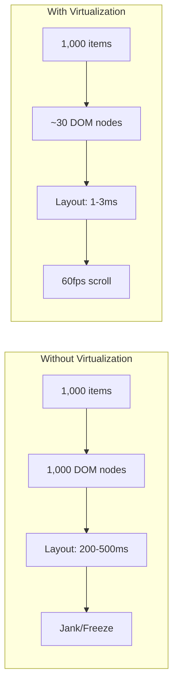
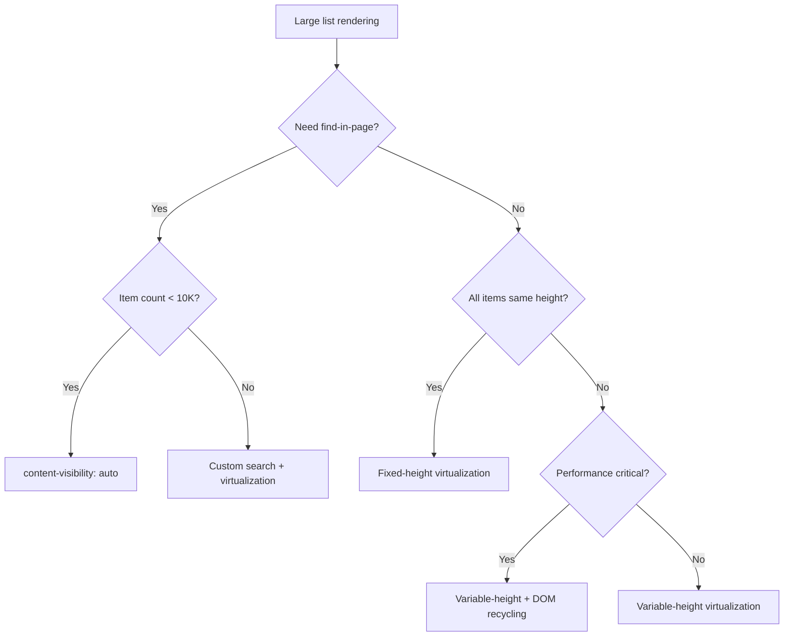

# Virtualization and Windowing

Rendering large lists (1,000+ items) without virtualization creates a DOM tree so large that layout calculations alone can block the main thread for hundreds of milliseconds. Virtualization solves this by rendering only visible items plus a small buffer, keeping DOM node count constant regardless of list size. The trade-off: implementation complexity for consistent O(viewport) rendering performance.

<figure>



<figcaption>Virtualization trades algorithmic complexity for constant DOM size, keeping frame times under the 16ms budget.</figcaption>
</figure>

## Abstract

Virtualization is a **viewport-centric rendering strategy**: calculate which items are visible, render only those plus a buffer (overscan), and position them using GPU-accelerated transforms. The core insight is that users can only see viewport-sized content at any moment—rendering everything else is wasted work.

Three implementation approaches exist:

1. **Fixed-height**: Pure math-based positioning when all items are identical height. Simplest, fastest, but rarely applicable to real content.
2. **Variable-height**: Measure items as they render, cache heights, estimate unmeasured items. Production standard for dynamic content.
3. **DOM recycling**: Reuse DOM nodes as items scroll out, updating content rather than creating/destroying elements.

Critical constraints shape the design:

- **Frame budget**: 16ms per frame for 60fps, ~12ms after browser overhead
- **Transform positioning**: GPU-accelerated `translateY()` vs layout-triggering `top`
- **Measurement APIs**: ResizeObserver for heights, IntersectionObserver for visibility
- **Accessibility**: Screen readers require ARIA live regions; keyboard navigation requires focus management

A newer alternative, CSS `content-visibility: auto`, defers rendering while keeping full DOM—enabling browser find-in-page and anchor links that virtualization breaks.

## The Challenge

### Browser Constraints

The browser's rendering pipeline processes elements sequentially:

1. **Style** - Match CSS rules to elements
2. **Layout** - Calculate element geometry (expensive, proportional to DOM size)
3. **Paint** - Fill pixels for colors, text, shadows
4. **Composite** - Assemble layers, apply GPU transforms

Layout is the bottleneck. As documented in Chrome DevTools performance analysis, layout time scales with DOM size because the engine must resolve every element's position relative to its ancestors and siblings.

**Main thread budget**: At 60fps, each frame has 16ms total. The browser consumes ~4ms for its own work, leaving 10-12ms for JavaScript execution, style recalculation, and layout combined. A single layout pass on 1,000 elements can exceed this entirely.

**Memory pressure**: Each DOM node consumes memory for its JavaScript wrapper, style data, and layout information. On low-end mobile devices with 50-100MB practical limits, 10,000+ nodes can trigger garbage collection pauses or crashes.

### When Virtualization Becomes Necessary

| Item Count | Without Virtualization                   | With Virtualization |
| ---------- | ---------------------------------------- | ------------------- |
| 50-100     | Acceptable on desktop, measure on mobile | Optional            |
| 500+       | Noticeable jank on scroll                | Recommended         |
| 1,000+     | Severe degradation, blocked frames       | Required            |
| 10,000+    | Unusable                                 | Only viable path    |

### User Experience Requirements

- **Perceived smoothness**: Scroll must feel native (60fps, no jumps)
- **Instant response**: Arrow key navigation, click handling under 100ms
- **Scroll position stability**: Jumping to arbitrary positions via scrollbar must work
- **Find-in-page**: Users expect Cmd/Ctrl+F to search all content (virtualization breaks this)

## Design Paths

### Path 1: Fixed-Height Virtualization

**How it works:**

When all items share identical height, positioning is pure arithmetic—no measurement required.

```typescript title="fixed-height-virtualizer.ts" collapse={1-3,29-35}
import { useState, useCallback } from 'react';

interface FixedVirtualizerProps<T> {
  items: T[];
  itemHeight: number;
  containerHeight: number;
  overscan?: number;
  renderItem: (item: T, index: number) => React.ReactNode;
}

function FixedVirtualizer<T>({
  items,
  itemHeight,
  containerHeight,
  overscan = 3,
  renderItem,
}: FixedVirtualizerProps<T>) {
  const [scrollTop, setScrollTop] = useState(0);

  // Calculate visible range using arithmetic only
  const startIndex = Math.max(0, Math.floor(scrollTop / itemHeight) - overscan);
  const endIndex = Math.min(
    items.length,
    Math.ceil((scrollTop + containerHeight) / itemHeight) + overscan
  );

  const visibleItems = items.slice(startIndex, endIndex);
  const offsetY = startIndex * itemHeight;
  const totalHeight = items.length * itemHeight;

  const handleScroll = useCallback((e: React.UIEvent<HTMLDivElement>) => {
    setScrollTop(e.currentTarget.scrollTop);
  }, []);

  return (
    <div style={{ height: containerHeight, overflow: 'auto' }} onScroll={handleScroll}>
      <div style={{ height: totalHeight, position: 'relative' }}>
        <div style={{ transform: `translateY(${offsetY}px)` }}>
          {visibleItems.map((item, i) => (
            <div key={startIndex + i} style={{ height: itemHeight }}>
              {renderItem(item, startIndex + i)}
            </div>
          ))}
        </div>
      </div>
    </div>
  );
}
```

**Why `transform` instead of `top`:**

- `transform: translateY()` is compositor-only—GPU handles it without triggering layout
- `top` or `margin-top` triggers full layout recalculation on every scroll frame
- This single choice can be the difference between 60fps and 15fps scrolling

**Performance characteristics:**

| Metric                    | Value                           |
| ------------------------- | ------------------------------- |
| DOM nodes                 | O(viewport) — typically 20-50   |
| Layout time               | 1-3ms per frame                 |
| Memory                    | O(viewport) — no caching needed |
| Scroll performance        | Consistent 60fps                |
| Implementation complexity | Low                             |

**Best for:**

- Log viewers with monospace text
- Simple data tables with uniform rows
- Chat applications with text-only messages
- Any list where enforcing fixed height is acceptable

**Trade-offs:**

- ✅ Simplest implementation, smallest bundle contribution
- ✅ Predictable performance—pure math, no measurement
- ✅ No height cache memory overhead
- ❌ Real content (images, variable text, expandable sections) rarely fits
- ❌ Forces design constraints on UI

**Real-world example:**

VS Code's minimap uses fixed-height line rendering. Each line is represented at a consistent pixel height regardless of content wrapping in the main editor. This enables sub-millisecond position calculations for files with 100K+ lines.

### Path 2: Variable-Height Virtualization

**How it works:**

Items are measured as they render using ResizeObserver. A height cache stores measurements indexed by item. Unmeasured items use an estimated height.

```typescript title="variable-height-virtualizer.ts" collapse={1-5,60-80}
import { useState, useEffect, useRef, useCallback } from "react"

interface VariableVirtualizerProps<T> {
  items: T[]
  estimatedItemHeight: number
  containerHeight: number
  overscan?: number
  renderItem: (item: T, index: number, measureRef: (el: HTMLElement | null) => void) => React.ReactNode
}

function VariableVirtualizer<T>({
  items,
  estimatedItemHeight,
  containerHeight,
  overscan = 3,
  renderItem,
}: VariableVirtualizerProps<T>) {
  const [scrollTop, setScrollTop] = useState(0)
  const [heightCache, setHeightCache] = useState<Map<number, number>>(new Map())

  // Calculate positions with measured or estimated heights
  const getItemOffset = (index: number): number => {
    let offset = 0
    for (let i = 0; i < index; i++) {
      offset += heightCache.get(i) ?? estimatedItemHeight
    }
    return offset
  }

  // Binary search to find start index from scroll position
  const findStartIndex = (scrollPos: number): number => {
    let low = 0,
      high = items.length - 1
    while (low < high) {
      const mid = Math.floor((low + high) / 2)
      if (getItemOffset(mid + 1) <= scrollPos) {
        low = mid + 1
      } else {
        high = mid
      }
    }
    return Math.max(0, low - overscan)
  }

  const startIndex = findStartIndex(scrollTop)

  // Find end index by accumulating heights until we exceed viewport
  let endIndex = startIndex
  let accumulatedHeight = 0
  while (endIndex < items.length && accumulatedHeight < containerHeight + overscan * estimatedItemHeight) {
    accumulatedHeight += heightCache.get(endIndex) ?? estimatedItemHeight
    endIndex++
  }
  endIndex = Math.min(items.length, endIndex + overscan)

  const totalHeight = getItemOffset(items.length)
  const offsetY = getItemOffset(startIndex)

  // Measure items as they render
  const measureElement = useCallback(
    (index: number) => (el: HTMLElement | null) => {
      if (el) {
        const observer = new ResizeObserver(([entry]) => {
          const height = entry.contentRect.height
          setHeightCache((prev) => {
            if (prev.get(index) === height) return prev
            const next = new Map(prev)
            next.set(index, height)
            return next
          })
        })
        observer.observe(el)
        return () => observer.disconnect()
      }
    },
    [],
  )

  // ... scroll handler and render logic
}
```

**The estimation problem:**

When users drag the scrollbar to an arbitrary position, the virtualizer must render items that haven't been measured. Initial render uses estimates, which may be wrong—causing a visible "jump" as measurements arrive and positions correct.

**Mitigation strategies:**

1. **Running average**: Track average measured height, use for estimates
2. **Type-based estimates**: If items have types (text, image, card), use type-specific averages
3. **Larger buffers**: Overscan more items to catch estimation errors before they're visible
4. **Progressive correction**: Animate position corrections rather than snapping

**Performance characteristics:**

| Metric                    | Value                                       |
| ------------------------- | ------------------------------------------- |
| DOM nodes                 | O(viewport) — typically 20-50               |
| Layout time               | 2-5ms (measurement overhead)                |
| Memory                    | O(n) for height cache in worst case         |
| Scroll performance        | 30-60fps depending on measurement frequency |
| Implementation complexity | High                                        |

**Best for:**

- Social media feeds with mixed content
- Chat applications with images, embeds, reactions
- Any dynamic content where height enforcement is impossible

**Trade-offs:**

- ✅ Handles real-world content naturally
- ✅ Smooth scroll with proper buffering
- ❌ Height cache grows with items scrolled through
- ❌ Scroll position jumps possible on fast scrollbar drag
- ❌ Complex implementation with many edge cases

**Real-world example:**

Twitter/X uses variable-height virtualization for the home timeline. Tweets contain text, images, videos, polls, and embedded content—all with different heights. They mitigate scroll jumps by maintaining a larger buffer in the scroll direction and using type-based height estimates (tweets with images get higher estimates).

### Path 3: DOM Recycling

**How it works:**

Instead of creating and destroying DOM elements as items enter/exit the viewport, a fixed pool of elements is reused. When an item scrolls out, its DOM node is repositioned and its content updated with the new item.

```typescript title="dom-recycling-concept.ts"
// Conceptual representation - production implementations are more complex
class DOMRecycler {
  private pool: HTMLElement[] = []
  private poolSize: number

  constructor(viewportSize: number, overscan: number) {
    // Fixed pool size based on viewport, never grows
    this.poolSize = viewportSize + overscan * 2
    this.initializePool()
  }

  private initializePool() {
    for (let i = 0; i < this.poolSize; i++) {
      const element = document.createElement("div")
      element.className = "virtual-item"
      this.pool.push(element)
    }
  }

  // When item scrolls out of view
  recycleElement(element: HTMLElement, newItem: Item, newPosition: number) {
    // Reuse same DOM node - update content, reposition
    element.textContent = newItem.content
    element.style.transform = `translateY(${newPosition}px)`
    // No DOM creation/destruction - just property updates
  }
}
```

**Why recycling improves performance:**

- **No GC pressure**: Element creation allocates memory; destruction triggers garbage collection
- **Warm caches**: Reused elements have cached style computations
- **Predictable memory**: Pool size is constant regardless of list length

**Performance characteristics:**

| Metric         | Value                           |
| -------------- | ------------------------------- |
| DOM nodes      | Fixed pool size (constant)      |
| GC pauses      | Eliminated during scroll        |
| Memory pattern | Flat—no growth with scroll      |
| Initial render | Slightly slower (pool creation) |

**Real-world example:**

AG Grid uses DOM recycling for both row and cell elements in data grids. When scrolling a 100K-row grid, the same ~50 row elements are reused continuously. Their documentation notes this eliminates GC pauses that would otherwise occur every few seconds during continuous scrolling.

### Path 4: CSS `content-visibility` (Newer Alternative)

**How it works:**

The `content-visibility` CSS property tells the browser to skip rendering work for off-screen elements while keeping them in the DOM.

```css title="content-visibility-example.css"
.list-item {
  content-visibility: auto;
  contain-intrinsic-size: 0 100px; /* Width height estimate */
}
```

**Values:**

- `visible` (default): Render normally
- `auto`: Skip rendering when off-screen, render when visible
- `hidden`: Never render (like `display: none` but preserves layout space)

**Critical requirement—`contain-intrinsic-size`:**

Without this, off-screen elements contribute zero height to layout, collapsing the scrollbar. The browser needs height estimates to maintain proper scroll dimensions.

**Browser support (as of 2025):**

All major browsers (Chrome 85+, Firefox 109+, Safari 17.4+) support `content-visibility`. Edge cases remain in Safari for nested scrolling contexts.

**Performance characteristics:**

| Metric                    | Value                                        |
| ------------------------- | -------------------------------------------- |
| DOM nodes                 | All items remain in DOM                      |
| Layout time               | O(viewport) for painting, full DOM for style |
| Memory                    | O(n) — all items exist                       |
| Find-in-page              | ✅ Works natively                            |
| Anchor links              | ✅ Works natively                            |
| Implementation complexity | Low (CSS only)                               |

**Trade-offs vs virtualization:**

| Capability            | Virtualization   | content-visibility |
| --------------------- | ---------------- | ------------------ |
| Find-in-page (Ctrl+F) | ❌ Broken        | ✅ Works           |
| Anchor links (#id)    | ❌ Broken        | ✅ Works           |
| Memory usage          | O(viewport)      | O(n)               |
| Bundle size impact    | Library required | Zero (CSS)         |
| Browser support       | Universal        | Modern browsers    |
| Accessibility         | Requires ARIA    | Native             |

**When to use `content-visibility` over virtualization:**

- Lists under 10,000 items where memory isn't critical
- When find-in-page is required
- When anchor navigation is required
- When simplicity is prioritized over minimal memory
- Progressive enhancement scenarios

**Real-world example:**

web.dev reports a 7x rendering performance improvement on the Chrome DevRel blog by applying `content-visibility: auto` to article sections. The full article DOM exists for search engines and find-in-page, but off-screen sections don't consume paint time.

### Decision Matrix

| Factor                | Fixed-Height | Variable-Height | DOM Recycling | content-visibility |
| --------------------- | ------------ | --------------- | ------------- | ------------------ |
| Item count limit      | Unlimited    | Unlimited       | Unlimited     | ~10K (memory)      |
| Dynamic heights       | ❌           | ✅              | ✅            | ✅                 |
| Find-in-page          | ❌           | ❌              | ❌            | ✅                 |
| Memory efficiency     | ⭐⭐⭐       | ⭐⭐            | ⭐⭐⭐        | ⭐                 |
| Implementation effort | Low          | High            | High          | Trivial            |
| GC pauses             | Possible     | Possible        | Eliminated    | Possible           |
| Browser support       | Universal    | Universal       | Universal     | Modern             |

### Decision Framework



## Browser APIs for Virtualization

### ResizeObserver for Height Measurement

ResizeObserver reports element size changes asynchronously, avoiding the performance penalty of synchronous `getBoundingClientRect()` calls.

```typescript title="resize-observer-measurement.ts" collapse={1-2,20-25}
// Height measurement pattern used by react-virtuoso
function measureItemHeight(element: HTMLElement, onMeasure: (height: number) => void): () => void {
  const observer = new ResizeObserver((entries) => {
    // contentRect excludes padding and border
    const height = entries[0].contentRect.height
    onMeasure(height)
  })

  observer.observe(element)

  // Cleanup function
  return () => observer.disconnect()
}
```

**Critical detail—what ResizeObserver measures:**

ResizeObserver's `contentRect` reports the content box (excluding padding, border, margin). If items have margins, add them manually:

```typescript title="margin-aware-measurement.ts"
const computedStyle = getComputedStyle(element)
const marginTop = parseFloat(computedStyle.marginTop)
const marginBottom = parseFloat(computedStyle.marginBottom)
const totalHeight = entry.contentRect.height + marginTop + marginBottom
```

**Infinite loop prevention:**

The ResizeObserver spec prevents infinite loops by delivering notifications breadth-first. If observing an element triggers its resize (e.g., changing its content), the callback won't fire again in the same frame—subsequent changes are delivered in the next frame.

### IntersectionObserver for Visibility Detection

IntersectionObserver detects when elements enter or exit the viewport without triggering layout calculations.

```typescript title="intersection-observer-sentinel.ts" collapse={1-2}
// Sentinel pattern for infinite scroll loading
function setupLoadMoreTrigger(sentinel: HTMLElement, onVisible: () => void) {
  const observer = new IntersectionObserver(
    (entries) => {
      if (entries[0].isIntersecting) {
        onVisible() // Load more items
      }
    },
    {
      rootMargin: "200px", // Trigger 200px before visible
      threshold: 0,
    },
  )

  observer.observe(sentinel)
  return () => observer.disconnect()
}
```

**Why IntersectionObserver over scroll events:**

- **Off main thread**: Calculations happen asynchronously
- **No layout thrashing**: Doesn't force synchronous layout
- **Batched**: Multiple intersections delivered in one callback

### requestAnimationFrame for Scroll Handling

Scroll events fire many times per frame. RAF throttles updates to the frame rate naturally.

```typescript title="raf-scroll-handling.ts"
let scheduled = false
let lastScrollTop = 0

function handleScroll(e: Event) {
  lastScrollTop = (e.target as HTMLElement).scrollTop

  if (!scheduled) {
    scheduled = true
    requestAnimationFrame(() => {
      updateVisibleRange(lastScrollTop)
      scheduled = false
    })
  }
}
```

**Why this matters:**

On a 144Hz display, scroll events might fire 144+ times per second. Without RAF throttling, you'd recalculate visible items on every event—most of which occur between frames and waste CPU cycles.

## Edge Cases and Failure Modes

### Scroll Position Jumping

**Symptom**: When dragging the scrollbar to an arbitrary position, content briefly shows wrong items before correcting.

**Root cause**: Unmeasured items use estimated heights. If estimates are wrong, calculated scroll positions are wrong.

**Mitigation strategies:**

```typescript title="jump-mitigation.ts"
// Strategy 1: Type-based estimates
const heightEstimates: Record<ItemType, number> = {
  text: 60,
  image: 300,
  video: 400,
  card: 150,
}

function estimateHeight(item: Item): number {
  return heightEstimates[item.type] ?? 100
}

// Strategy 2: Running average
let totalMeasured = 0
let measurementCount = 0

function updateEstimate(measuredHeight: number) {
  totalMeasured += measuredHeight
  measurementCount++
}

function getEstimate(): number {
  return measurementCount > 0 ? totalMeasured / measurementCount : defaultEstimate
}
```

### Keyboard Navigation and Focus Management

**Critical accessibility failure**: When a focused item scrolls out of the viewport and is unmounted, focus is lost. Screen reader users lose their position entirely.

**Solution**: Track logical focus (item index) separately from DOM focus. When scrolling brings the focused item back into view, restore DOM focus.

```typescript title="focus-management.ts" collapse={1-3,25-35}
import { useState, useEffect, useRef, useCallback } from "react"

function useFocusManagement(visibleRange: { start: number; end: number }) {
  const [focusedIndex, setFocusedIndex] = useState<number | null>(null)
  const itemRefs = useRef<Map<number, HTMLElement>>(new Map())

  // Track which item should have focus (logical, not DOM)
  const handleKeyDown = useCallback(
    (e: KeyboardEvent) => {
      if (e.key === "ArrowDown" && focusedIndex !== null) {
        setFocusedIndex(focusedIndex + 1)
      } else if (e.key === "ArrowUp" && focusedIndex !== null) {
        setFocusedIndex(Math.max(0, focusedIndex - 1))
      }
    },
    [focusedIndex],
  )

  // Restore DOM focus when focused item becomes visible
  useEffect(() => {
    if (focusedIndex !== null && focusedIndex >= visibleRange.start && focusedIndex <= visibleRange.end) {
      itemRefs.current.get(focusedIndex)?.focus()
    }
  }, [focusedIndex, visibleRange])

  return { focusedIndex, setFocusedIndex, itemRefs, handleKeyDown }
}
```

### Screen Reader Accessibility

**Fundamental problem**: Screen readers navigate the DOM. Virtualized content doesn't exist in the DOM.

**ARIA live regions**: Announce content changes to screen readers.

```html title="aria-live-regions.html"
<div role="list" aria-label="Messages" aria-live="polite" aria-relevant="additions">
  <!-- Virtualized items here -->
  <!-- Screen reader announces when new items are added -->
</div>
```

**ARIA attributes for virtualized lists:**

| Attribute                   | Purpose                                       |
| --------------------------- | --------------------------------------------- |
| `role="list"`               | Identifies container as a list                |
| `aria-live="polite"`        | Announce changes when user is idle            |
| `aria-relevant="additions"` | Only announce new items, not removals         |
| `aria-busy="true"`          | Indicate loading state                        |
| `aria-setsize`              | Total number of items (including virtualized) |
| `aria-posinset`             | Position of each visible item in full list    |

```html title="aria-positioning.html"
<div role="listitem" aria-setsize="10000" aria-posinset="42">Item 42 of 10,000</div>
```

**Ongoing standards work**: The WICG (Web Incubator Community Group) is developing a `<virtual-scroller>` web component to provide native browser support for virtualization with built-in accessibility.

### Find-in-Page Limitations

**Hard constraint**: Browser's Ctrl+F/Cmd+F searches only the visible DOM. Virtualized items don't exist in the DOM.

**Solutions:**

1. **Custom search UI**: Implement application-level search that queries data, calculates positions, and scrolls to results

```typescript title="custom-search.ts"
function searchAndScroll(query: string, items: Item[], virtualizer: Virtualizer) {
  const matchIndex = items.findIndex((item) => item.content.toLowerCase().includes(query.toLowerCase()))

  if (matchIndex !== -1) {
    virtualizer.scrollToIndex(matchIndex, { align: "center" })
  }
}
```

2. **Warning UI**: Display a notice explaining that browser search won't find all content

3. **`content-visibility` alternative**: For lists under ~10K items where find-in-page is critical, use CSS `content-visibility: auto` instead of virtualization

### Bidirectional Scrolling (Chat Interfaces)

**Unique challenge**: Chat interfaces load history when scrolling up and receive new messages at the bottom. Both directions modify the list, and scroll position must be preserved.

**Scroll anchoring**: When items are added above the viewport, adjust scroll position to keep the visible content stationary.

```typescript title="scroll-anchoring.ts"
function addHistoryItems(newItems: Item[], existingItems: Item[]) {
  // Record current scroll position and reference item
  const scrollContainer = containerRef.current
  const currentScrollTop = scrollContainer.scrollTop
  const anchorItem = findFirstVisibleItem()
  const anchorOffset = getItemOffset(anchorItem.index)

  // Add items to beginning
  const combined = [...newItems, ...existingItems]

  // After render, adjust scroll to maintain anchor position
  requestAnimationFrame(() => {
    const newAnchorOffset = getItemOffset(anchorItem.index + newItems.length)
    const adjustment = newAnchorOffset - anchorOffset
    scrollContainer.scrollTop = currentScrollTop + adjustment
  })
}
```

**Reverse infinite scroll**: Discord's message list uses this pattern. Scrolling to the top triggers history loading, with scroll position adjusted so the user doesn't notice items being prepended.

### Dynamic Content (Images Loading)

**Problem**: Images without dimensions cause layout shift when they load, invalidating cached heights.

**Solutions:**

1. **Aspect ratio CSS**: Reserve space before image loads

```css title="aspect-ratio-placeholder.css"
.image-container {
  aspect-ratio: 16 / 9;
  width: 100%;
}

.image-container img {
  width: 100%;
  height: 100%;
  object-fit: cover;
}
```

2. **Re-measure on load**: Update height cache when images complete

```typescript title="image-load-remeasure.ts" collapse={1-2}
function ImageItem({ item, onHeightChange }: Props) {
  const ref = useRef<HTMLDivElement>(null);

  const handleImageLoad = () => {
    if (ref.current) {
      onHeightChange(ref.current.offsetHeight);
    }
  };

  return (
    <div ref={ref}>
      
    </div>
  );
}
```

## Performance Optimization

### Overscan Configuration

Overscan renders additional items beyond the viewport to prevent blank areas during fast scrolling.

**Trade-off**: Higher overscan = smoother scrolling but more rendering work per frame.

| Scroll Speed            | Recommended Overscan |
| ----------------------- | -------------------- |
| Slow/moderate           | 1-2 items            |
| Fast scrolling expected | 3-5 items            |
| Scrollbar drag support  | 5-10 items           |

**Direction-aware overscan**: Render more items in the scroll direction for better perceived smoothness.

```typescript title="directional-overscan.ts"
function calculateOverscan(scrollDirection: "up" | "down") {
  return {
    overscanBefore: scrollDirection === "up" ? 5 : 2,
    overscanAfter: scrollDirection === "down" ? 5 : 2,
  }
}
```

### Scroll Event Handling Strategies

**RAF throttling (recommended)**:

```typescript title="raf-throttle.ts"
let rafId: number | null = null

function handleScroll(e: Event) {
  if (rafId === null) {
    rafId = requestAnimationFrame(() => {
      updateVisibleItems()
      rafId = null
    })
  }
}
```

**Passive event listeners**: Improve scroll performance by indicating the handler won't call `preventDefault()`.

```typescript title="passive-scroll.ts"
container.addEventListener("scroll", handleScroll, { passive: true })
```

### GPU-Accelerated Positioning

**Use transforms, not layout-triggering properties:**

```css title="gpu-positioning.css"
/* ✅ GPU-accelerated */
.virtual-item {
  transform: translateY(var(--offset));
  will-change: transform; /* Hint to browser */
}

/* ❌ Triggers layout */
.virtual-item {
  position: absolute;
  top: var(--offset);
}
```

**will-change caveat**: MDN warns that `will-change` is "intended to be used as a last resort." Excessive use creates too many compositor layers, consuming memory and potentially hurting performance. Use selectively on elements that will actually animate.

### Memory Management for Large Lists

**Height cache strategy**: For lists with millions of items, storing every height becomes problematic.

**Segment-based caching**: Store heights in segments, evict old segments using LRU.

```typescript title="segment-cache.ts"
class SegmentedHeightCache {
  private segments: Map<number, Map<number, number>> = new Map()
  private segmentSize = 1000
  private maxSegments = 10

  get(index: number): number | undefined {
    const segmentId = Math.floor(index / this.segmentSize)
    const segment = this.segments.get(segmentId)
    return segment?.get(index)
  }

  set(index: number, height: number) {
    const segmentId = Math.floor(index / this.segmentSize)
    if (!this.segments.has(segmentId)) {
      if (this.segments.size >= this.maxSegments) {
        this.evictOldest()
      }
      this.segments.set(segmentId, new Map())
    }
    this.segments.get(segmentId)!.set(index, height)
  }

  private evictOldest() {
    const firstKey = this.segments.keys().next().value
    this.segments.delete(firstKey)
  }
}
```

## Grid Virtualization

### Two-Dimensional Windowing

Grid virtualization requires windowing both rows AND columns simultaneously.

```typescript title="grid-virtualizer.ts" collapse={1-3,35-45}
interface GridVirtualizerProps {
  rowCount: number
  columnCount: number
  rowHeight: number
  columnWidth: number
  containerWidth: number
  containerHeight: number
}

function calculateVisibleGrid({
  scrollTop,
  scrollLeft,
  rowHeight,
  columnWidth,
  containerWidth,
  containerHeight,
  rowCount,
  columnCount,
}: GridVirtualizerProps & { scrollTop: number; scrollLeft: number }) {
  const startRow = Math.floor(scrollTop / rowHeight)
  const endRow = Math.min(rowCount, Math.ceil((scrollTop + containerHeight) / rowHeight) + 1)

  const startCol = Math.floor(scrollLeft / columnWidth)
  const endCol = Math.min(columnCount, Math.ceil((scrollLeft + containerWidth) / columnWidth) + 1)

  return {
    visibleRows: { start: startRow, end: endRow },
    visibleCols: { start: startCol, end: endCol },
  }
}
```

### Grid-Specific Challenges

**Header synchronization**: Column headers must scroll horizontally with the body; row headers must scroll vertically.

```typescript title="header-sync.ts"
// Sync column header horizontal scroll with body
function syncHeaders(bodyScrollLeft: number, bodyScrollTop: number) {
  columnHeaderRef.current.scrollLeft = bodyScrollLeft
  rowHeaderRef.current.scrollTop = bodyScrollTop
}
```

**Cell selection**: Multi-cell selection requires tracking 2D ranges and rendering selection highlights efficiently.

**Column resizing**: When column widths change, all cached position calculations must be invalidated—more expensive than row height changes because it affects the horizontal axis formula.

## Real-World Implementations

### Discord: Message Virtualization

**Challenge**: Millions of messages across servers, with rich content (embeds, reactions, replies).

**Architecture**:

- Backend: ScyllaDB for message storage (replaced Cassandra for better latency)
- Frontend: Custom virtualization with DOM recycling
- Real-time: Elixir processes for WebSocket coordination

**Virtualization approach**:

- Fixed-ish heights: Most messages have predictable heights
- Type-based estimation for embeds, images
- Bidirectional scrolling for history loading
- Scroll anchoring when new messages arrive

**Key insight**: Discord separates "jump to message" (scrollbar drag) from "scroll to load more" (reaching boundaries). Jump uses estimation; boundary loading measures precisely.

### Figma: Canvas Virtualization

**Challenge**: Infinite canvas with millions of objects at arbitrary zoom levels.

**Architecture**:

- Rendering: WebGL (now WebGPU in Chrome 127+)
- Spatial indexing: R-tree for visible object queries
- Level-of-detail: Simplify distant objects

**Key insight**: Figma doesn't use DOM virtualization—they bypass the DOM entirely with WebGL. The "virtualization" is which objects to send to the GPU based on the current viewport and zoom level.

**Outcome**: 60fps with 100K+ objects, 50ms initial render for complex files.

### VS Code: Editor Virtualization

**Challenge**: Files with 100K+ lines, syntax highlighting, code folding, minimap.

**Approach**:

- Line-based virtualization with fixed heights (monospace font)
- Incremental tokenization for syntax highlighting
- Minimap uses fixed-height representation

**Large file optimizations** (`editor.largeFileOptimizations`):

- Disable syntax highlighting above threshold
- Disable code folding computation
- Disable minimap rendering

**Key insight**: VS Code selectively disables features as file size increases, trading functionality for responsiveness.

### Slack: Hybrid Virtual Scrollbar

**Challenge**: Message history spanning years, with mixed content types.

**Approach**:

- True overflow scrolling (native scrollbar behavior)
- Custom virtual scrollbar UI overlaid
- Backend pagination with cursors

**Key insight**: Rather than reimplementing scroll physics, Slack uses the browser's native scrolling and only virtualizes the scrollbar UI—reducing complexity while maintaining familiar scroll feel.

## Library Comparison

### react-window

**Author**: Brian Vaughn (bvaughn), former React team member

**Design philosophy**: Minimal, focused alternative to react-virtualized.

**Components**:

- `FixedSizeList` / `VariableSizeList`
- `FixedSizeGrid` / `VariableSizeGrid`

**Bundle size**: ~6KB gzipped

**Best for**: Teams wanting a lightweight, well-maintained React solution for common virtualization patterns.

### react-virtuoso

**Specialization**: Variable-height content with automatic measurement.

**Key features**:

- ResizeObserver-based automatic height tracking
- Built-in handling for prepending items (chat use case)
- Grouped lists with sticky headers

**Bundle size**: ~15KB gzipped

**Best for**: Social feeds, chat interfaces—anywhere content heights vary unpredictably.

### @tanstack/virtual

**Author**: Tanner Linsley (TanStack maintainer)

**Architecture**: Framework-agnostic core with adapters for React, Vue, Svelte, Solid.

**Key innovation**: Inversion of control—framework adapters implement browser interactions, core handles calculations.

**Bundle size**: ~10KB gzipped (core)

**Best for**: Multi-framework teams, or when you need virtualization outside React.

### Library Decision Matrix

| Library              | Bundle Size | Variable Height | Auto-measure | Framework | Best For        |
| -------------------- | ----------- | --------------- | ------------ | --------- | --------------- |
| react-window         | 6KB         | Manual          | ❌           | React     | Simple lists    |
| react-virtuoso       | 15KB        | Built-in        | ✅           | React     | Dynamic content |
| @tanstack/virtual    | 10KB        | Built-in        | ✅           | Any       | Multi-framework |
| vue-virtual-scroller | 12KB        | Built-in        | ✅           | Vue       | Vue apps        |

## Conclusion

Virtualization is the only viable approach for rendering large lists in the browser. The core principle—render only what's visible—transforms O(n) DOM operations into O(viewport) regardless of list size.

Choose your approach based on constraints:

- **Fixed-height virtualization** when you can enforce uniform item heights—simplest and fastest
- **Variable-height virtualization** for real-world content—the production standard
- **DOM recycling** when GC pauses are unacceptable—adds complexity but eliminates allocation churn
- **CSS `content-visibility`** when find-in-page matters and list size is under ~10K—simplest implementation, keeps full DOM

The implementation details matter: use `transform` over `top`, RAF-throttle scroll events, manage focus for accessibility, and handle the edge cases (scroll jumping, bidirectional scrolling, dynamic content) that differentiate production code from demos.

## Appendix

### Prerequisites

- Browser rendering pipeline (layout, paint, composite)
- React or framework fundamentals (for library examples)
- Basic understanding of time complexity notation

### Terminology

| Term             | Definition                                                      |
| ---------------- | --------------------------------------------------------------- |
| Virtualization   | Rendering only visible items plus buffer                        |
| Windowing        | Synonym for virtualization in this context                      |
| Overscan         | Extra items rendered beyond visible viewport                    |
| DOM recycling    | Reusing DOM elements instead of create/destroy                  |
| Height cache     | Storage of measured item heights for positioning                |
| Scroll anchoring | Maintaining visual position when items are added above viewport |

### Summary

- Virtualization keeps DOM size constant (O(viewport)) regardless of list length
- Fixed-height is simplest (pure math); variable-height handles real content
- Use `transform: translateY()` for GPU-accelerated positioning
- ResizeObserver measures heights; IntersectionObserver detects visibility
- `content-visibility: auto` is a CSS-only alternative that preserves find-in-page
- Focus management and ARIA attributes are critical for accessibility
- Real-world implementations (Discord, Figma, VS Code) combine techniques based on their specific constraints

### References

- [W3C Intersection Observer Specification](https://www.w3.org/TR/intersection-observer/) - Authoritative API specification
- [CSSWG ResizeObserver Specification](https://drafts.csswg.org/resize-observer/) - Observer API for element size changes
- [MDN: content-visibility](https://developer.mozilla.org/en-US/docs/Web/CSS/content-visibility) - CSS property documentation
- [web.dev: Virtualize long lists with react-window](https://web.dev/articles/virtualize-long-lists-react-window) - Chrome DevRel implementation guide
- [web.dev: content-visibility: the new CSS property that boosts your rendering performance](https://web.dev/articles/content-visibility) - Performance case study
- [TanStack Virtual Documentation](https://tanstack.com/virtual/latest/docs/introduction) - Framework-agnostic library docs
- [react-window GitHub](https://github.com/bvaughn/react-window) - Library source and documentation
- [react-virtuoso Documentation](https://virtuoso.dev/) - Variable-height virtualization library
- [WICG Virtual Scroller Proposal](https://github.com/WICG/virtual-scroller) - Ongoing standardization effort
- [Figma: Keeping Figma Fast](https://www.figma.com/blog/keeping-figma-fast/) - Canvas virtualization case study
- [AG Grid: DOM Virtualization](https://www.ag-grid.com/javascript-data-grid/dom-virtualisation/) - Grid virtualization patterns
