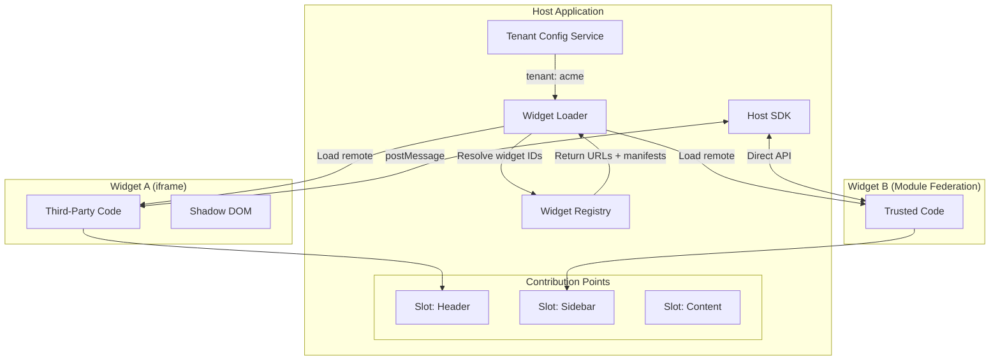
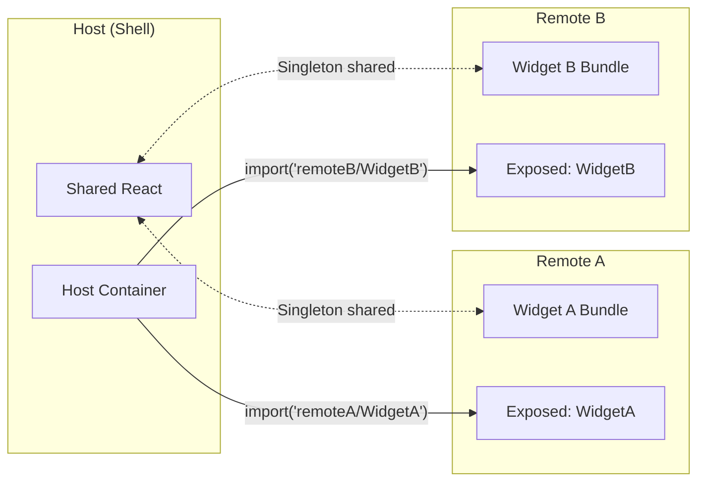
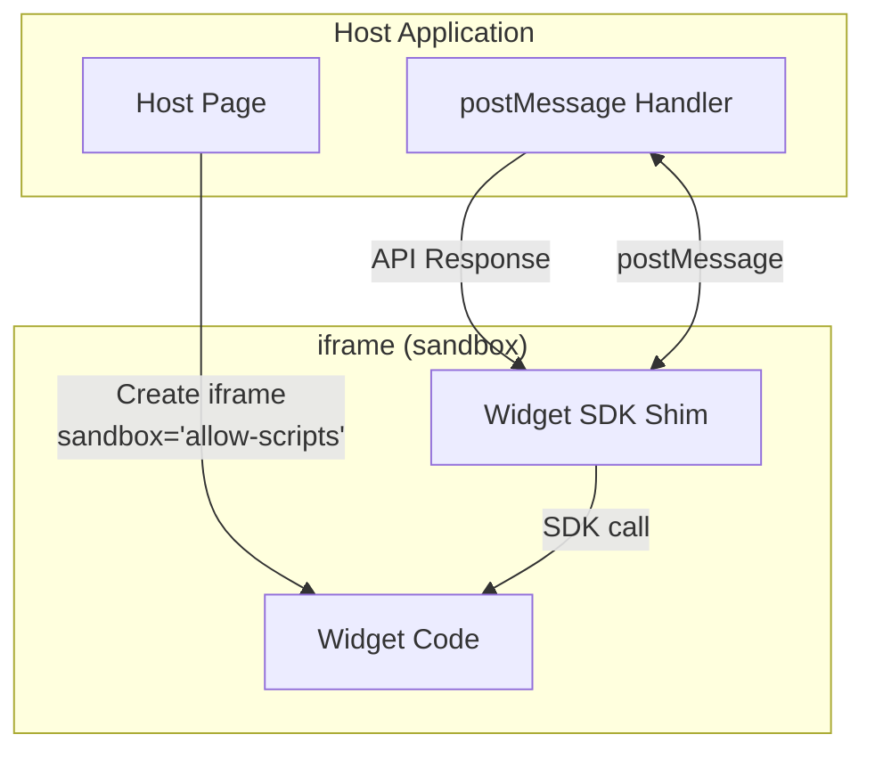
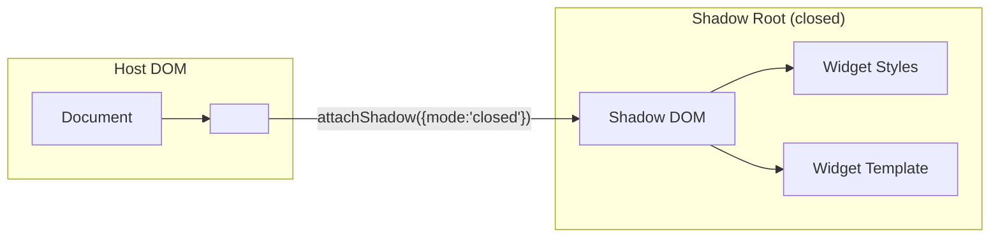
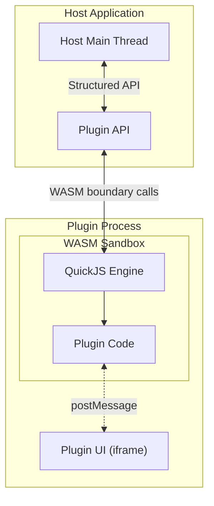
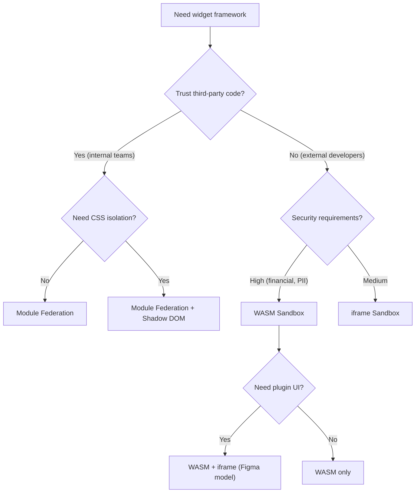
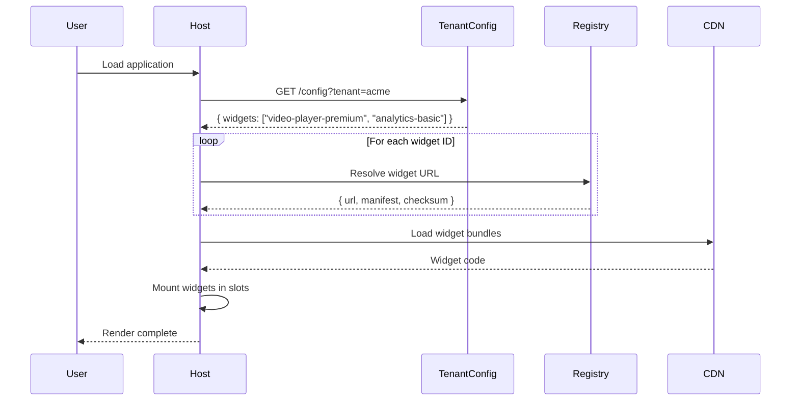

# Multi-Tenant Pluggable Widget Framework

Designing a frontend framework that hosts third-party extensions—dynamically loaded at runtime based on tenant configurations. This article covers the architectural decisions behind systems like VS Code extensions, Figma plugins, and Shopify embedded apps: module loading strategies (Webpack Module Federation vs SystemJS), sandboxing techniques (iframe, Shadow DOM, Web Workers, WASM), manifest and registry design, the host SDK API contract, and multi-tenant orchestration that resolves widget implementations per user or organization.

<figure>



<figcaption>Widget framework architecture: tenant configuration determines which widgets load; registry provides manifests and URLs; loader mounts widgets into contribution points; SDK mediates communication.</figcaption>
</figure>

## Abstract

A pluggable widget framework is a **microkernel architecture**: minimal core system + dynamically loaded extensions. The core decisions are:

1. **Loading strategy**: How does remote code enter the host?
   - Module Federation: optimal sharing, webpack-only, trusted code
   - SystemJS/import maps: standards-based, flexible, moderate performance
   - iframe: complete isolation, highest security, communication overhead

2. **Isolation boundary**: How much can widgets affect the host?
   - Same-origin (Module Federation): full DOM access, shared memory—trust required
   - iframe sandbox: separate browsing context, postMessage only
   - Shadow DOM: CSS isolation only, same JS context
   - WASM sandbox (Figma model): isolated JS engine, strongest security

3. **Extension points**: Where can widgets appear?
   - Contribution points: named slots in the UI that widgets register for
   - Declarative via manifest: host reads manifest, renders widget in appropriate slot

4. **Multi-tenancy**: How do different tenants get different widgets?
   - Tenant config service: maps tenant ID → enabled widget IDs
   - Registry resolution: widget ID → implementation URL
   - Feature flags: toggle widgets per tenant without redeployment

**Key numbers:**

| Aspect                | Module Federation   | iframe                    | WASM Sandbox             |
| --------------------- | ------------------- | ------------------------- | ------------------------ |
| Load overhead         | ~50ms (shared deps) | ~100-200ms (full context) | ~300-500ms (engine init) |
| Memory per widget     | Shared with host    | Separate heap (~10-50MB)  | Separate (~5-20MB)       |
| Communication latency | Microseconds        | ~1-5ms (postMessage)      | ~0.5-2ms (WASM boundary) |
| Security              | Same origin trust   | Strong isolation          | Strongest isolation      |

## The Challenge

### Why Build a Widget Framework?

**Extensibility without deployments**: Third parties add features without modifying host code. VS Code has 40,000+ extensions; the core team didn't build them.

**Multi-tenant customization**: Enterprise SaaS customers demand unique workflows. Widget A for Tenant X, Widget B for Tenant Y—without forking the codebase.

**Ecosystem growth**: A platform with extension capabilities attracts developers who build features you never considered.

### Browser Constraints

**Main thread budget**: Loading and initializing widgets competes with the host application. A poorly designed loader blocks the UI during startup.

**Memory limits**: Each iframe creates a separate JavaScript heap. Loading 10 widgets as iframes can consume 100-500MB—problematic on mobile devices (50-100MB practical limit).

**Network overhead**: Fetching widget bundles from different origins means separate HTTP connections, no shared caching of common dependencies.

### Security Requirements

**Untrusted code execution**: Third-party developers may write malicious or buggy code. Without isolation, a widget can:

- Access user credentials stored in localStorage
- Modify any DOM element, including login forms
- Make requests to any origin (CSRF)
- Crash the host application

**Defense in depth**:

| Threat            | Mitigation                                          |
| ----------------- | --------------------------------------------------- |
| DOM manipulation  | iframe sandbox, separate browsing context           |
| CSS pollution     | Shadow DOM, iframe                                  |
| Data exfiltration | CSP, sandbox restrictions                           |
| CPU exhaustion    | Web Worker isolation, timeout enforcement           |
| Memory leaks      | Widget lifecycle management, unload on deactivation |

### Scale Factors

| Factor               | Small Scale   | Large Scale           |
| -------------------- | ------------- | --------------------- |
| Widgets loaded       | 1-5           | 50-100                |
| Tenants              | 1-10          | 10,000+               |
| Widget registry size | 10-20 widgets | 1,000+ widgets        |
| Update frequency     | Weekly        | Continuous            |
| Widget developers    | Internal team | Third-party ecosystem |

## Design Paths

### Path 1: Webpack Module Federation

<figure>



<figcaption>Module Federation: host and remotes share dependencies (React) via singleton negotiation; widgets load as federated modules.</figcaption>
</figure>

**How it works:**

Module Federation (Webpack 5+) allows separate webpack builds to share code at runtime. The host declares **remotes** (external builds to consume) and **shared** dependencies (libraries to deduplicate).

```typescript title="host/webpack.config.js" collapse={1-5, 25-30}
const { ModuleFederationPlugin } = require("webpack").container

module.exports = {
  // ... other config
  plugins: [
    new ModuleFederationPlugin({
      name: "host",
      remotes: {
        // Static remotes (known at build time)
        widgetA: "widgetA@https://cdn.example.com/widget-a/remoteEntry.js",
        // Dynamic remotes resolved at runtime
        widgetB: `promise new Promise(resolve => {
          const remoteUrl = window.__WIDGET_REGISTRY__["widgetB"];
          const script = document.createElement("script");
          script.src = remoteUrl;
          script.onload = () => resolve(window.widgetB);
          document.head.appendChild(script);
        })`,
      },
      shared: {
        react: { singleton: true, requiredVersion: "^18.0.0" },
        "react-dom": { singleton: true, requiredVersion: "^18.0.0" },
      },
    }),
  ],
}
```

```typescript title="widget-a/webpack.config.js" collapse={1-5, 20-25}
const { ModuleFederationPlugin } = require("webpack").container

module.exports = {
  plugins: [
    new ModuleFederationPlugin({
      name: "widgetA",
      filename: "remoteEntry.js",
      exposes: {
        "./Widget": "./src/Widget", // What this remote offers
      },
      shared: {
        react: { singleton: true, requiredVersion: "^18.0.0" },
        "react-dom": { singleton: true, requiredVersion: "^18.0.0" },
      },
    }),
  ],
}
```

**Runtime loading:**

```typescript title="host/src/WidgetLoader.tsx" collapse={1-3}
import React, { Suspense, lazy } from "react";

// Dynamic import of federated module
const WidgetA = lazy(() => import("widgetA/Widget"));

export function WidgetSlot({ widgetId }: { widgetId: string }) {
  // In production: resolve widget ID to remote dynamically
  return (
    <Suspense fallback={<WidgetSkeleton />}>
      <WidgetA />
    </Suspense>
  );
}
```

**Dependency sharing mechanics:**

1. Host starts, loads `remoteEntry.js` for each remote
2. Remote entry registers available modules and shared dependencies
3. When host imports a remote module, federation checks shared scope
4. If compatible version exists, reuse; otherwise, load remote's bundled copy
5. `singleton: true` ensures only one instance (critical for React context)

**Best for:**

- Trusted first-party widgets (internal teams)
- Micro-frontend architectures with shared design systems
- Performance-critical scenarios where bundle size matters

**Device/network profile:**

- Works well on: Desktop, fast networks, trusted widget sources
- Struggles on: Untrusted third-party code (no isolation), slow networks (remote entry overhead)

**Implementation complexity:**

| Aspect             | Effort                              |
| ------------------ | ----------------------------------- |
| Initial setup      | High (webpack config complexity)    |
| Adding new widgets | Low (configure remote URL)          |
| Version management | Medium (shared version negotiation) |
| Security           | Low (same-origin trust model)       |

**Real-world example:**

**Shopify's Hydrogen** uses Module Federation for composable storefronts. Multiple teams build sections independently; the storefront shell loads them at runtime with shared Remix/React dependencies.

**Trade-offs:**

- Shared dependencies reduce duplicate downloads (30-50% smaller total payload)
- Same JavaScript context—widgets can access host globals
- Webpack-only (no native Vite support as of 2025; use `vite-plugin-federation`)
- Version mismatches cause runtime errors

**Security consideration:** Module Federation provides **no isolation**. Widgets execute in the same origin with full DOM access. Use only for trusted code or combine with additional sandboxing.

### Path 2: iframe Sandbox

<figure>



<figcaption>iframe sandbox: widget runs in isolated browsing context; communication via postMessage only.</figcaption>
</figure>

**How it works:**

The `<iframe sandbox>` attribute creates a separate browsing context with restricted capabilities. By default, a sandboxed iframe:

- Cannot execute scripts
- Cannot submit forms
- Cannot access parent DOM
- Cannot navigate the top-level browsing context
- Cannot use plugins

Capabilities are granted explicitly:

```html
<iframe
  src="https://widget.example.com/widget-a"
  sandbox="allow-scripts allow-same-origin"
  allow="clipboard-read; clipboard-write"
  csp="script-src 'self'; style-src 'self' 'unsafe-inline'"
></iframe>
```

**Sandbox attribute options:**

| Attribute              | Grants                                                       |
| ---------------------- | ------------------------------------------------------------ |
| `allow-scripts`        | JavaScript execution                                         |
| `allow-same-origin`    | Treats content as same origin (dangerous with allow-scripts) |
| `allow-forms`          | Form submission                                              |
| `allow-popups`         | Window.open(), target="\_blank"                              |
| `allow-modals`         | alert(), confirm(), prompt()                                 |
| `allow-top-navigation` | Navigate parent window                                       |

**Security warning:** Never combine `allow-scripts` and `allow-same-origin` for untrusted content. The iframe can remove its own sandbox attribute and escape.

**Communication via postMessage:**

```typescript title="host/src/WidgetBridge.ts"
interface WidgetMessage {
  type: string
  requestId: string
  payload: unknown
}

class WidgetBridge {
  private iframe: HTMLIFrameElement
  private pendingRequests = new Map<string, { resolve: Function; reject: Function }>()
  private trustedOrigin: string

  constructor(iframe: HTMLIFrameElement, trustedOrigin: string) {
    this.iframe = iframe
    this.trustedOrigin = trustedOrigin
    window.addEventListener("message", this.handleMessage)
  }

  private handleMessage = (event: MessageEvent<WidgetMessage>) => {
    // CRITICAL: Always validate origin
    if (event.origin !== this.trustedOrigin) return

    const { type, requestId, payload } = event.data

    if (type === "API_RESPONSE" && this.pendingRequests.has(requestId)) {
      const { resolve } = this.pendingRequests.get(requestId)!
      this.pendingRequests.delete(requestId)
      resolve(payload)
    }
  }

  async call(method: string, args: unknown[]): Promise<unknown> {
    const requestId = crypto.randomUUID()

    return new Promise((resolve, reject) => {
      this.pendingRequests.set(requestId, { resolve, reject })

      this.iframe.contentWindow?.postMessage(
        { type: "API_CALL", requestId, method, args },
        this.trustedOrigin, // CRITICAL: Specify target origin
      )

      // Timeout to prevent hanging requests
      setTimeout(() => {
        if (this.pendingRequests.has(requestId)) {
          this.pendingRequests.delete(requestId)
          reject(new Error(`Widget call timed out: ${method}`))
        }
      }, 5000)
    })
  }
}
```

```typescript title="widget/src/sdk-shim.ts"
// Inside the iframe: SDK shim that talks to host
const hostSDK = {
  async showNotification(message: string): Promise<void> {
    return callHost("showNotification", [message])
  },

  async getData(key: string): Promise<unknown> {
    return callHost("getData", [key])
  },
}

function callHost(method: string, args: unknown[]): Promise<unknown> {
  const requestId = crypto.randomUUID()

  return new Promise((resolve) => {
    const handler = (event: MessageEvent) => {
      if (event.data.requestId === requestId && event.data.type === "API_RESPONSE") {
        window.removeEventListener("message", handler)
        resolve(event.data.payload)
      }
    }
    window.addEventListener("message", handler)

    window.parent.postMessage(
      { type: "API_CALL", requestId, method, args },
      "*", // Widget doesn't know host origin; host validates on receive
    )
  })
}

// Expose SDK to widget code
;(window as any).hostSDK = hostSDK
```

**Best for:**

- Untrusted third-party widgets
- Payment forms, authentication widgets (PCI/SOC2 compliance)
- Widgets that need strong isolation guarantees

**Device/network profile:**

- Works well on: All devices, any network (self-contained)
- Struggles on: Mobile (memory overhead), many simultaneous widgets

**Implementation complexity:**

| Aspect             | Effort                                |
| ------------------ | ------------------------------------- |
| Initial setup      | Medium (iframe + postMessage)         |
| Adding new widgets | Low (point to URL)                    |
| Performance tuning | High (message serialization overhead) |
| Security           | Low (browser provides isolation)      |

**Real-world example:**

**Figma plugins** use iframe for UI rendering combined with a WASM sandbox for document manipulation. The iframe displays the plugin UI; a separate QuickJS WASM sandbox runs the logic that reads/writes the Figma document.

**Trade-offs:**

- Strongest browser-native isolation
- Each iframe creates separate JS heap (10-50MB overhead)
- postMessage serialization adds 1-5ms latency per call
- No shared dependencies (duplicate React, etc.)
- Cross-origin communication requires careful origin validation

### Path 3: Shadow DOM + Web Components

<figure>



<figcaption>Shadow DOM: CSS isolation via encapsulated DOM tree; JavaScript shares host context.</figcaption>
</figure>

**How it works:**

Shadow DOM creates an encapsulated DOM subtree with its own style scope. Styles inside don't leak out; external styles don't leak in.

```typescript title="host/src/WidgetContainer.ts"
class WidgetContainer extends HTMLElement {
  private shadow: ShadowRoot

  constructor() {
    super()
    // 'closed' prevents external access to shadow root
    this.shadow = this.attachShadow({ mode: "closed" })
  }

  async loadWidget(widgetUrl: string) {
    // Fetch widget bundle
    const response = await fetch(widgetUrl)
    const widgetCode = await response.text()

    // Create isolated style scope
    const style = document.createElement("style")
    style.textContent = await this.fetchWidgetStyles(widgetUrl)

    // Create widget container
    const container = document.createElement("div")
    container.className = "widget-root"

    this.shadow.appendChild(style)
    this.shadow.appendChild(container)

    // Execute widget code in this context
    // WARNING: No JS isolation—widget code runs in host context
    const widgetModule = new Function("container", "hostSDK", widgetCode)
    widgetModule(container, window.hostSDK)
  }
}

customElements.define("widget-container", WidgetContainer)
```

**CSS isolation guarantees:**

- Widget styles scoped to shadow root
- Host styles don't affect widget (unless using CSS custom properties)
- Widget cannot style host elements
- `::part()` and CSS variables allow controlled customization

```css
/* Widget internal styles (inside shadow DOM) */
.button {
  /* This .button won't conflict with host's .button */
  background: var(--widget-primary, blue); /* Customizable via CSS var */
}
```

```css
/* Host can customize via CSS custom properties */
widget-container {
  --widget-primary: red; /* Passes through shadow boundary */
}
```

**Best for:**

- Design system components with style encapsulation
- Trusted widgets that need CSS isolation but not JS isolation
- Web Components-based architectures

**Device/network profile:**

- Works well on: All modern browsers, any device
- Struggles on: Scenarios requiring JavaScript isolation

**Implementation complexity:**

| Aspect                | Effort                             |
| --------------------- | ---------------------------------- |
| Initial setup         | Low (native browser API)           |
| CSS isolation         | Low (automatic)                    |
| JS isolation          | None (same context)                |
| Framework integration | Medium (React/Vue wrappers needed) |

**Trade-offs:**

- Lightweight: No separate heap or context
- CSS isolation is complete
- No JavaScript isolation—widgets can access globals, DOM, etc.
- Requires combining with other techniques for untrusted code

### Path 4: WASM Sandbox (Figma Model)

<figure>



<figcaption>WASM sandbox: JavaScript engine (QuickJS) compiled to WebAssembly runs plugin logic; separate iframe renders UI.</figcaption>
</figure>

**How it works:**

Figma's approach: compile a JavaScript engine (QuickJS) to WebAssembly. Plugin code runs inside this embedded JS engine—completely isolated from the host JavaScript context.

**Why QuickJS + WASM?**

1. **No eval()**: Running untrusted JS usually requires `eval()` or `new Function()`, which CSP blocks. QuickJS interprets JS without these.
2. **Capability-based security**: WASM provides no default I/O. Plugin only accesses what the host explicitly provides via API.
3. **Deterministic execution**: Same code, same inputs → same outputs. Useful for collaborative features.

```typescript title="host/src/WasmSandbox.ts" collapse={1-5, 35-45}
import { newQuickJSWASMModule, QuickJSWASMModule, QuickJSContext } from "quickjs-emscripten"

class PluginSandbox {
  private vm: QuickJSWASMModule
  private context: QuickJSContext

  async initialize() {
    this.vm = await newQuickJSWASMModule()
    this.context = this.vm.newContext()

    // Expose host API to sandbox
    this.exposeHostAPI()
  }

  private exposeHostAPI() {
    const hostAPI = this.context.newObject()

    // Expose showNotification
    const showNotification = this.context.newFunction("showNotification", (msgHandle) => {
      const message = this.context.getString(msgHandle)
      // Call actual host notification system
      window.hostNotifications.show(message)
      return this.context.undefined
    })

    this.context.setProp(hostAPI, "showNotification", showNotification)
    this.context.setProp(this.context.global, "figma", hostAPI)

    showNotification.dispose()
    hostAPI.dispose()
  }

  async executePlugin(code: string): Promise<void> {
    const result = this.context.evalCode(code)
    if (result.error) {
      const error = this.context.dump(result.error)
      result.error.dispose()
      throw new Error(`Plugin error: ${JSON.stringify(error)}`)
    }
    result.value.dispose()
  }

  dispose() {
    this.context.dispose()
    this.vm.dispose()
  }
}
```

**Two-part plugin architecture (Figma):**

1. **UI iframe**: Renders plugin UI using HTML/CSS. Communicates with logic via postMessage.
2. **WASM sandbox**: Runs plugin logic. Has access to Figma document API. No DOM access.

This separation prevents plugins from both manipulating the document AND accessing arbitrary DOM.

**Best for:**

- Highest security requirements
- Platforms where plugins manipulate sensitive documents
- When you cannot trust third-party code at all

**Device/network profile:**

- Works well on: Desktop, modern mobile (WASM support universal since 2017)
- Struggles on: Low-memory devices (WASM instance overhead), very complex plugins (QuickJS slower than V8)

**Implementation complexity:**

| Aspect             | Effort                                      |
| ------------------ | ------------------------------------------- |
| Initial setup      | Very High (custom sandbox)                  |
| API surface design | High (every API must be explicitly exposed) |
| Performance tuning | High (WASM boundary crossing)               |
| Security           | Low (isolation is architectural)            |

**Trade-offs:**

- Strongest isolation (capability-based security)
- 300-500ms initialization overhead (loading WASM module)
- QuickJS performance ~10-30x slower than V8
- Complex to implement; consider using existing libraries (quickjs-emscripten)
- Plugin capabilities are exactly what you expose—no accidental surface

### Decision Matrix

| Factor              | Module Federation | iframe Sandbox      | Shadow DOM  | WASM Sandbox         |
| ------------------- | ----------------- | ------------------- | ----------- | -------------------- |
| JS Isolation        | None              | Strong              | None        | Strongest            |
| CSS Isolation       | None              | Complete            | Complete    | N/A (no DOM)         |
| Shared dependencies | Yes               | No                  | Manual      | No                   |
| Load time           | Fast (50ms)       | Medium (100-200ms)  | Fast (10ms) | Slow (300-500ms)     |
| Memory per widget   | Shared            | 10-50MB             | Shared      | 5-20MB               |
| Communication       | Direct            | postMessage (1-5ms) | Direct      | WASM boundary (~1ms) |
| Trust model         | Same-origin       | Untrusted           | Same-origin | Untrusted            |
| Browser support     | Webpack only      | Universal           | Universal   | Universal            |

### Decision Framework

<figure>



<figcaption>Decision tree for selecting widget isolation strategy based on trust level and security requirements.</figcaption>
</figure>

## The Registry and Manifest

### Manifest Structure

Every widget declares its capabilities, entry points, and requirements via a manifest file. This enables the host to:

- Validate widget compatibility before loading
- Render UI contributions without loading widget code
- Enforce permission boundaries

```json title="widget-a/manifest.json"
{
  "$schema": "https://widgets.example.com/manifest.schema.json",
  "id": "com.example.video-player",
  "name": "Premium Video Player",
  "version": "2.1.0",
  "description": "HD video player with adaptive streaming",
  "author": {
    "name": "Example Corp",
    "email": "widgets@example.com",
    "url": "https://example.com"
  },

  "host": {
    "minVersion": "3.0.0",
    "maxVersion": "4.x"
  },

  "main": "./dist/widget.js",
  "styles": "./dist/widget.css",
  "remoteEntry": "./dist/remoteEntry.js",

  "contributes": {
    "slots": [
      {
        "id": "content-area",
        "component": "VideoPlayer",
        "props": {
          "defaultQuality": "auto"
        }
      }
    ],
    "commands": [
      {
        "id": "video-player.play",
        "title": "Play Video"
      },
      {
        "id": "video-player.pause",
        "title": "Pause Video"
      }
    ],
    "settings": [
      {
        "id": "video-player.autoplay",
        "type": "boolean",
        "default": false,
        "title": "Autoplay videos"
      }
    ]
  },

  "permissions": ["storage.local", "network.fetch", "ui.notifications"],

  "dependencies": {
    "react": "^18.0.0",
    "react-dom": "^18.0.0"
  },

  "activationEvents": ["onSlot:content-area", "onCommand:video-player.play"],

  "sandbox": {
    "type": "iframe",
    "allow": ["scripts", "forms"],
    "csp": "script-src 'self'; style-src 'self' 'unsafe-inline'"
  }
}
```

**Key manifest fields:**

| Field                  | Purpose                                              |
| ---------------------- | ---------------------------------------------------- |
| `id`                   | Globally unique identifier (reverse domain notation) |
| `host.minVersion`      | Minimum host version for compatibility               |
| `main`                 | Entry point for widget code                          |
| `remoteEntry`          | Module Federation entry (if applicable)              |
| `contributes.slots`    | UI contribution points                               |
| `contributes.commands` | Registered commands                                  |
| `permissions`          | Required host capabilities                           |
| `activationEvents`     | When to load the widget                              |
| `sandbox`              | Isolation requirements                               |

### Contribution Points (Slots)

Contribution points are named locations in the host UI where widgets can render content. The host declares available slots; widgets register for slots they want to fill.

```typescript title="host/src/SlotRegistry.ts"
interface Slot {
  id: string
  multiple: boolean // Can multiple widgets contribute?
  props: Record<string, unknown> // Props passed to widget
}

interface SlotContribution {
  widgetId: string
  slotId: string
  component: string
  priority: number
}

class SlotRegistry {
  private slots = new Map<string, Slot>()
  private contributions = new Map<string, SlotContribution[]>()

  registerSlot(slot: Slot) {
    this.slots.set(slot.id, slot)
  }

  registerContribution(contribution: SlotContribution) {
    const existing = this.contributions.get(contribution.slotId) || []
    existing.push(contribution)
    existing.sort((a, b) => b.priority - a.priority)
    this.contributions.set(contribution.slotId, existing)
  }

  getContributionsForSlot(slotId: string): SlotContribution[] {
    const slot = this.slots.get(slotId)
    if (!slot) return []

    const contributions = this.contributions.get(slotId) || []
    return slot.multiple ? contributions : contributions.slice(0, 1)
  }
}
```

```tsx title="host/src/ContributionPoint.tsx"
function ContributionPoint({ slotId }: { slotId: string }) {
  const contributions = useSlotContributions(slotId)

  return (
    <div className="contribution-point" data-slot={slotId}>
      {contributions.map((contribution) => (
        <WidgetRenderer
          key={contribution.widgetId}
          widgetId={contribution.widgetId}
          component={contribution.component}
        />
      ))}
    </div>
  )
}
```

**Slot patterns from VS Code:**

| Slot Type       | Example        | Behavior                      |
| --------------- | -------------- | ----------------------------- |
| `viewContainer` | Sidebar panels | Multiple widgets, tabbed      |
| `view`          | Tree views     | Single widget per view        |
| `statusBarItem` | Status bar     | Multiple, ordered by priority |
| `menu`          | Context menus  | Multiple, grouped             |

### Widget Registry

The registry is a service that maps widget IDs to their manifests and entry points. It handles:

- Widget discovery and search
- Version resolution
- Dependency validation
- URL resolution for loading

```typescript title="host/src/WidgetRegistry.ts"
interface RegistryEntry {
  id: string
  manifest: WidgetManifest
  versions: {
    version: string
    url: string
    checksum: string
    publishedAt: Date
  }[]
}

interface ResolvedWidget {
  id: string
  version: string
  manifestUrl: string
  entryUrl: string
  checksum: string
}

class WidgetRegistry {
  private baseUrl: string
  private cache = new Map<string, RegistryEntry>()

  constructor(baseUrl: string) {
    this.baseUrl = baseUrl
  }

  async resolve(widgetId: string, versionConstraint: string = "latest"): Promise<ResolvedWidget> {
    // Fetch registry entry
    const entry = await this.fetchEntry(widgetId)

    // Resolve version constraint (semver)
    const version = this.resolveVersion(entry.versions, versionConstraint)
    if (!version) {
      throw new Error(`No version matching ${versionConstraint} for ${widgetId}`)
    }

    // Validate host compatibility
    const manifest = await this.fetchManifest(version.url)
    this.validateHostCompatibility(manifest)

    return {
      id: widgetId,
      version: version.version,
      manifestUrl: `${version.url}/manifest.json`,
      entryUrl: `${version.url}/${manifest.main}`,
      checksum: version.checksum,
    }
  }

  private async fetchEntry(widgetId: string): Promise<RegistryEntry> {
    if (this.cache.has(widgetId)) {
      return this.cache.get(widgetId)!
    }

    const response = await fetch(`${this.baseUrl}/widgets/${widgetId}`)
    if (!response.ok) {
      throw new Error(`Widget not found: ${widgetId}`)
    }

    const entry = await response.json()
    this.cache.set(widgetId, entry)
    return entry
  }

  private resolveVersion(
    versions: RegistryEntry["versions"],
    constraint: string,
  ): RegistryEntry["versions"][0] | undefined {
    if (constraint === "latest") {
      return versions[0] // Assumes sorted by version desc
    }

    // Semver matching
    return versions.find((v) => satisfies(v.version, constraint))
  }

  private validateHostCompatibility(manifest: WidgetManifest) {
    const hostVersion = getHostVersion()
    const { minVersion, maxVersion } = manifest.host

    if (minVersion && !gte(hostVersion, minVersion)) {
      throw new Error(`Widget requires host >= ${minVersion}`)
    }
    if (maxVersion && !satisfies(hostVersion, maxVersion)) {
      throw new Error(`Widget incompatible with host ${hostVersion}`)
    }
  }
}
```

**Registry API design:**

```
GET /widgets                    # List all widgets (paginated)
GET /widgets/{id}               # Get widget metadata
GET /widgets/{id}/versions      # List versions
GET /widgets/{id}@{version}     # Get specific version
POST /widgets                   # Publish new widget (authenticated)
DELETE /widgets/{id}@{version}  # Unpublish version (admin)
```

## Host SDK (Extension API)

### API Contract

The host exposes a controlled API surface that widgets use to interact with the system. This creates a stable contract and security boundary.

```typescript title="host/src/HostSDK.ts"
interface HostSDK {
  // Lifecycle
  readonly version: string
  onActivate(callback: () => void): Disposable
  onDeactivate(callback: () => void): Disposable

  // UI
  showNotification(options: NotificationOptions): Promise<void>
  showModal(options: ModalOptions): Promise<ModalResult>
  registerCommand(id: string, handler: CommandHandler): Disposable

  // Data
  getData<T>(key: string): Promise<T | undefined>
  setData<T>(key: string, value: T): Promise<void>
  subscribeToData<T>(key: string, callback: (value: T) => void): Disposable

  // Storage (widget-scoped)
  storage: {
    get<T>(key: string): Promise<T | undefined>
    set<T>(key: string, value: T): Promise<void>
    delete(key: string): Promise<void>
  }

  // Network (proxied through host)
  fetch(url: string, options?: RequestInit): Promise<Response>

  // Events
  onEvent(eventType: string, handler: EventHandler): Disposable
  emitEvent(eventType: string, payload: unknown): void
}

interface Disposable {
  dispose(): void
}

interface NotificationOptions {
  type: "info" | "warning" | "error"
  message: string
  duration?: number
  actions?: { label: string; action: () => void }[]
}
```

### SDK Implementation for iframe Widgets

```typescript title="host/src/IframeSDK.ts"
class IframeSDKHost {
  private iframe: HTMLIFrameElement
  private widgetId: string
  private handlers = new Map<string, Function>()

  constructor(iframe: HTMLIFrameElement, widgetId: string) {
    this.iframe = iframe
    this.widgetId = widgetId
    window.addEventListener("message", this.handleMessage)
  }

  private handleMessage = async (event: MessageEvent) => {
    // Validate origin matches expected widget origin
    if (!this.isValidOrigin(event.origin)) return

    const { type, requestId, method, args } = event.data
    if (type !== "SDK_CALL") return

    try {
      const result = await this.executeMethod(method, args)
      this.respond(requestId, { success: true, result })
    } catch (error) {
      this.respond(requestId, { success: false, error: String(error) })
    }
  }

  private async executeMethod(method: string, args: unknown[]): Promise<unknown> {
    // Permission check
    const permission = this.getRequiredPermission(method)
    if (permission && !this.hasPermission(permission)) {
      throw new Error(`Permission denied: ${permission}`)
    }

    switch (method) {
      case "showNotification":
        return this.showNotification(args[0] as NotificationOptions)

      case "getData":
        return this.getData(args[0] as string)

      case "setData":
        return this.setData(args[0] as string, args[1])

      case "storage.get":
        return this.widgetStorage.get(this.widgetId, args[0] as string)

      case "fetch":
        // Proxy fetch to enforce CORS and CSP
        return this.proxyFetch(args[0] as string, args[1] as RequestInit)

      default:
        throw new Error(`Unknown method: ${method}`)
    }
  }

  private respond(requestId: string, response: unknown) {
    this.iframe.contentWindow?.postMessage(
      { type: "SDK_RESPONSE", requestId, ...response },
      "*", // iframe origin already validated on receive
    )
  }

  private getRequiredPermission(method: string): string | undefined {
    const permissionMap: Record<string, string> = {
      showNotification: "ui.notifications",
      fetch: "network.fetch",
      "storage.get": "storage.local",
      "storage.set": "storage.local",
    }
    return permissionMap[method]
  }
}
```

### SDK Shim for Widget Side

```typescript title="widget-sdk/src/index.ts"
class WidgetSDK implements HostSDK {
  private pendingRequests = new Map<
    string,
    {
      resolve: (value: unknown) => void
      reject: (error: Error) => void
    }
  >()

  constructor() {
    window.addEventListener("message", this.handleResponse)
  }

  private handleResponse = (event: MessageEvent) => {
    const { type, requestId, success, result, error } = event.data
    if (type !== "SDK_RESPONSE") return

    const pending = this.pendingRequests.get(requestId)
    if (!pending) return

    this.pendingRequests.delete(requestId)

    if (success) {
      pending.resolve(result)
    } else {
      pending.reject(new Error(error))
    }
  }

  private call<T>(method: string, args: unknown[] = []): Promise<T> {
    return new Promise((resolve, reject) => {
      const requestId = crypto.randomUUID()
      this.pendingRequests.set(requestId, { resolve: resolve as any, reject })

      window.parent.postMessage({ type: "SDK_CALL", requestId, method, args }, "*")

      // Timeout after 10 seconds
      setTimeout(() => {
        if (this.pendingRequests.has(requestId)) {
          this.pendingRequests.delete(requestId)
          reject(new Error(`SDK call timeout: ${method}`))
        }
      }, 10000)
    })
  }

  // Public API implementation
  get version(): string {
    return "1.0.0"
  }

  async showNotification(options: NotificationOptions): Promise<void> {
    return this.call("showNotification", [options])
  }

  async getData<T>(key: string): Promise<T | undefined> {
    return this.call("getData", [key])
  }

  storage = {
    get: <T>(key: string) => this.call<T>("storage.get", [key]),
    set: <T>(key: string, value: T) => this.call<void>("storage.set", [key, value]),
    delete: (key: string) => this.call<void>("storage.delete", [key]),
  }

  // ... other methods
}

// Export singleton
export const hostSDK = new WidgetSDK()
```

## Multi-Tenant Orchestration

### Tenant Configuration Resolution

The tenant config service maps tenant identifiers to their widget configurations. This enables per-tenant customization without code changes.

<figure>



<figcaption>Multi-tenant widget loading flow: tenant config determines widget IDs; registry resolves to URLs; CDN serves bundles.</figcaption>
</figure>

```typescript title="host/src/TenantConfig.ts"
interface TenantWidgetConfig {
  widgetId: string
  version?: string // Optional: defaults to "latest"
  slot: string
  config?: Record<string, unknown> // Widget-specific config
  enabled: boolean
}

interface TenantConfig {
  tenantId: string
  widgets: TenantWidgetConfig[]
  featureFlags: Record<string, boolean>
  theme?: ThemeConfig
}

class TenantConfigService {
  private configCache = new Map<string, TenantConfig>()
  private baseUrl: string

  constructor(baseUrl: string) {
    this.baseUrl = baseUrl
  }

  async getConfig(tenantId: string): Promise<TenantConfig> {
    // Check cache first
    if (this.configCache.has(tenantId)) {
      return this.configCache.get(tenantId)!
    }

    const response = await fetch(`${this.baseUrl}/tenants/${tenantId}/config`)
    if (!response.ok) {
      // Fall back to default config
      return this.getDefaultConfig(tenantId)
    }

    const config = await response.json()
    this.configCache.set(tenantId, config)
    return config
  }

  private getDefaultConfig(tenantId: string): TenantConfig {
    return {
      tenantId,
      widgets: [], // No widgets by default
      featureFlags: {},
    }
  }

  async refreshConfig(tenantId: string): Promise<TenantConfig> {
    this.configCache.delete(tenantId)
    return this.getConfig(tenantId)
  }
}
```

### Widget Loader Orchestration

```typescript title="host/src/WidgetOrchestrator.ts"
interface LoadedWidget {
  id: string
  version: string
  slot: string
  instance: WidgetInstance
  state: "loading" | "active" | "error" | "inactive"
}

class WidgetOrchestrator {
  private tenantConfig: TenantConfigService
  private registry: WidgetRegistry
  private loadedWidgets = new Map<string, LoadedWidget>()
  private slotRegistry: SlotRegistry

  async initialize(tenantId: string) {
    // 1. Fetch tenant configuration
    const config = await this.tenantConfig.getConfig(tenantId)

    // 2. Filter enabled widgets
    const enabledWidgets = config.widgets.filter((w) => w.enabled)

    // 3. Resolve all widgets in parallel
    const resolutions = await Promise.allSettled(
      enabledWidgets.map((w) => this.registry.resolve(w.widgetId, w.version)),
    )

    // 4. Load successfully resolved widgets
    for (let i = 0; i < resolutions.length; i++) {
      const resolution = resolutions[i]
      const widgetConfig = enabledWidgets[i]

      if (resolution.status === "fulfilled") {
        await this.loadWidget(resolution.value, widgetConfig)
      } else {
        console.error(`Failed to resolve ${widgetConfig.widgetId}:`, resolution.reason)
        // Continue loading other widgets
      }
    }
  }

  private async loadWidget(resolved: ResolvedWidget, config: TenantWidgetConfig) {
    const loadedWidget: LoadedWidget = {
      id: resolved.id,
      version: resolved.version,
      slot: config.slot,
      instance: null!,
      state: "loading",
    }

    this.loadedWidgets.set(resolved.id, loadedWidget)

    try {
      // Fetch manifest to determine loading strategy
      const manifest = await this.fetchManifest(resolved.manifestUrl)

      // Load based on sandbox type
      const instance = await this.createWidgetInstance(manifest, resolved, config)

      loadedWidget.instance = instance
      loadedWidget.state = "active"

      // Register contribution points
      this.registerContributions(manifest, resolved.id)
    } catch (error) {
      loadedWidget.state = "error"
      console.error(`Failed to load widget ${resolved.id}:`, error)
    }
  }

  private async createWidgetInstance(
    manifest: WidgetManifest,
    resolved: ResolvedWidget,
    config: TenantWidgetConfig,
  ): Promise<WidgetInstance> {
    const sandboxType = manifest.sandbox?.type || "none"

    switch (sandboxType) {
      case "iframe":
        return this.createIframeWidget(resolved, manifest, config)

      case "shadow-dom":
        return this.createShadowDomWidget(resolved, manifest, config)

      case "wasm":
        return this.createWasmWidget(resolved, manifest, config)

      case "none":
      default:
        return this.createFederatedWidget(resolved, manifest, config)
    }
  }

  private async createIframeWidget(
    resolved: ResolvedWidget,
    manifest: WidgetManifest,
    config: TenantWidgetConfig,
  ): Promise<IframeWidgetInstance> {
    const iframe = document.createElement("iframe")

    // Apply sandbox restrictions
    const sandbox = manifest.sandbox!
    iframe.sandbox.add(...sandbox.allow.map((a) => `allow-${a}`))

    // Set CSP via attribute (embedded enforcement)
    if (sandbox.csp) {
      iframe.setAttribute("csp", sandbox.csp)
    }

    iframe.src = resolved.entryUrl

    return new IframeWidgetInstance(iframe, resolved.id, config.config)
  }

  async unloadWidget(widgetId: string) {
    const widget = this.loadedWidgets.get(widgetId)
    if (!widget) return

    widget.state = "inactive"

    // Cleanup instance
    await widget.instance.dispose()

    // Remove contributions
    this.slotRegistry.removeContributions(widgetId)

    this.loadedWidgets.delete(widgetId)
  }
}
```

### Feature Flag Integration

```typescript title="host/src/FeatureFlags.ts"
interface FeatureFlagService {
  isEnabled(flag: string, context: FlagContext): boolean
  getVariant<T>(flag: string, context: FlagContext): T | undefined
}

interface FlagContext {
  tenantId: string
  userId?: string
  environment: "production" | "staging" | "development"
}

class WidgetFeatureFlags {
  private flags: FeatureFlagService

  isWidgetEnabled(widgetId: string, tenantConfig: TenantWidgetConfig, context: FlagContext): boolean {
    // 1. Check tenant config first
    if (!tenantConfig.enabled) return false

    // 2. Check feature flag override
    const flagKey = `widget.${widgetId}.enabled`
    if (this.flags.isEnabled(flagKey, context) === false) {
      return false
    }

    // 3. Check rollout percentage
    const rolloutFlag = `widget.${widgetId}.rollout`
    const rollout = this.flags.getVariant<number>(rolloutFlag, context)
    if (rollout !== undefined) {
      const userHash = this.hashUser(context.userId || context.tenantId)
      return userHash < rollout
    }

    return true
  }

  private hashUser(userId: string): number {
    // Deterministic hash for consistent experience
    let hash = 0
    for (let i = 0; i < userId.length; i++) {
      hash = (hash << 5) - hash + userId.charCodeAt(i)
      hash |= 0
    }
    return Math.abs(hash) % 100
  }
}
```

## Browser Constraints

### Main Thread Budget

Widget loading competes with the host application for main thread time. Poor loading strategies cause jank.

**Loading waterfall (problematic):**

```
[Host init]--[Fetch config]--[Fetch widget A]--[Parse A]--[Fetch widget B]--[Parse B]
                                                                              |
                                                                         [First paint]
```

**Optimized loading:**

```
[Host init]--[Fetch config]--[Render host skeleton]
                    |
                    ├──[Fetch A]──[Parse A]
                    └──[Fetch B]──[Parse B]
                                      |
                              [Progressive paint]
```

```typescript title="host/src/OptimizedLoader.ts"
async function loadWidgetsOptimized(widgetConfigs: TenantWidgetConfig[]) {
  // 1. Render skeleton immediately
  renderSkeletons(widgetConfigs)

  // 2. Start all fetches in parallel
  const fetchPromises = widgetConfigs.map((config) => fetchWidgetBundle(config.widgetId))

  // 3. Process widgets as they complete (not waiting for all)
  for await (const result of raceSettled(fetchPromises)) {
    if (result.status === "fulfilled") {
      // Yield to main thread between widget initializations
      await yieldToMain()
      await initializeWidget(result.value)
    }
  }
}

function yieldToMain(): Promise<void> {
  return new Promise((resolve) => {
    if ("scheduler" in window && "yield" in (window as any).scheduler) {
      ;(window as any).scheduler.yield().then(resolve)
    } else {
      setTimeout(resolve, 0)
    }
  })
}

async function* raceSettled<T>(promises: Promise<T>[]): AsyncGenerator<PromiseSettledResult<T>> {
  const remaining = new Set(promises.map((p, i) => i))

  while (remaining.size > 0) {
    const results = await Promise.race(
      Array.from(remaining).map(async (i) => {
        try {
          const value = await promises[i]
          return { index: i, status: "fulfilled" as const, value }
        } catch (reason) {
          return { index: i, status: "rejected" as const, reason }
        }
      }),
    )

    remaining.delete(results.index)
    yield results.status === "fulfilled"
      ? { status: "fulfilled", value: results.value }
      : { status: "rejected", reason: results.reason }
  }
}
```

### Memory Limits

| Device Type      | Practical JS Heap Limit | Widget Budget       |
| ---------------- | ----------------------- | ------------------- |
| Low-end mobile   | 50-100MB                | 5-10MB per widget   |
| Mid-range mobile | 200-300MB               | 20-30MB per widget  |
| Desktop          | 500MB-1GB               | 50-100MB per widget |

**Memory management strategies:**

```typescript title="host/src/WidgetMemoryManager.ts"
class WidgetMemoryManager {
  private readonly maxTotalMemory: number
  private readonly maxWidgetMemory: number
  private activeWidgets = new Map<string, WidgetMemoryStats>()

  constructor(config: { maxTotalMemory: number; maxWidgetMemory: number }) {
    this.maxTotalMemory = config.maxTotalMemory
    this.maxWidgetMemory = config.maxWidgetMemory

    // Monitor memory pressure
    if ("memory" in performance) {
      this.startMemoryMonitoring()
    }
  }

  canLoadWidget(estimatedMemory: number): boolean {
    const currentUsage = this.getTotalUsage()
    return currentUsage + estimatedMemory <= this.maxTotalMemory
  }

  onWidgetOverMemory(widgetId: string) {
    console.warn(`Widget ${widgetId} exceeded memory limit`)

    // Option 1: Unload widget
    // this.unloadWidget(widgetId);

    // Option 2: Notify widget to reduce memory
    this.notifyWidget(widgetId, "MEMORY_PRESSURE")
  }

  private startMemoryMonitoring() {
    setInterval(() => {
      const memory = (performance as any).memory
      const usedRatio = memory.usedJSHeapSize / memory.jsHeapSizeLimit

      if (usedRatio > 0.9) {
        // Critical memory pressure
        this.handleMemoryPressure("critical")
      } else if (usedRatio > 0.7) {
        // Warning level
        this.handleMemoryPressure("warning")
      }
    }, 5000)
  }

  private handleMemoryPressure(level: "warning" | "critical") {
    // Unload inactive widgets first
    for (const [widgetId, stats] of this.activeWidgets) {
      if (!stats.visible && level === "critical") {
        this.unloadWidget(widgetId)
      }
    }
  }
}
```

### Storage Quotas

Widgets need persistent storage but share quotas with the host:

| Storage Type | Quota                | Widget Strategy      |
| ------------ | -------------------- | -------------------- |
| localStorage | 5MB                  | Avoid; use IndexedDB |
| IndexedDB    | 50% of disk (Chrome) | Namespace per widget |
| Cache API    | 50% of disk          | Careful eviction     |

```typescript title="host/src/WidgetStorage.ts"
class WidgetStorageManager {
  private db: IDBDatabase | null = null
  private readonly storeName = "widget_storage"

  async initialize() {
    this.db = await this.openDatabase()
  }

  private openDatabase(): Promise<IDBDatabase> {
    return new Promise((resolve, reject) => {
      const request = indexedDB.open("widget_host", 1)

      request.onerror = () => reject(request.error)
      request.onsuccess = () => resolve(request.result)

      request.onupgradeneeded = (event) => {
        const db = (event.target as IDBOpenDBRequest).result
        if (!db.objectStoreNames.contains(this.storeName)) {
          db.createObjectStore(this.storeName, { keyPath: "key" })
        }
      }
    })
  }

  async get<T>(widgetId: string, key: string): Promise<T | undefined> {
    const compositeKey = `${widgetId}:${key}`
    return this.dbGet(compositeKey)
  }

  async set<T>(widgetId: string, key: string, value: T): Promise<void> {
    const compositeKey = `${widgetId}:${key}`

    // Check quota before write
    const estimate = await navigator.storage.estimate()
    const usageRatio = (estimate.usage || 0) / (estimate.quota || 1)

    if (usageRatio > 0.9) {
      // Evict old widget data
      await this.evictOldData(widgetId)
    }

    return this.dbSet(compositeKey, value)
  }

  async getWidgetUsage(widgetId: string): Promise<number> {
    // Estimate storage used by this widget
    const keys = await this.getWidgetKeys(widgetId)
    let totalSize = 0

    for (const key of keys) {
      const value = await this.dbGet(key)
      totalSize += new Blob([JSON.stringify(value)]).size
    }

    return totalSize
  }
}
```

## Real-World Implementations

### VS Code Extensions

**Context:** Desktop code editor with 40,000+ extensions.

**Architecture:**

- Extensions run in separate **Extension Host** process (Node.js)
- UI extensions use **webview** (Chromium iframe with restricted API)
- Communication via IPC (Inter-Process Communication)

**Key design decisions:**

| Decision            | Rationale                                             |
| ------------------- | ----------------------------------------------------- |
| Separate process    | Misbehaving extensions can't crash editor             |
| Activation events   | Lazy loading—extensions load only when needed         |
| Contribution points | Declarative UI integration via `contributes` manifest |
| Sandboxed webviews  | HTML panels isolated from VS Code DOM                 |

**Manifest example:**

```json
{
  "name": "my-extension",
  "activationEvents": ["onLanguage:javascript"],
  "contributes": {
    "commands": [{ "command": "ext.doThing", "title": "Do Thing" }],
    "menus": {
      "editor/context": [{ "command": "ext.doThing" }]
    }
  }
}
```

**Outcome:** Extensions enhance functionality without affecting editor stability. Process isolation means extension crashes are recoverable.

### Figma Plugins

**Context:** Web-based design tool; plugins manipulate design documents.

**Architecture:**

- **UI layer**: Standard iframe for plugin UI
- **Logic layer**: QuickJS JavaScript engine compiled to WASM
- Document access only through controlled API

**Why WASM sandbox?**

1. Cannot use `eval()` (security)
2. Plugins must not access Figma's DOM
3. Need deterministic execution for collaborative editing

**Two-process model:**

```
Plugin UI (iframe) ←→ postMessage ←→ Plugin Logic (WASM) ←→ Figma API ←→ Document
```

**Security properties:**

- Plugin cannot access browser APIs directly
- Plugin cannot manipulate Figma's UI
- All document operations go through audited API
- Plugin code runs in capability-constrained sandbox

**Trade-off accepted:** QuickJS is ~10-30x slower than V8. Acceptable because document operations are the bottleneck, not JavaScript execution.

**Source:** [How Figma Built the Plugin System](https://www.figma.com/blog/how-we-built-the-figma-plugin-system/)

### Shopify Embedded Apps

**Context:** E-commerce platform; apps extend merchant admin functionality.

**Architecture:**

- Apps run in **iframe** embedded in Shopify admin
- Communication via **App Bridge** SDK (postMessage abstraction)
- OAuth for authentication; session tokens for API access

**App Bridge SDK:**

```typescript
import { createApp } from "@shopify/app-bridge"
import { Redirect, Toast } from "@shopify/app-bridge/actions"

const app = createApp({
  apiKey: "api-key",
  shopOrigin: "myshop.myshopify.com",
})

// Show toast notification (rendered by Shopify, not iframe)
const toast = Toast.create(app, { message: "Order updated", duration: 5000 })
toast.dispatch(Toast.Action.SHOW)

// Navigate within Shopify admin
const redirect = Redirect.create(app)
redirect.dispatch(Redirect.Action.ADMIN_PATH, "/orders")
```

**Multi-tenancy model:**

- Each Shopify store is a tenant
- Apps install per-store with store-specific credentials
- App Bridge passes shop context on every request

**Security properties:**

- Apps cannot access other stores' data
- OAuth scopes limit API access per app
- iframe sandbox prevents DOM manipulation

**Source:** [Shopify App Bridge Documentation](https://shopify.dev/docs/api/app-bridge)

### Salesforce Lightning Web Components

**Context:** Enterprise CRM with third-party components from multiple ISVs.

**Architecture:**

- Components run in **Lightning Web Security (LWS)** virtual environment
- Namespace isolation: `c-myComponent` vs `partner-theirComponent`
- Shadow DOM for style encapsulation

**Lightning Web Security:**

```
┌─────────────────────────────────────────┐
│            Salesforce Page              │
├─────────────────────────────────────────┤
│  ┌──────────────┐  ┌──────────────┐     │
│  │ Namespace A  │  │ Namespace B  │     │
│  │ (Virtual Env)│  │ (Virtual Env)│     │
│  │  Component1  │  │  Component2  │     │
│  └──────────────┘  └──────────────┘     │
└─────────────────────────────────────────┘
```

**Security properties:**

- Components in different namespaces cannot access each other's resources
- Distorted global objects prevent prototype pollution
- API calls go through Salesforce proxy with permission checks

**Trade-off:** Slightly different JavaScript semantics (global object distortion). Most code works unchanged; edge cases require adaptation.

**Source:** [Lightning Web Security Architecture](https://developer.salesforce.com/docs/platform/lwc/guide/security-lwsec-intro.html)

## Common Pitfalls

### 1. Loading All Widgets Eagerly

**The mistake:** Fetching and initializing all widgets on page load regardless of visibility.

**Example:** Dashboard with 20 widgets; user only sees 4 above the fold. Loading all 20 blocks main thread for 2+ seconds.

**Why it happens:** Simpler implementation; deferred loading requires tracking visibility.

**Solution:**

```typescript
class LazyWidgetLoader {
  private observer: IntersectionObserver
  private pendingWidgets = new Map<Element, string>()

  constructor() {
    this.observer = new IntersectionObserver(
      this.handleIntersection,
      { rootMargin: "100px" }, // Preload slightly before visible
    )
  }

  registerSlot(element: Element, widgetId: string) {
    this.pendingWidgets.set(element, widgetId)
    this.observer.observe(element)
  }

  private handleIntersection: IntersectionObserverCallback = (entries) => {
    for (const entry of entries) {
      if (entry.isIntersecting) {
        const widgetId = this.pendingWidgets.get(entry.target)
        if (widgetId) {
          this.loadWidget(widgetId, entry.target)
          this.pendingWidgets.delete(entry.target)
          this.observer.unobserve(entry.target)
        }
      }
    }
  }
}
```

### 2. Missing Origin Validation in postMessage

**The mistake:** Handling all messages without checking origin.

```typescript
// DANGEROUS: No origin check
window.addEventListener("message", (event) => {
  if (event.data.type === "WIDGET_REQUEST") {
    handleWidgetRequest(event.data) // Attacker can send messages too
  }
})
```

**Impact:** Attacker opens your site in iframe, sends malicious messages, triggers actions with user's credentials.

**Solution:**

```typescript
const TRUSTED_ORIGINS = new Set(["https://widget1.example.com", "https://widget2.example.com"])

window.addEventListener("message", (event) => {
  // CRITICAL: Always validate origin
  if (!TRUSTED_ORIGINS.has(event.origin)) {
    console.warn("Rejected message from untrusted origin:", event.origin)
    return
  }

  handleWidgetRequest(event.data)
})
```

### 3. Shared Dependency Version Conflicts

**The mistake:** Host uses React 18, widget bunled with React 17, both load.

**Impact:** Two React instances cause context mismatches, hooks fail mysteriously.

**Solution:**

```typescript
// webpack.config.js (host)
new ModuleFederationPlugin({
  shared: {
    react: {
      singleton: true,
      requiredVersion: "^18.0.0",
      strictVersion: true, // Fail if incompatible
    },
  },
})
```

Also validate in registry:

```typescript
function validateWidgetCompatibility(manifest: WidgetManifest) {
  const hostReact = "18.2.0"
  const widgetReact = manifest.dependencies?.react

  if (widgetReact && !satisfies(hostReact, widgetReact)) {
    throw new Error(`Widget requires React ${widgetReact}, host has ${hostReact}`)
  }
}
```

### 4. No Widget Lifecycle Management

**The mistake:** Loading widgets but never unloading them when no longer needed.

**Impact:** Memory grows unbounded; 50 widgets loaded over time, only 5 visible.

**Solution:**

```typescript
interface WidgetInstance {
  activate(): Promise<void>
  deactivate(): Promise<void>
  dispose(): Promise<void>
}

class WidgetLifecycleManager {
  private activeWidgets = new Map<string, WidgetInstance>()
  private visibleWidgets = new Set<string>()

  async handleVisibilityChange(widgetId: string, visible: boolean) {
    const widget = this.activeWidgets.get(widgetId)
    if (!widget) return

    if (visible) {
      this.visibleWidgets.add(widgetId)
      await widget.activate()
    } else {
      this.visibleWidgets.delete(widgetId)
      await widget.deactivate()

      // Unload after period of invisibility
      setTimeout(() => {
        if (!this.visibleWidgets.has(widgetId)) {
          this.unloadWidget(widgetId)
        }
      }, 60000) // 1 minute
    }
  }

  private async unloadWidget(widgetId: string) {
    const widget = this.activeWidgets.get(widgetId)
    if (widget) {
      await widget.dispose()
      this.activeWidgets.delete(widgetId)
    }
  }
}
```

### 5. Blocking Main Thread During Widget Init

**The mistake:** Synchronously parsing and executing large widget bundles.

**Impact:** UI freezes during widget load; user sees blank screen.

**Solution:**

```typescript
async function initializeWidgetAsync(code: string, container: Element) {
  // Parse in chunks using requestIdleCallback
  const chunks = splitIntoChunks(code, 50000) // 50KB chunks

  for (const chunk of chunks) {
    await new Promise<void>((resolve) => {
      requestIdleCallback(
        () => {
          // Parse chunk
          parseChunk(chunk)
          resolve()
        },
        { timeout: 100 },
      )
    })
  }

  // Initialize widget after parsing
  await new Promise<void>((resolve) => {
    requestAnimationFrame(() => {
      mountWidget(container)
      resolve()
    })
  })
}
```

## Conclusion

Building a multi-tenant pluggable widget framework requires navigating three axes:

1. **Security vs Performance**: iframe/WASM isolation is safest but has overhead; Module Federation is fast but trusts widgets
2. **Flexibility vs Complexity**: More extension points enable richer widgets but increase API surface to maintain
3. **Per-tenant customization vs Operational simplicity**: Feature flags add deployment complexity but enable fine-grained control

**Recommended starting points by use case:**

| Scenario                    | Isolation                  | Loading           | Registry                |
| --------------------------- | -------------------------- | ----------------- | ----------------------- |
| Internal micro-frontends    | Module Federation          | Module Federation | npm/internal registry   |
| Third-party app marketplace | iframe + postMessage       | Dynamic script    | Custom registry + OAuth |
| High-security (financial)   | WASM sandbox               | Dynamic fetch     | Signed manifests        |
| Design tool plugins         | WASM (logic) + iframe (UI) | Controlled loader | Curated store           |

**Key design decisions to make early:**

1. What's your trust model? Internal-only vs open marketplace changes everything
2. What API surface will you support? Once published, it's hard to change
3. How will you version the host SDK? Widgets depend on stability
4. How do you handle widget failures? Graceful degradation vs hard failure

The frameworks that succeed (VS Code, Figma, Shopify) share a common pattern: **minimal core, maximal extensibility through well-defined contribution points, and strong isolation boundaries**. Start with clear boundaries; relaxing them later is easier than adding them.

## Appendix

### Prerequisites

- Understanding of JavaScript module systems (ES modules, CommonJS)
- Familiarity with webpack or Vite bundling
- Knowledge of browser security model (same-origin policy, CSP)
- Basic understanding of iframe and postMessage APIs

### Terminology

| Term                   | Definition                                                                 |
| ---------------------- | -------------------------------------------------------------------------- |
| **Module Federation**  | Webpack 5 feature allowing multiple builds to share code at runtime        |
| **Contribution Point** | Named extension point in host UI where widgets can render                  |
| **Manifest**           | JSON file declaring widget metadata, capabilities, and requirements        |
| **Activation Event**   | Trigger that causes a widget to load (e.g., slot visible, command invoked) |
| **Sandbox**            | Restricted execution environment limiting widget capabilities              |
| **postMessage**        | Browser API for cross-origin communication between windows/iframes         |
| **Shadow DOM**         | Browser API for encapsulated DOM subtree with style isolation              |
| **WASM**               | WebAssembly; binary instruction format for sandboxed execution             |
| **QuickJS**            | Lightweight JavaScript engine; can be compiled to WASM for sandboxing      |
| **Singleton**          | Shared dependency constraint ensuring only one instance loads              |

### Summary

- Widget frameworks follow the microkernel pattern: minimal core + pluggable extensions
- Isolation strategies trade security for performance (iframe > WASM > Shadow DOM > Module Federation)
- Manifests declare capabilities declaratively; host renders contributions without loading all code
- Multi-tenancy uses config service + feature flags to determine per-tenant widget sets
- Registry resolves widget IDs to versioned URLs with compatibility validation
- Host SDK provides controlled API surface; widgets cannot access arbitrary host internals
- Memory and main thread budgets constrain how many widgets can load simultaneously

### References

**Module Federation:**

- [Webpack Module Federation Documentation](https://webpack.js.org/concepts/module-federation/) - Official webpack docs
- [Module Federation Deep Dive](https://scriptedalchemy.medium.com/understanding-webpack-module-federation-a-deep-dive-efe5c55bf366) - Architecture details

**Browser Sandboxing:**

- [iframe sandbox - MDN](https://developer.mozilla.org/en-US/docs/Web/HTML/Element/iframe#sandbox) - Sandbox attribute reference
- [Content Security Policy - MDN](https://developer.mozilla.org/en-US/docs/Web/HTTP/CSP) - CSP documentation
- [Playing Safely in Sandboxed IFrames - web.dev](https://web.dev/articles/sandboxed-iframes) - Security guidance

**Shadow DOM:**

- [Using Shadow DOM - MDN](https://developer.mozilla.org/en-US/docs/Web/API/Web_components/Using_shadow_DOM) - API reference
- [Shadow DOM Encapsulation - CSS-Tricks](https://css-tricks.com/encapsulating-style-and-structure-with-shadow-dom/) - Practical guide

**Production Implementations:**

- [VS Code Extension Host](https://code.visualstudio.com/api/advanced-topics/extension-host) - Architecture documentation
- [How Figma Built the Plugin System](https://www.figma.com/blog/how-we-built-the-figma-plugin-system/) - WASM sandbox approach
- [Shopify App Bridge](https://shopify.dev/docs/api/app-bridge) - iframe + SDK pattern
- [Salesforce Lightning Web Security](https://developer.salesforce.com/docs/platform/lwc/guide/security-lwsec-intro.html) - Namespace isolation

**Multi-Tenancy:**

- [ConfigCat Multi-Tenant Feature Flags](https://configcat.com/blog/2022/07/22/how-to-target-features-by-tenants/) - Feature flag patterns
- [AWS AppConfig Multi-Tenant Configuration](https://aws.amazon.com/blogs/mt/using-aws-appconfig-to-manage-multi-tenant-saas-configurations/) - Config service architecture

**Communication Patterns:**

- [Window.postMessage - MDN](https://developer.mozilla.org/en-US/docs/Web/API/Window/postMessage) - API reference
- [Secure Cross-Window Communication](https://www.bindbee.dev/blog/secure-cross-window-communication) - Security best practices
