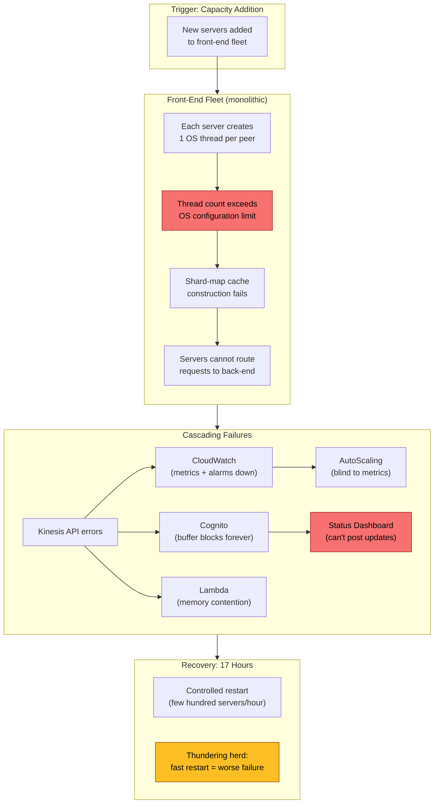
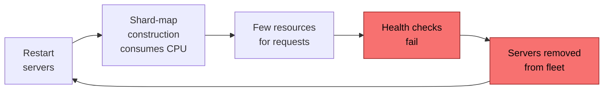

# AWS Kinesis 2020 Outage: Thread Limits, Thundering Herds, and Hidden Dependencies

How a routine capacity addition to Amazon Kinesis Data Streams in US-EAST-1 exceeded an OS thread limit on every front-end server, triggering a 17-hour cascading failure that took down CloudWatch, Lambda, Cognito, and dozens of other AWS services on November 25, 2020—the day before Thanksgiving. This incident is a case study in O(N²) scaling patterns, untested failsafes, and the consequences of monitoring systems that depend on the services they monitor.

<figure>

<figcaption>The failure chain: a capacity addition pushed per-server thread counts past the OS limit, collapsing the entire monolithic front-end fleet. Recovery was throttled to avoid thundering herd effects, extending the outage to 17 hours.</figcaption>
</figure>

## Abstract

The core mental model for this incident is a three-stage failure amplification:

| Stage | What Happened | Why It Was Hard to Fix |
|-------|--------------|----------------------|
| **Trigger** | Adding servers to the front-end fleet pushed per-server OS thread count past the configured limit | Thread-per-peer gossip protocol scaled O(N) per server, O(N²) aggregate—the limit was latent until capacity growth crossed it |
| **Cascade** | Kinesis front-end servers could not build shard-map caches, killing request routing for the entire fleet | The front-end was monolithic (not cellularized)—every server depended on every other server, so the failure was fleet-wide |
| **Recovery** | Restarting servers competed for CPU/memory between shard-map construction and request processing | Restarting too fast triggered thundering herd: servers deemed unhealthy and removed, resetting progress. Only a few hundred servers per hour could safely rejoin |

The secondary failures are equally instructive: CloudWatch depended on Kinesis for metric ingestion, so monitoring went blind. Cognito's "graceful degradation" buffer had a latent bug that blocked forever when full. The Service Health Dashboard could not post updates because its publishing tool authenticated through Cognito. Each layer of supposed fault isolation turned out to share a common dependency.

## Context

### The System

Amazon Kinesis Data Streams is AWS's managed service for real-time data streaming. The architecture relevant to this incident has two layers:

- **Front-end fleet**: Many thousands of servers responsible for authentication, throttling, and routing requests to the correct back-end cluster. Each front-end server maintains a **shard-map cache**—a routing table containing fleet membership, shard ownership, and back-end health data.
- **Back-end clusters**: A cell-based architecture where individual cells own subsets of shards. The back-end was already cellularized at the time of the incident, providing isolation between cells.

The shard-map cache on each front-end server is populated from three sources:

1. A **microservice** that vends fleet membership information
2. **DynamoDB** for authoritative configuration
3. **Inter-server messaging** (a gossip-like protocol) from other front-end servers

The critical architectural detail: each front-end server creates **one OS thread for each other server in the fleet**. This is used for the inter-server communication that propagates shard-map updates, cluster health information, and administrative changes. In a fleet of N servers, each server requires N-1 threads for gossip alone, plus threads for request processing and cache construction.

### The Trigger

**November 25, 2020, 2:44 AM PST**: A routine, relatively small capacity addition to the Kinesis front-end fleet begins—likely in anticipation of Thanksgiving holiday traffic. The addition completes by 3:47 AM PST after roughly one hour of propagation across the fleet.

### Constraints

- **Fleet size**: "Many thousands of servers" in the US-EAST-1 front-end fleet
- **Thread scaling**: Thread count per server scales linearly with fleet size (O(N) per server)
- **Propagation time**: New server discovery takes up to one hour to fully propagate
- **Restart rate**: Only "a few hundred servers per hour" can safely rejoin without triggering cascading failures
- **Dependent services**: CloudWatch, Lambda, Cognito, EventBridge, and dozens of others use Kinesis internally

## The Problem

### Symptoms

Between 3:47 AM and 5:15 AM PST, the newly added servers propagated through the fleet. As each existing server discovered new peers, it attempted to create additional OS threads. This pushed the total thread count on every front-end server past the maximum allowed by the operating system configuration.

When thread creation failed:

1. Shard-map cache construction could not complete
2. Front-end servers were left with incomplete ("useless") shard-maps
3. Servers could no longer route requests to the correct back-end clusters
4. Kinesis put/get API calls began failing fleet-wide

At **5:15 AM PST**, the first alarms fired for Kinesis read/write errors.

### Incident Timeline

| Time (PST) | Event | Action |
|------------|-------|--------|
| 2:44 AM | Capacity addition to front-end fleet begins | Automated routine operation |
| 3:47 AM | Capacity addition completes | — |
| ~3:47–5:15 AM | Thread limits exceeded; shard-map construction fails silently | Latent failure period—no alarms yet |
| **5:15 AM** | First Kinesis error alarms fire; EventBridge begins experiencing API errors | Team paged |
| 6:15 AM | Lambda invocation errors begin (memory contention from CloudWatch metric buffering) | Investigation ongoing |
| **7:51 AM** | Root cause narrowed to candidate set; full fleet restart determined necessary | Decision to restart |
| **9:39 AM** | Root cause confirmed: OS thread limit exceeded on all front-end servers | ~4.5 hours after first alarm |
| 10:07 AM | First front-end servers successfully return to handling traffic | ~2 hours after restart decision |
| 10:15 AM | Cognito mitigation deployment begins | — |
| 10:36 AM | Lambda error rates resolved | — |
| 12:15 PM | Cognito shows significant improvement | — |
| 2:18 PM | Cognito returns to normal | ~9 hours after first alarm |
| 4:15 PM | Majority of ECS/EKS issues resolved | ~11 hours after first alarm |
| 5:47 PM | CloudWatch errors begin declining | — |
| **10:23 PM** | Kinesis fully recovered | **~17 hours after first alarm** |
| 10:31 PM | CloudWatch fully recovered; metric data backfill begins | — |

### Root Cause Analysis

**Investigation process:**

1. **5:15–7:51 AM**: The team investigated multiple hypotheses. The shard-map construction failure was evident, but the underlying cause—thread exhaustion—was not immediately obvious because the symptoms (bad routing data) pointed to the cache layer, not the OS.
2. **7:51 AM**: The team narrowed the root cause to a set of candidates. Regardless of which candidate was correct, any likely cause would require a full restart of the front-end fleet. They made the decision to begin restarting.
3. **9:39 AM**: Root cause confirmed—the OS thread limit had been exceeded on every front-end server.

**The actual root cause**: The thread-per-peer gossip protocol created O(N) thread usage per server. When N increased past a threshold where N-1 gossip threads plus request-handling threads exceeded the OS-configured maximum, all servers failed simultaneously. The failure was silent during the ~90-minute propagation window because shard-map construction fails gracefully (it produces incomplete data rather than crashing), and the alarms that would have detected the degradation had a delay before firing.

### The Specific OS Thread Limit

AWS did not disclose the exact numeric limit. Analysis from multiple sources points to Linux-level thread constraints:

- **`/proc/sys/kernel/pid_max`** — defaults to 32,768 on older kernels (each thread consumes a PID)
- **`ulimit -u` (RLIMIT_NPROC)** — maximum user processes/threads
- **cgroup limits** — if the fleet ran in containers

The Downtime Project's analysis suggests the default Linux thread limit of ~32K was the likely threshold. The precise number matters less than the structural issue: any thread-per-peer design has a hard ceiling that grows closer as the fleet grows.

### Why It Wasn't Obvious

- **The capacity addition was small**: This was not a dramatic change. The fleet was already near the thread limit; the addition simply crossed it.
- **The failure was latent**: Thread limits were exceeded during the ~90-minute gossip propagation window, not at the instant of the capacity change. The gap between cause and visible symptoms was ~2.5 hours.
- **Shard-map failures were silent**: Rather than crashing, servers produced incomplete routing data. This looked like a cache or metadata issue, not a thread exhaustion issue.
- **The monitoring system was also affected**: CloudWatch—the primary observability tool—depended on Kinesis, creating a partial blindness during investigation.

### Detection Gap

**Why it took ~2.5 hours to detect** (2:44 AM trigger → 5:15 AM first alarm):

The capacity addition itself was a normal operation. The thread limit was exceeded gradually as gossip propagated. Shard-map construction degraded silently rather than failing loudly. The detection gap existed because:

1. There was no alarm on per-server thread count approaching the OS limit
2. Shard-map health monitoring did not alert on incomplete (but non-empty) maps
3. The metric pipeline that would surface these signals was itself degrading

**Detection improvements made post-incident:**

- Fine-grained thread consumption alarming—proactive alerts before limits are reached
- Testing of increased OS thread limit configurations
- Dedicated monitoring that does not depend on Kinesis

## Recovery

### Why Initial Recovery Was Difficult

The recovery was constrained by a fundamental resource contention problem. On each front-end server, the resources used to **construct the shard-map cache** compete with the resources used to **process incoming requests**. When a server restarts:

1. It must build a fresh shard-map by querying DynamoDB and communicating with peers
2. While building the map, it must also handle incoming traffic
3. If too many servers restart simultaneously, shard-map construction consumes most CPU and memory
4. Servers that cannot process requests quickly enough are marked **unhealthy** by health checks
5. Unhealthy servers are **removed from the fleet**
6. This resets recovery progress—a classic thundering herd loop

<figure>

<figcaption>The thundering herd loop that constrained recovery speed. Restarting too many servers at once caused health check failures, removing servers faster than they could rejoin.</figcaption>
</figure>

### Recovery Strategy

The team implemented a controlled, multi-step recovery:

1. **Rolled back the capacity addition** — removed the newly added servers to restore the fleet to its previous (known-good) size, ensuring the thread limit would not be exceeded on restarted servers
2. **Changed the metadata fetching strategy** — configured servers to fetch shard-map data directly from DynamoDB (the authoritative store) rather than relying on the gossip protocol, reducing thread requirements during cold start
3. **Controlled rolling restart** — brought servers back at the rate of a few hundred per hour, carefully monitoring each batch to ensure shard-map construction completed before adding more
4. **10:07 AM**: First servers successfully returned to traffic (~2 hours after the restart decision at 7:51 AM)
5. **Progressive improvement** through the day as more servers came online
6. **10:23 PM**: Full Kinesis recovery—approximately 12.5 hours after restarts began

### The Instance Type Decision

A critical corrective action, implemented during and after the incident: AWS migrated the front-end fleet to **larger CPU and memory server instances**. The reasoning:

- Fewer total servers needed to handle the same load → fewer servers in the fleet
- Fewer servers → fewer threads per server (since thread count scales with fleet size)
- More CPU/memory per server → shard-map construction and request processing can coexist without resource contention
- Greater headroom before hitting OS thread limits

This addresses the immediate problem but does not fix the structural O(N²) scaling—that required cellularization (see Corrective Actions).

## Dependent Services Impact

The Kinesis outage revealed a hidden dependency graph across AWS. Services that used Kinesis internally—often for analytics, logging, or event routing—experienced cascading failures with distinct failure modes.

### CloudWatch: The Monitoring System Goes Blind

**How it depended on Kinesis**: CloudWatch uses Kinesis as a buffer for `PutMetricData` and `PutLogEvents` (CloudWatch Logs). When Kinesis failed, metric data could not be ingested.

**Impact**:

- `PutMetricData` and `PutLogEvents` API calls returned errors
- CloudWatch Alarms transitioned to **INSUFFICIENT_DATA** state because no metric data was flowing
- Reactive AutoScaling policies that depended on CloudWatch metrics stopped triggering
- AWS internal teams lost visibility into their own services

**The meta-irony**: The monitoring system's dependency on Kinesis meant that during the outage, operators had degraded ability to observe what was happening across their infrastructure. This blind spot extended to customers: teams could see their services failing but could not correlate the failures through their CloudWatch dashboards.

**Recovery**: 5:47 PM PST early signs of recovery; 10:31 PM full recovery. Metric data was backfilled subsequently.

**Post-incident fix**: AWS deployed a **3-hour local metrics data store** in US-EAST-1 (with global rollout planned) so CloudWatch can persist recent metric data locally even when Kinesis is unavailable.

### Cognito: The Latent Buffer Bug

**How it depended on Kinesis**: Amazon Cognito used Kinesis to ship API usage analytics data.

**The failure**: When Kinesis became unavailable, Cognito's analytics buffer was designed to absorb the backlog gracefully. Instead, a **latent bug** in the buffering code caused it to **block forever when the buffer filled**. Cognito webservers hung on backlogged buffers, causing elevated API failures and increased latencies for User Pools, Identity Pools, and external authentication flows (social sign-in, SAML, OIDC).

This is a textbook example of an untested failsafe. The buffer was designed for Kinesis unavailability, but the scenario (prolonged, complete Kinesis failure) had never been tested. The buffer's blocking behavior transformed a non-critical analytics dependency into a service-killing failure.

**Recovery**: Mitigation deployment began at 10:15 AM; significant improvement by 12:15 PM; normal operations restored at 2:18 PM PST.

**Post-incident fix**: Cognito webservers modified to sustain Kinesis API errors without exhausting buffers; internal buffer capacity increased.

### Lambda: Memory Contention from Metric Buffering

**How it depended on Kinesis**: Indirectly, through CloudWatch. Lambda host systems buffer CloudWatch metric data locally. When CloudWatch ingestion backed up (because Kinesis was down), the buffered data caused **memory contention** on Lambda host systems, crowding out actual function execution resources.

**Impact**: Elevated Lambda invocation errors starting at 6:15 AM PST.

**Recovery**: Mitigation actions resolved the issue by 10:36 AM PST.

### EventBridge: Event Processing Delays

**How it depended on Kinesis**: Amazon EventBridge (CloudWatch Events) relies on Kinesis for event processing pipelines.

**Impact**: Increased API errors and delays in event processing starting at 5:15 AM PST. This cascaded to ECS and EKS, which rely on EventBridge for orchestration events (cluster provisioning, scaling, task de-provisioning).

**Recovery**: ECS/EKS majority resolved by 4:15 PM PST (~11 hours after errors started).

### The Service Health Dashboard: Can't Report the Outage

**How it depended on Kinesis**: Indirectly, through Cognito. The tool AWS operators use to post updates to the public Service Health Dashboard (status.aws.amazon.com) authenticated through Cognito. With Cognito down, operators could not post status updates.

A backup manual tool with fewer dependencies existed, but operators were unfamiliar with its procedures. The result: for an extended period, the official status page showed services as healthy while customers experienced widespread failures.

**Post-incident fix**: Enhanced training on backup Service Health Dashboard tools; development of a manual backup tool with minimal service dependencies.

### Other Affected Services

The following services reported degradation based on status page updates and third-party reporting:

| Service | Dependency Path |
|---------|----------------|
| Amazon Data Firehose | Direct Kinesis dependency |
| AWS IoT Services | Reported to use Kinesis internally |
| Amazon S3 (event notifications) | EventBridge dependency |
| AWS CloudFormation | Multiple AWS API dependencies |
| Amazon Redshift | CloudWatch/logging dependencies |
| Amazon SageMaker | Multiple AWS service dependencies |
| AWS Glue | CloudWatch/logging dependencies |
| Amazon Workspaces | Cognito/authentication dependencies |

## Lessons Learned

### Technical Lessons

#### 1. O(N²) Scaling Patterns Are Time Bombs

**The insight**: Any system where every node must connect to every other node creates O(N²) aggregate resource consumption. In Kinesis's case, N servers each creating N-1 threads meant total thread count across the fleet was N×(N-1). This scales quadratically, but the limit is reached linearly on each individual server. As the fleet grows, the remaining headroom before hitting the per-server limit shrinks—and a "small" capacity addition can cross the threshold.

**How it applies elsewhere:**

- Service meshes with full-mesh connectivity between sidecar proxies
- Gossip protocols where every node communicates with every other node
- Coordination services (ZooKeeper, etcd) where leader election or consensus involves all participants
- Database connection pools where every application server holds a connection to every database node

**Warning signs to watch for:**

- Per-node resource consumption (threads, connections, file descriptors) that grows with cluster size
- Capacity additions that cause disproportionate resource growth on existing nodes
- Resource usage approaching OS or hardware limits that was "fine" at smaller scale

#### 2. Untested Failsafes Are Worse Than No Failsafes

**The insight**: Cognito's analytics buffer was explicitly designed for Kinesis unavailability. But because it was never tested against a prolonged, complete Kinesis failure, it contained a latent bug (blocking when full) that transformed a non-critical analytics dependency into a service-killing failure. A service without any buffer would have simply dropped analytics data and continued serving requests.

**How it applies elsewhere:**

- Circuit breakers that have never tripped in production
- Fallback code paths that have never been exercised under realistic conditions
- Graceful degradation logic that was code-reviewed but never chaos-tested
- Retry policies with backoff that have never been tested under sustained failure

**Warning signs to watch for:**

- Fallback paths that exist in code but have no production metrics (hit rate, latency, error rate)
- Dependencies classified as "non-critical" that have never actually been unavailable
- Buffer implementations without bounded capacity and non-blocking overflow behavior

#### 3. Monitoring Must Not Depend on the Things It Monitors

**The insight**: CloudWatch's dependency on Kinesis created a blindness loop—the system designed to detect failures was itself impaired by the failure. This delayed both detection and recovery for AWS internal teams and customers.

**How it applies elsewhere:**

- Application monitoring that routes through the same load balancers, networks, or services as production traffic
- Alerting systems that depend on the message queues they are supposed to monitor
- Health check infrastructure that shares fate with the services it checks
- Logging pipelines that fail silently when the services they log to are down

**Warning signs to watch for:**

- Your monitoring/alerting pipeline shares any infrastructure component with production services
- During past incidents, you noticed gaps in your observability data
- Your status page or incident communication tools authenticate through production services

#### 4. Cell-Based Architecture Contains Blast Radius

**The insight**: Kinesis's back-end was already cellularized and survived the incident. The front-end was monolithic—every server connected to every other server—so the failure was fleet-wide. Cellularization would have bounded the failure to a single cell, affecting only a fraction of traffic.

**How it applies elsewhere:**

- Any stateless fleet where every node must know about every other node
- Services where a configuration change or deployment rolls across the entire fleet simultaneously
- Systems where a single bad deployment or configuration can affect 100% of capacity

#### 5. Control Plane Operations Must Not Take Down the Data Plane

**The insight**: A capacity change (control plane operation) brought down request processing (data plane). The control plane and data plane shared the same OS-level resources (threads). Strict separation—where control plane operations cannot exhaust data plane resources—would have prevented the outage.

**How it applies elsewhere:**

- Any service where administrative operations (scaling, configuration, deployment) run on the same instances as request processing
- Database systems where schema changes or replication can starve query processing
- Message queues where topic creation or partition rebalancing affects message delivery

### Process Lessons

#### 1. Know Your Recovery Rate Before You Need It

**What happened**: The Kinesis team knew that a full fleet restart was possible but slow. The actual rate—a few hundred servers per hour in a fleet of many thousands—meant recovery took 12+ hours from the point of decision.

**What this means**: For any large stateful fleet, calculate the worst-case recovery time. If it is unacceptable (as 12+ hours would be for most teams), invest in faster cold-start procedures, dedicated cache warming infrastructure, or smaller blast radius through cellularization before the incident occurs.

#### 2. Status Communication Infrastructure Must Be Independent

**What happened**: The Service Health Dashboard could not be updated because its publishing tool depended on Cognito, which depended on Kinesis. The backup tool existed but was unfamiliar to operators.

**What this means**: Test your incident communication tools during gamedays. Ensure they have zero dependency on the services they report on. Drill operators on backup procedures regularly.

## Applying This to Your System

### When This Pattern Applies

You might face similar challenges if:

- Your service uses a **full-mesh communication pattern** (every node connects to every other node)
- Your per-node resource consumption (threads, connections, file descriptors) **scales with cluster size**
- Your **monitoring depends on the same infrastructure** as your production services
- You have **fallback or degradation code paths** that have never been tested under prolonged failure
- Your **control plane and data plane share resources** on the same instances

### Checklist for Evaluation

- [ ] Map your service's per-node resource usage and how it scales with cluster size
- [ ] Identify per-node resource limits (OS thread limits, file descriptor limits, connection pool maximums) and current headroom
- [ ] Trace your monitoring pipeline's dependencies—does it share fate with production?
- [ ] Identify all "non-critical" dependencies and test what happens when each is unavailable for 1+ hours
- [ ] Calculate worst-case fleet restart time and whether it meets your Recovery Time Objective (RTO)
- [ ] Verify your incident communication tools work when your core services are down
- [ ] Test your circuit breakers and fallback paths under sustained (not transient) failure

### Starting Points

If you want to evaluate your risk:

1. **Audit per-node scaling**: For each service, plot per-node resource consumption (threads, connections, memory) against cluster size. If any resource grows linearly with cluster size, you have an O(N²) aggregate pattern.
2. **Test your failsafes**: Run a gameday where a "non-critical" dependency is unavailable for 2+ hours. Observe whether graceful degradation actually works or whether it blocks, leaks, or crashes.
3. **Map monitoring dependencies**: Draw the dependency graph for your monitoring and alerting pipeline. Any shared node with production is a blind-spot risk.
4. **Measure cold-start time**: Restart a single instance of your service and measure time-to-healthy. Multiply by fleet size divided by safe restart batch size. That is your worst-case recovery time.

## Conclusion

The 2020 Kinesis outage is a study in how latent architectural decisions compound into systemic failures. The thread-per-peer gossip protocol was a reasonable design at smaller fleet sizes. The monolithic front-end fleet was simpler to operate than a cellularized one. Cognito's analytics buffer was a thoughtful attempt at graceful degradation. CloudWatch's use of Kinesis for metric ingestion was an efficient architectural choice.

Each decision was defensible in isolation. Together, they created a system where a small capacity addition could exceed a thread limit, collapse an entire fleet, blind the monitoring system, block an authentication service, and prevent operators from even posting status updates—all in a single correlated failure.

The transferable insight is not about thread limits or gossip protocols specifically. It is about recognizing when independently reasonable design choices create hidden coupling: O(N²) resource patterns that approach hard limits, monitoring that shares fate with production, failsafes that have never been tested under realistic failure, and recovery procedures that take longer than anyone has planned for. These patterns exist in most large systems. The question is whether you find them before a capacity change does.

## Appendix

### Prerequisites

- Understanding of distributed systems concepts (gossip protocols, shard-based partitioning, fleet management)
- Familiarity with OS-level resource limits (thread limits, process limits, file descriptors)
- Knowledge of cascading failure patterns (thundering herd, resource contention, correlated failures)
- Basic understanding of AWS service architecture (Kinesis, CloudWatch, Lambda, Cognito)

### Terminology

| Term | Definition |
|------|-----------|
| **Shard-map cache** | A per-server routing table in Kinesis front-end servers containing fleet membership, shard ownership, and back-end health data |
| **Front-end fleet** | The layer of Kinesis servers that handle authentication, throttling, and request routing to back-end clusters |
| **Gossip protocol** | A peer-to-peer communication pattern where each node exchanges state with other nodes to propagate updates across the fleet |
| **Cell-based architecture** | A pattern where infrastructure is divided into independent cells (sub-fleets), each serving a subset of traffic, to contain blast radius |
| **Thundering herd** | A failure pattern where many processes simultaneously attempt the same resource-intensive operation, causing contention that prevents any of them from succeeding |
| **Control plane** | The management layer responsible for configuration, scaling, and orchestration (as opposed to the data plane that handles actual requests) |
| **Data plane** | The layer that processes actual customer requests (as opposed to the control plane that manages the system) |
| **O(N²) scaling** | A growth pattern where aggregate resource consumption grows quadratically with the number of nodes—common in full-mesh communication topologies |
| **RLIMIT_NPROC** | A Linux resource limit that caps the maximum number of processes (and threads) a user can create |
| **pid_max** | A Linux kernel parameter (`/proc/sys/kernel/pid_max`) that sets the maximum PID value, effectively capping the total number of concurrent processes/threads |

### Summary

- A routine capacity addition to the Kinesis front-end fleet pushed per-server OS thread counts past the configured limit, because the gossip protocol created one thread per peer (O(N) per server, O(N²) aggregate)
- Every front-end server failed simultaneously—the fleet was monolithic (not cellularized), so there was no blast radius containment
- Recovery took ~17 hours because restarting servers too quickly triggered thundering herd effects: shard-map construction starved request processing, health checks failed, and servers were removed faster than they could rejoin
- CloudWatch depended on Kinesis for metric ingestion, creating a monitoring blind spot during the incident; Cognito's untested buffer bug blocked authentication; the Service Health Dashboard could not post updates because it authenticated through Cognito
- AWS committed to cellularizing the front-end fleet, migrating to larger instances, deploying fine-grained thread alarming, and isolating CloudWatch onto a separate partitioned fleet

### References

- [Summary of the Amazon Kinesis Event in the Northern Virginia (US-EAST-1) Region](https://aws.amazon.com/message/11201/) — AWS Official Post-Event Summary, November 2020. Primary source for all timeline, root cause, and corrective action details.
- [AWS Post-Event Summaries](https://aws.amazon.com/premiumsupport/technology/pes/) — AWS index of all public post-event summaries.
- [Guidance for Cell-Based Architecture on AWS](https://aws.amazon.com/solutions/guidance/cell-based-architecture-on-aws/) — AWS architectural guidance directly influenced by lessons from this and similar incidents.
- [Lessons from the AWS Kinesis Outage](https://www.evanjones.ca/kinesis-outage.html) — Evan Jones. Analysis of O(N²) scaling, recovery constraints, and Cognito's untested failsafe.
- [AWS Kinesis Outage](https://linuxczar.net/blog/2020/12/07/aws-kinesis-outage/) — LinuxCzar. Analysis of Linux kernel thread limits and symptom-based vs. cause-based alerting.
- [Kinesis Hits the Thread Limit](https://downtimeproject.com/podcast/kinesis-hits-the-thread-limit/) — The Downtime Project podcast. Detailed architectural reconstruction of the gossip protocol and thread model.
- [AWS Kinesis Outage Analysis](https://ryanfrantz.com/posts/aws-kinesis-outage-analysis.html) — Ryan Frantz. Analysis of dependency chains and the coupling of CloudWatch with EventBridge.
- [AWS reveals it broke itself by exceeding OS thread limits](https://www.theregister.com/2020/11/30/aws_outage_explanation/) — The Register. Reporting on the AWS postmortem with customer impact context.
- [AWS admits to 'severely impaired' services in US-EAST-1](https://www.theregister.com/2020/11/25/aws_down/) — The Register. Day-of reporting with affected service list and customer impact.
