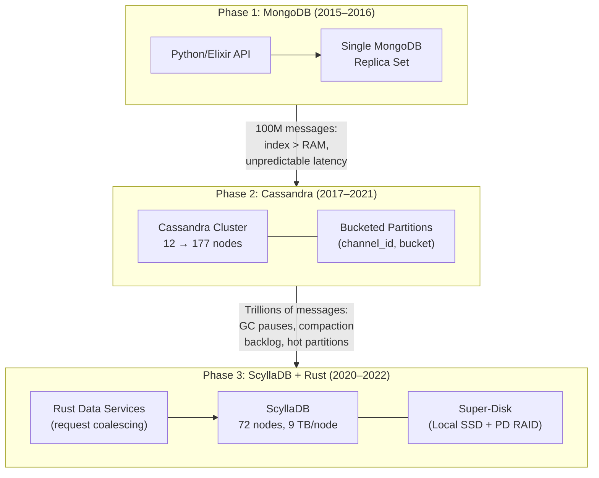

# Discord: From Billions to Trillions of Messages — A Three-Database Journey

How Discord evolved its message storage from a single MongoDB replica set to Cassandra to ScyllaDB over 8 years, building Rust-based data services and a custom "super-disk" storage architecture along the way — reducing cluster size from 177 to 72 nodes while dropping p99 read latency from 125ms to 15ms.

<figure>



<figcaption>Discord's message storage evolution across three phases, from a MongoDB replica set to a ScyllaDB cluster with Rust data services.</figcaption>
</figure>

## Abstract

Discord's message storage story is a case study in outgrowing databases — twice — and building the infrastructure layer that makes the final choice work. The mental model:

| Phase                           | Trigger                                                                                                             | Solution                                                                                                               | Key Insight                                                                                                                                           |
| ------------------------------- | ------------------------------------------------------------------------------------------------------------------- | ---------------------------------------------------------------------------------------------------------------------- | ----------------------------------------------------------------------------------------------------------------------------------------------------- |
| **MongoDB** (2015–2016)         | 100M messages; index exceeded RAM; latency became unpredictable                                                     | Migrate to Cassandra for linear scalability and predictable performance                                                | Plan for migration from day one — Discord's MongoDB schema was designed to port cleanly                                                               |
| **Cassandra** (2017–2021)       | Trillions of messages; JVM GC pauses, compaction backlogs, hot partitions caused cascading latency and on-call toil | Migrate to ScyllaDB (C++, no GC) with Rust data services for request coalescing                                        | The database alone isn't the bottleneck — the access pattern layer above it (data services) determines whether hot partitions cascade or get absorbed |
| **ScyllaDB + Rust** (2020–2022) | Needed lower latency, better workload isolation, and reduced operational burden                                     | ScyllaDB's shard-per-core model + custom Rust migrator (3.2M msgs/sec) + super-disk (Local SSD + Persistent Disk RAID) | Rewriting the migration tool in Rust cut the timeline from 3 months to 9 days — sometimes the bottleneck is the migration itself                      |

**The transferable insight**: Discord didn't just swap databases — they added an entire data services layer between the application and the database. This layer (request coalescing, consistent hash routing) absorbed the read amplification that no database could handle alone. The lesson: when your access patterns create hot spots that even a well-tuned database can't serve, move the coalescing logic outside the database.

## Context

### The System

Discord is a real-time communication platform handling text, voice, and video across millions of servers (communities). Every text message — whether in a 5-person group chat or a 1-million-member server — passes through the same message storage infrastructure.

| Metric                   | 2017     | Early 2022           | Post-Migration (2022) |
| ------------------------ | -------- | -------------------- | --------------------- |
| Messages stored          | Billions | Trillions            | Trillions             |
| Messages per day         | 120M+    | ~4B (peak, Aug 2022) | ~4B                   |
| Cassandra/ScyllaDB nodes | 12       | 177                  | 72 (ScyllaDB)         |
| Storage per node         | ~1 TB    | ~4 TB                | ~9 TB                 |
| Backend engineers (2017) | 4        | —                    | —                     |
| Replication factor       | 3        | 3                    | 3                     |

### The Access Pattern

Discord's message access pattern is what makes storage hard. Three distinct workload profiles coexist in the same cluster:

1. **Voice-heavy servers**: Under 1,000 messages per year. Tiny partitions, rarely read.
2. **Private text channels**: 100K–1M messages per year. Moderate write volume, infrequent reads.
3. **Large public servers**: Millions of messages per year. Heavy writes, frequent reads of recent messages, with occasional jumps to historical messages.

The critical property: the read/write ratio is approximately 50/50, and reads are extremely random — users jump to arbitrary points in a channel's history, scroll backward, search, and pin messages. This rules out write-optimized stores that sacrifice random read performance.

### The Architecture

Discord's message storage sits behind an API monolith (originally Python, later Elixir for real-time features). Messages flow through WebSocket gateways for real-time delivery, but every message is also persisted to the message store for retrieval. The persistence path — the focus of this case study — evolved through three database systems over 8 years.

## Phase 1: MongoDB (2015–2016)

### The Starting Point

When Discord launched in May 2015, the team intentionally chose a single MongoDB replica set for all data, including messages. The engineering philosophy was explicit: build quickly, but design the schema for portability.

Messages were indexed on a compound key of `(channel_id, created_at)`, and the entire application — user data, server metadata, messages — lived in one replica set.

### Where It Broke

By November 2015 — six months after launch — Discord had stored 100 million messages. At this point, the data and indexes could no longer fit in RAM. MongoDB's performance became unpredictable: random reads that previously completed in milliseconds now hit disk, and latencies spiked erratically.

The team had anticipated this. Discord's co-founder Stanislav Vishnevskiy had designed the MongoDB schema to be migration-friendly from the start. The question wasn't whether to migrate — it was where.

### Requirements for the Next Database

The team identified concrete requirements:

- **Linear scalability**: Adding nodes should increase capacity proportionally, without resharding
- **Automatic failover**: No manual intervention for node failures
- **Low maintenance**: A team of 4 backend engineers with no dedicated operations staff could not afford a high-touch database
- **Proven at scale**: Netflix and Apple ran Cassandra clusters with thousands of nodes
- **Predictable performance**: Target of sub-80ms at p95 for API responses
- **Open source**: Avoiding vendor lock-in

Cassandra met every requirement. The migration from MongoDB to Cassandra happened in early 2017.

## Phase 2: Cassandra (2017–2021)

### Data Model Design

The Cassandra data model is the heart of Discord's storage story. Every design decision here had consequences that played out over the next 5 years.

#### Message IDs: Snowflake Format

Discord assigns each message a **Snowflake ID** — a 64-bit integer that encodes the creation timestamp, making IDs chronologically sortable. This is the same approach Twitter pioneered. Using Snowflake IDs as the clustering key instead of raw timestamps eliminates collision risk: two messages sent in the same millisecond get distinct IDs, whereas timestamps would collide.

#### Initial Schema: Unbounded Partitions

The first Cassandra schema used `(channel_id, message_id)` as the primary key — channel ID as the partition key, message ID as the clustering key with descending sort order:

```sql title="Initial Cassandra Schema"
CREATE TABLE messages (
  channel_id bigint,
  message_id bigint,
  author_id bigint,
  content text,
  -- ... additional columns
  PRIMARY KEY (channel_id, message_id)
) WITH CLUSTERING ORDER BY (message_id DESC);
```

This meant every message in a channel lived in a single partition. For small servers, this was fine. For large public servers with millions of messages, partitions grew unboundedly.

#### The Problem: Partition Size

Cassandra warns at 100 MB partitions and begins to degrade significantly as partitions approach 2 GB. Large partitions cause excessive Garbage Collection (GC) pressure during compaction because the JVM must hold partition data in memory to merge SSTables (Sorted String Tables). A channel with years of chat history could easily exceed these thresholds.

#### The Solution: Time-Based Bucketing

Discord introduced a **bucket** — a static 10-day time window — as part of the partition key:

```sql title="Bucketed Cassandra Schema" {3}
CREATE TABLE messages (
  channel_id bigint,
  bucket int,
  message_id bigint,
  author_id bigint,
  content text,
  PRIMARY KEY ((channel_id, bucket), message_id)
) WITH CLUSTERING ORDER BY (message_id DESC);
```

The bucket value is derived from the message timestamp relative to a `DISCORD_EPOCH` (January 1, 2015). Even the busiest Discord channels generate partitions well under 100 MB in a 10-day window.

**The trade-off**: Fetching 50 messages from an inactive channel might require querying multiple buckets sequentially — the query generates bucket ranges from the timestamp and scans them in reverse chronological order until it collects enough messages. For active channels (the common case), a single bucket query returns results immediately. Discord accepted this trade-off: the vast majority of reads hit recent messages in active channels.

### Production at 12 Nodes

By early 2017, Discord's Cassandra cluster ran on 12 nodes with a replication factor of 3, storing approximately 1 TB of compressed data per node. Write latency was sub-millisecond; read latency was under 5 milliseconds. The team of 4 backend engineers managed the cluster without dedicated operations staff.

### Production Issues

#### Tombstone Accumulation

Cassandra does not delete data immediately. A delete operation writes a **tombstone** — a special marker indicating the row is deleted. Tombstones persist for a configurable period (`gc_grace_seconds`, defaulting to 10 days) to ensure deletions propagate across all replicas before the data is physically removed during compaction.

Discord's message schema had 16 columns, but the average message only populated 4 of them. Because Cassandra treats all writes as upserts, writing `null` values for unused columns generated tombstones — 12 unnecessary tombstones per message insert. At hundreds of millions of messages per day, this created enormous tombstone accumulation.

**The fix**: Only write non-null columns. This required changing the write path to construct sparse inserts rather than full-row upserts.

#### The Tombstone Cascade (6 Months Post-Launch)

The most dramatic incident hit the Puzzles & Dragons Subreddit public Discord server. A channel with only 1 visible message took 20 seconds to load. Investigation revealed millions of tombstones from bulk API deletions — users or bots had deleted massive numbers of messages, and every deletion created a tombstone that Cassandra had to scan on reads.

The tombstones triggered continuous 10-second stop-the-world GC pauses on the nodes serving that partition. Because Discord used quorum consistency (reads require responses from 2 of 3 replicas), GC pauses on one node propagated latency to every query hitting those replicas.

**Solutions implemented**:

1. Reduced `gc_grace_seconds` from 10 days to 2 days (safe because nightly repairs ensured tombstone propagation)
2. Modified query code to track empty buckets and skip them on subsequent reads, avoiding full tombstone scans

#### Eventual Consistency Race Conditions

Cassandra's "last write wins" conflict resolution created a subtle bug. When a user edited a message while another user simultaneously deleted it, the edit (an upsert of the `content` column) would resurrect the row — but only with the primary key and the edited column. All other columns (including `author_id`) remained null, creating ghost rows.

**The fix**: On read, if a message row was missing the `author_id` column, Discord treated it as deleted and issued a cleanup delete.

### Scaling Pains (2020–2022)

As Discord grew from billions to trillions of messages and the cluster expanded from 12 to 177 nodes, three problems became chronic:

#### Hot Partitions

Large public servers like gaming communities or cryptocurrency channels generated disproportionate traffic on specific `(channel_id, bucket)` partitions. When thousands of users simultaneously read from the same channel, the nodes holding that partition's replicas became overloaded. With quorum consistency, all queries to those nodes — including queries for unrelated channels that happened to hash to the same nodes — suffered latency spikes.

#### Compaction Backlog

Cassandra compacts SSTables in the background to merge data and remove tombstones, improving read performance. When compaction fell behind — common under sustained write load — reads had to scan more SSTables per query, increasing latency and disk I/O. This created a cascading effect: higher latency increased queue depth, which increased node load, which further delayed compaction.

The team developed a manual procedure called the **"gossip dance"**: take a node out of the Cassandra ring to let it compact without serving traffic, bring it back to receive hinted handoff data from peers, and repeat until the compaction backlog cleared. This was time-consuming and required operator intervention.

#### JVM Garbage Collection

The most persistent operational burden was the JVM's garbage collector. Discord spent significant time tuning GC settings and heap sizes. Despite tuning, GC pauses caused latency spikes ranging from brief hiccups to multi-second stop-the-world pauses severe enough to require manual node reboots. These events were frequent enough to be a major source of on-call toil.

The cluster had become, in the team's words, a "high-toil system" — requiring constant babysitting to maintain acceptable performance.

## Options Considered

By 2020, Discord had already migrated every database except the message store to ScyllaDB. The team evaluated their options for the largest and most critical cluster.

### Option 1: Continue Tuning Cassandra

**Approach**: Invest in JVM tuning, compaction strategy optimization, and operational automation.

**Pros**:

- No migration risk
- Existing team expertise

**Cons**:

- GC pauses are fundamental to the JVM — tuning mitigates but cannot eliminate them
- Hot partitions are a Cassandra architectural limitation
- Compaction backlog requires manual intervention regardless of tuning
- On-call burden would persist

**Why not chosen**: The problems were architectural, not configurational. More tuning would yield diminishing returns.

### Option 2: Horizontal Sharding / Cluster Splitting

**Approach**: Split the monolithic Cassandra cluster into multiple smaller clusters, routing by channel type or server size.

**Pros**:

- Reduces blast radius of hot partitions
- Smaller clusters compact faster

**Cons**:

- Does not solve GC pauses
- Increases operational complexity (multiple clusters to manage)
- Routing logic adds application complexity
- Hot partitions still affect individual clusters

**Why not chosen**: Splitting clusters addresses symptoms but not root causes. The same problems would recur at smaller scale.

### Option 3: Migrate to ScyllaDB

**Approach**: Replace Cassandra with ScyllaDB — a Cassandra-compatible database written in C++ with a shard-per-core architecture that eliminates GC pauses entirely.

**Pros**:

- No garbage collection (C++ runtime)
- Shard-per-core architecture provides workload isolation — a hot partition on one core does not affect other cores on the same node
- Cassandra Query Language (CQL) compatible — same schema, same queries
- Discord already had ScyllaDB experience from other clusters
- Faster repairs (critical for tombstone management)

**Cons**:

- Migration of trillions of messages carries risk
- ScyllaDB's reverse query performance was initially insufficient for Discord's read patterns (messages sorted descending)

**Why chosen**: ScyllaDB addressed every root cause: no GC, better workload isolation, and Cassandra compatibility meant the schema and queries could migrate without application changes. The reverse query performance gap was raised with ScyllaDB's engineering team, who prioritized and shipped an improvement before Discord's migration.

### Decision Factors

| Factor                   | Tune Cassandra       | Split Clusters | Migrate to ScyllaDB      |
| ------------------------ | -------------------- | -------------- | ------------------------ |
| GC pauses eliminated     | No                   | No             | **Yes**                  |
| Hot partition isolation  | No                   | Partial        | **Yes (shard-per-core)** |
| Compaction behavior      | Marginal improvement | Same           | **Improved**             |
| Migration risk           | None                 | Low            | Medium                   |
| Schema changes required  | None                 | None           | None (CQL compatible)    |
| On-call burden reduction | Marginal             | Moderate       | **Significant**          |
| Prior team experience    | High                 | High           | High (other clusters)    |

## Implementation

### Architecture: Rust Data Services

Before migrating the database, Discord built an entirely new layer between the API monolith and the database: **data services**, written in Rust using the Tokio async runtime.

#### Why an Intermediate Layer?

The API monolith connected directly to Cassandra. Every user request that loaded messages generated a database query. When a popular channel was active, thousands of concurrent users might request the same messages simultaneously — each triggering an independent database read. This amplified hot partition pressure: the database didn't just handle one read for a popular channel, it handled thousands of identical reads.

Data services solved this with two mechanisms:

**1. Request Coalescing**

When the first request for a given channel arrives at the data service, it spawns a worker task that executes the database query. Any subsequent requests for the same data that arrive while the worker is in-flight subscribe to the worker's result instead of issuing duplicate queries. When the database responds, all subscribers receive the result from that single query.

This transforms N concurrent reads for the same channel into 1 database query, dramatically reducing load on hot partitions.

**2. Consistent Hash Routing**

Each request to the data service includes a routing key (the `channel_id`). The system uses consistent hashing to route all requests for the same channel to the same data service instance. This concentrates coalescing opportunities — if requests for the same channel were spread across multiple instances, each instance would issue its own database query.

#### Design Constraints

Data services are intentionally thin:

- Each gRPC endpoint maps 1:1 to a database query
- No business logic — pure data access
- Stateless except for in-flight request tracking
- Written in Rust for predictable latency (no GC) and safe concurrency (ownership model prevents data races in the coalescing logic)

### ScyllaDB's Shard-Per-Core Architecture

ScyllaDB's key architectural difference from Cassandra is its **shard-per-core** model. Each CPU core is assigned a subset of the data and processes requests for that data independently, with its own memory allocator and I/O scheduler. There is no shared mutable state between cores, eliminating the locks and coordination overhead that cause contention in multi-threaded JVM applications.

For Discord, this meant a hot partition on one core did not degrade performance for queries served by other cores on the same node — a fundamental improvement over Cassandra, where GC pauses and lock contention affected the entire JVM process.

### Super-Disk: Hybrid Storage on GCP

Discord runs on Google Cloud Platform (GCP). Standard Persistent Disks deliver 1–2ms latency per I/O operation — adequate for many workloads, but insufficient for a database serving 2 million requests per second. Local SSDs offer ~0.5ms latency but are ephemeral: if the instance migrates or restarts, Local SSD data is lost.

Discord engineered a **super-disk** configuration combining both:

1. **RAID0** across multiple Local SSDs (375 GB each, NVMe) for aggregated capacity and parallel read throughput
2. **RAID1** (mirror) between the RAID0 array and a Persistent Disk, with the Persistent Disk marked `write-mostly` to exclude it from read balancing

This gives reads the latency of Local SSDs (~0.5ms) while writes propagate to the Persistent Disk for durability and snapshot capability. If Local SSD data is lost during a host migration (GCP replaces the entire host if any Local SSD fails), the node can rebuild from the Persistent Disk mirror and Cassandra/ScyllaDB's replication.

**Impact**: I/O wait dropped 50–75% compared to Persistent Disk alone, eliminating the query queueing that occurred during traffic peaks.

### Migration Strategy

#### Phase 1: Dual Writes (New Data)

Discord established a cutover timestamp. All new messages after this timestamp were written to both Cassandra and ScyllaDB. The API monolith continued reading from Cassandra while the ScyllaDB cluster warmed up.

#### Phase 2: Historical Migration (The Bottleneck)

The initial plan used Apache Spark to read token ranges from Cassandra and write them to ScyllaDB. Estimated timeline: **3 months**.

The team rejected this timeline and built a custom migrator in Rust. The Rust migrator:

- Read token ranges directly from Cassandra
- Checkpointed progress via SQLite (enabling restarts without re-scanning)
- Wrote to ScyllaDB with high-throughput concurrent inserts
- Achieved **3.2 million messages per second** migration throughput

Estimated timeline with the Rust migrator: **9 days**.

#### Challenge: Tombstone Compaction

During migration, the team discovered that gigantic tombstone ranges in Cassandra — accumulated over years — had to be compacted before data could be cleanly read and transferred. The migrator handled this by triggering targeted compaction on specific token ranges before reading them.

#### Phase 3: Validation

Discord mirrored a percentage of live read traffic to both databases simultaneously, comparing responses. Discrepancies were logged and investigated. This ran for weeks before switching reads to ScyllaDB.

#### Cutover

In **May 2022**, Discord switched the primary read path from Cassandra to ScyllaDB. The Cassandra cluster was decommissioned.

## Outcome

### Metrics Comparison

| Metric                  | Cassandra (Early 2022)          | ScyllaDB (Post-Migration) | Change                  |
| ----------------------- | ------------------------------- | ------------------------- | ----------------------- |
| Cluster nodes           | 177                             | 72                        | **59% reduction**       |
| Storage per node        | ~4 TB                           | ~9 TB                     | 2.25x density           |
| Historical reads p99    | 40–125 ms                       | 15 ms                     | **5–8x improvement**    |
| Message inserts p99     | 5–70 ms                         | 5 ms (stable)             | **Eliminated variance** |
| GC-related incidents    | Frequent (major on-call burden) | None                      | **Eliminated**          |
| Compaction intervention | Regular ("gossip dance")        | None required             | **Eliminated**          |

### Operational Impact

The most significant outcome was not the latency improvement — it was the elimination of operational toil. After the migration:

- No weekend firefights related to the message database
- No manual compaction procedures
- No GC tuning cycles
- The on-call burden for the persistence team dropped dramatically

### World Cup Validation

In December 2022, the FIFA World Cup Final generated massive concurrent traffic on Discord. The ScyllaDB cluster showed 9 distinct traffic spikes correlating with match events (goals, penalties, halftime). The system handled every spike without degradation — demonstrating the stability the team had been unable to achieve with Cassandra.

### Timeline

| Milestone                                  | Date          |
| ------------------------------------------ | ------------- |
| Discord launches on MongoDB                | May 2015      |
| MongoDB hits 100M messages, scaling limits | November 2015 |
| Cassandra migration complete               | Early 2017    |
| First blog post (12 Cassandra nodes)       | January 2017  |
| ScyllaDB adopted for other databases       | 2020          |
| Super-disk architecture deployed           | 2022          |
| Rust data services layer built             | 2021–2022     |
| ScyllaDB migration for messages begins     | Early 2022    |
| Primary read path switched to ScyllaDB     | May 2022      |
| World Cup Final validation                 | December 2022 |
| Second blog post (72 ScyllaDB nodes)       | March 2023    |

## Lessons Learned

### Technical Lessons

#### 1. The Access Pattern Layer Matters More Than the Database

**The insight**: Discord's hot partition problem was not solvable by any database alone. Thousands of concurrent users reading the same channel would overload any partition-based storage system. The Rust data services layer — specifically request coalescing with consistent hash routing — reduced database load by orders of magnitude on hot channels.

**How it applies elsewhere**: If your workload has natural hot spots (popular content, viral events, shared resources), adding a coalescing layer between your application and database can be more effective than scaling the database itself. The coalescing logic is simple: deduplicate in-flight requests by key, fan out results.

**Warning signs you need this**:

- Latency spikes correlate with specific content popularity, not overall load
- Database metrics show repeated identical queries within short time windows
- Adding database replicas doesn't proportionally reduce hot-spot latency

#### 2. Garbage Collection Is a Fundamental Constraint, Not a Tuning Problem

**The insight**: Discord spent years tuning JVM GC for Cassandra. Despite extensive effort, GC pauses remained the primary source of latency spikes and operational incidents. Migrating to ScyllaDB (C++, no GC) eliminated the entire category of problems.

**How it applies elsewhere**: If your database runs on the JVM (Cassandra, HBase, Elasticsearch) and GC tuning consumes significant engineering time, evaluate whether a non-JVM alternative exists. The engineering time spent on tuning may exceed the migration cost.

**Warning signs you need this**:

- On-call pages frequently trace to GC pauses
- Latency SLOs are violated by GC-induced outliers, not sustained load
- GC tuning changes fix one workload but regress another

#### 3. Migration Tooling Can Be the Bottleneck

**The insight**: The standard approach (Apache Spark migrator) would have taken 3 months. The custom Rust migrator completed the same work in 9 days — a 10x improvement that took approximately one day to build. The Rust migrator's advantage was simple: high-throughput concurrent I/O without framework overhead.

**How it applies elsewhere**: Before committing to a multi-month migration timeline, evaluate whether a purpose-built migration tool could drastically reduce the window. A shorter migration means less time running dual systems, less risk of divergence, and faster rollback if needed.

#### 4. Design Schemas for Portability

**The insight**: Discord designed its MongoDB schema anticipating migration from day one. When the time came to move to Cassandra, the data model translated cleanly. When moving from Cassandra to ScyllaDB, CQL compatibility meant zero schema changes.

**How it applies elsewhere**: Use standard data types and avoid database-specific features in your core data model. If your schema relies on database-specific features (MongoDB's `$push` operators, Cassandra's counters, PostgreSQL's JSONB operators), migration costs increase dramatically.

### Process Lessons

#### 1. Migrate Incrementally, Validate Continuously

**What they learned**: Discord's migration used dual writes for new data, a fast backfill for historical data, and continuous read-path validation before cutover. At no point was there a "big bang" switch.

**What they'd do differently**: The initial Spark-based migration estimate was accepted before exploring alternatives. Building the Rust migrator earlier would have reduced the pressure on the overall timeline.

#### 2. Build the Infrastructure Layer Before Migrating

**What they learned**: The Rust data services layer was built before the ScyllaDB migration. This meant the database migration was decoupled from the application — the data services presented the same interface regardless of which database backed them. This reduced migration risk and simplified rollback.

### Organizational Lessons

#### 1. Small Teams, Purpose-Built Tools

Discord's persistence team built the Rust data services library, the custom migrator, and the super-disk storage architecture. Rather than adopting complex orchestration frameworks, they built focused tools: the migrator was a single-purpose Rust binary with SQLite checkpointing. The data services library was a thin gRPC layer. Each tool did one thing well.

#### 2. Prior Experience Reduces Risk

By the time Discord migrated their message store to ScyllaDB, they had already operated ScyllaDB for every other database in their infrastructure. The message store was intentionally the last migration — tackling the largest and most critical cluster only after building confidence on smaller ones.

## Applying This to Your System

### When This Pattern Applies

You might face similar challenges if:

- Your database runs on the JVM and GC pauses cause latency outliers
- You have natural hot spots in your workload (popular channels, viral content, shared resources)
- Your cluster has grown to the point where compaction can't keep up with writes
- On-call toil for your database is a significant engineering burden

### Checklist for Evaluation

- [ ] Are your worst latency spikes caused by GC pauses rather than query complexity?
- [ ] Do you have hot partitions that degrade performance for unrelated queries on the same nodes?
- [ ] Would request coalescing (deduplicating identical in-flight reads) significantly reduce your query volume?
- [ ] Is your migration timeline the primary blocker for a database change?

### Starting Points

1. **Measure coalescing opportunity**: Log duplicate queries within short time windows (100ms). If >10% of reads are duplicates, a coalescing layer will help.
2. **Profile GC impact**: Track what percentage of your p99 latency is attributable to GC pauses vs. actual query execution. If GC dominates, evaluate non-JVM alternatives.
3. **Prototype a Rust/Go migrator**: Before committing to Spark or other frameworks for large data migrations, build a simple concurrent reader/writer and benchmark it. The throughput difference can be dramatic.

## Conclusion

Discord's message storage journey — MongoDB to Cassandra to ScyllaDB — spans 8 years and three fundamentally different databases. But the most impactful change was not any single database migration. It was the decision to build a Rust-based data services layer that absorbed hot-partition pressure through request coalescing and consistent hash routing. This layer transformed an impossible database workload (thousands of concurrent identical reads) into a manageable one (single reads, fanned out to subscribers).

The ScyllaDB migration eliminated the JVM's garbage collection — Discord's most persistent operational burden — while the shard-per-core architecture provided the workload isolation that Cassandra's shared-JVM model could not. The custom Rust migrator proved that migration tooling itself can be a first-class engineering investment: one day of development saved nearly 3 months of migration time.

The pattern is reproducible. If you're running a JVM-based database at scale and spending engineering time on GC tuning, the combination of a non-JVM database with an application-level coalescing layer addresses the root causes — not just the symptoms.

## Appendix

### Prerequisites

- Familiarity with Cassandra's partition model (partition keys, clustering keys, SSTables, compaction)
- Understanding of JVM garbage collection concepts (stop-the-world pauses, heap sizing)
- Basic knowledge of consistent hashing and request routing

### Terminology

| Term                   | Definition                                                                                                                                       |
| ---------------------- | ------------------------------------------------------------------------------------------------------------------------------------------------ |
| **Snowflake ID**       | A 64-bit unique identifier encoding a timestamp, making IDs chronologically sortable. Originated at Twitter; adopted by Discord for message IDs. |
| **Partition key**      | In Cassandra/ScyllaDB, the part of the primary key that determines which node(s) store the data. Discord uses `(channel_id, bucket)`.            |
| **Clustering key**     | In Cassandra/ScyllaDB, the part of the primary key that determines sort order within a partition. Discord uses `message_id DESC`.                |
| **Tombstone**          | A special marker in Cassandra/ScyllaDB indicating a deleted row. Persists until compaction removes it after `gc_grace_seconds`.                  |
| **SSTable**            | Sorted String Table — Cassandra/ScyllaDB's immutable on-disk data format. Multiple SSTables are merged during compaction.                        |
| **Compaction**         | Background process that merges SSTables, removes tombstones, and optimizes read performance. Falling behind on compaction degrades reads.        |
| **Shard-per-core**     | ScyllaDB's architecture where each CPU core owns a subset of data and processes requests independently, eliminating cross-core coordination.     |
| **Request coalescing** | Deduplicating identical in-flight requests so that multiple requesters share a single database query's result.                                   |
| **Super-disk**         | Discord's hybrid storage configuration combining Local SSDs (RAID0) with Persistent Disk (RAID1) for low-latency reads with durable writes.      |
| **CQL**                | Cassandra Query Language — the SQL-like query language used by both Cassandra and ScyllaDB.                                                      |
| **gc_grace_seconds**   | Cassandra/ScyllaDB configuration controlling how long tombstones persist before physical removal. Default: 10 days. Discord reduced to 2 days.   |

### Summary

- Discord outgrew MongoDB at 100M messages (index exceeded RAM), migrated to Cassandra in 2017, then migrated to ScyllaDB in 2022 after Cassandra's JVM GC pauses and compaction backlogs became operationally unsustainable at 177 nodes
- Time-based bucket partitioning (`(channel_id, bucket)` with 10-day windows) solved Cassandra's large-partition problem but could not solve hot partitions from popular channels
- Rust data services with request coalescing and consistent hash routing transformed thousands of concurrent identical reads into single database queries — the most impactful architectural change
- A custom Rust migrator achieved 3.2M messages/second, completing the migration in 9 days instead of the 3-month Spark estimate
- ScyllaDB's shard-per-core model eliminated GC pauses and provided workload isolation that Cassandra could not — reducing the cluster from 177 to 72 nodes while improving p99 read latency from 125ms to 15ms
- The super-disk architecture (Local SSD + Persistent Disk RAID) reduced I/O latency by 50–75% on GCP

### References

- [How Discord Stores Billions of Messages](https://discord.com/blog/how-discord-stores-billions-of-messages) — Stanislav Vishnevskiy, Discord Blog, January 2017
- [How Discord Stores Trillions of Messages](https://discord.com/blog/how-discord-stores-trillions-of-messages) — Bo Ingram, Discord Blog, March 2023
- [How Discord Supercharges Network Disks for Extreme Low Latency](https://discord.com/blog/how-discord-supercharges-network-disks-for-extreme-low-latency) — Glen Oakley, Discord Blog, August 2022
- [How Discord Migrated Trillions of Messages from Cassandra to ScyllaDB](https://www.scylladb.com/tech-talk/how-discord-migrated-trillions-of-messages-from-cassandra-to-scylladb/) — Bo Ingram, ScyllaDB Summit 2023
- [ScyllaDB Shard-per-Core Architecture](https://www.scylladb.com/product/technology/shard-per-core-architecture/) — ScyllaDB Documentation
- [Discord Migrates Trillions of Messages from Cassandra to ScyllaDB](https://www.infoq.com/news/2023/06/discord-cassandra-scylladb/) — InfoQ, June 2023
