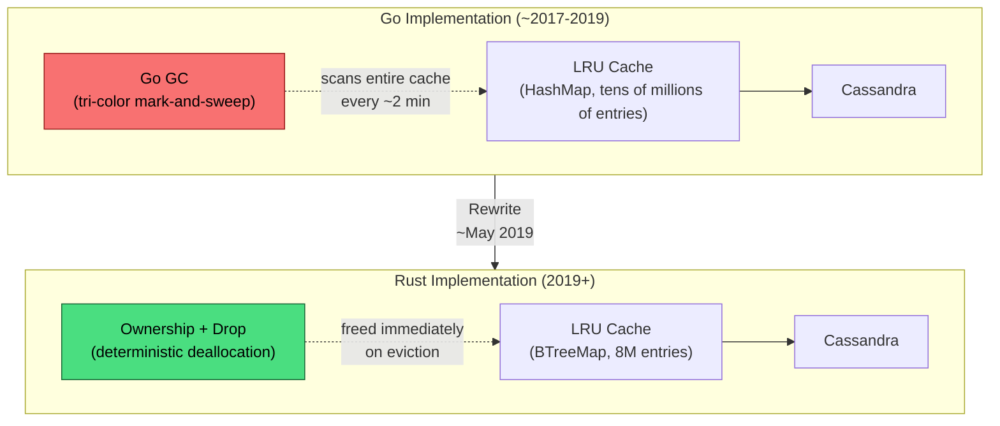
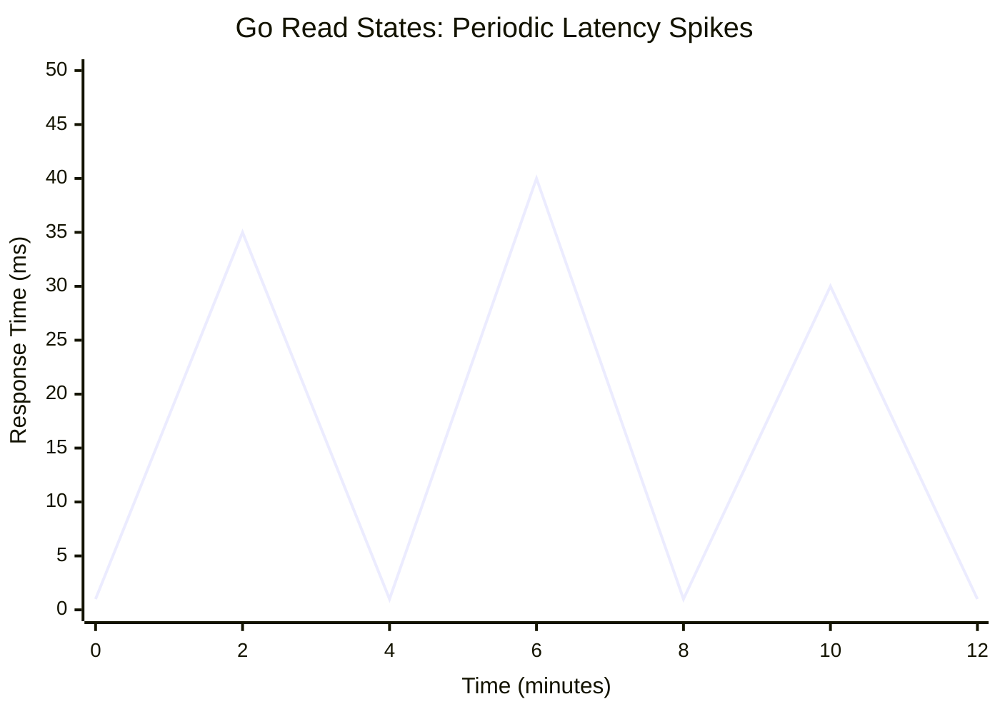

# Discord: Rewriting Read States from Go to Rust

How Discord eliminated periodic latency spikes in their most heavily accessed service by rewriting it from Go to Rust—and why the garbage collector, not the application code, was the bottleneck. The Read States service tracks which channels every user has read across billions of states, and its performance directly affects every connection, every message send, and every message acknowledgment on the platform.

<figure>



<figcaption>Discord's Read States service before and after the Rust rewrite. The Go GC had to scan the entire LRU cache every 2 minutes; Rust's ownership model frees evicted entries immediately with zero scanning overhead.</figcaption>
</figure>

## Abstract

Discord's Read States service is a cache-heavy, latency-sensitive system that tracks per-user, per-channel read positions across billions of states. The Go implementation suffered periodic latency spikes of 10–40 ms every ~2 minutes—not because of application bugs, but because Go's garbage collector must scan the entire live heap to determine reachability, and the service held tens of millions of live objects in an LRU (Least Recently Used) cache.

The core mental model:

| Aspect               | Go (GC-managed)                                                     | Rust (ownership-managed)                             |
| -------------------- | ------------------------------------------------------------------- | ---------------------------------------------------- |
| Cache eviction       | Entry becomes garbage; freed at next GC cycle                       | Entry freed immediately when owner goes out of scope |
| Live heap scanning   | Every GC cycle scans all live objects—cost is linear with live heap | No scanning—no GC exists                             |
| Forced periodic GC   | sysmon forces GC every 2 min minimum                                | N/A                                                  |
| Cache size trade-off | Larger cache = worse GC pauses                                      | Larger cache = better hit rate, zero GC cost         |
| Latency pattern      | Sawtooth with periodic spikes                                       | Flat and deterministic                               |

The transferable insight: for services with large in-memory caches (millions of live objects), GC cost scales with _live_ heap size, not garbage volume. Tuning GOGC, shrinking the cache, or partitioning cannot fix this—the only structural fix is eliminating the GC entirely. Rust's ownership model provides deterministic deallocation at the exact point where the application knows the data is dead, with zero runtime overhead.

## Context

### The System

Discord's Read States service tracks which channels and messages each user has read. There is one Read State per user per channel, containing:

- **channel_id** — the channel this state applies to
- **last_message_id** — the Snowflake ID of the last message the user acknowledged
- **mention_count** — number of unread @mentions in that channel

This data powers the unread indicator (white dot on channels), @mention badge counts on servers and channels, and notification state across all devices.

The service sits in the **hot path** of three critical flows:

1. **User connection**: the WebSocket `READY` event includes the full read states array
2. **Message send**: updates mention counts for @mentioned users
3. **Message acknowledgment**: updates `last_message_id` when a user reads a channel

### Scale at the Time of Rewrite (~2019)

| Metric                                  | Value                 |
| --------------------------------------- | --------------------- |
| Total read states                       | Billions              |
| Read states per server node (LRU cache) | Tens of millions      |
| Cache updates per second                | Hundreds of thousands |
| Database writes per second              | Tens of thousands     |
| Backing store                           | Cassandra             |

### Architecture

Each Read States server node maintains an in-memory LRU cache backed by Cassandra:

1. **Read path**: Check the LRU cache first. On cache miss, load from Cassandra and insert into the cache.
2. **Write path**: Update the Read State atomically in the LRU cache. Schedule a Cassandra write 30 seconds in the future (batching dirty entries).
3. **Eviction path**: When the LRU evicts an entry, commit it to Cassandra immediately before freeing memory.

> **Prior to the Go implementation**, Read States used Redis with Lua scripts for atomic counter operations. That approach hit performance limits at Discord's scale, leading to the Go service backed by Cassandra.

### Constraints

- **Latency budget**: Microseconds for cache hits. The service is in-process; external caches like Redis or Memcached add 1–2 ms of network overhead per request, which was unacceptable.
- **Cache size**: The LRU must hold millions of entries per node—fewer entries mean more cache misses and more Cassandra reads, directly increasing tail latency.
- **Availability**: Read States is accessed on every connection and every message—any degradation is immediately visible to all users.

## The Problem

### Symptoms

The Go implementation exhibited a distinctive **sawtooth latency pattern**: every roughly 2 minutes, response times spiked from microseconds to **10–40 milliseconds**, with corresponding CPU spikes. The pattern was perfectly periodic, independent of traffic volume, and affected every node identically.

<figure>



<figcaption>Stylized representation of the Go service's sawtooth latency pattern. Every ~2 minutes, latency spiked to 10–40 ms before returning to baseline. Based on the latency chart from Discord's engineering blog.</figcaption>
</figure>

### Root Cause Analysis

**Investigation process:**

1. **Profiling the application**: Discord's engineers confirmed the service itself was well-optimized—minimal allocations, efficient data structures, and tight code paths. The spikes did not correlate with any application-level event.
2. **Correlating with GC activity**: The spikes aligned exactly with Go's garbage collection cycles. CPU usage spiked during GC, and latency returned to baseline once GC completed.
3. **The "aha" moment**: The spikes were not caused by a large volume of garbage to collect. They were caused by the GC **scanning the entire live heap**—tens of millions of LRU cache entries—to determine which memory was reachable.

**The actual root cause**: Go's tri-color mark-and-sweep GC (Garbage Collector) must trace every pointer in every live object during the mark phase. The cost of this phase is **linear with live heap size**, not garbage volume. With tens of millions of cache entries, the mark phase consumed significant CPU even though the amount of actual garbage was minimal.

### Why the 2-Minute Cycle Was Inescapable

Go's runtime includes a background monitor goroutine (`sysmon`) that forces a garbage collection if none has occurred in the last 2 minutes (`forcegcperiod`). This is hardcoded in the Go runtime. Even if the service allocates almost no new memory—meaning the heap-growth-based GOGC trigger never fires—`sysmon` forces a full GC every 2 minutes regardless.

For a service with a massive live heap and minimal garbage production, this creates an unavoidable periodic penalty: the forced GC must walk the entire live heap even when there is almost nothing to collect.

### Go GC Tuning Attempts

Discord's team exhaustively tuned the Go runtime before considering a rewrite:

| Approach                                                                              | Result                                                                                                                              |
| ------------------------------------------------------------------------------------- | ----------------------------------------------------------------------------------------------------------------------------------- |
| **Dynamic GOGC tuning** (built an endpoint to adjust GC target percentage on the fly) | No improvement—the service produced too little garbage for GOGC thresholds to matter; the 2-minute forced GC was always the trigger |
| **Reducing LRU cache capacity**                                                       | Smaller GC spikes, but **higher p99 latency**—fewer cache entries meant more cache misses and more Cassandra reads                  |
| **Partitioning into many smaller LRU caches** per node                                | Spread GC overhead but did not eliminate it; total scan time remained proportional to total live objects                            |
| **Upgrading Go versions** (tested Go 1.8, 1.9, 1.10)                                  | No measurable improvement on this workload                                                                                          |
| **Off-heap data structures**                                                          | Considered but rejected—would undermine Go's memory safety guarantees and make code harder to maintain                              |

The team was running **Go 1.9.2** (October 2017). Community observers later noted that Go 1.12 (February 2019) included sweep-time improvements for heaps with a large fraction of live data, but Discord had already committed to the Rust rewrite by May 2019.

### Why It Wasn't Obvious

- **The service was "hyper hand-tuned"**: Minimal allocations, efficient data structures, and tight code paths. The problem was not in the application code—it was in the runtime.
- **GC pauses are concurrent in Go**: Unlike stop-the-world collectors, Go's mark phase runs alongside application goroutines. The impact is not a hard pause but a gradual CPU tax and GC assist pressure that degrades request latency.
- **Smaller cache = worse overall latency**: The obvious fix (reduce live objects to reduce scan cost) made the service worse because cache hit rate dropped, pushing more traffic to Cassandra.

## Options Considered

### Option 1: Continue Tuning Go

**Approach:** Further optimize the Go implementation—potentially using memory ballast (a technique popularized by Twitch), upgrading to newer Go versions with improved GC, or restructuring data to minimize pointer density.

**Pros:**

- No language migration risk
- Team already had Go expertise
- Twitch's memory ballast technique showed 99% GC cycle reduction in similar scenarios

**Cons:**

- The fundamental problem (GC scan cost proportional to live heap) cannot be eliminated within a GC runtime
- Memory ballast is a workaround, not a fix—it delays GC but does not reduce scan cost
- Larger cache capacity (the primary performance lever) would always be penalized by GC

**Why not chosen:** The team had already exhausted the primary tuning knobs. Even with ballast or newer Go versions, any service holding millions of live objects would pay a GC tax proportional to those objects. The problem was architectural, not configurational.

### Option 2: External Cache (Redis/Memcached)

**Approach:** Move the LRU cache out of the application process into a dedicated caching layer.

**Pros:**

- Eliminates in-process GC pressure
- Proven technology at scale

**Cons:**

- Adds 1–2 ms network overhead per cache operation
- Read States requires microsecond-level latency for cache hits—external caches cannot provide this
- Increases operational complexity (another service to manage)
- Atomic counter updates become distributed operations

**Why not chosen:** The service's latency requirements made external caching nonviable. Discord had previously used Redis with Lua scripts for Read States and moved away from it specifically because of latency overhead.

### Option 3: Rewrite in Rust

**Approach:** Port the service to Rust, leveraging its ownership model for deterministic memory management without GC.

**Pros:**

- Zero GC overhead—cache entries freed immediately on eviction
- Larger cache capacity improves hit rate without GC penalty
- Rust's type system and ownership model provide memory safety without runtime cost
- Discord already had positive experience with Rust (Elixir NIFs, video encoding pipeline)

**Cons:**

- Team needed to learn Rust (steeper learning curve than Go)
- Async Rust was immature in early 2019 (pre-stabilization of async/await)
- Smaller ecosystem than Go for certain libraries

**Why chosen:** Rust eliminates the structural cause of the problem. In Go, evicted cache entries linger as garbage until GC runs; in Rust, they are freed at the exact point of eviction via the `Drop` trait. There is no periodic scanning of live objects because there is no GC.

### Decision Factors

| Factor                        | Continue Go     | External Cache                      | Rewrite in Rust       |
| ----------------------------- | --------------- | ----------------------------------- | --------------------- |
| Eliminates GC overhead        | No              | Partially (moves it out of process) | Yes                   |
| Cache hit latency             | Microseconds    | Milliseconds                        | Microseconds          |
| Larger cache capacity benefit | Penalized by GC | N/A                                 | Pure benefit          |
| Team expertise (at the time)  | High            | High                                | Moderate (growing)    |
| Maintenance complexity        | Low             | Medium (additional service)         | Medium (new language) |

## Implementation

### Architecture: Before and After

The service architecture remained conceptually identical—an LRU cache backed by Cassandra with the same read/write/eviction paths. The critical difference was in memory management behavior.

**Before (Go):**

```
Request → LRU Cache (HashMap, Go-managed heap)
                ↓ eviction
         GC eventually frees memory
         (scans entire cache every ~2 min)
                ↓ persist
            Cassandra
```

**After (Rust):**

```
Request → LRU Cache (BTreeMap, Rust ownership)
                ↓ eviction
         Drop trait frees memory immediately
         (zero scanning, deterministic)
                ↓ persist
            Cassandra
```

### Technical Details

#### Why Rust's Ownership Model Solves This

In Go, when a cache entry is evicted from the LRU, the memory is not freed. The entry becomes _garbage_—memory that is no longer referenced but has not been reclaimed. The GC must scan the entire heap during the mark phase to confirm this. With tens of millions of live entries, the scan takes significant CPU time.

In Rust, memory is managed through ownership:

1. Each value has exactly one owner (a variable or data structure field)
2. When the owner goes out of scope, the compiler inserts a `Drop` call that frees the memory
3. There is no runtime scanner, no mark phase, no periodic GC

For the LRU cache, this means: when an entry is evicted, ownership transfers out of the cache. When the eviction function returns and the local variable goes out of scope, `Drop` runs and the memory is freed—at that exact instruction, deterministically.

#### Data Structure: HashMap to BTreeMap

The initial Rust port used a `HashMap` internally for O(1) lookups in the LRU cache, mirroring the Go implementation. After profiling, the team switched to a `BTreeMap` (B-tree with O(log n) lookups):

- **HashMaps** pre-allocate many empty slots to maintain their load factor. With millions of entries, the unused slot overhead was significant.
- **BTreeMaps** store entries in nodes, allocating only what is needed. The memory savings were substantial at the scale of millions of entries.
- The O(log n) lookup cost was acceptable because the constant factors are small and the data structure has better cache locality for iteration patterns common in LRU eviction.

#### Async Runtime: Tokio

The Rust rewrite used the **Tokio** async runtime. In early 2019, Rust's `async`/`await` syntax was not yet stabilized (it shipped in Rust 1.39, November 2019). The team used nightly Rust with the community async ecosystem, which required what the team described as "significant ceremony with extremely obtuse error messages."

During deployment, Tokio released version 0.2—a major rewrite of the runtime. Discord upgraded and received CPU performance improvements for free, without any application code changes.

A Discord engineer specifically noted Rust's futures model as a developer experience improvement over Go: dropping a future cancels it automatically, compared to Go's pattern of threading `context.Context` through every function for cancellation.

#### Post-Launch Optimizations

After the initial port, the team made several optimizations that the Rust implementation enabled:

1. **Increased cache capacity to 8 million entries**: In Go, larger caches meant worse GC pauses. In Rust, larger caches meant better hit rates with zero GC penalty.
2. **Optimized data structures for memory efficiency**: Reduced unnecessary copies, switched to BTreeMap.
3. **Upgraded the metrics library**: Replaced the metrics implementation with one using modern Rust concurrency primitives.
4. **Increased server memory allocation**: With GC overhead eliminated, more memory could be dedicated to the cache itself rather than reserved as GC headroom.

### Migration Strategy

The Read States service was described as "small and self-contained," making it a tractable rewrite target. The initial Rust port was completed by **May 2019**. The blog post documenting the migration was published in **February 2020**, indicating a multi-month validation period in production.

Discord did not publish specific details about their rollout strategy (canary percentages, phased migration steps, or rollback mechanisms) for this particular service. However, the service's self-contained nature—a single cache-backed service with a clear Cassandra persistence layer—meant rollback would involve routing traffic back to the Go implementation.

### Challenges Encountered

**Challenge 1: Async Rust immaturity**

- **Impact:** Development velocity was slower than expected due to nightly-only async features, opaque compiler errors, and a rapidly evolving ecosystem.
- **Resolution:** The team pushed through the initial friction. The ecosystem stabilized over the following months (async/await in Rust 1.39, Tokio 0.2 release).
- **Takeaway:** Adopting async Rust in 2019 required tolerance for instability that would not be necessary today.

**Challenge 2: Team learning curve**

- **Impact:** Rust's ownership model and borrow checker required a mental model shift from Go's garbage-collected approach.
- **Resolution:** The team found that once they internalized the ownership model, the compiler's strict enforcement caught bugs that would have been runtime errors in Go.

## Outcome

### Metrics Comparison

| Metric                  | Go                               | Rust                  | Change                         |
| ----------------------- | -------------------------------- | --------------------- | ------------------------------ |
| Average response time   | Low milliseconds                 | **Microseconds**      | Order of magnitude improvement |
| Periodic latency spikes | 10–40 ms every ~2 min            | **None**              | Eliminated                     |
| Latency pattern         | Sawtooth (periodic spikes)       | **Flat line**         | Deterministic performance      |
| LRU cache capacity      | Constrained (to limit GC impact) | **8 million entries** | Unconstrained by GC            |
| CPU spike during GC     | Visible every ~2 min             | **None**              | No GC exists                   |

> **Note:** Discord's blog post presents before/after comparisons as charts rather than exact percentile values. The improvements are qualitative (flat vs. sawtooth) rather than precise p99 numbers. Third-party analysis of the charts estimated roughly **6.5x improvement at best case and up to 160x at worst case** (during Go's GC spikes), but these numbers are approximate visual readings.

### Timeline

- **~2017–2018**: Go implementation in production, periodic latency spikes observed
- **2018–early 2019**: Extensive Go GC tuning attempts (GOGC, cache partitioning, version upgrades)
- **~May 2019**: Rust rewrite completed and deployed
- **February 4, 2020**: Blog post published by Jesse Howarth (Staff Software Engineer, Infrastructure)

### Unexpected Benefits

- **Larger cache = better performance**: In Go, increasing cache size worsened GC pauses, creating a painful trade-off. In Rust, increasing cache size purely improved hit rates with no downside—more memory allocated to the cache translated directly to fewer Cassandra reads and lower tail latency.
- **Tokio 0.2 upgrade was free**: When Tokio released a rewritten runtime during Discord's deployment, they upgraded and received CPU improvements without application code changes.
- **Developer experience gains**: The Rust compiler's strict enforcement of ownership rules caught categories of bugs (data races, use-after-free, double-free) at compile time that would have been runtime errors in Go.

### Remaining Limitations

- **Rust learning curve**: As of the blog post (2020), the team acknowledged that Rust's steep learning curve could slow onboarding for new engineers.
- **Async ecosystem maturity**: The early 2019 experience with nightly async was rough. This has improved significantly since Rust 1.39 (November 2019) and Tokio 1.0 (December 2020).

## Lessons Learned

### Technical Lessons

#### 1. GC Cost Scales with Live Heap, Not Garbage Volume

**The insight:** In Go's tri-color mark-and-sweep GC, the mark phase must trace every pointer in every live object. The cost is approximately 4 CPU-milliseconds per MB of live heap. For a service holding millions of cache entries, this means significant CPU time is spent on GC even when the service produces almost no garbage. The forced 2-minute GC cycle (`sysmon`'s `forcegcperiod`) makes this inescapable.

**How it applies elsewhere:**

- Any Go service with a large in-memory cache (millions of entries) will face this trade-off
- The problem intensifies as cache size grows—the operational sweet spot shifts as scale increases
- Services using Go with large heaps (10+ GB live data) should monitor GC mark phase duration, not just STW pause times

**Warning signs to watch for:**

- Periodic latency spikes that correlate with GC cycles, not traffic patterns
- GOGC tuning having no effect on spike frequency
- Cache hit rate improvements being offset by GC degradation

#### 2. Deterministic Deallocation Eliminates Cache Size Trade-offs

**The insight:** In a GC runtime, there is a fundamental tension between cache size and GC performance. Larger caches improve hit rates but increase GC scan costs. In Rust (or any language with deterministic deallocation), this trade-off does not exist. Memory is freed at the point of eviction, and there is no periodic scanning of live objects.

**How it applies elsewhere:**

- Any latency-sensitive service where the primary data structure is a large in-memory cache
- Systems where the "right" cache size is constrained by GC overhead rather than available memory
- Services that would benefit from more caching but cannot afford the GC tax

#### 3. Tune the Runtime Before Rewriting—But Know When Tuning Cannot Work

**The insight:** Discord spent significant effort tuning Go's GC (dynamic GOGC, cache partitioning, version upgrades) before deciding to rewrite. This was the right sequence—tuning is cheaper than a rewrite. But the tuning correctly identified that the problem was structural: GC scan cost is proportional to live heap, and no GOGC setting changes that relationship.

**How it applies elsewhere:**

- Always exhaust runtime tuning before considering a rewrite
- Document what you tried and why it failed—this justification is critical for a rewrite decision
- Distinguish between _configurational_ problems (wrong settings) and _structural_ problems (fundamental runtime behavior)

### Process Lessons

#### 1. Start with a Small, Self-Contained Service

**What they did:** Discord chose Read States—a small, self-contained service with clear boundaries—as their first Rust production service. This limited blast radius and let the team build Rust expertise on a tractable problem.

**What they'd recommend:** Do not rewrite your most complex service first. Pick the service where the performance impact is clearest and the scope is narrowest. Success with a small service builds organizational confidence for larger migrations.

#### 2. Existing Rust Experience Reduced Risk

**What they had:** Discord already used Rust for Elixir NIFs (Native Implemented Functions)—a sorted set implementation that achieved an order-of-magnitude improvement over the Elixir implementation, scaling to 11 million concurrent users. They also used Rust in the video encoding pipeline for the Go Live feature.

**The implication:** The Read States rewrite was not Discord's first Rust bet. Prior experience with Rust in production (even in different contexts) gave the team confidence that the language could deliver on its performance promises.

### Organizational Lessons

#### 1. Language Choice Is an Architecture Decision for Cache-Heavy Services

**The insight:** For most network services, language choice is secondary to architecture. But for services where the dominant cost is GC scan time on a large live heap, language runtime characteristics become the primary performance factor. Discord's experience showed that no amount of application-level optimization could compensate for a fundamental runtime behavior.

**How organizations should evaluate this:** Measure your GC costs. If GC mark phase is consuming >5% of CPU in a latency-sensitive service, and the live heap is growing, you may be approaching the boundary where GC runtime characteristics dominate application performance.

## Applying This to Your System

### When This Pattern Applies

You might face similar challenges if:

- Your service maintains an in-memory cache with **millions of entries**
- You observe **periodic latency spikes** that correlate with GC cycles, not traffic
- You are running a GC runtime (Go, Java, C#) and **GOGC/GC tuning has diminishing returns**
- Your cache size is **artificially constrained** to limit GC impact, not by available memory
- **Tail latency (p99/p999)** requirements are strict and GC pauses violate them

### When This Pattern Does NOT Apply

- Your service is **I/O-bound** (database, network)—GC pauses are masked by I/O latency
- Your live heap is **moderate** (hundreds of MB, not GB)—GC scan cost is negligible
- Your latency requirements are **lenient** (10s of ms is acceptable)—GC pauses are within budget
- **Development velocity** matters more than microsecond-level latency control
- Go's GC improvements since 1.12+ (better sweep performance for large live heaps) and `GOMEMLIMIT` (Go 1.19+) may address your specific workload without a rewrite

### Checklist for Evaluation

- [ ] Measure GC mark phase duration and CPU percentage in your service
- [ ] Correlate latency spikes with GC cycles (not just STW pauses—measure the full mark phase impact)
- [ ] Profile with GOGC tuning across the full range—if no setting helps, the problem is structural
- [ ] Calculate the ratio of live heap to garbage produced per cycle—high ratios indicate scan-dominated GC
- [ ] Estimate the p99 latency improvement from eliminating GC entirely vs. the cost of a rewrite

### Starting Points

If you want to explore this approach:

1. **Profile first**: Use Go's `runtime/metrics` package (Go 1.16+) or `GODEBUG=gctrace=1` to measure GC mark phase duration and fraction of CPU spent on GC
2. **Try GOMEMLIMIT** (Go 1.19+): This may help if your problem is GC frequency, not GC scan cost
3. **Prototype in Rust**: Port the cache layer to Rust as a NIF (if using Elixir/Erlang) or as a standalone gRPC service. Measure the latency profile difference.
4. **Consider alternatives**: C++ offers similar deterministic deallocation. Zig provides manual memory management with safety features. The key requirement is deterministic deallocation, not Rust specifically.

## Discord's Broader Rust Adoption

The Read States rewrite was one step in a broader pattern of Rust adoption at Discord:

| Year  | Rust Usage                                                                                                                                                                                  |
| ----- | ------------------------------------------------------------------------------------------------------------------------------------------------------------------------------------------- |
| ~2018 | **Elixir NIFs**: Sorted set implementation for member list management (6.5x–160x improvement over Elixir). Open-sourced as `discord/sorted_set_nif`.                                        |
| ~2019 | **Read States service** rewritten from Go. **Video encoding pipeline** for Go Live feature.                                                                                                 |
| 2022  | **Data services layer**: Rust gRPC intermediaries between API and ScyllaDB with request coalescing. **Data migration tool** for Cassandra-to-ScyllaDB migration (3.2 million messages/sec). |
| 2023  | **Message indexing router**: Rust/Tokio `MessageRouter` streams from Google Cloud Pub/Sub and batches for Elasticsearch.                                                                    |
| 2024+ | Rust established as Discord's primary language for performance-critical data services.                                                                                                      |

Discord's stack is polyglot: **Elixir** for distributed real-time messaging (WebSocket gateways, presence, voice signaling), **Python** for the API monolith, and **Rust** for performance-critical infrastructure. The Read States rewrite demonstrated that Rust could deliver production-grade performance improvements, building organizational confidence for broader adoption.

## Conclusion

Discord's Read States rewrite is a precise case study in identifying the structural cause of a performance problem. The Go implementation was well-optimized—minimal allocations, efficient data structures, extensive GC tuning. But the problem was not in the application code. It was in the runtime: Go's GC must scan every live object, and for a service holding tens of millions of cache entries, that scan cost dominated performance with a periodic, unavoidable tax.

The rewrite itself was not architecturally complex. The service design stayed the same—an LRU cache backed by Cassandra. The critical change was moving from GC-managed memory (where evicted entries linger until the collector runs) to ownership-managed memory (where evicted entries are freed at the exact point of eviction). This eliminated the sawtooth latency pattern entirely and, counterintuitively, allowed the cache to grow larger—which improved overall performance further by reducing Cassandra reads.

The broader lesson: for most services, GC overhead is an acceptable cost for development velocity. But when a service's dominant data structure is a large in-memory cache, GC scan cost becomes the primary performance factor. Recognizing this boundary—and knowing when tuning cannot cross it—is the engineering judgment call at the heart of this case study.

## Appendix

### Prerequisites

- Understanding of garbage collection concepts (mark-and-sweep, tri-color algorithm, stop-the-world pauses)
- Familiarity with LRU cache data structures and eviction policies
- Basic knowledge of Rust's ownership model (ownership, borrowing, `Drop` trait) or willingness to accept the explanations provided
- Understanding of latency percentiles (p50, p99, p999) and why tail latency matters

### Terminology

| Term                         | Definition                                                                                                                                                      |
| ---------------------------- | --------------------------------------------------------------------------------------------------------------------------------------------------------------- |
| **Read State**               | Discord's data structure tracking which messages a user has read in a specific channel (one per user per channel)                                               |
| **LRU cache**                | Least Recently Used cache—evicts the entry that was accessed least recently when the cache reaches capacity                                                     |
| **GOGC**                     | Go's GC target percentage environment variable—controls when the next GC cycle triggers based on heap growth since the last cycle                               |
| **sysmon**                   | Go runtime's background monitor goroutine that, among other duties, forces a GC every 2 minutes (`forcegcperiod`)                                               |
| **Tri-color mark-and-sweep** | Go's GC algorithm that classifies objects as white (potentially garbage), gray (discovered but not fully scanned), or black (confirmed alive and fully scanned) |
| **Drop trait**               | Rust's trait for deterministic cleanup—the compiler inserts a `Drop` call when a value's owner goes out of scope, freeing memory immediately                    |
| **Tokio**                    | Rust's async runtime for writing concurrent applications, used by Discord for the Rust Read States service                                                      |
| **BTreeMap**                 | A B-tree-based ordered map in Rust's standard library—chosen over HashMap for memory efficiency at scale                                                        |
| **Snowflake ID**             | Discord's ID format—a 64-bit integer encoding timestamp, worker ID, and sequence number                                                                         |
| **NIF**                      | Native Implemented Function—a mechanism for calling native code (C, Rust) from Erlang/Elixir                                                                    |
| **GC assist**                | Go's mechanism where application goroutines are conscripted to help with GC marking work if they are allocating faster than the collector can mark              |
| **Memory ballast**           | A technique (popularized by Twitch) of allocating a large unused byte array to inflate the live heap baseline and reduce GC trigger frequency                   |

### Summary

- Discord's Read States service suffered periodic 10–40 ms latency spikes every ~2 minutes due to Go's forced GC scanning tens of millions of live LRU cache entries
- The GC cost was proportional to _live_ heap size, not garbage volume—GOGC tuning, cache partitioning, and Go version upgrades could not fix a structural runtime limitation
- Rewriting in Rust eliminated GC overhead entirely via deterministic deallocation (the `Drop` trait frees memory at the exact point of eviction)
- Cache capacity increased to 8 million entries with zero GC penalty, improving hit rates and reducing Cassandra reads
- The rewrite validated Rust as Discord's language for performance-critical services, leading to broader adoption across data services, migration tooling, and message indexing

### References

- [Why Discord is switching from Go to Rust](https://discord.com/blog/why-discord-is-switching-from-go-to-rust) — Jesse Howarth, Discord Engineering Blog, February 2020. Primary source for Read States migration details.
- [Using Rust to Scale Elixir for 11 Million Concurrent Users](https://discord.com/blog/using-rust-to-scale-elixir-for-11-million-concurrent-users) — Discord Engineering Blog, May 2019. Earlier Rust adoption at Discord via Elixir NIFs.
- [How Discord Stores Trillions of Messages](https://discord.com/blog/how-discord-stores-trillions-of-messages) — Discord Engineering Blog, March 2023. Broader Rust data services architecture and Cassandra-to-ScyllaDB migration.
- [How Discord Indexes Trillions of Messages](https://discord.com/blog/how-discord-indexes-trillions-of-messages) — Discord Engineering Blog, 2024. Rust/Tokio message indexing router.
- [Real-time Communication at Scale with Elixir at Discord](https://elixir-lang.org/blog/2020/10/08/real-time-communication-at-scale-with-elixir-at-discord/) — Elixir Blog, October 2020. Discord's overall architecture context.
- [A Guide to the Go Garbage Collector](https://tip.golang.org/doc/gc-guide) — Go official documentation. GOGC, GOMEMLIMIT, and GC cost model.
- [Go Memory Ballast: How I Learnt to Stop Worrying and Love the Heap](https://blog.twitch.tv/en/2019/04/10/go-memory-ballast-how-i-learnt-to-stop-worrying-and-love-the-heap/) — Twitch Engineering, April 2019. Memory ballast technique for Go GC tuning.
- [Go's March to Low-Latency GC](https://blog.twitch.tv/en/2016/07/05/gos-march-to-low-latency-gc-a6fa96eb7/) — Twitch Engineering, July 2016. Go GC pause evolution across versions.
- [Hacker News Discussion: Why Discord is switching from Go to Rust](https://news.ycombinator.com/item?id=22238335) — February 2020. Contains comments from Discord engineer "jhgg" with supplementary technical details.
- [The Rust Programming Language — Ownership](https://doc.rust-lang.org/book/ch04-01-what-is-ownership.html) — Official Rust documentation. Ownership model and deterministic deallocation.
