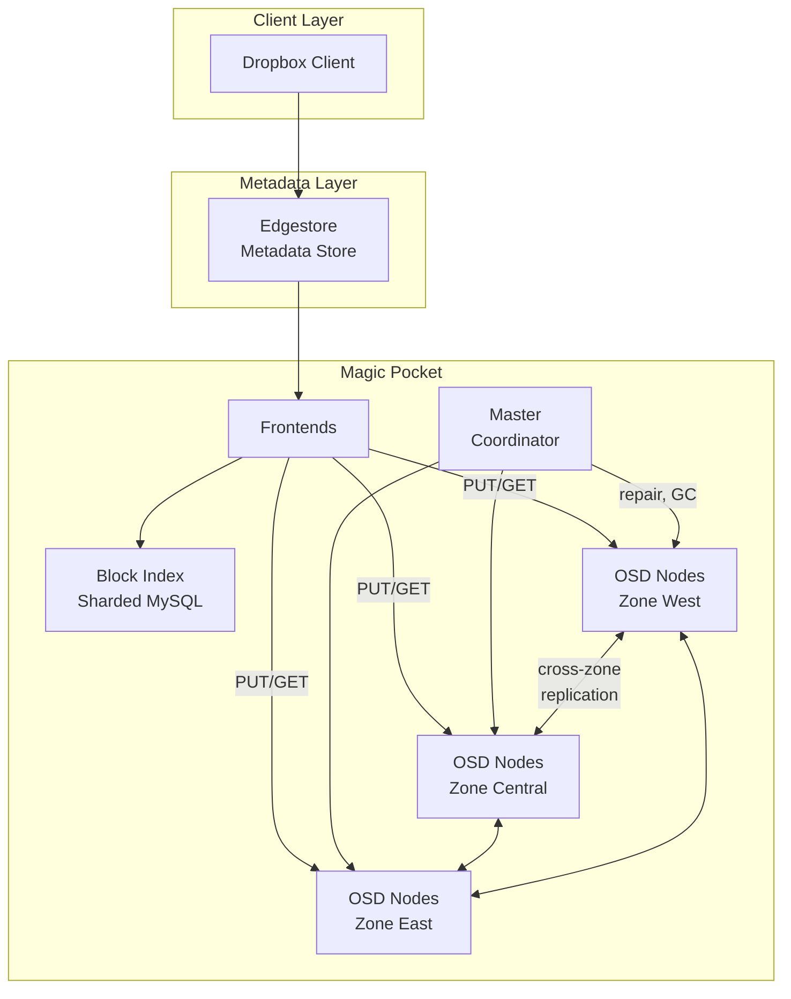
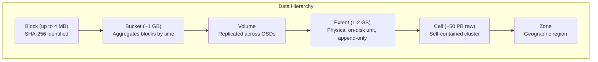
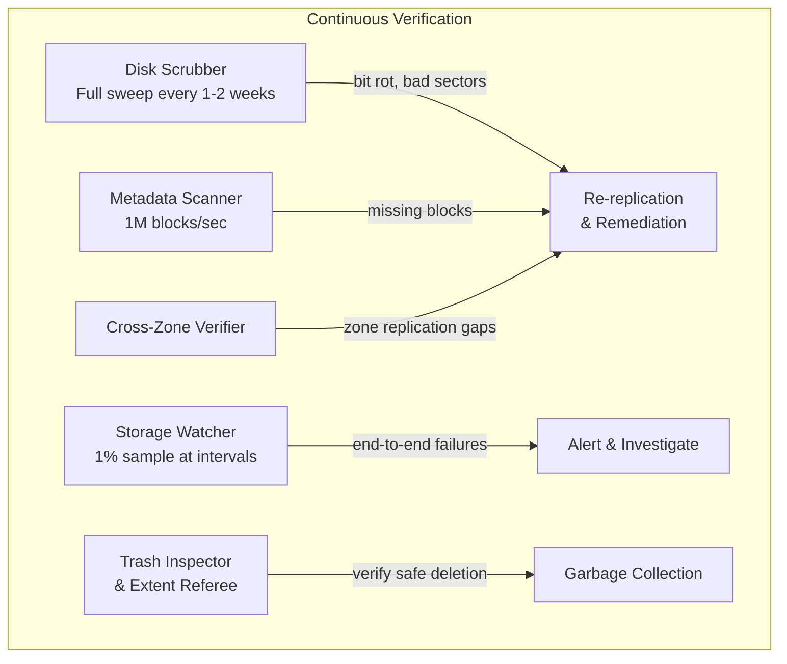

# Dropbox Magic Pocket: Building Exabyte-Scale Blob Storage

How Dropbox migrated 500+ petabytes off AWS S3 onto custom infrastructure in under two years, saving $74.6 million net while achieving higher durability than the service it replaced. Magic Pocket is a content-addressable, immutable block store built by a team of fewer than six engineers, now serving 700+ million users across 600,000+ storage drives.

<figure>

<figcaption>Magic Pocket's core architecture: clients interact with Edgestore for metadata, which routes to Magic Pocket frontends. Frontends consult the Block Index for placement and store blocks across three geographic zones with cross-zone replication.</figcaption>
</figure>

## Abstract

Magic Pocket is a **content-addressable, immutable block store** where the key is a block's SHA-256 hash and the value is a compressed, encrypted blob up to 4 MB. The mental model has three layers:

- **Metadata layer** (Edgestore + Block Index): Maps file paths to block hashes, and block hashes to physical locations. Sharded MySQL under the hood.
- **Placement and routing layer** (Frontends + Master): Determines which cell and volume stores each block. Handles deduplication at write time via hash lookup. The Master orchestrates repair and garbage collection but holds no authoritative state---the Replication Table does.
- **Physical storage layer** (OSD nodes + Diskotech servers): 100 Shingled Magnetic Recording (SMR) drives per chassis, ~2 PB per machine, written append-only with no filesystem. Blocks start as 4x replicas (hot), then get erasure-coded to 1.5x overhead as they cool.

The design bets: immutable blocks eliminate consistency complexity, content-addressing enables deduplication, and SMR's sequential-write constraint aligns with append-only semantics. The verification system (Pocket Watch) spends over 50% of disk I/O on continuous integrity checking---an unusual choice that reflects Dropbox's stance that detecting corruption matters more than optimizing throughput.

## Context

### The System

Dropbox's core product is file synchronization and storage. By 2015, the platform served 500+ million users, making it one of the largest consumers of AWS S3 globally.

| Metric                  | Value (2015)                                       |
| ----------------------- | -------------------------------------------------- |
| Total data stored       | 500+ PB                                            |
| Users                   | 500+ million                                       |
| Primary storage backend | AWS S3                                             |
| Data growth rate        | ~40 PB/year (estimated from 2012's 40 PB baseline) |
| AWS relationship        | One of S3's largest customers                      |

### The Trigger

Storage is Dropbox's core product---not a supporting service. When your entire business is storing files, the economics of renting per-GB storage from a cloud provider diverge sharply from owning infrastructure at scale.

Three factors drove the decision:

1. **Cost**: Dropbox's S-1 filing revealed they reduced infrastructure costs by **$74.6 million net over 2016-2017** after migrating. The gross AWS bill reduction in 2016 alone was $92.5 million, offset by $53 million in new depreciation and facility costs.
2. **Control**: A custom stack allowed co-designing hardware and software for Dropbox's specific workload---immutable 4 MB blobs, write-once-read-many access patterns, extreme deduplication potential.
3. **Performance**: End-to-end optimization of network, disk I/O, and encoding strategies that S3's general-purpose design could not provide.

### Constraints

- **Team size**: Fewer than 6 engineers initially. The VP of Engineering noted they could not hire 200 engineers, so they "got the best people and created a small team."
- **Zero downtime**: Migration had to be invisible to users. No maintenance windows, no degraded service.
- **Durability guarantee**: Must match or exceed S3's 11 nines of durability.
- **Geographic distribution**: US-only data centers (colocation in West, Central, and East regions). European data remained on S3.
- **Timeline**: Prototype started summer 2013; production serving by February 2015.

## The Opportunity

### Why Not Just Optimize S3 Usage?

At Dropbox's scale, the unit economics flip. For most companies, S3's operational burden elimination justifies its per-GB premium. For Dropbox, storage is the product, not supporting infrastructure. Three properties of their workload made custom infrastructure particularly attractive:

**Immutable blocks with content-addressing.** Dropbox splits files into blocks (up to 4 MB), compresses them, and identifies each by its SHA-256 hash. A block never changes after creation. This eliminates the consistency complexity that makes general-purpose storage hard---no in-place updates, no concurrent modification conflicts, no cache invalidation.

**Write-once-read-rarely access patterns.** Over 40% of all file retrievals are for data uploaded in the last 24 hours. Over 90% of retrievals are for data less than a year old. This extreme skew means most stored data is cold, and cold storage can be optimized aggressively for density over latency.

**Massive deduplication potential.** Content-addressing means identical blocks (common across users who share files, or across versions of the same file) are stored once. At 500+ PB, even small deduplication ratios yield enormous savings.

### What S3 Could Not Provide

S3 is a general-purpose object store. It cannot:

- Allow co-design of disk firmware, server chassis, and storage software as a unified system
- Use Shingled Magnetic Recording (SMR) drives that require application-level sequential write management
- Provide erasure coding tuned to Dropbox's specific durability and read-latency trade-offs
- Enable the 50%+ I/O budget dedicated to integrity verification that Dropbox's Pocket Watch system requires

## Options Considered

### Option 1: Optimize S3 Usage

**Approach:** Negotiate better rates, use S3 storage tiers (Glacier for cold data), optimize deduplication before upload.

**Pros:**

- Zero engineering investment
- Operational burden stays with AWS

**Cons:**

- Per-GB economics still unfavorable at 500+ PB scale
- No control over hardware or storage engine optimization
- Cannot co-design for immutable-block workload

**Why not chosen:** Even with aggressive optimization, the cost differential at exabyte scale was too large. Storage is Dropbox's core product, not ancillary infrastructure.

### Option 2: Use Another Cloud Provider or Open-Source Stack

**Approach:** Migrate to a cheaper cloud provider (Google Cloud, Azure) or deploy an open-source distributed storage system (Ceph, HDFS) on leased hardware.

**Pros:**

- Faster time to market than custom-built
- Existing community and tooling

**Cons:**

- General-purpose systems carry overhead for features Dropbox does not need (mutable objects, POSIX semantics, directory hierarchies)
- Cannot optimize for immutable, content-addressed blocks
- Limited hardware co-design possibilities

**Why not chosen:** The workload is narrow enough (immutable blobs, hash-keyed, append-only) that a purpose-built system could be dramatically simpler and more efficient than any general-purpose alternative.

### Option 3: Build Custom Storage (Chosen)

**Approach:** Build a purpose-built, content-addressable block store optimized for immutable 4 MB blobs.

**Pros:**

- Hardware-software co-design (custom server chassis, SMR drives, no filesystem)
- Erasure coding and replication tuned to exact durability requirements
- 50%+ I/O budget for verification without impacting cost efficiency
- Long-term cost advantage compounds as data grows

**Cons:**

- Multi-year engineering investment
- Operational expertise must be built in-house
- Single point of organizational risk (small team)

**Why chosen:** The narrow workload (immutable blobs) meant the system could be architecturally simple despite the scale. A team of fewer than 6 engineers could build it because the design eliminated most distributed systems complexity.

### Decision Factors

| Factor                        | Optimize S3 | Alternative Stack | Custom Build             |
| ----------------------------- | ----------- | ----------------- | ------------------------ |
| Cost at 500+ PB               | High        | Medium            | Low (after amortization) |
| Hardware co-design            | No          | Limited           | Full                     |
| Time to production            | Immediate   | 6-12 months       | ~18 months               |
| Workload optimization         | None        | Partial           | Complete                 |
| Operational complexity        | Low         | Medium            | High (initially)         |
| Long-term compounding savings | No          | Partial           | Yes                      |

## Implementation

### Architecture Overview

Magic Pocket's architecture reflects a single design principle: **immutable, content-addressed blocks eliminate most distributed systems complexity**. There are no distributed transactions, no consensus protocols, no cache invalidation for data. The system is a distributed key-value store where keys are SHA-256 hashes and values are compressed, encrypted blobs.

<figure>

<figcaption>Magic Pocket's data hierarchy: blocks aggregate into buckets, buckets into volumes replicated across OSDs, stored as extents within cells, organized by geographic zone.</figcaption>
</figure>

| Level      | Size                | Description                                                                            |
| ---------- | ------------------- | -------------------------------------------------------------------------------------- |
| **Block**  | Up to 4 MB          | Compressed, AES-256 encrypted chunk; identified by SHA-256 hash                        |
| **Bucket** | ~1 GB               | Logical container aggregating blocks uploaded around the same time                     |
| **Volume** | One or more buckets | Replicated or erasure-coded across multiple OSD nodes                                  |
| **Extent** | 1-2 GB              | Physical on-disk unit; written append-only, immutable once sealed                      |
| **Cell**   | ~50 PB raw          | Self-contained storage cluster with its own frontends, coordinators, and storage nodes |
| **Zone**   | Multiple cells      | Geographic region (US West, Central, East)                                             |

### Core Components

#### Block Index

The Block Index is a sharded MySQL (InnoDB) cluster fronted by an RPC (Remote Procedure Call) service layer. It maps `block_hash -> (cell, bucket_id, checksum)`. The primary key is the SHA-256 hash of each block.

**Why MySQL?** At write time, the only coordination required is checking whether a block hash already exists (deduplication) and recording where it was placed. This is a simple key-value lookup and insert---exactly what sharded MySQL excels at. The immutability of blocks means no updates, no conflicting writes, and no consistency concerns beyond initial placement.

#### Replication Table

A smaller MySQL database within each cell that maps `bucket -> volume` and `volume -> (OSDs, open/closed, type, generation)`. The entire working set fits in memory for fast lookups. This is the authoritative record of where data physically lives within a cell.

**Design choice:** The Replication Table is the source of truth, not the Master coordinator. The Master is entirely soft-state---it can be restarted without losing any placement information. This avoids the complexity of distributed consensus for coordination.

#### Object Storage Devices (OSDs)

Custom storage machines running the Diskotech server chassis:

| Specification        | Value                                      |
| -------------------- | ------------------------------------------ |
| Form factor          | 4U chassis                                 |
| Drives per chassis   | ~100 Large Form Factor (LFF)               |
| Capacity per chassis | ~2 PB (at 20 TB drives)                    |
| Capacity per rack    | ~8 PB                                      |
| Memory               | 96 GB per host                             |
| CPU                  | 20 cores, 40 threads                       |
| Network              | 50 Gbps NIC                                |
| Controller           | Host Bus Adapter (HBA), no RAID controller |
| Disk access          | Direct via libzbc/libzbd, no filesystem    |

The OSD storage engine was rewritten from Go to **Rust** by Jamie Turner's team. Go's garbage collector caused unpredictable latency spikes, and the constant threat of OOM (Out of Memory) conditions required C++-level control. The Rust rewrite achieved **3-5x improvement in tail latencies** and enabled handling more disks per machine without increased CPU overhead.

> **Organizational lesson:** James Cowling later noted that the Rust components worked well and required little maintenance, but when the original authors departed, insufficient Rust expertise remained. The components continued running reliably but innovation on them slowed.

#### Master Coordinator

The cell-level coordinator handles OSD health monitoring, triggering repair operations, creating storage buckets, and orchestrating garbage collection. Critically, the Master holds **no authoritative state**---the Replication Table is the source of truth. The Master can crash and restart without data loss or placement confusion.

This design avoids Paxos, Raft, or any quorum-based consensus for the coordination layer. The trade-off: recovery after Master failure requires rebuilding soft state from the Replication Table, but this is fast since the working set fits in memory.

#### Frontends

Gateway nodes that accept storage requests, determine block placement by balancing cell load and network traffic, and route read/write commands to appropriate OSD nodes.

#### Cross-Zone Replication Daemon

Asynchronously replicates all PUTs to at least one other geographic zone within approximately **one second**. Each block exists in at least two zones, ensuring zone-level fault tolerance.

### Write Path

1. Frontend checks the Block Index for existing block (deduplication via SHA-256 hash).
2. If the block does not exist, the frontend selects a target volume balancing cell load and network traffic.
3. Issues store commands to **all OSDs in the volume**. All must `fsync` before responding---no acknowledgment until data is durable on disk.
4. Adds entry to Block Index upon success.
5. Retries with a different volume on failure.
6. Cross-zone replication daemon asynchronously replicates within ~1 second.

**Why synchronous replication within a volume?** Data loss from a partial write (acknowledged to the client but not durable on all replicas) would violate the immutability contract. By requiring all replicas to fsync before acknowledging, the system guarantees that a successful write is immediately durable at the volume's replication factor.

### Read Path

1. Frontend queries Block Index for `(cell, bucket_id)`.
2. Consults Replication Table for volume and OSD locations.
3. For **replicated volumes**: fetches from a single OSD.
4. For **erasure-coded volumes**: reconstructs from multiple OSD nodes with Volume Manager assistance.

### Erasure Coding Strategy

Magic Pocket uses a variant of Reed-Solomon erasure coding similar to Local Reconstruction Codes (LRC):

| Scheme           | Configuration                 | Storage Overhead | Use Case                              |
| ---------------- | ----------------------------- | ---------------- | ------------------------------------- |
| **Replicated**   | 4x within zone, 2x cross-zone | Up to 8x total   | Recently uploaded (hot) data          |
| **Reed-Solomon** | 6+3 (6 data, 3 parity)        | 1.5x             | Standard encoding for warm data       |
| **LRC**          | ~12+2+2                       | ~1.33x           | Optimized reads, tolerates 3 failures |

**Why start with replication?** Over 40% of file retrievals target data uploaded in the last 24 hours. High-redundancy replication ensures fast single-OSD reads for the hottest data. As blocks cool (access frequency drops), they are aggregated and erasure-coded---trading read simplicity for storage efficiency. This tiered approach means the system never pays the full 8x replication cost for the 90%+ of data that is rarely accessed.

### Cold Storage Optimization

Introduced around 2019, the cold tier uses **fragment-based striping across geographic regions**:

- **2+1 scheme**: A block is split into 2 data fragments plus 1 XOR parity fragment, each placed in a different geographic zone.
- Storage overhead: **1.5x** (compared to 2x+ for warm tier cross-zone replication).
- **25% disk reduction** with 3 zones; 33% savings with a 4-region 3+1 model.
- Reads issue requests to all regions in parallel, use the fastest two responses, and cancel the rest.

Counter-intuitively, the 99th percentile read latency for cold storage was **lower** than warm storage. The parallel cross-region reads with hedged cancellation effectively reduced tail latency, even though individual region latency was higher.

### SMR Drive Deployment

Dropbox was the first major technology company to deploy Shingled Magnetic Recording (SMR) drives at petabyte scale. SMR drives overlap write tracks like roof shingles, increasing areal density but requiring sequential writes aligned to zone boundaries.

**Why this is a perfect fit:** Magic Pocket's append-only, immutable write pattern naturally produces sequential writes. The OSD daemon manages sequential zones directly via libzbc/libzbd, bypassing the filesystem entirely.

| Milestone                           | Date           |
| ----------------------------------- | -------------- |
| First petabyte-scale SMR deployment | June 2018      |
| All new drives deployed as SMR      | September 2018 |
| ~40% of total fleet on SMR          | 2019           |
| 90% of HDD fleet on SMR             | 2022           |

**Drive capacity progression:** 4 TB -> 8 TB -> 14 TB -> 18 TB -> 20 TB -> 26 TB (as of 2023).

**Power efficiency gains:** 5-6x reduction in power per terabyte since initial 4 TB deployment. Latest 18-20 TB drives operate at ~0.30 watts/TB idle and ~0.50 watts/TB under random reads. The sixth-generation server requires **5 fewer megawatts** serving one exabyte compared to the fourth generation.

### Encryption

- Data at rest uses **AES-256 encryption**.
- Each block has its own **block encryption key (BEK)**.
- BEKs are wrapped with versioned global **key encryption keys (KEKs)**.
- Key rotation happens at the metadata level without rewriting encrypted data.
- Deletion uses **crypto-shredding**: deleting encryption metadata renders the encrypted block permanently inaccessible. Physical disk space is reclaimed asynchronously.

### Network Architecture

Dropbox's data center network evolved to a **quad-plane, 3-tier Clos fabric**:

| Specification    | Value                                |
| ---------------- | ------------------------------------ |
| Racks per pod    | 16                                   |
| Pods per fabric  | 16 (expandable to 31 for ~500 racks) |
| Link speed       | 100G everywhere                      |
| Oversubscription | 1:1 (non-blocking)                   |
| Routing          | eBGP with ECMP                       |
| Uplink per rack  | 4x100G                               |

The non-blocking fabric is essential for Magic Pocket's repair operations, which must move terabytes of data across hundreds of OSD nodes simultaneously when a drive fails.

### SSD Cache Removal (2021-2022)

Originally, Magic Pocket used an NVMe SSD caching layer for block metadata on each host. As drive density increased (14-20 TB per disk, 100 drives per host), the single NVMe SSD became a bottleneck at 15-20 Gbps write throughput.

**Solution:** Store both metadata and raw data inline on SMR disks using a new extent format that serializes blocks with their metadata directly to disk.

| Metric                       | Before   | After              |
| ---------------------------- | -------- | ------------------ |
| Peak write throughput        | Baseline | 2-2.5x improvement |
| Production write throughput  | Baseline | 15-20% improvement |
| P95 write latency under load | Baseline | 15-20% improvement |
| Monthly SSD failure repairs  | 8-10     | 0                  |

Completed fleet-wide by Q1 2022.

## Migration

### Timeline

| Date              | Milestone                                                          |
| ----------------- | ------------------------------------------------------------------ |
| Summer 2013       | Small team (fewer than 6 engineers) begins coding prototype        |
| August 2014       | **Dark launch**: Mirroring data from 2 regional locations          |
| February 27, 2015 | **Launch**: Production serving exclusively from own infrastructure |
| April 30, 2015    | **BASE Jump**: Scaling phase begins                                |
| October 7, 2015   | **90% milestone**: 90% of all user data on custom infrastructure   |
| March 14, 2016    | Public announcement via engineering blog                           |

### Migration Strategy

**Dual-write approach:** Every uploaded file was simultaneously saved to both AWS S3 and Magic Pocket. This allowed instant rollback at the file level if Magic Pocket returned incorrect data.

**Peak transfer rate:** Over **half a terabit per second** on the internal network during bulk migration.

**Gradual cutover:** The team scaled from double-digit-petabyte prototypes to a multi-exabyte system within approximately 6 months.

### Post-Migration

Approximately 10% of data remained on AWS S3---primarily for European users and regions where Dropbox lacked physical data center presence. In 2020, Dropbox built the **Object Store** abstraction layer, providing a unified API (PUT, GET, DELETE, LIST) that routes requests transparently between S3 and Magic Pocket. Object Store added write batching, range-based reads, and encryption, while also enabling deprecation of most HDFS (Hadoop Distributed File System) usage by late 2021.

## Verification: Pocket Watch

More than **50% of the workload on disks and databases** is internal verification traffic. This is an unusual design choice---most storage systems optimize for user-facing throughput. Dropbox chose to dedicate half their I/O capacity to catching corruption before it becomes data loss.

<figure>

<figcaption>Pocket Watch's five verification subsystems, each targeting a different failure mode.</figcaption>
</figure>

### Disk Scrubber

Continuously reads back every bit on disk and validates against checksums. Full disk sweep every **1-2 weeks**, with recently modified areas scanned more frequently. Automatically schedules re-replication and disk remediation upon detecting corruption.

### Metadata Scanner

Iterates through the Block Index at approximately **1 million blocks per second**, confirming that blocks exist on their designated storage nodes. Full scans complete roughly weekly per zone.

### Storage Watcher

Independent black-box verification that samples **1% of all written blocks**. Retrieves each sampled block after intervals of 1 minute, 1 hour, 1 day, 1 week, and 1 month. This multi-interval approach detects end-to-end failures that manifest at different timescales---immediate write failures, short-term disk degradation, and long-term bit rot.

### Trash Inspector and Extent Referee

Verify that deleted extents were safely migrated before permanent removal. Maintain a temporary "trash" storage for an additional day after inspection, providing a last-chance recovery window.

### Cross-Zone Verifier

Confirms that all user files exist in the appropriate storage zones by walking the File Journal system. Catches cross-zone replication gaps that the one-second async replication might miss during transient failures.

## Repair Operations

When an OSD goes offline for more than 15 minutes:

1. Master closes all volumes on the failed OSD.
2. Builds a reconstruction plan distributing load across **hundreds of OSD nodes** to avoid creating a new hotspot.
3. Performs data transfer with erasure coding reconstruction where needed.
4. Increments the generation number on new volumes (enabling stale-read detection if the old OSD comes back online with outdated data).
5. Updates the Replication Table to commit changes atomically.

**Repair rate:** 4 extents per second (each 1-2 GB).

**Repair SLA:** Less than 48 hours for a full OSD reconstruction.

**Auto-repair volume:** Hundreds of hardware failures are repaired automatically per day across the fleet.

## Disaster Readiness

On November 18, 2021, Dropbox physically unplugged their San Jose (SJC) data center from the network for 30 minutes. Three on-site technicians physically disconnected optical fiber at three colocation facilities.

**Result:** Zero impact to global availability. The active-active design across three zones handled the loss transparently. Recovery Time Objective (RTO) improved by more than an order of magnitude compared to pre-2020 capabilities.

This was not a simulated failover---it was a real disconnection of production infrastructure serving user traffic.

## Outcome

### Financial Impact

| Year      | Gross AWS Savings | New Infra Costs (depreciation, facilities) | Net Savings |
| --------- | ----------------- | ------------------------------------------ | ----------- |
| 2016      | $92.5M            | $53.0M                                     | $39.5M      |
| 2017      | (continued)       | (continued)                                | $35.1M      |
| **Total** | --                | --                                         | **$74.6M**  |

Source: Dropbox S-1 filing (2018).

### Durability and Availability

| Metric                                | Value              |
| ------------------------------------- | ------------------ |
| Theoretical durability (Markov model) | 27 nines           |
| Published durability guarantee        | Over 12 nines      |
| Availability                          | 99.99%             |
| Cross-zone replication latency        | ~1 second          |
| Repair SLA (full OSD)                 | Less than 48 hours |

### Scale (2023-2024)

| Metric                          | Value                       |
| ------------------------------- | --------------------------- |
| Storage drives deployed         | 600,000+                    |
| SMR fleet percentage            | ~90%                        |
| Users served                    | 700+ million                |
| Request throughput              | Tens of millions per second |
| Auto-repaired hardware failures | Hundreds per day            |
| Geographic zones                | 3 US + AWS for Europe       |
| Latest drive capacity           | 26 TB                       |
| Hardware generation             | 6th (7th in development)    |
| Next-gen NIC requirement        | 200G per host               |

### Unexpected Benefits

- **SMR alignment:** The append-only, immutable write pattern turned out to be ideal for SMR drives, enabling Dropbox to adopt higher-density drives years before competitors.
- **Cold storage latency improvement:** Cross-region parallel reads with hedged cancellation produced lower P99 latency than warm storage single-region reads.
- **Crypto-shredding simplification:** The per-block encryption key design meant data deletion required only metadata deletion, not physical overwrite---simplifying compliance with data deletion regulations.

### Remaining Limitations

- **US-only custom infrastructure:** European data still relies on AWS S3 (~10% of total).
- **Rust expertise concentration:** The OSD storage engine's Rust codebase remained robust but innovation-constrained after original authors departed.
- **Single-vendor risk:** The Diskotech server design creates dependency on specific drive vendors for SMR qualification and firmware collaboration.

## Lessons Learned

### Technical Lessons

#### 1. Narrow Workloads Enable Radical Simplification

**The insight:** Magic Pocket avoids distributed consensus, distributed transactions, and cache invalidation for data---the three hardest problems in distributed storage. It can do this because blocks are immutable and content-addressed. Fewer than 6 engineers built a system that replaced the world's most sophisticated object store.

**How it applies elsewhere:**

- Before building general-purpose infrastructure, ask whether your workload has properties that eliminate entire categories of complexity.
- Append-only, immutable data models are dramatically simpler to distribute than mutable ones.

**Warning signs to watch for:**

- Your storage system handles consistency edge cases that your actual data model does not require.
- You are paying for POSIX semantics or mutable-object support that your application never uses.

#### 2. Hardware-Software Co-Design Compounds Over Time

**The insight:** By designing the Diskotech chassis, choosing SMR drives, writing a custom OSD engine without a filesystem, and building a non-blocking Clos network, Dropbox created an integrated stack where each layer amplifies the others. The power efficiency gains (5-6x per TB) and the SSD cache removal are examples of optimizations only possible with full-stack control.

**How it applies elsewhere:**

- At sufficient scale, the cost of understanding hardware intimately pays for itself.
- General-purpose layers (filesystems, RAID controllers, general-purpose SSDs) add overhead and limit optimization options.

#### 3. Verification is Worth Half Your I/O Budget

**The insight:** Pocket Watch's five verification subsystems consume over 50% of disk and database I/O. This seems wasteful until you consider that undetected corruption at exabyte scale would mean certain data loss. The cost of verification is the cost of maintaining durability guarantees.

**How it applies elsewhere:**

- Durability claims without continuous verification are aspirational, not actual.
- Multi-interval sampling (1 minute to 1 month) catches failure modes that single-point-in-time checks miss.

**Warning signs to watch for:**

- Your durability SLA depends on assumptions about disk reliability that you are not actively validating.
- You discover corruption through user reports rather than automated systems.

### Process Lessons

#### 1. Small Teams Can Build at Extreme Scale

**What they'd do differently:** James Cowling later reflected that the Rust rewrite, while technically successful, created a skills gap when original authors departed. A small team building critical infrastructure must plan for knowledge transfer from day one.

### Organizational Lessons

#### 1. Storage Economics Change the Build-vs-Buy Equation

When storage is your product (not a supporting service), the economics of building custom infrastructure become favorable at a lower scale threshold than most engineers assume. Dropbox's $74.6M net savings in two years funded the ongoing engineering investment many times over.

## Edgestore and Panda: The Metadata Layer

Magic Pocket stores blocks, but mapping files to blocks requires a metadata system. Dropbox built **Edgestore**, a strongly consistent, read-optimized, horizontally scalable, geo-distributed metadata store.

- **Storage engine:** MySQL (InnoDB)
- **Data model:** Entities (objects with attributes) and Associations (relationships between entities)
- **Architecture:** Language-specific SDKs (Go, Python) -> stateless Cores -> Caching Layer -> Engines -> MySQL
- **Consistency:** Strong by default (cache invalidation on writes); eventual consistency optional
- **Scale:** Thousands of machines, several trillion entries, millions of queries per second, 5 nines of availability

In later years, Dropbox built **Panda**, a petabyte-scale transactional key-value store sitting between Edgestore and sharded MySQL. Panda provides Atomicity, Consistency, Isolation, Durability (ACID) transactions with Multi-Version Concurrency Control (MVCC), eliminating the fleet-doubling expansion model of traditional MySQL sharding.

## Future Direction: HAMR

Dropbox is preparing for **Heat-Assisted Magnetic Recording (HAMR)** drives, which temporarily heat the recording media to 450 degrees Celsius during writes, enabling smaller thermally stable grains and projected capacities of 50+ TB per drive. The transition from SMR to HAMR represents the next major hardware-software co-design cycle for Magic Pocket.

## Conclusion

Magic Pocket's success rests on a single architectural insight: immutable, content-addressed blocks eliminate the hardest problems in distributed storage. This allowed a team of fewer than six engineers to build a system that replaced AWS S3, saved $74.6 million in two years, and now serves 700+ million users across 600,000+ drives.

The design decisions compound: immutability enables append-only writes, append-only writes enable SMR drives, SMR drives enable higher density, higher density drives justify custom chassis, custom chassis justify custom networks. Each choice opens the next optimization.

The most counterintuitive decision---spending 50%+ of I/O on verification rather than throughput---reflects a maturity about durability that distinguishes production storage systems from academic designs. At exabyte scale, undetected corruption is not a risk to be modeled; it is a certainty to be continuously hunted.

## Appendix

### Prerequisites

- Distributed storage fundamentals (replication, erasure coding)
- Content-addressable storage concepts
- Basic understanding of disk technologies (HDD, SSD, SMR)

### Terminology

| Term                 | Definition                                                                                                              |
| -------------------- | ----------------------------------------------------------------------------------------------------------------------- |
| **SMR**              | Shingled Magnetic Recording---HDD technology that overlaps write tracks for higher density, requiring sequential writes |
| **LRC**              | Local Reconstruction Codes---erasure coding variant enabling local repair without reading all shards                    |
| **OSD**              | Object Storage Device---a Magic Pocket storage node with ~100 drives                                                    |
| **Extent**           | 1-2 GB append-only physical storage unit on disk                                                                        |
| **Cell**             | ~50 PB self-contained storage cluster within a zone                                                                     |
| **Crypto-shredding** | Data deletion by destroying encryption keys rather than overwriting ciphertext                                          |
| **HAMR**             | Heat-Assisted Magnetic Recording---next-generation HDD technology using laser heating                                   |
| **Clos fabric**      | Non-blocking network topology providing full bisection bandwidth                                                        |
| **BEK/KEK**          | Block Encryption Key / Key Encryption Key---two-layer encryption hierarchy                                              |

### Summary

- Magic Pocket is a content-addressable, immutable block store using SHA-256 hashes as keys, built by fewer than 6 engineers.
- The system migrated 500+ PB from AWS S3 using a dual-write strategy over ~18 months, saving $74.6M net in the first two years.
- Data starts as 4x replicated (hot), then gets erasure-coded to 1.33-1.5x overhead as access frequency drops.
- Pocket Watch verification consumes 50%+ of disk I/O across five subsystems, continuously validating durability at exabyte scale.
- Custom Diskotech servers with 100 SMR drives per chassis (~2 PB per machine) enable 5-6x power efficiency gains per TB generation over generation.
- The narrow workload (immutable blobs) eliminates distributed consensus, transactions, and cache invalidation, making extreme scale tractable for a small team.

### References

- [Inside the Magic Pocket](https://dropbox.tech/infrastructure/inside-the-magic-pocket) - Architecture deep-dive by James Cowling (2016)
- [Scaling to Exabytes and Beyond](https://dropbox.tech/infrastructure/magic-pocket-infrastructure) - Migration announcement and timeline (2016)
- [Pocket Watch: Verifying Exabytes of Data](https://dropbox.tech/infrastructure/pocket-watch) - Durability verification systems (2016)
- [Extending Magic Pocket Innovation with SMR](https://dropbox.tech/infrastructure/extending-magic-pocket-innovation-with-the-first-petabyte-scale-smr-drive-deployment) - First petabyte-scale SMR deployment (2018)
- [How We Optimized Magic Pocket for Cold Storage](https://dropbox.tech/infrastructure/how-we-optimized-magic-pocket-for-cold-storage) - Cold tier design (2019)
- [SMR: What We Learned in Our First Year](https://dropbox.tech/infrastructure/smr-what-we-learned-in-our-first-year) - SMR lessons (2019)
- [Four Years of SMR Storage](https://dropbox.tech/infrastructure/four-years-of-smr-storage-what-we-love-and-whats-next) - SMR evolution and HAMR preview (2022)
- [Increasing Write Throughput by Removing SSD Cache Disks](https://dropbox.tech/infrastructure/increasing-magic-pocket-write-throughput-by-removing-our-ssd-cache-disks) - SSD cache removal (2022)
- [Object Store: Cloud Storage Abstraction](https://dropbox.tech/infrastructure/abstracting-cloud-storage-backends-with-object-store) - Unified storage API (2023)
- [(Re)Introducing Edgestore](https://dropbox.tech/infrastructure/reintroducing-edgestore) - Metadata system architecture
- [Panda: Petabyte-Scale Transactional Key-Value Store](https://dropbox.tech/infrastructure/panda-metadata-stack-petabyte-scale-transactional-key-value-store) - Metadata evolution
- [Disaster Readiness Test: Failover Blackhole SJC](https://dropbox.tech/infrastructure/disaster-readiness-test-failover-blackhole-sjc) - Data center disconnection test (2021)
- [The Scalable Fabric Behind Our Growing Data Center Network](https://dropbox.tech/infrastructure/the-scalable-fabric-behind-our-growing-data-center-network) - Network architecture
- [Dropbox S-1 Filing](https://www.sec.gov/Archives/edgar/data/1467623/000119312518055809/d451946ds1.htm) - Financial data and infrastructure cost savings (2018)
- [Magic Pocket: Dropbox's Exabyte-Scale Blob Storage System (QCon 2022)](https://www.infoq.com/presentations/magic-pocket-dropbox/) - Andrew Fong & Akhil Gupta conference talk
- [Dropbox Magic Pocket at Exabyte Scale (InfoQ 2023)](https://www.infoq.com/articles/dropbox-magic-pocket-exabyte-storage/) - Detailed architecture article by Facundo Agriel
- [Software Engineering Daily: Dropbox's Magic Pocket with James Cowling (2016)](https://softwareengineeringdaily.com/2016/05/17/dropboxs-magic-pocket-james-cowling/) - Podcast interview
- [SE Radio Episode 285: James Cowling on Distributed Storage (2017)](https://se-radio.net/2017/03/se-radio-episode-285-james-cowling-on-dropboxs-distributed-storage-system/) - Podcast interview
- [Western Digital Case Study: Dropbox Magic Pocket with SMR HDDs](https://documents.westerndigital.com/content/dam/doc-library/en_us/assets/public/western-digital/collateral/case-study/case-study-dropbox-magic-pocket-achieves-exabyte-scale-with-smr-hdds.pdf) - Vendor case study
