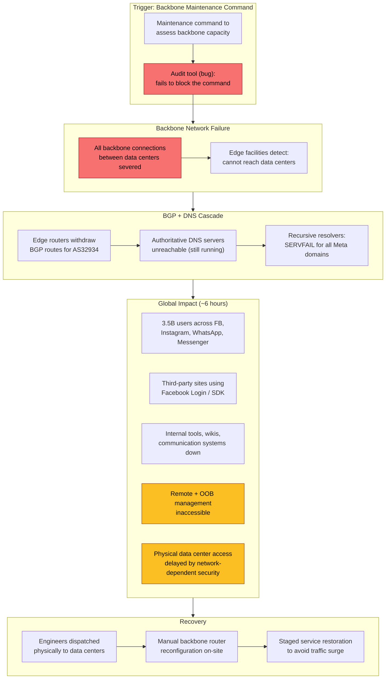

# Facebook 2021 Outage: BGP Withdrawal, DNS Collapse, and the Backbone That Disappeared

How a routine maintenance command on Facebook's backbone routers accidentally withdrew all BGP (Border Gateway Protocol) routes for AS32934, making Facebook's authoritative DNS servers unreachable for ~6 hours on October 4, 2021. With 3.5 billion combined users across Facebook, Instagram, WhatsApp, and Messenger unable to resolve any Meta domain, this incident exposed what happens when DNS infrastructure, remote management, physical security, and internal tooling all depend on the same network backbone—and that backbone vanishes.

<figure>

<figcaption>The failure chain: a maintenance command severed backbone connectivity, triggering automated BGP route withdrawal. With no routes, DNS resolution failed globally. Recovery required physical access to data centers—itself delayed because security systems depended on the network.</figcaption>
</figure>

## Abstract

The mental model for this incident is a **dependency inversion collapse**—where the systems designed to recover from failures (remote management, internal tools, physical security) all depended on the very infrastructure that failed:

| Layer | What Failed | Why Recovery Was Hard |
|-------|------------|---------------------|
| **Backbone** | A maintenance command severed all inter-datacenter links | The audit tool meant to prevent this had a bug that let the command execute |
| **BGP** | Edge facilities auto-withdrew BGP routes because they could not reach data centers | This is a safety mechanism—advertising routes to unreachable servers causes black-hole traffic. The safety feature became the propagation mechanism for the outage. |
| **DNS** | Authoritative nameservers were running but unreachable—no BGP route existed to reach them | DNS TTLs expired within minutes; recursive resolvers worldwide returned SERVFAIL |
| **Management** | Remote access (SSH, OOB consoles) routed through the same backbone | With the backbone down, every remote recovery path was severed simultaneously |
| **Physical** | Badge readers, door locks, and security systems used the network | Engineers dispatched to data centers faced physical access delays |

The key insight is not that a configuration error caused an outage—that happens regularly. The insight is that **every recovery mechanism shared fate with the failure domain**. The backbone was a single dependency that, when removed, eliminated not just the service but every path to restoring the service. This is the canonical example of why out-of-band management must be truly out-of-band—not just a separate VLAN on the same physical network.

## Context

### The System

Facebook (now Meta) operates one of the largest internet infrastructures in the world. The architecture relevant to this incident spans three layers:

- **Backbone network**: Tens of thousands of miles of fiber-optic cables connecting Facebook's data centers globally. This is Facebook's private WAN (Wide Area Network)—distinct from the public internet. It carries inter-datacenter replication, internal service traffic, and management plane communications.
- **Edge facilities (PoPs)**: Smaller facilities at the edge of the network, co-located with major internet exchange points. These serve as the interface between Facebook's backbone and the public internet. Edge facilities run Facebook's **authoritative DNS servers** and handle BGP peering with upstream providers and peer networks.
- **Data centers**: Large-scale compute facilities housing the servers that run Facebook, Instagram, WhatsApp, Messenger, and internal services. These connect to edge facilities exclusively through the backbone.

Facebook's edge facilities perform a critical health check: they continuously verify that they can communicate with the data centers through the backbone. If an edge facility loses backbone connectivity, it **automatically withdraws its BGP route advertisements**. This is a deliberate safety mechanism—advertising routes to servers you cannot reach would cause a traffic black hole, where packets arrive but can never be delivered.

### The Trigger

**October 4, 2021, ~15:39 UTC**: A maintenance command is issued to backbone routers. The command is intended to assess the availability of global backbone capacity. Instead, it severs all backbone connections between Facebook's data centers.

**Key metrics at the time:**

| Metric | Value |
|--------|-------|
| Monthly active users (Facebook) | 2.89 billion |
| Combined users (FB + Instagram + WhatsApp + Messenger) | ~3.5 billion |
| BGP prefixes normally advertised by AS32934 | 300+ (IPv4 and IPv6) |
| Backbone span | Tens of thousands of miles of fiber |
| Revenue per hour (estimated) | ~$13 million |

### Constraints

- **Backbone is the single transport**: All inter-datacenter communication—production traffic, management, monitoring—traverses the backbone
- **DNS on the edge**: Facebook's authoritative DNS servers live in edge facilities that depend on backbone connectivity to declare themselves healthy
- **Out-of-band management**: Remote management tools (SSH, console servers) route through the same backbone infrastructure
- **Physical security**: Badge readers and door access controls at data centers use the corporate network

## The Problem

### Symptoms

At 15:39 UTC, backbone routers began processing the maintenance command. Within minutes:

1. All backbone links between data centers went down
2. Edge facilities detected loss of connectivity to data centers
3. Edge routers executed their safety logic: withdrew BGP route advertisements for AS32934
4. Facebook's authoritative DNS servers—physically operational in edge facilities—became unreachable from the public internet
5. DNS resolvers worldwide began returning SERVFAIL for all Meta-owned domains

From a user perspective: Facebook, Instagram, WhatsApp, and Messenger simultaneously became unreachable. No loading spinner, no error page—just connection timeouts and DNS resolution failures.

### Incident Timeline

| Time (UTC) | Event | Impact |
|------------|-------|--------|
| ~15:39 | Maintenance command issued to backbone routers | — |
| 15:39–15:42 | BGP route withdrawals begin propagating from AS32934 | First external observations of BGP instability |
| ~15:44 | DNS TTLs begin expiring for cached Facebook records | Resolvers that had cached records start failing |
| 15:53:47 | Complete BGP route withdrawal—zero routes to AS32934 remain in global routing tables | Facebook is fully unreachable from the entire internet |
| ~16:00 | HTTP 503 errors visible to users; SERVFAIL from all DNS resolvers | All Meta properties down globally |
| ~16:00–17:00 | Internal investigation hampered: remote access tools, internal wikis, Workplace all unavailable | Engineers coordinate via non-Facebook channels |
| ~17:00–19:00 | Engineers dispatched to data centers; physical access delays due to network-dependent security | On-site recovery begins |
| ~21:00 | First BGP routes re-announced; DNS servers begin responding | Initial service restoration |
| ~21:11 | Brief instability during recovery | Minor hiccup as routes propagate |
| ~21:30 | BGP routes stabilize; services progressively return | Full stabilization |
| ~22:05 | Services broadly restored | ~6.3 hours total outage |

### Root Cause Analysis

**Investigation process:**

1. **15:39–16:00 UTC**: External observers (Cloudflare, Kentik, RIPE NCC) detected the BGP withdrawal within minutes. Inside Facebook, engineers received alerts but quickly discovered that their investigation tools were also down—internal dashboards, remote router access, and communication platforms all depended on the backbone.
2. **16:00–17:00 UTC**: Engineers shifted to out-of-band communication (phone calls, non-Facebook messaging). They identified the backbone as the root failure but could not access backbone routers remotely—the management plane routed through the same backbone.
3. **17:00+ UTC**: Engineers were physically dispatched to data centers to access backbone routers via console connections.

**The actual root cause**: A maintenance command intended to assess backbone capacity contained an error that disconnected all backbone links. Facebook's systems include an audit tool designed to catch commands that would cause this kind of damage. The audit tool had a **bug** that failed to flag this specific command as dangerous. The command executed, the backbone went down, and the automated BGP safety mechanism did the rest.

### The BGP Cascade (Technical Detail)

Facebook operates AS32934 (Autonomous System 32934). Under normal conditions, Facebook's edge routers announce 300+ IPv4 and IPv6 prefixes to the global BGP routing table via peering sessions with upstream providers and internet exchange points.

The edge routers implement a health-check-based advertisement policy:

1. Edge facility continuously verifies backbone connectivity to data centers
2. If connectivity is confirmed: advertise BGP routes (tell the internet "you can reach Facebook through me")
3. If connectivity is lost: withdraw BGP routes (tell the internet "you can no longer reach Facebook through me")

This is correct behavior. Advertising routes to an unreachable destination creates a **black hole**—packets enter the network but can never reach their destination, consuming resources and causing silent failures. The withdrawal prevents this. But when _every_ edge facility simultaneously loses backbone connectivity, every edge facility simultaneously withdraws, and Facebook vanishes from the global routing table entirely.

**Specific prefix example**: Facebook's authoritative DNS server `a.ns.facebook.com` resolves to `129.134.30.12`, which lives in prefix `129.134.30.0/24` originated by AS32934. When this prefix was withdrawn, no router on the internet had a path to `129.134.30.12`. The DNS server was running—it just could not receive or respond to queries.

RIPE NCC's BGPlay visualization captured the withdrawal in real-time: over ~10 minutes starting at 15:42 UTC, all AS paths to AS32934 prefixes progressively disappeared. By 15:53:47 UTC, zero routes remained.

### The DNS Cascade

With BGP routes withdrawn, the DNS failure was immediate and total:

1. **Authoritative DNS servers unreachable**: Facebook's nameservers (`a.ns.facebook.com` through `d.ns.facebook.com`) were all hosted in Facebook's own edge infrastructure. With BGP routes gone, no recursive resolver could reach them.
2. **TTL expiration**: DNS records have a TTL (Time to Live) specifying how long resolvers may cache them. Facebook's DNS TTLs were relatively short. Within ~5 minutes of the BGP withdrawal, cached records began expiring at recursive resolvers worldwide.
3. **SERVFAIL storm**: As TTLs expired, recursive resolvers (1.1.1.1, 8.8.8.8, ISP resolvers) attempted to refresh records by querying Facebook's authoritative servers. Every query timed out. Resolvers returned SERVFAIL to clients.
4. **Retry amplification**: Clients (apps, browsers) retried DNS queries aggressively. This created a massive spike in DNS query volume across the internet's resolver infrastructure—not just for Facebook, but as collateral load on shared resolver infrastructure. Catchpoint measured that DNS resolvers experienced significant traffic flooding from ~3.5 billion devices retrying queries.

The HTTP-level symptoms: users' browsers and apps received DNS resolution failures. Those that managed to connect to edge infrastructure before BGP withdrawal completed received `HTTP/2 503` responses with the header `proxy-status: no_server_available`—the edge proxy could not locate any upstream server because the backbone was severed.

### Why It Wasn't Obvious to Fix

- **No remote access**: The most natural response—SSH into backbone routers and revert the configuration—was impossible. Remote management traversed the backbone. With the backbone down, every remote path was severed.
- **Out-of-band management shared fate**: OOB (Out-of-Band) management systems—designed for exactly this scenario—also routed through Facebook's network infrastructure. They were not truly independent.
- **Internal tools down**: Facebook's Workplace (internal communication), wikis, ticketing systems, and monitoring dashboards all ran on Facebook's infrastructure. Engineers could not use their normal incident response tools.
- **Physical access friction**: Data center security systems (badge readers, door locks, security cameras) depended on the corporate network. When engineers arrived at data centers, they faced delays getting through physical security.
- **Hardware tamper protection**: Data center hardware is designed to be difficult to modify, even with physical access—a security feature that became a recovery obstacle.

## Options Considered

For an outage of this nature, the recovery options are constrained:

### Option 1: Remote Reconfiguration

**Approach**: SSH into backbone routers via the management network and revert the configuration change.

**Why not possible**: The management network depended on the backbone. With the backbone down, all remote access paths were severed. This was the first option attempted and the first eliminated.

### Option 2: Out-of-Band Console Access

**Approach**: Use dedicated OOB management consoles (serial consoles, IPMI/iLO, dedicated management network) to access backbone routers remotely.

**Why not possible**: Facebook's OOB infrastructure was not fully independent of the backbone network. The OOB paths still routed through infrastructure that depended on the backbone being operational. This is the critical design flaw the incident exposed.

### Option 3: Physical Access and Manual Reconfiguration (Chosen)

**Approach**: Dispatch engineers to data center locations to physically access backbone router consoles and revert the configuration change.

**Pros**:
- Console access on a physical router does not depend on any network
- Definitive—once at the console, engineers can make changes
- No dependency on any software system

**Cons**:
- Time-consuming: engineers must physically travel to data center locations
- Physical security systems dependent on the network cause additional delays
- Hardware tamper protections slow manual intervention
- Requires personnel with physical proximity and appropriate access credentials

**Why chosen**: It was the only option that worked. Every remote path was severed. Physical presence was the only remaining out-of-band channel.

## Recovery

### Physical Access and Router Reconfiguration

Engineers were dispatched to data center locations to gain direct console access to backbone routers. The recovery process faced several friction points:

1. **Travel time**: Engineers needed to physically reach data center locations, which are typically in remote areas for cost, power, and cooling reasons
2. **Security delays**: Badge readers and automated door access systems depended on the corporate network. Manual security overrides and identity verification were required
3. **Hardware access**: Data center hardware is designed with physical tamper resistance. Accessing router consoles required navigating security measures designed to prevent unauthorized changes
4. **Configuration complexity**: The engineers needed to understand and revert the specific configuration change across backbone routers—under pressure, without access to internal documentation systems

Once engineers gained physical console access to backbone routers, they identified and reverted the configuration change that had severed backbone connectivity.

### Staged Service Restoration

Restoring backbone connectivity did not immediately restore services. Facebook's engineering team managed the restoration carefully to avoid a secondary failure from the traffic surge:

1. **Backbone connectivity restored**: Router configurations reverted; inter-datacenter links came back online
2. **Edge health checks pass**: Edge facilities detected restored backbone connectivity and began re-announcing BGP routes
3. **BGP propagation**: Routes propagated through the global routing table. First routes re-appeared around 21:00 UTC; a brief instability at 21:11 UTC was resolved by 21:30 UTC
4. **DNS resolution restored**: As BGP routes propagated, recursive resolvers could again reach Facebook's authoritative DNS servers. Fresh DNS records replaced the expired caches
5. **Traffic surge management**: With 3.5 billion users' devices retrying connections simultaneously, the returning traffic surge was massive. Facebook drew on experience from internal "storm" disaster recovery drills to manage the power and capacity ramp. Services were brought back progressively to avoid overwhelming systems that had been idle for 6 hours

The staged approach was critical. A system that has been down for 6 hours accumulates state: queued messages, pending replication, deferred batch jobs. Turning everything on simultaneously risks a thundering herd that could cause a secondary outage.

### The Audit Tool Bug

The configuration audit system represents the most consequential failure in this incident. Facebook's backbone configuration pipeline included an automated check designed to reject commands that would disconnect backbone links. This tool should have prevented the maintenance command from executing.

The tool had a bug: it did not correctly identify this specific command as dangerous. The command passed the audit check and executed. This is a single point of failure in the deployment pipeline—the one safeguard between a human error and a global outage failed silently.

Facebook stated post-incident that fixing the audit tool and strengthening configuration change safeguards was a top priority.

## Cascading Failures

### Third-Party Service Impact

The outage extended beyond Meta's own properties:

- **Facebook Login (OAuth)**: Millions of third-party websites and apps that use "Login with Facebook" for authentication were affected. Users could not sign in to services that depended on Facebook's OAuth endpoints.
- **Facebook SDK and Ads**: Websites embedding Facebook Like buttons, Share buttons, comments widgets, and advertising tags experienced degraded performance. Catchpoint measured that document complete times on IR Top 100 sites increased by 20+ seconds during the incident—even for sites that were not Facebook properties—because embedded Facebook SDKs attempted to load resources from unreachable domains, blocking page rendering.
- **WhatsApp as communication infrastructure**: In many countries, WhatsApp serves as primary communication infrastructure for businesses, healthcare, and government services. The outage disrupted these use cases globally.

### Internal Communication Breakdown

Facebook's internal tools all ran on Facebook's infrastructure:

- **Workplace** (internal Facebook for companies): Down. Engineers could not post updates or coordinate through their primary communication platform.
- **Internal wikis and documentation**: Unreachable. Runbooks, incident response procedures, and contact information stored internally were inaccessible.
- **Monitoring and alerting dashboards**: Unable to function because they depended on the backbone.

Engineers coordinated through personal cell phones, non-Facebook messaging apps, and in some reported cases, showed up at offices physically to coordinate. This is a practical demonstration of why incident response communication tools must have zero dependency on the infrastructure they manage.

### DNS Resolver Collateral Damage

The global DNS resolver infrastructure experienced significant collateral load:

- 3.5 billion devices retried DNS queries for Meta domains every few seconds
- Recursive resolvers (ISP resolvers, public resolvers like 1.1.1.1 and 8.8.8.8) saw massive query volume spikes
- The retry storm consumed resolver capacity that would otherwise serve queries for unrelated domains
- Some smaller ISP resolvers experienced degraded performance for all domains—not just Meta's—due to the query volume

This is an inherent risk when an extremely high-traffic set of domains becomes simultaneously unresolvable: the retry behavior of billions of clients creates a distributed denial-of-service effect on the DNS resolver layer.

## Lessons Learned

### Technical Lessons

#### 1. Out-of-Band Management Must Be Truly Out-of-Band

**The insight**: Facebook's OOB management systems shared fate with the production backbone. When the backbone failed, the management plane failed with it. An OOB system that routes through any component of the system it manages is not actually out-of-band—it is an in-band system with a different name.

**How it applies elsewhere:**

- Any management network that shares physical infrastructure (same routers, same fiber, same switches) with the production network
- Cloud-based management consoles that depend on the same cloud region they manage
- VPN-based management access where the VPN terminates on infrastructure that can fail
- Monitoring systems that share network paths with the services they monitor

**Warning signs to watch for:**

- Your management access fails when you test it during a network outage drill
- Your OOB consoles route through the same L3 network as production traffic
- You have never tested management access with the primary network completely unavailable

**What truly independent OOB looks like:**

- Dedicated physical links (cellular, satellite, or dedicated ISP connection) that share zero infrastructure with the backbone
- Console servers with independent power and independent network connectivity
- Management credentials and procedures stored offline or on systems with independent hosting

#### 2. Automated Safety Mechanisms Can Amplify Failures

**The insight**: The BGP route withdrawal was a safety mechanism working as designed—edge facilities should not advertise routes to unreachable destinations. But in this case, the safety mechanism transformed a backbone failure into a global DNS outage. The safety feature became the propagation path for the failure.

**How it applies elsewhere:**

- Health-check-based load balancer ejection that removes all backends during a transient failure, causing a complete outage instead of degraded service
- Circuit breakers that open simultaneously across all instances, causing total service unavailability instead of partial degradation
- Automated rollback systems that roll back a deployment across all regions simultaneously when one region has issues

**Warning signs to watch for:**

- Safety mechanisms that operate independently per-node but can trigger simultaneously across all nodes
- No distinction between "one node is unhealthy" and "all nodes are unhealthy" in your health check logic
- Automated responses that have no rate limiting or quorum requirements before taking global action

#### 3. DNS Is a Hidden Single Point of Failure

**The insight**: Facebook ran its own authoritative DNS servers in its own infrastructure. This meant DNS availability was coupled to infrastructure availability. When the infrastructure failed, DNS failed, and no fallback existed—users could not even be redirected to a "we're down" page because the domain names could not be resolved.

**How it applies elsewhere:**

- Self-hosted authoritative DNS with all nameservers in a single infrastructure
- DNS zones where all nameservers share a common failure domain (same network, same cloud provider, same physical location)
- Internal service discovery systems that depend on a single DNS infrastructure

**Warning signs to watch for:**

- All your authoritative nameservers resolve to IP addresses in the same /16 or /24 network block
- Your nameservers are hosted in the same data centers as the services they resolve
- You have not tested what happens to DNS when your primary network is unreachable

#### 4. Configuration Change Audit Systems Are Critical Infrastructure

**The insight**: The audit tool that should have blocked the dangerous backbone command had a bug. A single bug in a safety system removed the last safeguard between human error and a global outage. Audit systems must be tested as rigorously as the systems they protect.

**How it applies elsewhere:**

- Pre-deployment validation checks that are trusted but not tested against the specific failure modes they claim to prevent
- Approval workflows where the automated check is treated as the definitive safety gate
- Configuration management systems where the validation logic is complex and its coverage is not verified

**Warning signs to watch for:**

- Your configuration audit system has never blocked a deployment in production
- The audit system is tested with synthetic inputs but not with actual dangerous commands
- There is no secondary validation or human review for changes that could affect global infrastructure

### Process Lessons

#### 1. Incident Communication Must Be Infrastructure-Independent

**What happened**: Engineers could not use Workplace, internal wikis, or monitoring tools because they all depended on the backbone. Coordination fell back to personal phones and non-Facebook messaging.

**What this means**: Every organization must maintain incident communication channels that have zero dependency on the organization's own infrastructure. This includes:

- Contact lists stored outside the corporate network (printed, personal devices)
- Communication channels on third-party infrastructure (not self-hosted Slack, not corporate email if it is self-hosted)
- Incident response runbooks accessible offline

#### 2. Physical Access Procedures Must Be Tested Under Network Failure

**What happened**: Physical security at data centers depended on the network. Engineers faced delays getting into the buildings they needed to access to fix the problem.

**What this means**: Physical security override procedures must be tested regularly with the assumption that the network is completely unavailable. Badge readers, door locks, and security cameras that fail-closed on network outage create a catch-22 where you cannot physically access the systems you need to restore the network.

### Organizational Lessons

#### 1. Scale Creates Unique Failure Modes

At Facebook's scale, with 3.5 billion users across multiple products all sharing common infrastructure, the blast radius of an infrastructure failure is inherently global. The DNS retry storm from billions of devices is an emergent behavior that only occurs at this scale. The recovery traffic surge from 6 hours of accumulated state is similarly unique to services of this size.

Organizations operating at this scale must plan for failure modes that do not exist at smaller scales—including the second-order effects of their failures on shared internet infrastructure like DNS resolvers.

## Applying This to Your System

### When This Pattern Applies

You might face similar challenges if:

- Your management and monitoring infrastructure shares fate with your production infrastructure
- Your DNS authoritative servers are hosted in your own infrastructure without geographic or network diversity
- Your configuration change pipeline has automated validation that has never been tested with actually dangerous inputs
- Your data center physical access depends on network-connected security systems
- Your incident response communication tools run on the same infrastructure you operate

### Checklist for Evaluation

- [ ] Trace the network path of your OOB management access—does it share any infrastructure component with production?
- [ ] Test your management access with the primary network completely down (not just degraded)
- [ ] Verify your DNS authoritative nameservers are hosted across genuinely independent network paths
- [ ] Confirm your incident communication tools work when your primary infrastructure is fully unavailable
- [ ] Test your configuration audit system with actually dangerous inputs (in a safe environment)
- [ ] Verify data center physical access procedures under complete network failure
- [ ] Identify all internal tools that depend on your production infrastructure and establish offline alternatives
- [ ] Conduct a "total backbone failure" tabletop exercise with your operations team

### Starting Points

If you want to evaluate your risk:

1. **Map your management plane dependencies**: Draw the network path from your laptop to your critical network equipment's management console. Every hop that shares infrastructure with production is a shared-fate risk.
2. **Test DNS independence**: Use `dig +trace` to follow the resolution path for your domains. If all authoritative nameservers resolve to addresses in your network, you have a single point of failure.
3. **Audit your audit tools**: Review your configuration change validation. What specific failure modes does it check? Has it been tested with the actual commands it is meant to block? When was the last time it rejected a change?
4. **Run a communication drill**: Attempt to coordinate an incident response using only channels that do not depend on your infrastructure. If your team cannot do this smoothly, invest in establishing and practicing alternative communication paths.

## Conclusion

The Facebook October 2021 outage is the canonical example of shared-fate failure in internet infrastructure. A configuration error severed the backbone. The backbone failure triggered a safety mechanism (BGP withdrawal) that was working as designed. The BGP withdrawal made DNS servers unreachable. DNS failure made all Meta properties unreachable for 3.5 billion users. And every path to recovery—remote management, OOB consoles, internal documentation, physical building access—depended on the same backbone that had failed.

The root cause was not exotic: a maintenance command that should have been caught by an audit tool, which had a bug. What made the incident extraordinary was the depth of dependency coupling. The principle of defense in depth assumes that your recovery mechanisms are independent of your failure domains. This incident demonstrated what happens when that assumption is violated at every layer simultaneously.

The transferable lesson is not about BGP or DNS specifically. It is about **dependency inversion in recovery paths**: if the system you need to fix the problem depends on the problem being fixed, you have a recovery deadlock. Every organization should trace their recovery paths—management access, communication tools, physical access, documentation—and verify that none of them share fate with the infrastructure they are meant to recover.

## Appendix

### Prerequisites

- Understanding of BGP (Border Gateway Protocol) and how internet routing works (route announcements, AS paths, prefix advertisement and withdrawal)
- Familiarity with DNS resolution (authoritative vs. recursive resolvers, TTL, SERVFAIL behavior)
- Knowledge of network architecture concepts (backbone networks, edge/PoP facilities, peering)
- Understanding of out-of-band management concepts and why management plane separation matters

### Terminology

| Term | Definition |
|------|-----------|
| **AS (Autonomous System)** | A collection of IP networks under a single administrative domain with a unified routing policy. Facebook operates AS32934. |
| **BGP (Border Gateway Protocol)** | The routing protocol used between autonomous systems to exchange reachability information. Defined in RFC 4271. |
| **BGP route withdrawal** | A BGP UPDATE message that removes a previously announced route, telling peers that a prefix is no longer reachable through this path. |
| **Authoritative DNS server** | The DNS server that holds the definitive records for a domain. Facebook's authoritative servers (a–d.ns.facebook.com) lived in their edge facilities. |
| **Recursive DNS resolver** | A DNS server that resolves queries on behalf of clients by following the delegation chain from root servers to authoritative servers. Examples: 1.1.1.1 (Cloudflare), 8.8.8.8 (Google). |
| **TTL (Time to Live)** | A value in DNS records specifying how long a resolver may cache the record before it must re-query the authoritative server. |
| **SERVFAIL** | A DNS response code indicating the resolver could not complete the query—typically because the authoritative servers are unreachable or returned an error. |
| **OOB (Out-of-Band) management** | A management network that is physically or logically separate from the production network, intended to provide access when the production network fails. |
| **Backbone network** | A private WAN connecting an organization's data centers, distinct from the public internet. Facebook's backbone spans tens of thousands of miles of fiber. |
| **Edge facility / PoP** | A Point of Presence at the network edge, typically co-located at internet exchange points, serving as the interface between the backbone and the public internet. |
| **Black hole (routing)** | A condition where packets are forwarded to a destination that cannot deliver them, causing silent packet loss. BGP withdrawal prevents this. |

### Summary

- A maintenance command intended to assess Facebook's backbone capacity contained an error that severed all backbone connections between data centers. An audit tool designed to prevent such commands had a bug that let it execute.
- Edge facilities detected loss of backbone connectivity and automatically withdrew BGP routes for AS32934—a safety mechanism that prevents advertising routes to unreachable destinations. This removed Facebook from the global routing table.
- With no BGP routes, Facebook's authoritative DNS servers (hosted in edge facilities) became unreachable. DNS TTLs expired within minutes, and recursive resolvers worldwide returned SERVFAIL for all Meta domains, affecting 3.5 billion users.
- Every recovery path shared fate with the failure: remote management, OOB consoles, internal tools, and even physical data center security all depended on the backbone. Engineers had to physically travel to data centers and manually reconfigure backbone routers.
- The incident demonstrated that out-of-band management must be truly independent of production infrastructure, that automated safety mechanisms can amplify failures when they trigger globally, and that configuration audit tools are critical infrastructure that must be tested as rigorously as the systems they protect.

### References

- [More Details About the October 4 Outage](https://engineering.fb.com/2021/10/05/networking-traffic/outage-details/) — Santosh Janardhan, VP of Infrastructure, Meta Engineering. Primary source for root cause, backbone architecture, audit tool bug, and recovery details.
- [Update About the October 4th Outage](https://about.fb.com/news/2021/10/update-about-the-october-4th-outage/) — Meta Newsroom. Official company statement on the outage.
- [Understanding How Facebook Disappeared from the Internet](https://blog.cloudflare.com/october-2021-facebook-outage/) — Cloudflare Blog. Analysis of BGP withdrawal patterns and DNS resolver impact observed from Cloudflare's 1.1.1.1 resolver infrastructure.
- [Facebook's Historic Outage, Explained](https://www.kentik.com/blog/facebooks-historic-outage-explained/) — Doug Madory, Kentik. Detailed BGP analysis including AS32934 prefix counts (300+ prefixes), specific withdrawn prefixes (129.134.30.0/23, 129.134.30.0/24), and traffic pattern analysis.
- [Facebook Down and Out in BGPlay](https://labs.ripe.net/author/alun_davies/facebook-down-and-out-in-bgplay/) — RIPE Labs. Real-time BGP visualization showing route withdrawal from 15:42 UTC to complete withdrawal at 15:53:47 UTC, and recovery beginning at ~21:00 UTC.
- [Incident Review for the Facebook Outage](https://www.catchpoint.com/blog/incident-review-for-the-facebook-outage-when-social-networks-go-anti-social) — Catchpoint. HTTP-level analysis including 503 errors, `proxy-status: no_server_available` headers, DNS SERVFAIL patterns, and third-party website impact (20+ second load time increase on IR Top 100 sites).
- [RFC 4271 — A Border Gateway Protocol 4 (BGP-4)](https://datatracker.ietf.org/doc/html/rfc4271) — IETF. The specification governing BGP behavior, including UPDATE messages for route withdrawal.
- [RFC 1034 — Domain Names: Concepts and Facilities](https://datatracker.ietf.org/doc/html/rfc1034) — IETF. DNS architecture specification relevant to authoritative server delegation and resolver behavior.
- [RFC 1035 — Domain Names: Implementation and Specification](https://datatracker.ietf.org/doc/html/rfc1035) — IETF. DNS protocol specification including TTL behavior and SERVFAIL response semantics.
