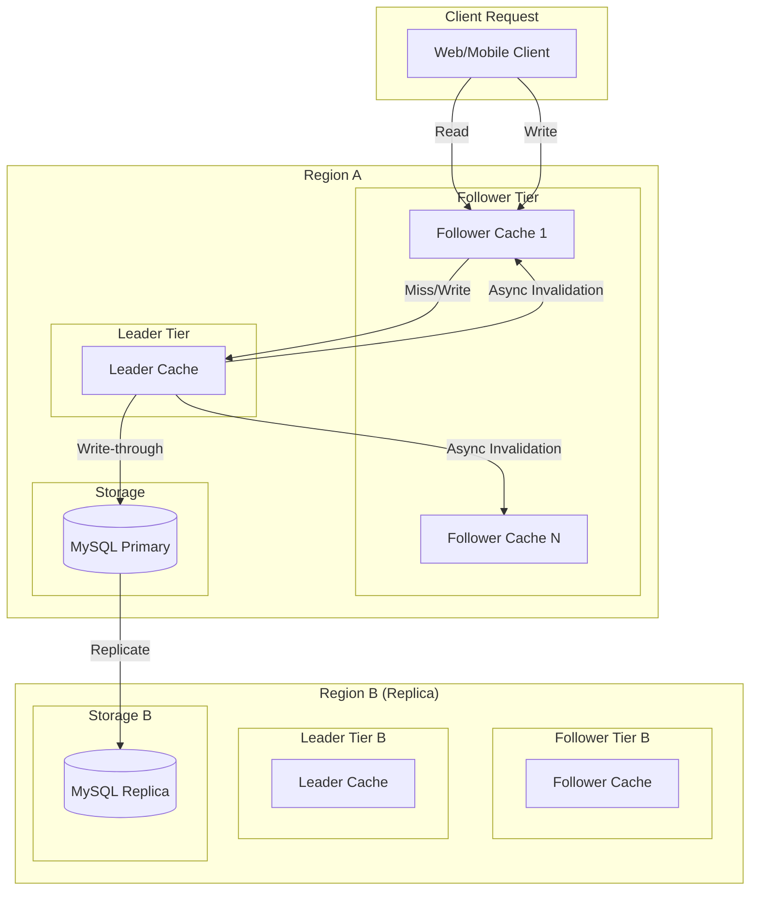
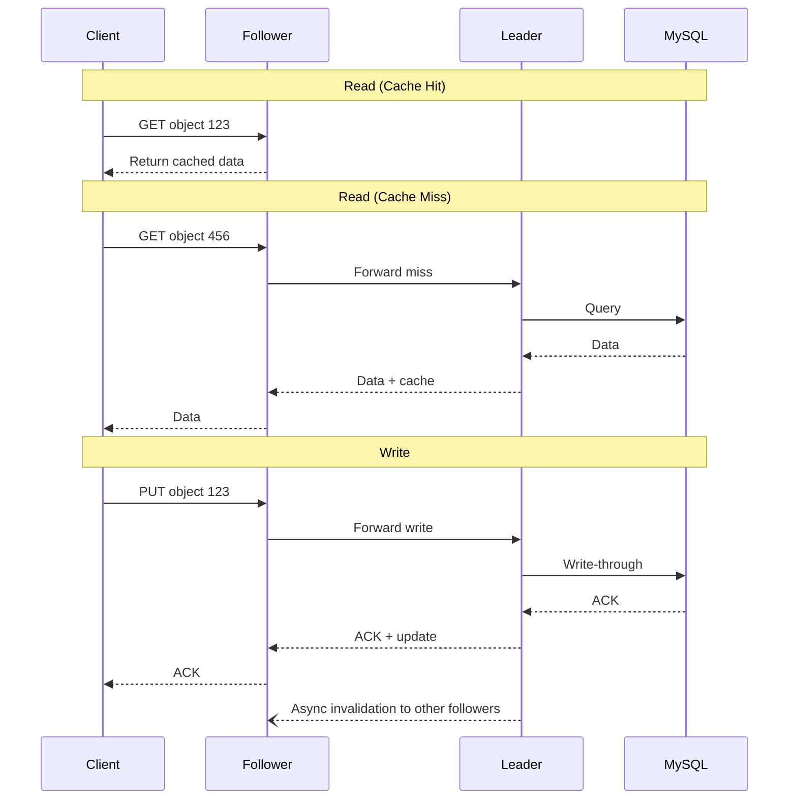
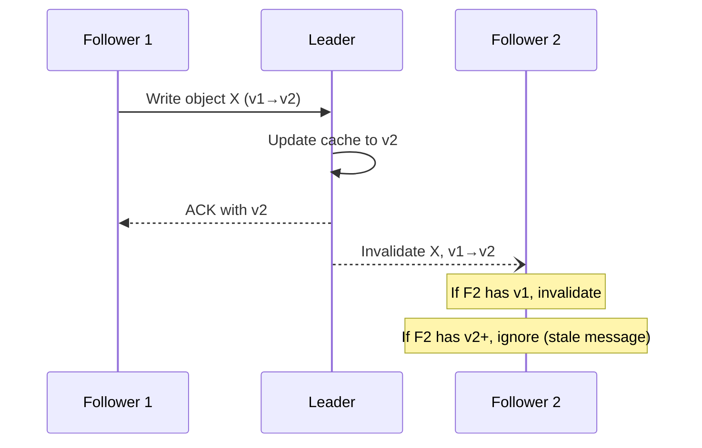

# Facebook TAO: The Social Graph's Distributed Cache

Facebook's social graph presents a unique data access problem: billions of users generating trillions of edges (friendships, likes, comments) that must be readable at sub-millisecond latencies and writable at millions of operations per second. TAO (The Associations and Objects) replaced the generic memcache+MySQL architecture with a graph-aware caching system that handles over 1 billion reads per second at 96.4% cache hit rate. This case study examines why generic key-value caches failed for graph data, how TAO's two-tier write-through architecture solves thundering herd and consistency problems, and what design patterns emerge for caching highly connected data.

<figure>



<figcaption>TAO's two-tier caching architecture: followers handle reads locally, leaders coordinate writes and protect MySQL from thundering herds. Cross-region replication enables geographic distribution.</figcaption>
</figure>

## Abstract

TAO solves the fundamental mismatch between generic key-value caches and graph data structures:

- **The problem**: Memcache treats association lists as opaque blobs. Appending one edge to a user's friend list requires fetching the entire list, modifying it client-side, and writing back—cache-unfriendly and prone to lost updates under concurrent writes.

- **The insight**: A cache that understands graph semantics can invalidate and refill association lists incrementally, coordinate writes to prevent thundering herds, and provide read-after-write consistency by construction.

- **The architecture**: Two-tier caching (followers for reads, leaders for writes) with write-through to MySQL. Leaders serialize concurrent writes to the same object, preventing cache stampedes and ensuring ordering. Followers receive asynchronous invalidations, achieving eventual consistency with sub-second lag.

- **The trade-off**: TAO chooses availability over consistency (AP in CAP terms). Reads are eventually consistent but locally fast. Strong consistency is available via explicit "critical read" API calls that route to the master region at higher latency cost.

- **The scale**: 1+ billion reads/second, millions of writes/second, 96.4% cache hit rate, petabytes of graph data across hundreds of thousands of shards.

## Context

### The System

Facebook's social graph is the data structure underlying the entire platform—every user, post, photo, comment, friendship, like, and share is a node or edge in this graph.

| Metric                | Value (2013)         | Value (2022+)    |
| --------------------- | -------------------- | ---------------- |
| Read requests/second  | Hundreds of millions | 1+ billion       |
| Write requests/second | Millions             | Tens of millions |
| Read:write ratio      | ~500:1               | ~500:1           |
| Cache hit rate        | 96.4%                | 96%+             |
| Machines              | Thousands            | Thousands        |
| Data types            | Hundreds             | Hundreds         |

**Tech stack**:

- **Cache**: Custom C++ caching servers (TAO)
- **Storage**: MySQL (sharded, single-primary replication)
- **Coordination**: Custom protocol for invalidation propagation

### The Data Model

TAO's data model is simple but powerful:

**Objects**: Typed nodes with a globally unique 64-bit ID containing:

- Type (e.g., user, post, comment)
- Key-value metadata pairs
- Single shard assignment (derived from ID)

**Associations**: Directed, typed edges between objects containing:

- Source ID (id1)
- Association type (atype)
- Destination ID (id2)
- 32-bit timestamp (for time-ordered retrieval)
- Key-value metadata pairs

```
# Example: User 123 likes Post 456 at time T
Association(id1=123, atype=LIKES, id2=456, time=T, data={...})

# Inverse association automatically created
Association(id1=456, atype=LIKED_BY, id2=123, time=T, data={...})
```

**Why bidirectional edges matter**: Querying "who likes this post?" requires an inverse association. TAO maintains these automatically, ensuring referential integrity without application logic.

### The Trigger: Why Memcache Failed

Before TAO, Facebook used memcache as a look-aside cache in front of MySQL. This worked for simple key-value data but created three problems for graph data:

**Problem 1: Inefficient edge list updates**

Adding one edge to a user's friend list required:

1. Fetch entire friend list from cache
2. Deserialize list
3. Append new friend
4. Serialize and write back entire list

With celebrities having millions of followers, this meant megabytes of data movement for a single edge addition. Worse, concurrent additions caused lost updates—two clients reading, modifying, and writing back would lose one update.

**Problem 2: Thundering herd on cache misses**

When a popular item's cache entry expired or was evicted, hundreds of concurrent requests would simultaneously query MySQL. The database couldn't handle the spike, causing cascading timeouts.

**Problem 3: No coordination point for consistency**

Memcache is stateless. Clients coordinate directly with both cache and database. This made read-after-write consistency expensive—clients had to either always read from MySQL (defeating the cache) or accept stale reads.

### Constraints

| Constraint   | Requirement                                       |
| ------------ | ------------------------------------------------- |
| Latency      | P50 < 1ms for cache hits                          |
| Availability | 99.99%+ uptime, geo-distributed                   |
| Consistency  | Read-after-write within a tier; eventual globally |
| Durability   | All writes persisted to MySQL                     |
| Scale        | Handle 10x growth without architecture change     |

## The Design

### Why a Custom Solution

Facebook evaluated alternatives:

| Option                            | Why Not Chosen                                                      |
| --------------------------------- | ------------------------------------------------------------------- |
| **Memcache (existing)**           | Couldn't handle graph semantics, thundering herd, or consistency    |
| **Graph databases (Neo4j, etc.)** | Didn't exist at required scale; lacked operational maturity         |
| **Distributed key-value stores**  | Same problems as memcache—no graph awareness                        |
| **Build on existing storage**     | MySQL already worked; needed caching layer, not storage replacement |

**Decision**: Build a graph-aware caching layer that sits between clients and MySQL. Keep MySQL as the durable store—it provides atomic transactions, efficient granular writes, and operational maturity for backups/migrations.

### Two-Tier Architecture

TAO splits caching into two functionally distinct tiers:

#### Follower Tier (Read-Optimized)

- **Handles**: All read requests from clients
- **Caches**: Objects and association lists
- **On miss**: Forwards to leader tier
- **On write**: Forwards to leader tier
- **Receives**: Asynchronous invalidation messages from leader

Followers are optimized for read throughput. Multiple follower tiers per region enable horizontal scaling. Each follower serves a subset of clients via consistent hashing.

#### Leader Tier (Write-Optimized)

- **Handles**: All write requests (forwarded from followers)
- **Handles**: Read misses from followers
- **Writes**: Synchronously to MySQL (write-through)
- **Sends**: Invalidation messages to followers
- **Serializes**: Concurrent writes to the same object

Leaders are the coordination point. One leader tier per region. All writes flow through leaders, enabling:

1. **Thundering herd protection**: Leader serializes database writes
2. **Write ordering**: Leader applies writes in order received
3. **Consistency**: Leader updates its cache before responding, enabling read-after-write



### Write-Through vs Write-Back

TAO uses **write-through caching**: every write goes to MySQL before being acknowledged.

| Approach          | Pros                                                                | Cons                                                          |
| ----------------- | ------------------------------------------------------------------- | ------------------------------------------------------------- |
| **Write-through** | Simple durability, write ordering preserved, crash recovery trivial | Higher write latency (MySQL roundtrip)                        |
| **Write-back**    | Lower write latency                                                 | Complex durability, ordering issues, crash recovery needs WAL |

**Why write-through was chosen**:

- MySQL write latency is acceptable (few milliseconds)
- Simplifies consistency reasoning—if MySQL has it, cache can serve it
- Crash recovery is trivial—rebuild cache from MySQL
- Write ordering is automatic—no need for conflict resolution

### Sharding and Routing

**Shard assignment**: Object IDs embed shard information. Given an object ID, TAO can determine its shard without a lookup.

**Association storage**: Associations are stored on the shard of their source object (id1). This means querying "all friends of user X" requires only one shard—the shard containing user X.

**Shard distribution**: Consistent hashing distributes shards across servers. Each TAO server handles many shards.

```
Object ID: [shard_id:16 bits][type:16 bits][sequence:32 bits]
                    ↓
        Route to shard_id's server
```

**Hot shard mitigation**:

- **Shard cloning**: Popular shards cached across multiple followers
- **Shard migration**: Move shards between servers to balance load
- **Query reversal**: For edges with high out-degree (celebrity followers), query from destination instead of source

### Consistency Model

TAO provides **eventual consistency** with specific guarantees:

**Guarantee 1: Read-after-write within a tier**

If client A writes and then reads through the same follower, the read reflects the write. The follower that forwarded the write receives the updated value in the response and caches it.

**Guarantee 2: Eventual consistency across tiers**

Writes propagate to other followers via asynchronous invalidation messages. Typical lag: sub-second. During this window, readers on other followers see stale data.

**Guarantee 3: No lost updates (per shard)**

Leaders serialize writes to the same shard. Concurrent writes are applied in arrival order, not lost.

**Strong consistency option**:

For critical operations (e.g., privacy checks), TAO provides a "critical read" API that routes to the master region's leader, bypassing local caches. Higher latency (~100ms cross-region) but guaranteed fresh.

### Cache Invalidation

TAO uses a hybrid invalidation strategy:

**For objects**: Invalidation messages. When an object is updated, the leader sends an invalidation message to all followers. Followers either delete their cached copy or update it if the message includes the new value.

**For associations**: Refill messages. Association lists are complex (ordered, potentially large). Instead of sending the full updated list, the leader sends a refill message. Followers query the leader to get the updated portion of the list.

**Version numbers**: Every cache entry has a version number. Invalidation messages include the version being invalidated. If a follower has a newer version (due to out-of-order message delivery), it ignores the invalidation.



## Implementation Details

### Memory Management

TAO servers handle diverse data: small objects (few bytes) and large association lists (megabytes for celebrity friend lists). Different eviction strategies are needed.

**Arena-partitioned memory**: Memory is partitioned by association type. Each arena has its own LRU eviction. This prevents large association lists from evicting many small objects.

**Fixed-size item optimization**: Objects and small associations use direct-associative caches (like CPU caches) instead of hash tables, reducing memory overhead.

### Request Processing

**Read path latency breakdown** (typical cache hit):
| Stage | Time |
|-------|------|
| Network to follower | ~0.1ms |
| Hash lookup | ~0.01ms |
| Serialization | ~0.1ms |
| Network to client | ~0.1ms |
| **Total** | **~0.5ms** |

**Write path latency breakdown**:
| Stage | Time |
|-------|------|
| Network to follower | ~0.1ms |
| Forward to leader | ~0.2ms |
| MySQL write | ~2-5ms |
| ACK to follower | ~0.2ms |
| ACK to client | ~0.1ms |
| **Total** | **~3-6ms** |

### Failure Handling

**Follower failure**: Clients retry on a different follower. No data loss—followers are stateless caches.

**Leader failure**: In-flight writes may fail. Clients retry. MySQL state is consistent. New leader rebuilds cache from MySQL on demand.

**MySQL failure**: Writes fail until failover completes. Reads continue from cache. TAO degrades gracefully—stale reads are better than no reads for most social graph queries.

**Network partition**: Followers continue serving cached reads. Writes queue or fail depending on partition location. When partition heals, invalidations catch up.

### Geographic Distribution

TAO is deployed across multiple regions:

**Master region**: One region holds the MySQL primary. All writes for a shard go to this region.

**Replica regions**: Other regions have MySQL replicas and full TAO stacks (followers + leaders). Reads are served locally. Writes are forwarded to the master region.

**Replication lag**: MySQL replication to replicas is asynchronous. TAO invalidations can arrive before MySQL replication completes. Followers in replica regions may briefly see invalidations for data not yet in their local MySQL.

**Solution**: Followers query the master region's leader (not local MySQL) on cache miss during the replication window.

## Outcome

### Performance Metrics

| Metric             | Before TAO               | After TAO           |
| ------------------ | ------------------------ | ------------------- |
| Read latency (P50) | ~5ms (cache hit)         | ~1ms                |
| Read latency (P99) | ~100ms+                  | ~10ms               |
| Cache hit rate     | ~90%                     | 96.4%               |
| Database load      | High (thundering herd)   | Protected by leader |
| Lost updates       | Common under concurrency | Eliminated          |

### Scale Achieved

- **1+ billion reads/second** across the TAO fleet
- **Millions of writes/second** with sub-10ms latency
- **99.9%+ of reads** complete in a single round-trip to local cache
- **Hundreds of data types** supported with the same infrastructure

### Consistency Improvements (2022)

Meta improved TAO's cache consistency from 99.9999% (6 nines) to 99.99999999% (10 nines):

**Polaris Service**: Monitors consistency invariants without logging all operations. Samples reads and compares with source of truth.

**Consistency Tracing Library**: During detected inconsistency windows, enables detailed logging to diagnose race conditions.

**Result**: Bug diagnosis time reduced from weeks to minutes.

## Evolution

### 2013: Original TAO

- Two-tier architecture with write-through caching
- Eventual consistency model
- MySQL as durable storage
- Published at USENIX ATC 2013

### 2021: RAMP-TAO

**Problem**: TAO provides per-shard atomicity but not cross-shard transactions. Some operations need multi-object atomicity (e.g., transferring ownership).

**Solution**: RAMP-TAO layers Read Atomic Multi-Partition (RAMP) transactions on top of TAO.

**Key insight**: Most TAO operations don't need transactions. RAMP-TAO adds transactional capability without slowing down non-transactional operations.

| Metric                    | Impact               |
| ------------------------- | -------------------- |
| Memory overhead           | +0.42% in production |
| Non-transactional latency | Unchanged            |
| Transactional operations  | ACID guarantees      |

### 2022: TAOBench

Meta open-sourced TAOBench, a benchmark capturing real TAO workloads:

**Workload characteristics revealed**:

- 99%+ of operations are reads
- Writes target heavily modified items that are rarely read
- Temporal locality is strong—recent items are hot
- Zipfian distribution for object popularity

**Evaluated systems**: Cloud Spanner, CockroachDB, PlanetScale, TiDB, YugabyteDB. None matched TAO's performance at TAO's scale, validating the custom solution decision.

## Lessons Learned

### Technical Lessons

#### 1. Graph-Aware Caching Beats Generic Caching

**The insight**: Memcache treats all data as opaque blobs. TAO understands that association lists can be incrementally updated, that inverse edges must be maintained, and that graph queries have locality properties.

**How it applies elsewhere**:

- Document databases with indexes: cache the index structure, not just documents
- Time-series data: cache recent data differently than historical data
- Tree structures: cache parent-child relationships, not serialized trees

**Warning signs**:

- Serializing/deserializing large structures on every cache update
- Lost updates under concurrent modifications
- Cache hit rates that don't improve with more memory

#### 2. Separate Read and Write Paths

**The insight**: Reads and writes have different requirements. Reads need low latency and high throughput. Writes need ordering, durability, and coordination. Serving both from the same tier forces compromises.

**How it applies elsewhere**:

- CQRS (Command Query Responsibility Segregation) pattern
- Read replicas in databases
- Event sourcing with separate read models

**Warning signs**:

- Read latency spiking during write bursts
- Writes queueing behind reads
- Difficulty scaling reads independently of writes

#### 3. Write-Through Simplifies Consistency

**The insight**: Write-back caching offers lower latency but introduces durability and ordering complexity. Write-through trades latency for simplicity—if the database has it, the cache can serve it.

**How it applies elsewhere**:

- Browser caches with ETags
- CDN configurations
- Any system where durability matters more than write latency

**Warning signs**:

- Complex cache invalidation logic
- Data loss on cache server crashes
- Write ordering bugs under concurrency

#### 4. Leader-Based Coordination Prevents Thundering Herd

**The insight**: Without a coordination point, N clients with a cache miss simultaneously query the database. A leader serializes these requests—one query to the database, N responses from cache.

**How it applies elsewhere**:

- Request coalescing in CDNs
- Single-flight patterns in Go
- Distributed locks for expensive computations

**Warning signs**:

- Database CPU spikes on cache expirations
- Timeout cascades after cache flushes
- P99 latency much worse than P50

#### 5. Eventual Consistency Is Often Sufficient

**The insight**: Strong consistency is expensive—it requires synchronous coordination across regions. For social graph reads, sub-second staleness is acceptable. Strong consistency is available when needed via explicit API calls.

**How it applies elsewhere**:

- User session data (eventual consistency within region)
- Analytics dashboards (eventual consistency acceptable)
- Privacy checks (strong consistency required)

**Warning signs**:

- All reads going to a single primary
- Cross-region latency on every read
- Over-engineering consistency where staleness is acceptable

### Process Lessons

#### 1. Keep Durable Storage Simple

**The insight**: Facebook kept MySQL as the durable store. TAO is "just" a caching layer. This preserved MySQL's operational maturity—backups, point-in-time recovery, migrations work unchanged.

**What they'd do differently**: The team has noted that TAO's MySQL dependency creates operational coupling. Future iterations might explore different storage backends for specific use cases.

#### 2. Instrument Consistency

**The insight**: "Eventual consistency" means nothing without measurement. Meta's Polaris service monitors actual consistency—what percentage of reads return stale data, and for how long.

**Application**: If you claim eventual consistency, measure it. Define SLOs (Service Level Objectives) for staleness: "99.99% of reads return data <1 second stale."

## Applying This to Your System

### When This Pattern Applies

TAO's architecture fits systems with:

- **Graph-like data**: Entities with typed relationships
- **Read-heavy workloads**: 100:1 or higher read:write ratio
- **Low-latency requirements**: Sub-millisecond reads
- **Eventual consistency tolerance**: Brief staleness acceptable for most operations

### Checklist for Evaluation

- [ ] Is your data naturally a graph (entities + relationships)?
- [ ] Do you have a read:write ratio >50:1?
- [ ] Can your application tolerate sub-second staleness for most reads?
- [ ] Do you have thundering herd problems on cache misses?
- [ ] Are you serializing/deserializing large structures on cache updates?

### Starting Points

If you want to apply TAO's patterns:

1. **Measure cache efficiency**: What percentage of cache updates are full object replacements vs incremental?
2. **Identify coordination needs**: Which writes need ordering guarantees? Can a leader tier provide this?
3. **Audit consistency requirements**: Which reads truly need strong consistency? Route only those to primary.
4. **Prototype leader-follower**: Start with request coalescing on cache misses before full architecture change.

## Conclusion

TAO demonstrates that domain-specific caching can dramatically outperform generic solutions. By understanding that social graph data has structure (objects and associations), locality (friends of friends), and access patterns (read-heavy, write-once-read-many), Facebook built a cache that achieves 96% hit rates at billion-request-per-second scale.

The key design decisions—two-tier architecture, write-through caching, leader-based coordination, eventual consistency with strong consistency escape hatch—aren't novel individually. TAO's contribution is showing how they compose for graph data at scale.

For engineers building systems with similar characteristics (graph structure, read-heavy, latency-sensitive), TAO's patterns offer a proven blueprint. The lesson isn't to copy TAO but to understand why these patterns work: graph-aware caching enables incremental updates, leader tiers prevent thundering herds, and write-through simplifies consistency reasoning.

## Appendix

### Prerequisites

- Understanding of caching concepts (cache miss, eviction, invalidation)
- Familiarity with sharding and consistent hashing
- Basic knowledge of CAP theorem and consistency models
- Understanding of MySQL replication

### Terminology

- **TAO**: The Associations and Objects—Facebook's distributed social graph cache
- **Object**: A typed node in the graph (user, post, comment)
- **Association**: A directed, typed edge between objects (friendship, like)
- **Follower tier**: Read-optimized cache layer serving client requests
- **Leader tier**: Write-optimized cache layer coordinating database writes
- **Write-through**: Caching strategy where writes go to backing store before being cached
- **Thundering herd**: Pattern where many clients simultaneously request the same uncached data

### Summary

- Facebook's social graph required a cache that understands graph semantics, not generic key-value storage
- TAO uses two-tier caching: followers for reads, leaders for writes and coordination
- Write-through to MySQL ensures durability and simplifies consistency
- Leaders prevent thundering herd by serializing database access
- Eventual consistency with sub-second lag; strong consistency available via explicit API
- 1+ billion reads/second at 96.4% cache hit rate
- Key patterns: graph-aware caching, read/write path separation, leader coordination, write-through simplicity

### References

- [TAO: Facebook's Distributed Data Store for the Social Graph](https://www.usenix.org/system/files/conference/atc13/atc13-bronson.pdf) - Original USENIX ATC 2013 paper by Bronson et al.
- [TAO: The power of the graph](https://engineering.fb.com/2013/06/25/core-infra/tao-the-power-of-the-graph/) - Meta Engineering blog post (2013)
- [RAMP-TAO: Layering Atomic Transactions on Facebook's Online TAO Data Store](https://www.vldb.org/pvldb/vol14/p3014-cheng.pdf) - VLDB 2021 paper on transactional extensions
- [Open-sourcing TAOBench](https://engineering.fb.com/2022/09/07/core-infra/taobench/) - Meta Engineering blog on benchmark release (2022)
- [Cache made consistent](https://engineering.fb.com/2022/06/08/core-infra/cache-made-consistent/) - Meta Engineering blog on consistency improvements (2022)
- [USENIX ATC 2013 Presentation](https://www.usenix.org/conference/atc13/technical-sessions/presentation/bronson) - Conference talk with slides and video
- [TAOBench: An End-to-End Benchmark for Social Network Workloads](https://www.vldb.org/pvldb/vol15/p1965-cheng.pdf) - VLDB 2022 paper on benchmark methodology
