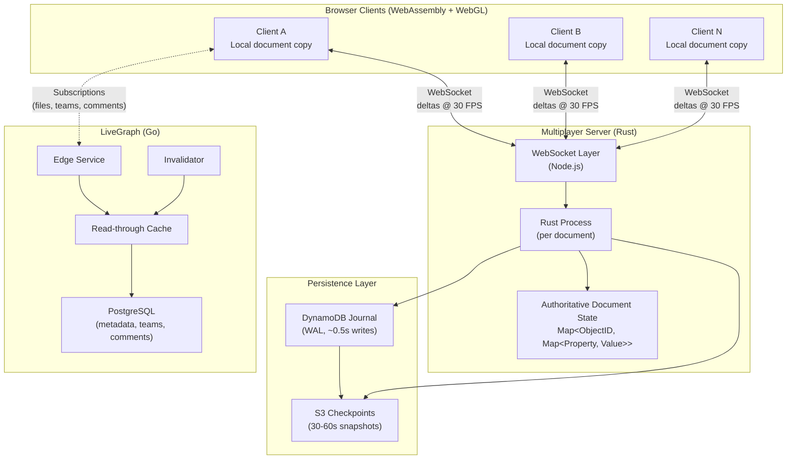

# Figma: Building Multiplayer Infrastructure for Real-Time Design Collaboration

How Figma built a real-time collaboration engine that supports 200 concurrent editors per document using a CRDT-inspired, server-authoritative protocol — rejecting both Operational Transformation and pure CRDTs in favor of property-level last-writer-wins with fractional indexing, backed by a Rust multiplayer server and a DynamoDB write-ahead journal processing over 2.2 billion changes per day.

<figure>



<figcaption>Figma's real-time infrastructure: browser clients sync document edits through a per-document Rust process over WebSockets, while LiveGraph handles non-document data subscriptions backed by PostgreSQL.</figcaption>
</figure>

## Abstract

Figma's multiplayer system is a case study in choosing the simplest conflict resolution model that actually works for the domain. The mental model:

- **Document model**: Every Figma file is a tree of objects represented as `Map<ObjectID, Map<Property, Value>>` — similar to the HTML DOM. Conflict resolution operates at the individual property level, not the document or object level.
- **Not OT, not pure CRDT**: Figma rejected Operational Transformation (OT) for its combinatorial complexity and pure Conflict-free Replicated Data Types (CRDTs) for their decentralization overhead. Instead, they built a server-authoritative system inspired by CRDT last-writer-wins registers — the server defines operation ordering, eliminating the need for vector clocks or tombstone garbage collection.
- **Fractional indexing for ordering**: Child ordering uses arbitrary-precision fractions (base-95 encoded strings) instead of OT sequences. Inserting between two siblings averages their indices. The server resolves collisions when concurrent inserts target the same position.
- **Rust for parallelism**: The multiplayer server was rewritten from TypeScript to Rust in 2018, achieving 10x faster serialization and enabling per-document process isolation that the Node.js memory overhead made impractical.
- **Journal for durability**: A DynamoDB-backed write-ahead log (WAL) persists 95% of changes within 600ms, reducing worst-case data loss from 60 seconds (checkpoint-only) to under 1 second.
- **Two sync systems**: The multiplayer server handles document state (the design file). LiveGraph — a separate Go-based system reading the PostgreSQL WAL — handles everything else (files, teams, comments, permissions) via real-time subscriptions.

**The transferable insight**: When your problem domain has a natural conflict granularity (properties on objects in a design tool), you can build a far simpler real-time system than general-purpose CRDTs or OT require. The key is matching the conflict resolution model to the domain's actual collaboration patterns — most concurrent edits in design tools touch different objects or different properties, making last-writer-wins at the property level both correct and simple.

## Context

### The System

Figma is a browser-based design tool where multiple users edit the same document simultaneously. Unlike Google Docs (sequential text) or Miro (spatial canvas with independent objects), Figma edits affect a deeply nested tree structure — frames contain groups, groups contain shapes, shapes have hundreds of properties (position, rotation, fill, stroke, constraints, auto-layout rules). This tree structure makes real-time collaboration fundamentally harder than text editing.

| Metric | Value |
|--------|-------|
| Max concurrent editors per file | 200 |
| Max total participants per file (editors + viewers) | 500 |
| Max visible multiplayer cursors | 200 |
| Client update frequency | ~33ms (30 FPS) |
| Journal changes received per day | >2.2 billion |
| Change persistence (p95) | ~600ms |
| Data loss target on crash | <1 second |
| Client rendering engine | C++ compiled to WebAssembly |
| Multiplayer server language | Rust (rewritten from TypeScript in 2018) |

### The Access Pattern

Figma's collaboration pattern has three properties that shaped every architectural decision:

1. **Spatial locality of edits**: In a design tool, users typically work on different parts of the canvas. Two designers rarely edit the same text field simultaneously. This makes property-level last-writer-wins viable — conflicts are infrequent in practice.

2. **High-frequency, small mutations**: Moving a shape generates a stream of position updates at 30 FPS. The system must handle thousands of property changes per second per document without introducing visible latency.

3. **Tree mutations are the hard case**: Reparenting a group of elements (dragging layers between frames) changes parent-child relationships, child ordering, and can create cycles if concurrent reparenting operations conflict. This is where naive approaches break down.

### The Trigger

When Figma shipped multiplayer editing in September 2016, the team had to decide how concurrent edits would be resolved. This is the foundational problem of collaborative editing — Google Docs had solved it for text using Operational Transformation (OT) in 2006, and academic research had produced CRDTs as a decentralized alternative. Figma chose neither.

### Constraints

- **Startup velocity**: Figma had a small team and needed to ship features rapidly. Complex algorithms like OT would slow development.
- **Design tool semantics**: Figma documents are trees of objects with hundreds of properties each — not linear text sequences. OT's character-level transforms were mismatched.
- **Browser-only client**: The entire editing engine runs in the browser (C++ compiled to WebAssembly), requiring efficient wire protocols and client-side state management.
- **Centralized architecture**: Figma had a server infrastructure. There was no requirement for peer-to-peer collaboration, which eliminated the primary motivation for pure CRDTs.

## The Design Decision: Why Not OT, Why Not CRDTs

### Why Operational Transformation Was Rejected

Evan Wallace, Figma's co-founder and CTO, explained the reasoning in 2019: OT causes a combinatorial explosion of transform functions. Every new operation type must define how it transforms against every other operation type. For a design tool with dozens of operation types (move, resize, reparent, change fill, change stroke, modify text, adjust constraints, update auto-layout parameters), the number of transform pairs grows quadratically.

OT was designed for text editing — insert and delete on a linear sequence — where the transform functions are well-understood. Adapting it to tree-structured documents with rich property sets would have been an enormous engineering investment for a startup.

Additionally, OT requires that all operations be serialized through a central server in a specific order, and the server must apply transform functions correctly for every pair. A bug in any transform function can cause permanent document divergence across clients — a class of bug that is notoriously difficult to detect and debug.

### Why Pure CRDTs Were Rejected

CRDTs are designed for fully decentralized systems where there is no central authority. This design constraint forces CRDTs to carry additional metadata:

- **Vector clocks or Lamport timestamps** for causal ordering without a central server
- **Tombstones** for tracking deletions (since any replica might not have seen the delete yet), requiring garbage collection coordination
- **Rich merge functions** that must produce identical results regardless of the order operations are received

Since Figma has a central server that all clients connect to, this decentralization overhead was unnecessary complexity. The server can define the canonical ordering of events simply by processing them in arrival order — no timestamps, no vector clocks, no tombstone GC.

### The Chosen Approach: Server-Authoritative Last-Writer-Wins

Figma built a system inspired by the **last-writer-wins register** from CRDT literature, but simplified by the presence of a central server:

1. The server maintains the authoritative document state as `Map<ObjectID, Map<Property, Value>>`
2. Clients send property-change deltas to the server over WebSockets
3. The server applies changes in arrival order and broadcasts them to all connected clients
4. When two clients change the same property on the same object, the value that arrives at the server last wins

This approach resolves conflicts at the **finest possible granularity** — individual properties on individual objects. Two clients changing different properties on the same object (one edits color, another edits position) do not conflict at all. The result contains both changes.

### Decision Factors

| Factor | OT | Pure CRDT | Figma's Approach |
|--------|-----|-----------|-----------------|
| Implementation complexity | High (quadratic transform pairs) | High (metadata, tombstones, GC) | Low (property-level LWW) |
| Server requirement | Yes (serialization point) | No (peer-to-peer capable) | Yes (authoritative ordering) |
| Conflict granularity | Character/operation level | Varies by CRDT type | Property level on objects |
| Metadata overhead | Low | High (vector clocks, tombstones) | Minimal (server assigns order) |
| Undo/redo complexity | Well-studied | Extremely complex | Complex but tractable |
| Design tool fit | Poor (text-optimized) | Usable but over-engineered | Purpose-built |
| Debugging difficulty | High (divergence bugs) | High (convergence proofs) | Low (single source of truth) |

The core insight: when you have a central server and your domain has a natural property-level conflict granularity, you can build something far simpler than either OT or general-purpose CRDTs.

## Implementation

### Document Model

Every Figma document is a tree of objects. Conceptually, the data structure is:

```
Map<ObjectID, Map<Property, Value>>
```

There is a single root object representing the document. Under it are page objects, and under those are the nested hierarchy of frames, groups, shapes, and other design elements. Each object has a unique ID and a set of typed properties (position, size, fill, stroke, opacity, constraints, etc.).

This is analogous to the HTML DOM — a tree where each node has an identity and a set of attributes. The key difference from text-based collaboration tools: the unit of conflict is a property on an object, not a character position in a string.

### Client-Server Protocol

#### Connection Flow

1. Client opens a Figma file and connects to the multiplayer server via WebSocket
2. The server assigns the document to a **dedicated Rust process** (one process per active document)
3. Client downloads the **full document state**
4. From this point, only **incremental deltas** flow in both directions

#### Delta Format

Each delta is a property change: "set property P on object O to value V." Clients batch changes and send them approximately every 33ms (matching the 30 FPS rendering loop). The server applies each delta to the authoritative state and broadcasts it to all other connected clients.

#### Optimistic Local Updates

Clients apply their own changes immediately — before server acknowledgment — for zero-latency local editing. When the server broadcasts changes from other clients, the local client follows a critical rule: **discard incoming server changes that conflict with unacknowledged local property changes**. This prevents flickering where an older acknowledged value would temporarily overwrite a newer local change.

Once the server acknowledges a client's change (by broadcasting it back), the client removes it from its unacknowledged set. If the server rejects a change (e.g., a reparent that would create a cycle), the client reverts the local state.

### Tree Operations: The Hard Part

#### Parent-Child Relationships

Rather than storing a children array on parent objects, Figma stores a **link to the parent as a property on the child**. This is critical: when reparenting an element, the object retains its identity. If reparenting instead deleted the object and recreated it with a new ID, any concurrent edits by other users to that object would be silently lost.

#### Fractional Indexing for Child Ordering

An object's position among its parent's children is represented as a **fraction strictly between 0 and 1** (exclusive). To insert object C between siblings A (at 0.3) and B (at 0.7):

1. Calculate the midpoint: `(0.3 + 0.7) / 2 = 0.5`
2. Assign C the position 0.5

To prevent precision loss after many insertions (repeated averaging can produce numbers with many decimal places), Figma uses **arbitrary-precision fractions** rather than 64-bit floating-point numbers. These fractions are encoded as strings using **base-95** (the entire printable ASCII range) for compact representation. String averaging is performed via string manipulation to maintain full precision.

**Why base-95?** Standard base-10 encoding wastes entropy. With base-95, each character carries ~6.6 bits of information versus ~3.3 bits for base-10. This halves the string length for equivalent precision.

#### Atomic Parent + Position Updates

The parent link and fractional position are stored as a **single composite property** so they update atomically. Without this, reparenting could briefly place an element at the wrong position in the new parent's child list — a transient but visible glitch.

#### Cycle Prevention

Concurrent reparenting operations can create cycles. If User A parents node X under node Y while User B simultaneously parents node Y under node X, the result is a cycle (X -> Y -> X) that breaks the tree.

Figma's solution: the **server rejects parent updates that would cause a cycle**. On the client side, if a reparent is rejected, the affected objects temporarily disappear from the visible tree until the server resolves the conflict. This is a simple solution to a rare, transient problem — far simpler than the CRDT-based cycle prevention algorithms that exist in the literature.

#### Concurrent Insert Collisions

When two clients simultaneously insert between the same two siblings, they generate identical fractional indices. The server detects this and **generates a unique position for the second insert**, preventing duplicate ordering keys.

**Trade-off — interleaving**: Fractional indexing can cause interleaving with concurrent bulk insertions. If Client A inserts elements "a, b, c" while Client B simultaneously inserts "x, y, z" at the same position, the result might be "a, x, b, y, c, z" rather than "a, b, c, x, y, z." Figma accepts this trade-off: in a design tool, overlapping bulk insertions at the exact same position are rare, and users can manually reorder afterward.

### Undo/Redo in Multiplayer Context

Multiplayer undo is one of the most nuanced aspects of the system. The guiding invariant: if you undo several times, copy something, then redo back to the present, the document should not change. This is a common design workflow and must be preserved.

**The problem**: In single-player mode, undo history is a simple linear stack. In multiplayer, other users may have edited the same objects between your actions. Should undo revert your change and silently overwrite their subsequent edits?

**Figma's approach**: An undo operation **modifies the redo history** at the time of the undo, and a redo **modifies the undo history** at the time of the redo. The undo/redo stacks are actively rewritten to account for concurrent changes, preventing undo from silently overwriting other users' work.

**Deleted object recovery**: When objects are deleted, their property data is stored in the **client's local undo buffer** — not on the server. This avoids the unbounded server-side storage that CRDT tombstones require. Individual clients can still recover deleted objects through their local undo stack, but other clients cannot recover objects deleted by someone else.

### The Rust Rewrite (2018)

#### Why TypeScript Hit Its Limits

The original multiplayer server was written in TypeScript running on Node.js. By 2018, two years after launching multiplayer, three problems were unsustainable:

1. **Single-threaded blocking**: Node.js processes operations sequentially. A single slow operation (encoding a large document) locked up the entire worker, blocking syncing for all documents on that worker.
2. **Garbage collection pauses**: The V8 garbage collector introduced unpredictable latency spikes during document serialization — exactly when latency matters most.
3. **Memory overhead**: The JavaScript VM's per-process memory overhead made it impractical to run a separate process for each active document. The team resorted to manual routing of problematic large documents to dedicated "heavy" worker pools.

#### The Hybrid Architecture

Rather than rewriting the entire server, Figma moved only the **performance-sensitive document operations** into Rust:

- The **Node.js process** continues to handle network I/O (WebSocket connections, HTTP requests)
- A **separate Rust child process** is spawned for each active document
- Communication between Node.js and Rust uses **stdin/stdout** with a message-based protocol

This hybrid approach was pragmatic: Rust's async I/O ecosystem was not mature enough in 2018 for a full network stack rewrite, but Rust's zero-cost abstractions and lack of garbage collection were exactly what the serialization path needed.

#### Performance Results

| Metric | TypeScript | Rust | Improvement |
|--------|-----------|------|-------------|
| Worst-case serialization | Unpredictable (GC pauses) | Deterministic | >10x faster |
| Per-document process isolation | Impractical (VM memory overhead) | Feasible (minimal memory footprint) | Enabled new architecture |
| Latency spikes from GC | Frequent, unpredictable | None | Eliminated |

The Rust rewrite enabled per-document parallelism — the single most important architectural improvement. Previously, a hot document on a worker could degrade all other documents on that worker. With per-document Rust processes, each document is fully isolated.

#### Continued Rust Optimizations (2024)

Figma continued optimizing the Rust multiplayer server six years after the initial rewrite:

- **Data structure change**: Switched from `BTreeMap` to a **flat sorted vector** for representing object property maps. The average Figma object has ~60 properties out of a constrained key space of fewer than 200 fields — small enough that linear search over a sorted vector outperforms tree traversal due to cache locality.
- **File deserialization improvement**: 20% faster at p99
- **Memory savings**: ~5% reduction in RSS across the entire multiplayer fleet
- **Pointer stuffing**: Used the top 16 bits of 64-bit pointers (only 48 bits are used for virtual addressing on x86-64) to store field IDs, packing both a field identifier and a pointer into a single 64-bit value

### Persistence: From Checkpoints to Journal

#### The Checkpoint-Only Era

Initially, the multiplayer server persisted documents by periodically encoding the entire file into a binary format (using Figma's custom Kiwi schema), compressing it, and uploading to **Amazon S3** as a checkpoint. Checkpoints were created approximately every 30-60 seconds.

**The durability gap**: If the multiplayer server crashed, up to 60 seconds of work could be lost. For the worst 5% of files (large, complex documents), checkpoint creation itself took over 4 seconds, during which the server could not process new edits — creating a latency spike proportional to file size.

#### The Journal System (WAL)

Figma introduced a **write-ahead log (journal)** backed by **Amazon DynamoDB** to complement checkpoints:

- **Journal entries** are incremental changes (the same deltas clients send), which are orders of magnitude smaller than full file snapshots
- The journal writes approximately every **0.5 seconds** — 120x more frequently than checkpoints
- Each change receives an incrementing **sequence number** tied to the file
- On crash recovery: load the latest checkpoint from S3, then replay journal entries with sequence numbers higher than the checkpoint

| Metric | Checkpoint-Only | Checkpoint + Journal |
|--------|----------------|---------------------|
| Worst-case data loss | ~60 seconds | <1 second |
| Write frequency | 30-60 seconds | ~0.5 seconds |
| Change persistence (p95) | Tens of seconds | ~600ms |
| Recovery mechanism | Load last checkpoint | Checkpoint + journal replay |
| Backing store | Amazon S3 | DynamoDB (journal) + S3 (checkpoints) |

**File locking**: To prevent split-brain scenarios where two server processes believe they own the same document, Figma implements file locking via a DynamoDB table. The multiplayer process writes a `(lock UUID, file key)` entry; all subsequent updates are conditional on the lock UUID matching. If a stale process attempts a write with an old lock UUID, the write fails.

**Deployment safety**: During deployments, the system closes all WebSocket connections and waits for unsaved changes to be persisted to the journal. At p99, this drain takes less than 1 second.

### LiveGraph: The Other Sync System

Figma has **two** real-time sync systems, often conflated:

| Aspect | Multiplayer Server | LiveGraph |
|--------|-------------------|-----------|
| **Data** | Document content (shapes, properties, layers) | Product data (files, teams, comments, permissions) |
| **Source of truth** | In-memory server state | PostgreSQL |
| **Sync model** | Read-write (clients send edits) | Read-only (clients subscribe to queries) |
| **Protocol** | Custom delta protocol over WebSocket | GraphQL-like subscriptions |
| **Language** | Rust (compute) + Node.js (network) | Go |

#### LiveGraph v1

The original LiveGraph was built as a **data-fetching layer on top of PostgreSQL** using the database's WAL (Write-Ahead Log) replication stream. Frontend code subscribes to GraphQL-like queries, and LiveGraph detects relevant changes by reading row-level mutations from the WAL.

Before LiveGraph, Figma's product engineers manually crafted event messages and broadcast them to clients whenever they wrote to the database. This worked with a small product surface but became unsustainable as the product grew.

#### LiveGraph 100x Redesign (2024)

As Figma's user base tripled and page views grew 5x, LiveGraph required a complete rearchitecture. The redesigned system, written in Go, consists of three independently scalable services:

1. **Edge**: Receives client view requests, expands them into database queries, reconstructs results, and subscribes to the cache for invalidation signals
2. **Read-through cache**: Stores database query results, sharded by query hash
3. **Invalidator**: Reads database mutation logs (distributed via Kafka), determines which cache entries are affected, and marks them invalid

**The key architectural shift**: Moving from **Incremental View Maintenance (IVM)** — where the system tried to incrementally update cached query results as the database changed — to an **invalidation-and-refetch** model. The insight was that most database writes don't affect most cached queries, so invalidation signals are sparse, and refetching on invalidation is cheap relative to maintaining incremental update logic.

## Outcome

### What the Architecture Enables

| Capability | How It's Achieved |
|-----------|------------------|
| 200 concurrent editors per document | Per-document Rust process isolation; property-level conflict resolution |
| Sub-frame latency for local edits | Optimistic local updates; server acknowledgment is async |
| <1 second worst-case data loss | DynamoDB journal with ~0.5s write frequency |
| Full document recovery after crash | Checkpoint (S3) + journal replay (DynamoDB) |
| Real-time cursors for all participants | Cursor position broadcast via the same WebSocket connection |
| Offline editing with reconnection | Client redownloads full state on reconnect, reapplies local changes |

### Scale Metrics (2024)

- **Journal throughput**: >2.2 billion changes per day
- **Database growth**: ~100x since 2020 (driving PostgreSQL horizontal sharding)
- **Users**: Over 20 million total; nearly 95% of Fortune 500 companies
- **Revenue**: $749 million in 2024 (48% increase from 2023)

### Remaining Limitations

- **Single datacenter**: As of 2024, Figma's infrastructure runs primarily in AWS Oregon, with over 80% of users outside the US experiencing latency proportional to their round-trip time to that region
- **WebAssembly constraints**: WASM supports only 32-bit addressing (4 GB max memory), and memory is grow-only — growing at runtime is unreliable on mobile devices
- **Text collaboration limits**: Property-level last-writer-wins does not support character-level merging for text fields. Two users editing the same text layer simultaneously will see one user's entire text change overwrite the other's
- **Interleaving on concurrent inserts**: Fractional indexing can produce interleaved ordering when users simultaneously insert elements at the same position

### Evolution: Eg-walker for Code Layers (2025)

When Figma introduced code layers for Figma Sites — which require actual text/code editing where property-level last-writer-wins is insufficient — they adopted the **Eg-walker (Event Graph Walker)** algorithm by Joseph Gentle and Martin Kleppmann. Eg-walker represents edits as a directed acyclic event graph (analogous to git history) and merges concurrent edits via an algorithm analogous to git rebase. It temporarily builds a CRDT structure during merge, then discards it afterward, combining the memory efficiency of OT with the correctness guarantees of CRDTs. This demonstrates that Figma's approach was always domain-specific — when the domain changed (text editing), they adopted a different algorithm.

## Lessons Learned

### Technical Lessons

#### 1. Match Conflict Resolution to Domain Semantics

**The insight**: The "right" real-time collaboration algorithm depends entirely on what users are editing. Figma's property-level last-writer-wins would be disastrous for a text editor (losing entire sentences), but it's nearly perfect for a design tool where conflicts on the same property of the same object are rare.

**How it applies elsewhere**:

- Spreadsheet tools might use cell-level last-writer-wins (similar to Figma's property-level approach)
- Diagramming tools with rich objects can adopt the same model
- Text-heavy collaborative tools need character-level resolution (OT or sequence CRDTs)

**Warning signs to watch for**:

- If users frequently report "my changes disappeared," your conflict granularity may be too coarse
- If your collaboration protocol is consuming significant engineering time, you may be over-engineering for your domain

#### 2. A Central Server Simplifies Everything

**The insight**: CRDTs solve the hard problem of decentralized consensus. If you have a server, you don't need to solve that problem. Figma's server defines operation order by arrival time — no vector clocks, no causal ordering metadata, no tombstone garbage collection.

**How it applies elsewhere**:

- If your application has a server anyway (most SaaS products), pure CRDTs may be adding unnecessary complexity
- Server-authoritative models trade offline capability for simplicity — Figma handles offline by redownloading the full document on reconnect rather than merging divergent offline edits

**When this does NOT apply**:

- Local-first applications where users expect full offline functionality with automatic merge
- Peer-to-peer systems without a central server
- Applications where network partitions must be handled gracefully without data loss

#### 3. Separate the Persistence Layer from the Sync Layer

**The insight**: Figma's move from checkpoint-only persistence to checkpoint + journal reduced data loss from 60 seconds to under 1 second. The sync layer (WebSocket deltas) and the persistence layer (DynamoDB journal) serve different purposes with different latency requirements.

**How it applies elsewhere**:

- Any system with in-memory authoritative state should have a WAL independent of full snapshots
- The journal also serves as an audit log and debugging tool for production incidents

#### 4. Rewrite the Hot Path, Not the Whole System

**The insight**: Figma's Rust rewrite targeted only the performance-sensitive document operations, leaving network I/O in Node.js. This hybrid approach shipped faster and carried lower risk than a full rewrite while capturing the majority of the performance benefit.

**How it applies elsewhere**:

- Profile before rewriting — identify the actual bottleneck (for Figma: serialization and GC, not network I/O)
- A hybrid architecture with IPC between languages is viable when the boundary is clean (document operations vs. network handling)
- Per-document process isolation became feasible only because Rust's memory footprint was small enough — the language choice enabled the architecture

### Process Lessons

#### 1. Design for Migration from Day One

Figma's file format was overhauled when multiplayer launched because the original format was not efficient enough for small delta messages. This early investment in the right abstraction — `Map<ObjectID, Map<Property, Value>>` — has sustained the system for nearly a decade.

**What they'd do differently**: The original checkpoint-only persistence design underestimated crash frequency at scale. The journal system should have been built earlier.

### Organizational Lessons

#### 1. Two Sync Systems, Not One

Figma intentionally separated document sync (multiplayer server) from product data sync (LiveGraph). The multiplayer server optimizes for low-latency read-write collaboration with in-memory state. LiveGraph optimizes for correct read-only subscriptions backed by a durable database. Attempting to force both workloads through a single system would have compromised both.

## Conclusion

Figma's multiplayer infrastructure demonstrates that the simplest correct solution often outperforms the theoretically elegant one. By recognizing that a design tool's collaboration patterns — spatial locality of edits, high-frequency property changes on distinct objects, rare same-property conflicts — match the semantics of property-level last-writer-wins perfectly, Figma avoided the complexity of both OT and pure CRDTs.

The architecture has sustained nearly a decade of scaling: from the initial TypeScript prototype through the Rust rewrite, from checkpoint-only persistence through the DynamoDB journal, and from a single PostgreSQL instance through horizontal sharding. Each evolution addressed a specific bottleneck without requiring a redesign of the core collaboration model.

The proof that this approach works is in its longevity. The 2016 conflict resolution protocol — property-level last-writer-wins with server-authoritative ordering — remains the foundation of Figma's multiplayer system in 2025. When the domain changed (text editing for code layers), Figma adopted a different algorithm (Eg-walker) rather than generalizing the existing one. That discipline — matching the algorithm to the domain rather than building a universal solution — is the most transferable lesson.

## Appendix

### Prerequisites

- Familiarity with real-time collaboration concepts (conflict resolution, eventual consistency)
- Understanding of CRDTs and Operational Transformation at a conceptual level
- Basic knowledge of WebSocket-based client-server communication
- Understanding of write-ahead logs and database persistence patterns

### Terminology

| Term | Definition |
|------|-----------|
| **OT (Operational Transformation)** | A conflict resolution approach where concurrent operations are transformed against each other to maintain consistency. Popularized by Google Docs. |
| **CRDT (Conflict-free Replicated Data Type)** | A data structure that can be replicated across multiple nodes and merged without coordination, guaranteeing eventual consistency. |
| **Last-Writer-Wins (LWW)** | A conflict resolution strategy where the most recent write to a value takes precedence. Figma applies this at the property level. |
| **Fractional Indexing** | A technique for ordering elements where each element's position is a fraction between 0 and 1, enabling insertions without reindexing siblings. |
| **WAL (Write-Ahead Log)** | A persistence pattern where changes are written to a sequential log before being applied to the main data store, enabling crash recovery. |
| **LiveGraph** | Figma's real-time data subscription system for non-document data (files, teams, comments), backed by PostgreSQL. |
| **Kiwi** | Figma's custom schema-based binary serialization format, inspired by Protocol Buffers, used for the .fig file format. |
| **Eg-walker** | Event Graph Walker — an algorithm by Gentle and Kleppmann that merges concurrent text edits using a temporary CRDT structure. Adopted by Figma for code layers in 2025. |

### Summary

- Figma rejected both OT (combinatorial complexity for a design tool) and pure CRDTs (unnecessary decentralization overhead) in favor of property-level last-writer-wins with server-authoritative ordering
- The document model (`Map<ObjectID, Map<Property, Value>>`) enables fine-grained conflict resolution where most concurrent edits do not conflict at all
- Fractional indexing (arbitrary-precision, base-95 encoded) handles child ordering without OT's sequence transforms, with the server resolving concurrent insert collisions
- The 2018 Rust rewrite of the multiplayer server eliminated GC pauses and enabled per-document process isolation, with >10x faster serialization
- A DynamoDB-backed journal (WAL) reduced worst-case data loss from 60 seconds to under 1 second, processing >2.2 billion changes daily
- LiveGraph (Go, PostgreSQL WAL) handles non-document real-time data separately from the multiplayer server, with an invalidation-and-refetch architecture after the 100x redesign

### References

- [How Figma's multiplayer technology works](https://www.figma.com/blog/how-figmas-multiplayer-technology-works/) — Evan Wallace, October 2019
- [Multiplayer Editing in Figma](https://www.figma.com/blog/multiplayer-editing-in-figma/) — Evan Wallace, September 2016
- [Realtime Editing of Ordered Sequences](https://www.figma.com/blog/realtime-editing-of-ordered-sequences/) — Evan Wallace, March 2017
- [Rust in Production at Figma](https://www.figma.com/blog/rust-in-production-at-figma/) — Evan Wallace, May 2018
- [Making multiplayer more reliable](https://www.figma.com/blog/making-multiplayer-more-reliable/) — Figma Engineering, April 2024
- [Supporting Faster File Load Times with Memory Optimizations in Rust](https://www.figma.com/blog/supporting-faster-file-load-times-with-memory-optimizations-in-rust/) — Figma Engineering, 2024
- [LiveGraph: real-time data fetching at Figma](https://www.figma.com/blog/livegraph-real-time-data-fetching-at-figma/) — Rudi Chen and Slava Kim, 2021
- [Keeping It 100(x) With Real-time Data At Scale](https://www.figma.com/blog/livegraph-real-time-data-at-scale/) — Figma Engineering, May 2024
- [How Figma's Databases Team Lived to Tell the Scale](https://www.figma.com/blog/how-figmas-databases-team-lived-to-tell-the-scale/) — Figma Engineering, 2024
- [The growing pains of database architecture](https://www.figma.com/blog/how-figma-scaled-to-multiple-databases/) — Figma Engineering, 2022
- [Under the hood of Figma's infrastructure](https://www.figma.com/blog/under-the-hood-of-figmas-infrastructure/) — Figma Engineering, April 2024
- [WebAssembly cut Figma's load time by 3x](https://www.figma.com/blog/webassembly-cut-figmas-load-time-by-3x/) — Evan Wallace, June 2017
- [Canvas, Meet Code: Building Figma's Code Layers](https://www.figma.com/blog/building-figmas-code-layers/) — Alex Kern, June 2025
- [Collaborative Text Editing with Eg-walker](https://arxiv.org/abs/2409.14252) — Joseph Gentle and Martin Kleppmann, EuroSys 2025
- [The Hard Things About Sync](https://expertofobsolescence.substack.com/p/the-hard-things-about-sync) — Joy Gao (ex-Figma), April 2025
- [Notes From Figma II: Engineering Learnings](https://andrewkchan.dev/posts/figma2.html) — Andrew K. Chan (ex-Figma)
- [Evan Wallace's Figma technical writing archive](https://madebyevan.com/figma/) — Evan Wallace
