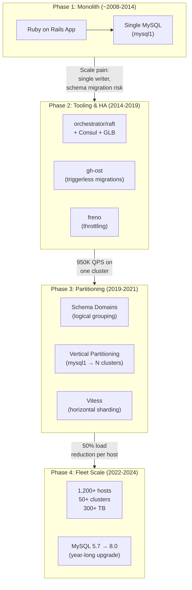
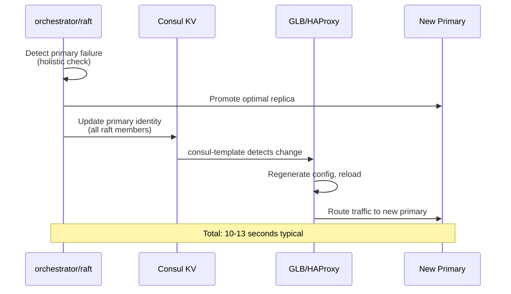

# GitHub: Scaling MySQL from One Database to 1,200+ Hosts

How GitHub evolved its MySQL infrastructure from a single monolithic database to a fleet of 1,200+ hosts across 50+ clusters serving 5.5 million queries per second (QPS)—through vertical partitioning, custom tooling (gh-ost, orchestrator, freno), Vitess adoption, and a major version upgrade—while keeping github.com available throughout.

<figure>



<figcaption>GitHub's MySQL infrastructure evolution across four phases, from a single database to a distributed fleet of 1,200+ hosts.</figcaption>
</figure>

## Abstract

GitHub's database story is a masterclass in scaling a relational database without abandoning it. The mental model:

| Phase                        | Problem                                                                                       | Solution                                                                                  | Key Insight                                                                         |
| ---------------------------- | --------------------------------------------------------------------------------------------- | ----------------------------------------------------------------------------------------- | ----------------------------------------------------------------------------------- |
| **Monolith** (~2008–2014)    | Single MySQL primary = single point of failure; schema changes = production risk              | Datacenter migration, functional partitioning, read replicas                              | You can defer architectural rework if you optimize hardware and config aggressively |
| **Tooling & HA** (2014–2019) | Trigger-based migrations lock tables; failovers take minutes; replication lag blindsides apps | gh-ost (triggerless), orchestrator/raft (10–13s failover), freno (cooperative throttling) | Build the operational tooling first—it makes every subsequent migration safer       |
| **Partitioning** (2019–2021) | `mysql1` at 950K QPS; any incident affects all features                                       | Schema domains, vertical partitioning, Vitess for horizontal sharding                     | Partition by logical domain, not by load—the boundaries are already in your code    |
| **Fleet scale** (2022–2024)  | 50+ clusters on MySQL 5.7 approaching EOL; fleet too large for manual ops                     | Rolling MySQL 8.0 upgrade with backward replication; automation investment                | Prior partitioning turned one massive upgrade into 50+ smaller, independent ones    |

**The transferable insight**: GitHub never did a "big rewrite." Each phase built operational capability (tooling, partitioning, automation) that made the next phase lower-risk. The tools they built along the way—gh-ost, orchestrator, freno—became industry standards adopted far beyond GitHub.

## Context

### The System

GitHub.com is a Ruby on Rails monolith backed by MySQL. Every non-Git operation—user authentication, repository metadata, issues, pull requests, notifications, actions—reads from or writes to MySQL.

| Metric             | 2018          | 2021       | 2023                   |
| ------------------ | ------------- | ---------- | ---------------------- |
| MySQL hosts        | ~150          | ~500+      | 1,200+                 |
| Database clusters  | ~15           | ~50+       | 50+                    |
| Data stored        | ~15 TB        | ~100+ TB   | 300+ TB                |
| Queries per second | Not published | 1.2M       | 5.5M                   |
| Host type          | Bare metal    | Bare metal | Azure VMs + bare metal |

### The Architecture

Each MySQL cluster follows a primary-replica topology: a single primary node accepts writes while replica nodes asynchronously replay changes and serve read traffic. ProxySQL pools connections from the Rails monolith, and GLB (GitHub Load Balancer) / HAProxy routes traffic to the correct primary.

### Why MySQL?

GitHub started on MySQL in 2008 and never left. Instead of migrating to a different database, they invested in making MySQL work at scale—building custom tooling where the ecosystem fell short. This "invest in what you know" strategy avoided the risk and engineering cost of a database migration while still achieving the operational characteristics they needed.

## Phase 1: The Monolith (~2008–2014)

### The Single Database

GitHub.com began as a Ruby on Rails application with a single MySQL database, known internally as `mysql1`. This cluster housed the data for nearly every feature: user profiles, repositories, issues, pull requests, stars, and notifications.

The early architecture was straightforward:

- **Single primary** accepting all writes
- **Read replicas** spreading read load across multiple machines
- **No connection pooling** initially—the Rails app opened connections directly to MySQL

### Where It Broke

By 2014, the single-cluster architecture had hit concrete limits:

- **Single point of failure**: Any incident affecting `mysql1`—a failed migration, a lock contention spiral, a hardware fault—impacted every feature on github.com simultaneously
- **Schema migration risk**: Altering a table schema on a multi-hundred-gigabyte table was a multi-hour operation that could cause lock contention and degrade the entire site
- **Vertical scaling limits**: Even with the best available hardware, a single primary could not absorb the growing write load indefinitely

### The 2014 Datacenter Migration

In August 2014, GitHub's infrastructure team (led by Sam Lambert) executed a major datacenter migration:

- Migrated the bulk of GitHub.com's MySQL infrastructure to a new datacenter with upgraded hardware and networking
- Used `tcpdump` to extract production `SELECT` queries and replay them against the new cluster for workload validation
- Tuned InnoDB parameters (`innodb_buffer_pool_size`, `innodb_thread_concurrency`, `innodb_io_capacity`, `innodb_buffer_pool_instances`) through iterative 12-hour test cycles, changing one variable at a time
- Introduced **functional partitioning**: moved large historical data tables to isolated clusters to free buffer pool resources for hot data

**Results:**

| Metric                 | Before   | After                        |
| ---------------------- | -------- | ---------------------------- |
| Average page load time | Baseline | **50% reduction**            |
| P99 response time      | Baseline | **66% reduction**            |
| Migration downtime     | —        | 13 minutes (Saturday 5am PT) |

The migration bought time, but the fundamental architecture—a single primary for most data—remained. The next phase addressed the operational tooling needed to safely evolve the schema and topology at scale.

## Phase 2: Tooling and High Availability (2014–2019)

GitHub's database team recognized that before partitioning the database, they needed tooling that made schema changes, failovers, and replication management safe and automated. Between 2014 and 2019, they built (or adopted and heavily contributed to) four critical tools.

### gh-ost: Triggerless Online Schema Migration

**Problem**: GitHub runs multiple schema migrations daily—adding columns, modifying indexes, changing constraints. The industry-standard tool, `pt-online-schema-change` from Percona, uses MySQL triggers to propagate changes. At GitHub's scale, triggers caused critical issues:

1. **Lock contention**: Triggers execute within the transaction space of every affected query, competing independently for locks on the shadow table. GitHub experienced near-complete table lockdowns during peak traffic
2. **No true pause**: You cannot remove triggers mid-migration without losing data, so throttling only slows the row-copy—triggers keep firing on every write
3. **No concurrent migrations**: The trigger overhead makes running multiple migrations on different tables simultaneously impractical
4. **Opaque testing**: Trigger-based migrations simulate poorly on replicas because Statement-Based Replication (SBR) runs single-threaded, which does not represent the primary's concurrent workload

**Solution**: In August 2016, GitHub open-sourced **gh-ost** (GitHub's Online Schema Transmogrifier), a triggerless migration tool. Instead of triggers, gh-ost connects to a MySQL replica and tails the binary log in Row-Based Replication (RBR) format. It creates a shadow ("ghost") table with the desired schema, copies rows incrementally, and applies ongoing changes from the binary log asynchronously. When the ghost table is synchronized, it performs an atomic table swap.

The key insight: gh-ost presents as a single sequential connection writing to the ghost table—comparable to an Extract, Transform, Load (ETL) process rather than an invasive trigger chain operating inside every production transaction.

**Key operational features:**

| Feature                | How It Works                                                                                        | Why It Matters                                     |
| ---------------------- | --------------------------------------------------------------------------------------------------- | -------------------------------------------------- |
| **True pause**         | Suspending gh-ost stops all writes to the primary                                                   | Safe throttling under load                         |
| **Dynamic control**    | Reconfigure `chunk-size`, `max-lag-millis` at runtime via Unix socket/TCP                           | No restart needed during multi-hour migrations     |
| **Postponed cutover**  | Flag file prevents final swap; ghost table stays in sync                                            | Ops can defer cutover to business hours            |
| **Production testing** | `--test-on-replica` runs the full migration on a replica, swaps tables, then reverses and checksums | Validates correctness without touching the primary |

GitHub runs continuous migration tests on all production tables (including tables of hundreds of GB) using dedicated test replicas. Each test executes a trivial `ENGINE=InnoDB` migration, checksums both tables, and reports any inconsistency. By 2020, almost all of GitHub's MySQL data had been recreated by gh-ost—most of it multiple times.

### orchestrator: Automated Failover with Raft Consensus

**Problem**: The previous failover mechanism used DNS and VIPs (Virtual IP Addresses), which suffered from DNS TTL (Time to Live) propagation delays, split-brain scenarios, and required the dead primary to cooperate in the failover process.

**Solution**: GitHub adopted and became the primary upstream maintainer of **orchestrator**, a MySQL replication topology management and high-availability tool. The architecture:

1. **orchestrator/raft**: Multiple orchestrator nodes across data centers communicate via Raft consensus. No single data center constitutes a majority, preventing isolated-DC split-brain
2. **Consul**: Per-datacenter key-value store maintaining primary node identities (Fully Qualified Domain Name, port, IP addresses)
3. **GLB/HAProxy**: Anycast load balancer with writer pools containing exactly one backend (the primary) per cluster. consul-template watches for Consul KV changes and reloads HAProxy automatically
4. **Holistic failure detection**: orchestrator monitors both the primary AND all replicas. Failover only proceeds when replicas corroborate that the primary is unreachable—preventing false positives

<figure>



<figcaption>GitHub's MySQL failover sequence: orchestrator detects failure, promotes a replica, updates Consul, and HAProxy reroutes traffic—typically within 10–13 seconds.</figcaption>
</figure>

**Failover performance:**

| Scenario | Total Outage     |
| -------- | ---------------- |
| Typical  | 10–13 seconds    |
| Extended | Up to 20 seconds |
| Extreme  | Up to 25 seconds |

**Replication configuration**: Semi-synchronous replication with a 500ms timeout ensures the primary waits for at least one local replica acknowledgment before confirming commits. This provides lossless failover for local datacenter failures while falling back to asynchronous mode if the timeout is exceeded.

### freno: Cooperative Throttling

**Problem**: Large bulk operations—schema migrations, data archiving, Elasticsearch indexing—walk through millions of rows and cause MySQL replication lag. When replicas fall behind, users see stale data. The original Rails-side throttler polled replicas synchronously and sequentially, creating stale connections and adding load to the primary.

**Solution**: **freno** is a standalone, highly available service (using Raft consensus) that continuously polls replica lag and exposes a simple HTTP API:

- Applications send an HTTP `HEAD` request before proceeding with bulk writes
- freno returns `HTTP 200` (proceed) or a throttle response based on the current maximum replication lag across all monitored replicas
- Lag measurement uses pt-heartbeat timestamps injected every 100 milliseconds

**Impact:**

- Memcached caching (20ms TTL) reduced freno query load from ~800 requests/second to ~50 requests/second
- Roughly 30% of read traffic was rerouted from the primary to replicas
- Elasticsearch indexing achieved consistent reads under 600ms at p95

### Trilogy: A Purpose-Built MySQL Client

In parallel, GitHub developed **Trilogy**, a MySQL client library written in C with Ruby bindings. In production since 2015 (open-sourced August 2022), Trilogy replaced the `mysql2` gem:

- Eliminates dependency on `libmariadb`/`libmysqlclient` (no version mismatch issues)
- Minimizes memory copies when building and parsing network packets
- Designed for embedding in the Ruby VM (handles blocking syscalls correctly)

During the MySQL 8.0 upgrade, Trilogy's consistent behavior gave the team confidence that the Rails monolith's connections would not break backward replication—a critical property for safe rollback. Multi-client clusters using other frameworks saw backward replication break within hours.

### Automated Schema Migration Pipeline

By 2020, GitHub had assembled these tools into a fully automated migration pipeline:

1. **Developer** opens a PR with schema changes
2. **GitHub Action** runs `skeema diff`, posts the generated SQL to the PR
3. **skeefree** (internal service) analyzes the change, maps it to the correct production cluster, and determines the strategy: direct SQL for `CREATE`/`DROP`, gh-ost for `ALTER TABLE`
4. **Database infrastructure team** reviews and approves via GitHub PR review
5. **skeefree** queues the migration (one `ALTER` per cluster at a time), invokes gh-ost, and posts progress updates to the PR
6. `DROP TABLE` operations are converted to `RENAME` with a timestamp suffix, providing a multi-day rollback window before garbage collection

**Scale**: ~2 schema migrations run daily on production, with peaks of up to 6 per day. Some larger tables require hours or days to migrate. This entire flow previously required hours of manual work daily from a database infrastructure engineer.

## Phase 3: Partitioning (2019–2021)

With reliable tooling in place, GitHub could address the fundamental architecture problem: the `mysql1` cluster was still handling 950,000 queries per second and remained a single point of failure for core features.

### The Approach: Schema Domains

Rather than sharding by hash or range (which fragments the application's data model), GitHub introduced **schema domains**—logical groupings of related tables that are frequently joined or transacted together:

```yaml title="db/schema-domains.yml"
gists:
  - gist_comments
  - gists
  - starred_gists

repositories:
  - issues
  - pull_requests
  - repositories

users:
  - avatars
  - gpg_keys
  - public_keys
  - users
```

This approach partitions along the boundaries that already exist in the application code. Tables within a domain stay together; tables in different domains can be moved to separate clusters independently.

### Enforcement: SQL Linters

Before physically moving tables, GitHub deployed two linters to identify and eliminate cross-domain dependencies:

**Query linter**: Verified that only tables from the same schema domain appear in a single query. Cross-domain joins were flagged and required rewriting—typically replacing `includes` with `preload` in ActiveRecord, which executes separate queries instead of joins.

**Transaction linter**: Ran in production with heavy sampling to identify transactions that span domain boundaries—operations that would lose ACID (Atomicity, Consistency, Isolation, Durability) guarantees after partitioning.

Developers could annotate known violations during remediation:

```ruby title="cross-domain-annotation.rb"
Repository.joins(:owner).annotate("cross-schema-domain-query-exempted")
```

Once a domain had zero violations, it was "virtually partitioned" and ready for physical migration.

### Two Migration Methods

GitHub used two complementary approaches to move tables between clusters without downtime:

**Vitess vertical sharding**: Deployed Vitess's VTGate in Kubernetes clusters as the MySQL protocol endpoint. VReplication (Vitess's replication engine) streamed table data to the destination cluster while applications connected through VTGate, which handled routing transparently.

**Custom write-cutover**: A lighter-weight alternative using standard MySQL replication. The destination cluster replicates from the source, with ProxySQL initially routing all traffic back to the source primary. At cutover time, six steps execute in **tens of milliseconds**:

1. Enable read-only on source primary
2. Read final GTID (Global Transaction Identifier) from source
3. Poll destination primary until GTID arrives
4. Stop replication from source
5. Update ProxySQL routing to destination
6. Disable read-only on both primaries

The custom approach served as risk mitigation—a simpler alternative when Vitess's overhead was not justified for a particular table set.

### Results

GitHub migrated approximately 130 of the busiest tables—repositories, issues, pull requests—off `mysql1` and distributed them across multiple new clusters.

| Metric                 | 2019 (Before) | 2021 (After) | Change            |
| ---------------------- | ------------- | ------------ | ----------------- |
| Total queries/second   | 950,000       | 1,200,000    | +26%              |
| Replica queries/second | 900,000       | 1,125,000    | +25%              |
| Primary queries/second | 50,000        | 75,000       | +50%              |
| Per-host load          | Baseline      | —            | **50% reduction** |
| Database clusters      | ~5            | 50+          | 10x growth        |

The load reduction contributed directly to fewer database-related incidents and improved github.com reliability. Critically, the 10x growth in cluster count—from ~5 clusters to 50+—meant that incidents were now scoped to individual feature domains rather than affecting the entire platform.

### Vitess for Horizontal Sharding

For domains that outgrew even a single-primary cluster (Notifications, Actions, and eventually Issues and Pull Requests), GitHub adopted Vitess's horizontal sharding:

- **VTGate** deployed in Kubernetes as the application-facing MySQL endpoint
- **VTTablet** manages communication between VTGate and individual MySQL instances
- Applications connect to VTGate endpoints instead of directly to MySQL
- GitHub maintains a fork (`github/vitess-gh`) with customizations for their environment

As of 2023, Vitess manages approximately 150 TB of GitHub's data and handles 750,000 QPS of their total database workload.

## Phase 4: Fleet Scale and MySQL 8.0 (2022–2024)

### The Upgrade Challenge

By mid-2022, GitHub's fleet had grown to 1,200+ MySQL hosts across 50+ clusters—all running MySQL 5.7, which was approaching end of life. The last time GitHub upgraded MySQL versions, they had approximately 5 clusters. Now they had 10x more, each with different workload characteristics and application dependencies.

### The Five-Step Rolling Upgrade

The team designed a per-cluster upgrade process that preserved rollback capability at every step:

**Step 1 — Rolling replica upgrades**: Deploy MySQL 8.0 replicas alongside existing 5.7 replicas. Gradually shift read traffic to 8.0 servers while monitoring for query plan regressions.

**Step 2 — Topology reconfiguration**: Create dual replication chains—one serving 8.0 traffic, another maintaining offline 5.7 replicas specifically for rollback.

**Step 3 — Primary promotion**: Use orchestrator to perform a graceful failover, promoting an 8.0 replica to primary. Blacklist 5.7 hosts from failover candidate selection.

**Step 4 — Ancillary upgrades**: Upgrade backup servers and non-production instances.

**Step 5 — Cleanup**: Remove 5.7 servers after a minimum 24-hour production traffic cycle confirms stability.

### Challenges Encountered

**Character set incompatibility**: MySQL 8.0 defaults to `utf8mb4_0900_ai_ci` collation, which MySQL 5.7 does not support. Backward replication from 8.0 to 5.7 (needed for rollback) broke immediately. The fix: configure 8.0 servers with `utf8` / `utf8_unicode_ci` defaults—sacrificing 8.0's improved collation until all clusters were upgraded and rollback was no longer needed.

**Replication bug**: MySQL 8.0.28 patched an issue where the `replica_preserve_commit_order` variable caused replication applier hangs under write-intensive load. GitHub's GTID-based replication met all triggering criteria, requiring version 8.0.28 as the minimum deployment target.

**Query plan regressions**: Queries passing CI against controlled test data failed in production against real-world data distributions. Most notably, queries with large `WHERE IN` clauses (tens of thousands of values) crashed MySQL outright. The team relied on SolarWinds DPM (Database Performance Monitor) for query sampling to detect these regressions before they caused outages.

**Vitess version advertisement**: VTGate advertises a MySQL version to clients. Java clients disabled query caching for 5.7 servers but generated blocking errors after upgrade because MySQL 8.0 removed the query cache entirely. VTGate settings required manual updates per keyspace during the shard-by-shard upgrade.

### Why Prior Partitioning Made This Possible

The partitioning work from Phase 3 turned what would have been a single high-risk upgrade into 50+ independent, smaller upgrades. Each cluster could be upgraded on its own timeline, and a regression in one cluster only affected that domain's features—not the entire platform.

### Outcome

| Metric            | Value                                 |
| ----------------- | ------------------------------------- |
| Fleet size        | 1,200+ hosts (Azure VMs + bare metal) |
| Data managed      | 300+ TB                               |
| Query throughput  | 5.5 million QPS                       |
| Database clusters | 50+                                   |
| Upgrade duration  | Over 1 year (July 2022 – late 2023)   |
| MySQL version     | 8.0 across entire fleet               |

## Options Considered (Across Phases)

GitHub's approach was notably conservative compared to industry peers. At various points, they evaluated alternatives:

### Option 1: Migrate Away from MySQL

**Approach**: Move to PostgreSQL, CockroachDB, or a purpose-built distributed database.

**Why not chosen**: The Rails monolith had deep MySQL dependencies—query patterns, schema conventions, ActiveRecord behaviors. A database migration would have been a multi-year effort with high risk and uncertain benefit. Instead, GitHub chose to build tooling that made MySQL work at their scale.

### Option 2: Adopt Vitess Fully (Replace All Clusters)

**Approach**: Deploy Vitess across the entire fleet rather than only for horizontally sharded domains.

**Why not chosen**: Vitess adds operational complexity (VTGate, VTTablet, topology management). For clusters that don't need horizontal sharding, standard MySQL with orchestrator/Consul provides the same availability guarantees with less overhead. GitHub uses Vitess selectively—where the sharding capability justifies the complexity.

### Option 3: Shard by Hash/Range

**Approach**: Traditional horizontal sharding based on a shard key (e.g., `user_id % N`).

**Why not chosen**: Hash-based sharding fragments the data model and requires application-level routing for every query. Schema domains partition along natural boundaries in the code, preserving the ability to join within a domain and transact atomically. Vitess handles the cases where true horizontal sharding is needed.

### Decision Factors

| Factor                    | Migrate DB | Full Vitess | Hash Sharding | Schema Domains |
| ------------------------- | ---------- | ----------- | ------------- | -------------- |
| Risk                      | Very high  | Medium      | Medium        | Low            |
| Application changes       | Massive    | Moderate    | Significant   | Targeted       |
| Timeline                  | Multi-year | 1–2 years   | 1–2 years     | Incremental    |
| Preserves MySQL expertise | No         | Partially   | Yes           | Yes            |
| Tooling reuse             | None       | Partial     | Full          | Full           |

## Lessons Learned

### Technical Lessons

#### 1. Build the Tooling Before the Migration

**The insight**: GitHub invested 5 years (2014–2019) building gh-ost, orchestrator, freno, and the automated migration pipeline before attempting the database partitioning in 2019. Each tool reduced the risk of the next step.

**How it applies elsewhere**: If your team plans a major database migration, first ask: Can we safely perform schema changes? Can we fail over in under 30 seconds? Can we throttle bulk operations without operator intervention? If the answer to any is "no," build that capability first.

**Warning signs you need this**:

- Schema migrations require maintenance windows
- Failovers take minutes and require manual intervention
- Replication lag is discovered by users, not by tooling

#### 2. Partition by Domain, Not by Load

**The insight**: GitHub partitioned along schema domain boundaries—logical groupings of tables used together—rather than by load or row count. This preserved transactional consistency within domains and aligned with how engineers already thought about the data.

**How it applies elsewhere**: Look at your application's `JOIN` and transaction patterns. The natural partition boundaries are already in your code. SQL linters can identify cross-domain dependencies automatically.

**Warning signs you need this**:

- A single database cluster is a blast radius for all features
- Schema changes on one feature's tables risk impacting unrelated features
- Your largest cluster handles queries for functionally independent workloads

#### 3. Triggers Are a Liability at Scale

**The insight**: MySQL triggers execute within the transaction of the triggering query, competing for locks and adding interpreter overhead to every affected row. At GitHub's write rates, this caused near-complete table lockdowns during migrations.

**How it applies elsewhere**: If your schema migration tool uses triggers (pt-online-schema-change, LHM, oak-online-alter-table), evaluate gh-ost. The binary log approach decouples migration overhead from production write traffic.

### Process Lessons

#### 1. Automate the Migration Pipeline End-to-End

**What they learned**: Before skeefree and the GitHub Actions integration, each migration required hours of manual coordination per day by a database infrastructure engineer. Automating the pipeline through PR-based workflows let engineers request migrations without understanding the underlying tooling.

**What they'd do differently**: GitHub acknowledged that the MySQL 8.0 upgrade still required excessive manual intervention. Future work focuses on self-healing automation and reduced per-cluster manual steps.

#### 2. Maintain Backward Replication for Rollback

**What they learned**: During the MySQL 8.0 upgrade, backward replication from 8.0 to 5.7 was the only viable rollback mechanism. Clusters using the consistent Trilogy client maintained backward replication indefinitely. Multi-client clusters using different MySQL drivers broke backward replication within hours, compressing the rollback window.

**The implication**: Standardizing the database client across all applications (not just the monolith) directly affects your ability to safely roll back infrastructure changes.

### Organizational Lessons

#### 1. Small, Specialized Teams Punching Above Their Weight

GitHub's database infrastructure team authored and maintained gh-ost, orchestrator, freno, Trilogy, and the migration automation pipeline. Key individuals—Shlomi Noach (gh-ost, orchestrator, freno), Tom Krouper (testing automation), Hailey Somerville and Brian Lopez (Trilogy)—built tools that became industry standards. The team's deep MySQL expertise, combined with building open-source tooling rather than proprietary solutions, created a virtuous cycle: external adoption improved the tools, which improved GitHub's own operations.

## Conclusion

GitHub's MySQL story spans 15+ years and demonstrates that a monolithic relational database can scale to 5.5 million QPS across 1,200+ hosts—without abandoning MySQL. The strategy was not a single migration but a sequence of investments: custom tooling (2014–2019), logical then physical partitioning (2019–2021), selective Vitess adoption for horizontal sharding, and a fleet-wide version upgrade (2022–2024).

The approach is reproducible. The core tools—gh-ost, orchestrator, freno—are open source and battle-tested at GitHub's scale. The schema domain concept requires only a YAML config and SQL linters to enforce. The partitioning strategy works incrementally: one domain at a time, validating each step before proceeding.

The deeper lesson is about sequencing. GitHub built operational safety (tooling and automation) before attempting structural changes (partitioning and sharding). This meant that when they finally partitioned `mysql1`, they had years of production data validating their migration tools, years of automated failover proving their HA architecture, and an established pipeline for schema changes that made the application-layer refactoring predictable. Each phase reduced the risk of the next.

## Appendix

### Prerequisites

- Familiarity with MySQL replication (primary-replica topology, binary logs, GTIDs)
- Understanding of database sharding concepts (vertical vs. horizontal partitioning)
- Basic knowledge of service discovery patterns (Consul, DNS-based routing)

### Terminology

| Term              | Definition                                                                                                |
| ----------------- | --------------------------------------------------------------------------------------------------------- |
| **gh-ost**        | GitHub's Online Schema Transmogrifier—a triggerless online schema migration tool for MySQL                |
| **orchestrator**  | MySQL replication topology management and high-availability tool using Raft consensus                     |
| **freno**         | Cooperative throttling service that rate-limits bulk operations based on MySQL replication lag            |
| **Trilogy**       | MySQL client library written in C with Ruby bindings, built by GitHub as a replacement for the mysql2 gem |
| **skeefree**      | GitHub's internal schema migration orchestration service                                                  |
| **VTGate**        | Vitess's proxy component that applications connect to instead of MySQL directly                           |
| **VReplication**  | Vitess's replication engine for moving table data between clusters                                        |
| **Schema domain** | A logical grouping of related tables that are frequently joined or transacted together                    |
| **GTID**          | Global Transaction Identifier—a unique identifier for each transaction in MySQL replication               |
| **GLB**           | GitHub Load Balancer—their custom anycast load balancer built on HAProxy                                  |

### Summary

- GitHub scaled MySQL from a single database to 1,200+ hosts across 50+ clusters serving 5.5 million QPS—without migrating away from MySQL
- Custom tooling (gh-ost, orchestrator, freno) was built before partitioning, reducing the risk of every subsequent migration
- Schema domains—logical groupings enforced by SQL linters—defined partition boundaries along natural application boundaries, not arbitrary shard keys
- Vitess was adopted selectively for horizontal sharding of domains that outgrew single-primary clusters (Notifications, Actions, Issues, Pull Requests)
- The MySQL 5.7 to 8.0 upgrade was made tractable by prior partitioning: 50+ independent cluster upgrades instead of one monolithic operation
- Key lesson: build operational safety first, then use it to de-risk structural changes

### References

- [Partitioning GitHub's relational databases to handle scale](https://github.blog/engineering/infrastructure/partitioning-githubs-relational-databases-scale/) — Thomas Maurer, GitHub Blog, September 2021
- [Upgrading GitHub.com to MySQL 8.0](https://github.blog/engineering/infrastructure/upgrading-github-com-to-mysql-8-0/) — Jiaqi Liu, Daniel Rogart, Xin Wu, GitHub Blog, December 2023
- [MySQL High Availability at GitHub](https://github.blog/engineering/infrastructure/mysql-high-availability-at-github/) — Shlomi Noach, GitHub Blog, June 2018
- [gh-ost: GitHub's online schema migration tool for MySQL](https://github.blog/news-insights/company-news/gh-ost-github-s-online-migration-tool-for-mysql/) — Shlomi Noach, GitHub Blog, August 2016
- [Automating MySQL schema migrations with GitHub Actions and more](https://github.blog/enterprise-software/automation/automating-mysql-schema-migrations-with-github-actions-and-more/) — Shlomi Noach, GitHub Blog, February 2020
- [MySQL infrastructure testing automation at GitHub](https://github.blog/engineering/infrastructure/mysql-testing-automation-at-github/) — Tom Krouper and Shlomi Noach, GitHub Blog, July 2017
- [Mitigating replication lag and reducing read load with freno](https://github.blog/engineering/infrastructure/mitigating-replication-lag-and-reducing-read-load-with-freno/) — GitHub Blog, March 2019
- [Making MySQL Better at GitHub](https://github.blog/2014-09-02-making-mysql-better-at-github/) — Sam Lambert, GitHub Blog, September 2014
- [Introducing Trilogy: a new database adapter for Ruby on Rails](https://github.blog/2022-08-25-introducing-trilogy-a-new-database-adapter-for-ruby-on-rails/) — GitHub Blog, August 2022
- [Orchestrator at GitHub](https://github.blog/engineering/infrastructure/orchestrator-github/) — Shlomi Noach, GitHub Blog, December 2016
- [Introduction to Vitess and Real-World Usage](https://kccnceu2023.sched.com/event/1Hzda/) — Arthur Schreiber (GitHub) and Florent Poinsard (PlanetScale), KubeCon EU 2023
- [GitHub Upgrades its MySQL Infrastructure from v5.7 to 8.0](https://www.infoq.com/news/2024/02/github-mysql-upgrade-v8/) — InfoQ, February 2024
- [github/gh-ost](https://github.com/github/gh-ost) — GitHub repository (MIT License, 13,000+ stars)
- [openark/orchestrator](https://github.com/openark/orchestrator) — GitHub repository
- [github/freno](https://github.com/github/freno) — GitHub repository (MIT License)
- [trilogy-libraries/trilogy](https://github.com/trilogy-libraries/trilogy) — GitHub repository (MIT License)
