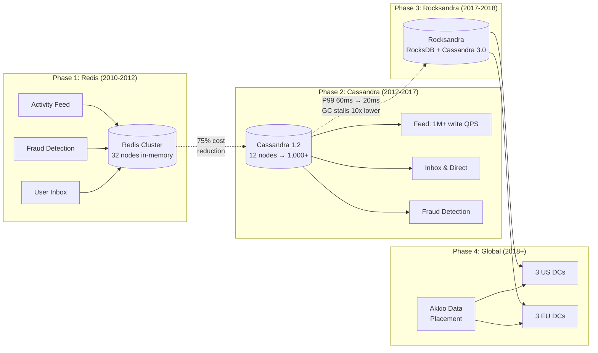

# Instagram: From Redis to Cassandra and the Rocksandra Storage Engine

How Instagram migrated critical workloads from Redis to Apache Cassandra, achieving 75% cost savings, then engineered a custom RocksDB-based storage engine to eliminate JVM garbage collection stalls and reduce P99 read latency by 10x. A seven-year evolution from 12 nodes to 1,000+ nodes serving billions of operations daily.

<figure>



<figcaption>Instagram's Cassandra journey: from Redis replacement to a globally distributed, custom-storage-engine deployment spanning six data centers.</figcaption>
</figure>

## Abstract

Instagram's Cassandra story is not a single migration but a series of compounding infrastructure decisions spanning 2012 to 2019:

- **The cost problem (2012)**: Redis stored everything in memory. Fraud detection logs and activity feeds were growing faster than Instagram could afford RAM. Cassandra's disk-backed LSM (Log-Structured Merge) tree storage cut infrastructure costs by 75% while adding horizontal scalability.
- **The latency problem (2017)**: At 1,000+ nodes, JVM Garbage Collection (GC) stalls caused P99 read latencies of 25-60ms. Instagram replaced Cassandra's Java storage engine with a C++-based RocksDB engine (Rocksandra), dropping P99 reads to 20ms and GC stalls from 2.5% to 0.3%.
- **The locality problem (2018)**: Full data replication across continents wasted storage and forced cross-ocean quorum requests. Akkio, Facebook's data placement service, partitioned data by user geography--US data in US data centers, EU data in EU data centers--reducing latency by up to 50% and storage footprint by 40%.

Each phase built on the previous one. The Redis migration proved Cassandra viable. Scale revealed JVM limits, which drove Rocksandra. Global expansion demanded locality-aware placement. The pattern: adopt, hit limits, engineer past them.

## Context

### The System

Instagram launched in October 2010 as an iOS photo-sharing app built by two engineers: Kevin Systrom and Mike Krieger. The original stack ran entirely on Amazon Web Services (AWS):

| Component            | Technology                 | Configuration                                                             |
| -------------------- | -------------------------- | ------------------------------------------------------------------------- |
| **Application**      | Django (Python) + Gunicorn | 25+ High-CPU Extra-Large EC2 instances                                    |
| **Primary database** | PostgreSQL                 | 12 Quadruple Extra-Large Memory instances + 12 replicas                   |
| **Caching**          | Redis + Memcached          | Multiple Quadruple Extra-Large instances (Redis), 6 instances (Memcached) |
| **Photo storage**    | Amazon S3 + CloudFront     | Several terabytes                                                         |
| **Async tasks**      | Gearman                    | ~200 Python workers                                                       |

Redis powered several critical data structures:

- **Photo-to-user ID mapping**: 300 million entries, optimized via hash bucketing to fit in ~5 GB (vs ~21 GB naive approach)
- **Activity feed**: A 32-node cluster (16 masters, 16 replicas) storing per-user activity timelines
- **Main feed**: Photo feed data for the home timeline
- **Sessions**: User authentication state

PostgreSQL handled users, photo metadata, tags, comments, and relationships, sharded using a custom scheme with PostgreSQL schemas as logical shards. Instagram's custom 64-bit ID generation used PL/pgSQL functions within each shard (41 bits for time, 13 bits for shard ID, 10 bits for sequence).

### The Trigger

**Date**: Early 2012

**Growth**: Instagram crossed 30 million users in early 2012 and was acquired by Facebook for $1 billion in April 2012 with just 13 employees. By mid-2013, monthly active users hit 100 million.

**Key metrics at the time:**

| Metric                      | Value                                         |
| --------------------------- | --------------------------------------------- |
| Registered users            | 30+ million (early 2012)                      |
| Monthly active users        | 100 million (mid-2013)                        |
| Photos stored               | 150+ million (August 2011), 20 billion (2013) |
| Upload rate                 | 25+ photos/sec, 90+ likes/sec                 |
| Engineering team            | 3-6 engineers                                 |
| Redis activity feed cluster | 32 nodes (16 masters, 16 replicas)            |

### Constraints

- **Memory cost**: Redis stored everything in RAM. Quadruple Extra-Large Memory EC2 instances were the most expensive instance class, and the activity feed cluster alone required 32 of them.
- **Workload mismatch**: Fraud detection and activity feeds had write-heavy access patterns (high write-to-read ratio). Paying for in-memory speed on data that was mostly written and rarely read was wasteful.
- **Durability**: Redis was designed as an in-memory store with persistence as a secondary feature. For security audit data used in fraud detection and spam fighting, stronger durability guarantees were needed.
- **Scaling model**: Redis scaled vertically (bigger instances) rather than horizontally (more nodes). Adding capacity meant migrating to larger instances, not simply adding machines.
- **Team size**: With 3-6 engineers, operational complexity had to stay minimal.

## The Problem

### Symptoms

The activity feed and fraud detection systems consumed the most expensive hardware in Instagram's fleet while underutilizing CPU. Redis machines ran out of memory long before they ran out of compute.

Rick Branson, Instagram's infrastructure engineer, described the core issue at Cassandra Summit 2013: the data was growing faster than the team could justify paying for in-memory storage. Fraud detection logs, security audit data, and activity feeds were append-heavy workloads where sub-millisecond reads were unnecessary--but they were paying for sub-millisecond capability on every byte.

### Root Cause Analysis

**The fundamental mismatch**: Redis optimizes for access speed by keeping everything in memory. Instagram's growing workloads--fraud detection logs, activity feeds, user inbox data--had a high write-to-read ratio. Most data was written once and read infrequently. Storing it in RAM was paying a premium for a capability the workload did not need.

**The scaling ceiling**: When a Redis node filled its memory, the only option was to migrate to a larger instance type. There was no mechanism to spread load across additional smaller nodes without re-architecting the sharding layer. Redis's single-threaded design further constrained vertical headroom.

**The durability gap**: Redis offered persistence through RDB (Redis Database) snapshots and AOF (Append-Only File) logs, but these were secondary features. For data used in fraud detection and spam enforcement, the team needed storage with replication and durability as first-class properties.

### Why It Wasn't Obvious Earlier

At Instagram's initial scale (2010-2011), Redis was the right choice. The entire working dataset fit in memory, latency was critical for feed rendering, and the operational simplicity of Redis with a small team was a significant advantage. The problem only emerged as data volumes outgrew what memory-based storage could justify economically.

## Options Considered

### Option 1: Scale Redis Vertically

**Approach**: Upgrade to larger EC2 instance types with more RAM.

**Pros:**

- Zero code changes
- Familiar operations

**Cons:**

- Cost scales linearly with data growth (all data in RAM)
- Instance types had memory ceilings--no path to unlimited growth
- Single-threaded architecture limited per-node throughput
- No horizontal elasticity

**Why not chosen**: Cost was already prohibitive and would only increase. Memory-based storage for write-heavy, rarely-read data was architecturally wrong for the workload.

### Option 2: HBase

**Approach**: Use Apache HBase, which Facebook had adopted internally for some workloads after moving away from Cassandra for inbox search.

**Pros:**

- Proven at Facebook scale
- Strong consistency model
- Good integration with Hadoop ecosystem

**Cons:**

- Requires ZooKeeper and HDFS--significant operational overhead
- Master-slave architecture introduces single points of failure
- Higher operational complexity for a team of 3-6 engineers

**Why not chosen**: The operational complexity of running ZooKeeper + HDFS + HBase was disproportionate for the team size. Instagram's philosophy was "do the simple thing first."

### Option 3: Apache Cassandra (Chosen)

**Approach**: Migrate fraud detection, activity feed, and inbox data from Redis to Cassandra.

**Pros:**

- Peer-to-peer architecture (no master, no SPOF)
- Tunable consistency per query
- Horizontal scaling by adding nodes
- High write throughput on commodity hardware
- Disk-based storage (dramatically cheaper per GB than RAM)

**Cons:**

- Eventually consistent by default (not suitable for all workloads)
- JVM-based (GC pauses could affect tail latency)
- Less mature tooling than PostgreSQL

**Why chosen**: The write-heavy, high-volume, eventual-consistency-tolerant workloads matched Cassandra's design point. The peer-to-peer architecture minimized operational burden. One of Instagram's engineers had deep Cassandra expertise from prior work at DataStax, reducing adoption risk.

### Decision Factors

| Factor                  | Scale Redis        | HBase             | Cassandra             |
| ----------------------- | ------------------ | ----------------- | --------------------- |
| Cost per GB             | Very high (RAM)    | Low (disk)        | Low (disk)            |
| Horizontal scalability  | Poor               | Good              | Good                  |
| Operational complexity  | Low                | High (ZK+HDFS)    | Medium                |
| Write throughput        | High (single node) | High              | Very high             |
| Team expertise          | Strong             | None              | Strong (one engineer) |
| Single point of failure | Per-node           | ZooKeeper, Master | None                  |

## Implementation

### Phase 1: Initial Cassandra Deployment (2012-2013)

#### Cluster Configuration

The first production Cassandra cluster was deployed on AWS for fraud detection and activity feed workloads:

| Parameter               | Value                                             |
| ----------------------- | ------------------------------------------------- |
| **Cassandra version**   | 1.2.3                                             |
| **Cluster size**        | 12 nodes                                          |
| **Instance type**       | EC2 hi1.4xlarge (8-core CPU, 60 GB RAM, 2 TB SSD) |
| **Availability zones**  | 3                                                 |
| **Replication factor**  | 3                                                 |
| **Write consistency**   | TWO                                               |
| **Read consistency**    | ONE                                               |
| **Compaction strategy** | LeveledCompactionStrategy                         |
| **Virtual nodes**       | Enabled                                           |
| **JVM heap**            | 8 GB                                              |
| **Young generation**    | 800 MB                                            |
| **Data stored**         | ~1.2 TB                                           |

**Why these choices:**

- **RF=3 across 3 AZs**: Every row existed in all three availability zones, providing AZ-level fault tolerance.
- **W=TWO, R=ONE**: Writes were durable (confirmed by two replicas) while reads were fast (single replica). This matched the write-heavy access pattern.
- **LeveledCompactionStrategy**: Optimizes read latency by maintaining sorted data at the cost of higher write amplification. Chosen because when reads did happen (e.g., rendering a user's activity feed), latency mattered.
- **hi1.4xlarge instances**: High I/O instances with SSD storage--critical for Cassandra's disk-heavy workload. The 60 GB RAM allowed large page caches while keeping the JVM heap small.

#### Data Model: Activity Feed

The primary data model replaced Redis lists with Cassandra wide rows:

**Redis (before):**

```
key: inbox:<user_id>
value: list of activity JSON blobs (LPUSH/LRANGE)
```

**Cassandra (after):**

```sql title="Activity feed schema (CQL)"
CREATE TABLE inbox_activities_by_user (
    user_id bigint,
    activity_id timeuuid,
    activity_data blob,
    PRIMARY KEY (user_id, activity_id)
) WITH CLUSTERING ORDER BY (activity_id DESC);
```

**Why this model:**

- `user_id` as partition key co-located all activities for a single user on the same nodes, enabling efficient range scans.
- `activity_id` as a TimeUUID clustering column provided natural time ordering without a separate sort.
- `CLUSTERING ORDER BY DESC` meant the most recent activities were physically first on disk, optimizing the most common query: "show me the latest N activities."

#### Peak Throughput

| Metric           | Value                             |
| ---------------- | --------------------------------- |
| Peak writes      | ~20,000/sec                       |
| Peak reads       | ~15,000/sec                       |
| Data consistency | 99.63% (measured across replicas) |

### Phase 2: Scaling to 1,000+ Nodes (2014-2016)

After Instagram migrated from AWS to Facebook's data centers in 2013-2014, Cassandra usage expanded dramatically. By Dikang Gu's Cassandra Summit 2016 presentation, the deployment had grown to:

| Metric                     | Value                                                    |
| -------------------------- | -------------------------------------------------------- |
| **Total nodes**            | 1,000+                                                   |
| **Data stored**            | Hundreds of terabytes                                    |
| **Operations per second**  | Millions                                                 |
| **Largest single cluster** | 100+ nodes                                               |
| **Use cases**              | Feed, inbox, Direct messaging, counters, fraud detection |

#### Feed Data Model (2016)

The feed system became Cassandra's highest-throughput use case:

| Metric                         | Value  |
| ------------------------------ | ------ |
| Write QPS (Queries Per Second) | 1M+    |
| Average read latency           | 20 ms  |
| P99 read latency               | 100 ms |

Write path: when a user posted a photo, the system performed fan-out-on-write, pushing the media ID to each follower's feed store. This traded write amplification for read simplicity--rendering a feed was a single partition read rather than a scatter-gather across followed users.

**Celebrity fan-out optimization**: For accounts with millions of followers, fan-out-on-write was prohibitively expensive. Instagram used a hybrid approach: non-celebrity posts were pre-computed (push model), while celebrity content was computed on-demand (pull model). When a user read their feed, parallel threads fetched pre-computed feeds and real-time celebrity feeds, then merged the results. An LRU-eviction cache stored active users' feeds to reduce re-computation.

#### Proxy Nodes

As clusters grew, Instagram discovered that co-locating coordinator responsibilities with data storage on the same node caused latency spikes when data nodes became hot. The solution: dedicated proxy nodes configured with `join_ring: false`, acting as coordinators without storing data locally. Clients connected exclusively to proxy nodes, which forwarded requests to the appropriate data nodes. This architectural change alone produced a 2x latency improvement.

#### Counter Service

A separate Cassandra-backed counter service tracked likes, views, and engagement metrics:

| Metric               | Value |
| -------------------- | ----- |
| Read/Write QPS       | 50K+  |
| Average read latency | 3 ms  |
| P99 read latency     | 50 ms |

#### JVM Tuning Evolution

As clusters grew, GC tuning became increasingly critical:

| Period         | Heap  | Young Gen | Notes                                                          |
| -------------- | ----- | --------- | -------------------------------------------------------------- |
| 2013 (initial) | 8 GB  | 800 MB    | Default settings                                               |
| 2014           | 20 GB | 10 GB     | Addressed Young GC double-collection bug in JDK 1.7+           |
| Later          | 64 GB | 16 GB     | MaxTenuringThreshold=6, Young GC every 10s, 2x P99 improvement |

The 2014 scaling to 60 hi1.4xlarge instances (2x the highest estimate) revealed that Cassandra's JVM heap management required careful tuning. The Young GC double-collection bug in JDK 1.7+ caused objects to be collected twice, and the fix--running 10 GB Young Gen with 20 GB total heap--was a hard-won operational lesson.

### Phase 3: Rocksandra -- Replacing the Storage Engine (2017-2018)

#### The Latency Problem

Despite years of JVM tuning, GC remained the dominant source of tail latency:

| Metric                               | Value                            |
| ------------------------------------ | -------------------------------- |
| Average read latency                 | 5 ms                             |
| P99 read latency                     | 25-60 ms (varied by cluster)     |
| GC stall rate (low traffic)          | 1.25%                            |
| GC stall rate (high traffic)         | 2.5%                             |
| Target SLA (Service Level Agreement) | Five nines (99.999%) reliability |

The root cause was structural: Cassandra's memtable, compaction, read path, and write path all created short-lived objects on the Java heap. As data volume and throughput increased, so did GC pressure. No amount of tuning could eliminate the fundamental tension between JVM-managed memory and latency-sensitive storage workloads.

#### Architecture: Pluggable Storage Engine

Cassandra had no pluggable storage engine architecture. Instagram designed one from scratch, defining a new `StorageEngine` API that separated Cassandra's distribution layer (gossip, replication, consistency) from its storage layer (memtables, SSTables, compaction).

The three core challenges:

1. **Storage engine API**: Define clean interfaces between Cassandra's coordination layer and the storage implementation. Filed as [CASSANDRA-13474](https://issues.apache.org/jira/browse/CASSANDRA-13474) in Apache JIRA.

2. **Data type encoding/decoding**: Cassandra supports rich data types (collections, UDTs, counters, frozen types). RocksDB is a pure key-value store. Instagram designed encoding algorithms that mapped Cassandra's table schemas and data types into RocksDB's byte-oriented key-value pairs while preserving the same query semantics. Filed as [CASSANDRA-13476](https://issues.apache.org/jira/browse/CASSANDRA-13476).

3. **Streaming decoupling**: Cassandra's streaming (used for repairs, bootstrapping, and data movement) was tightly coupled to the SSTable format. Instagram re-implemented streaming using RocksDB APIs: incoming data streamed into temporary SST files first, then used RocksDB's ingest file API to bulk-load them--avoiding the overhead of individual writes during bootstrap and repair.

The pluggable engine API was defined at `org.apache.cassandra.engine.StorageEngine`, with Instagram's RocksDB implementation at `org.apache.cassandra.rocksdb.RocksDBEngine`. Configuration required three JVM parameters: `cassandra.rocksdb.keyspace` (target keyspace), `cassandra.rocksdb.dir` (data directory), and `cassandra.rocksdb.stream.dir` (temporary streaming directory).

**Feature scope**: Rocksandra supported most non-nested data types, table schemas, point and range queries, mutations, timestamps, TTL (Time To Live), and cell-level tombstones. It did not support multi-partition queries, nested data types, counters, range tombstones, materialized views, secondary indexes, or repair operations. These limitations were acceptable because Instagram's primary use cases were simple key-value and wide-column patterns.

#### Why RocksDB

RocksDB is a C++ embeddable key-value store originally developed at Facebook, optimized for fast storage (SSDs and NVMe). It uses an LSM tree architecture--the same fundamental structure as Cassandra's storage engine--but implemented in C++ with no GC overhead.

Instagram already operated RocksDB at scale for other Facebook workloads. Using a proven technology that the team understood, rather than adopting a new distributed database like ScyllaDB, minimized adoption risk. As one engineer noted in the Hacker News discussion: why replace a system proven at massive scale with something unproven at that scale?

#### Performance Results

After approximately one year of development and testing, Rocksandra was rolled into production clusters:

**Production metrics:**

| Metric              | Before (Java engine) | After (Rocksandra) | Improvement    |
| ------------------- | -------------------- | ------------------ | -------------- |
| P99 read latency    | 60 ms                | 20 ms              | 3x reduction   |
| GC stall rate       | 2.5%                 | 0.3%               | ~10x reduction |
| Latency consistency | High variance        | Low variance       | Predictable    |

**Benchmark environment:**

| Parameter   | Value                                    |
| ----------- | ---------------------------------------- |
| Instances   | 3 x i3.8xlarge EC2 (32-core, 244 GB RAM) |
| Storage     | RAID0 with 4 NVMe flash drives           |
| Dataset     | 250 million rows, 6 KB each              |
| Concurrency | 128 readers + 128 writers (NDBench)      |

The improvement was not just in absolute latency but in consistency. With the Java engine, P99 latency varied between 25 ms and 60 ms depending on GC timing. With Rocksandra, latency was stable because the C++ storage path had no GC pauses.

#### Open Source

Instagram open-sourced Rocksandra on GitHub ([Instagram/cassandra](https://github.com/Instagram/cassandra), `rocks_3.0` branch, based on Cassandra 3.0). The repository was archived in September 2023.

### Phase 4: Geographic Data Partitioning with Akkio (2018)

#### The Locality Problem

By 2018, Instagram served over 1 billion monthly active users across multiple continents. The original approach--replicating all data across all data centers--created two problems:

1. **Storage waste**: Full replication meant every user's data existed in every region, even if that user only accessed their data from one continent.
2. **Cross-ocean latency**: Quorum consistency (requiring a majority of replicas to agree) meant some requests had to cross the Atlantic, adding 60+ ms of latency.

#### Akkio: Facebook's Data Placement Service

Instagram integrated Akkio, a Facebook-internal data placement service that had been in production since 2014 managing approximately 100 PB of data across Facebook's infrastructure.

**Core concept: microshards (u-shards)**

Akkio introduced a layer above traditional database shards. Each microshard is an application-defined data unit (typically 100 bytes to several megabytes) that exhibits strong access locality--for Instagram, a user's data.

**How it works:**

1. **Access tracking**: A client library embedded in Cassandra clients asynchronously tracked which data center accessed which microshards.
2. **Placement scoring**: A Data Placement Service scored data centers by historical access frequency (weighted toward recent activity), with ties broken by available resources.
3. **Migration**: When access patterns shifted (e.g., a user relocated), Akkio triggered data migration: copy data to the target replica set, atomically update the location service, then delete from the source.

**Architecture after Akkio integration:**

| Region | Data Centers   | Data Scope     |
| ------ | -------------- | -------------- |
| US     | 3 data centers | US users' data |
| EU     | 3 data centers | EU users' data |

Each region maintained 20% capacity headroom for single-datacenter failover within the region.

**Results:**

| Metric                       | Improvement         |
| ---------------------------- | ------------------- |
| Latency                      | Up to 50% reduction |
| Cross-datacenter traffic     | Up to 50% reduction |
| Storage footprint            | Up to 40% reduction |
| Instagram Direct P90 latency | 90 ms improvement   |
| Instagram Direct P99 latency | 150 ms improvement  |

The Social Hash partitioner routed requests to the correct Cassandra buckets based on user geography, with special handling for high-follower accounts that generated distributed access patterns across regions.

## Outcome

### Metrics Comparison Across Phases

| Metric           | Redis (2012)       | Cassandra 1.2 (2013) | Cassandra at scale (2016) | Rocksandra (2018) |
| ---------------- | ------------------ | -------------------- | ------------------------- | ----------------- |
| Nodes            | 32 (activity feed) | 12                   | 1,000+                    | 1,000+            |
| Data stored      | In-memory only     | ~1.2 TB              | Hundreds of TB            | Hundreds of TB    |
| Cost (relative)  | 100%               | ~25%                 | -                         | -                 |
| P99 read latency | Sub-ms             | -                    | 25-60 ms                  | 20 ms             |
| GC stall rate    | N/A                | -                    | 1.25-2.5%                 | 0.3%              |
| Write QPS (feed) | -                  | 20K                  | 1M+                       | 1M+               |
| Geographic scope | Single region      | Single region        | Multi-DC (US)             | US + EU (6 DCs)   |

### Timeline

| Date                  | Milestone                                                                     |
| --------------------- | ----------------------------------------------------------------------------- |
| October 2010          | Instagram launches on PostgreSQL + Redis                                      |
| Early 2012            | Cassandra adoption begins for fraud detection                                 |
| April 2012            | Facebook acquires Instagram (13 employees)                                    |
| June 2013             | Rick Branson presents first 12-node Cassandra cluster at Cassandra Summit     |
| April 2013 - Mid 2014 | Migration from AWS to Facebook data centers                                   |
| 2014                  | Cassandra scales to 60+ nodes; Cassandra Summit 2014 presentation             |
| 2015                  | Multi-datacenter expansion within the US                                      |
| 2016                  | 1,000+ nodes, Dikang Gu presents at Cassandra Summit 2016                     |
| 2017-2018             | Rocksandra development (~1 year)                                              |
| February 2018         | Rocksandra open-sourced                                                       |
| October 2018          | Geographic partitioning with Akkio (LISA 2018 presentation)                   |
| 2019                  | Cassandra as a Service inside Instagram (Dikang Gu, DataStax Accelerate 2019) |

### Unexpected Benefits

- **Operational simplicity at scale**: Cassandra's peer-to-peer architecture meant no master failovers, no ZooKeeper dependency, and straightforward capacity additions--critical for a team that grew from 3 to 300+ engineers.
- **Pluggable storage engine as a platform**: The storage engine API Instagram built for Rocksandra (CASSANDRA-13474) was proposed upstream to Apache Cassandra, potentially enabling other storage backends beyond RocksDB.
- **Akkio enablement**: Cassandra's flexible replication model made it a natural fit for Akkio's microshard-based data placement, which was harder to apply to systems like TAO (Facebook's social graph store) with globally-accessed data.

### Remaining Limitations

- **Rocksandra adoption**: The pluggable storage engine API was not merged into mainline Apache Cassandra. Instagram maintained a fork, which was eventually archived in 2023.
- **JVM overhead persists**: Cassandra's coordination layer (gossip, request handling) still runs on the JVM. Rocksandra only replaced the storage path.
- **Eventual consistency trade-offs**: Workloads requiring strong consistency remained on PostgreSQL or TAO. Cassandra served use cases where eventual consistency was acceptable.

## Lessons Learned

### Technical Lessons

#### 1. Match Storage Costs to Access Patterns

**The insight**: Storing write-heavy, rarely-read data in RAM is an architectural smell. The cost model should match the access pattern--disk storage for archival writes, memory for hot reads.

**How it applies elsewhere:**

- Audit logs, analytics events, and activity streams rarely need sub-millisecond reads
- The 75% cost savings Instagram achieved came from recognizing that write performance, not read speed, was the binding constraint

**Warning signs to watch for:**

- Memory utilization growing faster than CPU utilization on cache/store nodes
- Storage cost dominating infrastructure budget for data that is mostly written

#### 2. JVM Garbage Collection Limits Tail Latency at Scale

**The insight**: JVM-based storage engines create an inherent tension between throughput and P99 latency. At sufficient scale (1,000+ nodes, millions of operations), no amount of GC tuning eliminates the problem.

**How it applies elsewhere:**

- Any JVM-based data store (Elasticsearch, Kafka, HBase) will face similar GC pressure at scale
- The pattern of replacing hot-path components with native code (C++/Rust) is increasingly common: ScyllaDB (C++ Cassandra), Redpanda (C++ Kafka), Quickwit (Rust Elasticsearch)

**Warning signs to watch for:**

- P99 latency 10-15x higher than average (indicates GC pauses, not I/O)
- GC stall percentage above 1% during normal operation
- Latency variance that does not correlate with load changes

#### 3. Build on Proven Components Rather Than Replacing Entire Systems

**The insight**: Instagram replaced Cassandra's storage engine with RocksDB rather than replacing Cassandra entirely with ScyllaDB or another system. This preserved operational expertise, cluster tooling, and the proven distribution layer while solving the specific problem (GC latency).

**How it applies elsewhere:**

- When a system has one problematic layer, consider replacing that layer rather than the entire system
- Organizational trust in a technology is a real engineering asset--switching costs include lost operational knowledge

**What they'd do differently:**
The pluggable storage engine API was not accepted upstream into Apache Cassandra, leaving Instagram on a fork. Contributing the API earlier in the process might have changed the outcome.

### Process Lessons

#### 1. Presentation-Driven Engineering Rigor

Instagram's Cassandra team presented at Cassandra Summit every year from 2013 to 2019. Each presentation forced the team to quantify their deployment's state, document decisions, and articulate challenges. This created an unusually well-documented evolution that other teams could learn from.

#### 2. Shadow Clustering for Version Upgrades

When migrating from Cassandra 2.2 to 3.0, Dikang Gu's team used shadow clusters--parallel deployments receiving replicated traffic--to validate behavior before cutting over production. This pattern reduced the risk of major version upgrades on a system serving billions of operations.

### Organizational Lessons

#### 1. Small Teams Need Low-Ops Technology

Instagram chose Cassandra partly because its peer-to-peer architecture required less operational overhead than master-slave systems like HBase. With 3-6 engineers running the entire infrastructure, every operational burden was magnified. The absence of ZooKeeper dependencies, master failover procedures, and HDFS management was a decisive factor.

#### 2. Expertise Acquisition Through Hiring

One of Instagram's engineers had deep Cassandra expertise from prior work at DataStax. This single hire de-risked the entire migration. When adopting unfamiliar infrastructure, hiring someone who has operated it at scale is often more effective than training existing staff.

## Applying This to Your System

### When This Pattern Applies

You might face similar challenges if:

- You are storing append-heavy, rarely-read data (logs, events, feeds) in an in-memory store
- Your storage costs are growing faster than your read throughput requirements justify
- You need horizontal scalability without master-node bottlenecks
- Your JVM-based data store has P99 latencies significantly higher than P50

### Checklist for Evaluation

- [ ] Is your storage cost dominated by memory for data with a high write-to-read ratio?
- [ ] Are you hitting vertical scaling limits (memory, instance type ceilings)?
- [ ] Is your P99 latency 10x+ higher than average, suggesting GC pressure?
- [ ] Does your team have (or can acquire) Cassandra operational expertise?
- [ ] Are your consistency requirements compatible with eventual consistency?

### Starting Points

If you want to explore this approach:

1. **Profile your workload**: Measure write-to-read ratio, access recency, and hot data percentage. If most data is cold, it does not belong in RAM.
2. **Benchmark Cassandra for your schema**: Use cassandra-stress or NDBench with your actual data model and access patterns. Test with LeveledCompactionStrategy for read-heavy partitions and SizeTieredCompactionStrategy for write-heavy ones.
3. **Start with one workload**: Instagram started with fraud detection--a non-user-facing, write-heavy workload where Cassandra failure would not break the product. Choose your lowest-risk, highest-waste workload.
4. **Monitor GC from day one**: Track GC stall percentage, not just average latency. A 2% stall rate that is invisible in averages will dominate your P99.

## Conclusion

Instagram's Cassandra journey demonstrates a recurring pattern in infrastructure evolution: adopt technology for its strengths, discover its limits at scale, then engineer past those limits rather than replacing the system entirely. The 75% cost savings from migrating off Redis validated Cassandra. The GC latency problem at 1,000+ nodes led to Rocksandra rather than a database switch. Geographic expansion drove Akkio integration rather than a replication redesign.

The transferable insight is not "use Cassandra." It is: match your storage cost model to your access patterns, expect JVM-based systems to hit GC walls at scale, and when you hit a wall, replace the problematic layer--not the entire stack.

## Appendix

### Prerequisites

- Understanding of LSM tree storage engines (memtables, SSTables, compaction)
- Familiarity with distributed system concepts (replication factor, consistency levels, partitioning)
- Basic knowledge of JVM garbage collection (Young/Old Gen, GC pauses, stall rates)

### Terminology

| Term                          | Definition                                                                                                                                                                                   |
| ----------------------------- | -------------------------------------------------------------------------------------------------------------------------------------------------------------------------------------------- |
| **LSM tree**                  | Log-Structured Merge tree. A write-optimized data structure that buffers writes in memory (memtable), flushes to sorted files on disk (SSTables), and periodically merges them (compaction). |
| **Rocksandra**                | Instagram's name for their modified Cassandra with RocksDB as the storage engine.                                                                                                            |
| **Akkio**                     | Facebook's data placement service that tracks access patterns and migrates data units (microshards) to data centers closest to frequent accessors.                                           |
| **Microshard (u-shard)**      | An application-defined data unit in Akkio, typically representing a single user's data, that can be independently placed in a specific data center.                                          |
| **GC stall rate**             | The percentage of time a JVM-based application is paused for garbage collection, unable to process requests.                                                                                 |
| **Fan-out on write**          | A pattern where data is duplicated to all recipients' stores at write time, trading write amplification for fast reads.                                                                      |
| **LeveledCompactionStrategy** | A Cassandra compaction strategy that maintains data in sorted levels, optimizing read latency at the cost of higher write amplification.                                                     |
| **Shadow cluster**            | A parallel deployment receiving replicated production traffic for testing, used to validate new configurations or versions before production cutover.                                        |

### Summary

- Instagram migrated fraud detection and activity feed workloads from Redis to Cassandra in 2012, cutting infrastructure costs by 75% by moving from in-memory to disk-based storage for write-heavy, rarely-read data.
- The initial 12-node Cassandra 1.2 cluster on AWS grew to 1,000+ nodes on Facebook's infrastructure by 2016, handling millions of operations per second across feed, inbox, Direct messaging, and counter workloads.
- JVM garbage collection became the dominant source of P99 latency at scale (25-60 ms). Instagram built Rocksandra, replacing Cassandra's Java storage engine with a C++-based RocksDB engine, reducing P99 reads to 20 ms and GC stalls from 2.5% to 0.3%.
- Geographic data partitioning via Akkio eliminated cross-continent replication, reducing latency by up to 50% and storage by 40% by placing user data in the nearest regional data center cluster.
- The pattern--adopt proven technology, discover scale-specific limits, engineer past them rather than replace the system--is a reusable approach for infrastructure evolution.

### References

- [Cassandra at Instagram (Cassandra Summit 2013) -- Rick Branson](https://www.slideshare.net/slideshow/c-summit-2013-cassandra-at-instagram-23756207/23756207) - Initial 12-node deployment details
- [Cassandra at Instagram (August 2013) -- Rick Branson](https://www.slideshare.net/rbranson/cassandra-at-instagram-aug-2013) - Updated cluster configuration and data models
- [Cassandra at Instagram 2014 (Cassandra Summit 2014) -- Rick Branson](https://www.slideshare.net/planetcassandra/cassandra-summit-2014-cassandra-at-instagram-2014) - Scaling to 60+ nodes, JVM tuning lessons
- [Cassandra at Instagram 2016 (Cassandra Summit 2016) -- Dikang Gu](https://www.slideshare.net/DataStax/cassandra-at-instagram-2016) - 1,000+ nodes, feed data model, counter service
- [Open-sourcing a 10x reduction in Apache Cassandra tail latency -- Instagram Engineering](https://instagram-engineering.com/open-sourcing-a-10x-reduction-in-apache-cassandra-tail-latency-d64f86b43589) - Rocksandra announcement and performance results
- [CASSANDRA-13474: Pluggable Storage Engine API -- Apache JIRA](https://issues.apache.org/jira/browse/CASSANDRA-13474) - Upstream proposal for pluggable storage
- [CASSANDRA-13476: RocksDB Storage Engine -- Apache JIRA](https://issues.apache.org/jira/browse/CASSANDRA-13476) - RocksDB engine implementation
- [Instagram/cassandra (rocks_3.0 branch) -- GitHub](https://github.com/Instagram/cassandra/tree/rocks_3.0) - Open-source Rocksandra code
- [Sharding the Shards: Managing Datastore Locality at Scale with Akkio -- USENIX OSDI 2018](https://www.usenix.org/system/files/osdi18-annamalai.pdf) - Akkio paper with production results
- [Splitting Stateful Services across Continents at Instagram -- InfoQ (LISA 2018)](https://www.infoq.com/news/2018/11/instagram-across-continents/) - Geographic partitioning with Akkio
- [Instagram: Making the Switch to Cassandra from Redis -- DataStax Blog / HN Discussion](https://news.ycombinator.com/item?id=5845107) - Context on Redis-to-Cassandra decision and Rick Branson's comments
- [What Powers Instagram -- Instagram Engineering](https://instagram-engineering.com/what-powers-instagram-hundreds-of-instances-dozens-of-technologies-adf2e22da2ad) - Original infrastructure overview
- [Sharding & IDs at Instagram -- Instagram Engineering](https://instagram-engineering.com/sharding-ids-at-instagram-1cf5a71e5a5c) - PostgreSQL sharding and ID generation
- [Instagration Pt. 2: Scaling to Multiple Data Centers -- Instagram Engineering](https://instagram-engineering.com/instagration-pt-2-scaling-our-infrastructure-to-multiple-data-centers-5745cbad7834) - Multi-DC expansion
- [Cassandra on RocksDB (OSCON 2018) -- Dikang Gu](https://conferences.oreilly.com/oscon/oscon-or-2018/public/schedule/detail/67020.html) - Technical deep-dive on Rocksandra architecture
- [Solving Optimal Data Placement for Instagram's Global Scale (DataStax Accelerate 2019) -- Dikang Gu](https://www.datastax.com/resources/video/datastax-accelerate-2019-solving-optimal-data-placement-instagrams-global-scale) - Akkio integration details
