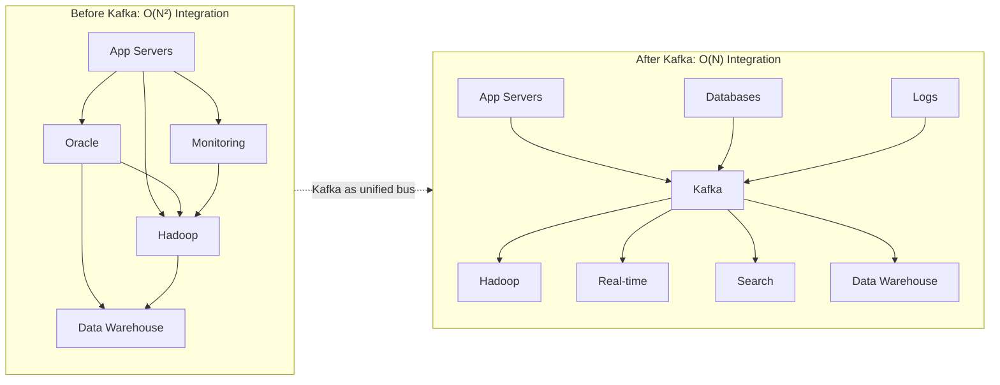
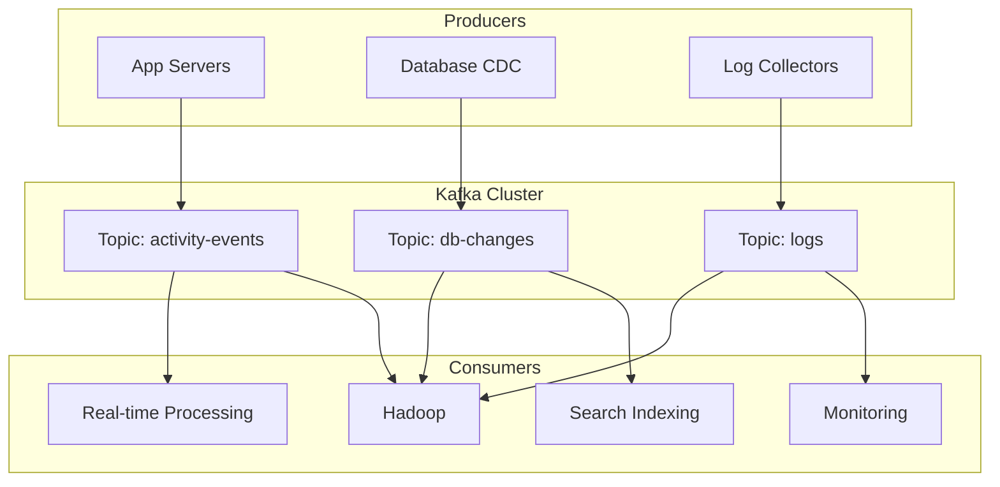
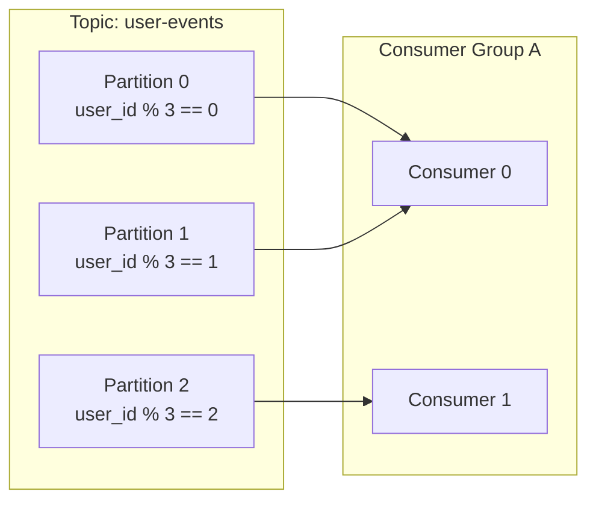
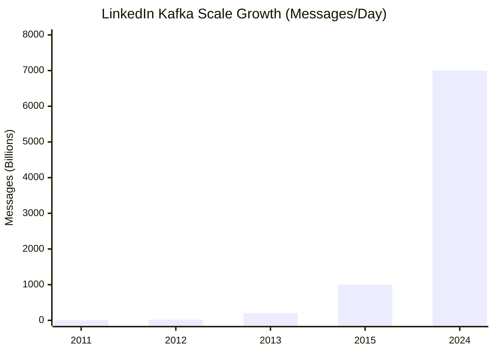

# LinkedIn and the Birth of Apache Kafka: Solving the O(N²) Data Integration Problem

In 2010, LinkedIn faced a data infrastructure crisis: connecting 10 specialized data systems required 90 custom pipelines, each prone to failure. Oracle SQL\*Loader jobs took 2-3 days with manual babysitting. Despite significant engineering effort, only 14% of their data reached Hadoop. Traditional messaging systems like ActiveMQ required a full TCP/IP roundtrip per message—unacceptable for billions of daily events. Jay Kreps, Neha Narkhede, and Jun Rao built Kafka to solve this: a distributed commit log that decoupled data producers from consumers, enabling any-to-any data flow through a single, scalable pipeline. This case study examines the architectural decisions that made Kafka the backbone of modern data infrastructure.

<figure>



<figcaption>LinkedIn's data integration complexity before and after Kafka. The O(N²) point-to-point connections collapsed into O(N) connections through a unified log.</figcaption>
</figure>

## Abstract

**The core insight**: Data integration is fundamentally a problem of decoupling producers from consumers. Every data source (databases, applications, logs) and every data sink (Hadoop, search, real-time processing) creates a potential integration point. With N sources and M sinks, point-to-point integration requires O(N×M) custom pipelines—each with its own failure modes, data formats, and operational burden.

**Kafka's solution**: A distributed commit log as a universal data bus. Producers append to the log without knowing who consumes. Consumers read from the log at their own pace without affecting producers. The log provides:

- **Ordering guarantees** within partitions (critical for event processing)
- **Durability** via disk persistence and replication
- **Scalability** via horizontal partitioning
- **Decoupling** via pull-based consumption

**Key design decisions and their rationale**:

| Decision                        | Why                                                         | Trade-off                                     |
| ------------------------------- | ----------------------------------------------------------- | --------------------------------------------- |
| **Log-based storage**           | Sequential I/O saturates disk bandwidth; random I/O doesn't | Requires compaction for key-based workloads   |
| **Pull-based consumers**        | Consumer controls pace; avoids overwhelming slow consumers  | Adds latency vs. push (median 2ms acceptable) |
| **Partitioned topics**          | Parallelism bounded by partition count, not broker count    | Consumer groups limited to partition count    |
| **Stateless brokers**           | Simplifies failover; consumer tracks own offset             | Consumer must manage offset commits           |
| **Leader-follower replication** | f+1 replicas tolerate f failures (vs. 2f+1 for quorum)      | Assumes datacenter reliability                |

**Scale progression at LinkedIn**:

| Year | Messages/Day | Growth   |
| ---- | ------------ | -------- |
| 2011 | 1 billion    | Baseline |
| 2012 | 20 billion   | 20×      |
| 2013 | 200 billion  | 200×     |
| 2015 | 1+ trillion  | 1,000×   |
| 2024 | 7+ trillion  | 7,000×   |

## Context

### The System

In 2010, LinkedIn's data infrastructure consisted of multiple specialized systems:

| Component          | Purpose                                                 | Scale               |
| ------------------ | ------------------------------------------------------- | ------------------- |
| **Oracle**         | Transactional data (profiles, connections)              | Primary OLTP        |
| **Hadoop**         | Batch analytics (82 daily jobs, 16TB intermediate data) | 14% of data covered |
| **Voldemort**      | Key-value store (also built at LinkedIn)                | Serving tier        |
| **Azkaban**        | Workflow orchestration                                  | ETL scheduling      |
| **Data Warehouse** | Business analytics                                      | Offline queries     |

The team needed to track activity events: page views, search queries, ad impressions, profile views, connection requests, and content interactions. These events fed both offline analytics (Hadoop, data warehouse) and emerging real-time use cases (monitoring, personalization, fraud detection).

### The Trigger

**2008-2010**: LinkedIn's data pipelines were failing under scale:

**The SQL\*Loader bottleneck**: Loading data from Oracle to the data warehouse used Oracle SQL\*Loader. This process took 2-3 days with 20-24 hours of actual data transfer, requiring manual intervention when it failed.

**The integration complexity explosion**: With N data sources and M data consumers, the team faced O(N×M) integration points. Each new data source meant building custom connectors to every consumer. Each new consumer meant integrating with every source.

> "We put lots of effort into pushing activity data through custom pipelines into Hadoop, and even more into getting our reporting data there too, but were only successful in getting a subset of around 14 percent of our data."
> — Jay Kreps, "The Log" (2013)

**The real-time gap**: Business teams wanted sub-second latency for data visibility. The batch-oriented infrastructure delivered data hours or days after generation.

### Constraints

| Constraint               | Impact                                                        |
| ------------------------ | ------------------------------------------------------------- |
| **Throughput**           | Billions of events/day; ~172,000 msg/sec sustained peak       |
| **Latency**              | Batch was hours; needed seconds                               |
| **Consumer variety**     | Hadoop (batch), real-time search, monitoring—different speeds |
| **Operational overhead** | No budget for per-consumer custom infrastructure              |
| **Fault tolerance**      | Multi-datacenter replication required                         |

## The Problem

### Symptoms

**Data staleness**: Activity data took hours or days to reach analytics systems. Product teams couldn't measure feature impact in real-time.

**Pipeline fragility**: Custom pipelines between systems failed frequently. Each failure required debugging specific to that pipeline's implementation.

**Coverage gap**: Despite significant investment, most data never reached the analytical systems that needed it. The team estimated only 14% of relevant data was accessible in Hadoop.

**Operational burden**: Each data flow required dedicated engineering attention. Adding a new data source meant weeks of integration work with every downstream consumer.

### Root Cause Analysis

**Investigation process**:

1. **Initial hypothesis**: The problem was specific pipelines—fix each one individually.
2. **Pattern recognition**: Every pipeline had the same fundamental issues: serialization mismatches, flow control problems, failure handling complexity.
3. **The insight**: The problem was architectural—point-to-point integration doesn't scale with system count.

**The actual root cause**: No unified abstraction for data in motion. Each data flow was a one-off implementation with custom:

- Serialization format
- Transport mechanism
- Error handling
- Backpressure strategy
- Monitoring approach

**Why existing solutions failed**:

**Traditional messaging systems (ActiveMQ, RabbitMQ)**:

| Issue                          | Impact                                                    |
| ------------------------------ | --------------------------------------------------------- |
| Full TCP roundtrip per message | ~10ms latency per message; 100 msg/sec max per connection |
| Weak distributed support       | No native partitioning across machines                    |
| Memory-buffered                | Performance cliff when consumers fall behind              |
| ACK-per-message overhead       | CPU and I/O costs at high throughput                      |

**Log aggregation systems (Facebook Scribe)**:

| Issue                   | Impact                                |
| ----------------------- | ------------------------------------- |
| Push-based model        | Overwhelmed slow consumers            |
| Batch-oriented          | Not suitable for real-time consumers  |
| Implementation-specific | Exposed internals to downstream users |

## Options Considered

### Option 1: Improve Existing Pipelines

**Approach**: Fix each point-to-point pipeline individually. Standardize serialization, add monitoring, improve error handling.

**Pros**:

- No new infrastructure to build
- Incremental improvement

**Cons**:

- O(N×M) effort scales with data systems
- Doesn't address fundamental complexity
- Each new system still requires O(N) integrations

**Why not chosen**: The team had already tried this. Despite significant effort, they couldn't keep up with the integration demands of new data sources and consumers.

### Option 2: Centralized Database

**Approach**: Route all data through a single database (Oracle or Hadoop).

**Pros**:

- Single integration point
- Familiar operational model

**Cons**:

- No single database handles both OLTP and analytics workloads efficiently
- Databases optimized for querying, not for high-throughput data transport
- Oracle already the bottleneck (2-3 day SQL\*Loader jobs)

**Why not chosen**: Databases are optimized for state management, not data movement. Using a database as a message bus conflates two different concerns.

### Option 3: Adopt Open Source Messaging

**Approach**: Deploy ActiveMQ or RabbitMQ as a message bus.

**Pros**:

- Mature software
- JMS ecosystem compatibility

**Cons**:

- Throughput limitations (TCP roundtrip per message)
- No native horizontal partitioning
- Memory pressure under consumer lag

**Why not chosen**: The team tested these systems. Throughput was orders of magnitude below requirements. At billions of events per day, the per-message overhead was prohibitive.

### Option 4: Build a Distributed Commit Log (Chosen)

**Approach**: Build a new system from first principles, optimized for:

1. High-throughput ingestion (millions of events/second)
2. Durable storage with configurable retention
3. Multiple independent consumers at different speeds
4. Horizontal scalability via partitioning

**Pros**:

- Designed for LinkedIn's specific scale requirements
- Log abstraction provides ordering and durability
- Decoupled producers and consumers

**Cons**:

- Significant upfront engineering investment
- Operational learning curve for new system
- Risk of building something nobody uses

**Why chosen**: No existing system met the throughput, scalability, and multi-consumer requirements simultaneously.

### Decision Factors

| Factor           | ActiveMQ               | Scribe       | New System (Kafka)  |
| ---------------- | ---------------------- | ------------ | ------------------- |
| Throughput       | Low (per-msg overhead) | High (batch) | High (batched I/O)  |
| Real-time        | Yes                    | No           | Yes                 |
| Multi-consumer   | Limited                | Limited      | Native              |
| Horizontal scale | Manual                 | Yes          | Native partitioning |
| Durability       | Optional               | Yes          | Yes                 |
| Team expertise   | Partial                | None         | Full control        |

## Implementation

### Architecture Overview

**Before: Point-to-Point**

```
App → Oracle → SQL*Loader → Data Warehouse
App → Custom ETL → Hadoop
App → Direct → Monitoring
Database → CDC → Search Index
```

Each arrow represents a custom integration.

**After: Kafka as Central Hub**

<figure>



<figcaption>Kafka architecture: producers publish to topics, consumers subscribe independently. Each consumer maintains its own offset.</figcaption>
</figure>

### Core Design Decisions

#### Decision 1: Log-Based Storage

**The insight**: Sequential disk I/O is fast—comparable to network I/O. Random disk I/O is 10,000× slower. A commit log (append-only writes, sequential reads) exploits this asymmetry.

**Implementation**:

- Messages appended to segment files in offset order
- Segment files immutable after closing (simplifies replication, caching)
- OS page cache handles read caching (no application-level cache needed)
- Linear reads can prefetch efficiently

**Benchmark result (2014)**: 821,557 records/second write throughput from a single producer thread on commodity hardware.

**Trade-off**: Log-based storage requires periodic compaction for key-based workloads. Kafka added log compaction in 0.8 to retain only the latest value per key.

#### Decision 2: Pull-Based Consumers

**The insight**: Push-based systems must choose between overwhelming slow consumers or implementing complex per-consumer flow control. Pull lets consumers control their own pace.

**Implementation**:

- Consumers issue fetch requests specifying topic, partition, and offset
- Broker returns available messages up to configured batch size
- Consumer commits offsets after processing (at-least-once) or before (at-most-once)

**Advantages**:

| Benefit                      | Explanation                                        |
| ---------------------------- | -------------------------------------------------- |
| **Batching efficiency**      | Consumer fetches many messages per request         |
| **Consumer-controlled pace** | Slow consumers don't affect producers              |
| **Catch-up capability**      | Lagging consumer can catch up without backpressure |
| **Replay**                   | Consumer can re-read from any offset               |

**Trade-off**: Pull adds latency (consumer must poll). Kafka mitigates with long-polling: consumer request blocks until data is available or timeout expires. Measured end-to-end latency: median 2ms, 99th percentile 3ms.

#### Decision 3: Partitioned Topics

**The insight**: A single log can't scale beyond one broker's capacity. Partitioning distributes data across brokers while maintaining order within each partition.

**Implementation**:

- Topic divided into N partitions
- Producer chooses partition (hash of key, round-robin, or custom)
- Each partition is an independent, ordered log
- Consumer group assigns partitions to consumers

<figure>



<figcaption>Partitioning enables parallelism. Consumer group distributes partitions across members. Messages with the same key always go to the same partition, preserving per-key ordering.</figcaption>
</figure>

**Trade-off**: Consumer parallelism is bounded by partition count. A topic with 10 partitions can have at most 10 consumers in a group processing in parallel. Choose partition count based on expected peak parallelism.

#### Decision 4: Stateless Brokers

**The insight**: Tracking consumer offsets in brokers adds complexity and coupling. If brokers are stateless (from a consumer perspective), failover is simpler.

**Implementation**:

- Brokers store messages but not consumer state
- Consumers track their own offsets (originally in ZooKeeper, later in Kafka itself)
- Broker failure doesn't lose consumer progress

**Trade-off**: Consumers must commit offsets explicitly. Failure between processing and commit can cause reprocessing (at-least-once semantics). Exactly-once requires additional coordination (added in Kafka 0.11 with idempotent producers and transactions).

#### Decision 5: Leader-Follower Replication

**The insight**: Quorum-based replication (like Paxos/Raft) requires 2f+1 replicas to tolerate f failures. Leader-follower only requires f+1 replicas—half the hardware cost.

**Implementation** (added in Kafka 0.8):

- Each partition has one leader and N-1 followers
- Producers write only to the leader
- Followers replicate from the leader
- In-Sync Replica (ISR) set tracks followers within acceptable lag
- Leader failure triggers leader election from ISR

**Trade-off**: Leader-follower assumes single datacenter deployment where network partitions are rare. For multi-datacenter, Kafka uses asynchronous mirroring (MirrorMaker) rather than synchronous replication.

### API Design

**Three core design principles** (from Jun Rao's announcement):

1. **Simple API**: Producers send messages to topics. Consumers read messages from topics. No complex transaction semantics.
2. **Low overhead**: Batch messages in network transfers. Use efficient binary protocol. Zero-copy transfer from disk to network.
3. **Scale-out architecture**: Horizontal scaling via partition count. No single-node bottlenecks.

**Producer API (simplified)**:

```java
// Send message to topic, let Kafka choose partition
producer.send(new ProducerRecord<>("user-events", userId, eventJson));

// Send to specific partition
producer.send(new ProducerRecord<>("user-events", partition, userId, eventJson));
```

**Consumer API (simplified)**:

```java
consumer.subscribe(Arrays.asList("user-events"));
while (true) {
    ConsumerRecords<String, String> records = consumer.poll(Duration.ofMillis(100));
    for (ConsumerRecord<String, String> record : records) {
        process(record.key(), record.value(), record.offset());
    }
    consumer.commitSync();
}
```

### Migration Strategy

**Phase 1: Shadow Mode (Early 2011)**

- Deployed Kafka alongside existing pipelines
- Dual-wrote events to both old pipelines and Kafka
- Validated data completeness and ordering

**Phase 2: Consumer Migration (Mid 2011)**

- Migrated consumers one at a time to read from Kafka
- Kept old pipelines running as fallback
- Compared results between old and new paths

**Phase 3: Producer Cutover (Late 2011)**

- Once consumers validated, switched producers to Kafka-only
- Decommissioned old pipelines incrementally

**Risk mitigation**:

- Kafka's consumer offset tracking allowed replaying data if issues discovered
- Retention configured for 7+ days, enabling rollback within that window

## Outcome

### Metrics Comparison

| Metric                            | Before Kafka | After Kafka         | Improvement        |
| --------------------------------- | ------------ | ------------------- | ------------------ |
| Data latency to analytics         | 2-3 days     | Seconds             | ~100,000×          |
| Data coverage in Hadoop           | 14%          | 100%                | 7×                 |
| Integration effort per new system | O(N)         | O(1)                | Linear to constant |
| Sustained throughput              | ~10K msg/sec | 172K msg/sec (2012) | 17×                |
| Peak throughput                   | Limited      | 4.5M msg/sec (2015) | —                  |

### Timeline

| Date                    | Milestone                                                |
| ----------------------- | -------------------------------------------------------- |
| **Christmas 2009/2010** | Jay Kreps writes first Kafka code                        |
| **2010**                | Jun Rao and Neha Narkhede join; first production version |
| **January 11, 2011**    | Kafka open-sourced                                       |
| **July 4, 2011**        | Kafka enters Apache Incubator                            |
| **July 2011**           | 1 billion messages/day in LinkedIn production            |
| **October 23, 2012**    | Kafka graduates to Apache Top-Level Project              |
| **February 2013**       | Kafka 0.8 with intra-cluster replication                 |
| **September 2014**      | Confluent founded by Kafka creators                      |

### Scale Progression

<figure>



<figcaption>LinkedIn's Kafka throughput grew 7,000× in 13 years, demonstrating the scalability of the log-based architecture.</figcaption>
</figure>

### Unexpected Benefits

**Stream processing foundation**: Kafka's ordered, durable log became the foundation for Apache Samza (2013), enabling stream processing that treats the log as a database changelog.

**Change Data Capture (CDC)**: The same architecture that handled activity events could capture database changes, unifying application events and database mutations in a single infrastructure.

**Multi-datacenter replication**: Kafka's MirrorMaker enabled cross-datacenter data replication, supporting LinkedIn's global deployment without fundamental architecture changes.

### Remaining Limitations (as of initial release)

| Limitation              | Resolution                          |
| ----------------------- | ----------------------------------- |
| No replication          | Added in 0.8 (2013)                 |
| ZooKeeper dependency    | KRaft mode removed ZooKeeper (2022) |
| At-least-once only      | Exactly-once added in 0.11 (2017)   |
| No transactional writes | Transactions added in 0.11 (2017)   |

## Lessons Learned

### Technical Lessons

#### 1. Sequential I/O Changes Everything

**The insight**: Modern storage (spinning disk and SSD) has vastly different performance for sequential vs. random access. Sequential writes to disk can exceed 600 MB/s; random writes might be 100 KB/s. A commit log exploits this 6,000× difference.

**How it applies elsewhere**:

- Write-ahead logs in databases (PostgreSQL WAL, MySQL binlog)
- Log-structured merge trees (LSM-trees) in Cassandra, RocksDB
- Event sourcing architectures

**Warning signs you might benefit from this**:

- Random I/O bottlenecks on database writes
- High write amplification in storage layer
- Inefficient disk utilization

#### 2. Decouple Producers from Consumers

**The insight**: Point-to-point integration creates O(N×M) complexity. A central bus reduces it to O(N+M). More importantly, it allows producers and consumers to evolve independently.

**How it applies elsewhere**:

- API gateways decoupling frontend from backend services
- Schema registries decoupling data format from transport
- Feature stores decoupling ML training from feature computation

**Warning signs**:

- Every new data source requires integration with every consumer
- Producer changes break consumers
- No way to add new consumers without producer changes

#### 3. Pull Beats Push for Heterogeneous Consumers

**The insight**: When consumers have different speeds (batch vs. real-time), push-based systems must either throttle to the slowest consumer or implement complex per-consumer buffering. Pull delegates this complexity to the consumer.

**How it applies elsewhere**:

- Git (pull-based) vs. centralized VCS (push-based)
- RSS/Atom feeds (pull-based) vs. email notifications (push-based)
- Polling-based monitoring vs. push-based metrics

**When pull doesn't work**:

- Ultra-low-latency requirements (sub-millisecond)
- Consumers can't implement polling logic
- Network constraints prevent consumer-initiated connections

#### 4. The Log is a Fundamental Abstraction

**The insight**: A totally ordered, append-only sequence of records is the simplest possible storage abstraction. It can represent database state (via changelog), message passing (via topics), and replicated state machines (via consensus logs).

**How it applies elsewhere**:

- Database replication (replicate the WAL, derive state)
- Event sourcing (log is the source of truth, state is derived)
- Distributed consensus (Raft log, Paxos log)

**Further reading**: Jay Kreps' "The Log" blog post (2013) explores this abstraction in depth.

### Process Lessons

#### 1. Build for Your Actual Scale

**The insight**: LinkedIn built Kafka for billions of messages/day because that was their actual requirement. Existing systems were designed for different scale points.

**What they'd do differently**: Earlier investment in understanding true throughput requirements. The team spent time trying to adapt existing systems before accepting they needed something new.

#### 2. Open Source Accelerates Adoption

**The insight**: Open-sourcing Kafka in January 2011—before it was fully production-ready—created a community that accelerated development far beyond what LinkedIn could achieve alone.

**The trade-off**: Open source created external pressure to stabilize APIs and maintain backward compatibility, which sometimes conflicted with internal refactoring needs.

### Organizational Lessons

#### 1. Infrastructure as a Product

**The insight**: Treating Kafka as an internal product with clear APIs, documentation, and support enabled broad adoption within LinkedIn. Teams could self-serve rather than requiring infrastructure team involvement for each integration.

**How this applies**: Internal platforms should have the same product discipline as external products: clear value proposition, documentation, migration guides, and deprecation policies.

## Applying This to Your System

### When This Pattern Applies

You might face similar challenges if:

- You have multiple data sources (databases, applications, logs) and multiple data consumers (analytics, search, real-time)
- Adding a new data source requires integrating with multiple downstream systems
- Adding a new consumer requires integrating with multiple upstream systems
- Batch data loading is measured in hours or days
- Different consumers need the same data at different speeds

### Checklist for Evaluation

- [ ] How many point-to-point data integrations do you maintain?
- [ ] What's the latency from data generation to availability in analytics?
- [ ] Can you replay historical data to a new consumer?
- [ ] Can consumers fall behind without affecting producers?
- [ ] What's your integration effort for adding a new data source?

### Starting Points

If you want to explore this approach:

1. **Identify your highest-volume data flows**: What data moves between systems most frequently?
2. **Measure your current latency**: From data generation to availability in each consumer
3. **List your integration points**: Draw the graph of data sources and consumers
4. **Evaluate managed options**: Amazon MSK, Confluent Cloud, Azure Event Hubs, Google Pub/Sub
5. **Start with one use case**: Pick a high-value, low-risk data flow to migrate first

## Conclusion

LinkedIn's creation of Kafka solved a fundamental problem in data-intensive systems: the O(N²) integration complexity that emerges when multiple data sources must feed multiple data consumers. The key insight wasn't technical—it was architectural. By introducing a durable, ordered log as an intermediary, Kafka decoupled producers from consumers, transforming N×M point-to-point connections into N+M connections through a central hub.

The specific technical decisions—log-based storage, pull-based consumers, partitioned topics, stateless brokers, leader-follower replication—follow logically from the requirements: high throughput, multiple consumer speeds, horizontal scalability, and fault tolerance. Each decision involved trade-offs that were acceptable for LinkedIn's use case but might not be for others.

Kafka's impact extends beyond LinkedIn. The log abstraction became foundational for stream processing (Samza, Flink, Spark Streaming), change data capture (Debezium), and event-driven architectures broadly. The insight that a simple append-only log can unify messaging, storage, and stream processing has influenced systems design for a decade.

The lesson for system designers: before building complex point-to-point integrations, consider whether a shared log could simplify the architecture. The upfront investment in a unified data infrastructure often pays dividends as system count grows.

## Appendix

### Prerequisites

- Understanding of messaging systems (queues, pub/sub)
- Basic knowledge of distributed systems concepts (partitioning, replication)
- Familiarity with data pipeline architectures (ETL, CDC)

### Terminology

- **Commit log**: An append-only, ordered sequence of records; the fundamental storage abstraction in Kafka
- **Topic**: A named log that producers write to and consumers read from
- **Partition**: A subdivision of a topic; each partition is an independent log on a single broker
- **Offset**: A message's position within a partition; monotonically increasing integer
- **Consumer group**: A set of consumers that collectively read a topic; each partition is assigned to exactly one consumer in the group
- **ISR (In-Sync Replica)**: The set of replicas that are fully caught up with the leader
- **CDC (Change Data Capture)**: Capturing row-level changes from a database as a stream of events
- **At-least-once delivery**: Messages may be delivered more than once; consumer must be idempotent
- **Exactly-once delivery**: Messages delivered exactly once; requires coordination between producer, broker, and consumer

### Summary

- **The problem**: LinkedIn's point-to-point data integration created O(N²) complexity; only 14% of data reached analytics systems
- **Why existing solutions failed**: Traditional messaging couldn't handle throughput; log aggregation couldn't support real-time consumers
- **The solution**: A distributed commit log (Kafka) as a universal data bus
- **Key design decisions**: Log-based storage (sequential I/O), pull-based consumers (heterogeneous speeds), partitioned topics (horizontal scaling), stateless brokers (simple failover), leader-follower replication (datacenter reliability)
- **Outcome**: 7,000× scale growth (1B to 7T messages/day); foundation for modern stream processing
- **Core insight**: The log is a unifying abstraction for messaging, storage, and stream processing

### References

**Primary Sources (LinkedIn Engineering)**

- [Open-sourcing Kafka, LinkedIn's distributed message queue](https://www.linkedin.com/blog/member/archive/open-source-linkedin-kafka) - Jun Rao, January 2011. Original announcement
- [The Log: What every software engineer should know about real-time data's unifying abstraction](https://engineering.linkedin.com/distributed-systems/log-what-every-software-engineer-should-know-about-real-time-datas-unifying) - Jay Kreps, December 2013. Foundational post on log abstraction
- [Benchmarking Apache Kafka: 2 Million Writes Per Second](https://engineering.linkedin.com/kafka/benchmarking-apache-kafka-2-million-writes-second-three-cheap-machines) - Jay Kreps, April 2014. Performance characteristics
- [Intra-cluster Replication in Apache Kafka](https://engineering.linkedin.com/kafka/intra-cluster-replication-apache-kafka) - LinkedIn Engineering, February 2013. Replication design rationale
- [How We're Improving and Advancing Kafka at LinkedIn](https://engineering.linkedin.com/apache-kafka/how-we_re-improving-and-advancing-kafka-linkedin) - LinkedIn Engineering, 2015. Scale numbers

**Academic Papers**

- [Kafka: a Distributed Messaging System for Log Processing](https://cwiki.apache.org/confluence/download/attachments/27822226/Kafka-netdb-06-2011.pdf) - Kreps, Narkhede, Rao. NetDB Workshop 2011. Original paper
- [Building LinkedIn's Real-time Activity Data Pipeline](http://sites.computer.org/debull/a12june/pipeline.pdf) - Goodhope et al. IEEE Data Engineering Bulletin, June 2012. Production deployment details

**Books**

- [I Heart Logs: Event Data, Stream Processing, and Data Integration](https://www.oreilly.com/library/view/i-heart-logs/9781491909379/) - Jay Kreps. O'Reilly, 2014. Extended treatment of log abstraction

**Apache Kafka Documentation**

- [Kafka Papers and Presentations](https://cwiki.apache.org/confluence/display/KAFKA/Kafka+papers+and+presentations) - Apache Wiki. Comprehensive list of talks and papers
- [Consumer Design](https://docs.confluent.io/kafka/design/consumer-design.html) - Confluent. Pull-based consumer rationale

**Interviews and Podcasts**

- [Software Engineering Radio Episode 219: Apache Kafka with Jun Rao](https://se-radio.net/2015/02/episode-219-apache-kafka-with-jun-rao/) - February 2015. Design decisions discussion
