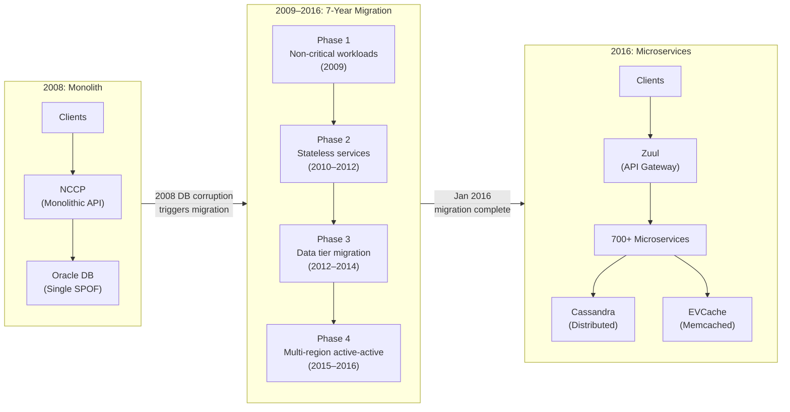

# Netflix: From Monolith to Microservices — A 7-Year Architecture Evolution

In August 2008, a database corruption in Netflix's monolithic Oracle backend prevented DVD shipments for three days — exposing a single point of failure that threatened the business. Rather than patching the existing architecture, Netflix leadership made a radical decision: migrate entirely to AWS and decompose the monolith into independent microservices. Over 7 years (2009–2016), Netflix grew from 9.4 million to 89 million subscribers, scaled from 20 million to 2 billion API requests per day, and built an open-source ecosystem (Eureka, Hystrix, Zuul, Chaos Monkey) that redefined how the industry thinks about cloud-native architecture. This case study traces the technical decisions, migration phases, tools built, and hard-won lessons from one of the most influential architecture transformations in software history.

<figure>

<figcaption>Netflix's 7-year journey from a monolithic Java/Oracle stack to 700+ microservices on AWS, triggered by a 2008 database corruption incident.</figcaption>
</figure>

## Abstract

Netflix's monolith-to-microservices migration is an **architecture evolution story**, not a rewrite story. The mental model:

| Phase                       | Timeline  | What Changed                         | Key Challenge                      |
| --------------------------- | --------- | ------------------------------------ | ---------------------------------- |
| **Trigger**                 | Aug 2008  | Oracle DB corruption → 3-day outage  | Single point of failure exposed    |
| **Cloud pathfinders**       | 2009      | Non-critical workloads to AWS        | Proving cloud viability            |
| **Stateless decomposition** | 2010–2012 | API services extracted from monolith | Service discovery, fault isolation |
| **Data tier migration**     | 2012–2014 | Oracle → Cassandra, S3               | Data model denormalization         |
| **Multi-region resilience** | 2015–2016 | Active-active across AWS regions     | Chaos engineering at region scale  |

**Core insights:**

- **Migration was incremental, not big-bang**: Netflix ran the monolith and microservices in parallel for years, migrating one service at a time. The last piece (billing) moved to AWS in January 2016.
- **Each pain point spawned a tool**: Service discovery gaps → Eureka. Cascading failures → Hystrix. Edge routing needs → Zuul. Configuration drift → Archaius. Each Netflix OSS tool exists because a production problem demanded it.
- **Culture enabled the architecture**: Netflix's "freedom and responsibility" model — small teams (2–8 engineers) owning the full lifecycle of their services — was a prerequisite, not a consequence, of the microservices architecture.
- **The OSS ecosystem had a lifecycle**: Netflix built, open-sourced, and eventually deprecated many of these tools as the industry (and Netflix itself) shifted toward service mesh and gRPC-based patterns.

## Context

### The System

Netflix's pre-migration architecture was a conventional monolith:

- **Scale (2008)**: 9.4 million subscribers, ~$1.36 billion annual revenue
- **Architecture**: Single Java monolithic application called NCCP (Netflix Content Control Protocol) — the single API layer serving all client requests
- **Database**: Monolithic Oracle relational database in a single data center
- **Business model**: Primarily DVD-by-mail with a growing streaming service (launched January 2007)

### The Trigger

**August 2008**: A major corruption event in Netflix's production Oracle database prevented DVD shipments to customers for approximately three days. At this scale, that meant millions of customers not receiving their DVDs — the core business at the time.

**Key metrics at the time:**

| Metric            | Value                   |
| ----------------- | ----------------------- |
| Subscribers       | 9.4 million             |
| Annual revenue    | ~$1.36 billion          |
| Primary business  | DVD-by-mail             |
| Data center count | 1 (later expanded to 2) |
| Database          | Single Oracle instance  |

### Constraints

- **Single point of failure**: The Oracle database was the bottleneck for everything — schema changes alone required at least 10 minutes of planned downtime every two weeks
- **Scaling limitations**: Vertical scaling of Oracle was expensive and had hard limits
- **Streaming growth**: Netflix's streaming service (launched January 2007) was growing rapidly, and the monolith could not scale to meet projected demand
- **Capital expenditure**: Building and maintaining physical data centers required large upfront investment with long lead times
- **Talent**: Netflix had a small infrastructure team; competing with hyperscalers on infrastructure excellence was not viable

## The Problem

### Symptoms

The 2008 database corruption was the trigger, but the underlying symptoms had been accumulating:

1. **Deployment coupling**: Any change to the NCCP monolith required a full redeployment. A bug in the recommendation engine could take down the entire API surface.
2. **Schema rigidity**: Oracle schema migrations required planned downtime. With a single database, every team's schema changes competed for the same maintenance window.
3. **Scaling ceiling**: The monolith could only scale vertically. Adding capacity meant buying larger, more expensive hardware — with months of procurement lead time.
4. **Blast radius**: Every failure was a total failure. There was no way to degrade gracefully — if the database went down, everything went down.

### Root Cause Analysis

**The fundamental architecture problem:**

Netflix's monolith conflated three concerns that scale differently:

1. **Stateless API logic** (scales horizontally by adding instances)
2. **Stateful data storage** (scales via sharding, replication, or distributed databases)
3. **Business domain boundaries** (recommendations, billing, content metadata, user profiles — each with different scaling patterns, change frequencies, and failure modes)

The Oracle database created the tightest coupling: every service read from and wrote to the same schema, making independent scaling, deployment, or failure isolation impossible.

**Why patching the monolith was rejected:**

Netflix's leadership — specifically, Adrian Cockcroft (who joined as Cloud Architect) — argued that adding redundancy to the existing data center architecture would address the symptom (database SPOF) without solving the underlying scaling problem. Streaming growth projections required an architecture that could scale by orders of magnitude. The decision was to rebuild cloud-native, not lift-and-shift.

## Options Considered

### Option 1: Add Oracle Redundancy

**Approach**: Deploy Oracle RAC (Real Application Clusters) with Data Guard for disaster recovery. Keep the monolith, add database HA (High Availability).

**Pros:**

- Minimal code changes required
- Team already had Oracle expertise
- Fastest time to reduce SPOF risk

**Cons:**

- Oracle licensing costs scale super-linearly with capacity
- Does not address deployment coupling or schema rigidity
- Vertical scaling ceiling remains
- Does not solve the streaming growth trajectory

**Why not chosen**: Addressed the immediate pain but not the strategic problem. Streaming traffic was doubling annually; Oracle could not keep pace economically.

### Option 2: Lift-and-Shift to AWS

**Approach**: Move the existing monolith to AWS EC2 instances with RDS (Relational Database Service) for Oracle compatibility. Same architecture, different infrastructure.

**Pros:**

- Gains cloud elasticity for compute
- Reduces capital expenditure
- Faster to implement than a full decomposition

**Cons:**

- Monolith deployment coupling remains
- Database scaling problems persist (RDS Oracle is still a single logical database)
- "Cloud-hosted" is not "cloud-native" — does not leverage cloud primitives like auto-scaling, multi-region, eventual consistency

**Why not chosen**: Netflix wanted to be cloud-native, not merely cloud-hosted. Adrian Cockcroft articulated this distinction clearly: cloud-native means designing for failure, elasticity, and independent service deployment — not just running the same architecture on rented hardware.

### Option 3: Cloud-Native Microservices Decomposition (Chosen)

**Approach**: Decompose the monolith into independent microservices, each with its own data store, deployed on AWS. Rebuild cloud-native from the ground up.

**Pros:**

- Independent scaling per service
- Independent deployment and failure isolation
- Leverages cloud primitives (auto-scaling, multi-AZ, multi-region)
- Enables organizational scaling (small autonomous teams per service)

**Cons:**

- Multi-year migration effort
- Requires building tooling that doesn't exist (service discovery, circuit breakers, edge routing)
- Operational complexity increases dramatically
- Distributed systems introduce new failure modes (network partitions, eventual consistency)

**Why chosen**: Despite the multi-year investment, this approach aligned with Netflix's growth trajectory. The expected 10x growth in streaming traffic would be impossible to serve with a monolith on any database technology.

**Estimated effort**: 7 years to fully complete, involving hundreds of engineers.

### Decision Factors

| Factor                  | Oracle HA              | Lift-and-Shift   | Cloud-Native Microservices |
| ----------------------- | ---------------------- | ---------------- | -------------------------- |
| Time to implement       | 3–6 months             | 6–12 months      | 7 years                    |
| Addresses DB SPOF       | Yes                    | Partially        | Yes                        |
| Supports 10x growth     | No                     | Partially        | Yes                        |
| Deployment independence | No                     | No               | Yes                        |
| Operational complexity  | Low                    | Medium           | High                       |
| Upfront investment      | $$$$ (Oracle licenses) | $$ (AWS compute) | $$$ (engineering time)     |

## Implementation

### Phase 1: Cloud Pathfinders (2009)

Netflix adopted a "pathfinder" strategy — migrating non-customer-facing workloads first to build confidence and tooling.

**Workloads migrated:**

- Video encoding and transcoding pipelines
- Hadoop-based log analysis and batch processing
- Internal analytics

**Why these first**: These workloads were CPU-intensive, stateless, and did not directly affect the customer streaming experience. Failures during migration would not cause customer-visible outages.

**Key learning**: AWS worked. The team proved that Netflix's workloads could run reliably on cloud infrastructure, and the elastic scaling model reduced costs compared to maintaining idle data center capacity.

### Phase 2: Stateless Service Decomposition (2010–2012)

Netflix began extracting stateless API services from the NCCP monolith and deploying them as independent microservices on AWS.

**Strategy — the "Strangler Fig" pattern:**

Rather than rewriting the monolith, Netflix incrementally extracted services:

1. Identify a bounded context within NCCP (e.g., user profile service)
2. Build a new microservice that implements the same functionality
3. Route traffic to the new service via the API gateway
4. Decommission the corresponding code in the monolith
5. Repeat

**Services extracted in this phase**: User profiles, recommendation engine, authentication, content metadata, A/B testing, device-specific API adapters.

**Scale progression:**

| Year | Subscribers  | API Requests/Day     |
| ---- | ------------ | -------------------- |
| 2010 | 18.3 million | ~20 million          |
| 2011 | 24.3 million | Growing rapidly      |
| 2012 | 33.3 million | Hundreds of millions |

**Tools built during this phase:**

Each migration pain point spawned a tool that Netflix open-sourced:

| Pain Point                                                         | Tool Created | Date     | Purpose                                                       |
| ------------------------------------------------------------------ | ------------ | -------- | ------------------------------------------------------------- |
| Cloud instances have ephemeral IPs; services can't find each other | **Eureka**   | Sep 2012 | Service discovery — AP system (availability over consistency) |
| A slow downstream service causes thread pool exhaustion in callers | **Hystrix**  | Nov 2012 | Circuit breaker with thread pool and semaphore isolation      |
| Need runtime configuration changes without redeployment            | **Archaius** | Jun 2012 | Dynamic distributed configuration management                  |
| Need client-side load balancing without a central LB as SPOF       | **Ribbon**   | Feb 2013 | Client-side IPC with pluggable load balancing algorithms      |
| Need dynamic edge routing, security, and monitoring                | **Zuul**     | Jun 2013 | API gateway with runtime-loadable filter pipeline             |

#### Why Eureka Over ZooKeeper

This is one of Netflix's most consequential design decisions. The choice came down to CAP theorem (Consistency, Availability, Partition tolerance) trade-offs:

| Property                          | ZooKeeper (CP)                                       | Eureka (AP)                                           |
| --------------------------------- | ---------------------------------------------------- | ----------------------------------------------------- |
| During network partition          | Nodes that can't reach quorum become **unavailable** | All nodes continue serving **stale but useful** data  |
| Client behavior on server failure | Clients lose access to service registry              | Clients use local cache — **can still find services** |
| Consistency guarantee             | Strong consistency                                   | Eventual consistency                                  |
| Weight                            | General-purpose coordination (heavyweight)           | Purpose-built for discovery (lightweight)             |

**Netflix's rationale**: In cloud environments, network partitions are frequent. A service discovery system that becomes unavailable during a partition is worse than one that returns slightly stale data. If every Eureka server goes down, clients still have a cached registry and can communicate with services they already know about.

#### Hystrix: Preventing Cascading Failures

Hystrix addressed a specific failure pattern observed in production:

1. Service C slows down (e.g., database overload)
2. Service B's thread pool fills with requests waiting on C
3. Service B becomes unresponsive
4. Service A's thread pool fills with requests waiting on B
5. One slow service cascades into a total system failure

**Hystrix solution — the bulkhead pattern:**

Each dependency gets its own isolated resource pool. When Service C is slow, only C's pool fills up. Services A and B continue operating normally for their other dependencies.

**Two isolation strategies:**

| Strategy              | Mechanism                                      | Timeout Support                              | Best For                                                               |
| --------------------- | ---------------------------------------------- | -------------------------------------------- | ---------------------------------------------------------------------- |
| Thread pool isolation | Separate fixed-size thread pool per dependency | Yes — threads can be reclaimed after timeout | Network calls, most remote dependencies                                |
| Semaphore isolation   | Counter limiting concurrent calls              | No — cannot timeout and reclaim              | Very high-volume, low-latency calls (hundreds per second per instance) |

By 2012, Netflix's API gateway used Hystrix to isolate approximately 150 different backend service dependencies, executing tens of billions of thread-isolated calls per day.

### Phase 3: Data Tier Migration (2012–2014)

The hardest phase: moving from Oracle to distributed data stores.

#### Oracle to Cassandra

**Why Cassandra:**

| Factor                   | Oracle                         | Cassandra                             |
| ------------------------ | ------------------------------ | ------------------------------------- |
| Scaling model            | Vertical (bigger hardware)     | Horizontal (add nodes)                |
| Schema changes           | 10+ min downtime per migration | Online schema evolution               |
| Consistency model        | ACID, single-master            | Tunable consistency per query         |
| Cross-region replication | Complex, expensive             | Built-in multi-datacenter replication |
| Cost model               | Per-CPU licensing ($$$)        | Open-source, commodity hardware       |

**Cassandra at Netflix scale (circa 2013):**

| Metric                | Value                                                       |
| --------------------- | ----------------------------------------------------------- |
| Clusters              | 50+                                                         |
| Nodes                 | 750–1,000+                                                  |
| Peak write throughput | 1,000,000+ writes/second (benchmarked 2011, revisited 2014) |
| Daily reads           | 2.1 billion                                                 |
| Daily writes          | 4.3 billion                                                 |
| Data share            | 95% of all Netflix data stored in Cassandra                 |

**Data model denormalization:**

Moving from Oracle's normalized relational model to Cassandra required fundamentally rethinking data modeling. Cassandra optimizes for read patterns, not write normalization. Netflix teams had to:

1. Identify query patterns for each service
2. Denormalize data to support those queries without joins (Cassandra does not support joins)
3. Accept data duplication as a trade-off for read performance and horizontal scalability
4. Handle eventual consistency at the application layer

#### EVCache: Distributed Caching Layer

Netflix built EVCache (a distributed caching layer on top of Memcached) to handle hot-path reads:

| Metric                | Value                                                         |
| --------------------- | ------------------------------------------------------------- |
| Operations per second | ~400 million                                                  |
| Total data            | 14.3 PB                                                       |
| Clusters              | ~200 Memcached clusters                                       |
| Regions               | 4 AWS regions                                                 |
| Use cases             | Watch history, session metadata, personalized recommendations |

#### Netflix Open Connect: Custom CDN

Launched in June 2012, Netflix Open Connect is a custom CDN (Content Delivery Network) with physical appliances deployed inside ISP (Internet Service Provider) networks. Rather than relying on third-party CDNs for video delivery, Netflix places storage appliances directly in ISP data centers — reducing bandwidth costs and improving streaming quality.

### Phase 4: Multi-Region Active-Active and Chaos Engineering (2015–2016)

#### The Christmas Eve 2012 Wake-Up Call

On December 24, 2012, an AWS engineer accidentally ran a maintenance process against production ELB (Elastic Load Balancer) state data, deleting it. Several of Netflix's ELBs failed, causing a streaming outage affecting TV-connected devices in the US, Canada, and Latin America for approximately 7 hours.

**Impact**: Game consoles were affected for ~7 hours. Web/PC streaming experienced minor disruption. The outage occurred in AWS US-East-1, the oldest and most congested AWS region.

**Netflix's response**: Rather than blaming AWS, Netflix invested in multi-region active-active architecture and built **Chaos Kong** — a tool that simulates the failure of an entire AWS region to ensure Netflix can redirect all traffic to surviving regions.

#### The Simian Army

Netflix formalized chaos engineering with a suite of tools collectively called the Simian Army, publicly announced in July 2011:

| Tool                  | Purpose                                                             |
| --------------------- | ------------------------------------------------------------------- |
| **Chaos Monkey**      | Randomly terminates production instances during business hours      |
| **Latency Monkey**    | Injects artificial delays in REST client-server communication       |
| **Conformity Monkey** | Shuts down instances not conforming to best practices               |
| **Doctor Monkey**     | Monitors instance health (CPU, memory); removes unhealthy instances |
| **Janitor Monkey**    | Finds and disposes of unused cloud resources to reduce waste        |
| **Security Monkey**   | Finds security violations and misconfigured AWS security groups     |
| **Chaos Gorilla**     | Simulates outage of an entire AWS Availability Zone                 |
| **Chaos Kong**        | Simulates failure of an entire AWS Region                           |

**Core philosophy**: In cloud environments, failures are inevitable and constant. Rather than hoping systems are resilient, proactively inject failures during business hours when engineers are present. This forces teams to build redundancy and graceful degradation from the start.

**Validation event — April 2011 AWS outage**: A major AWS US-East outage took down many AWS customers. Netflix survived with minimal impact, crediting their resilience engineering practices. This validated the chaos engineering approach and accelerated its adoption across the organization.

Chaos engineering later evolved into Failure Injection Testing (FIT), introduced in October 2014 by Kolton Andrus (who later co-founded Gremlin). FIT (Failure Injection Testing) provided more precise fault injection through Zuul at the request level, allowing targeted failure simulation rather than random instance termination.

#### Spinnaker: Continuous Delivery

Netflix's deployment system evolved through three generations:

1. **Manual deployments** → slow, error-prone
2. **Asgard** → Netflix's first deployment tool, AWS-only, no end-to-end pipelines
3. **Spinnaker** (open-sourced November 2015) → multi-cloud continuous delivery platform with canary analysis, blue-green deployments, and automated rollback

Spinnaker replaced Asgard and became a CNCF (Cloud Native Computing Foundation) incubating project with broad industry adoption. Netflix partnered with Google, Microsoft, and Pivotal on its development.

#### Migration Complete: January 2016

On January 4, 2016, Netflix completed its cloud migration — shutting down the last data center components used by the streaming service. The final piece was the billing system, the most conservative workload due to financial data sensitivity.

On the same day, Netflix expanded service to 130+ new countries — a global launch that would have been impossible with the original data center architecture.

### Challenges Encountered

**Challenge 1: The "Death Star" Dependency Graph**

With 700+ microservices, inter-service dependencies formed a dense, nearly impenetrable web — visualizations resembled the Death Star from Star Wars.

- **Impact**: Engineers could not reason about the blast radius of changes. A single service update could trigger unexpected failures in distant downstream services.
- **Resolution**: Netflix built internal tools — **Vizceral** (real-time traffic visualization) and **Slalom** (upstream/downstream dependency mapping) — to make the dependency graph observable during incidents.

**Challenge 2: Testing at Scale**

Traditional integration testing became unmanageable with hundreds of microservices.

- **Impact**: End-to-end test suites became slow, flaky, and incomplete. Full-stack testing of all possible service interactions was combinatorially infeasible.
- **Resolution**: Netflix shifted from pre-production integration testing to production testing via canary deployments and chaos engineering. They built Product Integration Testing to balance deployment velocity with quality assurance.

**Challenge 3: Organizational Complexity**

Microservices require organizational alignment. A team cannot deploy independently if its service shares a database or deployment pipeline with another team.

- **Impact**: Conway's Law in action — the architecture could only be as decoupled as the organization.
- **Resolution**: Netflix adopted the "Full Cycle Developer" model (formalized May 2018): each team of 2–8 engineers owns the full lifecycle of their services — design, development, testing, deployment, operations, and support. Centralized platform teams provide shared "Paved Road" tooling rather than mandating specific technologies.

## Outcome

### Metrics Comparison

| Metric                  | 2008 (Monolith)          | 2016 (Microservices)                | Change |
| ----------------------- | ------------------------ | ----------------------------------- | ------ |
| Subscribers             | 9.4 million              | 89 million                          | ~9.5x  |
| API requests/day        | ~20 million              | 2+ billion                          | ~100x  |
| Microservices           | 1 (NCCP monolith)        | 700+                                | —      |
| AWS instances           | 0                        | 100,000+                            | —      |
| Database technology     | Single Oracle            | 50+ Cassandra clusters (750+ nodes) | —      |
| Cache throughput        | N/A                      | 400M ops/sec (EVCache)              | —      |
| Deploy frequency        | Weekly (entire monolith) | Thousands per day (per service)     | —      |
| Blast radius of failure | Total outage             | Single service degradation          | —      |

### Timeline

- **Total migration duration**: 7 years (2009–2016)
- **Engineering effort**: Hundreds of engineers across dozens of teams
- **Time to first customer-facing workload on AWS**: ~1 year (2009–2010)
- **Last component migrated**: Billing system (January 2016)

### Unexpected Benefits

- **Netflix Open Connect CDN**: Building cloud-native infrastructure freed Netflix to invest in its own CDN. By 2015, Netflix accounted for 37% of downstream North American internet traffic during peak evening hours.
- **Netflix OSS influence**: The open-source tools Netflix built became the foundation of the Spring Cloud Netflix ecosystem, which was the dominant microservices framework for Java applications from 2014 to ~2019.
- **Organizational scalability**: The microservices architecture scaled the engineering organization as effectively as it scaled the software. From ~2,189 employees in 2015 to ~3,700 in 2016, with each new team able to contribute independently.

### Remaining Limitations and Evolution

- **Netflix OSS sunset**: Starting in 2018, Netflix placed Hystrix, Ribbon, Archaius, and Eureka 2.0 in maintenance mode. The "fat client library" model (every service embeds Eureka client + Ribbon + Hystrix) created language lock-in (Java only), inconsistent adoption, and painful library upgrades.
- **Shift to service mesh**: Netflix moved toward a "thin client + sidecar proxy" model, adopting gRPC for inter-service communication and working with the Envoy community on on-demand cluster discovery. This mirrors the broader industry shift to Istio/Envoy and Linkerd.
- **Complexity tax**: With 1,000+ microservices, operational complexity remained high. Netflix continues investing in internal developer experience tooling to manage this complexity.

## Lessons Learned

### Technical Lessons

#### 1. Migrate Incrementally, Not Big-Bang

**The insight**: Netflix ran the monolith and microservices in parallel for 7 years. Each service was extracted, validated, and promoted independently. The monolith was never "switched off" — it was slowly starved of traffic.

**How it applies elsewhere:**

- Use the "strangler fig" pattern: route requests to new services while keeping the monolith as a fallback
- Start with the simplest, least-coupled services. Save the hardest (stateful, financially sensitive) for last — Netflix migrated billing last.
- Maintain feature parity during migration. Users should never notice the cutover.

**Warning signs you're going too fast:**

- Multiple services being migrated simultaneously by the same team
- No rollback plan if the new service fails
- Skipping the production validation step (canary deployments)

#### 2. Each Tool Should Exist Because a Production Problem Demanded It

**The insight**: Netflix did not build Eureka, Hystrix, or Zuul because they planned to create an OSS ecosystem. Each tool was a direct response to a production pain point that had no existing solution at Netflix's scale.

**How it applies elsewhere:**

- Do not pre-build infrastructure tooling based on hypothetical needs. Wait until a real production problem manifests.
- If an existing open-source tool solves your problem, use it. Netflix built custom solutions because nothing existed in 2011–2013 that handled their cloud-native requirements. In 2026, Kubernetes, Envoy, and Istio likely solve these problems without custom tooling.

**Warning signs of premature tooling:**

- Building a service mesh before you have more than 5 services
- Implementing circuit breakers before you've experienced a cascading failure
- Building a custom API gateway before the default cloud provider's gateway becomes a bottleneck

#### 3. Chaos Engineering Is Insurance, Not Heroics

**The insight**: Netflix invested in chaos engineering (Chaos Monkey, 2010) before they had experienced a major cloud outage. When the April 2011 AWS outage hit, Netflix survived while many AWS customers did not. The insurance paid off before the premium felt expensive.

**How it applies elsewhere:**

- Start with the simplest form: randomly terminate one instance during business hours. If your service cannot handle this, you have a resilience problem.
- Graduate to zone-level (Chaos Gorilla) and region-level (Chaos Kong) failures as your architecture matures.
- Chaos engineering is most valuable when it's boring — when terminating instances produces no customer-visible impact.

**Warning signs chaos engineering is working:**

- Engineers stop panicking when instances die
- Services automatically recover without manual intervention
- On-call incidents decrease despite growing traffic

#### 4. Cloud-Native Means Designing for Failure, Not Just Hosting in the Cloud

**The insight**: Netflix explicitly rejected "lift-and-shift" (moving the monolith to AWS without architectural changes). Cloud-native means designing every component to handle the failure of any other component — ephemeral instances, network partitions, multi-region failover.

**How it applies elsewhere:**

- Every service must handle the unavailability of its dependencies (timeouts, fallbacks, circuit breakers)
- No service should assume stable IP addresses or permanent instances
- Data replication across availability zones should be the default, not an optimization

### Process Lessons

#### 1. Database Migration Is the Hardest Part

**The insight**: Migrating stateless services took 2–3 years. Migrating the data tier took another 2–3 years. The data layer is hardest because it requires rethinking data models, accepting eventual consistency, and migrating live data without downtime.

**What Netflix would emphasize:**

- Denormalization is a feature, not a compromise. Cassandra's query-optimized data model is fundamentally different from Oracle's normalized model.
- Tunable consistency (choosing consistency level per query) is more powerful than all-or-nothing ACID, but requires application-level reasoning about consistency.
- Plan for the billing system to be last. Financially sensitive data has the highest correctness requirements and the least tolerance for migration risk.

### Organizational Lessons

#### 1. Conway's Law Is a Feature, Not a Bug

**The insight**: Netflix's microservices architecture only worked because the organization was structured to match it. Small, autonomous teams (2–8 engineers) own their services end-to-end. Centralized platform teams provide shared tooling but don't mandate technology choices.

**How organization structure affected the outcome:**

- The "Full Cycle Developer" model means every engineer understands deployment, monitoring, and on-call — not just coding
- "Paved Road" tooling (recommended but not mandated tools) gives teams autonomy while reducing fragmentation
- "Highly aligned, loosely coupled" — teams get strategic context and make their own tactical decisions

**Warning signs your organization isn't ready for microservices:**

- Teams share databases across service boundaries
- A central deployment team handles all releases
- Engineers say "that's an ops problem" about their own services
- Architecture decisions require approval from a central review board

## Applying This to Your System

### When This Pattern Applies

You might benefit from a monolith-to-microservices migration if:

- Deployment coupling is your primary bottleneck — multiple teams blocked waiting for a shared release cycle
- You've hit a vertical scaling ceiling on your database
- Different parts of your system need to scale at different rates (e.g., search traffic 10x higher than checkout)
- Your blast radius is total — any failure takes down the entire system

### When This Pattern Does NOT Apply

- Your team is smaller than 20 engineers. Microservices add operational overhead that small teams cannot absorb. Keep the monolith.
- Your system is not bottlenecked by deployment coupling. If teams can deploy independently within the monolith (e.g., via well-defined modules), you don't need separate services.
- You don't have observability infrastructure. Without distributed tracing, centralized logging, and service-level metrics, debugging microservices is harder than debugging a monolith.

### Checklist for Evaluation

- [ ] Are multiple teams blocked by a shared deployment cycle?
- [ ] Have you hit a scaling ceiling on your primary database?
- [ ] Is the blast radius of any failure your entire system?
- [ ] Do different components need to scale at different rates?
- [ ] Do you have the observability infrastructure to debug distributed systems?
- [ ] Is your organization structured for independent team ownership?
- [ ] Are you prepared for a multi-year migration?

### Starting Points

1. **Map your monolith's bounded contexts**: Identify the natural service boundaries in your existing codebase. These are the seams where you'll extract services.
2. **Extract one non-critical service first**: Pick the simplest, least-coupled component. Use it to build your deployment pipeline, service discovery, and monitoring for microservices.
3. **Invest in observability before decomposition**: Distributed tracing, centralized logging, and service-level dashboards are prerequisites, not follow-on work.
4. **Delay data tier migration**: Start with stateless services. Save database decomposition for after you've proven the microservices operational model.

## Conclusion

Netflix's 7-year migration from monolith to microservices succeeded because of three mutually reinforcing decisions:

1. **Architecture**: Incremental decomposition via the strangler fig pattern, not a big-bang rewrite. Each service was extracted, validated in production with canary deployments, and promoted independently.
2. **Tooling**: Each production pain point produced a purpose-built tool — Eureka for discovery, Hystrix for fault isolation, Zuul for edge routing, Chaos Monkey for resilience validation. These tools were byproducts of the migration, not prerequisites.
3. **Organization**: Small autonomous teams (2–8 engineers) owning the full lifecycle of their services. The "Full Cycle Developer" model and "freedom and responsibility" culture made independent ownership viable.

The migration also had a lifecycle. The Netflix OSS ecosystem that defined cloud-native Java architecture from 2012 to 2018 has itself been superseded — by service mesh patterns (Envoy, gRPC), container orchestration (Kubernetes via Titus), and the "thin client + sidecar proxy" model that Netflix now uses internally. The tools changed, but the principles — design for failure, isolate blast radius, deploy independently, own what you build — remain the enduring lesson.

For teams considering this journey: Netflix spent 7 years and hundreds of engineering-years on this migration. They did it because streaming traffic was growing 100x and the monolith could not keep pace. If your growth trajectory doesn't demand this level of architectural investment, a well-structured monolith with clear module boundaries will serve you better — and Netflix's early success with the NCCP monolith proves that monoliths can scale further than most teams assume.

## Appendix

### Prerequisites

- Understanding of distributed systems fundamentals (CAP theorem, eventual consistency)
- Familiarity with service-oriented architecture and API gateway patterns
- Basic knowledge of AWS infrastructure (EC2, ELB, regions, availability zones)
- Understanding of database scaling approaches (vertical vs. horizontal, relational vs. NoSQL)

### Terminology

- **NCCP (Netflix Content Control Protocol)**: Netflix's original monolithic API application that served all client requests
- **Netflix OSS**: Netflix Open Source Software — the suite of cloud-native tools Netflix built and open-sourced (Eureka, Hystrix, Zuul, Ribbon, Archaius, etc.)
- **Strangler fig pattern**: A migration strategy where new services gradually replace monolith functionality, routing traffic away from the old system until it can be decommissioned
- **Bulkhead pattern**: Isolating system components into separate failure domains so that a failure in one does not cascade to others — named after watertight compartments in ship hulls
- **Circuit breaker**: A pattern that detects failures and prevents cascading failure by "tripping" (opening) when a dependency exceeds a failure threshold, redirecting to a fallback
- **EVCache**: Netflix's distributed caching layer built on top of Memcached, handling 400 million operations per second
- **Netflix Open Connect**: Netflix's custom CDN with physical appliances deployed inside ISP networks for video delivery
- **Simian Army**: Netflix's suite of chaos engineering tools (Chaos Monkey, Chaos Gorilla, Chaos Kong, etc.) that proactively inject failures in production
- **FIT (Failure Injection Testing)**: Netflix's evolved chaos engineering framework that injects failures at the request level through Zuul, providing more precise fault injection than random instance termination
- **Paved Road**: Netflix's term for recommended (but not mandated) internal tooling and platforms that teams are encouraged to use
- **Full Cycle Developer**: Netflix's model where engineers own the full lifecycle of their services — design, development, testing, deployment, operations, and support

### Summary

- **Trigger**: A 2008 Oracle database corruption exposed Netflix's single-point-of-failure monolithic architecture, blocking DVD shipments for 3 days
- **Decision**: Rather than patching the monolith, Netflix chose cloud-native decomposition — migrating entirely to AWS and rebuilding as independent microservices
- **Duration**: 7 years (2009–2016), migrating incrementally from simplest (non-critical batch jobs) to hardest (billing system)
- **Scale achieved**: 9.4M → 89M subscribers, 20M → 2B+ API requests/day, 0 → 700+ microservices on 100,000+ AWS instances
- **Tools created**: Each production pain point spawned an OSS tool — Eureka (discovery), Hystrix (circuit breaker), Zuul (gateway), Chaos Monkey (resilience testing)
- **Key lesson**: Microservices migration requires aligned changes across architecture (incremental decomposition), tooling (purpose-built for production pain), and organization (small autonomous teams with full-lifecycle ownership)

### References

**Primary Sources (Netflix Engineering)**

- [Completing the Netflix Cloud Migration](https://about.netflix.com/en/news/completing-the-netflix-cloud-migration) - Official announcement of migration completion, January 2016
- [A Closer Look at the Christmas Eve Outage](https://netflixtechblog.com/a-closer-look-at-the-christmas-eve-outage-d7b409a529ee) - Post-mortem of the December 2012 AWS ELB outage
- [NoSQL at Netflix](https://netflixtechblog.com/nosql-at-netflix-e937b660b4c) - Rationale for Cassandra adoption over Oracle
- [Benchmarking Cassandra Scalability on AWS — Over a Million Writes per Second](https://netflixtechblog.com/benchmarking-cassandra-scalability-on-aws-over-a-million-writes-per-second-39f45f066c9e) - Cassandra performance validation, November 2011
- [Introducing Hystrix for Resilience Engineering](https://netflixtechblog.com/introducing-hystrix-for-resilience-engineering-13531c1ab362) - Hystrix circuit breaker announcement, November 2012
- [Announcing Zuul: Edge Service in the Cloud](https://netflixtechblog.com/announcing-zuul-edge-service-in-the-cloud-ab3af5be08ee) - Zuul API gateway announcement, June 2013
- [Open Sourcing Zuul 2](https://netflixtechblog.com/open-sourcing-zuul-2-82ea476cb2b3) - Zuul 2 async architecture, May 2018
- [Netflix Shares Cloud Load Balancing And Failover Tool: Eureka!](https://netflixtechblog.com/netflix-shares-cloud-load-balancing-and-failover-tool-eureka-c10647ef95e5) - Eureka service discovery announcement, September 2012
- [The Netflix Simian Army](https://netflixtechblog.com/the-netflix-simian-army-16e57fbab116) - Chaos engineering tools announcement, July 2011
- [Full Cycle Developers at Netflix — Operate What You Build](https://netflixtechblog.com/full-cycle-developers-at-netflix-a08c31f83249) - Engineering culture and ownership model, May 2018
- [Global Continuous Delivery with Spinnaker](https://netflixtechblog.com/global-continuous-delivery-with-spinnaker-2a6896c23ba7) - Spinnaker announcement, November 2015
- [Lessons Netflix Learned from the AWS Outage](https://netflixtechblog.com/lessons-netflix-learned-from-the-aws-outage-deefe5fd0c04) - Resilience validation during April 2011 AWS outage
- [Zero Configuration Service Mesh with On-Demand Cluster Discovery](https://netflixtechblog.com/zero-configuration-service-mesh-with-on-demand-cluster-discovery-ac6483b52a51) - Netflix's shift toward Envoy-based service mesh

**Conference Talks**

- [Mastering Chaos — A Netflix Guide to Microservices](https://www.infoq.com/presentations/netflix-chaos-microservices/) - Josh Evans, QCon San Francisco, 2016
- [Microservices at Netflix Scale: Principles, Tradeoffs & Lessons Learned](https://gotocon.com/amsterdam-2016/presentation/Microservices%20at%20Netflix%20Scale%20-%20First%20Principles,%20Tradeoffs%20&%20Lessons%20Learned) - Ruslan Meshenberg, GOTO Amsterdam, 2016

**AWS and External Analysis**

- [AWS Case Study: Netflix](https://aws.amazon.com/solutions/case-studies/innovators/netflix/) - AWS's account of the Netflix migration
- [Adrian Cockcroft, Netflix Heads into the Clouds](https://www.usenix.org/system/files/login/articles/cockcroft_0.pdf) - USENIX ;login: article on Netflix's cloud architecture strategy

**Academic Papers**

- [Titus: Introducing Containers to the Netflix Cloud](https://queue.acm.org/detail.cfm?id=3158370) - ACM Queue paper on Netflix's container management platform
