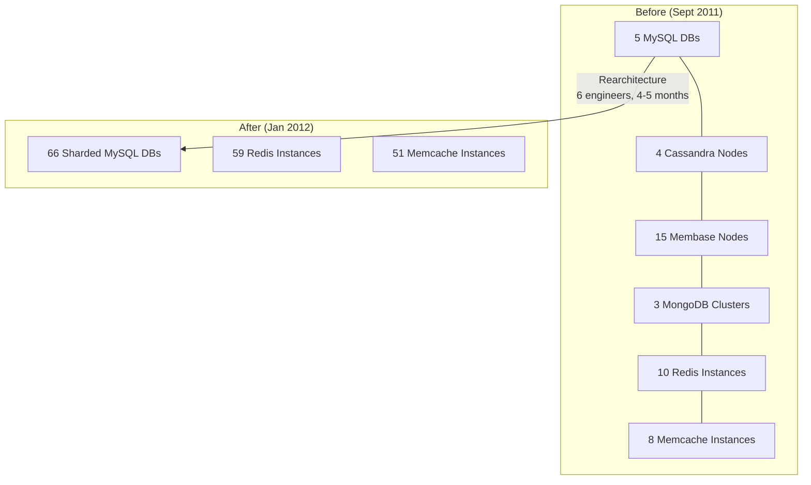
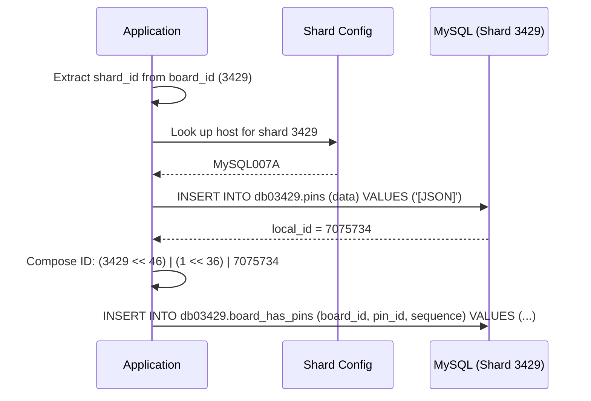

# Pinterest: MySQL Sharding from Zero to Billions of Objects

In 2012, Pinterest had 3.2 million users doubling every 45 days, 3 engineers, and five different database technologies all breaking simultaneously. Their fix: abandon every NoSQL database, shard MySQL with a 64-bit ID scheme that embeds shard location directly in every object ID, and never move data between shards. This case study examines how Pinterest's "boring technology" philosophy produced one of the most enduring database architectures in Silicon Valley---still running in production over a decade later---and the specific design decisions that made it work at 150+ billion objects.

<figure>



<figcaption>Pinterest's storage architecture before and after the MySQL sharding migration. Six different database technologies replaced by three.</figcaption>
</figure>

## Abstract

Pinterest's sharding system encodes location directly into every object's identity. A 64-bit ID contains the shard number, object type, and local row ID---no lookup service needed. The shard ID determines which physical MySQL instance holds the data. Virtual shards (initially 4,096 across 8 servers) decouple logical placement from physical topology, so capacity grows by splitting physical hosts without moving data. All objects store their attributes as JSON blobs in a three-column MySQL table (`local_id`, `data`, `ts`), eliminating schema migrations. Relationships use separate mapping tables (`noun_verb_noun`) stored on the "from" object's shard. Application-layer joins replace SQL JOINs---each ID carries its own routing information, so multi-object reads parallelize across shards with latency equal to the slowest single query.

The design works because it trades features MySQL handles poorly at scale (cross-shard joins, distributed transactions, cluster consensus) for features it handles well (single-row lookups by primary key, single-shard ACID transactions, master-master replication). The result is a system where every query is a primary key lookup on a known shard, every write is a single-shard transaction, and capacity planning reduces to "add more identical MySQL pairs."

## Context

### The System

Pinterest is a visual discovery platform where users save ("pin") images and links to organized collections ("boards"). The core data model is:

| Entity      | Description                                  | Scale (2012)      |
| ----------- | -------------------------------------------- | ----------------- |
| **Users**   | Accounts with profiles and preferences       | ~11.7 million MAU |
| **Pins**    | Saved images/links with metadata             | ~500 million      |
| **Boards**  | User-created collections of pins             | Tens of millions  |
| **Follows** | User-to-user and user-to-board relationships | ~1.6 billion rows |

Every user action---pinning, creating boards, following---generates writes to these entities and their relationships. The read pattern is heavily fan-out: loading a board requires fetching the board metadata plus 50+ pin objects, each potentially on a different shard.

### The Trigger

**Date**: September--December 2011

**Growth**: User base doubling every 45 days. Pinterest became the fastest site ever to reach 10 million unique monthly visitors (per comScore).

**Team**: 3 engineers, 8 total staff.

**The crisis**: Every database technology they used was breaking in different ways every night. With only 3 engineers managing 6 different storage systems, operational overhead consumed all engineering capacity.

### Constraints

- **Team size**: 3 engineers (growing to 6 by January 2012) to build, migrate, and operate the entire storage layer
- **Growth rate**: Could not afford any feature freeze longer than absolutely necessary
- **Operational simplicity**: Whatever they built had to be operable by a tiny team
- **Data safety**: They had already lost data to NoSQL failures---the replacement had to be reliable above all else

## The Problem

### The Age of Experimentation

By September 2011, Pinterest's storage layer was a patchwork of six technologies deployed in rapid succession to keep up with growth:

| Technology    | Use Case                        | Instances               | Status                          |
| ------------- | ------------------------------- | ----------------------- | ------------------------------- |
| **MySQL**     | Primary data (manually sharded) | 5 DBs + 9 read replicas | Stable but hitting shard limits |
| **Cassandra** | Distributed storage             | 4 nodes                 | Repeated data corruption        |
| **Membase**   | Key-value cache                 | 15 nodes (3 clusters)   | Unreliable cluster management   |
| **MongoDB**   | Counters                        | 3 clusters              | Operational complexity          |
| **Redis**     | Caching, queues                 | 10 instances            | Stable                          |
| **Memcache**  | Object cache                    | 8 instances             | Stable                          |

Each technology had its own operational model, failure modes, monitoring, backup procedures, and on-call playbook. Three engineers could not maintain expertise across all of them.

### How Each Technology Failed

**Cassandra** was the most damaging. The cluster management algorithm---the code responsible for membership, data placement, and rebalancing---was a single point of failure replicated across every node. A bug in this algorithm could (and did) impact the entire cluster simultaneously. Specific failures included:

- **Data rebalancing broke repeatedly**: Nodes would join or leave, triggering a rebalance that never completed correctly
- **Data corruption across all nodes**: A bug in the cluster manager corrupted data on every node in at least one incident
- **Data authority failures**: A secondary replica at 80% replication could claim primary status, resulting in 20% data loss
- **Four separate outages**: Cassandra's cluster manager took the site down four times

**Membase** had similar cluster management issues. **MongoDB** added operational complexity without solving the core scaling problem. **Elasticsearch** struggled with Pinterest's pattern of many tiny documents.

The common thread: every clustering technology required nodes to reach **symmetric agreement** about cluster state. This agreement protocol---gossip, consensus, or anti-entropy---was the most complex code in each system, and it was the code that failed.

### Why It Wasn't Obvious Earlier

These technologies worked fine at small scale. Cassandra handled 4 nodes without issues. The cluster management failures only emerged as the cluster grew and experienced real-world conditions (node failures, network partitions, rebalancing under load). By the time the failure modes became apparent, Pinterest was dependent on the technology and had no time to evaluate alternatives carefully.

As Marty Weiner (Pinterest's second engineer and founding architect) noted: when you push a technology to its limit, it fails in ways the documentation doesn't describe.

### The One Technology That Didn't Fail

MySQL. Across every incident, every hardware failure, every operational emergency, MySQL never lost data. Scripts to recover MySQL data existed, were well-tested, and worked. The team could always restore from backups and "live another day."

This observation---that the most mature, least exciting technology was the most reliable---became the foundation of their rearchitecture.

## Options Considered

### Option 1: Scale Existing NoSQL Stack

**Approach**: Fix Cassandra's operational issues, add more nodes, invest in better cluster management tooling.

**Pros**:

- No migration required
- Cassandra's data model (wide columns) fits Pinterest's access patterns

**Cons**:

- Cluster management failures are fundamental to the technology's architecture at that maturity level
- 3 engineers cannot develop deep Cassandra expertise while building product features
- Cassandra was immature in 2011---Pinterest would be among the largest deployments, amplifying every bug

**Why not chosen**: The failure mode was in the clustering layer itself, not in Pinterest's usage of it. No amount of operational investment would fix bugs in Cassandra's consensus protocol. And the team was too small to be both Cassandra contributors and Pinterest engineers.

### Option 2: Adopt a Different NoSQL Database

**Approach**: Migrate to a more mature NoSQL solution (HBase, Riak, or a newer Cassandra version).

**Pros**:

- Potentially better cluster management
- Built-in horizontal scaling

**Cons**:

- Same fundamental risk: clustering algorithms are inherently complex
- Migration cost is high regardless of destination
- Every NoSQL system was relatively immature in 2011--2012
- Operational model would still require specialized expertise

**Why not chosen**: Marty Weiner articulated a key insight---the problem wasn't which clustering technology to use, but whether to use clustering at all. All clustering systems share the same fundamental complexity: nodes must agree on cluster state, and that agreement protocol is where failures live.

### Option 3: Shard MySQL with Application-Layer Routing (Chosen)

**Approach**: Partition data across many independent MySQL instances. Embed shard routing directly in object IDs. Handle all cross-shard logic in the application layer.

**Pros**:

- MySQL is the most mature relational database---decades of production hardening
- No cluster management: each MySQL instance is independent
- Failure modes are well-understood and manageable
- Huge talent pool---any engineer can work with MySQL
- Excellent tooling ecosystem (XtraBackup, Innotop, Maatkit/Percona Toolkit)
- Predictable, linear performance scaling

**Cons**:

- No cross-shard joins, foreign keys, or distributed transactions
- Application must handle all routing logic
- Requires building custom ID generation, shard mapping, and migration tooling
- Schema flexibility is limited (solved by storing JSON blobs)

**Why chosen**: MySQL had never lost Pinterest's data. Its failure modes were understood. The sharding logic was simple enough to fit in half a page of code. And critically, capacity could be added by "throwing money at the problem"---adding more identical MySQL instances---rather than debugging cluster consensus algorithms.

### Decision Factors

| Factor                   | NoSQL (Cassandra/HBase) | Different NoSQL     | Sharded MySQL               |
| ------------------------ | ----------------------- | ------------------- | --------------------------- |
| Data safety track record | Data loss incidents     | Unknown at scale    | Never lost data             |
| Operational complexity   | High (clustering)       | High (clustering)   | Low (independent instances) |
| Team expertise required  | Specialized             | Specialized         | General (any engineer)      |
| Maturity (2011--2012)    | Early                   | Early--moderate     | Decades                     |
| Failure blast radius     | Entire cluster          | Entire cluster      | Single shard                |
| Capacity scaling model   | Cluster rebalancing     | Cluster rebalancing | Add identical instances     |

## Implementation

### The 64-Bit ID Scheme

The core design decision: every object ID encodes its own location. No lookup table, no routing service, no external dependency. Given an ID, any service can compute which shard holds that object.

**Bit layout:**

```
| Reserved | Shard ID | Type ID | Local ID |
| 2 bits   | 16 bits  | 10 bits | 36 bits  |
| bits 63-62 | bits 61-46 | bits 45-36 | bits 35-0 |
```

| Field        | Bits | Capacity              | Purpose                                                   |
| ------------ | ---- | --------------------- | --------------------------------------------------------- |
| **Reserved** | 2    | --                    | Set to zero; keeps IDs positive in signed 64-bit integers |
| **Shard ID** | 16   | 65,536 shards         | Identifies which virtual shard holds this object          |
| **Type ID**  | 10   | 1,024 types           | Object type: Pin=1, Board=2, User=3, etc.                 |
| **Local ID** | 36   | ~68 billion per shard | MySQL `AUTO_INCREMENT` within the shard's table           |

**Construction:**

```python title="ID generation" collapse={1-2}
# Called after INSERT returns the auto-increment local_id
# shard_id determined by colocation rules (see below)
def compose_id(shard_id, type_id, local_id):
    return (shard_id << 46) | (type_id << 36) | local_id
```

**Decomposition:**

```python title="ID parsing"
def decompose_id(object_id):
    shard_id = (object_id >> 46) & 0xFFFF
    type_id  = (object_id >> 36) & 0x3FF
    local_id = object_id & 0xFFFFFFFFF
    return shard_id, type_id, local_id
```

**Worked example**: Pin ID `241294492511762325`

| Extraction | Calculation                               | Result      |
| ---------- | ----------------------------------------- | ----------- |
| Shard ID   | `(241294492511762325 >> 46) & 0xFFFF`     | **3429**    |
| Type ID    | `(241294492511762325 >> 36) & 0x3FF`      | **1** (Pin) |
| Local ID   | `(241294492511762325 >> 0) & 0xFFFFFFFFF` | **7075733** |

From this single 64-bit integer, the system knows: the object is a Pin, it lives on shard 3429, and its row in the `pins` table has `local_id = 7075733`. No external lookup needed.

**Design reasoning for each field:**

- **Reserved bits**: Marty Weiner called these "worth their weight in gold." Two bits of future flexibility cost nothing but enable future changes to the ID scheme without breaking existing IDs.
- **16-bit shard ID**: Supports 65,536 virtual shards---far more than needed initially (4,096 opened), providing years of growth headroom.
- **10-bit type**: Allows the system to determine what an ID refers to without querying any database. Only a few types were used initially, but the capacity for 1,024 types costs nothing.
- **36-bit local ID**: ~68 billion objects per shard per type. At Pinterest's growth rate, individual shards would not exhaust this space for decades.

**Contrast with other approaches**: Instagram's ID scheme (13-bit shard, 41-bit timestamp, 10-bit sequence) embeds temporal ordering. Twitter's Snowflake uses a mapping service for shard resolution. Pinterest traded time-based ordering for type encoding and eliminated the mapping service entirely---the shard is in the ID itself.

### Virtual Shards and Physical Topology

The second key design: decouple logical data placement from physical infrastructure.

**Initial deployment**: 4,096 virtual shards across 8 physical MySQL server pairs.

Each physical server pair consists of:

- **Master A**: Handles all production reads and writes, located in one Availability Zone (AZ)
- **Master B**: Hot standby via master-master replication, located in a different AZ

Each server hosts **512 separate MySQL databases** (one per virtual shard), named `db00000` through `db04095` across the fleet.

**Shard-to-host mapping** (stored in configuration, pushed via ZooKeeper):

```python title="Shard configuration"
shard_config = {
    "sharddb001": {"range": (0, 511),    "master": "MySQL001A", "slave": "MySQL001B"},
    "sharddb002": {"range": (512, 1023),  "master": "MySQL002A", "slave": "MySQL002B"},
    "sharddb003": {"range": (1024, 1535), "master": "MySQL003A", "slave": "MySQL003B"},
    "sharddb004": {"range": (1536, 2047), "master": "MySQL004A", "slave": "MySQL004B"},
    "sharddb005": {"range": (2048, 2559), "master": "MySQL005A", "slave": "MySQL005B"},
    "sharddb006": {"range": (2560, 3071), "master": "MySQL006A", "slave": "MySQL006B"},
    "sharddb007": {"range": (3072, 3583), "master": "MySQL007A", "slave": "MySQL007B"},
    "sharddb008": {"range": (3584, 4095), "master": "MySQL008A", "slave": "MySQL008B"},
}
```

**Why virtual shards matter**: When `MySQL001A` becomes overloaded, you don't need to move any data row by row. Instead:

1. Spin up a new master-master pair (`MySQL009A/B`)
2. Start MySQL replication from `MySQL001A` to `MySQL009A`
3. Wait for replication to catch up (all 512 databases replicate)
4. Update the configuration: `MySQL001A` keeps shards 0--255, `MySQL009A` takes shards 256--511
5. Push config to ZooKeeper; all application servers pick up the new routing

No application code changes. No data migration scripts. No downtime. The virtual shard IDs embedded in every object ID remain valid forever---only the physical mapping changes.

**Critical rule**: Once data lands on a virtual shard, it **never moves to a different virtual shard**. The 64-bit ID permanently encodes shard 3429 (or whatever shard was assigned at creation). This eliminates the entire class of problems around data rebalancing, resharding, and distributed coordination.

### Object Tables: The Three-Column Schema

Every shard contains identical tables for each object type. The schema is deliberately minimal:

```sql title="Object table schema"
CREATE TABLE pins (
    local_id INT PRIMARY KEY AUTO_INCREMENT,
    data TEXT,
    ts TIMESTAMP DEFAULT CURRENT_TIMESTAMP
) ENGINE=InnoDB;

CREATE TABLE boards (
    local_id INT PRIMARY KEY AUTO_INCREMENT,
    data TEXT,
    ts TIMESTAMP DEFAULT CURRENT_TIMESTAMP
) ENGINE=InnoDB;

CREATE TABLE users (
    local_id INT PRIMARY KEY AUTO_INCREMENT,
    data TEXT,
    ts TIMESTAMP DEFAULT CURRENT_TIMESTAMP
) ENGINE=InnoDB;
```

The `data` column stores a **JSON blob** (~1.2 KB for a typical pin) containing all object attributes:

```json title="Example pin JSON blob"
{
  "details": "New Star Wars character",
  "link": "http://webpage.com/asdf",
  "user_id": 241294629943640797,
  "board_id": 241294561224164665,
  "source_url": "http://original-source.com/image.jpg"
}
```

**Why JSON in MySQL?** Schema evolution without `ALTER TABLE`. Adding a field to pins means:

1. Update the application's JSON deserialization to recognize the new field
2. Set a default value for old records that lack the field
3. New writes include the field; old records work without migration

Pinterest performed only **one `ALTER TABLE` operation in three and a half years**. On large MySQL tables, `ALTER TABLE` can lock the table for hours---storing attributes as JSON sidesteps this entirely.

**Trade-off**: You lose MySQL-level indexing on individual fields within the JSON. Pinterest accepted this because their access pattern is almost exclusively primary key lookups---they fetch the entire object by `local_id` and deserialize in the application layer.

### Mapping Tables: Relationships Without Joins

Relationships between objects use separate **mapping tables** with a `noun_verb_noun` naming convention:

```sql title="Mapping table schema"
CREATE TABLE board_has_pins (
    board_id INT,
    pin_id INT,
    sequence INT,
    INDEX(board_id, pin_id, sequence)
) ENGINE=InnoDB;
```

| Column                         | Purpose                                   |
| ------------------------------ | ----------------------------------------- |
| **from_id** (e.g., `board_id`) | The source object's 64-bit ID             |
| **to_id** (e.g., `pin_id`)     | The target object's 64-bit ID             |
| **sequence**                   | Ordering value (typically Unix timestamp) |

**Examples**: `user_has_boards`, `board_has_pins`, `user_likes_pins`, `pin_liked_by_user`.

**Mapping tables are unidirectional.** If you need "board has pins" and "pin belongs to board," you create two separate tables. The mapping table lives on the shard of the **"from" ID**---so `board_has_pins` lives on the board's shard, while `pin_owned_by_board` lives on the pin's shard.

**Why the `sequence` column?** `AUTO_INCREMENT` values from different shards cannot be compared meaningfully (each shard has its own sequence). Unix timestamps provide a globally monotonic ordering that works across shards for pagination.

### Data Colocation Strategy

Objects that are frequently accessed together share a shard:

| Object       | Shard Assignment Rule                         |
| ------------ | --------------------------------------------- |
| **Users**    | Randomly assigned to a shard at creation time |
| **Boards**   | Same shard as the owning user                 |
| **Pins**     | Same shard as the board they belong to        |
| **Comments** | Same shard as the object being commented on   |

This colocation means loading a user's profile with their boards requires **zero cross-shard queries**. Loading a board with its pins is also typically single-shard, since pins are colocated with their board.

The `board_id` stored in a pin's JSON blob encodes the board's shard in its upper bits. Given any pin, the system extracts the `board_id`, decomposes it to get the board's shard, and queries that shard directly---no secondary lookup needed.

### Read and Write Paths

**Write path: Creating a new pin**

<figure>



<figcaption>Write path for creating a new pin. The shard is determined by the board's ID, keeping pins colocated with their board.</figcaption>
</figure>

1. Extract shard ID from the `board_id` (the pin should colocate with its board)
2. Look up shard configuration to find the physical host
3. `INSERT INTO db03429.pins (data) VALUES ('[JSON blob]')` --- MySQL returns the `AUTO_INCREMENT` `local_id`
4. Compose the 64-bit pin ID: `(3429 << 46) | (1 << 36) | 7075734`
5. Insert into the mapping table on the same shard: `INSERT INTO db03429.board_has_pins (board_id, pin_id, sequence) VALUES (...)`

**Read path: Loading a board with its pins**

1. Decompose the `board_id` to extract shard 3429
2. Look up config: shard 3429 maps to `MySQL007A`
3. `SELECT data FROM db03429.boards WHERE local_id = [board_local_id]`
4. `SELECT pin_id FROM db03429.board_has_pins WHERE board_id = [board_id] ORDER BY sequence DESC LIMIT 50`
5. For each returned `pin_id`, extract its shard. Since pins are colocated, most are on shard 3429---batch them: `SELECT data FROM db03429.pins WHERE local_id IN ([id1], [id2], ...)`
6. For pin IDs on different shards, group by shard and execute queries **in parallel**

**Latency**: The parallel multi-shard read completes in the time of the slowest single-shard query, not the sum of all queries.

**Caching**: In practice, most reads hit **Memcache** (for individual objects) or **Redis** (for mapping lists) before touching MySQL. The 64-bit ID serves as the cache key.

### Handling Lookups Without IDs

Some access patterns don't start with a Pinterest ID---logging in with an email address, or looking up a user by their Facebook ID. Pinterest handles these with two mechanisms:

**Mod shards** for hash-based lookups:

```python title="Mod shard lookup"
shard = md5("user@example.com") % 4096
```

Dedicated mod shard servers map external identifiers to Pinterest 64-bit IDs. The hash function determines which mod shard to query.

**Unsharded user table** for global uniqueness: A single, large MySQL database enforces uniqueness constraints on usernames and emails. This avoids distributed uniqueness coordination entirely---the constraint lives in one place.

### Transactions and Consistency

**Single-shard ACID**: Because colocated data lives on the same MySQL instance, transactions within a shard are fully ACID:

```sql title="Read-modify-write with row locking"
BEGIN;
SELECT data FROM db03429.pins WHERE local_id = 7075733 FOR UPDATE;
-- Application: deserialize JSON, modify description, re-serialize
UPDATE db03429.pins SET data = '[modified JSON]' WHERE local_id = 7075733;
COMMIT;
```

`SELECT ... FOR UPDATE` acquires a row-level lock within InnoDB, preventing concurrent modifications.

**Cross-shard consistency**: Best-effort. If a write needs to update objects on two different shards, the application writes to each shard independently. If one write fails, the application retries. For operations requiring stronger guarantees, a separate distributed transaction log handles coordination.

**No slave reads in production**: Pinterest reads only from the master in production. Slave replication lag causes subtle bugs---records appear missing when reads hit a slave before replication completes. The master-master topology exists for failover, not read scaling.

**Soft deletes**: Rather than `DELETE` rows, the application sets an `active` field to `false` in the JSON blob. This preserves referential integrity in mapping tables and allows data recovery.

## The Migration

### Timeline

| Phase                     | Date              | Duration        |
| ------------------------- | ----------------- | --------------- |
| **Decision made**         | Late 2011         | --              |
| **Implementation begins** | January 2012      | --              |
| **Feature freeze**        | January--May 2012 | ~4--5 months    |
| **Data migrated**         | Early--mid 2012   | Multiple passes |
| **Original estimate**     | --                | 2 months        |
| **Actual duration**       | --                | 4--5 months     |

### Migration Strategy

Pinterest used **dual-write with background migration**:

1. **Dual-write phase**: Applications wrote to both old databases and new sharded MySQL simultaneously. Writes to the new system were asynchronous (not blocking user requests).

2. **Background migration**: A scripting farm (built on **Pyres**, a Python interface to GitHub's Resque queue, replacing the previous Celery + RabbitMQ stack) scripted data transfer from old databases to new shards.

3. **Iterative reconciliation**: The migration ran multiple passes. Each pass reduced the delta between old and new systems. Transitory errors (network issues, timeouts) meant individual runs missed some records.

4. **User-driven validation**: Users discovered missing data (boards that didn't appear) during migration. This feedback drove additional reconciliation runs.

### Data Migrated

| Entity                      | Volume       |
| --------------------------- | ------------ |
| **Pins**                    | ~500 million |
| **Follower/following rows** | ~1.6 billion |

### Challenges

- **Estimated 2 months, took 4--5**: The migration was significantly harder than anticipated. Transitory errors and data consistency checks required multiple full passes.
- **Feature freeze**: No new features shipped during the migration. For a startup doubling every 45 days, this was a significant business cost.
- **Missing data**: Users reported missing boards and pins. Each report triggered investigation and additional migration runs.

### Post-Migration Architecture (January 2012)

| Component          | Count          |
| ------------------ | -------------- |
| Web engines        | 90             |
| API engines        | 50             |
| MySQL databases    | 66 (m1.xlarge) |
| Redis instances    | 59             |
| Memcache instances | 51             |

By October 2012, this had grown to 180 web engines, 240 API engines, 88 MySQL databases (now cc2.8xlarge, migrating to SSDs), 110 Redis instances, and 200 Memcache instances---all without changing the sharding architecture.

## Outcome

### Metrics Comparison

| Metric                                           | Before (Sept 2011)   | After (Jan 2012)           | After (Oct 2012) |
| ------------------------------------------------ | -------------------- | -------------------------- | ---------------- |
| **Database technologies**                        | 6                    | 3 (MySQL, Redis, Memcache) | 3                |
| **Engineers**                                    | 3                    | 6                          | 40               |
| **MySQL instances**                              | 5 + 9 replicas       | 66 + 66 replicas           | 88 + 88 replicas |
| **Users**                                        | ~3.2 million         | ~11.7 million MAU          | ~22 million      |
| **Data loss incidents**                          | Multiple (Cassandra) | Zero                       | Zero             |
| **Technologies requiring specialized expertise** | 6                    | 1 (MySQL)                  | 1                |

### Operational Wins

- **New engineer onboarding**: Engineers contributed code in their first week. The architecture was simple enough that anyone familiar with MySQL could understand the sharding layer.
- **Predictable scaling**: Adding capacity meant adding identical MySQL pairs and updating configuration. No rebalancing, no cluster consensus, no data migration.
- **Linear performance**: MySQL's response time to request rate increased linearly, not exponentially. Performance was both fast and consistent.

### Long-Term Durability

The sharding architecture designed in late 2011 is **still in production** as of 2024, handling:

- 150+ billion objects
- 500+ million users
- 75+ billion pins on 1+ billion boards

### Post-Sharding Evolution

The original MySQL sharding layer remained stable while Pinterest evolved the layers around it:

| Year           | Change                                            | Purpose                                                                               |
| -------------- | ------------------------------------------------- | ------------------------------------------------------------------------------------- |
| **2013--2014** | Built **Zen** graph service (HBase + MySQL)       | Social graph and feed storage                                                         |
| **2016--2017** | Built **Rocksplicator** (open-sourced)            | RocksDB-based real-time data replication                                              |
| **2017**       | Custom MySQL compression (contributed to Percona) | Improved compression ratio from 2:1 to 3.47:1 for JSON blobs                          |
| **2019**       | Open-sourced **mysql_utils** (later archived)     | MySQL lifecycle management tooling                                                    |
| **2020**       | Built **KVStore** (unified key-value service)     | Consolidated 500+ use cases, 4+ PB, 100M+ QPS onto single RocksDB-backed service      |
| **2020--2024** | Adopted **TiDB** for graph service                | Replaced HBase-backed Zen with PinGraph: 10x P99 latency reduction, 50%+ cost savings |

The HBase layer that was added in 2013 was eventually deprecated---at its peak it comprised ~50 clusters, 9,000 EC2 instances, and 6+ PB of data. Pinterest selected TiDB after evaluating 15+ database solutions. The MySQL sharding layer, by contrast, required no such migration.

### MySQL Tooling

Pinterest built and later open-sourced **mysql_utils** ([GitHub](https://github.com/pinterest/mysql_utils), archived 2019), a comprehensive MySQL management toolkit:

| Category                | Tools                                                                               |
| ----------------------- | ----------------------------------------------------------------------------------- |
| **Server lifecycle**    | `launch_replacement_db_host.py`, `mysql_restore.py`, `mysql_failover.py`            |
| **Backup and recovery** | `mysql_backup.py` (XtraBackup), `archive_mysql_binlogs.py` (point-in-time recovery) |
| **Monitoring**          | `check_mysql_replication.py`, `mysql_checksum.py` (daily pt-checksum verification)  |
| **Shard management**    | `find_shard_mismatches.py`, `fix_orphaned_shards.py`, `schema_verifier.py`          |

The operational philosophy was **immutable servers**: MySQL instances were launched, lived, and died with minimal configuration changes. Upgrades happened by launching a replacement, replicating data, and failing over.

## Lessons Learned

### Technical Lessons

#### 1. Maturity Beats Features

**The insight**: In 2011--2012, NoSQL databases offered features MySQL lacked (automatic sharding, flexible schemas, distributed consensus). But those features came with immature failure modes that cost Pinterest data and uptime. MySQL's decade-long production hardening made it more reliable despite fewer features.

**How it applies elsewhere**:

- Evaluate technologies by their failure modes, not their feature lists
- The "boring" choice is often boring because its bugs have been found and fixed
- Immaturity risk scales with your deployment size---if you're among the largest users, you'll find the bugs first

**Warning signs to watch for**:

- You're adopting a technology less than 3 years old for a critical path
- The technology's GitHub issues include data loss reports
- You can't find anyone who has run it at your scale for more than a year

#### 2. Cluster Consensus Is the Hardest Code

**The insight**: Every clustering technology that failed for Pinterest failed in the cluster management layer---the code that handles membership, data placement, and rebalancing. This is inherently the hardest distributed systems code to get right, and it runs on every node simultaneously. A bug in this layer is a cluster-wide failure.

**How it applies elsewhere**:

- If you can avoid distributed consensus in your data path, do so
- Pinterest's sharding approach works because each MySQL instance is independent---no gossip, no leader election, no rebalancing
- Application-layer routing is simpler to debug than cluster-layer routing

**Warning signs to watch for**:

- Your database's rebalancing operation has ever caused an outage or data inconsistency
- Cluster management documentation includes phrases like "in rare cases" followed by data loss scenarios
- Scaling requires coordinated action across all nodes (not just adding a new node)

#### 3. Embed Location in Identity

**The insight**: By encoding the shard ID directly in the 64-bit object ID, Pinterest eliminated an entire class of infrastructure---shard mapping services, lookup tables, routing proxies. Any service with access to the ID can compute where the data lives. This removes a network hop, a cache layer, and a potential point of failure.

**How it applies elsewhere**:

- Any system that routes by entity ID can benefit from location-encoded IDs
- The trade-off is that IDs become opaque (non-sequential, non-time-ordered)
- Reserve bits in your ID scheme---the cost is minimal, the future flexibility is significant

**Warning signs to watch for**:

- Your routing layer is a bottleneck or single point of failure
- You maintain a separate "shard map" service that all reads/writes depend on
- Adding a new shard requires updating a central registry and propagating the change

#### 4. Never Move Data Between Shards

**The insight**: Pinterest's most counterintuitive design rule: data never moves after initial placement. This eliminates rebalancing, resharding, and all the distributed coordination those operations require. Capacity grows by changing the virtual-to-physical mapping, not by moving rows.

**How it applies elsewhere**:

- Design for virtual shards from day one---even if you start with few physical hosts
- Over-provision virtual shards (Pinterest used 4,096 with room for 65,536)
- Accept that some shards will be larger than others (hot spots)---this is manageable with monitoring and targeted capacity additions

#### 5. JSON Blobs Trade Indexing for Agility

**The insight**: Storing all object attributes as JSON in a single TEXT column eliminated `ALTER TABLE` operations at the cost of per-field indexing. For Pinterest's access pattern (primary key lookups, no ad-hoc queries), this was the correct trade-off.

**When this does NOT apply**:

- If your workload requires filtering, sorting, or aggregating on arbitrary fields
- If you need database-level constraints (CHECK, UNIQUE on individual fields)
- If your objects are large enough that deserializing the entire blob is expensive

### Process Lessons

#### 1. Feature Freezes Are an Investment

**The insight**: Pinterest froze features for 4--5 months during migration. For a startup doubling every 45 days, this was painful. But the alternative---continuing to operate 6 database technologies with 3 engineers---was unsustainable. The freeze produced a foundation that supported the next decade of growth.

**What they'd do differently**: Estimate more conservatively. The original 2-month estimate reflected engineering optimism, not the reality of migrating billions of rows with consistency guarantees.

### Organizational Lessons

#### 1. Small Teams Need Simple Architectures

**The insight**: Three engineers cannot maintain operational expertise across 6 database technologies. The decision to consolidate onto MySQL wasn't a technical judgment about MySQL's superiority---it was a recognition that operational simplicity is a feature that compounds over time.

**How organization structure affected the outcome**: Pinterest's tiny team forced a constraint that larger organizations often lack. With more engineers, they might have kept the NoSQL stack and hired specialists. The forced simplification produced a better architecture.

## Applying This to Your System

### When This Pattern Applies

You might benefit from Pinterest-style sharding if:

- Your access pattern is dominated by primary key lookups (not ad-hoc queries)
- Your data model has clear ownership hierarchies (user owns boards, boards own pins)
- You need to scale writes horizontally without cluster coordination
- Your team is small relative to the number of database technologies you operate
- You value operational simplicity over feature richness

### When This Pattern Does NOT Apply

- **Ad-hoc analytics**: If you need to scan, filter, or aggregate across all data, sharded MySQL with JSON blobs will be painful. Use a separate analytical data store.
- **Complex cross-entity queries**: If your application requires multi-entity joins as a core operation, application-layer joins add significant complexity and latency.
- **Strong cross-shard consistency**: If operations frequently span multiple shards and require transactional guarantees, you need distributed transactions---which this architecture explicitly avoids.
- **Small scale**: If your data fits on a single MySQL instance, sharding adds complexity without benefit. Start with a single database and shard when you actually need it.

### Evaluation Checklist

- [ ] Are 80%+ of your queries primary key lookups?
- [ ] Can your data model be partitioned by a natural key (user ID, tenant ID)?
- [ ] Are you operating more database technologies than you have database specialists?
- [ ] Is your current clustering layer causing operational incidents?
- [ ] Can you tolerate eventual consistency for cross-shard operations?

### Starting Points

1. **Audit your query patterns**: What percentage are primary key lookups vs. scans/aggregations?
2. **Identify colocation candidates**: Which entities are always accessed together?
3. **Design your ID scheme**: How many bits for shard, type, local ID? Reserve bits for the future.
4. **Start with virtual shards**: Even if you have one physical host, create 4,096+ virtual databases. This makes future scaling a configuration change, not a migration.
5. **Prototype the JSON blob approach**: Pick one entity type, store it as JSON, and measure the impact on development velocity vs. query flexibility.

## Conclusion

Pinterest's MySQL sharding architecture succeeds not because of what it does, but because of what it refuses to do. No distributed consensus. No automatic rebalancing. No cross-shard joins. No cluster management. Every feature they removed was a feature that had failed them in production.

The 64-bit ID scheme is the design's center of gravity: by encoding shard, type, and local ID into every object's identity, the system eliminates routing services, lookup tables, and coordination protocols. A single bitwise operation replaces what would otherwise be a networked dependency. Virtual shards decouple logical placement from physical topology, making capacity additions a configuration change rather than a data migration.

The broader lesson isn't "use MySQL"---it's that the most reliable distributed system is one where each node operates independently and all coordination happens in application code that you control, understand, and can debug with standard tools. Pinterest chose this architecture not because they lacked the engineering talent for something more sophisticated, but because they had learned---through data loss and outages---that sophistication in the data layer is a liability when your team is small and your growth is exponential.

## Appendix

### Prerequisites

- Understanding of relational database fundamentals (primary keys, indexes, replication)
- Familiarity with horizontal partitioning (sharding) concepts
- Basic knowledge of distributed systems trade-offs (CAP theorem, consistency models)

### Terminology

- **Virtual shard**: A logical partition (MySQL database) that may move between physical hosts. Pinterest's IDs reference virtual shards, not physical hosts.
- **Master-master replication**: MySQL configuration where two instances replicate writes to each other. Pinterest uses one as active, the other as hot standby.
- **Mapping table**: A table that stores relationships between objects (e.g., `board_has_pins`). Named with `noun_verb_noun` convention.
- **Mod shard**: A hash-based routing scheme for lookups by non-ID attributes (email, username). Uses `md5(key) % shard_count` to determine which shard holds the mapping.
- **Colocation**: Placing related objects on the same shard to avoid cross-shard queries.

### Summary

- Pinterest replaced 6 database technologies with sharded MySQL + Redis + Memcache after NoSQL clustering failures caused repeated data loss and outages
- The 64-bit ID scheme encodes shard ID (16 bits), type (10 bits), and local ID (36 bits)---any service can route a request without external lookup
- 4,096 virtual shards across 8 physical MySQL pairs; capacity grows by splitting physical hosts, never by moving data
- Objects store all attributes as JSON blobs in a three-column table, eliminating schema migrations
- Relationships use unidirectional mapping tables on the "from" object's shard; application-layer joins replace SQL JOINs
- Data colocation (user/board/pin on same shard) minimizes cross-shard reads
- The architecture has run in production for 12+ years, scaling to 150+ billion objects without fundamental redesign

### References

- [Sharding Pinterest: How We Scaled Our MySQL Fleet - Pinterest Engineering Blog](https://medium.com/pinterest-engineering/sharding-pinterest-how-we-scaled-our-mysql-fleet-3f341e96ca6f) - Canonical blog post on the sharding design
- [Learn to Stop Using Shiny New Things and Love MySQL - Marty Weiner, Pinterest Engineering](https://medium.com/pinterest-engineering/learn-to-stop-using-shiny-new-things-and-love-mysql-3e1613c2ce14) - Design philosophy behind the MySQL decision
- [Scaling Pinterest: From 0 to 10s of Billions of Page Views a Month - High Scalability](http://highscalability.com/blog/2013/4/15/scaling-pinterest-from-0-to-10s-of-billions-of-page-views-a.html) - Detailed notes from Marty Weiner's scaling talks
- [Scaling Pinterest - QCon San Francisco 2012 (Yashwanth Nelapati, Marty Weiner)](https://www.infoq.com/presentations/Pinterest/) - Conference presentation on the full architecture evolution
- [GOTO 2014: Scaling Pinterest - Marty Weiner](https://evankuhn.github.io/techtalks/2017/06/19/goto-2014-scaling-pinterest-marty-weiner.html) - Talk notes covering technology selection philosophy
- [Open-Sourcing Pinterest MySQL Management Tools - Pinterest Engineering](https://medium.com/pinterest-engineering/open-sourcing-pinterest-mysql-management-tools-7a9f90cffc9) - MySQL tooling and operational practices
- [pinterest/mysql_utils - GitHub](https://github.com/pinterest/mysql_utils) - Open-source MySQL management toolkit (archived 2019)
- [Evolving MySQL Compression, Part 1 - Pinterest Engineering](https://medium.com/pinterest-engineering/evolving-mysql-compression-part-1-7f8b09666589) - Custom compression for JSON blobs
- [3 Innovations While Unifying Pinterest's Key-Value Storage - Pinterest Engineering](https://medium.com/@Pinterest_Engineering/3-innovations-while-unifying-pinterests-key-value-storage-8cdcdf8cf6aa) - KVStore unification (2020)
- [HBase Deprecation at Pinterest - Pinterest Engineering](https://medium.com/pinterest-engineering/hbase-deprecation-at-pinterest-8a99e6c8e6b7) - Why HBase was deprecated and lessons learned
- [Graph Service: Why Pinterest Modernized with Distributed SQL - PingCAP](https://www.pingcap.com/blog/why-pinterest-modernized-graph-service-distributed-sql/) - TiDB adoption for graph service (2024)
- [MySQL Customer: Pinterest - Oracle](https://www.mysql.com/customers/view/?id=1264) - Official MySQL customer profile
