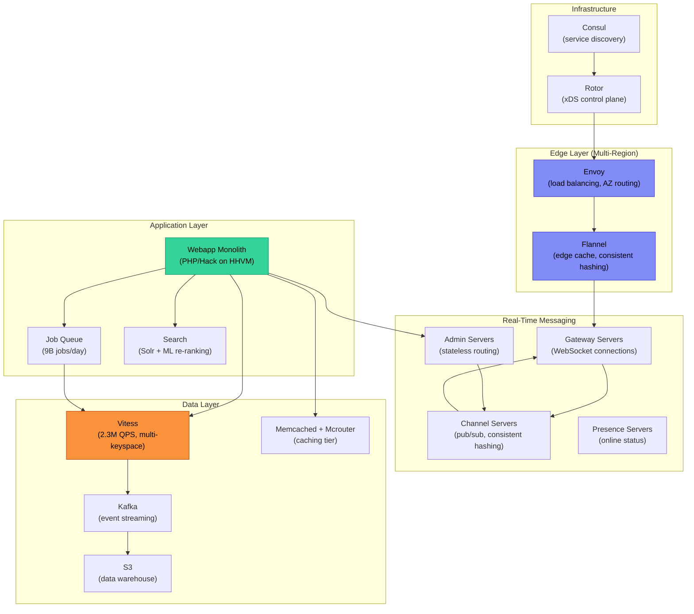

# Slack: Scaling a Real-Time Messaging Platform from Monolith to Distributed Architecture

How Slack evolved from a PHP monolith with workspace-sharded MySQL into a distributed system handling 2.3 million queries per second (QPS) across Vitess-managed databases, 4 million concurrent WebSocket connections through a global edge cache, and a cellular infrastructure design achieving 99.99% availability—all without a single big-bang rewrite. This case study traces the architectural decisions behind each layer: data storage, real-time messaging, edge caching, and reliability infrastructure.

<figure>

<figcaption>Slack's distributed architecture as of ~2023. Traffic enters through Envoy, hits the Flannel edge cache, and flows into either the real-time messaging layer (Channel/Gateway Servers) or the webapp monolith. The data layer is anchored by Vitess-managed MySQL with memcached caching and Kafka for event streaming.</figcaption>
</figure>

## Abstract

Slack's architecture tells the story of pragmatic scaling—keeping a PHP monolith productive while surgically extracting the subsystems that couldn't scale within it.

The core mental model has four layers:

| Layer | Component | Design Choice | Trade-off |
|-------|-----------|---------------|-----------|
| **Edge** | Flannel + Envoy | Application-level edge cache with consistent hashing per workspace | Reduces backend load 7–44x but adds a stateful layer to manage |
| **Real-Time** | Channel Servers + Gateway Servers | Stateful servers with consistent hash rings; ~16M channels per host | Sub-500ms global message delivery but complex failure handling for stateful nodes |
| **Storage** | Vitess over MySQL | Workspace-sharded MySQL migrated to flexible Vitess keyspaces | Horizontal scaling and data residency support but 4+ year migration effort |
| **Reliability** | Cellular architecture via Envoy/Rotor | AZ-level isolation with 1% granularity traffic draining | 5-minute failover with 99.99% SLA but requires full stack duplication per AZ |

The transferable insight: Slack did not pursue the "rewrite everything as microservices" path. Instead, they kept the monolith as the coordination layer and invested in infrastructure systems around it—Vitess for flexible sharding, Flannel for edge caching, cellular architecture for blast radius containment. The monolith receives 30–40 deploys daily. The surrounding distributed systems evolve independently. This "thin monolith with specialized satellites" pattern scales both the system and the organization.

## Context

### The System

Slack is a channel-based messaging platform where workspaces (organizations) contain channels, and users send messages in real-time. Every architectural decision is shaped by three properties:

1. **Workspace isolation** — each customer's data lives in a logical partition
2. **Real-time delivery** — messages must reach all connected clients within 500 ms globally
3. **Persistent history** — every message is stored, searchable, and paginated

### Scale (as of 2020–2023)

| Metric | Value | Source |
|--------|-------|--------|
| Daily Active Users (DAU) | 10+ million | Disasterpiece Theater blog post (2019) |
| Concurrent WebSocket connections | 4 million (peak) | Flannel blog post (2019) |
| MySQL queries per second (peak) | 2.3 million (2M reads, 300K writes) | Vitess blog post (2020) |
| Median query latency | 2 ms | Vitess blog post (2020) |
| P99 query latency | 11 ms | Vitess blog post (2020) |
| MySQL hosts | Thousands (sharded) | Vitess blog post (2020) |
| Async jobs per day | 9 billion | Cron blog post (2022) |
| Production deploys per day | 30–40 | ReleaseBot blog post (2020) |

### The Tech Stack

- **Application server**: PHP monolith ("The Webapp"), migrated incrementally to Hack running on HHVM (HipHop Virtual Machine)
- **Database**: MySQL, originally workspace-sharded, migrated to Vitess (2016–2020)
- **Caching**: Memcached with Mcrouter for horizontal scaling
- **Real-time**: Custom Channel Servers (pub/sub) + Gateway Servers (WebSocket termination)
- **Load balancing**: HAProxy (migrated to Envoy, 2019–2020)
- **Edge caching**: Flannel (custom application-level cache)
- **Search**: Apache Solr with ML re-ranking
- **Service discovery**: Consul
- **Event streaming**: Kafka to S3 (Parquet format via Secor)
- **Analytics**: Presto, Hive, and Spark on AWS EMR (Elastic MapReduce)

### The Trigger

Slack launched in 2014 and grew from zero to millions of daily users within two years. By 2016, three scaling limits converged:

1. **Single workspace exceeding shard capacity** — the largest customers' data outgrew the biggest MySQL shards
2. **Rigid workspace-based sharding** — new products like Enterprise Grid (multi-workspace organizations) and Slack Connect (cross-organization channels) required data to span workspace boundaries, which the sharding model couldn't express
3. **Database hotspots** — some shards were overloaded while others sat underutilized, with no ability to rebalance without downtime

## The Problem

### Pre-Vitess Database Architecture

Slack's original MySQL deployment had three cluster types:

1. **Shards cluster** — customer data (messages, channels, DMs) partitioned by workspace ID. Each shard held multiple workspaces.
2. **Metadata cluster** — workspace-to-shard lookup mappings. Every query started here.
3. **Kitchen sink cluster** — non-workspace data (app directory, shared metadata)

Replication used asynchronous cross-datacenter replication with at least two MySQL instances per shard in different datacenters.

### Why This Architecture Hit Its Limits

**Single-workspace hotspots**: When a large enterprise customer joined Slack, their workspace could exceed the capacity of the shard it landed on. Moving a workspace between shards required downtime.

**Cross-workspace queries impossible**: Enterprise Grid needed to query across multiple workspaces owned by the same organization. The workspace-sharded model had no mechanism for this—you'd need to scatter queries across every shard.

**Operational burden**: Thousands of MySQL hosts ran non-standard configurations requiring extensive custom tooling. Adding capacity meant provisioning new physical shards, not simply splitting existing ones.

**Feature velocity impact**: Product engineers couldn't build features that required data to cross workspace boundaries, directly constraining Slack's enterprise strategy.

### Why It Wasn't Obvious

The workspace-sharded model worked well for Slack's original design: small-to-medium teams with independent workspaces. The limits only appeared when enterprise customers arrived (large workspaces) and product requirements changed (cross-workspace features). The database was scaling fine on traditional metrics—the problem was structural inflexibility.

## Options Considered

### Option 1: Custom Resharding Tooling

**Approach**: Build in-house tooling to split and rebalance workspace-sharded MySQL.

**Pros**:
- Minimal change to application code
- Well-understood technology (MySQL)

**Cons**:
- Still workspace-locked sharding—doesn't solve Enterprise Grid requirements
- Each rebalance operation carries downtime risk
- Doesn't address the operational burden of non-standard MySQL configurations

**Why not chosen**: Solves the hotspot problem but not the structural inflexibility. Enterprise Grid and Slack Connect still couldn't work.

### Option 2: Migrate to a Different Database

**Approach**: Move to a natively distributed database (e.g., CockroachDB, Spanner, or Cassandra).

**Pros**:
- Built-in horizontal scaling
- Automatic rebalancing

**Cons**:
- Massive migration effort for thousands of MySQL hosts
- Application code assumes MySQL semantics (transactions, joins, query patterns)
- Risk of subtle behavioral differences causing data issues
- Team had deep MySQL expertise, not distributed DB expertise

**Estimated effort**: 2+ years with high risk

**Why not chosen**: Too much behavioral change too fast. Slack's entire data access layer assumed MySQL.

### Option 3: Vitess (Chosen)

**Approach**: Deploy Vitess as a sharding middleware over MySQL—keeping MySQL as the storage engine while gaining flexible sharding, online resharding, and connection pooling.

**Pros**:
- Preserves MySQL semantics—application queries mostly unchanged
- Online resharding without downtime
- Connection pooling reduces MySQL connection overhead
- Flexible keyspace design supports non-workspace sharding schemes
- Active open-source community (YouTube origin, CNCF project)

**Cons**:
- Some MySQL query patterns unsupported through VTGate (Vitess's query router)
- Additional operational complexity (VTGate, VTTablet, topology service)
- Migration of thousands of shards is a multi-year project
- Team needed to build Vitess expertise

**Why chosen**: Preserves MySQL compatibility while solving all three problems—hotspots (online resharding), structural inflexibility (flexible keyspaces), and operational burden (standardized deployment).

### Decision Factors

| Factor | Custom Resharding | New Database | Vitess |
|--------|------------------|--------------|--------|
| Application code changes | Minimal | Extensive | Moderate |
| Solves Enterprise Grid | No | Yes | Yes |
| Online resharding | No | Built-in | Yes |
| Team expertise required | MySQL | New DB | MySQL + Vitess |
| Migration risk | Medium | Very High | High |
| Time to production value | 6 months | 2+ years | 1+ year |

## Implementation

### Phase 1: Vitess Adoption (2016–2017)

Slack began the Vitess evaluation in fall 2016. Rather than attempting a wholesale migration, they started with a low-risk workload: an RSS feed feature.

**Initial prototype approach**:
1. Deploy Vitess cluster alongside existing MySQL
2. Route RSS feed reads and writes through VTGate
3. Validate query compatibility and performance
4. Build confidence in operational patterns (backup, failover, monitoring)

This gave the team hands-on experience without risking core messaging data.

### Phase 2: Migration Infrastructure (2017–2019)

The team built three critical pieces of migration infrastructure:

**Application routing layer**: A query router in the webapp that could direct traffic to either legacy MySQL or Vitess on a per-table basis. This enabled table-by-table migration with instant rollback.

**Generic backfill system**: Tooling to copy data from legacy shards into Vitess keyspaces with consistent state verification. The system handled the complexity of migrating from workspace-sharded MySQL (where shard boundaries were fixed) to Vitess keyspaces (where shard boundaries are flexible).

**Double-write / double-read diffing**: During migration, writes went to both legacy MySQL and Vitess. Reads were compared between both systems, and any differences flagged for investigation. This caught query compatibility issues that unit tests missed—subtle differences in sort ordering, NULL handling, and transaction boundaries.

**Strategy evolution**: Slack initially migrated table-by-table but found this created a long tail of edge cases where cross-table queries broke when tables lived in different systems. They shifted to whole-shard migrations—moving entire workspace shards at once—which was operationally simpler despite moving more data per batch.

### Phase 3: Production Migration (2019–2020)

By the end of 2020, 99% of MySQL query traffic was running through Vitess.

**Post-migration architecture**:
- Multiple Vitess clusters across geographic regions
- Dozens of keyspaces with flexible sharding (channel-based, user-based, and workspace-based depending on access patterns)
- Vitess clusters in six regions supporting International Data Residency requirements
- The webapp monolith and additional services all route through VTGate

### COVID-19 Stress Test (March 2020)

The migration's value was proven dramatically when COVID-19 drove remote work adoption. Slack's query rates increased 50% in a single week. A single keyspace was horizontally scaled using Vitess's splitting workflows without any downtime—an operation that would have required provisioning new physical shards and migrating workspaces under the old architecture.

### Slack's Contributions Back to Vitess

Slack didn't just consume Vitess—they contributed significantly to the project:

- Topology metadata service scalability refactoring
- MySQL query compatibility improvements (fixing VTGate query translation gaps)
- Data migration tooling
- Load testing and introspection tools
- Integrations with Prometheus (metrics), Orchestrator (MySQL failover), and Percona Xtrabackup (backups)

## Real-Time Messaging Architecture

The real-time layer is separate from the data layer and is where Slack's architecture most diverges from a standard web application.

### Component Architecture

Four server types form the real-time messaging pipeline:

**Gateway Servers (GS)** — stateful services that terminate WebSocket connections. Each GS maintains a map of connected users and their channel subscriptions. Deployed across multiple geographic regions so clients connect to the nearest point of presence. A user's connection to a GS is long-lived (hours to days).

**Channel Servers (CS)** — stateful, in-memory servers that own channels via consistent hashing. At peak, each Channel Server manages approximately 16 million channels. When a message is sent to a channel, the responsible CS broadcasts the event to every GS that has a subscriber in that channel.

**Admin Servers (AS)** — stateless intermediaries that route messages from the webapp to the correct Channel Server. The AS uses the consistent hash ring to locate which CS owns a given channel.

**Presence Servers (PS)** — track online/offline status for users and distribute presence events.

### Message Flow

When a user sends a message:

1. Client sends HTTP POST to the webapp API
2. Webapp persists the message to Vitess
3. Webapp forwards the event to an Admin Server
4. AS hashes the channel ID to locate the responsible Channel Server
5. CS broadcasts the event to all subscribed Gateway Servers globally
6. Each GS pushes the event over WebSocket to connected clients in that channel

**Latency target**: messages delivered across the world within 500 ms.

Transient events (typing indicators, reactions) follow the same routing path but skip database persistence.

### Connection Flow

1. Client fetches a user token and connection URL from the webapp
2. Client connects to the nearest edge region via Envoy load balancer
3. Gateway Server retrieves the user's channel subscriptions
4. GS asynchronously subscribes to the relevant Channel Servers for each channel

### The Consistent Hashing Trade-off

Using consistent hashing to map channels to Channel Servers means:

- **Fast routing**: O(1) lookup for which CS owns a channel
- **Balanced load**: channels distribute across the CS fleet roughly evenly
- **Stateful failure impact**: when a CS dies, all 16M channels it owns must be reassigned and their in-memory state reconstructed

Slack validated this failure mode through their Disasterpiece Theater chaos engineering program, deliberately partitioning 25% of Channel Servers and confirming that Consul re-routed traffic correctly.

## Flannel: The Edge Cache

Flannel is Slack's application-level caching layer deployed at edge points of presence. It sits between clients and the backend, intercepting the startup data that every client needs when connecting.

### The Problem Flannel Solves

When a Slack client boots, it historically called `rtm.start`—an API that returned a complete model of the workspace: every channel, every member, every emoji, every preference. For a 32,000-user workspace, this payload was enormous and every connected client needed it.

### How Flannel Works

1. Clients connect to Flannel instead of directly to backend servers
2. Flannel uses **consistent hashing** to route users from the same workspace to the same Flannel host, maximizing cache hit rates
3. Flannel maintains its own WebSocket connection to Slack's backend, consuming real-time events to keep its cache fresh
4. On client boot, Flannel returns a slimmed-down startup dataset
5. Additional data loads lazily as the user navigates

**Proactive prefetching**: Flannel predicts what data clients will need next. When a user @mentions a colleague, Flannel proactively pushes that user's profile to clients that don't have recent data, eliminating a round-trip.

### Performance Impact

| Workspace Size | Payload Reduction |
|---------------|------------------|
| 1,500 users | 7x smaller |
| 32,000 users | 44x smaller |

At peak, Flannel handles:
- **4 million** simultaneous connections
- **600,000** client queries per second

### Presence Event Optimization

Flannel also optimized presence events (online/offline status updates). By implementing a pub/sub model at the edge, Flannel achieved a **5x reduction** in presence events reaching backend servers—clients only receive presence updates for users they're actively viewing.

## Load Balancing: HAProxy to Envoy Migration

In 2019–2020, Slack migrated from HAProxy to Envoy as their edge load balancer. The migration took 6 months with zero customer impact.

### Why HAProxy Was Replaced

**Hot restart problem**: HAProxy doesn't support dynamic configuration reloads. Every configuration change spawned a new set of HAProxy processes while old processes drained existing connections. With millions of long-lived WebSocket connections, old processes persisted for hours, creating memory pressure and operational complexity.

**Missing capabilities**: Envoy offered dynamic configuration (xDS APIs), zone-aware routing, passive health checking (Outlier Detection), and panic routing—none available in HAProxy without custom tooling.

### Migration Strategy

Rather than an in-place cutover, Slack deployed a parallel Envoy stack and used DNS-weighted routing (via NS1) to shift traffic gradually: 10% → 25% → 50% → 75% → 100% per region. Final regions completed in 2 days as confidence increased.

**Key challenge**: Extracting intentional behavior from organically-grown HAProxy configs proved difficult. Some services relied on undocumented HAProxy behaviors that had to be replicated in Envoy. The team temporarily broke their Daily Active User metric during migration due to a routing misconfiguration.

## Cellular Architecture (2022–2023)

Slack's most recent major infrastructure evolution is a cellular architecture that isolates failures to individual Availability Zones (AZs).

### Design

Each AZ operates as an independent service cluster—a "cell." Services within a cell only receive traffic from within their AZ and only send traffic upstream to servers in their AZ. This creates N virtual copies of each service, one per AZ.

### Traffic Routing

The system leverages Slack's Envoy/xDS infrastructure:

- **Rotor** (Slack's custom xDS control plane) manages dynamic weight assignment per AZ
- **RTDS** (Runtime Discovery Service) enables weight changes without Envoy restarts
- Weights provide **1% granularity** for traffic shifting

### AZ Drain Process

When an AZ experiences issues:

1. Rotor sends a signal to edge Envoy load balancers
2. Envoy reweights per-AZ target clusters
3. Traffic drains from the affected AZ within **5 minutes**
4. Propagation through the control plane takes **seconds**

### Why This Matters

The cellular architecture directly supports Slack's **99.99% availability SLA** (Service Level Agreement). Before cells, a failure in one AZ's service could cascade through shared infrastructure. Now, failures are contained within a single cell, and traffic redirects automatically.

## The Webapp: Why a Monolith Still Works

Unlike many scaling stories, Slack deliberately kept its PHP/Hack monolith as the central application server.

### Why PHP

Slack chose PHP (later migrated to Hack/HHVM) for three properties:

1. **State isolation**: every request starts from a blank slate. Bugs in request _t_ cannot affect request _t+1_. This provides organic fault isolation without the complexity of process supervisors.
2. **Safe concurrency**: individual requests run single-threaded with shared-nothing semantics. Parallelism comes from running many processes, not from shared-state concurrency.
3. **Developer velocity**: the edit-reload-test cycle has zero compilation or restart delay. With 150–190 changes merged per day and 30–40 deploys, this velocity matters.

HHVM's JIT (Just-In-Time) compilation provided significant CPU efficiency gains. Facebook reported 11.6x CPU efficiency improvement over standard PHP; Wikipedia reported 6x.

### The "Thin Monolith" Pattern

Slack's approach is to keep the monolith as an orchestration and business logic layer while extracting infrastructure concerns into specialized systems:

| Concern | Extracted To |
|---------|-------------|
| Sharding and query routing | Vitess |
| Edge caching and boot optimization | Flannel |
| Real-time message delivery | Channel/Gateway Servers |
| Load balancing and AZ routing | Envoy + Rotor |
| Service discovery | Consul |
| Async job processing | Job Queue (9B jobs/day) |
| Search | Solr |

The monolith itself deploys via an automated ReleaseBot that runs 24/7, using z-score anomaly detection (flagging data points exceeding 3 standard deviations from historical mean) to automatically halt deploys when metrics deviate.

## Incident: February 22, 2022

This incident illustrates how Slack's layered architecture can fail at the boundaries between layers.

### Root Cause

A Consul agent fleet upgrade was being rolled out, replacing 25% of the fleet. During the upgrade, memcached nodes were sequentially removed and replaced with empty cache nodes (new instances with cold caches). This caused cache hit rates to plummet.

### Cascade

1. **Cache layer degradation**: Empty memcached nodes drastically reduced hit rates
2. **Database overload**: Uncached requests flooded Vitess, particularly a keyspace storing channel membership data sharded by user ID
3. **Scatter query amplification**: Queries for group DM (Direct Message) membership required querying every shard of the user-sharded keyspace—a scatter query that's normally fast when most results come from cache, but devastating at full database fan-out
4. **Self-reinforcing failure**: High database load prevented cache refills, keeping hit rates low

### Resolution

- Immediate: throttled client boot requests to reduce database pressure
- Short-term: modified scatter queries to read from a channel-sharded table instead (co-located data, no scatter needed)
- Changed queries to read from Vitess replicas for missing data
- Gradually increased boot rate as the cache warmed

### Lesson

The incident exposed a coupling between the caching layer (Consul-managed memcached) and the database layer (Vitess). A routine infrastructure operation (Consul upgrade) triggered a catastrophic database load pattern. Slack's mitigation—throttling client boots—traded availability for stability, the correct choice under cascading failure.

## Search Architecture

Slack's search uses Apache Solr with a two-stage ranking system.

### Indexing

Messages flow through Kafka into Solr indexes. The search system supports two modes:

- **Recent Search**: returns messages matching all query terms in reverse chronological order
- **Relevant Search**: relaxes temporal constraints and incorporates Lucene scoring with ML re-ranking

### ML Re-Ranking

A two-stage pipeline:

1. **Stage 1 (Solr)**: retrieves candidate messages using computationally cheap features (term matching, recency)
2. **Stage 2 (Application)**: re-ranks using a SparkML SVM (Support Vector Machine) model trained on pairwise click behavior

Top ranking signals include message age, Lucene match score, user affinity to message author, channel priority, engagement metrics, and message formatting characteristics.

**Results** (November 2016 deployment): 9% increase in clicked searches and 27% increase in position-1 click-through rates.

## Outcome

### Metrics Comparison

| Metric | Before (~2016) | After (~2023) | Improvement |
|--------|---------------|---------------|-------------|
| Database scaling | Manual shard provisioning | Online resharding via Vitess | Zero-downtime capacity changes |
| Query routing flexibility | Workspace-only sharding | Dozens of keyspaces (channel, user, workspace) | Enterprise Grid and Slack Connect enabled |
| Client boot payload (32K users) | Full workspace model | Flannel lazy-loaded | 44x reduction |
| Concurrent connections (edge) | Direct to backend | 4M via Flannel | 5x presence event reduction |
| Load balancer config changes | HAProxy restart (minutes, process leak) | Envoy xDS (seconds, no restart) | Operational simplicity |
| Failure blast radius | Cross-AZ cascade possible | AZ-isolated cells, 5-min drain | 99.99% SLA achieved |
| Data residency | Single-region | 6 Vitess regions | International compliance |

### Timeline

| Year | Milestone |
|------|-----------|
| 2014 | Slack launches with PHP monolith, workspace-sharded MySQL |
| 2016 | Vitess evaluation begins; Enterprise Grid requirements emerge |
| 2017 | First Vitess workloads in production (RSS feed) |
| 2018 | Disasterpiece Theater chaos engineering program starts |
| 2019 | Flannel deployed; HAProxy-to-Envoy migration begins |
| 2020 | 99% of MySQL traffic on Vitess; COVID-19 surge handled via online resharding |
| 2022 | Cellular architecture rollout begins |
| 2023 | Cellular architecture complete; AZ-level isolation operational |

### Unexpected Benefits

- **Vitess community leverage**: Slack's contributions to Vitess (query compatibility, tooling) improved the platform for all users, and community improvements flowed back to Slack
- **Data residency for free**: Vitess's multi-region keyspace support enabled international data residency without a separate architecture
- **Operational standardization**: Vitess replaced non-standard MySQL configurations with a standardized deployment, reducing operational toil

### Remaining Limitations

- The monolith remains the bottleneck for certain product features that require tight cross-concern coordination
- Channel Servers are stateful, making them harder to scale and recover than stateless services
- The "last 1%" of Vitess migration (complex tables with unusual query patterns) required disproportionate effort

## Lessons Learned

### Technical Lessons

#### 1. Middleware Preserves Investments

**The insight**: Vitess let Slack keep MySQL—their team's deepest expertise—while gaining the scaling properties of a distributed database. The 4-year migration timeline was manageable because application code required only moderate changes.

**How it applies elsewhere**: When your database is hitting limits, consider middleware (Vitess, ProxySQL, PgBouncer, Citus) before abandoning the storage engine. The application-level compatibility is often worth more than the distributed database's native features.

**Warning signs**: You might need this when single tenants exceed shard capacity, or when product requirements demand data to cross your current partition boundaries.

#### 2. Edge Caching Buys More Than Backend Optimization

**The insight**: Flannel's 7–44x payload reduction had a larger impact than any backend optimization could achieve. Moving computation (cache warming, lazy loading, proactive prefetching) to the edge solved the startup performance problem structurally.

**How it applies elsewhere**: If your clients all request the same large dataset at connection time, an application-aware edge cache with consistent hashing (so same-tenant clients hit the same cache node) can eliminate the backend bottleneck entirely.

**Warning signs**: Boot/startup latency grows linearly with workspace/tenant size; backend load spikes correlate with user login patterns rather than usage patterns.

#### 3. Stateful Services Need Chaos Testing

**The insight**: Channel Servers hold 16M channels in memory per host. Slack's Disasterpiece Theater program deliberately killed Channel Servers, partitioned them, and degraded their dependencies to validate recovery paths. It took three attempts to correctly partition 25% of Channel Servers.

**How it applies elsewhere**: Any system with consistent hashing, in-memory state, or leader election needs regular failure injection—not just for the service itself, but for its dependencies (Consul, ZooKeeper, etcd).

**Warning signs**: You haven't tested what happens when a stateful node dies and its hash ring segments are reassigned under load.

### Process Lessons

#### 1. Table-by-Table Migration Creates a Long Tail

**The insight**: Slack initially migrated Vitess tables one at a time but found that cross-table queries broke when tables lived in different systems. Shifting to whole-shard migrations was operationally simpler.

**What they'd do differently**: Start with whole-shard migration from the beginning, accepting the larger per-batch data movement in exchange for fewer edge cases.

#### 2. The Sigmoid Adoption Curve

**The insight**: Slack explicitly uses a three-phase adoption model—Exploration (low friction, most experiments fail), Expansion (persuasive demos, internal marketing), Migration (addressing holdouts). The Vitess migration followed this exactly: low-risk RSS workload → gradual table migration → final "hard tables."

**What they'd do differently**: Internal platform teams should be "client-centric," treating product teams as customers who can choose whether to adopt—with few exceptions.

### Organizational Lessons

#### 1. Keep the Monolith When It Works

**The insight**: Slack's monolith handles 30–40 deploys daily with 150–190 changes merged per day. PHP/Hack's state isolation provides organic fault tolerance. Rather than a costly decomposition, Slack extracted infrastructure concerns (sharding, caching, real-time) into specialized systems while keeping business logic centralized.

**How organization structure affected the outcome**: A monolith lets any product engineer modify any business flow without cross-team coordination. Extracting infrastructure (Vitess, Flannel, Envoy) into platform teams provided scaling benefits without fragmenting product development velocity.

## Applying This to Your System

### When This Pattern Applies

You might face similar challenges if:

- Your tenants vary dramatically in size (some 100x larger than average)
- Product requirements are pushing data across your current partition boundaries
- Your real-time requirements demand sub-second delivery to millions of concurrent connections
- You have deep expertise in your current database and can't afford a full migration

### Checklist for Evaluation

- [ ] Are single tenants exceeding shard capacity?
- [ ] Do new product features require cross-tenant or cross-partition data access?
- [ ] Is your database operationally non-standard (custom configs, no online resharding)?
- [ ] Does client startup latency grow with tenant size?
- [ ] Could a failure in one availability zone cascade to others?

### Starting Points

1. **Database middleware**: Evaluate Vitess (MySQL), Citus (PostgreSQL), or ProxySQL as a sharding layer before considering a database change
2. **Edge caching**: Prototype an application-aware edge cache for your most common client bootstrap query. Measure the payload reduction for your largest tenants.
3. **Cellular isolation**: Map your service dependencies per AZ. Identify which cross-AZ calls exist and whether they can be eliminated.
4. **Chaos testing**: Run a tabletop exercise for your stateful services: what happens when one node dies? What about 25% of nodes simultaneously?

## Conclusion

Slack's architecture evolution demonstrates that scaling doesn't require abandoning what works. The PHP monolith still serves as the central coordination point. The distributed systems around it—Vitess for flexible sharding, Flannel for edge caching, Channel/Gateway Servers for real-time delivery, and cellular infrastructure for reliability—each solve a specific scaling limit without imposing a system-wide rewrite.

The key architectural decisions were: keep MySQL but add Vitess middleware for flexibility; keep the monolith but extract infrastructure concerns; keep stateful real-time servers but validate them with chaos engineering; keep multi-AZ deployment but add cellular isolation for blast radius containment. Each decision preserved existing investments while removing the specific bottleneck that was blocking growth.

## Appendix

### Prerequisites

- Familiarity with database sharding concepts (hash-based partitioning, shard routing)
- Understanding of WebSocket protocols and persistent connections
- Basic knowledge of consistent hashing and its failure properties
- Experience with load balancer architectures (L4/L7, connection draining)

### Terminology

| Term | Definition |
|------|-----------|
| **Vitess** | Open-source database clustering system for horizontal scaling of MySQL, originally built at YouTube |
| **VTGate** | Vitess's query routing proxy that sits between applications and MySQL |
| **Keyspace** | Vitess's logical database unit; maps to one or more MySQL shards with a chosen sharding scheme |
| **Flannel** | Slack's custom application-level edge cache for reducing client boot payload |
| **Channel Server (CS)** | Stateful server managing real-time pub/sub for channels via consistent hashing |
| **Gateway Server (GS)** | Stateful server terminating WebSocket connections and delivering events to clients |
| **Mcrouter** | Facebook's memcached protocol router for horizontal scaling of memcached pools |
| **Rotor** | Slack's custom xDS control plane for Envoy configuration |
| **HHVM** | HipHop Virtual Machine—Facebook's JIT compiler for PHP and Hack |
| **Disasterpiece Theater** | Slack's chaos engineering program for testing failure resilience |

### Summary

- Slack kept its PHP/Hack monolith as the business logic layer while extracting infrastructure concerns (sharding, caching, real-time, load balancing) into specialized distributed systems
- Vitess migration (2016–2020) moved 99% of MySQL traffic to flexible keyspaces, enabling online resharding, Enterprise Grid, Slack Connect, and international data residency across 6 regions
- Flannel edge cache reduced client boot payloads by 7–44x and handles 4M concurrent connections with proactive prefetching
- Real-time messaging uses stateful Channel Servers (~16M channels/host) with consistent hashing, delivering messages globally within 500 ms
- Cellular architecture (2022–2023) isolates failures to individual AZs with 1% granularity traffic draining and 5-minute failover, supporting a 99.99% SLA
- The February 2022 incident demonstrated how coupling between infrastructure layers (Consul upgrades → cache invalidation → database overload) can cascade despite individually sound designs

### References

1. [Scaling Datastores at Slack with Vitess](https://slack.engineering/scaling-datastores-at-slack-with-vitess/) — Slack Engineering (2020). Primary source for Vitess migration details, scale numbers, and architecture evolution.
2. [Flannel: An Application-Level Edge Cache to Make Slack Scale](https://slack.engineering/flannel-an-application-level-edge-cache-to-make-slack-scale/) — Slack Engineering (2019). Flannel architecture, lazy loading, payload reduction numbers.
3. [Real-Time Messaging](https://slack.engineering/real-time-messaging/) — Slack Engineering. Channel Server, Gateway Server, Admin Server, and Presence Server architecture.
4. [Migrating Millions of Concurrent WebSockets to Envoy](https://slack.engineering/migrating-millions-of-concurrent-websockets-to-envoy/) — Slack Engineering. HAProxy-to-Envoy migration strategy and challenges.
5. [Slack's Migration to a Cellular Architecture](https://slack.engineering/slacks-migration-to-a-cellular-architecture/) — Slack Engineering (2023). AZ isolation, Rotor control plane, traffic draining.
6. [Slack's Incident on 2-22-22](https://slack.engineering/slacks-incident-on-2-22-22/) — Slack Engineering (2022). Consul upgrade cascade, scatter query amplification, resolution.
7. [Disasterpiece Theater: Slack's Process for Approachable Chaos Engineering](https://slack.engineering/disasterpiece-theater-slacks-process-for-approachable-chaos-engineering/) — Slack Engineering (2019). Chaos testing methodology, Channel Server partition testing.
8. [Taking PHP Seriously](https://slack.engineering/taking-php-seriously/) — Slack Engineering (2016). PHP/Hack design rationale, HHVM performance.
9. [The Scary Thing About Automating Deploys](https://slack.engineering/the-scary-thing-about-automating-deploys/) — Slack Engineering (2020). ReleaseBot, anomaly detection, deploy frequency.
10. [How Big Technical Changes Happen at Slack](https://slack.engineering/how-big-technical-changes-happen-at-slack/) — Slack Engineering. Sigmoid adoption model, React/Vitess/Hack migration strategies.
11. [Getting to Slack Faster with Incremental Boot](https://slack.engineering/getting-to-slack-faster-with-incremental-boot/) — Slack Engineering. Two-phase boot, rtm.start optimization.
12. [Search at Slack](https://slack.engineering/search-at-slack/) — Slack Engineering (2016). Solr architecture, ML re-ranking, ranking signals.
13. [Reducing Slack's Memory Footprint](https://slack.engineering/reducing-slacks-memory-footprint/) — Slack Engineering. Dual-client architecture, tiny client design.
14. [Infrastructure Observability for Changing the Spend Curve](https://slack.engineering/infrastructure-observability-for-changing-the-spend-curve/) — Slack Engineering. CI infrastructure, cost optimization.
15. [How We Design Our APIs at Slack](https://slack.engineering/how-we-design-our-apis-at-slack/) — Slack Engineering. API design principles, rtm.start deprecation.
16. [Vitess](https://vitess.io/) — Official Vitess documentation. Architecture, VTGate, keyspaces, resharding workflows.
