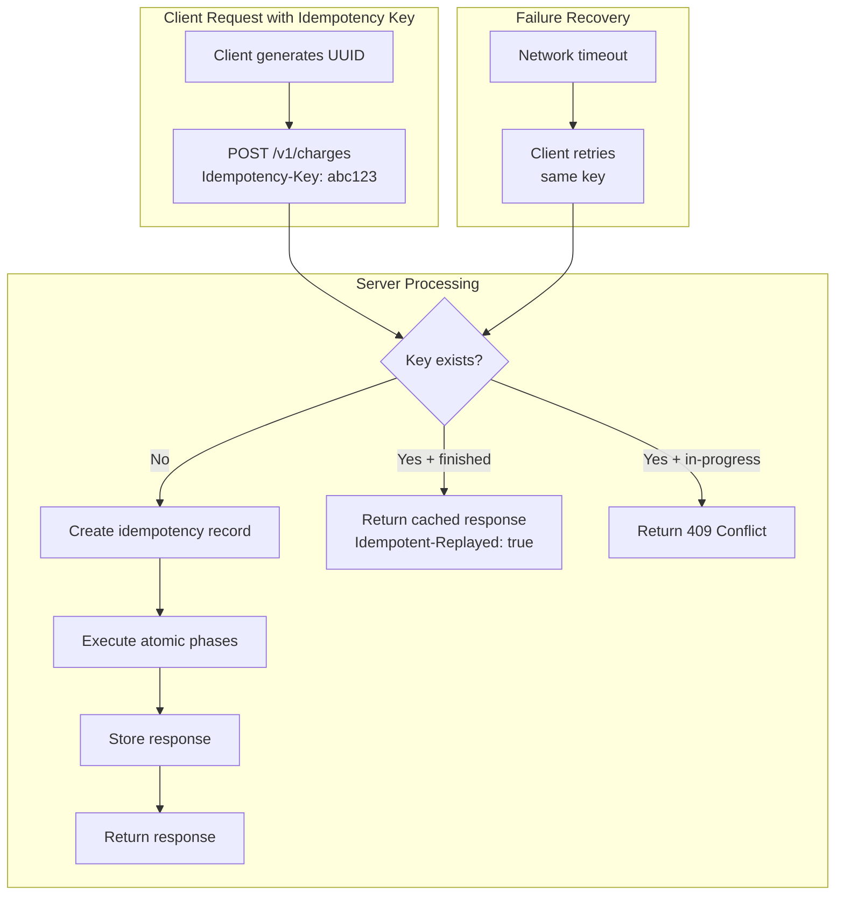
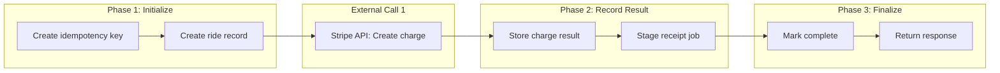

# Stripe: Idempotency for Payment Reliability

How Stripe prevents double charges and enables safe retries across billions of transactions using idempotency keys, atomic phases, and database-backed state machines. This case study examines the design decisions behind Stripe's approach—why they chose database transactions over distributed consensus, how they handle foreign state mutations, and the patterns that enabled 99.999% uptime while processing $1 trillion in payments.

<figure>



<figcaption>Idempotency key lifecycle: generation, lookup, execution, caching, and replay on retry.</figcaption>
</figure>

## Abstract

Stripe's idempotency system solves a fundamental distributed systems problem: **network failures make operation outcomes ambiguous**. A request may succeed but the response never reaches the client. Without idempotency, retrying risks double-charging customers.

**The core insight**: Use the database as the coordination layer. Every request with an idempotency key creates a database record that tracks progress through "atomic phases"—local state mutations grouped between foreign (external API) calls. If a request fails mid-execution, the completer process resumes from the last completed phase.

**Key design decisions**:

- **ACID over distributed consensus**: Serializable transactions provide atomicity guarantees without Paxos/Raft complexity
- **Recovery points as state machine**: Each phase boundary is a checkpoint; progress is never lost
- **Transactionally staged job drains**: Background jobs are inserted into the database, not directly queued—preventing lost work if the process crashes between commit and job enqueueing
- **24-hour key retention (v1) / 30-day retention (v2)**: Balance between replay window and storage costs

**Trade-offs accepted**:

- Serializable isolation reduces throughput (concurrent requests to same key return 409)
- Additional database round-trips per request
- Complexity in defining atomic phase boundaries
- Cannot safely retry non-idempotent external APIs

## Context

### The System

Stripe processes payments for millions of businesses. The architecture involves:

| Component                 | Function                               | Scale                                              |
| ------------------------- | -------------------------------------- | -------------------------------------------------- |
| **API Gateway**           | Authentication, rate limiting, routing | 100 requests/second per account                    |
| **DocDB (MongoDB-based)** | Primary data store                     | 5M queries/second, 2000+ shards, petabytes of data |
| **External processors**   | Card networks, banks                   | Multiple third-party dependencies                  |

The challenge: a single payment request may touch multiple systems (fraud detection, card network, bank), any of which can fail or timeout.

### The Problem

Three failure scenarios make payment outcomes ambiguous:

1. **Connection fails before request reaches server**: Client knows nothing happened
2. **Server fails mid-operation**: Work partially completed, state inconsistent
3. **Operation succeeds but response never reaches client**: Client doesn't know if it succeeded

For payments, these ambiguities are catastrophic. Double-charging customers causes chargebacks, support tickets, and lost trust. Dropped transactions mean lost revenue.

### Why Traditional Approaches Fail

**Distributed transactions (2PC)**: Require all participants to be available simultaneously. Card networks and banks don't support distributed transaction protocols.

**Event sourcing without idempotency**: Events can be replayed, but if the original request is retried, you get duplicate events.

**Retry with timeout**: Arbitrary timeouts can't distinguish "request still processing" from "request failed silently."

### Scale Context (2023)

- **$1 trillion** in total payment volume
- **99.999% uptime** target
- **5 million database queries per second**
- **2,000+ database shards** across **5,000+ collections**

## The Solution: Idempotency Keys

### How It Works

1. Client generates a unique identifier (typically UUIDv4) for each logical operation
2. Client sends identifier via `Idempotency-Key` header
3. Server creates a database record tracking request state
4. If client retries with the same key, server returns the cached response
5. Response includes `Idempotent-Replayed: true` header to indicate replay

### Key Properties

| Property           | Value              | Rationale                                        |
| ------------------ | ------------------ | ------------------------------------------------ |
| **Max length**     | 255 characters     | Practical limit for database indexing            |
| **Format**         | UUIDv4 recommended | Sufficient entropy to prevent collisions         |
| **Scope**          | Per-account        | Same key from different accounts are independent |
| **Retention (v1)** | 24 hours           | Balance between replay window and storage        |
| **Retention (v2)** | 30 days            | Extended window for async workflows              |

### Database Schema

The idempotency key table tracks request lifecycle:

```sql title="idempotency_keys.sql" collapse={1-2}
-- Core idempotency tracking table
-- Each record represents one logical operation
CREATE TABLE idempotency_keys (
    id              BIGSERIAL PRIMARY KEY,
    idempotency_key TEXT NOT NULL,
    user_id         BIGINT NOT NULL,
    locked_at       TIMESTAMPTZ,
    request_method  TEXT NOT NULL,
    request_params  JSONB NOT NULL,
    response_code   INT NULL,
    response_body   JSONB NULL,
    recovery_point  TEXT NOT NULL DEFAULT 'started',
    created_at      TIMESTAMPTZ NOT NULL DEFAULT now(),

    CONSTRAINT idempotency_keys_user_key_unique
        UNIQUE (user_id, idempotency_key)
);
```

**Design decisions**:

- **`(user_id, idempotency_key)` uniqueness**: Keys are scoped per-account, not globally. Two users can use the same key string without conflict.
- **`locked_at` field**: Prevents concurrent processing. If non-null, another request is in progress.
- **`recovery_point`**: Tracks which atomic phase completed last. The completer process uses this to resume.
- **`request_params` storage**: Enables validation that retries use identical parameters.

## Atomic Phases Architecture

### The Core Concept

An **atomic phase** groups database operations that occur between external API calls. Each phase executes in a serializable transaction. If the transaction commits, that phase is complete—even if the process crashes immediately after.



### Recovery Points

Recovery points mark phase boundaries. The Rocket Rides reference implementation uses:

| Recovery Point   | State                  | What's Committed                  |
| ---------------- | ---------------------- | --------------------------------- |
| `started`        | Initial                | Idempotency key record created    |
| `ride_created`   | Phase 1 complete       | Local ride record in database     |
| `charge_created` | External call complete | Stripe charge result stored       |
| `finished`       | Request complete       | Response cached, ready for replay |

### Why Serializable Isolation

Stripe uses `SERIALIZABLE` transaction isolation—the strongest level. This prevents:

- **Dirty reads**: Seeing uncommitted data from other transactions
- **Non-repeatable reads**: Same query returning different results within a transaction
- **Phantom reads**: New rows appearing between queries
- **Write skew**: Concurrent transactions making decisions based on stale data

The cost: serialization conflicts cause transaction aborts. Concurrent requests with the same idempotency key will conflict—the second request receives HTTP 409 and must retry.

```ruby title="atomic_phase.rb" collapse={1-3, 12-15}
# Execute a single atomic phase with serializable isolation
# Conflicts result in HTTP 409, instructing client to retry
def execute_phase(key)
  DB.transaction(isolation: :serializable) do
    # Phase operations here
    # All succeed or all fail atomically
    key.update(recovery_point: next_point)
  end
rescue Sequel::SerializationFailure
  # Concurrent modification detected
  halt 409, { error: "Concurrent request in progress" }.to_json
end
```

## Foreign State Mutations

### The Critical Constraint

Once you mutate external state (call Stripe API, send email, trigger webhook), you cannot roll back. The external system has already acted. This is the fundamental difference from local database operations.

**Rule**: Commit all local state _before_ making external calls. If the external call fails, you have a record of the attempt and can retry or recover.

### Chaining Idempotency Keys

When calling external APIs that support idempotency, derive a key from your own:

```ruby title="external_call.rb" collapse={1-4}
# Call Stripe API with derived idempotency key
# The key incorporates our internal key ID to ensure uniqueness
# across retries of the same logical operation
def create_stripe_charge(key, amount, customer)
  Stripe::Charge.create(
    {
      amount: amount,
      currency: 'usd',
      customer: customer
    },
    {
      idempotency_key: "rocket-rides-#{key.id}"
    }
  )
end
```

If your request is retried, the same derived key goes to Stripe. Stripe's idempotency ensures the charge happens exactly once.

### Handling External Failures

| Failure Type      | HTTP Code        | Action                                |
| ----------------- | ---------------- | ------------------------------------- |
| **Recoverable**   | 5xx, timeout     | Retry with same idempotency key       |
| **Client error**  | 4xx (except 409) | Return error, don't retry             |
| **Conflict**      | 409              | Wait, then retry                      |
| **Card declined** | 402              | Return to user, different card needed |

External failures that are _not_ your fault (5xx, network issues) are retryable. Client errors (bad parameters) require the client to fix and retry with a _new_ key.

## Transactionally Staged Job Drains

### The Problem

Consider this naive approach to enqueueing a background job:

```ruby title="naive_job.rb"
DB.transaction do
  create_record(...)
  # Transaction not yet committed!
end
# Process could crash here
Sidekiq.enqueue(SendReceiptJob, record_id)
```

Two failure modes:

1. **Job executes before commit**: Worker tries to read a record that doesn't exist yet
2. **Crash before enqueue**: Record committed but job never queued—receipt never sent

### The Solution: Staged Jobs

Insert jobs into a staging table within the transaction. A separate process drains the table to the job queue.

```sql title="staged_jobs.sql" collapse={1-2}
-- Jobs staged during transactions, drained by background process
-- Provides at-least-once delivery guarantee
CREATE TABLE staged_jobs (
    id       BIGSERIAL PRIMARY KEY,
    job_name TEXT NOT NULL,
    job_args JSONB NOT NULL,
    created_at TIMESTAMPTZ NOT NULL DEFAULT now()
);
```

```ruby title="staged_job.rb" collapse={1-3}
# Stage a job within the current transaction
# Job won't be visible until transaction commits
# Enqueuer process will pick it up and move to job queue
DB.transaction do
  ride = Ride.create(...)
  StagedJob.create(
    job_name: 'SendReceiptJob',
    job_args: { ride_id: ride.id }
  )
end
# Both ride and staged job commit atomically
```

### The Enqueuer Process

A dedicated process runs continuously:

1. Acquire distributed lock (prevent multiple enqueuer instances)
2. Select batch of staged jobs
3. Enqueue each to the real job queue (Redis/Sidekiq)
4. Delete staged records only after successful enqueue
5. Release lock, repeat

If the enqueuer crashes mid-batch, jobs remain in the staging table and will be processed on restart. This provides **at-least-once delivery**.

## Background Recovery: The Completer

### Purpose

Requests can fail after partial completion—process crash, network partition, timeout. The completer process finds abandoned requests and finishes them.

### How It Works

1. Query for idempotency keys where `locked_at` is older than grace period (typically 5 minutes)
2. For each abandoned key, read `recovery_point` to determine progress
3. Resume execution from the incomplete phase
4. Complete all remaining phases
5. Cache final response

```ruby title="completer.rb" collapse={1-5, 18-22}
# Background completer process
# Finds abandoned requests and resumes them from last checkpoint
# Grace period prevents competing with still-active requests
# Runs continuously, processing in batches
class Completer
  GRACE_PERIOD = 5.minutes

  def run
    loop do
      abandoned_keys.each do |key|
        resume_from_recovery_point(key)
      end
      sleep 1
    end
  end

  private

  def abandoned_keys
    IdempotencyKey.where('locked_at < ?', Time.now - GRACE_PERIOD)
  end
end
```

### Grace Period Design

The 5-minute grace period balances:

- **Too short**: Completer competes with slow-but-active requests
- **Too long**: Failed requests stay incomplete longer

The Rocket Rides implementation uses 5 minutes. Stripe's production value is not publicly documented but follows similar principles.

## Key Lifecycle and Retention

### The Reaper Process

Idempotency keys can't be retained forever—storage costs grow unboundedly. A reaper process deletes old keys.

| API Version | Retention | Rationale                          |
| ----------- | --------- | ---------------------------------- |
| **v1**      | 24 hours  | Sufficient for immediate retries   |
| **v2**      | 30 days   | Supports async workflows, webhooks |

The Rocket Rides demo uses 72 hours as a middle ground for demonstration purposes.

### After Key Expiration

If a client retries after key expiration, the server treats it as a new request. This could result in duplicate operations if the original succeeded. Mitigation:

- **Natural idempotency**: Some operations are idempotent by nature (update vs. create)
- **Business-level deduplication**: Check if a charge for this order already exists
- **Extended retention (v2)**: 30 days covers most retry scenarios

## API v2 Improvements (2024)

Stripe API v2 addressed several idempotency limitations:

### Before (v1)

- Only POST requests support idempotency keys
- Failed requests return cached error on retry
- Parameter mismatch only detected across endpoints

### After (v2)

- POST and DELETE requests support idempotency keys
- Failed requests are re-executed on retry (may succeed on retry)
- Stricter validation: parameter mismatch detected within same endpoint

The most significant change: **v1 returned cached 500 errors**. If a request failed due to transient server issues, retrying would just return the cached failure. v2 re-attempts the operation, allowing eventual success.

## Error Handling Deep Dive

### HTTP Status Codes

| Code | Meaning        | Idempotency Behavior      | Client Action            |
| ---- | -------------- | ------------------------- | ------------------------ |
| 200  | Success        | Response cached           | Done                     |
| 400  | Bad request    | Not cached                | Fix parameters, new key  |
| 401  | Unauthorized   | Not cached                | Fix authentication       |
| 402  | Payment failed | Cached                    | Return to user, new card |
| 409  | Conflict       | Not cached                | Wait, retry same key     |
| 429  | Rate limited   | Not cached                | Exponential backoff      |
| 5xx  | Server error   | Cached (v1), retried (v2) | Retry same key           |

### The 409 Conflict Response

When concurrent requests use the same idempotency key:

```json
{
  "error": {
    "message": "There is currently another in-progress request using this Idempotent Key",
    "type": "idempotency_error"
  }
}
```

The client should wait briefly (with jitter) and retry. Stripe SDKs handle this automatically.

### Parameter Validation

The idempotency layer compares incoming parameters against the original request:

```json
{
  "error": {
    "message": "Keys for idempotent requests can only be used with the same parameters they were first used with",
    "type": "idempotency_error"
  }
}
```

This prevents a class of bugs where different request bodies accidentally share a key.

## Retry Strategy: Exponential Backoff with Jitter

### Why Jitter Matters

Without jitter, clients retry at predictable intervals. If a server recovers from an outage, all clients retry simultaneously—the **thundering herd problem**. The server immediately fails again under load.

### Algorithm

```
sleep_time = min(initial_delay * 2^(attempt-1), max_delay)
jitter = random(sleep_time/2, sleep_time)
actual_sleep = max(jitter, initial_delay)
```

### SDK Configuration

```ruby title="stripe_config.rb"
Stripe.max_network_retries = 2
# SDK automatically applies exponential backoff with jitter
```

Stripe SDKs since ~2019 automatically retry network failures and 409 conflicts. POST requests automatically include generated idempotency keys if not provided.

## Rate Limiting Integration

### Global Limits

| Mode        | Rate Limit                        |
| ----------- | --------------------------------- |
| **Live**    | 100 operations/second per account |
| **Sandbox** | 25 operations/second              |

### Rate Limit Response Headers

```
Stripe-Should-Retry: true
Stripe-Rate-Limited-Reason: per-second rate limit exceeded
Retry-After: 1
```

`Stripe-Should-Retry: true` indicates the request failed due to rate limiting, not an idempotency issue. The client should backoff and retry with the same idempotency key.

## Webhook Idempotency

### The Challenge

Webhooks are push-based—Stripe calls your server. Network issues can cause:

- **Missed deliveries**: Your server was down
- **Duplicate deliveries**: Response never reached Stripe, so it retried

### Stripe's Approach

- **At-least-once delivery**: Events may arrive multiple times
- **No ordering guarantee**: Event B may arrive before event A
- **Retry window**: Up to 3 days with exponential backoff

### Your Implementation

Track processed event IDs:

```ruby title="webhook_handler.rb" collapse={1-4}
# Handle Stripe webhook with idempotent processing
# Store event IDs to detect duplicates
# Return 200 quickly, process asynchronously
post '/webhooks/stripe' do
  event = verify_webhook_signature(request)

  return 200 if ProcessedEvent.exists?(event_id: event.id)

  DB.transaction do
    ProcessedEvent.create(event_id: event.id)
    # Handle the event
  end

  200
end
```

### Signature Verification

Prevent webhook spoofing by verifying signatures:

1. Extract timestamp and signatures from `Stripe-Signature` header
2. Construct signed payload: `{timestamp}.{request_body}`
3. Compute HMAC-SHA256 with endpoint secret
4. Compare signatures using constant-time comparison
5. Reject if timestamp older than 5 minutes (replay protection)

## Trade-offs and Limitations

### What This Approach Optimizes

| Benefit               | Mechanism                                  |
| --------------------- | ------------------------------------------ |
| **Simplicity**        | No distributed consensus protocols         |
| **Recoverability**    | Database is the source of truth            |
| **Auditability**      | Every step is logged in recoverable state  |
| **Client simplicity** | Retry with same key, system figures it out |

### What It Sacrifices

| Cost                        | Explanation                                  |
| --------------------------- | -------------------------------------------- |
| **Throughput**              | Serializable isolation causes conflicts      |
| **Latency**                 | Additional database round-trips              |
| **Complexity**              | Must carefully design phase boundaries       |
| **External API dependency** | Cannot recover non-idempotent external calls |

### When This Pattern Doesn't Apply

- **Non-idempotent external APIs**: If the external system doesn't support idempotency, you can't safely retry
- **High-frequency operations**: Serializable transactions limit concurrency
- **Eventually consistent systems**: Pattern requires ACID database
- **Cross-datacenter operations**: Serializable isolation is hard to achieve across regions

## Incident: March 2022 Latency Surge

### What Happened

A metadata write path backing payment creation experienced latency spikes:

- Median latency rose from **120ms to over 3 seconds**
- Duration: approximately 3 hours
- Impact: timeouts, retries, duplicate transactions

### Root Cause

1. Traffic increase on metadata write path
2. Unbalanced connection pool favored saturated database cluster
3. Requests queued, latencies increased
4. Clients retried, compounding load
5. Retry storm amplified the failure

### Idempotency During the Incident

Idempotency keys prevented duplicate charges, but:

- Some requests timed out before any phase completed
- Clients retried with same key—good
- High retry volume increased system load—bad
- Clients without proper backoff made it worse

### Resolution

1. Redirected write traffic to standby cluster
2. Rebalanced connection pools
3. Temporary request throttling to drain queues
4. Post-incident: improved client retry guidance

### Lesson

Idempotency prevents duplicates but doesn't prevent retry storms. Clients must implement proper exponential backoff with jitter.

## IETF Standardization

### The Draft

[IETF Draft: The Idempotency-Key HTTP Header Field](https://datatracker.ietf.org/doc/draft-ietf-httpapi-idempotency-key-header/) formalizes the pattern used by Stripe and others.

### Adopters

- Stripe
- PayPal (`PayPal-Request-Id` header variant)
- Adyen
- Dwolla
- Interledger
- WorldPay
- Yandex

### Stripe's Influence

The draft is essentially a standardization of Stripe's implementation. From Brandur Leach: the draft is "more or less identical to the convention used by Stripe" and "Stripe is living proof that an extremely simple implementation goes a long way."

## Applying This to Your System

### When This Pattern Applies

You should consider idempotency keys if:

- [ ] Your API performs non-idempotent operations (POST, DELETE)
- [ ] Network failures between client and server are possible (always true)
- [ ] Duplicate operations have business impact (charges, inventory, notifications)
- [ ] You have an ACID-compliant database
- [ ] You call external APIs that support idempotency

### Implementation Checklist

1. **Design phase boundaries**: Identify external calls, group local operations between them
2. **Create idempotency table**: Track key, recovery point, request/response
3. **Implement locking**: Prevent concurrent processing of same key
4. **Add recovery points**: Checkpoint after each phase
5. **Build completer**: Background process to resume abandoned requests
6. **Build reaper**: Cleanup old keys after retention period
7. **Stage jobs transactionally**: Don't enqueue directly from transactions
8. **Instrument retries**: Track retry rates, detect thundering herds

### Starting Points

**Minimal implementation**:

1. Idempotency key table with unique constraint
2. Response caching (skip re-execution if response exists)
3. Parameter validation (reject mismatched retries)

This covers 80% of cases. Add recovery points and completer for operations with multiple phases.

**Reference implementation**: [brandur/rocket-rides-atomic](https://github.com/brandur/rocket-rides-atomic)

## Conclusion

Stripe's idempotency system demonstrates that reliable distributed operations don't require complex consensus protocols. By using the database as the coordination layer—with serializable transactions, recovery points, and transactionally staged jobs—they achieve exactly-once semantics for payment processing.

The key insight is separating what can be retried (local database operations) from what cannot (external API calls), and checkpointing progress between them. When failures occur, the system knows exactly where it stopped and can resume safely.

The trade-off is throughput: serializable isolation limits concurrency, and recovery adds complexity. For payment processing, where correctness matters more than raw performance, this trade-off is clearly worthwhile. Stripe's 99.999% uptime while processing $1 trillion annually validates the approach.

## Appendix

### Prerequisites

- Understanding of ACID database transactions and isolation levels
- Familiarity with HTTP APIs and retry semantics
- Basic knowledge of distributed systems failure modes

### Terminology

- **Idempotency**: Property where multiple identical requests produce the same result as a single request
- **Atomic phase**: Set of database operations that commit or fail together, bounded by external calls
- **Recovery point**: Checkpoint marking completion of an atomic phase
- **Serializable isolation**: Strictest transaction isolation level; transactions appear to execute sequentially
- **Thundering herd**: Pattern where many clients retry simultaneously, overwhelming the server
- **Staged job**: Background job stored in database (not job queue) until transaction commits

### Summary

- Stripe uses idempotency keys to make payment APIs safe to retry
- Keys are stored in database with recovery points tracking progress through atomic phases
- Each phase commits in a serializable transaction; crashes resume from last checkpoint
- Background jobs are staged in the database, then drained to job queues—preventing lost work
- Completer process finds abandoned requests and completes them
- API v2 (2024) improved handling: failed requests are re-executed instead of returning cached errors
- Pattern requires ACID database; doesn't work with eventually consistent stores
- Clients must implement exponential backoff with jitter to prevent retry storms

### References

- [Stripe Blog: Designing robust and predictable APIs with idempotency](https://stripe.com/blog/idempotency) - Original architecture post by Brandur Leach (2017)
- [Stripe API Documentation: Idempotent requests](https://docs.stripe.com/api/idempotent_requests) - Official API reference
- [Brandur Leach: Implementing Stripe-like Idempotency Keys in Postgres](https://brandur.org/idempotency-keys) - Detailed implementation guide
- [Brandur Leach: Transactionally Staged Job Drains in Postgres](https://brandur.org/job-drain) - Background job pattern
- [GitHub: brandur/rocket-rides-atomic](https://github.com/brandur/rocket-rides-atomic) - Reference implementation
- [Stripe API Documentation: Error handling](https://docs.stripe.com/error-low-level) - HTTP status codes and retry guidance
- [Stripe API Documentation: Rate limits](https://docs.stripe.com/rate-limits) - Rate limiting details
- [Stripe API Documentation: API v2 overview](https://docs.stripe.com/api-v2-overview) - v2 improvements
- [Stripe Blog: How Stripe's document databases supported 99.999% uptime](https://stripe.com/blog/how-stripes-document-databases-supported-99.999-uptime-with-zero-downtime-data-migrations) - Infrastructure scale
- [IETF Draft: The Idempotency-Key HTTP Header Field](https://datatracker.ietf.org/doc/draft-ietf-httpapi-idempotency-key-header/) - Standardization effort
- [Brandur Leach: Stripe V2 analysis](https://brandur.org/fragments/stripe-v2) - Analysis of API v2 changes
- [Stripe Documentation: Webhooks](https://docs.stripe.com/webhooks) - Webhook delivery semantics
