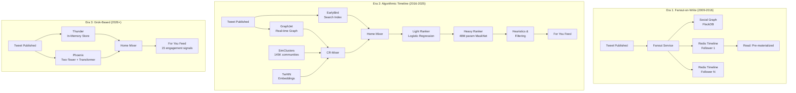
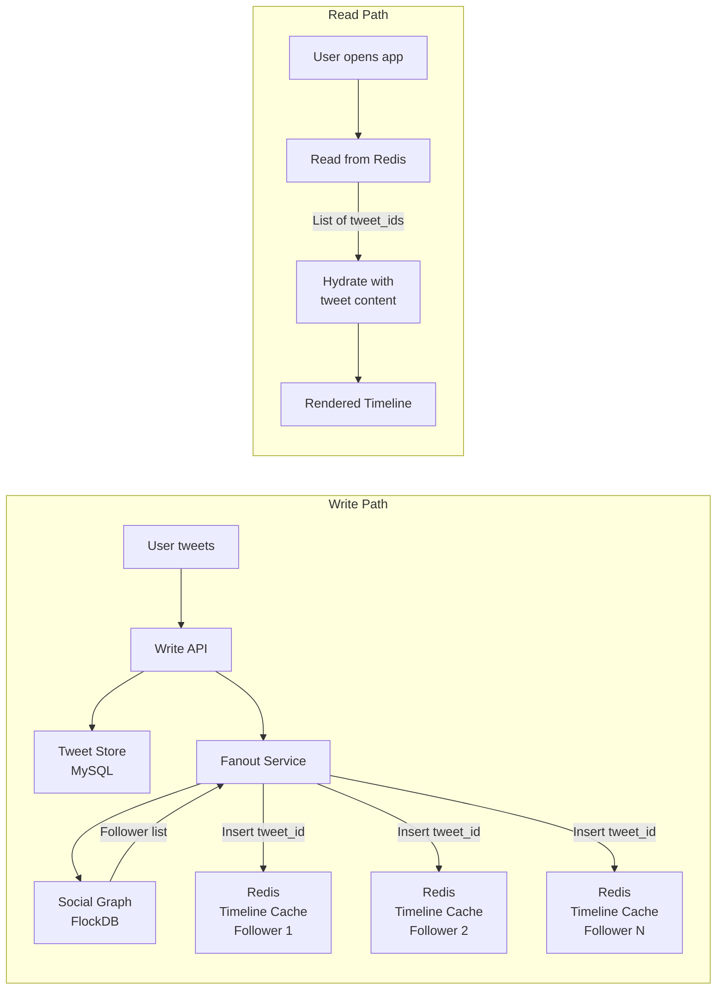
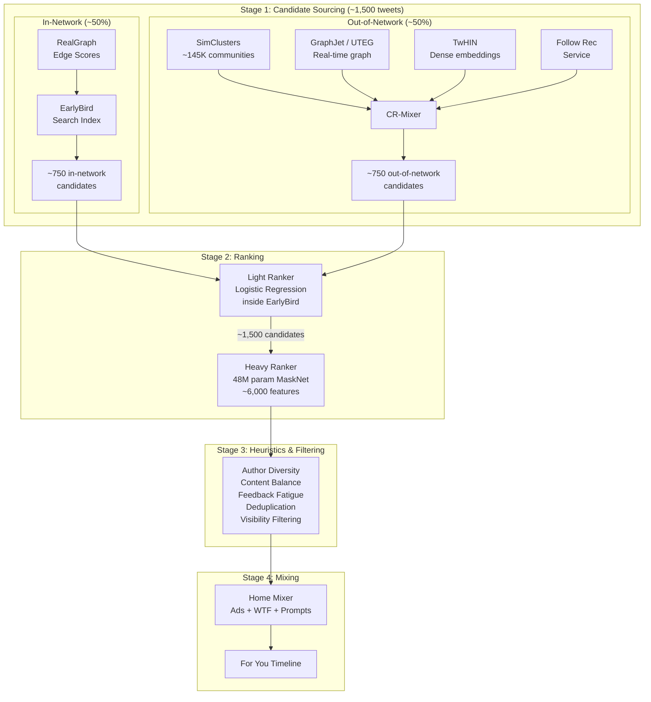

# Twitter/X: Timeline Architecture and the Recommendation Algorithm

How Twitter evolved from a monolithic Ruby on Rails app delivering reverse-chronological tweets at 4,600 writes/second into a distributed ML pipeline that processes 500 million tweets daily through a multi-stage recommendation system -- and how X replaced all of it with a Grok-based transformer in 2026. This case study traces the full arc: fanout-on-write, the hybrid celebrity problem, the algorithmic timeline controversy, the unprecedented open-sourcing of the recommendation algorithm, and the latest Phoenix/Thunder architecture.

<figure>

<figcaption>Three eras of Twitter's timeline: pre-materialized Redis fanout (2009-2016), multi-service ML pipeline with SimClusters/GraphJet/MaskNet (2016-2025), and the unified Grok-based Phoenix/Thunder system (2026+).</figcaption>
</figure>

## Abstract

Twitter's timeline architecture is a case study in three distinct approaches to content delivery at scale, each driven by different bottlenecks:

- **Fanout-on-write (2009-2016)**: Pre-materialize timelines in Redis at tweet creation time. Each tweet triggers writes to every follower's timeline cache. Optimizes for read latency (sub-millisecond) at the cost of write amplification. Breaks down for celebrities with millions of followers -- solved via a hybrid approach that merges high-follower tweets at read time.

- **Multi-service ML pipeline (2016-2025)**: Shift from chronological delivery to ranked recommendations. ~1,500 candidates sourced 50/50 from in-network (EarlyBird search) and out-of-network (SimClusters, GraphJet, TwHIN embeddings). Two-stage ranking: light ranker (logistic regression) filters candidates, heavy ranker (48M-parameter MaskNet) scores across 10 engagement dimensions with explicit weights (a reply engaged by the author is worth 150x a like). Open-sourced March 2023 across `twitter/the-algorithm` and `twitter/the-algorithm-ml`.

- **Grok-based transformer (2026+)**: Replace all hand-engineered features and specialized embedding systems with a single transformer architecture (Phoenix) derived from xAI's Grok-1. Thunder provides sub-millisecond in-memory post storage. Predicts 15 engagement signals. Open-sourced January 2026 at `xai-org/x-algorithm`.

The key trade-off across all three eras: **read latency vs. recommendation quality vs. system complexity**. Fanout-on-write minimized read latency but could not rank. The ML pipeline maximized recommendation quality through feature engineering but required dozens of specialized services. The Grok-based system trades feature engineering for model capacity, betting that a sufficiently large transformer can learn features that took years of manual engineering to build.

## Context

### The System

Twitter launched on July 15, 2006 as a microblogging platform with a 140-character limit (expanded to 280 in November 2017). The timeline -- a reverse-chronological feed of tweets from followed accounts -- was the product's core interaction surface.

| Metric                     | 2008      | 2012                         | 2017      | 2023      |
| -------------------------- | --------- | ---------------------------- | --------- | --------- |
| Monthly Active Users (MAU) | ~6M       | 150M                         | 330M      | ~550M (X) |
| Tweets/day                 | ~3M       | ~400M                        | ~500M     | ~500M     |
| Write QPS (tweets)         | ~35       | ~4,600 (avg), ~12,000 (peak) | ~6,000    | ~6,000    |
| Read QPS (timelines)       | Thousands | 300,000                      | Millions  | Millions  |
| Timeline pipeline latency  | Seconds   | <5s fanout                   | <1.5s avg | <1s       |

**Tech stack evolution:**

| Era       | Stack                                                                                 |
| --------- | ------------------------------------------------------------------------------------- |
| 2006-2008 | Ruby on Rails monolith, MySQL                                                         |
| 2009-2013 | Scala/JVM services, Redis timelines, FlockDB, Finagle RPC                             |
| 2014-2022 | Manhattan KV store, EarlyBird search, Heron streaming, Kafka, Hadoop/Scalding         |
| 2023-2025 | Home Mixer (Product Mixer Scala framework), MaskNet ranker, Navi (Rust model serving) |
| 2026+     | Phoenix (Grok transformer), Thunder (in-memory store), Home Mixer                     |

### The Trigger

Three inflection points drove architectural transformations:

1. **2008-2009**: The Fail Whale era. Twitter experienced ~1,444% growth between June 2008 and 2009. The Ruby on Rails monolith could not keep up -- the site was offline for almost six days total in 2007. This triggered the migration to JVM-based services and the fanout-on-write architecture.

2. **2016**: User engagement stagnated. Data showed users were missing tweets they would have cared about, especially those who followed many accounts or checked Twitter infrequently. Facebook's algorithmically-ranked News Feed was eating Twitter's lunch. This triggered the algorithmic timeline.

3. **2022-2023**: Elon Musk's $44 billion acquisition (October 27, 2022) triggered massive workforce reductions (~80% of headcount), aggressive infrastructure cost-cutting targeting $1 billion in annual savings, and an unprecedented open-sourcing of the recommendation algorithm as a transparency initiative.

## Era 1: Fanout-on-Write (2009-2016)

### The Architecture

The canonical description comes from Raffi Krikorian's "Timelines at Scale" presentation at QCon (April 2013). The core insight: shift computation from read time to write time.

<figure>

<figcaption>Fanout-on-write: the write path does all the work (fanning tweet IDs to every follower's Redis list), so reads are simple key lookups.</figcaption>
</figure>

**Write path:**

1. User publishes a tweet via the Write API.
2. Tweet is persisted to storage (initially MySQL, later Manhattan).
3. The **Fanout Service** retrieves the author's follower list from the **Social Graph Service** (backed by FlockDB -- a Scala-based distributed graph database storing 13+ billion edges at 20,000 writes/sec and 100,000 reads/sec peak).
4. For each follower, the fanout service inserts the tweet ID into that follower's home timeline in a **Redis cluster**.
5. Each Redis timeline held a maximum of **800 entries** (tweet IDs and minimal metadata, not full tweet content).

**Read path:**

1. User opens their timeline.
2. System reads the pre-computed list of tweet IDs from Redis.
3. Tweet IDs are hydrated with full content from the tweet store.
4. Rendered timeline is returned.

**Why this design**: The read:write ratio at Twitter was approximately **500:1**. Spending extra work on the write path (which happens once) to make reads nearly free (which happens 500x more) was an enormous net win. At 300,000 timeline reads/sec, computing timelines on-the-fly would have been prohibitively expensive.

### Scale Numbers (2012-2013)

| Metric                        | Value                       |
| ----------------------------- | --------------------------- |
| Active users                  | 150 million                 |
| Timeline read QPS             | 300,000                     |
| Tweet write QPS (avg)         | 4,600                       |
| Tweet write QPS (peak)        | 12,000                      |
| Redis inserts/sec from fanout | ~345,000                    |
| Fanout target latency         | <5 seconds to all followers |
| Redis timeline size cap       | 800 tweet IDs               |
| Redis replication             | 3x per tweet per datacenter |
| Firehose throughput           | 22 MB/sec                   |

### The Celebrity Problem and Hybrid Fanout

Pure fanout-on-write collapsed for users with millions of followers. When a celebrity tweeted, writing to millions of Redis timelines could take far longer than the 5-second target. Worse, replies to the tweet could appear in followers' timelines before the original tweet.

**The hybrid solution**: Twitter maintained a list of high-follower accounts (exact threshold undisclosed). These accounts were excluded from write-time fanout. When a user requested their timeline, the system merged:

1. The pre-computed timeline from Redis (tweets from "normal" accounts).
2. A real-time query to **EarlyBird** (Twitter's search index) for recent tweets from high-follower accounts that the user followed.

The merged result was re-sorted by timestamp and served. This shifted celebrity tweets from fanout-on-write to **fanout-on-read**, keeping the benefits of pre-materialization for the vast majority of accounts.

### Supporting Infrastructure

The fanout era relied on several key systems that Twitter built and open-sourced:

**Snowflake (2010)**: Distributed unique ID generator producing 64-bit IDs with embedded timestamps. Structure: 1 bit unused | 41 bits timestamp (ms since custom epoch) | 10 bits machine ID | 12 bits sequence number. Each machine generates up to 4,096 IDs per millisecond. IDs are roughly time-sorted, enabling efficient range queries. The design has been adopted industry-wide (Discord, Instagram, Sony's Sonyflake).

**FlockDB (2010)**: Distributed graph database built on the Gizzard sharding framework. Stored edges as 64-bit integer pairs (e.g., user-follows-user). Each edge stored twice -- forward and backward -- for efficient bidirectional queries. Built on MySQL as the underlying storage engine. Now archived.

**Finagle (2011)**: Protocol-agnostic, asynchronous RPC (Remote Procedure Call) framework in Scala, built on Netty. Provided connection pooling, load balancing, retry logic, and circuit breaking. Became the backbone of nearly all Twitter service-to-service communication. Extended Apache Thrift with the TTwitter protocol for distributed tracing support.

**Gizzard (2010)**: Middleware sharding framework requiring all writes to be idempotent and commutative (since write ordering was not guaranteed). Used a forwarding table mapping ID ranges to shards. FlockDB was built on top of Gizzard. Now archived, superseded by Manhattan.

## Era 2: The Algorithmic Timeline (2016-2025)

### Why Chronological Broke Down

On February 10, 2016, Twitter introduced its first algorithmic timeline. The announcement sparked the **#RIPTwitter** hashtag, but the data was clear:

- Users following hundreds of accounts missed a majority of tweets in the chronological feed.
- The "While You Were Away" feature (January 2015) had shown that surfacing older-but-relevant tweets measurably increased engagement.
- Competitors (Facebook, Instagram) had demonstrated that algorithmic ranking drove stronger engagement metrics.

The algorithm initially selected a handful of top-scoring tweets to display above the chronological feed. By 2017, "In Case You Missed It" replaced "While You Were Away", and algorithmic ranking became the default experience.

### The "For You" and "Following" Split (2023)

In January 2023, Twitter formalized the two-tab structure:

- **"For You"** (default): Ranked feed mixing in-network and out-of-network tweets via the full recommendation pipeline.
- **"Following"**: Pure reverse-chronological feed from followed accounts only. Retrieved via EarlyBird with no ranking.

### The 2023 Open-Source Release

On March 31, 2023, Twitter published the recommendation algorithm across two repositories:

- **[twitter/the-algorithm](https://github.com/twitter/the-algorithm)**: Scala/Java services (Home Mixer, CR-Mixer, EarlyBird, SimClusters, GraphJet, visibility filters).
- **[twitter/the-algorithm-ml](https://github.com/twitter/the-algorithm-ml)**: Python ML models (heavy ranker MaskNet, TwHIN embedding training).

**What was NOT released**: training data, model weights, production configurations, complete Trust and Safety codebase, ads recommendation components, and the build system.

### Pipeline Architecture (2023 Version)

The "For You" timeline pipeline processed approximately 500 million tweets daily across 400 billion real-time events, running roughly 5 billion times per day with an average latency under 1.5 seconds -- though each execution consumed approximately 220 seconds of CPU time, parallelized across services.

<figure>

<figcaption>The full 2023 recommendation pipeline: four stages from candidate sourcing through mixing, orchestrated by Home Mixer on the Product Mixer Scala framework.</figcaption>
</figure>

### Stage 1: Candidate Sourcing

The system selected approximately 1,500 candidate tweets, split roughly 50/50 between in-network and out-of-network sources.

#### In-Network Retrieval

**EarlyBird** (Twitter's real-time search system, paper: ICDE 2012) served as the primary retrieval engine. Built on a heavily modified Apache Lucene, EarlyBird maintained inverted indexes with three cluster types:

- **Realtime Cluster**: All public tweets from the last ~7 days.
- **Protected Cluster**: Private tweets from the same window.
- **Archive Cluster**: All tweets ever posted, overlapping with the realtime cluster.

Key design: **reverse document ID allocation** (newest tweets get the lowest IDs, so search naturally traverses newest-first) and a **single-writer, multiple-reader** concurrency model using memory barriers. By 2020, Twitter reduced EarlyBird's indexing latency from 15 seconds to approximately 1 second by replacing linked-list posting structures with skip lists.

**RealGraph** weighted which followed accounts' tweets to prioritize. RealGraph is a directed, edge-weighted graph where each edge weight represents tie strength -- the probability of future interaction between two users. A gradient boosting tree classifier trained on features like tweet frequency, follow interactions, profile views, and tweet clicks.

#### Out-of-Network Retrieval

**CR-Mixer** (Content Recommender Mixer) orchestrated out-of-network candidate generation through a four-stage pipeline: source signal extraction (from UserProfileService, RealGraph), candidate generation (delegated to specialized services), filtering, and lightweight ranking.

The underlying candidate sources:

**SimClusters** (paper: KDD 2020) mapped users and content into a shared sparse embedding space of approximately 145,000 communities. The system treated the follow graph as a bipartite graph of consumers (followers) and producers (followed accounts), ran Metropolis-Hastings community detection on the producer-producer similarity graph, then computed user interest vectors via matrix multiplication. Tweet embeddings accumulated dynamically through engagement -- each favorite added the liker's interest vector to the tweet's embedding via a real-time Heron streaming job. SimClusters ANN (Approximate Nearest Neighbor) then matched users to tweets using community-level indices.

**GraphJet** (paper: VLDB 2016) maintained an in-memory bipartite user-tweet interaction graph. It used SALSA (Stochastic Approach for Link-Structure Analysis) random walks to find tweets that similar users engaged with. Each server ingested up to 1 million graph edges per second, held approximately 1 billion edges in under 30 GB of RAM, and computed up to 500 recommendations per second. GraphJet powered approximately 15% of "For You" tweets, generating the "X liked" out-of-network recommendations.

**TwHIN** (Twitter Heterogeneous Information Network, paper: KDD 2022) learned dense 200-dimensional embeddings via TransE-style knowledge graph methods across 10^9 nodes and 10^11 edges, modeling user-user follows, user-tweet favorites, and user-ad clicks. Embeddings served dual purposes: candidate retrieval via similarity search and input features for the heavy ranker.

### Stage 2: Ranking

Candidates passed through a two-stage ranking funnel:

**Light Ranker**: A logistic regression model running inside EarlyBird's search index. Cheap to compute, it pre-scored and filtered candidates before heavy ranking. The production model at open-source time had been trained several years prior.

**Heavy Ranker**: A ~48 million parameter neural network using the **parallel MaskNet** architecture (Wang et al., 2021). MaskNet's core innovation is the instance-guided mask module, which performs element-wise products on feature embeddings and feed-forward layers, guided by the input instance.

The heavy ranker consumed approximately **6,000 features** organized into groups:

| Feature Group                    | What It Captures                                                   | Time Window                          |
| -------------------------------- | ------------------------------------------------------------------ | ------------------------------------ |
| `author_aggregate`               | Author engagement metrics (favorites, retweets, replies)           | 30-min real-time + 50-day historical |
| `user_author_aggregate`          | Interaction history between specific user-author pairs             | 50-day                               |
| `user_engager_aggregate`         | Two-hop engagement patterns (users who engaged with your engagers) | 50-day                               |
| `realgraph`                      | Direct interaction: follows, DMs, favorites, temporal metrics      | Ongoing                              |
| `two_hop`                        | Indirect interactions through shared engagement                    | Ongoing                              |
| `timelines.earlybird`            | Engagement features from the light ranker                          | Real-time                            |
| `tweet_aggregate`                | Per-tweet dwell time, shares, engagement counts                    | Real-time                            |
| `user_request_context_aggregate` | Day-of-week and hour-of-day behavioral patterns                    | 50-day                               |
| TwHIN embeddings                 | 3 x 200-dimensional dense vectors (follow + engagement)            | Pretrained                           |

The model output 10 engagement probabilities, combined via a weighted sum into a single score:

| Engagement Type                       | Weight     | Interpretation                                |
| ------------------------------------- | ---------- | --------------------------------------------- |
| Reply engaged by author               | **+75.0**  | Highest positive: two-way conversation        |
| Reply                                 | +13.5      | Conversations valued over passive consumption |
| Good profile click                    | +12.0      | Exploring the author's profile                |
| Good click (reply/like after viewing) | +11.0      | Deep engagement                               |
| Good click v2 (2+ min dwell)          | +10.0      | Extended attention                            |
| Retweet                               | +1.0       | Amplification                                 |
| Favorite (like)                       | +0.5       | Lowest positive signal                        |
| Video playback 50%                    | +0.005     | Near-negligible at open-source time           |
| Negative feedback                     | **-74.0**  | "Show less," blocks, mutes                    |
| Report                                | **-369.0** | Strongest signal in either direction          |

**Design reasoning behind these weights**: The team originally calibrated weights so each engagement type contributed equally to the expected score on average, then periodically adjusted them to optimize platform-level metrics. The extreme weighting of author-engaged replies (+75.0) reflected a deliberate product decision to prioritize conversational content. A single "show less" action (-74.0) approximately canceled 148 favorites -- creating a strong penalty for content users actively disliked.

The heavy ranker was served by **Navi**, a high-performance ML model serving framework written in Rust.

### Stage 3: Heuristics and Filtering

After ranking, several filters were applied:

- **Author Diversity**: Penalized consecutive tweets from the same author to avoid timeline domination.
- **Content Balance**: Maintained the in-network vs. out-of-network ratio.
- **Feedback Fatigue**: Lowered scores for authors/content the user previously gave negative feedback on.
- **Out-of-Network Scaling**: Removed out-of-network tweets without second-degree social connections (if none of the people you follow engaged with it, it was filtered).
- **Deduplication**: Removed previously seen tweets.
- **Visibility Filtering**: A centralized rule engine applying Trust and Safety policies. Actions ranged from hard filtering ("Drop") to soft treatments (labels, interstitials) and ranking signal adjustments. Four ML classifiers were open-sourced: pNSFWMedia, pNSFWText, pToxicity, and pAbuse.

### Stage 4: Mixing (Home Mixer)

**Home Mixer** was the orchestration service powering three timeline types: "For You," "Following," and Lists. Built on **Product Mixer**, a custom Scala framework structured around a hierarchy of pipelines:

- **Product Pipelines**: Top-level routers directing requests by product surface.
- **Mixer Pipelines**: Combined heterogeneous content (tweets, ads, users, prompts).
- **Recommendation Pipelines**: Scored and ranked homogeneous candidate sets.
- **Candidate Pipelines**: Fetched and processed candidates from underlying sources.

Home Mixer integrated advertisements, "Who to Follow" modules, conversation prompts, social context annotations, and edited tweet handling into the final feed.

## Era 3: The Grok-Based System (2026+)

### The Architectural Reset

On January 20, 2026, X open-sourced a fundamentally new recommendation algorithm at **[xai-org/x-algorithm](https://github.com/xai-org/x-algorithm)** -- the repository gained 1,600 GitHub stars within 6 hours.

The new system eliminates all hand-engineered features and most heuristics from the 2023 system, replacing them with a single transformer architecture adapted from xAI's Grok-1.

### New Components

| Component              | Purpose                                                              |
| ---------------------- | -------------------------------------------------------------------- |
| **Home Mixer**         | Orchestration layer (retained from the 2023 system)                  |
| **Thunder**            | In-memory post store for in-network content; sub-millisecond lookups |
| **Phoenix**            | Dual-function retrieval + ranking system using Grok-1 transformer    |
| **Candidate Pipeline** | Reusable framework infrastructure                                    |

### Phoenix: Retrieval and Ranking Unified

Phoenix handles both candidate retrieval and final ranking using neural network approaches:

**Retrieval (Two-Tower model)**: Separate neural networks encode user features and candidate posts into embedding vectors. Similarity calculations between these embeddings identify potentially relevant out-of-network content. Uses hash-based embeddings rather than traditional lookup tables, reducing memory requirements while processing millions of posts.

**Ranking (Transformer)**: The core ranking model is ported from xAI's Grok-1 open-source release, adapted for recommendation. Candidates cannot attend to each other during inference -- only to the user context -- making scores consistent and cacheable regardless of batch composition.

### 15 Engagement Signals

The model predicts probabilities for 15 signals (up from 10 in the 2023 system):

**Positive**: P(favorite), P(reply), P(repost), P(quote), P(click), P(profile_click), P(video_view), P(photo_expand), P(share), P(dwell), P(follow_author)

**Negative**: P(not_interested), P(block_author), P(mute_author), P(report)

Specific weight values were not disclosed in this release.

### 7-Stage Pipeline

1. **Query hydration**: Load user engagement history.
2. **Candidate sourcing**: In-network from Thunder + out-of-network from Phoenix retrieval.
3. **Candidate hydration**: Metadata enrichment via parallel hydrators.
4. **Pre-scoring filtering**: Duplicates, age thresholds, blocked accounts.
5. **Scoring**: Phoenix ML predictions, weighted combination, diversity adjustments.
6. **Selection**: Top-K extraction.
7. **Post-selection filtering**: Deletions, spam, final deduplication.

### What Changed from 2023 to 2026

| Aspect             | 2023 (twitter/the-algorithm)            | 2026 (xai-org/x-algorithm)     |
| ------------------ | --------------------------------------- | ------------------------------ |
| Ranker             | 48M param MaskNet                       | Grok-1 transformer             |
| Features           | ~6,000 hand-engineered features         | End-to-end learned             |
| Retrieval          | SimClusters, TwHIN, GraphJet, EarlyBird | Phoenix Two-Tower neural model |
| In-memory store    | Redis caching layers                    | Thunder (sub-ms lookups)       |
| Engagement signals | 10 types                                | 15 types                       |
| Model serving      | Navi (Rust)                             | Continued Rust-based serving   |

The architectural trajectory: replacing feature engineering with model capacity. SimClusters (145K communities), TwHIN (200-d embeddings), GraphJet (SALSA walks), and hundreds of aggregated feature groups were all subsumed by a single transformer that learns representations directly from engagement data.

## Lessons Learned

### Technical Lessons

#### 1. Fanout Strategy Depends on Read:Write Ratio

**The insight**: At a 500:1 read:write ratio, fanout-on-write is overwhelmingly efficient. But it breaks for high-degree nodes (celebrities) because write amplification scales with follower count. The hybrid approach -- fanout-on-write for the majority, fanout-on-read for outliers -- is the pragmatic solution.

**How it applies elsewhere**: Any notification or feed system with skewed degree distribution faces this trade-off. Chat systems (Slack, Discord) use channel-based fanout-on-read because most messages target large groups. Email uses fanout-on-write because most emails target few recipients.

**Warning signs**: If your fanout latency SLA (Service Level Agreement) is regularly violated by a small percentage of writes, you likely need a hybrid approach.

#### 2. The Feature Engineering vs. Model Capacity Trade-off

**The insight**: Twitter spent years building specialized systems -- SimClusters for community detection, GraphJet for collaborative filtering, TwHIN for knowledge graph embeddings, hundreds of aggregate feature groups with carefully tuned time windows. The 2026 system replaced all of this with a single transformer. The bet: a sufficiently large model trained on enough data can learn features that took years of manual engineering.

**How it applies elsewhere**: This mirrors the broader industry trend from hand-crafted features (SVMs, gradient boosting) to end-to-end deep learning. But there is a critical caveat: Twitter could only make this leap after years of building the training data infrastructure, feedback loops, and real-time event systems that feed the transformer.

**Warning signs**: If you are considering replacing a specialized system with a general model, verify that you have the training data volume and the compute budget to match the specialized system's performance. The 2023 system's individual components were each carefully optimized for their domains.

#### 3. Open-Sourcing Reveals Design Intent

**The insight**: The 2023 open-source release revealed that Twitter's algorithm heavily valued conversational engagement (reply engaged by author: +75.0) over passive consumption (like: +0.5). This was a deliberate product decision, not an emergent property. The weights were periodically adjusted to optimize platform-level metrics, making the scoring formula an explicit encoding of product values.

**How it applies elsewhere**: Any recommendation system's scoring weights are product decisions, not just engineering ones. Making them explicit (even internally) helps teams reason about what behaviors they are incentivizing.

### Process Lessons

#### 1. Infrastructure as Competitive Moat

Twitter's timeline evolved not because the algorithms changed, but because the infrastructure enabled new approaches. Redis fanout was only possible because of FlockDB's social graph queries and Snowflake's ID generation. Algorithmic ranking was only possible because of EarlyBird's real-time indexing and Heron's stream processing. ML ranking was only possible because of Manhattan's storage, Kafka's event streaming, and Navi's model serving.

**What they would do differently**: The 80% workforce reduction in 2022-2023 stressed every one of these systems. Twitter's engineering blog documented how caching layers (built on the Aurora framework running on Apache Mesos) proved critical to keeping the platform running with a skeleton crew.

### Organizational Lessons

#### 1. The Cost of Microservice Sprawl

Post-acquisition, Elon Musk claimed that less than 20% of Twitter's microservices were necessary for the platform to function. Whether this specific number is accurate, the consolidation effort demonstrated that Twitter's services-oriented architecture (SOA) had accumulated significant coordination overhead. The migration from monolith to SOA in 2009-2013 solved the scaling crisis but created a maintainability crisis that only became apparent when staffing was drastically reduced.

## Applying This to Your System

### When These Patterns Apply

You might face similar challenges if:

- Your system delivers personalized content feeds to millions of users.
- You have a high read:write ratio (100:1 or higher) for feed-type data.
- You are considering moving from chronological to ranked content delivery.
- You have skewed degree distribution in your social graph (a few producers creating content consumed by many).

### Checklist for Evaluation

- Are your timeline reads significantly more expensive than writes? Consider fanout-on-write.
- Do you have high-degree nodes that break your fanout SLA? Consider a hybrid approach.
- Are users missing content they would engage with? Consider algorithmic ranking.
- Are you maintaining more than 5 specialized recommendation services? Consider whether a unified model could replace them.
- Can you measure the product impact of your ranking weights? Make them explicit.

### Starting Points

1. **If building a new feed**: Start with fanout-on-write in Redis/Valkey. It is simpler than it sounds and handles most scales. Only add ranking when chronological delivery measurably hurts engagement.
2. **If adding recommendations**: Start with collaborative filtering (GraphJet-style random walks on a bipartite interaction graph). It requires no ML training infrastructure and produces strong out-of-network recommendations.
3. **If optimizing an existing recommendation system**: Audit your scoring weights. Map them to product values explicitly. A single weight change (like increasing the reply-engaged-by-author weight from 1.0 to 75.0) can shift platform behavior more than a model architecture change.

## Conclusion

Twitter's timeline architecture is a 17-year case study in the tension between simplicity and relevance. Fanout-on-write was elegant and fast but could not rank. The ML pipeline maximized recommendation quality but required dozens of specialized services, each with its own data pipeline, training loop, and operational burden. The Grok-based system bets that a sufficiently large transformer can subsume all of this complexity -- a bet that mirrors the broader industry shift from feature engineering to model scaling.

The open-sourced codebases (`twitter/the-algorithm`, `twitter/the-algorithm-ml`, `xai-org/x-algorithm`) provide rare windows into production recommendation systems at billion-user scale. The scoring weights, feature definitions, and pipeline structures are concrete artifacts that engineering teams can study and adapt.

## Appendix

### Prerequisites

- Familiarity with distributed systems concepts (replication, sharding, consistency models)
- Understanding of ML fundamentals (embedding spaces, neural networks, loss functions)
- Knowledge of feed/timeline system design patterns

### Terminology

- **Fanout-on-write**: Pre-computing and storing results at write time so reads are simple lookups.
- **Fanout-on-read**: Computing results at read time by querying and aggregating data from multiple sources.
- **In-network**: Content from accounts the user follows.
- **Out-of-network**: Content from accounts the user does not follow, surfaced via recommendation.
- **Heavy Ranker**: The computationally expensive ML model that produces final ranking scores (vs. the lightweight "Light Ranker" used for initial filtering).
- **MaskNet**: A neural network architecture using instance-guided masks for feature interaction learning.
- **SimClusters**: Twitter's sparse embedding system mapping entities into ~145K community dimensions.
- **TwHIN**: Twitter Heterogeneous Information Network -- dense embedding system for multi-entity, multi-relation graphs.
- **GraphJet**: In-memory bipartite graph engine using SALSA random walks for collaborative filtering.
- **EarlyBird**: Twitter's real-time search system built on modified Apache Lucene.
- **SALSA**: Stochastic Approach for Link-Structure Analysis -- a random walk algorithm for bipartite graphs.
- **SOA**: Services-Oriented Architecture -- decomposing a monolith into independent services.

### Summary

- Twitter's timeline evolved through three eras: fanout-on-write (optimize reads), multi-service ML pipeline (optimize relevance via specialized components), and Grok-based transformer (optimize with model capacity).
- The fanout-on-write system served 300K QPS with sub-millisecond reads by pre-materializing timelines in Redis, using a hybrid approach for celebrities with millions of followers.
- The 2023 open-sourced pipeline sourced ~1,500 candidates 50/50 in-network/out-of-network, scored them with a 48M-parameter MaskNet across 10 engagement dimensions, with explicit weights revealing product priorities (author-engaged replies valued 150x likes).
- The 2026 Grok-based system (Phoenix/Thunder) replaced all hand-engineered features and specialized embedding systems with a single transformer, predicting 15 engagement signals.
- Key design lesson: recommendation scoring weights are product decisions, not just engineering ones. Making them explicit enables principled optimization.

### References

- [Earlybird: Real-Time Search at Twitter](https://ieeexplore.ieee.org/document/6228205) - ICDE 2012, Busch et al.
- [WTF: The Who to Follow Service at Twitter](https://dl.acm.org/doi/10.1145/2488388.2488433) - WWW 2013, Gupta et al.
- [The Who-To-Follow System at Twitter: Strategy, Algorithms, and Revenue Impact](https://pubsonline.informs.org/doi/10.1287/inte.2014.0784) - INFORMS Interfaces, Vol. 45, 2015, Goel et al.
- [GraphJet: Real-Time Content Recommendations at Twitter](https://www.vldb.org/pvldb/vol9/p1281-sharma.pdf) - VLDB 2016, Sharma et al.
- [SimClusters: Community-Based Representations for Heterogeneous Recommendations at Twitter](https://dl.acm.org/doi/10.1145/3394486.3403370) - KDD 2020, Satuluri et al.
- [TwHIN: Embedding the Twitter Heterogeneous Information Network for Personalized Recommendation](https://arxiv.org/abs/2202.05387) - KDD 2022, El-Kishky et al.
- [Twitter Heron: Stream Processing at Scale](https://dl.acm.org/doi/10.1145/2723372.2742788) - SIGMOD 2015, Kulkarni et al.
- [A Large-Scale Analysis of Hundreds of In-Memory Cache Clusters at Twitter](https://www.usenix.org/conference/osdi20/presentation/yang) - USENIX OSDI 2020, Yang et al.
- [MaskNet: Introducing Feature-Wise Multiplication to CTR Ranking Models](https://arxiv.org/abs/2102.07619) - Wang et al., 2021
- [Timelines at Scale - Raffi Krikorian, QCon 2013](https://www.infoq.com/presentations/Twitter-Timeline-Scalability/) - InfoQ Presentation
- [Real-Time Delivery Architecture at Twitter - Raffi Krikorian, QCon 2012](https://www.infoq.com/presentations/Real-Time-Delivery-Twitter/) - InfoQ Presentation
- [Twitter's Recommendation Algorithm - X Engineering Blog](https://blog.x.com/engineering/en_us/topics/open-source/2023/twitter-recommendation-algorithm) - March 2023
- [Manhattan: Our Real-Time Multi-Tenant Distributed Database for Twitter Scale](https://blog.x.com/engineering/en_us/a/2014/manhattan-our-real-time-multi-tenant-distributed-database-for-twitter-scale) - X Engineering Blog, 2014
- [Reducing Search Indexing Latency to One Second](https://blog.x.com/engineering/en_us/topics/infrastructure/2020/reducing-search-indexing-latency-to-one-second) - X Engineering Blog, 2020
- [The Infrastructure Behind Twitter: Scale](https://blog.x.com/engineering/en_us/topics/infrastructure/2017/the-infrastructure-behind-twitter-scale) - X Engineering Blog, 2017
- [twitter/the-algorithm - GitHub](https://github.com/twitter/the-algorithm) - Open-sourced recommendation algorithm (2023)
- [twitter/the-algorithm-ml - GitHub](https://github.com/twitter/the-algorithm-ml) - ML model training code (2023)
- [xai-org/x-algorithm - GitHub](https://github.com/xai-org/x-algorithm) - Grok-based recommendation algorithm (2026)
