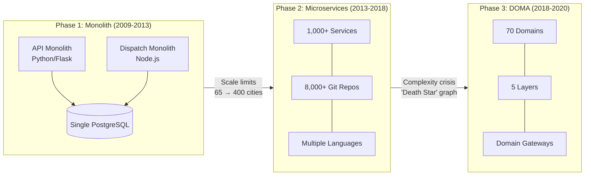

# Uber: From Monolith to Domain-Oriented Microservices

How Uber evolved from two monolithic services to 4,000+ microservices and then restructured into domain-oriented architecture, demonstrating that the hardest part of microservices is not splitting the monolith but managing what comes after. Each architectural phase solved real scaling bottlenecks while creating new organizational and operational challenges at the next order of magnitude.

<figure>

<figcaption>Uber's three architectural phases. Each transition was triggered by the previous architecture hitting its operational limits at the next order of magnitude.</figcaption>
</figure>

## Abstract

Uber's architecture evolution follows a pattern common to hypergrowth companies: the monolith works until organizational scaling demands decomposition, the resulting microservices work until their sheer number creates a new class of problems, and the response is not to go back but to add structure on top.

The core mental model has three phases:

- **Monolith (2009-2013)**: Two services (Python API + Node.js Dispatch) sharing a single PostgreSQL instance. Worked for one city and one product. Failed when concurrent engineers and concurrent cities made single-deployment and single-database models untenable.
- **Microservices explosion (2013-2018)**: Aggressive decomposition drove service count from 1 to 4,000+ in five years. Enabled 10x engineering growth (200 to 2,000 engineers in 18 months) but produced a "death star" dependency graph, cascading failures across deep call chains, and cognitive overload from thousands of independently structured services.
- **DOMA (2018-2020)**: Domain-Oriented Microservice Architecture grouped 2,200 critical services into 70 domains with gateway interfaces, five dependency layers, and an extension model. Did not reduce service count but imposed structure that cut onboarding time by 25-50% and platform support costs by an order of magnitude.

The key insight: microservices are an organizational scaling tool, not primarily a technical one. Uber's Chief Systems Architect Matt Ranney stated it directly -- "Scaling the traffic is not the issue. Scaling the team and the product feature release rate is the primary driver."

## Context

### The System

Uber's platform connects riders with drivers in real time across a global marketplace. The core technical challenge is a two-sided matching problem with hard latency constraints: ETA (Estimated Time of Arrival) calculations must return in under 5 milliseconds, dispatch decisions happen in real time, and supply/demand dynamics shift continuously across thousands of cities.

### Scale at Key Inflection Points

| Metric | 2013 (End of Monolith) | 2016 (Peak Microservices) | 2020 (DOMA) |
|--------|----------------------|--------------------------|-------------|
| Cities | 65 | 400 (70 countries) | 10,000+ |
| Engineers | ~100 | ~2,000 | ~4,000 |
| Microservices | 2 (monoliths) | ~1,000 | 2,200 critical / 4,000+ total |
| Git repositories | ~10 | 8,000+ | 12,000+ |
| Deployments/week | Single deploy | Hundreds | 100,000+ |
| Trips milestone | — | 2 billionth (Oct 2016) | 10 billionth (Sep 2018) |

### The Trigger

Uber's architecture did not evolve on a planned schedule. Each phase transition was forced by a specific scaling crisis:

- **2013**: The single PostgreSQL database was running out of capacity. Engineers estimated the infrastructure would fail to function by the end of 2014.
- **2016**: The "death star" dependency graph made the system unpredictable. A latency spike in any of hundreds of dependencies could cascade across the entire platform.
- **2018**: Feature velocity was declining despite growing headcount. Engineers needed to navigate ~50 services across 12 teams to investigate a single production issue.

## Phase 1: The Monolith (2009-2013)

### Architecture

Uber launched in 2009 with a LAMP stack. By 2011, the architecture had settled into two monolithic services:

- **API Service**: Python (Flask/uWSGI), handling all business logic -- rider management, billing, payments, driver onboarding. Connected to a single PostgreSQL instance.
- **Dispatch Service**: Node.js, handling real-time driver-rider matching and location tracking. Uber was one of the early major adopters of Node.js in 2011. Connected to MongoDB (later Redis).

Both services shared the same PostgreSQL database for persistent state. An intermediate layer called "ON" (Object Node) sat between dispatch and the API service for resilience.

### Why It Worked Initially

For a single product (UberBLACK) in a single city (San Francisco), this architecture was sufficient. Deployments were simple -- one team, one codebase, one database. The entire engineering team could hold the system model in their heads.

### Why It Broke

As Uber expanded from 1 city to 65 cities and from 1 product to multiple product lines, four problems compounded:

**Database saturation**: The single PostgreSQL instance could not handle the write volume from exponential trip growth. Write amplification was severe -- updating a single field required writing a new tuple plus updating all secondary indexes. Cross-datacenter WAL-based replication consumed prohibitive bandwidth.

**Deployment coupling**: Every code change required deploying the entire monolith. With dozens of engineers committing daily, the deployment queue became a bottleneck. A bug in billing code could take down dispatch.

**Organizational scaling**: "Tribal knowledge was required before attempting to make a single change." New engineers could not contribute safely without understanding the entire codebase. Components were tightly coupled with implicit dependencies.

**Concurrency bugs**: The dispatch system suffered from race conditions -- dispatching two cars to one rider, or matching one driver to multiple simultaneous requests. These bugs were symptoms of a monolith doing too many things in a single process.

## Phase 2: The Microservices Explosion (2013-2018)

### The Decision

In 2013, following the paths of Amazon, Netflix, and Twitter, Uber's engineering leadership decided to decompose the monolith into microservices. The explicit goal was organizational scaling -- enabling teams to deploy independently without coordinating with every other team.

### Migration Approach

Uber did not do a big-bang rewrite. Services were extracted incrementally from the monolith, starting with the most painful coupling points:

**Timeline of service growth:**

| Date | Services | Key milestone |
|------|----------|---------------|
| Mid-2014 | ~100 | Schemaless replaces PostgreSQL |
| September 2015 | 500+ | SOA blog post published; goal to eliminate monolith repo by year end |
| March 2016 | 1,000+ | 1,000th production service deployed |
| Early 2017 | 2,000+ | Jaeger tracing integrated across hundreds of services |
| 2018-2019 | 4,000+ | Peak service count |

**Key technology choices:**

- **Apache Thrift** as the IDL (Interface Definition Language) for cross-service contracts, providing type safety via strict schemas
- **TChannel**: A custom TCP multiplexing protocol for RPC, designed for out-of-order responses without head-of-line blocking. Built-in tracing headers (25 bytes of Dapper-style trace context embedded in every frame) made distributed tracing a protocol-level concern rather than an application-level afterthought.
- **Ringpop**: Application-layer consistent hashing library using a SWIM protocol variant for gossip-based cluster membership. Enabled services to self-organize into sharded clusters without external coordination. Routed over 25 real-time services handling millions of requests per second.
- **Hyperbahn**: An overlay network of routers built on Ringpop and TChannel. Services registered by name; consumers accessed producers without knowing hosts or ports. Provided fault tolerance, rate limiting, and circuit breaking.

### Infrastructure Built During This Phase

The microservices explosion forced Uber to build an entire platform stack. Each system below solved a specific scaling bottleneck:

**Storage -- Schemaless (2014)**: When PostgreSQL hit capacity, Uber built Schemaless -- an append-only sparse three-dimensional hash map on top of sharded MySQL. Data model: (row_key UUID, column_name string, ref_key integer) mapping to immutable JSON cells. Each shard cluster ran 1 master + 2 replicas across data centers. Buffered writes went to both primary and a randomly-selected secondary cluster for durability. Schemaless later evolved into Docstore, a general-purpose transactional database with Raft-based replication and strict serializability. Collectively, these systems store tens of petabytes and serve tens of millions of requests per second.

**Tracing -- Jaeger (2015)**: Created by Yuri Shkuro to replace Merckx, a monolithic Python tracing system that lacked distributed context propagation. Jaeger used a push model with local agents on every host, receiving spans via UDP. Chose to build rather than adopt Zipkin because Uber lacked operational experience with Scribe and Cassandra (Zipkin's dependencies at the time), and Zipkin's model did not support key-value logging or directed acyclic graph representations. Jaeger graduated from the CNCF (Cloud Native Computing Foundation) in October 2019 as the 7th top-level project. At Uber's scale, production traces regularly contain 50,000-60,000 spans, with outliers reaching 10 million spans.

**Metrics -- M3 (2015)**: Replaced a Graphite/Carbon/Whisper stack that could not replicate, required manual resharding, and lost data on any single node disk failure. M3DB stores over 6.6 billion time series, aggregates 500 million metrics per second, and persists 20 million metrics per second globally. Custom M3TSZ compression optimizes Facebook's Gorilla algorithm for float64 values.

**Workflow orchestration -- Cadence (2017)**: Built by Maxim Fateev and Samar Abbas (who previously built AWS Simple Workflow Service). Traditional workflow engines used DSLs that became overly complicated. Cadence inverted this: native code (Go, Java) for workflows with the engine handling persistence, queues, timers, and fault tolerance. Processes 12 billion executions and 270 billion actions per month. Internal surveys showed teams writing 40% less code for equivalent functionality. Fateev and Abbas later forked Cadence into Temporal in 2019.

**Container distribution -- Kraken (2018)**: P2P Docker image distribution using a BitTorrent-inspired protocol. Standard Docker registries could not keep up as clusters grew. Kraken distributes 20,000 blobs (100 MB-1 GB each) in under 30 seconds at peak, serving over 1 million blobs per day across clusters of 8,000+ hosts.

### The Language Migration

Uber started with Python (Flask/uWSGI) for the API monolith and Node.js for dispatch. Both hit performance walls as services proliferated:

**Python problems**: Flask blocked on network calls and I/O. The uWSGI worker model required provisioning more capacity and more services than the workload warranted.

**Node.js problems**: Single-threaded event loop tied up CPUs during compute-intensive operations (geospatial calculations, serialization). Background data refreshes caused query latency spikes because both competed for the same thread.

**Go adoption (~2015)**: The geofence service -- Uber's highest-QPS (Queries Per Second) service -- became the proof point. On New Year's Eve 2015, it handled 170,000 QPS with 40 machines at 35% CPU utilization. P95 latency stayed under 5 milliseconds, P99 under 50 milliseconds, with 99.99% uptime. Go's goroutines enabled concurrent background data refreshes without blocking foreground queries.

By 2018, Uber standardized on **Go and Java** for backend services. Python and Node.js were deprecated for new backend development. The Go monorepo grew to ~50 million lines of code with ~2,100 unique Go services by 2023, with monthly active Go developers growing from fewer than 10 to nearly 900.

### The "Death Star" Problem

By 2016, with 1,000+ services, the architecture had produced exactly the complexity it was supposed to eliminate. Matt Ranney, Uber's Chief Systems Architect, described the dependency graph as "wildly complicated" -- the visualization of service-to-service calls resembled a death star with tangled, opaque connections.

**Cascading failures**: With 100 interdependent services each responding slowly 1% of the time, the probability of at least one slow response per request is 63.4% ($1 - 0.99^{100}$). Retries amplified the problem. A single slow dependency could bring down services several layers upstream.

**Cognitive overload**: Engineers needed to navigate ~50 services across 12 teams to investigate a single production issue. Each microservice was structured differently, with no consistent patterns for service discovery, error handling, or API contracts.

**Reliability paradox**: Uber was most reliable on weekends -- the busiest period for rider traffic -- because engineers were not deploying. Ranney observed: "The time when things are most likely to break is when you change them."

**Repository explosion**: 8,000+ git repositories growing by 1,000 per month. Finding the right service, understanding its API, and knowing who owned it became significant engineering overhead.

**Technology fragmentation**: Multiple messaging queues, varying databases, different communication protocols, and multiple languages fragmented engineering culture into competing technical tribes.

Ranney's QCon SF 2016 talk, "What Comes After Microservices?", openly questioned whether microservices were solving more problems than they created at this scale.

## Phase 3: DOMA -- Domain-Oriented Microservice Architecture (2018-2020)

### The Insight

The answer to microservice complexity was not fewer services or a return to monoliths. It was adding a layer of organizational structure on top of existing services.

Published in July 2020, DOMA was the result of two years of work by 60+ engineers. The key observation: microservices at Uber had a **1.5-year half-life** -- 50% of services were created or deprecated every 18 months. Imposing structure at the service level was futile because services were too ephemeral. Structure had to exist at a higher abstraction: **domains**.

### Architecture

DOMA introduced four concepts:

**Domains**: Collections of one or more microservices tied to a logical grouping of functionality. Uber classified 2,200 critical microservices into 70 domains. A domain represents a bounded context in Domain-Driven Design (DDD) terms -- a coherent unit of business capability.

**Layers**: Five dependency layers with strict rules about which layers can call which:

| Layer | Purpose | Example |
|-------|---------|---------|
| Infrastructure | Generic engineering solutions any org could use | Storage, networking, compute |
| Business | Uber-wide logic not specific to a product | Maps, payments, identity |
| Product | Specific lines of business | Rides, Eats, Freight |
| Presentation | Consumer-facing application features | Mobile app screens, web views |
| Edge | External service exposure | API gateways, partner APIs |

Dependencies flow downward: Presentation calls Product, Product calls Business, Business calls Infrastructure. Lateral calls within a layer go through gateways. Upward calls are prohibited.

**Gateways**: A single entry point into each domain. Upstream consumers call the gateway, not individual services within the domain. This abstraction enabled two major platform rewrites at Uber to happen "behind gateways" without requiring hundreds of upstream service migrations.

**Extensions**: A mechanism allowing domains to be extended without direct modification. Two types:

- **Logic extensions**: A plugin/provider pattern where domains define extension points and consumers register implementations
- **Data extensions**: Uses Protocol Buffers' `Any` type for attaching arbitrary data to domain entities without modifying the domain's schema

### Implementation

DOMA did not require rewriting services. It imposed structure on top of existing ones:

1. **Domain classification**: Each of 2,200 services was assigned to one of 70 domains based on its business capability
2. **Gateway deployment**: Each domain received a gateway service that became the sole external interface
3. **Dependency enforcement**: Tooling validated that cross-domain calls went through gateways and respected layer ordering
4. **Extension registration**: Domains that needed cross-cutting behavior registered extension points rather than accepting direct calls

At the time of the July 2020 blog post, approximately 50% of domains had been implemented.

### Why Not Just Merge Services?

DOMA explicitly avoided consolidating microservices back into larger services. The reasoning: microservices' independent deployment, clear ownership, and technology flexibility were real benefits worth preserving. The problem was not the services themselves but the lack of structure in how they related to each other. Domains provided that structure without sacrificing service-level autonomy.

> **Note:** The concept of domain organization draws from DDD, Clean Architecture, Service-Oriented Architecture (SOA), and object-oriented interface design. DOMA is Uber's synthesis of these patterns for their specific scale and organizational structure.

### Organizational Mapping

Critically, domains do not always follow company org chart boundaries. The Uber Maps organization, for example, spans three domains with 80 microservices across three gateways. This reflects logical business boundaries rather than reporting hierarchies -- a deliberate choice to avoid Conway's Law forcing suboptimal technical architecture.

## Outcome

### Metrics Comparison

| Metric | Before DOMA (2018) | After DOMA (2020) | Improvement |
|--------|-------------------|-------------------|-------------|
| Feature integration time | ~3 days | ~3 hours | ~24x faster |
| New engineer onboarding | Baseline | 25-50% faster | 1.3-2x |
| Platform support cost | Baseline | Order of magnitude reduction | ~10x |
| Services to call for new feature | Many downstream services | 1 domain gateway | Dramatic simplification |
| Microservice half-life | 1.5 years | 1.5 years (unchanged) | Structure tolerates churn |

### Timeline

- **Total DOMA project duration**: ~2 years (2018-2020)
- **Engineering effort**: 60+ engineers contributed
- **Adoption at publication**: ~50% of domains implemented

### Unexpected Benefits

- **Platform rewrites behind gateways**: Two major platform rewrites occurred without upstream migration -- gateways absorbed the internal changes
- **Extension model velocity**: Feature integration that previously required coordinating across multiple teams reduced to registering an extension with a single domain
- **Reduced tribal knowledge dependency**: Gateway APIs provided discoverable, documented entry points instead of requiring engineers to know which of thousands of services to call

### Remaining Limitations

- Service count remained high (4,000+) -- DOMA manages complexity, it does not eliminate it
- The 1.5-year half-life of services means domain assignments require continuous maintenance
- Extension points require upfront design investment that not all domain teams had completed
- Cross-domain transactions remain architecturally complex

## Lessons Learned

### Technical Lessons

#### 1. Microservices Are an Organizational Tool, Not Primarily a Technical One

**The insight**: Uber decomposed into microservices not because the monolith could not handle the traffic but because 200 engineers could not safely deploy to a shared codebase at the rate the business demanded. Ranney stated directly: "Scaling the traffic is not the issue. Scaling the team and the product feature release rate is the primary driver."

**How it applies elsewhere:**

- Evaluate microservice adoption based on team size and deployment frequency, not request volume
- A 10-person team rarely benefits from microservices; a 200-person team almost always does
- Microservices replace human communication with API contracts -- this is a feature when communication does not scale, and overhead when it does

**Warning signs to watch for:**

- Deployment queue wait times growing despite stable codebase size
- "Tribal knowledge" becoming a prerequisite for contributions
- Merge conflicts and test failures increasing with team size, not code complexity

#### 2. Service Count Will Exceed Your Ability to Reason About the System

**The insight**: Uber crossed 1,000 services in early 2016 -- just three years after starting decomposition. At that scale, no individual could hold the system model in their head. The "death star" was not a design failure but an inevitable consequence of unconstrained decomposition.

**How it applies elsewhere:**

- Plan for service-level structure (domains, bounded contexts, platform teams) before you need it
- Invest in observability (tracing, dependency mapping) before the graph becomes opaque
- The transition from "I can reason about this" to "nobody can reason about this" happens faster than expected

**Warning signs to watch for:**

- Engineers cannot explain the end-to-end request path for common user flows
- Incident investigation requires consulting more than three teams
- New services are created faster than documentation or runbooks can cover them

#### 3. Build Infrastructure Only When Forced

**The insight**: Uber built Schemaless when PostgreSQL ran out of space, Jaeger when Merckx could not trace across services, M3 when Graphite lost data on disk failures, and Kraken when Docker registries could not keep up. Each infrastructure investment was a response to a concrete, measured bottleneck -- not speculative future-proofing.

**How it applies elsewhere:**

- Adopt off-the-shelf solutions until they demonstrably fail at your scale
- When you must build custom infrastructure, solve the specific bottleneck, not a generalized problem
- Open-source your solutions -- Uber's Jaeger, Cadence, M3, and Kraken all became significant community projects

#### 4. Gateways Absorb Internal Architecture Changes

**The insight**: Two major Uber platform rewrites happened behind domain gateways without any upstream service migrations. The gateway pattern decoupled internal evolution from external contracts.

**How it applies elsewhere:**

- Place gateways at domain boundaries before you need to refactor behind them
- Design gateway APIs around business capabilities, not internal service structures
- Gateways trade latency (one extra hop) for evolvability -- at Uber's scale, this was clearly worth it

### Process Lessons

#### 1. Mandates to Migrate Are Counterproductive

**What Uber learned**: Ranney advocated a "pure carrots, no sticks" approach -- provide tools so obviously superior that adoption becomes intuitive rather than mandated. Forced migrations create resentment and corner-cutting. The Go migration succeeded because Go demonstrably outperformed Python for Uber's workload (85% lower median latency in the Schemaless worker rewrite), not because Python was banned.

**What they would do differently**: Start language standardization earlier. Multiple languages fragmented engineering culture into competing "tribes" and complicated cross-service debugging.

### Organizational Lessons

#### 1. Conway's Law Is a Force to Harness, Not Fight

**The insight**: Uber's microservice boundaries naturally mirrored team boundaries. DOMA worked because it aligned domain boundaries with business capabilities rather than org chart hierarchy. The Maps organization spanning three domains with three gateways shows that logical architecture should drive organizational grouping, not the reverse.

**How organization structure affected the outcome**: When "Company > Team > Self" priority inverted -- when individual or team interests overrode organizational benefit -- that is when political dysfunction occurred and architectural decisions became suboptimal.

## Applying This to Your System

### When This Pattern Applies

You might face similar challenges if:

- Your engineering team is growing faster than 2x per year
- Deployment frequency is limited by coordination overhead, not technical constraints
- Your monolith codebase requires "tribal knowledge" for safe changes
- You already have microservices but cannot trace end-to-end request flows

### When This Pattern Does NOT Apply

- Teams under ~50 engineers rarely need formal domain structure
- If your deployment pipeline handles your current coordination needs, decomposition adds overhead without benefit
- If your services communicate primarily through async events rather than synchronous RPC, the "death star" problem is less acute

### Checklist for Evaluation

- [ ] Can any engineer explain the end-to-end path of your most common request?
- [ ] Do incident investigations regularly require more than two teams?
- [ ] Are new services being created without clear domain ownership?
- [ ] Is your service dependency graph visualizable and understandable?
- [ ] Can you deploy a feature without coordinating with more than one other team?

### Starting Points

1. **Map your dependency graph** before decomposing or restructuring. Tools like Jaeger, Zipkin, or commercial APM (Application Performance Monitoring) platforms can generate service maps from production traffic.
2. **Identify natural domain boundaries** by analyzing which services always change together. High co-change frequency indicates they belong in the same domain.
3. **Start with gateways** for your highest-traffic cross-team boundaries. Even one gateway reduces the blast radius of future changes.
4. **Measure what matters**: Track deployment frequency, lead time for changes, mean time to recovery, and cross-team coordination overhead. These are the metrics that reveal whether your architecture is serving your organization.

## Conclusion

Uber's journey from monolith to 4,000+ microservices to domain-oriented architecture is not a cautionary tale about microservices. It is a demonstration that architecture must evolve with organizational scale, and that each architectural phase creates the conditions for the next.

The monolith worked for one city. Microservices worked for 400 cities. DOMA works for 10,000+ cities. None of these were wrong choices -- they were appropriate choices for their scale. The lesson is not which architecture to choose but when to recognize that your current architecture has reached its limits, and how to evolve without stopping the system.

The most transferable insight is Ranney's observation that scaling traffic is not the hard problem. Scaling the team -- enabling hundreds or thousands of engineers to ship independently without breaking each other's work -- is what drives every architectural decision. If you remember one thing from Uber's journey, let it be this: architect for the organization you are becoming, not the traffic you are serving.

## Appendix

### Prerequisites

- Familiarity with microservices patterns (service discovery, API gateways, circuit breakers)
- Understanding of distributed systems fundamentals (CAP theorem, eventual consistency)
- Basic knowledge of Domain-Driven Design concepts (bounded contexts, aggregates)

### Terminology

| Term | Definition |
|------|-----------|
| DOMA | Domain-Oriented Microservice Architecture -- Uber's framework for organizing microservices into domains with gateways and layers |
| DDD | Domain-Driven Design -- a software design approach that models software around business domains |
| SOA | Service-Oriented Architecture -- the predecessor pattern to microservices with coarser-grained services |
| SWIM | Scalable Weakly-consistent Infection-style Process Group Membership Protocol -- gossip protocol used by Ringpop |
| IDL | Interface Definition Language -- a specification language for defining service contracts (e.g., Thrift, Protocol Buffers) |
| CDC | Change Data Capture -- a pattern for tracking and propagating data changes |
| QPS | Queries Per Second -- throughput measurement for request-handling systems |
| APM | Application Performance Monitoring -- tools for tracking application performance and tracing requests |

### Summary

- Uber's monolith (2 services, 1 PostgreSQL instance) worked for 1 city but could not scale past 65 cities due to deployment coupling and database saturation
- Microservices decomposition (2013-2018) grew to 4,000+ services and enabled 10x engineering team growth, but produced cascading failures, cognitive overload, and a "death star" dependency graph
- DOMA (2018-2020) grouped 2,200 critical services into 70 domains with gateways, five dependency layers, and an extension model -- reducing onboarding time by 25-50% and platform support costs by 10x
- Custom infrastructure (Schemaless, Jaeger, M3, Cadence, Kraken) was built reactively when existing solutions hit measured limits, not speculatively
- The language migration from Python/Node.js to Go/Java delivered 85% lower median latency and enabled standardized tooling across 2,100+ Go services
- Microservices are fundamentally an organizational scaling tool -- evaluate them based on team size and deployment frequency, not traffic volume

### References

- [Service-Oriented Architecture: Scaling the Uber Engineering Codebase As We Grow](https://www.uber.com/blog/service-oriented-architecture/) - Uber Engineering Blog, September 2015
- [Introducing Domain-Oriented Microservice Architecture](https://www.uber.com/en-US/blog/microservice-architecture/) - Adam Gluck, Uber Engineering Blog, July 2020
- [What Comes After Microservices? (QCon SF 2016)](https://www.infoq.com/presentations/uber-scalability-services/) - Matt Ranney, InfoQ
- [Lessons Learned from Scaling Uber to 2000 Engineers, 1000 Services, and 8000 Git Repositories](https://highscalability.com/lessons-learned-from-scaling-uber-to-2000-engineers-1000-ser/) - High Scalability
- [The Uber Engineering Tech Stack, Part I: The Foundation](https://www.uber.com/blog/tech-stack-part-one-foundation/) - Uber Engineering Blog
- [Designing Schemaless, Uber Engineering's Scalable Datastore Using MySQL](https://www.uber.com/blog/schemaless-part-one-mysql-datastore/) - Uber Engineering Blog
- [Evolving Distributed Tracing at Uber Engineering](https://www.uber.com/blog/distributed-tracing/) - Yuri Shkuro, Uber Engineering Blog
- [M3: Uber's Open Source, Large-scale Metrics Platform for Prometheus](https://www.uber.com/blog/m3/) - Uber Engineering Blog
- [Announcing Cadence 1.0](https://www.uber.com/blog/announcing-cadence/) - Uber Engineering Blog, June 2023
- [Introducing Kraken, an Open Source Peer-to-Peer Docker Registry](https://www.uber.com/blog/introducing-kraken/) - Uber Engineering Blog
- [How We Built Uber Engineering's Highest Query per Second Service Using Go](https://www.uber.com/blog/go-geofence-highest-query-per-second-service/) - Uber Engineering Blog
- [Code Migration in Production: Rewriting the Sharding Layer of Uber's Schemaless Datastore](https://www.uber.com/blog/schemaless-rewrite/) - Uber Engineering Blog
- [Up: Portable Microservices Ready for the Cloud](https://www.uber.com/blog/up-portable-microservices-ready-for-the-cloud/) - Uber Engineering Blog
- [Building Uber's Go Monorepo with Bazel](https://www.uber.com/blog/go-monorepo-bazel/) - Uber Engineering Blog
- [Peloton: Uber's Unified Resource Scheduler](https://www.uber.com/blog/resource-scheduler-cluster-management-peloton/) - Uber Engineering Blog
- [CNCF Announces Jaeger Graduation](https://www.cncf.io/announcements/2019/10/31/cloud-native-computing-foundation-announces-jaeger-graduation/) - CNCF, October 2019
- [Ringpop: Consistent Hashing Library](https://www.uber.com/blog/ringpop-open-source-nodejs-library/) - Uber Engineering Blog
