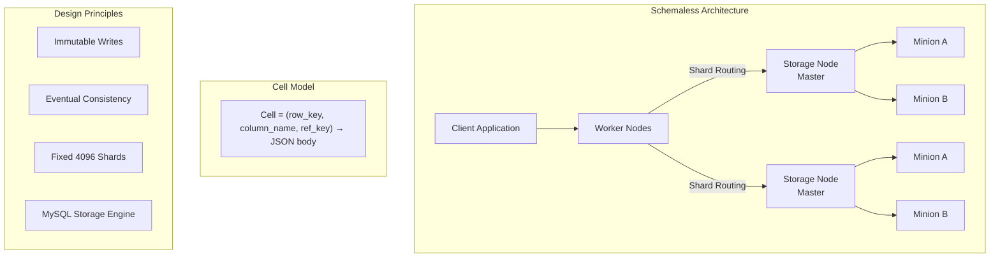
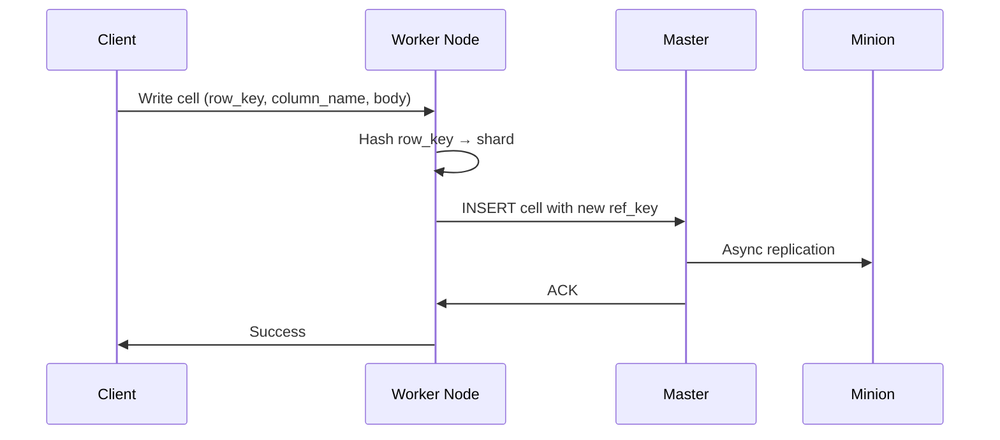
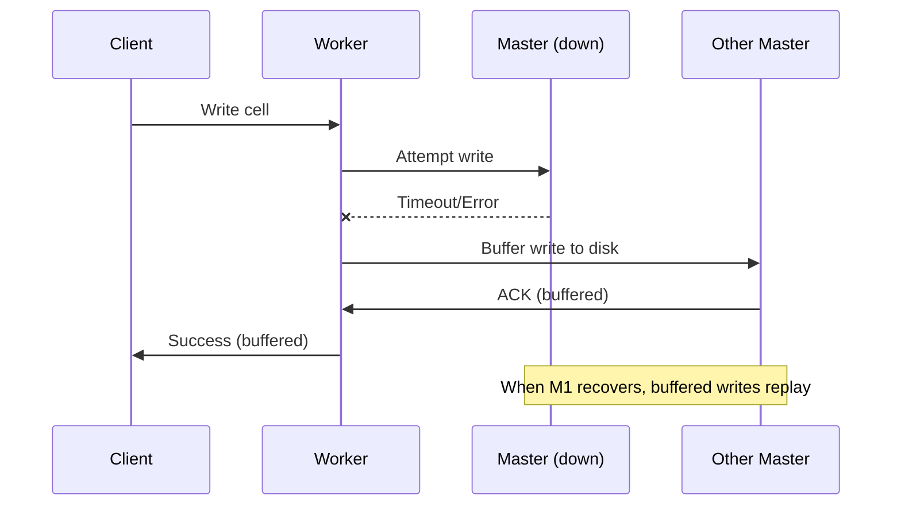
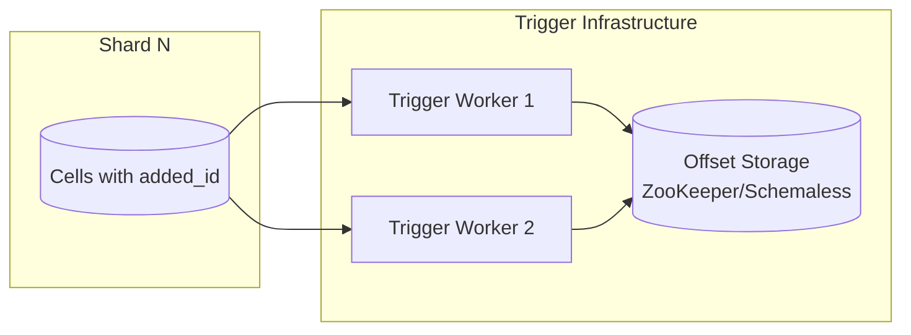
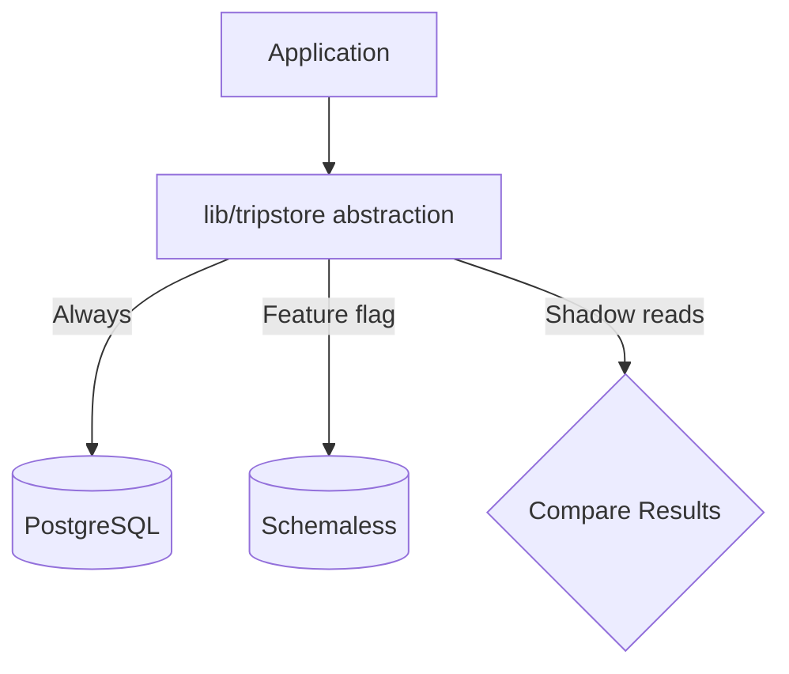

# Uber Schemaless: Building a Scalable Datastore on MySQL

In early 2014, Uber faced an infrastructure crisis: trip data growth was consuming database capacity so rapidly that their systems would fail by year's end without intervention. Rather than adopting an existing NoSQL solution, Uber built Schemaless—a thin, horizontally scalable layer on top of MySQL that prioritized operational simplicity over feature richness. This case study examines the architectural decisions that enabled Schemaless to scale from crisis point to billions of trips, the trade-offs inherent in its append-only cell model, and the design patterns that made MySQL work as a distributed datastore.

<figure>



<figcaption>Schemaless architecture: worker nodes route requests to sharded MySQL storage nodes. Each cell is immutable and versioned.</figcaption>
</figure>

## Abstract

**The core insight**: Instead of adopting Cassandra or building a custom distributed database, Uber layered a simple abstraction over MySQL. The key innovation was the **cell model**—an immutable, versioned data unit identified by `(row_key, column_name, ref_key)`. Writes append new versions rather than updating in place, making every operation idempotent and enabling simple replication.

**Why it worked**:

- **Operational familiarity**: Uber engineers knew MySQL. Cassandra and Riak offered linear scaling but lacked operational maturity at Uber's scale and the consistency guarantees needed for trip data.
- **Fixed sharding**: 4,096 shards mapped deterministically from row keys. No dynamic rebalancing complexity.
- **Buffered writes**: If a master fails, writes buffer to another master (hinted handoff). Write availability prioritized over immediate read consistency.
- **Triggers**: The append-only model created a natural change log, enabling event-driven architectures for billing, analytics, and cross-datacenter replication.

**The trade-off**: Eventual consistency, denormalized indexes, and application-level complexity in exchange for horizontal scalability and operational simplicity.

## Context

### The System

In early 2014, Uber's trip data infrastructure consisted of a single PostgreSQL instance. This was the largest percentage of storage, grew fastest, and contributed the most IOPS (Input/Output Operations Per Second) of any data type.

| Metric              | Value (Early 2014)         |
| ------------------- | -------------------------- |
| Annual trips        | 140 million                |
| Monthly growth rate | ~20%                       |
| Database            | Single PostgreSQL instance |
| Pain point          | Vertical scaling limit     |

### The Trigger

**Problem statement**: Growth would exhaust infrastructure by end of 2014 without intervention.

**Why PostgreSQL couldn't scale**:

- **Write amplification**: PostgreSQL's MVCC (Multi-Version Concurrency Control) stores the ctid (tuple ID) in every index. When a row updates, all indexes add new entries even if only one column changed. This caused excessive disk writes and storage costs.
- **Replication overhead**: WAL-based (Write-Ahead Log) replication logged all low-level changes, leading to high bandwidth usage for cross-datacenter replication.
- **Connection model**: Process-per-connection was less efficient than MySQL's thread-per-connection for high connection counts.

### Alternatives Evaluated

| Option              | Pros                                        | Cons                                                                                          | Outcome    |
| ------------------- | ------------------------------------------- | --------------------------------------------------------------------------------------------- | ---------- |
| **Cassandra**       | Linear scaling, tunable consistency         | Eventual consistency complicates index implementation; operational immaturity at Uber's scale | Rejected   |
| **Riak**            | Masterless, conflict resolution             | Similar consistency challenges; CRDT complexity                                               | Rejected   |
| **MongoDB**         | Document model, familiar query language     | Scaling concerns; consistency model issues for trip data                                      | Rejected   |
| **Custom on MySQL** | Operational familiarity, proven reliability | Build cost, no built-in distribution                                                          | **Chosen** |

**The deciding factors**: Uber engineers had confidence in operating MySQL. NoSQL systems offered features but lacked the operational maturity and consistency guarantees needed for critical trip data. Building a thin layer on MySQL let them leverage existing expertise.

### Design Inspirations

- **FriendFeed's schemaless approach**: Store JSON blobs with minimal schema constraints
- **Pinterest's operational principles**: Simple, sharded MySQL-based architecture
- **Google Bigtable**: Sparse, three-dimensional persistent hash map (row, column, timestamp)

## The Cell Model

### Core Data Structure

The fundamental unit is an immutable **cell**:

```
Cell = (row_key, column_name, ref_key) → JSON body
```

| Component     | Type    | Purpose                                       |
| ------------- | ------- | --------------------------------------------- |
| `row_key`     | UUID    | Primary identifier (e.g., trip_uuid)          |
| `column_name` | String  | Attribute category (e.g., "BASE", "FARE")     |
| `ref_key`     | Integer | Version number, monotonically increasing      |
| `body`        | JSON    | Arbitrary JSON payload, no schema enforcement |

**Example**: A trip's base data:

```json
{
  "row_key": "trip_uuid_abc123",
  "column_name": "BASE",
  "ref_key": 3,
  "body": {
    "driver_uuid": "driver_xyz",
    "rider_uuid": "rider_456",
    "status": "completed",
    "pickup_lat": 37.7749,
    "pickup_lng": -122.4194
  }
}
```

### Immutability and Versioning

**Key design decision**: Cells are never updated in place. To modify data, write a new cell with a higher `ref_key`.

**Why immutability**:

1. **Idempotent writes**: Retrying a write is always safe. If the network fails mid-write, retry without side effects.
2. **Built-in versioning**: Every write creates a change log entry. Full history is preserved.
3. **Simplified replication**: No conflict resolution needed—highest `ref_key` wins.
4. **Natural trigger support**: Triggers can track all mutations by scanning new ref_keys.

**Trade-off**: Storage growth. Old versions accumulate. Compaction strategies needed for long-lived entities.

### Reading and Writing Cells

**Write path**:

1. Client sends cell to worker node
2. Worker hashes `row_key` to determine shard (0-4095)
3. Worker routes to storage node master for that shard
4. Master writes to MySQL, replicates to minions asynchronously

**Read path**:

1. Client requests cell by `row_key` and `column_name`
2. Worker routes to storage node (default: master, configurable per request)
3. Storage node returns cell with highest `ref_key`



## Sharding Architecture

### Fixed Shard Count

Schemaless uses **4,096 fixed shards**. A cell maps to a shard based on its `row_key` hash:

```python
shard_id = hash(row_key) % 4096
```

**Why fixed shards**:

- **No rebalancing**: Adding capacity means moving entire shards, not rehashing data
- **Deterministic routing**: Any worker can compute the shard without coordination
- **Operational simplicity**: Fixed mapping simplifies debugging and operations

**Trade-off**: 4,096 is a hard limit on parallelism. For Uber's trip data, this was sufficient—each shard handles roughly 1/4096th of traffic.

### Storage Node Topology

Each shard runs on a **cluster** with one master and two minions:

```
Shard N:
  └── Master (writes, reads by default)
      ├── Minion A (async replica, DC 1)
      └── Minion B (async replica, DC 2)
```

**Master**: Receives all writes. Handles reads when strong consistency is needed.

**Minions**: Async replicas in different datacenters. Handle read traffic to reduce master load. Eventually consistent—lag is typically sub-20ms.

### MySQL as Storage

Each Schemaless shard is a separate MySQL database containing:

| Table               | Purpose                                                             |
| ------------------- | ------------------------------------------------------------------- |
| Entity table        | Stores cells with compound index on (row_key, column_name, ref_key) |
| Index tables        | One per secondary index, denormalized                               |
| Coordination tables | Trigger offsets, metadata                                           |

**Why MySQL worked**:

- B-tree index on `(row_key, column_name, ref_key)` enables efficient cell lookups
- InnoDB provides ACID within a shard
- Mature replication, backup, and operational tooling

**Later optimization**: Uber migrated from InnoDB to **MyRocks** (RocksDB-based storage engine) for improved compression and write performance.

## Worker and Storage Nodes

### Worker Node Responsibilities

Worker nodes are stateless HTTP servers that:

1. **Route requests**: Hash row_key → shard → storage node
2. **Aggregate results**: For queries spanning multiple shards, fan out and merge
3. **Implement circuit breakers**: Detect storage node failures, failover to replicas
4. **Buffer writes**: If master is down, persist writes to another master (hinted handoff)

**Scaling**: Worker nodes scale horizontally. Add more for capacity. By mid-2016, Uber ran several thousand worker nodes.

### Storage Node Responsibilities

Storage nodes are MySQL instances that:

1. **Store cells**: Primary data persistence
2. **Execute queries**: Cell lookups, index scans
3. **Replicate**: Master → minion async replication

**Scaling**: Add more shards (up to 4096) or increase hardware per shard. By mid-2016, Uber ran thousands of storage nodes across 40+ Schemaless instances.

### Fault Tolerance

**Worker node failure**: Other workers continue serving. Client load balancer routes around failure.

**Storage node master failure**:

1. Worker detects via circuit breaker
2. Writes buffer to another master (hinted handoff)
3. Reads failover to minion (eventually consistent)
4. Minion can be promoted to master

**Storage node minion failure**: No impact on writes. Reads failover to other replicas or master.

**Buffered writes (hinted handoff)**:



**Trade-off**: Buffered writes are not immediately readable. Client knows the master is down but cannot read the buffered data until recovery.

## Secondary Indexes

### Eventually Consistent Design

Secondary indexes are **not** updated in the same transaction as cell writes. This avoids two-phase commit overhead.

**Write flow**:

1. Cell written to entity table (ACK to client)
2. Trigger fires asynchronously
3. Index table updated with denormalized data

**Consistency guarantee**: Index lag is typically <20ms but not bounded. Applications must handle stale reads.

### Denormalized Index Structure

Indexes store denormalized data directly, enabling single-shard queries:

```
// Index: trips by driver
row_key: driver_uuid
column_name: "TRIP_INDEX"
body: {
  trip_uuid: "abc123",
  status: "completed",
  timestamp: 1609459200,
  // Frequently-queried fields denormalized here
}
```

**Query path**:

1. Query index by driver_uuid → get trip_uuids and denormalized data
2. If denormalized data is sufficient, return immediately
3. If full trip needed, fetch from entity table

**Why denormalization**: Avoids cross-shard joins. All data for an index query lives in one shard (the shard of the index row_key).

**Trade-off**: Storage duplication. Index updates lag entity writes. Application complexity in deciding what to denormalize.

## Trigger System

### Event-Driven Architecture

The append-only cell model creates a natural **change log**. Triggers subscribe to cell changes and execute application logic asynchronously.

```python
@trigger(column="BASE", table="trips")
def on_trip_update(cell):
    if cell.body.status == "completed":
        charge_rider(cell.row_key)
        notify_driver(cell.row_key)
```

### Trigger Architecture

**Implementation**:

1. Each shard maintains an auto-incrementing `added_id` for cells
2. Trigger workers track their offset (last processed `added_id`) per shard
3. Workers poll for cells with `added_id > offset`
4. Process cell, advance offset



**Delivery guarantee**: At-least-once. Triggers must be idempotent.

**Scaling**: Up to 4,096 trigger workers (one per shard). Workers can be added/removed without stopping processing.

### Use Cases

| Use Case             | Trigger Column              | Action                         |
| -------------------- | --------------------------- | ------------------------------ |
| Billing              | `BASE` (status = completed) | Charge rider                   |
| Analytics            | Any                         | Write to data warehouse        |
| Cross-DC replication | Any                         | Replicate to remote datacenter |
| Notifications        | `BASE`                      | Push to driver/rider           |

### Fault Tolerance

**Worker failure**: Leader redistributes shard assignments to remaining workers.

**Leader failure**: New leader elected. Processing continues without redistribution.

**Offset tracking**: Offsets persisted to ZooKeeper or Schemaless itself. On restart, resume from last committed offset.

## Migration: Project Mezzanine

### Dual-Write Strategy

Migration from PostgreSQL to Schemaless used a **dual-write pattern**:



1. **Phase 1**: All writes go to PostgreSQL. Shadow writes to Schemaless.
2. **Phase 2**: Shadow reads from Schemaless, compare with PostgreSQL results.
3. **Phase 3**: Primary reads from Schemaless, PostgreSQL as fallback.
4. **Phase 4**: Schemaless primary for reads and writes. PostgreSQL deprecated.

### Timeline

| Date             | Milestone                                                    |
| ---------------- | ------------------------------------------------------------ |
| Early 2014       | Crisis identified: growth would exhaust capacity by year end |
| ~5 months        | Schemaless design and implementation                         |
| 6 weeks          | Final intensive development sprint                           |
| Mid-October 2014 | Go-live ("a month before Halloween")                         |
| October 31, 2014 | Halloween (high-traffic day) - no incidents                  |

**Why "Mezzanine"**: The project codename referred to the trip datastore—Uber's first production Schemaless instance.

### Migration Safeguards

- **Abstraction layer**: `lib/tripstore` with feature flags for routing
- **Shadow verification**: All queries replayed to both systems, results compared
- **Gradual cutover**: Traffic shifted incrementally with rollback capability
- **Zero-downtime requirement**: No planned maintenance windows

## Outcome

### Scale Achieved

| Metric               | Value (2016)             |
| -------------------- | ------------------------ |
| Schemaless instances | 40+                      |
| Storage nodes        | Thousands                |
| Worker nodes         | Several thousand         |
| Trips milestone      | 2 billion (October 2016) |

### Performance Improvements

After rewriting the sharding layer from Python to Go ("Project Frontless", December 2016):

| Metric          | Improvement  |
| --------------- | ------------ |
| Median latency  | 85% decrease |
| P99 latency     | 70% decrease |
| CPU utilization | 85% decrease |

### Replication Performance

Multi-datacenter replication (Herb engine):

| Metric                 | Value                       |
| ---------------------- | --------------------------- |
| Replication throughput | 550-900 cells/second median |
| Replication latency    | 82-90 milliseconds          |

### Operational Benefits

- **Horizontal scaling**: Add shards/nodes without application changes
- **Operational familiarity**: MySQL tooling, monitoring, backup procedures
- **Fault isolation**: Shard failures don't cascade
- **Development velocity**: Teams work independently on different Schemaless instances

## Evolution to Docstore

### Why Schemaless Needed Replacement

By 2020, Schemaless limitations became friction:

| Limitation                    | Impact                                                          |
| ----------------------------- | --------------------------------------------------------------- |
| **Immutability constraint**   | Developer friction for general-purpose use cases                |
| **Eventual consistency only** | Complex application logic for consistency-sensitive workloads   |
| **No transactions**           | Multi-entity operations required application-level coordination |
| **Limited query capability**  | Cell-level lookups only; no complex queries                     |

### Docstore Architecture

Published February 2021, Docstore provides:

| Feature          | Schemaless      | Docstore                                 |
| ---------------- | --------------- | ---------------------------------------- |
| Data model       | Immutable cells | Mutable documents                        |
| Consistency      | Eventual        | **Strict serializability per partition** |
| Transactions     | None            | **Full transaction support**             |
| Schema           | Schemaless      | Schema with enforcement                  |
| Query capability | Cell lookups    | Rich query engine                        |

**Key innovation**: MySQL transactions replicated via Raft consensus. Users can imagine transactions execute sequentially within a partition.

**Docstore design goal**: "Provide the best of both worlds: schema flexibility of document models, and schema enforcement seen in traditional relational models."

## Lessons Learned

### Technical Lessons

#### 1. Operational Familiarity Trumps Features

**The insight**: Uber chose MySQL not because it was the best distributed database, but because engineers knew how to operate it. Cassandra's features were less valuable than MySQL's operational predictability.

**When this applies**:

- Team has deep expertise in a technology
- Production reliability matters more than feature richness
- Debugging and recovery procedures are well-established

**Warning signs you might need this**:

- Incidents caused by unfamiliar database behavior
- Operations team can't debug production issues
- Recovery procedures are undocumented

#### 2. Immutability Simplifies Distribution

**The insight**: By making cells immutable, Schemaless eliminated entire classes of problems: update conflicts, partial updates, consistency during replication. The trade-off—storage growth—was acceptable for trip data.

**When immutability works**:

- Event-like data (transactions, trips, logs)
- When full history has value
- When storage is cheaper than coordination complexity

**When it doesn't**:

- Frequently-updated entities
- Large objects with small updates
- When storage costs dominate

#### 3. Fixed Sharding Avoids Coordination

**The insight**: Dynamic resharding is complex. Fixed 4,096 shards meant no coordination for routing, no rebalancing during growth. The limit was acceptable for trip data volumes.

**Trade-off**: 4,096 is a hard scaling limit. Beyond this, each shard handles more load rather than spreading to more shards.

**When fixed shards work**:

- Predictable upper bound on data/traffic
- Operational simplicity matters
- Resharding complexity isn't worth the flexibility

#### 4. Triggers Enable Event-Driven Architecture

**The insight**: The append-only model created a natural change log. Triggers turned the database into an event source, enabling billing, analytics, and replication without additional infrastructure.

**Pattern**: If your writes are append-only, you already have event sourcing. Expose it.

### Process Lessons

#### 1. Build on What You Know Under Pressure

**The insight**: With a year to prevent infrastructure collapse, Uber chose to build on MySQL rather than learn a new system. This was the right trade-off for their timeline and risk profile.

**When to apply**:

- Tight timelines with high stakes
- Team has deep expertise in an alternative
- New technology would add operational risk

#### 2. Abstraction Layers Enable Safe Migration

**The insight**: `lib/tripstore` abstracted the storage layer, enabling dual-write, shadow verification, and gradual cutover. Without this abstraction, migration would have been riskier.

**Pattern**: Before migrating storage, introduce an abstraction layer. This adds short-term complexity but de-risks the migration.

## Applying This to Your System

### When Schemaless-Style Architecture Applies

You might benefit from this pattern if:

- [ ] Your data is event-like (trips, transactions, logs)
- [ ] You need horizontal write scaling beyond a single database
- [ ] Your team has MySQL/PostgreSQL expertise
- [ ] You can tolerate eventual consistency for secondary indexes
- [ ] Immutability makes sense for your data model

### When It Doesn't Apply

This pattern is wrong if:

- [ ] You need strong consistency across entities
- [ ] Your data requires frequent in-place updates
- [ ] You need complex queries (joins, aggregations)
- [ ] Storage costs are a primary concern
- [ ] Your team prefers managed services over operational control

### Starting Points

If exploring this architecture:

1. **Model your data as cells**: Can entities be decomposed into (key, column, version)?
2. **Prototype on single MySQL**: Implement cell model, indexes, triggers
3. **Add sharding layer**: Fixed hash-based routing to multiple databases
4. **Implement buffered writes**: Handle master failures gracefully
5. **Build trigger infrastructure**: Enable event-driven workflows

## Conclusion

Schemaless succeeded by being deliberately limited. Instead of building a feature-complete distributed database, Uber built a thin layer that solved their specific problem: horizontal scaling for trip data using technology they knew how to operate. The cell model's immutability traded storage efficiency for operational simplicity. Fixed sharding traded flexibility for predictability. Eventually consistent indexes traded correctness for scalability.

These trade-offs were right for trip data in 2014. They became limitations by 2020, leading to Docstore. The lesson isn't that Schemaless was the "right" architecture—it's that architecture choices are contextual. Uber's constraints (team expertise, timeline, data characteristics) led to different choices than a greenfield system might make today.

## Appendix

### Prerequisites

- Understanding of sharding and replication concepts
- Familiarity with MySQL/PostgreSQL operations
- Basic knowledge of eventual consistency trade-offs
- Understanding of event-driven architecture patterns

### Terminology

- **Cell**: Immutable data unit identified by (row_key, column_name, ref_key) with JSON body
- **Shard**: One of 4,096 fixed partitions; determined by hash(row_key)
- **Worker node**: Stateless routing layer between clients and storage
- **Storage node**: MySQL instance storing cells for a shard
- **Master/Minion**: Primary write server and async replicas
- **Hinted handoff**: Buffering writes to another master when target is unavailable
- **Trigger**: Async function invoked on cell changes

### Summary

- Uber built Schemaless in 2014 to escape single-PostgreSQL scaling limits
- Core innovation: immutable cells versioned by ref_key, stored in sharded MySQL
- Fixed 4,096 shards with deterministic routing eliminated resharding complexity
- Eventually consistent secondary indexes traded consistency for scalability
- Trigger system enabled event-driven billing, analytics, and replication
- Migration used dual-write with shadow verification for zero-downtime cutover
- Scaled to 40+ instances, thousands of nodes, billions of trips by 2016
- Evolved to Docstore by 2021 when strong consistency and transactions became priorities

### References

- [Designing Schemaless, Uber Engineering's Scalable Datastore Using MySQL](https://www.uber.com/blog/schemaless-part-one-mysql-datastore/) - Part 1: Core design and cell model
- [The Architecture of Schemaless, Uber Engineering's Trip Datastore Using MySQL](https://www.uber.com/blog/schemaless-part-two-architecture/) - Part 2: Worker/storage architecture
- [Using Triggers On Schemaless, Uber Engineering's Datastore Using MySQL](https://www.uber.com/blog/schemaless-part-three-datastore-triggers/) - Part 3: Trigger system
- [Project Mezzanine: The Great Migration](https://www.uber.com/blog/mezzanine-codebase-data-migration/) - Migration strategy and execution
- [Code Migration in Production: Rewriting the Sharding Layer of Uber's Schemaless Datastore](https://www.uber.com/blog/schemaless-rewrite/) - Python to Go rewrite (Project Frontless)
- [Evolving Schemaless into a Distributed SQL Database](https://www.uber.com/blog/schemaless-sql-database/) - Evolution to Docstore
- [Herb: Multi-DC Replication Engine for Uber's Schemaless Datastore](https://www.uber.com/blog/herb-datacenter-replication/) - Multi-datacenter replication
- [Why Uber Engineering Switched from Postgres to MySQL](https://www.uber.com/blog/postgres-to-mysql-migration/) - PostgreSQL limitations analysis
