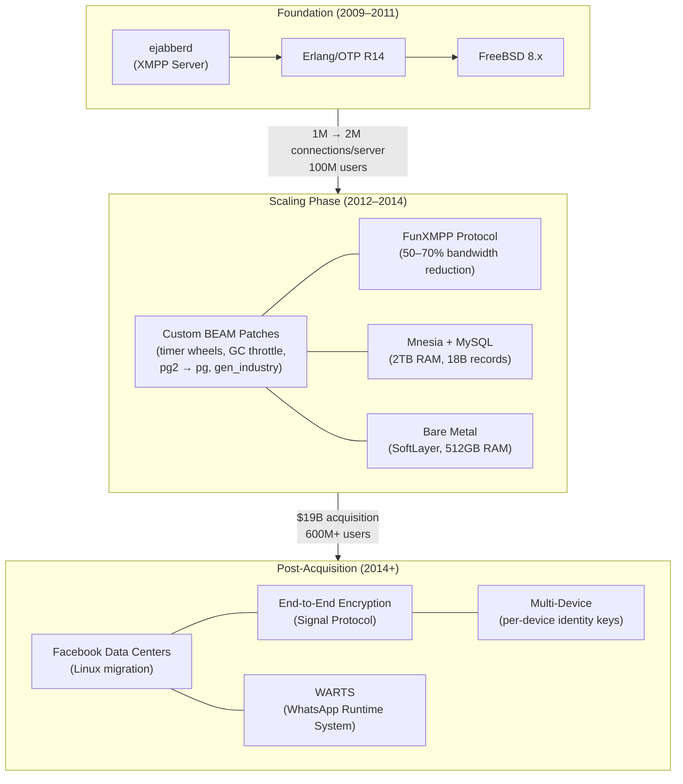

# WhatsApp: 2 Million Connections Per Server with Erlang

How WhatsApp scaled from zero to 1 billion users on Erlang/BEAM and FreeBSD — with fewer than 50 engineers, ~800 servers, and a custom protocol that compressed messages to 20 bytes — by pushing per-server density to limits most teams never attempt.

<figure>

<figcaption>WhatsApp's architecture evolution from an ejabberd fork to a custom Erlang runtime serving billions of users across Facebook data centers.</figcaption>
</figure>

## Abstract

WhatsApp's architecture is a case study in radical simplicity at extreme scale. The mental model:

- **One Erlang process per connection, one connection per user.** The BEAM VM's lightweight processes (~300 bytes each) and per-process garbage collection made 2 million concurrent connections per server viable on commodity hardware. This is the foundation everything else builds on.
- **Vertical density before horizontal sprawl.** WhatsApp pushed each server to 2+ million connections before adding servers. Operational complexity scales with node count, not core count — so fewer, larger machines reduce the surface area for failure.
- **Custom everything where it matters.** ejabberd was rewritten. XMPP was replaced with FunXMPP (50-70% bandwidth reduction). The BEAM VM itself was patched (timer wheels, GC throttling, pg2 replacement). Standard components were kept only when they didn't bottleneck.
- **Store-and-forward with aggressive deletion.** Messages are transient — deleted from servers after confirmed delivery. 98% cache hit rate; 50% of messages read within 60 seconds. The server is a router, not a database.
- **Small team, high autonomy.** 32 engineers served 450 million users at acquisition. Individual teams of 1-3 engineers owned entire subsystems. Erlang's fault tolerance and OTP supervision reduced operational burden to the point where this ratio was sustainable.

## Context

### The System

WhatsApp is a mobile messaging platform that handles text, photos, video, voice messages, voice calls, and video calls. Every message passes through WhatsApp's servers for routing and store-and-forward delivery, but messages are not retained after delivery confirmation.

**Tech stack at time of Facebook acquisition (February 2014):**

- **Language**: Erlang/OTP R16B01 (custom patched)
- **OS**: FreeBSD 9.2
- **Database**: Mnesia (in-memory, ~2TB across 16 partitions), MySQL (persistent user data)
- **Protocol**: FunXMPP (custom binary, evolved from XMPP)
- **Web server**: YAWS (Erlang-based, for multimedia)
- **Hosting**: SoftLayer bare metal, dual datacenter (California + Washington D.C.)

### The Trigger

WhatsApp launched in 2009 as a status-broadcasting app, pivoting to messaging within months. Growth was organic — no advertising, no marketing budget. The trigger for each scaling phase was raw user growth on a fixed, small engineering team:

**Key metrics at milestones:**

| Metric                 | Oct 2011 | Aug 2012 | Dec 2013 | Mar 2014 | Nov 2014 |
| ---------------------- | -------- | -------- | -------- | -------- | -------- |
| Monthly active users   | ~100M    | ~150M    | 400M     | 465M     | 600M+    |
| Messages/day           | 1B       | 10B      | 18B      | ~40B     | 50B+     |
| Total servers          | ~100     | ~200     | ~400     | ~550     | ~800     |
| Total CPU cores        | —        | —        | —        | 11,000+  | —        |
| Engineers              | ~20      | ~25      | ~30      | 32       | ~35      |
| Concurrent connections | —        | —        | —        | 140M     | —        |

### Constraints

- **Team size**: Founders deliberately kept the team small. Jan Koum's philosophy: "I want to do one thing and do it well."
- **Budget**: Pre-acquisition, WhatsApp was venture-funded. SoftLayer hosting cost approximately $2 million/month for 700+ servers.
- **Target devices**: Must work on low-end phones over 2G networks in developing markets — bandwidth and battery efficiency were non-negotiable.
- **Availability**: Global 24/7 service with no maintenance windows. Any downtime affected hundreds of millions of users.
- **Organizational**: Individual engineering teams of 1-3 engineers with high autonomy. No dedicated operations staff.

## The Starting Point: ejabberd and Erlang

### Why Erlang

WhatsApp's co-founders chose Erlang indirectly — they chose ejabberd, an open-source XMPP (Extensible Messaging and Presence Protocol) server written in Erlang. Eugene Fooksman, an early WhatsApp engineer, cited the reasons: "openness, great reviews by developers, ease of start and the promise of Erlang's long-term suitability for large communication system."

The choice proved prescient for reasons the team only fully appreciated later:

1. **Lightweight processes**: Each BEAM process costs ~300 bytes of initial overhead. A million connections require ~300MB of process memory — leaving the remaining 99+ GB of RAM for application state, message buffers, and caching.

2. **Per-process garbage collection**: Unlike JVM-based systems where GC pauses affect the entire runtime, BEAM collects garbage per-process. A single slow process doesn't stall two million others. This is the architectural property that made WhatsApp's per-server density possible.

3. **Preemptive scheduling**: BEAM's reduction-based scheduler preempts long-running processes after a fixed number of function calls (reductions). No single process can starve others — critical when one user sends a 10MB video while another sends a 1-byte acknowledgment.

4. **OTP supervision trees**: When a process crashes, its supervisor restarts it according to a defined strategy. WhatsApp relied on this for self-healing: individual connection handlers crash and restart without affecting other users.

5. **Hot code loading**: Erlang supports loading new code modules without stopping the running system. WhatsApp used this for bug fixes and updates without downtime — essential for a 24/7 global service where "maintenance windows" don't exist.

Rick Reed, who joined WhatsApp in 2011 after 12 years building high-performance messaging systems in C++ at Yahoo, described his initial reaction: Erlang achieved scalability goals on single hosts that his Yahoo team "only dreamed about." Anton Lavrik, lead of WhatsApp's Erlang platform team, put it more directly: with C++, "developers have to implement half of Erlang by themselves" to achieve similar reliability.

### Why FreeBSD

The founders had extensive FreeBSD experience from Yahoo, where it was the standard server OS. WhatsApp benchmarked FreeBSD against Linux under realistic messaging load — FreeBSD's networking stack handled their workload better.

**FreeBSD kernel tuning for 2+ million connections (from WhatsApp's 2012 blog post):**

| Parameter                  | Value     | Purpose                                      |
| -------------------------- | --------- | -------------------------------------------- |
| `kern.maxfiles`            | 3,000,000 | System-wide file descriptor limit            |
| `kern.maxfilesperproc`     | 2,700,000 | Per-process file descriptor limit            |
| `kern.ipc.maxsockets`      | 2,400,000 | Maximum socket count                         |
| `net.inet.tcp.tcbhashsize` | 524,288   | TCP hash table entries for connection lookup |

> **Post-acquisition**: WhatsApp migrated from FreeBSD on SoftLayer bare metal to Linux on Facebook's data center infrastructure between 2017 and 2019. This was an organizational decision — Facebook's container orchestration and monitoring tooling required Linux — not a technical judgment against FreeBSD.

### The ejabberd Rewrite

WhatsApp didn't just configure ejabberd — they spent years rewriting it. According to Fooksman, the team spent "the next few years re-writing and modifying quite a few parts of ejabberd," including:

- **Protocol replacement**: Switched from standard XMPP to a proprietary binary protocol (FunXMPP)
- **Codebase restructuring**: Redesigned core components for their specific access patterns
- **BEAM VM patches**: Modified the Erlang runtime itself to eliminate bottlenecks
- **Storage layer**: Replaced ejabberd's default storage with Mnesia-based and file system-based backends

By 2014, the codebase retained ejabberd's ancestry but bore little resemblance to the original.

## The 2 Million Connections Milestone

### Server Specifications (January 2012)

WhatsApp published detailed server specifications when they achieved 2+ million concurrent TCP connections on a single server:

| Component  | Specification                                  |
| ---------- | ---------------------------------------------- |
| **CPU**    | Intel Xeon X5675 @ 3.07GHz, 24 logical cores   |
| **RAM**    | 103 GB                                         |
| **OS**     | FreeBSD 8.2-STABLE (64-bit)                    |
| **Erlang** | R14B03, 24 SMP threads, kernel polling enabled |

**Peak observed load:** 2,277,845 open sockets at 37.9% user CPU, 13.6% system CPU, 41.9% idle. 35 GB active memory with 27 GB free. The server had significant headroom remaining.

### Why 2 Million Mattered

WhatsApp's approach to scaling was deliberately vertical-first. Rick Reed described this as a consequence of a key insight: operational complexity scales with the number of nodes, not the number of cores per node. A cluster of 100 servers at 2 million connections each is operationally simpler than 1,000 servers at 200,000 each — fewer failure domains, fewer network partitions, fewer inter-node messages.

The BEAM VM's SMP (Symmetric Multi-Processing) scalability made this viable. Doubling cores on a single machine nearly doubled throughput because BEAM schedulers map 1:1 to cores with minimal cross-scheduler contention. WhatsApp confirmed this with benchmark data showing near-linear scaling up to 24 cores.

> **By 2014, WhatsApp reduced the target to ~1 million connections per server.** This was deliberate — users were sending more messages, using more features (photos, video, voice), and each connection consumed more resources. The team chose headroom over density.

## BEAM VM Tuning and Custom Patches

WhatsApp didn't just use Erlang/OTP — they patched the runtime itself. Rick Reed detailed these modifications at Erlang Factory 2014. Several patches were later upstreamed to mainline OTP; others became obsolete as OTP evolved.

### Timer Wheel Contention

**Problem**: Erlang's timer system used a single timer wheel with a global lock. At millions of concurrent connections, each with keepalive timers and message timeouts, lock contention on the timer wheel became a CPU bottleneck.

**Fix**: WhatsApp implemented multiple timer wheels with independent locks, distributing timer operations across wheels to eliminate contention.

### Garbage Collection Throttling

**Problem**: When a process's message queue grows faster than it can process messages, Erlang's default behavior triggers GC on each message receive. With a queue of millions of messages (during traffic spikes), GC overhead dominates CPU time.

**Fix**: Added GC throttling when the message queue exceeds a threshold. The process defers GC until it can make progress on the queue, trading temporary memory growth for CPU availability.

### Distribution Buffer Sizing

**Problem**: The default inter-node distribution receive buffer was 4KB — far too small for WhatsApp's inter-cluster message volumes. Small buffers caused frequent blocking on inter-node communication.

**Fix**: Increased the default to 256KB and made it configurable.

### pg2 Replacement (The February 2014 Outage)

**Problem**: In February 2014 — days after the Facebook acquisition announcement — a backend router dropped a VLAN, causing mass node disconnects and reconnects across the cluster. The `pg2` module (Erlang's process group module) entered a state with **n^3 messaging behavior** during the reconnection storm. Message queues went from zero to 4 million within seconds. The outage lasted 2 hours and 10 minutes.

**Fix**: WhatsApp initially patched pg2 with denormalized group member lists, but eventually built an entirely new `pg` module from scratch. The new module was upstreamed to mainline Erlang/OTP, replacing pg2 entirely. This is one of the most significant contributions from WhatsApp back to the Erlang ecosystem.

### Mnesia Transaction Manager

**Problem**: Mnesia's `mnesia_tm` dispatched all `async_dirty` transactions through a single process, serializing operations that could safely run in parallel.

**Fix**: Dispatched async_dirty transactions to separate per-table processes, enabling concurrent record updates across different tables.

### ETS Hash Improvements

**Problem**: Erlang Term Storage (ETS) used `phash2` hashing that could produce collisions under WhatsApp's workload, and the main/name tables didn't scale well with thousands of ETS tables.

**Fix**: Modified hash seeding to avoid phash2 collisions, and improved table management scaling. The hash salt patch was contributed upstream via pull request #2979.

### Scheduler Binding

WhatsApp enabled scheduler binding to CPU cores via the `+stbt` flag, which pins each BEAM scheduler to a specific CPU core. Reed reported this reduced context switching by approximately 4x, providing a significant throughput improvement with a one-line configuration change.

## The gen_industry Dispatch Pattern

### The Bottleneck

Standard Erlang `gen_server` is single-threaded — one process handles all incoming messages sequentially. For high-throughput services processing millions of operations per second, a single dispatch process becomes a bottleneck.

WhatsApp built a three-tier dispatch hierarchy:

### gen_server → gen_factory → gen_industry

1. **gen_server**: Standard OTP behavior. Single process, sequential dispatch. Works for low-throughput services.

2. **gen_factory**: Custom behavior. A single dispatch process distributes work across multiple worker processes. Eliminates the processing bottleneck but the dispatch process itself can become saturated at high fan-in.

3. **gen_industry**: Custom behavior with **multiple dispatch processes** feeding multiple workers. Parallelizes both ingestion and dispatch. At extreme fan-in from many nodes, this was necessary to prevent the dispatch layer from becoming the bottleneck.

### Data Partitioning

WhatsApp's services partitioned data 2-32 ways (most services used 32-way partitioning):

1. Consistent hashing maps a record to a partition
2. Each partition maps to a Mnesia fragment
3. Each fragment maps to a factory worker process
4. All access to a single record routes to a single Erlang process

This design serializes access to individual records without transactions — the owning process is the lock. Maximum ~8 concurrent processes access any single ETS or Mnesia fragment, controlling lock contention at the storage layer.

## FunXMPP: The Custom Binary Protocol

### Why Replace XMPP

Standard XMPP is XML-based. A simple text message generates ~180 bytes of protocol overhead — XML open/close tags, namespace declarations, attributes. On 2G networks in developing markets, this overhead was unacceptable. WhatsApp needed a protocol optimized for resource-constrained mobile devices on slow, unreliable networks.

### How FunXMPP Works

FunXMPP replaced XML structure with binary encoding:

1. **Token replacement**: Reserved XMPP words (message, from, body, etc.) are replaced by single bytes. For example, "message" becomes `0x59`, "@s.whatsapp.net" becomes `0x91`.

2. **Structural compression**: Instead of XML opening/closing tags, a single byte (e.g., `0xF8`) indicates a structure. The parser counts items rather than matching tag names.

3. **Result**: A typical message shrinks from ~180 bytes to ~20 bytes — a 50-70% bandwidth reduction.

This made WhatsApp usable on feature phones over 2G connections where every byte mattered. The protocol efficiency was a direct contributor to WhatsApp's dominance in developing markets.

## Storage Architecture

### Mnesia: The In-Memory Layer

WhatsApp used Mnesia, Erlang's built-in distributed database, as its primary metadata store:

| Configuration      | Value                                                       |
| ------------------ | ----------------------------------------------------------- |
| **Total RAM**      | ~2TB across 16 partitions                                   |
| **Total records**  | ~18 billion                                                 |
| **Node topology**  | Island architecture: 2 nodes per island (primary/secondary) |
| **Account table**  | 512 fragments                                               |
| **Cache hit rate** | 98%                                                         |

**What Mnesia stored:**

- User-to-server routing tables (which server handles which user)
- Offline message queues (messages waiting for delivery)
- User profiles and group memberships
- Multimedia metadata

**What Mnesia did not store:**

- Message content (transient — deleted after delivery confirmation)
- Bulk media files (stored on filesystem)
- Persistent user data (MySQL shards)

### Mnesia Limitations and Workarounds

Mnesia has known scalability constraints:

- `ram_copies` and `disc_copies` tables require the full dataset in memory
- `disc_copies` tables read the entire table from disk into memory on node startup — slow for large tables
- `disc_only_copies` tables are limited to 2GB each (DETS limitation)

WhatsApp worked around these with:

- **Island architecture**: Each 2-node island manages a subset of data, keeping per-island datasets manageable
- **UFS2 filesystem on FreeBSD**: Bulk data storage outside Mnesia
- **MySQL shards**: Persistent user data that doesn't need Mnesia's in-memory speed
- **async_dirty transactions**: Avoids Mnesia's full transaction protocol (which couples nodes)
- **Library directory across multiple drives**: Increased I/O throughput for Mnesia's disk operations

### Store-and-Forward Message Flow

WhatsApp's message delivery follows a store-and-forward model optimized for speed:

1. **Recipient online, same cluster**: Direct Erlang process-to-process message delivery (sub-millisecond)
2. **Recipient online, different cluster**: Inter-cluster forwarding via distribution connections (sub-second)
3. **Recipient offline**: Message stored in Mnesia offline queue, replicated to backup node
4. **Recipient reconnects**: Queued messages delivered in order
5. **Delivery confirmed**: Message deleted from server

Messages are retained for up to 30 days if the recipient remains offline. Over 50% of messages are read within 60 seconds of storage, which explains the 98% cache hit rate — the working set is overwhelmingly recent messages.

### Asynchronous Optimization

WhatsApp's Erlang code favored asynchronous patterns to maximize throughput:

- **`handle_cast` over `handle_call`**: Fire-and-forget messages avoid blocking the sender
- **Timeouts instead of monitors**: Reduces the number of inter-process links and associated overhead
- **`nosuspend` on casts**: If the target process's mailbox is full, the send fails immediately rather than blocking
- **Large distribution buffers**: 256KB (up from 4KB default) absorbs network bursts without blocking sender processes
- **Separate inter-node message queues**: Isolated per destination node, preventing a slow remote node from blocking messages to healthy nodes

## Multimedia System

### Architecture

WhatsApp rebuilt its multimedia handling system in Erlang in 2012, replacing an earlier non-Erlang system. Rick Reed described this at Erlang Factory 2013.

The multimedia flow separates content from metadata:

1. Client uploads media to HTTP server (YAWS, Erlang-based) over a separate connection
2. HTTP server stores the file and returns a hash/unique ID
3. Sender transmits the hash to the recipient via the messaging server
4. Recipient downloads media from the HTTP server using the hash

This separation means the messaging server never handles large binary payloads — it only routes small metadata messages. Media servers scale independently of chat servers.

### Scale (Late 2014)

| Metric                  | Daily Volume | Peak (New Year's Eve 2014) |
| ----------------------- | ------------ | -------------------------- |
| Photos                  | 600 million  | 2 billion                  |
| Voice messages          | 200 million  | —                          |
| Videos                  | 100 million  | 360 million                |
| Peak outbound bandwidth | —            | 146 Gb/s                   |

By late 2014, WhatsApp operated approximately 350 dedicated multimedia (MMS) servers — nearly half the total server fleet — reflecting the growing dominance of media in messaging traffic.

## Multi-Cluster Architecture

### Pre-Acquisition Topology

WhatsApp ran dual datacenters on SoftLayer bare metal:

- **Main clusters**: Multiple clusters in each datacenter handling chat connections
- **MMS clusters**: Dedicated multimedia clusters in each datacenter
- **Shared global cluster**: Cross-datacenter shared state
- **wandist connections**: Inter-cluster distribution links

### Island Architecture

Backend nodes were organized into "islands" — small, redundant clusters:

- Each island manages a subset of data partitions
- 2+ nodes per island (primary and secondary)
- One-way replication: primary handles all reads/writes; secondary is passive failover
- Islands operate independently, isolating failures

This design meant a node failure affected only the users mapped to that island's partitions. The blast radius of any single failure was a fraction of the total user base.

### Post-Acquisition Evolution

After the Facebook acquisition, the architecture evolved significantly:

- **Data center migration (2017-2019)**: 3-year migration from SoftLayer to Facebook-owned data centers. Presented at CodeBEAM SF 2019 by Igors Istocniks. Migration proceeded per phone number prefix (country code): make the prefix read-only, accelerate database replay repairs, move traffic, reconcile — under 5 minutes per prefix.
- **OS migration**: FreeBSD to Linux (required by Facebook's container orchestration and monitoring infrastructure)
- **Scale expansion**: Backend split into 40+ distinct clusters by function, scaled to 40,000+ Erlang nodes
- **Over 1 billion concurrent connections** maintained across the expanded infrastructure

### WARTS: WhatsApp's Runtime System

Post-acquisition, WhatsApp formalized their custom Erlang/OTP fork as **WARTS (WhatsApp's Runtime System)**, open-sourced on GitHub. WARTS focuses on performance, security, and tooling enhancements for Linux, reflecting the post-migration environment.

## End-to-End Encryption and Multi-Device

### End-to-End Encryption (April 2016)

WhatsApp integrated the Signal Protocol for end-to-end encryption across all message types — text, photos, video, voice messages, voice calls, and video calls. After this change, WhatsApp's servers could no longer read message content.

The server architecture remained Erlang/BEAM-based. The encryption added computational overhead on the client side but did not fundamentally change the server's role as a message router and store-and-forward relay.

### Multi-Device Support (July 2021)

Multi-device support required architectural changes to the server:

- **Per-device identity keys**: Previously, each user had one identity key. Now each device gets its own.
- **Client-fanout**: Messages are encrypted N times for N devices, with the sender performing the encryption
- **Device mapping**: Server maintains an account-to-device-identity mapping
- **History sync**: Encrypted message bundles transferred during device linking
- **Voice/video calls**: Generate random 32-byte SRTP (Secure Real-time Transport Protocol) master secrets per device

## Options Considered

WhatsApp's key architectural decisions involved explicit trade-offs. Understanding what they considered — and rejected — reveals why the final architecture took its shape.

### Language Choice: Erlang vs Alternatives

#### Option 1: C++

**Approach**: Build a custom messaging server in C++, the standard choice for high-performance servers at the time (2009).

**Pros**:

- Maximum control over memory and CPU usage
- Mature networking libraries
- Founders had C++ experience (Yahoo)

**Cons**:

- "Developers have to implement half of Erlang by themselves" (Anton Lavrik) — supervision, hot code loading, per-connection isolation
- Manual memory management at scale of millions of connections is error-prone
- No built-in concurrency model matching one-process-per-connection

**Why not chosen**: The reliability and concurrency features that C++ developers must build from scratch are built into Erlang's runtime. At WhatsApp's team size, building these primitives was not feasible.

#### Option 2: Java/JVM

**Approach**: Use a JVM-based server framework.

**Pros**:

- Large ecosystem and talent pool
- Garbage collection handles memory management

**Cons**:

- JVM garbage collection is global — stop-the-world pauses affect all connections
- Per-connection memory overhead significantly higher than BEAM processes
- Thread-per-connection model doesn't scale to millions without complex async frameworks

**Why not chosen**: JVM's global GC was the dealbreaker. Discord's later experience with Cassandra's JVM GC pauses (covered in a separate case study) validates this concern.

#### Option 3: Erlang (Chosen)

**Why chosen**: ejabberd provided a working XMPP server to build upon, Erlang's concurrency model matched the problem (one process per connection), and the runtime's fault tolerance reduced operational burden for a tiny team.

### Scaling Strategy: Vertical-First vs Horizontal-First

#### Option: Horizontal-first (many small servers)

**Pros**: Simpler per-server capacity planning; commodity hardware
**Cons**: More nodes = more operational complexity, more network partitions, more inter-node coordination

#### Chosen: Vertical-first (fewer large servers)

**Why chosen**: Operational complexity scales with node count, not core count. BEAM's SMP scalability meant doubling cores nearly doubled throughput. 100 servers at 2M connections was operationally simpler than 1,000 servers at 200K.

### Architecture: Microservices vs Monolith

WhatsApp deliberately avoided the microservices pattern:

**Why not microservices**: At WhatsApp's team size (32 engineers), microservices would have added deployment complexity, inter-service latency, and operational overhead that a small team couldn't absorb. Erlang's process model already provides service isolation within a single BEAM node — each subsystem runs in its own supervision tree, crashes independently, and can be upgraded independently via hot code loading.

**Decision factor matrix:**

| Factor                                 | Erlang/ejabberd       | C++ Custom   | Java/JVM             | Microservices      |
| -------------------------------------- | --------------------- | ------------ | -------------------- | ------------------ |
| Time to working prototype              | Weeks                 | Months       | Months               | N/A                |
| Per-connection memory                  | ~300 bytes            | Variable     | ~KB range            | N/A                |
| GC impact on other connections         | None (per-process)    | N/A (manual) | Global STW pauses    | Varies             |
| Hot code reload                        | Built-in              | Not viable   | Possible (complex)   | Via rolling deploy |
| Fault isolation                        | Per-process           | Manual       | Per-thread (limited) | Per-service        |
| Operational complexity for 3 engineers | Low (OTP supervision) | Very High    | High                 | Very High          |

## Outcome

### Metrics at Key Milestones

| Metric                 | Early 2014 (Acquisition) | Late 2014 | 2016 | Current       |
| ---------------------- | ------------------------ | --------- | ---- | ------------- |
| Monthly active users   | 450M                     | 600M+     | 1B   | 3B+           |
| Messages/day           | ~40B                     | 50B+      | —    | 100B+         |
| Servers                | ~550                     | ~800      | —    | 40,000+ nodes |
| Engineers              | 32                       | ~35       | ~50  | 1,000+        |
| Concurrent connections | 140M                     | —         | —    | 1B+           |
| Users per engineer     | 14M                      | 17M       | 20M  | —             |

### Performance Numbers (2014)

| Metric                            | Value       |
| --------------------------------- | ----------- |
| Peak logins/second                | 230,000     |
| Peak inbound messages/second      | 342,000     |
| Peak outbound messages/second     | 712,000     |
| Erlang inter-node messages/second | 70+ million |
| Connections per second            | 440,000     |

### Cost Efficiency

Pre-acquisition, WhatsApp ran ~700 servers on SoftLayer at approximately $2 million/month. At 450 million MAU, this translates to approximately $0.004/user/month — orders of magnitude below competing platforms that required larger teams and more infrastructure.

### Timeline

| Date      | Event                                                      |
| --------- | ---------------------------------------------------------- |
| Feb 2009  | WhatsApp Inc. incorporated                                 |
| Aug 2009  | WhatsApp 2.0 launched (messaging pivot)                    |
| Jan 2011  | 1 million connections per server achieved                  |
| Jan 2012  | 2+ million connections per server ("1 million is so 2011") |
| Oct 2011  | 1 billion messages/day                                     |
| Aug 2012  | 10 billion messages/day                                    |
| Dec 2013  | 18 billion messages/day, 400M MAU                          |
| Feb 2014  | Facebook acquisition ($19B); pg2 outage                    |
| Mar 2014  | Rick Reed's "Billion with a B" talk; 465M MAU              |
| Nov 2014  | 600M+ MAU, 800 servers                                     |
| Feb 2016  | 1 billion MAU                                              |
| Apr 2016  | End-to-end encryption (Signal Protocol)                    |
| 2017-2019 | Data center migration (SoftLayer → Facebook DCs)           |
| Jul 2021  | Multi-device support                                       |
| 2024      | 3B+ MAU, 40,000+ Erlang nodes, 100B+ messages/day          |

## Lessons Learned

### Technical Lessons

#### 1. Per-Process GC Changes the Scaling Game

**The insight**: BEAM's per-process garbage collection is the single architectural property that enabled WhatsApp's per-server density. On a JVM, 2 million connections sharing a single heap would produce catastrophic GC pauses. On BEAM, each connection's GC is independent — a process handling a heavy media message doesn't stall two million idle connections.

**How it applies elsewhere**: When evaluating runtimes for high-connection-count workloads (WebSocket servers, IoT gateways, chat systems), the GC model matters more than raw throughput benchmarks. A runtime that's 2x slower per-request but has isolated GC may support 10x more connections.

**Warning signs you need isolated GC**:

- Latency spikes correlate with GC pauses, not load
- Tail latency (p99/p999) degrades non-linearly with connection count
- Adding connections degrades performance for existing connections

#### 2. Vertical Density Reduces Operational Complexity

**The insight**: WhatsApp pushed each server to its connection limit before adding servers. This kept the cluster small — 550 servers for 450 million users. Fewer servers meant fewer failure domains, fewer inter-node messages, fewer network partitions to handle, and fewer servers for a team of 32 to monitor.

**How it applies elsewhere**: Before horizontally scaling to more nodes, verify that each node is fully utilized. Modern hardware with 128+ cores and 512+ GB RAM can serve workloads that many teams distribute across dozens of smaller instances. The operational cost of each additional node (monitoring, failover, network configuration) is often underestimated.

**Warning signs you should scale vertically first**:

- Average CPU utilization per node is below 40%
- Most operational incidents involve inter-node communication, not node overload
- Your team size is small relative to node count

#### 3. Custom Protocols Unlock Markets

**The insight**: FunXMPP's 50-70% bandwidth reduction over standard XMPP wasn't a premature optimization — it was a market-access decision. WhatsApp dominated developing markets where 2G was prevalent and per-MB data costs were high. The protocol efficiency made the product viable where competitors couldn't operate.

**How it applies elsewhere**: Protocol efficiency matters when your target environment is resource-constrained. This applies to IoT devices, mobile apps in bandwidth-limited regions, and any system where per-message cost (bandwidth, battery, compute) directly affects user experience or viability.

#### 4. Erlang's "Let It Crash" Reduces Team Size Requirements

**The insight**: OTP supervision trees meant that individual connection crashes were automatically recovered without operator intervention. This is why 32 engineers could serve 450 million users without a dedicated operations team. The runtime handles the class of failures that would otherwise require human intervention.

**How it applies elsewhere**: Fault-tolerant runtimes reduce the human operational burden. If your team spends significant time on "restart the process" or "reconnect the client" remediation, evaluate whether your runtime's error recovery model is the bottleneck.

### Process Lessons

#### 1. Start with an Open-Source Base, Then Rewrite

**What they learned**: Starting with ejabberd gave WhatsApp a functional messaging server in weeks. Over years, they rewrote nearly every component. The initial choice provided time-to-market; the rewrites provided performance at scale.

**What they'd do differently**: The choice to start with ejabberd was vindicated. The key lesson is that the starting point doesn't constrain the end state — as long as the underlying runtime (Erlang/BEAM) is sound, everything above it can be replaced incrementally.

#### 2. Patch the Runtime When Necessary

**What they learned**: WhatsApp didn't treat Erlang/OTP as a black box. When the timer wheel, GC, or process group modules became bottlenecks, they patched the runtime. Several of these patches were upstreamed, benefiting the entire Erlang ecosystem.

**What it requires**: Deep understanding of the runtime internals. WhatsApp hired engineers (like Rick Reed) who could profile and modify the BEAM VM. This capability — reading and modifying your runtime's source code — is rare but transformative at extreme scale.

### Organizational Lessons

#### 1. Team Size as a Feature

**The insight**: WhatsApp's small team wasn't a constraint to overcome — it was a deliberate design choice that shaped the architecture. A 32-person team cannot operate microservices, maintain complex deployment pipelines, or staff a 24/7 operations center. So they chose Erlang (self-healing), monolithic deployment (one artifact), and vertical scaling (fewer nodes). Every architectural decision was filtered through "can 1-3 engineers own this?"

**How it applies elsewhere**: Team size should inform architecture, not the other way around. If your team is small, choose technologies and patterns that minimize operational surface area. The worst outcome is an architecture that requires more operators than you have.

#### 2. Focus Enables Density

**The insight**: WhatsApp did one thing — messaging. No news feed, no advertising engine, no recommendation system, no content moderation pipeline (pre-acquisition). This single-product focus meant every engineering hour went toward making messaging work better at scale.

## Applying This to Your System

### When This Pattern Applies

You might face similar challenges if:

- You're building a high-connection-count server (WebSocket, MQTT, chat, IoT gateway)
- Your connection count is growing faster than your team size
- You need predictable per-connection latency regardless of total connection count
- Your target environment includes resource-constrained clients (mobile, IoT, developing markets)

### Checklist for Evaluation

- [ ] Does your runtime support per-connection (per-process/per-goroutine/per-fiber) garbage collection?
- [ ] Is your per-connection memory overhead measured in bytes or kilobytes? (WhatsApp: ~300 bytes)
- [ ] Can your servers handle 10x more connections by scaling vertically before adding nodes?
- [ ] Can your current team size sustain the operational load of your current node count?
- [ ] Have you measured your protocol overhead vs. payload size for typical messages?

### Starting Points

1. **Measure per-connection overhead**: Profile your server's memory consumption per idle connection and per active connection. If idle connections cost >1KB each, investigate whether your runtime or framework adds unnecessary overhead.
2. **Profile GC impact on tail latency**: Compare p99 latency under GC pressure vs. without. If GC pauses dominate your tail latency, evaluate runtimes with per-unit-of-work GC (BEAM, Go's goroutine-aware GC).
3. **Audit operational complexity per node**: Count the hours your team spends on per-node operational tasks (monitoring, failover, upgrades). Multiply by node count. If this exceeds available engineering hours, consider larger nodes or simpler deployment.
4. **Prototype vertical limits**: Before adding nodes, push a single server to its limit in a load test. You may discover 5-10x headroom that eliminates the need for horizontal scaling — and the complexity it brings.

## Conclusion

WhatsApp's architecture is a study in what happens when a small team makes consistently correct bets on a runtime's fundamental properties. Erlang's per-process garbage collection, lightweight processes, and OTP supervision weren't just nice features — they were the architectural foundation that made 2 million connections per server, 450 million users with 32 engineers, and a $19 billion valuation possible.

The counterintuitive lesson is that WhatsApp's architecture was simple. No microservices. No container orchestration (pre-acquisition). No complex caching layers. One Erlang process per user, Mnesia for metadata, delete-after-delivery for messages, and a custom binary protocol for bandwidth efficiency. The complexity lived in the BEAM VM patches and the operational discipline of a small team — not in the system's architecture.

For engineers building high-connection systems today, WhatsApp's story suggests a specific investigation: before adding nodes, clusters, or architectural layers, check whether your runtime's concurrency model and GC strategy are the actual bottleneck. If they are, changing the runtime — as dramatic as that sounds — may be simpler than working around its limitations at scale.

## Appendix

### Prerequisites

- Familiarity with message broker concepts (store-and-forward, delivery guarantees)
- Basic understanding of Erlang/BEAM concurrency model (processes, message passing, supervision trees)
- Knowledge of XMPP protocol basics (stanzas, presence, roster)
- Understanding of vertical vs. horizontal scaling trade-offs

### Terminology

| Term             | Definition                                                                                                                                                               |
| ---------------- | ------------------------------------------------------------------------------------------------------------------------------------------------------------------------ |
| **BEAM**         | Bogdan/Björn's Erlang Abstract Machine — the virtual machine that executes Erlang and Elixir code. Provides preemptive scheduling, per-process GC, and hot code loading. |
| **OTP**          | Open Telecom Platform — Erlang's standard library of behaviors (gen_server, supervisor) and tools for building fault-tolerant systems.                                   |
| **ejabberd**     | Open-source XMPP server written in Erlang. WhatsApp's starting point, heavily rewritten over subsequent years.                                                           |
| **XMPP**         | Extensible Messaging and Presence Protocol — an open XML-based protocol for real-time messaging. WhatsApp's original protocol before switching to FunXMPP.               |
| **FunXMPP**      | WhatsApp's custom binary protocol evolved from XMPP, replacing XML structure with byte tokens for 50-70% bandwidth reduction.                                            |
| **Mnesia**       | Erlang's built-in distributed database supporting in-memory and disk-based tables. WhatsApp used it for routing tables, offline queues, and user metadata.               |
| **ETS**          | Erlang Term Storage — in-memory key-value tables accessible by multiple Erlang processes. Used for fast concurrent lookups within a single node.                         |
| **gen_server**   | Standard OTP behavior for implementing a server process that handles synchronous and asynchronous requests.                                                              |
| **gen_factory**  | WhatsApp's custom OTP behavior extending gen_server with worker pool dispatch for parallelized processing.                                                               |
| **gen_industry** | WhatsApp's custom OTP behavior with multiple dispatch processes feeding multiple workers, parallelizing both ingestion and processing.                                   |
| **SMP**          | Symmetric Multi-Processing — hardware architecture where multiple CPUs share memory. BEAM's SMP support maps one scheduler per core.                                     |
| **WARTS**        | WhatsApp's Runtime System — a custom fork of Erlang/OTP focused on performance, security, and tooling for Linux environments.                                            |
| **SRTP**         | Secure Real-time Transport Protocol — encryption protocol for voice and video calls, used by WhatsApp for end-to-end encrypted media streams.                            |
| **YAWS**         | Yet Another Web Server — Erlang-based HTTP server used by WhatsApp for multimedia upload/download handling.                                                              |
| **SoftLayer**    | IBM's bare-metal cloud hosting provider where WhatsApp ran pre-acquisition. Migrated to Facebook data centers 2017-2019.                                                 |

### Summary

- WhatsApp started from ejabberd (open-source XMPP/Erlang server) in 2009, spending years rewriting it into a custom messaging platform that served 450 million users with 32 engineers and ~550 servers at the time of Facebook's $19 billion acquisition
- BEAM's per-process garbage collection (~300 bytes per process) enabled 2+ million concurrent TCP connections per server — operational complexity scales with node count, not core count, so fewer large servers was deliberately chosen over many small ones
- WhatsApp patched the BEAM VM itself (timer wheels, GC throttling, distribution buffers, pg2 replacement, ETS hash improvements), with several patches upstreamed to mainline Erlang/OTP
- FunXMPP replaced XML-based XMPP with a binary protocol achieving 50-70% bandwidth reduction, making WhatsApp viable on 2G feature phones in developing markets
- Mnesia provided in-memory metadata storage (~2TB, 18 billion records, 98% cache hit rate) while messages were transient — deleted after delivery confirmation, with 50% read within 60 seconds
- Post-acquisition, WhatsApp migrated from FreeBSD/SoftLayer to Linux/Facebook data centers (2017-2019), scaled to 40,000+ Erlang nodes and 1 billion+ concurrent connections, and formalized their runtime fork as WARTS (WhatsApp's Runtime System)

### References

- [WhatsApp Blog: "1 million is so 2011"](https://blog.whatsapp.com/1-million-is-so-2011) — WhatsApp Engineering, January 2012. Server specs and 2M connection milestone.
- [Rick Reed: "That's 'Billion' with a 'B': Scaling to the Next Level at WhatsApp"](https://www.infoq.com/presentations/whatsapp-scalability/) — Erlang Factory SF 2014. BEAM patches, meta-clustering, data storage architecture.
- [Rick Reed: "WhatsApp: Half a Billion Unsuspecting FreeBSD Users"](https://www.slideshare.net/iXsystems/rick-reed-600-m-unsuspecting-freebsd-users) — MeetBSD California 2014. FreeBSD infrastructure at 600M+ users.
- [Eugene Fooksman Interview](https://pdincau.wordpress.com/2013/03/27/an-interview-with-eugene-fooksman-erlang/) — Paolo D'Incau, March 2013. Early architecture decisions and ejabberd origins.
- [Anton Lavrik Interview: 20 Years of Open Source Erlang](https://www.erlang-solutions.com/blog/20-years-of-open-source-erlang-openerlang-interview-with-anton-lavrik-from-whatsapp/) — Erlang Solutions. Erlang vs alternatives, developer tooling at scale.
- [How WhatsApp Grew to Nearly 500 Million Users, 11,000 Cores, and 70 Million Messages a Second](https://highscalability.com/how-whatsapp-grew-to-nearly-500-million-users-11000-cores-an/) — High Scalability, 2014. Detailed technical architecture summary from Reed's 2014 talk.
- [The WhatsApp Architecture Facebook Bought for $19 Billion](https://highscalability.com/the-whatsapp-architecture-facebook-bought-for-19-billion/) — High Scalability, 2014. Architecture overview at acquisition.
- [Igors Istocniks: "How WhatsApp Moved 1.5 Billion Users Across Data Centers"](https://codesync.global/media/how-whatsapp-oved-1-billion-users-across-data-centers/) — CodeBEAM SF 2019. Data center migration details.
- [Meta Engineering: Introducing Multi-Device for WhatsApp](https://engineering.fb.com/2021/07/14/security/whatsapp-multi-device/) — Meta Engineering Blog, July 2021. Multi-device architecture.
- [WhatsApp/WARTS on GitHub](https://github.com/WhatsApp/warts) — WhatsApp's Runtime System (custom Erlang/OTP fork).
- [Erlang Forums: Did the WhatsApp Patches Make It Into Mainstream Erlang?](https://erlangforums.com/t/did-the-whatsapp-patches-mentioned-in-a-2014-conference-make-it-into-mainstream-erlang/958) — Community discussion on upstream contributions.
- [Rick Reed: "Scaling to Millions of Simultaneous Connections"](http://www.erlang-factory.com/conference/SFBay2012/speakers/RickReed) — Erlang Factory SF 2012. Initial connection scaling work.
- [Rick Reed: "JPGs and 3GPs and AMRs Oh My!"](https://www.erlang-factory.com/conference/SFBay2013/speakers/RickReed) — Erlang Factory SF 2013. Erlang-based multimedia system rebuild.
