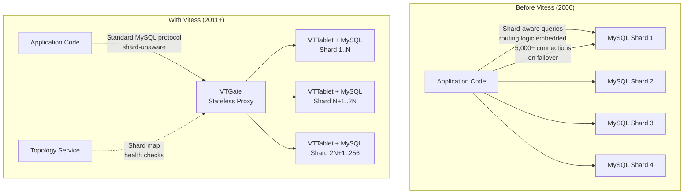
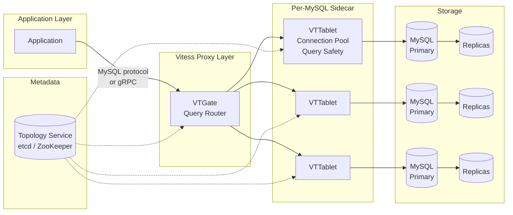

# YouTube: Scaling MySQL to Serve Billions with Vitess

How YouTube built Vitess to horizontally scale MySQL from 4 shards to 256 across tens of thousands of nodes, serving millions of queries per second without abandoning the relational model—and why they eventually migrated to Spanner anyway.

<figure>

<figcaption>YouTube's database architecture evolution: from application-level sharding with direct MySQL connections to Vitess's proxy-based middleware that abstracts sharding from applications.</figcaption>
</figure>

## Abstract

Vitess answers a question most teams face eventually: what happens when MySQL can't keep up, but migrating to a different database is more expensive than scaling the one you have?

- **The core insight**: Instead of replacing MySQL, insert a proxy layer (VTGate + VTTablet) that handles connection pooling, query routing, and shard management. Applications talk to Vitess as if it were a single MySQL instance. The proxy parses SQL—a foundational decision that enabled query rewriting, shard routing, and safety mechanisms impossible with a pass-through proxy.
- **Connection pooling came first**: YouTube's immediate crisis was 5,000 simultaneous connections crashing primaries on failover. VTTablet's connection pool was Vitess's first feature, keeping MySQL at optimal connection counts regardless of application-side traffic spikes.
- **Sharding evolved from vertical to horizontal**: YouTube split unrelated table groups (user data, video metadata, fraud tables) into separate databases first, then horizontally sharded individual tables using Vindexes—pluggable functions that map column values to shard locations.
- **Resharding without downtime**: VReplication copies data to new shards while replication keeps them in sync. Traffic switches atomically (seconds of write unavailability). YouTube grew from 4 shards to 256 through exponential splitting.
- **The trade-off**: Vitess sacrifices cross-shard transaction isolation, stored procedures, window functions, and foreign keys across shards. It optimizes for the 95% of queries that are single-shard lookups and index scans.

## Context

### The System

YouTube was acquired by Google in October 2006 for $1.65 billion. At the time, YouTube's backend ran on MySQL—a decision made by the original founding team and one that would persist for over a decade.

| Attribute          | Detail                                                                |
| ------------------ | --------------------------------------------------------------------- |
| **Database**       | MySQL (InnoDB)                                                        |
| **Sharding**       | 4 application-level shards at the time Vitess was conceived           |
| **Connections**    | ~5,000 simultaneous connections to each primary                       |
| **Replicas**       | 75 per primary at peak (later 80-100)                                 |
| **Data centers**   | 20 globally distributed cells                                         |
| **Write topology** | All writes concentrated in Mountain View; reads load-balanced locally |

### The Trigger

**Date**: Late 2006, approximately three years after Google's acquisition.

YouTube was experiencing exponential growth in outages. The team had already manually sharded to 4 databases, but outages were occurring multiple times per day. The pattern was consistent: a traffic spike or a failover event would cause all web servers to simultaneously reconnect to a new primary, overwhelming it with 5,000+ connections—causing the new primary to crash, triggering another failover, in a cascading loop.

Sugu Sougoumarane, who would co-create Vitess, described the situation: the team's tolerance for downtime was decreasing while the number of engineers writing database-affecting code was increasing. Iterative fixes were not keeping pace with the growing outage rate.

### Constraints

- **MySQL was non-negotiable**: YouTube's entire stack—schemas, queries, operational tooling—was built on MySQL. A migration to a different database would have been a multi-year effort affecting every team.
- **Google's infrastructure was MySQL-hostile**: Inside Google, Borg (the predecessor to Kubernetes) treated local disk as ephemeral. The well-supported storage options were Bigtable and Colossus. There was no first-class MySQL support—no mounted block storage, no official tooling.
- **Application code owned sharding logic**: Every query in the codebase knew which shard to target. The application determined read-replica routing and shard selection based on WHERE clauses. Cross-shard indexes were maintained manually.
- **Schema changes were dangerous**: Any DDL (Data Definition Language) operation on large tables risked locking the database and causing outages.

## The Problem

### Symptoms

The failure mode was a cascading connection storm:

1. A primary MySQL instance would degrade (slow queries, hardware issue, or planned maintenance)
2. The instance would be removed from serving, triggering failover to a replica
3. All ~5,000 web server connections would simultaneously open against the new primary
4. The new primary, already catching up on replication, couldn't handle the connection stampede
5. The new primary would crash or become unresponsive
6. Another failover would trigger, repeating the cycle

**Timeline of escalation:**

- **2006-2009**: Outages increase from occasional to multiple per day
- **Late 2006**: Sugu Sougoumarane and Mike Solomon begin cataloging every database problem YouTube faces
- **2010**: Vitess development begins with connection pooling as the first feature
- **2011**: Vitess becomes the core of YouTube's MySQL serving infrastructure

### Root Cause Analysis

**Investigation process:**

Solomon spent several days creating a spreadsheet documenting every database problem, current solutions, and ideal solutions. The analysis revealed that individual fixes (better monitoring, faster failover, query optimization) addressed symptoms but not the architectural flaw.

**The actual root cause:**

The problems were not MySQL's fault—they were management problems at scale:

1. **Unbounded connections**: Applications opened connections directly to MySQL. As the application fleet grew, connection counts grew proportionally with no ceiling.
2. **No query safety net**: Any developer could deploy a query without a LIMIT clause, a missing index scan, or a long-running transaction. There was no central point to enforce query discipline.
3. **Shard topology leaked into application code**: Every service needed to know the sharding layout, which shard held which data, and whether to read from primary or replica. This coupling made resharding a coordinated multi-team effort.
4. **No operational abstraction**: Failover, backup, schema changes, and shard management were all manual or semi-automated processes that required deep MySQL expertise.

### Why It Wasn't Obvious

The problems appeared to be independent: connection storms, slow queries, schema change outages, and resharding difficulty. The spreadsheet exercise revealed they all stemmed from the same missing layer—there was no intermediary between the application and MySQL that could enforce discipline, abstract topology, and manage connections centrally.

## Options Considered

### Option 1: Migrate to NoSQL (Cassandra, MongoDB, or Bigtable)

**Approach:** Abandon MySQL entirely and rewrite the data layer for a horizontally scalable NoSQL system.

**Pros:**

- Native horizontal scaling without middleware
- No sharding logic needed (built into the database)

**Cons:**

- Complete rewrite of all data access patterns
- Loss of ACID transactions, joins, and the relational model
- YouTube's schemas and queries were deeply relational
- Multi-year migration with high risk of data inconsistency

**Why not chosen:** The relational model was embedded in YouTube's DNA. Queries used joins, transactions, and complex WHERE clauses that NoSQL databases of 2010 couldn't efficiently support. The migration cost was prohibitive.

### Option 2: Migrate to Google Spanner or Megastore

**Approach:** Use Google's internally developed distributed databases, which offered strong consistency and horizontal scaling.

**Pros:**

- Global distribution with strong consistency
- Supported by Google's infrastructure team
- No operational burden on YouTube's team

**Cons:**

- Spanner was not yet production-ready in 2010 (the Spanner paper was published in 2012)
- Megastore had significant performance limitations for OLTP (Online Transaction Processing) workloads
- Migration from MySQL's schema and query patterns would still be extensive
- YouTube's query patterns didn't require global strong consistency for most data

**Why not chosen:** The timing didn't work. When Vitess development started in 2010, Spanner wasn't available. Megastore's performance characteristics didn't match YouTube's OLTP workload. Notably, Google later mandated migrating YouTube to Spanner around 2019—a policy decision as much as a technical one.

### Option 3: Modify MySQL Source Code

**Approach:** Fork MySQL and add sharding, connection pooling, and operational tooling directly into the database engine.

**Pros:**

- No proxy overhead
- Deepest possible integration

**Cons:**

- Maintaining a MySQL fork means tracking every upstream security patch and version upgrade
- Limited team with MySQL internals expertise
- Changes would be MySQL-version-specific

**Why not chosen:** The maintenance burden of a MySQL fork was unsustainable. Every MySQL upgrade would require re-merging custom changes. Security patches would be delayed while the team validated compatibility.

### Option 4: Build a Middleware Layer (Chosen)

**Approach:** Insert a proxy between applications and MySQL that handles connection pooling, query routing, shard management, and operational automation—without modifying MySQL itself.

**Pros:**

- MySQL remains unmodified (easy to upgrade, apply security patches)
- Applications can be migrated incrementally
- Operational tooling centralized in one system
- Open-sourceable (no proprietary MySQL changes)

**Cons:**

- Additional network hop adds latency
- Must build and maintain a SQL parser
- Some MySQL features become unavailable across shards (cross-shard joins, transactions)

**Why chosen:** This approach addressed all identified problems without requiring changes to MySQL or a full data layer rewrite. The proxy could be deployed incrementally, and every feature built for YouTube would work for any MySQL deployment.

### Decision Factors

| Factor                | NoSQL Migration     | Spanner/Megastore   | MySQL Fork                  | Middleware (Vitess)           |
| --------------------- | ------------------- | ------------------- | --------------------------- | ----------------------------- |
| Migration effort      | Years, full rewrite | Years, full rewrite | Months, ongoing maintenance | Incremental                   |
| MySQL compatibility   | None                | None                | Full (but fragile)          | High (with known limitations) |
| Operational risk      | High                | Medium              | Medium                      | Low (incremental rollout)     |
| Long-term maintenance | Low                 | Low                 | Very high                   | Medium                        |
| Team expertise        | New skills needed   | New skills needed   | Deep MySQL internals        | MySQL + middleware            |

## Implementation

### The Foundational Decision: Building a SQL Parser

The single most important architectural decision was building a full SQL parser in Go. Sugu Sougoumarane called this "the most difficult decision" and "the one decision that has definitely paid off."

**Why it mattered:** A pass-through proxy can pool connections and route based on database names, but it can't:

- Rewrite queries (adding LIMIT clauses, injecting shard-targeting hints)
- Analyze query plans to determine which shards need the query
- Deduplicate identical concurrent queries
- Enforce query safety rules (blocking unbounded scans)
- Support transparent resharding (the proxy must understand WHERE clauses to route correctly)

Building the parser transformed Vitess from a connection pooler into a distributed database system.

### Architecture: Three Core Components

<figure>

<figcaption>Vitess's three-tier architecture: VTGate routes queries, VTTablet manages per-MySQL connections and safety, and the Topology Service provides shard metadata.</figcaption>
</figure>

#### VTGate: The Stateless Query Router

VTGate is the entry point for all application queries. It speaks both the MySQL wire protocol and gRPC, so applications can connect to it as if it were a standard MySQL server.

**Responsibilities:**

- **Query parsing and routing**: Analyzes SQL to determine which shards contain the relevant data using Vindex lookups
- **Scatter-gather execution**: For queries spanning multiple shards, VTGate sends queries in parallel and merges results
- **Result aggregation**: Handles ORDER BY, GROUP BY, and LIMIT across shards at the proxy level
- **Transaction coordination**: Routes multi-statement transactions and coordinates two-phase commits when needed

VTGate is stateless—it can be horizontally scaled behind a load balancer. If one VTGate instance fails, clients reconnect to another with no state loss. At YouTube, VTGate handled 90% of query traffic statelessly.

#### VTTablet: The Per-MySQL Sidecar

Every MySQL instance has a VTTablet process running alongside it. VTTablet was the first component built, solving the immediate connection pooling crisis.

**Responsibilities:**

- **Connection pooling**: Maintains a fixed pool of connections to MySQL, preventing the unbounded connection growth that caused cascading failures. The pool implementation uses lock-free algorithms with atomic operations and non-blocking data structures.
- **Query safety**: Automatically adds LIMIT clauses to unbounded queries (default: 10,001 rows, returning an error if exceeded rather than silently truncating). Kills queries exceeding configurable time limits (default: 30 seconds).
- **Query deduplication**: When identical queries execute simultaneously, VTTablet holds subsequent queries until the first completes and shares the result. At YouTube, a user with 250,000 uploaded videos would trigger expensive count queries on every page view—deduplication collapsed these into a single query.
- **Row-level caching**: Uses an optional memcached-backed cache for individual rows by primary key, with real-time invalidation via MySQL's replication stream.
- **Query blacklisting**: Operators can block specific query patterns (by fingerprint) without application deployment.

#### Topology Service: The Metadata Store

The Topology Service stores the mapping of keyspaces to shards to tablets. It uses a pluggable backend—YouTube used an internal system, but open-source deployments typically use etcd, ZooKeeper, or Consul.

**Stored data:**

| Data                       | Purpose                                                |
| -------------------------- | ------------------------------------------------------ |
| Keyspace definitions       | Which logical databases exist                          |
| Shard ranges               | Which key ranges map to which shards                   |
| Tablet types and locations | Primary, replica, read-only replica per shard per cell |
| VSchema                    | Vindex definitions and routing rules                   |

VTGate caches topology data locally and refreshes periodically, avoiding the topology service from becoming a bottleneck.

### Sharding Design: Vindexes

YouTube's sharding evolved through two phases:

**Phase 1: Vertical sharding.** Unrelated table groups were separated into distinct keyspaces (logical databases). User data, video metadata, and fraud detection tables each got their own keyspace. This provided immediate relief but has a practical ceiling—Sugu noted you can typically do 4-5 vertical splits before running out of table groups to separate.

**Phase 2: Horizontal sharding with Vindexes.** Tables within a keyspace were split across shards based on a sharding key.

A Vindex (Virtual Index) is a pluggable function that maps a column value to a keyspace ID, which in turn determines the target shard. Vitess supports several Vindex types:

| Vindex Type             | Mechanism                                               | Use Case                                      | Cost     |
| ----------------------- | ------------------------------------------------------- | --------------------------------------------- | -------- |
| **Hash**                | Deterministic hash of column value                      | Even distribution, point lookups              | 1        |
| **Identity**            | Column value used directly as keyspace ID               | Pre-hashed data                               | 0        |
| **Lookup (Unique)**     | Persistent backing table mapping values to keyspace IDs | Secondary index on non-sharding column        | 10       |
| **Lookup (Non-unique)** | Same, but one-to-many mapping                           | Search by non-unique attributes               | 20       |
| **Custom**              | User-provided function                                  | Vendor-based routing, geographic partitioning | Variable |

The cost values determine query planning priority—VTGate uses the applicable Vindex with the lowest cost for routing.

**Critical design constraint**: Horizontal sharding requires converting many-to-many relationships into one-to-one or one-to-many hierarchies. Cross-shard relationships must be maintained through asynchronous consistency—lookup Vindexes that are updated during writes.

### Resharding: Growing from 4 to 256 Shards

YouTube grew from 4 shards to 256 through exponential splitting, each split doubling capacity. The resharding workflow uses VReplication:

1. **Create target shards**: New empty MySQL instances are provisioned
2. **Start VReplication streams**: VReplication copies all data from source shards to target shards using a "pull" model—target tablets subscribe to source change events
3. **Catch up**: Once the bulk copy completes, VReplication enters streaming mode, applying ongoing changes to keep targets in sync
4. **Verify**: VDiff compares source and target data for consistency
5. **Switch traffic**: SwitchTraffic first stops writes on source primaries, waits for replication to catch up (typically seconds), then atomically updates the topology to route all traffic to the new shards
6. **Cleanup**: Old shards and replication artifacts are removed

The write unavailability during the cutover step is typically a few seconds. At 256 shards, Sugu believed they might never need to reshard again—each subsequent split doubles capacity exponentially.

### Running on Borg: Cloud-Native Before Cloud-Native

In 2013, Google mandated that YouTube move all data into Google's internal infrastructure (Borg). This constraint inadvertently made Vitess cloud-native:

- **Ephemeral local disk**: Borg treated local storage as temporary. Vitess had to handle MySQL running on storage that could disappear.
- **Semi-synchronous replication**: To ensure durability despite ephemeral storage, Vitess configured MySQL so primaries only acknowledge commits after at least one replica has received the transaction in its relay log. This guaranteed that data survived even if the primary's disk was reclaimed.
- **Automated failover**: With ephemeral infrastructure, node loss was routine. Vitess automated the entire reparenting process:
  - **PlannedReparentShard**: For scheduled maintenance—gracefully transitions the primary role to a chosen replica
  - **EmergencyReparentShard**: For unplanned failures—promotes the most advanced replica based on GTID (Global Transaction Identifier) position

This Borg experience directly translated to Kubernetes compatibility when Vitess was open-sourced. The assumption that infrastructure is ephemeral—the core tenet of cloud-native design—was baked in from 2013.

### Language Choice: Go

Vitess was written in Go starting in 2010, before Go 1.0 was released. Sugu described the decision as trusting the language's creators—Rob Pike, Russ Cox, Ken Thompson, and Robert Griesemer—and called it "one of the best decisions we have ever made."

Go's goroutines and channels mapped naturally to Vitess's concurrency model: handling thousands of simultaneous database connections, parallel query execution across shards, and streaming replication events.

### VReplication: The Underlying Primitive

VReplication is a change-data-capture (CDC) system built into Vitess. Sugu called it "one of the best technologies we ever built in Vitess." It subscribes to MySQL's binary log events and materializes tables in different forms elsewhere.

**Uses:**

- **Resharding**: Copies and streams data during shard splits
- **Online DDL**: Creates a shadow table with the new schema, uses VReplication to populate it, then atomically switches. This replaced the need for external tools like gh-ost or pt-online-schema-change, though Vitess also supports those.
- **Materialized views**: Creates denormalized copies of data in other keyspaces
- **Cross-cluster replication**: Feeds data to analytics systems or disaster recovery clusters

VReplication provides INSERT, UPDATE, and DELETE events via the VStream API, eliminating the need for separate ETL tooling for change data capture.

## Outcome

### Scale Achieved

| Metric                          | Value                                                 |
| ------------------------------- | ----------------------------------------------------- |
| **Peak QPS**                    | Tens of millions (50M+ reported by secondary sources) |
| **MySQL instances**             | 10,000+ across 20+ cells                              |
| **Maximum shards per keyspace** | 256                                                   |
| **Replicas per primary**        | 75 (up to 80-100)                                     |
| **Active serving period**       | 2011-2019 (all YouTube database traffic)              |
| **Users served**                | 2.49 billion monthly active users                     |
| **Uptime**                      | 99.99%                                                |

### Operational Improvements

| Area                      | Before Vitess                             | After Vitess                                            |
| ------------------------- | ----------------------------------------- | ------------------------------------------------------- |
| **Connection management** | Unbounded, cascading failures             | Fixed pool, graceful degradation                        |
| **Query safety**          | No enforcement, developer discipline only | Automatic LIMIT injection, query killing, blacklisting  |
| **Schema changes**        | Dangerous, locking, outage-prone          | Online DDL via VReplication or gh-ost                   |
| **Resharding**            | Manual, multi-team coordinated effort     | Automated, zero-downtime VReplication workflow          |
| **Failover**              | Semi-manual, error-prone                  | Automated PlannedReparentShard / EmergencyReparentShard |
| **Shard topology**        | Embedded in application code              | Abstracted behind VTGate                                |

### The Spanner Migration

Between 2011 and 2019, Vitess served all YouTube database traffic. Around 2019, YouTube began migrating to Google Cloud Spanner. The drivers were both technical and organizational:

**Technical factors:**

- Spanner offered global strong consistency without the CAP-theorem trade-offs inherent in MySQL replication
- Cross-shard transactions in Vitess lacked isolation guarantees (concurrent reads could observe partial commits)
- Spanner eliminated the operational overhead of managing MySQL replication topology

**Organizational factors:**

- Google policy was to standardize on Spanner across the organization. As one insider noted, this was "not a technical decision" but a corporate standardization choice.

This migration validates a key lesson: Vitess was the right solution for 2010-2019, buying YouTube nearly a decade of MySQL scaling while Spanner matured. The middleware approach is inherently a bridge—it extends MySQL's useful life but doesn't eliminate its fundamental limitations around distributed transactions and global consistency.

### Industry Adoption

After YouTube, Vitess was adopted by companies facing similar scaling challenges:

| Company          | Scale                                             | Use Case                                                                                |
| ---------------- | ------------------------------------------------- | --------------------------------------------------------------------------------------- |
| **Slack**        | 2.3M QPS at peak, 3-year migration (2017-2020)    | Replaced workspace-based sharding; resharded by channel ID for better load distribution |
| **GitHub**       | Maintains a public Vitess fork (github/vitess-gh) | MySQL horizontal partitioning                                                           |
| **HubSpot**      | 400 to 700 MySQL clusters, 3-5 person team        | Provisioning reduced from days to minutes; failover in seconds                          |
| **JD.com**       | 30M QPS during peak sales (reported)              | E-commerce transaction data in containerized environments                               |
| **Square/Block** | 16+ shards                                        | Cash App financial transactions                                                         |
| **Shopify**      | Multi-terabyte, billions of rows                  | Shop app horizontal scaling; schema migrations reduced from weeks to hours              |

Vitess graduated as a CNCF (Cloud Native Computing Foundation) project in November 2019—the eighth project to graduate after Kubernetes, Prometheus, Envoy, CoreDNS, containerd, Fluentd, and Jaeger. PlanetScale, founded in 2018 by Vitess co-creators Sugu Sougoumarane and Jiten Vaidya, commercialized Vitess as a managed database service.

## Lessons Learned

### Technical Lessons

#### 1. Build the Parser

**The insight:** The decision to build a SQL parser—rather than a simpler pass-through proxy—transformed Vitess from a connection pooler into a distributed database. Every subsequent feature (query rewriting, shard routing, safety enforcement, online DDL) depended on the ability to parse and analyze SQL.

**How it applies elsewhere:** When building middleware between applications and databases, invest in understanding the protocol deeply. A semantic understanding of the traffic flowing through your proxy unlocks capabilities that pass-through approaches cannot achieve.

**Warning signs to watch for:** If your database proxy is growing features that require understanding query semantics (routing by table, rate limiting by query type, query rewriting), and you don't have a parser, you're accumulating technical debt.

#### 2. Connection Pooling Is Not Optional at Scale

**The insight:** MySQL's connection model (one thread per connection, significant per-connection memory overhead) makes unbounded connections a reliability risk. VTTablet's lock-free connection pool was the first Vitess feature because cascading connection storms were the most immediate threat.

**How it applies elsewhere:** Any system with a connection-per-request model will eventually hit a ceiling. The answer isn't "just add more connections"—it's centralizing connection management in a pool with a hard ceiling. MySQL's SSL handshake can add up to 50ms per connection, making connection reuse critical for latency-sensitive workloads.

**Warning signs to watch for:** If your database connection count correlates linearly with your application fleet size, you will eventually hit the database's connection limit during a traffic spike or failover event.

#### 3. Middleware Buys Time, Not Eternity

**The insight:** Vitess gave YouTube nearly a decade of MySQL scaling (2011-2019). But the fundamental limitations of MySQL-with-middleware—no cross-shard transaction isolation, no global strong consistency, operational complexity of managing replication—remained. YouTube eventually migrated to Spanner when it matured.

**How it applies elsewhere:** If you're evaluating Vitess or similar middleware, understand that it extends your current database's useful life but doesn't eliminate its architectural constraints. Plan for the eventual migration—the middleware phase should be buying time while you evaluate and prepare for the next platform, not avoiding the decision indefinitely.

#### 4. Decouple Shard Topology from Application Code

**The insight:** Before Vitess, YouTube's application code knew the sharding layout—which shard held which data, how to route reads vs. writes. This coupling made resharding a multi-team coordination effort. Moving this knowledge into the proxy allowed resharding without application changes.

**How it applies elsewhere:** Any time infrastructure topology leaks into application code, you create an n-team coordination problem for infrastructure changes. Abstractions that hide topology (service meshes, database proxies, message broker abstractions) pay for themselves in operational agility.

### Process Lessons

#### 1. The Spreadsheet That Changed Everything

**What they did:** Before writing code, Solomon spent days creating a comprehensive spreadsheet of every database problem, every existing workaround, and what an ideal solution would look like. This systematic analysis revealed that seemingly independent problems shared a root cause.

**What they'd do differently:** Start with this analysis earlier. YouTube spent years fighting individual symptoms before the spreadsheet exercise revealed the systemic issue.

#### 2. Open-Source from the Start

**What they did:** Vitess was designed as open source from inception. Every feature YouTube needed had to be implemented generically—no YouTube-specific assumptions baked in.

**The payoff:** This constraint forced cleaner abstractions. When Vitess was open-sourced (2012 on code.google.com, later GitHub), it was immediately usable by other organizations. This decision also led to PlanetScale and a sustainable commercial ecosystem around the project.

### Organizational Lessons

#### 1. Corporate Standardization Can Override Technical Fit

YouTube's migration from Vitess to Spanner was partly driven by Google's policy to standardize on Spanner—not purely by technical limitations of Vitess. This is a common pattern in large organizations: the "best" technology for a team may lose to the "standard" technology for the organization.

**Implication:** When building systems, consider both technical fit and organizational trajectory. If your organization is converging on a standard data platform, building extensive middleware for an alternative may create technical debt that accelerates rather than defers migration.

## Applying This to Your System

### When This Pattern Applies

You might benefit from a Vitess-like approach if:

- Your MySQL database is approaching single-instance limits (connections, storage, or QPS)
- Your application code contains shard-routing logic
- Schema changes are risky, slow, or require downtime
- Failover is manual or error-prone
- You need horizontal scaling but can't afford a full database migration

### When This Pattern Does Not Apply

Vitess is the wrong choice if:

- Your workload requires frequent cross-shard transactions with isolation guarantees
- You rely heavily on stored procedures, window functions, or foreign keys across tables
- Your dataset fits comfortably on a single MySQL instance (premature sharding adds complexity without benefit)
- You need HTAP (Hybrid Transactional/Analytical Processing)—Vitess is optimized for OLTP

### Checklist for Evaluation

- [ ] Are you hitting MySQL connection limits during traffic spikes or failovers?
- [ ] Is your application code aware of your database's sharding topology?
- [ ] Do schema changes require downtime or multi-day coordination?
- [ ] Are you running manual or semi-automated failover processes?
- [ ] Do you have at least 3-5 engineers who can dedicate time to Vitess operations (or budget for a managed service)?
- [ ] Can your data model be restructured to minimize cross-shard queries?

### Starting Points

If you want to explore Vitess:

1. **Start with connection pooling**: Deploy VTTablet in front of an unsharded MySQL instance. This provides immediate value (connection management, query safety) without any sharding complexity.
2. **Vertical sharding next**: Separate unrelated table groups into distinct keyspaces. This doesn't require changing your data model.
3. **Horizontal sharding when needed**: Only shard tables that have outgrown a single instance. Define Vindexes based on your most common query patterns.
4. **Consider managed options**: PlanetScale and other providers operate Vitess as a service, eliminating the operational overhead that consumes 3-10 engineers for self-managed deployments.

## Conclusion

Vitess represents a pragmatic engineering philosophy: rather than rebuilding from scratch, extend what works. YouTube took a database (MySQL) that was well-understood, well-tested, and deeply embedded in their stack, and built a middleware layer that addressed its scaling limitations without abandoning its strengths.

The architectural bet—building a full SQL parser in a proxy layer—was the critical decision. It transformed a connection pooler into a distributed database that served 2.49 billion users across tens of thousands of MySQL instances for nearly a decade.

But Vitess also illustrates the limits of the middleware approach. Cross-shard transaction isolation, global strong consistency, and the operational complexity of managing MySQL replication topology at scale are fundamental constraints that a proxy layer cannot fully resolve. YouTube's eventual migration to Spanner confirms that middleware extends, but does not eliminate, the need for purpose-built distributed databases at global scale.

For the majority of organizations—those that need horizontal MySQL scaling but operate at less than YouTube's 50M QPS—Vitess remains one of the most battle-tested solutions available. The key is understanding what it optimizes (single-shard OLTP, operational automation, transparent resharding) and what it sacrifices (cross-shard isolation, full MySQL feature compatibility).

## Appendix

### Prerequisites

- MySQL replication concepts (primary-replica, GTID, semi-synchronous replication)
- Horizontal sharding fundamentals (consistent hashing, key-range partitioning)
- Basic understanding of connection pooling and database proxy patterns

### Terminology

| Term                 | Definition                                                                                                  |
| -------------------- | ----------------------------------------------------------------------------------------------------------- |
| **Keyspace**         | A logical database in Vitess, equivalent to a MySQL database but potentially spanning multiple shards       |
| **Vindex**           | Virtual Index—a pluggable function mapping column values to keyspace IDs for shard routing                  |
| **VTGate**           | Stateless proxy that routes queries to the correct shards                                                   |
| **VTTablet**         | Per-MySQL sidecar handling connection pooling, query safety, and replication management                     |
| **VReplication**     | Vitess's built-in change-data-capture system used for resharding, online DDL, and data materialization      |
| **Reparenting**      | Promoting a replica to primary, either planned (PlannedReparentShard) or emergency (EmergencyReparentShard) |
| **Topology Service** | Distributed metadata store (etcd, ZooKeeper, or Consul) holding shard maps and tablet information           |
| **Keyspace ID**      | A computed value that determines which shard a row belongs to                                               |

### Summary

- YouTube built Vitess starting in 2010 to address cascading connection storms and operational fragility in their MySQL infrastructure, which had been manually sharded to 4 databases
- The foundational decision was building a full SQL parser, which enabled query routing, safety enforcement, deduplication, and transparent resharding—transforming a connection pooler into a distributed database
- VTTablet's connection pool was the first feature, solving the immediate crisis of 5,000 simultaneous connections crashing primaries on failover
- YouTube scaled from 4 shards to 256, with 75+ replicas per primary across 20 data centers, serving tens of millions of QPS
- Vitess served all YouTube database traffic from 2011 to 2019 before YouTube migrated to Google Spanner, driven by both technical needs (global consistency) and organizational standardization
- The project graduated from CNCF in November 2019 and is now used by Slack, GitHub, HubSpot, JD.com, Square, and Shopify, among others

### References

- [Vitess: Scaling MySQL at YouTube Using Go - USENIX LISA '12](https://www.usenix.org/conference/lisa12/vitess-scaling-mysql-youtube-using-go) - Sugu Sougoumarane and Mike Solomon's original presentation (December 2012)
- [Vitess Official Documentation - History](https://vitess.io/docs/22.0/overview/history/) - Project timeline and milestones
- [SE Radio 560: Sugu Sougoumarane on Distributed SQL with Vitess](https://se-radio.net/2023/04/se-radio-560-sugu-sougoumarane-on-distributed-sql-with-vitess/) - Detailed interview covering architecture, design decisions, and YouTube scale numbers
- [Percona Live Talk: Vitess: The Complete Story](https://vitess.io/blog/2016-03-10-percona-live-featured-talk-with-sugu-sougoumarane-vitess-the-complete-story/) - Sugu Sougoumarane's comprehensive talk on Vitess origins and naming
- [The Changelog #485: The Story of Vitess](https://changelog.com/podcast/485) - Deepthi Sigireddi on Vitess history and architecture
- [Software at Scale 29: Sugu Sougoumarane, CTO PlanetScale](https://www.softwareatscale.dev/p/software-at-scale-29-sugu-sougoumarane) - Origin story, naming, YouTube scale details
- [CNCF Vitess Graduation Announcement](https://www.cncf.io/announcements/2019/11/05/cloud-native-computing-foundation-announces-vitess-graduation/) - Graduation details and adopter list
- [CNCF Vitess Project Journey Report](https://www.cncf.io/reports/vitess-project-journey-report/) - Contributor and adoption metrics
- [Scaling Datastores at Slack with Vitess](https://slack.engineering/scaling-datastores-at-slack-with-vitess/) - Slack's 3-year migration case study
- [Vitess Connection Pooling Blog](https://vitess.io/blog/2023-03-27-connection-pooling-in-vitess/) - Connection pooling technical details
- [Vitess Distributed Transactions](https://vitess.io/blog/2016-06-07-distributed-transactions-in-vitess/) - 2PC implementation and trade-offs
- [Vitess MySQL Compatibility](https://vitess.io/docs/22.0/reference/compatibility/mysql-compatibility/) - Complete list of supported and unsupported MySQL features
- [Vitess Vindexes Documentation](https://vitess.io/docs/22.0/reference/features/vindexes/) - Vindex types, cost model, and configuration
- [PlanetScale: One Million QPS with MySQL](https://planetscale.com/blog/one-million-queries-per-second-with-mysql) - Benchmark demonstrating linear scaling with shard count
- [They Scaled YouTube—Now They'll Shard Everyone with PlanetScale (TechCrunch)](https://techcrunch.com/2018/12/13/planetscale/) - PlanetScale founding and Vitess commercialization
- [Kubernetes Podcast Episode 81: Vitess](https://kubernetespodcast.com/episode/081-vitess/) - Jiten Vaidya and Sugu Sougoumarane on Vitess and PlanetScale
