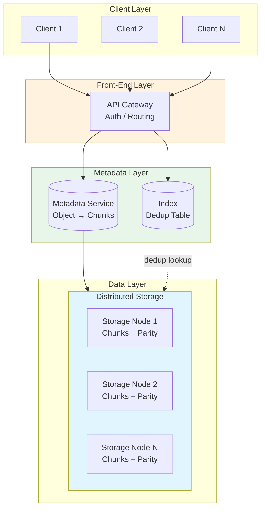
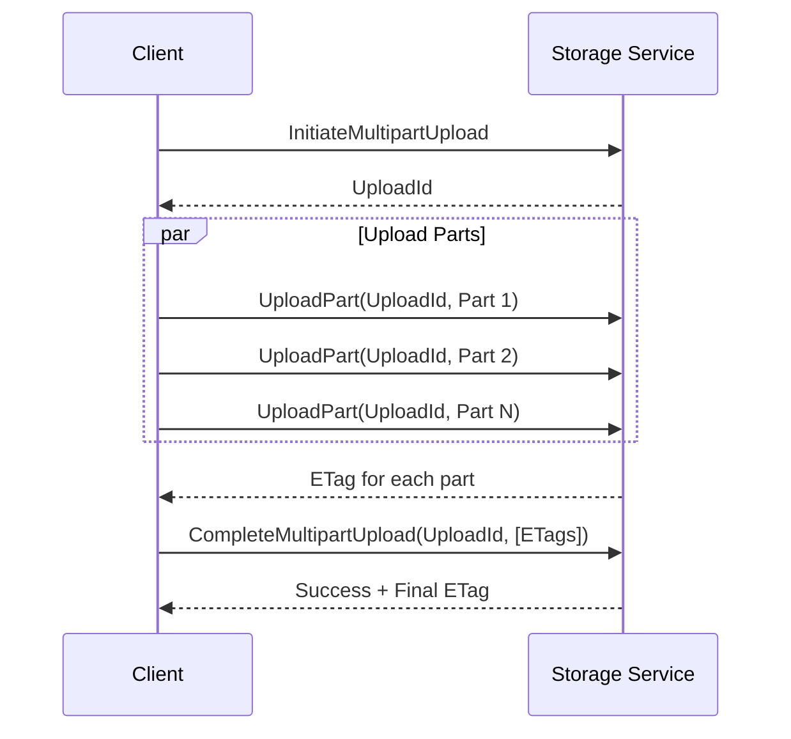

# Blob Storage Design

Designing scalable object storage systems requires understanding the fundamental trade-offs between storage efficiency, durability, and access performance. This article covers the core building blocks—chunking, deduplication, metadata management, redundancy, and tiered storage—with design reasoning for each architectural choice.

<figure>



<figcaption>Blob storage architecture: clients interact through an API gateway; metadata and deduplication index are managed separately from the data layer, which uses erasure coding across distributed storage nodes.</figcaption>
</figure>

## Abstract

Blob storage trades complexity for scale by treating large files as collections of immutable chunks. The core design decisions are:

- **Chunking**: Fixed-size (simple, fast) vs. content-defined (CDC, better deduplication)—determines deduplication effectiveness and CPU overhead
- **Deduplication**: File-level (low overhead, coarse) vs. block-level (high dedup ratio, memory-intensive)—determines storage efficiency and index memory requirements
- **Metadata separation**: Decoupling metadata from data enables independent scaling—metadata needs high IOPS, data needs high throughput
- **Redundancy**: 3-way replication (3× overhead, simple) vs. erasure coding (1.2-1.5× overhead, CPU cost)—determines storage cost and repair bandwidth
- **Tiering**: Hot/warm/cold/archive tiers optimize cost for access patterns—determines retrieval latency and storage cost

The fundamental trade-off: **storage overhead vs. durability vs. access latency**. Higher durability requires more redundancy (storage cost). Faster access requires keeping data on high-performance media (cost). Design for the access pattern—most data is write-once, read-rarely.

## Object Storage Fundamentals

### Object vs. Block vs. File Storage

| Characteristic   | Object Storage                         | Block Storage                     | File Storage                           |
| ---------------- | -------------------------------------- | --------------------------------- | -------------------------------------- |
| **Data model**   | Objects (key → binary data + metadata) | Fixed-size blocks with unique IDs | Hierarchical files and directories     |
| **Access**       | REST API (HTTP)                        | iSCSI / Fibre Channel             | NFS / SMB                              |
| **Namespace**    | Flat (bucket + key)                    | Volume + block address            | Directory tree                         |
| **Best for**     | Unstructured data, backups, media      | Databases, VMs, transactional     | Shared filesystems, content management |
| **Latency**      | Milliseconds                           | Sub-millisecond                   | Milliseconds                           |
| **Scalability**  | Exabytes                               | Petabytes                         | Petabytes                              |
| **Modification** | Replace entire object                  | In-place block update             | In-place file update                   |

**Design reasoning:** Object storage chose a flat namespace and immutable objects specifically to simplify distribution. Without directory hierarchies, there's no need to maintain tree consistency across nodes. Without in-place updates, writes are append-only—eliminating write conflicts and enabling aggressive caching.

### The Object Model

An object consists of:

1. **Key**: Unique identifier within a bucket (e.g., `photos/2024/vacation.jpg`)
2. **Data**: Binary content (bytes to terabytes)
3. **Metadata**: System metadata (size, ETag, timestamps) + custom key-value pairs
4. **Version ID**: Optional, for versioned buckets

**Flat namespace illusion:** Keys like `photos/2024/vacation.jpg` are not directory paths—they're opaque strings. The `/` delimiter is a convention; listing operations with `prefix=photos/` and `delimiter=/` simulate directory listing, but no directory structure exists.

**Bucket model:** Buckets provide namespace isolation and policy boundaries (access control, lifecycle rules, versioning). A single storage system may support trillions of objects across millions of buckets.

**Real-world scale:** AWS S3 stores 500+ trillion objects across hundreds of exabytes, serving 200 million requests/second at peak.

## Chunking Strategies

### Design Choices

#### Fixed-Size Chunking

**How it works:** Split files into equal-sized chunks at fixed byte boundaries. Each chunk assigned a content hash (SHA-256) as its identifier.

**Best when:**

- Simple implementation required
- File modifications are rare (write-once workloads)
- CPU overhead must be minimized
- Sequential access patterns dominate

**Trade-offs:**

- ✅ Deterministic boundaries—identical files produce identical chunks
- ✅ Low CPU overhead (no content analysis)
- ✅ Predictable chunk counts for capacity planning
- ❌ Poor deduplication on modified files (insertion shifts all subsequent boundaries)
- ❌ Chunk size forces trade-off between metadata overhead and dedup granularity

**Real-world example:** GFS used 64 MB chunks. This large size reduces metadata overhead (64 bytes per 64 MB chunk) and client-master interactions. The trade-off: 64 MB is too large for small files, leading to internal fragmentation.

**Chunk size trade-offs:**

| Chunk Size   | Metadata Overhead | Dedup Potential | Network Efficiency                | Use Case        |
| ------------ | ----------------- | --------------- | --------------------------------- | --------------- |
| 4 KB         | Very high         | Maximum         | Poor (high overhead per transfer) | Databases       |
| 64 KB - 1 MB | Moderate          | High            | Good                              | General purpose |
| 4-8 MB       | Low               | Moderate        | Optimal for large files           | Backups, media  |
| 64 MB        | Very low          | Low             | Best throughput                   | Analytics, logs |

#### Content-Defined Chunking (CDC)

**How it works:** Use a rolling hash function to identify chunk boundaries based on content patterns. When the hash matches a predefined pattern (e.g., low N bits are zero), declare a chunk boundary.

**Best when:**

- Deduplication is critical (backup systems, versioned storage)
- Files are frequently modified
- Storage cost savings justify CPU overhead
- Similar files are stored (code repositories, documents)

**Trade-offs:**

- ✅ Insertions/deletions only affect neighboring chunks (boundaries shift minimally)
- ✅ 10× better deduplication than fixed-size on modified files
- ✅ Natural chunk size distribution matches content structure
- ❌ Higher CPU overhead (rolling hash computation)
- ❌ Variable chunk sizes complicate capacity planning
- ❌ More complex implementation

**CDC Algorithms:**

| Algorithm            | Speed     | Dedup Ratio | Implementation               |
| -------------------- | --------- | ----------- | ---------------------------- |
| Rabin Fingerprinting | Baseline  | Best        | Polynomial division, complex |
| Gear-based           | 2× Rabin  | Near-Rabin  | Bit operations, simpler      |
| FastCDC              | 10× Rabin | Near-Rabin  | Optimized hash judgment      |

**FastCDC innovations (USENIX ATC 2016):**

1. **Simplified hash judgment:** Faster pattern matching than Rabin
2. **Skip minimum chunk boundaries:** Avoid tiny chunks (minimum size enforced)
3. **Normalized chunk distribution:** Avoid extreme sizes (target average with bounds)

Result: 10× faster than Rabin-based CDC with near-identical deduplication ratios.

**Real-world example:** Dropbox evolved from 4 MB fixed chunks to CDC for better deduplication. When users edit a document, only changed sections create new chunks—reducing upload bandwidth and storage consumption.

### Chunk Size Selection

**Network considerations:**

- TCP buffer sizes range 4 KB to 4 MB (Linux default: 85 KB)
- Below 4 KB: Minimal benefit from smaller chunks
- 4-8 MB: Optimal for keeping network buffers utilized

**Storage considerations:**

- IDE drives: Optimal bandwidth at 4 MB chunks
- SCSI/SAS drives: Optimal at 8 MB chunks
- NVMe: Smaller chunks viable (low random read penalty)

**IOPS vs. throughput trade-off:**

- Larger chunks: Higher throughput, fewer IOPS, higher per-operation latency
- Smaller chunks: Lower throughput, more IOPS, lower per-operation latency

**Recommendation:** 4-8 MB for general blob storage, 64-128 KB for dedup-heavy workloads, 64 MB for append-only analytics data.

## Deduplication

### Design Choices

#### File-Level Deduplication

**How it works:** Hash the entire file. If hash matches existing file, store only a reference. No new data written.

**Best when:**

- Identical file copies are common (email attachments, shared documents)
- Memory is constrained (index size = O(file count))
- Processing overhead must be minimal

**Trade-offs:**

- ✅ Low memory footprint (one entry per file)
- ✅ Simple implementation
- ✅ Fast (single hash per file)
- ❌ Cannot deduplicate within files
- ❌ Any modification creates a new file (no dedup benefit)
- ❌ Coarse granularity limits savings

#### Block-Level Deduplication

**How it works:** Hash each chunk. If chunk hash matches existing chunk, store only a reference. Different files can share common chunks.

**Best when:**

- Similar files are stored (VMs, containers, backups)
- Maximizing deduplication ratio is critical
- Memory/storage for dedup index is available
- Content-defined chunking is used

**Trade-offs:**

- ✅ Maximum deduplication (sub-file granularity)
- ✅ Handles partial file changes well
- ✅ Cross-file deduplication
- ❌ High memory requirements (one entry per chunk)
- ❌ More complex reference management
- ❌ Higher CPU overhead

**Memory requirements comparison:**

For 1 PB data with 8 KB average chunks:

- Block-level: ~125 billion chunks × 48 bytes/entry ≈ 6 TB index
- File-level (1 KB avg file): ~1 trillion files × 48 bytes/entry ≈ 48 TB index
- File-level (1 MB avg file): ~1 billion files × 48 bytes/entry ≈ 48 GB index

Block-level wins when chunk count < file count (large files), loses when files are small.

#### Inline vs. Post-Process Deduplication

**Inline deduplication:**

- Check for duplicates during write
- Prevents redundant data from ever being stored
- Higher write latency (hash + lookup on hot path)
- Immediate storage savings

**Post-process deduplication:**

- Write data immediately, deduplicate later
- Lower write latency
- Temporary storage overhead
- Background processing load

**Design reasoning:** High-throughput ingestion systems prefer post-process (minimize write latency). Storage-constrained systems prefer inline (maximize savings immediately).

### Deduplication Index Design

**Challenge:** The dedup index must be fast (in-memory for inline) but stores billions of entries.

**Bloom filter optimization:**

Bloom filters are space-efficient probabilistic structures that answer "is this chunk possibly new?" with:

- False positives: May incorrectly indicate "exists" → unnecessary disk lookup
- False negatives: Never → guarantees new chunks are detected

**Index tiering:**

1. **Hot index (RAM):** Recently accessed/written chunks
2. **Warm index (SSD):** Less frequent chunks
3. **Cold index (HDD):** Archival lookup

Bloom filter in RAM filters 99%+ of lookups before hitting disk.

**Real-world:** ZFS uses 256-bit cryptographic checksums as block signatures. The pool-wide Deduplication Table (DDT) maps checksums to block locations. When a block's checksum matches an existing entry, ZFS increments the reference count and skips the write.

## Metadata Management

### Why Separate Metadata?

Data and metadata have fundamentally different access patterns:

| Characteristic         | Metadata                 | Data                         |
| ---------------------- | ------------------------ | ---------------------------- |
| **Access pattern**     | Random, high IOPS        | Sequential, high throughput  |
| **Size per operation** | Bytes to kilobytes       | Kilobytes to megabytes       |
| **Consistency**        | Strong (must be correct) | Eventually consistent (okay) |
| **Update frequency**   | High (listings, stats)   | Low (write-once)             |
| **Scaling dimension**  | IOPS                     | Bandwidth                    |

Separating them enables independent optimization and scaling.

### Architecture Patterns

#### Single Metadata Master (GFS Model)

**How it works:** One master node holds entire namespace in memory. Clients contact master for metadata, then access data nodes directly.

**GFS specifications:**

- Entire namespace in RAM (compact representation)
- 64 bytes metadata per 64 MB chunk → 4 GB RAM supports petabytes
- Two persistence files: FsImage (checkpoint) + EditLog (journal)
- On startup: merge FsImage + EditLog to reconstruct state

**Trade-offs:**

- ✅ Simple consistency (single source of truth)
- ✅ Fast lookups (in-memory)
- ✅ Low operational complexity
- ❌ Single point of failure (mitigated by shadow masters)
- ❌ Memory-bound scaling limit
- ❌ Master becomes bottleneck at extreme scale

**Limitation discovered:** GFS master couldn't scale beyond ~100 million files. File count, not storage size, was the bottleneck.

#### Distributed Metadata (Colossus/Azure Model)

**How it works:** Metadata stored in a distributed database (e.g., BigTable, Azure partition layer). Multiple metadata servers handle requests.

**Colossus (Google's GFS successor):**

- Metadata stored in BigTable (Google's distributed database)
- Curators handle metadata operations
- Custodians manage data recovery
- Scales 100× beyond largest GFS clusters
- Powers YouTube, Gmail, BigQuery, Cloud Storage

**Azure Storage architecture:**

1. **Front-End Layer:** API gateway, auth, routing
2. **Partition Layer:** Semantic abstraction (Blobs, Tables, Queues), transaction ordering, strong consistency
3. **Stream Layer:** Distributed file system, stores extents (large immutable chunks), 3-way replication

**Trade-offs:**

- ✅ Horizontal scaling (add metadata nodes)
- ✅ No single point of failure
- ✅ Scales to exabytes
- ❌ Higher operational complexity
- ❌ Distributed consistency challenges
- ❌ Higher latency per operation

### Consistency Models

| System               | Consistency Model                                             | Guarantee                                                             |
| -------------------- | ------------------------------------------------------------- | --------------------------------------------------------------------- |
| AWS S3               | Read-after-write (new objects), eventual (overwrites/deletes) | New object immediately visible; overwrites may show old value briefly |
| Azure Blob           | Strong consistency                                            | Write immediately visible to all subsequent reads                     |
| Google Cloud Storage | Strong consistency                                            | Write immediately visible after success response                      |

**Design reasoning:** Strong consistency simplifies application logic (no retry loops checking if write succeeded). The cost is coordination overhead. S3's weaker guarantee for overwrites enables higher throughput.

## Replication and Durability

### Design Choices

#### 3-Way Replication

**How it works:** Store 3 identical copies of each chunk on different storage nodes.

**Best when:**

- Read latency is critical (read from any replica)
- Simplicity is valued over storage efficiency
- Repair must be fast (copy, not reconstruct)
- Dataset fits within 3× storage budget

**Trade-offs:**

- ✅ Simple implementation
- ✅ Fast reads (any replica)
- ✅ Fast repair (copy from surviving replica)
- ❌ 3× storage overhead (200% redundancy)
- ❌ High repair bandwidth (full chunk copy)

**Placement strategy (HDFS/GFS model):**

- Replica 1: Writer's node (or random)
- Replica 2: Different node, same rack
- Replica 3: Different rack

**Design reasoning:**

- Same-rack replica: Low network cost (intra-rack bandwidth is cheap)
- Different-rack replica: Survive rack failure (power, switch)
- Max 1 replica per node: Survive node failure
- Max 2 replicas per rack: Survive rack failure

**Why 3 replicas, not 2?** With 2 replicas and thousands of disks, the probability of both replicas failing before repair completes is uncomfortably high. The window between first failure detection and completing re-replication is the danger zone. 3 replicas provide margin.

#### Erasure Coding

**How it works:** Split data into k data chunks, compute m parity chunks. Any k of the k+m chunks can reconstruct the original data.

**Best when:**

- Storage cost is critical
- Data is cold (infrequent reads)
- Read latency can tolerate reconstruction
- CPU for encoding/decoding is available

**Reed-Solomon coding:**

- Classic erasure code
- k data chunks + m parity chunks
- Tolerates loss of any m chunks
- Example: (10,4) = 10 data + 4 parity = 1.4× overhead (vs. 3×)

**Trade-offs:**

- ✅ 1.2-1.5× storage overhead (vs. 3×)
- ✅ Configurable durability (adjust m)
- ✅ Lower repair bandwidth per chunk
- ❌ Read requires reconstruction (CPU cost)
- ❌ Repair requires reading k chunks
- ❌ More complex implementation

**Local Reconstruction Codes (LRC):**

Azure innovation (USENIX ATC 2012) optimizing for common single-failure case.

Standard Reed-Solomon (12,4): Reconstruct 1 failed chunk → read 12 chunks.

LRC (12,4,2):

- 12 data + 4 parity = 16 total
- Data split into 2 local groups of 6
- Each group has 1 local parity
- 2 global parity chunks

Single-failure reconstruction: Read only 6 chunks (local group), not 12. 50% bandwidth reduction for common case.

**Trade-off:** Slightly higher storage overhead (1.33× vs 1.33×) for dramatically lower repair bandwidth.

### Durability Guarantees

**AWS S3: 11 nines (99.999999999%)**

This means: 1 object lost per 10 billion objects over 10,000 years.

**How achieved:**

1. **Erasure coding:** Data + parity distributed across many disks
2. **Multi-level distribution:** Shards on different disks → different servers → different racks → different data centers
3. **Checksums:** Every shard has embedded checksum; corruption detected on read
4. **Continuous verification:** Background processes scan and verify data integrity
5. **Automatic repair:** Corrupted/lost shards reconstructed from healthy shards

**Probabilistic design:** The probability of losing all k+m locations before repair completes is astronomically low when failures are independent and repair is fast.

## Garbage Collection

### The Challenge

When an object is deleted:

1. Metadata reference removed immediately
2. Physical chunks may be shared with other objects
3. Must not delete chunks still referenced elsewhere
4. Orphaned chunks accumulate, wasting storage
5. In-flight operations may still hold chunk references

### Design Choices

#### Reference Counting

**How it works:** Track reference count per chunk. On object delete, decrement counts. When count reaches 0, mark chunk for deletion.

**Trade-offs:**

- ✅ Immediate cleanup when last reference removed
- ✅ Incremental (no long pauses)
- ✅ Fine-grained control
- ❌ Circular references prevent count reaching 0 (less relevant for blob storage)
- ❌ Counter update on every reference change
- ❌ Counter must survive crashes (persistent, atomic)

#### Mark-and-Sweep

**How it works:**

1. **Mark phase:** Traverse all object metadata, record referenced chunks
2. **Sweep phase:** Scan all chunks, delete unreferenced ones

**Trade-offs:**

- ✅ Handles complex reference patterns
- ✅ No overhead on write path
- ✅ Can defer to off-peak hours
- ❌ Long pauses during GC (or complex incremental implementation)
- ❌ Must prevent modifications during sweep (or handle race)
- ❌ Full scan required (scales with total chunks)

**Safety consideration:** Only delete chunks older than threshold (e.g., 24 hours). Prevents deleting chunks from in-flight uploads not yet committed to metadata.

### Real-World Approaches

**Lazy deletion (common pattern):**

1. Object delete removes metadata immediately
2. Chunk deletion deferred to background GC
3. GC runs periodically (e.g., daily)
4. Reclaims storage when no references remain

**Lifecycle policies:**

- Auto-delete objects after TTL (e.g., "delete objects older than 90 days")
- Simpler than reference tracking
- Imprecise (all-or-nothing based on age)

**Multipart upload cleanup:**

Incomplete multipart uploads create orphaned parts. Lifecycle rule `AbortIncompleteMultipartUpload` auto-deletes after configurable inactivity period (e.g., 7 days).

## Tiered Storage

### Storage Tiers

| Tier        | Access Frequency | Retrieval Time | Storage Cost | Retrieval Cost | Use Case            |
| ----------- | ---------------- | -------------- | ------------ | -------------- | ------------------- |
| **Hot**     | Frequent         | Milliseconds   | $$$          | Free           | Active datasets     |
| **Warm**    | Monthly          | Milliseconds   | $$           | $              | Quarterly reports   |
| **Cold**    | Quarterly        | Minutes        | $            | $$             | Compliance archives |
| **Archive** | Yearly           | Hours          | ¢            | $$$            | Legal holds         |

### Automatic Tiering

**S3 Intelligent-Tiering:**

- Objects not accessed for 30 days → Infrequent Access tier (40% savings)
- Objects not accessed for 90 days → Archive Instant Access tier (68% savings)
- Optional: 90+ days → Archive Access, 180+ days → Deep Archive Access

**How it works:** Monitoring tracks object access patterns. Background process migrates objects between tiers. No application code changes required.

**Constraints:**

- Objects < 128 KB always stay in Frequent Access (overhead not worth it)
- Small monitoring fee per object
- Retrieval from archive tiers has latency

### Manual Lifecycle Policies

**Rule-based tiering:**

```
Rule: Move to Glacier after 90 days
Rule: Delete after 365 days
Rule: Move non-current versions to Infrequent Access after 30 days
```

**Best when:** Access patterns are predictable (logs always cold after 30 days).

**Design reasoning:** Automatic tiering optimizes for unpredictable patterns at monitoring cost. Manual policies suit predictable patterns with zero monitoring overhead.

## Multipart Uploads

### Why Multipart?

Single-stream upload of large files (GBs+):

- Network hiccup → restart entire upload
- No parallelism → underutilizes bandwidth
- Long request → timeout risk
- High memory → buffer entire file

### Multipart Upload Flow



### Design Decisions

**Part size:** 5 MB minimum, 5 GB maximum (S3). Larger parts = fewer requests, better throughput. Smaller parts = finer retry granularity.

**Part limit:** 10,000 parts maximum. For 5 TB max object size with 10,000 parts → ~500 MB minimum part size for largest files.

**ETag tracking:** Each part returns an ETag. CompleteMultipartUpload requires all ETags in order. Ensures integrity—client proves it received every part acknowledgment.

**Failure handling:**

- Individual part failure: Retry that part only
- Upload abandoned: Parts remain (consuming storage) until explicit AbortMultipartUpload or lifecycle cleanup
- Partial completion: ListParts shows which parts succeeded

**Cleanup lifecycle:** Configure `AbortIncompleteMultipartUpload` rule to auto-delete abandoned uploads after N days.

## Real-World Architectures

### AWS S3

**Scale (2025):** 500+ trillion objects, hundreds of exabytes, 200M+ requests/second peak.

**Architecture (inferred from public information):**

- **Metadata:** Distributed key-value store (likely Dynamo-derived), heavily cached
- **Data:** ShardStore (LSM-tree based), erasure-coded storage
- **Consistency:** Strong read-after-write for new objects
- **Durability:** 11 nines via erasure coding + multi-AZ distribution

**Key design principles:**

1. Flat namespace (no directories to maintain)
2. Metadata/data separation (independent scaling)
3. Commodity hardware (fail-in-place design)
4. Automatic sharding and rebalancing

### Azure Blob Storage

**Architecture:** Three-layer design.

1. **Front-End:** API gateway, auth, request routing
2. **Partition Layer:** Object semantics, transaction ordering, strong consistency
3. **Stream Layer:** Distributed storage, extents (large immutable chunks), LRC erasure coding (12,4,2)

**Key innovations:**

- Strong consistency (not eventual)—simplifies application logic
- LRC reduces repair bandwidth by 50% for single failures
- Stream layer provides durable append-only storage

### Ceph RADOS

**Architecture:**

- **OSDs (Object Storage Daemons):** Store data, handle replication/recovery
- **Monitors:** Paxos cluster managing cluster state
- **CRUSH algorithm:** Deterministic placement (no central lookup)

**Key design principle:** Autonomous recovery. OSDs communicate peer-to-peer to detect failures and rebalance. Monitors coordinate but don't participate in data path.

**CRUSH placement:** Hash-based algorithm computes object location from object ID + cluster map. No central metadata lookup for data path—clients compute placement directly.

### MinIO

**Philosophy:** S3-compatible, erasure-coded, horizontally scalable.

**Architecture:**

- Minimum 4 nodes (production)
- Erasure sets: Fixed drive count (typically 8-16)
- Example: 12-drive setup = 6 data + 6 parity (50% overhead, 6-drive fault tolerance)
- Metadata stored alongside data (no separate metadata DB)

**Use case:** On-premises S3-compatible storage for Kubernetes, ML pipelines, backups.

## Common Pitfalls

### Pitfall 1: Under-Sizing Chunks for Deduplication

**The mistake:** Using tiny chunks (4-16 KB) assuming better deduplication.

**Why it happens:** "Smaller chunks = more dedup opportunities."

**The consequence:** Metadata explosion. 1 PB with 8 KB chunks = 125 billion metadata entries. Index exceeds memory; lookups become I/O-bound; write throughput collapses.

**The fix:** Profile your workload. Measure actual dedup ratio at different chunk sizes. Often 256 KB-1 MB provides 90% of dedup benefit with 10× less metadata.

### Pitfall 2: Ignoring Repair Bandwidth in Erasure Coding

**The mistake:** Choosing high-parity erasure coding (e.g., 10+6) for maximum fault tolerance.

**Why it happens:** "More parity = more durability."

**The consequence:** When a drive fails, reconstruction reads from 10 drives to rebuild 1 shard. With 1000 drives and 5 failures/day, repair traffic saturates network. Cascading failures follow.

**The fix:** Consider LRC or lower parity ratios. Balance durability against repair bandwidth. Run failure simulations.

### Pitfall 3: Synchronous Deduplication on Hot Path

**The mistake:** Inline deduplication with blocking index lookup on every write.

**Why it happens:** "Maximize storage savings immediately."

**The consequence:** Write latency spikes when dedup index doesn't fit in memory. P99 latency becomes unpredictable.

**The fix:** Hybrid approach—inline for hot index (memory), post-process for cold. Or accept higher storage temporarily for consistent latency.

### Pitfall 4: Incomplete Multipart Upload Leaks

**The mistake:** Not configuring lifecycle rules for incomplete multipart uploads.

**Why it happens:** "Uploads always complete successfully" (they don't).

**The consequence:** Failed uploads leave orphaned parts. Over months, orphaned parts consume significant storage (and cost).

**The fix:** Always configure `AbortIncompleteMultipartUpload` lifecycle rule (e.g., 7 days).

### Pitfall 5: Single-Tier Storage for Mixed Workloads

**The mistake:** Storing all data on hot tier.

**Why it happens:** "Simplicity" or "we might need fast access."

**The consequence:** 80%+ of data is rarely accessed but stored at hot-tier prices. Storage costs scale linearly with data volume.

**The fix:** Implement tiering (automatic or policy-based). Even simple "move to cold after 90 days" policies save 60%+ on storage costs for typical workloads.

## Conclusion

Blob storage design balances storage efficiency, durability, and access performance through careful architectural choices:

1. **Choose chunking for your workload:** Fixed-size for write-once analytics, CDC for backup/dedup-heavy workloads
2. **Separate metadata from data:** They have fundamentally different scaling needs
3. **Match redundancy to access patterns:** 3-way replication for hot data (fast reads), erasure coding for cold data (cost efficient)
4. **Design for failure:** At scale, failures are constant. Repair bandwidth, GC overhead, and orphan cleanup are not edge cases—they're steady-state operations
5. **Tier aggressively:** Most data is write-once, read-rarely. Price it accordingly

The best blob storage system is invisible—until you look at the bill. Design for cost at scale from day one.

## Appendix

### Prerequisites

- Understanding of hash functions (SHA-256, CRC32)
- Familiarity with distributed systems concepts (replication, consistency)
- Basic knowledge of storage media characteristics (HDD vs SSD vs NVMe)

### Summary

- **Chunking strategies** split files for parallel upload, deduplication, and redundancy. Fixed-size is simple; content-defined (CDC) enables better deduplication at higher CPU cost.
- **Deduplication** eliminates redundant data at file or block level. Block-level maximizes savings but requires significant index memory.
- **Metadata separation** enables independent scaling of metadata (IOPS-bound) and data (throughput-bound) layers.
- **Redundancy** via 3-way replication (simple, 3× overhead) or erasure coding (complex, 1.2-1.5× overhead) determines durability and cost.
- **Tiered storage** optimizes cost by matching storage media to access patterns—hot data on fast storage, cold data on cheap storage.
- **Multipart uploads** enable resilient, parallel uploads of large files with per-part retry.

### References

- [The Google File System (GFS) - SOSP 2003](https://research.google.com/archive/gfs-sosp2003.pdf) - Original chunked distributed storage design
- [Windows Azure Storage: A Highly Available Cloud Storage Service with Strong Consistency - SOSP 2011](https://www.cs.purdue.edu/homes/csjgwang/CloudNativeDB/AzureStorageSOSP11.pdf) - Three-layer architecture, strong consistency
- [Erasure Coding in Windows Azure Storage - USENIX ATC 2012](https://www.usenix.org/system/files/conference/atc12/atc12-final181_0.pdf) - Local Reconstruction Codes (LRC)
- [FastCDC: A Fast and Efficient Content-Defined Chunking Approach - USENIX ATC 2016](https://www.usenix.org/system/files/conference/atc16/atc16-paper-xia.pdf) - Content-defined chunking optimization
- [RADOS: A Scalable, Reliable Storage Service for Petabyte-scale Storage Clusters](https://ceph.io/assets/pdfs/weil-rados-pdsw07.pdf) - Ceph object storage design
- [A Fast, Minimal Memory, Consistent Hash Algorithm (Jump Consistent Hash)](https://arxiv.org/abs/1406.2294) - Google's O(1) memory consistent hashing
- [HDFS Architecture Guide](https://hadoop.apache.org/docs/stable/hadoop-project-dist/hadoop-hdfs/HdfsDesign.html) - Block placement, rack awareness
- [How Amazon S3 Achieves 11 Nines Durability](https://docs.aws.amazon.com/AmazonS3/latest/userguide/DataDurability.html) - Durability design principles
- [Colossus: Successor to the Google File System](https://cloud.google.com/blog/products/storage-data-transfer/a-peek-behind-colossus-googles-file-system) - Distributed metadata evolution
