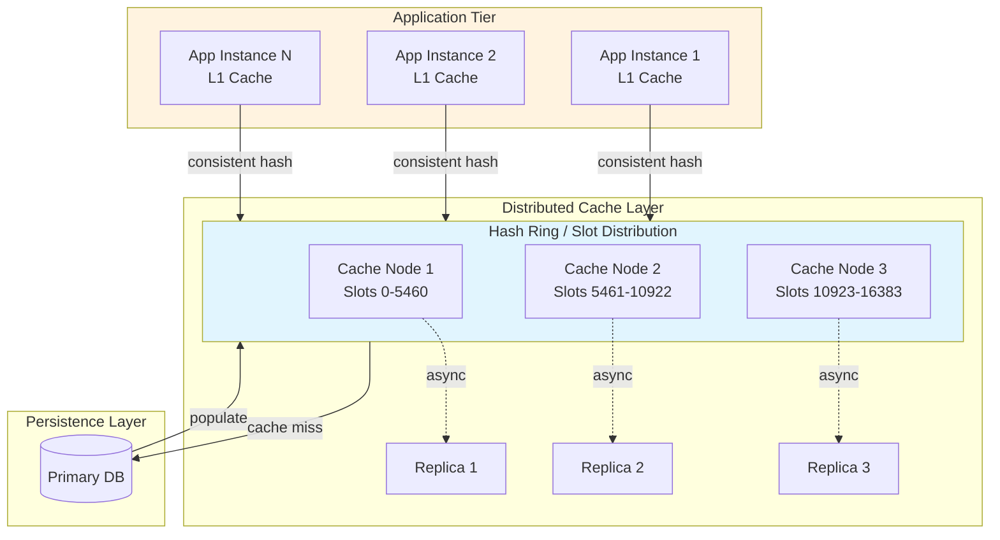

# Distributed Cache Design

Distributed caching is the backbone of high-throughput systems. This article covers cache topologies, partitioning strategies, consistency trade-offs, and operational patterns—with design reasoning for each architectural choice.

<figure>



<figcaption>Multi-tier caching architecture: L1 per-instance caches backed by distributed cache cluster with replica nodes. Consistent hashing routes keys; cache misses fall through to the database.</figcaption>
</figure>

## Abstract

Distributed caching trades memory for latency by storing frequently accessed data closer to computation. The core design decisions are:

- **Topology**: Embedded (in-process) vs. client-server (external) vs. distributed cluster—determines failure domain, consistency model, and operational complexity
- **Partitioning**: Hash-based (consistent hashing, hash slots) vs. range-based—determines data distribution and query patterns
- **Replication**: Synchronous (strong consistency, higher latency) vs. asynchronous (eventual consistency, lower latency)—determines durability guarantees during failures
- **Invalidation**: TTL, explicit delete, write-through, write-behind—each has different staleness windows and failure modes

The fundamental trade-off: **consistency vs. availability vs. partition tolerance** (CAP). Caches typically sacrifice consistency for availability—serving stale data is preferable to serving errors. Design for eventual consistency and explicit staleness bounds.

## Cache Topologies

### Design Choices

#### Embedded (In-Process) Cache

**How it works:** Cache lives inside the application process. Data stored in application heap memory. No network hop for reads.

**Best when:**

- Sub-microsecond latency required (L1 CPU cache locality)
- Data is read-heavy with infrequent updates
- Application instances can tolerate inconsistent views
- Memory footprint is bounded and predictable

**Trade-offs:**

- ✅ Fastest possible access (~100ns vs. ~100μs network)
- ✅ No external dependency; survives network partitions
- ✅ Zero serialization overhead
- ❌ Memory duplicated across instances (N instances = N copies)
- ❌ Invalidation requires coordination (pub/sub, gossip)
- ❌ Cache size limited by process heap
- ❌ Cold starts require warm-up

**Real-world example:** Guava Cache, Caffeine (JVM). Discord uses per-instance L1 caches for guild metadata—accepting 5-second staleness in exchange for eliminating Redis round-trips for hot data. Result: P99 latency dropped from 12ms to 0.5ms for guild lookups.

#### Client-Server (External) Cache

**How it works:** Dedicated cache servers (Redis, Memcached) accessed over network. Application is a client; cache is a separate service.

**Best when:**

- Multiple applications share cached data
- Cache dataset exceeds single-instance memory
- Need TTL, eviction policies, data structures managed externally
- Operational separation between app and cache lifecycle

**Trade-offs:**

- ✅ Single source of truth (no cross-instance inconsistency)
- ✅ Scales independently of application tier
- ✅ Rich data structures (sorted sets, lists, hashes)
- ✅ Built-in expiration and eviction
- ❌ Network latency (~100-500μs per operation)
- ❌ Serialization/deserialization cost
- ❌ External dependency (cache failure affects all apps)
- ❌ Connection pool management complexity

**Real-world example:** Instagram uses Memcached as the primary cache tier, accessed via mcrouter for consistent hashing. A single Memcached cluster serves billions of like counts, user profiles, and session data—with sub-millisecond P50 latency.

#### Distributed Cache Cluster

**How it works:** Multiple cache nodes form a cluster. Data partitioned across nodes via consistent hashing or hash slots. Replication provides fault tolerance.

**Best when:**

- Dataset exceeds single-node memory (100GB+)
- Throughput exceeds single-node capacity (>100K ops/sec)
- High availability required (no single point of failure)
- Horizontal scaling is a requirement

**Trade-offs:**

- ✅ Horizontal scaling (add nodes = more capacity)
- ✅ Fault tolerance via replication
- ✅ No single point of failure
- ❌ Increased operational complexity (cluster management)
- ❌ Cross-slot operations limited or expensive
- ❌ Network partitions can cause split-brain
- ❌ Rebalancing during topology changes

**Real-world example:** Uber's CacheFront handles 150M+ reads/second across a Redis Cluster. Partitioned by entity ID (independent of database sharding). Circuit breakers detect unhealthy nodes; 99.9% cache hit rate with sub-5ms latency.

### Decision Matrix

| Factor               | Embedded       | Client-Server   | Distributed Cluster |
| -------------------- | -------------- | --------------- | ------------------- |
| Latency              | ~100ns         | ~100-500μs      | ~100-500μs          |
| Dataset size         | < 1GB          | < 100GB         | Terabytes+          |
| Throughput           | Process-bound  | 1M+ ops/sec     | 10M+ ops/sec        |
| Consistency          | Per-instance   | Single instance | Eventual            |
| Operational overhead | None           | Low-Medium      | Medium-High         |
| Failure blast radius | Single process | All clients     | Partial (replicas)  |
| Cross-app sharing    | No             | Yes             | Yes                 |
| Memory efficiency    | Duplicated     | Shared          | Shared + replicated |

### Hybrid Architecture: L1 + L2

Production systems typically combine topologies:

```
Request → L1 (Embedded, ~100ns) → L2 (Distributed, ~500μs) → Database (~5ms)
```

**L1 (per-instance):**

- Small (100MB-1GB), hot data only
- Short TTL (seconds to minutes)
- No coordination; eventual consistency acceptable

**L2 (distributed cluster):**

- Large (terabytes), full working set
- Longer TTL (minutes to hours)
- Source of truth for cached data

**Invalidation flow:** Database write → invalidate L2 → L2 broadcasts to L1 instances (pub/sub) or L1 TTL expires naturally.

Meta's architecture follows this pattern: application-local caches (seconds TTL) backed by Memcached clusters (minutes TTL), with invalidation streams propagating deletes across regions.

## Redis Architecture

### Single-Threaded Event Loop

Redis executes all commands on a single thread. This is a deliberate design choice, not a limitation.

**Why single-threaded?**

1. **No synchronization overhead**: Increment operations (INCR), list pushes (LPUSH), and atomic operations require no locks. The single thread guarantees sequential execution.

2. **Memory-bound workloads**: Redis operations are memory-bound, not CPU-bound. A single core saturates memory bandwidth before CPU becomes the bottleneck.

3. **Predictable latency**: No lock contention means consistent tail latencies. P99 latency is stable under load.

4. **Simplified implementation**: No race conditions, no deadlocks, no complex concurrency bugs.

**Performance:** Redis achieves 1.5M SET ops/sec and 1.3M GET ops/sec on commodity hardware. The event loop uses epoll (Linux) or kqueue (BSD) for I/O multiplexing—handling thousands of concurrent connections efficiently.

**Recent evolution (Redis 8.0):** Optional I/O threading offloads socket read/write/parsing to worker threads while the main thread still handles all command execution. Throughput improves 37-112% on multi-core systems without sacrificing the single-threaded execution model.

### Redis Cluster: Hash Slots

Redis Cluster partitions keys across nodes using **16,384 hash slots**.

**Routing algorithm:**

```
slot = CRC16(key) mod 16384
```

Each node owns a subset of slots. Clients cache the slot-to-node mapping and route requests directly.

**Why 16,384 slots?**

- Enough granularity for rebalancing (move individual slots)
- Small enough for efficient heartbeat messages (2KB bitmap)
- Sweet spot between flexibility and overhead

**Scaling mechanics:**

- Add node: Migrate slots from existing nodes
- Remove node: Migrate slots to remaining nodes
- Resharding: Move slots without downtime (clients redirect during migration)

**Limitations:**

- Multi-key operations (MGET, MSET) only work if all keys hash to the same slot
- Use hash tags `{user:123}:profile` and `{user:123}:settings` to colocate related keys
- Cross-slot transactions require CLUSTER commands

**Real-world:** Twitter uses Redis Cluster for home timelines. Keys are user IDs; all timeline data for a user hashes to the same slot. Cluster scales to hundreds of nodes across multiple data centers.

### Redis Sentinel: High Availability Without Sharding

Redis Sentinel provides automatic failover for single-master deployments.

**Architecture:**

- 3+ Sentinel processes monitor Redis master
- Quorum agreement required to trigger failover
- Sentinels elect new master from replicas
- Clients discover master via Sentinel

**When to use Sentinel vs. Cluster:**

| Aspect               | Sentinel                 | Cluster                      |
| -------------------- | ------------------------ | ---------------------------- |
| Scaling              | Vertical only            | Horizontal (auto-sharding)   |
| Data size            | Single-node limit        | Terabytes+                   |
| Operational overhead | Low                      | Medium-High                  |
| Failover             | Sentinel-coordinated     | Cluster-coordinated          |
| Multi-key ops        | All supported            | Same-slot only               |
| Use case             | HA for small-medium data | Large-scale distributed data |

**Design reasoning:** Sentinel is simpler to operate when your dataset fits on one machine. Cluster adds complexity that only pays off at scale. Start with Sentinel; migrate to Cluster when you hit single-node limits.

## Memcached Architecture

### Multi-Threaded Slab Allocator

Memcached uses a fundamentally different threading model than Redis.

**Slab allocator design:**

1. Memory pre-allocated in 1MB pages (slabs)
2. Each slab divided into fixed-size chunks (slab classes)
3. Items stored in the smallest chunk that fits
4. LRU eviction per slab class

**Why slabs?**

- **No fragmentation**: Fixed-size chunks eliminate heap fragmentation from malloc/free cycles
- **Predictable memory usage**: Memory capped at startup; no unexpected growth
- **Fast allocation**: O(1) chunk allocation from free list

**Trade-off:** Items waste space (rounded up to chunk size). A 100-byte item in a 128-byte chunk wastes 28 bytes. Tune slab sizes for your workload.

**Threading model:**

- Single acceptor thread handles new connections
- Worker thread pool processes requests
- Fine-grained locking per slab class
- Scales linearly with cores (unlike Redis)

**When Memcached beats Redis:**

- Simple key-value workloads (no data structures)
- Multi-core machines (Memcached scales better)
- Memory efficiency critical (slab allocator is more predictable)
- No persistence requirements

### Client-Side Consistent Hashing

Memcached servers have no cluster awareness. Clients implement consistent hashing.

**Ketama algorithm** (standard implementation):

1. Hash each server to multiple points on a ring (virtual nodes)
2. Hash each key to a point on the ring
3. Walk clockwise to find the owning server
4. Virtual nodes (100-200 per server) ensure even distribution

**Why client-side?**

- No inter-server communication (servers are stateless)
- Simpler server implementation (just a hash table)
- Client libraries handle topology changes

**Trade-off:** Server addition/removal requires client coordination. Misconfigured clients see different key distributions. Use a service mesh or consistent client configuration.

## Consistent Hashing Deep Dive

### The Problem with Modulo Hashing

Naive approach: `server = hash(key) mod N`

When N changes (server added/removed), most keys remap to different servers. Adding one server to a 10-server cluster remaps ~90% of keys—causing a cache stampede.

### Consistent Hashing (Karger et al., 1997)

**Core insight:** Map both keys and servers to a circular hash space. Keys belong to the first server encountered clockwise.

**Properties:**

- Adding/removing a server only affects keys in one range
- On average, `K/N` keys remap (K = total keys, N = servers)
- Adding one server to 10 servers remaps only ~10% of keys

**Virtual nodes solve uneven distribution:**

Without virtual nodes, servers can have 50%+ load variance due to hash clustering. With 100-200 virtual nodes per server:

- Each physical server maps to 100-200 points on the ring
- Load variance drops to <5%
- Heterogeneous hardware can have proportional virtual nodes

**Real-world:** Discord uses consistent hashing with 1000 virtual nodes per physical server. After node failures, load variance stays under 5%, preventing cascading overloads.

### Jump Consistent Hash (Google, 2014)

**Innovation:** O(1) memory, near-perfect distribution.

**Algorithm (5 lines):**

```cpp
int32_t JumpConsistentHash(uint64_t key, int32_t num_buckets) {
    int64_t b = -1, j = 0;
    while (j < num_buckets) {
        b = j;
        key = key * 2862933555777941757ULL + 1;
        j = (b + 1) * (double(1LL << 31) / double((key >> 33) + 1));
    }
    return b;
}
```

**Properties:**

- Zero memory for ring/virtual nodes
- Standard deviation: 0.00000000764 (essentially perfect distribution)
- When adding bucket N+1, each existing bucket transfers exactly `1/(N+1)` of its keys

**Limitation:** Buckets must be numbered 0 to N-1. Removing bucket K requires renumbering. Better for stable topologies (e.g., sharded databases) than dynamic cache clusters.

### Redis Hash Slots vs. Consistent Hashing

| Aspect            | Consistent Hashing | Hash Slots (Redis)       |
| ----------------- | ------------------ | ------------------------ |
| Granularity       | Continuous ring    | 16,384 discrete slots    |
| Rebalancing       | Key-by-key         | Slot-by-slot             |
| Metadata size     | O(virtual nodes)   | Fixed 2KB bitmap         |
| Implementation    | Client library     | Cluster protocol         |
| Partial migration | Not native         | Native (MIGRATING slots) |

**Design reasoning:** Hash slots simplify cluster coordination. Instead of agreeing on ring positions, nodes agree on slot ownership. Slot migration is atomic—clients redirect mid-migration without losing requests.

## Cache Invalidation Strategies

### The Invalidation Problem

> "There are only two hard things in Computer Science: cache invalidation and naming things." —Phil Karlton

Cache invalidation is hard because distributed systems have no global clock. When data changes in the database, caches across multiple nodes must be updated—but network delays mean some nodes see the change before others.

### Strategy 1: Time-To-Live (TTL)

**Mechanism:** Every cache entry has an expiration time. After TTL, the entry is evicted or refreshed.

**Staleness bound:** Maximum staleness = TTL. If TTL is 60 seconds, cached data is at most 60 seconds stale.

**Best when:**

- Eventual consistency acceptable
- Data changes infrequently
- Simplicity preferred over freshness

**Pitfall—Synchronized expiration:**

If 10,000 keys set with the same TTL at the same time, they all expire simultaneously—causing a cache stampede. Always add jitter:

```python
actual_ttl = base_ttl + random.uniform(0, jitter_seconds)
```

### Strategy 2: Explicit Invalidation (Cache-Aside)

**Mechanism:** Application manages cache lifecycle. On read miss, populate from database. On write, invalidate cache entry.

**Pattern:**

```
Read:
  1. Check cache
  2. On miss: query DB, populate cache
  3. Return data

Write:
  1. Write to database
  2. Delete cache entry (NOT update)
```

**Why delete, not update?**

Race condition: Concurrent requests can leave cache inconsistent.

```
T1: Read DB (old value)
T2: Write DB (new value)
T2: Update cache (new value)
T1: Update cache (old value)  ← Cache now has stale data
```

Delete avoids this—next read fetches fresh data.

**Facebook's Memcache paper** formalized this as "look-aside" caching. Delete on write; let reads repopulate. Leases prevent thundering herd (only first request fetches; others wait).

### Strategy 3: Write-Through

**Mechanism:** Application writes to cache. Cache synchronously writes to database before acknowledging.

**Guarantee:** Cache and database always consistent (within transaction).

**Trade-off:** Write latency = max(cache_latency, db_latency). Every write blocks on database round-trip.

**Best when:**

- Strong consistency required
- Write volume is low
- Can tolerate higher write latency

### Strategy 4: Write-Behind (Write-Back)

**Mechanism:** Application writes to cache. Cache asynchronously flushes to database in background.

**Trade-off:**

- ✅ Ultra-fast writes (memory speed only)
- ❌ Durability risk: cache failure before flush = data loss
- ❌ Read-after-write may see stale data (race with async flush)

**Best when:**

- Write performance critical
- Data loss acceptable (metrics, analytics, non-critical logs)
- Background flush latency is acceptable

**Real-world:** Analytics pipelines often use write-behind. Losing a few data points is acceptable; sub-millisecond write latency is not negotiable.

### Strategy 5: Event-Driven Invalidation

**Mechanism:** Database emits change events (CDC—Change Data Capture). Cache subscribes and invalidates affected entries.

**Architecture:**

```
DB Write → CDC Stream (Kafka, Debezium) → Cache Invalidation Service → Cache Delete
```

**Advantages:**

- Decoupled: Database doesn't know about cache
- Reliable: Events persisted in stream (retry on failure)
- Multi-cache: Single event invalidates all cache tiers

**Latency:** Invalidation delay = CDC lag + processing time. Typically 100ms-1s. Not suitable for strong consistency requirements.

**Real-world:** LinkedIn uses Espresso (their database) with a change capture stream to invalidate distributed caches. Staleness bounded by stream lag.

## Hot Key Mitigation

### The Hot Key Problem

A single key receiving disproportionate traffic overwhelms one cache node. Examples:

- Celebrity tweet goes viral (millions of reads on one key)
- Flash sale product page (everyone viewing same item)
- Breaking news article (global traffic spike)

Consistent hashing makes this worse—all requests for a key go to one node, regardless of cluster size.

### Solution 1: Request Coalescing (Single-Flight)

**Mechanism:** Multiple simultaneous requests for the same key collapse into one database query. Others wait and share the result.

**Implementation:**

```go
var group singleflight.Group

func Get(key string) (Value, error) {
    v, err, _ := group.Do(key, func() (interface{}, error) {
        return fetchFromDB(key)  // Only called once per key
    })
    return v.(Value), err
}
```

**Effect:** 10,000 simultaneous requests = 1 database query + 9,999 waiters.

**Trade-off:** First request's latency is shared by all waiters. If database is slow, all requests block.

### Solution 2: Local Cache Tier (L1)

**Mechanism:** Replicate hot keys to per-instance L1 caches. Reads served locally; no network hop.

**Architecture:**

```
App Instance → L1 (local, 100MB, 5s TTL) → L2 (Redis cluster) → DB
```

**Trade-off:** L1 caches are eventually consistent. Updates propagate via TTL expiration or pub/sub invalidation.

**Real-world:** Discord serves guild metadata from L1 caches with 5-second TTL. 99% of reads hit L1; only 1% reach Redis.

### Solution 3: Key Replication

**Mechanism:** Detect hot keys (via monitoring) and replicate to multiple cache nodes. Clients round-robin across replicas.

**Hot key detection:**

- Client-side: Track request rates per key
- Server-side: Redis HOTKEYS command (approximation via LFU)
- Offline: Analyze access logs, identify keys above threshold

**Trade-off:** Replication increases memory usage. Invalidation must reach all replicas.

### Solution 4: Key Splitting (Sharding Within Key)

**Mechanism:** Split one logical key into multiple physical keys. Distribute across nodes.

```
Original:  product:12345
Split:     product:12345:0, product:12345:1, product:12345:2
```

Client randomly selects a suffix, distributing load across nodes.

**Trade-off:** Writes must update all shards. Read consistency requires quorum or sticky routing.

**Best for:** Read-heavy, write-rare data (product catalog, configuration).

### Solution 5: Probabilistic Early Recomputation

**Mechanism:** Before TTL expires, probabilistically refresh the cache entry. Probability increases as expiration approaches.

**Algorithm (XFetch):**

```python
def should_recompute(expiry_time, delta, beta=1.0):
    now = time.time()
    ttl_remaining = expiry_time - now
    random_factor = random.random()
    return ttl_remaining - (delta * beta * math.log(random_factor)) <= 0
```

**Effect:** Refreshes spread across time window, preventing synchronized expiration stampede.

## Cache Stampede Prevention

### The Thundering Herd Problem

When a popular cache entry expires, thousands of requests simultaneously:

1. Find cache miss
2. Query database
3. Try to populate cache
4. Database drowns in identical queries

### Solution 1: Distributed Locks

**Mechanism:** First request acquires lock, fetches data, populates cache. Others wait on lock or return stale data.

```python
def get_with_lock(key):
    value = cache.get(key)
    if value is not None:
        return value

    lock_key = f"lock:{key}"
    if cache.setnx(lock_key, "1", ex=5):  # Acquired lock
        try:
            value = fetch_from_db(key)
            cache.set(key, value, ex=300)
            return value
        finally:
            cache.delete(lock_key)
    else:
        # Wait and retry
        time.sleep(0.1)
        return get_with_lock(key)
```

**Trade-off:** Lock contention under extreme load. Lock holder failure causes delays (mitigate with TTL on lock).

### Solution 2: Stale-While-Revalidate

**Mechanism:** Serve stale data immediately. Trigger background refresh.

```
Response: Stale data (fast)
Background: Fetch fresh data, update cache
Next request: Fresh data
```

**Trade-off:** Clients may see stale data. Acceptable for non-critical reads.

**HTTP analogy:** `Cache-Control: stale-while-revalidate` enables this at CDN layer.

### Solution 3: Leases (Facebook's Approach)

**Mechanism:** On cache miss, cache issues a "lease" (token). Only lease holder can populate cache. Others wait or get "hot miss" response.

From Facebook's Memcache paper:

1. Client requests key, gets miss + lease token
2. Client fetches from database
3. Client sets value with lease token
4. If token expired or revoked, set fails (prevents stale write)

**Properties:**

- Prevents thundering herd (one fetcher per key)
- Prevents stale sets (lease expires if too slow)
- Handles delete races (delete revokes leases)

### Solution 4: Gutter Servers

**Mechanism:** Secondary cache tier absorbs traffic when primary fails or during stampede.

```
Primary cache miss → Gutter cache → Database
```

**Facebook's design:** Gutter servers have short TTL (seconds). They don't replace primary cache—they absorb temporary overload while primary recovers.

**Trade-off:** Additional infrastructure. Gutter data is ephemeral and potentially stale.

## Real-World Case Studies

### Facebook/Meta: Memcache at Billion-Request Scale

**Scale:** 1+ billion cache operations per second.

**Architecture:**

- Look-aside cache (application manages reads/writes)
- Hundreds of Memcached servers per cluster
- Multiple clusters per region, multiple regions globally
- mcrouter for routing and connection pooling

**Key innovations:**

1. **Leases:** Prevent thundering herd and stale writes
2. **Gutter servers:** Absorb traffic during failures
3. **Regional pools:** Hot data replicated across regions
4. **Delete streams:** Cross-region invalidation via async message queue

**Performance insight:** 44% of page loads contact 20+ Memcached servers. Popular pages touch 100+ servers. mcrouter batches requests to reduce network overhead.

**Failure handling:** When a Memcached server fails, clients redirect to gutter. Gutter has 60-second TTL—long enough to absorb traffic, short enough to limit staleness.

### Uber: CacheFront at 150M Reads/Second

**Scale:** 150M+ reads/second with 99.9% hit rate.

**Architecture:**

- Redis clusters partitioned by entity ID
- Partition scheme independent of database sharding
- Sliding window circuit breaker per cache node

**Design decisions:**

1. **Entity-based partitioning:** Keys partitioned by business entity (user, ride, etc.), not database shard key. Allows cache layer to evolve independently.

2. **Circuit breaker:** Monitors error rates per cache node. Opens circuit (stops requests) if error rate exceeds threshold. Requests fall through to database.

3. **Integrated cache:** Cache layer embedded in Uber's Docstore (their database abstraction). Developers don't manage cache directly.

**Result:** Scaled from 40M to 150M reads/second without adding database capacity. Cache absorbs read load; database handles writes.

### Discord: Per-Instance Caching for Guild Metadata

**Problem:** Guild metadata (server info, channel lists) accessed on every message. Redis round-trip added 10ms to every operation.

**Solution:**

- L1 cache per application instance (Rust, in-memory)
- 5-second TTL (accepting staleness)
- L2 Redis cluster as fallback

**Result:**

- 99% cache hit rate at L1
- P99 latency dropped from 12ms to 0.5ms for guild lookups
- Redis load reduced by 99x

**Trade-off accepted:** Guild metadata may be 5 seconds stale. For non-critical data (member count, channel order), this is acceptable. Critical data (permissions) bypasses cache.

### Twitter/X: Timeline Caching with Redis

**Scale:** 320M packets/second aggregate.

**Architecture:**

- Redis Cluster for home timelines
- Haplo (custom) for tweet timeline cache
- Per-region cache hierarchy

**Design decisions:**

1. **Timeline-optimized data structure:** Sorted sets store tweet IDs by timestamp. ZRANGEBYSCORE fetches timeline slice in one operation.

2. **Write fanout:** When a tweet is posted, write to all follower timelines (fanout-on-write). Reads are O(1)—just fetch timeline.

3. **Hybrid approach:** High-follower accounts use fanout-on-read (don't write to millions of timelines).

**Trade-off:** Write amplification for fanout-on-write. Acceptable because reads vastly outnumber writes.

## Common Pitfalls

### Pitfall 1: Caching Without TTL

**The mistake:** Setting cache entries without expiration.

**Why it happens:** "We'll invalidate explicitly on writes."

**The consequence:** Bugs in invalidation logic leave stale data forever. No safety net.

**The fix:** Always set TTL, even with explicit invalidation. TTL is your fallback—maximum staleness bound.

### Pitfall 2: Cache-Database Race Conditions

**The mistake:** Update cache, then update database (or vice versa without careful ordering).

**Why it happens:** Assuming single-threaded execution in a concurrent system.

**The consequence:**

```
T1: Delete cache
T2: Read cache (miss)
T2: Read database (old value)
T1: Write database (new value)
T2: Write cache (old value)  ← Stale forever (until TTL)
```

**The fix:** Delete cache after database write. Or use explicit versioning (cache entry includes version; reject stale writes).

### Pitfall 3: Ignoring Serialization Costs

**The mistake:** Caching large objects without considering serialization overhead.

**Why it happens:** Measuring only network latency, not total operation time.

**The consequence:** 1ms network latency + 10ms JSON serialization = 11ms total. Cache appears slow.

**The fix:** Profile total operation time. Use efficient serialization (Protobuf, MessagePack). Cache already-serialized bytes when possible.

### Pitfall 4: Hot Key Blindness

**The mistake:** Assuming consistent hashing distributes load evenly.

**Why it happens:** Works in testing with uniform key distribution.

**The consequence:** Production traffic has Zipf distribution (few keys dominate). Hot keys overwhelm individual nodes.

**The fix:** Monitor key-level metrics. Implement hot key detection. Use L1 caching, key replication, or request coalescing proactively.

### Pitfall 5: Missing Cache During Database Migrations

**The mistake:** Invalidating cache before database migration completes.

**Why it happens:** Invalidation logic triggers on schema change.

**The consequence:** Cache misses flood to database mid-migration. Database overloaded; migration fails.

**The fix:** Warm cache before cutover. Use blue-green deployment for cache layer. Gradual traffic shift with monitoring.

## Conclusion

Distributed cache design requires explicit trade-offs between consistency, availability, and complexity. Key principles:

1. **Choose topology for your scale**: Start simple (single Redis with Sentinel), evolve to cluster when single-node limits hit
2. **Layer caches**: L1 (embedded, microseconds) + L2 (distributed, milliseconds) reduces load and latency
3. **Always set TTL**: The safety net for invalidation bugs
4. **Plan for hot keys**: They will happen. Request coalescing, L1 caching, and key replication are your tools
5. **Measure staleness**: Know your consistency bounds and make them explicit to application developers

The best cache is the one you don't notice—until it fails. Design for graceful degradation: circuit breakers, gutter servers, and fallback to database.

## Appendix

### Prerequisites

- Understanding of hash functions and modular arithmetic
- Familiarity with CAP theorem and distributed systems fundamentals
- Basic knowledge of Redis/Memcached operations

### Summary

- **Cache topologies** range from embedded (fastest, per-instance) to distributed clusters (scalable, fault-tolerant). Most production systems use hybrid L1+L2 architectures.
- **Consistent hashing** minimizes key remapping during topology changes. Virtual nodes ensure even distribution; jump consistent hash offers O(1) memory alternative.
- **Invalidation strategies** trade staleness for simplicity. TTL is the baseline; explicit invalidation provides freshness; event-driven approaches decouple systems.
- **Hot keys** break even distribution. Mitigate with request coalescing, local caching, key replication, or sharding within keys.
- **Stampede prevention** requires proactive design: locks, leases, stale-while-revalidate, or probabilistic early refresh.

### References

- [Karger, D., et al. "Consistent Hashing and Random Trees: Distributed Caching Protocols for Relieving Hot Spots on the World Wide Web." ACM Symposium on Theory of Computing, 1997](https://www.cs.princeton.edu/courses/archive/fall09/cos518/papers/chash.pdf)
- [Lamping, J. & Veach, E. "A Fast, Minimal Memory, Consistent Hash Algorithm." arXiv:1406.2294, 2014](https://arxiv.org/abs/1406.2294)
- [Nishtala, R., et al. "Scaling Memcache at Facebook." USENIX NSDI, 2013](https://www.usenix.org/system/files/conference/nsdi13/nsdi13-final170_update.pdf)
- [Redis Cluster Specification](https://redis.io/docs/latest/operate/oss_and_stack/reference/cluster-spec/)
- [Redis Sentinel Documentation](https://redis.io/docs/latest/operate/oss_and_stack/management/sentinel/)
- [Memcached Protocol](https://github.com/memcached/memcached/blob/master/doc/protocol.txt)
- [Uber Engineering: How Uber Serves Over 150 Million Reads/Second](https://www.uber.com/blog/how-uber-serves-over-150-million-reads/)
- [Discord Engineering: How Discord Stores Billions of Messages](https://discord.com/blog/how-discord-stores-billions-of-messages)
- [Twitter Engineering: The Infrastructure Behind Twitter Scale](https://blog.x.com/engineering/en_us/topics/infrastructure/2017/the-infrastructure-behind-twitter-scale)
