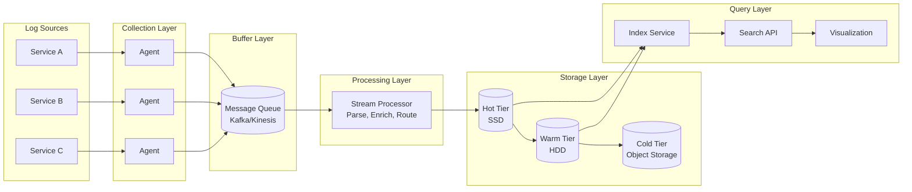

# Distributed Logging System

Centralized logging infrastructure enables observability across distributed systems. This article covers log data models, collection architectures, storage engines, indexing strategies, and scaling approaches—with design trade-offs and real-world implementations from Netflix (5 PB/day), Uber, and others.

<figure>



<figcaption>End-to-end distributed logging architecture: collection agents ship logs through a message queue buffer, stream processors parse and route data to tiered storage, and an index service powers search queries.</figcaption>
</figure>

## Abstract

Distributed logging solves the observability problem: reconstructing system behavior from scattered, ephemeral log streams across hundreds of services. The core tension is between **query flexibility** (full-text search, ad-hoc filtering) and **cost efficiency** (storage, indexing overhead).

Key design decisions:

- **Data model**: Structured logging (JSON/Protobuf) enables schema evolution and efficient compression, but requires upfront discipline
- **Collection topology**: Sidecar agents provide isolation but consume 10-20x more resources than DaemonSet agents; choose based on multi-tenancy needs
- **Index strategy**: Full inverted indexes (Elasticsearch) enable rich queries but triple storage costs; label-only indexes (Loki) reduce costs 10x but require brute-force content scanning
- **Storage tiering**: Hot/warm/cold tiers balance query latency against cost—Netflix keeps 3 days hot, 30 days warm, years cold

The mental model: logs are **write-heavy, read-sparse** time-series data with **unpredictable query patterns**. Systems optimized for write throughput (LSM trees, columnar storage) outperform row-oriented databases by 10-100x, but indexing strategy determines whether queries take milliseconds or minutes.

## Log Data Model

### Structured vs Unstructured

Unstructured logs (free-form text) are easy to emit but expensive to query. Every search requires regex parsing across terabytes of data.

Structured logging (JSON, Protocol Buffers) shifts parsing cost from query time to write time:

```json collapse={1-2}
// Structured log entry
{
  "timestamp": "2024-01-15T10:23:45.123Z",
  "level": "ERROR",
  "service": "payment-service",
  "trace_id": "abc123",
  "message": "Payment failed",
  "error_code": "INSUFFICIENT_FUNDS",
  "amount_cents": 5000,
  "user_id": "usr_789"
}
```

**Trade-offs:**

| Aspect | Unstructured | Structured (JSON) | Structured (Protobuf) |
|--------|--------------|-------------------|----------------------|
| Write simplicity | ✅ printf-style | Requires log library | Requires codegen |
| Query flexibility | ❌ Regex only | ✅ Field extraction | ✅ Field extraction |
| Schema evolution | N/A | Implicit (any field) | Explicit (field numbers) |
| Compression ratio | 2-5x | 5-10x | 10-20x |
| Cross-language | ✅ Universal | ✅ Universal | Requires runtime |

**Design choice**: JSON is the de-facto standard for application logs because it balances flexibility with tooling support. Protocol Buffers excel for high-volume internal telemetry where schema discipline is enforced.

### Schema Evolution

JSON's implicit schema makes additions trivial but creates drift. Protocol Buffers enforce evolution rules:

- **Field numbers**: Never reuse deleted field numbers (reserve them)
- **Adding fields**: Safe—Proto3 defaults missing fields to zero values
- **Removing fields**: Mark as reserved, never reuse the number
- **Type changes**: Incompatible—requires new field

The [buf](https://buf.build/) toolchain automates breaking change detection for Protobuf schemas.

**Real-world example**: Datadog recommends log entries under 25KB for optimal performance, with a hard limit of 1MB. Large logs (stack traces, request bodies) should be truncated or sampled.

## Collection Architecture

### Agent Deployment Patterns

Two dominant patterns for Kubernetes environments:

**DaemonSet Pattern** (one agent per node):

```yaml collapse={1-4, 12-20}
# Fluentd DaemonSet configuration
apiVersion: apps/v1
kind: DaemonSet
metadata:
  name: fluentd
spec:
  template:
    spec:
      containers:
      - name: fluentd
        resources:
          requests:
            memory: "200Mi"
            cpu: "100m"
```

- **Pros**: Resource-efficient (one agent serves all pods), simpler management
- **Cons**: Single point of failure per node, limited tenant isolation
- **Best for**: Clusters with <500 log configurations, homogeneous workloads

**Sidecar Pattern** (one agent per pod):

- **Pros**: Tenant isolation, per-application configuration, failure isolation
- **Cons**: 10-20x higher resource overhead, complex lifecycle management
- **Best for**: Multi-tenant platforms, >500 configurations, PaaS environments

**Decision factor**: WePay's engineering team found the threshold at approximately 500 collection configurations—below this, DaemonSets suffice; above, sidecars provide necessary isolation.

### Shipping Strategies

**Push vs Pull:**

| Model | Latency | Failure Mode | Backpressure |
|-------|---------|--------------|--------------|
| Push | Lower (immediate) | Agent buffers on failure | Agent-side |
| Pull | Higher (polling interval) | Central buffer | Server-side |

**Batching** is critical for efficiency. Fluent Bit defaults to 2KB chunks, flushing every 1 second. Larger batches reduce network overhead but increase latency and memory pressure.

**Backpressure handling**:

1. **Bounded memory buffers**: Drop oldest logs when full (acceptable for most logs)
2. **Disk spillover**: Write to local disk when memory exhausted (Fluentd's buffer plugin)
3. **Sampling**: Reduce rate dynamically under pressure (Vector's adaptive sampling)

### Agent Comparison

| Agent | Language | Memory | Throughput | Best For |
|-------|----------|--------|------------|----------|
| Fluent Bit | C | ~20MB | High | Edge, IoT, resource-constrained |
| Fluentd | Ruby | ~100MB | Medium | Plugin ecosystem, complex routing |
| Vector | Rust | ~50MB | Very high | Performance-critical, modern stacks |
| Filebeat | Go | ~30MB | Medium | Elastic ecosystem |
| Logstash | Java | ~500MB | Medium | Complex transformations |

## Buffer and Stream Processing

### Why Buffer?

Direct shipping from agents to storage creates coupling and cascading failures. A message queue buffer (Kafka, Kinesis) provides:

1. **Absorption**: Handle ingestion spikes without dropping logs
2. **Decoupling**: Storage maintenance doesn't block collection
3. **Replay**: Reprocess historical logs for new pipelines
4. **Fan-out**: Multiple consumers from single stream

**Trade-off**: Adds operational complexity and ~10-50ms latency.

### Kafka for Log Streams

Kafka's partitioned log model aligns naturally with log data:

```text
Topic: application-logs
├── Partition 0: [service-a logs, ordered by offset]
├── Partition 1: [service-b logs, ordered by offset]
└── Partition 2: [service-c logs, ordered by offset]
```

**Partition key choices:**

| Key | Pros | Cons |
|-----|------|------|
| Service name | Co-located logs, good compression | Hot partitions for high-volume services |
| Trace ID | Correlated logs together | Uneven distribution |
| Round-robin | Even distribution | No ordering guarantees |
| Timestamp bucket | Time locality | Clock skew issues |

**Backpressure in Kafka consumers:**

1. Disable auto-commit; acknowledge only after successful processing
2. Use bounded thread pools to cap concurrent processing
3. Dynamically pause partitions when downstream systems stress
4. Monitor consumer lag as health signal

### Stream Processing

Stream processors transform raw logs before storage:

- **Parsing**: Extract structured fields from unstructured text
- **Enrichment**: Add metadata (geo-IP, user attributes, service ownership)
- **Routing**: Direct logs to different storage tiers by level/service
- **Sampling**: Reduce volume for high-cardinality, low-value logs

**Design choice**: Lightweight processing (regex, JSON parsing) can happen in agents. Heavy enrichment (database lookups, ML classification) belongs in dedicated stream processors.

## Storage Engines

### Write-Optimized Architectures

Logs are write-heavy: a single service might emit 10,000 logs/second but queries happen once per incident. Two architectures dominate:

**LSM Trees (Log-Structured Merge Trees)**:

```text
Write Path:
  Log Entry → MemTable (memory) → Flush → SSTable (disk)
                                            ↓
                                    Background compaction
                                            ↓
                                    Merged SSTables
```

- **Writes**: Sequential, batched, O(1) amortized
- **Reads**: Check MemTable, then each SSTable level (bloom filters help)
- **Used in**: Elasticsearch (Lucene segments), RocksDB, Cassandra

**Columnar Storage**:

```text
Row-oriented:           Columnar:
| ts | level | msg |    | ts_col | level_col | msg_col |
| t1 | INFO  | A   |    | t1     | INFO      | A       |
| t2 | ERROR | B   |    | t2     | ERROR     | B       |
| t3 | INFO  | C   |    | t3     | INFO      | C       |
```

- **Compression**: Same-type columns compress dramatically better (10-100x vs row)
- **Query efficiency**: Read only needed columns; skip irrelevant data
- **Used in**: ClickHouse, Druid, Parquet files

**Netflix's ClickHouse deployment** ingests 5 petabytes daily (10.6M events/second average, 12.5M peak) using columnar storage with aggressive compression.

### Compression Techniques

ClickHouse achieves **170x compression** on nginx access logs through layered compression:

| Technique | How It Works | Best For |
|-----------|--------------|----------|
| Dictionary encoding | Store unique values in dictionary, reference by ID | Low-cardinality fields (level, service) |
| Delta encoding | Store differences between consecutive values | Timestamps, monotonic IDs |
| LZ4 | Fast block compression | General purpose, read-heavy |
| ZSTD | Higher compression, more CPU | Archive, I/O-bound queries |

**Codec selection rule**: ZSTD for large range scans where decompression is amortized; LZ4 when decompression latency dominates (point queries).

### Tiered Storage

Hot/warm/cold tiering balances query performance against storage cost:

| Tier | Storage | Indexing | Retention | Query Latency |
|------|---------|----------|-----------|---------------|
| Hot | NVMe SSD | Full | 1-7 days | <100ms |
| Warm | HDD/SSD | Partial | 7-90 days | 1-10s |
| Cold | Object storage (S3) | Metadata only | Years | 30s-minutes |

**Elasticsearch ILM (Index Lifecycle Management)** automates transitions:

```json collapse={1-2, 15-20}
// ILM policy example
{
  "policy": {
    "phases": {
      "hot": {
        "actions": {
          "rollover": { "max_size": "50GB", "max_age": "1d" }
        }
      },
      "warm": {
        "min_age": "7d",
        "actions": {
          "shrink": { "number_of_shards": 1 },
          "forcemerge": { "max_num_segments": 1 }
        }
      },
      "cold": {
        "min_age": "30d",
        "actions": {
          "freeze": {}
        }
      }
    }
  }
}
```

**Splunk SmartStore** decouples compute from storage: indexers use local SSD as cache while persisting warm/cold data to S3-compatible object storage. This enables elastic scaling—compute scales independently from storage.

## Indexing Strategies

### Inverted Indexes (Full-Text Search)

Elasticsearch/Lucene builds inverted indexes mapping terms to documents:

```text
Term Dictionary:        Postings List:
"error"     → [doc1, doc3, doc7]
"payment"   → [doc2, doc3]
"timeout"   → [doc1, doc5, doc7]
```

**Query execution**: Look up term in dictionary (O(log n)), retrieve posting list, intersect/union lists for boolean queries.

**Storage overhead**: Inverted indexes typically 2-3x the original data size. With position information (for phrase queries), overhead reaches 3-4x.

**Trade-off**: Rich query capabilities (wildcards, fuzzy matching, phrase search) at significant storage and write cost.

### Label-Based Indexing (Loki)

Grafana Loki indexes only label metadata, not log content:

```text
Labels: {service="payment", level="error", env="prod"}
Chunks: [compressed log lines matching these labels]
```

**Query execution**: Filter by labels (indexed), then brute-force scan chunk content.

**LogQL query**:
```logql
{service="payment"} |= "timeout" | json | latency_ms > 500
```

**Trade-offs:**

| Aspect | Inverted Index (Elasticsearch) | Label-Only (Loki) |
|--------|-------------------------------|-------------------|
| Index size | 2-4x original | <5% original |
| Storage cost | High | Low |
| Full-text search | ✅ Fast | ❌ Scan required |
| High cardinality | Handles well | ⚠️ Label explosion |
| Query latency | Consistent | Varies with scan size |

**Cardinality constraint**: Loki performs poorly with high-cardinality labels (user IDs, request IDs). Keep label cardinality under 100,000 unique combinations.

### Bloom Filters

Bloom filters provide probabilistic existence checks with minimal memory:

```text
Query: "Does chunk X contain 'error'?"
Bloom filter: "Probably yes" or "Definitely no"
```

**Characteristics:**
- False positives possible (check chunk, find nothing)
- False negatives impossible (if filter says no, it's no)
- Memory: ~10 bits per element for 1% false positive rate

**ClickHouse uses bloom filters** as skip indexes—they tell the engine where NOT to look, reducing disk I/O without full indexing overhead.

**Break-even analysis**: For existence queries on moderate datasets, bloom filters outperform inverted indexes up to ~7,200 documents. Beyond that, inverted indexes' O(1) lookup dominates.

## Query Patterns

### Real-Time vs Historical

| Query Type | Latency SLA | Index Strategy | Storage Tier |
|------------|-------------|----------------|--------------|
| Live tail | <1s | In-memory only | Hot |
| Incident investigation | <10s | Full index | Hot + Warm |
| Compliance audit | Minutes OK | Partial/None | Warm + Cold |
| Analytics/trending | Minutes OK | Aggregated | All tiers |

### Correlation Across Services

Distributed tracing enables log correlation:

```text
Request flow:
  API Gateway → Auth Service → Payment Service → Notification
       ↓              ↓              ↓                ↓
  trace_id=abc   trace_id=abc   trace_id=abc    trace_id=abc
```

All logs share `trace_id`, enabling reconstruction of the full request path.

**Uber's Jaeger** records thousands of traces per second across hundreds of microservices, using trace IDs to correlate logs, metrics, and traces.

### Aggregation Queries

Common patterns:

```sql
-- Error rate by service (last hour)
SELECT service, count(*) as errors
FROM logs
WHERE level = 'ERROR' AND timestamp > now() - interval 1 hour
GROUP BY service
ORDER BY errors DESC

-- P99 latency by endpoint
SELECT endpoint, quantile(0.99)(latency_ms) as p99
FROM logs
WHERE timestamp > now() - interval 1 day
GROUP BY endpoint
```

Columnar storage (ClickHouse) excels here—only the referenced columns are read from disk.

## Scaling Approaches

### Partitioning Strategies

**Time-based partitioning** (most common):

```text
logs-2024-01-15
logs-2024-01-16
logs-2024-01-17
```

- Natural fit for retention policies (drop old partitions)
- Query locality for time-range queries
- Risk: Recent partitions are hot; older partitions cold

**Composite partitioning** (time + source):

```text
logs-payment-2024-01-15
logs-auth-2024-01-15
logs-payment-2024-01-16
```

- Better load distribution
- Service-specific retention policies
- Complexity: More partitions to manage

**Key insight**: Each partition is independently ordered, but there's no global ordering across partitions. This enables horizontal scaling but complicates cross-partition queries.

### Replication

Standard replication for durability:

| Strategy | Consistency | Write Latency | Failure Tolerance |
|----------|-------------|---------------|-------------------|
| Sync 2 replicas | Strong | Higher | 1 node |
| Async replication | Eventual | Lower | Data loss window |
| Quorum (2 of 3) | Strong | Medium | 1 node |

Logs typically tolerate eventual consistency—losing a few log lines during failures is acceptable for most use cases.

### Sharding for Write Throughput

When a single partition can't handle write volume:

```text
logs-payment (logical) →
  logs-payment-shard-0 (physical, 33% of writes)
  logs-payment-shard-1 (physical, 33% of writes)
  logs-payment-shard-2 (physical, 33% of writes)
```

**Shard key considerations:**
- Hash of trace ID: Even distribution, but scatter-gather queries
- Round-robin: Maximum distribution, no locality
- Consistent hashing: Smooth rebalancing when adding shards

## Real-World Implementations

### ELK Stack (Elasticsearch, Logstash, Kibana)

**Architecture layers:**

1. **Collection**: Filebeat/Metricbeat ship logs
2. **Processing**: Logstash ingests, parses, enriches
3. **Storage**: Elasticsearch indexes into sharded indices
4. **Visualization**: Kibana queries via REST API

**Design characteristics:**
- Inverted indexes for full-text search
- Shard sizing: 10-50GB per shard for optimal performance
- Replica count: Typically 1 (2 copies total)

**When to use**: Need rich full-text search, complex queries, established ecosystem.

### Grafana Loki

**Architecture:**

1. **Distributor**: Receives logs, validates, forwards to ingesters
2. **Ingester**: Batches logs into chunks, builds label index
3. **Querier**: Executes LogQL queries, merges results
4. **Chunk Store**: Object storage (S3/GCS) for compressed log chunks
5. **Index Store**: Label index in BoltDB, Cassandra, or object storage

**Design characteristics:**
- Label-only indexing (like Prometheus for logs)
- Chunk compression: Snappy or LZ4
- Cost: 10x cheaper than full-text indexing at scale

**When to use**: Already using Grafana, cost-sensitive, structured logs with low-cardinality labels.

### ClickHouse for Logs

**Netflix case study** (5 PB/day):

Three optimizations reduced query latency from 3s to 700ms:

1. **Generated lexers**: Custom log fingerprinting achieved 8-10x faster parsing than regex
2. **Native protocol serialization**: Bypassed HTTP overhead for bulk inserts
3. **Sharded tag maps**: Distributed high-cardinality tag lookups across nodes

**Design characteristics:**
- Columnar storage with MergeTree engine
- Compression: 170x possible with proper codecs
- Materialized views for pre-aggregation

**When to use**: Extreme scale (petabytes), analytical queries, cost efficiency over query flexibility.

### Splunk

**Architecture:**

1. **Forwarders**: Ship raw data
2. **Indexers**: Parse, extract fields, build indexes
3. **Search heads**: Execute SPL queries

**SmartStore innovation**: Separates compute from storage—indexers cache recent data on SSD while warm/cold data lives in S3. Enables elastic scaling without full reindexing.

**When to use**: Enterprise requirements, compliance, integrated security analytics.

### Datadog

**CloudPrem architecture** (self-hosted option):

- Indexers write splits directly to object storage
- Central metastore tracks splits for instant query availability
- Horizontal scaling via load balancer
- Observability Pipelines Worker for complex routing

**Design characteristics:**
- Log entries optimally <25KB, max 1MB
- Separation of indexing from storage
- Multi-tenant isolation

## Common Pitfalls

### 1. High-Cardinality Labels

**The mistake**: Using request IDs, user IDs, or timestamps as index labels.

**Why it happens**: Developers want to query by these fields.

**The consequence**: Index explosion—Loki becomes unusable; Elasticsearch shard counts explode.

**The fix**: High-cardinality values go in log content, not labels. Query them with full-text search or store in a separate trace store.

### 2. Unbounded Log Volume

**The mistake**: Logging every request at DEBUG level in production.

**Why it happens**: "We might need it for debugging."

**The consequence**: Storage costs spiral; query performance degrades.

**The fix**:
- Sample high-volume, low-value logs
- Use log levels appropriately (ERROR/WARN for alerts, INFO for business events, DEBUG for local dev)
- Set per-service quotas

### 3. Missing Correlation IDs

**The mistake**: No trace ID propagation across services.

**Why it happens**: Requires cross-team coordination.

**The consequence**: Incident investigation requires manual correlation across time windows.

**The fix**: Mandate trace ID headers (e.g., `X-Request-ID`) at API gateway; propagate through all services.

### 4. Single-Tier Storage

**The mistake**: Keeping all logs on hot storage indefinitely.

**Why it happens**: "Storage is cheap."

**The consequence**: At scale, SSD costs dwarf compute. Query performance degrades as index size grows.

**The fix**: Implement hot/warm/cold tiering. Most logs are never queried after 7 days.

### 5. No Backpressure Handling

**The mistake**: Agents with unbounded memory buffers.

**Why it happens**: "We can't lose logs."

**The consequence**: Agent OOMs during ingestion spikes; entire node destabilized.

**The fix**: Bounded buffers with overflow to disk, or sampling under pressure. Some log loss is better than node failure.

## Conclusion

Distributed logging infrastructure requires balancing query flexibility against cost efficiency. The key design decisions are:

1. **Data model**: Structured logging (JSON for flexibility, Protobuf for performance) enables downstream efficiency
2. **Collection**: DaemonSets for simplicity, sidecars for isolation—threshold around 500 configurations
3. **Indexing**: Full inverted indexes (Elasticsearch) for query richness; label-only indexes (Loki) for cost efficiency
4. **Storage**: Tiered architecture with ILM automation; most logs never queried after 7 days
5. **Scaling**: Time-based partitioning with consistent hashing for writes; replication for durability

Netflix's 5 PB/day deployment demonstrates that extreme scale is achievable with columnar storage (ClickHouse), aggressive compression (170x), and careful data modeling. The trade-off: less query flexibility than full-text search systems.

## Appendix

### Prerequisites

- Understanding of distributed systems fundamentals (replication, partitioning)
- Familiarity with time-series data characteristics
- Basic knowledge of search indexing concepts

### Terminology

- **LSM Tree (Log-Structured Merge Tree)**: Write-optimized data structure that batches writes in memory and flushes to immutable sorted files
- **Inverted Index**: Mapping from terms to documents containing those terms; enables full-text search
- **Bloom Filter**: Probabilistic data structure for set membership with false positives but no false negatives
- **ILM (Index Lifecycle Management)**: Automated policy for transitioning data through storage tiers
- **LogQL**: Grafana Loki's query language, inspired by PromQL

### Summary

- Structured logging (JSON/Protobuf) shifts parsing cost from query time to write time
- Collection agents trade resource efficiency (DaemonSet) against isolation (sidecar)
- Message queue buffers (Kafka) decouple collection from storage, enabling replay and fan-out
- Columnar storage (ClickHouse) achieves 170x compression; LSM trees (Elasticsearch) enable rich indexing
- Label-only indexing (Loki) costs 10x less than full-text indexing but requires content scanning
- Hot/warm/cold tiering balances query latency against storage cost—automate with ILM

### References

- [Protocol Buffers Documentation](https://protobuf.dev/overview/) - Schema evolution rules and best practices
- [Netflix Petabyte-Scale Logging with ClickHouse](https://clickhouse.com/blog/netflix-petabyte-scale-logging) - 5 PB/day architecture details
- [ClickHouse Log Compression](https://clickhouse.com/blog/log-compression-170x) - 170x compression techniques
- [Grafana Loki Architecture](https://grafana.com/docs/loki/latest/get-started/architecture/) - Label-based indexing design
- [The Concise Guide to Grafana Loki Labels](https://grafana.com/blog/2023/12/20/the-concise-guide-to-grafana-loki-everything-you-need-to-know-about-labels/) - Cardinality constraints and best practices
- [Elasticsearch from the Bottom Up](https://www.elastic.co/blog/found-elasticsearch-from-the-bottom-up) - Lucene segment architecture
- [Elasticsearch Data Tiers](https://www.elastic.co/docs/manage-data/lifecycle/data-tiers) - Hot/warm/cold/frozen storage
- [Splunk SmartStore Architecture](https://help.splunk.com/en/splunk-enterprise/administer/manage-indexers-and-indexer-clusters/9.0/implement-smartstore-to-reduce-local-storage-requirements/smartstore-architecture-overview) - Compute-storage separation
- [Datadog CloudPrem](https://www.datadoghq.com/blog/introducing-datadog-cloudprem/) - Self-hosted log management architecture
- [Sidecars vs DaemonSets](https://wecode.wepay.com/posts/scds-battle-of-containerization) - Collection agent deployment patterns
- [Fluent Bit Architecture Patterns](https://fluentbit.io/blog/2020/12/03/common-architecture-patterns-with-fluentd-and-fluent-bit/) - Edge collection strategies
- [Uber Distributed Tracing](https://www.uber.com/blog/distributed-tracing/) - Jaeger architecture and trace correlation
- [Lessons from Building Observability Tools at Netflix](https://netflixtechblog.com/lessons-from-building-observability-tools-at-netflix-7cfafed6ab17) - Multi-system observability stack
- [Writing a Full-Text Search Engine Using Bloom Filters](https://www.stavros.io/posts/bloom-filter-search-engine/) - Bloom filter vs inverted index analysis
- [Managing Backpressure in Kafka](https://www.designandexecute.com/designs/how-to-manage-backpressure-in-kafka/) - Consumer backpressure techniques
