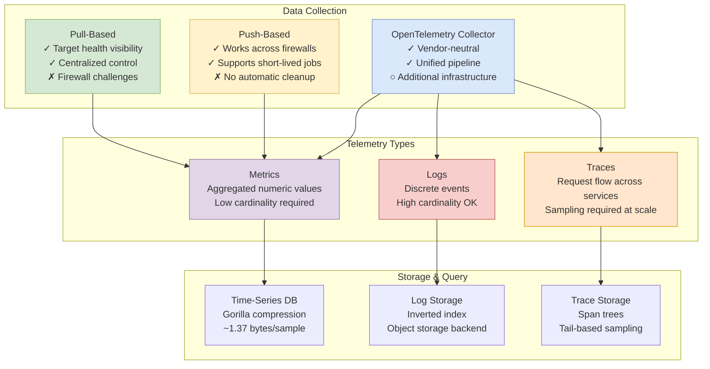

# Distributed Monitoring Systems

Designing observability infrastructure for metrics, logs, and traces: understanding time-series databases, collection architectures, sampling strategies, and alerting systems that scale to billions of data points.

<figure>



<figcaption>Overview of distributed monitoring architecture showing collection methods, telemetry types, and storage backends</figcaption>

</figure>

## Abstract

Distributed monitoring is fundamentally about **trade-offs between resolution, cost, and queryability**. The core tensions:

- **Cardinality vs. cost**: Every unique label combination creates a time series. A single metric with user_id labels across 1M users generates 1M series—each consuming memory and storage.
- **Sampling vs. completeness**: At Google's scale, Dapper samples 1 in 1,024 traces. You'll miss rare issues but avoid drowning in data.
- **Aggregation vs. detail**: Metrics provide fast, cheap aggregates but lose individual request context. Traces preserve full context but cost 100-1000× more per request.

The key mental model:

| Signal      | Cardinality                      | Cost/Event | Query Speed  | Best For                 |
| ----------- | -------------------------------- | ---------- | ------------ | ------------------------ |
| **Metrics** | Must be low (<10K series/metric) | ~0.001¢    | Milliseconds | Dashboards, alerts, SLOs |
| **Logs**    | Unlimited                        | ~0.1¢      | Seconds      | Debugging, audit trails  |
| **Traces**  | Unlimited (but sample)           | ~1¢        | Seconds      | Request flow analysis    |

Modern observability links these signals: **exemplars** connect metric spikes to specific traces; **trace IDs** in logs enable correlation. The goal is starting from a metric alert, drilling into relevant traces, and finding the specific log line—without pre-aggregating everything.

## Metrics: Types and Data Models

### Counter

A **counter** is a monotonically increasing value that resets to zero on restart. Use for: request counts, bytes transferred, errors.

**Critical behavior**: Counters must be queried with `rate()` or `increase()`, not raw values. A counter showing `1,000,000` tells you nothing—`rate(requests_total[5m])` showing `500/sec` is actionable.

**Why monotonic?** If counters could decrease, detecting resets would be ambiguous. The monotonic constraint means any decrease signals a restart, allowing monitoring systems to handle resets correctly.

```
# Bad: querying raw counter
requests_total{service="api"} # Returns 847293847

# Good: rate over time
rate(requests_total{service="api"}[5m]) # Returns 127.3/sec
```

### Gauge

A **gauge** is a value that can increase or decrease. Use for: temperature, queue depth, active connections, memory usage.

**Common mistake**: Using gauges for values that should be counters. If you're tracking "requests since startup" as a gauge, you lose the ability to detect resets and calculate rates correctly.

### Histogram

A **histogram** samples observations and counts them in configurable buckets. Use for: request latency, response sizes.

**Prometheus histogram**:

- Cumulative buckets: `le="0.1"` includes all requests ≤100ms
- Enables percentile calculation via `histogram_quantile()`
- Trade-off: Bucket boundaries are static; wrong boundaries lose precision

```
# Request latency histogram with buckets at 10ms, 50ms, 100ms, 500ms, 1s
http_request_duration_seconds_bucket{le="0.01"} 2451
http_request_duration_seconds_bucket{le="0.05"} 8924
http_request_duration_seconds_bucket{le="0.1"} 12847
http_request_duration_seconds_bucket{le="0.5"} 15234
http_request_duration_seconds_bucket{le="1"} 15401
http_request_duration_seconds_bucket{le="+Inf"} 15523
http_request_duration_seconds_sum 892.47
http_request_duration_seconds_count 15523
```

**OpenTelemetry exponential histogram**: Uses base-2 exponential bucket boundaries computed from a scale factor. At scale 0, boundaries are powers of 2: (0.25, 0.5], (0.5, 1], (1, 2], (2, 4]. The default 160 buckets cover 1ms to 100s with <5% relative error.

**Why exponential?** Explicit histograms require N-1 boundary values (8 bytes each). Exponential histograms need only scale + offset (2 values), reducing storage while maintaining precision across wide ranges.

### Summary

A **summary** calculates streaming quantiles client-side. Use when: exact percentiles are critical and aggregation across instances is not needed.

**Critical limitation**: Summaries cannot be aggregated. The p99 of three services' p99s is mathematically meaningless. For multi-instance services, use histograms.

| Feature             | Histogram                         | Summary                            |
| ------------------- | --------------------------------- | ---------------------------------- |
| Aggregation         | ✅ Can aggregate across instances | ❌ Cannot aggregate                |
| Percentile accuracy | Approximate (bucket-dependent)    | Exact (within time window)         |
| Server cost         | Low (just increment counters)     | Higher (maintains streaming state) |
| Configuration       | Bucket boundaries                 | Quantile targets, time window      |

### The Cardinality Problem

**Cardinality** = unique combinations of metric name × label values. A metric with no labels = 1 series. Add labels:

```
http_requests_total{method, status, endpoint, user_id}
```

With 5 methods × 50 statuses × 100 endpoints × 1M users = **25 billion series**. This will crash any time-series database.

**Design rules**:

1. **Never use unbounded labels**: user_id, request_id, trace_id, email, IP address
2. **Target <10 cardinality per label**: If a label could grow to 100+ values, reconsider
3. **Move high-cardinality data to logs/traces**: They're designed for it

**Cardinality explosion symptoms**:

- Prometheus OOM crashes during compaction
- Query timeouts on dashboards
- Scrape duration exceeding scrape interval
- Memory usage growing faster than data volume

## Collection Architecture: Push vs. Pull

### Pull-Based (Prometheus Model)

Prometheus scrapes HTTP endpoints at configured intervals (default: 15s-60s). Targets expose metrics at `/metrics`.

**Design rationale** (Brian Brazil, Prometheus creator): "Pull is very slightly better... from an engineering standpoint, push vs pull largely doesn't matter. But pull gives you target health visibility—you immediately know when a target is down."

**Advantages**:

- **Target health for free**: Failed scrapes surface immediately via `up` metric
- **Debuggable**: curl the `/metrics` endpoint manually
- **Centralized control**: Change scrape intervals without redeploying apps
- **Natural rate limiting**: Prometheus controls load on targets
- **Graceful degradation**: If Prometheus is down, apps are unaffected

**Disadvantages**:

- **Firewall challenges**: Prometheus must reach targets (problematic for NAT, serverless)
- **Short-lived jobs**: If a job dies before the next scrape, metrics are lost
- **Service discovery required**: Must know all targets

**Scale reference**: A single Prometheus server handles ~800,000 samples/second with 10-second scrape intervals across 10,000+ machines.

### Push-Based (InfluxDB, Datadog Model)

Applications push metrics to a central collector.

**Advantages**:

- **Works across firewalls**: Outbound connections only
- **Supports ephemeral workloads**: Serverless, batch jobs, short-lived containers
- **Event-driven metrics**: Can push immediately on significant events

**Disadvantages**:

- **No automatic target health**: Must implement health checks separately
- **Backpressure complexity**: What happens when the collector is slow?
- **Thundering herd**: All apps pushing simultaneously after restart

### Pushgateway: Bridging the Gap

For batch jobs or serverless functions that can't be scraped:

```
# Job pushes metrics before exiting
echo "batch_job_duration_seconds 47.3" | curl --data-binary @- \
  http://pushgateway:9091/metrics/job/nightly_report
```

**Critical limitation**: Pushgateway never forgets. Metrics persist until manually deleted. A job that ran once months ago still appears in queries.

**When to use**: Only for truly short-lived jobs (<1 scrape interval). Not for long-running services that happen to be behind a firewall—use service mesh or federation instead.

### OpenTelemetry Collector

A vendor-neutral pipeline for receiving, processing, and exporting telemetry.

```
receivers:        # OTLP, Prometheus, Jaeger, etc.
  ↓
processors:       # Batching, sampling, filtering, enrichment
  ↓
exporters:        # Prometheus, Jaeger, vendor backends
```

**Deployment patterns**:

| Pattern       | Use Case              | Trade-off                                     |
| ------------- | --------------------- | --------------------------------------------- |
| **Sidecar**   | Per-pod in Kubernetes | Maximum isolation, highest resource overhead  |
| **DaemonSet** | Per-node agent        | Balanced resource use, node-level correlation |
| **Gateway**   | Centralized cluster   | Lowest overhead, single point of failure      |

**Tail sampling architecture**: To make sampling decisions after trace completion, you need two collector tiers:

1. **Load-balancing tier**: Routes all spans with same trace_id to same collector
2. **Sampling tier**: Buffers complete traces, applies policies, samples

This requires consistent hashing on trace_id—if spans scatter across collectors, you can't make trace-level decisions.

## Time-Series Database Internals

### Gorilla Compression (Facebook, 2015)

The Gorilla paper introduced compression achieving **1.37 bytes per sample** (down from 16 bytes for timestamp + float64).

**Timestamp compression (delta-of-delta)**:

Most metrics arrive at fixed intervals. If scraping every 15 seconds:

```
Timestamps:  1000, 1015, 1030, 1045
Deltas:           15,   15,   15
Delta-of-delta:        0,    0
```

When delta-of-delta = 0, store a single bit. Result: **96% of timestamps compress to 1 bit**.

**Value compression (XOR)**:

Consecutive metric values are often similar. XOR reveals only changed bits:

```
Value 1:   0x4059000000000000 (100.0)
Value 2:   0x4059100000000000 (100.25)
XOR:       0x0000100000000000
```

Store only the position and length of meaningful bits. **51% of values compress to 1 bit** (identical to previous).

### Prometheus TSDB Architecture

**Write path**:

1. **Head block** (in-memory): Last ~2 hours of data
2. **WAL (Write-Ahead Log)**: 128MB segments for crash recovery
3. **Memory-mapped chunks**: Full chunks flushed to disk, memory-mapped back (since v2.19)
4. **Compaction**: Head block → persistent block every 2 hours

**Block structure**:

```
01BKGTZQ1WNWHNJNAC82 (block directory)
├── meta.json           # Block metadata, time range
├── index               # Inverted index: labels → series IDs
├── chunks/             # Compressed time-series data
│   └── 000001
└── tombstones          # Deletion markers
```

**Index design**: Inverted index using roaring bitmaps. Query `{job="api", status="500"}` intersects the bitmap for `job=api` with `status=500` to find matching series IDs.

**Compaction trade-offs**:

- Merges blocks for better compression and query performance
- Uses significant CPU/memory during compaction
- Can cause OOM on high-cardinality setups

### VictoriaMetrics Optimizations

VictoriaMetrics achieves **7× less storage than Prometheus** for the same data through:

- **Better compression**: Custom algorithms beyond Gorilla
- **Optimized inverted index**: Handles high cardinality more gracefully
- **Memory efficiency**: 10× less RAM than InfluxDB for millions of series

**Cluster architecture** (shared-nothing):

- **vminsert**: Stateless, receives data, distributes via consistent hashing
- **vmstorage**: Stateful, stores data, handles queries for its partition
- **vmselect**: Stateless, queries all vmstorage nodes, merges results

vmstorage nodes don't communicate with each other—this simplifies operations but means queries must fan out to all nodes.

### Netflix Atlas Scale

Netflix's Atlas processes **1 billion+ metrics per minute** with:

- In-memory storage for the query hot path (last 2 weeks)
- Inverted index using roaring bitmaps (like Lucene)
- Streaming evaluation for alerts (20× more alert queries than polling could support)

**Dimensional explosion example**: One Netflix service with dimensions for device (~1,000 types) × country (~50) = 50,000 series per node × 100 nodes = 5 million series for one metric. This is normal at Netflix's scale.

## Distributed Tracing

### Fundamentals: Spans and Traces

A **span** represents a single operation: an HTTP request handler, a database query, a function call. Spans contain:

- Trace ID (shared across all spans in the trace)
- Span ID (unique to this span)
- Parent span ID (forms the tree structure)
- Start time, duration
- Tags/attributes (key-value metadata)
- Events/logs (timestamped annotations)

A **trace** is the tree of spans representing a complete request flow across services.

### W3C Trace Context (Standard)

The W3C Trace Context specification defines propagation headers:

**traceparent** (required):

```
00-0af7651916cd43dd8448eb211c80319c-b9c7c989f97918e1-01
│   │                                │                 │
│   │                                │                 └─ Trace flags (sampled)
│   │                                └─ Parent span ID (16 hex chars)
│   └─ Trace ID (32 hex chars)
└─ Version (always 00)
```

**tracestate** (optional): Vendor-specific key-value pairs, max 32 entries:

```
tracestate: congo=t61rcWkgMzE,rojo=00f067aa0ba902b7
```

**Design rationale**: No hyphens in header names (`traceparent` not `trace-parent`) because trace context propagates beyond HTTP—through message queues, databases, etc.—where hyphenated names cause issues.

### Sampling Strategies

At scale, tracing everything is impossible. Google's Dapper samples **1 in 1,024 traces** by default.

**Head-based sampling**: Decision made at trace start.

- ✅ Simple, stateless
- ✅ No buffering required
- ❌ Might miss interesting traces (errors, slow requests)

**Tail-based sampling**: Decision made after trace completion.

- ✅ Can keep all errors, slow traces, specific paths
- ✅ More intelligent sampling policies
- ❌ Requires buffering complete traces
- ❌ Needs consistent routing (all spans to same collector)

**Tail sampling policies** (OpenTelemetry Collector supports 13+):

| Policy               | Keep When                       |
| -------------------- | ------------------------------- |
| **Latency**          | Trace duration > threshold      |
| **Status code**      | Any span has error status       |
| **Rate limiting**    | N traces per second             |
| **Probabilistic**    | Random % of traces              |
| **String attribute** | Specific attribute values match |

**Hybrid approach**: For very high volume, use head-based sampling first (keep 10%), then tail-based sampling on that subset for intelligent filtering.

### Google Dapper Architecture

Dapper's design principles (from the 2010 paper):

1. **Ubiquitous deployment**: Instrument ~1,500 lines of C++ in the RPC library—no application changes
2. **Low overhead**: Sampling keeps CPU impact negligible
3. **Application transparency**: Developers don't need to think about tracing

**Data flow**:

1. Spans written to local log files
2. Daemons collect logs, write to BigTable
3. Each row = one trace, each column = one span
4. Median latency: 15 seconds from span creation to queryable

**Two-level sampling**:

1. **Trace sampling** (in application): 1/1,024 traces instrumented
2. **Collection sampling** (in daemon): Additional filtering before BigTable

"They leverage the fact that all spans for a given trace share a common trace id. For each span seen, they hash the trace id... either sample or discard entire traces rather than individual spans."

## Alerting Systems

### Alertmanager Architecture

Alertmanager processes alerts from Prometheus through:

1. **Dispatcher**: Routes alerts based on label matchers
2. **Inhibition**: Suppresses alerts when related alerts are firing
3. **Silencing**: Mutes alerts during maintenance windows
4. **Grouping**: Batches related alerts into single notifications
5. **Notification**: Sends to receivers (Slack, PagerDuty, email)

**Grouping example**: During an outage affecting 100 pods, you want one page "100 pods down in cluster-east" not 100 separate pages.

```yaml
route:
  group_by: ["alertname", "cluster"]
  group_wait: 30s # Wait for more alerts before sending
  group_interval: 5m # Time between grouped notifications
  repeat_interval: 4h # How often to re-send
```

**Inhibition example**: If the entire cluster is unreachable, suppress all per-pod alerts:

```yaml
inhibit_rules:
  - source_matchers: [severity="critical", alertname="ClusterDown"]
    target_matchers: [severity="warning"]
    equal: ["cluster"]
```

### Threshold-Based vs. Anomaly Detection

**Static thresholds**: Alert when `error_rate > 1%`

- ✅ Predictable, easy to understand
- ❌ Doesn't adapt to traffic patterns
- ❌ Requires manual tuning per service

**Anomaly detection**: Alert when value deviates from learned baseline

- ✅ Adapts to patterns (daily cycles, growth)
- ❌ Black box—hard to explain why it alerted
- ❌ Cold start problem (needs historical data)
- ❌ High false positive rates in practice

**Production reality**: Most teams use static thresholds with percentile-based targets. Anomaly detection works for specific use cases (fraud detection, capacity planning) but not general alerting.

### SLO-Based Alerting (Google SRE Approach)

Traditional alerting on symptoms ("error rate > 1%") has problems:

- What's the right threshold? 1%? 0.1%?
- A 1% error rate for 1 minute is different from 1% for 1 hour

**Error budget** = 1 - SLO. For 99.9% availability: 0.1% error budget per month (~43 minutes).

**Burn rate** = how fast you're consuming error budget. Burn rate 1 = exactly on pace. Burn rate 10 = will exhaust budget in 3 days instead of 30.

**Multi-window, multi-burn-rate alerts** (Google's recommendation):

| Burn Rate | Long Window | Short Window | Severity | Budget Consumed |
| --------- | ----------- | ------------ | -------- | --------------- |
| 14.4      | 1 hour      | 5 min        | Page     | 2% in 1 hour    |
| 6         | 6 hours     | 30 min       | Page     | 5% in 6 hours   |
| 1         | 3 days      | 6 hours      | Ticket   | 10% in 3 days   |

**Why two windows?** The long window catches sustained issues. The short window prevents alerting on issues that already recovered.

**Low-traffic caveat**: If a service gets 10 requests/hour, 1 failure = 10% error rate = 1,000× burn rate. For low-traffic services, use longer evaluation windows or count-based thresholds.

## Observability Correlation

### Exemplars: Connecting Metrics to Traces

An **exemplar** is a trace ID attached to a specific metric sample. When investigating a latency spike, click through to see an actual slow trace.

**How it works**:

```
# Prometheus metric with exemplar
http_request_duration_seconds_bucket{le="0.5"} 24054 # {trace_id="abc123"} 0.47
```

The metric records 24,054 requests ≤500ms. The exemplar says "here's one specific request at 470ms with trace_id abc123."

**Requirements**:

- Client library must support exemplars (OpenTelemetry does)
- TSDB must store exemplars (Prometheus 2.25+)
- Visualization must display and link them (Grafana)

### Trace-Log Correlation

Include trace_id and span_id in structured logs:

```json
{
  "timestamp": "2024-01-15T10:23:45Z",
  "level": "error",
  "message": "Database connection timeout",
  "trace_id": "0af7651916cd43dd8448eb211c80319c",
  "span_id": "b9c7c989f97918e1",
  "service": "order-service"
}
```

Now Grafana can show "all logs for this trace" with a single click from the trace view.

### Metrics from Traces

**Service metrics** (RED): Rate, Errors, Duration computed from spans

**Benefits**:

- No separate instrumentation—traces generate metrics automatically
- Consistent definitions across services
- Enables drill-down from metric to trace

**Trade-off**: Trace-derived metrics have higher latency (spans must be processed) and depend on sampling rates for accuracy.

## Design Choices Summary

### Collection Method

| Factor                   | Pull (Prometheus)       | Push (OTLP)                 | Hybrid (Collector)     |
| ------------------------ | ----------------------- | --------------------------- | ---------------------- |
| Target health visibility | ✅ Built-in `up` metric | ❌ Requires separate checks | ✅ Via receiver health |
| Works through firewalls  | ❌ Needs network access | ✅ Outbound only            | ✅ Configurable        |
| Short-lived jobs         | ❌ May miss             | ✅ Push before exit         | ✅ Via Pushgateway     |
| Configuration location   | Centralized             | Per-application             | Centralized            |

**Default recommendation**: Pull for long-running services (simpler, health built-in). Push via OpenTelemetry Collector for serverless/ephemeral workloads.

### Time-Series Database

| Factor             | Prometheus          | VictoriaMetrics     | Managed (Datadog, etc.) |
| ------------------ | ------------------- | ------------------- | ----------------------- |
| Cost               | Infrastructure only | Infrastructure only | Per-metric pricing      |
| Operational burden | Moderate            | Low-moderate        | None                    |
| High availability  | Federation/Thanos   | Built-in clustering | Built-in                |
| Cardinality limits | ~10M series         | ~100M series        | Soft limits + overage   |

**Scale thresholds**:

- <1M active series: Single Prometheus
- 1-10M series: Prometheus + remote write to long-term storage
- 10M+ series: VictoriaMetrics cluster or managed service

### Tracing Sampling

| Approach   | Overhead | Capture Rate         | Complexity              |
| ---------- | -------- | -------------------- | ----------------------- |
| Head 100%  | Highest  | All traces           | Simple                  |
| Head 1%    | Low      | 1% random            | Simple                  |
| Tail-based | Medium   | All errors + sampled | High (requires routing) |
| Hybrid     | Low      | Best of both         | Highest                 |

**Default recommendation**: Start with head-based 10-100% sampling. Move to tail-based when you need to capture all errors or have volume requiring <1% sampling.

### Alerting Approach

| Approach          | False Positives | Actionability              | Setup Effort |
| ----------------- | --------------- | -------------------------- | ------------ |
| Static thresholds | Medium          | High (clear trigger)       | Low          |
| Anomaly detection | High            | Medium (why alert?)        | Medium       |
| SLO burn rate     | Low             | High (budget impact clear) | High         |

**Default recommendation**: SLO-based alerting with multi-window burn rates for critical services. Static thresholds for simpler cases where SLO definition is unclear.

## Common Pitfalls

### Pitfall 1: Cardinality Explosion from Dynamic Labels

**The mistake**: Adding request_id, user_id, or IP address as metric labels.

**Why it happens**: Developers want to query metrics by these dimensions. It works in development with 100 users.

**The consequence**: Production with 1M users creates 1M series per metric. Prometheus OOMs, queries timeout, alerts stop working.

**The fix**: High-cardinality dimensions belong in logs and traces, not metrics. If you need user-level metrics, use a logging pipeline with columnar storage (ClickHouse, BigQuery).

### Pitfall 2: Alerting on Raw Counter Values

**The mistake**: `alert: requests_total > 1000000`

**Why it happens**: The counter is visible in Grafana, the number is big, seems like a problem.

**The consequence**: Alert fires based on how long the service has been running, not actual request rate. Restarts "fix" the alert.

**The fix**: Always use `rate()` or `increase()` with counters:

```promql
# Alert on request rate, not total
alert: HighRequestRate
expr: rate(requests_total[5m]) > 1000
```

### Pitfall 3: Sampling That Loses Error Traces

**The mistake**: Head-based 1% sampling drops 99% of errors.

**Why it happens**: Error rate is 0.1%. Of that 0.1%, you keep 1% = 0.001% of requests are error traces you can analyze.

**The consequence**: When debugging production issues, no error traces are available.

**The fix**: Tail-based sampling with error retention policy, or hybrid approach:

```yaml
# OpenTelemetry Collector tail sampling
policies:
  - name: errors
    type: status_code
    status_code: { status_codes: [ERROR] }
  - name: probabilistic
    type: probabilistic
    probabilistic: { sampling_percentage: 1 }
```

### Pitfall 4: Alert Fatigue from Noisy Alerts

**The mistake**: Alerting on every metric deviation without proper thresholds or grouping.

**Why it happens**: Starting with "alert on everything" seems safe. Better to over-alert than miss issues.

**The consequence**: On-call ignores alerts. Real incidents get lost in noise. Team burns out.

**The fix**:

1. **SLO-based alerts**: Only page when error budget is burning
2. **Aggressive grouping**: One alert per incident, not per pod
3. **Proper inhibition**: Suppress symptoms when root cause is alerting
4. **Track signal-to-noise ratio**: Target >50% actionable alerts

## Conclusion

Distributed monitoring is not about collecting more data—it's about **collecting the right data at the right resolution for the right cost**.

**Key principles**:

1. **Metrics for dashboards and alerts** (low cardinality, high aggregation)
2. **Logs for debugging** (high cardinality, full detail)
3. **Traces for request flow** (sampled, correlated)
4. **Correlation is the multiplier**: Exemplars, trace IDs in logs, metrics from traces

**Start simple**:

- Pull-based metrics with Prometheus
- Head-based trace sampling at 10%
- SLO-defined alert thresholds

**Scale when needed**:

- Tail-based sampling when error capture matters
- VictoriaMetrics or managed service when cardinality exceeds 10M series
- OpenTelemetry Collector when multi-backend or complex processing required

The 1.37 bytes/sample compression from Gorilla and the 1/1,024 sampling rate from Dapper aren't arbitrary—they represent battle-tested trade-offs from systems handling billions of data points. Understand these trade-offs, and you can design monitoring that scales with your system.

## Appendix

### Prerequisites

- Understanding of distributed systems concepts (latency, throughput, consistency)
- Familiarity with basic statistics (percentiles, rates, distributions)
- Experience with at least one monitoring system (Prometheus, Datadog, etc.)

### Terminology

- **Cardinality**: Number of unique time series (metric name × label value combinations)
- **Scrape**: Prometheus pulling metrics from a target's `/metrics` endpoint
- **Span**: Single operation in a distributed trace (has trace_id, span_id, parent_id)
- **Exemplar**: A trace ID attached to a metric sample for correlation
- **Burn rate**: Speed of error budget consumption relative to SLO (burn rate 1 = on pace)
- **Head block**: In-memory portion of Prometheus TSDB containing recent samples
- **WAL (Write-Ahead Log)**: Durability mechanism that logs writes before applying them
- **OTLP (OpenTelemetry Protocol)**: Standard protocol for transmitting telemetry data

### Summary

- **Cardinality is the primary scaling constraint** for metrics—keep labels bounded (<10 unique values per label)
- **Gorilla compression** achieves 1.37 bytes/sample through delta-of-delta timestamps and XOR-encoded values
- **Pull-based collection** provides target health visibility; push works better for ephemeral workloads
- **Tail-based sampling** captures all errors but requires consistent routing and buffering
- **SLO burn-rate alerts** with multi-window evaluation reduce false positives and false negatives
- **Exemplars and trace IDs** connect metrics, logs, and traces for end-to-end debugging

### References

#### Foundational Papers

- [Gorilla: A Fast, Scalable, In-Memory Time Series Database](https://www.vldb.org/pvldb/vol8/p1816-teller.pdf) - Facebook's compression algorithms achieving 12× reduction in storage (VLDB 2015)
- [Dapper, a Large-Scale Distributed Systems Tracing Infrastructure](https://research.google.com/archive/papers/dapper-2010-1.pdf) - Google's distributed tracing design, basis for Zipkin and Jaeger

#### Specifications

- [W3C Trace Context](https://www.w3.org/TR/trace-context/) - Standard for distributed trace propagation headers
- [OpenTelemetry Metrics Data Model](https://opentelemetry.io/docs/specs/otel/metrics/data-model/) - Specification for metrics including exponential histograms
- [OpenTelemetry Sampling](https://opentelemetry.io/docs/concepts/sampling/) - Head-based and tail-based sampling concepts

#### Official Documentation

- [Prometheus Storage](https://prometheus.io/docs/prometheus/latest/storage/) - TSDB architecture, WAL, compaction
- [Prometheus TSDB: The Head Block](https://ganeshvernekar.com/blog/prometheus-tsdb-the-head-block/) - Deep dive into Prometheus internals by maintainer
- [Alertmanager Configuration](https://prometheus.io/docs/alerting/latest/configuration/) - Routing, grouping, inhibition
- [VictoriaMetrics Cluster Architecture](https://docs.victoriametrics.com/victoriametrics/cluster-victoriametrics/) - Shared-nothing design for high cardinality

#### SRE Practices

- [Google SRE Workbook: Alerting on SLOs](https://sre.google/workbook/alerting-on-slos/) - Multi-window, multi-burn-rate alerting methodology
- [Prometheus Pull Model Rationale](https://prometheus.io/blog/2016/07/23/pull-does-not-scale-or-does-it/) - Design decisions behind pull-based architecture

#### Production Case Studies

- [Netflix Atlas: Primary Telemetry Platform](https://netflixtechblog.com/introducing-atlas-netflixs-primary-telemetry-platform-bd31f4d8ed9a) - Handling 1B+ metrics per minute
- [Grafana Observability Correlation](https://grafana.com/blog/2020/03/31/how-to-successfully-correlate-metrics-logs-and-traces-in-grafana/) - Connecting metrics, logs, and traces
- [Managing High Cardinality in Prometheus](https://grafana.com/blog/2022/10/20/how-to-manage-high-cardinality-metrics-in-prometheus-and-kubernetes/) - Practical cardinality management strategies
