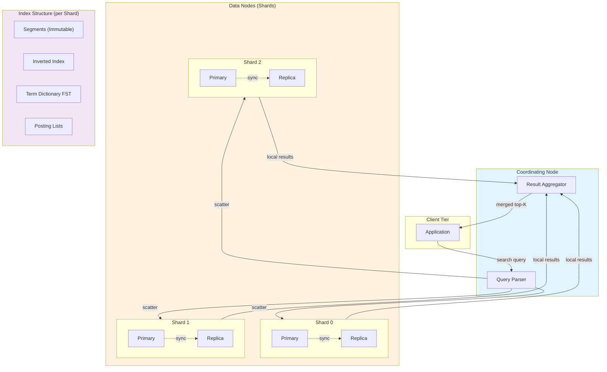

# Distributed Search Engine

Building scalable full-text search systems: inverted index internals, partitioning strategies, ranking algorithms, near-real-time indexing, and distributed query execution. This article covers the design choices that shape modern search infrastructure—from Lucene's segment architecture to Elasticsearch's scatter-gather execution model.

<figure>



<figcaption>Distributed search architecture: coordinating node scatters queries to shards, each containing multiple immutable segments with inverted indexes. Replicas provide fault tolerance and read scalability.</figcaption>
</figure>

## Abstract

Distributed search engines solve the problem of finding relevant documents in collections too large for a single machine. The core data structure is the **inverted index**—a mapping from terms to documents—which transforms O(n) document scans into O(1) term lookups. The fundamental design choices are:

- **Index partitioning**: Document-based (each shard holds complete documents, query fans out to all shards) vs. term-based (each shard holds posting lists for a subset of terms, query hits only relevant shards). Document-based dominates in practice—Google, Elasticsearch, and OpenSearch all use it.
- **Ranking**: BM25 (Okapi Best Match 25) remains the default for lexical search. It extends TF-IDF (Term Frequency–Inverse Document Frequency) with term frequency saturation and document length normalization.
- **Near-real-time (NRT) indexing**: Documents become searchable within seconds through an in-memory buffer flushed to immutable segments. The trade-off: more frequent flushes mean more segments to merge.
- **Query execution**: Scatter-gather pattern where a coordinating node routes queries to all shards, each returns local top-K results, and the coordinator merges them.

The key insight: search engines trade **write complexity** (building and maintaining inverted indexes) for **read performance** (sub-second queries over billions of documents). Lucene's segment-based architecture enables this by making segments immutable—once written, they're never modified, only merged.

## The Inverted Index

### Why Inverted Indexes Exist

A naive search scans every document for query terms—O(n) where n is the document count. At Google's scale (hundreds of billions of web pages), this is infeasible. The inverted index flips the problem: instead of "which terms appear in each document?", it answers "which documents contain each term?"

**Structure:**

```
Term Dictionary           Posting Lists
─────────────────────────────────────────────────────
"distributed"    →    [doc1:3, doc7:1, doc42:5]
"search"         →    [doc1:2, doc7:4, doc15:1, doc42:2]
"engine"         →    [doc7:1, doc15:3]
─────────────────────────────────────────────────────
                       └── document ID : term frequency
```

Each posting list contains document IDs where the term appears, often with:

- **Term frequency (TF)**: How many times the term appears in each document
- **Positions**: Token offsets for phrase queries ("distributed search" requires adjacent positions)
- **Payloads**: Custom per-position data (e.g., part-of-speech tags)

### Lucene's Term Dictionary: Finite State Transducers

Lucene stores the term dictionary as a Finite State Transducer (FST)—a data structure that shares common prefixes and suffixes. For a vocabulary like ["distributed", "distribution", "district"], the FST shares "distri" and compresses the suffixes.

**Design reasoning:** The term dictionary must fit in RAM for fast lookups. FSTs reduce memory by 38-52% compared to tries while improving lookup speed by ~22%. The trade-off: FSTs are immutable (must rebuild to add terms) and construction is complex.

**Real-world example:** Lucene 4.0 (2012) switched from a trie-based dictionary to FSTs. Mike McCandless, Lucene committer, documented the change: "We share both prefixes and suffixes...this can be a big space savings."

### Posting List Compression

Raw posting lists would be enormous—billions of document IDs, each as a 32 or 64-bit integer. Compression is essential.

**Design choices:**

#### Variable Byte (VByte) Encoding

**Mechanism:** Encode integers using 7 bits per byte, with the high bit indicating continuation. Small integers (common in delta-encoded posting lists) use 1-2 bytes.

**Best when:**

- Decoding speed matters more than compression ratio
- Hardware doesn't support SIMD operations

**Trade-offs:**

- ✅ Simple, fast decoding (byte-aligned)
- ✅ Works on any hardware
- ❌ ~2× larger than optimal encoding
- ❌ Sequential decoding (no parallelism)

#### PForDelta (Patched Frame of Reference)

**Mechanism:** Choose bit-width k so 90% of integers fit in k bits. Encode those with k bits; encode exceptions (larger integers) separately.

**Best when:**

- Compression ratio matters
- Integer distribution is skewed (most are small)

**Trade-offs:**

- ✅ Better compression than VByte (~30-40%)
- ✅ SIMD-friendly block decoding
- ❌ More complex implementation
- ❌ Patching overhead for exceptions

#### SIMD-Optimized Variants

Modern CPUs (since ~2010) support SIMD (Single Instruction Multiple Data) operations. Variants like SIMD-BP128 decode 128 integers in parallel.

**Real-world example:** Lucene 8.0 (2019) added SIMD-accelerated decoding. Adrien Grand from Elastic: "Lucene is getting better at taking advantage of modern hardware features."

### Segment-Based Architecture

Lucene doesn't maintain a single mutable index. Instead, it writes immutable **segments**—each a complete mini-index with its own term dictionary and posting lists.

**Why segments?**

1. **Immutability enables caching:** Segments never change, so the OS can cache them aggressively. Modified pages never need to be written back.

2. **Lock-free reads:** Searches never wait for writers. A search uses a point-in-time snapshot of segments.

3. **Efficient writes:** New documents buffer in memory, then flush as a new segment. No rewriting of existing data.

4. **Deletions without rewriting:** Deleted documents are marked in a bitmap (`.liv` file), filtered at query time, and physically removed during segment merges.

**Segment lifecycle:**

```
Memory Buffer → Flush → Segment (searchable) → Merge → Larger Segment
                  ↓
            Transaction Log (durability)
```

**Trade-off:** More segments = more file handles, more memory for term dictionaries, slower searches (must merge results across segments). Merge policies balance freshness against segment count.

## Index Partitioning Strategies

### Design Choices

When an index exceeds single-machine capacity, you must partition it. Two fundamental approaches exist.

#### Document-Based (Horizontal) Partitioning

**Mechanism:** Each shard contains a complete subset of documents. All terms for those documents are indexed locally. A 100-document corpus split across 10 shards puts 10 documents in each shard.

**Best when:**

- Write distribution should be balanced
- Query latency must be predictable
- Operational simplicity matters

**Trade-offs:**

- ✅ Even write distribution (any shard can accept any document)
- ✅ Predictable query fanout (always hit all shards)
- ✅ Simple capacity planning (add shards = add capacity)
- ✅ Fault tolerance (losing a shard loses only some documents)
- ❌ Every query hits every shard (high fanout)
- ❌ Coordinator must merge results from all shards
- ❌ Cross-shard aggregations expensive

**Real-world example:** Elasticsearch uses document-based partitioning exclusively. Twitter's Earlybird search engine uses it: "We have over 40 billion documents...partitioned across a large fleet of servers." Google also uses document-based partitioning for web search.

#### Term-Based (Vertical) Partitioning

**Mechanism:** Each shard contains posting lists for a subset of terms across ALL documents. A query for "distributed search" routes to shards owning "distributed" and "search", then intersects results.

**Best when:**

- Queries are highly selective (few terms)
- Most queries hit a small fraction of terms
- Minimizing query fanout is critical

**Trade-offs:**

- ✅ Selective queries hit fewer shards
- ✅ Popular terms can be replicated
- ❌ Extremely uneven shard sizes (common terms have huge posting lists)
- ❌ Complex rebalancing (moving terms is expensive)
- ❌ Multi-term queries require cross-shard intersection
- ❌ Writes touch multiple shards (one per term in the document)

**Design reasoning:** Term-based partitioning looks attractive theoretically—why scatter a query for "rare_term" to 1000 shards when it appears in only 3 documents? In practice, the write amplification (indexing a document touches many shards) and load balancing complexity (zipf-distributed term frequencies) make it impractical at scale.

**Why document-based won:** Google's 2010 commentary (attributed to engineers) noted that they use document-based partitioning. The write path is simpler, shard sizes are predictable, and the fanout overhead is offset by parallel execution.

### Decision Matrix

| Factor           | Document-Based                 | Term-Based                      |
| ---------------- | ------------------------------ | ------------------------------- |
| Write complexity | O(1) shards                    | O(terms in doc) shards          |
| Query fanout     | All shards                     | Shards owning query terms       |
| Shard balance    | Even by document count         | Highly skewed by term frequency |
| Rebalancing      | Move documents                 | Move posting lists              |
| Used by          | Elasticsearch, Google, Twitter | Rarely in production            |

### Shard Sizing Guidelines

**Elasticsearch/OpenSearch recommendations:**

| Metric              | Guideline                             |
| ------------------- | ------------------------------------- |
| Shard size          | 10-50 GB optimal                      |
| Documents per shard | < 200M                                |
| Shards per node     | < 20 per GB heap                      |
| Primary shards      | Fixed at index creation (in ES < 7.x) |

**Design reasoning:** Smaller shards enable faster recovery and rebalancing but increase cluster overhead (more segments, more coordinating work). Larger shards reduce overhead but make recovery slower and limit parallelism.

## Query Processing and Ranking

### Boolean Retrieval

The foundation: parse queries into Boolean expressions, intersect/union posting lists.

**Query:** `distributed AND search`

```
posting_list("distributed") = [1, 7, 42, 100]
posting_list("search")      = [1, 7, 15, 42]

intersection = [1, 7, 42]
```

**Optimization:** Lucene uses skip lists in posting lists. Instead of iterating through every document ID, you can skip ahead when looking for a specific ID. Skip interval is typically 16 documents.

**Real-world example:** For the query `"common_term" AND "rare_term"`, a naive implementation intersects million-element and hundred-element posting lists. With skip lists, you iterate the smaller list and skip through the larger one—O(|small| × log(|large|)) instead of O(|small| + |large|).

### TF-IDF: The Foundation

Term Frequency–Inverse Document Frequency assigns weight to term-document pairs.

**Term Frequency (TF):** How often a term appears in a document.

**Inverse Document Frequency (IDF):** How rare the term is across the corpus.

$$
\text{TF-IDF}(t, d) = \text{TF}(t, d) \times \log\left(\frac{N}{\text{DF}(t)}\right)
$$

Where:

- $\text{TF}(t, d)$ = occurrences of term $t$ in document $d$
- $N$ = total documents in corpus
- $\text{DF}(t)$ = documents containing term $t$

**Intuition:** A term appearing 10 times in a document about "search engines" is highly relevant. A term like "the" appearing 10 times tells us nothing—it appears in every document.

**Historical note:** Karen Spark Jones introduced IDF in 1972. She observed that term specificity (inverse of document frequency) was a better signal than raw frequency.

### BM25: The Production Standard

Okapi BM25 (Best Match 25) extends TF-IDF with two critical improvements.

**Formula:**

$$
\text{BM25}(D, Q) = \sum_{i=1}^{|Q|} \text{IDF}(q_i) \cdot \frac{f(q_i, D) \cdot (k_1 + 1)}{f(q_i, D) + k_1 \cdot \left(1 - b + b \cdot \frac{|D|}{\text{avgdl}}\right)}
$$

Where:

- $f(q_i, D)$ = frequency of term $q_i$ in document $D$
- $|D|$ = document length
- $\text{avgdl}$ = average document length in corpus
- $k_1$ = term frequency saturation parameter (typically 1.2)
- $b$ = document length normalization (typically 0.75)

**Why BM25 beats TF-IDF:**

1. **Term frequency saturation:** A term appearing 100 times isn't 10× more relevant than appearing 10 times. The $(k_1 + 1)/(f + k_1)$ term creates diminishing returns.

2. **Document length normalization:** A 1000-word document matching a term once is less relevant than a 100-word document matching once. The $b$ parameter controls this normalization.

**Design reasoning:** Robertson and Spark Jones developed BM25 at City University London through the 1980s-90s. The "25" refers to the 25th iteration of their best-match weighting schemes. They found $k_1 = 1.2$ and $b = 0.75$ worked well across many test collections.

**Variants:**

| Variant | Modification                  | Use Case                                    |
| ------- | ----------------------------- | ------------------------------------------- |
| BM25F   | Field-weighted scoring        | Structured documents (title, body, anchors) |
| BM25+   | Floor on length normalization | Very short documents                        |

**Real-world example:** Elasticsearch and Lucene use BM25 as the default similarity since Lucene 6.0 (2016), replacing TF-IDF. The TREC (Text REtrieval Conference) competitions consistently showed BM25 outperforming basic TF-IDF.

### Learning to Rank

BM25 is a formula with fixed parameters. Learning to Rank (LTR) uses machine learning to optimize ranking based on click data or human judgments.

**Approach:**

1. **Extract features:** BM25 score, exact match count, document freshness, PageRank, user engagement metrics
2. **Train model:** XGBoost, LambdaMART, neural networks
3. **Score documents:** Model outputs relevance score from features

**Design choices:**

| Approach  | Training                        | Pros           | Cons                    |
| --------- | ------------------------------- | -------------- | ----------------------- |
| Pointwise | Predict absolute relevance      | Simple         | Ignores ranking context |
| Pairwise  | Predict relative order of pairs | Better ranking | O(n²) pairs             |
| Listwise  | Optimize entire ranked list     | Best quality   | Complex, slow           |

**Real-world example:** Airbnb's search team uses a two-tower neural network for embedding-based retrieval. One tower encodes the query, another encodes listings. Similarity between embeddings determines relevance. They combine this with traditional BM25 for hybrid search.

## Near-Real-Time Indexing

### The NRT Challenge

Traditional Lucene committed segments to disk before they became searchable—seconds to minutes of latency. Near-real-time (NRT) search makes documents searchable within seconds by exposing uncommitted segments.

### Refresh vs. Flush vs. Commit

**Three distinct operations:**

| Operation   | What Happens                                | Durability         | Searchable |
| ----------- | ------------------------------------------- | ------------------ | ---------- |
| **Refresh** | In-memory buffer → filesystem cache segment | No                 | Yes        |
| **Flush**   | Lucene commit + translog truncate           | Yes (Lucene level) | Yes        |
| **Commit**  | fsync segments to disk                      | Yes (OS level)     | Yes        |

**Elasticsearch defaults:**

- Refresh: Every 1 second (if index has been queried in last 30 seconds)
- Flush: When translog exceeds 512MB or 30 minutes elapse

### Transaction Log (Translog)

The translog provides durability between flushes. Every indexing operation writes to both the in-memory buffer and the translog.

**Design reasoning:** Refreshing every second creates segments quickly, but fsyncing every second would kill write throughput. The translog decouples searchability (refresh) from durability (fsync). If a node crashes, it replays the translog on recovery.

**Trade-offs:**

- ✅ Documents searchable in ~1 second
- ✅ Durability without constant fsyncs
- ❌ Translog replay on crash (recovery time)
- ❌ Disk space for translog

**Configuration:**

```json
{
  "index.refresh_interval": "1s",
  "index.translog.durability": "request",
  "index.translog.sync_interval": "5s",
  "index.translog.flush_threshold_size": "512mb"
}
```

### Segment Merging

NRT indexing creates many small segments. Without merging, search performance degrades (more files to open, more posting lists to merge at query time).

**TieredMergePolicy (Lucene default):**

1. Group segments by size tier
2. Merge segments within tiers when count exceeds threshold
3. Skip segments with many deletions (merge those preferentially)
4. Limit concurrent merges to avoid I/O saturation

**Key parameters:**

| Parameter            | Default | Effect                                           |
| -------------------- | ------- | ------------------------------------------------ |
| `max_merged_segment` | 5GB     | Segments larger than this won't be merged        |
| `segments_per_tier`  | 10      | Target segments per tier before triggering merge |
| `max_merge_at_once`  | 10      | Maximum segments merged in one pass              |

**Design reasoning:** Mike McCandless visualized Lucene's segment merges as a "staircase"—small segments at the bottom, merged into medium segments, merged into large segments. The tiered approach balances merge cost (I/O) against segment count (search overhead).

**Real-world example:** Twitter's Earlybird search engine modified the merge policy for their real-time requirements. They prioritize keeping small segments (newer tweets) merged quickly while allowing older segments to grow larger.

## Distributed Query Execution

### Scatter-Gather Pattern

Every distributed search query follows scatter-gather:

1. **Parse:** Coordinating node parses the query
2. **Scatter:** Send query to all shards (or shards matching routing)
3. **Local execution:** Each shard runs the query against local segments
4. **Local ranking:** Each shard returns top-K results
5. **Gather:** Coordinating node merges results
6. **Fetch:** Coordinating node fetches full documents for final top-K

**Why two phases (query then fetch)?**

Fetching full documents is expensive. The first phase returns only document IDs and scores. Only after merging do we know the global top-K and need their full content.

**Real-world example:** For a search with `size=10` across 5 shards, each shard returns its top 10 (50 total). The coordinator merges to find the global top 10, then fetches those 10 documents.

### Deep Pagination Problem

Requesting page 1000 of results (documents 10,000-10,010) requires each shard to return 10,010 documents—O(pages × shards × page_size).

**Solutions:**

| Approach            | Mechanism                                        | Trade-offs                                     |
| ------------------- | ------------------------------------------------ | ---------------------------------------------- |
| `search_after`      | Cursor-based, use sort values from previous page | ✅ Efficient; ❌ No random access              |
| `scroll`            | Snapshot in time, iterate through all results    | ✅ Consistent; ❌ Resource-intensive           |
| `from/size` (naive) | Each shard returns from+size docs                | ❌ O(from × shards), limited to 10K by default |

**Design reasoning:** Elasticsearch limits `from + size` to 10,000 by default (`index.max_result_window`). Beyond that, use `search_after` for stateless pagination or `scroll` for batch processing.

### Adaptive Replica Selection

When a query can hit any replica, which one to choose?

**Round-robin:** Simple but ignores node health.

**Adaptive (Elasticsearch default):**

- Track response times per replica
- Track queue depth per replica
- Prefer replicas with lower latency and shorter queues

**Design reasoning:** A hot replica (handling many queries) has longer queues. An unhealthy replica has higher latency. Adaptive selection routes around both problems automatically.

### Custom Routing

By default, documents route to shards via `hash(document_id) mod num_shards`. Custom routing overrides this:

```json
POST /users/_doc/1?routing=tenant_123
{
  "name": "Alice",
  "tenant_id": "tenant_123"
}
```

**Use cases:**

- **Tenant isolation:** All data for tenant_123 on one shard
- **Correlated data:** User profile and user's posts on same shard
- **Query optimization:** Search within routing = single shard query

**Trade-offs:**

- ✅ Single-shard queries (no fanout)
- ✅ Better data locality
- ❌ Potential hot shards (uneven tenants)
- ❌ Must manage routing values

## Elasticsearch and OpenSearch Architecture

### Node Types

| Node Type        | Responsibilities                                | Resource Profile              |
| ---------------- | ----------------------------------------------- | ----------------------------- |
| **Master**       | Cluster state, shard allocation, index creation | Low CPU/RAM, high reliability |
| **Data**         | Store segments, execute searches, indexing      | High disk, high RAM, high CPU |
| **Coordinating** | Route requests, merge results                   | High CPU, moderate RAM        |
| **Ingest**       | Pre-process documents (pipelines)               | High CPU                      |

**Best practices:**

- Minimum 3 dedicated master nodes (quorum requires majority)
- Separate data and coordinating nodes in large clusters (>50 nodes)
- Size data node heap to 50% of RAM (max 31GB for compressed OOPs)

### Primary and Replica Shards

Every index has N primary shards (fixed at creation in ES < 7.x, configurable now) and M replicas per primary.

**Write path:**

1. Write routes to primary shard
2. Primary indexes document, writes translog
3. Primary forwards to replicas
4. Replicas acknowledge
5. Primary acknowledges to client

**Read path:**

1. Query routes to any copy (primary or replica)
2. Adaptive replica selection picks healthiest copy
3. Results returned to coordinator

**In-sync copies:** Elasticsearch tracks which replicas are "in-sync"—they've acknowledged all operations. Only in-sync replicas can be promoted to primary on failure.

### Segment Replication (OpenSearch)

Traditional Elasticsearch uses **document replication**: each replica independently indexes the same document.

**Problem:** High CPU usage on replicas. N replicas = N× indexing work.

**OpenSearch's segment replication (GA in 2.7, 2023):**

1. Only primary indexes documents
2. Segment files copied to replicas
3. Replicas apply segments without re-indexing

**Results:**

- 40-50% reduction in replica CPU/memory
- 50% higher indexing throughput
- Trade-off: Slightly higher network bandwidth for segment transfer

**Design reasoning:** Segment replication makes sense when indexing is CPU-bound (complex analyzers, many fields). Document replication made sense when network was the bottleneck. Modern networks shifted the trade-off.

### OpenSearch vs. Elasticsearch

**Timeline:**

- January 2021: Elastic changes license from Apache 2.0 to SSPL/Elastic License
- April 2021: AWS forks Elasticsearch 7.10.2 as OpenSearch
- 2024: OpenSearch moves to Linux Foundation
- Late 2024: Elastic adds AGPLv3 option alongside SSPL

**Key differences (as of 2025):**

| Feature             | Elasticsearch                          | OpenSearch               |
| ------------------- | -------------------------------------- | ------------------------ |
| License             | SSPL + Elastic License (AGPLv3 option) | Apache 2.0               |
| Segment replication | No                                     | Yes (GA)                 |
| Security            | Paid (basic auth free)                 | Built-in, free           |
| Vector search       | Dense vector type                      | FAISS/Nmslib integration |
| Performance         | Generally faster on complex queries    | Competitive              |

## Real-World Case Studies

### Twitter: Earlybird Real-Time Search

**Problem:** Index every public tweet (400M+ daily) and make them searchable within 10 seconds.

**Architecture:**

- Custom search engine built on Lucene
- Earlybird servers handle real-time tweets (last 7-10 days)
- Archive servers handle historical tweets
- MinHashing for near-duplicate detection (4 bytes per tweet)

**Design decisions:**

1. **In-memory posting lists:** Recent tweets stay in RAM for single-digit-millisecond latency
2. **Temporal partitioning:** Earlybird handles "now", archive handles history
3. **Custom merge policy:** Optimized for high-velocity writes

**Scale:**

- 2+ billion queries per day
- 50ms average query latency
- Every public tweet since 2006 indexed

**Source:** Twitter Engineering Blog, "Building a Complete Tweet Index" (2014)

### Uber: Real-Time Marketplace Search

**Problem:** Match riders to drivers, eaters to restaurants, across 10,000+ cities with sub-second latency.

**Scale:**

- 800+ billion documents
- 1.5+ million writes per second
- Billions of documents scanned per second

**Architecture evolution:**

1. **Extended Lucene Core:** Modified for true concurrent read/write (standard Lucene commits are blocking)
2. **Virtual clusters:** Scaling beyond single Elasticsearch cluster limits
3. **Hexagonal geospatial queries:** 3× capacity improvement over rectangular bounding boxes

**Key innovation:** Uber moved from Lambda architecture (batch + streaming) to Kappa architecture (streaming only). Real-time updates flow through Kafka, indexed immediately.

**Source:** Uber Engineering Blog, "The Evolution of Uber's Search Platform" (2023)

### DoorDash: Custom Lucene Engine

**Problem:** Elasticsearch's document replication didn't scale for their write-heavy workload.

**Solution:** Built custom search engine on Lucene with segment replication.

**Architecture:**

- Separate indexer and searcher services
- S3 for segment distribution
- Segment replication (not document replication)

**Results:**

- 50% p99.9 latency reduction
- 75% hardware cost decrease

**Design reasoning:** Document replication meant N replicas doing N× the indexing work. For DoorDash's high-cardinality, frequently-updated catalog, this was the bottleneck.

**Source:** DoorDash Engineering Blog, "Introducing DoorDash's In-House Search Engine" (2024)

### Yelp: From Elasticsearch to Nrtsearch

**Problem:** Elasticsearch operational complexity and cost at Yelp's scale.

**Solution:** Built Nrtsearch, a custom Lucene-based search engine.

**Migration:**

- 90%+ of search traffic moved from Elasticsearch to Nrtsearch
- gRPC instead of REST
- Native segment replication

**Why they moved:**

1. Document replication scaling issues
2. Difficulty autoscaling Elasticsearch
3. Cost at their scale (billions of queries)

**Source:** Yelp Engineering Blog, "Nrtsearch: Yelp's Search Engine" (2021)

### Airbnb: Embedding-Based Retrieval

**Problem:** Lexical search (BM25) misses semantic matches. "Beach house" should match "oceanfront cottage."

**Solution:** Two-tower neural network for embedding-based retrieval.

**Architecture:**

1. Query tower encodes search query → 128-dimensional vector
2. Listing tower encodes each listing → 128-dimensional vector
3. ANN (Approximate Nearest Neighbor) search finds similar listings
4. Combine with BM25 scores for hybrid ranking

**Implementation detail:** They use IVF (Inverted File Index) for ANN search—cluster embeddings, then search only relevant clusters.

**Result:** Significant improvement in search relevance, especially for semantic queries.

**Source:** Airbnb Tech Blog, "Embedding-Based Retrieval for Airbnb Search" (2023)

## Common Pitfalls

### Pitfall 1: Over-Sharding

**The mistake:** Creating too many shards at index creation "for future growth."

**Why it happens:** Shards can't be split in older Elasticsearch versions, so teams over-provision.

**The consequence:**

- Each shard has overhead (heap, file handles, cluster state)
- 1000 shards × 20 replicas = 20,000 shard copies in cluster state
- Master node struggles to manage cluster state
- Small shards = inefficient searches (high per-shard overhead relative to data)

**The fix:** Start with fewer, larger shards (10-50GB each). Use index lifecycle management to roll over to new indexes. Elasticsearch 7.x+ supports shard splitting.

### Pitfall 2: Mapping Explosion

**The mistake:** Using dynamic mapping with high-cardinality field names.

**Why it happens:** Indexing JSON with arbitrary keys (e.g., user-generated metadata).

**The consequence:**

- Each unique field name creates mapping entries
- Mapping stored in cluster state (replicated to all nodes)
- 100K+ fields = cluster state bloat, slow master operations

**The fix:**

- Disable dynamic mapping for untrusted input
- Use `flattened` field type for arbitrary JSON
- Limit field count with `index.mapping.total_fields.limit`

### Pitfall 3: Deep Pagination

**The mistake:** Allowing `from=10000&size=100` in production.

**Why it happens:** Building UI with "jump to page 100" functionality.

**The consequence:**

- Each shard returns 10,100 documents
- Coordinator merges 10,100 × num_shards documents
- Memory pressure, slow queries, potential OOM

**The fix:**

- Default limit: `index.max_result_window = 10000`
- Use `search_after` for pagination beyond 10K
- Consider if users actually need page 100 (usually they don't)

### Pitfall 4: Not Tuning Refresh Interval

**The mistake:** Keeping 1-second refresh interval for bulk indexing.

**Why it happens:** Default settings work for search-heavy workloads.

**The consequence:**

- Segment created every second during bulk load
- Massive segment count → merge storm
- Slow indexing, high CPU from merges

**The fix:**

- Set `refresh_interval=-1` during bulk loading
- Refresh manually after bulk load completes
- Or increase to `30s` for write-heavy workloads

### Pitfall 5: Ignoring Segment Merges

**The mistake:** Not monitoring segment count and merge metrics.

**Why it happens:** Merges happen in the background, easy to ignore.

**The consequence:**

- Hundreds of small segments per shard
- Each search opens hundreds of files
- I/O bottleneck, slow searches

**The fix:**

- Monitor `segments.count` metric
- Force merge after bulk loads: `POST /index/_forcemerge?max_num_segments=1`
- Tune merge policy for your workload

## Conclusion

Distributed search engines trade write-time complexity (building inverted indexes, maintaining segments) for read-time performance (sub-second queries over billions of documents). The key design decisions:

1. **Document-based partitioning** dominates in practice. Term-based partitioning's theoretical benefits don't survive contact with write amplification and load balancing complexity.

2. **BM25** remains the production standard for lexical search. Learning-to-rank adds personalization and semantic understanding on top.

3. **Near-real-time indexing** exposes the refresh/flush/commit trichotomy. Understand what each operation does and when documents become searchable.

4. **Segment architecture** is fundamental. Immutable segments enable lock-free reads, efficient caching, and durable writes—but require merge management.

5. **Scatter-gather** is inherent to document-based partitioning. Optimize with adaptive replica selection, custom routing, and avoiding deep pagination.

The companies that build their own search (Twitter, Uber, DoorDash, Yelp) do so not because Elasticsearch is bad, but because their scale exposes specific bottlenecks—usually document replication or operational complexity. For most organizations, managed Elasticsearch or OpenSearch provides the right trade-off between capability and operational burden.

## Appendix

### Prerequisites

- Understanding of B-tree and hash index structures
- Familiarity with distributed systems concepts (partitioning, replication, consensus)
- Basic information retrieval concepts (term frequency, document frequency)

### Terminology

- **Inverted Index:** Data structure mapping terms to the documents containing them
- **Posting List:** Ordered list of document IDs (and metadata) for a single term
- **Segment:** Immutable, searchable unit of a Lucene index
- **Shard:** A single Lucene index; Elasticsearch distributes data across shards
- **TF-IDF (Term Frequency–Inverse Document Frequency):** Weighting scheme for term-document relevance
- **BM25 (Best Match 25):** Probabilistic ranking function extending TF-IDF
- **NRT (Near-Real-Time):** Indexing pattern where documents become searchable within seconds
- **FST (Finite State Transducer):** Compact data structure for term dictionary storage
- **Scatter-Gather:** Distributed query pattern: scatter to shards, gather and merge results

### Summary

- **Inverted indexes** transform O(n) document scans into O(1) term lookups. Lucene uses FSTs for term dictionaries and compressed posting lists.
- **Document-based partitioning** (horizontal sharding) dominates in production. Every query fans out to all shards, but writes are simple.
- **BM25** is the default ranking function—it extends TF-IDF with term frequency saturation and document length normalization.
- **Near-real-time indexing** uses refresh (searchable in ~1s), translog (durability), and segment merging (performance).
- **Segment replication** (OpenSearch) reduces replica CPU by copying segments instead of re-indexing documents.

### References

#### Foundational Papers

- [Robertson, S. & Zaragoza, H. "The Probabilistic Relevance Framework: BM25 and Beyond." Foundations and Trends in Information Retrieval, 2009](https://www.staff.city.ac.uk/~sbrp622/papers/foundations_bm25_review.pdf) - The authoritative reference on BM25 from its creators.
- [Pibiri, G. & Venturini, R. "Techniques for Inverted Index Compression." ACM Computing Surveys, 2020](https://dl.acm.org/doi/10.1145/3415148) - Comprehensive survey of posting list compression techniques.
- [Spark Jones, K. "A statistical interpretation of term specificity and its application in retrieval." Journal of Documentation, 1972](https://asistdl.onlinelibrary.wiley.com/doi/10.1002/asi.4630280302) - Original IDF paper.

#### Official Documentation

- [Elasticsearch Reference](https://www.elastic.co/guide/en/elasticsearch/reference/current/index.html) - Official Elasticsearch documentation.
- [OpenSearch Documentation](https://opensearch.org/docs/latest/) - OpenSearch project documentation.

#### Textbooks

- [Manning, C., Raghavan, P., & Schütze, H. "Introduction to Information Retrieval." Cambridge University Press, 2008](https://nlp.stanford.edu/IR-book/) - The standard IR textbook, freely available online.

#### Engineering Blogs

- [Twitter Engineering: Building a Complete Tweet Index](https://blog.x.com/engineering/en_us/a/2014/building-a-complete-tweet-index) - Earlybird architecture and real-time indexing.
- [Uber Engineering: The Evolution of Uber's Search Platform](https://www.uber.com/blog/evolution-of-ubers-search-platform/) - Scaling search to billions of documents.
- [DoorDash Engineering: Introducing DoorDash's In-House Search Engine](https://doordash.engineering/2024/02/27/introducing-doordashs-in-house-search-engine/) - Custom Lucene engine with segment replication.
- [Yelp Engineering: Nrtsearch](https://engineeringblog.yelp.com/2021/09/nrtsearch-yelps-fast-scalable-and-cost-effective-search-engine.html) - Why Yelp moved from Elasticsearch.
- [Airbnb Tech Blog: Embedding-Based Retrieval](https://medium.com/airbnb-engineering/improving-deep-learning-for-ranking-stays-at-airbnb-959c3fec6212) - Hybrid search with neural embeddings.
- [Mike McCandless: Using Finite State Transducers in Lucene](https://blog.mikemccandless.com/2010/12/using-finite-state-transducers-in.html) - FST implementation details from Lucene committer.

#### Specifications

- [OpenSearch Segment Replication](https://opensearch.org/docs/latest/tuning-your-cluster/availability-and-recovery/segment-replication/index/) - Segment replication design and configuration.
- [Elasticsearch Learning to Rank Plugin](https://elasticsearch-learning-to-rank.readthedocs.io/) - LTR implementation for Elasticsearch.
