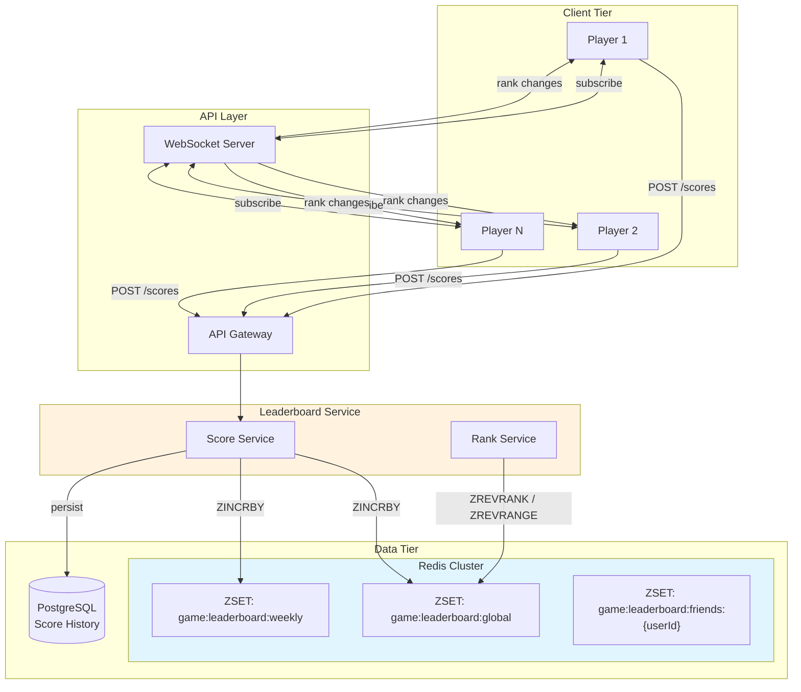

# Leaderboard Design

Building real-time ranking systems that scale from thousands to hundreds of millions of players. This article covers the data structures, partitioning strategies, tie-breaking approaches, and scaling techniques that power leaderboards at gaming platforms, fitness apps, and competitive systems.

<figure>



<figcaption>Leaderboard architecture: score updates write to Redis sorted sets with O(log N) complexity; rank queries served from sorted sets without database joins; WebSockets push real-time rank changes to subscribed players.</figcaption>
</figure>

## Abstract

Leaderboards rank entities by score in real-time. The fundamental challenge: traditional databases compute rankings via nested queries with O(N²) complexity—35 seconds for 50 million records even with indexes. Redis sorted sets (ZSET) solve this with O(log N) insertion and rank lookup using a skip list + hash table dual structure.

Core design decisions:

- **Ranking semantics**: Dense rank (1, 1, 2) vs. sparse rank (1, 1, 3) vs. unique rank (1, 2, 3)—determines how ties affect positions
- **Tie-breaking strategy**: Lexicographic (member string), temporal (first achiever wins), or composite score encoding
- **Partitioning**: Single sorted set (simple, up to ~100M entries) vs. score-range partitioning (hyperscale) vs. time-based partitioning (daily/weekly resets)
- **Approximate vs. exact**: Exact ranking for competitive tiers; approximate percentiles for casual players via probabilistic structures

At hyperscale (300M+ users), a single Redis sorted set cannot hold all entries. Score-range partitioning assigns users to shards by score brackets, enabling neighbor queries without cross-shard joins.

## Why Traditional Databases Fail at Scale

### The Nested Query Problem

Computing a player's rank requires counting how many players have higher scores:

```sql
SELECT COUNT(*) + 1 AS rank
FROM players
WHERE score > (SELECT score FROM players WHERE id = :player_id);
```

This nested subquery scans the table twice. With indexes, performance is O(N log N) best case—still proportional to total players.

**Benchmark reality:**

| Players | Indexed Query Time | Redis ZREVRANK |
| ------- | ------------------ | -------------- |
| 1M      | ~500ms             | <1ms           |
| 10M     | ~10 seconds        | <1ms           |
| 50M     | ~35 seconds        | <1ms           |

The gap exists because databases optimize for flexible queries, not sorted access. Every rank query re-computes ordering from scratch.

### Write Contention at Scale

Relational databases serialize writes to maintain ACID guarantees. A viral game with millions of concurrent score updates overwhelms transaction throughput.

**Bottlenecks:**

1. **Row-level locking**: Concurrent updates to the same row (or nearby rows in an index) cause lock contention
2. **Index maintenance**: B-tree rebalancing on every insert/update
3. **WAL amplification**: Every score change generates write-ahead log entries

Redis sorted sets avoid these: in-memory skip lists support concurrent reads, and single-threaded execution eliminates lock overhead while achieving 100K+ operations/second per instance.

## Redis Sorted Sets: The Foundation

### Internal Architecture

Redis sorted sets use a **dual-ported data structure**:

1. **Skip list**: Maintains score ordering. O(log N) insertion, deletion, and range queries.
2. **Hash table**: Maps member → score for O(1) score lookups.

This combination enables:

- O(log N) `ZADD` (add/update member with score)
- O(log N) `ZRANK` / `ZREVRANK` (get member's position)
- O(log N + M) `ZRANGE` / `ZREVRANGE` (retrieve M members in rank range)
- O(1) `ZSCORE` (get member's score)

**Why skip lists?** B-trees require more memory per node and have higher insertion overhead. Skip lists achieve similar O(log N) complexity with simpler implementation and better cache locality for in-memory workloads.

### Core Commands for Leaderboards

| Command                                 | Purpose                    | Time Complexity |
| --------------------------------------- | -------------------------- | --------------- |
| `ZADD key score member`                 | Add/update score           | O(log N)        |
| `ZINCRBY key increment member`          | Atomic score increment     | O(log N)        |
| `ZREVRANK key member`                   | Get rank (high-to-low)     | O(log N)        |
| `ZRANK key member`                      | Get rank (low-to-high)     | O(log N)        |
| `ZREVRANGE key start stop [WITHSCORES]` | Get top players            | O(log N + M)    |
| `ZRANGEBYSCORE key min max`             | Get players in score range | O(log N + M)    |
| `ZSCORE key member`                     | Get player's score         | O(1)            |
| `ZCARD key`                             | Total player count         | O(1)            |

**Example: Basic leaderboard operations**

```python collapse={1-3}
import redis

r = redis.Redis()

# Update scores (creates key if doesn't exist)
r.zadd("game:leaderboard", {"player_1": 1500, "player_2": 1200, "player_3": 1500})

# Increment score atomically
r.zincrby("game:leaderboard", 100, "player_2")  # Now 1300

# Get top 10 with scores (0-indexed, descending)
top_10 = r.zrevrange("game:leaderboard", 0, 9, withscores=True)
# [('player_1', 1500.0), ('player_3', 1500.0), ('player_2', 1300.0)]

# Get player's rank (0-indexed, so add 1 for display)
rank = r.zrevrank("game:leaderboard", "player_2")  # Returns 2 (3rd place)

# Get nearby players (5 above and below)
player_rank = r.zrevrank("game:leaderboard", "player_2")
start = max(0, player_rank - 5)
nearby = r.zrevrange("game:leaderboard", start, player_rank + 5, withscores=True)
```

### Tie Handling: Lexicographic Ordering

When multiple members have identical scores, Redis orders them **lexicographically by member string**:

```bash
> ZADD leaderboard 100 "alice" 100 "bob" 100 "charlie"
> ZREVRANGE leaderboard 0 -1 WITHSCORES
1) "charlie"
2) "100"
3) "bob"
4) "100"
5) "alice"
6) "100"
```

Lexicographic order: alice < bob < charlie. In reverse range, charlie appears first.

**Implication**: Without explicit tie-breaking, rank order for tied scores depends on member string comparison. This is rarely the desired behavior for competitive leaderboards.

## Ranking Semantics

### Dense vs. Sparse vs. Unique Ranking

Three ranking models exist, analogous to SQL window functions:

| Model           | Tied Scores Example | SQL Equivalent |
| --------------- | ------------------- | -------------- |
| **Dense Rank**  | 1, 1, 2, 3          | `DENSE_RANK()` |
| **Sparse Rank** | 1, 1, 3, 4          | `RANK()`       |
| **Unique Rank** | 1, 2, 3, 4          | `ROW_NUMBER()` |

**Redis sorted sets provide unique ranking by default**—each member has a distinct position based on score + lexicographic order.

#### When to Use Each

**Dense rank** (1, 1, 2):

- All players with the same score share a rank
- The next distinct score gets the next consecutive rank
- Use case: Awards where "top 3" means the 3 highest distinct scores

**Sparse rank** (1, 1, 3):

- Tied players share a rank, but subsequent ranks reflect total players above
- Use case: Tournament standings where position matters for prize distribution

**Unique rank** (1, 2, 3):

- Every player has a distinct position
- Tie-breaking determines order among equal scores
- Use case: Real-time leaderboards displaying a single ordered list

### Implementing Dense Rank

Dense ranking requires counting distinct scores, not positions:

```python collapse={1-3}
import redis

r = redis.Redis()

def get_dense_rank(key: str, member: str) -> int:
    """Count distinct scores higher than this member's score."""
    score = r.zscore(key, member)
    if score is None:
        return None

    # Count members with strictly higher scores
    higher_count = r.zcount(key, f"({score}", "+inf")

    # Count distinct scores above this one using a Lua script for atomicity
    lua_script = """
    local scores = redis.call('ZREVRANGEBYSCORE', KEYS[1], '+inf', ARGV[1], 'WITHSCORES')
    local distinct = {}
    for i = 2, #scores, 2 do
        distinct[scores[i]] = true
    end
    local count = 0
    for _ in pairs(distinct) do count = count + 1 end
    return count
    """
    distinct_higher = r.eval(lua_script, 1, key, f"({score}")
    return distinct_higher + 1
```

**Trade-off**: Dense rank queries are more expensive than unique rank (O(N) worst case for counting distinct scores vs. O(log N) for `ZREVRANK`).

## Tie-Breaking Strategies

### Strategy 1: Composite Score Encoding

Encode primary score and tie-breaker into a single numeric value.

**Timestamp-based (first achiever wins):**

```python
import time

def encode_score(score: int, timestamp: float = None) -> float:
    """
    Encode score + timestamp into a single float.
    Higher score wins. For same score, earlier timestamp wins.

    Format: score.reversed_timestamp
    - Integer part: primary score
    - Decimal part: (MAX_TIMESTAMP - timestamp) / MAX_TIMESTAMP
    """
    if timestamp is None:
        timestamp = time.time()

    MAX_TIMESTAMP = 10**10  # ~300 years from Unix epoch
    reversed_ts = MAX_TIMESTAMP - timestamp
    normalized = reversed_ts / MAX_TIMESTAMP

    return score + normalized
```

**Example:**

- Player A: score 100, timestamp 1000 → `100.99999999900000`
- Player B: score 100, timestamp 2000 → `100.99999999800000`
- Player A ranks higher (achieved score first)

**Bit-shifting for integer precision:**

```python
def encode_score_int64(score: int, timestamp: int) -> int:
    """
    Pack score and reversed timestamp into int64.
    High 32 bits: score
    Low 32 bits: MAX_INT32 - timestamp
    """
    MAX_INT32 = 2**31 - 1
    reversed_ts = MAX_INT32 - (timestamp % MAX_INT32)
    return (score << 32) | reversed_ts

def decode_score_int64(encoded: int) -> tuple[int, int]:
    MAX_INT32 = 2**31 - 1
    score = encoded >> 32
    reversed_ts = encoded & 0xFFFFFFFF
    timestamp = MAX_INT32 - reversed_ts
    return score, timestamp
```

**Advantage**: O(1) encoding/decoding, works with standard sorted set operations.
**Limitation**: Precision loss for very large scores or timestamps; 64-bit integers have finite precision.

### Strategy 2: Secondary Hash Lookup

Store timestamps separately; resolve ties on read:

```python collapse={1-4}
import redis
import time

r = redis.Redis()

def update_score(leaderboard: str, player: str, score: int) -> None:
    """Update score and timestamp atomically."""
    pipe = r.pipeline()
    pipe.zadd(leaderboard, {player: score})
    pipe.hset(f"{leaderboard}:timestamps", player, time.time())
    pipe.execute()

def get_top_with_tiebreak(leaderboard: str, count: int) -> list:
    """Get top N, breaking ties by timestamp (earlier wins)."""
    # Get more than needed to handle ties at boundary
    results = r.zrevrange(leaderboard, 0, count * 2, withscores=True)
    timestamps = r.hmget(f"{leaderboard}:timestamps", [p for p, _ in results])

    # Combine and sort
    combined = [(player, score, float(ts or 0)) for (player, score), ts in zip(results, timestamps)]
    combined.sort(key=lambda x: (-x[1], x[2]))  # Descending score, ascending timestamp

    return [(player, score) for player, score, _ in combined[:count]]
```

**Advantage**: Preserves full timestamp precision; flexible tie-breaking logic.
**Limitation**: Additional Redis round-trip for timestamps; potential race conditions without Lua scripts.

### Strategy 3: Member String Encoding

Embed tie-breaker in the member name itself:

```python
def make_member(player_id: str, timestamp: int) -> str:
    """Create member string that sorts correctly on ties."""
    # Pad timestamp to fixed width for correct lexicographic ordering
    MAX_TS = 10**13
    reversed_ts = MAX_TS - timestamp
    return f"{reversed_ts:013d}:{player_id}"

def parse_member(member: str) -> str:
    """Extract player_id from member string."""
    return member.split(":", 1)[1]
```

With all members having the same score, `ZRANGEBYLEX` provides efficient range queries sorted by tie-breaker.

**Limitation**: Requires parsing member strings on every read; complicates player lookup by ID.

### Decision Matrix: Tie-Breaking

| Strategy        | Complexity | Precision | Lookup by ID | Best For                 |
| --------------- | ---------- | --------- | ------------ | ------------------------ |
| Composite score | O(1)       | Limited   | O(log N)     | High-frequency updates   |
| Secondary hash  | O(2)       | Full      | O(1)         | Complex tie-breakers     |
| Member encoding | O(1)       | Full      | O(N) scan    | All-same-score scenarios |

## Time-Based Leaderboards

### Partitioning by Time Window

Most games need daily, weekly, and all-time leaderboards. Each requires a separate sorted set:

```python collapse={1-5}
import redis
from datetime import datetime, timezone

r = redis.Redis()

def get_time_keys(base_key: str) -> tuple[str, str, str]:
    """Generate keys for current time windows."""
    now = datetime.now(timezone.utc)
    daily = now.strftime("%Y%m%d")
    # ISO week number
    weekly = f"{now.year}W{now.isocalendar()[1]:02d}"

    return (
        f"{base_key}:daily:{daily}",
        f"{base_key}:weekly:{weekly}",
        f"{base_key}:alltime"
    )

def update_all_leaderboards(player: str, score_delta: int) -> None:
    """Update all time-windowed leaderboards atomically."""
    daily, weekly, alltime = get_time_keys("game:leaderboard")

    pipe = r.pipeline()
    pipe.zincrby(daily, score_delta, player)
    pipe.zincrby(weekly, score_delta, player)
    pipe.zincrby(alltime, score_delta, player)
    pipe.execute()
```

### Automatic Expiration

Set TTL on time-windowed leaderboards to prevent unbounded growth:

```python
def update_with_ttl(leaderboard: str, player: str, score: int, ttl_seconds: int) -> None:
    """Update score and set/refresh TTL."""
    pipe = r.pipeline()
    pipe.zadd(leaderboard, {player: score})
    pipe.expire(leaderboard, ttl_seconds)
    pipe.execute()

# Daily leaderboards: 48 hours (buffer for timezone edge cases)
update_with_ttl("game:leaderboard:daily:20240115", "player_1", 100, 48 * 3600)

# Weekly leaderboards: 14 days
update_with_ttl("game:leaderboard:weekly:2024W03", "player_1", 500, 14 * 86400)
```

### Historical Leaderboard Archival

After a time window closes, snapshot the final standings:

```python collapse={1-4}
import json

r = redis.Redis()

def archive_leaderboard(leaderboard_key: str, archive_key: str) -> None:
    """Archive final standings to a Redis Stream or database."""
    # Get top 1000 with scores
    top_players = r.zrevrange(leaderboard_key, 0, 999, withscores=True)

    # Store as JSON in a stream for cheap historical queries
    archive_data = json.dumps([{"player": p, "score": s, "rank": i+1}
                               for i, (p, s) in enumerate(top_players)])
    r.xadd(archive_key, {"data": archive_data})

    # Optionally persist to PostgreSQL for complex queries
    # db.execute("INSERT INTO leaderboard_history ...")
```

## Scaling Beyond Single Instance

### When Single Redis Isn't Enough

A single Redis sorted set handles approximately:

- **100M members**: ~8GB memory (member strings + scores + skip list overhead)
- **100K operations/second**: Write throughput ceiling (single-threaded execution)

Beyond this, partitioning is required.

### Score-Range Partitioning

Partition players by score brackets:

```
Shard 0: scores 0 - 999
Shard 1: scores 1000 - 9999
Shard 2: scores 10000 - 99999
Shard 3: scores 100000+
```

**Advantages:**

- Neighbor queries (players near your rank) stay within one shard
- Top-N queries only read the highest-score shard
- Hot shards (high scores) can be scaled independently

**Implementation:**

```python collapse={1-5}
import redis
from typing import Optional

# Shard configuration
SCORE_RANGES = [
    (0, 999, "shard_0"),
    (1000, 9999, "shard_1"),
    (10000, 99999, "shard_2"),
    (100000, float("inf"), "shard_3"),
]

def get_shard_for_score(score: int) -> str:
    for min_score, max_score, shard in SCORE_RANGES:
        if min_score <= score <= max_score:
            return shard
    return SCORE_RANGES[-1][2]

def update_score_sharded(player: str, old_score: Optional[int], new_score: int) -> None:
    """Move player between shards if score bracket changed."""
    new_shard = get_shard_for_score(new_score)

    if old_score is not None:
        old_shard = get_shard_for_score(old_score)
        if old_shard != new_shard:
            # Atomic move using Lua script or pipeline
            pipe = r.pipeline()
            pipe.zrem(f"leaderboard:{old_shard}", player)
            pipe.zadd(f"leaderboard:{new_shard}", {player: new_score})
            pipe.execute()
            return

    r.zadd(f"leaderboard:{new_shard}", {player: new_score})

def get_global_rank(player: str, score: int) -> int:
    """Calculate global rank across shards."""
    player_shard = get_shard_for_score(score)

    # Count all players in higher-score shards
    higher_count = 0
    for min_score, max_score, shard in SCORE_RANGES:
        if min_score > score:
            higher_count += r.zcard(f"leaderboard:{shard}")

    # Add rank within player's shard
    rank_in_shard = r.zrevrank(f"leaderboard:{player_shard}", player)

    return higher_count + rank_in_shard + 1
```

### Game-Based or Region-Based Partitioning

For multi-game platforms or global deployments:

```
leaderboard:fortnite:na-east
leaderboard:fortnite:eu-west
leaderboard:valorant:na-east
leaderboard:valorant:eu-west
```

Each partition is a self-contained leaderboard. Cross-region global rankings aggregate via periodic rollup jobs.

### Redis Cluster Limitations

Redis Cluster partitions by key hash. A single sorted set (`leaderboard:global`) cannot span multiple nodes—all members reside on one node.

**Workarounds:**

1. **Application-level sharding**: Multiple sorted sets with routing logic (as shown above)
2. **Proxy layer**: mcrouter or Twemproxy for client-side consistent hashing
3. **Hash tags**: `{game:1}:leaderboard` forces related keys to the same slot

## Approximate Ranking at Hyperscale

For 300M+ users, exact ranking for every player is unnecessary and expensive. Players in the bottom 90% rarely check their exact rank—percentile is sufficient.

### Percentile Buckets

Track only top N precisely; estimate percentile for others:

```python collapse={1-4}
import redis

r = redis.Redis()

TOP_N = 100000  # Track top 100K precisely

def update_score_hybrid(player: str, score: int) -> None:
    """Maintain exact rankings for top players only."""
    # Always add to main leaderboard for percentile estimation
    r.zincrby("leaderboard:scores", score, player)

    # Check if player qualifies for precise tracking
    current_threshold = r.zrevrange("leaderboard:top", TOP_N - 1, TOP_N - 1, withscores=True)
    threshold_score = current_threshold[0][1] if current_threshold else 0

    if score >= threshold_score:
        r.zadd("leaderboard:top", {player: score})
        # Trim to top N
        r.zremrangebyrank("leaderboard:top", 0, -TOP_N - 1)

def get_rank_or_percentile(player: str) -> dict:
    """Return exact rank if in top N, otherwise percentile."""
    # Check top leaderboard first
    rank = r.zrevrank("leaderboard:top", player)
    if rank is not None:
        return {"rank": rank + 1, "percentile": None}

    # Calculate percentile
    score = r.zscore("leaderboard:scores", player)
    if score is None:
        return {"rank": None, "percentile": None}

    total = r.zcard("leaderboard:scores")
    higher_count = r.zcount("leaderboard:scores", f"({score}", "+inf")
    percentile = (1 - higher_count / total) * 100

    return {"rank": None, "percentile": round(percentile, 1)}
```

### HyperLogLog for Player Count

When total player count itself is expensive to maintain exactly:

```python
def estimate_total_players(game_id: str) -> int:
    """Estimate unique players using HyperLogLog (~1.5KB memory)."""
    return r.pfcount(f"game:{game_id}:players:hll")

def register_player(game_id: str, player_id: str) -> None:
    """Track player in HLL with 2% standard error."""
    r.pfadd(f"game:{game_id}:players:hll", player_id)
```

**Trade-off**: 2% error for ~0.01% of exact counting memory.

## Real-Time Updates

### Push Model: WebSockets

For live-updating leaderboards, push rank changes to subscribed clients:

```python collapse={1-5}
import asyncio
import redis.asyncio as redis

r = redis.Redis()

async def subscribe_rank_changes(player: str, websocket):
    """Push rank updates to connected player."""
    pubsub = r.pubsub()
    await pubsub.subscribe(f"leaderboard:updates:{player}")

    async for message in pubsub.listen():
        if message["type"] == "message":
            await websocket.send(message["data"])

async def notify_rank_change(player: str, old_rank: int, new_rank: int) -> None:
    """Publish rank change event."""
    await r.publish(f"leaderboard:updates:{player}",
                    f'{{"old_rank": {old_rank}, "new_rank": {new_rank}}}')
```

### Batched Updates

For high-frequency score changes, batch updates to reduce Redis round-trips:

```python collapse={1-5}
import asyncio
from collections import defaultdict

pending_updates = defaultdict(int)
lock = asyncio.Lock()

async def queue_score_update(player: str, delta: int) -> None:
    """Queue score update for batching."""
    async with lock:
        pending_updates[player] += delta

async def flush_updates() -> None:
    """Flush all pending updates to Redis."""
    async with lock:
        if not pending_updates:
            return

        pipe = r.pipeline()
        for player, delta in pending_updates.items():
            pipe.zincrby("leaderboard", delta, player)
        await pipe.execute()
        pending_updates.clear()

# Run flush every 100ms
async def batch_flusher():
    while True:
        await asyncio.sleep(0.1)
        await flush_updates()
```

**Trade-off**: 100ms staleness for 10x throughput improvement.

## Common Pitfalls

### Pitfall 1: Forgetting Tie-Breakers

**The mistake**: Using `ZREVRANK` directly without considering ties.

**Why it happens**: Works correctly in development with few players; ties are rare.

**The consequence**: In production, players with identical scores have arbitrary relative order that changes on Redis restart (hash table iteration order).

**The fix**: Always implement explicit tie-breaking via composite scores or secondary lookup.

### Pitfall 2: O(N) Leaderboard Renders

**The mistake**: Calling `ZREVRANGE 0 -1` to render the full leaderboard.

**Why it happens**: Simple implementation; works with small datasets.

**The consequence**: With 1M players, returns 1M elements. Network transfer, memory allocation, and client rendering collapse.

**The fix**: Always paginate: `ZREVRANGE start end`. Default to top 100; lazy-load on scroll.

### Pitfall 3: Cross-Shard Rank Queries

**The mistake**: Querying global rank across partitioned leaderboards on every request.

**Why it happens**: Naive implementation of `get_global_rank` sums counts from all shards.

**The consequence**: O(shards) Redis calls per rank query. At 100 shards, 100 round-trips per request.

**The fix**: Cache shard counts; update asynchronously. Or pre-compute global ranks for active players periodically.

### Pitfall 4: Missing TTL on Time-Windowed Leaderboards

**The mistake**: Creating daily/weekly leaderboards without expiration.

**Why it happens**: Focus on current functionality; cleanup deferred.

**The consequence**: Unbounded memory growth. After a year: 365 daily + 52 weekly leaderboards consuming GB of memory.

**The fix**: Set TTL at creation time. Use key naming conventions that include the date for easy cleanup: `leaderboard:daily:20240115`.

### Pitfall 5: Atomic Updates Across Multiple Leaderboards

**The mistake**: Updating daily, weekly, and all-time leaderboards in separate commands.

**Why it happens**: Simpler code; Redis transactions seem overkill.

**The consequence**: Partial failure leaves leaderboards inconsistent. Player appears in all-time but not daily.

**The fix**: Use `MULTI/EXEC` transactions or Lua scripts for atomic multi-key updates.

## Real-World Examples

### Gaming Platforms: PlayFab (Microsoft)

**Architecture**: Time-versioned statistics with automatic reset.

- Weekly resets at midnight UTC every Monday
- Monthly resets at midnight UTC on the first
- Leaderboard versions are preserved for historical queries

**Key design**: Statistics are reset, not deleted. Previous version remains queryable via `statistic_version` parameter.

### Google Play Games Services

**Automatic time windows**: Every leaderboard created automatically has daily, weekly, and all-time versions.

- Daily: Reset at midnight PDT (UTC-7)
- Weekly: Reset Saturday midnight to Sunday

**Key design**: No additional configuration required. Game developers get time-windowed leaderboards "for free" with the SDK.

### Netflix (Counter Abstraction)

**Hybrid consistency model** applied to leaderboard-like counters:

- **Best-Effort Regional**: EVCache only, sub-millisecond latency
- **Eventual Global**: Event log + rollup, single-digit ms
- **Accurate Global**: Pre-aggregated total + live delta

**Key insight**: Different leaderboards (engagement metrics vs. competitive rankings) need different consistency levels.

## Conclusion

Leaderboard design balances ranking accuracy against latency and scale. Redis sorted sets provide O(log N) operations that relational databases cannot match for real-time ranking. The key decisions are:

1. **Ranking semantics**: Choose dense, sparse, or unique ranking based on how ties should affect positions
2. **Tie-breaking**: Composite score encoding handles most cases; secondary lookups when full precision matters
3. **Time partitioning**: Separate sorted sets per time window with TTL for automatic cleanup
4. **Scaling**: Score-range partitioning for hyperscale; approximate rankings for casual tiers

For most applications, a single Redis sorted set with composite scores (score + reversed timestamp) and time-windowed variants handles millions of players with sub-millisecond latency. Scale beyond 100M requires application-level sharding with careful attention to cross-shard rank computation.

## Appendix

### Prerequisites

- Understanding of Redis data types (strings, hashes, sorted sets)
- Familiarity with O(log N) data structures (skip lists, balanced trees)
- Basic distributed systems concepts (partitioning, replication)

### Terminology

- **ZSET (Sorted Set)**: Redis data type storing unique members with associated scores, ordered by score
- **Skip list**: Probabilistic data structure enabling O(log N) search, insert, and delete
- **Dense rank**: Ranking where ties share a rank and subsequent ranks are consecutive (1, 1, 2)
- **Sparse rank**: Ranking where ties share a rank but subsequent ranks skip positions (1, 1, 3)
- **Score-range partitioning**: Sharding strategy assigning members to shards based on score brackets
- **Composite score**: Single numeric value encoding multiple sort criteria (e.g., score + timestamp)

### Summary

- Redis sorted sets provide O(log N) ranking operations via skip list + hash table dual structure
- Traditional database ranking queries are O(N²)—35 seconds for 50M rows
- Tie-breaking requires explicit strategy: composite scores, secondary lookups, or member encoding
- Time-windowed leaderboards use separate sorted sets with TTL for automatic cleanup
- Scaling beyond 100M entries requires score-range partitioning or approximate percentile buckets
- Always implement pagination for leaderboard renders; never return unbounded results

### References

- [Redis Sorted Sets Documentation](https://redis.io/docs/latest/develop/data-types/sorted-sets/) - Official data type reference and command list
- [ZADD Command Reference](https://redis.io/docs/latest/commands/zadd/) - Time complexity and options (NX, XX, GT, LT)
- [ZRANK / ZREVRANK Command Reference](https://redis.io/docs/latest/commands/zrank/) - Rank retrieval behavior and WITHSCORE option
- [Building a Real-Time Gaming Leaderboard with Amazon ElastiCache for Redis](https://aws.amazon.com/blogs/database/building-a-real-time-gaming-leaderboard-with-amazon-elasticache-for-redis/) - AWS reference architecture
- [Leaderboard System Design](https://systemdesign.one/leaderboard-system-design/) - Comprehensive design patterns and API design
- [Using Resettable Statistics and Leaderboards - PlayFab](https://learn.microsoft.com/en-us/gaming/playfab/community/leaderboards/tournaments-leaderboards/using-resettable-statistics-and-leaderboards) - Time-versioned leaderboard implementation
- [Google Play Games Services Leaderboards](https://developers.google.com/games/services/common/concepts/leaderboards) - Automatic daily/weekly/all-time variants
- [Fenwick Tree vs Segment Tree](https://www.geeksforgeeks.org/dsa/fenwick-tree-vs-segment-tree/) - Alternative data structures for counting queries
- [Leaderboard Tie-breaker Sorted by Time](https://medium.com/@shawnpengtw/leaderboard-tie-breaker-sorted-by-time-6279ae217920) - Composite score encoding techniques
