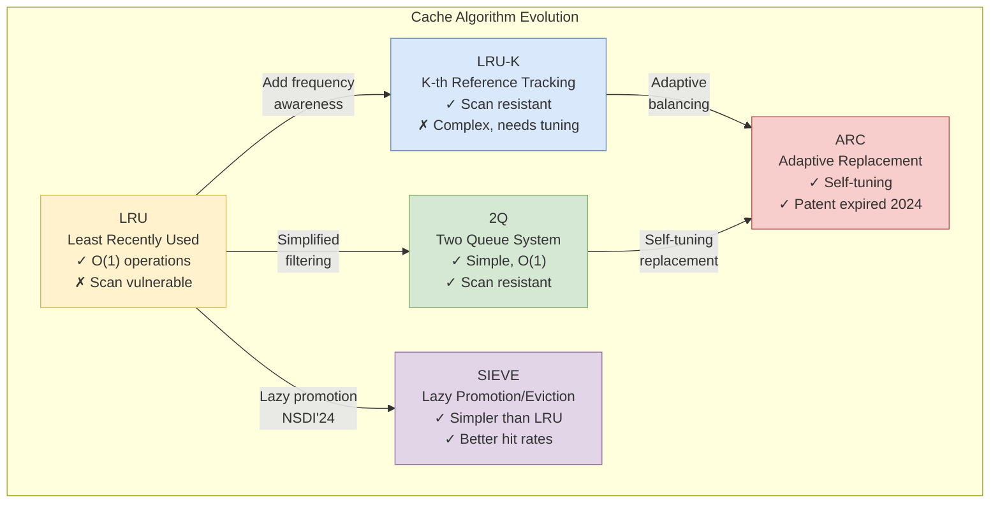
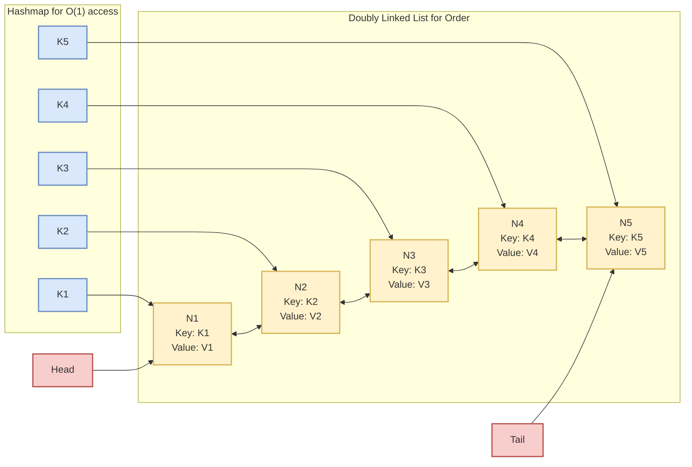

# LRU Cache Design: Eviction Strategies and Trade-offs

Learn the classic LRU cache implementation, understand its limitations, and explore modern alternatives like LRU-K, 2Q, ARC, and SIEVE for building high-performance caching systems.

<figure>



<figcaption>Evolution of cache replacement algorithms from basic LRU to modern alternatives</figcaption>

</figure>

## Abstract

Cache eviction is fundamentally a prediction problem: given limited memory, which items should be kept to maximize future hits? The core insight is that different access patterns require different prediction strategies.

**The Trade-off Space:**

| Strategy         | Predicts Future Access By | Vulnerable To          | Best For          |
| ---------------- | ------------------------- | ---------------------- | ----------------- |
| Recency (LRU)    | Recent access             | Sequential scans       | Temporal locality |
| Frequency (LFU)  | Access count              | One-time popular items | Stable popularity |
| Hybrid (ARC, 2Q) | Both signals              | Complexity overhead    | Mixed workloads   |
| Lazy (SIEVE)     | Visited bit + FIFO        | Very short TTLs        | Web caches        |

**Key Design Decisions:**

1. **Recency vs. Frequency**: LRU assumes "recently used = soon needed." This fails catastrophically during sequential scans. Solutions: filter first-time accesses (2Q), adapt dynamically (ARC), or use lazy promotion (SIEVE).

2. **Exact vs. Approximated**: True LRU requires O(1) linked list operations on every access. Approximated LRU (Redis, Linux) samples random keys, trading accuracy for throughput—often 95%+ as effective with better scalability.

3. **Memory Overhead vs. Accuracy**: Ghost lists (ARC) and history tracking (LRU-K) improve hit rates but consume memory. SIEVE achieves comparable results with just one bit per entry.

**Mental Model**: Think of cache eviction as a bouncer at a club with limited capacity. LRU removes whoever hasn't been seen longest. 2Q makes newcomers wait in a probationary area. ARC keeps notes on who was wrongly kicked out and learns from mistakes. SIEVE marks regulars with a wristband and only evicts unmarked patrons.

## The Classic: Understanding LRU

Least Recently Used (LRU) is a cache eviction policy based on a single assumption: **recently accessed data is likely to be accessed again soon**. This principle, called **temporal locality**, holds for many workloads—web browsing, file system access, database queries—making LRU the default choice for general-purpose caching.

**Why LRU Works:**

- **Temporal locality** is common: users revisit pages, code re-executes hot paths, queries repeat
- **Simple mental model**: recent = important, old = expendable
- **No frequency tracking**: avoids overhead of counting accesses

**Why LRU Fails:**

- **Sequential scans**: A full table scan evicts your entire working set with data you'll never access again
- **No frequency signal**: An item accessed 1000 times gets evicted after one scan if it wasn't touched recently
- **One-shot pollution**: Batch jobs, backups, and analytics queries poison the cache

## LRU Implementation: Achieving O(1) Operations

A cache is only useful if it's fast. Both `get` and `put` must be O(1)—anything slower defeats the purpose of caching. The challenge: tracking recency requires ordering, but maintaining sorted order is O(n) or O(log n).

**The Classic Solution: Hash Map + Doubly Linked List**

| Data Structure           | Purpose                | Operation                 |
| ------------------------ | ---------------------- | ------------------------- |
| Hash Map                 | O(1) key lookup        | `map[key] → node pointer` |
| Doubly Linked List (DLL) | O(1) order maintenance | Head = MRU, Tail = LRU    |

**How Operations Work:**

| Operation         | Steps                                     | Complexity |
| ----------------- | ----------------------------------------- | ---------- |
| `get(key)`        | Hash lookup → unlink → relink at head     | O(1)       |
| `put(key, value)` | Update/create at head, evict tail if full | O(1)       |
| Eviction          | Remove tail node, delete from hash map    | O(1)       |

**Why Doubly Linked List?** A singly linked list requires O(n) to find the predecessor for unlinking. Doubly linked lists store `prev` and `next` pointers, enabling O(1) removal from any position.

<figure>



<figcaption>LRU Data Structure - hashmap with Doubly linked list</figcaption>
</figure>

### Implementation 1: Utilizing JavaScript Map's Insertion Order

```ts collapse={1-9}
class LRUCache<K, V> {
  capacity: number
  cache: Map<K, V>

  constructor(capacity: number) {
    this.capacity = capacity
    this.cache = new Map()
  }

  get(key: K): V | null {
    if (!this.cache.has(key)) {
      return null
    } else {
      const value = this.cache.get(key)!
      // Remove and re-insert to move to end (most recently used)
      this.cache.delete(key)
      this.cache.set(key, value)
      return value
    }
  }

  put(key: K, value: V): void {
    if (this.cache.has(key)) {
      // Update existing key - remove and re-insert
      this.cache.delete(key)
    } else if (this.cache.size >= this.capacity) {
      // Remove least recently used (first key in Map)
      const keyToRemove = this.cache.keys().next().value
      this.cache.delete(keyToRemove)
    }
    this.cache.set(key, value)
  }
}
```

### Implementation 2: Classic Doubly Linked List & Hash Map

```ts collapse={46-106}
class LRUCache {
  capacity: number
  cache: Map<number, ListNode>
  list: DoublyLinkedList

  constructor(capacity: number) {
    this.capacity = capacity
    this.cache = new Map()
    this.list = new DoublyLinkedList()
  }

  get(key: number): number {
    if (!this.cache.has(key)) {
      return -1
    } else {
      const node = this.cache.get(key)!
      // Move to head (most recently used)
      this.list.removeNode(node)
      this.list.addToHead(node)
      return node.value
    }
  }

  put(key: number, value: number): void {
    if (this.cache.has(key)) {
      // Update existing key
      const node = this.cache.get(key)!
      node.value = value
      this.list.removeNode(node)
      this.list.addToHead(node)
    } else {
      if (this.cache.size >= this.capacity) {
        // Remove least recently used (tail)
        const removed = this.list.removeTail()
        if (removed) {
          this.cache.delete(removed.key)
        }
      }
      const node = new ListNode(key, value)
      this.list.addToHead(node)
      this.cache.set(key, node)
    }
  }
}

class ListNode {
  key: number
  value: number
  prev: ListNode | null
  next: ListNode | null

  constructor(key: number, value: number) {
    this.key = key
    this.value = value
    this.prev = null
    this.next = null
  }
}

class DoublyLinkedList {
  head: ListNode | null
  tail: ListNode | null

  constructor() {
    this.head = null
    this.tail = null
  }

  addToHead(node: ListNode): void {
    node.next = this.head
    if (this.head) {
      this.head.prev = node
    }
    this.head = node
    if (!this.tail) {
      this.tail = node
    }
  }

  removeNode(node: ListNode): void {
    if (node === this.head) {
      this.head = node.next
    } else if (node === this.tail) {
      this.tail = node.prev
    } else {
      if (node.prev) node.prev.next = node.next
      if (node.next) node.next.prev = node.prev
    }
  }

  removeTail(): ListNode | null {
    if (this.tail) {
      const removed = this.tail
      if (this.head === this.tail) {
        this.head = null
        this.tail = null
      } else {
        this.tail = this.tail.prev
        if (this.tail) {
          this.tail.next = null
        }
      }
      return removed
    }
    return null
  }
}
```

## When LRU Fails: The Scan Problem

LRU equates "recently used" with "important"—an assumption that breaks catastrophically during **sequential scans**.

**The Failure Mechanism:**

```
Before scan: Cache contains hot items A, B, C, D (frequently accessed)
During scan: Items 1, 2, 3, 4... sequentially accessed
After scan:  Cache contains cold items (last N scanned), hot items evicted
Result:      Miss storm as application reloads working set
```

**Why This Matters:**

- A single `SELECT * FROM large_table` can destroy hours of cache warmup
- Background jobs (backups, ETL, analytics) poison production caches
- The scan data is never accessed again, but it displaced data that would have been

**Quantifying the Impact:**

In a cache with 10,000 entries holding a working set with 95% hit rate:

- A 50,000-item sequential scan evicts the entire working set
- Hit rate drops to ~0% until the working set is reloaded
- If working set reload takes 100ms per item, that's 1,000 seconds of degraded performance

### Common LRU Failure Scenarios

| Scenario                   | Why It Fails                           | Frequency        |
| -------------------------- | -------------------------------------- | ---------------- |
| Database full table scans  | Analytics queries touch every row once | Common in OLAP   |
| File system traversals     | `find`, `du`, backup tools             | Daily operations |
| Batch processing           | ETL jobs process datasets sequentially | Nightly jobs     |
| Memory-mapped file reads   | Sequential file I/O                    | Log processing   |
| Cache warmup after restart | Loading entire dataset sequentially    | Deployments      |

## Design Choices: Scan-Resistant Algorithms

To overcome LRU's scan vulnerability, several algorithms incorporate additional signals beyond recency. Each makes different trade-offs between complexity, memory overhead, and adaptivity.

### LRU-K: History-Based Filtering

**Mechanism:** Track the timestamps of the last K accesses per item. Evict based on the K-th most recent access time, not the most recent.

**Why It Works:** Items accessed only once (scan data) have no K-th access time and are evicted first. Items with K accesses have proven popularity.

**Best When:**

- Database buffer pools with mixed OLTP/OLAP workloads
- Workloads where frequency is a better predictor than recency
- K can be tuned for the specific access pattern (typically K=2)

**Trade-offs:**

- ✅ Scan-resistant: single-access items evicted quickly
- ✅ Frequency-aware: distinguishes truly popular items
- ✅ LRU-1 degenerates to standard LRU (backward compatible)
- ❌ Requires K timestamps per entry (memory overhead)
- ❌ K parameter needs tuning (workload-dependent)
- ❌ Naive eviction is O(n); requires heap for O(log n)

**Real-World Example:** The original LRU-K paper (O'Neil et al., 1993) demonstrated that LRU-2 improved buffer hit rates by 5-20% over LRU on database workloads with mixed sequential and random access patterns.

```ts collapse={1-10, 45-74}
class LRUKCache {
  capacity: number
  k: number
  cache: Map<number, { value: number; accessTimes: number[] }>

  constructor(capacity: number, k: number = 2) {
    this.capacity = capacity
    this.k = k
    this.cache = new Map()
  }

  get(key: number): number {
    if (!this.cache.has(key)) {
      return -1
    }

    const item = this.cache.get(key)!
    const now = Date.now()

    // Add current access time
    item.accessTimes.push(now)

    // Keep only the last K access times
    if (item.accessTimes.length > this.k) {
      item.accessTimes.shift()
    }

    return item.value
  }

  put(key: number, value: number): void {
    const now = Date.now()

    if (this.cache.has(key)) {
      const item = this.cache.get(key)!
      item.value = value
      item.accessTimes.push(now)
      if (item.accessTimes.length > this.k) {
        item.accessTimes.shift()
      }
    } else {
      if (this.cache.size >= this.capacity) {
        this.evictLRU()
      }
      this.cache.set(key, { value, accessTimes: [now] })
    }
  }

  private evictLRU(): void {
    let oldestTime = Infinity
    let keyToEvict = -1

    for (const [key, item] of this.cache) {
      if (item.accessTimes.length < this.k) {
        // Items with fewer than K accesses are evicted first
        if (item.accessTimes[0] < oldestTime) {
          oldestTime = item.accessTimes[0]
          keyToEvict = key
        }
      } else {
        // For items with K+ accesses, use K-th most recent access
        const kthAccess = item.accessTimes[item.accessTimes.length - this.k]
        if (kthAccess < oldestTime) {
          oldestTime = kthAccess
          keyToEvict = key
        }
      }
    }

    if (keyToEvict !== -1) {
      this.cache.delete(keyToEvict)
    }
  }
}
```

**Time Complexity Note**: The implementation above has O(n) time complexity for eviction due to the linear scan through all cache entries in `evictLRU()`. For true O(1) operations, you would need:

- **Min-Heap Approach**: Use a min-heap ordered by K-th access time, achieving O(log n) eviction
- **Approximation Approach**: Sample random entries instead of scanning all (trading accuracy for speed)
- **Hybrid Approach**: Maintain sorted structure with periodic rebalancing

In practice, the O(n) eviction complexity is acceptable for small to medium cache sizes (< 10,000 entries), and the simpler implementation reduces bugs and maintenance overhead. For larger caches, production systems typically use approximated LRU-K with sampling.

### 2Q: Probationary Filtering

**Mechanism:** Use two queues to filter first-time accesses before admitting to the main cache.

| Queue               | Type      | Purpose                                |
| ------------------- | --------- | -------------------------------------- |
| A1in (Probationary) | FIFO      | Holds first-time accesses              |
| Am (Main)           | LRU       | Holds proven items (accessed 2+ times) |
| A1out (Ghost)       | Keys only | Remembers recently evicted A1 items    |

**Why It Works:** Sequential scan data enters A1, gets evicted from A1 (never touching Am), and the main cache remains unpolluted. Only items accessed twice make it to Am.

**Best When:**

- Production databases needing scan resistance (PostgreSQL used 2Q in 8.0.1-8.0.2)
- Systems requiring O(1) operations without tuning parameters
- Patent-free implementations required (no patent on 2Q)

**Trade-offs:**

- ✅ True O(1) operations (no heap, no timestamps)
- ✅ Simple to implement and debug
- ✅ Excellent scan resistance
- ✅ No patents
- ❌ Fixed queue sizes may not adapt to workload changes
- ❌ Requires tuning A1/Am size ratio (typically 25%/75%)
- ❌ Ghost list (A1out) adds memory overhead

**Real-World Example:** PostgreSQL briefly used 2Q in versions 8.0.1-8.0.2 after discovering the ARC patent issue. The PostgreSQL developers found 2Q provided comparable performance to ARC without legal concerns. They later moved to clock sweep in 8.1 for better concurrency characteristics.

```ts collapse={1-18, 70-85}
class TwoQueueCache {
  capacity: number
  a1Size: number
  amSize: number

  // A1: probationary queue (FIFO) - uses Map insertion order
  a1: Map<number, number>

  // Am: main cache (LRU) - uses Map insertion order with re-insertion on access
  am: Map<number, number>

  constructor(capacity: number) {
    this.capacity = capacity
    this.a1Size = Math.floor(capacity * 0.25) // 25% for probationary
    this.amSize = capacity - this.a1Size
    this.a1 = new Map()
    this.am = new Map()
  }

  get(key: number): number {
    // Check main cache first (LRU: re-insert to move to end)
    if (this.am.has(key)) {
      const value = this.am.get(key)!
      this.am.delete(key)
      this.am.set(key, value)
      return value
    }

    // Check probationary queue
    if (this.a1.has(key)) {
      const value = this.a1.get(key)!
      // Promote to main cache
      this.a1.delete(key)
      this.am.set(key, value)

      // Ensure main cache doesn't exceed capacity
      if (this.am.size > this.amSize) {
        this.evictFromAm()
      }

      return value
    }

    return -1
  }

  put(key: number, value: number): void {
    // If already in main cache, update (LRU: re-insert)
    if (this.am.has(key)) {
      this.am.delete(key)
      this.am.set(key, value)
      return
    }

    // If in probationary queue, promote to main cache
    if (this.a1.has(key)) {
      this.a1.delete(key)
      this.am.set(key, value)

      if (this.am.size > this.amSize) {
        this.evictFromAm()
      }
      return
    }

    // New item goes to probationary queue (FIFO)
    this.a1.set(key, value)

    if (this.a1.size > this.a1Size) {
      this.evictFromA1()
    }
  }

  private evictFromA1(): void {
    // Remove oldest item from A1 (FIFO - first key in Map)
    const oldestKey = this.a1.keys().next().value
    if (oldestKey !== undefined) {
      this.a1.delete(oldestKey)
    }
  }

  private evictFromAm(): void {
    // Remove least recently used from Am (LRU - first key in Map)
    const oldestKey = this.am.keys().next().value
    if (oldestKey !== undefined) {
      this.am.delete(oldestKey)
    }
  }
}
```

> **Implementation Note**: This implementation achieves true O(1) operations by leveraging JavaScript Map's guaranteed insertion order (ES2015+). The A1 queue uses FIFO semantics (oldest = first inserted = first key), while Am uses LRU semantics (re-insert on access moves to end, evict from beginning).

### ARC: Adaptive Self-Tuning

**Mechanism:** Maintain two LRU lists (T1 for recency, T2 for frequency) with adaptive sizing based on "ghost lists" that remember recently evicted keys.

| List | Contents                | Purpose                         |
| ---- | ----------------------- | ------------------------------- |
| T1   | Recently accessed once  | Recency-focused cache           |
| T2   | Accessed multiple times | Frequency-focused cache         |
| B1   | Keys evicted from T1    | Ghost list for recency misses   |
| B2   | Keys evicted from T2    | Ghost list for frequency misses |

**The Learning Rule:**

- Hit in B1 → "We shouldn't have evicted that recent item" → Increase T1 size
- Hit in B2 → "We shouldn't have evicted that frequent item" → Increase T2 size
- Parameter `p` controls the T1/T2 split and adapts continuously

**Why It Works:** The ghost lists act as a feedback mechanism. ARC learns from its eviction mistakes and automatically adjusts the recency/frequency balance for the current workload.

**Best When:**

- Workloads with unpredictable or shifting access patterns
- Systems where self-tuning eliminates operational burden
- ZFS (uses ARC for its Adjustable Replacement Cache)

**Trade-offs:**

- ✅ Self-tuning: no parameters to configure
- ✅ Handles mixed workloads dynamically
- ✅ Ghost lists provide learning without storing values
- ✅ **Patent expired February 22, 2024** (US6996676B2) — now freely usable
- ❌ Memory overhead: 4 data structures + ghost lists can equal cache size
- ❌ More complex to implement and debug
- ❌ Ghost list maintenance adds CPU overhead

**Patent History and Industry Impact:**

ARC was developed by Nimrod Megiddo and Dharmendra S. Modha at IBM Almaden Research Center. The patent (US6996676B2, filed November 14, 2002, granted February 7, 2006) had significant industry implications:

| System               | Response to ARC Patent                                           |
| -------------------- | ---------------------------------------------------------------- |
| PostgreSQL           | Used ARC in 8.0.0 → Switched to 2Q in 8.0.1 → Clock sweep in 8.1 |
| ZFS                  | Licensed through Sun/IBM cross-licensing agreement               |
| MySQL                | Adopted LIRS algorithm instead                                   |
| Open-source projects | Generally avoided ARC until patent expiration                    |

**Real-World Example:** ZFS has used ARC since its inception (2005) through Sun's cross-licensing agreement with IBM. ZFS extended ARC with L2ARC for SSD caching, demonstrating that the adaptive approach works well for storage systems with mixed sequential/random workloads.

```ts collapse={1-21, 68-137}
class ARCCache {
  capacity: number
  p: number // Adaptation parameter

  // Main cache lists
  t1: Map<number, { value: number; timestamp: number }> // Recently accessed once
  t2: Map<number, { value: number; timestamp: number }> // Recently accessed multiple times

  // Ghost lists (keys only)
  b1: Set<number> // Recently evicted from T1
  b2: Set<number> // Recently evicted from T2

  constructor(capacity: number) {
    this.capacity = capacity
    this.p = 0
    this.t1 = new Map()
    this.t2 = new Map()
    this.b1 = new Set()
    this.b2 = new Set()
  }

  get(key: number): number {
    // Check T1
    if (this.t1.has(key)) {
      const item = this.t1.get(key)!
      this.t1.delete(key)
      this.t2.set(key, { value: item.value, timestamp: Date.now() })
      return item.value
    }

    // Check T2
    if (this.t2.has(key)) {
      const item = this.t2.get(key)!
      item.timestamp = Date.now()
      return item.value
    }

    // Check ghost lists for adaptation
    if (this.b1.has(key)) {
      this.adapt(true) // Increase T1 size
      this.b1.delete(key)
    } else if (this.b2.has(key)) {
      this.adapt(false) // Increase T2 size
      this.b2.delete(key)
    }

    return -1
  }

  put(key: number, value: number): void {
    // If already in cache, update
    if (this.t1.has(key)) {
      const item = this.t1.get(key)!
      this.t1.delete(key)
      this.t2.set(key, { value, timestamp: Date.now() })
      return
    }

    if (this.t2.has(key)) {
      this.t2.set(key, { value, timestamp: Date.now() })
      return
    }

    // New item goes to T1
    this.t1.set(key, { value, timestamp: Date.now() })

    // Ensure capacity constraints
    this.ensureCapacity()
  }

  private adapt(increaseT1: boolean): void {
    if (increaseT1) {
      this.p = Math.min(this.p + 1, this.capacity)
    } else {
      this.p = Math.max(this.p - 1, 0)
    }
  }

  private ensureCapacity(): void {
    const totalSize = this.t1.size + this.t2.size

    if (totalSize <= this.capacity) {
      return
    }

    // Calculate target sizes
    const targetT1 = Math.min(this.p, this.capacity)
    const targetT2 = this.capacity - targetT1

    // Evict from T1 if needed
    while (this.t1.size > targetT1) {
      const oldestKey = this.getOldestKey(this.t1)
      if (oldestKey !== null) {
        const item = this.t1.get(oldestKey)!
        this.t1.delete(oldestKey)
        this.b1.add(oldestKey)

        // Limit ghost list size
        if (this.b1.size > this.capacity) {
          const firstKey = this.b1.values().next().value
          this.b1.delete(firstKey)
        }
      }
    }

    // Evict from T2 if needed
    while (this.t2.size > targetT2) {
      const oldestKey = this.getOldestKey(this.t2)
      if (oldestKey !== null) {
        const item = this.t2.get(oldestKey)!
        this.t2.delete(oldestKey)
        this.b2.add(oldestKey)

        // Limit ghost list size
        if (this.b2.size > this.capacity) {
          const firstKey = this.b2.values().next().value
          this.b2.delete(firstKey)
        }
      }
    }
  }

  private getOldestKey(map: Map<number, { value: number; timestamp: number }>): number | null {
    let oldestKey = null
    let oldestTime = Infinity

    for (const [key, item] of map) {
      if (item.timestamp < oldestTime) {
        oldestTime = item.timestamp
        oldestKey = key
      }
    }

    return oldestKey
  }
}
```

### SIEVE: Lazy Promotion (NSDI'24)

**Mechanism:** Maintain a single FIFO queue with one "visited" bit per entry and a "hand" pointer for eviction.

```
Queue: [A*] [B] [C*] [D*] [E] ← hand points here
       *=visited bit set

On hit:  Set visited bit (no list manipulation)
On miss: Move hand from tail, reset visited bits, evict first unvisited item
```

**Why It Works:**

- Items accessed multiple times have their visited bit set and survive the hand sweep
- Scan data enters, never gets revisited, and is evicted on the first hand pass
- No list manipulation on hits = better cache locality and concurrency

**Best When:**

- Web caches with high throughput requirements
- Systems where lock contention is a concern
- Workloads where items tend to be accessed in bursts

**Trade-offs:**

- ✅ Simpler than LRU (no list manipulation on hits)
- ✅ Better throughput (fewer memory operations)
- ✅ One bit per entry (minimal memory overhead)
- ✅ Outperforms LRU on 45%+ of web cache traces
- ❌ Less effective for very short TTLs (items may be evicted before hand reaches them)
- ❌ Newer algorithm (2024), less battle-tested than LRU/2Q/ARC

**Real-World Example:** SIEVE (Zhang et al., NSDI'24) was evaluated on 1,559 traces containing 247 billion requests. It reduces miss ratio by 21% on average compared to FIFO and has been adopted by production systems including TiDB and Pelikan (Twitter's cache).

```ts collapse={1-8, 35-60}
class SIEVECache<K, V> {
  capacity: number
  cache: Map<K, { value: V; visited: boolean }>
  order: K[] // FIFO order
  hand: number // Eviction pointer

  constructor(capacity: number) {
    this.capacity = capacity
    this.cache = new Map()
    this.order = []
    this.hand = 0
  }

  get(key: K): V | null {
    const entry = this.cache.get(key)
    if (!entry) return null

    // Lazy promotion: just set the visited bit (no list manipulation)
    entry.visited = true
    return entry.value
  }

  put(key: K, value: V): void {
    if (this.cache.has(key)) {
      const entry = this.cache.get(key)!
      entry.value = value
      entry.visited = true
      return
    }

    // Evict if at capacity
    while (this.cache.size >= this.capacity) {
      this.evict()
    }

    // Insert at head (newest position)
    this.cache.set(key, { value, visited: false })
    this.order.unshift(key)
  }

  private evict(): void {
    // Move hand from tail toward head, looking for unvisited item
    while (this.order.length > 0) {
      // Wrap around if needed
      if (this.hand >= this.order.length) {
        this.hand = this.order.length - 1
      }

      const key = this.order[this.hand]
      const entry = this.cache.get(key)

      if (!entry) {
        // Key was deleted externally
        this.order.splice(this.hand, 1)
        continue
      }

      if (entry.visited) {
        // Give it another chance, reset visited bit
        entry.visited = false
        this.hand--
        if (this.hand < 0) this.hand = this.order.length - 1
      } else {
        // Evict this item
        this.cache.delete(key)
        this.order.splice(this.hand, 1)
        return
      }
    }
  }
}
```

### Window TinyLFU (Caffeine)

**Mechanism:** Combine a small "window" LRU cache (1%) with a large "main" cache (99%) using frequency-based admission filtering.

```
Request → Window (1%) → Admission Filter → Main Cache (99%)
                              ↓
                    CountMinSketch (frequency estimate)
```

**Why It Works:**

- Window cache handles burst traffic (recency)
- Main cache uses segmented LRU (protected + probationary)
- Admission filter blocks low-frequency items from polluting main cache
- 4-bit CountMinSketch provides frequency estimates with minimal memory

**Best When:**

- High-throughput Java applications
- Workloads with skewed popularity distributions
- Systems needing near-optimal hit rates with bounded memory

**Trade-offs:**

- ✅ Near-optimal hit rates (within 1% of theoretical best)
- ✅ Only 8 bytes overhead per entry (vs. ARC's doubled cache size for ghosts)
- ✅ Battle-tested (Caffeine is the standard Java cache library)
- ❌ More complex than simpler algorithms
- ❌ Requires frequency decay mechanism (adds CPU overhead)
- ❌ Java-specific reference implementation

**Real-World Example:** Caffeine's W-TinyLFU achieves 39.6% hit rate on benchmark traces where ARC achieves 20% and the theoretical optimal is 40.3%. The key insight: don't track evicted keys (like ARC's ghost lists) — use probabilistic frequency counting instead.

## How to Choose

### Decision Matrix

| Factor                       | LRU      | 2Q       | ARC       | SIEVE   | W-TinyLFU |
| ---------------------------- | -------- | -------- | --------- | ------- | --------- |
| Implementation complexity    | Low      | Medium   | High      | Low     | High      |
| Memory overhead per entry    | 16 bytes | 24 bytes | 32+ bytes | 1 bit   | 8 bytes   |
| Scan resistance              | Poor     | Good     | Excellent | Good    | Excellent |
| Self-tuning                  | No       | No       | Yes       | No      | Partial   |
| Throughput (ops/sec)         | High     | Medium   | Medium    | Highest | High      |
| Patent concerns (as of 2024) | None     | None     | None      | None    | None      |

### Choosing by Workload Pattern

| If Your Workload Has...  | Choose       | Rationale                                 |
| ------------------------ | ------------ | ----------------------------------------- |
| Strong temporal locality | LRU          | Simple, effective, O(1)                   |
| Frequent full scans      | 2Q or SIEVE  | Probationary filtering prevents pollution |
| Unpredictable patterns   | ARC          | Self-tuning adapts automatically          |
| High throughput needs    | SIEVE        | No list manipulation on hits              |
| Skewed popularity (Zipf) | W-TinyLFU    | Frequency-based filtering excels          |
| Memory constraints       | SIEVE or LRU | Minimal per-entry overhead                |

### Common Decision Patterns

**"I just need a cache, nothing special"** → Start with LRU. It's simple, well-understood, and works for most workloads.

**"Full table scans are killing my cache"** → Use 2Q. It filters scan data effectively with O(1) operations and no patents.

**"My workload keeps changing"** → Use ARC. It adapts automatically and the patent expired in 2024.

**"I need maximum throughput"** → Use SIEVE. No list manipulation on hits means better CPU cache locality.

**"I'm building a CDN or web cache"** → Use W-TinyLFU (Caffeine) or SIEVE. Both handle popularity skew well.

## Real-World Applications

The choice of algorithm has profound, practical implications across different domains.

| Aspect               | LRU              | LRU-K                           | 2Q                          | ARC                        | SIEVE              |
| -------------------- | ---------------- | ------------------------------- | --------------------------- | -------------------------- | ------------------ |
| **Primary Criteria** | Recency          | K-th Recency (History)          | Recency + Second Hit Filter | Adaptive Recency/Frequency | Visited bit + FIFO |
| **Scan Resistance**  | Poor             | Good (for K>1)                  | Very Good                   | Excellent                  | Good               |
| **Complexity**       | Low              | High                            | Moderate                    | Moderate-High              | Low                |
| **Time Complexity**  | O(1)             | O(n) naive, O(log n) with heap  | O(1)                        | O(1)                       | O(1)               |
| **Memory Overhead**  | 2 pointers/entry | K timestamps + 2 pointers/entry | 3 maps + metadata           | 4 structures + ghosts      | 1 bit/entry        |
| **Tuning**           | None             | Manual (parameter K)            | Manual (queue sizes)        | Automatic / Self-Tuning    | None               |

### Memory Overhead Analysis

Memory overhead determines how much of your allocated cache space actually holds data vs. metadata.

| Algorithm   | Per-Entry Overhead                    | For 10K entries (64B values) |
| ----------- | ------------------------------------- | ---------------------------- |
| LRU         | ~40-50 bytes (hash + 2 pointers)      | ~1.6 MB                      |
| LRU-K (K=2) | ~56-66 bytes (+ K timestamps)         | ~2.0 MB                      |
| 2Q          | ~60-80 bytes (2 maps + metadata)      | ~2.1 MB                      |
| ARC         | ~80-120 bytes (4 structures + ghosts) | ~2.6 MB                      |
| SIEVE       | ~1 bit + FIFO position                | ~1.0 MB                      |
| W-TinyLFU   | ~8 bytes (CountMinSketch)             | ~1.1 MB                      |

**Key Insight:** ARC's ghost lists can grow to equal the cache size (storing evicted keys), effectively doubling memory usage for metadata. Caffeine's W-TinyLFU solved this by using probabilistic frequency counting instead of ghost lists—same accuracy, fraction of the memory.

## Production Implementations

Real-world systems often use approximated or specialized variants of these algorithms, optimized for their specific constraints.

### Redis: Approximated LRU

Redis uses random sampling instead of tracking exact recency for all keys.

**Mechanism:**

1. Sample N random keys (default: 5, configurable via `maxmemory-samples`)
2. Evict the least recently used among the sampled keys
3. Repeat until memory is below threshold

**Why This Design:**

- No linked list = no pointer overhead per key (just 24 bits for LRU clock)
- No lock contention from list manipulation
- Sampling 10 keys provides ~95% of true LRU accuracy

```
# Redis configuration
maxmemory-policy allkeys-lru
maxmemory-samples 5   # Increase to 10 for near-true LRU accuracy
```

**As of Redis 3.0:** Uses a pool of good eviction candidates that persists across eviction cycles, improving accuracy without increasing per-key memory.

### Linux Kernel: MGLRU

The Linux kernel evolved from a two-list approach to Multi-Generational LRU.

| Era     | Algorithm             | Limitations                           |
| ------- | --------------------- | ------------------------------------- |
| Pre-6.1 | Active/Inactive lists | Binary hot/cold, poor scan resistance |
| 6.1+    | MGLRU                 | Multiple generations, better aging    |

**MGLRU (merged in Linux 6.1, backported to some 5.x kernels):**

- Multiple generations (typically 4) instead of 2 lists
- Pages move to younger generations when accessed
- Workload-aware: adapts scan frequency to access patterns

**Google's deployment results (Chrome OS + Android):**

- 40% decrease in kswapd CPU usage
- 85% decrease in low-memory kill events
- 18% decrease in rendering latency

**Distribution Support:** Enabled by default in Fedora and Arch Linux. Available but not default in Ubuntu and Debian.

### Memcached: Segmented LRU

Memcached uses per-slab-class LRU with modern segmentation.

**Slab Allocator:** Memory is divided into slab classes (64B, 128B, 256B, etc.). LRU is per-class, not global—eviction from the 128B class only evicts 128B items, even if there are older 256B items.

**Modern Segmented LRU (since 1.5.x):**

| Queue | Purpose                                |
| ----- | -------------------------------------- |
| HOT   | Recently written items (FIFO, not LRU) |
| WARM  | Frequently accessed items (LRU)        |
| COLD  | Eviction candidates                    |
| TEMP  | Very short TTL items (no bumping)      |

**Key Optimization:** Items are only "bumped" once every 60 seconds, reducing lock contention dramatically.

### PostgreSQL: Clock Sweep

PostgreSQL uses clock sweep for buffer pool management since version 8.1.

**Mechanism:**

- Circular buffer array with `usage_count` per buffer (0-5)
- "Clock hand" sweeps through buffers
- On sweep: if `usage_count > 0`, decrement and skip; if 0, evict
- On access: increment `usage_count` (saturates at 5)

**Why Clock Sweep:**

- No linked list = no pointer manipulation on buffer access
- Single atomic increment instead of list relinking
- Better concurrency than 2Q (which PostgreSQL used briefly in 8.0.1-8.0.2)

**Implementation Detail:** The `nextVictimBuffer` pointer is a simple unsigned 32-bit integer that wraps around the buffer pool. This simplicity enables high concurrency without complex locking.

## Concurrency and Thread Safety

Production caches must handle concurrent access. The key trade-off: simplicity vs. scalability.

| Strategy         | Pros                                  | Cons                   | Used By           |
| ---------------- | ------------------------------------- | ---------------------- | ----------------- |
| Global lock      | Simple, correct                       | Serializes all ops     | Simple caches     |
| Sharded locking  | Concurrent access to different shards | Hot shards bottleneck  | ConcurrentHashMap |
| Read-write locks | Multiple readers                      | Writer starvation      | Many caches       |
| Lock-free (CAS)  | Best throughput                       | Complex, hard to debug | Caffeine          |

**Production Recommendation:** Don't implement concurrent caches yourself. Use battle-tested libraries:

| Language | Library      | Notes                             |
| -------- | ------------ | --------------------------------- |
| Node.js  | `lru-cache`  | Size limits, TTL support          |
| Java     | Caffeine     | Near-optimal hit rates, lock-free |
| Go       | `groupcache` | Distributed, singleflight         |
| Rust     | `moka`       | Concurrent, TinyLFU-based         |
| Python   | `cachetools` | Simple, extensible                |

## Common Pitfalls

### 1. Cache Stampede (Thundering Herd)

**The Mistake:** Multiple requests miss the cache simultaneously, all hit the backend.

**Why It Happens:** Cache entry expires, N requests arrive before any can repopulate.

**The Consequence:** Backend overwhelmed with N duplicate requests for the same data.

**The Fix:** Use "singleflight" pattern—only one request fetches, others wait for its result.

```ts collapse={1-5, 18-25}
class StampedeProtectedCache<K, V> {
  private cache: Map<K, V>
  private pending: Map<K, Promise<V>> // In-flight requests

  constructor() {
    this.cache = new Map()
    this.pending = new Map()
  }

  async get(key: K, fetch: () => Promise<V>): Promise<V> {
    // Return cached value if present
    if (this.cache.has(key)) return this.cache.get(key)!

    // If another request is fetching, wait for it
    if (this.pending.has(key)) return this.pending.get(key)!

    // This request will fetch
    const promise = fetch().then((value) => {
      this.cache.set(key, value)
      this.pending.delete(key)
      return value
    })
    this.pending.set(key, promise)
    return promise
  }
}
```

### 2. Cache Inconsistency

**The Mistake:** Updating database then cache, or vice versa, without atomicity.

**Why It Happens:** Race conditions between concurrent updates.

**The Consequence:** Cache serves stale data indefinitely.

**The Fix:** Use cache-aside with TTL, or write-through with single source of truth. For critical data, prefer short TTLs over complex invalidation.

### 3. Unbounded Cache Growth

**The Mistake:** Caching everything without size limits.

**Why It Happens:** "More cache = better performance" thinking.

**The Consequence:** OOM crashes, GC pauses, or swapping.

**The Fix:** Always set a max size. For LRU, this is trivial—eviction handles it. For other patterns, monitor memory usage.

### 4. Wrong Cache Key Granularity

**The Mistake:** Cache keys too coarse (cache entire page) or too fine (cache every DB row).

**Why It Happens:** Not analyzing actual access patterns.

**The Consequence:** Too coarse = low hit rate, too fine = high overhead.

**The Fix:** Profile your workload. Match cache granularity to access granularity.

### 5. Ignoring Cache Warmup

**The Mistake:** Deploying with cold cache and expecting production performance.

**Why It Happens:** Testing with warm caches, deploying fresh.

**The Consequence:** Slow starts, backend overload on deployment.

**The Fix:** Pre-warm caches before routing production traffic, or use rolling deployments that let caches warm gradually.

## Conclusion

Cache eviction is fundamentally about prediction: given limited memory, which items should you keep to maximize future hits? The answer depends entirely on your access patterns.

**Decision Framework:**

1. **Start with LRU** for most applications—it's simple, well-understood, and works for temporal locality
2. **Switch to 2Q or SIEVE** when sequential scans are poisoning your cache (analytics queries, batch jobs, backups)
3. **Consider ARC** when your workload is unpredictable and you can't tune parameters (patent expired February 2024)
4. **Use W-TinyLFU (Caffeine)** for CDNs and web caches with skewed popularity distributions

**Production Reality:** Most systems use approximated or specialized variants. Redis samples random keys. Linux uses multiple generations. PostgreSQL uses clock sweep. The textbook algorithms are starting points, not endpoints.

The right cache eviction policy can be the difference between a system that degrades gracefully under load and one that falls over. Understand your access patterns, profile your workload, and choose accordingly.

## Appendix

### Prerequisites

- Understanding of hash tables and linked lists
- Basic knowledge of time complexity (Big O notation)
- Familiarity with cache concepts (hits, misses, eviction)

### Summary

1. **LRU assumes temporal locality**: recently accessed = soon needed. This fails during sequential scans.
2. **Scan resistance requires additional signals**: 2Q uses probationary filtering, ARC uses ghost lists, SIEVE uses visited bits.
3. **Approximated algorithms dominate production**: Redis samples keys, Linux uses MGLRU, PostgreSQL uses clock sweep.
4. **Memory overhead varies significantly**: SIEVE uses 1 bit/entry; ARC can double memory for ghost lists.
5. **No single best algorithm**: the optimal choice depends on your access patterns, memory constraints, and operational requirements.
6. **Common pitfalls are preventable**: cache stampede, inconsistency, unbounded growth, and cold starts all have standard solutions.

### References

#### Original Research Papers

- O'Neil, E. J., O'Neil, P. E., & Weikum, G. (1993). [The LRU-K Page Replacement Algorithm For Database Disk Buffering](https://www.cs.cmu.edu/~natassa/courses/15-721/papers/p297-o_neil.pdf). ACM SIGMOD Record, 22(2), 297-306.

- Johnson, T., & Shasha, D. (1994). [2Q: A Low Overhead High Performance Buffer Management Replacement Algorithm](https://www.vldb.org/conf/1994/P439.PDF). VLDB 1994, 439-450.

- Megiddo, N., & Modha, D. S. (2003). [ARC: A Self-Tuning, Low Overhead Replacement Cache](https://www.cs.cmu.edu/~natassa/courses/15-721/papers/arcfast.pdf). USENIX FAST 2003, 115-130.

- Zhang, Y., Yang, J., Yue, Y., Vigfusson, Y., & Rashmi, K.V. (2024). [SIEVE is Simpler than LRU: an Efficient Turn-Key Eviction Algorithm for Web Caches](https://www.usenix.org/conference/nsdi24/presentation/zhang-yazhuo). USENIX NSDI 2024.

- Einziger, G., Friedman, R., & Manes, B. (2017). [TinyLFU: A Highly Efficient Cache Admission Policy](https://dl.acm.org/doi/10.1145/3149371). ACM Transactions on Storage.

#### Patents

- [US Patent 6,996,676](https://patents.google.com/patent/US6996676B2/en) - ARC (IBM). Granted February 7, 2006. **Expired February 22, 2024**.

- [US Patent Application 20060069876](https://patents.google.com/patent/US20060069876A1/en) - CAR (IBM). Filed September 30, 2004.

#### Production Implementations

- [Redis Key Eviction](https://redis.io/docs/latest/develop/reference/eviction/) - Official documentation on approximated LRU.

- [Linux MGLRU Documentation](https://docs.kernel.org/admin-guide/mm/multigen_lru.html) - Kernel documentation for Multi-Generational LRU.

- [PostgreSQL Buffer Manager](https://www.interdb.jp/pg/pgsql08.html) - Detailed explanation of clock sweep algorithm.

- [Caffeine Wiki - Efficiency](https://github.com/ben-manes/caffeine/wiki/Efficiency) - W-TinyLFU benchmarks and design.

- [SIEVE Project Website](https://cachemon.github.io/SIEVE-website/) - Algorithm details and implementations.

#### PostgreSQL History

- [PostgreSQL Mailing List: ARC Patent Discussion](https://www.postgresql.org/message-id/1105941176.22946.36.camel@localhost.localdomain) - Original discussion about patent concerns.

#### Further Reading

- [CMU 15-445 Database Systems](https://15445.courses.cs.cmu.edu/) - Advanced course covering buffer pool management.

- [MDN Web Docs - Map](https://developer.mozilla.org/en-US/docs/Web/JavaScript/Reference/Global_Objects/Map) - ES2015 Map insertion order guarantee.
