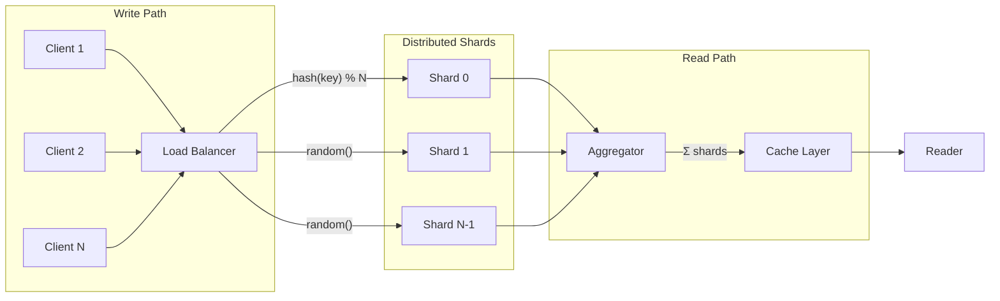

# Sharded Counters

Scaling counters beyond single-node write limitations through distributed sharding, aggregation strategies, and consistency trade-offs.

A counter seems trivial—increment a number, read it back. At scale, this simplicity becomes a bottleneck. A single counter in Firestore supports ~1 write/second. A viral tweet generates millions of likes. Meta's TAO handles 10 billion requests/second. The gap between "increment a number" and "count engagements for 2 billion users" spans orders of magnitude in both throughput and architectural complexity.

<figure>



<figcaption>Sharded counter architecture: writes distribute across shards to avoid contention; reads aggregate shard values, typically through a cache layer.</figcaption>
</figure>

## Abstract

Sharded counters solve a fundamental distributed systems problem: write contention on hot keys. The core insight is **trade write throughput for read complexity**—instead of one counter receiving all writes, spread writes across N shards and sum them on read.

The design space involves three key decisions:

1. **Shard selection strategy**: Random (simple, even distribution) vs. hash-based (deterministic, enables caching) vs. time-based (natural windowing for analytics)
2. **Aggregation timing**: Synchronous (accurate but O(N) reads) vs. asynchronous rollup (O(1) reads but eventual consistency)
3. **Consistency requirements**: Strong (banking) vs. eventual (social metrics)—this determines whether you can cache and how you handle failures

When exact counts aren't required, probabilistic structures (HyperLogLog, Count-Min Sketch) achieve sub-linear space with bounded error—HyperLogLog estimates cardinalities of 10⁹ elements with 2% error using 1.5KB.

## The Problem: Write Contention

### Why Single Counters Fail

Every distributed database has per-key write limits. Firestore: ~1 write/second per document. DynamoDB: ~1,000 writes/second per partition. These limits exist because:

1. **Serialization**: Increments must be atomic. Two concurrent `counter++` operations on the same key require coordination.
2. **Replication lag**: Writes propagate to replicas asynchronously. High write rates cause replication queues to grow.
3. **Lock contention**: Even with optimistic concurrency, high conflict rates cause transaction retries and exponential backoff.

### The Hot Key Problem

A "hot key" is any key receiving disproportionate traffic. For counters, this is nearly always the case—you're intentionally funneling all increments to one location.

**Real-world example**: When Facebook launched the Like button in 2009, they discovered millions of tiny database writes per second converging on individual post counters. The solution required complete architectural rethinking—sharded counters became a foundational pattern.

### Quantifying the Bottleneck

| System    | Single-Key Write Limit         | With Sharding (100 shards) |
| --------- | ------------------------------ | -------------------------- |
| Firestore | ~1/sec                         | ~100/sec                   |
| DynamoDB  | ~1,000/sec (partition)         | ~100,000/sec               |
| Cassandra | ~10,000/sec (node)             | ~1,000,000/sec             |
| Redis     | ~100,000/sec (single-threaded) | ~N/A (horizontal)          |

The improvement is linear with shard count—double the shards, double the write throughput.

## Design Choices

### Shard Selection Strategy

#### Random Sharding

**Mechanism**: On each increment, select a random shard from the pool. No coordination required.

```python
def increment(counter_id: str, value: int = 1) -> None:
    shard_id = random.randint(0, NUM_SHARDS - 1)
    shard_key = f"{counter_id}:shard:{shard_id}"
    db.increment(shard_key, value)
```

**Best when:**

- Write patterns are unpredictable
- No locality benefits from consistent shard assignment
- Simplicity is prioritized over read optimization

**Trade-offs:**

- ✅ Even load distribution with sufficient traffic
- ✅ No coordination overhead
- ✅ Trivial to implement
- ❌ Every read must aggregate all shards (no caching by writer identity)
- ❌ Low-traffic counters may have uneven distribution

**Real-world example**: Firestore's distributed counters documentation recommends random sharding for simplicity. Each increment selects a random shard document, and reads sum the entire shards subcollection.

#### Hash-Based Sharding

**Mechanism**: Use a deterministic hash function to map some attribute (user ID, session, client IP) to a shard.

```python
def increment(counter_id: str, client_id: str, value: int = 1) -> None:
    shard_id = hash(client_id) % NUM_SHARDS
    shard_key = f"{counter_id}:shard:{shard_id}"
    db.increment(shard_key, value)
```

**Best when:**

- Same clients repeatedly increment the same counter
- You want to enable per-client rate limiting
- Read caching can exploit client locality

**Trade-offs:**

- ✅ Deterministic mapping enables caching optimizations
- ✅ Same client always hits same shard (reduces scatter on reads if you know the client)
- ❌ Skewed hash distribution can create hot shards
- ❌ Adding/removing shards requires rehashing (unless consistent hashing is used)

**Real-world example**: Twitter assigns shards based on post popularity. High-follower-count users get more shards for their tweets because engagement is predictably higher.

#### Time-Based Sharding

**Mechanism**: Create new shards per time window (minute, hour, day). Each window gets its own counter space.

```python
def increment(counter_id: str, value: int = 1) -> None:
    window = get_current_window()  # e.g., "2024-01-15T14:00"
    shard_id = random.randint(0, SHARDS_PER_WINDOW - 1)
    shard_key = f"{counter_id}:{window}:shard:{shard_id}"
    db.increment(shard_key, value)
```

**Best when:**

- Analytics require time-windowed aggregations
- Historical data can be compacted or archived
- Write patterns are time-correlated (e.g., peak hours)

**Trade-offs:**

- ✅ Natural fit for time-series analytics
- ✅ Old windows can be compacted into single values
- ✅ Avoids unbounded growth in active shard count
- ❌ Requires time synchronization across nodes
- ❌ More complex aggregation logic (must sum across windows)

**Real-world example**: YouTube view counting uses time windows for validation—views within a 24-hour window are aggregated before fraud detection runs.

### Decision Matrix: Shard Selection

| Factor                    | Random           | Hash-Based      | Time-Based      |
| ------------------------- | ---------------- | --------------- | --------------- |
| Implementation complexity | Low              | Medium          | High            |
| Write distribution        | Even (at scale)  | Depends on hash | Even per window |
| Read optimization         | None             | Client locality | Window caching  |
| Scaling shards            | Trivial          | Requires rehash | Per-window      |
| Best for                  | General counters | Client-specific | Analytics, TTL  |

### Aggregation Approaches

#### Synchronous Aggregation

Read all shards and sum them in real-time on each query.

```python
def get_count(counter_id: str) -> int:
    total = 0
    for shard_id in range(NUM_SHARDS):
        shard_key = f"{counter_id}:shard:{shard_id}"
        total += db.get(shard_key) or 0
    return total
```

**Characteristics:**

- **Accuracy**: Exact count at read time
- **Latency**: O(N) database reads where N = shard count
- **Consistency**: Strong (assuming linearizable reads)

**When to use**: Financial counters, inventory systems, any case where accuracy trumps latency.

**Failure mode**: If any shard is unavailable, the read fails or returns partial data. Must decide: fail the request or return a known-incomplete count.

#### Asynchronous Rollup

Background jobs periodically aggregate shard values into a cached total.

```python
# Background job (runs every T seconds)
def rollup_counter(counter_id: str) -> None:
    total = sum_all_shards(counter_id)  # O(N) operation
    cache.set(f"{counter_id}:total", total, ttl=T * 2)

# Read path
def get_count(counter_id: str) -> int:
    cached = cache.get(f"{counter_id}:total")
    if cached is not None:
        return cached
    # Fallback: synchronous aggregation (expensive)
    return sum_all_shards(counter_id)
```

**Characteristics:**

- **Accuracy**: Stale by up to T seconds (rollup interval)
- **Latency**: O(1) cache read
- **Consistency**: Eventual

**When to use**: Social media metrics, analytics dashboards, any case where slight staleness is acceptable.

**Failure mode**: If rollup job fails, cache expires, reads fall back to expensive synchronous path. Must monitor rollup lag and cache hit rate.

#### Hybrid: Netflix's Approach (2024)

Netflix's Distributed Counter Abstraction offers three modes:

1. **Best-Effort Regional**: EVCache (in-memory) only. Sub-millisecond reads, may miss recent writes.
2. **Eventual Consistency**: Event log (TimeSeries on Cassandra) + periodic rollup. Single-digit millisecond latency.
3. **Accurate Global**: Pre-aggregated total + live delta of events since last rollup. Near-real-time accuracy.

The key insight: **different counters have different accuracy requirements**. Netflix serves 75,000 counter requests/second globally by matching the consistency model to the use case.

### Aggregation Decision Matrix

| Factor         | Synchronous | Async Rollup      | Hybrid                        |
| -------------- | ----------- | ----------------- | ----------------------------- |
| Read latency   | O(N) shards | O(1) cache        | O(1) typical                  |
| Accuracy       | Exact       | Stale by T        | Configurable                  |
| Complexity     | Low         | Medium            | High                          |
| Infrastructure | DB only     | DB + cache + jobs | DB + cache + event log + jobs |
| Best for       | Financial   | Social metrics    | Mixed workloads               |

## Consistency Trade-offs

### Strong Consistency

Every read returns the result of the most recent write, globally.

**Implementation requirements:**

- Synchronous replication to all nodes before acknowledging writes
- Read quorum that overlaps with write quorum
- Global coordination (Paxos, Raft, or similar)

**Performance impact:**

- Write latency = slowest replica acknowledgment
- Availability decreases during network partitions
- Cannot use caching for reads

**Use cases**: Banking transactions, inventory management, rate limiting with strict enforcement.

### Eventual Consistency

Given no new updates, all replicas converge to the same value eventually.

**Implementation characteristics:**

- Asynchronous replication
- Reads may return stale values
- Writes acknowledged locally, propagated in background

**Performance impact:**

- Write latency = local persistence only
- High availability during partitions
- Caching dramatically improves read latency

**Use cases**: Like counts, view counts, analytics metrics, follower counts.

### Meta's TAO: Choosing Availability

TAO, Meta's distributed data store for the social graph, explicitly chose eventual consistency. Their rationale:

> "Losing consistency is a lesser evil than losing availability."

For social metrics, users can tolerate seeing a like count that's slightly stale. They cannot tolerate the app being unavailable.

**TAO's scale**: 10 billion requests/second, millions of writes/second, petabytes of data—all served with eventual consistency and aggressive caching.

### Consistency Decision Factors

| Requirement                    | Consistency Model | Example        |
| ------------------------------ | ----------------- | -------------- |
| Cannot lose a single increment | Strong            | Bank balance   |
| Cannot double-count            | Strong            | Inventory      |
| Users see approximate values   | Eventual          | Like count     |
| Analytics aggregations         | Eventual          | View count     |
| Rate limiting (strict)         | Strong            | API quotas     |
| Rate limiting (soft)           | Eventual          | Spam detection |

## Approximate Counting

When exact counts aren't required, probabilistic data structures provide dramatic space savings.

### HyperLogLog (HLL)

**Purpose**: Estimate cardinality (count of distinct elements) with bounded error.

**Key insight**: The maximum number of leading zeros in a hash tells you about the cardinality. If you've seen a hash with 10 leading zeros, you've probably seen ~2¹⁰ distinct elements.

**Performance characteristics:**

- Space: ~1.5KB for 2% standard error
- Cardinality range: Estimates 10⁹+ elements accurately
- Time: O(1) insert and query

**Critical property—mergeability**: HLL sketches from different nodes can be merged without losing accuracy. This makes HLL perfect for distributed counting.

```python
# Pseudocode: HLL merge across nodes
def global_unique_users() -> int:
    hll_sketches = [node.get_hll("users") for node in nodes]
    merged = reduce(hll_merge, hll_sketches)
    return merged.estimate()
```

**Use cases**:

- Unique visitor counting (Google Analytics)
- Distinct query counting (database query planners)
- Cardinality estimation in data pipelines

**Real-world example**: Facebook's HyperLogLog implementation processes cardinality calculations on massive datasets in 12 hours using less than 1MB of memory—a task that would require terabytes with exact counting.

### Count-Min Sketch (CMS)

**Purpose**: Estimate frequency of items in a stream with bounded overestimation.

**Key insight**: Hash each item to multiple positions in a 2D array; increment those positions. Query returns the minimum across hash positions (minimizing collision-induced overcount).

**Performance characteristics:**

- Space: w × d counters (typically thousands)
- Error: Overestimates by at most ε × N with probability 1 - δ
- Time: O(d) insert and query where d = number of hash functions

**Critical property—linearity**: Sketches can be summed across nodes. `CMS(stream_A) + CMS(stream_B) = CMS(stream_A ∪ stream_B)`.

**Use cases**:

- Heavy hitters detection (top-K frequent items)
- Network traffic anomaly detection
- Recommendation systems (item co-occurrence)

**Limitations**:

- Only overestimates, never underestimates
- No way to decrement (can't handle deletions without extensions)
- Requires tuning ε and δ for accuracy/space trade-off

### When to Use Probabilistic Structures

| Requirement             | Use Exact Counting | Use HLL | Use CMS |
| ----------------------- | ------------------ | ------- | ------- |
| Need exact value        | ✅                 | ❌      | ❌      |
| Counting distinct items | Expensive          | ✅      | ❌      |
| Counting item frequency | ✅                 | ❌      | ✅      |
| Must support decrements | ✅                 | ❌      | ❌      |
| Memory constrained      | ❌                 | ✅      | ✅      |
| Distributed merging     | Complex            | ✅      | ✅      |

## Real-World Implementations

### Google Cloud Firestore Distributed Counters

**Architecture**: Each counter is a parent document with a subcollection of shard documents.

```
counters/
  {counter_id}/
    shards/
      0: { count: 1234 }
      1: { count: 5678 }
      ...
      N-1: { count: 9012 }
```

**Write path**: Randomly select a shard, atomically increment.

**Read path**: Query entire `shards` subcollection, sum values.

**Performance tuning by scale**:

- <10 writes/sec: 1-5 shards
- 10-1,000 writes/sec: 5-100 shards
- > 1,000 writes/sec: 100-1,000+ shards

**Optimization**: Maintain a separate rollup document updated at slower cadence. Clients read from rollup, avoiding O(N) aggregation.

### Netflix Distributed Counter (2024)

**Four-layer architecture**:

1. **Client API**: AddCount, GetCount, ClearCount via Netflix Data Gateway
2. **Event Log**: All mutations stored as events in TimeSeries Abstraction (Cassandra backend)
3. **Rollup Pipeline**: Scheduled/streaming jobs aggregate events into intermediate counts
4. **Cache Layer**: EVCache (Memcached-based) stores aggregated values

**Three counting modes**:

| Mode                 | Consistency | Latency | Use Case          |
| -------------------- | ----------- | ------- | ----------------- |
| Best-Effort Regional | Weak        | <1ms    | Game events       |
| Eventual             | Medium      | <10ms   | Most metrics      |
| Accurate Global      | Strong      | <100ms  | Business-critical |

**Production metrics**:

- 75,000 requests/second globally
- Single-digit millisecond latency
- Processes billions of events daily

**Design decision**: Event log enables replay for recovery and supports multiple aggregation strategies from the same source data.

### Twitter/X Engagement Counters

**Infrastructure stack**:

- **Manhattan**: Multi-tenant distributed database for recent engagements
- **GraphJet**: Graph query engine (1M edges/second per server)
- **Kafka**: Streams billions of engagement events daily
- **Redis**: Caches aggregated counts

**Counter flow**:

1. User engagement → Kafka topic
2. Stream processors update sharded counters in Manhattan
3. Aggregated values written to Redis
4. Read path serves from Redis (sub-millisecond)

**Scaling strategy**: Shard count varies by expected engagement. Celebrity accounts get more shards allocated than regular users.

### Meta TAO

**Scale**: 10 billion requests/second, petabytes of data.

**Architecture**:

- Object sharding by `object_id` hash (shard ID embedded in object ID)
- MySQL as persistent store
- Multi-layer caching (distributed Memcached-like layer)
- Eventual consistency default

**Counter strategy**: Engagement metrics use eventual consistency with aggressive caching. Cache invalidation propagates through a pub/sub system.

**Key design decision**: Solved hot spots and thundering herd through consistent hashing and request coalescing at cache layer.

## Common Pitfalls

### Over-Sharding

**The mistake**: Creating 10,000 shards for a counter receiving 10 writes/second.

**Why it happens**: Teams extrapolate from peak traffic without considering steady-state, or copy configuration from high-traffic counters.

**The consequence**:

- Read latency increases 1,000x (must read all shards)
- Storage overhead multiplies
- Rollup jobs become expensive

**The fix**: Start with `shards = max(1, expected_writes_per_second)`. Monitor write contention and scale up only when retry rate exceeds 1%.

### Under-Sharding

**The mistake**: Single shard for a viral counter.

**Why it happens**: Underestimating traffic spikes, or not monitoring write latency.

**The consequence**:

- Write contention causes exponential backoff
- Transaction retries cascade into timeouts
- Users see failed increment operations

**The fix**: Monitor p99 write latency. When it exceeds SLA, add shards. Use auto-scaling if your database supports it (DynamoDB adaptive capacity).

### Aggregation Lag Unbounded Growth

**The mistake**: Rollup job can't keep up with write rate.

**Why it happens**: Rollup interval is fixed, but write rate increases. Job takes longer than the interval to complete.

**The consequence**:

- Cache staleness grows unboundedly
- Users see counts going backward (if rollup skips batches)
- Memory pressure from growing event backlog

**The fix**:

- Monitor lag between latest event and latest rollup
- Scale rollup workers horizontally
- Implement backpressure: drop or sample events when lag exceeds threshold

### Cache Failure Without Fallback

**The mistake**: Read path assumes cache always has data.

**Why it happens**: Cache is treated as storage rather than cache.

**The consequence**:

- Cache miss or failure → no count available
- System appears unavailable for reads

**The fix**: Always implement synchronous aggregation fallback. Monitor fallback rate—if it exceeds 0.1%, investigate cache health.

### Ignoring Shard-Level Metrics

**The mistake**: Monitoring only aggregate counter performance.

**Why it happens**: Total writes/second looks healthy; per-shard metrics aren't collected.

**The consequence**:

- Hot shards melt while averages look fine
- 1 of 100 shards at 99% CPU, others at 1%—average shows 2%

**The fix**: Collect and alert on per-shard metrics. Use p99 across shards, not mean.

## Choosing Your Approach

### Start with These Questions

1. **What's the write rate?** If <10/sec per counter, you may not need sharding at all.
2. **What consistency does the business require?** Financial = strong. Social = eventual.
3. **How stale can reads be?** Seconds? Minutes? Never?
4. **Do you need exact counts or estimates?** Estimates enable probabilistic structures.
5. **What's your read/write ratio?** Write-heavy → more shards. Read-heavy → invest in caching.

### Common Patterns

| Scenario                            | Recommended Approach                         |
| ----------------------------------- | -------------------------------------------- |
| Social media metrics (likes, views) | Random sharding + async rollup + Redis cache |
| API rate limiting (strict)          | Hash-based sharding + synchronous reads      |
| Unique visitor counting             | HyperLogLog per time window                  |
| Top-K popular items                 | Count-Min Sketch + heap                      |
| Financial transactions              | Single counter with strong consistency       |
| Analytics dashboards                | Time-based sharding + batch aggregation      |

### Scaling Checklist

1. **Baseline**: Single counter, monitor write latency
2. **First scale**: Add shards when p99 write latency exceeds SLA
3. **Cache**: Add rollup + cache when read latency exceeds SLA
4. **Regional**: Deploy regional counters when global latency is unacceptable
5. **Approximate**: Switch to probabilistic structures when exact counts aren't required and scale exceeds DB limits

## Conclusion

Sharded counters trade write throughput for read complexity. The design space spans shard selection (random, hash, time-based), aggregation timing (synchronous, rollup, hybrid), and consistency models (strong, eventual). Production systems like Netflix, Meta, and Twitter demonstrate that different counters within the same organization require different approaches—the art is matching consistency requirements to business needs.

For most social-scale applications: random sharding + asynchronous rollup + Redis cache handles millions of writes per second with sub-millisecond read latency and acceptable staleness. For financial applications: prefer fewer shards with synchronous aggregation and strong consistency. For cardinality estimation at massive scale: HyperLogLog achieves 2% error in 1.5KB.

The fundamental insight remains: **you're not scaling a counter—you're trading accuracy, latency, and consistency against each other.**

## Appendix

### Prerequisites

- Distributed systems fundamentals (replication, partitioning, consistency models)
- Basic understanding of hash functions and probabilistic data structures
- Familiarity with caching patterns (write-through, write-behind, cache-aside)

### Terminology

- **Hot key**: A key receiving disproportionately high traffic, causing contention
- **Write contention**: Multiple writers competing for the same resource, causing coordination overhead
- **Rollup**: Periodic aggregation of distributed values into a summary
- **Cardinality**: Count of distinct elements in a set
- **HyperLogLog (HLL)**: Probabilistic data structure for cardinality estimation
- **Count-Min Sketch (CMS)**: Probabilistic data structure for frequency estimation
- **Eventual consistency**: Guarantee that, absent new updates, all replicas converge to the same value

### Summary

- Single counters hit write contention limits (Firestore: ~1/sec, DynamoDB: ~1K/sec per partition)
- Sharding trades write throughput for read complexity—more shards = more writes but O(N) reads
- Aggregation strategy determines consistency: synchronous (exact, slow) vs. rollup (stale, fast)
- Probabilistic structures (HLL, CMS) enable sub-linear space when approximations suffice
- Production systems (Netflix, Meta, Twitter) use hybrid approaches matching consistency to use case
- Common pitfalls: over-sharding, under-sharding, unbounded aggregation lag, missing fallbacks

### References

- [Netflix's Distributed Counter Abstraction](https://netflixtechblog.com/netflixs-distributed-counter-abstraction-8d0c45eb66b2) - Netflix Tech Blog, 2024. Production architecture for 75K RPS counters.
- [TAO: Facebook's Distributed Data Store for the Social Graph](https://www.usenix.org/system/files/conference/atc13/atc13-bronson.pdf) - USENIX ATC 2013. Design rationale for 10B req/sec eventual consistency.
- [HyperLogLog in Practice: Algorithmic Engineering of a State of the Art Cardinality Estimation Algorithm](https://research.google.com/pubs/archive/40671.pdf) - Google Research. Theoretical foundations and practical improvements.
- [Distributed Counters in Firestore](https://firebase.google.com/docs/firestore/solutions/counters) - Google Cloud documentation. Reference implementation for sharded counters.
- [Implement Resource Counters with Amazon DynamoDB](https://aws.amazon.com/blogs/database/implement-resource-counters-with-amazon-dynamodb/) - AWS Database Blog. Atomic counter patterns.
- [Count-Min Sketch](https://redis.io/docs/latest/develop/data-types/probabilistic/count-min-sketch/) - Redis documentation. Frequency estimation data structure.
- [Manhattan: Twitter's Real-Time, Multi-Tenant Distributed Database](https://blog.x.com/engineering/en_us/a/2014/manhattan-our-real-time-multi-tenant-distributed-database-for-twitter-scale) - Twitter Engineering. Engagement counter infrastructure.
