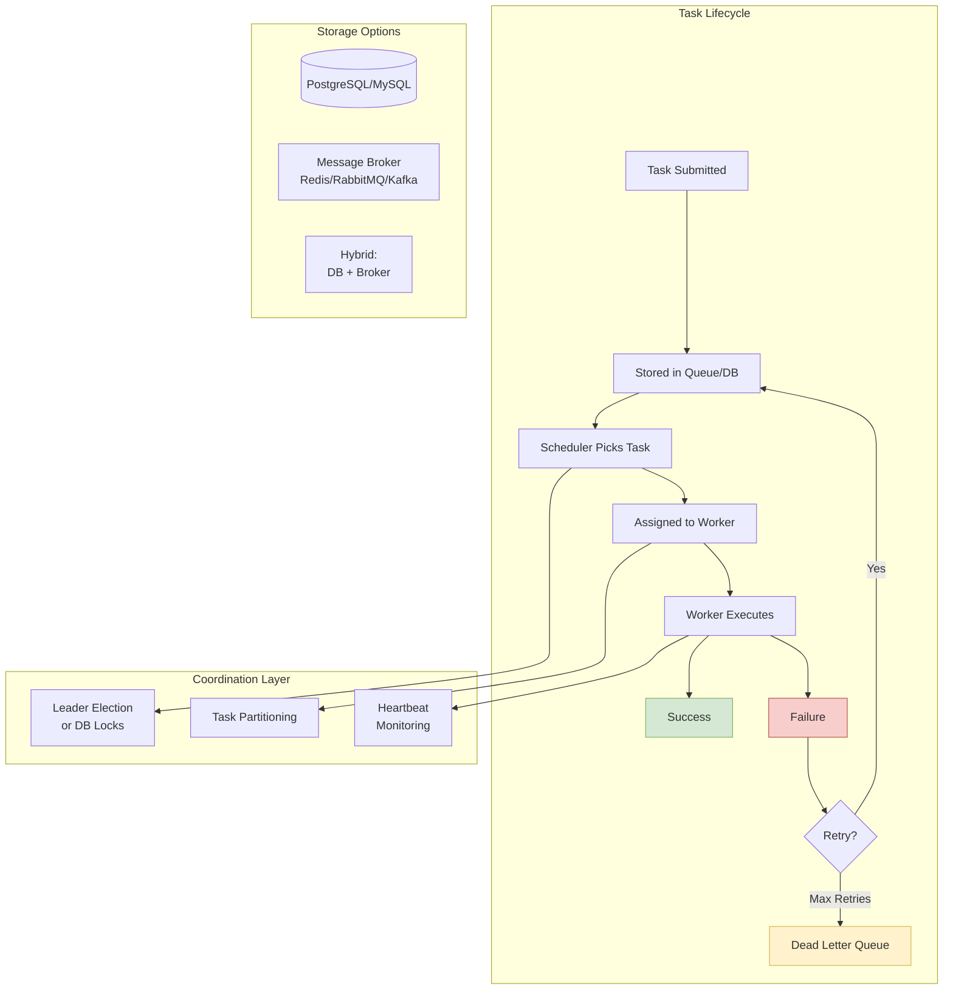

# Task Scheduler Design

Designing reliable distributed task scheduling systems: understanding scheduling models, coordination mechanisms, delivery guarantees, and failure handling strategies across Airflow, Celery, Temporal, and similar platforms.

<figure>



<figcaption>Task scheduler lifecycle showing submission, scheduling, execution, and failure handling paths</figcaption>

</figure>

## Abstract

Distributed task scheduling is fundamentally about **coordination without contention**. The core challenge: multiple scheduler instances must agree on which tasks to run, when to run them, and which worker should execute them—without creating bottlenecks or allowing duplicate execution.

The key mental model:

- **Scheduling** is separate from **execution**. Schedulers determine _what_ runs and _when_; workers perform the actual computation. This separation enables independent scaling.
- **Exactly-once execution is a lie**. In practice, systems provide **at-least-once delivery + idempotent handlers** = effectively once. True exactly-once requires distributed transactions with unacceptable overhead.
- **The database is your coordination primitive**. Modern schedulers (Airflow, Quartz, db-scheduler) use `SELECT ... FOR UPDATE SKIP LOCKED` rather than consensus algorithms. The operational simplicity outweighs the theoretical elegance of Raft/Paxos.
- **Time is unreliable**. Clock skew between nodes means "run at 3:00 PM" can trigger at 3:00:00.000 on one node and 3:00:00.500 on another. Robust schedulers detect clock anomalies and use logical ordering where physical time fails.

The trade-off space:

| Guarantee     | Cost                  | Use When                        |
| ------------- | --------------------- | ------------------------------- |
| At-most-once  | Lowest latency        | Analytics, non-critical metrics |
| At-least-once | Requires idempotency  | Most production workloads       |
| Exactly-once  | 10-50% throughput hit | Financial transactions, billing |

## Scheduling Models

### Cron-Based (Time-Triggered)

**Mechanism:** Tasks fire at specific times defined by cron expressions (e.g., `0 9 * * *` for 9 AM daily). The scheduler evaluates expressions against current time and enqueues matching tasks.

**Best when:**

- Predictable, recurring workloads (daily reports, hourly aggregations)
- Tasks align with business hours or calendar boundaries
- Execution time doesn't drift based on previous run

**Trade-offs:**

- ✅ Human-readable schedules
- ✅ Well-understood semantics (Unix cron since 1975)
- ✅ Natural fit for business processes
- ❌ Clock skew can cause missed or duplicate runs
- ❌ "Catch-up" behavior varies by implementation
- ❌ Overlapping runs if previous execution exceeds interval

**Implementation detail:** Kubernetes CronJobs use 5-field cron syntax interpreted by kube-controller-manager. As of Kubernetes 1.27, `spec.timeZone` accepts IANA timezone names, eliminating UTC-only limitations.

### Interval-Based (Fixed Delay)

**Mechanism:** Tasks run at fixed intervals _from the completion of the previous run_ (e.g., "every 30 minutes after last success"). The next execution time = previous completion + interval.

**Best when:**

- Task duration varies significantly
- You need guaranteed gaps between runs
- Processing load should be spread evenly

**Trade-offs:**

- ✅ Prevents overlapping executions by design
- ✅ Self-adjusting to task duration
- ❌ Execution times drift over the day
- ❌ Can't guarantee "run at 9 AM"
- ❌ First run timing requires separate configuration

**Real-world example:** Temporal Schedules support `every 30 minutes` with optional phase offset aligned to Unix epoch. If a workflow takes 5 minutes, the next run starts 30 minutes after completion—not 30 minutes after the scheduled time.

### Delay-Based (One-Shot Future)

**Mechanism:** Task executes once after a specified delay (e.g., "run in 30 seconds"). Common for deferred processing: send reminder email 24 hours after signup, retry failed payment in 1 hour.

**Best when:**

- One-time future execution
- Delay calculated dynamically per task
- Implementing retry backoff

**Trade-offs:**

- ✅ Simple mental model
- ✅ Dynamic scheduling (compute delay at submission time)
- ❌ Clock adjustments can fire early or late
- ❌ Long delays (days/weeks) require durable storage

**Implementation detail:** Use monotonic clocks or scheduler-native offsets rather than `current_wall_time + delay`. NTP corrections can shift wall clock time, causing premature or delayed execution.

### Event-Triggered (Reactive)

**Mechanism:** Tasks fire in response to external events: file uploads, database changes, webhook calls, message arrivals. No fixed schedule—execution is purely reactive.

**Best when:**

- Processing depends on external data availability
- Workload is unpredictable
- Near-real-time responsiveness required

**Trade-offs:**

- ✅ Minimal latency (process immediately when ready)
- ✅ Natural fit for event-driven architectures
- ✅ No wasted polling cycles
- ❌ Thundering herd if many events arrive simultaneously
- ❌ Requires robust event delivery infrastructure
- ❌ Harder to reason about system load

**Real-world example:** Airflow 3.0 introduces explicit event-based scheduling, departing from its purely time-based origins. Data-aware scheduling triggers DAGs when upstream datasets are updated rather than on fixed intervals.

## Design Choices: Coordination Mechanisms

### Option 1: Database Locks (No Consensus)

**Mechanism:** Schedulers use database row-level locks (`SELECT ... FOR UPDATE SKIP LOCKED`) to claim tasks. No inter-scheduler communication; the database is the coordination primitive.

```sql
-- Worker claims next available task
SELECT id, payload FROM tasks
WHERE status = 'pending'
  AND scheduled_at <= NOW()
ORDER BY priority DESC, scheduled_at ASC
LIMIT 1
FOR UPDATE SKIP LOCKED;

-- If row returned, update status
UPDATE tasks SET status = 'running', picked_by = $worker_id WHERE id = $task_id;
```

**Best when:**

- Operational simplicity is paramount
- Already running PostgreSQL/MySQL
- Throughput requirements < 10K tasks/second
- Team lacks distributed systems expertise

**Trade-offs:**

- ✅ No additional infrastructure (ZooKeeper, etcd)
- ✅ Familiar SQL semantics
- ✅ ACID guarantees on task state transitions
- ✅ Scales horizontally by adding scheduler instances
- ❌ Database becomes bottleneck at extreme scale
- ❌ Requires PostgreSQL 9.5+ or MySQL 8+ for `SKIP LOCKED`
- ❌ Lock contention under high concurrency

**Real-world example:** Airflow 2.0+ uses active-active schedulers with database locking. From the design document: "By not using direct communication or consensus algorithm between schedulers (Raft, Paxos, etc.) nor another consensus tool we have kept the operational surface area to a minimum." PostgreSQL row-level locks prevent duplicate execution while allowing multiple schedulers to operate independently.

### Option 2: Leader Election (Single Active Scheduler)

**Mechanism:** One scheduler is elected leader; only the leader schedules tasks. If the leader fails, another instance takes over via consensus protocol (Raft) or coordination service (ZooKeeper, etcd).

**Best when:**

- Strict ordering requirements
- Single scheduler can handle throughput
- Already running ZooKeeper/etcd for other purposes
- Need guaranteed single-writer semantics

**Trade-offs:**

- ✅ No duplicate execution by design
- ✅ Simpler reasoning about task order
- ✅ No lock contention
- ❌ Single point of throughput (leader bottleneck)
- ❌ Failover latency during leader election
- ❌ Additional operational complexity (consensus service)

**Implementation detail:** Leader election typically uses lease-based mechanisms. The leader holds a lease (e.g., 30 seconds) and must renew it before expiry. If renewal fails (leader crash, network partition), other candidates compete for the lease.

### Option 3: Work Stealing (Distributed Load Balancing)

**Mechanism:** Each worker maintains a local task queue (deque). Idle workers become "thieves" and steal tasks from busy workers' queues. Enables dynamic load balancing without central coordination.

**Best when:**

- Highly variable task durations
- Workers have different capacities
- Minimizing tail latency is critical

**Trade-offs:**

- ✅ Self-balancing without central coordinator
- ✅ Excellent for heterogeneous workloads
- ✅ Reduces idle time
- ❌ Complex implementation
- ❌ Stealing overhead for short tasks
- ❌ Requires careful queue structure (lock-free deques)

**Real-world example:** Dask Distributed uses work stealing for its parallel computing framework. Workers steal from the tail of other workers' queues (LIFO for locality) while processing their own tasks from the head (FIFO for fairness).

### Option 4: Consistent Hashing (Partitioned Scheduling)

**Mechanism:** Tasks are assigned to schedulers/workers based on hash of task ID. Each node is responsible for a partition of the task space. Adding/removing nodes only affects neighboring partitions.

**Best when:**

- Task affinity matters (cache locality, state reuse)
- Predictable task distribution needed
- Horizontal scaling without reshuffling all tasks

**Trade-offs:**

- ✅ Deterministic assignment (same task → same worker)
- ✅ Minimal disruption on cluster changes
- ✅ Good cache utilization
- ❌ Hot partitions if task IDs aren't uniformly distributed
- ❌ Rebalancing needed when nodes join/leave
- ❌ Doesn't handle variable task complexity

**Implementation detail:** Virtual nodes improve distribution—each physical node owns multiple positions on the hash ring. Discord uses 1,000 virtual nodes per physical node to achieve <5% load variance.

## Design Choices: Task Storage

### Option 1: Database-Only (PostgreSQL/MySQL)

**Schema pattern:**

```sql
CREATE TABLE scheduled_tasks (
    id              BIGSERIAL PRIMARY KEY,
    task_name       VARCHAR(255) NOT NULL,
    payload         JSONB,
    scheduled_at    TIMESTAMP NOT NULL,
    priority        SMALLINT DEFAULT 0,
    status          VARCHAR(20) DEFAULT 'pending',
    picked_by       VARCHAR(255),
    picked_at       TIMESTAMP,
    attempts        INT DEFAULT 0,
    max_attempts    INT DEFAULT 3,
    last_heartbeat  TIMESTAMP,
    created_at      TIMESTAMP DEFAULT NOW()
);

CREATE INDEX idx_pending_tasks ON scheduled_tasks (scheduled_at, priority)
    WHERE status = 'pending';
```

**Best when:**

- Durability is critical (cannot lose tasks)
- Already have PostgreSQL operational expertise
- Throughput < 10K tasks/second
- Need transactional task creation (enqueue with business data atomically)

**Trade-offs:**

- ✅ Single source of truth
- ✅ Atomic enqueue with business transactions
- ✅ Built-in persistence and replication
- ✅ SQL for ad-hoc queries and debugging
- ❌ Higher latency than in-memory brokers
- ❌ Connection pool exhaustion under high load
- ❌ Index maintenance overhead

**Real-world example:** The `db-scheduler` library uses a single-table design with heartbeat tracking. Workers update `last_heartbeat` during execution; stalled tasks (heartbeat older than threshold) are reclaimed by other workers.

### Option 2: Message Broker (Redis/RabbitMQ/Kafka)

**Best when:**

- High throughput required (> 10K tasks/second)
- Fire-and-forget semantics acceptable
- Existing broker infrastructure
- Real-time task distribution matters

**Trade-offs:**

- ✅ Sub-millisecond latency
- ✅ Built-in pub/sub patterns
- ✅ Natural backpressure via queue depth
- ❌ Separate durability story (Redis persistence, RabbitMQ clustering)
- ❌ Two systems to operate
- ❌ Task state lives outside primary database

**Broker comparison:**

| Broker       | Model                | Durability            | Throughput    | Best For                     |
| ------------ | -------------------- | --------------------- | ------------- | ---------------------------- |
| **Redis**    | Push (lists/streams) | Optional (RDB/AOF)    | 100K+ ops/sec | Low-latency, simple queues   |
| **RabbitMQ** | Push (AMQP)          | Mirrored queues       | 50K+ msg/sec  | Complex routing, reliability |
| **Kafka**    | Pull (log)           | Replicated partitions | 1M+ msg/sec   | High-volume, replay needed   |

### Option 3: Hybrid (Database + Broker)

**Mechanism:** Database stores task definitions, history, and durable state. Broker handles real-time task distribution and worker communication.

**Best when:**

- Need both durability and low latency
- Complex task workflows with state
- Audit trail requirements
- Scale requires broker performance

**Trade-offs:**

- ✅ Best of both worlds
- ✅ Database for queries, broker for speed
- ❌ Two systems to operate and synchronize
- ❌ Consistency challenges between stores
- ❌ More complex failure modes

**Real-world example:** A hybrid architecture uses PostgreSQL for storing job definitions (partitioned by hour) with retry counts and history, while Redis Sorted Sets hold jobs by timestamp for fast polling and Redis Streams for worker distribution.

## Delivery Guarantees

### At-Most-Once

**Mechanism:** Fire task, don't track outcome. If worker crashes mid-execution, task is lost.

**Implementation:** No acknowledgment, no retries, no persistence.

**Use when:**

- Task loss is acceptable (best-effort metrics)
- Duplicate execution is worse than missed execution
- Maximum throughput required

### At-Least-Once

**Mechanism:** Task remains "in-flight" until worker acknowledges completion. Crashes before acknowledgment trigger re-delivery.

**Implementation:**

1. Worker claims task (status → `running`)
2. Worker executes task
3. Worker acknowledges (status → `completed`)
4. If heartbeat missed or timeout, task returns to queue

**The idempotency requirement:** At-least-once means tasks _may run multiple times_. Your handlers must be idempotent:

```python
# ❌ BAD: Creates duplicate charges
def process_payment(order_id, amount):
    charge_credit_card(order_id, amount)
    mark_order_paid(order_id)

# ✅ GOOD: Idempotent via unique constraint
def process_payment(order_id, amount):
    # INSERT fails if already processed
    result = insert_payment_record(order_id, amount)
    if result.inserted:
        charge_credit_card(order_id, amount)
```

### Exactly-Once (Effectively Once)

**The truth:** True exactly-once delivery is impossible in distributed systems due to the Two Generals Problem. What systems provide is **at-least-once delivery + idempotent processing = effectively once**.

**Implementation strategies:**

1. **Idempotency keys**: Store processed task IDs; skip duplicates
2. **Transactional outbox**: Atomically record task completion with business state change
3. **Deduplication window**: Remember recent task IDs for a time window

**Cost:** Exactly-once semantics typically reduce throughput by 10-50% due to coordination overhead (two-phase commits, deduplication lookups).

**Real-world examples:**

- **Temporal**: Achieves effectively-once via event history replay. Every workflow step is recorded; replaying the history reconstructs exact state.
- **Kafka**: Combines idempotent producers (PID + sequence numbers) with transactional consumers (atomic offset commits).
- **AWS Step Functions Standard Workflows**: Exactly-once per step via internal state machine, up to 1-year execution duration.

## Failure Handling

### Heartbeat Mechanism

**Purpose:** Detect stalled or crashed workers before task timeout.

**Configuration guidelines:**

| Parameter          | Typical Value  | Rationale                                  |
| ------------------ | -------------- | ------------------------------------------ |
| Heartbeat interval | 2-3 seconds    | Frequent enough to detect failures quickly |
| Failure threshold  | 3 missed beats | Avoid false positives from network hiccups |
| Time to detection  | 6-9 seconds    | Interval × threshold                       |

**Two models:**

- **Push (worker → scheduler)**: Worker sends periodic "I'm alive" signals. Simpler, but scheduler must track all workers.
- **Pull (scheduler → worker)**: Scheduler polls worker status. More control, but adds latency.

**Implementation:**

```sql
-- Reclaim stalled tasks (heartbeat older than 30 seconds)
UPDATE tasks
SET status = 'pending', picked_by = NULL, picked_at = NULL, attempts = attempts + 1
WHERE status = 'running'
  AND last_heartbeat < NOW() - INTERVAL '30 seconds'
  AND attempts < max_attempts;
```

### Retry Strategies

**Exponential backoff with jitter:**

```
delay = min(base_delay * (2 ^ attempt) + random_jitter, max_delay)
```

| Attempt | Base Delay | With Jitter (±20%) |
| ------- | ---------- | ------------------ |
| 1       | 1s         | 0.8-1.2s           |
| 2       | 2s         | 1.6-2.4s           |
| 3       | 4s         | 3.2-4.8s           |
| 4       | 8s         | 6.4-9.6s           |
| 5       | 16s        | 12.8-19.2s         |

**Why jitter matters:** Without jitter, all failed tasks retry at the same moment (thundering herd). Random jitter spreads retries over time, preventing synchronized load spikes.

**Distinguishing error types:**

| Error Type    | Retryable        | Example                                                 |
| ------------- | ---------------- | ------------------------------------------------------- |
| **Transient** | Yes              | Network timeout, rate limit, temporary unavailability   |
| **Permanent** | No               | Invalid input, missing resource, authentication failure |
| **Unknown**   | Conservative yes | Unexpected exceptions, unclear error codes              |

### Dead Letter Queue (DLQ)

**Mechanism:** After exhausting retries, failed tasks move to a DLQ for manual inspection, debugging, or specialized reprocessing.

**Best practices:**

1. **Don't consume DLQ automatically**: Blindly retrying DLQ messages repeats the same failure. Only process after fixing the root cause.
2. **Preserve context**: Store original payload, all error messages, attempt timestamps, and worker IDs.
3. **Alert on growth**: DLQ accumulation indicates systemic issues, not isolated failures.
4. **TTL for cleanup**: Old DLQ messages (weeks/months) are likely stale; archive or delete.

**DLQ schema:**

```sql
CREATE TABLE dead_letter_queue (
    id              BIGSERIAL PRIMARY KEY,
    original_task_id BIGINT,
    task_name       VARCHAR(255),
    payload         JSONB,
    error_message   TEXT,
    error_stack     TEXT,
    attempts        INT,
    failed_at       TIMESTAMP DEFAULT NOW(),
    worker_id       VARCHAR(255),
    metadata        JSONB  -- original timestamps, retry history
);
```

## Clock Skew and Time Synchronization

### The Problem

Distributed systems have unreliable clocks:

- **NTP accuracy**: Theoretical 10ms, practical 100-250ms skew
- **VM migrations**: Clock discontinuities during live migration
- **NTP corrections**: Sudden jumps when drift is corrected
- **Leap seconds**: 61 or 59 seconds in a minute

**Impact on scheduling:**

- Task scheduled for T executes at T±skew across nodes
- Multiple schedulers may independently trigger the same cron job
- Logs show effects before causes

### Mitigation Strategies

**1. Use monotonic clocks for delays:**

```python
# ❌ BAD: Wall clock can jump
run_at = time.time() + 30  # "30 seconds from now"

# ✅ GOOD: Monotonic clock
start = time.monotonic()
run_after = 30  # seconds
# Check: time.monotonic() - start >= run_after
```

**2. Detect clock anomalies:**

```python
def check_clock_health(last_timestamp):
    current = time.time()
    drift = current - last_timestamp

    if drift < 0:
        # Clock moved backward
        raise ClockSkewError(f"Clock regressed by {-drift}s")
    if drift > expected_interval * 2:
        # Clock jumped forward suspiciously
        log.warning(f"Large clock jump: {drift}s")
```

**3. Use event sourcing (Temporal approach):**

Rather than depending on wall clock time, Temporal records every workflow step as an immutable event. Replay reconstructs state from the event log, making execution deterministic regardless of clock variations.

**4. Distributed time consensus (Google TrueTime):**

Google's Spanner uses GPS receivers and atomic clocks to bound clock uncertainty to ≤7ms globally. TrueTime returns an interval `[earliest, latest]` rather than a point in time, and transactions wait for uncertainty to pass before committing. This is infrastructure-heavy and impractical for most organizations.

## Handling Concurrent Executions

When a scheduled task takes longer than its interval, multiple instances may overlap. Schedulers handle this differently:

| Policy             | Behavior                         | Use When                              |
| ------------------ | -------------------------------- | ------------------------------------- |
| **Allow**          | Multiple concurrent runs         | Tasks are independent, parallel OK    |
| **Forbid/Skip**    | Skip if previous running         | Idempotency concerns, resource limits |
| **Replace/Cancel** | Stop previous, start new         | Latest data more important            |
| **Buffer**         | Queue for after current finishes | Must process every trigger            |

**Temporal's overlap policies:**

- `Skip` (default): Don't start if previous is running
- `BufferOne`: Queue one for after current finishes
- `BufferAll`: Queue all missed executions
- `CancelOther`: Cancel running before starting new
- `AllowAll`: No limits on concurrent executions

**Kubernetes CronJob:**

```yaml
spec:
  concurrencyPolicy: Forbid # Skip if previous job still running
  startingDeadlineSeconds: 200 # Fail if can't start within 200s of schedule
```

## Real-World Case Studies

### Apache Airflow: Database-Centric HA

**Problem:** Run thousands of DAGs reliably without single points of failure.

**Architecture:**

- Multiple scheduler instances (active-active)
- PostgreSQL/MySQL for coordination (row-level locks)
- No inter-scheduler communication
- Celery or Kubernetes for task execution

**Key insight:** "By not using direct communication or consensus algorithm between schedulers (Raft, Paxos, etc.)... we have kept the operational surface area to a minimum."

**Trade-off accepted:** Database becomes the bottleneck at extreme scale. Mitigation: run multiple metadatabase replicas, partition DAGs across multiple Airflow instances.

**Scaling characteristics:** Airflow Scheduler scales nearly linearly. Astronomer recommends "at least two schedulers for any production deployment, three is better."

### Temporal: Durable Execution via Event Sourcing

**Problem:** Long-running workflows (hours to years) that must survive infrastructure failures.

**Architecture:**

- **History Service**: Stores immutable event log per workflow execution
- **Matching Service**: Manages task queues for worker polling
- **Workers**: Stateless processes that execute workflow/activity code

**Key insight:** Workflow state is reconstructed by replaying events, not stored explicitly. Code must be deterministic—same inputs always produce same outputs.

**Exactly-once guarantee:** Workflow code runs effectively once, even if replayed multiple times. Activities (external calls) are at-least-once; application handles idempotency.

**Real-world use:** Stripe uses Temporal for subscription billing workflows that span months. Datadog uses it for incident response automation.

### Celery: Broker-Based Task Distribution

**Problem:** Distribute Python tasks across worker pools with minimal latency.

**Architecture:**

- Client submits tasks to broker (Redis/RabbitMQ)
- Workers poll broker, execute tasks, return results
- Result backend stores outcomes

**Trade-off:** Simplicity over durability. Tasks in Redis can be lost on crash. For critical tasks, use RabbitMQ with persistent messages and acknowledgments.

**Manageability challenge:** One team noted "The most significant problem encountered with Celery is the inability to manage it effectively. In the event of a potential error, it was challenging to intervene with workers." Airflow provides better observability for complex workflows.

### Google Cron: Distributed Periodic Scheduling

**Problem:** Run millions of cron jobs reliably across global datacenters.

**Key lessons from Google SRE:**

1. **Idempotency or state lookup**: "When a leader replica dies after a scheduled launch starts but before completion notification, the system must handle this by ensuring all operations on external systems are either idempotent or their state can be looked up."

2. **Store state in Paxos-based system**: Cron configuration and execution state live in a globally consistent store.

3. **Decouple scheduling from execution**: Cron service determines _when_ to launch; separate infrastructure handles _how_ to run.

## Common Pitfalls

### Pitfall 1: Ignoring Idempotency

**The mistake:** Assuming tasks run exactly once, writing non-idempotent handlers.

**Why it happens:** At-least-once semantics aren't obvious until the first duplicate execution in production.

**The consequence:** Double charges, duplicate notifications, corrupted data.

**The fix:** Design every handler for re-execution. Use idempotency keys, database constraints, or check-then-act with proper locking.

### Pitfall 2: Unbounded Retry Loops

**The mistake:** Retrying indefinitely without backoff or limits.

**Why it happens:** Optimistic assumption that transient failures will resolve.

**The consequence:** Permanent failures consume worker capacity forever. System grinds to a halt as retry queue grows unbounded.

**The fix:** Exponential backoff, maximum retry count, DLQ for terminal failures.

### Pitfall 3: Missing Heartbeats

**The mistake:** No mechanism to detect stalled workers.

**Why it happens:** Happy-path testing doesn't simulate mid-execution crashes.

**The consequence:** Tasks stuck in "running" state forever. Phantom workers holding tasks hostage.

**The fix:** Heartbeat updates during execution, timeout-based reclamation, visibility into worker health.

### Pitfall 4: Clock Assumptions

**The mistake:** Using wall clock time for scheduling decisions without accounting for skew.

**Why it happens:** Developer machines have synced clocks; distributed environments don't.

**The consequence:** Duplicate cron executions, missed schedules, tasks firing at wrong times.

**The fix:** Monotonic clocks for delays, clock skew detection, tolerances in schedule matching.

### Pitfall 5: Overloading the Scheduler

**The mistake:** Running heavy computation in the scheduler process itself.

**Why it happens:** Convenience—small tasks inline rather than distributed.

**The consequence:** Scheduler becomes bottleneck, scheduling latency increases, cascading delays.

**The fix:** Scheduler only schedules. All computation happens on workers. Keep scheduler lightweight and responsive.

## How to Choose

**Start with these questions:**

1. **What's your throughput requirement?**
   - < 1K tasks/min: Database-only (PostgreSQL)
   - 1K-100K tasks/min: Database + broker hybrid
   - > 100K tasks/min: Dedicated message broker, sharded scheduling

2. **How critical is task completion?**
   - Best-effort OK: At-most-once, simple broker
   - Must complete: At-least-once with idempotent handlers
   - Financial/billing: Exactly-once semantics worth the overhead

3. **How long do tasks run?**
   - Seconds: Simple queue (Celery, RQ)
   - Minutes to hours: Workflow engine with checkpointing
   - Days to months: Durable execution (Temporal, AWS Step Functions)

4. **What's your operational capacity?**
   - Small team: Managed services (AWS Step Functions, Cloud Tasks)
   - Dedicated SRE: Self-hosted Temporal, Airflow

**Decision matrix:**

| Requirement            | Celery     | Airflow      | Temporal    | DB-only   |
| ---------------------- | ---------- | ------------ | ----------- | --------- |
| Simple async tasks     | ✅ Best    | ⚠️ Overkill  | ⚠️ Overkill | ✅ Good   |
| Complex workflows      | ⚠️ Limited | ✅ Best      | ✅ Best     | ❌ Poor   |
| Long-running (hours+)  | ❌ Poor    | ⚠️ Limited   | ✅ Best     | ❌ Poor   |
| Exactly-once needed    | ❌ Poor    | ⚠️ Via hooks | ✅ Best     | ⚠️ Manual |
| Operational simplicity | ✅ Good    | ⚠️ Medium    | ⚠️ Medium   | ✅ Best   |

## Conclusion

Task scheduler design reduces to three fundamental decisions:

1. **How do you coordinate?** Database locks (simple, lower scale) vs. consensus protocols (complex, higher guarantees) vs. partitioning (deterministic, requires uniform distribution).

2. **What guarantees do you provide?** At-least-once with idempotent handlers is the pragmatic default. Exactly-once is achievable but costs throughput and complexity.

3. **Where does state live?** Database-only for durability and simplicity; broker for throughput; hybrid for both at operational cost.

The industry has converged on two patterns:

- **Simple tasks**: Database as queue with `SELECT FOR UPDATE SKIP LOCKED`. PostgreSQL handles 10K+ tasks/second with proper indexing. No additional infrastructure.
- **Complex workflows**: Durable execution engines (Temporal, AWS Step Functions) that provide exactly-once semantics, long-running support, and automatic failure recovery.

The key insight from production systems: **operational simplicity beats theoretical optimality**. Airflow uses database locks instead of Raft. Temporal replays events instead of distributed transactions. Both work reliably at scale by choosing the simpler mechanism that still meets requirements.

## Appendix

### Prerequisites

- Understanding of distributed systems fundamentals (CAP theorem, consensus)
- Familiarity with database transactions and locking
- Basic knowledge of message brokers (Redis, RabbitMQ, Kafka)
- Experience with at least one task scheduling system

### Terminology

- **DAG (Directed Acyclic Graph)**: Workflow representation where tasks are nodes and dependencies are edges; used by Airflow
- **DLQ (Dead Letter Queue)**: Storage for messages that cannot be processed after exhausting retries
- **Durable Execution**: Execution model where workflow state survives process/infrastructure failures via checkpointing or event sourcing
- **Idempotent**: Operation that produces the same result regardless of how many times it's executed
- **Heartbeat**: Periodic signal from worker to scheduler indicating liveness
- **Work Stealing**: Load balancing technique where idle workers take tasks from busy workers' queues

### Summary

- **Database locks** (`SELECT FOR UPDATE SKIP LOCKED`) replace consensus algorithms for most scheduler coordination—simpler to operate with acceptable scale limits
- **At-least-once + idempotency** achieves effectively-once execution without the overhead of true exactly-once guarantees
- **Heartbeat mechanisms** detect stalled workers; reclaim tasks when heartbeat exceeds threshold
- **Exponential backoff with jitter** prevents thundering herds during retry storms
- **Clock skew is unavoidable**; use monotonic clocks for delays, event sourcing for ordering, and explicit timezone handling for cron
- **Temporal/durable execution** is the modern answer for long-running workflows; event sourcing enables deterministic replay

### References

#### Design Documents and Architecture

- [AIP-15: Support Multiple-Schedulers for HA](https://cwiki.apache.org/confluence/pages/viewpage.action?pageId=103092651) - Apache Airflow's design document for active-active scheduler architecture using database locks
- [Temporal Architecture Documentation](https://github.com/temporalio/temporal/blob/main/docs/architecture/README.md) - Official architecture overview of Temporal's durable execution engine
- [Google SRE Book: Distributed Periodic Scheduling](https://sre.google/sre-book/distributed-periodic-scheduling/) - Google's production lessons on running distributed cron at scale

#### Official Documentation

- [Apache Airflow Scheduler](https://airflow.apache.org/docs/apache-airflow/stable/administration-and-deployment/scheduler.html) - Scheduler configuration and high availability setup
- [Temporal Schedules](https://docs.temporal.io/schedule) - Schedule configuration including overlap policies and catch-up behavior
- [Kubernetes CronJobs](https://kubernetes.io/docs/concepts/workloads/controllers/cron-jobs/) - CronJob specification including concurrency policies and time zones
- [Celery Documentation](https://docs.celeryq.dev/) - Distributed task queue configuration and best practices

#### Implementation References

- [db-scheduler: Persistent Cluster-Friendly Scheduler](https://github.com/kagkarlsson/db-scheduler) - Java library demonstrating database-as-queue pattern with heartbeat tracking
- [PostgreSQL Task Queue Design](https://gist.github.com/chanks/7585810) - Implementation achieving 10,000 jobs/second with PostgreSQL
- [The Definitive Guide to Durable Execution](https://temporal.io/blog/what-is-durable-execution) - Temporal's explanation of event sourcing for workflow reliability

#### Patterns and Best Practices

- [Queue-Based Exponential Backoff](https://dev.to/andreparis/queue-based-exponential-backoff-a-resilient-retry-pattern-for-distributed-systems-37f3) - Retry pattern implementation using message queues
- [Exactly-Once Semantics in Kafka](https://www.confluent.io/blog/exactly-once-semantics-are-possible-heres-how-apache-kafka-does-it/) - How Kafka achieves exactly-once via idempotent producers and transactional consumers
- [Error Handling in Distributed Systems](https://temporal.io/blog/error-handling-in-distributed-systems) - Patterns for resilient error handling including durable execution
