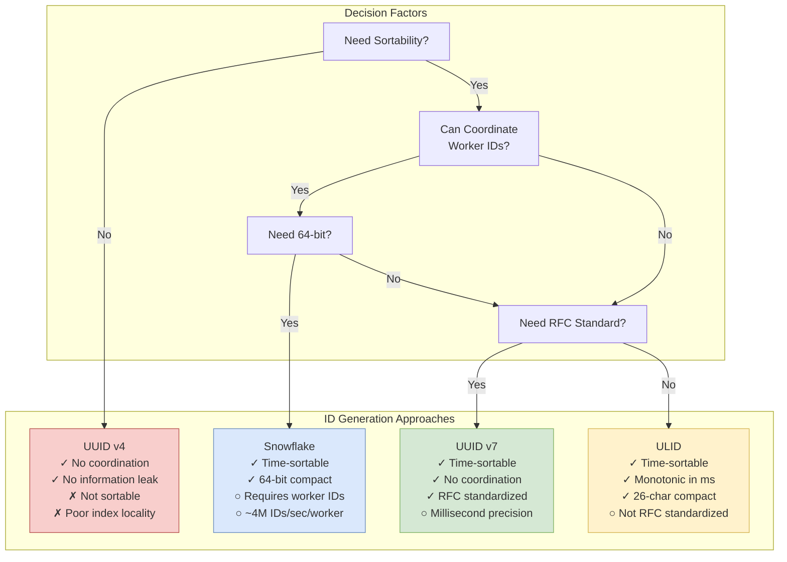
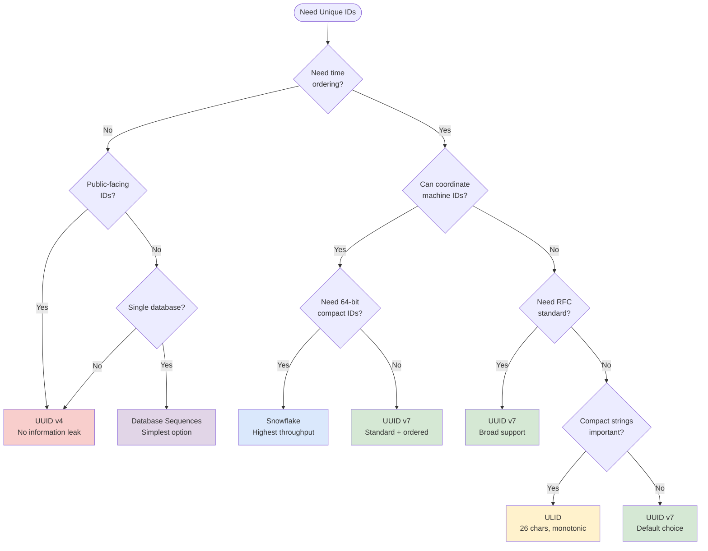

# Unique ID Generation in Distributed Systems

Designing unique identifier systems for distributed environments: understanding the trade-offs between sortability, coordination overhead, collision probability, and database performance across UUIDs, Snowflake IDs, ULIDs, and KSUIDs.

<figure>



<figcaption>Decision tree for selecting unique ID generation strategy based on system requirements</figcaption>

</figure>

## Abstract

Unique identifier generation in distributed systems is fundamentally a trade-off problem with no universal solution. The core tension is between **coordination** (which guarantees uniqueness but creates bottlenecks) and **randomness** (which scales infinitely but offers probabilistic uniqueness). Time-based schemes like Snowflake split the difference by using timestamps for approximate ordering while partitioning the ID space by machine ID to eliminate coordination.

The key mental model:

- **Random IDs (UUID v4)**: Infinite throughput, zero coordination, but destroy B-tree locality and are unsortable
- **Time-ordered IDs (UUID v7, Snowflake, ULID)**: Natural chronological ordering, excellent index performance, but leak creation time
- **Coordinated IDs (database sequences)**: Perfect ordering, but single point of failure that doesn't scale

The database performance impact is not theoretical—random UUIDs cause 500× more B-tree page splits than sequential IDs. Companies migrating from UUID v4 to v7 report 50% reductions in write I/O.

As of May 2024, RFC 9562 standardizes UUID v7 as the recommended approach for new systems: time-ordered, coordination-free, and database-friendly.

## The Core Problem: Uniqueness Without Coordination

In a single-database system, `AUTO_INCREMENT` solves ID generation trivially—a centralized counter guarantees uniqueness. Distributed systems break this model. When writes happen across multiple nodes, data centers, or even multiple processes on one machine, you need IDs that are:

1. **Globally unique** without a central coordinator
2. **Fast to generate** (microsecond latency, millions per second)
3. **Compact** (fit in a database column efficiently)
4. **Optionally sortable** by creation time

The design space splits into three fundamental approaches:

| Approach | Uniqueness Guarantee | Coordination | Throughput | Sortability |
|----------|---------------------|--------------|------------|-------------|
| **Random** (UUID v4) | Probabilistic (2^-122 collision per pair) | None | Unlimited | None |
| **Time + Partition** (Snowflake) | Deterministic (machine ID + sequence) | Machine ID assignment | ~4M/sec/worker | Chronological |
| **Time + Random** (UUID v7, ULID) | Probabilistic within millisecond | None | Unlimited | Chronological |

## Design Choices

### Option 1: Random UUIDs (UUID v4)

**Mechanism:** Generate 122 bits of cryptographically secure randomness, set 6 bits for version (4) and variant (RFC 4122). No timestamp, no machine ID, no coordination.

```
xxxxxxxx-xxxx-4xxx-yxxx-xxxxxxxxxxxx
         │    │    │
         │    │    └── Variant bits (y = 8, 9, a, or b)
         │    └─────── Version 4
         └──────────── 122 bits of randomness
```

**Best when:**

- Public-facing IDs where you want no information leakage
- Distributed systems with no ability to coordinate machine IDs
- ID generation happens infrequently (read-heavy workloads)
- You can tolerate poor database write performance

**Trade-offs:**

- ✅ Zero coordination overhead
- ✅ Infinite horizontal scalability
- ✅ No information leakage (creation time, machine, sequence)
- ✅ Simple to implement—most languages have built-in support
- ❌ Unsortable—no temporal ordering
- ❌ Catastrophic B-tree performance (random insertion points)
- ❌ 128 bits (36 characters as string)—larger than necessary

**Real-world example:** Many early SaaS applications used UUID v4 for all primary keys. As datasets grew to tens of millions of rows, write performance degraded significantly. One company observed 5,000-10,000 B-tree page splits per million inserts (vs. 10-20 for sequential IDs), leading to index bloat and slow writes.

### Option 2: UUID v7 (Time-Ordered, RFC 9562)

**Mechanism:** 48-bit Unix timestamp (milliseconds) in the most significant bits, followed by 74 bits of randomness. The timestamp placement makes UUIDs naturally sortable by creation time.

```
 0                   1                   2                   3
 0 1 2 3 4 5 6 7 8 9 0 1 2 3 4 5 6 7 8 9 0 1 2 3 4 5 6 7 8 9 0 1
├─┴─┴─┴─┴─┴─┴─┴─┴─┴─┴─┴─┴─┴─┴─┴─┴─┴─┴─┴─┴─┴─┴─┴─┴─┴─┴─┴─┴─┴─┴─┴─┤
│                         unix_ts_ms (32 bits)                  │
├─┴─┴─┴─┴─┴─┴─┴─┴─┴─┴─┴─┴─┴─┴─┴─┴─┴─┴─┴─┴─┴─┴─┴─┴─┴─┴─┴─┴─┴─┴─┴─┤
│  unix_ts_ms (16 bits) │ ver │      rand_a (12 bits)           │
├─┴─┴─┴─┴─┴─┴─┴─┴─┴─┴─┴─┴─┴─┴─┴─┴─┴─┴─┴─┴─┴─┴─┴─┴─┴─┴─┴─┴─┴─┴─┴─┤
│var│                    rand_b (62 bits)                       │
├─┴─┴─┴─┴─┴─┴─┴─┴─┴─┴─┴─┴─┴─┴─┴─┴─┴─┴─┴─┴─┴─┴─┴─┴─┴─┴─┴─┴─┴─┴─┴─┤
│                        rand_b (32 bits)                       │
└───────────────────────────────────────────────────────────────┘
```

**Best when:**

- New systems where you control the tech stack
- Need time-based ordering without coordination
- Database write performance matters
- Want RFC standardization and broad library support

**Trade-offs:**

- ✅ Chronologically sortable (lexicographic sort = time sort)
- ✅ No coordination required
- ✅ Excellent B-tree performance (sequential-ish inserts)
- ✅ RFC 9562 standardized (May 2024)
- ✅ No MAC address leakage (unlike UUID v1/v6)
- ❌ Millisecond precision only (multiple IDs per ms have random order among themselves)
- ❌ Leaks approximate creation time
- ❌ Still 128 bits (larger than Snowflake's 64)

**Real-world example:** Buildkite migrated from sequential integers to UUID v7 for their distributed architecture. The time-ordering preserved their ability to sort by creation while eliminating the single-database bottleneck. PostgreSQL 18 adds native `uuidv7()` function with optional sub-millisecond precision using the `rand_a` field as a counter.

### Option 3: Snowflake IDs (Twitter's Design)

**Mechanism:** 64-bit ID divided into timestamp (41 bits), machine/worker ID (10 bits), and sequence number (12 bits). The machine ID is assigned at deployment time; the sequence increments within each millisecond.

```
┌──────────────────────────────────────────────────────────────────┐
│ 0 │     41 bits: timestamp (ms since epoch)    │ 10 │   12     │
│   │                                            │bits│  bits    │
│ ↑ │              ~69 years of IDs              │ ↑  │   ↑      │
│   │                                            │    │          │
│sign│         milliseconds since custom epoch    │node│ sequence │
│bit │                                            │ ID │  number  │
└──────────────────────────────────────────────────────────────────┘
```

**Best when:**

- Need 64-bit IDs (half the storage of UUIDs)
- Can coordinate machine/worker ID assignment
- High throughput requirements (millions of IDs/second)
- Strict monotonic ordering within a node matters

**Trade-offs:**

- ✅ Compact 64 bits (fits in `BIGINT`)
- ✅ Strictly monotonic within a worker
- ✅ High throughput: 4,096 IDs/ms/worker = ~4M IDs/sec/worker
- ✅ Time-sortable
- ❌ Requires machine ID coordination (ZooKeeper, config management)
- ❌ Clock skew can cause issues (blocking or duplicate IDs)
- ❌ Limited to ~1,024 workers without bit reallocation
- ❌ Custom epoch creates ecosystem fragmentation

**Real-world example:** Twitter created Snowflake in 2010 when migrating from MySQL to Cassandra. "There is no sequential id generation facility in Cassandra, nor should there be." They needed "tens of thousands of ids per second in a highly available manner" with IDs that are "roughly sortable."

**Variants:**

| Company | Timestamp | Node/Shard | Sequence | Epoch |
|---------|-----------|------------|----------|-------|
| **Twitter** | 41 bits | 10 bits (worker) | 12 bits | 2010-11-04 |
| **Discord** | 41 bits | 10 bits (worker) | 12 bits | 2015-01-01 |
| **Instagram** | 41 bits | 13 bits (shard) | 10 bits | Custom |

Instagram's variant uses more shard bits (8,192 shards vs. 1,024 workers) at the cost of fewer sequences per shard (1,024 vs. 4,096 per millisecond).

### Option 4: ULID (Universally Unique Lexicographically Sortable Identifier)

**Mechanism:** 48-bit timestamp (milliseconds) + 80 bits of cryptographic randomness, encoded as 26 characters using Crockford's Base32.

```
 01AN4Z07BY      79KA1307SR9X4MV3
|----------|    |----------------|
 Timestamp          Randomness
  48 bits            80 bits
```

**Best when:**

- Need compact string representation (26 chars vs. UUID's 36)
- Human-readable/typeable IDs matter
- Want monotonicity within the same millisecond
- Don't need RFC standardization

**Trade-offs:**

- ✅ Compact: 26 characters (vs. UUID's 36)
- ✅ Case-insensitive, URL-safe, no special characters
- ✅ Monotonic within millisecond (random bits increment)
- ✅ Crockford Base32 excludes ambiguous characters (I, L, O, U)
- ❌ Not RFC standardized (community spec)
- ❌ Less library support than UUIDs
- ❌ 128 bits (same size as UUID in binary)

**Real-world example:** ULID gained popularity in JavaScript ecosystems where the shorter string representation reduces storage and bandwidth. The monotonicity guarantee within a millisecond—achieved by incrementing the random portion—provides better database locality than pure random approaches.

### Option 5: KSUID (K-Sortable Unique Identifier)

**Mechanism:** 32-bit timestamp (seconds) + 128 bits of cryptographic randomness, totaling 160 bits. Encoded as 27 Base62 characters.

```
┌──────────────────────────────────────────────────────────┐
│  32 bits: timestamp    │  128 bits: random payload      │
│  (seconds since epoch) │  (cryptographic randomness)    │
└──────────────────────────────────────────────────────────┘
         4 bytes                    16 bytes
                    = 20 bytes total
```

**Best when:**

- Need higher collision resistance than UUID (128 vs. 122 random bits)
- Second-precision timestamps are sufficient
- Want natural shell/CLI sorting (`sort` command works correctly)

**Trade-offs:**

- ✅ 128 bits of entropy (64× more collision resistance than UUID v4)
- ✅ Shell-sortable (both binary and text representations)
- ✅ Simple implementation
- ❌ Larger than UUID (160 bits vs. 128)
- ❌ Second precision only (coarser than millisecond)
- ❌ Less widely adopted

**Real-world example:** Segment created KSUID when they "began using UUID Version 4 for generating unique identifiers, but after a requirement to order these identifiers by time emerged, KSUID was born." The 128-bit random payload exceeds UUID v4's 122 bits "by 64×, making collisions physically infeasible."

### Option 6: Database Sequences

**Mechanism:** Centralized counter managed by the database. PostgreSQL uses `SEQUENCE` objects; MySQL uses `AUTO_INCREMENT`.

**Best when:**

- Single database (no sharding)
- Need strictly monotonic IDs with no gaps
- Regulatory requirements mandate sequential numbering
- Write throughput is moderate (< 10K inserts/sec)

**Trade-offs:**

- ✅ Perfect ordering (no gaps in typical usage)
- ✅ Minimal storage (32 or 64 bits)
- ✅ Native database support
- ❌ Single point of failure
- ❌ Doesn't scale across shards/regions
- ❌ Network round-trip for each ID (can be batched)

**Real-world example:** Flickr's "Ticket Servers" used MySQL's `REPLACE INTO` with `LAST_INSERT_ID()` for distributed ID generation. To achieve high availability, they ran two ticket servers dividing the ID space—one handling even IDs, the other handling odd IDs.

## Factors Influencing Design Choices

### Factor 1: Database Write Performance

The impact of ID randomness on B-tree indexes is severe and measurable:

| ID Type | Page Splits per 1M Inserts | Relative WAL Volume |
|---------|---------------------------|---------------------|
| Sequential (AUTO_INCREMENT) | ~10-20 | 1× (baseline) |
| UUID v7 / Snowflake / ULID | ~50-100 | 1.1-1.2× |
| UUID v4 (random) | 5,000-10,000+ | 2-3× |

**Why it matters:** B-tree indexes store data in sorted order. Sequential IDs insert at the end of the tree, reusing the same leaf pages. Random IDs insert at arbitrary positions, causing:

1. **Page splits**: When a leaf page is full and a new value lands in it, the page splits in half
2. **Index bloat**: Split pages are only ~50% full initially
3. **Write amplification**: More pages modified = more WAL writes = more I/O

One company reported a **50% reduction in WAL rate** after migrating from UUID v4 to UUID v7.

### Factor 2: Sortability Requirements

| Requirement | Recommended Approach |
|------------|---------------------|
| No sorting needed | UUID v4 |
| Sort by creation time | UUID v7, Snowflake, ULID |
| Strict ordering within node | Snowflake (sequence guarantees) |
| Approximate time ordering | UUID v7, ULID |
| Sort by arbitrary criteria | UUID v4 + separate timestamp column |

### Factor 3: Coordination Overhead

| Approach | Coordination Required |
|----------|----------------------|
| UUID v4, v7 | None |
| ULID, KSUID | None |
| Snowflake | Machine ID assignment (1,024 max with standard allocation) |
| Database sequences | Central database connection |

For Snowflake, machine ID assignment typically uses:

- **Static configuration**: Machine IDs in config files or environment variables
- **ZooKeeper/etcd**: Dynamic assignment with leader election
- **Database table**: Claim a machine ID on startup with row-level locking
- **Kubernetes**: Use pod ordinal from StatefulSet

### Factor 4: Size Constraints

| Format | Binary Size | String Size | Database Type |
|--------|------------|-------------|---------------|
| Snowflake | 64 bits | 19 chars | BIGINT |
| UUID v4/v7 | 128 bits | 36 chars | UUID / CHAR(36) |
| ULID | 128 bits | 26 chars | CHAR(26) / BINARY(16) |
| KSUID | 160 bits | 27 chars | CHAR(27) / BINARY(20) |

The 64-bit vs. 128-bit difference matters at scale:

- **Index size**: 64-bit keys use half the memory in B-tree nodes
- **Join performance**: Smaller keys = more keys per cache line
- **Storage**: At 1 billion rows, 8 bytes vs. 16 bytes = 8 GB difference in primary key storage alone

### Factor 5: Information Leakage

| Format | Leaks Creation Time | Leaks Machine Info |
|--------|--------------------|--------------------|
| UUID v1 | Yes (100-ns precision) | Yes (MAC address) |
| UUID v4 | No | No |
| UUID v6 | Yes (100-ns precision) | Yes (MAC address) |
| UUID v7 | Yes (ms precision) | No |
| Snowflake | Yes (ms precision) | Yes (worker ID) |
| ULID | Yes (ms precision) | No |
| KSUID | Yes (second precision) | No |

**Security consideration:** UUID v1/v6 leak MAC addresses. The Melissa virus author was identified partly through UUID v1 metadata. Modern systems should avoid v1/v6 for public-facing IDs.

Time leakage allows attackers to:

- Enumerate objects created in a time range
- Estimate system load (IDs per second)
- Determine account creation dates

If these are concerns, use UUID v4 or add a layer of encryption/hashing.

## Real-World Case Studies

### Discord: Snowflake for Everything

**Problem:** Discord needed globally unique, sortable IDs at 100K+ messages/second across thousands of servers.

**Rejected approaches:**

1. **UUIDs**: Not sortable, poor index locality for their message-heavy workload
2. **Database sequences**: Single point of failure, couldn't scale to their throughput

**Chosen approach:** Twitter Snowflake variant with epoch set to January 1, 2015 (`1420070400000`).

**Implementation details:**

- Uses Snowflakes for message IDs, user IDs, server IDs—everything
- Supports "upwards of 10,000 unique generations per second on commodity hardware"
- Worker IDs assigned through configuration management
- Custom epoch means Discord's IDs are smaller numbers than Twitter's for the same wall-clock time

**Trade-off accepted:** Machine ID coordination overhead (managed via their infrastructure automation).

### Instagram: Sharded Snowflake Variant

**Problem:** Needed IDs that work across PostgreSQL shards while maintaining time-ordering.

**Chosen approach:** Modified Snowflake with larger shard ID space:

- 41 bits: timestamp (milliseconds since custom epoch)
- 13 bits: shard ID (8,192 possible shards)
- 10 bits: sequence (1,024 IDs per shard per millisecond)

**Key insight:** Instagram trades per-shard throughput (1,024 vs. Twitter's 4,096 IDs/ms) for a larger shard namespace. Their workload has many shards with moderate write rates rather than few workers with high write rates.

### PostgreSQL: Native UUID v7 in Version 18

**Problem:** Developers using UUID v4 as primary keys suffered severe write performance degradation.

**Solution:** PostgreSQL 18 (expected 2025) adds native `uuidv7()` function:

```sql
SELECT uuidv7();
-- Returns: 019011d3-33a6-7000-8000-57d7a8d3ce88
```

**Implementation detail:** Uses the `rand_a` field (12 bits) as a sub-millisecond counter, providing 4,096 monotonically increasing UUIDs per millisecond. This matches Snowflake's sequence capacity while requiring no coordination.

**Migration path:** For existing systems on UUID v4, the change is straightforward:

```sql
-- Before
ALTER TABLE users ALTER COLUMN id SET DEFAULT gen_random_uuid();

-- After
ALTER TABLE users ALTER COLUMN id SET DEFAULT uuidv7();
```

Existing v4 UUIDs remain valid—they just won't sort chronologically.

## Common Pitfalls

### Pitfall 1: Using UUID v4 for Write-Heavy Tables

**The mistake:** Choosing UUID v4 for "simplicity" on tables with millions of inserts per day.

**Why it happens:** UUID v4 is the default in many ORMs and frameworks. It works fine in development and early production.

**The consequence:** As the table grows past 10-100 million rows, write latency increases, disk I/O spikes, and vacuum/analyze times explode. The B-tree index becomes fragmented with half-full pages scattered across disk.

**The fix:** Use UUID v7 (or Snowflake/ULID) for any table expecting significant write volume. The time-ordered nature keeps inserts at the "hot" end of the index.

### Pitfall 2: Clock Skew in Snowflake Implementations

**The mistake:** Assuming system clocks are always monotonic.

**Why it happens:** NTP corrections, VM migrations, leap seconds, and manual clock adjustments can move the clock backward.

**The consequence:** If a Snowflake generator uses a timestamp from the past:

- **Best case:** Sequence collision with IDs generated earlier at that timestamp
- **Worst case:** Duplicate IDs if the sequence wraps

**The fix:**

```ts
function generateSnowflake(lastTimestamp: bigint, sequence: number): { id: bigint; newTimestamp: bigint; newSequence: number } {
  let timestamp = BigInt(Date.now() - EPOCH)

  if (timestamp < lastTimestamp) {
    // Clock moved backward - wait or throw
    const drift = lastTimestamp - timestamp
    if (drift < 10n) {
      // Small drift: busy-wait
      while (timestamp <= lastTimestamp) {
        timestamp = BigInt(Date.now() - EPOCH)
      }
    } else {
      // Large drift: fail fast
      throw new Error(`Clock moved backward by ${drift}ms`)
    }
  }

  // ... rest of generation logic
}
```

Discord handles this by blocking until the clock catches up for small drifts (< 10ms) and failing fast for larger anomalies.

### Pitfall 3: Assuming UUIDs Never Collide

**The mistake:** Treating UUID collisions as impossible and not handling them.

**Why it happens:** The math is reassuring—2^122 random bits means astronomically low collision probability.

**The consequence:** At sufficient scale, collisions do happen:

- Weak random number generators (non-cryptographic, predictable seeds)
- VM cloning with duplicated entropy pools
- Bugs in UUID libraries
- Birthday paradox at extreme scale (~2^61 UUIDs for 50% collision chance)

**The fix:** Always use `INSERT ... ON CONFLICT` or equivalent upsert semantics. Treat the unique constraint as the source of truth:

```sql
INSERT INTO users (id, email, name)
VALUES (gen_random_uuid(), 'user@example.com', 'Alice')
ON CONFLICT (id) DO NOTHING
RETURNING id;

-- If returned id is NULL, collision occurred - retry with new UUID
```

### Pitfall 4: Exposing Snowflake Worker IDs

**The mistake:** Using sequential worker IDs (0, 1, 2...) that reveal infrastructure topology.

**Why it happens:** Simple implementations assign worker IDs from a counter or config file.

**The consequence:** Attackers can enumerate your worker count, identify which datacenter generated an ID, and potentially correlate IDs to specific servers.

**The fix:** Hash the worker ID or use random assignment within the available space:

```ts
// Instead of: workerId = serverIndex % 1024
// Use: workerId = hash(serverName + deploymentSecret) % 1024
```

## How to Choose



**Default recommendation (2024+):** UUID v7 for most new systems. It provides time-ordering, excellent database performance, RFC standardization, and requires no coordination.

**Use Snowflake when:**

- 64-bit IDs are required (legacy systems, specific database constraints)
- You need maximum throughput (> 1M IDs/sec/node)
- Strict monotonicity within a process matters
- You have infrastructure for machine ID coordination

**Use UUID v4 when:**

- IDs are public and you need zero information leakage
- Write volume is low enough that index performance doesn't matter
- Migrating existing systems where UUIDs are already in use

## Conclusion

The unique ID generation landscape has matured significantly. For most distributed systems built today, **UUID v7** is the right default—it combines the best properties of random UUIDs (no coordination) and Snowflake IDs (time-ordering) with RFC standardization and broad library support.

The key insight is that ID generation is fundamentally about **where you pay the coordination cost**:

- **Random IDs**: No coordination at generation time, but you pay at query time (poor index locality)
- **Time-ordered IDs**: Coordination implicit in synchronized clocks, but you gain efficient database operations
- **Partitioned IDs (Snowflake)**: Explicit coordination of machine IDs, but guaranteed uniqueness and highest throughput

Understand these trade-offs, measure your workload characteristics, and choose accordingly. The 50% write I/O reduction from switching to time-ordered IDs is not theoretical—it's consistently observed in production migrations.

## Appendix

### Prerequisites

- Understanding of B-tree index structures and page splits
- Familiarity with distributed systems concepts (coordination, partitioning)
- Basic probability (birthday paradox for collision calculations)

### Terminology

- **UUID (Universally Unique Identifier)**: 128-bit identifier standardized in RFC 9562 (formerly RFC 4122)
- **Snowflake ID**: 64-bit time-ordered identifier design originated at Twitter
- **ULID (Universally Unique Lexicographically Sortable Identifier)**: 128-bit identifier using Crockford Base32 encoding
- **KSUID (K-Sortable Unique Identifier)**: 160-bit identifier created by Segment
- **Epoch**: Reference timestamp from which time-based IDs count (e.g., Unix epoch = 1970-01-01)
- **Monotonic**: Strictly increasing—each generated ID is greater than all previous IDs

### Summary

- **UUID v7** is the recommended default for new systems (RFC 9562, May 2024)
- **Random UUIDs (v4)** cause 500× more B-tree page splits than sequential IDs
- **Snowflake** remains optimal for 64-bit requirements and maximum throughput (~4M IDs/sec/worker)
- **Clock skew** is the primary failure mode for time-based ID generators
- **Information leakage** from timestamps is acceptable for most internal IDs but not for public-facing ones

### References

#### Specifications

- [RFC 9562 - Universally Unique IDentifiers (UUIDs)](https://www.rfc-editor.org/rfc/rfc9562.html) - The authoritative UUID specification (May 2024), obsoleting RFC 4122. Defines UUID v1-v8 including the new time-ordered v7.
- [ULID Specification](https://github.com/ulid/spec) - Community specification for Universally Unique Lexicographically Sortable Identifiers.
- [KSUID Specification](https://github.com/segmentio/ksuid) - Segment's K-Sortable Unique Identifier design and reference implementation.

#### Original Design Documents

- [Announcing Snowflake](https://blog.x.com/engineering/en_us/a/2010/announcing-snowflake) - Twitter Engineering's original blog post (November 2010) introducing the Snowflake ID system.
- [Ticket Servers: Distributed Unique Primary Keys on the Cheap](https://code.flickr.net/2010/02/08/ticket-servers-distributed-unique-primary-keys-on-the-cheap/) - Flickr's approach to distributed ID generation using MySQL ticket servers.

#### Implementation References

- [UUIDv7 in PostgreSQL 18](https://www.postgresql.org/docs/18/functions-uuid.html) - PostgreSQL documentation for native UUID v7 support.
- [Discord Snowflake Documentation](https://discord.com/developers/docs/reference#snowflakes) - Discord's developer documentation explaining their Snowflake implementation.

#### Performance Analysis

- [Goodbye Integers, Hello UUIDs - Buildkite](https://buildkite.com/resources/blog/goodbye-integers-hello-uuids/) - Case study on migrating from sequential integers to UUIDs in a distributed system.
- [Random UUID Damage to B-tree Performance](https://thehellmaker.com/blog/random-uuid-damage-btree-performance/) - Detailed analysis of how random UUIDs cause B-tree fragmentation.
