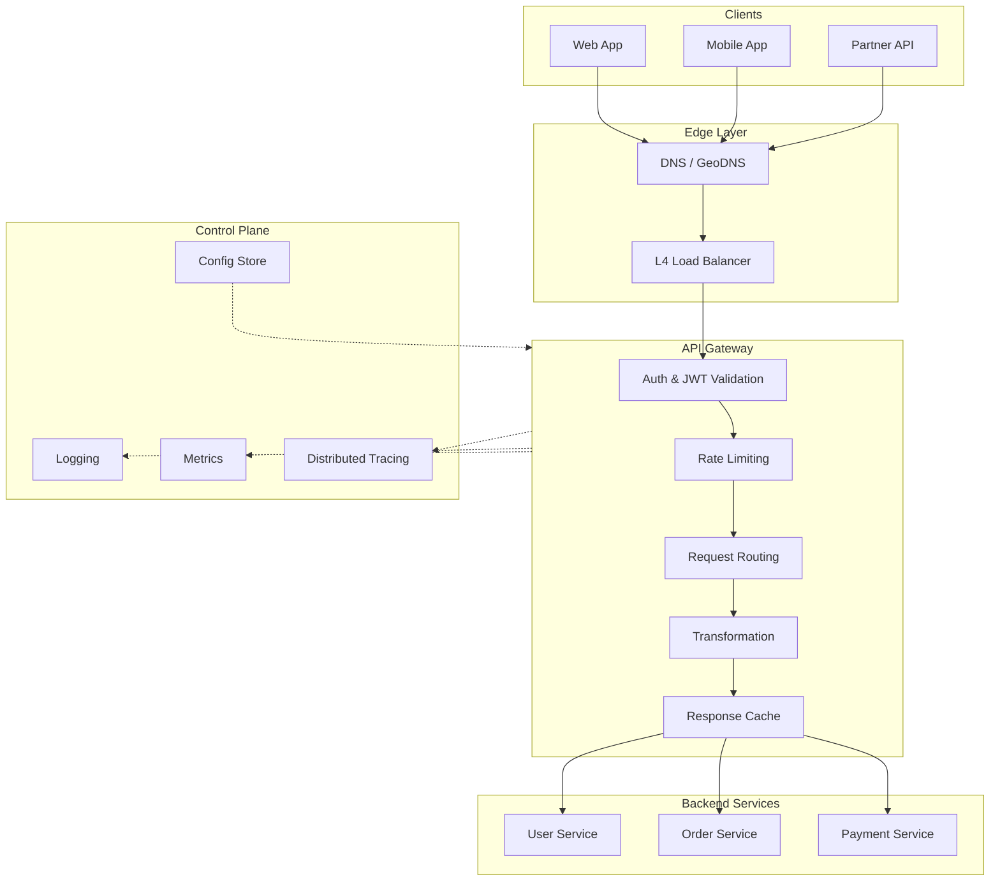

# API Gateway Patterns: Routing, Auth, and Policies

Centralized traffic management for microservices: design choices for routing, authentication, rate limiting, and protocol translation—with real-world implementations from Netflix, Google, and Amazon.

<figure>



<figcaption>API gateway as the enforcement point for cross-cutting concerns. Requests flow through auth, rate limiting, and routing before reaching backends. Observability captures metrics at every stage.</figcaption>
</figure>

## Abstract

API gateways solve the "N×M problem" in microservices: without a gateway, every client type (web, mobile, partner) must implement authentication, rate limiting, and service discovery against every backend service. Gateways centralize these cross-cutting concerns at a single enforcement point.

The core trade-off: **centralization vs coupling**. A gateway simplifies clients but becomes a critical dependency. Design choices determine whether that dependency is an operational risk (single point of failure) or a resilience layer (circuit breaking, graceful degradation).

| Concern        | Gateway Responsibility                | Why at Gateway                                   |
| -------------- | ------------------------------------- | ------------------------------------------------ |
| Authentication | JWT validation, API key lookup        | Reject unauthorized requests before backend load |
| Rate limiting  | Token bucket, sliding window          | Protect backends from abuse at edge              |
| Routing        | Path/header-based dispatch            | Decouple client URLs from service topology       |
| Transformation | Protocol translation, payload shaping | Adapt external formats to internal contracts     |
| Observability  | Trace initiation, access logs         | Capture full request context at entry point      |

Key architectural patterns:

- **Edge gateway**: External traffic, strict security, global distribution
- **Internal gateway**: Service-to-service, lighter auth, service mesh integration
- **BFF (Backend for Frontend)**: Client-specific aggregation, mobile-optimized payloads

## Gateway Responsibilities

### Request Routing

Gateways decouple client-facing URLs from backend service topology. Clients call `/api/users` regardless of which service, version, or datacenter handles the request.

**Path-based routing:**

```
/api/v1/users/* → user-service-v1
/api/v2/users/* → user-service-v2
/api/orders/*   → order-service
/static/*       → CDN origin
```

**Header-based routing:**

```
X-API-Version: 2023-10 → service-v2023-10
X-Client-Type: mobile  → mobile-optimized-backend
X-Tenant-ID: acme      → tenant-acme-cluster
```

**Weighted traffic splitting:** Critical for canary deployments. Route 5% of traffic to new version, 95% to stable:

```yaml
routes:
  - match: /api/users
    backends:
      - service: user-service-v2
        weight: 5
      - service: user-service-v1
        weight: 95
```

**Design consideration:** Path-based versioning (`/v1/`, `/v2/`) is explicit but pollutes URLs. Header-based versioning keeps URLs clean but requires client configuration. Netflix and Stripe use header-based versioning for internal APIs, path-based for public APIs where discoverability matters.

### Authentication and Authorization

Gateways validate credentials before requests reach backends, rejecting unauthorized traffic at the edge.

**JWT validation (stateless):**

1. Gateway extracts token from `Authorization: Bearer <token>` header
2. Validates signature using cached public key from identity provider
3. Checks `exp`, `iat`, `iss`, `aud` claims
4. Forwards validated claims to backend via headers

**Why at gateway:** A single JWT validation implementation serves all backends. Without gateway auth, each service re-implements token validation—N services × risk of inconsistent implementations.

**Token introspection (stateful):** For opaque tokens or revocation requirements, gateway calls authorization server to validate. Adds latency (~10-50ms per request) but enables immediate revocation.

**API key validation:**

1. Gateway extracts key from header or query param
2. Looks up key in fast store (Redis, local cache)
3. Retrieves associated rate limits, quotas, permissions
4. Forwards tenant context to backend

**Authorization patterns:**

| Pattern                   | Where   | When                                                          |
| ------------------------- | ------- | ------------------------------------------------------------- |
| Coarse-grained at gateway | Gateway | Route-level access (can user call this endpoint?)             |
| Fine-grained at service   | Backend | Resource-level access (can user access this specific record?) |

**Real-world:** AWS API Gateway supports JWT authorizers with <1ms validation latency when using cached public keys. Custom authorizers (Lambda) add 50-100ms cold start overhead.

### Rate Limiting and Quota Enforcement

Rate limiting protects backends from abuse and ensures fair resource allocation among clients.

**Token bucket algorithm (most common):**

- Bucket holds tokens up to maximum capacity
- Tokens added at fixed rate (e.g., 100/second)
- Each request consumes one token
- When empty, requests rejected with 429

**Why token bucket:** Handles burst traffic naturally. If a client is idle, tokens accumulate (up to bucket size). Short bursts are allowed; sustained overload is blocked.

**Sliding window log:**

- Track timestamp of each request
- Count requests in sliding window (e.g., last 60 seconds)
- More accurate than fixed windows but higher memory (stores every request timestamp)

**Sliding window counter (hybrid):**

- Combine current window count with weighted previous window
- Example: 40 seconds into current minute with 50 requests, previous minute had 100 requests
- Weighted count: 50 + (100 × 20/60) ≈ 83 requests

**Distributed rate limiting challenge:** With multiple gateway instances, local counters undercount. Solutions:

1. **Centralized store (Redis):** Accurate but adds network latency (~1ms per request)
2. **Consistent hashing:** Route same client to same gateway instance
3. **Gossip protocol:** Eventual consistency across instances, slight overrun possible

**Kong's approach:** Offers local (in-memory), cluster (gossip), and Redis strategies. Redis for accuracy-critical limits, local for high-throughput scenarios where slight overrun is acceptable.

**Real-world numbers:**

- Stripe: 100 requests/second baseline, burst to 200
- GitHub: 5000 requests/hour for authenticated, 60/hour for unauthenticated
- Twitter: 300 requests/15-minute window for user timeline

### Request/Response Transformation

Gateways adapt external API contracts to internal service contracts, enabling backend evolution without breaking clients.

**Header transformation:**

```yaml
request:
  add:
    X-Request-ID: ${uuid()}
    X-Forwarded-For: ${client_ip}
  remove:
    - X-Internal-Debug
response:
  remove:
    - X-Powered-By
    - Server
```

**Protocol translation:**

- **REST to gRPC:** Gateway accepts JSON, converts to Protobuf, calls gRPC service
- **GraphQL federation:** Gateway composes schema from multiple services, resolves queries across backends
- **SOAP to REST:** Legacy integration without backend changes

**Payload transformation:**

- Field renaming: `user_id` → `userId` for JavaScript clients
- Field filtering: Remove internal fields from external responses
- Aggregation: Combine multiple backend responses into single client response

**Design trade-off:** Heavy transformation logic belongs in a dedicated service or BFF, not the gateway. Gateway transformations should be simple (header injection, field filtering). Complex business logic in the gateway creates a monolith.

### Caching at the Edge

Gateway caching reduces backend load and improves latency for cacheable responses.

**Cache placement:**

```
Client → CDN → Gateway Cache → Backend
         ↑         ↑
      seconds    seconds-minutes
```

**Cache key composition:**

```
key = hash(method + path + query_params + vary_headers)
```

**TTL strategies:**

| Content Type   | TTL           | Rationale                             |
| -------------- | ------------- | ------------------------------------- |
| Static assets  | 1 week+       | Versioned URLs for cache busting      |
| User profile   | 5-15 minutes  | Balance freshness vs load             |
| Search results | 30-60 seconds | Rapidly changing, high request volume |
| Real-time data | No cache      | Freshness critical                    |

**Cache invalidation:**

- **TTL-based:** Simple, eventual consistency
- **Event-driven:** Backend publishes invalidation events, gateway subscribes
- **Purge API:** Explicit invalidation for known changes

**AWS API Gateway caching:** Default TTL 300 seconds (5 minutes), maximum 3600 seconds (1 hour). Cache per stage, configurable per method.

**Gotcha:** Caching authenticated responses requires cache key to include user identity. Without this, user A may see user B's cached response.

### Observability Integration

Gateways are the ideal observability entry point—they see every request before distribution across services.

**Distributed tracing initiation:**

1. Gateway generates trace ID (or uses incoming `traceparent` header)
2. Injects trace context into downstream requests
3. Records gateway span with timing, routing decision, auth result

**Why gateway-initiated:** Without trace context from gateway, downstream services can't correlate their spans. The gateway ensures every request has a trace ID from the first hop.

**Access logging:**

```json
{
  "timestamp": "2024-01-15T10:30:00Z",
  "trace_id": "abc123",
  "client_ip": "203.0.113.42",
  "method": "POST",
  "path": "/api/orders",
  "status": 201,
  "latency_ms": 142,
  "backend": "order-service",
  "rate_limit_remaining": 97
}
```

**Metrics to capture:**

- Request rate by endpoint, client, status code
- Latency percentiles (p50, p95, p99) per route
- Error rates by type (4xx client, 5xx server, timeout)
- Rate limit rejections by client
- Cache hit ratio

**OpenTelemetry integration:** Modern gateways (Kong, Envoy) export traces, metrics, and logs in OpenTelemetry format, enabling unified observability pipelines.

## Gateway Architecture Patterns

### Edge Gateway vs Internal Gateway

**Edge gateway (north-south traffic):**

- Faces public internet
- Strict security: TLS termination, WAF integration, DDoS protection
- Rate limiting by client/API key
- Protocol translation (external REST to internal gRPC)
- Global distribution for latency

**Internal gateway (east-west traffic):**

- Service-to-service within VPC/cluster
- Lighter auth: mTLS, service identity tokens
- Focus on routing, retries, circuit breaking
- Often replaced by service mesh (Istio, Linkerd)

**Two-tier pattern:** Most production systems use both. Edge gateway handles external clients, internal gateway (or service mesh) handles inter-service communication.

```
Internet → Edge Gateway → Internal Gateway/Service Mesh → Services
                ↓                      ↓
           Public APIs            Service-to-service
```

### Backend for Frontend (BFF)

BFF pattern: dedicated gateway per client type, each optimized for its client's needs.

**Why BFF:**

- Mobile needs minimal payloads (bandwidth constraints)
- Web needs rich data (larger screens, faster networks)
- Partner APIs need stable contracts (SLAs, versioning)

**Architecture:**

```
Mobile App  → Mobile BFF  ┐
Web App     → Web BFF     ├→ Internal Services
Partner API → Partner BFF ┘
```

**BFF responsibilities:**

- Aggregate data from multiple services into client-specific format
- Handle client-specific auth flows (OAuth for web, API keys for partners)
- Implement client-specific caching strategies
- Translate errors into client-appropriate formats

**Team ownership:** BFF is owned by client team (mobile team owns mobile BFF). This enables client teams to iterate on API shape without coordinating with backend teams.

**Trade-off:** BFF adds operational complexity (N client types = N gateways). Worth it when client requirements diverge significantly.

**Real-world:** Netflix runs separate BFFs for TV, mobile, and web. Each optimizes payload size and data shape for its device constraints.

### API Gateway vs Service Mesh

| Aspect            | API Gateway            | Service Mesh            |
| ----------------- | ---------------------- | ----------------------- |
| Traffic direction | North-south (external) | East-west (internal)    |
| Deployment        | Centralized edge       | Sidecar per service     |
| Auth focus        | External credentials   | Service identity (mTLS) |
| Protocol          | HTTP/REST/GraphQL      | Any (TCP, gRPC, HTTP)   |
| Routing           | Content-based          | Service discovery       |
| Rate limiting     | Per client/API key     | Per service             |
| Observability     | Request-level          | Connection-level        |

**Using both:** Gateway API (Kubernetes standard) enables unified configuration across ingress gateways and service mesh. Istio's ingress gateway implements Gateway API, providing consistent routing semantics edge-to-mesh.

**When to add service mesh:**

- Need mTLS between all services
- Require per-service circuit breaking, retries
- Want sidecar-based observability
- Service-to-service traffic is complex (many services, fan-out patterns)

**When service mesh is overkill:**

- Fewer than 10 services
- Simple call patterns (mostly request-response)
- Team lacks mesh operational experience

### Gateway Per Service vs Shared Gateway

**Shared gateway:**

```
All Clients → Single Gateway → All Services
```

- ✅ Single enforcement point for policies
- ✅ Simpler operations (one thing to monitor)
- ❌ Single point of failure
- ❌ Scaling bottleneck
- ❌ Configuration complexity grows with services

**Gateway per domain:**

```
User API Clients    → User Gateway    → User Services
Order API Clients   → Order Gateway   → Order Services
Partner API Clients → Partner Gateway → Partner Services
```

- ✅ Failure isolation (user gateway down ≠ order gateway down)
- ✅ Independent scaling per traffic pattern
- ✅ Team ownership (order team owns order gateway)
- ❌ Policy duplication
- ❌ More infrastructure to operate

**Production recommendation:** Split gateways by business boundary, not by having a single gateway. The single-gateway pattern has caused major outages (see Canva incident below).

## Design Choices and Trade-offs

### Stateless vs Stateful Gateway

**Stateless gateway (recommended):**

- Configuration from external store (etcd, Consul, Kubernetes ConfigMaps)
- Session state in external store (Redis) or client tokens (JWT)
- Any gateway instance can handle any request
- Fast horizontal scaling, no state migration

**Stateful gateway:**

- Local connection pools to backends
- In-memory rate limit counters
- Session affinity required
- Faster (no external lookups) but harder to scale

**Hybrid approach:** Most gateways are "stateless with caches." Configuration is external, but hot data (rate limit counts, routing tables) is cached locally with TTL or event-based invalidation.

### Custom vs Managed Gateways

**Open-source gateways:**

| Gateway       | Strengths                                  | Trade-offs                                |
| ------------- | ------------------------------------------ | ----------------------------------------- |
| Kong          | Plugin ecosystem (100+), Lua extensibility | Complex at scale                          |
| Envoy         | Performance (~100μs latency), cloud-native | Steep learning curve                      |
| NGINX         | Mature, high performance                   | Limited API gateway features without Kong |
| Apache APISIX | Modern, dashboard, cloud-native            | Smaller community                         |

**Managed gateways:**

| Service              | Strengths                            | Trade-offs                      |
| -------------------- | ------------------------------------ | ------------------------------- |
| AWS API Gateway      | Serverless, auto-scaling, 99.95% SLA | Cold starts, AWS lock-in        |
| Google Apigee        | Full lifecycle management, analytics | Complex pricing, steep learning |
| Azure API Management | Azure integration, hybrid deployment | Azure ecosystem dependency      |

**Decision factors:**

| Factor               | Choose Managed      | Choose Self-Hosted       |
| -------------------- | ------------------- | ------------------------ |
| Team ops capacity    | Limited             | Dedicated platform team  |
| Scale                | < 1B requests/month | Cost-sensitive at scale  |
| Customization        | Standard patterns   | Unique requirements      |
| Compliance           | Cloud-native apps   | On-premises requirements |
| Latency requirements | < 10ms acceptable   | Sub-millisecond critical |

**Cost crossover:** At ~1-10 billion requests/month, managed gateway costs often exceed self-hosted infrastructure + team costs.

### Synchronous vs Asynchronous Patterns

**Synchronous (request-response):**

```
Client → Gateway → Service → Gateway → Client
```

- Simple mental model
- Latency = sum of all hops
- Client blocks waiting for response

**Asynchronous (event-driven):**

```
Client → Gateway → Queue → Service processes later
                     ↓
Client polls or receives webhook
```

- Better for long-running operations
- Gateway returns immediately (202 Accepted)
- Client polls status endpoint or receives callback

**Hybrid pattern:** Gateway proxies synchronous requests but provides async fallback for timeouts:

```
1. Client calls /api/reports (sync)
2. Gateway forwards to service
3. If service responds in < 30s, return response
4. If timeout, return 202 with status URL
5. Client polls /api/reports/status/{id}
```

## Real-World Implementations

### Netflix Zuul Architecture

**Scale:** 80+ Zuul clusters handling 1M+ requests/second across 100+ backend clusters.

**Filter-based architecture:**

```
Request → PRE filters → ROUTE filters → POST filters → Response
                              ↓
                      Error → ERROR filters
```

**Filter types:**

- **PRE:** Authentication, rate limiting, request decoration
- **ROUTE:** Backend selection, load balancing (integrates with Ribbon)
- **POST:** Response decoration, metrics collection
- **ERROR:** Error handling, fallback responses

**Design decisions:**

1. **Dynamic routing:** Zuul queries Eureka (service discovery) to find healthy instances
2. **Zone-aware routing:** Tracks success rate per availability zone, shifts traffic away from degraded zones
3. **Client-side load balancing:** Ribbon handles backend selection, Zuul handles cross-cutting concerns

**Why filters:** Allows plugins without code changes. New auth mechanism = new PRE filter. Netflix deploys filter changes without Zuul restarts.

**Zuul 2 evolution:** Moved from blocking (Zuul 1) to async/non-blocking (Zuul 2) for better resource utilization under high connection counts.

### Amazon API Gateway

**Architecture:**

- Serverless, auto-scaling
- Regional deployment with optional edge-optimized (CloudFront distribution)
- 99.95% SLA (~4.5 hours downtime/year allowed)

**API types:**

| Type      | Use Case      | Features                                     |
| --------- | ------------- | -------------------------------------------- |
| HTTP API  | Simple proxy  | Lower latency, lower cost, JWT auth          |
| REST API  | Full features | Request validation, caching, WAF integration |
| WebSocket | Real-time     | Connection management, route selection       |

**Integration patterns:**

- **Lambda:** Direct invocation, request/response mapping
- **HTTP:** Proxy to any HTTP endpoint
- **VPC Link:** Private integration with ALB/NLB in VPC
- **AWS Services:** Direct integration with Step Functions, SQS, Kinesis

**Cold start consideration:** Lambda-backed APIs experience cold starts (3-10+ seconds for unoptimized functions). Provisioned Concurrency eliminates cold starts but adds cost.

**Caching:** Per-stage cache with configurable TTL (default 300s, max 3600s). Cache key includes method, path, query params, and configurable headers.

### Kong Plugin Architecture

**Design philosophy:** Core gateway is minimal; capabilities come from plugins.

**Plugin execution order:**

```
Request → Certificate → Rewrite → Access → Rate Limiting
                                     ↓
Response ← Log ← Body Transformation ← Header Transformation ← Response Transformation
```

**Rate limiting strategies:**

| Strategy | Accuracy    | Latency | Use Case                               |
| -------- | ----------- | ------- | -------------------------------------- |
| Local    | Approximate | Lowest  | High-throughput, slight overrun OK     |
| Cluster  | Better      | Medium  | Multi-node, gossip sync                |
| Redis    | Exact       | Highest | Strict limits, distributed enforcement |

**Consistent hashing integration:** Kong routes same client to same gateway node using consistent hashing, improving local rate limit accuracy without Redis overhead.

**Extensibility:** Custom plugins in Lua, Go, JavaScript, or Python. Kong's plugin development kit (PDK) provides consistent API across languages.

### Envoy as Gateway

**Performance characteristics (from Envoy FAQ):**

- Latency overhead: ~100 microseconds per request baseline
- Throughput: 200k+ QPS with 4k concurrent clients
- CPU: Max 10% utilization under load
- Memory: Never exceeds 1.1 GiB in production scenarios

**Deployment modes:**

1. **Edge gateway:** Centralized ingress, terminates TLS, applies policies
2. **Sidecar proxy:** Per-service deployment, service mesh data plane
3. **Hybrid:** Gateway for north-south, sidecar for east-west

**Configuration model:** xDS APIs enable dynamic configuration without restarts. Control plane (Istio, Consul Connect) pushes configuration; Envoy applies without downtime.

**Feature set:**

- L7 routing with retries, timeouts, circuit breaking
- Rate limiting via external service (rate limit service)
- Observability: native OpenTelemetry, Prometheus, access logs
- Load balancing: round robin, least request, ring hash, Maglev

**Why organizations choose Envoy:** Performance for latency-sensitive workloads, cloud-native design, service mesh compatibility (Istio, Consul Connect, AWS App Mesh).

### Google Apigee

**Deployment options:**

- **Apigee X (cloud-native):** Fully managed on Google Cloud
- **Apigee hybrid:** Management in cloud, runtime in customer datacenter/VPC
- **Apigee Edge (legacy):** Fully on-premises

**Federated API development:** Unlike centralized gateway models, Apigee enables distributed API ownership. Teams create and publish APIs independently; Apigee provides governance overlay.

**Architecture components:**

- **Management plane:** Policy configuration, analytics, developer portal
- **Runtime plane:** Request processing, policy enforcement
- **Message processor:** Actual request handling
- **Router:** Traffic distribution to message processors

**Analytics focus:** Apigee emphasizes API analytics—traffic patterns, error rates, latency distribution, developer adoption. Useful for API-as-product organizations.

## Common Pitfalls

### 1. Gateway as Single Point of Failure

**The mistake:** Funneling all traffic through one gateway cluster.

**Why it happens:** Centralization is convenient. One place to configure auth, rate limits, routing.

**The consequence:** Gateway failure = complete outage.

**Real incident—Canva (November 2024):**

- A telemetry library deployment introduced a performance regression
- Gateway received 1.5M requests/second (3x typical peak)
- Off-heap memory growth triggered Linux OOM Killer
- All containers terminated, cascading failure outpaced autoscaling
- Result: 52-minute outage, all requests to canva.com failed

**The fix:**

- Multiple independent gateways per business domain
- Circuit breakers between gateway and backends
- Graceful degradation paths (serve cached/static content during gateway issues)
- Load shedding before complete failure

### 2. Business Logic in Gateway

**The mistake:** Adding business rules to gateway routing decisions.

**Examples of anti-patterns:**

- Gateway decides which payment processor based on transaction amount
- Gateway aggregates data from 5 services to build response
- Gateway implements A/B test logic for feature flags

**Why it happens:** Gateway's position makes it "convenient" to add "just one more thing." Over time, business logic accumulates.

**The consequence:**

- Gateway becomes a monolith
- Changes require gateway deployment (high-risk, affects everything)
- Testing business logic requires gateway environment
- Gateway team becomes bottleneck for feature development

**The fix:**

- Gateway does: auth, rate limiting, routing, transformation, observability
- Gateway does not do: business decisions, data aggregation, feature flags
- Use BFF pattern for aggregation needs
- Feature flags belong in dedicated service (LaunchDarkly, Unleash)

### 3. Over-Caching at Gateway

**The mistake:** Aggressive caching without considering cache invalidation.

**Symptoms:**

- Users see stale data after updates
- Cache stampede when TTL expires simultaneously
- Personalized data served to wrong users

**The fix:**

- Cache key must include user identity for personalized responses
- Use `Cache-Control` headers from backend, don't override
- Implement staggered TTLs to prevent stampede
- Event-driven invalidation for frequently-updated data
- Monitor cache hit ratio—too high may indicate stale data

### 4. Health Check Endpoint That Lies

**The mistake:** Health endpoint returns 200 but service can't handle traffic.

**Example:**

```go
// Bad: Always healthy if process is running
func healthHandler(w http.ResponseWriter, r *http.Request) {
    w.WriteHeader(http.StatusOK)
    w.Write([]byte("OK"))
}

// Better: Verify critical dependencies
func healthHandler(w http.ResponseWriter, r *http.Request) {
    if err := db.Ping(); err != nil {
        w.WriteHeader(http.StatusServiceUnavailable)
        return
    }
    if err := cache.Ping(); err != nil {
        w.WriteHeader(http.StatusServiceUnavailable)
        return
    }
    w.WriteHeader(http.StatusOK)
}
```

**The consequence:** Gateway routes traffic to "healthy" backend that fails every request.

**The fix:**

- Health endpoint verifies critical path (database, cache, essential dependencies)
- Keep health checks fast (don't run full queries, just ping)
- Distinguish liveness (process running) from readiness (can serve traffic)

### 5. Ignoring Connection Draining

**The mistake:** Terminating gateway/backend instances immediately during deployments.

**The consequence:** In-flight requests get 502/503 errors. Users see failures during every deploy.

**The fix:**

- Configure connection draining timeout (30-300 seconds)
- Gateway stops sending new requests to draining instance
- Existing requests complete or timeout
- Only then terminate instance

**Real-world:** AWS ALB default drain timeout is 300 seconds. Set this to exceed your longest expected request duration.

## Performance Considerations

### Latency Overhead

**Baseline gateway overhead:**

| Component                | Latency |
| ------------------------ | ------- |
| Network hop              | 0.1-1ms |
| TLS termination          | 0.5-2ms |
| Auth (JWT validation)    | 0.1-1ms |
| Rate limit check (local) | <0.1ms  |
| Rate limit check (Redis) | 1-5ms   |
| Routing decision         | <0.1ms  |
| Total baseline           | 1-5ms   |

**Factors that increase latency:**

- External auth calls (token introspection): +10-50ms
- Complex transformations: +1-10ms
- Custom plugins/filters: varies
- Cold starts (serverless): +100ms-10s

**Measurement guidance:** Measure latency at realistic load (50-80% capacity), not at maximum. Latency increases non-linearly near capacity limits.

### Connection Pooling

**Problem:** Opening new TCP connection per request adds latency (TCP handshake + TLS handshake = 2-4 round trips).

**Solution:** Gateway maintains pool of open connections to backends.

**Pool configuration:**

```yaml
upstream backend:
  max_connections: 100 # Total connections to all instances
  max_connections_per_host: 10 # Connections per backend instance
  idle_timeout: 60s # Close idle connections after
  connect_timeout: 5s # Fail fast on connection issues
```

**HTTP/2 multiplexing:** Single connection handles multiple concurrent requests. Gateway-to-backend H2 reduces connection count while maintaining throughput.

### Cold Start Mitigation (Serverless)

**AWS Lambda cold starts:**

- Simple function: 100-500ms
- Function with dependencies: 1-5s
- Function in VPC: 3-10s (historically, now improved with Hyperplane ENI)

**Mitigation strategies:**

| Strategy                | Latency Impact         | Cost Impact                         |
| ----------------------- | ---------------------- | ----------------------------------- |
| Provisioned Concurrency | Eliminates cold start  | Fixed cost for pre-warmed instances |
| SnapStart (Java/.NET)   | Reduces to <1s         | Minimal                             |
| Smaller packages        | Reduces initialization | Effort to optimize                  |
| Keep-warm pings         | Reduces frequency      | Unreliable, not recommended         |

**Provisioned Concurrency numbers:** AWS reports 75% improvement in p99 latency with provisioned concurrency. Cost is ~$0.000004/GB-second provisioned.

### Circuit Breaker Integration

Gateway as circuit breaker enforcement point protects backends from cascade failures.

**Circuit states:**

1. **Closed:** Requests flow normally
2. **Open:** Requests rejected immediately (fail fast)
3. **Half-open:** Limited requests allowed to test recovery

**Configuration example:**

```yaml
circuit_breaker:
  failure_threshold: 5 # Failures before opening
  success_threshold: 3 # Successes to close
  timeout: 30s # Time in open state before half-open
  failure_rate_threshold: 50% # Alternative: percentage-based
```

**Fallback strategies:**

- Return cached response
- Return degraded response (partial data)
- Return error with retry guidance
- Route to fallback service

## API Versioning Strategies

### Path-Based Versioning

```
/v1/users → user-service-v1
/v2/users → user-service-v2
```

**Advantages:**

- Explicit in URL, easy to understand
- Works with all HTTP clients
- Clear in logs and documentation
- Browser-testable

**Disadvantages:**

- URL pollution
- Harder to deprecate (URLs in wild)
- Temptation to version everything

### Header-Based Versioning

```
GET /users
Accept: application/vnd.myapi.v2+json
```

or

```
GET /users
API-Version: 2024-01
```

**Advantages:**

- Clean URLs
- Flexible versioning schemes (date-based, semantic)
- RESTful (URL identifies resource, not representation)

**Disadvantages:**

- Requires client configuration
- Less discoverable
- Harder to test in browser

### Gateway Implementation

Gateway routes based on version header or path prefix:

```yaml
routes:
  - match:
      path_prefix: /v1/
    route:
      cluster: api-v1
  - match:
      path_prefix: /v2/
    route:
      cluster: api-v2
  - match:
      headers:
        - name: API-Version
          exact_match: "2024-01"
    route:
      cluster: api-2024-01
```

### Backward Compatibility

**Non-breaking changes (safe to add):**

- New optional fields in response
- New endpoints
- New optional query parameters
- New optional headers

**Breaking changes (require new version):**

- Removing fields
- Changing field types
- Changing URL structure
- Changing required parameters

**Transition strategy:**

1. Deploy new version alongside old
2. Gateway routes based on version
3. Publish deprecation timeline (6-12 months typical)
4. Monitor old version usage
5. Sunset old version when usage drops

**Stripe's approach:** Date-based API versions (2024-01-15). Default version set per API key. Explicit version header overrides. Old versions supported for years.

## Conclusion

API gateway design requires balancing centralization benefits against coupling risks:

- **Centralize cross-cutting concerns:** Auth, rate limiting, observability belong at the gateway. Implementing these per-service creates inconsistency and duplication.

- **Avoid centralizing business logic:** Gateway decides "can this request proceed" not "what should this request do." Business rules belong in services or BFF layers.

- **Plan for failure:** The gateway sees all traffic—its failure is catastrophic. Use multiple independent gateways per domain, implement circuit breakers, and design graceful degradation paths.

- **Choose architecture by team and scale:** Small teams benefit from managed gateways (AWS API Gateway, Apigee). Large teams with platform engineering capacity can operate Kong or Envoy for flexibility and cost control.

- **Measure what matters:** Gateway latency overhead, cache hit ratio, rate limit rejections, and error rates by endpoint. These metrics reveal whether the gateway is helping or hurting.

The recurring pattern across Netflix, Amazon, and Google: gateways are infrastructure, not application logic. They enforce policies and route traffic. The moment business logic creeps in, the gateway becomes a bottleneck for both performance and organizational velocity.

## Appendix

### Prerequisites

- HTTP/HTTPS protocol fundamentals
- TLS handshake process
- Basic distributed systems concepts (load balancing, service discovery)
- Microservices architecture patterns

### Summary

- Gateways centralize cross-cutting concerns (auth, rate limiting, routing) at a single enforcement point
- Edge gateways handle external traffic with strict security; internal gateways (or service mesh) handle service-to-service
- BFF pattern provides client-specific gateways for mobile, web, and partner APIs
- Stateless gateway design enables horizontal scaling; state lives in external stores
- Gateway overhead is typically 1-5ms; cold starts (serverless) can add 100ms-10s
- Split gateways by business domain to avoid single point of failure
- Business logic in gateway creates monolith; keep gateway focused on policies and routing

### References

- [Microservices Pattern: API Gateway](https://microservices.io/patterns/apigateway.html) - Chris Richardson's canonical pattern description
- [Netflix: Open Sourcing Zuul 2](https://netflixtechblog.com/open-sourcing-zuul-2-82ea476cb2b3) - Netflix engineering on Zuul architecture
- [Kong Gateway Documentation](https://docs.konghq.com/) - Plugin architecture and configuration
- [Envoy Proxy Documentation](https://www.envoyproxy.io/docs/envoy/latest/) - Performance characteristics and configuration
- [AWS API Gateway Documentation](https://docs.aws.amazon.com/apigateway/) - Managed gateway features and limits
- [Google Apigee Documentation](https://cloud.google.com/apigee/docs) - Enterprise API management
- [Sam Newman: Backends for Frontends](https://samnewman.io/patterns/architectural/bff/) - Original BFF pattern description
- [Canva Incident Report: API Gateway Outage](https://www.canva.dev/blog/engineering/canva-incident-report-api-gateway-outage/) - Real-world gateway failure analysis
- [Stripe: Designing APIs for Humans](https://stripe.com/blog/payment-api-design) - API versioning and design philosophy
- [Service Mesh vs API Gateway](https://blog.christianposta.com/microservices/do-i-need-an-api-gateway-if-i-have-a-service-mesh/) - Christian Posta on architectural patterns
