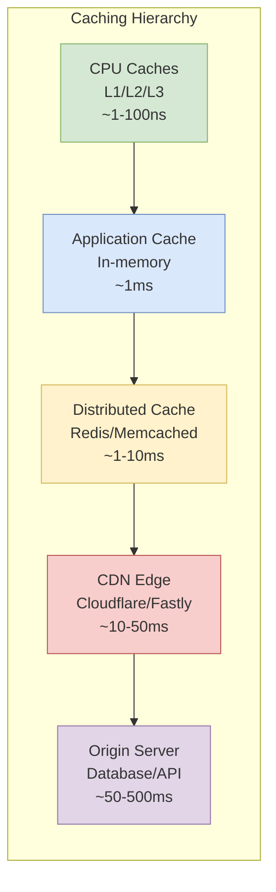

# Caching Fundamentals and Strategies

Understanding caching for distributed systems: design choices, trade-offs, and when to use each approach. From CPU cache hierarchies to globally distributed CDNs, caching exploits locality of reference to reduce latency and backend load—the same principle, applied at every layer of the stack.

<figure>



<figcaption>The caching hierarchy from CPU to origin server, showing typical latency at each layer</figcaption>

</figure>

## Abstract

Caching is the answer to a performance gap between data consumer and source—whether that's CPU vs. DRAM (nanoseconds), application vs. database (milliseconds), or client vs. origin server (hundreds of milliseconds). The solution is always the same: insert a faster, smaller storage layer closer to the consumer that exploits **locality of reference**.

**The fundamental trade-off:** Every cache introduces a consistency problem. You gain speed but must manage staleness. The design decisions are:

1. **Write policy** (how data enters the cache): Write-through for correctness, write-back for throughput, write-around to prevent pollution
2. **Invalidation strategy** (how stale data leaves): TTL for simplicity, event-driven for accuracy, probabilistic early refresh to prevent stampedes
3. **Replacement algorithm** (what to evict when full): LRU for general workloads, scan-resistant policies (2Q, ARC) for database buffers
4. **Topology** (where caches live): In-process for speed, distributed for sharing, tiered for global reach

Netflix runs 400M cache ops/sec across 22,000 servers. Salesforce sustains 1.5M RPS at sub-millisecond P50 latency. The difference between success and cache stampede is understanding these trade-offs.

## The Principle of Locality

### Why Caching Works

Caching effectiveness depends on the **principle of locality of reference**—program access patterns are predictable:

**Temporal Locality:** Recently accessed data is likely accessed again. A variable in a loop, the current user's session, the trending video—all exhibit temporal locality.

**Spatial Locality:** Data near recently accessed locations will likely be accessed soon. Sequential instruction execution, array iteration, and related database rows benefit from spatial locality.

Caches exploit both: keeping recent items in fast memory (temporal) and fetching data in contiguous blocks (spatial). As Hennessy and Patterson note in _Computer Architecture: A Quantitative Approach_, these principles enabled the automatic management of multi-level memory hierarchies proposed by Kilburn et al. in 1962.

### The Memory Hierarchy

The processor-memory gap drove cache invention. CPU operations occur in nanoseconds; DRAM access takes tens to hundreds of nanoseconds. The [IBM System/360 Model 85](https://en.wikipedia.org/wiki/IBM_System/360_Model_85) (1969) was the first commercial system with cache memory—IBM called it "high-speed buffer storage."

Modern CPUs use multi-level hierarchies:

| Level | Typical Size | Latency    | Scope                   |
| ----- | ------------ | ---------- | ----------------------- |
| L1    | 32-64 KB     | ~1 ns      | Per core, split I/D     |
| L2    | 256-512 KB   | ~3-10 ns   | Per core or shared pair |
| L3    | 8-64 MB      | ~10-40 ns  | Shared across all cores |
| DRAM  | 16-512 GB    | ~50-100 ns | System memory           |

The same pattern—faster/smaller layers closer to the consumer—applies at every level of distributed systems.

## Design Choices: Write Policies

How data enters the cache determines consistency guarantees and performance characteristics.

### Write-Through

**Mechanism:** Every write goes to both cache and backing store synchronously. The write completes only when both succeed.

**Best when:**

- Data correctness is non-negotiable (financial transactions, user credentials)
- Read-heavy workload (writes are rare, so latency penalty is acceptable)
- Simple operational model required

**Trade-offs:**

- ✅ Data never stale—cache and store always consistent
- ✅ Simple mental model, easy debugging
- ✅ No data loss on cache failure
- ❌ Write latency includes backing store (often 10-100x slower)
- ❌ Every write hits the database, limiting write throughput

**Real-world example:** Banks and payment processors use write-through for transaction records. Stripe's payment processing ensures every charge is durably stored before confirming—a cache optimization that loses a payment would be catastrophic.

### Write-Back (Write-Behind)

**Mechanism:** Writes go to cache only; data is persisted to backing store asynchronously (batched or after delay).

**Best when:**

- Write throughput is critical
- Temporary data loss is acceptable
- Writes to same keys are frequent (only final value persisted)

**Trade-offs:**

- ✅ Lowest write latency (cache speed only)
- ✅ High throughput—batching amortizes database round-trips
- ✅ Coalesces multiple writes to same key
- ❌ Data loss risk if cache fails before persistence
- ❌ Complex recovery logic required
- ❌ Eventual consistency between cache and store

**Real-world example:** Netflix uses write-back for viewing history and analytics. Losing a few view counts during a cache node failure is acceptable; blocking playback to ensure durability is not. Facebook applies similar logic to engagement counters—likes and shares use write-back with periodic flush.

### Write-Around

**Mechanism:** Writes bypass the cache entirely, going directly to the backing store. Cache is populated only on reads.

**Best when:**

- Write-heavy workloads where written data isn't immediately read
- Bulk data ingestion or ETL pipelines
- Preventing cache pollution from one-time writes

**Trade-offs:**

- ✅ Cache contains only data that's actually read
- ✅ No cache pollution from write-heavy operations
- ✅ Simple—no write path through cache
- ❌ First read after write always misses (higher read latency)
- ❌ Not suitable when writes are immediately read

**Real-world example:** Data migration jobs and batch imports use write-around. When Instagram imports a user's photo library during account creation, those photos go directly to storage—caching them would evict actually-hot content.

### Decision Matrix: Write Policies

| Factor          | Write-Through             | Write-Back                    | Write-Around     |
| --------------- | ------------------------- | ----------------------------- | ---------------- |
| Consistency     | Strong                    | Eventual                      | Strong           |
| Write latency   | High (includes DB)        | Low (cache only)              | Low (DB only)    |
| Data loss risk  | None                      | Cache failure loses data      | None             |
| Cache pollution | Can pollute               | Can pollute                   | Avoided          |
| Best fit        | Read-heavy, critical data | Write-heavy, tolerant of loss | Bulk writes, ETL |

## Design Choices: Cache Invalidation

"There are only two hard things in Computer Science: cache invalidation and naming things." — Phil Karlton

### TTL-Based Invalidation

**Mechanism:** Each cache entry has a Time-To-Live. After TTL expires, entry is either evicted or marked stale for revalidation.

**Best when:**

- Bounded staleness is acceptable
- No event system exists to signal changes
- Simple implementation required

**Implementation considerations:**

- **TTL jitter:** Add 10-20% randomness to prevent synchronized expiration
- **Stale-while-revalidate:** Serve stale content while refreshing in background

**Trade-offs:**

- ✅ Simple—no coordination with data source
- ✅ Guarantees maximum staleness
- ❌ Still serves stale data until TTL expires
- ❌ Short TTLs increase origin load; long TTLs increase staleness

**Real-world example:** CDNs rely heavily on TTL. Cloudflare's default behavior respects origin `Cache-Control: max-age` headers. For breaking news sites, this might be 60 seconds; for static assets, years.

### Event-Driven Invalidation

**Mechanism:** When source data changes, an event (message queue, pub/sub, webhook) triggers cache invalidation.

**Best when:**

- Data freshness is critical
- Change events are available from source system
- Invalidation must be immediate

**Implementation patterns:**

- **Publish on write:** Application publishes invalidation message when updating database
- **CDC-based:** Change Data Capture streams database changes to invalidation service
- **Cache tags:** Group related entries (Fastly's surrogate keys) for batch invalidation

**Trade-offs:**

- ✅ Near-immediate invalidation
- ✅ Only invalidates what changed
- ❌ Requires event infrastructure (Kafka, Redis Pub/Sub)
- ❌ Event delivery failures leave stale data
- ❌ More complex implementation

**Real-world example:** Fastly's surrogate keys enable surgical invalidation. When an e-commerce site updates one product, it purges only that product's cached pages—not the entire catalog. This reduced Shopify's cache invalidation scope by 99%+ compared to full purges.

### Probabilistic Early Refresh

**Mechanism:** Before TTL expires, each request has a small probability of triggering a background refresh. Probability increases as expiration approaches.

**Best when:**

- High traffic on cached items
- Cache stampede is a risk
- Origin can't handle synchronized refresh traffic

**The XFetch algorithm** (Vattani et al., UCSD):

```
recompute_if: random() < (time_since_compute / TTL) ^ beta
```

With `beta = 1.5`, this spreads refreshes smoothly before expiration.

**Trade-offs:**

- ✅ Eliminates cache stampede risk
- ✅ Cache stays warm—no cold misses
- ✅ Spreads origin load over time
- ❌ Slightly higher origin traffic (preemptive refreshes)
- ❌ More complex than pure TTL

**Real-world example:** Combined with TTL jitter, probabilistic refresh transforms a spike of 1,000 servers refreshing in 100ms into refreshes spread across 60+ seconds—a **60x reduction in peak origin load**. Major CDNs and Netflix use variants of this approach.

### Decision Matrix: Invalidation Strategies

| Factor         | TTL-Based               | Event-Driven           | Probabilistic Early        |
| -------------- | ----------------------- | ---------------------- | -------------------------- |
| Staleness      | Bounded by TTL          | Near-zero              | Bounded, but pre-refreshed |
| Complexity     | Low                     | High                   | Medium                     |
| Origin load    | Spiky at expiration     | Event-driven only      | Smooth                     |
| Infrastructure | None                    | Message queue required | None                       |
| Stampede risk  | High without mitigation | Low                    | Eliminated                 |

## Design Choices: Replacement Algorithms

When cache is full, which item to evict? The choice depends on workload characteristics.

### LRU (Least Recently Used)

**Mechanism:** Evict the item not accessed for the longest time. Implemented with hash map + doubly-linked list for O(1) operations.

**Best when:**

- General-purpose workloads
- Temporal locality is strong
- No sequential scan patterns

**Trade-offs:**

- ✅ Simple, well-understood
- ✅ Good hit rates for most workloads
- ❌ Vulnerable to scan pollution—one table scan evicts all hot data
- ❌ Doesn't consider access frequency

**Real-world example:** Browser caches typically use LRU. For user browsing patterns (revisiting recent pages), LRU works well. But a developer scrolling through 1000 search results pollutes the cache with one-time pages.

### LFU (Least Frequently Used)

**Mechanism:** Evict the item with fewest accesses. Track access count per item.

**Best when:**

- Long-term popularity matters more than recency
- Stable access patterns
- Cache warmup time is acceptable

**Trade-offs:**

- ✅ Retains genuinely popular items
- ✅ Scan-resistant
- ❌ New items easily evicted (low count)
- ❌ Historical pollution—formerly-popular items stick around
- ❌ Doesn't adapt to changing popularity

**Real-world example:** CDN caching of stable assets (company logos, jQuery library) benefits from LFU. These items are accessed constantly and shouldn't be evicted by a traffic spike to new content.

### 2Q (Two Queue)

**Mechanism:** Items must prove "hotness" before entering main cache. Uses three structures:

- `A1in`: Small FIFO for first-time accesses
- `A1out`: Ghost queue tracking recently evicted items
- `Am`: Main LRU for items accessed more than once

**Best when:**

- Database buffer pools
- Workloads with sequential scans mixed with random access
- Need scan resistance without complexity of ARC

**Trade-offs:**

- ✅ Excellent scan resistance
- ✅ Simple to implement (three queues)
- ✅ Low overhead compared to ARC
- ❌ Fixed ratio between queues (not adaptive)
- ❌ Cold items take longer to become hot

**Real-world example:** [PostgreSQL uses 2Q](https://arpitbhayani.me/blogs/2q-cache/) as its buffer cache algorithm. MySQL InnoDB uses a similar approach, splitting its buffer pool into young (5/8) and old (3/8) sublists. This prevents a single `SELECT *` from evicting production-critical indexes.

### ARC (Adaptive Replacement Cache)

**Mechanism:** Self-tuning policy balancing recency and frequency. Maintains four lists:

- `T1`: Recently seen once (recency)
- `T2`: Recently seen multiple times (frequency)
- `B1`, `B2`: Ghost lists tracking eviction history

The algorithm adapts the T1/T2 balance based on which ghost list sees more hits.

**Best when:**

- Workload characteristics change over time
- Can't tune cache parameters manually
- Need best-of-both LRU and LFU

**Trade-offs:**

- ✅ Adapts automatically to workload
- ✅ Combines benefits of LRU and LFU
- ✅ No manual tuning required
- ❌ Higher memory overhead (ghost lists)
- ❌ More complex implementation
- ❌ Patented by IBM (though patents expired ~2019)

**Real-world example:** ZFS uses ARC as its filesystem cache. IBM's DS8000 storage arrays use ARC for disk caching. The adaptive nature handles mixed workloads—backup jobs (scan) interleaved with production queries (random).

### Decision Matrix: Replacement Algorithms

| Factor          | LRU     | LFU               | 2Q        | ARC             |
| --------------- | ------- | ----------------- | --------- | --------------- |
| Scan resistance | Poor    | Good              | Excellent | Excellent       |
| Adaptation      | None    | None              | None      | Automatic       |
| Overhead        | Low     | Medium            | Low       | Medium          |
| Implementation  | Simple  | Medium            | Medium    | Complex         |
| Best fit        | General | Stable popularity | Databases | Mixed workloads |

## Design Choices: Distributed Cache Topology

### Consistent Hashing

The critical challenge: which node stores which key? Simple modulo hashing (`hash(key) % N`) fails when nodes change—adding one server remaps nearly every key.

**Consistent hashing** ([Karger et al., 1997](https://www.cs.princeton.edu/courses/archive/fall09/cos518/papers/chash.pdf)):

- Maps servers and keys onto a hash ring
- Keys route to first server clockwise from key's position
- Adding/removing servers affects only ~`1/N` of keys

**Virtual nodes** (100-200 per physical node) ensure even distribution. Without them, random server positions create load imbalance.

**Real-world example:** Discord uses consistent hashing with 1000 virtual nodes per physical node, achieving <5% load variance after node failures. DynamoDB and Cassandra use similar approaches.

### Redis vs Memcached

| Factor          | Redis                                                 | Memcached                     |
| --------------- | ----------------------------------------------------- | ----------------------------- |
| Data structures | Strings, lists, sets, hashes, sorted sets, streams    | Strings only                  |
| Threading       | Single-threaded commands (multi-threaded I/O in 6.0+) | Multi-threaded                |
| Clustering      | Built-in (Redis Cluster)                              | Client-side                   |
| Persistence     | RDB snapshots, AOF                                    | None                          |
| Pub/Sub         | Built-in                                              | None                          |
| Transactions    | MULTI/EXEC                                            | None                          |
| Typical ops/sec | ~100K/thread, ~500K with pipelining                   | Higher single-node throughput |

**Use Redis when:**

- Need data structures beyond key-value
- Require pub/sub, streams, or sorted sets
- Want built-in persistence and replication
- Implementing rate limiting, leaderboards, queues

**Use Memcached when:**

- Simple key-value caching only
- Maximum memory efficiency critical
- Legacy infrastructure already standardized
- Need to leverage multi-threading on many CPU cores

**Real-world example:** Salesforce migrated from Memcached to Redis at 1.5M RPS to gain data structures and pub/sub. Their P50 latency remained ~1ms, P99 ~20ms. The migration happened under live production traffic without downtime.

### In-Process vs Distributed vs Hybrid

**In-Process Cache** (e.g., Caffeine, Guava):

- ✅ Fastest (no network hop)
- ✅ No serialization overhead
- ❌ Per-instance duplication
- ❌ Lost on restart

**Distributed Cache** (e.g., Redis, Memcached):

- ✅ Shared across instances
- ✅ Survives restarts
- ❌ Network latency (~1ms)
- ❌ Serialization cost

**Hybrid** (local cache backed by distributed):

- ✅ Best latency for hot keys
- ✅ Shared for warm keys
- ❌ Two-layer invalidation complexity
- ❌ Potential inconsistency between layers

**Real-world example:** Salesforce uses hybrid caching for hot keys. At 1.5M RPS, hot keys would saturate Redis shards. Local caching with short TTL (1-5 seconds) handles bursts while Redis provides consistency.

## Real-World Examples

### Netflix EVCache: Global Cache at Scale

**Problem:** 200M+ subscribers globally need sub-10ms latency for personalization and catalog data.

**Architecture:**

- 22,000 Memcached servers across 4 regions
- 14.3 petabytes of cached data
- 400 million operations per second
- 30 million replication events globally

**Key decisions:**

1. **Eventual consistency:** Netflix tolerates stale data "as long as the difference doesn't hurt browsing or streaming experience." Strong consistency would require cross-region coordination, adding 100ms+ latency.
2. **Async replication:** Regional writes replicate asynchronously to other regions for disaster recovery.
3. **Write-back for analytics:** View counts and playback positions use write-back—losing a few data points is acceptable.

**Trade-off accepted:** During region failover, users may see slightly different recommendations. Netflix decided this was preferable to either: (a) cross-region latency on every request, or (b) unavailability during failures.

**Source:** [Netflix Global Cache Architecture - InfoQ](https://www.infoq.com/articles/netflix-global-cache/)

### Instagram: Redis Above Postgres

**Problem:** Timeline queries hitting Postgres directly couldn't scale—100ms queries needed to become 1ms.

**Architecture:**

- Redis caching layer above Postgres
- ~300 million photo-to-user-ID mappings in Redis indexes
- Separate caches for global data (replicated) vs local data (regional)

**Key insight:** Instead of caching query results, Instagram caches the **indexes** needed to construct feeds. A feed query becomes: (1) fetch follower photo IDs from Redis, (2) fetch photo metadata in parallel. This converted 100ms SQL queries into 1ms cache hits.

**Source:** [Instagram Database Scaling](https://medium.com/@mamidipaka2003/inside-high-traffic-databases-how-instagram-scales-postgresql-beyond-limits-0a4af13696ff)

### Facebook: Gutter Servers for Resilience

**Problem:** When a Memcached server fails, the thundering herd of cache misses can cascade to database failure.

**Solution: Gutter pool**

- ~1% of Memcached servers designated as "gutter"
- When primary server fails, clients fall back to gutter
- Gutter entries have short TTL (seconds, not minutes)
- Prevents stampede while failed server is replaced

**Trade-off:** Gutter servers see unpredictable load during failures. Facebook over-provisions them to handle any server's traffic.

**Source:** [Scaling Memcache at Facebook - USENIX NSDI 2013](https://www.usenix.org/system/files/conference/nsdi13/nsdi13-final170_update.pdf)

## Common Pitfalls

### 1. Cache Stampede (Thundering Herd)

**The mistake:** Popular cached item expires. Before one request can repopulate it, thousands of concurrent requests find cache empty and all hit the database.

**Why it happens:** Under high concurrency, the window between cache miss and repopulation is enough for many requests to "pile up."

**The consequence:** Database receives 1000x normal load in seconds. Latency spikes, timeouts cascade, and the system can enter a failure spiral where cache never repopulates because database is too slow.

**Concrete example:** "Assume the page takes 3 seconds to render and traffic is 10 requests per second. When cache expires, 30 processes simultaneously recompute the rendering."

**The fix:**

1. **Distributed locking:** Only one request fetches from DB; others wait on lock
2. **Request coalescing (singleflight):** Deduplicate in-flight requests to same key
3. **Probabilistic early refresh:** Refresh before expiration with increasing probability
4. **Stale-while-revalidate:** Serve stale content while one request refreshes

**Example:** Twitter, Reddit, and Instagram have all documented stampede incidents. Probabilistic early refresh with TTL jitter reduces peak load by 60x.

### 2. Hot Key Saturation

**The mistake:** One extremely popular key receives disproportionate traffic, overloading the single shard/server that owns it.

**Why it happens:** Consistent hashing assigns one key to one primary server. A viral tweet, flash sale item, or breaking news article can receive millions of requests.

**The consequence:** One shard saturates while others idle. P99 latency spikes for all requests routed to that shard.

**The fix:**

1. **Key sharding:** Split `counter:item123` into `counter:item123:0` through `counter:item123:N`, aggregate on read
2. **Local caching:** In-process cache with 1-5 second TTL absorbs bursts
3. **Read replicas:** Multiple replicas of hot shard
4. **Proactive detection:** Monitor key access distribution, identify hot keys before they cause problems

**Example:** Salesforce built hot-key detection into their Memcached layer before migrating to Redis. This identified potential hot keys early, allowing mitigation before production impact.

### 3. Cache Pollution

**The mistake:** Caching data that won't be accessed again, evicting actually-useful entries.

**Why it happens:**

- Bulk operations (reports, exports) cache one-time data
- Sequential scans (full table scan) evict random-access hot data
- Write-through caches every write, even write-only data

**The consequence:** Hit ratio drops dramatically. Hot data constantly evicted and re-fetched.

**The fix:**

1. **Scan-resistant algorithms:** 2Q, ARC filter one-time accesses
2. **Write-around:** Bulk operations bypass cache
3. **Separate cache pools:** Analytics queries use different cache than production
4. **Cache admission policy:** Don't cache items below size/frequency threshold

**Example:** MySQL InnoDB's buffer pool uses a young/old sublist specifically to prevent `SELECT *` queries from evicting hot indexes.

### 4. Inconsistency Window Blindness

**The mistake:** Assuming cache is always consistent with source, leading to bugs when it isn't.

**Why it happens:** TTL-based invalidation means data is stale until TTL expires. Event-driven invalidation has delivery delay. Write-back has persistence delay.

**The consequence:** Users see outdated data, or worse, make decisions based on stale state. Example: user changes password, old session token still works because session cache hasn't invalidated.

**The fix:**

1. **Design for staleness:** Document maximum staleness per cache, design UX accordingly
2. **Version/generation keys:** Include version in cache key; change key on update
3. **Read-your-writes consistency:** After write, bypass cache for that user temporarily
4. **Critical path bypass:** Security-critical data reads bypass cache entirely

**Example:** Netflix explicitly documents which data tolerates eventual consistency. User authentication uses strong consistency (database query); recommendation scores tolerate minutes of staleness.

## How to Choose

### Questions to Ask

1. **What's the consistency requirement?**
   - User-facing, mutable data? Shorter TTL, consider event-driven
   - Analytics, recommendations? Longer TTL, eventual consistency acceptable

2. **What's the access pattern?**
   - Read-heavy with occasional writes? Write-through or write-around
   - Write-heavy with immediate reads? Write-through
   - Write-heavy, reads delayed? Write-back

3. **What's the traffic pattern?**
   - Uniform? Simple hashing works
   - Hot keys likely? Plan for local caching, sharding
   - Spiky? Probabilistic refresh, over-provision

4. **What's the failure mode?**
   - Cache down = degraded performance? Standard
   - Cache down = system down? Replication, gutter servers

### Scale Thresholds

| Ops/sec    | Recommendation                                     |
| ---------- | -------------------------------------------------- |
| < 10K      | Single Redis node may suffice                      |
| 10K - 100K | Redis replication + connection pooling             |
| 100K - 1M  | Redis Cluster, or Memcached fleet                  |
| > 1M       | Multi-tier (local + distributed), custom solutions |

### Common Patterns by Use Case

| Use Case            | Write Policy  | Invalidation                 | Topology          |
| ------------------- | ------------- | ---------------------------- | ----------------- |
| Session storage     | Write-through | TTL (session length)         | Distributed       |
| Product catalog     | Write-around  | Event + TTL                  | CDN + distributed |
| View counters       | Write-back    | None (append-only)           | Distributed       |
| User authentication | Bypass cache  | -                            | Database only     |
| API responses       | Read-only     | TTL + stale-while-revalidate | CDN edge          |

## Conclusion

Caching is a fundamental pattern for managing the performance gap between data consumers and sources. The trade-off is always the same: speed versus consistency. Every design decision—write policy, invalidation strategy, replacement algorithm, topology—is a point on that spectrum.

The key insights:

1. **No single strategy fits all:** Netflix uses eventual consistency for recommendations but strong consistency for authentication
2. **Failure modes matter:** Design for what happens when cache is unavailable, inconsistent, or under stampede
3. **Measure and adapt:** Hit ratio, P99 latency, and origin load tell you whether your caching strategy is working
4. **Start simple, evolve:** TTL-based invalidation with LRU replacement handles most workloads; add complexity only when measurements justify it

## Appendix

### Prerequisites

- Basic understanding of distributed systems concepts
- Familiarity with key-value stores and hash tables
- Understanding of consistency models (strong, eventual)

### Summary

- **Caching exploits locality:** Temporal (recent data reused) and spatial (nearby data accessed together)
- **Write policies trade consistency for speed:** Write-through (consistent, slow), write-back (fast, eventual), write-around (prevents pollution)
- **Invalidation is the hard problem:** TTL for simplicity, events for accuracy, probabilistic refresh to prevent stampedes
- **Replacement algorithms match workloads:** LRU for general use, 2Q/ARC for database buffers with scan resistance
- **Scale requires topology decisions:** In-process for latency, distributed for sharing, hybrid for hot keys

### Terminology

- **Cache Hit Ratio:** Percentage of requests served from cache vs. total requests
- **TTL (Time-To-Live):** Duration a cached entry is considered fresh
- **Cache Stampede:** Burst of simultaneous cache misses overwhelming the origin
- **Hot Key:** Single cache key receiving disproportionate traffic
- **Scan Pollution:** Sequential access patterns evicting random-access hot data
- **Consistent Hashing:** Key distribution algorithm that minimizes remapping when nodes change

### References

#### Foundational Papers

- [Consistent Hashing and Random Trees - Karger et al., 1997](https://www.cs.princeton.edu/courses/archive/fall09/cos518/papers/chash.pdf) - Original consistent hashing paper from MIT
- [ARC: A Self-Tuning, Low Overhead Replacement Cache - FAST 2003](https://www.usenix.org/conference/fast-03/arc-self-tuning-low-overhead-replacement-cache) - IBM's adaptive replacement cache algorithm
- [LIRS: Low Inter-reference Recency Set - SIGMETRICS 2002](https://dl.acm.org/doi/10.1145/511399.511340) - Scan-resistant cache replacement policy
- [The LRU-K Page Replacement Algorithm - O'Neil et al.](https://www.cs.cmu.edu/~natassa/courses/15-721/papers/p297-o_neil.pdf) - Database disk buffering and scan pollution analysis
- [Optimal Probabilistic Cache Stampede Prevention - Vattani et al., UCSD](https://cseweb.ucsd.edu/~avattani/papers/cache_stampede.pdf) - XFetch algorithm for early refresh

#### Industry Engineering Blogs

- [Netflix Global Cache Architecture - InfoQ](https://www.infoq.com/articles/netflix-global-cache/) - EVCache at 400M ops/sec
- [Scaling Memcache at Facebook - USENIX NSDI 2013](https://www.usenix.org/system/files/conference/nsdi13/nsdi13-final170_update.pdf) - Facebook's Memcached architecture
- [Salesforce: Redis Migration at 1.5M RPS](https://engineering.salesforce.com/migration-at-scale-moving-marketing-cloud-caching-from-memcached-to-redis-at-1-5m-rps-without-downtime/) - Live migration without downtime
- [Discord: How We Store Trillions of Messages](https://discord.com/blog/how-discord-stores-trillions-of-messages) - Message storage evolution
- [Netflix EVCache Announcement](https://netflixtechblog.com/announcing-evcache-distributed-in-memory-datastore-for-cloud-c26a698c27f7) - Original EVCache design

#### Official Documentation

- [Redis Documentation](https://redis.io/documentation) - In-memory data structure store
- [Redis vs Memcached Comparison](https://redis.io/compare/memcached/) - Official comparison
- [Memcached Wiki](https://memcached.org/) - Distributed memory caching system
- [HTTP Caching - MDN Web Docs](https://developer.mozilla.org/en-US/docs/Web/HTTP/Caching) - HTTP caching tutorial
- [Cache-Control Header - MDN](https://developer.mozilla.org/en-US/docs/Web/HTTP/Headers/Cache-Control) - HTTP header reference

#### Implementation References

- [PostgreSQL 2Q Cache](https://arpitbhayani.me/blogs/2q-cache/) - PostgreSQL's buffer cache algorithm
- [MySQL InnoDB Buffer Pool](https://dev.mysql.com/doc/refman/8.0/en/innodb-buffer-pool.html) - MySQL's scan-resistant LRU
- [Cloudflare Cache Documentation](https://developers.cloudflare.com/cache/) - CDN caching features

#### Historical Context

- [IBM System/360 Model 85 - Wikipedia](https://en.wikipedia.org/wiki/IBM_System/360_Model_85) - First commercial computer with cache memory
- [Bélády's Anomaly - Wikipedia](https://en.wikipedia.org/wiki/B%C3%A9l%C3%A1dy's_anomaly) - FIFO cache anomaly explanation
