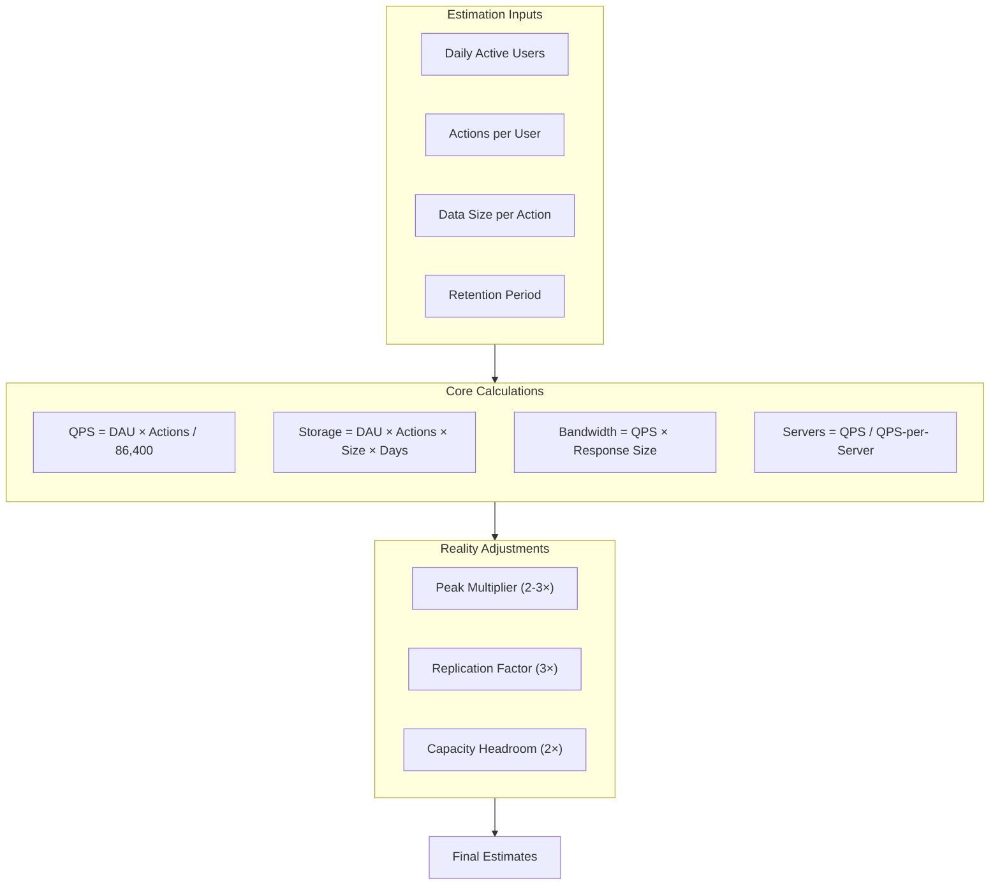

# Capacity Planning and Back-of-the-Envelope Estimates

Capacity planning validates architectural decisions before writing code. This article covers the mental models, reference numbers, and calculation techniques that let you estimate QPS, storage, bandwidth, and server counts—transforming vague "we need to handle millions of users" into concrete infrastructure requirements.

<figure>



<figcaption>Capacity estimation flows from user-level assumptions through calculations to reality-adjusted numbers. Every estimate requires explicit assumptions about peak traffic, replication, and safety margins.</figcaption>
</figure>

## Abstract

Back-of-the-envelope estimates are fast, approximate calculations that validate whether a design is feasible before investing engineering effort. The goal isn't precision—it's catching order-of-magnitude errors.

**The fundamental insight:** Most capacity estimation reduces to two patterns:

1. **Rate estimation:** `Daily volume / 86,400 seconds = Average QPS`, then multiply by peak factor
2. **Storage estimation:** `Users × Actions × Size × Duration`, then multiply by replication factor

**Why "1 million = ~10 per second" matters:** 1 million requests per day equals approximately 12 requests per second (1M / 86,400 ≈ 11.6). This single conversion dominates capacity planning. 100 million DAU with 10 actions per user is 1 billion actions per day, or roughly 12,000 QPS average.

**The three numbers that drive most designs:**

- **QPS** determines server count and database architecture
- **Storage growth rate** determines when you need to shard and how much to provision
- **Bandwidth** determines CDN strategy and network costs

**Critical adjustment factors:**

- Peak traffic is 2-10× average (social apps spike during events)
- Data is replicated 3× for durability
- Plan for 2× your expected peak (N+2 redundancy per Google SRE)
- The 80/20 rule: 20% of data generates 80% of traffic (cache this)

## Reference Numbers Every Engineer Should Know

These numbers form the foundation of capacity estimates. Memorize them—or keep this article bookmarked.

### Powers of Two

| Power | Value            | Approximation  | Common Name |
| ----- | ---------------- | -------------- | ----------- |
| 2¹⁰   | 1,024            | ~1 thousand    | 1 KB        |
| 2²⁰   | 1,048,576        | ~1 million     | 1 MB        |
| 2³⁰   | 1,073,741,824    | ~1 billion     | 1 GB        |
| 2⁴⁰   | ~1.1 trillion    | ~1 trillion    | 1 TB        |
| 2⁵⁰   | ~1.1 quadrillion | ~1 quadrillion | 1 PB        |

**Practical shortcuts:**

- 1 KB ≈ 1,000 bytes (use 1,024 when precision matters)
- 1 MB ≈ 1,000 KB ≈ 1 million bytes
- 1 GB ≈ 1,000 MB ≈ 1 billion bytes
- 1 TB ≈ 1,000 GB ≈ 1 trillion bytes

### Latency Numbers (Jeff Dean's List, Updated)

| Operation                           | Latency   | Orders of Magnitude      |
| ----------------------------------- | --------- | ------------------------ |
| L1 cache reference                  | 0.5 ns    |                          |
| Branch mispredict                   | 5 ns      |                          |
| L2 cache reference                  | 7 ns      |                          |
| Mutex lock/unlock                   | 100 ns    |                          |
| Main memory reference               | 100 ns    |                          |
| Compress 1 KB with Snappy           | 10 μs     | 10,000 ns                |
| Send 1 KB over 1 Gbps network       | 10 μs     | 10,000 ns                |
| SSD random read                     | 16-150 μs | Varies by SSD generation |
| Read 1 MB sequentially from memory  | 250 μs    | 0.25 ms                  |
| Datacenter round trip               | 500 μs    | 0.5 ms                   |
| Disk seek                           | 10 ms     | 10,000 μs                |
| Read 1 MB sequentially from network | 10 ms     |                          |
| Read 1 MB sequentially from disk    | 30 ms     |                          |
| Send packet CA → Netherlands → CA   | 150 ms    |                          |

**Key takeaways:**

- Memory is 100× faster than SSD, 10,000× faster than disk seek
- Network round trips within a datacenter (~0.5 ms) dominate in-memory operations
- Cross-continent latency (~150 ms) is unavoidable without edge caching

### Time Conversions for Capacity Planning

| Period   | Seconds      | Useful For                    |
| -------- | ------------ | ----------------------------- |
| 1 minute | 60           |                               |
| 1 hour   | 3,600        |                               |
| 1 day    | 86,400       | Daily → per-second conversion |
| 1 month  | 2.6 million  | Monthly quotas                |
| 1 year   | 31.5 million | Annual storage growth         |

**The 86,400 rule:** To convert daily volume to QPS, divide by ~100,000 (actually 86,400). For mental math, dividing by 100,000 gives a close-enough estimate: 1 billion daily requests ≈ 10,000 QPS.

### Availability and Downtime

| Availability         | Downtime/Year | Downtime/Month | Downtime/Day |
| -------------------- | ------------- | -------------- | ------------ |
| 99% (two nines)      | 3.65 days     | 7.3 hours      | 14.4 minutes |
| 99.9% (three nines)  | 8.76 hours    | 43.8 minutes   | 1.44 minutes |
| 99.99% (four nines)  | 52.6 minutes  | 4.38 minutes   | 8.64 seconds |
| 99.999% (five nines) | 5.26 minutes  | 26.3 seconds   | 0.86 seconds |

**The exponential cost of nines:** Going from 99.9% to 99.95% is 2× improvement. Going from 99.95% to 99.99% is 5× improvement. Each additional nine roughly 10× the engineering investment.

### Single-Server Benchmarks

| Component           | Typical Capacity   | Notes                                      |
| ------------------- | ------------------ | ------------------------------------------ |
| Web server (NGINX)  | 10,000-100,000 QPS | Static content, keep-alive enabled         |
| Application server  | 1,000-10,000 QPS   | Depends on request complexity              |
| MySQL (read-heavy)  | 10,000-50,000 QPS  | Simple queries, indexed lookups            |
| MySQL (write-heavy) | 1,000-10,000 QPS   | Depends on durability settings             |
| Redis               | 100,000+ QPS       | In-memory, simple operations               |
| PostgreSQL          | 10,000-30,000 QPS  | Varies significantly with query complexity |

**Caveat:** These are rough benchmarks. Your mileage will vary dramatically based on query complexity, data size, hardware, and configuration. Always load test your specific workload.

### Network Bandwidth

| Medium              | Bandwidth         | Time to Transfer 1 GB |
| ------------------- | ----------------- | --------------------- |
| 1 Gbps Ethernet     | 125 MB/s          | 8 seconds             |
| 10 Gbps Ethernet    | 1.25 GB/s         | 0.8 seconds           |
| 100 Gbps Ethernet   | 12.5 GB/s         | 0.08 seconds          |
| SSD sequential read | 500 MB/s - 7 GB/s | 0.14-2 seconds        |
| HDD sequential read | 100-200 MB/s      | 5-10 seconds          |

## Core Estimation Techniques

### QPS (Queries Per Second) Estimation

**Formula:**

```
Average QPS = (Daily Active Users × Actions per User) / 86,400
Peak QPS = Average QPS × Peak Multiplier
```

**Example: Social media feed service**

Assumptions:

- 500 million DAU
- Each user refreshes feed 10 times/day
- Peak traffic is 3× average

```
Daily requests = 500M × 10 = 5 billion
Average QPS = 5B / 86,400 ≈ 58,000 QPS
Peak QPS = 58,000 × 3 ≈ 174,000 QPS
```

**Read vs. Write ratio matters:** Most systems are read-heavy (10:1 to 100:1 read:write). Separate these:

```
Read QPS = 174,000 × 0.9 ≈ 157,000
Write QPS = 174,000 × 0.1 ≈ 17,400
```

This distinction drives architecture: reads can be scaled with replicas and caching; writes require careful partitioning.

### Storage Estimation

**Formula:**

```
Daily Storage = Users × Actions × Average Size
Annual Storage = Daily Storage × 365 × Replication Factor
```

**Example: Photo sharing service**

Assumptions:

- 500 million users
- 2 photos uploaded per day per user (10% of users active)
- Average photo size: 2 MB
- Replication factor: 3

```
Daily uploads = 500M × 0.1 × 2 = 100 million photos
Daily storage = 100M × 2 MB = 200 TB/day
Annual storage = 200 TB × 365 × 3 = 219 PB/year
```

**Include metadata:** Photos have thumbnails, EXIF data, and database records. Add 10-20% overhead.

### Bandwidth Estimation

**Formula:**

```
Ingress Bandwidth = Write QPS × Request Size
Egress Bandwidth = Read QPS × Response Size
```

**Example: Video streaming service**

Assumptions:

- 10 million concurrent viewers
- Average bitrate: 3 Mbps

```
Egress Bandwidth = 10M × 3 Mbps = 30 Tbps
```

This is why Netflix runs their own CDN (Open Connect) and peers directly with ISPs—30 Tbps cannot traverse the public internet cost-effectively.

### Server Count Estimation

**Formula:**

```
Servers Needed = Peak QPS / QPS-per-Server × Redundancy Factor
```

**Example: API service**

Assumptions:

- Peak QPS: 100,000
- Each server handles 5,000 QPS (application logic complexity)
- N+2 redundancy (can lose 2 servers at peak)

```
Minimum servers = 100,000 / 5,000 = 20
With N+2 redundancy = 20 + 2 = 22 servers
```

**Google SRE's N+2 rule:** Provision to handle simultaneous planned and unplanned outages. If you need N servers at peak, run N+2.

### Little's Law for Concurrency

**Formula:**

```
L = λ × W

L = Average number of items in system (concurrent requests)
λ = Arrival rate (requests per second)
W = Average time in system (latency)
```

**Example: Database connection pool sizing**

Assumptions:

- 10,000 QPS to database
- Average query time: 5 ms

```
Concurrent connections = 10,000 × 0.005 = 50 connections
```

With safety margin (2×): 100 connections per application server. If you have 10 application servers, each needs a pool of ~10 connections, totaling 100 to the database.

## Worked Examples

### Example 1: Twitter-like Service

**Requirements:**

- 500 million monthly active users
- 50 million DAU
- Users post 2 tweets/day, read 100 tweets/day
- Average tweet: 500 bytes (including metadata)
- 20% of tweets include media (average 200 KB)

**QPS Calculation:**

```
Write (tweets posted):
  Daily: 50M × 2 = 100M tweets
  Average: 100M / 86,400 ≈ 1,157 QPS
  Peak (3×): ~3,500 QPS

Read (timeline loads):
  Daily: 50M × 100 = 5B read requests
  Average: 5B / 86,400 ≈ 58,000 QPS
  Peak (3×): ~174,000 QPS

Read:Write ratio ≈ 50:1
```

**Storage Calculation:**

```
Tweet text per day:
  100M × 500 bytes = 50 GB/day

Media per day:
  100M × 0.2 × 200 KB = 4 TB/day

Annual (with 3× replication):
  Text: 50 GB × 365 × 3 = 55 TB/year
  Media: 4 TB × 365 × 3 = 4.4 PB/year
```

**Bandwidth Calculation:**

```
Ingress (uploads):
  Media: 4 TB/day = 370 Mbps average
  Peak: ~1.1 Gbps

Egress (reads):
  Assuming 10% of reads include media:
  Text: 174,000 × 500 bytes = 87 MB/s
  Media: 17,400 × 200 KB = 3.5 GB/s
  Total peak: ~28 Gbps
```

### Example 2: URL Shortener

**Requirements:**

- 100 million new URLs per month
- Read:Write ratio of 100:1
- URLs stored for 5 years

**QPS Calculation:**

```
Write QPS:
  100M / (30 × 86,400) ≈ 39 QPS average
  Peak (3×): ~120 QPS

Read QPS:
  39 × 100 = 3,900 QPS average
  Peak (3×): ~12,000 QPS
```

**Storage Calculation:**

```
URL entry: ~500 bytes (short code + long URL + metadata)
Per month: 100M × 500 bytes = 50 GB
5 years: 50 GB × 60 months × 3 (replication) = 9 TB total
```

**Key insight:** This is a small-scale system. A single well-provisioned PostgreSQL instance can handle this indefinitely. The main challenge is key generation (ensuring short codes don't collide), not capacity.

### Example 3: Video Streaming Platform

**Requirements:**

- 200 million monthly active users
- 100 million daily active users
- Average watch time: 60 minutes/day
- Average bitrate: 4 Mbps
- 500,000 videos uploaded per day
- Average video length: 5 minutes

**Concurrent Viewers (Peak):**

```
At any moment, assume 20% of DAU is watching:
  100M × 0.2 = 20 million concurrent viewers

Peak (major event): 2× = 40 million concurrent
```

**Bandwidth Calculation:**

```
Egress: 40M × 4 Mbps = 160 Tbps

This is why CDNs exist. Netflix's Open Connect serves
>95% of traffic from edge caches embedded in ISPs.
```

**Storage Calculation:**

```
Raw upload per day:
  500K videos × 5 min × 4 Mbps = 750 TB/day raw

Transcoded (10 quality levels):
  750 TB × 10 = 7.5 PB/day

Annual: 7.5 PB × 365 = 2.7 EB/year

Note: This assumes no deduplication. In practice,
aggressive deduplication and hot/cold tiering reduce this significantly.
```

## Design Choices: When Estimates Drive Architecture

### Single Server vs. Distributed

| Factor                   | Single Server Threshold | When to Distribute         |
| ------------------------ | ----------------------- | -------------------------- |
| QPS                      | < 10,000                | > 10,000 (add replicas)    |
| Storage                  | < 1 TB                  | > 1 TB (consider sharding) |
| Write QPS                | < 5,000                 | > 5,000 (shard writes)     |
| Availability requirement | < 99.9%                 | > 99.9% (add redundancy)   |

**Real-world example:** WhatsApp handled 2+ million connections per server using Erlang on FreeBSD. The C10K problem (handling 10,000 concurrent connections) was solved decades ago; modern event-driven servers handle millions.

### Caching Strategy from Estimates

**The 80/20 heuristic:** If 20% of your data serves 80% of requests, cache that 20%.

```
Cache size = Hot data × Working set
           = Total data × 0.2 × Replication in cache

Example: 10 TB database, cache size = 10 TB × 0.2 = 2 TB
```

**Cache hit rate impact:**

```
With 80% cache hit rate:
  Database QPS = Total QPS × 0.2 = 20% of original load

Going from 0% → 80% cache hit rate gives 5× database headroom.
```

### Sharding Trigger Points

| Signal               | Threshold          | Action                     |
| -------------------- | ------------------ | -------------------------- |
| Single table size    | > 100 million rows | Consider partitioning      |
| Single database size | > 1 TB             | Consider sharding          |
| Write QPS            | > 5,000            | Shard by write key         |
| Replication lag      | > 1 second         | Shard to reduce write load |

**Sharding multiplies complexity.** Delay it until estimates prove it's necessary. Instagram ran on PostgreSQL for years with careful indexing before sharding.

## Common Pitfalls

### 1. Forgetting Peak Traffic

**The mistake:** Designing for average traffic.

**Why it happens:** Averages are easier to calculate and seem reasonable.

**The consequence:** System falls over during peak hours, product launches, or viral events. Twitter's "Fail Whale" was a capacity planning failure.

**The fix:** Always multiply average by peak factor (2-3× for normal systems, 10×+ for event-driven traffic). Design for peak, not average.

### 2. Ignoring Replication and Redundancy

**The mistake:** Estimating raw storage without replication.

**Why it happens:** Replication feels like "overhead" rather than a requirement.

**The consequence:** You provision 1/3 of needed storage. Or you discover at failure time that you have no redundancy.

**The fix:** Multiply storage by replication factor (typically 3). Add N+2 to server counts.

### 3. Conflating Throughput and Latency

**The mistake:** Assuming high throughput means low latency.

**Why it happens:** They feel related—faster systems handle more requests.

**The consequence:** A system might handle 100,000 QPS but with 500ms latency. Users experience poor performance despite "high capacity."

**The fix:** Estimate both independently. Use Little's Law: if you need 100 ms latency at 10,000 QPS, you need capacity for 1,000 concurrent requests.

### 4. Linear Extrapolation of Growth

**The mistake:** Assuming traffic will grow linearly.

**Why it happens:** Linear projections are simple.

**The consequence:** Exponential growth (common in successful products) exhausts capacity faster than expected.

**The fix:** Model growth curves explicitly. For successful products, expect 2-3× year-over-year growth. Include "hockey stick" scenarios for viral features.

### 5. Precision Theater

**The mistake:** Calculating estimates to 4 significant figures.

**Why it happens:** More precision feels more accurate.

**The consequence:** False confidence. Back-of-envelope estimates are accurate to perhaps 2-5×. Claiming "we need exactly 147 servers" implies false precision.

**The fix:** Round aggressively. Use powers of 10. "We need 100-200 servers" is more honest than "147 servers."

## Communicating Estimates

### Document Assumptions

Every estimate requires explicit assumptions. Without them, numbers are meaningless.

**Template:**

```markdown
## Capacity Estimate: [System Name]

### Assumptions

- DAU: 50 million
- Actions per user per day: 10
- Average request size: 2 KB
- Average response size: 10 KB
- Peak multiplier: 3×
- Read:Write ratio: 10:1
- Replication factor: 3

### Derived Estimates

- Average QPS: [calculation]
- Peak QPS: [calculation]
- Storage/year: [calculation]
- Bandwidth: [calculation]

### Confidence Level

- High confidence: [which estimates]
- Medium confidence: [which estimates]
- Requires validation: [which estimates]
```

### Present Ranges, Not Points

Good: "We need 50-100 servers to handle peak load."
Bad: "We need 73 servers."

Ranges communicate uncertainty honestly. Point estimates imply false confidence.

### Update Estimates with Reality

Estimates are hypotheses. Validate with:

- Load testing before launch
- Production metrics after launch
- Regular capacity reviews (quarterly at minimum)

When estimates diverge from reality by >2×, investigate why. Either the assumptions changed or the model is wrong.

## Conclusion

Capacity planning is hypothesis generation. You're making educated guesses about future load, then validating those guesses with progressively more accurate data.

The core technique is simple: convert user-level assumptions (DAU, actions, data sizes) into system-level metrics (QPS, storage, bandwidth, server count). Apply reality adjustments (peak multipliers, replication factors, redundancy). Document assumptions so others can validate your reasoning.

The numbers in this article are starting points. Every system is different. A URL shortener and a video platform have radically different capacity profiles even at the same user count. The skill is knowing which numbers matter for your specific system and how to derive them from first principles.

Start with rough estimates. Refine with load testing. Validate with production metrics. Update continuously as the system evolves.

## Appendix

### Prerequisites

- Basic arithmetic and comfort with powers of two
- Understanding of distributed system components (databases, caches, load balancers)
- Familiarity with read/write patterns in web applications

### Terminology

- **QPS (Queries Per Second):** Request rate metric; used interchangeably with RPS (Requests Per Second) for API contexts
- **DAU (Daily Active Users):** Users who interact with the system at least once per day
- **MAU (Monthly Active Users):** Users who interact at least once per month; typically 2-3× DAU
- **Peak multiplier:** Ratio of peak traffic to average traffic
- **Replication factor:** Number of copies of data stored for durability (typically 3)
- **N+2 redundancy:** Provisioning N servers plus 2 spares to handle simultaneous failures
- **Little's Law:** L = λW; relates concurrent items in a system to arrival rate and processing time

### Summary

- Convert daily volumes to QPS using the 86,400 rule (or approximate with 100,000)
- Memorize Jeff Dean's latency numbers—memory vs. disk vs. network shapes every design
- Always apply peak multipliers (2-3×) and replication factors (3×)
- Use Little's Law for connection pool and concurrency estimation
- Round aggressively—back-of-envelope estimates are accurate to 2-5×
- Document assumptions explicitly; estimates without assumptions are meaningless
- Validate estimates with load testing before launch and production metrics after

### References

- [Google SRE Book: Capacity Planning](https://sre.google/sre-book/service-best-practices/) - N+2 redundancy, demand forecasting
- [Google SRE: Best Practices for Capacity Management (PDF)](https://sre.google/static/pdf/login_winter20_10_torres.pdf) - Intent-based capacity planning
- [Latency Numbers Every Programmer Should Know (Interactive)](https://colin-scott.github.io/personal_website/research/interactive_latency.html) - Updated Jeff Dean numbers
- [Jeff Dean's Original Numbers](https://brenocon.com/dean_perf.html) - "Numbers Everyone Should Know" talk
- [Little's Law Applied to Web Applications](https://blog.danslimmon.com/2022/06/07/using-littles-law-to-scale-applications/) - Practical application for capacity planning
- [ByteByteGo: Back-of-the-Envelope Estimation](https://bytebytego.com/courses/system-design-interview/back-of-the-envelope-estimation) - System design interview context
- [C10K Problem (Wikipedia)](https://en.wikipedia.org/wiki/C10k_problem) - Historical context on connection handling
- [The Secret to 10 Million Concurrent Connections](http://highscalability.com/blog/2013/5/13/the-secret-to-10-million-concurrent-connections-the-kernel-i.html) - C10M problem and solutions
- [Uptime Calculator](https://uptime.is/) - Availability nines to downtime conversion
- [PlanetScale: One Million QPS with MySQL](https://planetscale.com/blog/one-million-queries-per-second-with-mysql) - Database throughput benchmarks
